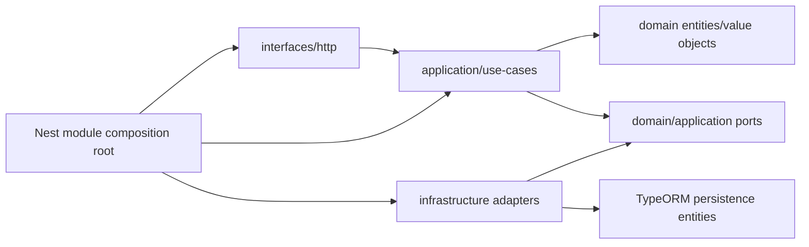

# ExecPlan — Chuẩn hóa base modular monolith theo DDD

> **Status:** Completed  
> **Owner:** Codex / Engineering  
> **Created:** 2026-07-11  
> **Updated:** 2026-07-11  
> **Approval:** Người dùng/Product Owner yêu cầu trực tiếp refactor base thành dự án dài hạn

## 1. Mục tiêu và kết quả người dùng

Identity & Access trở thành bounded context mẫu cho các module sau: domain thuần không phụ thuộc NestJS/TypeORM; application điều phối use case qua ports; infrastructure chứa adapter TypeORM/JWT/Argon2; interfaces chứa HTTP DTO/controller/guard. Migration dùng TypeORM CLI qua `npm run migration:run`, có generate/create/revert/show và Docker gọi script npm production tương ứng. UI dùng font Windows hỗ trợ tiếng Việt.

## 2. Nguồn và requirement IDs

- Baseline: `docs/Đề xuất tính năng nền tảng Solar và BESS.md`
- Requirements: `BR-033`, `BR-040`, `FR-146…FR-155`, `SEC-101…SEC-118`
- Use case/story/workflow: `UC-020`, `US-020`, `WF-026`
- Acceptance/tests: `AC-174…177`, `TEST-200`, `TEST-230…233`
- ADR/API/Data: `ADR-001`, `ADR-004`, `API-001`, `API-137…139`, `DB-001`, `DB-005`, `DB-098…100`

## 3. Hiện trạng repository

- Base đang chạy và test đạt, nhưng `apps/api/src/auth/auth.service.ts` truy cập TypeORM entity/DataSource trực tiếp và gộp application/domain/infrastructure.
- TypeORM entity đặt ở `src/entities`, migration/runner ở `src/db`; domain model chỉ tồn tại trong tài liệu.
- Root có alias `db:migrate`, API script dùng custom `ts-node src/db/migrate.ts`, chưa dùng TypeORM CLI chuẩn.
- Front dùng Georgia cho heading và system stack không ưu tiên Calibri/Segoe UI.

## 4. Phạm vi

### In scope

- Refactor module Identity & Access theo DDD/layer dependency rule.
- Tách domain entities/value objects/repository-security ports khỏi persistence entities.
- Chuẩn hóa TypeORM data source, migrations và npm commands local/production.
- Giữ nguyên API, schema hiện hữu và dữ liệu test deployment.
- Unit test domain, integration/E2E regression, migration up/down/up và redeploy.
- Chuyển font sang Calibri/Segoe UI/Arial.

### Out of scope

- Thêm module nghiệp vụ mới, event bus/outbox, Redis hoặc đổi schema nghiệp vụ.
- SSO/MFA, HTTPS, production deployment hoặc microservices.
- Tách toàn bộ shared kernel tương lai khi chưa có bounded context thứ hai.

## 5. Assumption, TBD và Open Question

| Loại | Nội dung | Owner | Điều kiện đóng | Tác động |
|---|---|---|---|---|
| Assumption | Identity & Access là reference module cho module mới | Architecture/Engineering | Review sau refactor | Không chặn |
| Assumption | Schema hiện tại được giữ nguyên; chỉ đổi code organization | Data/Engineering | Migration show/up/down xác nhận | Không migration dữ liệu mới |
| TBD | Domain event/outbox base abstraction | Architecture | Khi có use case async đầu tiên | Không dựng abstraction sớm |
| TBD | Shared authorization policy kernel giữa module | Security/Architecture | Khi module thứ hai dùng permission | AuthN refactor không bị chặn |

## 6. Thiết kế và luồng dữ liệu

Dependency rule: domain không import NestJS, TypeORM, Express, JWT hoặc Argon2. Application chỉ import domain/ports và framework exception mapping nằm ở HTTP interface. TypeORM entity không được dùng như domain entity.

## 7. API, dữ liệu và bảo mật

- API-001/137…139 giữ path/payload/status.
- DB-001/005/098…100 giữ bảng/constraint; migration file chuyển vị trí nhưng timestamp/class không đổi.
- JWT/Argon2/refresh rotation/replay revoke/tenant validation không đổi.
- PM Web vẫn không có route/credential điều khiển OT.

## 8. Ma trận truy vết thực thi

| Requirement/ADR | Milestone | Component | Acceptance/Test | Trạng thái |
|---|---|---|---|---|
| ADR-001/FR-147 | M1–M2 | identity-access layers | TEST-230…233 | Completed |
| ADR-004/DB-099…100 | M2–M3 | TypeORM adapter/migration CLI | migration up/down/up | Completed |
| SEC-101/103/117/118 | M2–M4 | JWT/Argon2/session adapters | TEST-200/230…233 | Completed |
| NFR UX | M3–M4 | web typography | Playwright + deployed CSS check | Completed |

## 9. Milestone và bước thực hiện

### M1 — Quy ước cấu trúc và domain

- [x] Tạo bounded context `modules/identity-access` và shared infrastructure tối thiểu.
- [x] Tạo domain entity/value object/ports không phụ thuộc framework.
- [x] Thêm domain unit tests và dependency-boundary check phù hợp.

### M2 — Application và adapters

- [x] Tách login/refresh/logout/current-user thành application use cases.
- [x] Implement TypeORM repositories/unit-of-work và JWT/Argon2 adapters.
- [x] Di chuyển controller/guard/DTO vào interface layer và composition root.

### M3 — Migration và UI

- [x] Chuyển migration/data source vào shared TypeORM infrastructure.
- [x] Chuẩn hóa `npm run migration:run|revert|show|generate|create` và production script.
- [x] Đổi typography Calibri/Segoe UI/Arial và build web.

### M4 — Validation/deploy/docs

- [x] Chạy migration up/down/up, lint/type/unit/integration/E2E/build/OpenAPI/audit.
- [x] Rebuild/redeploy EC2, smoke/login test qua public URL.
- [x] Cập nhật architecture/domain/devops/changelog/ExecPlan.

## 10. Kế hoạch kiểm thử và chất lượng

| Loại | Command | Expected |
|---|---|---|
| Migration | `npm run migration:show/run/revert` | TypeORM CLI exit 0; up/down/up |
| Lint/type | `npm run lint`; `npm run typecheck` | Exit 0 |
| Unit | `npm run test:unit` | Domain + existing tests pass |
| Integration | `npm run test:integration` | Auth/tenant/session tests pass |
| E2E | `npm run test:e2e` | Public login/reload/logout pass |
| Build/contract/audit | `npm run build`; `npm run openapi:lint`; `npm audit` | Pass/0 vulnerabilities |

## 11. Migration, rollout và rollback

- Không đổi schema; TypeORM migration timestamp/class/table giữ nguyên.
- Xác nhận `migration:show`, revert rồi run trên DB test.
- Rebuild API/web; giữ volume PostgreSQL production test, migration prod báo 0 pending.
- Rollback bằng image trước; code mới tương thích schema hiện hữu.

## 12. Rủi ro và biện pháp

| Rủi ro | Tác động | Giảm thiểu | Owner |
|---|---|---|---|
| Refactor đổi hành vi auth | Critical | Contract/integration/E2E regression | Engineering |
| Domain layer vẫn leak framework | High | import-boundary test/search | Architecture |
| TypeORM CLI TS/prod path khác nhau | High | test local CLI + container prod script | Engineering |
| Over-engineering | Medium | Chỉ abstraction có use case hiện hữu | Architecture |

## 13. Decision Log

| Ngày | Quyết định | Lý do | Liên quan | Phê duyệt |
|---|---|---|---|---|
| 2026-07-11 | Dùng DDD tactical layers trong từng bounded context | Base phải mở rộng lâu dài, không coi ORM model là domain | ADR-001/004 | Người dùng |
| 2026-07-11 | Migration qua TypeORM CLI/npm scripts; container dùng compiled data source | Chuẩn developer workflow và runtime image nhỏ | ADR-004 | Người dùng/Engineering |
| 2026-07-11 | Font Calibri → Segoe UI → Arial | Ưu tiên Windows và glyph tiếng Việt | UX | Người dùng |

## 14. Progress Log

| Ngày | Hoàn thành | Bằng chứng | Next step |
|---|---|---|---|
| 2026-07-11 | Audit cấu trúc/auth service/migration/scripts/docs | `find`, `rg`, source read | Refactor M1 |
| 2026-07-11 | DDD layers + composition root + architecture tests | lint/type; API unit 6/6 | Migration regression |
| 2026-07-11 | TypeORM CLI và migration lifecycle | show `[X]`; revert `[ ]`; run/show `[X]`; compiled show `[X]` | Full regression |
| 2026-07-11 | Full local validation | lint/type/build/OpenAPI/audit; unit 8/8; integration 6/6 | Deploy |
| 2026-07-11 | EC2 redeploy và public regression | Compose healthy; container `migration:run:prod`; E2E 2/2; health/CSS check | Completed |

## 15. Kết quả và bàn giao

Hoàn tất refactor không đổi API/schema. Identity & Access hiện là reference bounded context với domain/application thuần, TypeORM/JWT/Argon2 adapters ở infrastructure và Nest composition root ở rìa. Migration local/prod đều chạy qua TypeORM CLI/npm script. Stack EC2 test đã deploy lại và public E2E đạt 2/2.

Validation discovery: lần E2E public đầu tiên có 1 test dừng trước thao tác vì `E2E_PASSWORD` không tồn tại trong `.env`; invalid-credential test vẫn đạt. Sau khi truyền credential test đã bàn giao qua process environment, suite đạt 2/2. Đây không phải lỗi sản phẩm và password không được thêm lại vào repository/config.

Tồn tại không chặn: Vite cảnh báo JS chunk khoảng 1 MB trước gzip; tối ưu code splitting thuộc frontend performance slice sau. npm install báo deprecation gián tiếp từ dependency tree nhưng `npm audit` báo 0 vulnerability. Không có thay đổi phạm vi nghiệp vụ, Assumption/TBD/Open Question mới ngoài mục 5.
