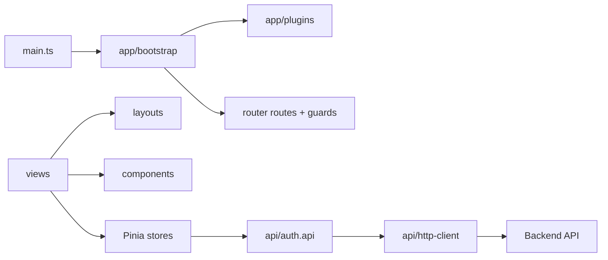

# ExecPlan — Chuẩn hóa cấu trúc frontend Vue cho dự án lớn

> **Status:** Completed locally — deploy/E2E tracked by full-stack blocker  
> **Owner:** Codex / Frontend Engineering  
> **Created:** 2026-07-11  
> **Updated:** 2026-07-11  
> **Approval:** Người dùng/Product Owner yêu cầu trực tiếp ngày 2026-07-11

## 1. Mục tiêu và kết quả người dùng

Frontend base/auth có cấu trúc dễ mở rộng: bootstrap/app plugin tách khỏi entrypoint; router chia route/guard; HTTP client và auth API tách khỏi Pinia store; view chỉ orchestration; form/layout/header/status card là component tái sử dụng; types/constants/styles có owner folder rõ. Hành vi login/refresh/logout, giao diện và API contract không đổi.

## 2. Nguồn và requirement IDs

- Baseline: `docs/Đề xuất tính năng nền tảng Solar và BESS.md`
- Requirements: `BR-033`, `BR-040`, `FR-147`, `NFR-011`, `SEC-101`, `SEC-103`, `SEC-118`
- Use case/story/workflow: `UC-020`, `US-020`, `WF-026`
- Acceptance/tests: `AC-174…AC-177`, `TEST-230…TEST-233`
- ADR/API/Data: `ADR-001`, `ADR-003`, `API-001`, `API-137…API-139`

## 3. Hiện trạng repository

- `stores/auth.ts` vừa gọi fetch, parse lỗi, retry refresh, giữ state và expose generic API helper.
- View chứa trực tiếp layout/form/header/status markup; chưa có `api`, `layouts`, `components/common`, `constants`, `types` folders.
- Router/guard/routes nằm chung một file và import view eager.
- Element Plus được register toàn bộ, tạo JS bundle khoảng 1 MB trước gzip.

## 4. Phạm vi

### In scope

- Tạo `app`, `api`, `components/common`, `components/auth`, `layouts`, `router`, `types`, `constants`, `styles`, giữ `views`, `stores`.
- Tạo typed HTTP client/error và auth API.
- Tách LoginForm, AppLogo, AppHeader, StatusCard, AuthLayout, AppLayout.
- Lazy-load views; dùng route name/path constants; router guard riêng.
- Pinia store chỉ quản lý auth state/session actions qua auth API.
- Register tối thiểu Element Plus components và style cần dùng.
- Unit test API/store/structure; lint/type/build và documentation.

### Out of scope

- Thêm màn hình nghiệp vụ, navigation/sidebar chưa có requirement MVP.
- Thiết kế design system/package riêng, Storybook, i18n content migration hoặc accessibility certification.
- Thay API/auth behavior hoặc backend.

## 5. Assumption, TBD và Open Question

| Loại | Nội dung | Owner | Điều kiện đóng | Tác động |
|---|---|---|---|---|
| Assumption | Folder-by-technical-role phù hợp giai đoạn base; feature folder sẽ xuất hiện khi có nhiều artefact cho một domain | Frontend Architecture | Review khi thêm module Project đầu tiên | Không chặn |
| TBD | Shared design system thành package trong monorepo | UX/Frontend | Khi có ≥2 app hoặc component catalog ổn định | Components tạm ở app web |
| TBD | i18n message catalog | Product/UX | Khi xác nhận ngôn ngữ/locale | Chuỗi MVP vẫn tiếng Việt |

## 6. Thiết kế và luồng dữ liệu

API module không import store/view. Store có thể import API/types. Component chung không import view/store. View được lazy-load bởi router. Refresh token vẫn chỉ ở HttpOnly cookie; frontend state không thêm refresh token.

## 7. API, dữ liệu và bảo mật

- API-137…139 path/method/body/cookie không đổi.
- `HttpClient` luôn dùng same-origin và `credentials: include`; JSON/error parsing tập trung.
- Access token chỉ ở Pinia memory; tenant header chỉ được thêm bởi future feature API qua typed request context.
- Không thêm OT API/control component.

## 8. Ma trận truy vết thực thi

| Requirement/ADR | Milestone | Component | Acceptance/Test | Trạng thái |
|---|---|---|---|---|
| ADR-001/003 | M1–M2 | app/router/layout/component structure | structure unit + build | Completed |
| FR-147/API-137…139 | M2–M3 | auth API/store/views | TEST-230…233 | Unit/build completed; combined E2E pending |
| SEC-103/118 | M2–M3 | HttpOnly refresh/memory access token | store/API unit | Completed |

## 9. Milestone và bước thực hiện

### M1 — App/router foundation

- [x] Tạo bootstrap/plugin, alias `@`, route constants/routes/guards/index.
- [x] Lazy-load views và giữ auth redirect behavior.

### M2 — API/store contract

- [x] Tạo HTTP client, API error, auth API và auth types.
- [x] Refactor Pinia store bỏ raw fetch/generic API helper.
- [x] Unit test endpoint/error/session state.

### M3 — Components/layouts/views/styles

- [x] Tạo common/auth components và layouts.
- [x] Làm view mỏng, chia styles theo owner mà không đổi visual/Calibri stack.
- [x] Register tối thiểu Element Plus components.

### M4 — Validation/docs

- [x] Lint/type/unit/build và kiểm bundle; E2E không khả dụng do full-stack deploy blocker đã ghi nhận.
- [x] Cập nhật architecture/changelog/index/ExecPlan.

## 10. Kế hoạch kiểm thử và chất lượng

| Loại | Command | Expected |
|---|---|---|
| Lint/type | `npm run lint --workspace=@solar-bess/web`; `npm run typecheck --workspace=@solar-bess/web` | exit 0 |
| Unit | `npm run test:unit --workspace=@solar-bess/web` | API/store/structure pass |
| Build | `npm run build --workspace=@solar-bess/web` | exit 0; views lazy chunks |
| E2E | `npm run test:e2e` | login/reload/logout pass nếu backend mới được deploy |

## 11. Migration, rollout và rollback

- Không có DB/API/data migration; browser asset filenames thay đổi theo Vite hash.
- Rollback bằng image web trước; backend contract tương thích.
- Deploy cùng full-stack build sau khi Docker/PostgreSQL permission được cấp.

## 12. Rủi ro và biện pháp

| Rủi ro | Tác động | Giảm thiểu | Owner |
|---|---|---|---|
| Circular API/store import | Build/runtime | API không import store; typed context truyền từ caller | Frontend |
| Refactor đổi auth bootstrap | Login/reload lỗi | API/store unit + E2E | Frontend/QA |
| Over-structure | Review khó | Chỉ tạo folder có consumer hiện hữu | Frontend Architecture |
| CSS split đổi visual | UI regression | Giữ selector/token và build/public E2E | UX/Frontend |

## 13. Decision Log

| Ngày | Quyết định | Lý do | Liên quan | Phê duyệt |
|---|---|---|---|---|
| 2026-07-11 | Views + API + shared components/layouts/router/store/types/constants/styles | Convention owner yêu cầu cho dự án lớn | ADR-001/003 | Người dùng |
| 2026-07-11 | API module không biết Pinia; store gọi API module | Tránh circular/global hidden dependency | SEC-103/118 | Engineering |

## 14. Progress Log

| Ngày | Hoàn thành | Bằng chứng | Next step |
|---|---|---|---|
| 2026-07-11 | Audit 9 source files frontend và toolchain | `find`, `sed`, manifest/config read | M1 |
| 2026-07-11 | App/API/router/store/component/layout/style refactor | Structure tree; only API client contains `fetch` | Validation |
| 2026-07-11 | Frontend validation | lint 2s pass; type 6s pass; unit 15/15 in 3s; build 14s pass | Docs |
| 2026-07-11 | Bundle result | JS entry 1,015 KB → 208 KB; CSS 361 KB → 52 KB; Login/Dashboard lazy chunks | Completed local scope |

## 15. Kết quả và bàn giao

Frontend refactor hoàn tất ở local scope. Source tree có owner rõ; API/store/view/component dependency tách; UI/auth behavior và Calibri stack giữ nguyên. Combined E2E và deploy không chạy vì backend encrypted-env build vẫn bị chặn quyền Docker/PostgreSQL; public server chưa chứa refactor mới.
