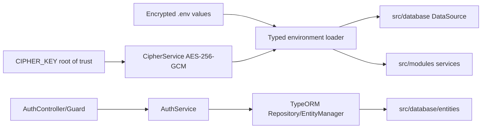

# ExecPlan — Chuẩn hóa Nest module, database layer và encrypted environment

> **Status:** Blocked — chờ quyền local PostgreSQL/Docker để integration/deploy  
> **Owner:** Codex / Engineering  
> **Created:** 2026-07-11  
> **Updated:** 2026-07-11  
> **Approval:** Người dùng/Product Owner yêu cầu trực tiếp ngày 2026-07-11

## 1. Mục tiêu và kết quả người dùng

Base API dùng convention đơn giản, dễ mở rộng của NestJS: mọi TypeORM entity, migration, DataSource và seed ở `src/database`; feature code ở `src/modules/<module>` với controller/service/DTO/guard/helper theo nhu cầu, không bắt buộc tactical-layer nesting. Toàn bộ credential do ứng dụng đọc từ `.env` phải dùng authenticated encryption và được giải mã trong process bằng `CIPHER_KEY`. Rate limit, JWT TTL, Argon2 cost và cookie được cấu hình có validation từ env. Password người dùng trong PostgreSQL tiếp tục là Argon2id hash một chiều, không phải ciphertext có thể giải ngược.

## 2. Nguồn và requirement IDs

- Baseline: `docs/Đề xuất tính năng nền tảng Solar và BESS.md`
- Requirements: `BR-033`, `BR-040`, `FR-147`, `FR-154`, `SEC-101`, `SEC-103`, `SEC-117`, `SEC-118`
- Use case/story/workflow: `UC-020`, `US-020`, `WF-026`
- Acceptance/tests: `AC-174…AC-177`, `TEST-200`, `TEST-230…TEST-233`
- ADR/API/Data: `ADR-001`, `ADR-004`, `API-001`, `API-137…API-139`, `DB-001`, `DB-005`, `DB-098…DB-100`

## 3. Hiện trạng repository

- TypeORM entity/migration/DataSource nằm sâu trong `modules/identity-access/infrastructure` và `shared/infrastructure`.
- Identity & Access dùng custom domain repository/ports/use-case factories, nhiều tầng hơn convention mà owner chấp nhận.
- Rate limit và Argon2/JWT TTL còn hard-code.
- `.env` production-test hiện chứa credential plaintext; `.gitignore` đã loại `.env` khỏi source control nhưng chưa có encryption-at-rest trong file.
- Bootstrap hiện gọi `argon2.hash` trước khi lưu `local_credentials.password_hash`; entity đặt `select: false`. Cần query DB chỉ trả boolean để xác nhận dữ liệu đã triển khai không phải raw.

## 4. Phạm vi

### In scope

- Chuyển TypeORM entity/migration/DataSource/seed sang `apps/api/src/database`.
- Refactor Identity & Access về controller/service/guard/DTO/helper trực tiếp và `TypeOrmModule.forFeature` + `Repository<Entity>`/`EntityManager` chuẩn.
- Thêm `modules/cipher` dùng AES-256-GCM envelope versioned, CLI encrypt/migrate env và unit test tamper/wrong-key.
- Enforce encrypted values cho DB URL/user/password, JWT secret và bootstrap login credential; `CIPHER_KEY` là root-of-trust ngoại lệ không tự mã hóa.
- Thêm typed validated config từ env cho rate limit, JWT TTL, Argon2 và cookie.
- Giữ nguyên schema/API/public credential; migration up/down/up, regression, deploy và password-hash audit.

### Out of scope

- AWS Secrets Manager/KMS, automatic key rotation, multi-key decrypt hoặc production secret governance hoàn chỉnh.
- Redis distributed rate limiting; in-memory limiter chỉ phù hợp một API replica ở base/test.
- Thay đổi business scope, endpoint, bảng hoặc OT boundary.

## 5. Assumption, TBD và Open Question

| Loại | Nội dung | Owner | Điều kiện đóng | Tác động |
|---|---|---|---|---|
| Assumption | `CIPHER_KEY` là base64 của đúng 32 random bytes và được inject ngoài source; owner yêu cầu tạm lưu trong `.env` test | Security/Engineering | Chuyển sang AWS Secrets Manager/KMS trước production | Root key lộ thì ciphertext env có thể giải mã |
| Assumption | AES-256-GCM envelope `enc:v1:<iv>:<tag>:<ciphertext>` đáp ứng base/test | Security | Security review/pentest | Không chặn test deployment |
| TBD | Key rotation/key version registry | Security/SRE | Trước production | Ciphertext v1 chỉ dùng một active key |
| TBD | Distributed rate limiter Redis | Architecture/Security | Khi API có >1 replica | In-memory counter không chia sẻ giữa replica |

## 6. Thiết kế và luồng dữ liệu

`CipherService` xác thực tag trước khi trả plaintext và không log input/output. Environment loader fail-fast nếu secret không có prefix/version hợp lệ, sai tag, sai key hoặc integer ngoài range. `CIPHER_KEY` không thể tự mã hóa bằng chính nó; đây là bootstrap secret và phải chuyển sang managed secret trước production.

Password đăng nhập không dùng `CipherService`: bootstrap dùng Argon2id với salt ngẫu nhiên; login dùng `argon2.verify`; DB chỉ chứa hash. JWT/DB credentials cần plaintext runtime nên dùng reversible env cipher.

## 7. API, dữ liệu và bảo mật

- API-001/API-137…139 và response/cookie contract không đổi.
- DB-001/005/098…100 và migration class/timestamp không đổi; chỉ đổi path/class TypeScript name suffix.
- `synchronize=false`; migration TypeORM CLI giữ `show/run/revert/generate/create`.
- AES-GCM IV 12 bytes ngẫu nhiên; key 32 bytes; auth tag 16 bytes; envelope base64url và versioned.
- Không log raw env, cipher key, JWT, DB password, bootstrap password hoặc password hash.
- PM Web vẫn không có OT control path.

## 8. Ma trận truy vết thực thi

| Requirement/ADR | Milestone | File/component | Acceptance/Test | Trạng thái |
|---|---|---|---|---|
| ADR-001/FR-147 | M1–M2 | `src/database`, identity-access module | TEST-230…233 | Implemented; integration pending |
| SEC-117/118 | M3 | cipher/config/env migration | cipher unit + startup negative | Unit completed; startup pending deploy |
| SEC-101 | M3–M4 | Argon2 password service/bootstrap/DB audit | TEST-230/231 + hash boolean audit | Completed locally/audited |
| SEC-103 | M2–M4 | token/session service | TEST-200/232/233 | Implemented; integration pending |
| ADR-004/DB-099…100 | M1/M4 | TypeORM DataSource/migration | show/up/down/up | Offline metadata completed; DB CLI pending |

## 9. Milestone và bước thực hiện

### M1 — Database convention

- [x] Tạo `src/database/entities`, `migrations`, `seeds`, `data-source.ts`, `database.module.ts`.
- [x] Cập nhật imports, scripts, Docker compiled path và tests.
- [x] Xóa TypeORM persistence paths cũ sau khi không còn consumer.

### M2 — Nest feature module đơn giản

- [x] Tạo auth controller/service, guard, DTO, types và focused services trong `modules/identity-access`.
- [x] Dùng `TypeOrmModule.forFeature` và inject TypeORM repositories trực tiếp.
- [x] Giữ transaction/row lock cho refresh rotation/replay và audit.

### M3 — Cipher và typed env config

- [x] Tạo `CipherModule/CipherService`, CLI encrypt/migrate/materialize secret.
- [x] Enforce encrypted secret variables; thêm range-validated rate/JWT/Argon/cookie config.
- [x] Migrate `.env` hiện tại không log plaintext; cập nhật `.env.example`/Compose/docs.

### M4 — Validation, deploy và documentation

- [x] Audit DB password hash bằng boolean query, không in hash.
- [ ] Migration up/down/up; lint/type/unit/integration/build/OpenAPI/audit/E2E.
- [ ] Rebuild EC2 test, verify startup decrypt/migration/login/logout; cập nhật docs/changelog/ExecPlan.

## 10. Kế hoạch kiểm thử và chất lượng

| Loại | Command/quy trình | Expected |
|---|---|---|
| Cipher unit | `npm run test:unit` | round-trip, randomized IV, tamper/wrong-key/reject plaintext pass |
| Auth unit/integration | `npm run test:unit`; `npm run test:integration` | rate env + TEST-200/230…233 pass |
| Migration | `npm run migration:show/revert/run/show` trên DB test | `[X] → [ ] → [X]` |
| Quality | `npm run lint`; `npm run typecheck`; `npm run build` | exit 0 |
| Contract/security | `npm run openapi:lint`; `npm audit` | valid/0 reported vulnerability |
| Public E2E | `npm run test:e2e` | login/reload/logout + generic denial pass |

## 11. Migration, rollout và rollback

- Không có schema/data migration mới; file migration đổi path, giữ timestamp/name để TypeORM nhận đúng history.
- Trước deploy, migrate `.env` plaintext sang encrypted envelope; tạo root key ngẫu nhiên và không log secret.
- PostgreSQL official container nhận user/password qua Compose secret files được materialize runtime; API nhận ciphertext + root key và tự decrypt.
- Rollback code cũ cần plaintext env: chỉ thực hiện bằng controlled decrypt-to-runtime, không ghi plaintext trở lại source. DB schema tương thích hai chiều.
- Nếu decrypt/startup fail, container fail-closed trước khi mở HTTP; giữ image đang chạy cho tới khi config mới được verify.

## 12. Rủi ro và biện pháp

| Rủi ro | Tác động | Tín hiệu | Giảm thiểu | Owner |
|---|---|---|---|---|
| Mất/sai CIPHER_KEY | API không start | decrypt/auth-tag error | fail-fast, backup root key ngoài repo, test wrong-key | Security/SRE |
| Key và ciphertext cùng `.env` | Encryption chỉ chống đọc nhầm/file leak tách rời hạn chế | `.env` bị lấy toàn bộ | `.gitignore`, permission 600; chuyển key sang AWS Secrets Manager/KMS trước production | Security |
| Refactor làm đổi auth | Login/session lỗi | integration/E2E fail | giữ API/schema, full regression | Engineering |
| Plaintext runtime secret file | Local host disclosure | file permission/path | directory 0700, file 0600, `/tmp`, không commit/log | SRE |
| Rate limit in-memory | bypass giữa replicas/restart | scale >1 | ghi rõ constraint; Redis TBD | Architecture |

## 13. Decision Log

| Ngày | Quyết định | Lý do | Liên quan | Phê duyệt |
|---|---|---|---|---|
| 2026-07-11 | Centralize TypeORM ở `src/database` | Convention owner yêu cầu và dễ tìm/review | ADR-004 | Người dùng |
| 2026-07-11 | Feature module Nest đơn giản thay tactical DDD folders | Ưu tiên code đơn giản theo `tech-stack.md` | ADR-001 | Người dùng |
| 2026-07-11 | AES-256-GCM cho env; Argon2id cho user password | Secret runtime cần decrypt; password không được decrypt | SEC-101/117/118 | Người dùng/Engineering |

## 14. Progress Log

| Ngày | Hoàn thành | Bằng chứng | Next step |
|---|---|---|---|
| 2026-07-11 | Audit source/manifest/env/bootstrap | `find`, `sed`, `rg`; bootstrap gọi `argon2.hash`, hash column `select:false` | DB boolean audit + M1 |
| 2026-07-11 | Audit password production-test DB | Boolean query: `is_argon2id=true`, `is_raw=false`; không xuất hash | M1–M3 |
| 2026-07-11 | Centralized database + simple Nest modules | lint/type pass; structure test; compiled metadata 5 entity + đúng migration/FK names | Integration |
| 2026-07-11 | Cipher/config/env migration | `.env` 5 credential encrypted, mode 0600; runtime secrets 0700/0600; cipher/env/rate/Argon unit pass | Deploy |
| 2026-07-11 | Safe validation | Workspace lint/type; unit 11/11; build; OpenAPI pass | DB/integration/E2E |
| 2026-07-11 | Blocker | Local PostgreSQL connection bị sandbox `EPERM`; escalation bị hệ thống từ chối vì workspace approval credits | Cần user/owner cấp lại approval để chạy Docker/DB/deploy |

## 15. Kết quả và bàn giao

Implementation và safe local validation đã hoàn thành. Chưa thể kết luận migration/integration/deploy của build mới vì phiên hiện tại không được phép kết nối local PostgreSQL/Docker. Public server vẫn chạy build trước refactor; không đánh dấu build mới đã deploy.
