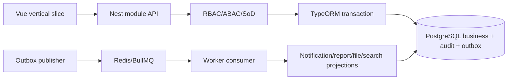

# ExecPlan — Hoàn thiện nền tảng Solar & BESS theo vertical slice

> **Status:** In Progress  
> **Owner:** Codex / Engineering  
> **Created:** 2026-07-11  
> **Updated:** 2026-07-11  
> **Approval:** Product Owner trao quyền quyết định và yêu cầu thực hiện liên tục trong hội thoại ngày 2026-07-11

## 1. Mục tiêu và kết quả người dùng

Hoàn thiện các capability trong backlog bằng các vertical slice có thể sử dụng từ Vue đến NestJS, PostgreSQL và worker; mỗi slice có contract, tenant/permission, audit/outbox, migration/rollback, test và bản deploy EC2 kiểm chứng được. Không trình bày stub, dữ liệu giả hoặc connector chưa có sandbox/credential như một tính năng đã hoàn tất.

## 2. Nguồn và requirement IDs

- Baseline: `docs/Đề xuất tính năng nền tảng Solar và BESS.md`
- Source Feature IDs: toàn bộ catalog baseline trong phạm vi PM Web/O&M read-only; giữ nguyên ranh giới OT.
- Business Requirements: `BR-001…BR-040`.
- Functional/Non-functional/Security: `FR-001…FR-198`, `NFR-001…NFR-024`, `SEC-101…SEC-132`.
- Use cases/stories/workflows: `UC-001…UC-037`, `US-001…US-037`, `WF-001…WF-026`.
- Acceptance/tests: `AC-001…AC-177`, `TEST-001…TEST-233` và ID mới chỉ khi artefact mới thực sự cần.
- ADR/API/Data: `ADR-001…ADR-010`, `API-001…API-139`, `DB-001…DB-100` và ID tiếp theo được cấp không tái sử dụng.

## 3. Hiện trạng repository

- Monorepo npm workspaces có Vue 3 web, NestJS API, TypeORM/PostgreSQL, Docker Compose và JWT login/refresh/logout.
- `US-001` Project Master đã chạy end-to-end và deploy trên EC2 test; API/Web unit, integration, migration up/down/up và Playwright đã pass theo ExecPlan riêng.
- Chưa có `apps/worker`, Redis, BullMQ hoặc transactional outbox vật lý dù `tech-stack.md`, `ADR-006` và `NFR-007` yêu cầu.
- Mutation Project Master hiện không commit business row, audit và event trong cùng transaction; cần sửa trước khi nhân rộng pattern.
- OpenAPI của các domain sau `US-001` còn dùng `GenericCommand`; từng slice phải cụ thể hóa trước implementation.
- Toàn bộ tài liệu platform vẫn là Draft; gate sẽ được đóng và ghi rõ theo từng slice được Product Owner ủy quyền quyết định, không nâng trạng thái giả cho phần chưa thực hiện.

## 4. Phạm vi

### In scope

- Nền async: transactional outbox, Redis, BullMQ, worker riêng, retry/DLQ/idempotent consumption và health/observability tối thiểu.
- Sửa atomicity/idempotency của mutation đã có mà không phá contract `US-001`.
- Các story được triển khai theo dependency nghiệp vụ/kỹ thuật, không theo thứ tự số máy móc.
- Frontend dùng cấu trúc `api`, `types`, `views`, `components`, `layouts`, shared HTTP/auth; server state dùng TanStack Query khi phù hợp.
- Mọi business table có tenant scope; permission deny-by-default; SoD cho approval; audit và outbox trong transaction.
- Migration có `down`, test up/down/up, negative cross-tenant, unit/integration/E2E và deploy smoke theo mức rủi ro.
- Cập nhật OpenAPI, data/workflow/security/test/traceability/changelog và ExecPlan sống sau mỗi milestone.

### Out of scope

- Bất kỳ PM Web → OT/BESS command/write path nào.
- Khẳng định hoàn tất tích hợp ERP/DMS/e-sign/bank/IdP/OT production khi chưa có owner contract, sandbox và credential được cấp.
- Dữ liệu thật, pháp lý/thuế/biểu giá/ngưỡng an toàn do Product Owner chưa cung cấp; các giá trị này phải cấu hình hoặc giữ rõ là dependency bên ngoài.
- Production HA/DR, DNS/TLS managed, KMS/HSM và compliance sign-off; EC2 hiện tại là test environment.

## 5. Assumption, TBD và Open Question

| Loại | Nội dung | Owner cần xác nhận | Hạn/điều kiện đóng | Tác động nếu chưa đóng |
|---|---|---|---|---|
| Decision | Product Owner ủy quyền Codex chốt quyết định sản phẩm/kỹ thuật để tiếp tục, không hỏi lại trong quá trình thực hiện | Product Owner | Đã đóng 2026-07-11 | Cho phép chốt enum/rule an toàn, có changelog |
| Assumption | Test DB không có dữ liệu cần giữ và có thể seed/reset | Product Owner | Đã xác nhận 2026-07-11 | Cho phép migration rehearsal và dữ liệu synthetic |
| Dependency | External integration chỉ được đánh dấu complete khi có sandbox/contract/credential thực | System Owner | Trước test connector tương ứng | Không chặn module nội bộ hoặc adapter simulator; chặn tuyên bố integration thật |
| TBD | Legal, tax, tariff, authority threshold, retention, RPO/RTO và OT/site parameters | Owner chuyên môn | Trước production/use case tương ứng | Dùng versioned config/explicit unavailable state; không bịa giá trị |

## 6. Thiết kế và luồng dữ liệu

- API xử lý authorization, invariant, optimistic version và idempotency; một transaction commit business row + audit + outbox.
- Worker là process/container riêng, xử lý at-least-once; consumer dedupe theo event ID và retry có backoff/DLQ.
- Module chỉ dùng public application service/event của module khác; không query private table xuyên bounded context trong code nghiệp vụ.
- PM Web và worker không có route, schema, queue hoặc secret cho OT command. OT/O&M ingress sau này chỉ read-only qua integration boundary.

## 7. API, dữ liệu và bảo mật

- OpenAPI 3.1 được cụ thể hóa theo slice, giữ `x-api-id`, requirement/data/security trace, auth, tenant, idempotency, error và example synthetic.
- Entity TypeORM/migration tập trung tại `apps/api/src/database`; module chứa controller/service/DTO/processor/transform theo convention đã chốt.
- ID mới bắt đầu sau catalog hiện tại (`DB-101`, `API-140`, `TEST-234` khi cần); không tái sử dụng.
- Secret/credential trong `.env` phải là `enc:v1`; runtime container dùng Docker secret file khi phù hợp. Password người dùng chỉ lưu Argon2id hash một chiều.
- Deny-by-default, tenant/project/package scope và negative tests là release gate. Approval áp SoD; creator không tự phê duyệt khi policy cấm.

## 8. Ma trận truy vết thực thi

| Requirement/ADR | Milestone | File/component | Acceptance/Test | Trạng thái |
|---|---|---|---|---|
| NFR-007; ADR-006 | M1 | outbox migration/module, `apps/worker`, Redis/BullMQ Compose | TEST-180 | In Progress |
| US-001; SEC-118 | M1 | Project Master transaction refactor | TEST-001…004/202…208 regression | Planned |
| US-003; WF-003; DB-017…021; API-034…037 | M2 | Project Controls API/web/worker | AC-010…013 / TEST-010…013 | Planned |
| US-004; WF-015/021; DB-065…068; API-038 | M3 | Risk/Issue/Change module | AC-014…017 / TEST-014…017 | Planned |
| US-002; FR-010…015 | M4+ | Command Center/Health read model | AC-005…009 / TEST-005…009 | Planned after source modules |
| US-005…037 | M4+ | dependency-ordered domain slices | AC/TEST mapped in docs/15 | Planned |

## 9. Milestone và bước thực hiện

### M0 — Program roadmap và documentation gate

- [x] Rà dependency của `US-002…037`, phân nhóm internal, provider-dependent và future/safety constrained.
- [ ] Ghi authority/decision, implementation order và external blockers vào decision register/changelog.
- [ ] Tạo ExecPlan decision-complete riêng trước mỗi schema/API/security slice lớn.

Thứ tự thực thi đã chốt: operational foundation → workflow/SoD/notification → Project Controls `US-003/004` → DMS `US-005/019` → contract/cost/procurement `US-006…008` → field/QA/HSE `US-009…011` → commissioning/COD `US-012/013` → Command/Report Center `US-002/023` → opportunity/engineering `US-025…027` → O&M `US-014` → connector/OT read-only `US-028/029` → lifecycle `US-030` → AI governance/applied AI `US-031…037`. `US-015…018/020…022/024` được triển khai theo capability nền tương ứng thay vì chờ thứ tự số.

**Exit criteria:** roadmap có thứ tự dependency, không còn quyết định chặn milestone M1/M2.

### M1 — Async/transaction foundation và US-001 hardening

- [ ] Chốt physical profile Redis + BullMQ + PostgreSQL outbox theo `tech-stack.md`/ADR-006.
- [ ] Thêm entity/migration outbox + consumer dedupe, worker publisher/consumer, config/secret và Docker health.
- [ ] Refactor mutation Project Master để business/audit/outbox atomic và idempotency đúng contract.
- [ ] Failure-injection, migration up/down/up, worker retry/dedupe và full US-001 regression.

**Exit criteria:** zero lost committed event trong test failure paths; duplicate event không lặp side effect; stack public vẫn healthy.

### M2 — Project Controls `US-003`

- [ ] Cụ thể hóa WBS/activity/dependency/baseline/progress schema, rule, workflow và OpenAPI.
- [ ] Implement API/domain calculation/permissions/outbox + schedule worker behavior.
- [ ] Implement Project Schedule UI: WBS/list/Gantt-lite, baseline, progress, variance, look-ahead/alerts.
- [ ] Chạy TEST-010…013, cross-tenant, SoD, concurrency, baseline immutability và migration rollback.

**Exit criteria:** AC-010…013 quan sát được end-to-end; không ghi đè baseline/actual history.

### M3 — Risk/Issue/Change `US-004` và rebaseline integration

- [ ] Implement register riêng, action/history, closure approval và bidirectional change link.
- [ ] Chỉ cho rebaseline mới sau approved change reference và authority đúng.
- [ ] Chạy TEST-014…017 và re-run TEST-012.

**Exit criteria:** risk/issue/change không trộn aggregate; rebaseline có approved provenance và SoD.

### M4 — Các domain MVP và Command Center

- [ ] Thực hiện DMS/file pipeline trước search; contract/cost/procurement; construction/QA/HSE/commissioning/COD; O&M read-only theo dependency trong roadmap.
- [ ] Thêm MinIO khi DMS bắt đầu; Elasticsearch/Kibana chỉ sau DMS + worker/outbox ổn định.
- [ ] Xây Health/Command Center khi đủ source; metric chưa có phải `N/A` có reason, không giả zero.
- [ ] Mỗi slice đóng contract, test, deploy và docs trước slice kế tiếp.

**Exit criteria:** toàn bộ story nội bộ có bằng chứng AC/TEST; integration chưa có external sandbox được báo `Blocked by external dependency`, không giả pass.

### M5 — Release 1/2/Future và hardening

- [ ] Tiếp tục các story còn lại theo dependency, giữ AI human-in-the-loop và OT read-only.
- [ ] Full regression, accessibility, load/resilience/security scan áp dụng được; backup/restore rehearsal.
- [ ] Deploy combined stack, seed synthetic demo, public smoke và hoàn thiện handoff.

**Exit criteria:** ma trận trace phản ánh chính xác Implemented/Blocked/Deferred; không còn công việc nội bộ an toàn nào chưa thực hiện.

## 10. Kế hoạch kiểm thử và chất lượng

| Loại | Command/quy trình | Requirement/Test IDs | Expected result |
|---|---|---|---|
| Install | `timeout 180s npm ci` | ADR-001 | Exit 0, lock reproducible |
| Lint/type/build | root và từng workspace scripts | NFR-012 | Exit 0, zero warning |
| Unit | `timeout 180s npm run test:unit` | Slice TEST IDs | Pass |
| Integration | PostgreSQL/Redis/MinIO/ES profile theo slice | Slice + TEST-180 | Pass, no hidden skip |
| Migration | show → run → revert → run trên DB disposable | DB IDs | Up/down/up pass |
| E2E | `timeout 300s npm run test:e2e` | AC/TEST slice | Critical journey pass |
| Security | cross-tenant/scope/SoD/secret/raw password/no-OT route | SEC IDs | Zero leak/bypass/control path |
| Deploy smoke | Compose health + public API/UI journey | NFR-006/021 | Healthy and observable |

Mọi command dài dùng timeout/poll; nếu tiến trình chạy nền, lưu session và cập nhật tiến độ thay vì chờ treo không giới hạn.

## 11. Migration, rollout và rollback

- Mỗi schema change là migration TypeORM mới có `down`; không sửa migration đã phát hành.
- Test DB synthetic có thể reset; vẫn chạy `up → down → up` và kiểm constraint/data invariants.
- Expand/contract: deploy migration tương thích, worker, API rồi web; worker mới phải đọc được event version trước/sau trong rollout window.
- Rollback code/image trước; revert schema chỉ khi không làm mất committed business/audit/outbox data. Khi đã có data, ưu tiên forward-fix.
- Trigger rollback: auth/tenant isolation, migration, health, queue, critical E2E hoặc no-OT-control gate fail.

## 12. Rủi ro và biện pháp

| Rủi ro | Xác suất/tác động | Tín hiệu | Giảm thiểu | Owner |
|---|---|---|---|---|
| Backlog toàn platform rất lớn | Cao/Cao | Slice kéo dài hoặc contract mơ hồ | Dependency roadmap, vertical slice nhỏ, evidence/deploy từng milestone | Engineering/Product |
| Event mất/duplicate | Trung bình/Rất cao | DB commit nhưng queue thiếu hoặc side effect lặp | Transactional outbox, deterministic event ID, consumer ledger, failure test | Platform |
| Cross-tenant/SoD leak | Trung bình/Rất cao | negative test fail | tenant predicate/FK, deny-default, transaction re-check | Security/Engineering |
| External provider không có sandbox | Cao/Trung bình | Không có contract/credential | Adapter simulator + explicit blocked status; không giả integration | System Owner |
| EC2 resource pressure khi thêm ES/MinIO | Trung bình/Cao | memory/disk/health degradation | Resource profile, delay ES until needed, health/volume monitoring | Platform |
| Lệnh build/deploy treo | Trung bình/Trung bình | no output/health timeout | timeout ≤60s per poll, session polling, concise progress update | Engineering |

## 13. Decision Log

| Ngày | Quyết định | Lý do | ADR/Requirement liên quan | Người phê duyệt |
|---|---|---|---|---|
| 2026-07-11 | Codex được quyền chốt quyết định và thực hiện liên tục, Product Owner review sau | Yêu cầu trực tiếp mới nhất | Toàn program | Product Owner |
| 2026-07-11 | Triển khai theo dependency; `US-003/004` trước `US-002` | Command Center cần source schedule/risk thật | US-002…004 | Product Owner delegated/Codex |
| 2026-07-11 | Nền outbox/worker/Redis và atomic mutation là M1 | Tech stack/SRS bắt buộc, code hiện tại còn gap | ADR-006, NFR-007 | Product Owner delegated/Codex |
| 2026-07-11 | Không giả completion của external integration | Thiếu sandbox/contract không thể kiểm chứng thật | FR-156…177 | Product Owner delegated/Codex |

## 14. Progress Log

| Ngày | Hoàn thành | Bằng chứng/command | Blocker/next step |
|---|---|---|---|
| 2026-07-11 | Khởi tạo program plan; audit repo/docs và xác định async/atomicity gap | Đọc AGENTS/PLANS/tech-stack/docs/source/manifests/Compose | Hoàn tất roadmap và M1 ExecPlan |

## 15. Kết quả và bàn giao

Đang thực hiện. Mục này chỉ được hoàn tất sau khi ghi đúng số test, deploy evidence, file inventory, assumption/TBD/Open Question và mọi dependency bên ngoài còn lại.
