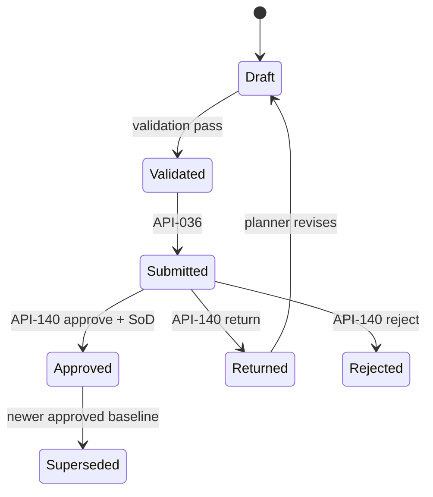
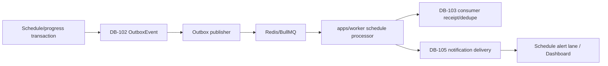

# ExecPlan — US-003 Project Controls: WBS, schedule, baseline và progress

> **Status:** In Progress — M0…M3 source complete; runtime validation active; M4 blocked by US-004  
> **Owner:** Codex / Engineering  
> **Created:** 2026-07-11  
> **Updated:** 2026-07-12  
> **Approval:** Product Owner trao toàn quyền quyết định và yêu cầu tiếp tục không cần hỏi lại trong hội thoại ngày 2026-07-11; Codex chốt thiết kế theo quyền được ủy quyền

## 1. Mục tiêu và kết quả người dùng

Khi kế hoạch hoàn tất, Project Planner có thể lập hoặc import draft schedule gồm calendar, package, WBS, task, milestone và dependency; hệ thống kiểm logic/date/weight/cycle, tính critical path, lưu version và cho PM độc lập phê duyệt baseline bất biến. Activity Owner có thể ghi progress/actual/remaining duration kèm evidence theo mô hình append-only; hệ thống giữ nguyên baseline và actual history, tính variance/SPI/forecast, hiển thị look-ahead và cảnh báo overdue/near-critical cho đúng owner/PM trên UI và notification projection.

Rebaseline chỉ hoàn tất sau khi `US-004` cung cấp `DB-067 ChangeRequest` đã được phê duyệt; baseline mới phải giữ reason, impact, approved change provenance và đúng thẩm quyền. Không có API, queue, UI hoặc credential điều khiển OT/BESS.

## 2. Nguồn và requirement IDs

- Baseline: `docs/Đề xuất tính năng nền tảng Solar và BESS.md`
- Source Feature IDs: `PRJ-002`, `PRJ-003`; source story `US-E03`
- Business Requirements: `BR-018`, `BR-032`
- Functional Requirements: `FR-016…FR-021`; direct schedule coverage chủ yếu `FR-017`, `FR-018` và phần schedule/dependency của `FR-019`
- Non-functional Requirements: `NFR-007`, `NFR-012`, `NFR-014`, `NFR-016`, `NFR-017`, `NFR-020…NFR-023`
- Security Requirements: `SEC-105…SEC-111`, `SEC-118`, `SEC-119`
- Use case/story/workflow: `UC-003`, `US-003`, `WF-003`
- Acceptance/tests: `AC-010…AC-013`; `TEST-010…TEST-013`, `TEST-185`, `TEST-187`, `TEST-189`, `TEST-190`, `TEST-193…TEST-196`
- ADR/API/Data trực tiếp: `ADR-001`, `ADR-004`, `ADR-006`; `API-023`, `API-024`, `API-034…API-037`, cấp mới `API-140…API-142`; `DB-012`, `DB-017…DB-021`, cấp mới `DB-101`
- Operational dependency do platform foundation sở hữu: `DB-102` transactional outbox, `DB-103` consumer idempotency và `DB-104` command receipt; Redis/BullMQ và `apps/worker`. Slice này materialize `DB-105` Notification projection cho alert schedule.
- Downstream/dependency: `US-004`, `DB-067`, `API-038` để đóng positive rebaseline path của `AC-012`; `US-002` dùng schedule projection sau này nhưng không chặn schedule UI/look-ahead của slice này

`API-038` và `DB-065…DB-068` là dependency của rebaseline/risk-change, không được ghi là direct implementation của schedule. Hoàn thành `US-003` không đồng nghĩa toàn bộ `FR-016…FR-021` đã Implemented; Meeting/decision/RACI capability ngoài AC của story giữ trạng thái riêng.

## 3. Hiện trạng repository

- `US-001` Project Master đã triển khai trong `apps/api/src/modules/project-management`, dùng TypeORM entity/migration tập trung tại `apps/api/src/database`, API JWT + `X-Tenant-Id`, PostgreSQL-backed permission và Vue Project views.
- `DB-012 Package`, `DB-017…DB-021` chưa có TypeORM entity/migration. API-023/024 có trong catalog/OpenAPI nhưng chưa có controller/service thực thi.
- Domain Model đã gọi `ProjectSchedule` là aggregate root và `CalendarRef` là value object, nhưng Data Model chưa có record lưu schedule version/calendar. Kế hoạch cấp `DB-101 ProjectSchedule` để đóng gap này.
- `API-034…API-037` trong `docs/openapi/openapi.yaml` còn dùng `Envelope`/`GenericCommand`; `API-035` đang lặp `CorrelationHeader`; chưa có WBS/calendar draft contract hoặc baseline decision API.
- `WF-003` có state `Draft → Validated → Submitted → Approved/Rejected/Returned → Superseded`; SRS hiện chưa liệt kê nhất quán toàn bộ state.
- Permission engine hiện chỉ hiểu `TENANT`, `PORTFOLIO`, `PROJECT`; chưa có `PACKAGE` scope và owner rule cho progress.
- Repo chưa có `apps/worker`, Redis/BullMQ hoặc operational stores `DB-102…DB-104`; vì vậy `AC-013` chưa thể đạt chỉ bằng synchronous API.
- Vue đã có `@tanstack/vue-query` và ECharts nằm trong stack chính thức, nhưng Project Master view hiện quản lý server state thủ công và chưa có Schedule route/API/types/components.
- Test script thực tế: root/API/Web lint, type-check, unit, integration, migration commands, OpenAPI lint và Playwright đã tồn tại trong manifests.

## 4. Phạm vi

### In scope

- Canonical docs gate cho `US-003`: Data/ERD, OpenAPI concrete schema, workflow/state, security/role, UX, test, traceability, decisions và changelog.
- `DB-012 Package`, `DB-101 ProjectSchedule`, `DB-017…DB-021` với tenant/project/package constraints, TypeORM entities, migration có `down`, seed role/permission mở rộng được.
- Một project calendar day-level cho MVP; manual/canonical CSV/JSON schedule import có preview và atomic commit.
- Pure domain services cho calendar arithmetic, DAG/cycle validation, CPM, weight validation, weighted planned/actual progress, SPI, variance, forecast và alert classification.
- `API-023/024`, `API-034…037` với DTO/schema cụ thể; `API-140` cho baseline decision độc lập.
- RBAC + project/package/owner ABAC, SoD baseline, status/immutability lock, optimistic concurrency, idempotency, audit/outbox atomic.
- Initial baseline, append-only progress/correction, approved baseline snapshot/hash, current schedule và look-ahead.
- Integration với operational foundation `DB-102…104`, BullMQ worker và `DB-105` notification projection để đạt `AC-013`.
- Vue Project Schedule: WBS/activity table, Gantt-lite, validation/import preview, baseline submit/decision, progress/evidence, variance/critical/look-ahead/alerts; schedule lane tối thiểu trên Dashboard hiện có.
- `US-004` integration: approved `DB-067` reference là điều kiện bắt buộc trước rebaseline approval; re-run `TEST-012` sau M4.
- Unit, integration, migration up/down/up, cross-tenant/project/package/owner, concurrency, SoD, worker retry/dedupe, E2E, deploy EC2 và public smoke.

### Out of scope

- Resource leveling, cost-loaded schedule, probabilistic P50/P80 forecast hoặc Monte Carlo; chưa có resource/cost/probability rule được phê duyệt.
- Bidirectional P6/MS Project connector hoặc tuyên bố P6/MSP file fidelity khi chưa có format fixture/mapping/SoR contract. MVP import là canonical CSV/JSON có provenance; external adapter là integration slice sau.
- File upload/evidence binary trước Document/MinIO slice. Progress hỗ trợ evidence reference/note có provenance; binary object được gắn sau qua stable document/revision ID.
- Full `US-002` Health Score/Command Center, Report Center PDF/Excel và Notification Center preference/digest. Slice này chỉ cung cấp schedule source projection, look-ahead export và in-app schedule alert cần cho `AC-013`.
- Meeting, decision log, full stakeholder/RACI UI thuộc phần khác của `FR-019…FR-021`.
- Bất kỳ PM Web → OT/BESS command/write path nào.

## 5. Assumption, TBD và Open Question

Không có Open Question chặn M0…M3. Các dependency đã được chốt thành điều kiện thực thi, không phải câu hỏi:

| Loại | Nội dung | Owner | Hạn/điều kiện đóng | Tác động nếu chưa đóng |
|---|---|---|---|---|
| Decision | Product Owner ủy quyền Codex chốt rule và thiết kế của slice | Product Owner delegated/Codex | Đã đóng 2026-07-11 | Cho phép cập nhật canonical docs và implementation sau gate |
| Dependency | `DB-102…DB-104`, Redis/BullMQ và worker operational foundation phải healthy | Platform M1 | Trước M3 alert completion | M1/M2 schedule API vẫn làm được; `AC-013` chưa được đánh dấu pass |
| Dependency | `DB-067 ChangeRequest` approved flow từ `US-004` | Risk/Change M4 | Trước positive rebaseline test | Initial baseline/progress đạt; `AC-012` chỉ có denial path cho đến M4 |
| Decision | Calendar MVP là day-level, một calendar/project, cấu hình explicit; không tự thêm ngày nghỉ quốc gia | Product Owner delegated/Codex | Đã đóng | Không có hidden schedule assumption |
| Decision | Import MVP dùng canonical CSV/JSON preview + atomic commit | Product Owner delegated/Codex | Đã đóng | Không tuyên bố P6/MSP connector hoàn tất |

Production retention, SLO/RPO/RTO và external Schedule SoR vẫn thuộc program-level TBD, không chặn EC2/test slice và không được biến thành production promise.

## 6. Thiết kế và luồng dữ liệu

### 6.1 Boundary và module

- Nest module mới: `apps/api/src/modules/project-controls`.
- Controller/service/DTO/processor/transform nằm trong module; TypeORM entity/migration tiếp tục tập trung ở `apps/api/src/database` theo convention repository.
- Service dùng injected TypeORM `Repository` và `DataSource.transaction`; không tạo custom repository abstraction không cần thiết.
- `domain/calendar-calculator.ts`, `dependency-validator.ts`, `critical-path-calculator.ts`, `weight-validator.ts`, `progress-calculator.ts` là pure functions/services, không truy cập DB.
- Project Controls chỉ gọi public application contract của Project Management, Identity/Access và operational foundation; không truy cập private table của module ngoài transaction adapter được khai báo.

### 6.2 Luồng draft/import

```mermaid
sequenceDiagram
  participant UI as Vue Schedule View
  participant API as Project Controls API
  participant POL as Permission/Scope Policy
  participant ENG as Schedule Domain Engine
  participant DB as PostgreSQL
  UI->>API: API-035 PREVIEW/COMMIT + expectedVersion
  API->>POL: schedule.manage/import + tenant/project/package
  POL-->>API: allow with constraints or deny
  API->>ENG: validate calendar/WBS/activity/dependency/weight
  ENG-->>API: normalized draft + issues + CPM
  alt PREVIEW or validation error
    API-->>UI: no write; row/path issues
  else COMMIT valid
    API->>DB: atomic upsert + version + audit + DB-102 outbox
    API-->>UI: committed schedule snapshot/version
  end
```

- `PREVIEW` tuyệt đối không ghi business/audit/outbox.
- `COMMIT` upsert explicit records và archive/unlink explicit IDs; không dùng omission để xóa.
- Một row invalid làm rollback toàn batch. Idempotency replay trả cùng committed result; same key/different payload trả `IDEMPOTENCY_CONFLICT`.

### 6.3 Calendar, date và CPM rules

- Schedule granularity là workday; business fields dùng PostgreSQL `date`, audit/event time dùng `timestamptz` UTC.
- Calendar bắt buộc có IANA timezone, `workingWeek` explicit và exception dates explicit. Không có default holiday. Demo seed có thể tạo Monday–Friday với nhãn rõ là synthetic test data.
- Activity TASK nhận `plannedStart + durationWorkDays`; server tính canonical `plannedFinish`. Import finish nếu có phải trùng kết quả, nếu không trả validation error.
- MILESTONE có duration `0` và start = finish.
- Hỗ trợ dependency `FS`, `SS`, `FF`, `SF`; lag là integer workday trong giới hạn env. Cấm self-link và cross-project/schedule link.
- Cycle detection dùng topological sort; CPM forward/backward pass tính early/late start/finish, total float và critical path.
- `critical = totalFloatWorkDays <= 0`; `nearCritical` khi float lớn hơn 0 nhưng không vượt threshold env.
- Không persist derived CPM như nguồn thật. API/query tính từ current schedule + approved baseline và gắn `calculatedAt`, `dataDate`, `formulaVersion`.

### 6.4 Weight, progress, SPI và forecast

- Mọi weight dùng PostgreSQL `numeric(7,4)`; `0 < weight <= 100`.
- Trong draft, tổng children cùng parent không được vượt 100. Khi Validate/Submit: root WBS = 100, mỗi nhóm WBS siblings = 100, activities của mỗi leaf WBS = 100.
- Progress dùng `numeric(5,2)`, từ 0 đến 100. Actual/progress update luôn append DB-021; Activity chỉ giữ current projection được cập nhật từ event trong cùng transaction.
- Actual start/finish không được ghi trực tiếp trên Activity. Actual finish yêu cầu actual start, progress 100 và evidence. Correction tạo DB-021 mới có `correctionOfId` + reason; không UPDATE/DELETE history.
- Planned progress V1 nội suy tuyến tính theo workday của từng activity rồi nhân weight. Actual progress là weighted latest effective progress. `SPI_WEIGHTED_LINEAR_V1 = weightedActual / weightedPlanned`; khi planned denominator bằng 0, SPI là `N/A`, không giả bằng 0 hoặc 1.
- Forecast dùng actual + remaining duration + dependency network/calendar. Baseline variance là current/forecast minus immutable baseline dates; không sửa baseline để làm hết variance.

### 6.5 Baseline/rebaseline state



- Initial baseline submit tạo canonical JSON snapshot và SHA-256 hash trong DB-020.
- API-140 APPROVE lock snapshot; approved row không được update/delete. New approval + old approved → Superseded diễn ra atomically.
- Rebaseline request bắt buộc reason, impact summary và `approvedChangeRequestId`; `DB-067` phải cùng tenant/project và state Approved. Không chấp nhận free-text change reference như bằng chứng phê duyệt.
- Submitter/creator không được approve chính baseline của mình kể cả có nhiều role hoặc delegation; delegation không bypass SoD.

### 6.6 Alert/notification flow



- Worker chạy idempotent alert scan theo project/data date; overdue và near-critical không tự đổi activity state, baseline hoặc approval.
- Dedup key: tenant + project + activity + alert type + dataDate + threshold version. State/data-date thay đổi mới tạo delivery mới.
- Recipient được resolve ở execution time: current Activity Owner và current authorized PM/Project Controls. Notification không cấp quyền; open/drill-down re-check PostgreSQL permission.
- Event names V1: `ScheduleDraftChanged`, `BaselineSubmitted`, `BaselineApproved`, `ProgressRecorded`, `ActivityOverdue`, `ActivityNearCritical`.
- Structured log/metric dùng correlation/event/job ID; payload không chứa token/credential hoặc evidence body nhạy cảm.

## 7. API, dữ liệu và bảo mật

### 7.1 API contract decisions

M0 cập nhật `docs/08-api-specification.md` và `docs/openapi/openapi.yaml` trước code. Các operation dùng schema cụ thể, không dùng `GenericCommand`/untyped `Envelope`.

- `API-023 GET /v1/projects/{projectId}/packages`: list active/authorized Package theo project/package scope.
- `API-024 POST /v1/projects/{projectId}/packages`: concrete `CreatePackageRequest`, idempotency required.
- `API-034 GET /v1/projects/{projectId}/schedule`: query `dataDate?`, `lookAheadDays?`, `baselineNumber?`; response gồm calendar, version, packages, WBS, activities, dependencies, baseline metadata, validation issues, CPM, variance/SPI/forecast, look-ahead/alerts.
- `API-035 POST /v1/projects/{projectId}/schedule:apply-draft`: giữ stable ID nhưng thay path Draft chưa implement; concrete discriminator `mode=PREVIEW|COMMIT`, expected version, source/provenance, calendar, WBS/activity/dependency upserts và explicit archive/unlink IDs.
- `API-036 POST /v1/projects/{projectId}/schedule-baselines`: submit initial/rebaseline với data date, reason, impact, change reference và expected schedule version.
- `API-037 POST /v1/projects/{projectId}/progress-updates`: append/correct progress/actual/evidence; idempotency required.
- `API-140 POST /v1/schedule-baselines/{baselineId}:decision`: `APPROVE|RETURN|REJECT`, comment và expected version; permission `baseline.approve` và SoD server-side.
- `API-141 GET /v1/projects/{projectId}/progress-updates`: đọc progress history append-only có cursor theo activity/package scope để correction dùng stable record ID.
- `API-142 GET /v1/projects/{projectId}/schedule-look-ahead.csv`: xuất authorized UTF-8 CSV, neutralize spreadsheet formula và audit export.

Mọi business request có JWT và verified `X-Tenant-Id`; mutation có `Idempotency-Key`, correlation và expected version/`If-Match`. Response/error không để lộ object existence ngoài scope.

Error catalog tối thiểu:

- `SCHEDULE_NOT_FOUND`, `PACKAGE_NOT_FOUND`, `WBS_NOT_FOUND`, `ACTIVITY_NOT_FOUND`
- `DEPENDENCY_CYCLE`, `DEPENDENCY_SCOPE_MISMATCH`, `INVALID_CALENDAR`, `INVALID_SCHEDULE_DATE`
- `WEIGHT_TOTAL_EXCEEDED`, `WEIGHT_TOTAL_INVALID`, `SCHEDULE_VALIDATION_FAILED`
- `BASELINE_LOCKED`, `BASELINE_STATE_INVALID`, `BASELINE_SELF_APPROVAL_DENIED`
- `CHANGE_APPROVAL_REQUIRED`, `CHANGE_SCOPE_MISMATCH`
- `ACTUAL_CORRECTION_REQUIRED`, `PROGRESS_EVIDENCE_REQUIRED`
- `VERSION_CONFLICT`, `IDEMPOTENCY_KEY_REQUIRED`, `IDEMPOTENCY_CONFLICT`

### 7.2 Data model decisions

#### DB-012 — Package

- PK/FK: `id`, `tenantId`, `projectId`, `parentPackageId?`, `contractorCompanyId?`.
- Fields: `code`, `name`, `packageType`, `status`, `versionNo`, `idempotencyKey`, actor/timestamps.
- UQ `tenantId + projectId + code`; parent phải cùng tenant/project; status `ACTIVE|INACTIVE|ARCHIVED`; archive, không hard delete.

#### DB-101 — ProjectSchedule

- PK/FK: `id`, `tenantId`, `projectId`; UQ một schedule/project.
- Fields: `timezone`, `calendarCode`, `workingWeek jsonb`, `calendarExceptions jsonb`, `dataDate`, `status`, `versionNo`, actor/timestamps.
- JSONB chỉ chứa versioned calendar config; không chứa relational activity/WBS data.

#### DB-017 — WBSNode

- `id`, `tenantId`, `projectId`, `scheduleId`, `packageId?`, `parentWbsId?`, `ownerId?`.
- `code`, `name`, `description?`, `weight numeric(7,4)`, `sortOrder`, `status`, `versionNo`, actor/timestamps.
- UQ tenant/project/code; parent/package/owner scope validation; archive, không hard delete.

#### DB-018 — Activity

- `id`, `tenantId`, `projectId`, `scheduleId`, `wbsId`, `packageId?`, `ownerId`.
- `code`, `name`, `activityType`, `weight`, planned/forecast/current actual projection fields, duration/remaining, percent, status, versionNo, actor/timestamps.
- UQ tenant/project/code; indexes project/status/date/WBS/package/owner.
- Status `DRAFT|READY|IN_PROGRESS|BLOCKED|COMPLETE|CANCELLED`; actual projection chỉ được đổi qua DB-021 command.

#### DB-019 — ActivityDependency

- `id`, `tenantId`, `projectId`, `scheduleId`, `predecessorId`, `successorId`, `dependencyType`, `lagWorkDays`, actor/timestamps.
- UQ tenant/predecessor/successor/type; cấm self-link; predecessor/successor cùng schedule/project; unlink audit.

#### DB-020 — ScheduleBaseline

- `id`, `tenantId`, `projectId`, `scheduleId`, `baselineNumber`, `baselineType`, `status`, `dataDate`.
- `snapshot jsonb`, `snapshotHash`, `reason`, `impactSummary`, `approvedChangeRequestId?`, `replacesBaselineId?`.
- `createdBy`, `submittedBy/At`, `approvedBy/At`, `versionNo`, timestamps.
- UQ project/baselineNumber; partial UQ một current Approved/project; Approved snapshot immutable.

#### DB-021 — ProgressUpdate

- `id`, `tenantId`, `projectId`, `activityId`, `dataDate`, `percentComplete`, `remainingDurationWorkDays`.
- `quantity? numeric(19,4)`, `unit?`, `actualStart?`, `actualFinish?`, `evidenceRefs jsonb`, `note?`, `correctionOfId?`, `reason?`, `sourceKey`, `recordedBy/At`.
- UQ tenant/sourceKey; index activity/dataDate/recordedAt; append-only; correction target cùng activity/project.

Mọi FK tenant/project scope được kiểm bằng composite unique/FK khi khả thi và bắt buộc re-check trong application transaction; UUID global uniqueness không thay thế tenant validation.

### 7.3 Authorization, role và audit

Role catalog mở rộng:

- `PROJECT_CONTROLS`: `package.read`, `schedule.read/manage/import`, `baseline.submit`, `progress.record/correct` trong project/package được gán.
- `PROJECT_MANAGER`: schedule read/manage, baseline approve, progress read/manage trong project; vẫn bị self-approval deny.
- `PACKAGE_OWNER`: schedule read và progress record cho package/activity được giao.
- `PMO`: schedule read/approve theo assignment scope.
- `EXECUTIVE`: schedule/read-only theo scope.

`AssignmentScopeType` thêm `PACKAGE`; migration cập nhật DB-007 check constraint. PermissionGuard vẫn là coarse action gate; Project Controls service re-check package, owner, project status, baseline lock và SoD trong transaction trước write.

- `ARCHIVED|CLOSED|CANCELLED` project chặn schedule mutation.
- Viewer/export chỉ nhận authorized fields/rows.
- Contractor chỉ được progress package của company/assignment hiện hành.
- Audit critical actions: package/schedule import/commit, validate, baseline submit/decision/supersede, progress/correction, export, permission denial. Audit và outbox commit cùng business transaction.
- Không lưu secret/token/file body trong schedule, audit, event hoặc notification.

### 7.4 Config/env

Các giá trị không nhạy cảm, injectable qua validated env:

```text
SCHEDULE_NEAR_CRITICAL_FLOAT_DAYS=5
SCHEDULE_DEFAULT_LOOKAHEAD_DAYS=21
SCHEDULE_IMPORT_MAX_ROWS=5000
SCHEDULE_MAX_ABS_LAG_DAYS=3650
```

Range validation:

- near-critical `0…30`
- look-ahead `1…180`
- import rows `1…20000`
- absolute lag `0…3650`

Config change phải có version trong calculation/alert output để kết quả tái lập được. Không có credential mới cho Project Controls; nếu sau này có external schedule connector, credential env bắt buộc `enc:v1` và thuộc integration slice.

### 7.5 Frontend decisions

```text
apps/web/src/api/schedule.api.ts
apps/web/src/types/schedule.types.ts
apps/web/src/views/schedule/ProjectScheduleView.vue
apps/web/src/components/schedule/
apps/web/src/composables/queries/
```

- Route: `/projects/:projectId/schedule`, permission `schedule.read`; Project Detail có action mở Schedule.
- `schedule.api.ts` chỉ chứa URL, method, params/body/header và typed response; shared HTTP client tiếp tục xử lý auth/tenant/refresh/error.
- TanStack Query quản lý schedule/package/baseline/progress server state và invalidation; Pinia chỉ giữ auth/tenant/UI state.
- Desktop: toolbar data date/baseline/current/forecast/critical/look-ahead/import/validate; WBS tree + activity table; ECharts custom-series Gantt-lite; baseline ghost bar; validation, baseline, progress/evidence và history panels.
- Mobile/tablet: responsive priority/look-ahead list và progress action; không cho sửa dependency/baseline logic trên mobile.
- Status/critical/variance có text/icon, không chỉ màu; keyboard/focus/loading/empty/error/denied/version-conflict states bắt buộc.
- Import preview hiển thị row/path error và không có side effect; explicit commit button. Look-ahead có CSV export theo authorized snapshot và audit.
- Dashboard hiện có thêm schedule alert lane tối thiểu cho owner/PM; full Health Score/Command Center vẫn thuộc `US-002`.

## 8. Ma trận truy vết thực thi

| Requirement/ADR | Milestone | File/component | Acceptance/Test | Trạng thái |
|---|---|---|---|---|
| BR-018/032; US-003; UC-003 | M0 | docs Data/API/Security/UX/WF/Test/Trace/Decision/Changelog | Gate consistency/link/OpenAPI | Completed |
| FR-016/017; DB-012/101/017…019; API-023/024/034/035 | M1 | database + `modules/project-controls` domain/API | AC-010 / TEST-010/185/187/193 | Implemented; integration runtime pending final rerun |
| FR-017/018; DB-020/021; API-036/037/140/141; WF-003 | M2 | baseline/progress services | AC-011 / TEST-011/185/195 | Implemented; integration runtime pending final rerun |
| AC-013; NFR-007; ADR-006; DB-102/103/105 | M3 | worker processors + notification projection + web schedule/dashboard | TEST-013/194 | Source/build complete; integration/E2E/latest image deploy pending |
| AC-012; DB-067; API-038 | M4 | Risk/Change approved reference adapter + rebaseline | TEST-012 | Blocked until US-004 approved flow exists |
| NFR-016/017/020/023 | M3/M5 | Vue, permission, migration/deploy | TEST-189/190/193/196 + E2E | Planned |

## 9. Milestone và bước thực hiện

### M0 — Canonical documentation gate

- [x] Cấp/định nghĩa `DB-101 ProjectSchedule`, `API-140 baseline decision`; cụ thể hóa DB-012/017…021 và ERD/data dictionary trong `docs/07-data-model.md`.
- [x] Sửa direct/dependency trace; không map API-038/DB-065…068 như direct schedule implementation.
- [x] Thay GenericCommand/Envelope bằng concrete schema trong `docs/08-api-specification.md` và `docs/openapi/openapi.yaml`; bỏ duplicate CorrelationHeader.
- [x] Đồng bộ WF-003 states, calendar/weight/CPM/SPI/rebaseline rules, role/package scope, UX, TEST-010…013/185/187/193…196.
- [x] Ghi delegated decisions, dependency DB-102…104/worker và US-004/DB-067 vào `docs/16-open-questions-and-decisions.md` và `docs/CHANGELOG.md`.
- [x] Cập nhật `docs/15-traceability-matrix.md`, `docs/INDEX.md` và status “US-003 Approved/Build-ready; implementation pending”.
- [x] Chạy OpenAPI lint, Markdown relative-link/ID consistency checks.

**Exit criteria:** canonical artefacts thống nhất, concrete, không có TBD/Open Question chặn M1; OpenAPI 3.1 lint pass; changelog/trace ghi rõ authority và dependency. Chỉ sau exit criteria này mới được viết production code.

### M1 — Package, schedule aggregate và draft engine

- [x] Tạo TypeORM entities DB-012/101/017…019 và migration mới có `down`; cập nhật entity registry/data source.
- [x] Mở rộng DB-007/PermissionService cho PACKAGE scope và seed role catalog idempotent.
- [x] Tạo pure calendar/weight/DAG/CPM/progress-plan calculators với unit tests.
- [x] Implement API-023/024/034/035, preview/commit, tenant/project/package/owner checks, expected version và atomic audit/outbox.
- [ ] Implement canonical CSV/JSON importer; invalid row/path preview và all-or-nothing commit.
- [x] Viết integration tests cho create/package/WBS/activity/milestone/dependency, cycle/date/weight, cross-scope, idempotency và concurrency; runtime final rerun còn pending do approval sandbox.

**Exit criteria:** `AC-010`/`TEST-010` pass; draft schedule có version/provenance, invalid import zero side effect; CPM deterministic; migration up/down/up pass.

### M2 — Initial baseline và append-only progress

- [x] Tạo DB-020/021 entities/constraints và bổ sung migration có rollback rõ.
- [x] Implement canonical snapshot/hash, WF-003 state guard, API-036 submit và API-140 decision.
- [x] Enforce self-approval deny, one-current-approved baseline và atomic supersede.
- [x] Implement API-037 progress/correction, API-141 history, evidence requirement, immutable history và Activity current projection.
- [x] Implement variance, weighted planned/actual, `SPI_WEIGHTED_LINEAR_V1` và dependency-aware forecast.
- [x] Viết test baseline hash/immutability, correction ordering/history, version conflict, rollback và audit/outbox atomic failure; unit pass, integration final rerun pending.

**Exit criteria:** initial baseline/progress đạt `AC-011`/`TEST-011`; approved baseline/actual history không thể overwrite; initial approval SoD pass.

### M3 — Worker alerts và frontend Project Schedule

- [x] Platform M1 đã materialize DB-102…104, Redis/BullMQ, worker retry/dedupe và health.
- [x] Implement schedule event publisher/consumer, repeatable alert scan, dedup receipt, notification projection và failure metrics.
- [x] Tạo typed schedule API/types, route/view/components/Gantt-lite/import/baseline/progress/history/look-ahead.
- [x] Thêm schedule alert lane vào Dashboard cho authorized owner/PM và API-142 CSV look-ahead export có audit.
- [x] Unit/UI cho draft/progress/history/Gantt/API/loading/empty/error/denied/conflict; Playwright journey đã viết, runtime E2E pending.
- [x] Viết worker unit/integration cho overdue/near-critical threshold, recipient scope và dedup/retry; unit pass, PostgreSQL integration final rerun pending.

**Exit criteria:** `AC-013`/`TEST-013` pass end-to-end; duplicate jobs không gửi duplicate delivery; task xuất hiện Schedule/Dashboard/look-ahead đúng scope.

### M4 — US-004 approved change và rebaseline completion

- [ ] Chỉ bắt đầu positive path sau khi `US-004`, `DB-067` và approved Change Request workflow có integration evidence.
- [ ] Resolve `approvedChangeRequestId` qua public Risk/Change application contract; không query private table trực tiếp từ domain service.
- [ ] Enforce same tenant/project, Approved state, reason/impact và approver authority.
- [ ] Approve rebaseline atomically, supersede previous baseline, preserve snapshots/hash/history và emit events.
- [ ] Test missing/unapproved/cross-project change, self-approval/delegation bypass, successful independent approval và concurrent decision.

**Exit criteria:** positive và negative `AC-012`/`TEST-012` pass; US-003 chỉ lúc này mới đủ bốn AC để được đánh dấu Implemented.

### M5 — Full validation, deploy EC2 và documentation close-out

- [ ] Chạy lint/type/build/unit/integration/OpenAPI/migration/E2E/security packs với timeout/poll, không chờ treo vô hạn.
- [ ] Rehearse migration `up → down → up` trên disposable DB; worker Redis retry/dedupe/failure injection.
- [x] Rebuild/deploy Compose theo thứ tự DB/Redis → migration/seed → API → worker → web; toàn stack healthy và public smoke HTTP 200 ngày 2026-07-12.
- [ ] Seed synthetic demo schedule/calendar/baseline/progress/alerts; không trình bày như dữ liệu thật.
- [ ] Cập nhật docs status, exact test counts, traceability, changelog, ExecPlan progress/outcome và file inventory.

**Exit criteria:** `TEST-010…013` và regression áp dụng pass; public authenticated journey hoạt động; migration/rollback evidence có thật; zero cross-tenant/package/SoD/no-OT failure; mọi blocker còn lại được báo chính xác.

## 10. Kế hoạch kiểm thử và chất lượng

| Loại | Command/quy trình | Requirement/Test IDs | Expected result |
|---|---|---|---|
| OpenAPI | `timeout 60s npm run openapi:lint` | API-023/024/034…037/140…142 | Exit 0, concrete schemas |
| Root lint | `timeout 120s npm run lint` | NFR-023 | Exit 0, zero warning |
| API type/build | `timeout 120s npm run typecheck --workspace=@solar-bess/api` và build | NFR-012/023 | Exit 0 |
| API unit | `timeout 180s npm run test:unit --workspace=@solar-bess/api` | TEST-010/011/013/185/187 | Calendar/DAG/CPM/weight/SPI pass |
| API integration | `timeout 240s npm run test:integration --workspace=@solar-bess/api` | TEST-010…013/185/193/195 | Pass, zero hidden skip |
| Web lint/type/unit/build | workspace scripts, timeout 180s/lệnh | TEST-010…013/189/190 | Exit 0/pass |
| Migration | `migration:show → run → revert → run` trên disposable PostgreSQL | DB-012/017…021/101 | Up/down/up và constraints pass |
| Worker | failure injection + Redis/BullMQ retry/dedupe | NFR-007/021; TEST-013/194 | At-least-once, one side effect/event |
| Security | known cross-tenant/project/package/activity IDs; role/owner/SoD/delegation/status lock | SEC-105…111/118/119; TEST-193/195 | Zero leak/bypass/unauthorized side effect |
| E2E | `timeout 300s npm run test:e2e` với Planner + independent Approver | TEST-010…013 | Draft→baseline→progress→alert→rebaseline journey pass |
| Deploy smoke | Compose health, `/health`, UI/API public journey | NFR-006/021 | DB/Redis/API/worker/web healthy |

Test fixture bắt buộc có ít nhất hai tenant, hai project, hai package, Planner và independent PM/Approver. Negative test biết UUID thật của tenant/project/package khác để chứng minh IDOR denial. `TEST-012` chạy hai pha: denial paths ở M2 và full positive path sau M4; không báo pass toàn bộ trước M4.

## 11. Migration, rollout và rollback

- Không sửa hai migration đã phát hành. Tạo migration Project Controls mới sau operational-foundation migration theo timestamp thực tế; DB ID order không quyết định execution order.
- Migration tạo DB-012/101/017…021, indexes/checks/composite scope constraints và cập nhật DB-007 scope check để chấp nhận `PACKAGE`.
- Seed role/permission là idempotent application seed; không nhúng password/credential hoặc user-specific privilege vào migration.
- Test DB được PO xác nhận có thể reset, nhưng vẫn phải chạy `up → down → up`, kiểm entity metadata và constraint behavior.
- Rollout expand-first: canonical docs → operational DB/Redis healthy → Project Controls migration/seed → API → worker → web/navigation → smoke. API cũ không bị phá vì API-034…037 chưa có production implementation; thay API-035 Draft path phải được changelog trước deploy.
- Trước rollback, dừng schedule worker và publisher, chờ/inspect active jobs, ghi migration version/event count. Rollback code/web/worker trước; migration revert chỉ khi không làm mất committed baseline/progress/audit/outbox.
- Nếu đã có approved baseline/progress, không drop schema để rollback. Disable route/worker và forward-fix; immutable business/audit history phải được giữ.
- Trigger rollback: migration/health fail, snapshot hash mismatch, queue lost/duplicate side effect, cross-scope leak, SoD bypass, critical E2E fail hoặc phát hiện bất kỳ OT write path.
- Post-rollback verification: auth/US-001 regression pass; no Project Controls route advertised nếu API disabled; DB/outbox/audit counts unchanged; Redis queue không còn orphan active job.

## 12. Rủi ro và biện pháp

| Rủi ro | Xác suất/tác động | Tín hiệu | Giảm thiểu | Owner |
|---|---|---|---|---|
| Cycle/date/calendar engine sai | Trung bình/Cao | CPM/forecast fixture lệch | Pure deterministic engine, golden fixtures, property/edge tests | Project Controls |
| Baseline hoặc actual bị overwrite | Thấp/Rất cao | hash/history thay sau update | DB state/check, append-only command, immutable negative test | Data/Engineering |
| Cross-tenant/project/package leak | Trung bình/Rất cao | known-ID negative test trả dữ liệu | composite scope validation, deny-default, query predicates | Security/Engineering |
| Planner tự approve | Trung bình/Cao | actor = submitter ở decision | transaction SoD check, delegated self-approval tests | Security/PMO |
| Import partial commit | Trung bình/Cao | một row lỗi nhưng row khác tồn tại | preview + single transaction + failure injection | Project Controls |
| Event mất hoặc duplicate alert | Trung bình/Cao | DB commit không delivery hoặc gửi lặp | DB-102 outbox, DB-103 receipt, deterministic dedup, retry tests | Platform |
| AC-012 phụ thuộc US-004 | Cao/Trung bình | chưa có approved DB-067 | Phân pha M2 denial/M4 positive; không báo story complete sớm | Risk/Change + Controls |
| Gantt UI quá nặng/mobile khó dùng | Trung bình/Trung bình | slow render/lost action | ECharts Gantt-lite, row cap/virtualization khi đo được, mobile look-ahead only | Web |
| P6/MSP fidelity bị hiểu nhầm | Cao/Trung bình | user kỳ vọng bidirectional sync | Label canonical CSV/JSON MVP, provenance, external adapter status rõ | Product/Integration |
| Lệnh test/deploy treo | Trung bình/Trung bình | không output/health timeout | timeout ≤60s per poll, session polling, progress update | Engineering |

## 13. Decision Log

| Ngày | Quyết định | Lý do | ADR/Requirement liên quan | Người phê duyệt |
|---|---|---|---|---|
| 2026-07-11 | Approve ExecPlan nhưng chặn production code đến khi M0 canonical docs gate pass | Tuân AGENTS documentation gate | US-003, NFR-023 | Product Owner delegated/Codex |
| 2026-07-11 | Cấp `DB-101 ProjectSchedule`; calendar config nằm trong aggregate, relational WBS/activity không dùng JSONB | Domain Model thiếu physical aggregate root | DB-101, ADR-004 | Product Owner delegated/Codex |
| 2026-07-11 | `DB-102…104`/worker là dependency operational do platform M1 sở hữu | Không tạo queue/outbox riêng cho schedule | ADR-006, NFR-007, AC-013 | Product Owner delegated/Codex |
| 2026-07-11 | Cấp `API-140` cho baseline decision; API-035 stable ID đổi thành concrete apply-draft path trước implementation | Tách submit/approve và bỏ GenericCommand | API-035/036/140, SEC-108 | Product Owner delegated/Codex |
| 2026-07-11 | Calendar day-level explicit, một calendar/project; không hardcode holiday | Tránh giả định lịch thật | AC-010, NFR-014 | Product Owner delegated/Codex |
| 2026-07-11 | Weight cho draft không vượt 100; Validate/Submit yêu cầu đúng 100 tại mọi sibling/leaf boundary | Cho phép incremental authoring nhưng baseline định lượng được | AC-010 | Product Owner delegated/Codex |
| 2026-07-11 | CPM V1 hỗ trợ FS/SS/FF/SF, integer workday lag; critical float ≤0, near-critical qua env | Đủ baseline/variance/alert mà không bịa resource leveling | FR-017, AC-013 | Product Owner delegated/Codex |
| 2026-07-11 | SPI dùng `SPI_WEIGHTED_LINEAR_V1`; zero planned denominator trả N/A | Công thức tái lập và không giả số | FR-017, BR-032 | Product Owner delegated/Codex |
| 2026-07-11 | Baseline creator/submitter không tự approve; delegation không bypass | Deny-by-default và SoD | SEC-108, WF-003 | Product Owner delegated/Codex |
| 2026-07-11 | Progress/actual append-only; correction record mới có reason/evidence | Bảo toàn nghiệm thu và history | AC-011, SEC-109 | Product Owner delegated/Codex |
| 2026-07-11 | Rebaseline bắt buộc approved `DB-067` cùng tenant/project | Đáp ứng change approval thật, không dùng free text giả approval | AC-012, US-004 | Product Owner delegated/Codex |
| 2026-07-11 | Import MVP là canonical CSV/JSON preview + atomic commit; P6/MSP connector không được claim complete | Thiếu fixture/SoR/interface contract | AC-010, NFR-024 | Product Owner delegated/Codex |
| 2026-07-11 | Frontend dùng typed schedule API + TanStack Query + ECharts Gantt-lite; mobile chỉ progress/look-ahead | Theo tech-stack và source UX boundary | NFR-016/017 | Product Owner delegated/Codex |

## 14. Progress Log

| Ngày | Hoàn thành | Bằng chứng/command | Blocker/next step |
|---|---|---|---|
| 2026-07-11 | Audit read-only AGENTS/tech stack/BR-PRD-SRS/domain/data/API/security/UX/WF/backlog/test/trace/decision và code US-001 | `rg`/`sed` trên canonical docs, OpenAPI, entities, Project module, permissions, frontend và tests | Tạo decision-complete ExecPlan |
| 2026-07-11 | Chốt DB/API/rule/security/frontend/test/migration/rollback và tạo ExecPlan Approved | File này; chưa sửa canonical docs hoặc production code | Thực hiện M0 canonical documentation gate |
| 2026-07-12 | Hoàn tất M0 Data/API/OpenAPI/Security/UX/WF/Backlog/Test/Trace/Decision/INDEX/Changelog | OpenAPI/ID/link validation; canonical artefacts ghi Approved/Build-ready | Bắt đầu M1 entity/migration/domain engine/API |
| 2026-07-12 | Materialize DB-012/017…021/101/105, API-023/024/034…037/140…142, PACKAGE ABAC, immutable baseline/progress, pure CPM/SPI/projector, worker alert, Vue Schedule, Dashboard lane và audited CSV export | API unit 47/47; Web unit 32/32; Worker unit 21/21; lint/type/build/OpenAPI pass | Rerun PostgreSQL integration/E2E và deploy latest M3 images khi approval network/Docker khả dụng |
| 2026-07-12 | Rebuild và deploy EC2 Compose; sửa route literal colon cho Nest 11; migration/seed idempotent | `docker compose up -d --wait`: PostgreSQL/Redis/API/worker/web healthy; public root/login/health đều HTTP 200 tại `54.255.223.131` | Tiếp tục M3/M4, không claim US-003 complete trước positive rebaseline |

## 15. Kết quả và bàn giao

- Outcome hiện tại: core M1/M2 và phần lớn M3 đã implement/deploy trên EC2 test; build/lint/type/unit/OpenAPI pass. Chưa đánh dấu US-003 complete vì PostgreSQL integration/E2E final rerun và positive rebaseline M4 còn thiếu.
- Baseline nghiệp vụ không bị sửa; canonical docs/trace/changelog và source code đã được cập nhật theo delegated authority.
- Assumption/TBD/Open Question chặn implementation: Không có. Dependency còn lại: `US-004`/`DB-067` cho positive AC-012; Dashboard/export và full runtime evidence là close-out M3/M5.
- Follow-up ưu tiên P0: root agent cập nhật canonical docs/changelog/trace theo M0; chỉ sau evidence gate mới chuyển plan sang In Progress và viết code.
