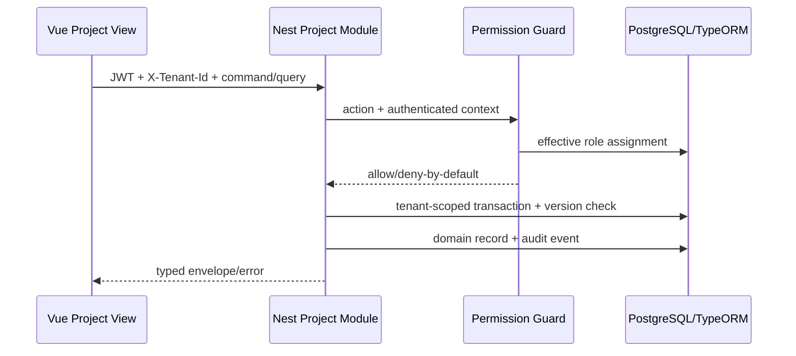

# ExecPlan — US-001 Project Master end-to-end

> **Status:** Completed  
> **Owner:** Codex / Engineering  
> **Created:** 2026-07-11  
> **Updated:** 2026-07-11  
> **Approval:** Product Owner xác nhận trực tiếp trong hội thoại ngày 2026-07-11

## 1. Mục tiêu và kết quả người dùng

Người dùng đã đăng nhập có thể quản lý Company, Legal Entity, Portfolio và Project Master trên đúng tenant; tạo Project kèm Site chính, lọc/xem/sửa/lưu trữ Project theo quyền, không xóa cứng, có optimistic concurrency và audit. Bootstrap user có quyền PMO/Tenant Admin để Product Owner kiểm thử trên EC2 sau deploy.

## 2. Nguồn và requirement IDs

- Baseline: `docs/Đề xuất tính năng nền tảng Solar và BESS.md`
- Source Feature IDs: `PFM-001`, `PFM-002`, `PRJ-001`
- Business Requirements: `BR-001`, `BR-031`, `BR-033`
- Functional/Non-functional/Security: `FR-010…FR-025`, `NFR-012`, `SEC-105…SEC-111`, `SEC-118`
- Use cases/stories/workflows: `UC-001`, `US-001`, `WF-001`
- Acceptance/tests: `AC-001…AC-004`, `TEST-001…TEST-004`, negative tenant tests `TEST-202…TEST-208`
- ADR/API/Data: `ADR-001`, `ADR-004`, `API-003…API-007`, `API-015…API-025`, `DB-001…DB-013`, `DB-098`

## 3. Hiện trạng repository

- NestJS/TypeORM/PostgreSQL auth base có `Tenant`, `UserAccount`, `LocalCredential`, `AuthenticationSession`, `AuditEvent`; migration chạy qua `npm run migration:run --workspace=@solar-bess/api`.
- JWT access/refresh, tenant header guard, Argon2id, encrypted credential env và bootstrap user đã có.
- Chưa có Role/RoleAssignment, organization/project entities, Project API hoặc frontend Project Master.
- Vue base đã tách `api`, `components`, `layouts`, `stores`, `types`, `views`; hiện chỉ có Login/Dashboard.
- Docker Compose có PostgreSQL/API/Web và Nginx public port 80.

## 4. Phạm vi

### In scope

- Chốt các quyết định Product Owner về tenant, Company–LegalEntity, project code, site, lifecycle và role ban đầu.
- TypeORM entities/migration/rollback cho DB-002/003/006/007/009…011/013 và audit payload tối thiểu.
- Seed idempotent tenant, Company, Legal Entity, Portfolio, role/assignment và sample Project/Site.
- Permission guard mở rộng được theo action; deny-by-default và tenant isolation.
- API organization/portfolio/project cần cho US-001; DTO riêng, pagination/filter, idempotency create, If-Match update, audit.
- Frontend danh sách/tạo/chi tiết/sửa/lưu trữ Project; shared navigation/loading/empty/error states.
- Unit, integration, migration up/down/up, E2E và public smoke test.

### Out of scope

- Package/WBS/schedule/health calculation và các story sau US-001; chúng được thực hiện bằng ExecPlan kế tiếp mà không thay đổi quyết định trong kế hoạch này.
- SSO/MFA production, managed KMS, production HA/DR và external integration.
- Mọi OT/BESS command; PM Web tiếp tục không có write path tới OT.

## 5. Assumption, TBD và Open Question

Không có Open Question chặn US-001. HTTPS/SSO/managed secrets vẫn là TBD production đã tồn tại, không thuộc EC2 test slice.

## 6. Thiết kế và luồng dữ liệu

- Module code nằm tại `src/modules/project-management`; TypeORM entities/migrations ở `src/database`.
- `PermissionGuard` đọc action metadata, role assignment có effective period; query/project command luôn thêm `tenantId`.
- Create Project transaction tạo Project, Site chính và AuditEvent; update/archive dùng `versionNo`/`If-Match` để chống silent overwrite.
- Frontend module API chỉ chứa URL/params; auth/tenant/error/refresh nằm ở HTTP client chung.

## 7. API, dữ liệu và bảo mật

- API: triển khai `API-003…007`, `API-015…022`, `API-025` cần cho AC-001…004; OpenAPI thay `GenericCommand` bằng schema US-001 cụ thể trước khi code được coi hoàn tất.
- Data: tenant là customer/group isolation boundary; Company 0..n Legal Entity; Legal Entity thuộc đúng một Company; project code unique trong tenant; Project 1..n Site; COD tổng ở Project.
- Lifecycle: type `SOLAR|BESS|HYBRID`; phase `INITIATION|PLANNING|EXECUTION|COMMISSIONING|COD|HANDOVER|O_AND_M`; status `DRAFT|ACTIVE|ON_HOLD|CLOSED|CANCELLED|ARCHIVED`.
- Security: role `PMO`, `PROJECT_MANAGER`, `EXECUTIVE`, `TENANT_ADMIN`; bootstrap user nhận PMO + Tenant Admin. Tenant Admin không tự có project permission. Role/permission catalog mở rộng qua seed/migration, không hard-code theo user.
- Audit: create/update/archive/permission denial lưu actor, tenant, object/action/result, correlation và metadata thay đổi không chứa secret.
- OT: không áp dụng; không có API/UI command tới OT.

## 8. Ma trận truy vết thực thi

| Requirement/ADR | Milestone | File/component | Acceptance/Test | Trạng thái |
|---|---|---|---|---|
| FR-010…015; DB-002/003/009…011/013 | M2 | database entities/migration/seed | AC-001…004 / TEST-001…004 | Implemented |
| SEC-105…111/118; DB-006/007/098 | M2 | identity-access permission/audit | TEST-202…208 | Implemented |
| API-003…007/015…022/025 | M2 | project-management controllers/services/DTO | TEST-001…004 | Implemented |
| US-001; WF-001 | M3 | web project API/views/components | TEST-001…004 E2E | Implemented |
| ADR-001/004; NFR-012 | M4 | migration/concurrency/deployment | integration/migration/smoke | Implemented |

## 9. Milestone và bước thực hiện

### M1 — Documentation gate và quyết định

- [x] Ghi quyết định PO vào open-question registry, data/security/workflow/API/test/traceability/changelog.
- [x] Cụ thể hóa OpenAPI schema/request/response cho US-001.
- [x] Kiểm tra IDs/link/YAML.

**Exit criteria:** US-001 decision-complete và được ghi build-ready.

### M2 — Backend vertical slice

- [x] Tạo entities, migration có `down`, seed idempotent và entity registry.
- [x] Tạo permission metadata/guard/service và effective role lookup.
- [x] Tạo organization/portfolio/project DTO/controller/service với tenant scope, idempotency, concurrency và audit.
- [x] Thêm unit/integration/migration/negative tests.

**Exit criteria:** API đáp ứng AC-001…004 và tenant/permission negative paths.

### M3 — Frontend Project Master

- [x] Thêm typed `project.api.ts`, types, auth permission state và centralized HTTP client usage.
- [x] Thêm Project list/form/detail views, shared form/table/status components và navigation/routes.
- [x] Thêm unit/structure tests và Vietnamese-capable system font.

**Exit criteria:** user đăng nhập có thể hoàn tất luồng create/list/view/update/archive trên UI.

### M4 — Validation và deploy EC2

- [x] Chạy lint/type/unit/build từng workspace với timeout.
- [x] Recreate test DB được PO cho phép; migration up/down/up, seed và password-hash audit.
- [x] Chạy integration/E2E gồm duplicate, If-Match, deny, cross-tenant, archive.
- [x] Rebuild Docker Compose, healthcheck và public smoke test.
- [x] Cập nhật progress/evidence/docs/changelog.

**Exit criteria:** combined build public hoạt động; lỗi/blocker được báo chính xác, không có test pass giả.

## 10. Kế hoạch kiểm thử và chất lượng

| Loại | Command/quy trình | Requirement/Test IDs | Expected result |
|---|---|---|---|
| API lint | `timeout 60s npm run lint --workspace=@solar-bess/api` | NFR-012 | Exit 0 |
| API type | `timeout 60s npm run typecheck --workspace=@solar-bess/api` | NFR-012 | Exit 0 |
| API unit | `timeout 90s npm run test:unit --workspace=@solar-bess/api` | TEST-001…004/202…208 | Pass |
| API integration | `timeout 180s npm run test:integration --workspace=@solar-bess/api` | TEST-001…004/202…208 | Pass |
| Web lint/type/unit/build | workspace scripts, timeout 120s mỗi lệnh | TEST-001…004 | Pass |
| Migration | run/revert/run trên DB test sạch | DB-002…013 | Schema + rollback pass |
| E2E | Playwright auth + Project Master | TEST-001…004 | Pass |
| Security | cross-tenant ID/list, role deny, raw password query | SEC-105…111/118 | Zero leak/raw secret |

## 11. Migration, rollout và rollback

- PO xác nhận DB test không có dữ liệu cần giữ; vẫn dùng migration và kiểm `down/up`, không sửa migration auth đã chạy.
- Rollout: materialize DB secrets → DB healthy → migration run → bootstrap seed → API/Web rebuild → smoke.
- Rollback: dừng app mới, chạy migration revert khi schema chưa có dữ liệu cần giữ, khôi phục image cũ; không xóa audit ở môi trường có dữ liệu thật.
- Trigger rollback: migration/health/auth/project smoke fail hoặc tenant isolation fail.

## 12. Rủi ro và biện pháp

| Rủi ro | Xác suất/tác động | Tín hiệu | Giảm thiểu | Owner |
|---|---|---|---|---|
| Scope toàn backlog rất lớn | Cao/Cao | Story chưa decision-complete | Hoàn tất từng vertical slice, tạo ExecPlan kế tiếp liên tục | Product/Engineering |
| Tenant/role leak | Trung bình/Rất cao | cross-tenant/deny test fail | deny-by-default, tenant predicates, negative integration | Security/Engineering |
| Generic OpenAPI không đủ contract | Cao/Cao | DTO lệch docs | schema riêng và contract validation | Engineering |
| Deploy command treo | Trung bình/Trung bình | không output/health retry | timeout ngắn, poll, dừng khi blocker rõ | Engineering |

## 13. Decision Log

| Ngày | Quyết định | Lý do | ADR/Requirement liên quan | Người phê duyệt |
|---|---|---|---|---|
| 2026-07-11 | US-001 là vertical slice đầu tiên, sau đó tiếp tục backlog | PO yêu cầu hoàn thiện tính năng liên tục | US-001 | Product Owner |
| 2026-07-11 | Tenant là customer/group boundary; Company 0..n Legal Entity, Legal Entity thuộc một Company | Đóng constraint tổ chức | DB-001…003 | Product Owner |
| 2026-07-11 | Project code unique tenant; 1..n Site; COD tổng ở Project | Đóng constraint Project | DB-010/011 | Product Owner |
| 2026-07-11 | Chốt type/phase/status và archive-only | Tách lifecycle phase/record state | WF-001/DB-010 | Product Owner |
| 2026-07-11 | Role catalog ban đầu mở rộng được; bootstrap PMO + Tenant Admin | Kiểm thử và deny-by-default | SEC-106/107 | Product Owner |
| 2026-07-11 | Test DB có thể tái tạo và seed | Không có dữ liệu cần giữ | ADR-004 | Product Owner |

## 14. Progress Log

| Ngày | Hoàn thành | Bằng chứng/command | Blocker/next step |
|---|---|---|---|
| 2026-07-11 | PO đóng 6 quyết định và repository discovery | Hội thoại; đọc `.agent/PLANS.md`, source/manifests/compose/docs | Cập nhật documentation gate |
| 2026-07-11 | M1 documentation gate hoàn tất; OpenAPI 0.3.0 hợp lệ | `timeout 60s npm run openapi:lint` exit 0 | Triển khai backend M2 |
| 2026-07-11 | M2 backend hoàn tất | API lint/type/build; unit 15/15; integration 13/13; migration up/down/up | Triển khai frontend M3 |
| 2026-07-11 | M3 frontend hoàn tất | Web lint/type/build; unit 19/19; lazy Project chunks | Combined deploy/E2E |
| 2026-07-11 | Blank-screen discovery và fix | Browser diagnostic: lazy import timeout do top-level-await deadlock; bỏ TLA, explicit initial route; browser smoke pass | Chạy full E2E |
| 2026-07-11 | M4 và US-001 hoàn tất | Playwright 3/3; Compose healthy; public health/database OK; HTTP 200 | Tạo ExecPlan story kế tiếp khi decision-complete |

## 15. Kết quả và bàn giao

- Outcome: US-001 Project Master end-to-end đã Implemented và deploy tại `http://54.255.223.131` trên EC2 test.
- Backend: centralized entities/migration/rollback/seed; extensible PostgreSQL-backed RBAC; tenant/project scope; audit; organization/portfolio/project/site/party APIs.
- Frontend: permission navigation, Project list/create/detail/update/activate/archive, Site và Project Party flows; module API chỉ chứa contract/URL/params và dùng HTTP client chung.
- Validation: API unit 15/15, Web unit 19/19, integration 13/13, Playwright 3/3, OpenAPI valid, builds/lint/type pass, public smoke pass.
- Migration/rollback: `1783728000000-CreateProjectMaster` pass `up → down → up`; deploy migration idempotent/no pending. Test DB disposable; E2E user/password đã cleanup.
- Discovery: top-level await ở web entry tạo circular module wait với lazy routes; được thay bằng non-blocking bootstrap entry và explicit initial router navigation.
- Files: tạo Project entities/enums/migration/module/DTO/permission/test; tạo frontend Project API/types/component/views/styles/E2E; sửa auth identity/store/router/bootstrap/Compose/docs. Không xóa requirement/history hoặc tạo OT control path.
- Assumption/TBD/Open Question còn lại: không có blocker của US-001. HTTPS/Cookie Secure, production SSO/MFA, managed KMS/secrets, CI/IaC/SBOM và policy của story sau vẫn là production/later-slice TBD đã ghi trong docs.
- Follow-up: US-002 cần Health Score formula/threshold/confidence/hard-cap decisions trong `docs/16-open-questions-and-decisions.md`; không tự biến TBD đó thành code.
