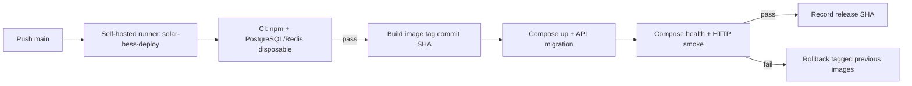

# ExecPlan — CI/CD self-hosted cho nhánh main trên EC2 test

> **Status:** In Progress
> **Owner:** Platform Engineering / repository owner
> **Created:** 2026-07-12
> **Updated:** 2026-07-12
> **Approval:** Người dùng yêu cầu trực tiếp ngày 2026-07-12; production vẫn TBD

## 1. Mục tiêu và kết quả người dùng

Mỗi push vào `main` của repository GitHub chạy đầy đủ quality gate trên chính EC2 test. Chỉ commit vượt qua CI mới được build thành image định danh theo SHA và triển khai bằng Docker Compose; deployment phải chờ healthcheck, smoke test và tự phục hồi image trước nếu rollout lỗi.

## 2. Nguồn và requirement IDs

- Baseline: `docs/Đề xuất tính năng nền tảng Solar và BESS.md`
- Source Feature IDs: Không áp dụng; thay đổi DevOps, không thay đổi phạm vi nghiệp vụ.
- Business Requirements: `BR-040`
- Functional/Non-functional/Security: `NFR-007`, `NFR-021`, `NFR-023`, `SEC-124`
- Use cases/stories/workflows: `US-024`; workflow deploy nằm trong `docs/14-devops-and-deployment.md`, không cấp mã nghiệp vụ mới.
- Acceptance/tests: `AC-113…AC-116`, `TEST-196`, `TEST-221`
- ADR/API/Data: `ADR-001`; API/Data không áp dụng vì không đổi contract hoặc schema.

## 3. Hiện trạng repository

- Monorepo npm workspaces có command `npm ci`, lint, typecheck, unit, integration, OpenAPI lint và build.
- `docker-compose.yml` triển khai PostgreSQL 17, Redis, API, worker và web; API tự chạy TypeORM migration trước khi start.
- Ngày 2026-07-12, `sudo docker compose ps --all` xác nhận năm service runtime healthy, web mở cổng 80; hai service test cũng healthy.
- Repository chưa có `.github/workflows`; máy chưa có `actions.runner` service và không có GitHub CLI.
- Deployment dùng `.env` ignored và runtime secret files ngoài Git; workflow không được đọc/ghi secret vào repository hoặc log.

## 4. Phạm vi

### In scope

- GitHub Actions workflow cho push `main` và manual dispatch trên self-hosted runner chuyên biệt.
- CI gates theo command thật; PostgreSQL/Redis disposable cho integration.
- Image tag theo commit SHA, serialized deploy, Compose rollout, health/smoke và rollback image.
- Runbook cài/đăng ký runner, secret/env, branch protection và recovery.
- Cập nhật DevOps, traceability, open question, index và changelog.

### Out of scope

- Production deployment, domain/TLS, registry, multi-host HA, IaC, SBOM/signing/SAST/DAST.
- Tự tạo GitHub registration token hoặc thay đổi repository settings khi chưa có GitHub credential.
- Thay đổi business/API/schema và mọi write path OT/BESS.

## 5. Assumption, TBD và Open Question

| Loại | Nội dung | Owner cần xác nhận | Hạn/điều kiện đóng | Tác động nếu chưa đóng |
|---|---|---|---|---|
| Assumption | Runner chạy user `ec2-user`, có passwordless `sudo docker compose`, label `solar-bess-deploy` và chỉ repository tin cậy được dùng runner | Server/repository owner | Khi đăng ký runner và chạy workflow đầu tiên | Job deploy không chạy hoặc bị queue |
| Assumption | `/home/ec2-user/SOLAR_BESS_WEB/.env` và runtime secret files hiện tại là cấu hình EC2 test hợp lệ | Server owner | Trước workflow deploy đầu tiên | Deploy fail closed trước khi thay container |
| TBD | Branch protection bắt buộc status check `CI` và quyền manual dispatch | Repository admin | Sau workflow đầu tiên xuất hiện trên GitHub | Direct push vẫn kích hoạt pipeline nhưng không có PR gate |
| Open Question | Registry, signing/SBOM/provenance và production approval profile | Platform/Security/Product Owner | Trước production | Pipeline chỉ được công nhận cho EC2 test |

## 6. Thiết kế và luồng dữ liệu

Runner checkout tách khỏi deployment config. Script chỉ đọc `.env` cố định trên host, dùng Compose project cố định để giữ volumes, không ghi plaintext secret vào log. PM Web/O&M/OT boundary không đổi; pipeline không tạo kết nối hoặc command OT.

## 7. API, dữ liệu và bảo mật

- API: Không đổi OpenAPI/API operation.
- DB: Không tạo schema mới; migration hiện có chạy trong API container. Rollback deployment không tự revert migration vì migration phải backward-compatible theo `NFR-023`.
- Security: workflow permission read-only cho contents; không dùng pull request từ fork; self-hosted deploy chỉ chạy push `main`/manual; secret ở host; shell fail-fast; concurrency và file lock.
- OT: read-only boundary không đổi, không có OT credential/write route.

## 8. Ma trận truy vết thực thi

| Requirement/ADR | Milestone | File/component | Acceptance/Test | Trạng thái |
|---|---|---|---|---|
| NFR-023, ADR-001 | M1/M2 | workflow, Compose, deploy script | TEST-196 | In Progress |
| SEC-124 | M1/M3 | least-privilege workflow/runbook | TEST-221 (subset CI; full supply-chain TBD) | In Progress |
| NFR-007, NFR-021 | M2 | health, smoke, rollback evidence | AC-113…116 | In Progress |

## 9. Milestone và bước thực hiện

### M1 — Pipeline và release contract

- [x] Tạo workflow self-hosted với concurrency, CI gates và deploy dependency.
- [x] Tag ba application image bằng commit SHA và giữ Compose project hiện hữu `solar_bess_web`/volume ổn định.
- [x] Tạo deploy script có validation, lock, health, smoke và rollback.

**Exit criteria:** Workflow hợp lệ về cú pháp; script shell lint/syntax pass; Compose config render pass.

### M2 — Runtime validation EC2 test

- [x] Chạy lint/type/unit/integration/OpenAPI/build thực tế; sửa đúng correction presence/null fallback và stale CSV expectation; toàn bộ gate pass.
- [x] Chạy deploy script, xác nhận năm service healthy và HTTP smoke pass.
- [ ] Không xóa volume/data; ghi exact evidence.

**Exit criteria:** Local gates pass và deployment sau thay đổi healthy; failure/rollback path được static/safe validation nếu không chủ động phá runtime.

### M3 — Governance và handoff runner

- [x] Cập nhật docs DevOps, traceability, open questions, index và changelog.
- [x] Ghi lệnh đăng ký runner/service và GitHub branch protection.
- [x] Ghi rõ bước cần credential/admin mà Codex chưa thể thực hiện.

**Exit criteria:** Repository owner có runbook đủ để nối runner; không tuyên bố hosted run trước khi có evidence GitHub.

## 10. Kế hoạch kiểm thử và chất lượng

| Loại | Command/quy trình | Requirement/Test IDs | Expected result |
|---|---|---|---|
| Lint | `npm run lint` | NFR-023 | Exit 0 |
| Type-check | `npm run typecheck` | NFR-023 | Exit 0 |
| Unit | `npm run test:unit` | Regression | Pass |
| Integration | test Compose + `npm run test:integration` | TEST-196 | Pass |
| Contract/build | `npm run openapi:lint`; `npm run build` | SEC-124/NFR-023 | Exit 0 |
| Deployment | deploy script; Compose ps; HTTP `/web-health`, `/health` | NFR-007/NFR-021 | Five runtime services healthy; HTTP 200 |

## 11. Migration, rollout và rollback

- Không có migration mới trong thay đổi CI/CD. API image vẫn chạy pending migrations trước app startup.
- Trước rollout, tag ba image đang chạy thành rollback tag. Build SHA mới rồi `up -d --wait` theo Compose project cố định.
- Trigger rollback: Compose wait fail hoặc HTTP smoke fail. Script dùng rollback tag, chạy `up -d --wait` và smoke lại.
- Không tự revert database migration; schema/API changes phải backward-compatible. Nếu migration không tương thích, pipeline dừng và cần forward-fix/recovery được phê duyệt.

## 12. Rủi ro và biện pháp

| Rủi ro | Xác suất/tác động | Tín hiệu | Giảm thiểu | Owner |
|---|---|---|---|---|
| Runner chưa đăng ký | Cao/Trung bình | Job queued | Runbook + label cố định; cần repo admin token | Repository owner |
| CI và runtime tranh tài nguyên | Trung bình/Cao | OOM/latency | concurrency 1, disposable test services, cleanup always | Platform |
| Secret/env thiếu | Trung bình/Cao | preflight fail | Fail trước build/up; không log value | Server owner |
| Migration forward làm image cũ không tương thích | Thấp/Cao | rollback unhealthy | backward-compatible migration gate; forward-fix, không blind down | Engineering/Data |
| Self-hosted runner chạy code không tin cậy | Trung bình/Cao | PR/fork trigger | chỉ push main/manual, dedicated label, protected main | Repository admin/Security |

## 13. Decision Log

| Ngày | Quyết định | Lý do | ADR/Requirement liên quan | Người phê duyệt |
|---|---|---|---|---|
| 2026-07-12 | Dùng GitHub Actions self-hosted runner trên EC2 test, không dùng SSH deploy secret | User yêu cầu CI/CD chạy ngay trên máy; giảm secret vận chuyển | ADR-001, SEC-124 | Người dùng |
| 2026-07-12 | Image tag theo commit và rollback application image; không auto-down migration | Truy vết release và tránh phá dữ liệu | NFR-007, NFR-023 | Người dùng delegated |

## 14. Progress Log

| Ngày | Hoàn thành | Bằng chứng/command | Blocker/next step |
|---|---|---|---|
| 2026-07-12 | Audit repo/runtime | `git status`, manifests, docs; `sudo docker compose ps --all`: runtime healthy | Implement workflow/script/docs; runner registration cần GitHub token |
| 2026-07-12 | Materialize pipeline/runbook và static validation | `bash -n`; Compose `config --quiet`; `git diff --check` pass | GitHub runner chưa đăng ký |
| 2026-07-12 | Chạy local CI gates | `npm ci` 995 packages/0 vulnerabilities; lint/typecheck pass; unit 100/100; build pass; integration 33/35; OpenAPI 1 error/15 warnings | Sửa Project Controls integration fixture/state expectation và OpenAPI schema trước deploy |
| 2026-07-12 | Xác nhận runtime không bị tác động khi CI fail | `/web-health` OK; `/health` trả database/redis OK; năm runtime service healthy | Giữ nguyên release hiện tại, không bypass deploy gate |
| 2026-07-12 | Đóng CI blocker và rollout bằng script mới | lint/typecheck/build pass; unit 100/100; API integration 35/35; worker integration 7/7; OpenAPI valid với 15 warning; release `cicd-setup-20260712`, năm service healthy, HTTP smoke pass | Đăng ký runner và chạy GitHub workflow lần đầu |

## 15. Kết quả và bàn giao

- Outcome: Repository CI/CD implementation và local EC2 rollout validation hoàn tất; GitHub activation còn runner registration/first run.
- File tạo: `.github/workflows/main-cicd.yml`, `scripts/deploy-ec2.sh`, `docs/17-self-hosted-cicd-runbook.md`, ExecPlan này. File sửa: `docker-compose.yml`, DevOps/Traceability/Open Questions/INDEX/CHANGELOG. Không đổi tên/xóa file.
- Test/validation: install/lint/type/unit/integration/OpenAPI/build/static Compose/shell và runtime deploy/smoke pass; OpenAPI còn 15 non-blocking warning thuộc US-004 contract.
- Changelog/traceability: đã cập nhật.
- Assumption/TBD/Open Question: xem mục 5.
- Follow-up: đăng ký runner bằng one-time token, chạy GitHub workflow lần đầu và bật branch protection.
