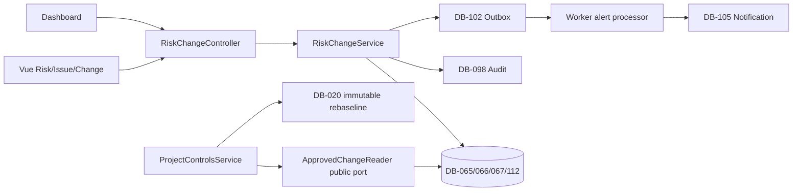

# ExecPlan — US-004 Risk, Issue và Change Control

> **Status:** Local implementation and pre-push quality gate complete — acceptance evidence Partial; actual GitHub Actions/EC2 deployment and full E2E Pending
> **Owner:** Codex / Engineering
> **Created:** 2026-07-12
> **Updated:** 2026-07-18
> **Approval:** Người dùng/Product Owner trao quyền quyết định và yêu cầu thực hiện liên tục không cần hỏi lại trong hội thoại ngày 2026-07-11/12; quyết định trong plan này áp dụng cho EC2 test profile

## 1. Mục tiêu và kết quả người dùng

Khi hoàn tất, thành viên dự án có quyền có thể ghi nhận Risk và Issue ở hai register riêng, gán owner/action/due/evidence, theo dõi exposure/aging/history và xem cảnh báo overdue trên Command Center. PM có thể tạo Change Request từ Risk/Issue mà không mất liên kết/bằng chứng, submit để một approver độc lập APPROVE/RETURN/REJECT, rồi dùng đúng approved Change Request cùng tenant/project để tạo rebaseline trong Project Controls.

Risk/Issue chỉ đóng qua closure decision có evidence; người yêu cầu đóng không tự duyệt. Risk đã xảy ra phải liên kết Issue. Approved impact/decision và baseline provenance bất biến. PM Web không tạo bất kỳ OT/BESS command nào.

## 2. Nguồn và requirement IDs

- Baseline: `docs/Đề xuất tính năng nền tảng Solar và BESS.md`
- Source Feature IDs: `RSK-001…RSK-008`; source story `US-E04`
- Business Requirements: `BR-022`, `BR-031`, `BR-032`
- Functional Requirements: `FR-098…FR-105`; direct AC slice materialize `FR-098…FR-102` và risk/issue/change subset `FR-104`; `FR-103/DB-068 Claim` phụ thuộc Contract/Legal và external dependency portion `FR-105` phụ thuộc các source module sau
- Non-functional/Security: `NFR-007`, `NFR-012`, `NFR-014`, `NFR-016`, `NFR-017`, `NFR-020…NFR-023`; `SEC-105…SEC-111`, `SEC-114`, `SEC-118`, `SEC-119`
- Use case/story/workflows: `UC-004`, `US-004`, `WF-015`, `WF-021`; downstream `WF-003`
- Acceptance/tests: `AC-014…AC-017`; `TEST-014…TEST-017`, `TEST-185`, `TEST-187`, `TEST-189`, `TEST-190`, `TEST-193…TEST-196`, `TEST-202…TEST-208`
- ADR/API/Data: `ADR-001`, `ADR-004`, `ADR-006`; concretize `API-008`, `API-038`, cấp mới `API-143…API-164` (`API-159` do Project Controls sở hữu reverse trace); `DB-065…DB-067`, cấp mới `DB-112 RiskIssueAction` và `DB-113 RiskIssueClosureCycle`; dùng `DB-098 AuditEvent`, `DB-020 ScheduleBaseline`, `DB-102…DB-105`; `DB-068 Claim` là dependency, không bị trình bày như đã materialize

## 3. Hiện trạng repository

- Modular monolith NestJS/TypeORM/PostgreSQL đã có `modules/risk-change`, Identity-owned scoped assignee API-008 và Project Controls-owned positive REBASELINE/API-159; OpenAPI đánh dấu API-008/036/038/143…164 `implemented` cho local profile.
- DB-065/066/067/112/113 được materialize bằng migration `1783731000000-CreateRiskIssueControl`, `1783732000000-CreateChangeControl`; DB-105 được generalize bởi `1783733000000-GeneralizeNotifications`; `1783734000000-AddActionResidualRationale` bổ sung rationale cho versioned residual proposal. Entity registry và migration DataSource đã được nối.
- Deploy audit đã mở và data handoff đã hoàn tất forward migration `1783735000000` để reconcile live-schema constraints/functions cùng `1783736000000` để nâng existing seed role grants/policy v3. Focused RiskChange migration suite 7/7 và exact isolated CI-like full integration đã Pass; migration inventory local/pre-push được chốt nhưng chưa phải EC2 deployment evidence.
- `ScheduleBaselineEntity.approvedChangeRequestId` có composite provenance/FK tới approved DB-067; `ApprovedChangeReader` mở positive REBASELINE trong Project Controls transaction và API-159 giữ reverse trace. INITIAL và REBASELINE đều đã implemented local.
- DB-102 transactional outbox, DB-103 consumer checkpoint, DB-104 command receipt và generalized DB-105 Notification projection đã materialize; worker có event processor, scoped recipient re-check, dedup và repeatable Risk/Issue/Action/Change scanner.
- Vue đã có Risk/Issue/Action/Change API/types/views/components/routes, Dashboard lane, closure-cycle/deep-link/mobile guards và scoped permission binding.
- Final pre-push evidence: post-fix root lint/type-check/build API/Web/Worker Pass; unit API 14 suites/52, Web 20 files/55, Worker 12 suites/61 = 168; Web focused Risk/Issue closure-form exact-payload 4/4 và backend focused HTTP closure 6/6 post-fix. Exact isolated-port full integration API 8 suites/49 + Worker 3 suites/11 = 60 đã Pass trước final branch hardening; các branch thay đổi sau đó đều có focused post-fix evidence. Focused RiskChange migration 7/7 và OpenAPI lint Pass; Web build 1,697 modules; CI-like stack `15433/16380` Pass. GitHub Actions actual rerun/push/deploy, EC2 health/public smoke và full E2E chưa có evidence mới, vì vậy acceptance/deployment không được ghi Pass.
- Historical US-003/core deployment evidence được giữ riêng; đối với US-004, actual GitHub Actions push/deploy, EC2 health/public authenticated smoke và full story E2E vẫn Pending.

## 4. Phạm vi

### In scope

- Project-scoped Risk DB-065, Issue DB-066, ChangeRequest DB-067, RiskIssueAction DB-112 và immutable-per-cycle RiskIssueClosureCycle DB-113 bằng TypeORM entity/migration/repository.
- Risk 1–5 probability cùng cost/schedule/HSE matrix, inherent/residual exposure, category/owner/review date/response strategy/trigger/contingency/evidence, scoring/threshold version và state guard.
- Issue actual impact/root cause/severity/owner/target/evidence; optional same-project source Risk; Risk Occurred được liên kết Issue atomically.
- Action riêng cho Risk/Issue, stable code/type, owner/due/status/evidence/residual update; DONE ghi completion evidence, VERIFIED hoặc authorized CANCELLED cần full-project actor độc lập và immutable verification/cancellation facts; optimistic version và immutable audit/outbox history.
- Closure request qua update state và independent closure decision; closure evidence bắt buộc, high/critical không thể đóng bằng comment.
- Mỗi closure request append DB-113 sequence; decision facts all-or-none và chỉ complete row chưa quyết định đúng một lần. Reopen/re-close tạo sequence mới, không overwrite prior comment/evidence; Risk/Issue scalar facts là latest projection. Detail API page authorized cycles bằng opaque cursor, stable sequenceNo/id, default 50/max 100 và theo nextCursor đến null thay vì array unbounded.
- Change Request từ Risk/Issue/manual; copy source/evidence snapshot, complete six-dimension impact, baseline references, submit và independent decision; approved impact/decision immutable.
- Public `APPROVED_CHANGE_READER` application port được RiskChangeModule export; ProjectControls resolve approved same-scope/same-current-baseline/schedule-impact DB-067 trong transaction và mở positive REBASELINE mà không import entity/repository riêng của module.
- Project/tenant/package deny-by-default: Risk/Issue/Change có `packageId` nullable; package-only assignment chỉ đọc/tạo/sửa record đúng package, không thấy project-level/null hoặc package khác; role catalog mở rộng idempotent.
- DB-105 được generalize từ physical schedule-only projection thành Notification projection để worker cảnh báo action overdue đúng recipient, scope và dedup; Schedule behavior không đổi.
- Scoped assignee query API-008, detail/action list API-160…164, Vue API/types/view/components/routes, project entry point và Dashboard risk/issue/change lane; desktop/tablet CRUD/review, mobile read/action update, không mobile approval.
- Canonical docs/OpenAPI/trace/changelog, unit/integration/E2E/migration/rollback/security/deploy evidence.

### Out of scope

- `DB-068 Claim`, notice/quantum/negotiation và Variation/contract amendment vì physical Contract/Legal aggregate của US-006 chưa tồn tại. Requirement `FR-103` không bị xóa; được giữ dependency rõ và triển khai trong slice Contract/Claim sau.
- Early-warning ingestion từ delivery/obligation/NCR/punch chưa materialize; `FR-105` direct source adapters chờ source modules. Risk/Issue/Change event contract và schedule link được tạo để tích hợp additive sau.
- Dynamic workflow designer/quorum/value authority của US-018; V1 dùng fixed role permission + independent actor SoD cho EC2 test, không tuyên bố production approval policy.
- External party sharing, legal privileged Claim fields, Elasticsearch và AI.
- Mọi OT/BESS control.

## 5. Assumption, TBD và Open Question

| Loại | Nội dung | Owner cần xác nhận | Hạn/điều kiện đóng | Tác động nếu chưa đóng |
|---|---|---|---|---|
| Assumption đã được delegated quyết định | Probability và cost/schedule/HSE impact dùng integer 1…5; `impactRating=max(dimensions)`, exposure = probability × impactRating; HIGH từ 15, CRITICAL từ 20 | Product Owner/PMO | EC2 test review; giá trị env có validation | Có thể đổi threshold additive, không đổi history score |
| Assumption đã được delegated quyết định | PMO/PROJECT_MANAGER có full direct permissions; EXECUTIVE read; PROJECT_CONTROLS read/create/manage/submit/requestClosure; PACKAGE_OWNER read/create/manage/requestClosure exact-package; PMO/PROJECT_MANAGER/PROJECT_CONTROLS/PACKAGE_OWNER có thêm `user.read` tối thiểu đúng scope để dùng API-008 | Product Owner/Security | Security review | Tránh cross-package/directory elevation trong khi owner picker vẫn dùng được |
| Assumption đã được delegated quyết định | Mọi closure cần request + approver khác requester; không chỉ high/critical | Product Owner/Internal Control | UAT | Chặt hơn tối thiểu AC-017 nhưng không mở rộng quyền; có thể nới bằng policy version sau |
| TBD | Production authority matrix/quorum/financial thresholds | Process Owner/Legal/Finance/Security | Trước production | EC2 test fixed policy không được dùng làm production approval acceptance |
| Open Question không chặn slice | Claim/Variation implementation order với US-006 và Workflow engine | Product Owner/Legal | Trước FR-103/DB-068 code | Không chặn AC-014…017 hoặc positive schedule rebaseline |

## 6. Thiết kế và luồng dữ liệu

Module boundary:

- Risk state: `IDENTIFIED → ASSESSED → TREATING → MONITORING → CLOSURE_PENDING → CLOSED`; bất kỳ active state có thể `OCCURRED`, nhưng `OCCURRED` cần Issue same scope. Chỉ MONITORING được request closure; RETURN/REJECT luôn về MONITORING. Issue closure RETURN/REJECT luôn về RESOLVED.
- Issue state: `REPORTED → TRIAGED → IN_PROGRESS → RESOLVED → CLOSURE_PENDING → CLOSED`; closure APPROVE ghi verifier/decision và đóng atomically, RETURN/REJECT quay về `RESOLVED`; `CLOSED → REOPENED → IN_PROGRESS` khi có evidence mới.
- Change state: `DRAFT → ASSESSED → SUBMITTED → APPROVED|RETURNED|REJECTED`; `RETURNED → ASSESSED`; later `APPROVED → IMPLEMENTED → CLOSED` chỉ qua explicit downstream command, không cần cho AC hiện tại. Approval chốt `sourceBaselineId`, schedule impact summary, canonical impact snapshot/hash và decision version.
- Create/update/decision chạy qua DB-104 idempotent command receipt. Business row + audit + outbox commit trong một PostgreSQL transaction.
- Query luôn filter `tenantId + projectId + allowed packageIds`; project-level/null record chỉ actor có full-project scope được truy cập. Known UUID ngoài scope trả generic not-found/forbidden theo existing policy, không leak.
- Exposure calculator là pure domain function: server tính `impactRating=max(cost,schedule,HSE)` rồi `exposure=probability×impactRating`; client không ghi field derived. Money delta dùng `numeric(19,4)`/decimal string + ISO currency, không JavaScript floating-point.
- `DB-065 Risk` là authoritative residual SoR. Direct API-144 residual reassessment chỉ full-project actor, bắt expected Risk version/reason/evidence. DB-112 residual là proposal cùng `residualRiskVersion`; DONE không đổi Risk/summary. Independent VERIFY lock Action+Risk, từ chối version conflict với zero write, hoặc atomically copy bốn input sang Risk, recompute/version rồi ghi audit/outbox. VERIFIED/CANCELLED là terminal immutable; authorized CANCELLED giữ actor/time/reason/evidence và cùng VERIFIED là hai trạng thái duy nhất không block parent closure.
- API-149 dùng four-shape union: routine fields, complete DONE, terminal VERIFY, terminal CANCEL. VERIFY/CANCEL không được trộn owner/title/due/residual; server so actor/effective actor với pre-command owner/completedBy và VERIFY chỉ promote proposal đã lưu.
- History read model lấy immutable DB-098 events sau khi xác minh source object tenant/project/package; response redact payload không thuộc public contract.
- DB-098 chỉ timeline/hash, không thay DB-113 closure evidence history. API-160/161 trả cursor-paginated authorized cycle rows ordered stable sequenceNo/id (50 mặc định, 100 tối đa, traverse đến null); completed cycle immutable.
- Worker nhận committed Risk/Issue/Action events và repeatable scan; dedup key gồm tenant/project/source/recipient/type/due/thresholdVersion. Permission bị revoke trước scan/delivery sẽ loại recipient.
- `ApprovedChangeReader.resolveForRebaseline(manager, input)` trả discriminated result `APPROVED` với immutable `changeReason`, `approvedAt/by`, `decisionVersion`, `sourceBaselineId`, `scheduleImpactSummary`, `impactSnapshotHash`; denial ổn định gồm `NOT_FOUND_OR_SCOPE_MISMATCH`, `NOT_APPROVED`, `BASELINE_MISMATCH`, `SCHEDULE_IMPACT_NOT_APPROVED`. ProjectControls gọi port trong DB-104 transaction, dùng reason/impact từ port và không biết DB-067 entity.
- Không có data flow sang O&M/OT; mọi link schedule chỉ là PM Web record provenance.

## 7. API, dữ liệu và bảo mật

### API

- `API-008` scoped assignee lookup yêu cầu grant `user.read` tối thiểu và chỉ trả `id/displayName`; `API-038` create Risk.
- `API-143…158`: list/update Risk; create/list/update Issue; create/update action; create/list/update/submit/decide Change; Risk/Issue closure decision; summary và history.
- `API-159` là Project Controls-owned baseline history query lọc `approvedChangeRequestId`; `API-160…164` là Risk/Issue/Change detail cùng Action list/detail để deep-link và closure verification không phụ thuộc page đầu.
- API-157 heatmap tính trên toàn authorized Risk filter, không phải cursor page API-143; trả đủ 25 inherent + 25 residual cells cho từng `scoringVersion/thresholdVersion` pair và residual-missing count, không silently truncate version group.
- Mutations yêu cầu bearer, `X-Tenant-Id`, correlation và `Idempotency-Key`; update/decision có `expectedVersion`.
- Stable errors: `RISK_NOT_FOUND`, `ISSUE_NOT_FOUND`, `CHANGE_REQUEST_NOT_FOUND`, `ACTION_NOT_FOUND`, `INVALID_STATE_TRANSITION`, `IMPACT_INCOMPLETE`, `CLOSE_EVIDENCE_REQUIRED`, `CLOSE_APPROVAL_SOD`, `CHANGE_APPROVAL_SOD`, `CHANGE_APPROVAL_REQUIRED`, `VERSION_CONFLICT`, `PROJECT_SCOPE_DENIED`.
- Pagination cursor + limit cho register/history; filters status/owner/severity/due/source. Summary safe read, export chưa thuộc slice.

### Dữ liệu

- DB-065/066/067/112/113 có PK UUID, `tenant_id`, `project_id`, `package_id` nullable theo scope, composite FK cùng scope, owner/user composite FK, version/timestamps, no hard delete; DB-113 unique parent+sequence và một undecided cycle/parent.
- `RiskIssueAction` có đúng một trong `risk_id`/`issue_id`; evidence JSONB chỉ chứa array object references, core business fields relational.
- Approved DB-067 source baseline, impact snapshot/hash và decision bị trigger chống overwrite/delete. Closure facts và AuditEvent retained.
- DB-020 thêm composite FK `(tenant_id, project_id, approved_change_request_id)` tới DB-067. Migration fail nếu orphan tồn tại; không tự sửa dữ liệu.
- DB-105 physical rename in-place `schedule_notifications → notifications`: projectId giữ bắt buộc; packageId/activityId nullable; source allowlist `ScheduleActivity|Risk|Issue|RiskIssueAction|ChangeRequest`; alert mapping tương ứng `OVERDUE|NEAR_CRITICAL`, `RISK_REVIEW_DUE`, `ISSUE_TARGET_DUE`, `ACTION_OVERDUE`, `CHANGE_DECISION_PENDING`. Priority server-derived: schedule OVERDUE HIGH/NEAR_CRITICAL NORMAL; Risk effective HIGH|CRITICAL HIGH; Issue severity HIGH|CRITICAL HIGH; Action HIGH; Change NORMAL; Risk/Issue còn lại NORMAL. due/data/threshold luôn non-null và derive lần lượt từ schedule finish/dataDate/version, Risk reviewDate, Issue targetDate, Action dueDate hoặc Change submitted business date + Risk/Change policy version. Source trigger/check, scoped indexes và schedule source filter bắt buộc; down chỉ xóa rebuildable non-schedule projection rồi khôi phục old schedule checks/rows.

### Bảo mật

- Permissions: `riskChange.read/create/manage/submit/approve/requestClosure/close/closeCritical` và scoped `user.read` cho API-008; guard là coarse gate, service re-check tenant/project/package scope, state, source link, actor/effective actor và SoD. Package assignment không bao giờ mở project-level/null record; Change approval, Action VERIFY/CANCEL, authoritative residual và REBASELINE luôn cần full-project scope.
- Requester/submitter không approve Change; creator/owner/closure requester không approve closure; HIGH/CRITICAL thêm `riskChange.closeCritical`; mọi Action trừ VERIFIED hoặc authorized CANCELLED chặn closure; VERIFY/CANCEL cần full-project actor độc lập và evidence; nhiều role/delegation không bypass actor identity.
- Approved DB-067, closed Risk/Issue và audit/outbox không sửa in-place.
- Evidence chỉ là opaque reference trong slice; không tạo file download path hoặc bypass Document ACL.
- Denial/audit payload không chứa credential/token/raw privileged content. Không có OT route/event/permission.

## 8. Ma trận truy vết thực thi

| Requirement/ADR | Milestone | File/component | Acceptance/Test | Trạng thái |
|---|---|---|---|---|
| FR-098/100; DB-065/066 | M1 | entities/domain/service/API | AC-014 / TEST-014 | Implemented local; TEST-014 Partial |
| FR-099/100/104; DB-112/113/098/102 | M1/M3 | action/closure-cycle/history/outbox/worker | AC-015/017 / TEST-015/017 | Implemented local; TEST-015/017 Partial |
| FR-101/102; DB-067 | M2 | Change service/decision/approved port | AC-016 / TEST-016 | Implemented local; TEST-016 Partial |
| WF-021; SEC-108/109 | M1/M2 | closure decision/state guards | AC-017 / TEST-017 | Implemented local; branch coverage Partial |
| AC-012; WF-003 | M2 | ApprovedChangeReader + ProjectControls | TEST-012 positive/negative | Positive/negative API integration implemented; same-journey E2E Partial |
| NFR-007/021; ADR-006; DB-103/105 | M3 | worker notification projection | TEST-015/194 | Implemented local; Worker 3 suites/11 integration Pass, TEST-015 branch acceptance Partial |
| NFR-016/017/020/023 | M3/M4 | Vue/accessibility/deploy | TEST-189/190/193/196 | UI implemented/unit-tested; full accessibility/E2E and deploy Pending |

## 9. Milestone và bước thực hiện

### M0 — Canonical documentation gate

- [x] Concretize Data/API/OpenAPI/Security/UX/WF/Test/Trace/Decision/Backlog cho direct/dependency boundary.
- [x] Cấp `DB-112/113`, concretize `API-008/038`, cấp `API-143…164`; update exact catalog count 164/version.
- [x] Chốt scale/threshold/state/permission/SoD/error/idempotency/migration/rollback và rerun semantic audit sau DB-105/residual correction.
- [x] Chạy OpenAPI lint, unique ID/operation count, relative-link/trace audit và baseline checksum sau correction cuối.

**Exit criteria:** canonical artefacts decision-complete và nhất quán; không có TBD chặn M1; chỉ sau đó production implementation bắt đầu.

### M1 — Risk, Issue và Action vertical slice

- [x] Tạo enums/entities/migration DB-065/066/112/113, constraints/index/FK/down/terminal/cycle guards và registry.
- [x] Pure exposure/state policy với unit tests cho score/state/command policy đã triển khai; acceptance edge matrix còn được theo dõi ở TEST-014/015/017.
- [x] DTO/controller/service cho API-008/038/143…149/154/155/157/158/160/161/163/164; four-shape Action command, full-filter/versioned heatmap, cursor/filter/version/idempotency.
- [x] Audit/outbox atomic; tenant/project/package permission/known-ID denial; role seed idempotent.
- [ ] Integration test Risk-vs-Issue validation, Risk Occurred link, actions/history/closure SoD.

**Exit criteria:** AC-014/015/017 direct API passes; zero cross-scope/partial write; action overdue query deterministic.

### M2 — Change approval và positive rebaseline

- [x] Tạo DB-067/FK/immutability trigger và API-150…153/156/157/162; tích hợp Project Controls API-036/159.
- [x] Copy source/evidence two-way trace; complete impact snapshot, baseline refs, decimal/currency.
- [x] Enforce submit/APPROVE/RETURN/REJECT/version/SoD/audit/outbox trong runtime; RETURN/REJECT/race/cross-project acceptance branches còn thiếu test đầy đủ.
- [x] Export public `ApprovedChangeReader`; inject vào ProjectControls và remove unconditional REBASELINE denial.
- [ ] Integration test missing/unapproved/cross-project/self approval/concurrent decision/successful rebaseline/hash/history.

**Exit criteria:** AC-016/TEST-016 và positive/negative AC-012/TEST-012 pass; approved Change/old baseline immutable.

### M3 — Notification, Dashboard và Risk/Change UX

- [x] Rename/generalize DB-105 `notifications` migration/entity theo nullable package/activity, source validation, scoped indexes, schedule compatibility và safe down contract.
- [x] Worker event processor/repeatable overdue scanner/recipient scope/dedup/retry tests.
- [x] Tạo `src/api/risk-change.api.ts`, types, view/components/routes/styles và permission-aware project navigation.
- [x] Forms/register/action/closure/change submission/decision/history states; mobile approval disabled.
- [x] Dashboard summary lane top exposure/critical issue/overdue action/decision queue; drill-down stable filter.
- [ ] Vitest/Playwright accessibility/loading/empty/error/denied/conflict journeys.

**Exit criteria:** AC-015 alert/Command Center và AC-014…017 UI journey pass; duplicate worker events tạo một projection.

### M4 — Quality gate, migration rehearsal, deploy và close-out

- [x] Root/API/Web/Worker lint, typecheck, unit, integration, OpenAPI, build: post-fix lint/type-check/unit 168/build Pass; exact-port full integration 60 Pass trước final branch hardening; changed branches post-fix được cover bởi backend HTTP 6/6 và Web focused 4/4/full 55.
- [x] Migration `up → down → up` trên disposable PostgreSQL; focused RiskChange migration suite 7/7 chứng minh chain gồm forward reconcile/policy upgrade, schema/rollback/constraints.
- [ ] E2E Risk→Issue/action→Change→independent approval→rebaseline; negative tenant/project/SoD.
- [ ] Build/deploy Compose, idempotent seed, health/public authenticated smoke với bounded timeout/poll.
- [x] Update implementation status, current focused test evidence, trace/changelog/ExecPlan/file inventory và outstanding dependency; final full-integration/build/deploy counts sẽ được bổ sung sau khi root có kết quả.

**Exit criteria:** TEST-014…017 và TEST-012 positive path pass; public EC2 flow hoạt động; core regression pass; Claim/FR-105 dependency được báo chính xác.

## 10. Kế hoạch kiểm thử và chất lượng

| Loại | Command/quy trình | Requirement/Test IDs | Expected result |
|---|---|---|---|
| OpenAPI | `timeout 60s npm run openapi:lint` | API-008/038/143…164 | Exit 0; 164/164 exact/unique IDs/operations, zero warning |
| Lint/type/build | root workspace scripts, timeout 120–240s | NFR-012/023 | Exit 0, zero warning |
| API unit | `timeout 180s npm run test:unit --workspace=@solar-bess/api` | TEST-014…017/185/187 | Exposure/state/DTO/port pass |
| API integration | targeted rồi full `test:integration` timeout 300s | TEST-012/014…017/193/195/202…208 | PostgreSQL assertions pass, zero hidden skip |
| Worker unit/integration | workspace scripts timeout 240s | TEST-015/194/196 | recipient/dedup/retry/scan pass |
| Web unit/build | workspace scripts timeout 240s | TEST-014…017/189/190 | API/components/routes/accessibility pass |
| Migration | show/run/revert/run trên disposable DB | DB-065…067/112/113/020/105 | up/down/up + FK/triggers/closure-cycle pass |
| E2E | `timeout 300s npm run test:e2e` | TEST-012/014…017 | full independent decision journey pass |
| Deploy smoke | Compose wait/health + public UI/API | NFR-006/021 | DB/Redis/API/worker/web healthy |

Fixtures có ít nhất hai tenant, hai project, requester/owner/independent approver và package-only actor; known UUID denial phải chứng minh không leak. Approved Change and baseline hashes queried before/after mutation attempt. Commands luôn dùng unique/replayed idempotency keys.

## 11. Migration, rollout và rollback

- Đã tạo bốn migration additive sau `1783730000000-CreateProjectControls`: `1783731000000-CreateRiskIssueControl`, `1783732000000-CreateChangeControl`, `1783733000000-GeneralizeNotifications` và `1783734000000-AddActionResidualRationale`; không sửa migration đã phát hành.
- Forward reconciliation `1783735000000`/`1783736000000` đã được data agent handoff sau live-schema/policy drift audit; chúng đã nằm trong focused migration 7/7 và full isolated-port integration 60/60. EC2 rollout vẫn phải apply/verify chain này trước API/worker/web.
- Expand-first: create DB-065/066/067/112/113 → validate existing schedule approved-change refs → add composite FK → generalize DB-105 projection. Entity/code chỉ deploy sau migration success.
- DB-105 migration rename giữ schedule rows/dedup/read state; backfill existing packageId từ canonical ScheduleActivity rồi validate; add nullable package/activity and source trigger/index. Down deletes only rebuildable non-schedule projections and fails closed on invalid/non-rebuildable dependencies before restoring schedule-only shape.
- Role seed cập nhật permission catalog idempotent; không nhúng user credential hoặc cấp business role mới cho Tenant Admin.
- Test DB được PO cho phép reset; production-like rollback vẫn giữ source Risk/Issue/Change/Audit. Khi đã có approved Change/rebaseline, không drop source tables; disable routes/worker và forward-fix.
- Migration `down` chỉ dùng disposable DB hoặc khi zero source rows; risk notification projection có thể rebuild, source/audit không được mất. Down đưa Notification về schedule-only sau khi xóa riêng rebuildable non-schedule projection.
- Rollout: docs gate → migration → role seed → API → worker → web → smoke. Rollback: web → worker → API; migration revert chỉ khi preflight count zero và không có approved provenance.
- Trigger rollback: cross-scope leak, SoD bypass, approved impact/baseline mutation, FK orphan, duplicate notification side effect, migration/health/E2E critical fail hoặc bất kỳ OT write path.

## 12. Rủi ro và biện pháp

| Rủi ro | Xác suất/tác động | Tín hiệu | Giảm thiểu | Owner |
|---|---|---|---|---|
| Generic API làm module khó mở rộng | Trung bình/Cao | command switch/untyped payload | Concretize resource endpoints/schema trước code | API/Risk |
| Risk/Issue bị trộn | Trung bình/Cao | nullable probability/rootCause lẫn nhau | Aggregate/table/DTO/state riêng + TEST-014 | Risk |
| Package role thấy project-level/package khác | Trung bình/Rất cao | package assignment pass project guard | Nullable package scope + allowed-package predicate; known-ID tests | Security |
| Self-approved closure/change | Trung bình/Rất cao | actor=requester/submitter | Transaction SoD + role/delegation tests | Security/PMO |
| Approved impact hoặc baseline bị sửa | Thấp/Rất cao | hash/field changed | DB trigger/FK/snapshot + negative SQL test | Data |
| Float tiền gây sai | Trung bình/Cao | JS number/rounding | numeric(19,4), decimal string, currency required | Cost/Data |
| Alert duplicate/stale recipient | Trung bình/Cao | multiple rows/revoked access | outbox/checkpoint/dedup/current assignment query | Platform |
| Claim bị hiểu là đã hoàn thành | Cao/Trung bình | DB-068/API claim absent | Direct/dependency trace và UI/status explicit | Product/Legal |
| Lệnh build/deploy treo | Trung bình/Trung bình | không output/health wait vô hạn | timeout/poll ≤60s và commentary progress | Engineering |

## 13. Decision Log

| Ngày | Quyết định | Lý do | ADR/Requirement liên quan | Người phê duyệt |
|---|---|---|---|---|
| 2026-07-12 | Concretize API-038 thành create Risk và cấp API-143…159 | API planned chưa có consumer; bỏ GenericCommand, tách resource/decision/summary/history và Project Controls-owned reverse baseline query | API-038, NFR-023 | Product Owner delegated/Codex |
| 2026-07-18 | Concretize API-008 và cấp API-160…164; list dùng safe summary, detail/action read riêng | Owner picker, stable deep-link và closure verification cần contract đọc record-level rõ ràng; additive trước runtime | API-008, API-160…164, NFR-023 | Product Owner delegated/Codex |
| 2026-07-18 | REBASELINE chỉ nhận approved Change ID/data date/version; provenance lấy từ immutable approval snapshot | Ngăn client tự khai reason/schedule impact và giữ DB-067→DB-020 trace | API-036/159, DB-020/067, AC-012/016 | Product Owner delegated/Codex |
| 2026-07-18 | DB-065 là residual SoR; Action giữ versioned proposal và chỉ VERIFY độc lập mới atomically apply | Loại bỏ dual-SoR/race và không cho DONE tự đổi heatmap | DB-065/112, API-144/149, TEST-015 | Product Owner delegated/Codex |
| 2026-07-18 | DB-105 generalize in-place; VERIFIED/CANCELLED terminal; closure state deterministic | Giữ schedule compatibility, closure có thể kiểm chứng và không dùng audit làm operational state | DB-105/112, WF-021 | Product Owner delegated/Codex |
| 2026-07-18 | DB-113 lưu closure cycle; API-149 tách command union; API-157 heatmap full-filter/version-grouped | Reopen/re-close không mất evidence, terminal SoD không mơ hồ và heatmap không phụ thuộc page | DB-113, API-149/157/160/161, TEST-014/015/017 | Product Owner delegated/Codex |
| 2026-07-12 | V1 exposure 1…5, HIGH 15, CRITICAL 20, env validated | Cần deterministic heatmap/closure guard, vẫn cấu hình được | FR-098/099, AC-014/017 | Product Owner delegated/Codex |
| 2026-07-12 | Mọi closure cần independent decision/evidence | Bảo toàn AC-017 và audit, policy có thể version sau | SEC-108/109, WF-021 | Product Owner delegated/Codex |
| 2026-07-12 | Risk/Issue/Change có packageId nullable; package actor chỉ exact package, không project-level/null | Đáp ứng AGENTS multi-scope và ngăn privilege widening | SEC-105…107 | Product Owner delegated/Codex |
| 2026-07-12 | Public ApprovedChangeReader nhận EntityManager | Giữ cross-module boundary và same-transaction validation | AC-012/016, DB-067/020 | Product Owner delegated/Codex |
| 2026-07-12 | Claim/Variation deferred đến Contract/Legal physical aggregate | Không bịa contract/authority/privilege fields; không claim FR-103 complete | FR-103, DB-068 | Product Owner delegated/Codex |

## 14. Progress Log

| Ngày | Hoàn thành | Bằng chứng/command | Blocker/next step |
|---|---|---|---|
| 2026-07-12 | Repository/docs research; decision-complete ExecPlan drafted | AGENTS/PLANS/tech-stack, PRD/SRS/Data/API/Security/WF/Backlog/Test/Trace và current code inspected | Hoàn thành M0 canonical gate |
| 2026-07-18 | M0 validation lần đầu Pass nhưng deep audit mở lại consistency correction | `npm run openapi:lint` Pass/no warning; snapshot 159/159; audit sau đó phát hiện REBASELINE free-text, thiếu detail/action read và DB-112 verification fields chưa đồng bộ | Contract đã mở rộng lên 164; rerun toàn bộ M0 gate trước M1 |
| 2026-07-18 | M0 final GO sau deep semantic correction | Redocly Pass/no warning; 164/164 x-api-id + operationId; 113 DB anchors; 233 TEST anchors; 22 Markdown/1.132 links/0 broken; baseline SHA-256 `51dbad85ffc548ab9d95743551de6be745ea2723b3f237054b9c793b3a8cf55c`; semantic assertions và `git diff --check` Pass | Bắt đầu M1 entities/migration/domain/API và FE preparation song song |
| 2026-07-18 | M1–M3 local implementation and M4 pre-push gate complete | Post-fix root lint/type/build Pass; unit API 14/52 + Web 20/55 + Worker 12/61 = 168; Web focused closure exact-payload 4/4 và backend HTTP closure 6/6 post-fix. Exact-port full integration API 8/49 + Worker 3/11 = 60 Pass trước final branch hardening; RiskChange migration 7/7; OpenAPI Pass, Web 1,697 modules | TEST-014…017 remain Partial; actual GitHub Actions rerun/EC2 deploy and full E2E Pending |
| 2026-07-18 | CI collision hardening and live-schema/policy reconciliation complete locally | `docker-compose.test.yml` parameterized; workflow passes `TEST_*` via `sudo -n env`; exact isolated PostgreSQL/Redis `15433/16380` preflight Pass; migrations 1783735000000/6000000 handed off and tested | Actual push/deploy/public smoke remains Pending |
| 2026-07-18 | Documentation close-out validation Pass | Redocly Pass; 164/164 unique API IDs/operations, 33 implemented markers; 113 DB; 233 TEST; 22 Markdown, 1,149 total/864 relative-file/968 fragment links, 0 broken; baseline SHA-256 unchanged; `git diff --check` Pass | Await current GitHub Actions/EC2 deploy, public smoke and remaining acceptance evidence |

## 15. Kết quả và bàn giao

- Outcome: Local implementation complete; acceptance and deployment remain In Progress.
- Implementation inventory: API entities/migrations/module/Identity assignee dependency/Project Controls approved-change port under `apps/api`; Risk/Change API/types/views/components/routes and Schedule/Dashboard integration under `apps/web`; event processor/notification projection/policy/scanner under `apps/worker`; RiskChange migration/HTTP/policy, worker and Vue/Playwright suites under the corresponding test trees. Canonical documentation/OpenAPI/trace/changelog are updated by this close-out.
- Test/validation: post-fix root lint/type-check/API-Web-Worker build Pass; unit API 14 suites/52, Web 20 files/55, Worker 12 suites/61 = 168; Web focused closure exact-payload 4/4 và backend focused HTTP closure 6/6 post-fix. Exact-port full integration API 8 suites/49 + Worker 3 suites/11 = 60 Pass trước final branch hardening; focused RiskChange migration 7/7; OpenAPI Pass; Web build 1,697 modules. Documentation gate: OpenAPI 164/164 IDs/operations, 33 implemented markers, 113 DB, 233 TEST, 22 Markdown/1,149 links/0 broken, baseline checksum unchanged and diff check clean.
- Acceptance boundary: TEST-014 lacks full Issue/Risk-OCCURRED and page/filter matrix; TEST-015 lacks ROUTINE/CANCEL and full Action closure-block matrix; TEST-016 lacks RETURN/REJECT/race/cross-project and one same-journey Change→REBASELINE E2E; TEST-017 now covers Risk reopen→second closure cycle with missing-evidence zero-write and immutable `[2,1]` history, but still lacks Issue closure, RETURN/REJECT, cursor 50/100 traversal, masking and complete second-decision/update/delete negatives. Therefore TEST-014…017 remain Partial.
- Deployment boundary: GitHub Actions run, Compose rollout, EC2 health/public authenticated smoke and release identifier remain Pending until root records evidence; no deployment claim is made.
- Migration/CI boundary: forward reconcile/policy migrations `1783735000000/6000000` are handed off/tested and CI-like isolated-port preflight is Complete. Actual workflow push/deploy, release identifier, EC2 migration/health and public smoke remain Pending.
- Assumption/TBD/Open Question còn lại: production approval/delegation/quorum matrix, DB-068 Claim/FR-103 and FR-105 external adapters; không mở OT write path.
- Follow-up: close or explicitly accept remaining TEST-014…017 branches, run actual GitHub Actions/EC2 deployment/full E2E and append exact release/health/public evidence.
