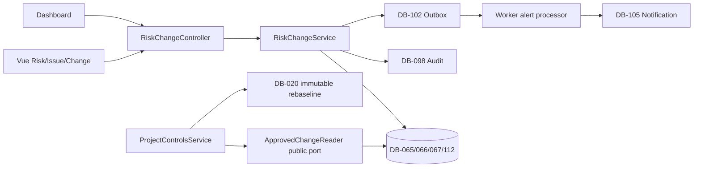

# ExecPlan — US-004 Risk, Issue và Change Control

> **Status:** In Progress — delegated approval; M0 canonical gate active  
> **Owner:** Codex / Engineering  
> **Created:** 2026-07-12  
> **Updated:** 2026-07-12  
> **Approval:** Người dùng/Product Owner trao quyền quyết định và yêu cầu thực hiện liên tục không cần hỏi lại trong hội thoại ngày 2026-07-11/12; quyết định trong plan này áp dụng cho EC2 test profile

## 1. Mục tiêu và kết quả người dùng

Khi hoàn tất, thành viên dự án có quyền có thể ghi nhận Risk và Issue ở hai register riêng, gán owner/action/due/evidence, theo dõi exposure/aging/history và xem cảnh báo overdue trên Command Center. PM có thể tạo Change Request từ Risk/Issue mà không mất liên kết/bằng chứng, submit để một approver độc lập APPROVE/RETURN/REJECT, rồi dùng đúng approved Change Request cùng tenant/project để tạo rebaseline trong Project Controls.

Risk/Issue chỉ đóng qua closure decision có evidence; người yêu cầu đóng không tự duyệt. Risk đã xảy ra phải liên kết Issue. Approved impact/decision và baseline provenance bất biến. PM Web không tạo bất kỳ OT/BESS command nào.

## 2. Nguồn và requirement IDs

- Baseline: `docs/Đề xuất tính năng nền tảng Solar và BESS.md`
- Source Feature IDs: `RSK-001…RSK-008`; source story `US-E04`
- Business Requirements: `BR-022`, `BR-031`, `BR-032`
- Functional Requirements: `FR-098…FR-105`; direct AC slice materialize `FR-098…FR-102` và risk/issue/change subset `FR-104`; `FR-103/DB-068 Claim` phụ thuộc Contract/Legal và external dependency portion `FR-105` phụ thuộc các source module sau
- Non-functional/Security: `NFR-007`, `NFR-012`, `NFR-014`, `NFR-016`, `NFR-017`, `NFR-020…NFR-023`; `SEC-105…SEC-111`, `SEC-114`, `SEC-118`, `SEC-119`
- Use case/story/workflows: `UC-004`, `US-004`, `WF-015`, `WF-021`; downstream `WF-003`
- Acceptance/tests: `AC-014…AC-017`; `TEST-014…TEST-017`, `TEST-185`, `TEST-187`, `TEST-189`, `TEST-190`, `TEST-193…TEST-196`, `TEST-202…TEST-208`
- ADR/API/Data: `ADR-001`, `ADR-004`, `ADR-006`; `API-038`, cấp mới `API-143…API-159`; `DB-065…DB-067`, cấp mới `DB-112 RiskIssueAction`; dùng `DB-098 AuditEvent`, `DB-020 ScheduleBaseline`, `DB-102…DB-105`; `DB-068 Claim` là dependency, không bị trình bày như đã materialize

## 3. Hiện trạng repository

- Modular monolith NestJS/TypeORM/PostgreSQL có `apps/api/src/modules/{identity-access,operational-foundation,project-management,project-controls}`; chưa có module Risk/Change hoặc entity DB-065…068.
- `API-038` đang là planned generic command dùng `GenericCommand/Envelope`; chưa có production route nên có thể concretize trước implementation mà không phá consumer đang chạy.
- `ScheduleBaselineEntity.approvedChangeRequestId` và DB check cho REBASELINE đã tồn tại; `ProjectControlsService.submitBaseline` hiện luôn trả `CHANGE_APPROVAL_REQUIRED` cho REBASELINE. Chưa có FK tới DB-067.
- DB-102 transactional outbox, DB-103 consumer checkpoint, DB-104 command receipt và DB-105 schedule notification subset đã materialize; worker có relay/BullMQ/dedupe/repeatable scanner.
- Frontend đã có cấu trúc `src/api`, `types`, `views`, `components`, router/layout/auth permission và Dashboard/Schedule vertical slice.
- Quality gate gần nhất: API unit 47/47, Web 32/32, Worker 21/21; lint/type/build/OpenAPI pass. PostgreSQL final US-003 integration/Playwright và latest M3 image deploy còn pending vì sandbox network/Docker approval.

## 4. Phạm vi

### In scope

- Project-scoped Risk DB-065, Issue DB-066, ChangeRequest DB-067 và RiskIssueAction DB-112 bằng TypeORM entity/migration/repository.
- Risk 1–5 probability/impact matrix, inherent/residual exposure, owner/response/trigger/contingency/evidence và state guard.
- Issue actual impact/root cause/severity/owner/target/evidence; optional same-project source Risk; Risk Occurred được liên kết Issue atomically.
- Action riêng cho Risk/Issue, owner/due/status/evidence/residual update; optimistic version và immutable audit/outbox history.
- Closure request qua update state và independent closure decision; closure evidence bắt buộc, high/critical không thể đóng bằng comment.
- Change Request từ Risk/Issue/manual; copy source/evidence snapshot, complete six-dimension impact, baseline references, submit và independent decision; approved impact/decision immutable.
- Public `APPROVED_CHANGE_READER` application port được RiskChangeModule export; ProjectControls resolve approved same-scope/same-current-baseline/schedule-impact DB-067 trong transaction và mở positive REBASELINE mà không import entity/repository riêng của module.
- Project/tenant/package deny-by-default: Risk/Issue/Change có `packageId` nullable; package-only assignment chỉ đọc/tạo/sửa record đúng package, không thấy project-level/null hoặc package khác; role catalog mở rộng idempotent.
- DB-105 được generalize từ physical schedule-only projection thành Notification projection để worker cảnh báo action overdue đúng recipient, scope và dedup; Schedule behavior không đổi.
- Vue API/types/view/components/routes, project entry point và Dashboard risk/issue/change lane; desktop/tablet CRUD/review, mobile read/action update, không mobile approval.
- Canonical docs/OpenAPI/trace/changelog, unit/integration/E2E/migration/rollback/security/deploy evidence.

### Out of scope

- `DB-068 Claim`, notice/quantum/negotiation và Variation/contract amendment vì physical Contract/Legal aggregate của US-006 chưa tồn tại. Requirement `FR-103` không bị xóa; được giữ dependency rõ và triển khai trong slice Contract/Claim sau.
- Early-warning ingestion từ delivery/obligation/NCR/punch chưa materialize; `FR-105` direct source adapters chờ source modules. Risk/Issue/Change event contract và schedule link được tạo để tích hợp additive sau.
- Dynamic workflow designer/quorum/value authority của US-018; V1 dùng fixed role permission + independent actor SoD cho EC2 test, không tuyên bố production approval policy.
- External party sharing, legal privileged Claim fields, Elasticsearch và AI.
- Mọi OT/BESS control.

## 5. Assumption, TBD và Open Question

| Loại | Nội dung | Owner cần xác nhận | Hạn/điều kiện đóng | Tác động nếu chưa đóng |
|---|---|---|---|---|
| Assumption đã được delegated quyết định | Probability và cost/schedule/HSE impact dùng integer 1…5; `impactRating=max(dimensions)`, exposure = probability × impactRating; HIGH từ 15, CRITICAL từ 20 | Product Owner/PMO | EC2 test review; giá trị env có validation | Có thể đổi threshold additive, không đổi history score |
| Assumption đã được delegated quyết định | PMO/PROJECT_MANAGER có manage/read/approve/close; EXECUTIVE read; PROJECT_CONTROLS read/manage; package-only assignment chỉ có quyền trên Risk/Issue/Change cùng `packageId` | Product Owner/Security | Security review | Tránh cross-package elevation trong khi vẫn hỗ trợ package scope bắt buộc |
| Assumption đã được delegated quyết định | Mọi closure cần request + approver khác requester; không chỉ high/critical | Product Owner/Internal Control | UAT | Chặt hơn tối thiểu AC-017 nhưng không mở rộng quyền; có thể nới bằng policy version sau |
| TBD | Production authority matrix/quorum/financial thresholds | Process Owner/Legal/Finance/Security | Trước production | EC2 test fixed policy không được dùng làm production approval acceptance |
| Open Question không chặn slice | Claim/Variation implementation order với US-006 và Workflow engine | Product Owner/Legal | Trước FR-103/DB-068 code | Không chặn AC-014…017 hoặc positive schedule rebaseline |

## 6. Thiết kế và luồng dữ liệu

Module boundary:

- Risk state: `IDENTIFIED → ASSESSED → TREATING → MONITORING → CLOSURE_PENDING → CLOSED`; bất kỳ active state có thể `OCCURRED`, nhưng `OCCURRED` cần Issue same project; closure return về trạng thái trước được snapshot trong audit.
- Issue state: `REPORTED → TRIAGED → IN_PROGRESS → RESOLVED → CLOSURE_PENDING → VERIFIED → CLOSED`; closure reject quay về `RESOLVED`; `REOPENED → IN_PROGRESS` khi có evidence mới.
- Change state: `DRAFT → ASSESSED → SUBMITTED → APPROVED|RETURNED|REJECTED`; `RETURNED → ASSESSED`; later `APPROVED → IMPLEMENTED → CLOSED` chỉ qua explicit downstream command, không cần cho AC hiện tại. Approval chốt `sourceBaselineId`, schedule impact summary, canonical impact snapshot/hash và decision version.
- Create/update/decision chạy qua DB-104 idempotent command receipt. Business row + audit + outbox commit trong một PostgreSQL transaction.
- Query luôn filter `tenantId + projectId + allowed packageIds`; project-level/null record chỉ actor có full-project scope được truy cập. Known UUID ngoài scope trả generic not-found/forbidden theo existing policy, không leak.
- Exposure calculator là pure domain function: server tính `impactRating=max(cost,schedule,HSE)` rồi `exposure=probability×impactRating`; client không ghi field derived. Money delta dùng `numeric(19,4)`/decimal string + ISO currency, không JavaScript floating-point.
- History read model lấy immutable DB-098 events sau khi xác minh source object tenant/project/package; response redact payload không thuộc public contract.
- Worker nhận committed Risk/Issue/Action events và repeatable scan; dedup key gồm tenant/project/source/recipient/type/due/thresholdVersion. Permission bị revoke trước scan/delivery sẽ loại recipient.
- `ApprovedChangeReader.resolveForRebaseline(manager, input)` trả discriminated result `APPROVED` với `approvedAt/by`, `decisionVersion`, `sourceBaselineId`, `scheduleImpactSummary`, `impactSnapshotHash`; denial ổn định gồm `NOT_FOUND_OR_SCOPE_MISMATCH`, `NOT_APPROVED`, `BASELINE_MISMATCH`, `SCHEDULE_IMPACT_NOT_APPROVED`. ProjectControls gọi port trong DB-104 transaction, không biết DB-067 entity.
- Không có data flow sang O&M/OT; mọi link schedule chỉ là PM Web record provenance.

## 7. API, dữ liệu và bảo mật

### API

- `API-038` `POST /v1/projects/{projectId}/risks`.
- `API-143…158`: list/update Risk; create/list/update Issue; create/update action; create/list/update/submit/decide Change; Risk/Issue closure decision; summary và history. `API-159` là Project Controls-owned baseline history query lọc `approvedChangeRequestId` để giữ trace hai chiều mà RiskChange không đọc private schedule storage.
- Mutations yêu cầu bearer, `X-Tenant-Id`, correlation và `Idempotency-Key`; update/decision có `expectedVersion`.
- Stable errors: `RISK_NOT_FOUND`, `ISSUE_NOT_FOUND`, `CHANGE_REQUEST_NOT_FOUND`, `ACTION_NOT_FOUND`, `INVALID_STATE_TRANSITION`, `IMPACT_INCOMPLETE`, `CLOSE_EVIDENCE_REQUIRED`, `CLOSE_APPROVAL_SOD`, `CHANGE_APPROVAL_SOD`, `CHANGE_APPROVAL_REQUIRED`, `VERSION_CONFLICT`, `PROJECT_SCOPE_DENIED`.
- Pagination cursor + limit cho register/history; filters status/owner/severity/due/source. Summary safe read, export chưa thuộc slice.

### Dữ liệu

- DB-065/066/067/112 có PK UUID, `tenant_id`, `project_id`, `package_id` nullable theo scope, composite FK cùng scope, unique project code, owner/user composite FK, version/timestamps, no hard delete.
- `RiskIssueAction` có đúng một trong `risk_id`/`issue_id`; evidence JSONB chỉ chứa array object references, core business fields relational.
- Approved DB-067 source baseline, impact snapshot/hash và decision bị trigger chống overwrite/delete. Closure facts và AuditEvent retained.
- DB-020 thêm composite FK `(tenant_id, project_id, approved_change_request_id)` tới DB-067. Migration fail nếu orphan tồn tại; không tự sửa dữ liệu.
- DB-105 physical table rename/generalize giữ ID/canonical meaning, schedule alert rows tương thích; risk notification là projection có thể rebuild.

### Bảo mật

- Permissions: `riskChange.read/create/manage/submit/approve/requestClosure/close/closeCritical`; guard là coarse gate, service re-check tenant/project/package scope, state, source link, actor/effective actor và SoD. Package assignment không bao giờ mở project-level/null record; Change approval luôn cần full-project scope.
- Requester/submitter không approve Change; creator/owner/closure requester không approve closure; HIGH/CRITICAL thêm `riskChange.closeCritical`; action còn mở/chưa verify chặn closure; nhiều role/delegation không bypass actor identity.
- Approved DB-067, closed Risk/Issue và audit/outbox không sửa in-place.
- Evidence chỉ là opaque reference trong slice; không tạo file download path hoặc bypass Document ACL.
- Denial/audit payload không chứa credential/token/raw privileged content. Không có OT route/event/permission.

## 8. Ma trận truy vết thực thi

| Requirement/ADR | Milestone | File/component | Acceptance/Test | Trạng thái |
|---|---|---|---|---|
| FR-098/100; DB-065/066 | M1 | entities/domain/service/API | AC-014 / TEST-014 | Planned |
| FR-099; DB-112/098/102 | M1/M3 | action/history/outbox/worker | AC-015 / TEST-015 | Planned |
| FR-101/102; DB-067 | M2 | Change service/decision/approved port | AC-016 / TEST-016 | Planned |
| WF-021; SEC-108/109 | M1/M2 | closure decision/state guards | AC-017 / TEST-017 | Planned |
| AC-012; WF-003 | M2 | ApprovedChangeReader + ProjectControls | TEST-012 positive/negative | Planned |
| NFR-007/021; ADR-006; DB-103/105 | M3 | worker notification projection | TEST-015/194 | Planned |
| NFR-016/017/020/023 | M3/M4 | Vue/accessibility/deploy | TEST-189/190/193/196 | Planned |

## 9. Milestone và bước thực hiện

### M0 — Canonical documentation gate

- [ ] Concretize Data/API/OpenAPI/Security/UX/WF/Test/Trace/Decision/Backlog cho direct/dependency boundary.
- [ ] Cấp `DB-112`, `API-143…159`; update exact catalog counts/version/changelog/INDEX.
- [ ] Chốt scale/threshold/state/permission/SoD/error/idempotency/migration/rollback.
- [ ] Chạy OpenAPI lint, unique ID/operation count, relative-link/trace audit và baseline checksum.

**Exit criteria:** canonical artefacts decision-complete và nhất quán; không có TBD chặn M1; chỉ sau đó production implementation bắt đầu.

### M1 — Risk, Issue và Action vertical slice

- [ ] Tạo enums/entities/migration DB-065/066/112, constraints/index/FK/down và registry.
- [ ] Pure exposure/state policy với edge/property unit tests.
- [ ] DTO/controller/service cho API-038/143…149/154/155/158; cursor/filter/version/idempotency.
- [ ] Audit/outbox atomic; tenant/project/package permission/known-ID denial; role seed idempotent.
- [ ] Integration test Risk-vs-Issue validation, Risk Occurred link, actions/history/closure SoD.

**Exit criteria:** AC-014/015/017 direct API passes; zero cross-scope/partial write; action overdue query deterministic.

### M2 — Change approval và positive rebaseline

- [ ] Tạo DB-067/FK/immutability trigger và API-150…153/156/157.
- [ ] Copy source/evidence two-way trace; complete impact snapshot, baseline refs, decimal/currency.
- [ ] Enforce submit/APPROVE/RETURN/REJECT/version/SoD/audit/outbox.
- [ ] Export public `ApprovedChangeReader`; inject vào ProjectControls và remove unconditional REBASELINE denial.
- [ ] Integration test missing/unapproved/cross-project/self approval/concurrent decision/successful rebaseline/hash/history.

**Exit criteria:** AC-016/TEST-016 và positive/negative AC-012/TEST-012 pass; approved Change/old baseline immutable.

### M3 — Notification, Dashboard và Risk/Change UX

- [ ] Generalize DB-105 Notification migration/entity without breaking schedule alert query.
- [ ] Worker event processor/repeatable overdue scanner/recipient scope/dedup/retry tests.
- [ ] Tạo `src/api/risk-change.api.ts`, types, view/components/routes/styles và permission-aware project navigation.
- [ ] Forms/register/action/closure/change submission/decision/history states; mobile approval disabled.
- [ ] Dashboard summary lane top exposure/critical issue/overdue action/decision queue; drill-down stable filter.
- [ ] Vitest/Playwright accessibility/loading/empty/error/denied/conflict journeys.

**Exit criteria:** AC-015 alert/Command Center và AC-014…017 UI journey pass; duplicate worker events tạo một projection.

### M4 — Quality gate, migration rehearsal, deploy và close-out

- [ ] Root/API/Web/Worker lint, typecheck, unit, integration, OpenAPI, build.
- [ ] Migration `up → down → up` trên disposable PostgreSQL; orphan/FK/immutability/rollback evidence.
- [ ] E2E Risk→Issue/action→Change→independent approval→rebaseline; negative tenant/project/SoD.
- [ ] Build/deploy Compose, idempotent seed, health/public authenticated smoke với bounded timeout/poll.
- [ ] Update exact test counts/status/trace/changelog/ExecPlans/file inventory và outstanding dependency.

**Exit criteria:** TEST-014…017 và TEST-012 positive path pass; public EC2 flow hoạt động; core regression pass; Claim/FR-105 dependency được báo chính xác.

## 10. Kế hoạch kiểm thử và chất lượng

| Loại | Command/quy trình | Requirement/Test IDs | Expected result |
|---|---|---|---|
| OpenAPI | `timeout 60s npm run openapi:lint` | API-038/143…159 | Exit 0; exact/unique IDs/operations |
| Lint/type/build | root workspace scripts, timeout 120–240s | NFR-012/023 | Exit 0, zero warning |
| API unit | `timeout 180s npm run test:unit --workspace=@solar-bess/api` | TEST-014…017/185/187 | Exposure/state/DTO/port pass |
| API integration | targeted rồi full `test:integration` timeout 300s | TEST-012/014…017/193/195/202…208 | PostgreSQL assertions pass, zero hidden skip |
| Worker unit/integration | workspace scripts timeout 240s | TEST-015/194/196 | recipient/dedup/retry/scan pass |
| Web unit/build | workspace scripts timeout 240s | TEST-014…017/189/190 | API/components/routes/accessibility pass |
| Migration | show/run/revert/run trên disposable DB | DB-065…067/112/020/105 | up/down/up + FK/triggers pass |
| E2E | `timeout 300s npm run test:e2e` | TEST-012/014…017 | full independent decision journey pass |
| Deploy smoke | Compose wait/health + public UI/API | NFR-006/021 | DB/Redis/API/worker/web healthy |

Fixtures có ít nhất hai tenant, hai project, requester/owner/independent approver và package-only actor; known UUID denial phải chứng minh không leak. Approved Change and baseline hashes queried before/after mutation attempt. Commands luôn dùng unique/replayed idempotency keys.

## 11. Migration, rollout và rollback

- Tạo migration mới sau `1783730000000-CreateProjectControls`; không sửa migration đã phát hành.
- Expand-first: create DB-065/066/067/112 → validate existing schedule approved-change refs → add composite FK → generalize DB-105 projection. Entity/code chỉ deploy sau migration success.
- Role seed cập nhật permission catalog idempotent; không nhúng user credential hoặc cấp business role mới cho Tenant Admin.
- Test DB được PO cho phép reset; production-like rollback vẫn giữ source Risk/Issue/Change/Audit. Khi đã có approved Change/rebaseline, không drop source tables; disable routes/worker và forward-fix.
- Migration `down` chỉ dùng disposable DB hoặc khi zero source rows; risk notification projection có thể rebuild, source/audit không được mất. Down đưa Notification về schedule-only sau khi xóa riêng rebuildable non-schedule projection.
- Rollout: docs gate → migration → role seed → API → worker → web → smoke. Rollback: web → worker → API; migration revert chỉ khi preflight count zero và không có approved provenance.
- Trigger rollback: cross-scope leak, SoD bypass, approved impact/baseline mutation, FK orphan, duplicate notification side effect, migration/health/E2E critical fail hoặc bất kỳ OT write path.

## 12. Rủi ro và biện pháp

| Rủi ro | Xác suất/tác động | Tín hiệu | Giảm thiểu | Owner |
|---|---|---|---|---|
| Generic API làm module khó mở rộng | Trung bình/Cao | command switch/untyped payload | Concretize resource endpoints/schema trước code | API/Risk |
| Risk/Issue bị trộn | Trung bình/Cao | nullable probability/rootCause lẫn nhau | Aggregate/table/DTO/state riêng + TEST-014 | Risk |
| Package role thấy project-level/package khác | Trung bình/Rất cao | package assignment pass project guard | Nullable package scope + allowed-package predicate; known-ID tests | Security |
| Self-approved closure/change | Trung bình/Rất cao | actor=requester/submitter | Transaction SoD + role/delegation tests | Security/PMO |
| Approved impact hoặc baseline bị sửa | Thấp/Rất cao | hash/field changed | DB trigger/FK/snapshot + negative SQL test | Data |
| Float tiền gây sai | Trung bình/Cao | JS number/rounding | numeric(19,4), decimal string, currency required | Cost/Data |
| Alert duplicate/stale recipient | Trung bình/Cao | multiple rows/revoked access | outbox/checkpoint/dedup/current assignment query | Platform |
| Claim bị hiểu là đã hoàn thành | Cao/Trung bình | DB-068/API claim absent | Direct/dependency trace và UI/status explicit | Product/Legal |
| Lệnh build/deploy treo | Trung bình/Trung bình | không output/health wait vô hạn | timeout/poll ≤60s và commentary progress | Engineering |

## 13. Decision Log

| Ngày | Quyết định | Lý do | ADR/Requirement liên quan | Người phê duyệt |
|---|---|---|---|---|
| 2026-07-12 | Concretize API-038 thành create Risk và cấp API-143…159 | API planned chưa có consumer; bỏ GenericCommand, tách resource/decision/summary/history và Project Controls-owned reverse baseline query | API-038, NFR-023 | Product Owner delegated/Codex |
| 2026-07-12 | V1 exposure 1…5, HIGH 15, CRITICAL 20, env validated | Cần deterministic heatmap/closure guard, vẫn cấu hình được | FR-098/099, AC-014/017 | Product Owner delegated/Codex |
| 2026-07-12 | Mọi closure cần independent decision/evidence | Bảo toàn AC-017 và audit, policy có thể version sau | SEC-108/109, WF-021 | Product Owner delegated/Codex |
| 2026-07-12 | Risk/Issue/Change có packageId nullable; package actor chỉ exact package, không project-level/null | Đáp ứng AGENTS multi-scope và ngăn privilege widening | SEC-105…107 | Product Owner delegated/Codex |
| 2026-07-12 | Public ApprovedChangeReader nhận EntityManager | Giữ cross-module boundary và same-transaction validation | AC-012/016, DB-067/020 | Product Owner delegated/Codex |
| 2026-07-12 | Claim/Variation deferred đến Contract/Legal physical aggregate | Không bịa contract/authority/privilege fields; không claim FR-103 complete | FR-103, DB-068 | Product Owner delegated/Codex |

## 14. Progress Log

| Ngày | Hoàn thành | Bằng chứng/command | Blocker/next step |
|---|---|---|---|
| 2026-07-12 | Repository/docs research; decision-complete ExecPlan drafted | AGENTS/PLANS/tech-stack, PRD/SRS/Data/API/Security/WF/Backlog/Test/Trace và current code inspected | Hoàn thành M0 canonical gate |

## 15. Kết quả và bàn giao

- Outcome: In Progress.
- File tạo: `.agent/execplans/2026-07-12-risk-issue-change-us004.md`.
- Test/validation: chưa chạy cho US-004 tại thời điểm tạo plan.
- Changelog/traceability: cập nhật trong M0 trước code.
- Assumption/TBD/Open Question còn lại: production approval matrix và Claim/Contract ordering như mục 5; không chặn EC2 test AC-014…017.
- Follow-up: M0 canonical docs, sau đó M1 implementation; không bắt đầu production code trước M0 exit.
