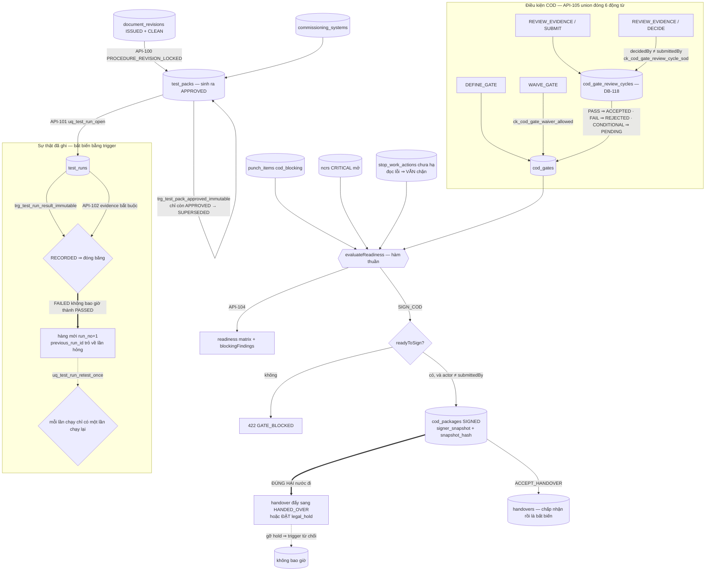

# ExecPlan — Commissioning & COD (US-012/US-013)

> **Status:** Completed (API-098…API-105, đủ 8 operation); AC-055 và AC-057 Pass, AC-053/054/056/058/059/060/061/062 Partial
> **Owner:** Codex / Engineering
> **Created:** 2026-07-26
> **Updated:** 2026-07-26
> **Approval:** Product Owner trao toàn quyền quyết định và yêu cầu hoàn thành các yêu cầu trong story ngày 2026-07-26

## 1. Mục tiêu và kết quả người dùng

Commissioning Manager dựng cây system/subsystem theo dự án và đọc register theo readiness (API-098/099); lập test pack **chỉ** từ một revision quy trình đã `ISSUED` và quét mã độc `CLEAN` (API-100); chạy thử nghiệm với đúng một lần chạy mở mỗi pack (API-101), ghi kết quả **đúng một lần và vĩnh viễn** (API-102), và chạy lại bằng một hàng mới trỏ về lần hỏng (API-103). Project Manager đọc ma trận COD readiness cùng danh sách phát hiện đang chặn (API-104) và điều khiển toàn bộ vòng đời COD qua một command union đóng: định nghĩa điều kiện, nộp/thẩm tra bằng chứng, miễn trừ, trình hồ sơ, ký và ký nhận bàn giao (API-105).

Kết quả quan sát được quan trọng nhất: **một sự thật nghiệm thu đã ghi thì không ai viết lại được, và một chữ ký COD không bao giờ đi trước bằng chứng.** Một lần chạy `FAILED` **không bao giờ** trở thành `PASSED` — trigger đóng băng hàng ngay khi kết quả được ghi, nên tái kiểm bắt buộc là hàng mới ở `run_no + 1` trỏ `previous_run_id`, và lần hỏng ở lại vĩnh viễn trong hồ sơ. `SIGN_COD` đòi người ký khác người nộp (422 `SOD_CONFLICT`) và bị từ chối khi còn bất kỳ phát hiện chặn nào: punch loại A, NCR nghiêm trọng đang mở, stop-work chưa hạ, hoặc điều kiện COD bắt buộc chưa được đáp ứng (422 `GATE_BLOCKED`). Một hồ sơ đã ký chỉ còn **đúng hai nước đi**: handover đẩy nó sang `HANDED_OVER`, và **đặt** legal hold — gỡ hold thì trigger từ chối, vĩnh viễn.

## 2. Nguồn và requirement IDs

- Baseline: `docs/Đề xuất tính năng nền tảng Solar và BESS.md`
- Business: `BR-023…BR-026` (theo trace `US-012`/`US-013` trong `docs/12` và `docs/15` §"COD-to-O&M continuity")
- Functional: `FR-106…FR-112` (US-012); `FR-109…FR-114` (US-013). Ở tầng operation, `x-related-requirements` gán `API-098→FR-106`, `099→FR-106`, `100→FR-107`, `101→FR-108`, `102→FR-109`, `103→FR-110`, `104→FR-112`, `105→FR-113 + FR-114`
- Use case/story/workflow: `UC-012`/`US-012` với `WF-022`; `UC-013`/`US-013` với `WF-023`
- Acceptance: `AC-053…AC-057` (US-012), `AC-058…AC-062` (US-013)
- Tests: `TEST-053…TEST-062` tương ứng
- API: `API-098…API-105` (8 operation, không thiếu và không dư)
- Data: `DB-073` CommissioningSystem, `DB-074` TestPack, `DB-075` TestRun, `DB-076` CODGate, `DB-077` CODPackage, `DB-078` Handover; **cấp mới một ID theo ủy quyền: `DB-118` CodGateReviewCycle** (tiền lệ `DB-114…DB-117`); `DB-024` DocumentRevision (nguồn của quy trình test), `DB-004` ProjectParty, `DB-061` Punch, `DB-060` NCR, `DB-115` StopWorkAction tham chiếu; `DB-098` audit, `DB-102` outbox, `DB-104` command receipt dùng lại
- Security: `SEC-102` (ghi nhận là khoảng trống, xem §7), `SEC-108`, `SEC-109`, `SEC-111`, `SEC-112`, `SEC-118`

## 3. Hiện trạng repository trước khi bắt đầu

- `API-098…105` chỉ có contract thiết kế; không controller nào. Marker implemented ở đầu slice là 138/164.
- Không bảng nào của `DB-073…078` tồn tại; `DB-118` chưa được cấp.
- Chuỗi migration kết thúc ở `1783757000000` với `policy_version = 12`; `project-master.seed.ts` dùng hằng `rolePolicyVersion = 12`.
- Slice Field/HSE/Quality (`1783746000000`) đã cấp `punch_items.cod_blocking` + `ck_punch_category_a_blocking`/`ck_punch_category_a_not_waivable`, `ncrs.severity`, và ledger `stop_work_actions` (`DB-115`) — **ba nguồn phát hiện chặn COD đã đúng sẵn ở tầng DDL nên slice này không phải retrofit gì cả**, chỉ phải đọc chúng.
- Slice document-control đã có `document_revisions` với `status` + `scan_status` và `ck_document_revision_release_requires_clean` — chuỗi `SEC-121` mà `API-100` tái dùng.
- `project_parties` **chưa có** candidate key `(tenant_id, project_id, id)`, nên `handovers` không thể khóa bên nhận theo tenant + dự án bằng FK composite.
- Catalog role có mười vai (sáu vai gốc + `HSE_MANAGER`/`QAQC_MANAGER`/`PERMIT_ISSUER`/`CONTRACTOR` do slice Field/HSE tạo). Không vai nào giữ quyền commissioning/COD.
- `canonicalHash` đã tách sẵn ở `apps/api/src/modules/risk-change/domain/canonical-hash.ts` (slice contract-cost) — snapshot readiness dùng lại đúng serializer đó, không có bản thứ hai.
- Không operation nào trong catalog: phê duyệt test pack riêng, tạo Health Score, cấp permit luật định (`DB-033` cố ý chưa tạo từ slice contract-cost), chuyển trạng thái dự án sang "Đã COD". Đây là ranh giới cứng của slice.
- Tiền lệ union đóng: `API-149` mang bốn động từ dưới một API ID (`docs/08` dòng `API-149`, ghi nhận trong revision 1.2 của `docs/08`).

## 4. Phạm vi

### In scope

- Tám operation trong module Nest `commissioning-cod`, tách hai service theo miền: `commissioning.service.ts` (API-098…103) và `cod.service.ts` (API-104/105).
- Migration `1783758000000-CreateCommissioningCod.ts`: 7 bảng, 3 partial unique index là ngữ pháp trạng thái, 6 họ trigger bất biến, cộng một ALTER dùng chung cấp `uq_project_parties_tenant_project_id`.
- Migration `1783759000000-GrantCommissioningPermissions.ts` (`policyVersion = 13`, state-table `role_grant_reconcile_1783759000000`): 8 permission code cho ba nhóm vai đã tồn tại; **không tạo vai mới, không phát minh vai mới**.
- Domain thuần có unit test: `readiness.ts` (bộ đánh giá COD readiness là hàm thuần), `state-policy.ts` (máy trạng thái gate/package dưới dạng dữ liệu), `cursor.ts`; `support.ts` gom lỗi/audit/outbox/version dùng chung hai service.
- OpenAPI: đặc tả cụ thể cả 8 operation; marker implemented 138 → 146 cho phần này (slice O&M song song nâng tiếp lên 154).

### Out of scope

- **Phê duyệt test pack như một operation riêng.** Catalog chỉ có `API-100` với tóm tắt "Tạo/approve test pack revision"; pack sinh ra đã `APPROVED` và trigger đóng băng ngay (quyết định c).
- **Đường đọc riêng cho test pack, test run, gate và handover.** Chỉ `API-098` (system register) và `API-104` (readiness + danh sách hồ sơ COD) là GET. Không list pack, không list run, không đọc lẻ một gate hay một biên bản bàn giao.
- **Liên kết tag/serial thiết bị vào commissioning system và test pack.** `DB-073`/`DB-074` trong dictionary không có cột equipment/asset; không bịa cột, không bịa ID.
- **Permit luật định, fire clearance, grid clearance.** `DB-033` Permit cố ý chưa tạo (quyết định d của slice contract-cost) — không có nguồn dữ liệu nào để đọc thành phát hiện chặn.
- **Health Score và hard cap khi test hỏng (`AC-056`).** Health Score thuộc `US-002` và chưa tồn tại.
- **Chuyển trạng thái dự án sang "Đã COD" (`AC-061`).** Không operation nào trong catalog đổi `projects.status`; slice này không tự với sang aggregate của `US-001`.
- **Bàn giao warranty/spare/SLA/training/monitoring account (`AC-062`).** `DB-083` Warranty cố ý không tạo (xem ExecPlan O&M); các mục còn lại không có bảng và không có DB ID được cấp.
- **Step-up authentication (`SEC-102`).** Không tồn tại trong auth profile đã duyệt và **cố ý không được giả lập** — xem quyết định (i).
- **UI Vue.** Không route/view web nào trong slice này.

## 5. Assumption, TBD và Open Question

| Loại | Nội dung | Owner cần xác nhận | Điều kiện đóng | Tác động nếu chưa đóng |
|---|---|---|---|---|
| Open Question (ưu tiên cao) | `DB-118` được cấp theo ủy quyền và đã ghi ở `docs/CHANGELOG.md` + `docs/15` §"DB-001…119", nhưng **chưa có dòng dictionary trong `docs/07-data-model.md`** (chỉ `DB-115/116/117` có dòng; `DB-118` mới chỉ xuất hiện trong ghi chú tổng hợp ở đầu bảng) | Data Owner | Thêm dòng dictionary `DB-118` (khóa, cột, ràng buộc, phân loại, retention, trace) vào `docs/07` | Bảng `cod_gate_review_cycles` đã chạy nhưng định nghĩa chuẩn của nó chỉ tồn tại trong DDL, entity và OpenAPI; `docs/07` là canonical owner của họ `DB-*` |
| Open Question (ưu tiên cao) | `SEC-102` step-up **không tồn tại** trong auth profile đã duyệt: không yếu tố xác thực bổ sung, không endpoint tái xác thực, phiên không mang mức đảm bảo nào. `API-105` khai `SEC-102` nhưng **không giả lập** | Security / Auth profile owner | Bổ sung step-up thật vào auth profile rồi bật kiểm tra ở `SIGN_COD` | **Cổng chặn production đã ghi nhận.** Biện pháp bù đang chạy: SoD trên chữ ký, snapshot người ký bất biến, `snapshot_hash` canonical, audit + outbox trong cùng transaction ký |
| Open Question | `US-012`/`US-013` chưa có dòng **Delivery status** trong `docs/12-product-backlog.md` (commit slice không chạm `docs/12`) | BA / Product Owner | Thêm dòng Delivery status cho `US-012`/`US-013` theo đúng mẫu các story đã đóng | Backlog vẫn đọc như hai story chưa được đụng tới, trong khi `docs/15` và `docs/CHANGELOG.md` đã ghi 8 operation materialize |
| Open Question | Không operation nào tạo/duyệt permit luật định (`DB-033`), fire clearance hay grid clearance | Product Owner / Legal | Cấp operation + tạo `DB-033` có trace | `AC-054` không đóng được phần "permit/fire/grid clearance thiếu"; ba loại clearance đó không xuất hiện trong `blockingFindings` |
| Open Question | **Một lần chạy `FAILED` không tự trở thành phát hiện chặn COD.** `evaluate()` đọc gate + punch + NCR + stop-work; `test_runs` không nằm trong nguồn phát hiện | Product Owner / Commissioning | Chốt quy tắc: kết quả test hỏng chặn COD trực tiếp, hay phải qua NCR/punch/gate | `AC-060` phần "failed critical test" chỉ chặn gián tiếp — ai đó phải nêu NCR, mở punch hoặc định nghĩa một gate; không có đường tự động |
| Open Question | Không operation nào chuyển `projects.status` sang "Đã COD" | Product Owner | Cấp `API-*` mới hoặc mở rộng union của `API-105` có trace | `AC-061` phần "chuyển project state" không đóng được; hồ sơ COD đã ký nhưng dự án vẫn ở trạng thái cũ |
| Open Question | `evidenceRefs` của gate và của vòng thẩm tra là **chuỗi tham chiếu mờ**, không phải FK tới `document_revisions` | Data Owner / Document Control | Chốt kiểu tham chiếu bằng chứng và thêm FK nếu là revision | `AC-059` chặn được bằng chứng **hết hạn** (`evidence_expiry` là dữ liệu thật) nhưng **không phát hiện được bằng chứng đã SUPERSEDED**, vì không có đường tra ngược tài liệu |
| Open Question | Không đường đọc riêng cho test pack/test run/gate/handover; chỉ `API-098` và `API-104` là GET | Product / API Owner | Cấp operation đọc mới nếu cần | Không dựng được register commissioning đầy đủ ở UI; lịch sử tái kiểm chỉ đọc được qua response của chính lệnh vừa gọi |
| Open Question (doc-correction) | `x-idempotency` của `API-105` trong `docs/openapi/openapi.yaml` ghi "DB-101 command receipt" trong khi command receipt là `DB-104` (`DB-101` là ProjectSchedule) | API / Architecture Owner | Sửa chuỗi trong lần chỉnh contract kế tiếp | Cùng họ lệch đã ghi ở slice contract-cost; đọc tài liệu sẽ tra nhầm entity, runtime không ảnh hưởng |
| Open Question (doc-correction) | Hai cách đọc dictionary/ERD được chốt trong slice này: `cod_gates` unique theo `(tenant, project, category, code)` (`DB-076` chỉ ghi "UQ gate definition instance"), `handovers` unique theo `(tenant, cod_package, recipient_party)` (`DB-078` ghi "UQ COD package+recipient/version" — có thêm "version" mà bảng không có) | Data Owner | Amendment `docs/07` cho hai dòng `DB-076`/`DB-078` | Dictionary mơ hồ/tự mâu thuẫn với DDL đang chạy; cách đọc đã ghi ở đây, trong comment migration và trong test |
| TBD | Chính sách cảnh báo gate quá hạn / bằng chứng sắp hết hiệu lực | Product / Notification Owner | Mở allowlist `ck_notification_source_type` của `DB-105` cho nguồn CodGate | `due_date` và `evidence_expiry` là sự thật đọc-ra, không phải sự kiện được đẩy; không thông báo chủ động |
| Assumption | Người thẩm tra bằng chứng (`REVIEW_EVIDENCE` nhánh `DECIDE`) được xấp xỉ bằng "bất kỳ ai giữ `cod.manage` và không phải người nộp", vì `DB-076` không có cột `reviewerId` | Product Owner / Security | Chốt mô hình reviewer theo gate và thêm cột nếu cần | `AC-058` phần "reviewer" và `AC-059` phần "functional reviewer" chỉ đóng ở mức SoD, không ở mức chỉ định trước |

## 6. Thiết kế và luồng dữ liệu

**Bộ đánh giá readiness là một hàm thuần dùng chung.** `evaluateReadiness()` trong `domain/readiness.ts` nhận gate + phát hiện chặn đã được lọc theo tầm với của người gọi, và trả về ma trận theo hạng mục, danh sách gate có bằng chứng hết hạn, số đếm từng loại phát hiện, `blocked` và `readyToSign`. **Cùng một hàm đó phục vụ `API-104` và cưỡng chế `SIGN_COD`** — một chữ ký không bao giờ bị phán xử bởi một bản luật thứ hai đã trôi khỏi bản mà người dùng vừa đọc.

**Đọc rows qua ABAC, quyết định nghĩa của rows bằng hàm thuần.** Service đọc gate/punch/NCR/stop-work **trong** tầm với: cổng dự án đã chạy trước, NCR còn bị thu hẹp thêm theo package reach (`ncr.package_id = ANY(...)` khi người gọi không có project reach), và projection chỉ mang id + code + phân loại — không narrative NCR, không mô tả punch, không lý do stop-work. `punch_items` và `stop_work_actions` không có cột package: chúng là register cấp dự án trong schema Field/HSE, nên project reach là toàn bộ chiều ABAC của chúng.

**An toàn fail closed.** `activeStopWorks()` bọc truy vấn ledger trong `try/catch`; khi không đọc được, nó trả về **một phát hiện chặn tổng hợp** thay vì một mảng rỗng. COD bị chặn cho tới khi ledger đọc được — đúng cùng quy tắc mà `API-087` (release workfront) và `API-092` (phát hành permit) đã áp dụng.

**Ngữ pháp trạng thái bằng partial unique.** `uq_test_run_open` (đúng một lần chạy mở mỗi pack → 409 `RUN_IN_PROGRESS`), `uq_test_run_retest_once` (một lần chạy chỉ đẻ ra một lần chạy lại; chuỗi tái kiểm không rẽ nhánh → 409 `RETEST_ALREADY_EXISTS`), `uq_cod_gate_review_cycle_open` (đúng một vòng thẩm tra đang mở mỗi gate), `uq_cod_package_active` (đúng một hồ sơ COD chưa kết thúc mỗi dự án, tính trên `DRAFT/READY/SUBMITTED` → 409 `COD_PACKAGE_IN_FLIGHT`; ký xong là nhả chỗ cho version kế tiếp).

**Sáu họ trigger.** `trg_test_pack_approved_immutable` (pack `APPROVED` đóng băng mọi cột nghiệp vụ, chỉ còn nước `SUPERSEDED`; `SUPERSEDED` thì bất động vĩnh viễn; DELETE không bao giờ), `trg_test_run_result_immutable` (`RECORDED` là chấm hết), `trg_cod_gate_decision_immutable` (`ACCEPTED`/`WAIVED` đóng băng), `trg_cod_gate_review_cycle_protect` (vòng chưa quyết chỉ được cập nhật đúng bốn cột quyết định; vòng đã quyết bất động; DELETE không bao giờ), `trg_cod_package_signed_immutable` (hồ sơ đã ký chỉ còn hai nước đi; `HANDED_OVER` là lịch sử; legal hold **đặt được, gỡ thì không**; DELETE không bao giờ), `trg_handover_accepted_immutable` (biên bản đã ký nhận bất động; DELETE không bao giờ).

**Tenancy.** Mọi FK là composite mang `tenant_id`; system con bị ghim vào đúng dự án của cha bằng `(tenant_id, project_id, id)`; handover ghim bên bàn giao và bên nhận vào `project_parties (tenant_id, project_id, id)` — candidate key mà chính migration này cấp. Ngoài tenant và ngoài tầm với đều trả **404 chứ không 403**: `assertProjectVisible` trả cùng một `PROJECT_NOT_FOUND` cho "không tồn tại" và "không nhìn thấy", nên endpoint không bao giờ trở thành máy dò ID của tenant khác.

**Người ký được lưu bằng ID ổn định.** `signer_snapshot` giữ `userId` + `displayName` + `email` + `signedAt` + `snapshotHash`; `snapshot_hash` là SHA-256 canonical của **đúng thứ đã được ký** (bản đánh giá readiness trừ mốc thời gian tường), tính bằng `canonicalHash` dùng chung với risk-change/contract-cost/engineering — không có serializer thứ hai (`AGENTS.md` §9: không lưu signer chỉ bằng chuỗi hiển thị).

## 7. API, dữ liệu và bảo mật

**API.** Tám operation, OpenAPI 3.1, mọi lệnh đòi `Idempotency-Key` 8–200 ký tự và trả **200/201 chứ không 202** — trả 202 cho một ghi đã commit là hợp đồng sai. `API-105` là command union đóng sáu động từ (`@IsIn` từ chối mọi tên khác), trả cố định 200 kèm resource của đúng nhánh vừa chạy. `expectedVersion` nằm trong body, đồng bộ với toàn bộ slice hiện hữu.

**Dữ liệu.** Bảy bảng: `commissioning_systems`, `test_packs`, `test_runs`, `cod_gates`, `cod_gate_review_cycles` (`DB-118`), `cod_packages`, `handovers`. Migration `1783758000000` có `down()` đối xứng (trigger → function → bảng theo thứ tự phụ thuộc ngược, rồi trả lại constraint dùng chung), đã test up/down/up. Không backfill: trước slice này không có dữ liệu commissioning/COD nào.

**Bảo mật.** `SEC-108`/`SEC-109`: SoD ở hai tầng — service trả lỗi có tên (`SOD_CONFLICT`) và `ck_cod_package_sod` + `ck_cod_gate_review_cycle_sod` giữ bất biến kể cả khi ai đó INSERT bằng SQL tay. `SEC-111`: ABAC dự án/package áp trong SQL trước khi phân trang. `SEC-112`: bằng chứng chỉ là tham chiếu; không byte tài liệu nào đi qua slice này. `SEC-118`: audit + outbox ghi trong cùng transaction lệnh. `SEC-102`: **khoảng trống có ghi nhận, xem §5** — không giả lập.

**OT.** `AC-057` là ràng buộc miền chứ không phải tính năng: bảy bảng của slice **không có** cột command/setpoint/tag/gateway/endpoint/credential nào, và bảy route của controller đều là đọc hoặc ghi hồ sơ dự án. Không có đường nào từ PM Web tới PCS/BMS/EMS trong slice này; thao tác OT nằm ngoài hệ thống, do Authorized Operator thực hiện, và hệ thống chỉ ghi lại request/status/kết quả.

### Quyết định thiết kế đã chốt

| Quyết định | Lý do |
|---|---|
| (a) **Cấp mới `DB-118` CodGateReviewCycle theo ủy quyền** | `AC-059` đòi lịch sử từng vòng nộp/duyệt kèm người, thời gian, comment; không entity nào trong dictionary mang được nó, và nhét vào `cod_gates` sẽ khiến vòng sau ghi đè vòng trước. Bảng mô phỏng `DB-116` NcrDispositionCycle từng dòng, theo đúng tiền lệ `DB-114…DB-117` |
| (b) **`API-105` là command union đóng sáu động từ**: `DEFINE_GATE`, `REVIEW_EVIDENCE`, `WAIVE_GATE`, `SUBMIT_COD`, `SIGN_COD`, `ACCEPT_HANDOVER` | Catalog chỉ nêu submit/sign/accept, nhưng `AC-058` (định nghĩa điều kiện), `AC-059` (thẩm tra bằng chứng) và `AC-060` (giới hạn miễn trừ) đều cần đường ghi mà không operation nào khác cấp. Bịa API ID bị `AGENTS.md` §4 cấm; `API-149` đã có tiền lệ mang một union đóng dưới một ID. Union đóng bằng `@IsIn`, không mở rộng ngầm |
| (c) **Test pack sinh ra ở trạng thái `APPROVED`**; trigger sau đó chỉ cho `APPROVED → SUPERSEDED` | `API-100` là operation duy nhất cho pack và tóm tắt của nó đọc là "Tạo/approve test pack revision". Một quy trình sửa đổi là **hàng pack mới** dưới `uq_test_pack_code_revision`, không phải một lần sửa hàng cũ |
| (d) **Kết quả đã ghi là vĩnh viễn; tái kiểm là hàng mới** trỏ `previous_run_id`, tối đa một lần cho mỗi lần chạy | `FR-109`/`FR-111`: "FAILED không bao giờ thành PASSED" phải là bảo đảm của cơ sở dữ liệu, không phải quy ước của service. `RETEST_NOT_ALLOWED` giới hạn tái kiểm ở `FAILED`/`ABORTED` — `PASSED` không có gì để chạy lại, `INCONCLUSIVE` bị loại vì catalog nêu trigger tái kiểm là "failed/aborted" và mở rộng nó là đổi phạm vi |
| (e) **`SIGN_COD` đòi actor ≠ người nộp** (422 `SOD_CONFLICT` + `ck_cod_package_sod`) và bị từ chối khi `readyToSign = false` (422 `GATE_BLOCKED`) | Hai từ chối, một mã lỗi cho nhánh readiness: với người gọi, "còn phát hiện chặn" và "còn gate bắt buộc chưa đạt" đều có nghĩa là cổng COD chưa thông |
| (f) **Hồ sơ đã ký chỉ còn đúng hai nước đi: handover đưa tiến, và ĐẶT legal hold. Gỡ hold bị từ chối** | **Đây là lỗi thật đã sửa khi merge.** Bản trigger đầu tiên từ chối cả việc **đặt** hold trên hồ sơ đã ký — nhưng legal hold được đặt chính xác lên hồ sơ đã hoàn tất, nên từ chối nó làm biện pháp kiểm soát vô dụng đúng vào thứ nó sinh ra để bảo vệ. Nay `legal_hold` nằm trong danh sách cột được phép đổi khi `status = 'SIGNED'`, còn `OLD.legal_hold AND NOT NEW.legal_hold` bị chặn ở mọi trạng thái |
| (g) **Migration cấp `uq_project_parties_tenant_project_id` cho `project_parties`** | Không có candidate key `(tenant_id, project_id, id)` thì `handovers` chỉ khóa được bên nhận bằng id trần — một biên bản bàn giao có thể trỏ vào một bên của dự án khác. Cùng idiom `1783744000000` đã dùng cho `sites`/`wbs_nodes`; ADD được bọc bằng tra `pg_constraint` và DROP dùng `IF EXISTS` để slice song song không đụng nhau |
| (h) **Hai cách đọc dictionary có ghi nhận:** `cod_gates` unique `(tenant, project, category, code)`; `handovers` unique `(tenant, cod_package, recipient_party)` | `DB-076` chỉ ghi "UQ gate definition instance" — không nói instance khóa theo gì; `DB-078` ghi "UQ COD package+recipient/version" nhưng bảng không có cột version. Cách đọc được chốt là: một điều kiện là duy nhất trong dự án theo hạng mục + mã, và **mỗi bên nhận ký nhận đúng một lần trên mỗi gói** — nên một gói có nhiều bên nhận thì mỗi bên có biên bản riêng, còn ký nhận trùng thì 409 |
| (i) **`SEC-102` step-up không được giả lập** | Auth profile đã duyệt phát hành đúng một bearer token và phiên không mang mức đảm bảo nào. Một "step-up" tự chế (gõ lại mật khẩu, một header tự khai) sẽ **ghi nhận một mức đảm bảo chưa từng đạt được** — tệ hơn là không ghi gì. Biện pháp bù đang chạy: SoD, snapshot người ký bất biến với ID ổn định, `snapshot_hash` canonical, audit + outbox trong cùng transaction ký |
| (j) **`CONDITIONAL` trả gate về `PENDING`, không chấp nhận nó** | `AC-059` liệt kê Pass/Fail/Conditional là ba kết luận. Chỉ `PASS` mới `ACCEPTED`; `FAIL` → `REJECTED`; `CONDITIONAL` được ghi lại như một quyết định thật nhưng điều kiện vẫn còn nợ, nên gate về `PENDING` và một vòng thẩm tra mới được mở |
| (k) **Bằng chứng hết hạn không bao giờ tạo ra một Pass** | `EVIDENCE_EXPIRED` chặn ở lúc quyết định, và `isGateSatisfied()` coi một gate `ACCEPTED`/`WAIVED` có bằng chứng đã lapse là **chưa đạt** — nên một gate từng đạt sẽ tự rơi trở lại danh sách outstanding khi bằng chứng hết hiệu lực, không cần ai can thiệp |
| (l) **`SUBMIT_COD` được phép ghi lại một bức tranh No-go** | `AC-060` mô tả một hội đồng phải kết luận No-go/Chờ bổ sung — muốn kết luận được thì hồ sơ phải trình được kèm đúng bức tranh xấu đó. Cái bị từ chối là **chữ ký**, không phải việc trình hồ sơ; `readiness_snapshot` lưu nguyên cả `blockingFindings` |
| (m) **Package-scoped reach giải qua dự án** | Hàng commissioning không có chiều package — một system, một pack, một lần chạy thuộc về cả dự án. Người gọi có package `ACTIVE` trong dự án thì nhìn thấy dự án; NCR còn bị thu hẹp thêm theo package. Đúng cùng quy tắc mà register punch của `API-097` đã áp dụng cho hàng không có package |

## 8. Ma trận truy vết thực thi

| Requirement | Milestone | File/component | Acceptance/Test | Trạng thái |
|---|---|---|---|---|
| `FR-106` / `DB-073` / `API-098`, `API-099` | M1, M2 | `commissioning.service.ts` (`listCommissioningSystems`, `createCommissioningSystem`), `commissioning.entity.ts` | `AC-053` / `TEST-053` | Done (Partial ở AC) |
| `FR-107` / `DB-074` / `API-100` | M1, M2 | `commissioning.service.ts` (`createTestPack`), `trg_test_pack_approved_immutable` | `AC-053`, `AC-055` / `TEST-053`, `TEST-055` | Done |
| `FR-108` / `DB-075` / `API-101` | M1, M2 | `commissioning.service.ts` (`startTestRun`, `assertPrerequisitesMet`), `uq_test_run_open` | `AC-055` / `TEST-055` | Done |
| `FR-109` / `DB-075` / `API-102` | M1, M2 | `commissioning.service.ts` (`completeTestRun`), `trg_test_run_result_immutable` | `AC-055`, `AC-056` / `TEST-055`, `TEST-056` | Done (AC-056 Partial) |
| `FR-110` / `DB-075` / `API-103` | M1, M2 | `commissioning.service.ts` (`createRetest`), `state-policy.ts` `canRetest`, `uq_test_run_retest_once` | `AC-056` / `TEST-056` | Done (Partial ở AC) |
| `FR-112` / `DB-076`, `DB-077` / `API-104` | M1, M3 | `cod.service.ts` (`readCodReadiness`, `evaluate`), `domain/readiness.ts` | `AC-054`, `AC-060` / `TEST-054`, `TEST-060` | Done (Partial ở AC) |
| `FR-113` / `DB-076`, `DB-077`, `DB-118` / `API-105` | M1, M3 | `cod.service.ts` (`defineGate`, `reviewEvidence`, `waiveGate`, `submitCod`, `signCod`), `state-policy.ts` | `AC-058`, `AC-059`, `AC-060`, `AC-061` / `TEST-058…061` | Done (Partial ở AC) |
| `FR-114` / `DB-078` / `API-105` | M1, M3 | `cod.service.ts` (`acceptHandover`), `trg_handover_accepted_immutable` | `AC-062` / `TEST-062` | Done (Partial ở AC) |
| `SEC-108`, `SEC-109` | M1, M3 | `ck_cod_package_sod`, `ck_cod_gate_review_cycle_sod`, sáu họ trigger | `AC-055`, `AC-059`, `AC-061` | Done |
| `SEC-111` | M2, M3 | `assertProjectVisible`, `applyScope`, `openCriticalNcrs` | Negative test xuyên tenant / package-only | Done |
| `SEC-102` | — | Không triển khai (quyết định i) | `AC-061` | **Blocked — cổng chặn production** |
| `AC-057` (ranh giới OT) | M1 | Không cột command/setpoint/connectivity nào trong 7 bảng; 7 route đều đọc/ghi hồ sơ | `TEST-057` | Done (xem giới hạn ở §9) |

## 9. Milestone và bước thực hiện

### M1 — Schema và migration

- [x] `1783758000000`: ALTER dùng chung `uq_project_parties_tenant_project_id` (bọc bằng tra `pg_constraint`), rồi 7 bảng theo thứ tự phụ thuộc (`commissioning_systems` → `test_packs` → `test_runs` → `cod_gates` → `cod_gate_review_cycles` → `cod_packages` → `handovers`), 3 partial unique, 6 họ trigger; `down()` gỡ theo thứ tự ngược và trả lại constraint dùng chung.
- [x] Ba file entity (`commissioning.entity.ts`, `cod.entity.ts`, `commissioning-cod.enums.ts`) khớp một-một với DDL: mọi `@Check`/`@Unique`/`@Index` có mặt trong migration dưới cùng tên.
- [x] `1783759000000`: 8 permission code (`commissioning.read`, `commissioningSystem.create`, `testPack.create`, `testRun.start`, `testRun.complete`, `testRun.retest`, `cod.read`, `cod.manage`) cho ba nhóm vai đã tồn tại; `policy_version = 13` ghi bằng `GREATEST`; seed nâng `rolePolicyVersion` 12 → 14 cùng slice O&M.

**Exit criteria:** tham chiếu xuyên tenant bất khả thi ở DDL; `down()` trả permission và policy version về nguyên trạng theo state-table; up/down/up sạch.

### M2 — Commissioning service

- [x] `commissioning.service.ts` API-098…103: register có ABAC áp trong SQL trước phân trang; keyset cursor so **theo hàng** với giá trị đã lưu của hàng biên (tránh mất hàng do lệch độ chính xác microsecond/millisecond); `PROCEDURE_REVISION_LOCKED` buộc pack bắt nguồn từ revision `ISSUED` + `CLEAN`; `run_no` cấp trong transaction; `EVIDENCE_REQUIRED` bắt bằng chứng ở mọi kết quả.
- [x] `assertPrerequisitesMet` đọc mảng `required` trong snapshot đã đóng băng của pack; thiếu điều kiện là 422 `PREREQUISITES_NOT_MET` có tên từng mục.

**Exit criteria:** mọi nhánh 4xx zero-write; ngoài scope 404; một revision không nhìn thấy được đọc là "quy trình bị khóa", không bao giờ là máy dò sự tồn tại.

### M3 — COD service, contract và bằng chứng

- [x] `cod.service.ts` API-104/105: `evaluate()` đọc gate + punch + NCR (thu hẹp theo package) + stop-work (fail closed); `evaluateReadiness()` thuần dùng chung cho GET và cho cổng chữ ký; sáu nhánh union; `signerSnapshot` + `canonicalHash` dùng chung.
- [x] OpenAPI đặc tả cụ thể 8 operation kèm `x-error-codes` đầy đủ; marker 138 → 146 (phần commissioning) trong tổng 154 của cả wave.
- [x] `commissioning-cod.integration-spec.ts` 8 test HTTP; `commissioning-cod-migration.integration-spec.ts` 11 test ràng buộc DB; unit `readiness` (11 khối) + `state-policy` (6 khối, 3 dùng `it.each`) + `cursor` (3 khối).

**Exit criteria:** mỗi bất biến ở §6 có ít nhất một test chứng minh **bằng SQL tay**, không chỉ qua HTTP.

## 10. Kế hoạch kiểm thử và chất lượng

| Loại | Command | Requirement/Test IDs | Kết quả |
|---|---|---|---|
| Lint | `npm run lint` | NFR-024 | Pass, 0 warning |
| Type-check | `npm run typecheck` | NFR-024 | Pass trên api/web/worker |
| Unit | `npm run test:unit` | NFR-024 | API 335 / 43 suite (commissioning góp 3 file: readiness, state-policy, cursor); Web 178; Worker 74 |
| Integration (cổng do lead chạy) | `npm run test:integration` | `TEST-053…TEST-062` theo bảng §11 | API **318/318 trên 32 suite** — commissioning góp **19**: HTTP 8 + migration 11; Worker 11/11 |
| Contract | `npm run openapi:lint` | NFR-024 | Pass với **154/164** marker implemented (cả wave) |
| Build | `npm run build` | NFR-024 | Pass |

Điểm phủ đáng giá nhất của slice:

- **Kết quả nghiệm thu là sự thật, không phải quy ước:** test migration `freezes a recorded run so a FAILED result can never become PASSED` chứng minh bằng UPDATE SQL tay rằng một hàng `RECORDED` không sửa được và không xóa được; `allows only one open run per pack and no result while a run is open` khẳng định `uq_test_run_open` và `ck_test_run_open_has_no_result`.
- **Hồ sơ đã ký chỉ còn hai nước đi:** test `keeps one in-flight COD package per project and freezes the signed one` đi đủ cả năm nhánh bằng SQL tay — `ck_cod_package_sod` chặn người nộp tự ký, `uq_cod_package_active` chặn hai hồ sơ cùng bay, sửa `snapshot_hash` bị từ chối, DELETE bị từ chối, **đặt `legal_hold = true` thành công còn gỡ về `false` bị từ chối**, `HANDED_OVER` đi được còn quay ngược về `SIGNED` thì không.
- **`DB-118` mô phỏng đúng `DB-116`:** test `mirrors ncr_disposition_cycles in the DB-118 review cycle table` khẳng định vòng chưa quyết chỉ cập nhật được đúng bốn cột quyết định, vòng đã quyết bất động, DELETE bị từ chối và `ck_cod_gate_review_cycle_sod` chặn người nộp tự quyết.
- **Gate đã quyết là bất động và không miễn trừ được thứ không cho miễn trừ:** `freezes a decided COD gate and refuses a waiver on a non-waivable one`.
- **Cách đọc dictionary được test khẳng định:** `freezes an accepted handover and keys it by package + recipient` chứng minh **hai bên nhận khác nhau trên cùng gói thì được**, còn cùng một bên nhận hai lần thì `uq_handover_package_recipient` từ chối.
- **Bộ đánh giá readiness là hàm thuần:** 11 khối unit gồm "cùng input cho kết quả deep-equal", "bằng chứng còn hiệu lực trọn ngày hết hạn", "gate `ACCEPTED` có bằng chứng lapse bị tính là outstanding (`AC-059`)", và "gate không bắt buộc thì không chặn".
- **Isolation:** `cannot reference a project, revision, party or user from another tenant` khẳng định `23503` cho mọi tham chiếu xuyên tenant; test HTTP `refuses the command family to a caller without cod.manage and across tenants` khẳng định 404 chứ không 403.
- **Idempotency trio:** replay phát lại nguyên trạng, cùng key khác nội dung là 409, thiếu key là 400 — tất cả zero-write.

Chưa chạy trong slice này: E2E Playwright (không có UI commissioning/COD); deploy EC2 test ghi nhận theo release kế tiếp. **Giới hạn phủ có ghi nhận:** slice này **không có** assertion `information_schema` riêng cho bảy bảng của nó như slice engineering/O&M có cho bảng của họ — thuộc tính "không cột nào hình dạng credential/connectivity" đúng ở DDL và được review, nhưng chưa bị đóng băng bằng một test tự động của chính slice.

## 11. Migration, rollout và rollback

- `1783758000000-CreateCommissioningCod.ts`: 7 bảng + 3 partial unique + 6 họ trigger + 1 ALTER dùng chung. `down()` gỡ trigger → function → bảng theo thứ tự phụ thuộc ngược rồi `ALTER TABLE project_parties DROP CONSTRAINT IF EXISTS uq_project_parties_tenant_project_id`. Up/down/up có test.
- **Phụ thuộc cứng:** migration này yêu cầu `projects (tenant_id, id)`, `user_accounts (tenant_id, id)` và `document_revisions (tenant_id, id)` đã tồn tại; nó **không** tạo chúng. Thứ tự timestamp bảo đảm điều đó.
- **Bàn giao xuôi dòng:** `uq_project_parties_tenant_project_id` là candidate key dùng chung — mọi slice sau cần khóa một bên tham gia theo tenant + dự án đều dùng lại được.
- `1783759000000-GrantCommissioningPermissions.ts`: state-table `role_grant_reconcile_1783759000000` ghi lại đúng những code nó thêm cho từng vai và policy version trước đó, nên `down()` chỉ lấy lại phần nó thêm. `policy_version = 13` ghi bằng `GREATEST` nên kết quả là cực đại của chuỗi bất kể thứ tự merge với slice O&M (14).
- Phân bổ 8 code: `PMO`/`PROJECT_MANAGER` đủ tám; `EXECUTIVE`/`PROJECT_CONTROLS` chỉ hai code đọc (`commissioning.read`, `cod.read`); `QAQC_MANAGER` sáu code (đọc + toàn bộ nhóm thực thi test) nhưng **cố ý không có `cod.manage`** — `SIGN_COD` từ chối người nộp, nên quy tắc SoD cần ít nhất hai người giữ code đó, và mở rộng nó cho chính vai đã ghi kết quả test sẽ phá đúng sự tách bạch ấy.
- `project-master.seed.ts` nâng `rolePolicyVersion` 12 → 14 (chung với slice O&M) và bổ sung tám code vào catalog role của seed, để seed không hạ cấp vai mà migration vừa nâng.
- Assertion role exact-match trong `risk-change-migration.integration-spec.ts` mở rộng thêm `commissioning.read`/`cod.read` cho **`EXECUTIVE`** — vai duy nhất trong assertion đó bị grant này chạm tới. `TENANT_ADMIN` **không** nhận code nào của slice và assertion của nó giữ nguyên; comment trong chính test ghi rõ `EXECUTIVE` chỉ nhận code đọc từ mỗi grant và không bao giờ nhận code ghi, nên assertion để **exact** chứ không `arrayContaining`.
- Không backfill: trước slice này không có dữ liệu commissioning/COD nào, rollback không mất dữ liệu nghiệp vụ.

## 12. Rủi ro và biện pháp

| Rủi ro | Xác suất/tác động | Tín hiệu | Giảm thiểu | Owner |
|---|---|---|---|---|
| `SEC-102` bị đọc là "đã có" vì `API-105` khai nó trong `x-related-security` | Cao / Rất cao | Ai đó tick SEC-102 xong trong bảng kiểm tra bảo mật | Ghi là cổng chặn production ở `docs/CHANGELOG.md`, `x-implementation-note` của `API-105`, comment lớp `CodService` và §5 ở đây; ký COD hiện chỉ được bảo vệ bằng SoD + snapshot + audit | Security / Auth profile owner |
| **Lỗi thật đã sửa:** trigger từ chối cả việc **đặt** legal hold trên hồ sơ đã ký | Đã loại bỏ | Đặt hold trả `55000` | Legal hold nằm trong danh sách cột được phép đổi khi `SIGNED`; gỡ hold vẫn bị chặn ở mọi trạng thái; test SQL tay khẳng định cả hai chiều. **Bài học:** một biện pháp kiểm soát bảo tồn phải được kiểm ở đúng thứ nó bảo vệ — hồ sơ đã hoàn tất — chứ không chỉ ở hồ sơ đang mở | — |
| **Lỗi thật đã sửa:** chuỗi SQL thô dùng `system.projectId` trong `applyScope` | Đã loại bỏ | Mọi truy vấn ABAC theo package trả 500 | TypeORM chỉ dịch tên thuộc tính bên trong `.where()`, **không** dịch trong subquery viết tay, nên Postgres nhận nguyên `projectid` và báo cột không tồn tại. Nay dùng `${alias}.project_id`. Đã rà cả mười module; chỉ chỗ này bị. **Bài học:** một câu SQL thô nằm cạnh query builder không thừa hưởng phép dịch tên nào cả | — |
| Union sáu động từ của `API-105` bị coi là tiền lệ cho việc nhét thêm động từ mới | Trung bình / Cao | Một PR thêm nhánh thứ bảy mà không có AC nào đòi | Union đóng bằng `@IsIn` trên hằng `COD_COMMAND_TYPES`; lý do mở rộng ghi rõ ở §7 quyết định (b) và trong comment DTO — ba động từ thêm vào là để **đóng ba AC**, không phải để tiện | API Owner |
| Punch loại A "chặn COD" nay có cổng thật, nên `AC-046` (slice Field/HSE) bị hiểu là đã Pass | Trung bình / Trung bình | Backlog nâng `AC-046` lên Pass | `API-104` là bề mặt đọc mà `AC-046` còn thiếu, nhưng phần "gate bị chặn với danh sách item và **owner**" vẫn chưa đủ: `blockingFindings` mang id + code + phân loại, không mang owner | BA / Product Owner |
| `down()` gỡ `uq_project_parties_tenant_project_id` kể cả khi một slice khác đã tạo nó trước | Thấp / Trung bình | Rollback slice này làm hỏng FK của slice khác | Hiện **không** slice nào khác tạo constraint đó; ADD được bọc bằng tra `pg_constraint` nên hai slice không đụng nhau lúc up. Bất đối xứng ở `down()` được ghi nhận tại đây; slice nào dùng lại constraint này về sau phải tự cấp nó bằng cùng idiom guard | DevOps / Data Owner |
| `DB-118` chạy mà chưa có dòng dictionary trong `docs/07` | Cao / Trung bình | Tra `docs/07` không thấy dòng `DB-118` | Open Question ưu tiên cao ở §5 với owner; ID đã ghi ở `docs/CHANGELOG.md` và `docs/15` nên không mất dấu | Data Owner |
| Bằng chứng gate là chuỗi mờ nên "superseded" không phát hiện được | Trung bình / Trung bình | Một gate Pass dựa trên revision đã bị thay thế | `evidence_expiry` chặn được nửa hết-hạn của `AC-059` và tự đẩy gate trở lại outstanding; nửa superseded ghi Open Question ở §5 với owner | Document Control / Data Owner |
| Bất biến chỉ được kiểm ở service | Đã loại bỏ | — | Sáu họ trigger + họ CHECK ở tầng hàng; 11 test migration chứng minh bằng SQL tay | — |

## 13. Decision Log

| Ngày | Quyết định | Lý do | Requirement liên quan | Người phê duyệt |
|---|---|---|---|---|
| 2026-07-26 | Cấp mới `DB-118` CodGateReviewCycle | `AC-059` cần lịch sử từng vòng; không entity nào trong dictionary mang nó | `AC-059`, `DB-116` (tiền lệ) | Product Owner (ủy quyền) |
| 2026-07-26 | `API-105` mang union đóng sáu động từ thay vì bịa API ID mới | `AGENTS.md` §4 cấm bịa ID; `API-149` là tiền lệ union đóng | `AC-058/059/060`, `API-149` | Product Owner (ủy quyền) |
| 2026-07-26 | Test pack sinh ra `APPROVED`; sửa quy trình là pack mới | `API-100` là operation duy nhất cho pack | `FR-107`, `AC-055` | Product Owner (ủy quyền) |
| 2026-07-26 | Hồ sơ đã ký cho **đặt** legal hold, cấm gỡ | Hold được đặt lên hồ sơ đã hoàn tất; từ chối đặt làm control vô dụng | `SEC-109`, `AC-061` | Engineering (sửa khi merge) |
| 2026-07-26 | `SEC-102` không giả lập; ghi nhận là cổng chặn production | Giả lập sẽ ghi một mức đảm bảo chưa từng đạt | `SEC-102`, `AC-061` | Security (chờ xác nhận) |
| 2026-07-26 | Chốt cách đọc `uq_cod_gate_instance` và `uq_handover_package_recipient` | Dictionary mơ hồ (`DB-076`) và tự mâu thuẫn với bảng (`DB-078`) | `DB-076`, `DB-078` | Data Owner (chờ amendment) |
| 2026-07-26 | Cấp `uq_project_parties_tenant_project_id` như hardening dùng chung | Không có nó thì FK bên nhận của handover không theo được tenant + dự án | `DB-004`, `DB-078` | Engineering |

## 14. Progress Log

| Ngày | Hoàn thành | Bằng chứng/command | Blocker/next step |
|---|---|---|---|
| 2026-07-26 | M1 — 7 bảng, 3 partial unique, 6 họ trigger, ALTER dùng chung, grant policy 13 | `commissioning-cod-migration.integration-spec.ts` 11 test, gồm up/down/up | Không |
| 2026-07-26 | M2 — API-098…103 | `commissioning-cod.integration-spec.ts` các test `API-098/099`, `API-100`, `API-101/102`, `API-103` | Không |
| 2026-07-26 | M3 — API-104/105, OpenAPI, unit domain | Test `API-104`, `API-105` (hai test), replay idempotency; unit readiness 11 + state-policy 6 + cursor 3 | Không |
| 2026-07-26 | Sửa hai lỗi thật khi merge: legal hold trên gói đã ký; `system.projectId` trong SQL thô | Test SQL tay hai chiều cho legal hold; rà cả mười module cho lỗi tên cột | Không |
| 2026-07-26 | Cổng bằng chứng toàn wave | lint 0 warning; typecheck Pass; unit API 335/43 suite; integration API 318/318 trên 32 suite + worker 11/11; `openapi:lint` Pass 154/164; build Pass | Deploy EC2 test theo release kế tiếp |

## 15. Kết quả và bàn giao

- **Outcome:** đủ 8 operation `API-098…105` chạy end-to-end với 8 test HTTP + 11 test ràng buộc DB; 7 bảng materialize (`DB-073…078` + `DB-118` cấp mới); `AC-055` và `AC-057` Pass, tám AC còn lại Partial. Không AC nào Not covered trong hai story này — mọi điểm dừng đều là một mảnh còn thiếu của một AC, không phải cả AC.
- **Phạm vi acceptance:**

| AC | Trạng thái | Bằng chứng và giới hạn |
|---|---|---|
| `AC-053` | **Partial** | Mọi test pack **buộc** trỏ về một `document_revisions` đã `ISSUED` + quét `CLEAN` (`PROCEDURE_REVISION_LOCKED` 422 zero-write) — "approved revision" là ràng buộc FK chứ không phải metadata khai báo; `prerequisites_snapshot` đóng băng điều kiện tiên quyết; `witness_snapshot` ghi người chứng kiến ở cả lúc bắt đầu lẫn lúc ghi kết quả; cây system/subsystem có `code`, `system_type`, `boundary` và cha bị ghim trong cùng dự án. **Thiếu: trace tới tag/serial thiết bị và tới yêu cầu hợp đồng** — `DB-073`/`DB-074` không có cột equipment/asset/contract trong dictionary và slice không bịa cột. Acceptance criteria được biểu diễn bằng chính revision quy trình, không phải một bảng tiêu chí riêng. |
| `AC-054` | **Partial** | Cổng chặn có thật và không override được bằng comment chung: `API-104` liệt kê từng phát hiện đang chặn (punch `cod_blocking` chưa đóng/miễn, NCR `CRITICAL` chưa `CLOSED`, stop-work chưa hạ) cộng số gate bắt buộc còn nợ; `SIGN_COD` trả 422 `GATE_BLOCKED` khi bất kỳ thứ nào còn mở; miễn trừ **chỉ** có ở gate được định nghĩa là `waivable` và luôn phải kèm lý do (`ck_cod_gate_waived`), nên một comment chung không mở được cổng. **Thiếu: permit luật định / fire clearance / grid clearance** — `DB-033` cố ý chưa tạo nên ba loại clearance đó không có nguồn dữ liệu để trở thành phát hiện. Cũng không có operation "yêu cầu ready/energize" riêng; cổng được đọc ở `API-104` và cưỡng chế ở `SIGN_COD`. |
| `AC-055` | **Pass** | `API-102` ghi kết quả **đúng một lần**: `ck_test_run_recorded` bắt result + người ghi + thời điểm + ít nhất một bằng chứng; `raw_data_ref` và `instrument_snapshot` (calibration) lưu nguyên; `started_at`/`ended_at` và `witness_snapshot` ghi cùng lúc; rồi `trg_test_run_result_immutable` đóng băng hàng vĩnh viễn — UPDATE và DELETE bằng SQL tay đều bị từ chối, chứng minh trong test migration. "Theo phiên bản tiêu chí được duyệt" là ràng buộc cấu trúc chứ không phải quy ước: mỗi lần chạy khóa vào đúng một `test_packs` đã `APPROVED` và đã bị đóng băng, mà pack đó lại buộc trỏ về một revision quy trình `ISSUED` + `CLEAN`; một quy trình sửa đổi sinh ra pack mới dưới `uq_test_pack_code_revision`, nên **không lần chạy nào có thể bị đánh giá lại theo một bộ tiêu chí đã đổi sau lưng nó**. |
| `AC-056` | **Partial** | `FAILED` giữ nguyên vĩnh viễn và **không bao giờ** thành `PASSED`; tái kiểm bắt buộc là hàng mới ở `run_no + 1` trỏ `previous_run_id`, `uq_test_run_retest_once` chặn chuỗi tái kiểm rẽ nhánh, `RETEST_NOT_ALLOWED` giới hạn tái kiểm ở `FAILED`/`ABORTED`, và `API-103` bắt `reason` tối thiểu 3 ký tự. **Thiếu: tự tạo issue/NCR** (phải gọi `API-096` thủ công — không có quy tắc ánh xạ nào được phê duyệt), **hard-cap Health Score** (`US-002` chưa tồn tại), và **"retest chỉ sau approved corrective action"** — `reason` là văn bản, không phải liên kết cứng tới một CAPA/NCR đã `VERIFIED`. |
| `AC-057` | **Pass** | Ranh giới OT được giữ bằng **sự vắng mặt có cấu trúc**: bảy bảng của slice không có cột command, setpoint, tag, gateway, endpoint, URL, credential hay token nào; bảy route của controller đều là đọc register hoặc ghi hồ sơ dự án; không DTO nào nhận một trường có thể mô tả một thao tác OT. Thứ duy nhất slice này ghi về một thao tác OT là **kết quả** của nó (`test_runs` với `raw_data_ref` là tham chiếu, không phải kênh). Thao tác thật xảy ra trong OT do Authorized Operator thực hiện; PM Web không có đường nào tới đó. Giới hạn phủ có ghi nhận: slice này chưa có assertion `information_schema` riêng đóng băng sự vắng mặt đó (slice engineering và O&M có cho bảng của họ) — thuộc tính đúng nhưng chưa được canh tự động ở đây. |
| `AC-058` | **Partial** | `DEFINE_GATE` ghi hạng mục (`LEGAL/CONTRACTUAL/TECHNICAL/QUALITY/SAFETY/DOCUMENTATION/COMMERCIAL`), mã, tiêu đề, cờ `mandatory`, cờ `waivable`, chủ sở hữu là một `user_accounts` có thật trong tenant (`OWNER_NOT_FOUND` nếu không), `due_date` và `evidence_expiry`; `uq_cod_gate_instance` bảo đảm một điều kiện là duy nhất trong dự án theo hạng mục + mã. **Thiếu: loại "info" thứ ba** (chỉ có hai cờ boolean), **reviewer chỉ định trước** (`DB-076` không có cột reviewer — xem Assumption ở §5) và **trường `consequence`**. "Nguồn" hiện là hạng mục, không phải liên kết tới điều khoản hợp đồng hay văn bản pháp quy. |
| `AC-059` | **Partial** | `DB-118` giữ **từng vòng** nộp/duyệt: `sequence_no`, bằng chứng, thuyết minh nộp, người nộp + thời điểm, rồi quyết định `PASS/FAIL/CONDITIONAL` kèm comment ≥ 3 ký tự, người quyết + thời điểm. `uq_cod_gate_review_cycle_open` giữ đúng một vòng mở; `ck_cod_gate_review_cycle_sod` + 422 `SOD_CONFLICT` cấm người nộp tự thẩm tra; `trg_cod_gate_review_cycle_protect` đóng băng vòng đã quyết và cấm xóa, nên một vòng sau **không bao giờ** xóa được bằng chứng của vòng trước. **File hết hạn không được Pass** đóng hai lớp: 422 `EVIDENCE_EXPIRED` lúc quyết định, và `isGateSatisfied()` coi một gate đã `ACCEPTED` có bằng chứng lapse là **chưa đạt** — gate tự rơi lại danh sách outstanding. **Thiếu: phát hiện file đã SUPERSEDED** — `evidence_refs` là chuỗi mờ, không phải FK tới `document_revisions`, nên không có đường tra ngược. |
| `AC-060` | **Partial** | Không miễn trừ được thứ không cho miễn trừ: 422 `NON_WAIVABLE_GATE` ở service **và** `ck_cod_gate_waiver_allowed` ở tầng hàng — một gate `waivable = false` **không thể tồn tại** ở trạng thái `WAIVED` dù ai đó có INSERT bằng SQL tay. Bức tranh No-go được ghi lại thật: `SUBMIT_COD` cho phép trình hồ sơ kèm nguyên `blockingFindings` (đó là dữ liệu hội đồng cần để kết luận), còn thứ bị từ chối là **chữ ký**. Stop-work chưa hạ luôn là phát hiện chặn và **fail closed cả khi ledger đọc lỗi**. **Thiếu:** không có thực thể "COD Committee" và không có trạng thái khuyến nghị `No-go`/`Chờ bổ sung` được lưu; **permit critical hết hạn** không có nguồn (`DB-033`); và **failed critical test không tự trở thành phát hiện chặn** — `evaluate()` không đọc `test_runs`, nên một lần chạy hỏng chỉ chặn COD khi ai đó nêu NCR, mở punch hoặc định nghĩa một gate (Open Question ở §5). |
| `AC-061` | **Partial** | `SIGN_COD` chỉ chạy khi `readyToSign = true`: **100% gate bắt buộc đã đạt với bằng chứng còn hiệu lực**, và mọi waiver đều hợp lệ theo cấu trúc vì chỉ gate `waivable` mới `WAIVED` được. Certificate bị khóa thật: `trg_cod_package_signed_immutable` đóng băng hồ sơ đã ký, chỉ còn handover đưa tiến và legal hold đặt-không-gỡ; DELETE không bao giờ. Snapshot người ký dùng **ID ổn định** (`userId`) kèm `displayName`/`email`/`signedAt`/`snapshotHash`, và `effective_at` lưu riêng. `snapshot_hash` là SHA-256 canonical của đúng bản readiness đã ký, tính bằng serializer dùng chung. **Thiếu: snapshot pháp nhân của người ký** (`signer_snapshot` gắn với `user_accounts`, không với `legal_entities` — không operation nào cấp mối nối đó) và **chuyển project state sang "Đã COD"** (không operation nào đổi `projects.status`). `SEC-102` step-up vắng mặt có chủ ý — xem §5. |
| `AC-062` | **Partial** | `ACCEPT_HANDOVER` ghi biên bản có bên bàn giao, bên nhận (cả hai ghim vào `project_parties` của đúng dự án bằng FK composite), `item_manifest`, `open_items`, người ký nhận và thời điểm; `ck_handover_parties` cấm tự bàn giao cho chính mình; `uq_handover_package_recipient` cho **mỗi bên nhận đúng một biên bản trên mỗi gói** nên nhiều bên nhận cùng ký nhận một gói là hợp lệ và ký nhận trùng là 409; `trg_handover_accepted_immutable` đóng băng biên bản đã chấp nhận. Gói chuyển `HANDED_OVER` trong cùng transaction. **Thiếu: warranty** (`DB-083` cố ý không tạo — xem ExecPlan O&M), **spare, SLA, training, monitoring account, billing basis** (không bảng, không DB ID được cấp), và **asset/serial không được chuyển giao thật** — `item_manifest` là jsonb tự do, không phải liên kết có kiểu tới `assets`/`equipment` của slice engineering. |

- **Bàn giao xuyên domain:** `cod_packages`, `cod_gates` và `handovers` nay có candidate key `(tenant_id, id)` / `(tenant_id, project_id, id)` — mọi slice sau (billing vận hành, báo cáo COD, warranty khi được duyệt) có đích FK thật. `uq_project_parties_tenant_project_id` là hardening dùng chung cho bất kỳ bảng nào cần ghim một bên tham gia theo tenant + dự án. `punch_items.cod_blocking` mà slice Field/HSE cài sẵn nay **có người đọc**: `API-104` là bề mặt đầu tiên biến nó thành một quyết định.
- **File tạo:** `apps/api/src/modules/commissioning-cod/**` (controller, module, dto, `commissioning.service.ts`, `cod.service.ts`, domain `cursor`/`readiness`/`state-policy`/`support`), `apps/api/src/database/entities/commissioning.entity.ts`, `cod.entity.ts`, `commissioning-cod.enums.ts`, migration `1783758000000`/`1783759000000`, `apps/api/test/integration/modules/commissioning-cod/commissioning-cod.integration-spec.ts`, `apps/api/test/integration/database/commissioning-cod-migration.integration-spec.ts`, 3 unit spec commissioning-cod.
- **File sửa:** `apps/api/src/app.module.ts`, `apps/api/src/database/data-source.ts`, `apps/api/src/database/entities/index.ts`, `apps/api/src/database/seeds/project-master.seed.ts`, `apps/api/test/integration/database/risk-change-migration.integration-spec.ts`, `apps/api/test/unit/openapi/swagger.unit-spec.ts` (marker), `docs/openapi/openapi.yaml`, `docs/15-traceability-matrix.md`, `docs/CHANGELOG.md`, ExecPlan này. **Không** sửa `docs/12-product-backlog.md` — Delivery status cho `US-012`/`US-013` là follow-up ghi ở §5.
- **Còn lại:** toàn bộ Out of scope §4 và mọi mục §5 — dòng dictionary `docs/07` cho `DB-118`, đóng `SEC-102` bằng thay đổi auth profile, Delivery status `docs/12` cho `US-012`/`US-013`, operation cho permit luật định `DB-033`, quy tắc "failed test chặn COD", operation chuyển project state sang "Đã COD", kiểu tham chiếu bằng chứng, các đường đọc còn thiếu, đính chính `DB-101 → DB-104` trong `x-idempotency`, amendment `docs/07` cho `DB-076`/`DB-078`. Mỗi mục có owner.
- **Điểm dừng còn lại của toàn dự án** (ghi cùng ở ExecPlan O&M): mười operation không triển khai được — `API-071` (bảng substitution không có DB ID được cấp), `API-079` (chưa có principal nhà cung cấp bên ngoài), `API-122…129` (chưa hệ thống ngoài nào được ký hợp đồng; `mutualTLS` không có trong auth profile đã duyệt; chưa duyệt provider/policy AI). `SEC-102` step-up là cổng chặn production đã ghi nhận. 154/164 operation có controller thật.
- Deploy EC2 test và bằng chứng CI/CD ghi nhận theo release kế tiếp.
