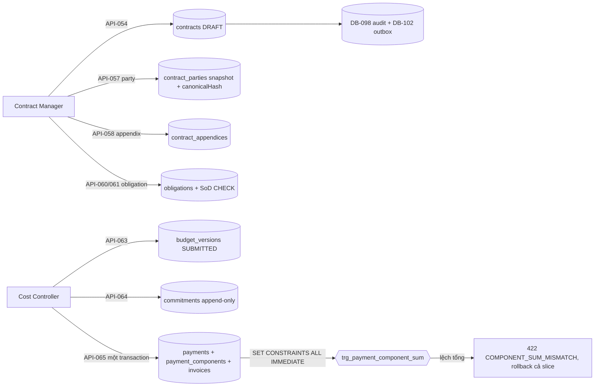

# ExecPlan — Contract & Cost US-006/US-007

> **Status:** Completed (API-053…API-066); AC-023…026/028…030 Partial, AC-027/031/032 Not covered
> **Owner:** Codex / Engineering
> **Created:** 2026-07-26
> **Updated:** 2026-07-26
> **Approval:** Product Owner trao toàn quyền quyết định và yêu cầu hoàn thành các yêu cầu trong story ngày 2026-07-26

## 1. Mục tiêu và kết quả người dùng

Contract Manager đăng ký hợp đồng theo dự án với số hợp đồng duy nhất, thêm các bên bằng ID pháp nhân ổn định — hệ thống snapshot legal name/country/registration/tax tại thời điểm thêm và băm snapshot bằng đúng thuật toán canonical hash đã dùng cho Change Request; theo dõi phụ lục theo chuỗi số/revision và đọc giá trị hợp nhất do SQL tính từ chuỗi văn bản có hiệu lực; ghi nghĩa vụ có owner/beneficiary/due date/evidence/consequence và thấy chip DUE/OVERDUE được suy ra lúc đọc chứ không lưu. Cost Controller nộp budget version, ghi commitment chống trùng theo source version, và tạo payment kèm breakdown thành phần + invoice trong đúng một transaction.

Kết quả quan sát được quan trọng nhất: **một breakdown sai tổng, một tham chiếu lệch currency, hay một quyết định vi phạm SoD là bất khả thi ở tầng cơ sở dữ liệu, không chỉ ở tầng service.** Server không làm bất kỳ phép tính tiền nào trong JavaScript: mọi giá trị `numeric(19,4)` đi qua service dưới dạng chuỗi, mọi tổng và đối chiếu được Postgres tính trong `numeric`.

## 2. Nguồn và requirement IDs

- Business: `BR-007`, `BR-009…BR-011`, `BR-015`, `BR-022`, `BR-026`, `BR-030`, `BR-033`
- Functional: `FR-036…FR-044` (US-006); `FR-053…FR-060`, `FR-138…FR-155` (US-007, theo trace `docs/15`)
- Use case/story/workflow: `UC-006`, `US-006`, `WF-008/009`; `UC-007`, `US-007`, `WF-014`
- Acceptance: `AC-023…AC-026`, `AC-028…AC-030` một phần; `AC-027`, `AC-031`, `AC-032` out — không operation nào trong catalog phục vụ chúng
- Tests: `TEST-023…TEST-026`, `TEST-028…TEST-030` một phần; `TEST-027`, `TEST-031`, `TEST-032` out
- API: `API-053…API-066` (14 operation, không thiếu và không dư)
- Data: `DB-028…DB-031` + `DB-034…DB-040` (11 bảng); **`DB-032` Guarantee và `DB-033` Permit cố ý không tạo** — không operation nào ghi chúng; `DB-098` audit, `DB-102` outbox, `DB-104` command receipt dùng lại
- Security: `SEC-108`, `SEC-109`, `SEC-114`, `SEC-118`, `SEC-119`, `SEC-126`, `SEC-130`

## 3. Hiện trạng repository trước khi bắt đầu

- `API-053…066` chỉ có contract thiết kế; không controller, service hay route nào ứng với chúng; marker implemented là 74/164.
- Không bảng nào của `DB-028…040` tồn tại. Chuỗi migration kết thúc ở `1783741000000` với `policy_version = 6`; `project-master.seed.ts` dùng hằng `rolePolicyVersion = 6`.
- `PermissionService.accessScopeSets`, `CommandReceiptService` và `OutboxService` đã có sẵn — ABAC, idempotency và outbox không phải phát minh lại.
- Thuật toán canonical hash nằm private trong `risk-change.service.ts`. Party snapshot cần đúng thuật toán đó; viết serializer thứ hai là tạo ra hai "chuẩn" băm.
- Master `legal_entities` chỉ có `legal_name`, `country`, `registration_no`, `tax_id` — **không có address**, dù dictionary `DB-029` liệt kê address snapshot.
- Không có operation ký/kích hoạt hợp đồng, approve budget/payment, CRUD cost code hay đánh giá condition/COD nào trong catalog 164 operation — đây là ranh giới cứng của slice.

## 4. Phạm vi

### In scope

- Mười bốn operation `API-053…066` trong module Nest `contract-cost` mới: register/list hợp đồng, detail nhúng parties/appendices/giá trị hợp nhất, DRAFT-only edit, thêm party, thêm phụ lục, list/tạo obligation, fulfill obligation, cost summary, budget version, commitment, payment (một transaction gồm invoice + components), đọc payment.
- Mười một bảng `DB-028…031` + `DB-034…040`, migration `1783742000000-CreateContractCost.ts` và `1783743000000-GrantContractCostPermissions.ts` (`policyVersion = 7`, mẫu state-table đảo ngược được; seed nâng `rolePolicyVersion` 6→7 cùng lúc và thêm demo cost code idempotent).
- Tách `canonicalHash` từ risk-change ra `risk-change/domain/canonical-hash.ts` (byte-identical) và tái sử dụng cho party snapshot hash.
- Slice Vue: route `/projects/:projectId/contracts` với register, detail (parties/phụ lục/giá trị hợp nhất), obligations với chip DUE/OVERDUE suy diễn, cost summary, form budget/commitment/payment.
- OpenAPI: đặc tả cụ thể cả 14 operation, 44 schema mới, tiền dưới dạng string pattern; marker implemented 74 → 88.

### Out of scope

- **Ký/kích hoạt hợp đồng.** Không operation nào trong catalog 164 làm việc đó; hợp đồng ship DRAFT-only nhưng CHECK mang đủ từ vựng 8 trạng thái để không cần migration sau.
- **`DB-032` Guarantee và `DB-033` Permit.** Không operation nào ghi chúng — schema chết bị từ chối, không phải bị quên (phần guarantee của `AC-025` do đó không đóng).
- **Approve budget/payment (`AC-031`, một phần `AC-028`).** Không operation approve nào tồn tại; các CHECK SoD được cài trước để đã đúng sẵn khi operation đó ra đời.
- **Condition-evaluation/COD gate (`AC-027`)** và **EAC/forecast/contingency alert (`AC-032`).** Không engine, không operation.
- **Hiển thị quy đổi FX.** Số gốc + snapshot bất biến có; quy đổi hiển thị cố ý vắng vì chưa có quy tắc làm tròn nào được duyệt (`NFR-013` TBD).
- **Cảnh báo/notification theo mốc nghĩa vụ.** Allowlist notification hiện đóng; không thêm nguồn sự kiện mới.
- **Liên kết Procurement.** `commitments.purchase_order_id` cố ý vắng cho tới khi `DB-049` materialize.

## 5. Assumption, TBD và Open Question

| Loại | Nội dung | Owner | Điều kiện đóng | Tác động nếu chưa đóng |
|---|---|---|---|---|
| Open Question | Operation ký/kích hoạt hợp đồng, approve budget/payment, condition/COD gate và cost engine chưa được cấp trong catalog | Product Owner | Cấp `API-*` mới có trace | `AC-023` "tại thời điểm ký", `AC-027`, `AC-031`, `AC-032` không đóng được; không phụ lục nào đạt EFFECTIVE |
| Open Question | Quy tắc thuế `net = gross − vat` cho invoice | Finance | Xác nhận công thức theo jurisdiction | Invoice lưu cả ba số không kèm CHECK; lưu chưa kiểm chứng là an toàn, enforce một quy tắc sai thì không |
| Open Question | Quy tắc làm tròn/hiển thị quy đổi FX (`NFR-013`) | Finance/Product | Chốt rounding rule + reporting currency | UI chỉ hiển thị số gốc theo currency; không có nhánh quy đổi nào |
| TBD | Chính sách alert theo mốc nghĩa vụ (phần cảnh báo của `AC-025`) | Product/Notification owner | Mở allowlist notification cho nguồn obligation | Overdue chỉ nhìn thấy qua chip DUE/OVERDUE trên register |
| Open Question (doc-correction) | Off-by-one FR trong tài liệu: `docs/03` định nghĩa `FR-039` = bảo lãnh, `FR-040` = nghĩa vụ, `FR-041` = giấy phép, nhưng `docs/08` gán `FR-039` cho API-059/060 (obligation) và `docs/07` gán `DB-032` Guarantee → `FR-041`, `DB-033` Permit → `FR-042` | BA/Product Owner | Entry đính chính docs/03 hoặc docs/07+docs/08 | Trace FR↔API/DB của cụm obligation/guarantee/permit lệch một bậc; slice này theo hợp đồng OpenAPI hiện hành và không tự sửa tài liệu ngoài quyền sở hữu |
| Open Question (doc-correction) | Chuỗi `x-idempotency` trong `docs/openapi/openapi.yaml` ghi "DB-101 command receipt" trong khi receipt là `DB-104` (`DB-101` là ProjectSchedule) | API/Architecture Owner | Sửa string trong lần chỉnh contract kế tiếp | Đọc tài liệu sẽ tra nhầm entity; runtime không ảnh hưởng |
| Open Question (doc-correction) | Dictionary `DB-038` không liệt kê `invoice_id`, nhưng `AC-029` yêu cầu truy vết payment→invoice nên cột được thêm dạng nullable composite FK | Data Owner | Amendment dictionary `docs/07` | Dictionary và DDL lệch một cột; đã ghi ở đây để không âm thầm |
| Open Question (doc-correction) | Phần lớn chuỗi không có read endpoint: không list budget version/commitment/invoice/payment, không đọc lẻ phụ lục/party ngoài embed của API-055 | Product/API Owner | Cấp operation đọc mới nếu cần | UI chỉ dựng được từ 5 đường đọc hiện có; drill-down đầy đủ của `AC-028` dừng ở cost summary + API-066 |
| Open Question (doc-correction) | `DB-034` cost code không có CRUD operation nào trong catalog | Product Owner | Cấp operation hoặc xác nhận master data seeded | Cost code là seed idempotent; tenant mới không tự quản trị được danh mục |

## 6. Thiết kế

Tenancy: mọi khóa ngoại đều composite và mang `tenant_id`. Các khóa mang currency — phụ lục/commitment/invoice khóa vào `contracts (tenant_id, id, currency)`, component khóa vào `payments (tenant_id, id, currency)` — làm `CURRENCY_MISMATCH` bất khả thi về cấu trúc: một hàng lệch loại tiền không thể tồn tại dù service có lỗi. Hợp đồng là project-level, không có package granularity, nên actor package-only không với tới gì cả; ngoài scope trả **404 chứ không 403**, đúng tiền lệ risk-change/document-control.

Tổng thành phần payment: constraint trigger `trg_payment_component_sum` (`DEFERRABLE INITIALLY DEFERRED`) khẳng định SUM(components) = `requested_amount` bằng Postgres `numeric`; service ép chạy ngay trong transaction bằng `SET CONSTRAINTS ALL IMMEDIATE` để breakdown sai trở thành 422 `COMPONENT_SUM_MISMATCH` có tên và cả slice payment+components+invoice rollback cùng nhau, thay vì một lỗi COMMIT vô danh.

DUE/OVERDUE không bao giờ được lưu: projection SQL của API-059 suy ra từ `due_date` so với `CURRENT_DATE` của chính database, nên register không thể lệch khỏi đồng hồ mà constraint dùng. Giá trị hợp nhất của hợp đồng cũng tính trong SQL từ chuỗi văn bản, không cộng trong JS.

Bất biến lịch sử bằng trigger: `trg_contract_history` (họ trạng thái signed đóng băng danh tính + legal hold + cấm thoái lui trạng thái), `trg_contract_party_history` (UPDATE không bao giờ, DELETE chỉ khi parent còn DRAFT), `trg_contract_appendix_history` (EFFECTIVE/SUPERSEDED bất biến), `trg_obligation_history` (quyết định bất biến), `trg_budget_version_history` (APPROVED bất biến), `trg_commitment_history` (append-only), `trg_payment_history` (không bao giờ xóa, PAID đóng băng trừ đối soát), components và `fx_snapshots` bất biến.

## 7. Quyết định thiết kế đã chốt

| Quyết định | Lý do |
|---|---|
| (a) Hợp đồng ship DRAFT-only nhưng CHECK mang đủ từ vựng 8 trạng thái (`DRAFT/REVIEW/APPROVED/SIGNED/EFFECTIVE/SUSPENDED/EXPIRED/CLOSED`) | Không operation nào trong catalog 164 ký/kích hoạt hợp đồng; ship sẵn từ vựng tránh một migration sau, còn trigger đã canh sẵn họ signed |
| (b) Tiền đề "hợp đồng cha effective" của API-058 (phụ lục) và API-065 (payment) được nới thành "cha tồn tại và không CLOSED/EXPIRED" | Tiền đề gốc bất khả thi — không gì làm hợp đồng EFFECTIVE được; đây là deviation tường minh khỏi WF-008/WF-009, ghi tại đây và trong service comment |
| (c) Không có operation approve budget/payment nên `AC-028`/`AC-031` không đóng được; các CHECK SoD (`ck_obligation_sod`, `ck_payment_sod`, `ck_budget_version_sod`) vẫn cài trước | Khi operation approve ra đời, bất biến đã đúng sẵn ở tầng DB thay vì phải retrofit |
| (d) `DB-032` guarantees / `DB-033` permits không tạo | Không operation nào ghi chúng; schema chết là nợ chứ không phải tiến độ |
| (e) Budget là header-only | Con line-item của budget không có DB ID được cấp trong dictionary; không bịa ID mới (AGENTS §4) |
| (f) Cost code là master data seeded (demo, idempotent) | `DB-034` không có CRUD operation nào trong catalog; ghi nhận spec gap thay vì tự cấp operation |
| (g) Party snapshot chỉ giữ đúng những gì master `legal_entities` thật sự có (`legal_name`, `country`, `registration_no`, `tax_id`) + representative/authority do client khai; **không có address** | Master không có address; snapshot một trường không tồn tại là bịa dữ liệu. Hash snapshot dùng `canonicalHash` tách từ risk-change — một serializer duy nhất, byte-identical |
| (h) `commitments.purchase_order_id` cố ý vắng | Procurement chưa có; `DB-049` materialize rồi mới thêm cột có FK thật thay vì cột mồ côi |
| (i) Invoice không có CHECK `net = gross − vat` | Quy tắc thuế là TBD; lưu số chưa kiểm chứng là an toàn, enforce một quy tắc sai thì không |
| (j) `payments.invoice_id` thêm dạng nullable composite FK `(tenant_id, contract_id, invoice_id)` dù dictionary `DB-038` không liệt kê | `AC-029` cần truy vết payment→invoice; amendment dictionary được ghi ở §5 để không âm thầm |

## 8. Milestone

### M1 — Schema và migration

- [x] Bốn file entity (`contract`, `contract-collaboration`, `cost-control`, `contract-cost.enums`) khớp một-một với DDL: mọi `@Check`/`@Unique`/`@Index` có mặt trong migration dưới cùng tên.
- [x] Migration `1783742000000`: 11 bảng, FK composite mang `tenant_id`, các FK mang currency, partial unique index (`uq_budget_version_approved` một APPROVED mỗi dự án, `uq_payment_external_posting`), `uq_commitment_source`, `uq_invoice_supplier_number`, tám họ trigger bất biến + hai constraint trigger deferred (tổng thành phần trên `payment_components`, mirror trên `payments` để sửa `requested_amount` không âm thầm phá breakdown), `down()` gỡ theo thứ tự phụ thuộc ngược.
- [x] Migration grant `1783743000000` (policy 7, state-table `role_grant_reconcile_1783743000000`, 13 permission code) và đồng bộ `rolePolicyVersion` = 7 + demo cost code idempotent trong seed.

**Exit criteria:** tham chiếu xuyên tenant hoặc lệch currency là bất khả thi ở DDL; hai bảng của DB-032/033 không tồn tại; up/down/up sạch.

### M2 — Service, controller và contract

- [x] `contract-cost.service.ts` 14 operation trên `CommandReceiptService`/`OutboxService`/`PermissionService`; `canonicalHash` tách ra `risk-change/domain/canonical-hash.ts` và risk-change import lại từ đó.
- [x] Projection `OBLIGATION_EFFECTIVE_STATUS_SQL` suy DUE/OVERDUE lúc đọc; giá trị hợp nhất và cost summary group theo currency/cost code tính trong SQL, không bao giờ quy đổi.
- [x] OpenAPI: 14 operation đặc tả cụ thể, 44 schema mới, tiền là string pattern `numeric(19,4)`; marker 74 → 88.

**Exit criteria:** mọi nhánh 4xx ghi zero hàng; ngoài scope là 404; breakdown sai tổng là 422 có tên và rollback trọn slice.

### M3 — Vue slice

- [x] Route `/projects/:projectId/contracts` (đăng ký trước `:projectId` để không bị nuốt), gated theo `contract.read`: `ContractRegisterTable`, `ContractCreateForm`, `ContractDetailPanel` (parties/phụ lục/giá trị hợp nhất), `ObligationPanel` (chip DUE/OVERDUE), `CostSummaryPanel` + form budget/commitment/payment.
- [x] UI không cộng tiền: mọi số hiển thị theo currency gốc, không có nhánh quy đổi.

**Exit criteria:** build Pass; component test phủ register/detail/obligation/cost summary.

## 9. Phạm vi acceptance

Không AC nào đóng trọn — 7 Partial, 3 Not covered; tất cả điểm dừng là chỗ catalog không cấp operation, được ghi có chủ ý.

| AC | Trạng thái | Bằng chứng và giới hạn |
|---|---|---|
| `AC-023` | **Partial** | Số hợp đồng duy nhất trong dự án (`uq_contract_project_number`, 409 `CONTRACT_NUMBER_CONFLICT` zero-write); các bên bằng ID pháp nhân ổn định + snapshot có hash tại thời điểm **thêm party**. "Snapshot tại thời điểm ký" bất khả thi — không gì ký hợp đồng được. |
| `AC-024` | **Partial** | Chuỗi phụ lục `uq_contract_appendix_revision` và giá trị hợp nhất là read model SQL từ chuỗi văn bản có hiệu lực. Không phụ lục nào đạt được EFFECTIVE vì không operation nào chuyển trạng thái nó. |
| `AC-025` | **Partial** | Obligation có owner/beneficiary/due/evidence/consequence; `ck_obligation_decision_evidence` bắt evidence khi FULFILLED/WAIVED — upload tệp không tự đóng gì. Guarantee vắng (`DB-032` không có operation); cảnh báo theo mốc vắng (allowlist notification đóng); overdue chỉ hiện qua chip suy diễn. |
| `AC-026` | **Partial** | Từ chối sửa văn bản đã ký được enforce bằng `trg_contract_history` + họ CHECK signed, chứng minh được ở tầng DB bằng test migration UPDATE tay. End-to-end qua API cần một hợp đồng ký được — chưa tồn tại. |
| `AC-027` | **Not covered** | Không có engine đánh giá condition, không COD gate, không operation waiver. Điểm dừng có chủ ý. |
| `AC-028` | **Partial** | Commitment chống trùng bằng `uq_commitment_source (tenant, source_type, source_id, source_version)` — replay là 409, không phải hàng đôi; drill-down qua cost summary + API-066. Baseline approved và forecast/EAC vắng vì không có operation approve/cost engine. |
| `AC-029` | **Partial** | Đủ trường bắt buộc (contract, payer/payee, currency, gross/VAT/deduction qua components, milestone, evidence) + trigger tổng thành phần. Không có bước submit; kiểm lũy kế so với văn bản có hiệu lực chưa có ý nghĩa khi không văn bản nào effective được. |
| `AC-030` | **Partial** | Số gốc giữ nguyên theo currency; `fx_snapshots` bất biến và unique theo source/date/pair; không chỗ nào — kể cả UI — cộng chéo currency. Hiển thị quy đổi cố ý vắng: chưa có quy tắc làm tròn (`NFR-013` TBD). |
| `AC-031` | **Not covered** | Không bước phê duyệt nào tồn tại để loại PM ra khỏi. `ck_payment_sod` (approver ≠ requester/submitter) đã cài trước ở tầng DB. |
| `AC-032` | **Not covered** | Không EAC, không contingency threshold, không alerting. |

## 10. Kiểm thử

| Loại | Command | IDs | Kết quả |
|---|---|---|---|
| Lint | `npm run lint` | NFR-024 | Pass, 0 warning |
| Type-check | `npm run typecheck` | NFR-024 | Pass trên api/web/worker |
| Unit | `npm run test:unit` | NFR-024 | API 100 Pass / 19 suite; Web 178 Pass / 36 file (48 test mới); Worker 61 Pass / 12 suite |
| Integration | `npm run test:integration` | TEST-023…026/028…030 một phần | API **163 Pass / 17 suite** (+28 ròng: contract-cost 16 HTTP + 13 migration, một test helper dùng chung được hợp nhất); Worker 11 Pass / 3 suite |
| Contract | `npm run openapi:lint` | NFR-024 | Pass; 88/164 marker implemented sau khi đặc tả `API-053…066` |
| Build | `npm run build` | NFR-024 | Pass; chunk `ProjectContractsView` 65.6 kB |

Mọi nhánh 4xx đều assert **không ghi hàng nào**: số hợp đồng trùng, party trùng role+entity, pháp nhân không tồn tại, phụ lục sai currency/cha đã đóng, obligation thiếu evidence, SoD (owner/creator tự quyết bị 422, decider độc lập thì được), invoice trùng `(tenant, contract, supplier, invoice_no)`, breakdown lệch tổng, cursor hỏng và thiếu `Idempotency-Key`. Request xuyên tenant và request từ actor package-only đều assert trả **404**, không bao giờ 403. Test migration chứng minh bất biến bằng SQL tay: sửa hợp đồng đã "ký" (dựng bằng UPDATE trực tiếp), xóa payment, sửa component, sửa fx snapshot, hai budget APPROVED cùng dự án — tất cả bị database từ chối. Replay idempotency phát lại nguyên trạng 201 cũ; cùng key khác nội dung là 409.

Chưa chạy trong slice này: Playwright không có kịch bản contract/cost — cùng lý do fixture như document-control, thuộc slice riêng.

## 11. Migration, rollout và rollback

- `1783742000000-CreateContractCost.ts` tạo 11 bảng theo thứ tự phụ thuộc (cost_codes/fx_snapshots trước, payments/payment_components sau), các function/trigger bất biến và constraint trigger tổng thành phần; `down()` gỡ trigger → function → bảng theo thứ tự ngược. Đã test up/down/up trong 13 test migration.
- `1783743000000-GrantContractCostPermissions.ts` dùng mẫu state-table `role_grant_reconcile_1783743000000`: cấp 13 permission code (`contract.read/create/update`, `contractParty.create`, `contractAppendix.create`, `obligation.read/create/fulfill`, `cost.read`, `budget.submit`, `commitment.create`, `payment.create/read`) cho các role catalog, nâng `policy_version` lên 7; `down()` chỉ lấy lại đúng phần nó thêm. Hằng `rolePolicyVersion` trong seed nâng 6→7 cùng lúc để seed không hạ cấp role migration vừa nâng; seed thêm demo cost code idempotent vì không có operation CRUD cost code nào (spec gap ghi ở §5).
- Hai assertion role exact-match trong `risk-change-migration.integration-spec.ts` mở rộng thêm `contract.read`/`cost.read` cho `EXECUTIVE`/`TENANT_ADMIN` — đúng chỉ dẫn trong comment của chính test đó.
- Không backfill: trước slice này không có hợp đồng/chi phí nào trong hệ thống, rollback không mất dữ liệu nghiệp vụ.

## 12. Rủi ro

| Rủi ro | Tác động | Giảm thiểu |
|---|---|---|
| DRAFT-only bị hiểu là hợp đồng đã ký/kích hoạt được | Cao | Ghi Partial cho AC-023/024/026 ở backlog/changelog/matrix; từ vựng 8 trạng thái chỉ là CHECK, không có đường lên |
| Nới tiền đề "cha effective" (quyết định b) bị coi là hành vi chuẩn của WF-008/009 | Trung bình | Deviation ghi tường minh ở §7, service comment và changelog; khi có operation kích hoạt phải thu hẹp lại |
| SoD CHECK cài trước bị đọc là "AC-031 đã xong" | Cao | AC-031 ghi Not covered ở mọi artefact; CHECK là chuẩn bị, không phải bước phê duyệt |
| Demo cost code trong seed bị coi là dữ liệu vận hành thật | Trung bình | Seed idempotent, đánh dấu demo; spec gap CRUD cost code ghi ở §5 với owner |
| Off-by-one FR-039/040/041 lan sang artefact mới | Trung bình | Slice trace theo hợp đồng OpenAPI hiện hành; đính chính tài liệu là follow-up có owner ở §5 |
| Tổng thành phần chỉ được kiểm ở service | Đã loại bỏ | Trigger deferred kiểm tại COMMIT kể cả khi ai đó INSERT bằng SQL tay; service chỉ làm lỗi hiện sớm và có tên |

## 13. Kết quả và bàn giao

- Outcome: 14 operation `API-053…066` chạy end-to-end với 16 test HTTP và 13 test ràng buộc DB; 11 bảng materialize với bất biến ở tầng DDL; 0 AC đóng trọn, 7 Partial, 3 Not covered — đúng chỗ catalog không cấp operation.
- File tạo: `apps/api/src/modules/contract-cost/**` (6 file), `apps/api/src/modules/risk-change/domain/canonical-hash.ts`, `contract.entity.ts`, `contract-collaboration.entity.ts`, `cost-control.entity.ts`, `contract-cost.enums.ts`, hai migration `1783742000000`/`1783743000000`, `contract-cost.integration-spec.ts`, `contract-cost-migration.integration-spec.ts`, `cursor.unit-spec.ts`; slice Vue `apps/web/src/views/contracts/`, `apps/web/src/components/contracts/` (4 component + 4 spec), `contract.api.ts` + spec, `contract.types.ts`, `constants/contracts.ts` + spec, `styles/contracts.css`.
- File sửa: `app.module.ts`, `data-source.ts`, `entities/index.ts`, `project-master.seed.ts`, `risk-change.service.ts` (import canonical-hash), `risk-change-migration.integration-spec.ts`, `auth.integration-spec.ts`, `swagger.unit-spec.ts`; `apps/web/src/router/routes.ts`, `constants/routes.ts`, `styles/index.css`, `views/projects/ProjectDetailView.vue`, `app/project-structure.spec.ts`; `docs/openapi/openapi.yaml`, `docs/12`, `docs/15`, `docs/CHANGELOG.md`, ExecPlan này.
- Còn lại: toàn bộ mục Out of scope §4 và các doc-correction follow-up §5 (off-by-one FR, x-idempotency DB-101→DB-104, amendment DB-038 `invoice_id`, read endpoint thiếu, CRUD cost code) — mỗi mục có owner.
- Deploy EC2 test và bằng chứng CI/CD ghi nhận theo release kế tiếp.
