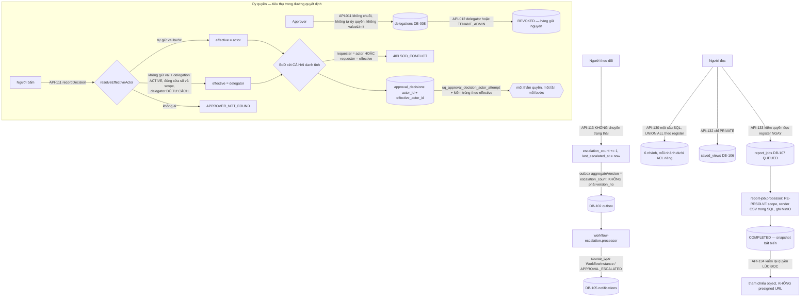

# ExecPlan — Cross-cutting remainder (Identity admin, Delegation, Escalation, Search & Reporting)

> **Status:** Completed (API-002/003/009…013, API-113, API-130…134 — 13 operation); AC-077/087/100/109/112 Pass; AC-073/074/076/078/079/080/084/085/086/098/099/110 Partial; AC-072/075/081/082/083/101/102/108/111 Not covered; **8 operation cố ý không triển khai (API-122…129)**
> **Owner:** Codex / Engineering
> **Created:** 2026-07-26
> **Updated:** 2026-07-26
> **Approval:** Product Owner trao toàn quyền quyết định và yêu cầu hoàn thành các yêu cầu trong story ngày 2026-07-26

## 1. Mục tiêu và kết quả người dùng

Đây là slice đóng phần còn lại của bề mặt xuyên suốt: người dùng đọc được đúng quyền hiệu lực của chính mình (API-002) và cấu hình tenant của chính mình (API-003); Tenant Admin cấp và thu hồi role assignment có cửa sổ hiệu lực (API-009/010) và đọc được sổ audit của tenant (API-013); Approver ủy quyền phê duyệt có thời hạn và thu hồi được ngay (API-011/012); người theo dõi một hồ sơ đang chờ duyệt có thể nhắc việc (API-113); và mọi vai đọc dữ liệu có thể tìm kiếm xuyên register (API-130), lưu view riêng (API-131/132) và đặt báo cáo sinh phía server (API-133/134).

Kết quả quan sát được quan trọng nhất: **ủy quyền được tiêu thụ thật trong đường quyết định của workflow, và nó không bao giờ nới rộng SoD.** Khi người gọi không tự giữ vai của bước duyệt nhưng có một delegation `ACTIVE`, đúng cửa sổ, đúng scope, từ một delegator **đủ tư cách**, quyết định được ghi với **cả hai danh tính**: `actor_id` là người bấm, `effective_actor_id` là người cho mượn thẩm quyền. SoD xét trên **cả hai** — người yêu cầu không được là người bấm, và cũng không được là người cho mượn thẩm quyền; nếu không thì tự duyệt qua trung gian sẽ hợp lệ. Quy tắc "một actor một quyết định mỗi bước" cũng áp cho danh tính hiệu lực, nên một thẩm quyền không thể được đếm hai lần (một lần trực tiếp, một lần qua người được ủy quyền).

Hai điểm dừng trung thực khác: `API-113` **không** chuyển trạng thái — nhắc việc không phải một quyết định; và saved view chỉ có `PRIVATE`, nên **một view đã lưu về mặt cấu trúc không thể nâng quyền cho ai**.

## 2. Nguồn và requirement IDs

- Business: `BR-001`, `BR-011`, `BR-015`, `BR-032…BR-036`, `BR-038`, `BR-040` (theo trace `US-016`/`US-017`/`US-018`/`US-021`/`US-023` trong `docs/12`)
- Functional: `FR-146` (API-003), `FR-147` (API-002), `FR-148` (API-009/010), `FR-150` (API-011/012), `FR-154` (API-013), `FR-142` (API-113), `FR-171` (API-130), `FR-172` (API-131/132), `FR-173` (API-133/134) theo `x-related-requirements`; phạm vi story là `FR-139…FR-155` và `FR-171…FR-177`
- Use case/story/workflow: `UC-016`/`US-016`, `UC-017`/`US-017`, `UC-018`/`US-018`, `UC-021`/`US-021`, `UC-023`/`US-023`; `WF-001…WF-025` ở phần policy/delegation
- Acceptance: `AC-073…AC-087`, `AC-098…AC-102`, `AC-108…AC-112`; và `AC-072` (US-015) vẫn Not covered
- Tests: `TEST-073…TEST-087`, `TEST-098…TEST-102`, `TEST-108…TEST-112` theo bảng §9
- API: `API-002`, `API-003`, `API-009`, `API-010`, `API-011`, `API-012`, `API-013`, `API-113`, `API-130`, `API-131`, `API-132`, `API-133`, `API-134` — **13 operation**; **`API-122…API-129` cố ý không triển khai** (§4)
- Data: **`DB-008` Delegation materialize**; **`DB-106` SavedView và `DB-107` ReportJob materialize** (hai ID trước đây ở trạng thái Reserved); sửa đổi `DB-071` WorkflowInstance (`escalation_count`, `last_escalated_at`) và mở rộng từ vựng `DB-105` Notification; `DB-001` Tenant, `DB-006` Role, `DB-007` RoleAssignment, `DB-098` AuditEvent, `DB-102` outbox, `DB-104` command receipt dùng lại
- Security: `SEC-104`, `SEC-105`, `SEC-106`, `SEC-107`, `SEC-108`, `SEC-110`, `SEC-112`, `SEC-118`, `SEC-119`

## 3. Hiện trạng repository trước khi bắt đầu

- `API-002/003/009…013`, `API-113` và `API-130…134` chỉ có contract thiết kế; `identity-access` có `AuthController` + `UserDirectoryController` nhưng không controller quản trị nào. Marker implemented ở đầu wave là 96/164.
- Không bảng `delegations`, `saved_views`, `report_jobs` nào tồn tại. `docs/07` ghi `DB-106…111` là **Reserved** ("chưa có table/migration").
- `workflow.service.ts` đã ghi `effective_actor_id` **bằng** `actor_id` từ slice US-015 (ExecPlan `2026-07-26-workflow-engine-us015.md` đã tách sẵn hai cột "để không cần migration khi có delegation") nhưng **chưa có nguồn delegation nào để tiêu thụ**.
- `workflow_instances` chưa có `escalation_count`/`last_escalated_at`. `notifications.ck_notification_source_type` là allowlist đóng gồm năm nguồn: `ScheduleActivity`, `Risk`, `Issue`, `RiskIssueAction`, `ChangeRequest`.
- Worker có `schedule-alert.processor.ts` và `risk-change-alert.processor.ts` trên hạ tầng `notification-projection.ts`; **không** có processor nào cho escalation hay report job; `apps/worker/package.json` không có `@aws-sdk/client-s3`.
- Package `@aws-sdk/s3-request-presigner` **không** được cài ở bất kỳ workspace nào.
- `docs/09` nêu `TENANT_ADMIN` là vai thu hồi hành chính, và `roleAssignment.manage` là một code đã seed nhưng **không có endpoint nào đứng sau**.
- Không có `Client Viewer` role, không có scope assignment theo khách hàng: `AssignmentScopeType` chỉ có `TENANT`/`PORTFOLIO`/`PROJECT`/`PACKAGE`.
- `mutualTLS` được khai trong contract của `API-125` nhưng **không tồn tại trong auth profile đã phê duyệt**; `DB-089…092` (OT/telemetry) và `DB-108…111` (AI) chưa materialize.

## 4. Phạm vi

### In scope

- Mười ba operation: `identity-admin.controller.ts`/`identity-admin.service.ts` (`API-002/003/009/010/011/012/013`), `workflow.controller.ts`/`workflow.service.ts` bổ sung `:escalate` (`API-113`), module Nest `search-reporting` (`API-130…134`).
- Migration `1783754000000-CreateDelegations.ts` (`DB-008`), `1783755000000-CreateSavedViewsAndReportJobs.ts` (`DB-106`/`DB-107`), `1783756000000-ExtendWorkflowEscalationNotificationSource.ts` (escalation facts + từ vựng `DB-105`), `1783757000000-GrantCrossCuttingPermissions.ts` (`policyVersion = 11`).
- Hai worker processor mới: `workflow-escalation.processor.ts` (chiếu `WorkflowInstance.EscalationRequested` thành notification `APPROVAL_ESCALATED`) và `report-job.processor.ts` (sinh CSV register, ghi lên MinIO), cùng `report-storage.ts`.
- Tiêu thụ delegation trong `recordDecision` của workflow: `domain/delegation-match.ts` + `resolveEffectiveActor`.
- Domain thuần có unit test: `search-query.ts`, `search-reporting/cursor.ts`, `audit-event.cursor.ts`, `delegation-match.ts`.

### Out of scope — tám operation cố ý không triển khai

Mỗi mục dưới đây là một quyết định có lý do, **không phải một thiếu sót**, và được ghi Not covered ở mọi artefact:

- **`API-122` (đọc connector registry), `API-123` (tạo sync run), `API-124` (đọc sync run):** chưa hệ thống ngoài nào được ký hợp đồng tích hợp, và **entity connector registry chưa có DB ID được cấp** trong dictionary. Dựng một registry không có ID chuẩn sẽ vi phạm AGENTS §4.
- **`API-125` (nhận telemetry event):** contract khai `mutualTLS`, thứ **không tồn tại trong auth profile đã phê duyệt**; `DB-089…092` chưa materialize. Nhận telemetry qua một cơ chế xác thực yếu hơn cái đã khai là hạ cấp biện pháp kiểm soát trong im lặng.
- **`API-126` (dispatcher hướng ra tới subscriber callback):** chưa có registry subscription để biết gửi cho ai, **thuật toán ký payload còn TBD**, và worker không có HTTP client. Ba khoảng trống độc lập, mỗi cái đủ để chặn.
- **`API-127` (tạo AI run), `API-128` (đọc AI run), `API-129` (ghi review AI):** chưa duyệt provider và policy AI; `DB-108…111` vẫn ở trạng thái **Reserved** trong `docs/07`.

### Out of scope — khác

- **`AC-072` scheduler SLA (US-015).** Vẫn Not covered: quy tắc calendar/timezone/pause chưa có chủ sở hữu. Cột `sla_due_at` và partial index đã đặt sẵn từ slice US-015. `API-113` là **nhắc việc do người bấm**, không phải scheduler.
- **Presigned URL cho báo cáo.** Package `@aws-sdk/s3-request-presigner` chưa được cài; `API-134` trả **tham chiếu object** (`bucket` + `objectKey`) chứ không phải URL tải trực tiếp. Khoảng trống có ghi nhận (§7g).
- **Chia sẻ saved view.** `ck_saved_view_share_scope` chỉ nhận `PRIVATE`; nới CHECK là cổng phê duyệt tương lai, không phải một nhánh code.
- **`valueLimit` trên delegation.** `docs/07` liệt kê cho `DB-008` nhưng V1 không có gì cưỡng chế được hạn mức tiền trên một phê duyệt; `API-011` từ chối trường bằng 422 (§7f).
- **Sửa `docker-compose.yml`.** Worker cần `MINIO_ENDPOINT`/`MINIO_REGION`/`MINIO_RELEASE_BUCKET` và mount hai secret file; các thay đổi compose được ghi trong `docs/CHANGELOG.md` như một phần bàn giao, **dùng chung đúng cặp credential mà API giải mã, không phải bản sao thứ hai**.
- **UI Vue.** Không route/view web nào trong slice này.

## 5. Assumption, TBD và Open Question

| Loại | Nội dung | Owner cần xác nhận | Điều kiện đóng | Tác động nếu chưa đóng |
|---|---|---|---|---|
| Open Question (ưu tiên cao) | **Seed `rolePolicyVersion` vẫn là `8` trong khi chuỗi grant migration của wave kết thúc ở `12`.** Comment của chính hằng đó nói nó "phải bằng policy version cao nhất mà bất kỳ migration grant nào ghi, vì seed re-save mọi vai catalog mỗi lần chạy" | Codex / Platform | Nâng hằng lên `12` trong `apps/api/src/database/seeds/project-master.seed.ts` | Chạy seed sau wave sẽ **hạ** `policy_version` của mọi vai catalog từ 12 xuống 8. Danh sách permission trong seed đã đầy đủ nên quyền không mất, nhưng `API-002` sẽ báo policy version sai và đây đúng là lớp defect mà slice US-015 đã phải sửa một lần (3 → 4) |
| Open Question (doc-correction) | `docs/openapi/openapi.yaml` ghi `x-related-data: ["DB-096"]` cho `API-131/132` và `["DB-097"]` cho `API-133/134`, nhưng `DB-096` là ExternalMapping và `DB-097` là SyncRun. Đúng phải là **`DB-106` SavedView / `DB-107` ReportJob** — đúng như migration và `docs/15` ghi | API Owner / Data Owner | Sửa hai chuỗi `x-related-data` | Đọc tài liệu sẽ tra nhầm entity; runtime không ảnh hưởng. Cùng họ với defect `x-idempotency` `DB-101`→`DB-104` đã ghi ở slice contract-cost |
| Open Question | `docs/07` vẫn ghi `DB-106`/`DB-107` là **Reserved** ("chưa có table/migration") dù cả hai đã materialize | Data Owner | Cập nhật hai dòng dictionary sang Implemented và bổ sung cột thật (`error_code`, `correlation_id`, `expires_at`) | Dictionary và schema lệch; `docs/15` §1 đã ghi materialized nên hai tài liệu mâu thuẫn nhau |
| Open Question | `API-013` phân trang keyset trên `(occurred_at, id)` vẫn dùng vị ngữ so sánh **millisecond** (`occurred_at < :cursorTime OR (= AND id <)`), trong khi Postgres lưu `timestamptz` ở **microsecond** | Codex / Platform | Chuyển sang so sánh theo hàng đọc lại giá trị đã lưu, như bản sửa ngày 2026-07-26 đã áp cho chín service khác | Hàng audit ghi hàng loạt trong cùng một transaction chia chung một `now()`; nếu biên trang rơi vào nhóm đó thì phần còn lại của nhóm **biến mất im lặng** khỏi trang kế. Đây là lỗ hổng cùng loại đã được đóng ở nơi khác, chưa áp cho audit trail |
| Open Question | `roleAssignment.manage` là permission code đã seed nhưng **không endpoint nào đứng sau**; `API-009/010` dùng `roleAssignment.grant`/`roleAssignment.revoke` | Security / Product Owner | Gỡ code cũ khỏi seed hoặc xác nhận giữ lại có lý do | Một code không cưỡng chế gì đang nằm trên `TENANT_ADMIN`; migration này cố ý **không** đụng vào (gỡ code đã seed không phải việc của một migration grant) |
| Assumption | Grant catch-all `permission.read.self` áp cho **đúng mười vai catalog nền tảng**, không dùng vị ngữ `TRUE` | Security / Product Owner | Xác nhận policy với vai tùy biến của tenant | Vai do tenant tự định nghĩa không nhận code này và người giữ nó không đọc được quyền của chính mình qua `API-002`. Đây là đánh đổi có chủ ý: mọi migration grant khác chỉ chạm vai nó nêu tên, và một migration âm thầm viết lại vai của khách hàng sẽ phá hợp đồng đó — và đã từng phá assertion bảo vệ nó |
| TBD | Thuật toán ký payload cho dispatcher hướng ra (`API-126`) | Architecture / Security | Chốt thuật toán ký + registry subscription | `API-126` Not covered; không dựng write path "để dùng sau" |
| Open Question | Chưa provider/policy AI nào được phê duyệt; `DB-108…111` giữ Reserved | AI Governance / Product Owner | Phê duyệt provider + policy | `API-127/128/129` Not covered |
| Open Question | Chưa hệ thống ngoài nào được ký hợp đồng tích hợp; connector registry chưa có DB ID | Product Owner / Architecture | Ký hợp đồng tích hợp + cấp `DB-*` cho registry | `API-122/123/124` Not covered; `API-125` còn vướng `mutualTLS` |
| TBD | Quy tắc calendar/timezone/pause cho SLA (`AC-072`) | Product Owner | Chốt quy tắc và chủ sở hữu | `AC-072` Not covered; `API-113` là nhắc việc thủ công, không phải scheduler |
| Open Question (doc-correction) | Lệch FR ở tầng operation: OpenAPI gán `API-011/012 → FR-150` (PRD `FR-150` là "quyền tài liệu theo loại/trạng thái"; `FR-141`/`FR-153` mới là delegation) và `API-130…134 → FR-171…173` (PRD `FR-171…173` là "tích hợp PVSyst/AutoCAD/P6"). `docs/12` và `docs/15` lại dùng `FR-171…177` đúng theo nghĩa reporting | BA / API Owner | Entry đính chính `docs/03` hoặc `docs/08` | Cùng họ lệch đã ghi ở slice contract-cost. Slice trace theo hợp đồng OpenAPI + `docs/15` hiện hành và không tự sửa tài liệu ngoài quyền sở hữu |

## 6. Thiết kế

**Delegation không bao giờ nới rộng gì.** Ba tầng bảo vệ, độc lập nhau:

1. **Tạo:** delegator luôn là người gọi (không ai tạo delegation thay người khác); `DELEGATION_SELF_FORBIDDEN` chặn vòng lặp tầm thường và `ck_delegation_no_self` chặn nó ở tầng hàng; `DELEGATION_CHAIN_FORBIDDEN` chặn chuỗi A→B→C (người ủy quyền không được đang là delegate của ai khác trong cửa sổ yêu cầu); `DELEGATION_OVERLAP` chặn hai delegation `ACTIVE` chồng cửa sổ cho cùng cặp người; `ck_delegation_window` bắt `effective_from < effective_to`. Delegate phải tồn tại và `ACTIVE`.
2. **Tiêu thụ:** `resolveEffectiveActor` chỉ chấp nhận một delegation khi **delegator tự mình đủ tư cách cho bước đó** — ủy quyền từ một người không đủ tư cách không truyền gì cả. Duyệt theo thứ tự tất định `(created_at, id)` nên kết quả không phụ thuộc may rủi.
3. **SoD:** kiểm **hai lần** — `instance.requestedBy === context.userId` trước, rồi `instance.requestedBy === effectiveActorId` sau khi giải danh tính hiệu lực. Comment trong service nói thẳng: không delegation nào rửa được SoD, vì delegation không bao giờ mở rộng hay chuyển giao quyền miễn trừ SoD. Và quy tắc "một quyết định mỗi actor mỗi bước" được áp thêm cho `effective_actor_id`, nếu không một người có thể quyết định hai lần trong cùng một bước (một lần trực tiếp, một lần qua delegate của mình).

**`API-113` không phải một chuyển trạng thái.** `version_no` **không** tăng, nên một `expectedVersion` đang cầm trên tay của người duyệt vẫn còn hợp lệ sau khi ai đó nhắc việc — nhắc việc không được phép làm hỏng một quyết định đang soạn. Chỉ `escalation_count` và `last_escalated_at` đổi, dưới `ck_workflow_instance_escalation_pair CHECK ((escalation_count = 0) = (last_escalated_at IS NULL))`. Sự kiện outbox dùng `escalation_count` làm `aggregateVersion` chứ **không** dùng `version_no`: nếu dùng `version_no` thì hai lần escalate liên tiếp trên cùng một version sẽ đụng `uq_outbox_aggregate_event`, còn bộ đếm thì unique theo từng lần escalate về mặt cấu trúc.

**Từ vựng notification mở đúng một nguồn.** `ck_notification_source_type` thêm `WorkflowInstance`, `ck_notification_alert_mapping` thêm cặp `WorkflowInstance` ↔ `APPROVAL_ESCALATED`, và `enforce_notification_source_scope` nhận thêm một nhánh. Nhánh đó ghim những gì thật sự canonical ở đây — instance phải tồn tại trong **đúng tenant và đúng project**, notification **không mang package** (nhắc duyệt gửi tới người duyệt của bước, không tới một gói thầu), priority luôn `HIGH` — và để worker cung cấp `due_at`/`data_date` vì ngày nghiệp vụ của escalation là chính sách theo múi giờ site của worker, không nằm sẵn trên hàng nào mà trigger đọc được an toàn. `down()` xóa **chỉ** các hàng `WorkflowInstance` (projection tái dựng được nên đây là thu hẹp không mất mát) rồi khôi phục trigger và hai CHECK nguyên trạng.

**`migration 1783756000000` viết phòng thủ.** `project_id` trên `workflow_instances` đã tồn tại NOT NULL với FK từ `1783738000000`; nhưng một slice song song (opportunity) nới `ck_workflow_instance_object_type` và **có thể** đụng cột, nên phần ADD được viết "chỉ thêm khi thiếu" để độc lập thứ tự merge. Migration này **không bao giờ** chạm `ck_workflow_instance_object_type`, và `down()` để `project_id` yên vì `1783738000000` sở hữu nó.

**Search không bao giờ là một oracle phân quyền.** `API-130` là **một** câu SQL với sáu nhánh `UNION ALL` (`PROJECT`, `DOCUMENT`, `RISK`, `ISSUE`, `CHANGE_REQUEST`, `CONTRACT`), mỗi nhánh mang vị ngữ scope của chính module đó. Thiếu quyền đọc một module ⇒ nhánh đó **rỗng**, không phải 403 — nếu không, ai cũng dò được sự tồn tại của dữ liệu bằng cách so sánh 403 với "không có kết quả".

**Report job.** `API-133` chỉ là **cổng nhận**: kiểm người gọi đọc được register đích **ngay lúc đặt**, chèn hàng `QUEUED`, phát `ReportJob.Requested`; từ đó worker sở hữu mọi chuyển trạng thái. `report-job.processor.ts` **giải lại scope của người yêu cầu từ role assignment sống** tại thời điểm sinh — kiểm lúc đặt chỉ là cổng nhận, không phải một tấm vé vĩnh viễn — render CSV **hoàn toàn trong SQL** dưới scope đó, ghi lên bucket theo `reports/{tenantId}/{jobId}.csv` và hoàn tất job với snapshot bất biến. Kỷ luật lỗi tách bạch: từ chối tất định (mất quyền, snapshot hỏng) ⇒ `FAILED` có `error_code` và tiêu thụ sự kiện; sự cố nhất thời (storage/DB) ⇒ ném để hàng đợi thử lại và job vẫn claim được. `API-134` **kiểm lại quyền module lúc đọc** trước khi lộ đường tải, và một job của người khác — kể cả đồng nghiệp — là 404: báo cáo là một lát cắt dưới scope của **một** người, không phải kênh chia sẻ.

**Worker giữ kỷ luật secret riêng.** `report-storage.ts` đọc credential từ **file secret được mount**, không từ biến môi trường phẳng, và nạp cấu hình **lười** ở lần put đầu tiên — một worker triển khai thiếu wiring MinIO vẫn boot được và chỉ hỏng theo từng sự kiện report, thay vì kéo cả consumer xuống.

## 7. Quyết định thiết kế đã chốt

| Quyết định | Lý do |
|---|---|
| (a) **`API-113` không chuyển trạng thái**; chỉ tăng bộ đếm + thông báo, `version_no` không đổi | Nhắc việc không phải một quyết định. Giữ `version_no` nguyên nghĩa là một `expectedVersion` đang cầm vẫn hợp lệ — nhắc việc không được làm hỏng quyết định đang soạn của người khác |
| (b) Outbox của escalation dùng `escalation_count` làm `aggregateVersion` | `version_no` không tăng ở đây, nên dùng lại nó sẽ đụng `uq_outbox_aggregate_event` với sự kiện start/decision của cùng version. Bộ đếm unique theo từng lần escalate về cấu trúc |
| (c) **Saved view chỉ `PRIVATE`** (`ck_saved_view_share_scope` đơn trị); scope khác bị từ chối 422 `SHARE_SCOPE_NOT_SUPPORTED` | `AC-109` đòi "saved view không thể làm tăng quyền người nhận". Cách chắc chắn nhất để bảo đảm điều đó là **không có người nhận nào cả**. Nới CHECK là cổng phê duyệt tương lai, không phải một nhánh code chờ bật |
| (d) **`DB-008` không có cột `value_limit`** dù `docs/07` liệt kê | Không gì trong V1 cưỡng chế được hạn mức tiền trên một phê duyệt (engine không có ngữ cảnh tiền tệ). Một hạn mức được lưu mà không được cưỡng chế là **biện pháp kiểm soát giả** — nguy hiểm hơn không có, vì nó tạo cảm giác an toàn sai |
| (e) `API-011` **từ chối** trường `valueLimit` bằng 422 `VALUE_LIMIT_NOT_SUPPORTED` thay vì bỏ qua im lặng | Bỏ qua im lặng sẽ khiến người dùng tin rằng hạn mức đã được đặt. Từ chối tường minh là cách trung thực duy nhất |
| (f) SoD xét **cả** `actor_id` **lẫn** `effective_actor_id`; và quy tắc "một quyết định mỗi actor mỗi bước" cũng áp cho danh tính hiệu lực | Nếu chỉ xét người bấm, người yêu cầu có thể tự duyệt bằng cách ủy quyền cho một đồng nghiệp. Nếu chỉ xét một danh tính cho quy tắc trùng, một thẩm quyền có thể được đếm hai lần |
| (g) `API-134` trả **tham chiếu object** (`bucket` + `objectKey`), **không** presigned URL — khoảng trống có ghi nhận | `@aws-sdk/s3-request-presigner` chưa được cài. Tự chế một URL ký tay sẽ là dựng lại một nguyên thủy mật mã đã có chuẩn; client tải qua hạ tầng xác thực được với MinIO cho tới khi package được duyệt |
| (h) Grant catch-all chỉ áp cho **mười vai catalog nền tảng**, không dùng vị ngữ `TRUE` | Vai do tenant tự định nghĩa là của tenant đó. Mọi migration grant khác chỉ chạm vai nó nêu tên; một migration âm thầm viết lại vai của khách hàng sẽ phá hợp đồng đó — và đã từng phá assertion bảo vệ nó (`CUSTOM_ROLE` trong `risk-change-migration.integration-spec.ts`) |
| (i) `API-010` **thu hồi, không xóa**: hàng chuyển `INACTIVE` và ở lại | `SEC-118` — lịch sử "ai từng được phép làm gì, khi nào" phải dựng lại được. Thu hồi lại một lần nữa hội tụ im lặng và chỉ ghi audit/outbox cho chuyển đổi thật |
| (j) Quyền thu hồi delegation kiểm theo **mã vai** `TENANT_ADMIN`, không theo một permission code | `docs/09` nêu đích danh `TENANT_ADMIN` là công tắc ngắt hành chính. Một permission ở đây sẽ khiến bất kỳ grant nào về sau lặng lẽ mở rộng công tắc đó |
| (k) `API-130` thiếu quyền module ⇒ **nhánh rỗng**, không phải 403 | Search phải không bao giờ biến phân quyền thành một phép dò. Chỉ `search.execute` là cổng vào |
| (l) Worker **giải lại** scope của người yêu cầu tại thời điểm sinh báo cáo | Kiểm lúc đặt job là cổng nhận, không phải tấm vé vĩnh viễn. Quyền bị thu hồi giữa lúc đặt và lúc sinh phải có hiệu lực ngay |
| (m) `roleAssignment.manage` **không bị gỡ** khỏi `TENANT_ADMIN` | Gỡ một code đã seed không phải việc của migration grant này. Nó không được tham chiếu ở đâu nữa; ghi làm follow-up ở §5 |

## 8. Milestone

### M1 — Schema và bốn migration

- [x] `1783754000000`: `delegations` với FK composite hai phía vào `user_accounts` (delegation xuyên tenant bất khả thi), `ck_delegation_no_self`, `ck_delegation_window`, `ck_delegation_status`, `ck_delegation_revocation_pair`; **không** cột `value_limit`.
- [x] `1783755000000`: `saved_views` (`ck_saved_view_share_scope` đơn trị `PRIVATE`, `uq_saved_view_owner_name`) và `report_jobs` (`ck_report_job_completed_projection` + `trg_report_job_completed_immutable`).
- [x] `1783756000000`: `escalation_count`/`last_escalated_at` + hai CHECK trên `workflow_instances` (phần `project_id` viết phòng thủ, độc lập thứ tự merge); từ vựng `DB-105` thêm đúng `WorkflowInstance`/`APPROVAL_ESCALATED`; `enforce_notification_source_scope` thêm đúng một nhánh.
- [x] `1783757000000`: policy 11, state-table `role_grant_reconcile_1783757000000`, grant theo bốn nhóm + catch-all `permission.read.self` cho mười vai catalog.

**Exit criteria:** up/down/up sạch cả bốn; `down()` của `1783756000000` xóa **chỉ** hàng notification `WorkflowInstance` và khôi phục trigger + hai CHECK nguyên trạng; `down()` của `1783757000000` lấy lại đúng những code nó thêm, kể cả phần catch-all.

### M2 — Identity admin, delegation và escalation

- [x] `identity-admin.controller.ts`/`identity-admin.service.ts` 7 operation; `API-002` là **view mỏng** trên `PermissionService.identityPermissions()`, không bao giờ là một bộ đánh giá phân quyền thứ hai có thể trôi khỏi cái mà guard dùng.
- [x] `delegation-match.ts` + `resolveEffectiveActor` trong `workflow.service.ts`; SoD hai danh tính; kiểm trùng theo `effective_actor_id`.
- [x] `escalateInstance` (`API-113`) + `workflow-escalation.processor.ts` với `WORKFLOW_ESCALATION_THRESHOLD_VERSION` nằm trong dedup key (đổi chính sách ⇒ chiếu lại, không âm thầm sửa hàng cũ).

**Exit criteria:** mọi nhánh 4xx zero-write; ngoài mandate là 404 chứ không 403; escalate không đổi `version_no` và không đụng `uq_outbox_aggregate_event`.

### M3 — Search & Reporting và worker

- [x] Module `search-reporting` 5 operation; `search-query.ts` dựng sáu nhánh `UNION ALL` dưới ACL riêng từng nhánh.
- [x] `report-job.processor.ts` + `report-storage.ts`: giải lại scope, render CSV trong SQL (RFC-4180 escaping), ghi MinIO, hoàn tất với `expires_at` = 72 giờ.
- [x] Bằng chứng: `cross-cutting.integration-spec.ts` 14 test HTTP, `cross-cutting-migration.integration-spec.ts` 8 test ràng buộc DB; unit `search-query` 8, `search-reporting/cursor` 2, `audit-event.cursor` 2, `delegation-matcher` 7; worker unit `workflow-escalation-processor` 7, `report-job-processor` 6.

**Exit criteria:** một nhánh search thiếu quyền trả rỗng chứ không 403; job của người khác là 404; quyền bị thu hồi sau khi job COMPLETED thì đường tải biến mất.

## 9. Phạm vi acceptance

Năm AC đóng, mười hai Partial, chín Not covered. Mọi điểm Not covered đều quy về một nền tảng chưa tồn tại (principal bên ngoài, conflict matrix, cơ chế toàn vẹn export, aggregation báo cáo, quy tắc SLA), không phải logic bị bỏ sót.

| AC | Story | Trạng thái | Bằng chứng và giới hạn |
|---|---|---|---|
| `AC-072` | US-015 | **Not covered** | SLA/nhắc tự động/escalation theo lịch cần quy tắc calendar/timezone/pause chưa có chủ sở hữu. `API-113` là **nhắc việc do người bấm**, không phải scheduler. Cột `sla_due_at` và partial index đã sẵn từ slice US-015 nên slice sau không cần migration. |
| `AC-073` | US-016 | **Partial** | Không tiết lộ đúng như yêu cầu: dự án ngoài scope trả 404, không phải 403, ở mọi đường (`API-130` còn trả nhánh rỗng); denied audit có thật — `PermissionGuard` ghi `AUTHORIZATION_CHECK`/`DENIED`/`PERMISSION_DENIED` vào `DB-098`. **Vai `Client Viewer` và scope theo khách hàng không tồn tại**: `AssignmentScopeType` chỉ có `TENANT`/`PORTFOLIO`/`PROJECT`/`PACKAGE`. |
| `AC-074` | US-016 | **Partial** | Scope package chạy chính xác và được kiểm ở tầng SQL: `API-130` khớp package đúng-đắn, `API-133` cho phép đặt báo cáo khi ít nhất một package của người gọi nằm trong dự án, và worker lọc lại theo package khi render. **Không suy ra dữ liệu package khác** qua aggregate vì không có aggregate nào ở đây. Phần "không sửa record ngoài assignment" thuộc từng module nghiệp vụ, không phải slice này. |
| `AC-075` | US-016 | **Not covered** | Portal nhà cung cấp cần một principal bên ngoài mà mô hình identity chưa có — cùng lý do khiến `API-079` DEFERRED ở slice procurement. |
| `AC-076` | US-016 | **Partial** | PM có quyền nghiệp vụ rộng nhưng **không** có `tenant.read`/`roleAssignment.grant`/`roleAssignment.revoke`/`audit.read` — bốn code đó chỉ thuộc `TENANT_ADMIN`, và ở chiều ngược lại slice này **không** cấp thêm cho `TENANT_ADMIN` một quyền ghi dữ liệu nghiệp vụ nào (những code nó đang giữ từ các slice trước chỉ là read + `hseIncident.report`/`stopWork.issue`). SoD chặn PM tự duyệt, kể cả qua ủy quyền. **Legal hold và field restriction là ràng buộc của từng module** (document control, HSE), không được kiểm tập trung ở đây. |
| `AC-077` | US-016 | **Pass** | Backend từ chối ở **mọi** tầng: FK composite mang `tenant_id` khiến tham chiếu xuyên tenant bất khả thi ở DDL; `API-003` trả cùng một thân lỗi 404 `TENANT_NOT_FOUND` cho mọi `tenantId` khác **bất kể tenant đó có tồn tại hay không**, nên không dò được sự tồn tại; `API-013` mang mandate tenant cứng và hàng platform (`tenant_id` NULL) không với tới được; job báo cáo/saved view/delegation đều khóa vào tenant của claim. Mọi lần từ chối ghi denied audit có `correlationId`. |
| `AC-078` | US-016 | **Partial** | Thứ tự thực tế đang chạy là `explicit deny (guard, ghi denied audit) → SoD → data scope → role permission`, và **404 luôn thắng 403 khi ra ngoài scope** để không rò rỉ sự tồn tại. **Legal hold/status lock nằm ở từng module** (`ck_document_revision_release_requires_clean`, `trg_hse_incident_report_immutable`) chứ không phải một tầng đánh giá tập trung, và `owner/external share` chưa có bước nào. |
| `AC-079` | US-017 | **Partial** | Workflow chặn tuyệt đối người yêu cầu tự quyết định, **kể cả qua ủy quyền** (SoD hai danh tính, 403 `SOD_CONFLICT`), và `ck_payment_sod`/`ck_budget_version_sod` (slice contract-cost) đã cài trước ở tầng hàng. **Phần "hệ thống route tới người hợp lệ" chưa có**: engine từ chối, không tự tìm người thay thế. |
| `AC-080` | US-017 | **Partial** | `AWARD_SOD_CONFLICT` (slice procurement) chặn người đã đánh giá bất kỳ bid nào của RFQ tự nộp award, và `ck_purchase_order_sod` chặn approver = creator của PO — kèm denied audit. **Không có bước "duyệt PO cuối" tách biệt** trong catalog, nên chuỗi PR→RFQ→award→PO chưa khép kín được ở phần cuối. |
| `AC-081` | US-017 | **Not covered** | Không có lệnh ngân hàng, không có vai treasury maker/checker, không có tích hợp ngân hàng (`API` band tích hợp Not covered). Nguyên tắc "delegation không biến người đó thành checker của lệnh mình tạo" **đã đúng sẵn** trong engine, nhưng không có đối tượng nào để áp. |
| `AC-082` | US-017 | **Not covered** | Không có conflict matrix, không có exception workflow có thời hạn cho việc gán quyền. `API-009` kiểm scope object tồn tại trong tenant và cửa sổ hiệu lực hợp lệ, nhưng **không** kiểm hai vai có xung đột nhau hay không. |
| `AC-083` | US-017 | **Not covered** | Không có phát hiện chia nhỏ giao dịch theo vendor/contract/time/scope. |
| `AC-084` | US-018 | **Partial** | Delegator luôn là người gọi; delegate phải tồn tại và `ACTIVE`; không tự ủy quyền (service + `ck_delegation_no_self`); không chuỗi (`DELEGATION_CHAIN_FORBIDDEN`); không chồng cửa sổ (`DELEGATION_OVERLAP`); cửa sổ hợp lệ (`ck_delegation_window`); scope chỉ thu hẹp (`workflowDefinitionCodes` + `projectIds`). **Không có `valueLimit`** — bị từ chối 422 tường minh (quyết định d/e). **Không kiểm "delegate có quyền nền tương thích" lúc tạo**: kiểm nằm ở lúc **tiêu thụ** (delegator phải đủ tư cách cho bước), tức là một delegation vô dụng vẫn tạo được nhưng không bao giờ cho phép gì. |
| `AC-085` | US-018 | **Partial** | Quyết định ghi **cả hai** danh tính: `actor_id` (người bấm) và `effective_actor_id` (người cho mượn thẩm quyền), cả trong ledger `approval_decisions` lẫn payload audit/outbox — "acting on behalf of" là dữ liệu, không phải nhãn UI. **"Dùng hạn mức nhỏ hơn giữa hai bên" không áp dụng** vì không có hạn mức nào tồn tại (quyết định d). |
| `AC-086` | US-018 | **Partial** | Delegation đã thu hồi **không cấp gì** — test khẳng định; cửa sổ hiệu lực được kiểm mỗi lần tiêu thụ nên hết hạn cũng vậy; `API-012` thu hồi có hiệu lực **ngay**, kể cả với task đang mở, và ghi audit. **Không có "route lại/fallback"**: engine từ chối bằng `APPROVER_NOT_FOUND`, không tự tìm người thay thế. |
| `AC-087` | US-018 | **Pass** | Chính xác điều `AC-087` đòi: `instance.requestedBy === effectiveActorId` ⇒ 403 `SOD_CONFLICT`. Delegation **không thể** giúp tự duyệt gián tiếp, và quy tắc "một quyết định mỗi actor mỗi bước" được áp thêm cho danh tính hiệu lực nên một thẩm quyền cũng không đếm được hai lần. Hai test riêng phủ hai nhánh. |
| `AC-098` | US-021 | **Partial** | `DB-098` ghi actor, `effectiveActorId` (trong payload), tenant, object type/id, action, result, reasonCode, timestamp và `correlationId` — cho cả giao dịch thành công lẫn lần từ chối phân quyền quan trọng (`AUTHORIZATION_CHECK`/`DENIED`). `API-013` đọc được với bộ lọc và phân trang keyset. **"before/after phù hợp" chỉ có một phần**: payload mang trạng thái sau và `versionNo`, không mang ảnh trước một cách hệ thống. |
| `AC-099` | US-021 | **Partial** | Bí mật không đi vào audit theo cấu trúc: token chia sẻ ngoài chỉ lưu SHA-256 (slice document-control), `restricted_facts` của sự cố HSE không bao giờ vào payload audit/outbox (slice field/HSE), và không service nào trong wave đưa credential vào payload. **Không có bộ lọc mask/redact tập trung** — tính chất này hiện được giữ bằng kỷ luật từng service cộng với test, chưa phải một cơ chế cưỡng chế. |
| `AC-100` | US-021 | **Pass** | `trg_audit_events_immutable` (`BEFORE UPDATE OR DELETE`) từ chối mọi sửa/xóa ở tầng cơ sở dữ liệu — kể cả bằng SQL tay, kể cả bởi superuser đi qua ứng dụng; không operation nào trong catalog sửa hay xóa audit. Retention chưa được cấu hình, đúng nghĩa "chỉ theo policy được phê duyệt" khi chưa policy nào được duyệt. |
| `AC-101` | US-021 | **Not covered** | Không có export evidence cho auditor: `API-133` chỉ có hai loại báo cáo (`RISK_REGISTER_CSV`, `DOCUMENT_REGISTER_CSV`), **không** có loại audit trail; và không có chữ ký/hash/watermark cho file xuất ra. |
| `AC-102` | US-021 | **Not covered** | Không có rule engine phát hiện sự kiện high-risk, không có security alert. Denied audit **được ghi** và có `correlationId` nên dữ liệu để một rule engine tương lai đọc đã có, nhưng không rule nào tồn tại. |
| `AC-108` | US-023 | **Not covered** | Không có report tiến độ/chi phí/mua sắm/risk/NCR/HSE/commissioning/COD/contract với định nghĩa KPI, as-of và drill-down. Hai loại CSV hiện có là **export register**, không phải report KPI. |
| `AC-109` | US-023 | **Pass** | Saved view lưu filter/column/sort snapshot và `versionNo`, unique theo `(tenant, owner, targetType, name)`. Yêu cầu "không thể làm tăng quyền người nhận" được đóng bằng cách mạnh nhất có thể: `ck_saved_view_share_scope` chỉ nhận `PRIVATE`, **không có người nhận nào tồn tại**, và mọi lần dùng vẫn đánh giá lại quyền — view chỉ chứa trạng thái trình bày, không bao giờ chứa quyền. Scope khác bị từ chối 422 `SHARE_SCOPE_NOT_SUPPORTED`. |
| `AC-110` | US-023 | **Partial** | Export chạy **server-side** với **cùng data scope** — thực chất còn chặt hơn yêu cầu, vì worker **giải lại** scope từ role assignment sống tại thời điểm sinh, và `API-134` kiểm lại quyền **lúc đọc**; file lớn xử lý **async** qua hàng đợi; job mang `dataAsOf`, `requestedBy` và `expiresAt` 72 giờ nên "link hết hạn" là sự thật của dữ liệu. **Chưa đóng: không có watermark trong file, và không phải presigned URL** — `API-134` trả tham chiếu object vì package presigner chưa được cài (khoảng trống có ghi nhận, quyết định g). |
| `AC-111` | US-023 | **Not covered** | Hai loại CSV hiện có (risk register, document register) **không chứa dữ liệu tiền**, nên chưa có tình huống tổng hợp đa currency để giải quyết. Nguyên tắc "không cộng chéo currency" đã được giữ ở slice contract-cost, nhưng ở đây không có gì để chứng minh. |
| `AC-112` | US-023 | **Pass** | Một job `COMPLETED` là snapshot đã phát hành: `ck_report_job_completed_projection` bắt buộc có đủ `output_object_ref` + `data_as_of` + `expires_at`, và `trg_report_job_completed_immutable` đóng băng `output_object_ref`/`data_as_of` **vĩnh viễn** — hai người đọc cùng một job id không bao giờ nhận được hai tệp khác nhau. Hệ thống không ngầm cập nhật; tái tạo là một job mới với `filterSnapshot` giữ nguyên. |

## 10. Kiểm thử

| Loại | Command | IDs | Kết quả |
|---|---|---|---|
| Lint | `npm run lint` | NFR-024 | Pass, 0 warning |
| Type-check | `npm run typecheck` | NFR-024 | Pass trên api/web/worker |
| Unit | `npm run test:unit` | NFR-024 | API 250 Pass / 36 suite (cross-cutting góp 19: `search-query` 8, `search-reporting/cursor` 2, `audit-event.cursor` 2, `delegation-matcher` 7); Web 178; Worker **74** (thêm `workflow-escalation-processor` 7 và `report-job-processor` 6) |
| Integration (cổng do lead chạy) | `npm run test:integration` | TEST-073…087/098…102/108…112 theo bảng §9 | API **278/278 trên 28 suite** — cross-cutting góp **22**: HTTP 14 + migration 8; Worker 11/11 |
| Contract | `npm run openapi:lint` | NFR-024 | Pass với **138/164** marker implemented |
| Build | `npm run build` | NFR-024 | Pass |

Điểm phủ đáng giá nhất của slice:

- **Ba test US-018 nói riêng về ủy quyền:** một quyết định được ủy quyền ghi **cả hai** danh tính và SoD phủ cả hai; một thẩm quyền **không** đếm được hai lần trong một bước (trực tiếp và qua delegate); một delegation đã thu hồi **không cấp gì**.
- **Escalation không phải chuyển trạng thái:** test khẳng định `version_no` **không đổi**, bộ đếm tăng đơn điệu, và instance ở trạng thái kết thúc bị từ chối.
- **Từ vựng notification:** test migration `accepts a canonical WorkflowInstance notification and rejects every deviation` — sai project, mang package, sai priority đều bị trigger từ chối; và `down deletes only WorkflowInstance rows and restores the original trigger/CHECKs`.
- **Search không phải oracle:** test khẳng định mỗi nhánh chạy dưới scope riêng và **thiếu quyền module ⇒ nhánh rỗng**, không phải 403; package reach khớp chính xác.
- **Vòng đời report job đầu-cuối:** test `queue → worker → COMPLETED with scoped CSV; requester-only and live re-check` chạy hết chuỗi qua worker thật, khẳng định CSV chỉ chứa hàng trong scope, job của người khác là 404, và **quyền bị thu hồi sau khi hoàn tất thì đường tải biến mất**.
- **Bất biến snapshot:** test migration `freezes a COMPLETED report job snapshot via CHECK plus trigger`.
- **Saved view riêng tư theo cấu trúc:** test khẳng định share scope khác bị 422 và unique theo owner/target/name.
- **Delegation là ràng buộc hàng:** test migration `enforces the delegation invariants as row constraints` — tự ủy quyền, cửa sổ ngược, cặp thu hồi lệch đều bị DB từ chối.
- **Grant catch-all có thể đảo ngược và không đụng vai tenant:** test `grants policy 11 permissions reversibly, catch-all included`, cùng assertion `CUSTOM_ROLE` trong `risk-change-migration.integration-spec.ts`.
- **Không tiết lộ:** `API-003` trả cùng thân lỗi cho mọi tenant id khác; `API-010`/`API-012`/`API-134` trả 404 cho hàng ngoài mandate; `API-013` không với tới hàng platform (`tenant_id` NULL).

Chưa chạy trong slice này: E2E Playwright (không có UI cho slice này); deploy EC2 test ghi nhận theo release kế tiếp.

## 11. Migration, rollout và rollback

- Bốn migration, cả bốn có `down()` đối xứng và đã test up/down/up trong 8 test migration.
- `1783754000000-CreateDelegations.ts`: `DROP TABLE delegations`. Không backfill — trước slice này không delegation nào tồn tại.
- `1783755000000-CreateSavedViewsAndReportJobs.ts`: gỡ trigger → function → `report_jobs` → `saved_views`. **Lưu ý vận hành:** rollback không xóa object CSV đã ghi lên MinIO; dọn bucket là thao tác riêng.
- `1783756000000-ExtendWorkflowEscalationNotificationSource.ts`: `down()` **xóa chỉ** hàng `notifications` có `source_type = 'WorkflowInstance'` (projection tái dựng được nên đây là thu hẹp không mất mát), khôi phục `enforce_notification_source_scope` **nguyên văn** như `1783733000000` tạo ra, khôi phục hai CHECK, rồi gỡ hai CHECK escalation và hai cột. `project_id` **không bao giờ** bị drop ở đây vì `1783738000000` sở hữu nó.
- `1783757000000-GrantCrossCuttingPermissions.ts`: state-table `role_grant_reconcile_1783757000000`; `policy_version = 11`. Mọi ghi dùng `GREATEST` nên kết quả là cực đại của chuỗi bất kể thứ tự merge với các slice song song (8/9/10/12). Phân bổ: PMO/PROJECT_MANAGER nhận delegation + escalate + search/saved view/report; EXECUTIVE/PROJECT_CONTROLS nhận search/saved view/report; PACKAGE_OWNER nhận search/saved view (không report — cả hai loại báo cáo V1 là register cấp dự án); TENANT_ADMIN nhận `tenant.read`/`roleAssignment.grant`/`roleAssignment.revoke`/`audit.read`/`delegation.revoke` — **thuần quản trị, không một quyền ghi dữ liệu nghiệp vụ nào**, và cố ý **không** nhận `delegation.create` (công tắc ngắt hành chính không kèm khả năng tự tạo ủy quyền). Catch-all `permission.read.self` cho đúng mười vai catalog.
- **Thứ tự rollout:** migration → API → worker. `report-job.processor.ts` phải được triển khai cùng hoặc sau API, nếu không job `QUEUED` nằm chờ (không mất, hàng đợi giữ). `workflow-escalation.processor.ts` tương tự — sự kiện nằm trong outbox cho tới khi có consumer.
- **Cấu hình worker mới (ghi nhận, không sửa compose trong slice):** `MINIO_ENDPOINT`, `MINIO_REGION`, `MINIO_RELEASE_BUCKET`, `MINIO_ACCESS_KEY_FILE`, `MINIO_SECRET_KEY_FILE` — **dùng chung đúng cặp credential mà API giải mã, không phải bản sao thứ hai**. `report-storage.ts` nạp cấu hình lười ở lần put đầu, nên worker thiếu wiring vẫn boot và chỉ hỏng theo từng sự kiện report.
- **Rủi ro rollback đáng kể:** nếu đã có quyết định workflow ghi `effective_actor_id ≠ actor_id`, rollback `1783754000000` xóa bảng `delegations` sẽ làm mất chứng cứ về cơ sở thẩm quyền của những quyết định đó (bản thân ledger quyết định vẫn còn cả hai id). Ưu tiên forward-fix trên môi trường có dữ liệu.

## 12. Rủi ro

| Rủi ro | Xác suất/tác động | Tín hiệu | Giảm thiểu | Owner |
|---|---|---|---|---|
| **Seed hạ `policy_version` 12 → 8** khi chạy lại sau wave | Cao / Trung bình | `API-002` báo policy version 8 sau khi seed | Open Question ưu tiên cao ở §5; danh sách permission trong seed đã đầy đủ nên quyền không mất; sửa là nâng đúng một hằng số | Codex / Platform |
| **`API-013` mất hàng im lặng khi phân trang** trên biên microsecond | Trung bình / Cao | Trang audit thiếu hàng ghi cùng transaction | Open Question ở §5 với cách sửa đã có tiền lệ ở chín service khác (so sánh theo hàng đọc lại giá trị đã lưu) | Codex / Platform |
| Tám operation Not covered bị hiểu là "sắp có" | Cao / Cao | Roadmap/backlog ghi Planned mà không nêu blocker | Mỗi operation có lý do cụ thể ở §4 và trong `docs/CHANGELOG.md`; không write path nào được dựng "để dùng sau" | BA/PO |
| Delegation bị coi là cách hợp lệ để lách SoD | Trung bình / Rất cao | Quyết định có `effective_actor_id` = người yêu cầu | SoD kiểm hai danh tính + test riêng; comment service nói thẳng delegation không bao giờ mở rộng hay chuyển giao quyền miễn trừ SoD | Security |
| Saved view `PRIVATE` bị nới bằng cách sửa CHECK mà không qua phê duyệt | Thấp / Cao | `ck_saved_view_share_scope` có nhiều hơn một giá trị | Quyết định (c) ghi ở §7 và trong comment migration; nới CHECK là cổng phê duyệt, phải có entry changelog | Security / Product |
| Tham chiếu object bị hiểu là link tải công khai | Trung bình / Trung bình | Client cố `GET` thẳng object key | Quyết định (g) ghi ở §7 và trong comment service; `API-134` vẫn kiểm lại quyền trước khi lộ tham chiếu, và MinIO không mở ẩn danh | API Owner |
| Grant catch-all bị mở rộng thành vị ngữ `TRUE` | Thấp / Cao | Vai tùy biến của tenant bị migration ghi đè | Quyết định (h) + assertion `CUSTOM_ROLE` trong `risk-change-migration.integration-spec.ts` sẽ đổ | Security |
| Worker thiếu wiring MinIO kéo cả consumer xuống | Đã loại bỏ | — | `report-storage.ts` nạp cấu hình lười; report job hỏng theo từng sự kiện với `error_code`, các processor khác vẫn chạy | — |
| Escalate hai lần đụng `uq_outbox_aggregate_event` | Đã loại bỏ | — | `aggregateVersion` là `escalation_count`, unique theo từng lần escalate; test phủ escalate liên tiếp | — |

## 13. Kết quả và bàn giao

- Outcome: 13 operation chạy end-to-end với 14 test HTTP + 8 test ràng buộc DB + 13 unit test worker; `DB-008` materialize; **`DB-106`/`DB-107` chuyển từ Reserved sang materialize**; `DB-071` nhận hai cột escalation; `DB-105` nhận đúng một nguồn mới; catalog role nhận grant policy 11; 5 AC Pass, 12 Partial, 9 Not covered; **8 operation cố ý không triển khai với lý do có owner**.
- **Bàn giao xuyên domain:** `delegations` là nguồn thẩm quyền mà **mọi** domain phê duyệt về sau đọc chung — không domain nào cần cơ chế ủy quyền riêng; `effective_actor_id` đã là dữ liệu thật thay vì bản sao của `actor_id`. `report_jobs` + `report-storage.ts` là khung export server-side cho mọi register về sau (thêm một loại báo cáo = thêm một nhánh SQL + một hằng header, không cần migration). `search-query.ts` là nơi duy nhất một register mới phải khai báo để xuất hiện trong tìm kiếm. Nhánh `WorkflowInstance` của `enforce_notification_source_scope` là mẫu cho mọi nguồn notification mới.
- File tạo: `apps/api/src/modules/identity-access/identity-admin.controller.ts` + `identity-admin.service.ts` + `dto/identity-admin.dto.ts` + `audit-event.cursor.ts`; `apps/api/src/modules/search-reporting/**` (controller/service/module/dto + domain `cursor`/`search-query`); `apps/api/src/modules/workflow/domain/delegation-match.ts`; `delegation.entity.ts`, `saved-view.entity.ts`, `report-job.entity.ts`, `cross-cutting.enums.ts`; migration `1783754000000`/`1783755000000`/`1783756000000`/`1783757000000`; `apps/worker/src/workflow-escalation.processor.ts`, `apps/worker/src/report-job.processor.ts`, `apps/worker/src/report-storage.ts`; `cross-cutting.integration-spec.ts`, `cross-cutting-migration.integration-spec.ts`, 4 unit spec API + 2 unit spec worker.
- File sửa: `app.module.ts`, `identity-access.module.ts`, `data-source.ts`, `entities/index.ts`, `workflow.controller.ts` + `workflow.service.ts` (`:escalate` + tiêu thụ delegation), `project-master.seed.ts` (permission catalog), `apps/worker/src/main.ts` + `worker-runtime.ts` (đăng ký hai processor), `apps/worker/package.json` (`@aws-sdk/client-s3`), `docker-compose.yml` (biến MinIO + mount hai secret cho worker), `risk-change-migration.integration-spec.ts`, `docs/openapi/openapi.yaml` (marker), `docs/12`, `docs/15`, `docs/CHANGELOG.md`, ExecPlan này.
- Còn lại: toàn bộ Out of scope §4 (tám operation `API-122…129`, `AC-072`, presigned URL, chia sẻ saved view, `valueLimit`) và mọi mục §5 — **nâng `rolePolicyVersion` 8 → 12 trong seed (ưu tiên cao)**, **sửa vị ngữ keyset của `API-013` (ưu tiên cao)**, đính chính `x-related-data` `DB-096/097` → `DB-106/107`, cập nhật `docs/07` cho `DB-106/107`, xử lý `roleAssignment.manage` mồ côi, và đính chính FR ở tầng operation. Mỗi mục có owner.
- Deploy EC2 test và bằng chứng CI/CD ghi nhận theo release kế tiếp.
