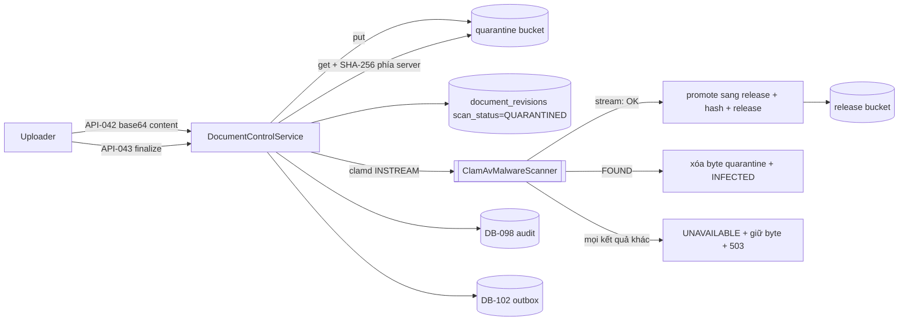

# ExecPlan — Document control US-005/US-019

> **Status:** Completed (API-039…API-052); AC-021/AC-088/AC-090/AC-092 Not covered, AC-089/AC-091 Partial
> **Owner:** Codex / Engineering
> **Created:** 2026-07-26
> **Updated:** 2026-07-26
> **Approval:** Product Owner trao toàn quyền quyết định và yêu cầu hoàn thành các yêu cầu trong story ngày 2026-07-26

## 1. Mục tiêu và kết quả người dùng

Document Controller đăng ký một tài liệu, tải bản vẽ lên, và hệ thống — chứ không phải người tải — quyết định bản đó có được phát hành hay không: byte rơi vào quarantine, server tự băm SHA-256, ClamAV cho verdict, và chỉ verdict `CLEAN` mới mở đường sang trạng thái APPROVED/ISSUED. Sau khi phát hành, bản đã ISSUED trở thành current-for-use, bản cũ tự động SUPERSEDED trong cùng một transaction, và nội dung đã phát hành không sửa được kể cả bằng SQL tay. Người phát hành lập transmittal chốt đúng revision đã ISSUED kèm recipient/action/due date và ghi nhận phản hồi. Information Owner tạo được link chia sẻ ngoài có thời hạn với mặc định watermark bật và download tắt, nhận token đúng một lần.

Kết quả quan sát được quan trọng nhất: **một revision chưa quét hoặc nhiễm mã độc là bất khả thi ở tầng cơ sở dữ liệu, không chỉ ở tầng service.**

## 2. Nguồn và requirement IDs

- Business: `BR-003`, `BR-009`, `BR-011`, `BR-012`, `BR-019`, `BR-026`, `BR-035`, `BR-040`
- Functional: `FR-026…FR-035` (US-005); `FR-029…FR-035`, `FR-145`, `FR-151…FR-155`, `FR-164` (US-019)
- Use case/story/workflow: `UC-005`, `US-005`, `WF-004…WF-006`; `UC-019`, `US-019`, `WF-007`
- Acceptance: `AC-018`, `AC-019`, `AC-020`, `AC-022` in scope; `AC-089`, `AC-091` một phần; `AC-021`, `AC-088`, `AC-090`, `AC-092` out
- Tests: `TEST-018`, `TEST-019`, `TEST-020`, `TEST-022`; `TEST-089`, `TEST-091` một phần; `TEST-021`, `TEST-088`, `TEST-090`, `TEST-092` out
- API: `API-039…API-052` (14 operation, không thiếu và không dư)
- Data: `DB-022…DB-027`; `DB-114` cấp mới cho external share; `DB-098` audit, `DB-102` outbox, `DB-104` command receipt dùng lại
- Security: `SEC-109`, `SEC-112`, `SEC-113`, `SEC-118…SEC-123`, `SEC-126`; `SEC-102` MFA vẫn không triển khai được trong base auth profile như đã ghi ở US-015
- ADR: `ADR-005` (chuyển sang Accepted cho EC2 test profile trong slice này)

## 3. Hiện trạng repository trước khi bắt đầu

- `API-039…052` chỉ có contract thiết kế; không có controller, service hay route nào ứng với chúng.
- `grep -rni "document" apps/api/src/modules` không trả về module nghiệp vụ nào; không bảng nào của `DB-022…027` tồn tại.
- `ADR-005` ở trạng thái Proposed và chưa chốt provider cho object storage hoặc malware scanner; `docs/06` ghi `DB/API/SEC/TEST forward reference TBD`.
- Chuỗi migration kết thúc ở `1783739000000` với `policy_version = 5`; `project-master.seed.ts` dùng hằng `rolePolicyVersion = 5`.
- `PermissionService.accessScopeSets` (từ US-022) và cặp `CommandReceiptService`/`OutboxService` đã có sẵn — đây là ba thứ slice này dựa vào để không phải phát minh lại ABAC, idempotency và outbox.
- Express mặc định giới hạn body 100 kB. Không có upload nào trong hệ thống nên chưa ai chạm ngưỡng đó; một base64 8 MB sẽ bị Express từ chối bằng 413 trần trụi trước khi tới ValidationPipe.
- `apps/web/nginx.conf` không đặt `client_max_body_size`, tức nhận mặc định 1 MB của nginx.

## 4. Phạm vi

### In scope

- Mười bốn operation `API-039…052` trong module Nest `document-control` mới.
- Bảy bảng `DB-022…027` + `DB-114`, migration `1783740000000-CreateDocumentControl.ts` và `1783741000000-GrantDocumentPermissions.ts` (`policyVersion = 6`, mẫu state-table đảo ngược được).
- Hai port `object-storage.port.ts` và `malware-scanner.port.ts` cùng adapter `MinioObjectStorage` và `ClamAvMalwareScanner`.
- Hạ tầng MinIO/ClamAV trong `docker-compose.yml`/`docker-compose.test.yml`, biến môi trường và giới hạn body ở API lẫn nginx.

### Out of scope

- **Full-text/OCR search (`AC-021`).** Không có search index, không có OCR pipeline, và không có operation nào cho việc này trong catalog 164 operation. Đây là điểm dừng có chủ ý.
- **Render watermark, preview/download và redemption link ngoài.** Hàng `DB-114` ghi lại policy; **không có gì phục vụ byte**, vì không operation nào trong catalog làm việc đó.
- **Callback nhà cung cấp chữ ký điện tử (`AC-092`).** `startSignatureEnvelope` tạo envelope DRAFT với `artifact_hash` = content hash và không liên hệ provider nào, vì chưa provider nào được contract.
- **Approval theo classification và xác minh recipient/MFA trước khi phát link (`AC-088`).**
- **Revoke share và chặn truy cập khi hết hạn (`AC-090`)** — không có redemption để chặn nên cũng không có operation revoke.
- **UI Vue.** Slice này không thêm route hay component nào; `API-039…052` chỉ dùng được qua API/Swagger.

## 5. Assumption, TBD và Open Question

| Loại | Nội dung | Owner | Điều kiện đóng | Tác động nếu chưa đóng |
|---|---|---|---|---|
| Assumption | `DB-023` cần `quarantine_object_key`/`released_object_key` tách rời thay vì một `objectKey`; dictionary chỉ liệt kê một | Data Owner | Review artefact | Không tách thì không thể phân biệt byte đã quét với byte chưa quét bằng một cột |
| Assumption | `DB-114` là ID mới hợp lệ cho external share; `DB-022…027` không có entity nào mang policy chia sẻ | Data/Architecture Owner | Đã ghi vào `docs/07` và registry `docs/15` | Không có thì `AC-089`/`AC-090` không có nơi lưu policy |
| Open Question | Quy tắc approval theo classification và cách xác minh recipient trước khi phát link (`AC-088`) | Security/Legal | Trước khi bật chia sẻ ngoài thật | Share hiện chỉ do quyền `documentShare.create` quyết định; chưa có tuyến duyệt |
| Open Question | Nhà cung cấp e-sign và hợp đồng callback (`AC-092`) | Product/Legal | Trước khi envelope rời DRAFT | Envelope không bao giờ rời DRAFT; `ck_signature_envelope_external` giữ `external_id` bất khả thi |
| Open Question | Công nghệ search/OCR và mô hình phân quyền cho snippet (`AC-021`) | Product/Architecture | Trước khi cấp operation mới | Không có đường tìm kiếm nào |
| Open Question | Retention/lifecycle bucket, mã hóa at-rest bằng KMS, HA MinIO và cập nhật signature tự động | SRE/Security | Trước production | `ADR-005` chỉ Accepted cho EC2 test profile, production vẫn Proposed |
| Open Question | MFA/step-up (`SEC-102`) cho chia sẻ ngoài | Security | Trước production | Kế thừa nguyên trạng từ US-015; là cổng chặn production |

## 6. Thiết kế

Ranh giới hạ tầng nằm ở hai port, nên domain không bao giờ phụ thuộc vendor: service chỉ thấy `ObjectStorage` và `MalwareScanner`. `MinioObjectStorage` dùng AWS S3 SDK với `forcePathStyle`, tự băm SHA-256 phía server và gửi kèm `ChecksumSHA256` trong PUT để MinIO từ chối ghi nếu byte lệch trên đường truyền. `ClamAvMalwareScanner` nói thẳng giao thức clamd `INSTREAM` qua TCP.

Ba verdict và hệ quả của chúng:

| Verdict | Byte | Hàng revision | Phản hồi | Lần sau |
|---|---|---|---|---|
| CLEAN | promote sang release bucket rồi hủy bản quarantine | `scan_status=CLEAN`, `content_hash` do server tính, `released_object_key` có giá trị | 200 | revision đi tiếp được |
| INFECTED | byte quarantine bị hủy | `scan_status=INFECTED` + `scan_signature` | 200 với verdict; mọi lệnh downstream trả 422 `REVISION_NOT_SCANNED` | không bao giờ phát hành được |
| UNAVAILABLE | byte giữ nguyên trong quarantine | `scan_status=UNAVAILABLE` ghi bền vững trước khi báo lỗi | 503 `SCANNER_UNAVAILABLE` | retry với Idempotency-Key mới chạy lại quét và thành công |

Adapter chỉ trả `CLEAN` cho đúng câu trả lời khớp `/^stream:\s*OK$/i`. Kết nối bị từ chối, timeout, reply cắt cụt, reply `ERROR` và mọi văn bản không nhận dạng được đều rơi xuống `UNAVAILABLE` — không có nhánh nào biến sự cố scanner thành `CLEAN`. Trả `CLEAN` khi scanner hỏng chính là phát hành một file chưa quét.

Tenancy và phân quyền: mọi khóa ngoại đều composite và mang `tenant_id`, nên tham chiếu xuyên tenant là bất khả thi ở tầng DB chứ không chỉ ở tầng code. Scope của một revision luôn được phân giải từ hàng register sở hữu nó, không bao giờ từ request. Đọc ngoài phạm vi trả **404 chứ không 403**, đúng tiền lệ đã có ở slice risk-change: một ID không thể bị dò từ project khác. `403` chỉ xuất hiện khi thiếu quyền thật sự.

## 7. Quyết định thiết kế đã chốt

| Quyết định | Lý do |
|---|---|
| Body upload mang thẳng byte (`content` base64, tối đa 8.000.000 ký tự); port object storage cố ý không có pre-signed URL | Server phải là bên ghi vào quarantine. Nếu client ghi trực tiếp, nó có thể đặt byte chưa quét vào đúng chỗ mà finalize sau đó đọc lên như byte đã được thẩm định. `revisionCode` chuyển lên bước initiate vì `document_revisions.revision_code` là NOT NULL ngay khi tạo hàng. Điểm này lệch khỏi schema thiết kế chung `UploadInitiateRequest`; contract đã được sửa trong cùng slice: `DocumentUploadSessionRequest` thay thế nó và `UploadInitiateRequest`/`UploadFinalizeRequest` bị gỡ vì không còn operation nào tham chiếu — `UploadFinalizeRequest` mô tả một luồng `uploadToken` chưa bao giờ tồn tại |
| Hash SHA-256 do server tính trên byte đã lưu; hash client khai báo chỉ dùng để đối chiếu | Client không được tự chứng nhận upload của mình |
| Review comment chỉ nhận khi revision đang `IN_REVIEW` | Giữ cho `cycle_no >= 1` có nghĩa. Bình luận sau khi phát hành chưa có đường nào |
| Không có quy tắc SoD giữa người tải và người phê duyệt | Không AC nào phát biểu quy tắc đó. Tách quyền duy nhất là ở guard: chỉ PMO/PROJECT_MANAGER có `documentRevision.approve`/`documentRevision.issue` |
| `UQ tenant+provider+externalId` được `DB-027` mô tả nhưng cố ý vắng mặt trong entity decorator và do đó vắng mặt trong DDL | Entity và schema phải giống nhau từng byte; thêm unique chỉ trong DDL sẽ tạo ra một ràng buộc không truy được từ mô hình TypeScript |
| `fk_document_current_revision` thêm bằng `ALTER` sau khi `document_revisions` tồn tại | Register và bảng revision trỏ vào nhau; một trong hai chiều bắt buộc phải hoãn |
| Trạng thái phát hành được canh bằng CHECK constraint chứ không chỉ bằng service | `ck_document_revision_release_requires_clean` khiến `APPROVED/ISSUED/SUPERSEDED` không tồn tại được nếu thiếu `scan_status = 'CLEAN'`, `content_hash` và `released_object_key` |
| Ba trigger: comment append-only, nội dung ISSUED bất biến, envelope COMPLETED bất biến | Quy ước không đủ. Trigger ISSUED cố ý không canh cột `status` để ISSUED → SUPERSEDED vẫn hợp lệ |
| Token chia sẻ trả về đúng một lần, chỉ lưu SHA-256, không xuất hiện trong payload audit | Rò rỉ cơ sở dữ liệu hoặc log audit không được sinh ra một link dùng được |
| Giới hạn body được nâng và khai báo tường minh ở cả hai tầng | Một upload hợp lệ không bao giờ được rơi vào 413 trần trụi. `APP_JSON_BODY_LIMIT_BYTES` (mặc định 9.000.000, sàn 100.000, trần 33.554.432) nối qua `bootstrap.ts` bằng `useBodyParser`; `apps/web/nginx.conf` đặt mặc định 1 MB và ngoại lệ 10 MB cho đúng một route upload khớp regex. Trần của nginx nằm **trên** trần của API để API luôn là tầng từ chối — request hành xử giống hệt nhau dù đi qua proxy hay không |

## 8. Milestone

### M1 — Schema, port và service

- [x] Bốn file entity (`document`, `document-revision`, `document-collaboration`, `document-control.enums`) khớp một-một với DDL: mọi `@Check`/`@Unique`/`@Index` đều có mặt trong migration dưới cùng tên.
- [x] Migration `1783740000000`: bảy bảng, FK composite mang `tenant_id`, `fk_document_current_revision` hoãn lại, ba trigger, `down()` gỡ theo thứ tự phụ thuộc ngược.
- [x] Hai port và hai adapter; module bind adapter qua symbol nên test thay được bằng fake.
- [x] Service 14 operation, controller, DTO, cursor; migration grant `1783741000000` (policy 6) và đồng bộ hằng `rolePolicyVersion` trong seed lên 6.

**Exit criteria:** không actor nào đọc được tài liệu ngoài scope; một revision chưa `CLEAN` không thể đạt `APPROVED/ISSUED/SUPERSEDED`; nội dung đã ISSUED không sửa được kể cả bằng UPDATE trực tiếp.

### M2 — Hạ tầng và giới hạn transport

- [x] MinIO `minio/minio:RELEASE.2025-09-07T16-13-09Z` và ClamAV `clamav/clamav:stable` trong compose chính và compose test, secret qua file, `start_period` rộng cho ClamAV vì nó cần thời gian nạp signature.
- [x] Cấu hình `MINIO_*`/`CLAMAV_*` có validate (endpoint tuyệt đối không kèm credential, tên bucket hợp lệ, quarantine phải khác release), credential đọc lười từ envelope `enc:v1`.
- [x] `APP_JSON_BODY_LIMIT_BYTES` + `useBodyParser` + ngoại lệ nginx cho route upload.

**Exit criteria:** mọi suite integration boot được `AppModule` mà không cần MinIO/clamd thật; một upload đúng spec không bị tầng transport từ chối.

## 9. Phạm vi acceptance

| AC | Trạng thái | Bằng chứng và giới hạn |
|---|---|---|
| `AC-018` | **Pass** | `API-042` đưa byte vào quarantine và không ghi content hash; `API-043` băm phía server, quét rồi phát hành. Bốn test phủ CLEAN, INFECTED, UNAVAILABLE và hash client lệch. Nhánh "trích metadata/OCR **khi bật**" không được bật và không có pipeline OCR nào được contract — xem `AC-021`. |
| `AC-019` | **Pass** | `API-047`/`API-048` từ chối revision chưa `CLEAN` bằng 422 `REVISION_NOT_SCANNED`; trigger `trg_document_revision_issued_immutable` chặn ghi đè nội dung đã ISSUED nhưng vẫn cho ISSUED → SUPERSEDED; issue chuyển `current_revision_id` và SUPERSEDED bản cũ trong đúng một transaction. Có test HTTP và test migration. Watermark `Superseded` khi xem/tải không phủ được vì không có đường phục vụ byte. |
| `AC-020` | **Pass** | `API-049` chỉ nhận revision đã ISSUED, snapshot đúng revision, ghi recipient/action code/due date; `API-050` ghi phản hồi một lần, lần hai trả 409. Test migration chặn transmittal không recipient và item trùng. Chưa phủ: delivery receipt qua kênh gửi ngoài và job tự chuyển `response_status` sang `OVERDUE` — cột đã có, không có scheduler nào đặt giá trị đó. |
| `AC-021` | **Not covered** | Full-text/OCR search. Không có search index, không có OCR, và không có operation nào cho việc này trong catalog 164 operation. Điểm dừng có chủ ý, không phải thiếu sót. |
| `AC-022` | **Pass** trong phạm vi liên kết hiện có | `API-041` trả register entry, current revision và history phân trang theo quyền; `API-039` lọc theo package/type/discipline/classification và cắt scope ngay trong SQL. Liên kết tới contract/equipment/vendor chưa tồn tại vì các aggregate đó (`DB-028…033`, `DB-041…050`) chưa được triển khai. |
| `AC-088` | **Not covered** | Không có tuyến approval theo classification và không xác minh recipient/MFA. Share được tạo trực tiếp bởi actor có `documentShare.create`. `SEC-102` vẫn không khả thi trong base auth profile. |
| `AC-089` | **Partial** | Có bằng chứng: share khóa vào đúng một revision đã ISSUED, `watermarkRequired = true` và `downloadAllowed = false` là mặc định, token trả đúng một lần và chỉ SHA-256 được lưu, `tokenHash` không bao giờ có trong response hay payload audit. **Không có operation nào phục vụ byte**, nên phần preview/download theo policy chưa chạy được. |
| `AC-090` | **Not covered** | Không có redemption để chặn và không có operation revoke. `status`, `revoked_by`/`revoked_at` và CHECK `expires_at > created_at` đã có nhưng hiện chỉ được test migration dùng. |
| `AC-091` | **Partial** | Phần chặn sửa nội dung đã ISSUED có trigger và test (cùng bằng chứng với `AC-019`); comment ledger append-only bằng trigger riêng. Phần "signature và timestamp giữ nguyên" chưa kiểm chứng được vì chưa envelope nào đạt COMPLETED. |
| `AC-092` | **Not covered** | Không có callback provider. `API-052` tạo envelope DRAFT cục bộ với `artifact_hash` = content hash của revision và không liên hệ provider nào. `ck_signature_envelope_external` giữ `external_id` bất khả thi khi còn DRAFT; `trg_signature_envelope_completed_immutable` đã sẵn sàng cho lúc có provider. |

## 10. Kiểm thử

| Loại | Command | IDs | Kết quả |
|---|---|---|---|
| Lint | `npm run lint` | NFR-024 | Pass, 0 warning |
| Type-check | `npm run typecheck` | NFR-024 | Pass trên api/web/worker |
| Unit | `npm run test:unit` | NFR-024 | API 94 Pass / 18 suite (bổ sung 11 test ClamAV + 13 test MinIO + 1 test canh trần body) |
| Integration | `npm run test:integration` | TEST-018/019/020/022; TEST-089/091 một phần | API 135 Pass / 15 suite, không hồi quy; document-control 23 HTTP (gồm 4 test register-embed) + 12 migration + 7 adapter-live |
| Contract | `npm run openapi:lint` | NFR-024 | Pass; 74/164 marker implemented sau khi đặc tả `API-039…052` |

Mọi nhánh 4xx đều assert **không ghi hàng nào**: mã tài liệu trùng, hash client lệch, revision chưa duyệt, revision chưa ISSUED đem chia sẻ hay đem lập transmittal. Request xuyên tenant và request từ actor chỉ có package đều assert trả **404**; `403` chỉ xuất hiện khi thiếu quyền thật (uploader thử approve/issue). Cả 31 test này dùng fake in-memory cho hai port nên không phụ thuộc MinIO hay clamd đang chạy — chúng chứng minh logic service chứ không chứng minh adapter.

Bổ sung sau lần chạy trên: `apps/api/test/integration/modules/document-control/adapter-live.integration-spec.ts` (7 test) nói giao thức thật với container `minio-test`/`clamav-test`, gồm chuỗi EICAR dựng lúc chạy để kiểm chứng nhánh INFECTED, và cổng cứng nhất của ADR-005 — clamd không liên hệ được thì verdict là `UNAVAILABLE` chứ không phải `CLEAN`. Đây là bộ duy nhất chứng minh **adapter**; 31 test kia chứng minh **service logic** trên fake in-memory. Chạy lại toàn bộ sau khi thêm bộ này: **API integration 131 Pass / 15 suite**, worker 11 Pass / 3 suite. CI khởi động `minio-test` và `clamav-test` ở cổng cô lập `19002`/`13311` nên bộ này chạy trên mọi push.

Slice có UI: route `/projects/:projectId/documents` gated theo `document.read`, gồm bảng register, bộ lọc khớp đúng `DocumentListQueryDto`, phân trang cursor, form tạo document, và luồng upload hai bước hiển thị tách bạch ba verdict. Revision chưa `CLEAN` **không được cấp nút hành động nào** — panel in "Bị chặn cho tới khi quét sạch" thay vì mời người dùng bấm một nút mà server chắc chắn từ chối. Nhánh `UNAVAILABLE` có nút quét lại, và nút đó phát sinh `Idempotency-Key` mới, vì đó mới là thứ thực sự chạy lại lần quét. Web unit: 127 Pass / 30 file.

Chưa chạy trong slice này: Playwright không có kịch bản document control — `tests/e2e` cần fixture đã seed và việc đó thuộc slice riêng.

## 11. Migration, rollout và rollback

- `1783740000000-CreateDocumentControl.ts` tạo bảy bảng, ba function và ba trigger. `down()` gỡ trigger, function, rồi bảng theo thứ tự phụ thuộc ngược, và gỡ `fk_document_current_revision` trước khi drop `document_revisions`. Đã test up/down/up.
- `1783741000000-GrantDocumentPermissions.ts` chỉ cấp permission, dùng mẫu state-table: bảng `role_grant_reconcile_1783741000000` ghi đúng những code nó thêm và policy version trước đó, nên `down()` lấy lại đúng phần nó đã thêm và không đụng grant có sẵn. Chuỗi grant nay kết thúc ở `policy_version = 6`; hằng `rolePolicyVersion` trong seed được nâng lên 6 cùng lúc để seed không hạ cấp role mà migration vừa nâng.
- Không backfill. Trước slice này không có tài liệu nào trong hệ thống, nên rollback không mất dữ liệu nghiệp vụ.
- Rollout hạ tầng: MinIO và ClamAV phải chạy trước khi API khởi động ở môi trường thật. `MinioObjectStorage` đọc credential trong constructor và fail closed nếu thiếu, nên thiếu secret là lỗi khởi động chứ không phải lỗi lúc upload.
- `apps/web/nginx.conf` chỉ nới giới hạn cho đúng một route. Các route khác nay khai báo tường minh 1 MB — đúng bằng mặc định dựng sẵn của nginx mà cấu hình cũ thừa hưởng ngầm, nên không client hiện hữu nào bị ảnh hưởng; giá trị được viết ra để lần nới tiếp theo là một quyết định có chủ đích chứ không phải một tác dụng phụ.

## 12. Rủi ro

| Rủi ro | Tác động | Giảm thiểu |
|---|---|---|
| Sự cố scanner bị hiểu là "sạch" và file chưa quét được phát hành | Rất cao | Chỉ đúng `stream: OK` cho `CLEAN`; mọi kết quả khác là `UNAVAILABLE`. Ngoài ra `ck_document_revision_release_requires_clean` chặn ở tầng DB dù service có lỗi |
| `AC-021` bị coi là đã xong vì "tài liệu đã tìm được bằng bộ lọc" | Trung bình | Ghi Not covered ở backlog, changelog và traceability; bộ lọc register không phải full-text/OCR |
| `DB-114` bị hiểu là chia sẻ ngoài đã chạy được | Cao | Ghi rõ ở mọi artefact rằng hàng share chỉ lưu policy và **không có gì phục vụ byte** |
| `API-052` bị hiểu là đã tích hợp e-sign | Cao | Envelope luôn ở DRAFT, `external_id` luôn NULL; ghi Not covered cho `AC-092` |
| Suite integration khác vỡ vì `AppModule` nay dựng adapter MinIO | Trung bình | `apps/api/test/setup/integration-env.ts` cấp `MINIO_ACCESS_KEY`/`MINIO_SECRET_KEY` đã mã hóa cho mọi suite; không giá trị nào chạm MinIO thật |
| Migration grant sau làm vỡ assertion role exact-match | Thấp | Hai assertion exact-match trong `risk-change-migration.integration-spec.ts` được mở rộng đúng phần grant mới thêm, theo chỉ dẫn trong comment của chính test đó |
| Upload hợp lệ bị 413 ở proxy | Trung bình | Trần nginx (10 MB) đặt trên trần API (mặc định 9 MB) để API luôn là tầng từ chối |

## 13. Kết quả và bàn giao

- Outcome: 14 operation `API-039…052` chạy end-to-end với 19 test HTTP và 12 test ràng buộc DB; `ADR-005` chuyển sang Accepted cho EC2 test profile với provider MinIO/ClamAV đã chốt.
- File tạo: `apps/api/src/modules/document-control/**` (9 file), bốn entity document, hai migration, bốn file test (2 unit, 1 HTTP integration, 1 migration integration) cộng `adapter-live.integration-spec.ts` đi kèm thay đổi hạ tầng.
- File sửa: `app.module.ts`, `data-source.ts`, `entities/index.ts`, `project-master.seed.ts`, `bootstrap.ts`, `config/environment.ts`, `cipher.cli.ts`, `apps/api/package.json`, `apps/web/nginx.conf`, `docker-compose.yml`, `docker-compose.test.yml`, `.env.example`, `.github/workflows/main-cicd.yml`, `scripts/deploy-ec2.sh`, `apps/api/test/setup/integration-env.ts`, `apps/api/test/unit/config/environment.unit-spec.ts`, `apps/api/test/integration/database/risk-change-migration.integration-spec.ts`, `docs/06`, `docs/07`, `docs/12`, `docs/15`, `docs/CHANGELOG.md`.
- Còn lại: `AC-021` search/OCR, `AC-088` approval + xác minh recipient, `AC-090` revoke/expiry enforcement, `AC-092` e-sign callback, phần render watermark/preview/download của `AC-089`, UI Vue cho document control, và các hạng mục production của `ADR-005` (retention/lifecycle bucket, KMS at-rest, HA MinIO, cập nhật signature tự động).
- Deploy EC2 test và bằng chứng CI/CD ghi nhận theo release kế tiếp.
