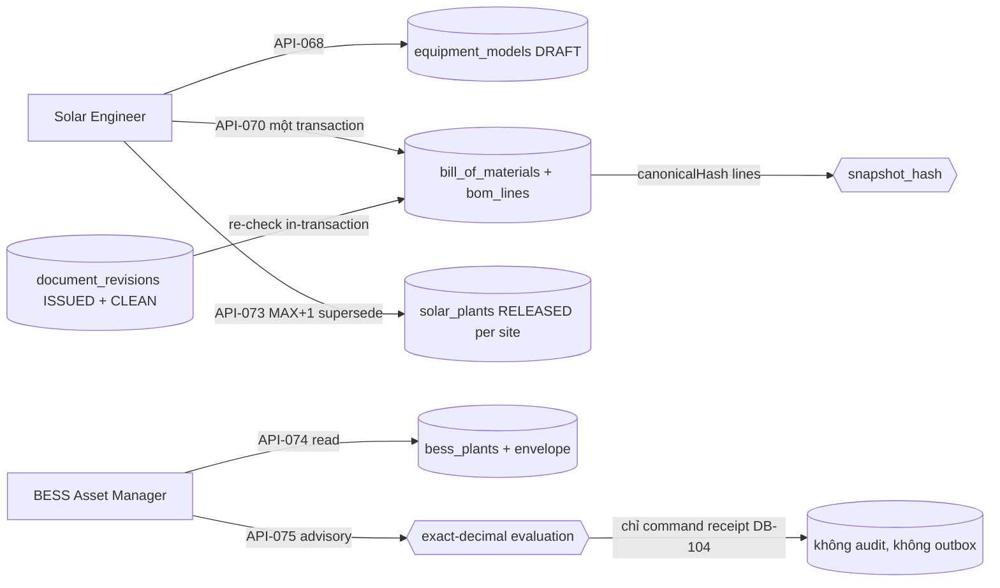

# ExecPlan — Engineering & Plants (US-008 nửa engineering + US-026/US-027 registry)

> **Status:** Completed (API-067…API-070, API-072…API-075; API-071 DEFERRED); AC-033/122/126 Partial, AC-123/124/125/127…130 Not covered
> **Owner:** Codex / Engineering
> **Created:** 2026-07-26
> **Updated:** 2026-07-26
> **Approval:** Product Owner trao toàn quyền quyết định và yêu cầu hoàn thành các yêu cầu trong story ngày 2026-07-26

## 1. Mục tiêu và kết quả người dùng

Solar Engineer quản trị catalog equipment model theo tenant (API-067/068) và release BOM theo dự án từ đúng một design revision đã ISSUED và quét CLEAN (API-069/070); Procurement từ đó có một BOM revision đã release kèm `snapshot_hash` để đối chiếu PR/RFQ/PO. Solar Engineer đọc và release cấu hình solar plant theo version từng site (API-072/073); BESS Asset Manager đọc hierarchy + operating envelope của BESS plant (API-074) và chạy mô phỏng dispatch **advisory, stateless** trên envelope đã release (API-075).

Kết quả quan sát được quan trọng nhất: **nội dung engineering đã release là bất biến ở tầng cơ sở dữ liệu, và không tồn tại bất kỳ đường nào — kể cả về schema — để PM Web chạm tới OT.** `bess_plants`/`solar_plants` không có cột nào hình dạng credential/connectivity (host, username, password, token, url, endpoint, secret); sự vắng mặt đó là control của SEC-127/SEC-128 và được canh bằng cả unit guard lẫn assertion `information_schema`. API-075 không ghi gì ngoài command receipt — không audit row, không outbox event — nên không consumer nào có thể nhầm verdict mô phỏng thành một lệnh.

## 2. Nguồn và requirement IDs

- Business: `BR-012…BR-015`, `BR-017`, `BR-024`, `BR-026…BR-029`, `BR-040` (theo dictionary `docs/07` của DB-041…043/079…082)
- Functional: `FR-045`, `FR-046/047` (BOM), `FR-050` (substitution — DEFERRED cùng API-071), `FR-125/126` (solar plant), `FR-130/133` (BESS plant/simulation)
- Use case/story/workflow: `UC-008`, `US-008` (nửa engineering); `UC-026`, `US-026`; `UC-027`, `US-027`; `WF-005/010…013/022/023/025` là surface tham chiếu theo matrix
- Acceptance: `AC-033` phần engineering; `AC-122` một phần; `AC-126` phần registry; `AC-123/124/125` và `AC-127…AC-130` out — thuộc handover/warranty/KPI/telemetry/commissioning chưa có trong catalog
- Tests: `TEST-033` phần engineering; `TEST-122…TEST-125`, `TEST-126…TEST-130` một phần tương ứng
- API: `API-067…API-070`, `API-072…API-075` (8 operation); **`API-071` substitutions DEFERRED — bảng của nó không có DB ID được cấp trong dictionary và không ID nào bị bịa**
- Data: `DB-041` EquipmentModel, `DB-042` BillOfMaterials, `DB-043` BOMLine, `DB-079` Equipment, `DB-080` Asset, `DB-081` SolarPlant, `DB-082` BESSPlant (7 bảng); `DB-098` audit, `DB-102` outbox, `DB-104` command receipt dùng lại; `DB-083` Warranty, `DB-090` TagDefinition, `DB-093` Meter xuất hiện trong trace OpenAPI nhưng **không** materialize — API-074 trả KPI/telemetry là `null` tường minh
- Security: `SEC-107`, `SEC-108`, `SEC-109`, `SEC-111`, `SEC-118`, `SEC-121` (chuỗi design revision CLEAN), `SEC-127`, `SEC-128`

## 3. Hiện trạng repository trước khi bắt đầu

- `API-067…075` chỉ có contract thiết kế trong `docs/openapi/openapi.yaml`; không controller nào; marker implemented là 88/164.
- Không bảng nào của `DB-041…043/079…082` tồn tại. Chuỗi migration kết thúc ở `1783743000000` với `policy_version = 7`; seed dùng `rolePolicyVersion = 7`.
- `sites` và `wbs_nodes` chưa có candidate key `(tenant_id, project_id, id)` — các FK composite "pin site vào đúng dự án" của mọi domain sau (Field/HSE, Procurement, O&M) đều bị chặn vì thiếu unique đích.
- `PermissionService.accessScopeSets`, `CommandReceiptService`, `OutboxService` và `canonicalHash` (`risk-change/domain/canonical-hash.ts`, đã tách từ slice contract-cost) có sẵn — không phát minh lại serializer băm.
- Seed `project-master.seed.ts` là một khối duy nhất chạy sau guard "đúng một ACTIVE test user"; trên môi trường EC2 test đã có nhiều user, seed crash và master data (cost_codes trống) không bao giờ được reconcile.
- Không operation nào trong catalog 164 tạo plant, approve equipment model, hay release BESS envelope — đây là ranh giới cứng của slice.

## 4. Phạm vi

### In scope

- Tám operation trong module Nest `engineering-plants`: list/create equipment model (`/v1/equipment-models`), list BOM theo dự án, release BOM một-transaction (`/v1/projects/:projectId/bill-of-materials[:release]`), đọc solar plant + release configuration version kế tiếp (`/v1/solar-plants/:id[:release-configuration]`), đọc BESS plant + simulate dispatch (`/v1/bess-plants/:id[:simulate-dispatch]`).
- Migration `1783744000000-CreateEngineeringPlants.ts`: **shared ALTER trước tiên** — `uq_sites_tenant_project_id` và `uq_wbs_nodes_tenant_project_id` `(tenant_id, project_id, id)` — rồi 7 bảng và 7 trigger bất biến.
- Migration `1783745000000-GrantEngineeringPermissions.ts` (`policyVersion = 8`, state-table `role_grant_reconcile_1783745000000`, 8 permission code); seed nâng `rolePolicyVersion` 7→8 cùng lúc.
- Tách seed thành hai phase (addendum vận hành, xem §7): phase-1 master-data reconciliation không cần user guard; phase-2 demo-project giữ guard nhưng skip + exit 0 thay vì crash.
- Domain thuần: `exact-decimal.ts` (số lượng/công suất không bao giờ chạm JS number — decimal string với so sánh exact), `dispatch-evaluation.ts` (đánh giá stateless), `credential-columns.ts` (guard hình dạng cột cấm), `cursor.ts`.
- OpenAPI: marker implemented 88 → 96 cho đúng 8 operation — do agent song song thực hiện trong cùng slice, ghi nhận tại đây như một phần bàn giao.

### Out of scope

- **`API-071` substitutions.** Bảng substitution không có DB ID nào được cấp trong `docs/07` (`substitutionStatus` chỉ là cột của `DB-043`); không bịa ID mới (AGENTS §4). Phần deviation-hold của `AC-122` do đó chưa đóng được.
- **Tạo plant qua API.** Không operation nào trong catalog tạo solar/bess plant — bootstrap bằng seed (quyết định a).
- **Approve equipment model.** Không operation approve nào tồn tại; model sinh ra DRAFT và seed ship sẵn model APPROVED demo (quyết định b).
- **Release BESS configuration/envelope.** Không operation nào; API-075 trên môi trường demo trả 422 `OPERATING_ENVELOPE_MISSING` cho tới khi catalog cấp op release BESS (quyết định e).
- **KPI/telemetry/commissioning/handover/warranty** (`AC-123/124/125/127…130`): thuộc domain khác hoặc hệ thống ngoài (O&M/OT read-only); API-074 trả các trường đó `null` tường minh thay vì bịa dữ liệu.
- **UI Vue.** Slice này không có route/view web; UI engineering thuộc slice sau.
- **Procurement `DB-044…050`**: `serial_number_id` trên `equipment` cố ý không có FK vì bảng serial thuộc Procurement chưa materialize; claim serial được enforce bằng partial unique `uq_equipment_serial`.

## 5. Assumption, TBD và Open Question

| Loại | Nội dung | Owner | Điều kiện đóng | Tác động nếu chưa đóng |
|---|---|---|---|---|
| Open Question | Operation tạo plant, approve model, release BESS envelope và substitution (API-071 + DB ID cho bảng của nó) chưa được cấp trong catalog | Product Owner | Cấp `API-*`/`DB-*` mới có trace | AC-122 phần deviation-hold, AC-126 trọn vẹn và demo API-075 không đóng được; plant/model demo phụ thuộc seed |
| TBD | Trường `firmware` mà `AC-126` nhắc không tồn tại trong dictionary `DB-079/080/082` (chỉ `DB-089` SiteGateway — OT — có `firmwareVersion`) | Data Owner / BA | Amendment dictionary `docs/07` hoặc xác nhận firmware thuộc OT metadata | Phần "model/firmware" của AC-126 chỉ đóng được nửa model; không tự thêm cột ngoài dictionary |
| Open Question | SoD gốc của release BOM ("releaser ≠ BOM.updated_by") bất khả thi khi create-and-release là một lệnh — deviation RELEASE_SOD (xem §7c) cần được Product Owner xác nhận khi cấp op draft BOM riêng | Product Owner | Cấp operation draft/submit BOM tách khỏi release | SoD hiện enforce releaser ≠ uploader của design revision; nếu có op draft, phải thu hẹp lại đúng phát biểu gốc |
| Assumption | Demo plant/model/asset trong seed là dữ liệu demo, không phải dữ liệu vận hành thật; natural key create-if-missing nên môi trường đã release không bị ghi đè | Product/Data | Khi có operation tạo plant thật, seed demo thu hẹp | Môi trường demo phụ thuộc seed để API-067/072/073/074 có dữ liệu |

## 6. Thiết kế

Tenancy và scope: mọi FK composite mang `tenant_id`; BOM và plant là project-level nên principal package-only không với tới gì — ngoài scope trả **404 chứ không 403**, đúng tiền lệ risk-change/document-control/contract-cost. Catalog equipment model là surface tenant-level duy nhất.

Cổng release BOM là chuỗi `SEC-121`: design revision phải thuộc đúng dự án, ISSUED và `scan_status = CLEAN`, **re-check bên trong command transaction** — sai thì 422 `DESIGN_REVISION_LOCKED` zero-write. `snapshot_hash` băm các line đã ghi bằng `canonicalHash` dùng chung với risk-change/contract-cost — một serializer duy nhất, không có "chuẩn" băm thứ hai.

Partial unique là ngữ pháp trạng thái: `uq_bom_released_per_project` (một BOM RELEASED mỗi dự án), `uq_solar_plant_released`/`uq_bess_plant_released` (một bản RELEASED mỗi site), `uq_asset_equipment_active` (một asset sống mỗi equipment), `uq_equipment_serial` (một equipment sống giữ một serial). Bảy trigger bất biến: `trg_equipment_model_history` (APPROVED đóng băng trừ idiom supersede), `trg_bill_of_materials_history` + `trg_bom_line_history` (nội dung RELEASED đóng băng, **kể cả chặn INSERT smuggle line vào version đã release**), `trg_equipment_history` (không bao giờ DELETE, RETIRED terminal), `trg_asset_history` (archive, không delete), `trg_solar_plant_history`/`trg_bess_plant_history` (bản release đóng băng, chỉ cho supersede).

Số lượng/công suất không bao giờ chạm JS number: `numeric(19,4)` đi qua service dưới dạng chuỗi; phép so sánh duy nhất (envelope check của API-075) chạy trên `exact-decimal` string.

## 7. Quyết định thiết kế đã chốt

| Quyết định | Lý do |
|---|---|
| (a) Plant bootstrap bằng seed — không op tạo plant nào trong catalog; seed tạo một solar + một bess plant DRAFT cho site chính của demo project, kèm equipment root và asset backing (create-if-missing theo natural key) | Không có seed thì API-072/073/074 là dead code; đúng tiền lệ cost-code của slice contract-cost |
| (b) Model approval DEFERRED — không op approve; model sinh ra DRAFT, seed ship sẵn model APPROVED demo để filter mặc định của API-067 có dữ liệu | Không bịa operation; APPROVED bị trigger đóng băng nên seed chỉ create-if-missing |
| (c) Deviation RELEASE_SOD: vì API-070 create-and-release trong một lệnh, "releaser ≠ tác giả BOM" bất khả thi (releaser CHÍNH LÀ tác giả hàng) — SoD enforce là **releaser ≠ người upload design revision** (422 `RELEASE_SOD`) | Tương đương trung thực gần nhất của SoD gốc; ghi tường minh tại đây và trong comment service |
| (d) API-073 release version **MAX(site)+1** thành hàng mới và supersede bản RELEASED hiện hành trong cùng transaction; hàng được address chỉ là anchor danh tính + optimistic check, anchor đã SUPERSEDED bị từ chối 422 `INVALID_STATE_TRANSITION` | Lịch sử cấu hình là chuỗi append; không bao giờ sửa tại chỗ một bản đã release |
| (e) API-075 trên demo trả 422 `OPERATING_ENVELOPE_MISSING` cho tới khi catalog cấp op release BESS envelope; verdict là advisory, persist **duy nhất** command receipt, không audit/outbox | Không gì rời transaction có hình dạng lệnh; SEC-128 giữ tuyệt đối |
| (f — addendum vận hành) Seed tách hai phase: phase-1 reconcile master data (role catalog, cost codes, equipment models — idempotent theo natural key, **không** user guard); phase-2 demo-project giữ guard "đúng một ACTIVE test user" nhưng skip + log + exit 0 thay vì crash | Sửa đúng sự cố môi trường deploy: `cost_codes` trống vì seed cũ crash trên môi trường nhiều user; nay chạy seed trên môi trường đã có dữ liệu sẽ reconcile master data an toàn |

## 8. Milestone

### M1 — Schema, shared candidate keys và migration

- [x] `1783744000000`: hai ALTER dùng chung **đi trước** — `uq_sites_tenant_project_id`, `uq_wbs_nodes_tenant_project_id` — mở khóa FK "site/wbs thuộc đúng dự án" cho Field/HSE + Procurement; rồi 7 bảng theo thứ tự phụ thuộc, partial unique, 7 trigger; `down()` gỡ ngược và trả lại hai constraint.
- [x] Bốn file entity (`equipment-model`, `bill-of-materials`, `plant-asset`, `engineering-plants.enums`) khớp một-một DDL; `bess_plants`/`solar_plants` không có cột hình dạng credential (SEC-127/128 là sự thật schema).
- [x] `1783745000000`: 8 permission code (`equipmentModel.read/create`, `bom.read/release`, `solarPlant.read/configure`, `bessPlant.read`, `bessSimulation.run`) cho 5 nhóm role — PMO/PROJECT_MANAGER đủ quyền; PROJECT_CONTROLS quản catalog + đọc + simulate nhưng không release; EXECUTIVE read-only; PACKAGE_OWNER đọc catalog + BOM; TENANT_ADMIN chỉ đọc catalog (plant/BOM là project data, deny-by-default theo docs/09); policy 8; seed `rolePolicyVersion` 7→8.

**Exit criteria:** tham chiếu xuyên tenant bất khả thi ở DDL; nội dung đã release không sửa/xóa/smuggle được bằng SQL tay; up/down/up sạch.

### M2 — Service, controller và domain thuần

- [x] `engineering-plants.service.ts` 8 operation trên `CommandReceiptService`/`OutboxService`/`PermissionService`; release BOM re-check ISSUED+CLEAN in-transaction, `RELEASE_SOD`, `snapshot_hash` qua `canonicalHash`; API-073 MAX+1 supersede atomic; API-075 stateless.
- [x] Domain thuần có unit test: `exact-decimal`, `dispatch-evaluation`, `credential-columns` guard, `cursor`.

**Exit criteria:** mọi nhánh 4xx zero-write; ngoài scope 404; simulate không để lại gì ngoài receipt.

### M3 — Seed hai phase và test

- [x] `project-master.seed.ts`/`project-master.ts` tách `seedMasterCatalog` (phase-1) và demo-project (phase-2, skip + exit 0); demo model APPROVED + demo plant DRAFT kèm equipment/asset root.
- [x] Suite mới `project-master-seed.integration-spec.ts` (4 test): skip sạch khi nhiều user, idempotent khi re-run, reconcile role catalog khi không có user nào, vẫn từ chối khi không đúng một ACTIVE tenant.

**Exit criteria:** chạy seed trên môi trường đã có dữ liệu là an toàn và có ích (reconcile master data), không còn là crash.

## 9. Phạm vi acceptance

Không AC nào đóng trọn trong slice này — 3 Partial, 7 Not covered; mọi điểm dừng nằm đúng chỗ catalog không cấp operation hoặc domain khác sở hữu dữ liệu.

| AC | Trạng thái | Bằng chứng và giới hạn |
|---|---|---|
| `AC-033` | **Partial (nửa engineering đóng được)** | Tiền đề "BOM/requisition đã duyệt" nay có thật: BOM RELEASED gắn đúng một design revision ISSUED+CLEAN và mang `snapshot_hash` để Procurement đối chiếu revision/specification. Phần sourcing/RFQ/vendor thuộc nửa procurement của US-008 đang triển khai riêng. |
| `AC-122` | **Partial** | Vế "Approved BOM/design có model và quantity" chạy: line trỏ model catalog, quantity `numeric(19,4)` exact, nội dung release bất biến. Đối chiếu BOM↔PO↔receipt chờ Procurement merge (`DB-044…050`); deviation tạo hold/NCR cần substitutions (API-071 DEFERRED) + NCR domain. |
| `AC-123` | **Not covered** | Handover dossier/warranty/as-built/WO thuộc domain handover + O&M chưa có operation; API-074 trả `null` tường minh thay vì bịa. |
| `AC-124` | **Not covered** | KPI PR/yield/availability cần telemetry read-only từ hệ thống ngoài — không có trong catalog. |
| `AC-125` | **Not covered** | Không rule engine/alert; không gì trong PM Web chạm setpoint (SEC-127/128 là sự thật schema). |
| `AC-126` | **Partial (phần lớn đóng được)** | Parent-child qua `fk_equipment_parent` composite; serial duy nhất qua partial unique `uq_equipment_serial` (serial-claim, không FK vì bảng serial thuộc Procurement); lineage cũ–mới qua `replaced_by_id`; effective date/model có. **Trường firmware không có trong dictionary — TBD ở §5**, không tự thêm cột. |
| `AC-127` | **Not covered** | Telemetry/time-series không tồn tại trong PM Web — đúng ranh giới docs/10. |
| `AC-128` | **Not covered** | Không detection/alarm; PM Web không reset alarm hay gửi lệnh — bằng chứng mạnh nhất là schema không chứa nổi một credential. |
| `AC-129` | **Not covered** | Capacity/RTE test thuộc commissioning chưa có operation. |
| `AC-130` | **Not covered** | Degradation/SOH cần telemetry + guarantee band — không có. |

## 10. Kiểm thử

| Loại | Command | IDs | Kết quả |
|---|---|---|---|
| Lint | `npm run lint` | NFR-024 | Pass, 0 warning |
| Type-check | `npm run typecheck` | NFR-024 | Pass trên api/web/worker |
| Unit | `npm run test:unit` | NFR-024 | API **137 Pass / 23 suite** (+37: credential guard, exact-decimal, dispatch evaluation, cursor) |
| Integration (gate do lead chạy) | `npm run test:integration` | TEST-033/122…130 một phần | **4 suite / 31 test Pass**: engineering migration 9, seed hai phase 4, risk-change assertion 7 (mở rộng grant exact-match), engineering HTTP 11 |
| Contract | `npm run openapi:lint` | NFR-024 | 88 → **96/164 marker implemented** — phần OpenAPI do agent song song thực hiện trong cùng slice |

Điểm phủ đáng giá nhất: release BOM từ revision chưa ISSUED / tác giả revision tự release / line hỏng — tất cả 422 zero-write; nội dung BOM đã release bị SQL tay UPDATE/DELETE/INSERT-smuggle đều bị trigger từ chối; anchor SUPERSEDED bị từ chối; simulate assert **đếm audit/outbox trước–sau bằng nhau** — không gì hình dạng lệnh rời khỏi transaction; `information_schema` assert hai bảng plant không có cột credential-shaped; xuyên tenant và package-only trả 404, thiếu quyền mới 403; cursor hỏng và thiếu `Idempotency-Key` zero-write.

Chưa chạy trong slice này: E2E Playwright (không có UI engineering); deploy EC2 ghi nhận theo release kế tiếp.

## 11. Migration, rollout và rollback

- `1783744000000-CreateEngineeringPlants.ts`: hai ALTER dùng chung đi **trước** phần bảng để mọi domain sau FK được vào `(tenant_id, project_id, id)` của sites/wbs_nodes; `down()` gỡ trigger → function → bảng → hai constraint theo thứ tự ngược. Up/down/up có test.
- `1783745000000-GrantEngineeringPermissions.ts`: state-table `role_grant_reconcile_1783745000000` nên `down()` chỉ lấy lại đúng những code nó thêm; `policy_version` nay kết thúc ở 8, seed nâng `rolePolicyVersion` lên 8 cùng lúc để seed không hạ cấp role migration vừa nâng.
- Hai assertion role exact-match trong `risk-change-migration.integration-spec.ts` mở rộng: `EXECUTIVE`/`TENANT_ADMIN` nhận thêm đúng các code engineering mà migration cấp (`equipmentModel.read`/`bom.read`/`solarPlant.read`/`bessPlant.read` cho EXECUTIVE; chỉ `equipmentModel.read` cho TENANT_ADMIN) — theo chỉ dẫn trong comment của chính test đó.
- Seed hai phase là forward-fix vận hành: chạy lại seed trên môi trường deploy (nhiều user, `cost_codes` trống) nay reconcile master data và skip demo phase với exit 0. Không backfill dữ liệu nghiệp vụ: trước slice này không có model/BOM/plant nào, rollback không mất dữ liệu.

## 12. Rủi ro

| Rủi ro | Tác động | Giảm thiểu |
|---|---|---|
| Demo plant/model seed bị coi là dữ liệu vận hành thật | Trung bình | Seed create-if-missing theo natural key, đánh dấu demo; quyết định (a)/(b) ghi ở §7 với điều kiện thu hẹp |
| Deviation RELEASE_SOD bị đọc là SoD gốc của FR-047 | Cao | Ghi tường minh §7c + Open Question §5; khi có op draft BOM phải thu hẹp về phát biểu gốc |
| "8/9 op" bị hiểu là US-008/026/027 xong | Cao | Backlog/changelog/matrix đều ghi Partial/Not covered từng AC; API-071 DEFERRED có lý do ID |
| Verdict API-075 bị dùng như lệnh điều hành | Thấp | `advisory: true` trong response, không audit/outbox (test assert), schema không có credential — ba tầng độc lập |
| Marker OpenAPI do agent song song ghi lệch với controller | Thấp | `swagger.unit-spec.ts` đối chiếu marker với controller thật trong CI |

## 13. Kết quả và bàn giao

- Outcome: 8 operation `API-067…070/072…075` chạy end-to-end với 11 test HTTP + 9 test ràng buộc DB; 7 bảng `DB-041…043/079…082` materialize với bất biến ở DDL; seed hai phase sửa sự cố môi trường deploy; 3 AC Partial, 7 Not covered — đúng chỗ catalog không cấp operation.
- **Bàn giao xuyên domain:** các candidate key mà domain khác chờ nay tồn tại — `uq_sites_tenant_project_id`, `uq_wbs_nodes_tenant_project_id`, `uq_equipment_tenant_id`/`uq_equipment_project_id`, `uq_assets_tenant_id`/`uq_assets_site_id` cùng các partial unique serial/live-asset — FK của Field/HSE, Procurement và O&M hết bị chặn.
- File tạo: `apps/api/src/modules/engineering-plants/**` (controller/service/module/dto + 4 file domain), `equipment-model.entity.ts`, `bill-of-materials.entity.ts`, `plant-asset.entity.ts`, `engineering-plants.enums.ts`, migration `1783744000000`/`1783745000000`, `engineering-plants.integration-spec.ts`, `engineering-plants-migration.integration-spec.ts`, `project-master-seed.integration-spec.ts`, 4 unit spec engineering-plants.
- File sửa: `app.module.ts`, `data-source.ts`, `entities/index.ts`, `project-master.seed.ts` + `project-master.ts` (seed hai phase), `risk-change-migration.integration-spec.ts`; `docs/openapi/openapi.yaml` (agent song song, 88→96 marker); `docs/12`, `docs/15`, `docs/CHANGELOG.md`, ExecPlan này.
- Còn lại: toàn bộ Out of scope §4 và các mục §5 (API-071 + DB ID substitution, op tạo plant/approve model/release BESS envelope, firmware dictionary TBD) — mỗi mục có owner.
- Deploy EC2 test và bằng chứng CI/CD ghi nhận theo release kế tiếp.
