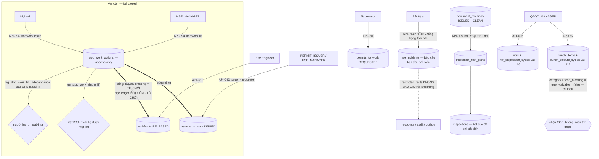

# ExecPlan — Field, HSE & Quality (US-009/US-010/US-011)

> **Status:** Completed (API-086…API-097, đủ 12 operation); AC-040/042/045/047/048/050 Pass, AC-039/043/044/046/049/051 Partial, AC-038/041/052 Not covered
> **Owner:** Codex / Engineering
> **Created:** 2026-07-26
> **Updated:** 2026-07-26
> **Approval:** Product Owner trao toàn quyền quyết định và yêu cầu hoàn thành các yêu cầu trong story ngày 2026-07-26

## 1. Mục tiêu và kết quả người dùng

Site Engineer đọc register mặt bằng thi công theo readiness (API-086) và chỉ release được workfront đã `READY` + `GATES_CLEARED` (API-087); ghi nhật ký ngày với kỷ luật ca/slot, nộp và ký kèm snapshot pháp lý (API-088/089); nối khối lượng vào một sổ append-only có dedup, correction và đúng một lần chứng nhận (API-090). Supervisor xin permit to work (API-091) và **chỉ** `PERMIT_ISSUER`/`HSE_MANAGER` mới phát hành được, với issuer ≠ requester (API-092). Bất kỳ ai cũng báo được sự cố HSE (API-093) và **ban** được lệnh dừng việc, nhưng chỉ `HSE_MANAGER` mới **hạ** được, và không bao giờ là chính người đã ban (API-094). QA/QC chạy vòng inspection từ ITP (API-095), vòng đời NCR (API-096) và punch list (API-097) — mỗi cái là một command đa hợp có SoD độc lập.

Kết quả quan sát được quan trọng nhất: **an toàn fail closed ở tầng cơ sở dữ liệu, và không vai hiện hữu nào tự phê duyệt chính mình vào thẩm quyền an toàn.** Slice tạo **bốn vai catalog không gán cho bất kỳ ai** — `HSE_MANAGER`, `QAQC_MANAGER`, `PERMIT_ISSUER`, `CONTRACTOR`. Một vai không ai giữ thì fail closed: thẩm quyền an toàn trở nên **gán-được** mà không một vai đang tồn tại nào tự leo vào được. `stopWork.manage` được **tách** thành `stopWork.issue` (mọi vai — ai cũng có quyền dừng một việc không an toàn) và `stopWork.lift` (chỉ `HSE_MANAGER`). Báo cáo sự cố ban đầu bất biến bằng trigger và không bao giờ xóa được; `legal_hold` một khi bật thì không hạ được; `restricted_facts` không bao giờ rời khỏi hàng.

Và `API-093` **không bị chặn bởi bất kỳ trạng thái aggregate nào**: báo cáo một sự cố chỉ hỏng được vì 400 (validation), 404 (dự án không nhìn thấy), 409 (idempotency) hoặc 500. Không stop-work, không permit, không workfront, không sự cố khác nào được tra cứu — vì một hệ thống từ chối ghi nhận sự cố do "trạng thái không cho phép" là một hệ thống nguy hiểm.

## 2. Nguồn và requirement IDs

- Business: `BR-018…BR-021`, `BR-023…BR-026`, `BR-032`, `BR-033` (theo trace `US-009`/`US-010`/`US-011` trong `docs/12`)
- Functional: `FR-075…FR-084` + `FR-151…FR-155` (US-009); `FR-091…FR-097` (US-010); `FR-081`, `FR-085…FR-090` (US-011). Ở tầng operation, `x-related-requirements` gán `API-086→FR-075`, `087→FR-078`, `088→FR-079`, `089→FR-080`, `090→FR-077`, `091→FR-085`, `092→FR-086`, `093→FR-087`, `094→FR-088`, `095→FR-092`, `096→FR-094`, `097→FR-096`
- Use case/story/workflow: `UC-009`/`US-009`, `UC-010`/`US-010`, `UC-011`/`US-011`; `WF-001`, `WF-017…WF-020`
- Acceptance: `AC-038…AC-052`
- Tests: `TEST-038…TEST-052` tương ứng
- API: `API-086…API-097` (12 operation, không thiếu và không dư)
- Data: `DB-055` Workfront, `DB-056` DailyLog, `DB-057` QuantityProgress, `DB-058` InspectionTestPlan, `DB-059` Inspection, `DB-060` NCR, `DB-061` Punch, `DB-062` PermitToWork, `DB-063` HSEIncident, `DB-064` CAPAAction; **cấp mới ba ID theo ủy quyền: `DB-115` StopWorkAction, `DB-116` NcrDispositionCycle, `DB-117` PunchClosureCycle** (tiền lệ `DB-114`); `DB-024` DocumentRevision (nguồn của ITP), `DB-011` Site, `DB-012` WBS, `DB-002` Company tham chiếu; `DB-098` audit, `DB-102` outbox, `DB-104` command receipt dùng lại
- Security: `SEC-102`, `SEC-108`, `SEC-109`, `SEC-111`, `SEC-114`, `SEC-123`, `SEC-130`

## 3. Hiện trạng repository trước khi bắt đầu

- `API-086…097` chỉ có contract thiết kế; không controller nào. Marker implemented ở đầu wave là 96/164.
- Không bảng nào của `DB-055…064` tồn tại; `DB-115/116/117` chưa được cấp.
- Catalog role chỉ có **sáu** vai: `PMO`, `PROJECT_MANAGER`, `EXECUTIVE`, `PROJECT_CONTROLS`, `PACKAGE_OWNER`, `TENANT_ADMIN`. Không vai nào biểu diễn được thẩm quyền an toàn (phát hành permit, hạ stop-work, quản lý chất lượng) — mọi cách gán thẩm quyền đó cho một vai đang tồn tại đều tương đương với việc vai ấy tự phê duyệt chính mình.
- `docs/openapi/openapi.yaml` khai `API-094` dưới **một** permission `stopWork.manage`.
- Slice engineering đã cấp `uq_sites_tenant_project_id` và `uq_wbs_nodes_tenant_project_id` `(tenant_id, project_id, id)`; **không có hai constraint đó thì toàn bộ FK "pin site/WBS vào đúng dự án" của workfront, daily log, permit, incident và quantity progress không tạo được** — đây là phụ thuộc cứng của slice này vào slice engineering.
- Slice document-control đã có `document_revisions` với `status` và `scan_status`, cùng `ck_document_revision_release_requires_clean`.
- Không operation nào trong catalog tạo Inspection Test Plan; không operation nào đóng sự cố HSE; không dashboard/aggregation nào — ranh giới cứng của slice.
- Tiền lệ cấp ID: `DB-114` DocumentExternalShare được cấp mới trong slice document-control theo cùng cơ chế ủy quyền.

## 4. Phạm vi

### In scope

- Mười hai operation trong module Nest `field-hse-quality`, tách hai service theo miền: `field-operations.service.ts` (API-086…094) và `quality-control.service.ts` (API-095…097).
- Migration `1783746000000-CreateFieldHseQuality.ts`: 13 bảng, 7 partial unique index là ngữ pháp trạng thái, 7 họ trigger bất biến/độc lập.
- Migration `1783747000000-GrantFieldHseQualityPermissions.ts` (`policyVersion = 9`, state-table `role_grant_reconcile_1783747000000`): **tạo bốn vai catalog mới cho mọi tenant, không gán cho ai**, và cấp 12 permission code cho tám nhóm vai.
- Domain thuần có unit test: `state-policy.ts` (máy trạng thái NCR/punch dưới dạng dữ liệu), `cursor.ts`; `support.ts` gom lỗi/audit/outbox/version dùng chung hai service.
- Materialize ITP từ document revision `ISSUED` + `CLEAN` trong lần gọi `REQUEST` đầu tiên (quyết định c).

### Out of scope

- **PWA/offline queue (`AC-038`) và đồng bộ sau khi có mạng lại (phần lớn `AC-039`).** Không có ứng dụng offline, không có hàng đợi cục bộ, không có mã hóa lưu trữ thiết bị. Điểm dừng có chủ ý.
- **Ảnh hiện trường, metadata và GPS (`AC-041`).** Không operation nào nhận byte ảnh; `evidence_refs` chỉ là tham chiếu. GPS còn cần policy/consent chưa được phê duyệt — thu thập vị trí mà chưa có policy là vi phạm quyền riêng tư, không phải tính năng thiếu.
- **Dashboard HSE và leading/lagging indicator (`AC-052`).** Không operation aggregation nào; man-hours không có bảng.
- **Tạo/phê duyệt ITP như một operation riêng.** Không có trong catalog; xem quyết định (c).
- **Đóng sự cố HSE và điều tra.** Cột `status`/`closed_by`/`closed_at` + `ck_hse_incident_closer_independent` đã đặt sẵn, nhưng không operation nào chuyển trạng thái — schema chờ, không phải tính năng.
- **Cảnh báo/notification khi permit sắp hết hạn hoặc CAPA quá hạn.** Allowlist `ck_notification_source_type` của `DB-105` không có nguồn field/HSE nào; slice cross-cutting cùng wave chỉ mở thêm `WorkflowInstance`.
- **Competency/attendance, toolbox meeting, isolation certificate.** Không bảng, không DB ID được cấp; không bịa ID mới.
- **UI Vue.** Không route/view web nào trong slice này.

## 5. Assumption, TBD và Open Question

| Loại | Nội dung | Owner cần xác nhận | Điều kiện đóng | Tác động nếu chưa đóng |
|---|---|---|---|---|
| Open Question (ưu tiên cao) | `DB-115`/`DB-116`/`DB-117` được cấp theo ủy quyền và đã ghi ở `docs/CHANGELOG.md` + `docs/15`, nhưng **chưa có dòng dictionary trong `docs/07-data-model.md`** | Data Owner | Thêm ba dòng dictionary (khóa, cột, ràng buộc, phân loại, retention, trace) vào `docs/07` | Ba bảng đã chạy nhưng định nghĩa chuẩn của chúng chỉ tồn tại trong DDL và OpenAPI; `docs/07` là canonical owner của họ `DB-*` theo `docs/15` §1 |
| Open Question | Lệch có ghi nhận: OpenAPI khai `API-094` dưới một permission `stopWork.manage`; triển khai tách thành `stopWork.issue`/`stopWork.lift` | API Owner / Security | Sửa `x-permission` của `API-094` trong `docs/openapi/openapi.yaml` cho khớp | Tài liệu và runtime mô tả hai mô hình quyền khác nhau; `x-permission` hiện đã ghi chú cách tách nhưng chưa phải là hai code tách bạch |
| Assumption | Bốn vai mới được tạo cho **mọi tenant** và **không gán cho ai**; việc gán là hành động quản trị có chủ đích qua `API-009` | Security / Product Owner | Tenant xác nhận ai giữ thẩm quyền an toàn | Cho tới khi có người được gán: `permitToWork.issue`, `stopWork.lift`, `inspection.manage`/`ncr.manage`/`punch.manage` (nhánh QAQC) fail closed. Đây là hành vi mong muốn, không phải lỗi |
| Open Question | Không operation nào tạo Inspection Test Plan; V1 materialize ITP từ `document_revisions` `ISSUED`+`CLEAN` với `itp.id = revision.id` (1:1) | Product Owner | Cấp operation tạo/phê duyệt ITP | Một dự án không có tài liệu ITP đã phát hành thì không chạy được vòng inspection; ID của ITP bị buộc bằng ID revision |
| Open Question | Không operation nào đóng/điều tra sự cố HSE | Product Owner / HSE | Cấp `API-*` mới có trace | Sự cố dừng ở `REPORTED`; phần CAPA/điều tra của `AC-050` không đóng được đầu-cuối |
| TBD | Chính sách cảnh báo permit hết hạn / CAPA quá hạn (phần cảnh báo của `AC-049`) | Product / Notification Owner | Mở allowlist `DB-105` cho nguồn PermitToWork/CAPAAction kèm quy tắc due/priority | Hết hạn chỉ nhìn thấy khi đọc; không thông báo chủ động, không tự chuyển trạng thái |
| TBD | Policy/consent thu thập GPS và lưu ảnh hiện trường (`AC-041`) | Legal / Privacy / Product | Phê duyệt policy thu thập + lưu trữ | Không thu thập gì; `evidence_refs` chỉ giữ tham chiếu |
| Open Question (doc-correction) | Lệch FR ở tầng operation giữa `docs/03` và `docs/08`: `API-087→FR-078` (PRD `FR-078` là "nhật ký/báo cáo ngày"), `API-088→FR-079` (PRD `FR-079` là "nhân lực/máy móc"), `API-091→FR-085` (PRD `FR-081` mới là PTW), `API-094→FR-088` (PRD `FR-089` mới là stop-work), `API-096→FR-094` (PRD `FR-093` mới là NCR), `API-097→FR-096` (PRD `FR-094` mới là punch) | BA / API Owner | Entry đính chính `docs/03` hoặc `docs/08` | Cùng họ lệch đã ghi ở slice contract-cost. Slice trace theo hợp đồng OpenAPI hiện hành và không tự sửa tài liệu ngoài quyền sở hữu |
| Open Question | Không có đường đọc riêng cho daily log/permit/incident/inspection/NCR/punch/CAPA (chỉ `API-086` là GET) | Product / API Owner | Cấp operation đọc mới nếu cần | Không dựng được register UI; `AC-046` chỉ chặn được ở tầng ghi, không hiển thị được "danh sách item và owner" |

## 6. Thiết kế

**Bốn vai không ai giữ.** Đây là quyết định trung tâm của slice. Cách duy nhất để biểu diễn "chỉ HSE Manager mới hạ được stop-work" mà **không** trao thẩm quyền đó cho một vai đang tồn tại là tạo vai mới và **không gán cho ai**. Migration tạo `HSE_MANAGER`/`QAQC_MANAGER`/`PERMIT_ISSUER`/`CONTRACTOR` cho mọi tenant, đánh dấu `created_role = true` trong state-table để `down()` xóa đúng những vai nó phát minh, và **không ghi một hàng `role_assignments` nào**. Một vai không ai giữ thì fail closed: cho tới khi quản trị viên tenant gán bằng `API-009`, `permitToWork.issue` và `stopWork.lift` đơn giản là không ai có. Đó là trạng thái đúng, không phải trạng thái thiếu.

**Tách `stopWork.manage`.** OpenAPI khai một permission; triển khai tách hai. Lý do: quyền **dừng** một việc không an toàn phải thuộc về tất cả mọi người — nếu phải xin phép mới được dừng thì cơ chế mất hết giá trị. Quyền **hạ** lệnh dừng là thẩm quyền an toàn thật sự và chỉ thuộc `HSE_MANAGER`. Route dùng `@RequireAnyPermission(['stopWork.issue','stopWork.lift'])` nên guard nhận hợp hai nửa; **service kiểm lại đúng nửa mà body thật sự yêu cầu**, vì guard chỉ nhìn thấy hợp. Lệch so với OpenAPI được ghi ở §5 với owner.

**Cổng stop-work fail closed.** `API-087` (release workfront) và `API-092` (phát hành permit) đều tra ledger: một `ISSUE` chưa được hạ mà phủ dự án/site/workfront/permit tương ứng thì thao tác bị từ chối (`STOP_WORK_ACTIVE`). Và **khi không đọc được ledger, câu trả lời vẫn là từ chối** — an toàn không bao giờ fail open vì một câu query hỏng.

**`API-093` không có cổng.** Đọc lại danh sách mã lỗi của operation: `PROJECT_NOT_FOUND`, `OCCURRED_AT_IN_FUTURE`, `SITE_NOT_FOUND`, `PERMISSION_DENIED`, `IDEMPOTENCY_*`. Không có mã nào mang nghĩa "trạng thái không cho phép" — vì service không tra một trạng thái aggregate nào. Đây là thuộc tính được test khẳng định, không phải một sự trùng hợp.

**`restricted_facts`.** Cột tồn tại trên `hse_incidents` để giữ chi tiết nhạy cảm (danh tính, y tế). `incidentView` **không bao giờ** đưa nó vào response, và payload audit/outbox chỉ mang id + phân loại (`SEC-130`). Không có đường đọc nào cho nó ở V1.

**Partial unique là ngữ pháp trạng thái.** `uq_daily_log_slot_live` (một nhật ký sống mỗi slot site/nhà thầu/ngày/ca), `uq_qpr_single_certification` (đúng một lần chứng nhận cho mỗi bản ghi khối lượng), `uq_permit_active_per_type` (một permit sống mỗi loại trên mỗi workfront), `uq_stop_work_single_lift` (một `ISSUE` không thể bị hạ hai lần), `uq_inspection_hold_point_open` (một yêu cầu mở mỗi hold point), `uq_ncr_disposition_cycle_open` / `uq_punch_closure_cycle_open` (đúng một vòng đang mở).

**Bất biến bằng trigger.** `trg_daily_log_signed_immutable` (nhật ký đã `SIGNED` đóng băng; sửa sau đó **buộc** phải là hàng correction ở `revision + 1` và bản gốc chuyển `SUPERSEDED` trong cùng transaction), `trg_quantity_progress_append_only`, `trg_hse_incident_report_immutable` (DELETE không bao giờ; `legal_hold` bật rồi không hạ được; chín trường của báo cáo ban đầu — `occurred_at`, `reported_at`, `reported_by`, `incident_type`, hai mức severity, narrative, immediate action, site — đóng băng vĩnh viễn), `trg_stop_work_append_only`, `trg_stop_work_lift_independence` (BEFORE INSERT, từ chối lift bởi chính người ban và từ chối lift trỏ vào thứ không phải `ISSUE`), `trg_inspection_recorded_immutable`, `trg_ncr_disposition_cycle_protect` / `trg_punch_closure_cycle_protect`.

**Punch loại A.** `ck_punch_category_a_blocking CHECK (category <> 'A' OR cod_blocking = true)` và `ck_punch_category_a_not_waivable CHECK (category <> 'A' OR waivable = false)`. Không phải quy ước service, không phải cấu hình — một punch loại A **không thể tồn tại** ở trạng thái không chặn COD hoặc miễn trừ được.

**Tenancy.** Mọi FK composite mang `tenant_id`; site và WBS được pin vào đúng dự án qua candidate key mà slice engineering cấp. Route dự án được guard pre-filter theo project; route workfront/daily-log/permit/ITP pre-filter ở mức tenant và ABAC thật giải trong service từ hàng sở hữu bản ghi. Ngoài scope trả **404 chứ không 403**.

## 7. Quyết định thiết kế đã chốt

| Quyết định | Lý do |
|---|---|
| (a) **Tạo bốn vai catalog mới, không gán cho bất kỳ ai:** `HSE_MANAGER`, `QAQC_MANAGER`, `PERMIT_ISSUER`, `CONTRACTOR` | Không vai nào trong sáu vai hiện hữu biểu diễn được thẩm quyền an toàn. Gán `permitToWork.issue`/`stopWork.lift` cho `PMO` hay `PROJECT_MANAGER` sẽ khiến chính người điều hành tiến độ tự gỡ được rào an toàn của mình. Vai không ai giữ fail closed ⇒ thẩm quyền trở nên **gán-được** mà không ai tự leo vào |
| (b) **Tách `stopWork.manage` → `stopWork.issue` (mọi vai) / `stopWork.lift` (chỉ HSE_MANAGER)** | Quyền dừng việc không an toàn phải phổ quát; quyền hạ lệnh dừng là thẩm quyền an toàn. Một permission duy nhất buộc hai thứ đó phải đi cùng nhau. Lệch so với OpenAPI ghi ở §5 |
| (c) **`API-095` materialize ITP từ document revision `ISSUED` + `CLEAN`** trong lần gọi `REQUEST` đầu tiên; `itp.id = revision.id` (1:1); lần sau tra bằng khóa chính | Catalog không có operation tạo ITP. Buộc ITP bắt nguồn từ một tài liệu đã phát hành và quét sạch mã độc là ràng buộc chặt hơn một endpoint tạo tự do, và nó tái dùng chuỗi `SEC-121` đã có. `ITP_SOURCE_NOT_ISSUED` 422 khi revision chưa đủ điều kiện |
| (d) `API-093` **không** tra một trạng thái aggregate nào; chỉ 400/404/409/500 | Một hệ thống từ chối ghi nhận sự cố vì "trạng thái không cho phép" là hệ thống nguy hiểm. Được test khẳng định, không phải trùng hợp |
| (e) Cổng stop-work **fail closed cả khi query lỗi** | An toàn không được fail open vì hạ tầng hỏng. Đường lỗi trả cùng một từ chối như đường có stop-work thật |
| (f) Sửa nhật ký đã ký **buộc** phải là hàng correction ở `revision + 1`, bản gốc `SUPERSEDED` trong cùng transaction | `AC-042` đòi "correction revision có lý do"; nếu cho UPDATE tại chỗ thì bằng chứng chữ ký mất nghĩa. `CORRECTION_REASON_REQUIRED` bắt lý do |
| (g) Ba command đa hợp (`API-095/096/097`) là **discriminated union trên `commandType`**, mỗi cái trả cố định 200 kèm resource + `versionNo` | Catalog cấp đúng một endpoint cho mỗi vòng đời; chẻ thành nhiều route sẽ là bịa operation. Máy trạng thái nằm trong `state-policy.ts` dưới dạng dữ liệu nên unit-test được |
| (h) Quy tắc độc lập (verifier ≠ owner, disposition approver ≠ raiser, cycle decider ≠ proposer) được kiểm **hai lần**: trong service để có lỗi có tên, và ở tầng hàng bằng CHECK | Lỗi có tên giúp người dùng sửa được; CHECK giữ bất biến kể cả khi ai đó INSERT bằng SQL tay |
| (i) `API-090` **dùng lại** permission code `progress.record` đã tồn tại, không cấp code mới | Đó cùng là hành vi ghi khối lượng mà `US-003` đã định nghĩa; cấp code thứ hai cho cùng một hành vi sẽ chẻ đôi mô hình quyền |
| (j) `DB-115/116/117` được cấp mới theo ủy quyền, theo đúng tiền lệ `DB-114` | Ledger stop-work và hai bảng vòng quyết định là entity thật, không phải bảng con của aggregate nào — chúng có vòng đời, ràng buộc SoD và lịch sử riêng. Ngược lại `shipment_milestones` (slice procurement) **không** được cấp ID vì nó là thuộc tính của aggregate `DB-051` |

## 8. Milestone

### M1 — Schema và migration

- [x] `1783746000000`: 13 bảng theo thứ tự phụ thuộc (`workfronts` → `daily_logs` → `quantity_progress_records` → `permits_to_work` → `hse_incidents` → `stop_work_actions` → `inspection_test_plans` → `inspections` → `ncrs` → `ncr_disposition_cycles` → `punch_items` → `punch_closure_cycles` → `capa_actions`), 7 partial unique, 7 họ trigger; `down()` gỡ theo thứ tự ngược.
- [x] Ba file entity (`field-operations.entity.ts`, `quality-control.entity.ts`, `field-hse-quality.enums.ts`) khớp một-một với DDL: mọi `@Check`/`@Unique`/`@Index` có mặt trong migration dưới cùng tên.
- [x] `1783747000000`: tạo bốn vai mới cho mọi tenant (`created_role = true` trong state-table, **không** ghi `role_assignments`), cấp 12 permission code cho tám nhóm; policy 9.

**Exit criteria:** tham chiếu xuyên tenant bất khả thi ở DDL; `down()` xóa đúng bốn vai nó phát minh và trả permission về nguyên trạng; up/down/up sạch.

### M2 — Field operations service

- [x] `field-operations.service.ts` API-086…094: register có ABAC áp trong SQL; cổng stop-work fail closed dùng chung cho release và permit issue; correction nhật ký nguyên tử; sổ khối lượng append-only; `API-093` không cổng; `API-094` kiểm lại đúng nửa permission.
- [x] `incidentView` không bao giờ mang `restricted_facts`; payload audit/outbox chỉ id + phân loại.

**Exit criteria:** mọi nhánh 4xx zero-write; ngoài scope 404; `API-093` chỉ có bốn lớp lỗi.

### M3 — Quality control service và bằng chứng

- [x] `quality-control.service.ts` API-095…097: materialize ITP từ revision `ISSUED`+`CLEAN`; ba máy trạng thái trong `state-policy.ts`; vòng disposition/closure có SoD độc lập.
- [x] `field-hse-quality.integration-spec.ts` 11 test HTTP; `field-hse-quality-migration.integration-spec.ts` 13 test ràng buộc DB; unit `state-policy` (3) + `cursor` (2).

**Exit criteria:** mỗi bất biến an toàn ở §6 có ít nhất một test chứng minh bằng SQL tay, không chỉ qua HTTP.

## 9. Phạm vi acceptance

Sáu AC đóng, sáu Partial, ba Not covered. Ba điểm Not covered đều là năng lực nền tảng chưa tồn tại (ứng dụng offline, đường byte cho ảnh + policy GPS, aggregation), không phải logic bị bỏ sót.

| AC | Trạng thái | Bằng chứng và giới hạn |
|---|---|---|
| `AC-038` | **Not covered** | Không có PWA, không hàng đợi offline, không lưu trữ mã hóa trên thiết bị, không trạng thái "Chưa đồng bộ". Slice này chỉ có API; không có UI Vue nào. |
| `AC-039` | **Partial** | Server kiểm quyền hiện tại ở mọi lệnh, chống trùng bằng `uq_daily_log_slot_live` / `uq_quantity_progress_source` / dedup vòng, và ghi timestamp server + `versionNo` cho conflict detection (`VERSION_CONFLICT`). **Phần "sync sau khi có mạng lại" và "nguồn thiết bị" không có** — không client offline nào tồn tại để đồng bộ, và không cột nào ghi nguồn thiết bị. |
| `AC-040` | **Pass** | `API-090` bắt WBS/workfront/đơn vị/`dataDate` và tham chiếu bằng chứng; `QUANTITY_INVALID` chặn số không hợp lệ, `QUANTITY_SOURCE_CONFLICT` chặn ghi trùng nguồn, `CORRECTION_REASON_REQUIRED` bắt lý do khi sửa. Quan trọng nhất: **ghi khối lượng không tự cộng vào earned progress** — nó nối vào sổ append-only và cần một lần chứng nhận riêng, mà `uq_qpr_single_certification` giới hạn đúng một lần (`QUANTITY_ALREADY_CERTIFIED`); người chứng nhận không được là người ghi (`QUANTITY_ROLE_CONFLICT`). |
| `AC-041` | **Not covered** | Không operation nào nhận byte ảnh; `evidence_refs` chỉ là tham chiếu, không có file gốc/thumbnail/metadata. GPS **cố ý không thu thập**: policy/consent chưa được phê duyệt (TBD ở §5), và thu vị trí trước khi có policy là vi phạm quyền riêng tư chứ không phải tính năng thiếu. |
| `AC-042` | **Pass** | `API-089` `SIGN` ghi snapshot pháp lý của người ký, sau đó `trg_daily_log_signed_immutable` khóa hàng vĩnh viễn. Sửa về sau **buộc** đi qua đường correction: hàng mới ở `revision + 1` cho cùng slot với `CORRECTION_REASON_REQUIRED`, bản gốc chuyển `SUPERSEDED` trong cùng transaction, và `uq_daily_log_slot_live` bảo đảm chỉ một bản sống. Chứng minh được cả qua HTTP lẫn bằng UPDATE SQL tay bị từ chối. |
| `AC-043` | **Partial** | `API-095` `REQUEST` kiểm hold point, chặn hold point đã qua (`HOLD_POINT_ALREADY_PASSED`), chặn yêu cầu trùng (`INSPECTION_ALREADY_REQUESTED`) và **buộc ITP bắt nguồn từ revision `ISSUED` + quét `CLEAN`** (`ITP_SOURCE_NOT_ISSUED`) — tức là điều kiện "IFC" được enforce qua chuỗi tài liệu. **Notice time, material và calibration không có trường nào để kiểm** — không cột, không DB ID được cấp; không bịa. |
| `AC-044` | **Partial** | Kết quả inspection đã ghi bất biến (`trg_inspection_recorded_immutable`), và NCR/punch tồn tại với liên kết `inspection_id`/`workfront_id`/`equipment_id` cùng `evidence_refs`. **Việc tạo NCR/punch từ một inspection failed là hành động riêng của người dùng, không tự động theo severity** — không quy tắc ánh xạ severity → NCR/punch nào được phê duyệt, và **"hold affected scope" tự động không tồn tại** (stop-work phải được ban tường minh qua `API-094`). |
| `AC-045` | **Pass** | Tái kiểm là hàng mới ở `sequence_no + 1` cho cùng hold point — lần kiểm cũ **giữ nguyên và bất biến**; `INSPECTION_SEQUENCE_CONFLICT` chặn chen ngang; `EVIDENCE_REQUIRED` bắt bằng chứng; approver độc lập được enforce bởi `ck_inspection_*` ở tầng hàng. Kết quả tổng thể tính từ lần ghi mới nhất của mỗi hold point, nên tái kiểm một item không "cứu" cả ITP. |
| `AC-046` | **Partial** | Punch loại A: `ck_punch_category_a_blocking` buộc `cod_blocking = true` và `ck_punch_category_a_not_waivable` buộc `waivable = false` — **một punch loại A không thể tồn tại ở trạng thái không chặn COD hoặc miễn trừ được**; `PUNCH_NOT_WAIVABLE` từ chối mọi cố gắng miễn trừ. NCR critical giữ trạng thái mở cho tới khi đóng có bằng chứng. **Nhưng gate COD/commissioning thật (`API-104/105`) chưa tồn tại**, nên "gate bị chặn với danh sách item và owner" chưa có bề mặt nào để hiển thị — dữ liệu đã đúng, đường đọc thì chưa. |
| `AC-047` | **Pass** | `VERIFY_CLOSE` đòi `EVIDENCE_REQUIRED` và một verifier độc lập với người nêu (`SOD_CONFLICT` + `ck_ncr_*_independent` ở tầng hàng); CAPA gắn đúng một cha (NCR hoặc sự cố) với `ck_capa_*` và verifier độc lập, `EFFECTIVENESS_REQUIRED` bắt kết luận hiệu lực. Lịch sử vòng disposition nằm trong `DB-116` append-only nên trend/repeat finding truy được từ dữ liệu; chữ ký/audit ghi qua `DB-098` + outbox. |
| `AC-048` | **Pass** | `API-091` bắt loại permit, cửa sổ thời gian (`ck_permit_window`, `PERMIT_WINDOW_INVALID`) và khu vực qua workfront; `API-092` đòi issuer ≠ requester (`ck_permit_issuer_independent`, 422 `SOD_CONFLICT`), đòi bằng chứng cô lập (`ck_permit_isolation`) và **từ chối khi còn stop-work chưa hạ** (`STOP_WORK_ACTIVE`); `uq_permit_active_per_type` chặn permit xung đột cùng loại trên cùng workfront (`PERMIT_ALREADY_ACTIVE`). Permit có ID ổn định và thời hạn. Competency check là phần duy nhất không có dữ liệu nguồn — nhưng `PERMIT_ISSUER`/`HSE_MANAGER` là mô hình competency ở tầng vai, và đó là điều kiện mà `AC-048` phát biểu là "approver". |
| `AC-049` | **Partial** | Cửa sổ hiệu lực là ràng buộc thật và `valid_to` được so bằng đồng hồ của Postgres; permit hết hạn không phát hành lại được mà phải qua yêu cầu mới. **Không có job tự chuyển trạng thái `Hết hiệu lực/Tạm dừng` và không có cảnh báo site** — allowlist `DB-105` không có nguồn permit (TBD ở §5), nên hết hạn là sự thật đọc-ra chứ không phải sự kiện được đẩy. |
| `AC-050` | **Pass** | `API-093` **không bị chặn bởi bất kỳ trạng thái aggregate nào** — chỉ 400/404/409/500, được test khẳng định; severity thực tế và severity tiềm năng là hai trường tách bạch bắt buộc; `occurred_at`/`reported_at`/vị trí/bằng chứng ghi ngay và báo cáo ban đầu **bất biến vĩnh viễn** với `legal_hold` không hạ được và DELETE không bao giờ. `restricted_facts` không bao giờ vào response/audit/outbox. Escalation an toàn được biểu diễn bằng `API-094`: bất kỳ ai cũng ban được lệnh dừng ngay. |
| `AC-051` | **Partial** | Chính xác điều `AC-051` đòi: chỉ `HSE_MANAGER` giữ `stopWork.lift`; `trg_stop_work_lift_independence` từ chối lift bởi chính người ban; `uq_stop_work_single_lift` chặn hạ hai lần; `VERIFIED_CONTROLS_REQUIRED` + `ck_stop_work_lift_controls` bắt phải nêu control đã xác minh; PM không tự lift vì `PMO`/`PROJECT_MANAGER` chỉ có `stopWork.issue`. **Phần chưa đóng: "CAPA/critical control được xác minh" hiện là bằng chứng do người hạ khai, không phải liên kết cứng tới một CAPA đã `VERIFIED`** — và cho tới khi tenant gán `HSE_MANAGER` cho một người thật, không ai lift được (fail closed, đúng mong muốn). |
| `AC-052` | **Not covered** | Không operation aggregation nào; man-hours không có bảng; không có leading/lagging indicator. Dashboard HSE thuộc slice báo cáo về sau. |

## 10. Kiểm thử

| Loại | Command | IDs | Kết quả |
|---|---|---|---|
| Lint | `npm run lint` | NFR-024 | Pass, 0 warning |
| Type-check | `npm run typecheck` | NFR-024 | Pass trên api/web/worker |
| Unit | `npm run test:unit` | NFR-024 | API 250 Pass / 36 suite (field-hse-quality góp 5: state-policy 3, cursor 2); Web 178; Worker 74 |
| Integration (cổng do lead chạy) | `npm run test:integration` | TEST-038…052 theo bảng §9 | API **278/278 trên 28 suite** — field/HSE/quality góp **24**: HTTP 11 + migration 13; Worker 11/11 |
| Contract | `npm run openapi:lint` | NFR-024 | Pass với **138/164** marker implemented |
| Build | `npm run build` | NFR-024 | Pass |

Điểm phủ đáng giá nhất của slice:

- **Thẩm quyền an toàn được test như một sự thật, không phải một quy ước:** test `API-094: the split stop-work authority — anyone issues, only HSE_MANAGER lifts, never the issuer` đi cả ba nhánh; test migration `grants the codes at policy 9, creates the 4 unassigned roles and reverts symmetrically` khẳng định bốn vai được tạo **và không có role assignment nào**.
- **Sự cố HSE là hồ sơ pháp lý:** test migration `treats the HSE incident report as a legal record` chứng minh bằng SQL tay rằng DELETE bị từ chối, `legal_hold` không hạ được, và chín trường của báo cáo ban đầu không sửa được.
- **`API-093` không có cổng:** test HTTP báo sự cố khi đang có stop-work chưa hạ, khi workfront chưa release, khi permit hết hạn — tất cả đều thành công; và khẳng định `restricted_facts` không xuất hiện trong response, hàng audit hay hàng outbox.
- **Cổng stop-work fail closed** trên cả `API-087` và `API-092`.
- **Nhật ký đã ký:** test khẳng định correction sinh hàng mới ở `revision + 1` và bản gốc `SUPERSEDED` **trong cùng một transaction**, và UPDATE SQL tay lên hàng `SIGNED` bị trigger từ chối.
- **Punch loại A:** test khẳng định không thể tạo/sửa một punch loại A thành `cod_blocking = false` hay `waivable = true`, kể cả bằng SQL tay.
- **ITP:** test materialize từ revision `ISSUED`+`CLEAN`, và từ chối revision chưa phát hành hoặc chưa quét sạch.
- **Vòng độc lập:** NCR và punch mỗi cái có test khẳng định người đề xuất không tự quyết định được và chỉ một vòng mở tại một thời điểm.
- **Isolation:** xuyên tenant và ngoài scope trả **404**, không bao giờ 403; test migration riêng khẳng định không thể tham chiếu dự án/site/công ty của tenant khác.
- **Idempotency trio:** replay nguyên trạng, 409 khi cùng key khác nội dung, 400 khi thiếu key — tất cả zero-write.

Chưa chạy trong slice này: E2E Playwright (không có UI field/HSE); deploy EC2 test ghi nhận theo release kế tiếp.

## 11. Migration, rollout và rollback

- `1783746000000-CreateFieldHseQuality.ts`: 13 bảng + 7 partial unique + 7 họ trigger. `down()` gỡ trigger → function → bảng theo thứ tự phụ thuộc ngược. Up/down/up có test. **Phụ thuộc cứng:** migration này yêu cầu `uq_sites_tenant_project_id` và `uq_wbs_nodes_tenant_project_id` do `1783744000000` (slice engineering) cấp; thứ tự timestamp bảo đảm điều đó.
- `1783747000000-GrantFieldHseQualityPermissions.ts`: state-table `role_grant_reconcile_1783747000000` có thêm cột `created_role` để phân biệt "vai tôi phát minh" với "vai tôi chỉ thêm permission". `down()` vì thế xóa đúng bốn vai mới **và** lấy lại đúng những code nó thêm cho sáu vai cũ, không đụng gì khác. `policy_version = 9`; mọi ghi dùng `GREATEST` nên kết quả là cực đại của chuỗi bất kể thứ tự merge với các slice song song (10/11/12).
- 12 permission code: `workfront.read`, `workfront.release`, `dailyLog.create`, `dailyLog.submit`, `permitToWork.request`, `permitToWork.issue`, `hseIncident.report`, `stopWork.issue`, `stopWork.lift`, `inspection.manage`, `ncr.manage`, `punch.manage`. **`progress.record` cố ý không được cấp lại** — `API-090` dùng code đã có từ `US-003`.
- Phân bổ: PMO/PROJECT_MANAGER có tác nghiệp hiện trường và quản lý chất lượng nhưng **không** `permitToWork.issue`, **không** `stopWork.lift`; PROJECT_CONTROLS đọc + ghi nhật ký + báo sự cố + ban stop-work; PACKAGE_OWNER và CONTRACTOR như nhau ở mức tác nghiệp gói; EXECUTIVE/TENANT_ADMIN chỉ đọc workfront + báo sự cố + ban stop-work (quyền báo cáo và quyền dừng việc là phổ quát); HSE_MANAGER giữ `permitToWork.issue` + `stopWork.lift`; QAQC_MANAGER giữ ba code chất lượng; PERMIT_ISSUER giữ `permitToWork.issue`.
- Assertion role exact-match trong `risk-change-migration.integration-spec.ts` mở rộng thêm `workfront.read`/`hseIncident.report`/`stopWork.issue` cho `EXECUTIVE`/`TENANT_ADMIN`, theo chỉ dẫn trong comment của chính test đó.
- Không backfill: trước slice này không có dữ liệu field/HSE/quality nào, rollback không mất dữ liệu nghiệp vụ. **Lưu ý vận hành:** nếu tenant đã gán người vào bốn vai mới rồi mới rollback, `DELETE FROM roles` sẽ vướng FK của `role_assignments` — thu hồi assignment trước, hoặc forward-fix.

## 12. Rủi ro

| Rủi ro | Xác suất/tác động | Tín hiệu | Giảm thiểu | Owner |
|---|---|---|---|---|
| Bốn vai không ai giữ bị hiểu là lỗi cấu hình và bị gán vội cho PMO/PM | Cao / Rất cao | `HSE_MANAGER` xuất hiện trên cùng người giữ `PROJECT_MANAGER` | Quyết định (a) ghi ở §7, trong comment migration và ở đây; gán vai là hành động quản trị có audit qua `API-009`; SoD ở tầng hàng vẫn chặn người ban tự hạ dù có cả hai vai | Security / Tenant Admin |
| Lệch `stopWork.manage` ↔ `stopWork.issue`/`lift` lan sang tài liệu hoặc client | Trung bình / Trung bình | Client gọi với scope `stopWork.manage` | Ghi ở §5 với owner; `x-permission` của `API-094` đã mô tả cách tách; guard nhận hợp nên client cũ không vỡ đột ngột | API Owner |
| `DB-115/116/117` chạy mà chưa có dòng dictionary trong `docs/07` | Cao / Trung bình | Tra `docs/07` không thấy ba ID | Open Question ưu tiên cao ở §5 với owner; ID đã ghi ở `docs/CHANGELOG.md` và `docs/15` nên không mất dấu | Data Owner |
| ITP gắn cứng `id = revision.id` bị coi là mô hình cuối cùng | Trung bình / Trung bình | Cần một ITP không có tài liệu nguồn | Quyết định (c) ghi ở §7 + Open Question ở §5; khi có operation tạo ITP, khóa 1:1 phải được nới có chủ đích | Product Owner |
| Cổng stop-work fail closed gây tắc vận hành khi chưa ai giữ `HSE_MANAGER` | Trung bình / Trung bình | Release/permit bị `STOP_WORK_ACTIVE` kéo dài | Đây là hành vi mong muốn; runbook triển khai phải gán `HSE_MANAGER` trước khi mở tác nghiệp hiện trường | Tenant Admin / DevOps |
| Punch loại A "chặn COD" bị đọc là gate COD đã chạy | Trung bình / Cao | Backlog ghi `AC-046` Pass | `AC-046` ghi Partial ở mọi artefact; `API-104/105` chưa tồn tại nên chưa có bề mặt nào đọc danh sách chặn | BA/PO |
| Bất biến an toàn chỉ được kiểm ở service | Đã loại bỏ | — | Bảy họ trigger + CHECK ở tầng hàng; 13 test migration chứng minh bằng SQL tay | — |

## 13. Kết quả và bàn giao

- Outcome: đủ 12 operation `API-086…097` chạy end-to-end với 11 test HTTP + 13 test ràng buộc DB; 13 bảng materialize (`DB-055…064` + `DB-115/116/117` cấp mới); catalog role tăng từ sáu lên **mười** vai với bốn vai an toàn không gán cho ai; 6 AC Pass, 6 Partial, 3 Not covered.
- **Bàn giao xuyên domain:** `workfronts`, `permits_to_work`, `hse_incidents`, `ncrs`, `punch_items` và `capa_actions` nay có candidate key `(tenant_id, id)` / `(tenant_id, project_id, id)` — commissioning/COD (`API-098…105`), O&M và báo cáo có đích FK thật. Đặc biệt `punch_items.cod_blocking` là dữ liệu mà gate COD sẽ đọc khi nó ra đời, và ràng buộc loại A đã đúng sẵn ở tầng DDL nên slice đó không phải retrofit. Bốn vai catalog mới cũng là nền cho mọi thẩm quyền an toàn về sau.
- File tạo: `apps/api/src/modules/field-hse-quality/**` (controller/module/dto + `field-operations.service.ts`, `quality-control.service.ts` + domain `cursor`/`state-policy`/`support`), `field-operations.entity.ts`, `quality-control.entity.ts`, `field-hse-quality.enums.ts`, migration `1783746000000`/`1783747000000`, `field-hse-quality.integration-spec.ts`, `field-hse-quality-migration.integration-spec.ts`, 2 unit spec field-hse-quality.
- File sửa: `app.module.ts`, `data-source.ts`, `entities/index.ts`, `project-master.seed.ts` (bốn vai mới + permission catalog), `risk-change-migration.integration-spec.ts`, `docs/openapi/openapi.yaml` (marker), `docs/12`, `docs/15`, `docs/CHANGELOG.md`, ExecPlan này.
- Còn lại: toàn bộ Out of scope §4 và mọi mục §5 — dictionary `docs/07` cho `DB-115/116/117`, đính chính `x-permission` của `API-094`, operation tạo/phê duyệt ITP, operation đóng/điều tra sự cố, allowlist notification cho permit/CAPA, policy GPS + đường byte cho ảnh, các đường đọc còn thiếu, đính chính FR ở tầng operation. Mỗi mục có owner.
- Deploy EC2 test và bằng chứng CI/CD ghi nhận theo release kế tiếp.
