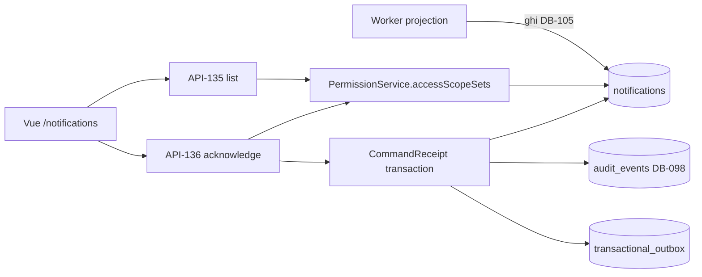

# ExecPlan — Notification inbox US-022 và chuẩn hóa design system

> **Status:** Completed (local implementation + EC2 test deploy)
> **Owner:** Codex / Engineering
> **Created:** 2026-07-26
> **Updated:** 2026-07-26
> **Approval:** Product Owner yêu cầu kiểm tra tiến độ, hoàn thiện tiếp, chuẩn hóa giao diện và deploy trong hội thoại ngày 2026-07-26

## 1. Mục tiêu và kết quả người dùng

Người dùng mở `/notifications` và thấy đúng những cảnh báo schedule/Risk/Issue/Action/Change gửi tới mình, với số chưa đọc
cho badge, lọc theo trạng thái, phân trang bằng cursor và nút đánh dấu đã đọc. Cảnh báo thuộc project hoặc package mà họ
đã mất quyền không hiển thị nữa. Đồng thời toàn bộ giao diện dùng chung một design token layer nên nút, thẻ, bảng và
biểu mẫu trông như một sản phẩm thay vì nhiều mảnh ghép.

## 2. Nguồn và requirement IDs

- Baseline: `docs/Đề xuất tính năng nền tảng Solar và BESS.md`
- Source Feature IDs: `WFL-*`, `PRJ-*` (Notification, nhắc việc và escalation)
- Business Requirements: `BR-032`, `BR-034`, `BR-038`
- Functional: `FR-175`, `FR-177`; phụ thuộc `FR-019…FR-025`, `FR-142…FR-145`
- Use cases/stories: `UC-022`, `US-022`
- Acceptance: `AC-105`, `AC-107` (đóng trong phạm vi này); `AC-103`, `AC-104`, `AC-106` giữ Planned
- Tests: `TEST-103…TEST-107`
- API: `API-135`, `API-136`
- Data: `DB-105` (đã tồn tại), `DB-098` audit
- Security: `SEC-107`, `SEC-118`

## 3. Hiện trạng repository

Kiểm tra trước khi bắt đầu:

- `apps/api/src/database/entities/notification.entity.ts` đã là DB-105 tổng quát hóa cho cả năm `source_type`, có
  `uq_notification_dedup`, `idx_notification_inbox` và các CHECK ràng buộc alert/priority/status.
- Migration `1783733000000-GeneralizeNotifications.ts` cài `trg_notification_source_scope`, ép mọi row phải trỏ tới
  source thật và có `package_id`/`due_at`/`data_date`/`priority` đúng policy dẫn xuất từ source + primary Site timezone.
- `apps/worker/src/notification-projection.ts` cùng hai processor schedule/risk-change đã ghi projection.
- Không có controller, service, route hay UI nào đọc bảng này; `notification.read`/`notification.acknowledge` chưa tồn
  tại trong bất kỳ role nào.
- `docs/openapi/openapi.yaml` 0.9.1 khai báo API-135/136 nhưng còn `Envelope`/`GenericCommand` và trace sai (`DB-071`,
  `DB-097` thay vì `DB-105`).
- `apps/web/src/styles/` có tokens tối thiểu (7 biến), phần lớn màu là literal; nút Element Plus vẫn dùng primary xanh
  dương mặc định, tương phản với brand xanh lá.

## 4. Phạm vi

### In scope

- API-135 list + unread counter trong `meta`; API-136 acknowledge idempotent.
- Re-authorization tại thời điểm đọc theo tenant/recipient/project/package.
- Role grant migration có `down()` đối xứng.
- Vue route `/notifications`, component inbox, api module, types, tests.
- Design token layer và chuẩn hóa header/nav/card/table/form/button/empty state.

### Out of scope

- Channel adapter (email/Zalo/SMS), preference, digest, snooze: phụ thuộc provider chưa có credential — giữ `AC-103`.
- Scheduler nhắc việc và escalation nhiều mức: `AC-104`.
- P1 call tree và mandatory channel: `AC-106`.
- Thay đổi worker projection hoặc bất kỳ ghi nào vào object nguồn.

## 5. Assumption, TBD và Open Question

| Loại | Nội dung | Owner cần xác nhận | Hạn/điều kiện đóng | Tác động nếu chưa đóng |
|---|---|---|---|---|
| Decision | Unread counter đi trong `meta` của API-135 thay vì tạo operation mới | Codex (được ủy quyền) | Đã đóng 2026-07-26 | Giữ catalog đúng 164 API ID, không phải cấp `API-165` cho một badge |
| Decision | Mọi role trong catalog đều được cấp `notification.read`/`acknowledge` | Codex (được ủy quyền) | Đã đóng 2026-07-26 | Service luôn thu hẹp về `recipient_user_id` nên grant không mở rộng reach dữ liệu |
| Assumption | Notification ngoài scope phải trả 404 chứ không 403 | — | Theo `assertVisible` của risk-change | Nếu trả 403 sẽ lộ sự tồn tại của bản ghi ẩn |
| Open Question | Provider channel/escalation cho AC-103/104/106 | System Owner | Trước khi claim US-022 Done | US-022 không thể chuyển Done trong phạm vi này |

## 6. Thiết kế và luồng dữ liệu

`accessScopeSets(context, 'notification.read')` làm phẳng role assignment thành `{tenantWide, projectIds, packageIds}`
để lọc ngay trong SQL. Lọc sau khi phân trang sẽ khiến một trang trả về ít hơn `limit` trong khi vẫn còn hàng hợp lệ,
nên predicate phải nằm trong câu truy vấn.

## 7. API, dữ liệu và bảo mật

- API-135 `GET /v1/notifications`: cursor `(createdAt, id)` giảm dần, `limit` 1..100 mặc định 50, filter
  `status/priority/sourceType/alertType/projectId`. `meta` mang `nextCursor`, `limit`, `unreadTotal`, `unreadHigh`,
  `unreadNormal`; counter bỏ qua filter của request nhưng dùng đúng predicate scope.
- API-136 `POST /v1/notifications/{id}:acknowledge`: body rỗng `additionalProperties: false`, bắt buộc `Idempotency-Key`,
  trả 200. Không phải recipient / ngoài scope / khác tenant → 404.
- DB: không có thay đổi schema. Migration `1783737000000-GrantNotificationPermissions` chỉ thêm hai permission code,
  ghi lại đúng những code nó thêm vào bảng state để `down()` không xóa nhầm grant có sẵn.
- SEC-107: re-authorize mỗi request. SEC-118: acknowledge ghi audit + outbox trong cùng transaction.
- OT: không áp dụng; notification là read model, không có write path tới OT.

## 8. Ma trận truy vết thực thi

| Requirement/ADR | Milestone | File/component | Acceptance/Test | Trạng thái |
|---|---|---|---|---|
| API-135; SEC-107 | M1 | `notification.service.ts` `list`, `PermissionService.accessScopeSets` | AC-105 / TEST-105 | Done |
| API-136; SEC-118 | M1 | `notification.service.ts` `acknowledge`, `emit` | AC-107 / TEST-107 | Done |
| US-022 role policy | M1 | `1783737000000-GrantNotificationPermissions.ts`, `project-master.seed.ts` | TEST-105 | Done |
| US-022 UI | M2 | `views/notification/NotificationInboxView.vue`, `components/notification/NotificationInbox.vue` | AC-105/107 | Done |
| NFR-024 | M2 | `styles/tokens.css` + toàn bộ stylesheet | — | Done |
| AC-103/104/106 | — | channel/scheduler/P1 | TEST-103/104/106 | Planned, chờ provider |

## 9. Milestone và bước thực hiện

### M1 — Read/acknowledge API

- [x] `accessScopeSets` trong `PermissionService` để lọc ABAC bằng một predicate SQL.
- [x] `NotificationService.list` + `unreadCounters` + `acknowledge`; controller, DTO, cursor, module wiring.
- [x] Migration role grant + cập nhật seed catalog + đăng ký trong `data-source.ts`.
- [x] Integration 12 test cho API và 3 test cho migration up/down/up.

**Exit criteria:** không recipient nào đọc được notification ngoài scope; acknowledge idempotent; audit/outbox đúng một
bản ghi cho mỗi lần chuyển UNREAD→READ.

### M2 — UI và design system

- [x] `notification.api.ts`, `notification.types.ts`, component, view, route, nav gate theo permission.
- [x] Token layer đầy đủ (màu/spacing/radius/type/shadow) và override `--el-color-primary` sang brand.
- [x] Chuẩn hóa header, nav, card, bảng, form, empty/loading state, focus ring; gỡ override cream của risk lane.
- [x] Web unit 10 test mới; screenshot đối chiếu login/dashboard/projects/notifications/risk-change.

**Exit criteria:** không còn nút primary xanh dương; heading theo type scale; mọi panel dùng chung surface/shadow.

## 10. Kế hoạch kiểm thử và chất lượng

| Loại | Command | Requirement/Test IDs | Expected result |
|---|---|---|---|
| Lint | `npm run lint` | NFR-024 | Exit code 0 |
| Type-check | `npm run typecheck` | NFR-024 | Exit code 0 |
| Unit | `npm run test:unit` | TEST-107 | API 56 + Web 67 + Worker 61 |
| Integration | `npm run test:integration` | TEST-105/107 | API 66 + Worker 11 |
| OpenAPI | `npm run openapi:lint` | NFR-024 | Valid, 164 ID / 53 implemented |
| E2E | `npx playwright test` | TEST-001…004/010/014…017/230…233 | 5/5 Pass |

## 11. Migration, rollout và rollback

- Migration duy nhất là role grant, forward-compatible và có `down()` chỉ gỡ đúng phần nó thêm.
- Rollout theo `scripts/deploy-ec2.sh`: build → migrate → up --wait → smoke; thất bại thì tự rollback về image trước.
- Không có backfill dữ liệu; DB-105 đã có sẵn nội dung do worker ghi.

## 12. Rủi ro và biện pháp

| Rủi ro | Xác suất/tác động | Tín hiệu | Giảm thiểu | Owner |
|---|---|---|---|---|
| Lọc scope sau phân trang gây trang thiếu hàng | Thấp/Trung bình | Trang trả ít hơn `limit` khi vẫn còn cursor | Đưa predicate vào SQL qua `accessScopeSets` | Engineering |
| Unread counter lộ công việc ẩn | Thấp/Cao | Counter > số hàng đọc được | Counter dùng đúng predicate của list; có test riêng | Engineering |
| Token refactor làm vỡ style cũ | Trung bình/Thấp | Panel mất nền hoặc bóng | Giữ alias `--color-brand-dark`/`--shadow-card`; screenshot đối chiếu | Engineering |

## 13. Decision Log

| Ngày | Quyết định | Lý do | ADR/Requirement liên quan | Người phê duyệt |
|---|---|---|---|---|
| 2026-07-26 | Unread counter đi trong `meta`, không tạo API mới | Giữ catalog 164 ID và tránh ripple qua registry/test đếm | API-135 | Codex (ủy quyền) |
| 2026-07-26 | Acknowledge lần hai là no-op 200, không phải 409 | Inbox là projection; client retry phải hội tụ | AC-107 | Codex (ủy quyền) |
| 2026-07-26 | Ngoài scope trả 404 | Không lộ sự tồn tại bản ghi ẩn | SEC-107 | Codex (ủy quyền) |
| 2026-07-26 | Override `--el-color-primary` thay vì bọc lại Element Plus | Một dòng token đổi toàn bộ nút, không đụng component | NFR-024 | Codex (ủy quyền) |

## 14. Progress Log

| Ngày | Hoàn thành | Bằng chứng/command | Blocker/next step |
|---|---|---|---|
| 2026-07-26 | Khôi phục stack sau reboot | `npm run secrets:materialize`; 5 container healthy | Ghi vào runbook DevOps §12.1 |
| 2026-07-26 | Đóng E2E gate US-004 | `npx playwright test` 5/5 | — |
| 2026-07-26 | M1 API + migration | Integration 16/16 | — |
| 2026-07-26 | M2 UI + design system | Web unit 67; screenshot 5 trang | AC-103/104/106 chờ provider |

## 15. Kết quả và bàn giao

- Outcome: inbox đọc/acknowledge chạy end-to-end trên EC2 test; AC-105 và AC-107 có bằng chứng; design system thống nhất.
- File tạo: `apps/api/src/modules/notification/**`, `apps/api/src/database/migrations/1783737000000-GrantNotificationPermissions.ts`,
  `apps/api/test/integration/modules/notification/notification.integration-spec.ts`,
  `apps/api/test/integration/database/notification-permission-migration.integration-spec.ts`,
  `apps/web/src/api/notification.api.ts`, `apps/web/src/types/notification.types.ts`,
  `apps/web/src/components/notification/**`, `apps/web/src/views/notification/**`,
  `apps/web/src/styles/notification.css`, ExecPlan này.
- File sửa: `permission.service.ts`, `app.module.ts`, `data-source.ts`, `project-master.seed.ts`,
  `swagger.unit-spec.ts`, `auth.integration-spec.ts`, `risk-change-migration.integration-spec.ts`,
  `project-structure.spec.ts`, `routes.ts`, `constants/routes.ts`, `AppNavigation.vue`,
  `styles/{tokens,base,auth,dashboard,projects,risk-change,schedule,index}.css`,
  `docs/{08,12,13,14,15,CHANGELOG}` và `docs/openapi/openapi.yaml`.
- Assumption/TBD/Open Question còn lại: provider channel cho AC-103/104/106.
- Follow-up: đưa `RUNTIME_SECRETS_DIR` khỏi `/tmp`; cân nhắc đưa Playwright vào CI; triển khai channel/scheduler khi có
  credential.
