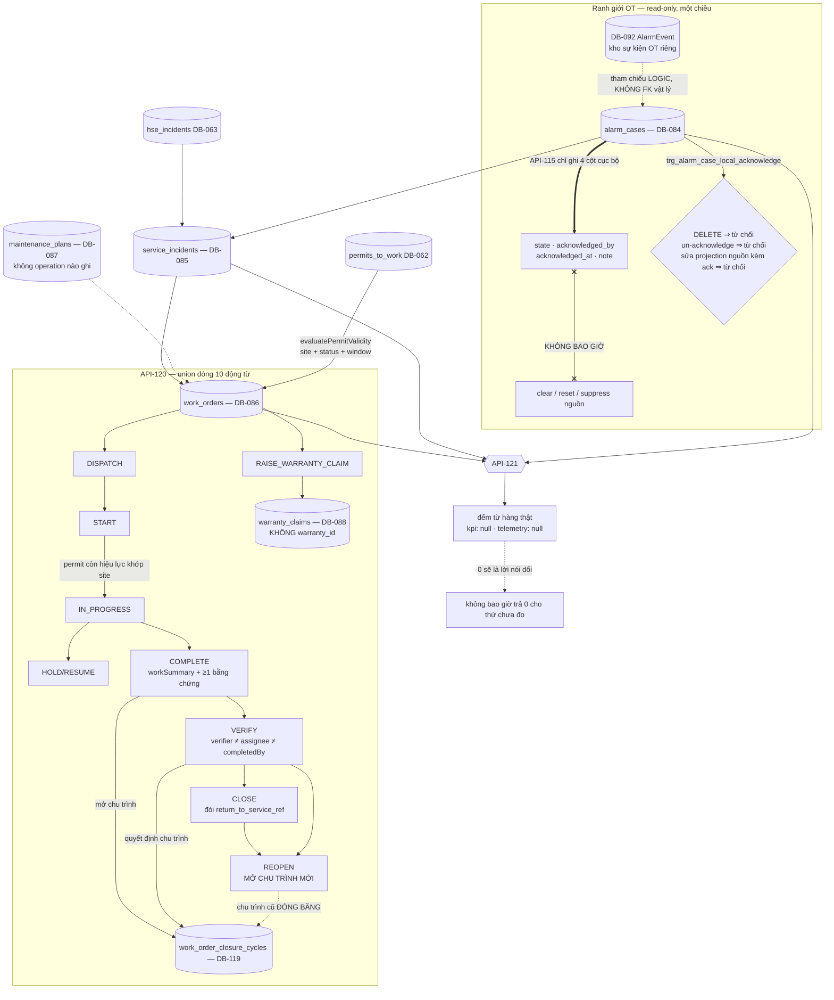

# ExecPlan — Operations & Maintenance (US-014)

> **Status:** Completed (API-114…API-121, đủ 8 operation); AC-063/064/065/066 Partial, AC-067 Not covered
> **Owner:** Codex / Engineering
> **Created:** 2026-07-26
> **Updated:** 2026-07-26
> **Approval:** Product Owner trao toàn quyền quyết định và yêu cầu hoàn thành các yêu cầu trong story ngày 2026-07-26

## 1. Mục tiêu và kết quả người dùng

Người vận hành đọc register alarm case cục bộ của một site (API-114) và **acknowledge case cục bộ — và chỉ thế** (API-115); mở và theo dõi sự cố dịch vụ kèm đồng hồ SLA (API-116/117); đọc register work order của một asset kèm ngữ cảnh kế hoạch bảo trì và số yêu cầu bảo hành (API-118), tạo work order với permit to work là điều kiện tiên quyết thật (API-119), điều khiển toàn bộ vòng đời work order qua một command union đóng mười động từ kể cả lập yêu cầu bảo hành (API-120), và đọc hiệu năng asset (API-121).

Kết quả quan sát được quan trọng nhất là **hai điều hệ thống này từ chối làm.**

Thứ nhất: **acknowledge không bao giờ chạm tới nguồn.** `API-115` ghi đúng bốn cột cục bộ trên hàng của PM Web. Không có trường request, không có đường mã, không có hàng đợi và không có credential nào ở đây có thể với tới hệ thống OT; DTO không mang một định danh nguồn nào; và `trg_alarm_case_local_acknowledge` từ chối mọi UPDATE nào định lén viết lại projection nguồn trong cùng một câu lệnh. Một case đóng ở PM Web **không nói gì** về trạng thái của nhà máy. Acknowledge lại một case đã acknowledge là **no-op tuyệt đối**: không ghi, không tăng version, không sinh hàng audit thứ hai.

Thứ hai: **không bịa số đo.** `API-121` trả `kpi: null` và `telemetry: null` — luôn có mặt, luôn null. PM Web không có kho telemetry nào và ranh giới OT cấm dựng một kho như thế ở phía này. `0` sẽ là một lời nói dối: "không đo được" và "đo được và bằng không" là hai câu trả lời khác nhau, và chỉ câu thứ hai mới được báo bằng một con số. Mọi thứ còn lại trong response đều đếm từ hàng thật, và một trạng thái không có hàng thì **vắng mặt** khỏi bản đồ đếm chứ không bằng 0.

Và một điều nó cưỡng chế: **không ai nghiệm thu công việc của chính mình.** `VERIFY`/`CLOSE` đòi người xác nhận khác người được giao và khác người hoàn thành, kiểm ở service để có lỗi có tên và ở tầng hàng bằng `ck_work_order_verifier_independent` dùng `IS DISTINCT FROM` — nên một `assignee_id` để trống không vô hiệu hóa được vị từ.

## 2. Nguồn và requirement IDs

- Baseline: `docs/Đề xuất tính năng nền tảng Solar và BESS.md`
- Business: `BR-027…BR-030`, `BR-040` (theo trace `US-014` trong `docs/12` và `docs/15` §"COD-to-O&M continuity")
- Functional: `FR-115…FR-124`, `FR-165…FR-170`. Ở tầng operation, `x-related-requirements` gán `API-114→FR-118`, `115→FR-118`, `116→FR-119`, `117→FR-119`, `118→FR-120`, `119→FR-120`, `120→FR-121 + FR-122`, `121→FR-116 + FR-117 + FR-123 + FR-124`
- Use case/story/workflow: `UC-014`/`US-014`; `WF-024` (O&M work order), `WF-025` (Alarm handling)
- Acceptance: `AC-063…AC-067`
- Tests: `TEST-063…TEST-067` tương ứng
- API: `API-114…API-121` (8 operation, không thiếu và không dư)
- Data: `DB-084` AlarmCase, `DB-085` ServiceIncident, `DB-086` WorkOrder, `DB-087` MaintenancePlan, `DB-088` WarrantyClaim; **cấp mới một ID theo ủy quyền: `DB-119` WorkOrderClosureCycle** (tiền lệ `DB-114…DB-118`); **`DB-083` Warranty cố ý không tạo** (quyết định b); `DB-011` Site, `DB-079` Equipment, `DB-080` Asset, `DB-062` PermitToWork, `DB-063` HSEIncident tham chiếu; `DB-092` AlarmEvent là **tham chiếu logic, không FK vật lý**; `DB-098` audit, `DB-102` outbox, `DB-104` command receipt dùng lại
- Security: `SEC-108`, `SEC-109`, `SEC-111`, `SEC-118`, `SEC-127`, `SEC-128`

## 3. Hiện trạng repository trước khi bắt đầu

- `API-114…121` chỉ có contract thiết kế; không controller nào. Marker implemented ở đầu wave là 138/164.
- Không bảng nào của `DB-084…088` tồn tại; `DB-119` chưa được cấp.
- Slice engineering (`1783744000000`) đã cấp `uq_sites_tenant_project_id` cho `sites (tenant_id, project_id, id)`, `uq_assets_site_id` cho `assets (tenant_id, site_id, id)` và `equipment` (`DB-079`) — **không có ba khóa đó thì mọi FK "ghim asset vào đúng site, ghim site vào đúng dự án" của slice này không tạo được.** Đây là phụ thuộc cứng.
- Slice Field/HSE (`1783746000000`) đã có `permits_to_work` (`DB-062`) với `status`/`site_id`/`valid_from`/`valid_to`, và `hse_incidents` (`DB-063`) khóa theo `(tenant_id, project_id, id)`.
- `docs/07` §"Time-series/event" chốt `DB-091`/`DB-092` nằm trong một kho riêng và ghi rõ **"Không physical FK cross-store"**.
- `docs/09` §"Roles" mô tả ba persona O&M — **O&M Dispatcher**, **Technician**, **O&M Engineer** — nhưng catalog role đã duyệt **không cấp mã vai nào** cho họ.
- `role_assignments` chỉ biết bốn loại scope: `TENANT`, `PORTFOLIO`, `PROJECT`, `PACKAGE`. **Không có `SITE`, không có `ASSET`.**
- Không operation nào trong catalog: nạp alarm event từ OT (`API-125` Not covered), tạo/publish maintenance plan, cập nhật service incident, giải quyết warranty claim, hay ghi warranty. Đây là ranh giới cứng của slice.
- Chuỗi migration kết thúc ở `1783759000000` với `policy_version = 13` (slice Commissioning song song); seed dùng `rolePolicyVersion = 12` trước wave.

## 4. Phạm vi

### In scope

- Tám operation trong module Nest `operations-maintenance`, tách hai service theo miền: `alarm-incident.service.ts` (API-114…117) và `work-order.service.ts` (API-118…121).
- Migration `1783760000000-CreateOperationsMaintenance.ts`: 6 bảng, 1 partial unique index, 4 họ trigger bất biến/cục bộ, 2 `COMMENT ON` ghi thẳng vào schema lý do của hai vắng mặt có chủ ý.
- Migration `1783761000000-GrantOperationsMaintenancePermissions.ts` (`policyVersion = 14` — cực đại của chuỗi, state-table `role_grant_reconcile_1783761000000`): 8 permission code cho hai nhóm vai đã tồn tại; **không tạo vai mới**.
- Domain thuần có unit test: `work-order-policy.ts` (máy trạng thái `WF-024` + bộ đánh giá hiệu lực permit dưới dạng hàm thuần), `cursor.ts`; `support.ts` gom lỗi/ABAC/audit/outbox/version dùng chung hai service.
- OpenAPI: đặc tả cụ thể cả 8 operation; marker implemented 146 → 154 cho phần này (tổng cả wave).

### Out of scope

- **`DB-083` Warranty.** Cố ý không tạo — xem quyết định (b). Hệ quả: `warrantyId` vắng ở cả `work_orders` lẫn `warranty_claims`.
- **Nạp alarm event từ OT.** `API-125` (inbound telemetry/alarm) là Not covered của toàn dự án; không operation nào trong catalog **tạo** một alarm case, nên `alarm_cases` không có nguồn ghi trong V1 (Open Question ở §5).
- **Cập nhật/đóng service incident.** `API-117` chỉ tạo; không operation nào chuyển `status`, ghi `sla_responded_at`/`sla_resolved_at` hay `resolution_summary`. Cột và CHECK đã đặt sẵn — schema chờ, không phải tính năng.
- **Tạo/publish maintenance plan.** `DB-087` có bảng, ràng buộc và trigger đóng băng version đã publish, nhưng không operation nào ghi nó.
- **Giải quyết warranty claim.** `API-120` chỉ lập claim ở `SUBMITTED`; `APPROVED/REJECTED/WITHDRAWN` không tới được qua API.
- **Telemetry, KPI, meter, billing provenance.** `DB-091…095` không materialize; `API-121` trả `kpi`/`telemetry` là `null` tường minh và **không có** `availability`, `performanceRatio` hay meter provenance — catalog nêu chúng nhưng không nguồn dữ liệu nào tồn tại ở phía này của ranh giới.
- **Engine độ tin cậy / suy giảm (`AC-067`).** Không phát hiện lỗi lặp, không ngưỡng degradation, không tự sinh recommendation/CAPA.
- **Escalation SLA, breach reason và báo cáo khách hàng/nhà đầu tư (`AC-066`).** Không job, không cột `breach_reason`, không nguồn notification O&M trong allowlist `DB-105`.
- **JSA, LOTO, competency, isolation certificate.** Không bảng, không DB ID được cấp; không bịa ID.
- **Vai `OM_DISPATCHER` / `OM_TECHNICIAN`.** Không phát minh — xem quyết định (c).
- **UI Vue.** Không route/view web nào trong slice này.

## 5. Assumption, TBD và Open Question

| Loại | Nội dung | Owner cần xác nhận | Điều kiện đóng | Tác động nếu chưa đóng |
|---|---|---|---|---|
| Open Question (ưu tiên cao) | `DB-119` được cấp theo ủy quyền và đã ghi ở `docs/CHANGELOG.md` + `docs/15` §"DB-001…119", nhưng **chưa có dòng dictionary trong `docs/07-data-model.md`** (chỉ `DB-115/116/117` có dòng) | Data Owner | Thêm dòng dictionary `DB-119` (khóa, cột, ràng buộc, phân loại, retention, trace) vào `docs/07` | Bảng `work_order_closure_cycles` đã chạy nhưng định nghĩa chuẩn của nó chỉ tồn tại trong DDL, entity và OpenAPI |
| Open Question (ưu tiên cao) | **Không operation nào trong catalog tạo một alarm case.** `API-114` đọc và `API-115` acknowledge, nhưng nguồn ghi là `API-125` (inbound), hiện Not covered vì chưa hệ thống OT nào được ký hợp đồng | Product Owner / OT Owner | Ký hợp đồng gateway OT rồi cấp `API-125` + materialize `DB-092` | Register alarm và đường acknowledge **không có nhà sản xuất dữ liệu** trong V1; chúng chạy đúng nhưng chỉ trên dữ liệu do test/seed đặt vào. Đây là hệ quả trực tiếp của ranh giới OT, không phải một thiếu sót của slice |
| Open Question (ưu tiên cao) | **Không mã vai nào cho persona O&M.** `docs/09` nêu O&M Dispatcher / Technician / O&M Engineer nhưng catalog role không cấp mã; thẩm quyền tạm được xấp xỉ bằng `PMO`/`PROJECT_MANAGER` | Product Owner / Security / HSE | Cấp mã vai cho persona O&M và chốt xem `workOrder.manage` có tách thành dispatch / execute / verify hay không | Xấp xỉ hiện tại **rộng hơn persona**: không thể trao quyền điều phối cho một dispatcher mà không đồng thời trao quyền quản lý dự án. Nếu tách được `workOrder.manage`, một technician sẽ **không bao giờ** giữ nửa verify — hiện SoD chỉ chặn ở tầng danh tính, không ở tầng vai |
| Open Question | Không operation nào cập nhật service incident: không chuyển `status`, không ghi `sla_responded_at`/`sla_resolved_at`/`resolution_summary` | Product Owner / API Owner | Cấp `API-*` mới có trace | `AC-066` không đóng được đầu-cuối: đồng hồ SLA có cột và có CHECK thứ tự nhưng **không ai bấm được nó**; sự cố đứng mãi ở `OPEN` |
| Open Question | Không operation nào tạo/publish maintenance plan (`DB-087`) | Product Owner | Cấp `API-*` mới có trace | Work order tham chiếu được một kế hoạch bảo trì, nhưng không gì tạo ra kế hoạch đó; nhánh "bảo trì định kỳ" của `AC-063` không có nguồn |
| Open Question | Không operation nào giải quyết warranty claim | Product Owner | Cấp `API-*` mới có trace | Claim đứng ở `SUBMITTED`; `ck_warranty_claim_resolved` và trigger giữ hồ sơ đã giải quyết đã cài trước cho lúc operation đó ra đời |
| Open Question | `DB-088` trong dictionary liệt kê `warrantyId FK`, nhưng cột **cố ý vắng mặt** cùng với bảng cha `DB-083` | Data Owner | Amendment `docs/07` cho `DB-088`, hoặc phê duyệt slice Warranty | Dictionary và DDL lệch một cột. Ghi ở đây, trong `COMMENT ON TABLE warranty_claims` và trong test để không âm thầm |
| Open Question (doc-correction) | `docs/08` gán `DB-083` cho `API-118`/`API-119`, và gán `DB-091/093/094/095` cho `API-121` — không bảng nào trong số đó tồn tại | API / Data Owner | Cập nhật `x-related-data` khi các bảng đó materialize | Đọc tài liệu sẽ tưởng có warranty/telemetry/meter join; runtime trả `null` tường minh và không join gì cả |
| Open Question | ABAC: người được gán scope **PACKAGE** không với tới gì trong O&M | Security / Product Owner | Chốt xem một package có ánh xạ sang site/asset hay không | Hàng O&M thuộc về một site, không thuộc một gói thầu; không có cách ánh xạ trung thực nào, nên deny-by-default là câu trả lời đúng. Ghi tường minh trong `inScope()` |
| TBD | Quy tắc calendar/timezone/pause của đồng hồ SLA và trường `breach_reason` | Product / O&M Owner | Chốt quy tắc rồi thêm cột + job | Cùng họ TBD với `AC-072` (workflow SLA). Không escalation, không breach reason, `sla_*_due_at` chỉ là mốc đọc-ra |
| TBD | Chính sách notification cho O&M (WO quá hạn, SLA sắp vi phạm, alarm chưa acknowledge) | Product / Notification Owner | Mở allowlist `ck_notification_source_type` của `DB-105` cho nguồn O&M | Không thông báo chủ động; mọi thứ chỉ nhìn thấy khi có người mở register |
| Open Question | `US-014` chưa có dòng **Delivery status** trong `docs/12-product-backlog.md` (commit slice không chạm `docs/12`) | BA / Product Owner | Thêm dòng Delivery status theo đúng mẫu các story đã đóng | Backlog vẫn đọc như story chưa được đụng tới, trong khi `docs/15` và `docs/CHANGELOG.md` đã ghi 8 operation materialize |
| Assumption | `WF-024` được đọc theo ba điểm có ghi nhận (xem quyết định g): `DISPATCH` nhận `DRAFT/APPROVED/SCHEDULED`; `START` nhận thêm `REOPENED`; `CANCEL` nhận `DRAFT` và `VERIFIED` | Product Owner / O&M | Xác nhận hoặc sửa `docs/11` §WF-024 | Sơ đồ và phần diễn giải của `WF-024` khác nhau ở ba chỗ; slice chọn cách đọc giữ trạng thái không thành bẫy và không bịa cạnh mới |

## 6. Thiết kế và luồng dữ liệu

**Acknowledge là cục bộ và chỉ cục bộ.** `trg_alarm_case_local_acknowledge` định nghĩa một danh sách **cột cục bộ** (`state`, `owner_id`, `acknowledged_by`, `acknowledged_at`, `acknowledgment_note`, `version_no`, `updated_by`, `updated_at`). Khi một UPDATE chạm bất kỳ cột acknowledge nào, phần **ngoài** danh sách đó phải giống hệt trước và sau — nên không lệnh acknowledge nào lén viết lại `source_event_refs`, `source_quality`, `first_seen_at`/`last_seen_at` hay ánh xạ site/asset. Ngoài ra: một case đã acknowledge **không bao giờ** un-acknowledge được, và một case **không bao giờ** xóa được — nó là bản ghi cục bộ của một sự kiện có thật.

**Replay là no-op thật.** `acknowledgeAlarmCase` kiểm `acknowledgedBy !== null` **trước khi ghi** và trả về hàng nguyên trạng kèm `acknowledgementApplied: false`. Không UPDATE, không tăng `versionNo`, không hàng audit thứ hai, không sự kiện outbox thứ hai — nên một lần thử lại không bao giờ sinh ra một sự thật acknowledge thứ hai.

**`source_event_refs` là tham chiếu logic.** Mảng jsonb các id mờ trỏ vào `DB-092`, **không có FK vật lý** vì `docs/07` chốt hai kho tách biệt. `COMMENT ON COLUMN` ghi thẳng lý do đó vào schema. Không cột tag, gateway, point, raw payload, command, setpoint, reset hay suppress nào tồn tại — **sự vắng mặt của mọi cột connectivity chính là biện pháp kiểm soát `SEC-127`/`SEC-128`**: PM Web thậm chí không lưu nổi toạ độ của một đường ghi vào OT.

**Quy tắc permit là một hàm thuần, một chỗ duy nhất.** `evaluatePermitValidity(permit, requiredSiteId, at)` trả `MISSING | SITE | STATUS | WINDOW | null`. Một khóa ngoại diễn đạt được site nhưng **không bao giờ** diễn đạt được trạng thái và cửa sổ thời gian, nên tách quy tắc giữa schema và service sẽ để lại hai nửa luật có thể bất đồng. Cả `API-119` (cổng `PTW_REQUIRED`) và `API-120` (cổng `START`) đều gọi đúng hàm này. Thứ tự kiểm là có chủ ý: **site trước status**, nên một permit của site khác không bao giờ bị báo nhầm là "hết hạn". `ck_work_order_permit_required` lặp lại nửa cấu trúc ở tầng hàng: một work order `requires_permit` **không thể tồn tại** ở `IN_PROGRESS/COMPLETE/VERIFIED/CLOSED` mà thiếu `permit_to_work_id`.

**Chu trình nghiệm thu (`DB-119`) giữ cho reopen không xoá lịch sử.** `COMPLETE` mở chu trình (hoặc dùng lại chu trình đang mở, vì một `REOPEN` trước đó đã mở sẵn cái mà lần xác nhận tới sẽ quyết định); `VERIFY` quyết định nó (`APPROVE`, với `decidedBy ≠ requestedBy` ở cả service lẫn `ck_work_order_closure_cycle_sod`); `REOPEN` mở chu trình **mới**. Hàng work order bị xoá `verified_by`/`verified_at`/`closed_by`/`closed_at`/`return_to_service_ref` khi reopen — vì chúng không còn mô tả đúng work order nữa — nhưng **chúng không mất**: chu trình `DB-119` đã đóng băng giữ nguyên ai xác nhận, khi nào, và với thuyết minh gì. `uq_work_order_closure_cycle_open` giữ đúng một chu trình chưa quyết định.

**"Đóng" không bao giờ có nghĩa là "bỏ đi".** `ck_work_order_closed` khiến một work order `CLOSED` **về cấu trúc** phải mang `verified_by`, `closed_by` và một `return_to_service_ref` không rỗng.

**Tenancy và ABAC.** Mọi FK là composite mang `tenant_id`; asset ghim vào đúng site, site ghim vào đúng dự án. `role_assignments` không có scope `SITE` hay `ASSET`, và slice **không phát minh** một cái: mỗi hàng O&M mang dự án của site nó thuộc về, và tầm với site/asset được **suy ra** từ dự án đó (`inScope()`). Người được gán scope PACKAGE không với tới gì ở đây — một hàng O&M thuộc về một site chứ không thuộc một gói thầu, không có cách ánh xạ trung thực nào, nên deny-by-default là câu trả lời đúng. Ngoài tầm với và không tồn tại trả **404 giống hệt nhau**.

## 7. API, dữ liệu và bảo mật

**API.** Tám operation, OpenAPI 3.1, mọi lệnh đòi `Idempotency-Key` 8–200 ký tự và trả **200/201 chứ không 202**. `API-120` là command union đóng mười động từ (`DISPATCH`, `START`, `HOLD`, `RESUME`, `COMPLETE`, `VERIFY`, `CLOSE`, `REOPEN`, `CANCEL`, `RAISE_WARRANTY_CLAIM`) — chín động từ chuyển trạng thái cộng một động từ ghi thêm hàng `DB-088`; `@IsIn` trên hằng `WORK_ORDER_COMMAND_TYPES` từ chối mọi tên khác. `expectedVersion` nằm trong body.

**Dữ liệu.** Sáu bảng: `alarm_cases`, `service_incidents`, `maintenance_plans`, `work_orders`, `work_order_closure_cycles` (`DB-119`), `warranty_claims`. Migration `1783760000000` có `down()` đối xứng (trigger → function → bảng theo thứ tự phụ thuộc ngược), đã test up/down/up. Không backfill: trước slice này không có dữ liệu O&M nào.

**Bảo mật.** `SEC-108`/`SEC-109`: SoD hai tầng cho verify/close và cho chu trình nghiệm thu. `SEC-111`: ABAC dự án áp trong SQL trước phân trang, cộng một vị từ project **đi vào cùng câu query** với site đã được kiểm — không trang nào bị cắt sau khi phân trang. `SEC-118`: audit + outbox trong cùng transaction lệnh, payload chỉ id + phân loại + trạng thái cục bộ. `SEC-127`/`SEC-128`: xem dưới.

**OT.** Ranh giới được cưỡng chế bằng **sự vắng mặt có cấu trúc, được canh tự động ở hai tầng**: unit spec `ot-boundary-columns.unit-spec.ts` khẳng định sáu entity không có cột nào khớp `host|password|secret|token|credential|url|endpoint|…`, khẳng định `alarm_cases` không có `tag_id`/`gateway_id`/`point_id`/`raw_payload`/`command`/`setpoint`/`reset`/`suppress`, và khẳng định `AcknowledgeAlarmCaseDto` chấp nhận **đúng hai** thuộc tính (`expectedVersion`, `note`) — vì controller validate với `whitelist` + `forbidNonWhitelisted`, tập thuộc tính được validate **chính là** hình dạng request được chấp nhận. Test migration lặp lại cùng khẳng định trên `information_schema` sống, và kiểm luôn rằng slice không tạo ra `telemetry_samples` hay `meters`.

### Quyết định thiết kế đã chốt

| Quyết định | Lý do |
|---|---|
| (a) **Cấp mới `DB-119` WorkOrderClosureCycle theo ủy quyền** | `WF-024` cho phép `VERIFIED → REOPENED`. Không có bảng chu trình thì một lần reopen sẽ **ghi đè** `verified_by`/`verified_at` — tức là xoá bằng chứng của lần thẩm định trước. Bảng mô phỏng `DB-117` PunchClosureCycle từng dòng, theo đúng tiền lệ `DB-114…DB-118` |
| (b) **`DB-083` warranties CỐ Ý KHÔNG TẠO** | Không operation nào trong catalog 164 ghi được một hàng warranty — `API-118`/`API-119` chỉ nhắc warranty như *ngữ cảnh*, `API-120` lập một *claim*. Một bảng mà không gì bơm dữ liệu vào là **schema chết**: mọi join warranty sẽ trả về rỗng trong khi trông như đã triển khai. Hệ quả trung thực: `work_orders` **không có** `warranty_id` và `warranty_claims` cũng **không có** (dù dòng dictionary `DB-088` liệt kê một cột như thế — lệch đã ghi ở §5). Khi slice Warranty được duyệt, cả hai cột và FK của chúng là một migration thuần cộng thêm. Test khẳng định `to_regclass('public.warranties')` là `null` **và** không cột `warranty_id` nào tồn tại ở bất kỳ đâu trong schema |
| (c) **Không phát minh vai `OM_DISPATCHER`/`OM_TECHNICIAN`** | `docs/09` mô tả ba persona O&M nhưng catalog role đã duyệt không cấp mã vai nào cho họ; tự cấp ở đây là phát minh ra thẩm quyền mà không artefact nào đã duyệt trao. Thẩm quyền tạm được xấp xỉ bằng `PMO`/`PROJECT_MANAGER` — **rộng hơn persona**, và điều đó được ghi làm Open Question chứ không giấu |
| (d) **Không phát minh scope `SITE`/`ASSET`** | `role_assignments` chỉ có `TENANT/PORTFOLIO/PROJECT/PACKAGE`. Site là thực thể cấp dự án, nên tầm với site và asset được **suy ra** từ `sites.project_id`. Người có scope PACKAGE không với tới gì trong O&M: không có ánh xạ trung thực từ gói thầu sang site |
| (e) **`API-115` acknowledge chỉ ghi cục bộ; replay là no-op idempotent** | `WF-025` ghi rõ "local acknowledge never clears or resets the OT source alarm". Đây không phải một quy ước mà là ba lớp: DTO không có trường nào mô tả hành động nguồn, service ghi đúng bốn cột, trigger từ chối mọi UPDATE lén viết lại projection nguồn — cộng cấm un-acknowledge và cấm DELETE vĩnh viễn |
| (f) **`alarm_cases.source_event_refs` không có FK vật lý** | `docs/07` đặt `DB-091`/`DB-092` trong kho time-series/sự kiện riêng và chốt "Không physical FK cross-store". Tham chiếu là id mờ; PM Web không bao giờ mutate nguồn. Lý do được ghi thẳng vào schema bằng `COMMENT ON COLUMN` |
| (g) **Ba cách đọc `WF-024` có ghi nhận** | Sơ đồ và phần diễn giải khác nhau ở ba chỗ. `DISPATCH` nhận `DRAFT/APPROVED/SCHEDULED` — catalog không có operation approve hay schedule, nên `APPROVED` là một giá trị hợp lệ mà **không gì ghi được**, và work order đi thẳng từ chỗ `API-119` tạo ra nó tới dispatch. `START` nhận thêm `REOPENED` — `WF-024` không vẽ cạnh nào ra khỏi `Reopened`, và một work order mở lại mà không bao giờ chạy lại được sẽ biến `REOPEN` thành một cái bẫy. `CANCEL` nhận `DRAFT` (cạnh mermaid) và `VERIFIED` (câu văn "Verified → Closed/Reopened/Cancelled"). Cả hai nguồn được tôn trọng; **không cạnh nào khác được bịa ra** |
| (h) **`VERIFY`/`CLOSE` cưỡng chế verifier ≠ assignee và ≠ người hoàn thành**, dùng `IS DISTINCT FROM` | `SEC-108`/`SEC-109` và `WF-024` đều nói một technician không tự đóng được work order nghiêm trọng. `IS DISTINCT FROM` giữ vị từ ở FALSE (không phải NULL) khi `assignee_id` chưa đặt — dùng `<>` thì một assignee để trống sẽ vô hiệu hoá cả biện pháp kiểm soát |
| (i) **`CLOSE` đòi `return_to_service_ref`; `REOPEN` mở chu trình mới** | `ck_work_order_closed` khiến "đóng mà không bàn giao lại vận hành" là bất khả thi ở tầng hàng. Reopen xoá verify/close **trên hàng** nhưng chu trình `DB-119` đã đóng băng giữ nguyên chúng |
| (j) **`API-121` trả `kpi: null`/`telemetry: null`, và bản đồ đếm bỏ trống trạng thái không có hàng** | Không kho telemetry/KPI nào tồn tại ở phía PM Web của ranh giới OT, và ranh giới cấm dựng một cái. `0` sẽ là lời nói dối. Cùng lý do, response **không có** `availability`, `performanceRatio` hay meter/billing provenance mà catalog nêu. Đây là cùng một cách trả lời mà `API-074` (slice engineering) đã dùng cho BESS plant |
| (k) **`RAISE_WARRANTY_CLAIM` chỉ mở được từ trạng thái đã có công việc thật xảy ra** | `WARRANTY_CLAIM_STATES` loại `DRAFT`, `APPROVED`, `SCHEDULED` và `CANCELLED`: một claim ghi lại một hư hỏng phát hiện trên asset, nên không bao giờ mở từ một work order chưa ai thực hiện hoặc đã bị huỷ |
| (l) **Không cấp lại `permitToWork.*`** | `API-119`/`API-120` chỉ **đọc** một permit mà slice Field/HSE đã phát hành; đọc nó là một phần của quyền work order, không phải một quyền permit. Cấp thêm code sẽ chẻ đôi mô hình quyền |

## 8. Ma trận truy vết thực thi

| Requirement | Milestone | File/component | Acceptance/Test | Trạng thái |
|---|---|---|---|---|
| `FR-118` / `DB-084` / `API-114` | M1, M2 | `alarm-incident.service.ts` (`listAlarmCases`), `domain/cursor.ts` | `AC-063` / `TEST-063` | Done (Partial ở AC) |
| `FR-118` / `DB-084` / `API-115` | M1, M2 | `alarm-incident.service.ts` (`acknowledgeAlarmCase`), `trg_alarm_case_local_acknowledge` | `AC-063` / `TEST-063` | Done |
| `FR-119` / `DB-085` / `API-116`, `API-117` | M1, M2 | `alarm-incident.service.ts` (`listServiceIncidents`, `createServiceIncident`) | `AC-063`, `AC-066` / `TEST-063`, `TEST-066` | Done (Partial ở AC) |
| `FR-120` / `DB-086`, `DB-087` / `API-118` | M1, M3 | `work-order.service.ts` (`listWorkOrders`, `pageContext`) | `AC-063` / `TEST-063` | Done (Partial ở AC) |
| `FR-120` / `DB-086` / `API-119` | M1, M3 | `work-order.service.ts` (`createWorkOrder`, `checkPermit`), `domain/work-order-policy.ts` | `AC-064` / `TEST-064` | Done (Partial ở AC) |
| `FR-121` / `DB-086`, `DB-119` / `API-120` | M1, M3 | `work-order.service.ts` (`transitionWorkOrder`, `openClosureCycle`, `decideClosureCycle`) | `AC-064`, `AC-065` / `TEST-064`, `TEST-065` | Done (Partial ở AC) |
| `FR-122` / `DB-088` / `API-120` | M1, M3 | `work-order.service.ts` (`raiseWarrantyClaim`) | `AC-067` / `TEST-067` | Partial (claim thủ công; không engine) |
| `FR-116`, `FR-117`, `FR-123`, `FR-124` / `API-121` | M3 | `work-order.service.ts` (`getAssetPerformance`, `countBy`) | `AC-067` / `TEST-067` | **Not covered** — không kho telemetry/KPI/meter |
| `SEC-108`, `SEC-109` | M1, M3 | `ck_work_order_verifier_independent`, `ck_work_order_closure_cycle_sod`, `assertIndependent` | `AC-065` | Done |
| `SEC-111` | M2, M3 | `inScope()`, vị từ project trong cùng query, `resolveSite`/`resolveAsset` | Negative test xuyên tenant / ngoài tầm với | Done |
| `SEC-127`, `SEC-128` | M1, M2 | `trg_alarm_case_local_acknowledge`, `ot-boundary-columns.unit-spec.ts`, assertion `information_schema` | `AC-063`, `AC-067` | Done |
| `WF-024` | M3 | `WORK_ORDER_TRANSITIONS` trong `work-order-policy.ts` | `AC-064`, `AC-065` | Done (3 cách đọc có ghi nhận) |
| `WF-025` | M2 | `acknowledgeAlarmCase` + trigger cục bộ | `AC-063` | Done |

## 9. Milestone và bước thực hiện

### M1 — Schema và migration

- [x] `1783760000000`: 6 bảng theo thứ tự phụ thuộc (`alarm_cases` → `service_incidents` → `maintenance_plans` → `work_orders` → `work_order_closure_cycles` → `warranty_claims`), 1 partial unique, 4 họ trigger, 2 `COMMENT ON` ghi lý do vắng mặt vào schema; `down()` gỡ theo thứ tự ngược.
- [x] Hai file entity (`operations-maintenance.entity.ts`, `operations-maintenance.enums.ts`) khớp một-một với DDL: mọi `@Check`/`@Unique`/`@Index` có mặt trong migration dưới cùng tên.
- [x] `1783761000000`: 8 permission code (`alarmCase.read`, `alarmCase.acknowledge`, `serviceIncident.read`, `serviceIncident.create`, `workOrder.read`, `workOrder.create`, `workOrder.manage`, `performance.read`) cho hai nhóm vai đã tồn tại; `policy_version = 14` ghi bằng `GREATEST`; seed nâng `rolePolicyVersion` 12 → 14.
- [x] `DB-083` **không** tạo; không cột `warranty_id` nào ở bất kỳ đâu.

**Exit criteria:** tham chiếu xuyên tenant bất khả thi ở DDL; không bảng warranties; không cột connectivity nào trong `information_schema`; `down()` trả permission và policy version về nguyên trạng; up/down/up sạch.

### M2 — Alarm và service incident

- [x] `alarm-incident.service.ts` API-114…117: register lọc theo state/severity/asset, ABAC áp trong cùng query, keyset cursor so **theo hàng** với giá trị đã lưu của hàng biên; acknowledge chỉ ghi bốn cột cục bộ và replay là no-op tuyệt đối; tạo sự cố kiểm asset thuộc site, alarm case thuộc site, HSE incident thuộc dự án, và cửa sổ downtime hợp lệ.
- [x] Payload audit/outbox chỉ mang id + phân loại + trạng thái cục bộ, kèm `scope: 'LOCAL_ONLY'` — không byte sự kiện nguồn nào rời khỏi hàng.

**Exit criteria:** mọi nhánh 4xx zero-write; ngoài tầm với 404; acknowledge lần hai không sinh hàng audit thứ hai.

### M3 — Work order, chu trình nghiệm thu và hiệu năng

- [x] `work-order.service.ts` API-118…121: register kèm ngữ cảnh kế hoạch bảo trì + số claim cho **đúng các hàng trên trang** (không N+1); cổng permit dùng hàm thuần dùng chung; union mười động từ; chu trình `DB-119`; `API-121` đếm bằng ba câu group-by song song và trả `kpi`/`telemetry` là `null`.
- [x] OpenAPI đặc tả cụ thể 8 operation kèm `x-error-codes` và `x-implementation-note` cho `API-121`; marker 146 → 154.
- [x] `operations-maintenance.integration-spec.ts` 8 test HTTP; `operations-maintenance-migration.integration-spec.ts` 13 test ràng buộc DB; unit `permit-validity` (7 khối + `it.each`), `work-order-policy` (4 khối + `it.each`), `ot-boundary-columns` (2 khối + `it.each` 6 bảng), `cursor` (4 khối).

**Exit criteria:** mỗi bất biến ở §6 có ít nhất một test chứng minh **bằng SQL tay**, không chỉ qua HTTP; hai vắng mặt có chủ ý (`warranties`, cột connectivity) được khẳng định trên schema sống.

## 10. Kế hoạch kiểm thử và chất lượng

| Loại | Command | Requirement/Test IDs | Kết quả |
|---|---|---|---|
| Lint | `npm run lint` | NFR-024 | Pass, 0 warning |
| Type-check | `npm run typecheck` | NFR-024 | Pass trên api/web/worker |
| Unit | `npm run test:unit` | NFR-024 | API 335 / 43 suite (O&M góp 4 file: permit-validity, work-order-policy, ot-boundary-columns, cursor); Web 178; Worker 74 |
| Integration (cổng do lead chạy) | `npm run test:integration` | `TEST-063…TEST-067` theo bảng §15 | API **318/318 trên 32 suite** — O&M góp **21**: HTTP 8 + migration 13; Worker 11/11 |
| Contract | `npm run openapi:lint` | NFR-024 | Pass với **154/164** marker implemented |
| Build | `npm run build` | NFR-024 | Pass |

Điểm phủ đáng giá nhất của slice:

- **Ranh giới OT được test như một sự thật của schema, không phải một lời hứa:** test migration `creates no warranties table and no OT connectivity column anywhere in the slice` khẳng định trên `information_schema` sống rằng `to_regclass('public.warranties')` là `null`, rằng **không cột `warranty_id` nào tồn tại ở bất kỳ đâu trong schema**, rằng không bảng nào của slice có cột khớp `host|password|secret|token|credential|url|endpoint|username|api_key`, và rằng slice không lén tạo `telemetry_samples` hay `meters`.
- **Acknowledge cục bộ được chứng minh bằng SQL tay:** `keeps the alarm-case acknowledge local and refuses deletion (SEC-127/SEC-128)` khẳng định DELETE bị từ chối, un-acknowledge bị từ chối, và một UPDATE gộp acknowledge với việc sửa `source_event_refs` bị từ chối.
- **Replay không sinh sự thật thứ hai:** test HTTP `API-115: acknowledges the LOCAL case only, and a replay writes nothing twice` khẳng định lần gọi thứ hai không tăng `versionNo` và không thêm hàng audit.
- **Không ai nghiệm thu công việc của mình:** `never lets the assignee or the completer verify their own work order` chứng minh `ck_work_order_verifier_independent` bằng INSERT/UPDATE trực tiếp, kể cả trường hợp `assignee_id` NULL; test HTTP `API-120: runs the WF-024 lifecycle and refuses self-verification and closure gaps` đi trọn vòng đời.
- **"Đóng" luôn kèm bàn giao lại vận hành:** `refuses a CLOSED work order without a return-to-service reference`.
- **Permit là điều kiện tiên quyết thật:** `requires a live permit reference once permitted work is in progress` ở tầng DB; test HTTP `API-118/119: creates work orders and refuses permitted work without a valid permit` (gồm permit của site khác) và `API-120: refuses START when the permit is no longer valid, and raises warranty claims`; 7 khối unit cho hàm thuần, gồm "hai biên cửa sổ đều bao hàm" và "báo lệch site **trước** lệch status, nên permit của site khác không bao giờ bị gọi là hết hạn".
- **`DB-119` giữ lịch sử qua reopen:** `keeps one undecided DB-119 cycle per work order and freezes every decided one`.
- **Không bịa số:** `API-121: reports countable facts and explicitly unknown KPI/telemetry` khẳng định `kpi`/`telemetry` là `null` **và có mặt**, và bản đồ đếm chỉ chứa trạng thái thực sự có hàng.
- **Isolation:** `rejects every cross-tenant reference into the O&M tables`; test HTTP khẳng định site/asset ngoài tầm với trả **404**, không bao giờ 403.
- **Idempotency:** `rejects every command without a usable Idempotency-Key` — tất cả zero-write.

Chưa chạy trong slice này: E2E Playwright (không có UI O&M); deploy EC2 test ghi nhận theo release kế tiếp.

## 11. Migration, rollout và rollback

- `1783760000000-CreateOperationsMaintenance.ts`: 6 bảng + 1 partial unique + 4 họ trigger. `down()` gỡ trigger → function → bảng theo thứ tự phụ thuộc ngược. Up/down/up có test.
- **Phụ thuộc cứng (migration này dùng nhưng không tạo):** `uq_sites_tenant_project_id` cho `sites (tenant_id, project_id, id)` và `uq_assets_site_id` cho `assets (tenant_id, site_id, id)` — cả hai do `1783744000000` (slice engineering) cấp; `permits_to_work (tenant_id, id)` và `hse_incidents (tenant_id, project_id, id)` — do `1783746000000` (slice Field/HSE) cấp. `equipment` (`DB-079`) chỉ được với tới gián tiếp qua `assets.equipment_id`; không gì ở đây nhân bản nó. Thứ tự timestamp bảo đảm mọi phụ thuộc.
- **Ghi chú FK có chủ ý:** `fk_work_order_permit` chỉ mang `(tenant_id, permit_to_work_id)`. Site khớp và cửa sổ hiệu lực là **một quy tắc mà không khóa ngoại nào diễn đạt nổi**, nên cả hai nửa sống cùng nhau trong bộ đánh giá của service và trả 422 `PTW_NOT_VALID`.
- `1783761000000-GrantOperationsMaintenancePermissions.ts`: state-table `role_grant_reconcile_1783761000000` ghi lại đúng những code nó thêm cho từng vai và policy version trước đó, nên `down()` chỉ lấy lại phần nó thêm. `policy_version = 14` là **cực đại của chuỗi** (8…13 thuộc các slice anh em; 13 là slice Commissioning) và mọi ghi dùng `GREATEST` nên kết quả không phụ thuộc thứ tự merge.
- Phân bổ 8 code: `PMO`/`PROJECT_MANAGER` đủ tám (bốn code đọc + bốn code ghi); `EXECUTIVE`/`PROJECT_CONTROLS` chỉ bốn code đọc. `permitToWork.*` **không** được cấp lại (quyết định l).
- `project-master.seed.ts` nâng `rolePolicyVersion` 12 → 14 (chung với slice Commissioning) và bổ sung code O&M vào catalog role của seed, để seed không hạ cấp vai mà migration vừa nâng.
- Assertion role exact-match trong `risk-change-migration.integration-spec.ts` mở rộng thêm `alarmCase.read`/`serviceIncident.read`/`performance.read`/`workOrder.read` cho **`EXECUTIVE`** — vai duy nhất trong assertion đó bị grant này chạm tới. `TENANT_ADMIN` **không** nhận code nào của slice và assertion của nó giữ nguyên; comment trong chính test ghi rõ `EXECUTIVE` chỉ nhận code đọc từ mỗi grant và không bao giờ nhận code ghi, nên assertion để **exact** chứ không `arrayContaining`.
- Không backfill: trước slice này không có dữ liệu O&M nào, rollback không mất dữ liệu nghiệp vụ.
- **Đường thêm `DB-083` về sau là thuần cộng thêm:** tạo bảng `warranties`, rồi `ALTER TABLE work_orders ADD COLUMN warranty_id` và `ALTER TABLE warranty_claims ADD COLUMN warranty_id` cùng FK composite. Không gì trong slice này phải viết lại.

## 12. Rủi ro và biện pháp

| Rủi ro | Xác suất/tác động | Tín hiệu | Giảm thiểu | Owner |
|---|---|---|---|---|
| "Acknowledge" bị hiểu là đã xử lý alarm ở nhà máy | Cao / Rất cao | Một case `ACKNOWLEDGED` được coi là bằng chứng thiết bị đã an toàn | Ba lớp cưỡng chế (DTO không có trường nguồn, service ghi bốn cột, trigger từ chối gộp) cộng payload outbox gắn `scope: 'LOCAL_ONLY'`; mô tả `API-115` trong OpenAPI nói thẳng điều này; test chứng minh bằng SQL tay | O&M Owner / Security |
| `kpi: null` bị client hiểu là lỗi và thay bằng `0` ở tầng hiển thị | Trung bình / Cao | Dashboard hiện "0%" thay vì "chưa đo được" | `null` **luôn có mặt** trong response chứ không bị bỏ khỏi payload; `x-implementation-note` của `API-121` ghi rõ; bản đồ đếm cũng bỏ trống trạng thái không có hàng để giữ cùng ngữ nghĩa | API Owner / Frontend |
| `DB-083` không tạo bị đọc là quên | Cao / Trung bình | Ai đó thêm `warranty_id` "cho đủ dictionary" | Quyết định (b) ghi ở §7, trong comment đầu migration, trong `COMMENT ON TABLE warranty_claims` **và** trong một test khẳng định cả bảng lẫn cột đều không tồn tại; đường thêm về sau là thuần cộng thêm (§11) | Data Owner |
| Xấp xỉ thẩm quyền persona bằng `PMO`/`PROJECT_MANAGER` bị đóng băng thành mô hình cuối | Cao / Cao | Một dispatcher thật được cấp `PROJECT_MANAGER` để làm việc | Open Question ưu tiên cao ở §5 và trong comment migration grant; SoD ở tầng danh tính vẫn chặn tự nghiệm thu dù người đó giữ vai gì | Product Owner / Security |
| `alarm_cases` không có nhà sản xuất dữ liệu nên register trông như hỏng | Cao / Trung bình | Register luôn rỗng trên môi trường thật | Open Question ưu tiên cao ở §5 với owner; đây là hệ quả trực tiếp của `API-125` Not covered và ranh giới OT, không phải lỗi triển khai | Product Owner / OT Owner |
| Đồng hồ SLA có cột nhưng không ai bấm được | Trung bình / Cao | `AC-066` bị đọc là đã đóng vì thấy `sla_*_due_at` | `AC-066` ghi Partial ở mọi artefact; Open Question "không operation cập nhật service incident" ở §5 | Product / API Owner |
| Ba cách đọc `WF-024` lan sang tài liệu như thể là chuẩn | Trung bình / Trung bình | `docs/11` được sửa theo code mà không có phê duyệt | Assumption ghi ở §5 và trong comment của `WORK_ORDER_TRANSITIONS`; không cạnh nào ngoài hai nguồn được bịa thêm | Product Owner / BA |
| `DB-119` chạy mà chưa có dòng dictionary trong `docs/07` | Cao / Trung bình | Tra `docs/07` không thấy dòng `DB-119` | Open Question ưu tiên cao ở §5 với owner; ID đã ghi ở `docs/CHANGELOG.md` và `docs/15` nên không mất dấu | Data Owner |
| Bất biến chỉ được kiểm ở service | Đã loại bỏ | — | Bốn họ trigger + họ CHECK ở tầng hàng (`ck_work_order_verifier_independent` dùng `IS DISTINCT FROM`, `ck_work_order_closed`, `ck_work_order_permit_required`); 13 test migration chứng minh bằng SQL tay | — |

## 13. Decision Log

| Ngày | Quyết định | Lý do | Requirement liên quan | Người phê duyệt |
|---|---|---|---|---|
| 2026-07-26 | Cấp mới `DB-119` WorkOrderClosureCycle | `WF-024` cho phép `VERIFIED → REOPENED`; không có bảng chu trình thì reopen ghi đè `verified_by`/`verified_at` | `WF-024`, `AC-065`, `DB-117` (tiền lệ) | Product Owner (ủy quyền) |
| 2026-07-26 | **`DB-083` warranties không tạo** | Không operation nào ghi được nó; schema chết là nợ chứ không phải tiến độ | `DB-083`, `DB-088`, `AC-067` | Product Owner (ủy quyền) |
| 2026-07-26 | Không phát minh vai `OM_DISPATCHER`/`OM_TECHNICIAN` | `docs/09` nêu persona nhưng catalog không cấp mã vai | `SEC-108`, `docs/09` | Product Owner (Open Question mở) |
| 2026-07-26 | Không phát minh scope `SITE`/`ASSET`; tầm với suy từ `sites.project_id` | `role_assignments` chỉ có bốn loại scope | `SEC-111` | Security |
| 2026-07-26 | `API-115` cục bộ tuyệt đối; replay là no-op | `WF-025`, `SEC-127`/`SEC-128` | `AC-063`, `FR-118` | O&M Owner / Security |
| 2026-07-26 | `API-121` trả `kpi`/`telemetry` là `null`, không bao giờ `0` | Không kho telemetry ở phía PM Web; ranh giới OT cấm dựng | `FR-116/117/123/124`, `SEC-127/128` | Product Owner (ủy quyền) |
| 2026-07-26 | Ba cách đọc `WF-024` (dispatch/start/cancel) | Sơ đồ và diễn giải khác nhau; giữ trạng thái không thành bẫy, không bịa cạnh mới | `WF-024`, `AC-064`, `AC-065` | Engineering (Assumption mở) |

## 14. Progress Log

| Ngày | Hoàn thành | Bằng chứng/command | Blocker/next step |
|---|---|---|---|
| 2026-07-26 | M1 — 6 bảng, 1 partial unique, 4 họ trigger, grant policy 14, `DB-083` không tạo | `operations-maintenance-migration.integration-spec.ts` 13 test, gồm up/down/up và assertion `information_schema` | Không |
| 2026-07-26 | M2 — API-114…117 | Test `API-114`, `API-115`, `API-116/117` | Không |
| 2026-07-26 | M3 — API-118…121, OpenAPI, unit domain | Test `API-118/119`, hai test `API-120`, `API-121`, idempotency; unit permit-validity 7 + work-order-policy 4 + ot-boundary 2 + cursor 4 | Không |
| 2026-07-26 | Cổng bằng chứng toàn wave | lint 0 warning; typecheck Pass; unit API 335/43 suite; integration API 318/318 trên 32 suite + worker 11/11; `openapi:lint` Pass 154/164; build Pass | Deploy EC2 test theo release kế tiếp |

## 15. Kết quả và bàn giao

- **Outcome:** đủ 8 operation `API-114…121` chạy end-to-end với 8 test HTTP + 13 test ràng buộc DB; 6 bảng materialize (`DB-084…088` + `DB-119` cấp mới), `DB-083` cố ý không tạo; `AC-063/064/065/066` Partial, `AC-067` **Not covered**.
- **Phạm vi acceptance:**

| AC | Trạng thái | Bằng chứng và giới hạn |
|---|---|---|
| `AC-063` | **Partial** | Alarm là **read-only theo cấu trúc**: `API-115` ghi đúng bốn cột cục bộ, không bao giờ clear/reset nguồn, replay là no-op, un-acknowledge và DELETE bị trigger từ chối vĩnh viễn — chứng minh bằng SQL tay. Từ một case (hoặc một báo cáo hiện trường, hoặc một sự cố HSE đã liên kết), `API-117` mở service incident có severity, mốc phát hiện, cửa sổ downtime được CHECK canh, và **mốc đích SLA phản hồi/xử lý**; `API-119` tạo work order gắn asset, ưu tiên, `serviceIncidentId` và `maintenancePlanId`. **Thiếu ba mảnh:** (1) **chống trùng alarm không tồn tại** — không operation nào nạp alarm event, nên không có gì để gom nhóm; `API-125` là Not covered của toàn dự án. (2) **warranty không gán được** — `DB-083` cố ý không tạo. (3) **mốc SLA nằm trên sự cố chứ không trên work order** — `work_orders` không có cột SLA, và nhánh "PM plan phát sinh" thiếu nguồn vì không operation nào tạo maintenance plan. |
| `AC-064` | **Partial** | Permit to work là điều kiện tiên quyết **thật, không phải một ô tick**: `START` chỉ chạy khi permit tồn tại, đang `ISSUED`/`ACTIVE`, nằm trong cửa sổ hiệu lực **và thuộc đúng site của asset** — nếu không thì 422 `PTW_NOT_VALID` và work order **không chuyển sang `IN_PROGRESS`**. `ck_work_order_permit_required` lặp lại nửa cấu trúc ở tầng hàng: một work order `requires_permit` không thể tồn tại ở `IN_PROGRESS/COMPLETE/VERIFIED/CLOSED` mà thiếu permit. `API-119` cũng từ chối ngay lúc tạo (422 `PTW_REQUIRED`), và ngay cả khi công việc không cần permit, một tham chiếu tới permit không tồn tại hoặc của site khác vẫn bị từ chối — dữ liệu sai lệch trên một hồ sơ an toàn thì không được phép tồn tại. **Thiếu: JSA, LOTO và competency** — không bảng, không DB ID được cấp, và slice không bịa. |
| `AC-065` | **Partial** | Hoàn thành và nghiệm thu là **hai bước tách bạch với hai người khác nhau**: `COMPLETE` đòi `workSummary` và ít nhất một bằng chứng rồi mở một chu trình `DB-119`; `VERIFY` đòi thuyết minh, đòi người xác nhận **khác** người được giao và **khác** người hoàn thành (422 `SOD_CONFLICT` + `ck_work_order_verifier_independent` dùng `IS DISTINCT FROM`), và quyết định chu trình với `decidedBy ≠ requestedBy`; `CLOSE` đòi `return_to_service_ref` (`ck_work_order_closed` khiến "đóng mà không bàn giao lại vận hành" là bất khả thi) và lại đòi người độc lập. `REOPEN` mở chu trình mới thay vì ghi đè, nên lần thẩm định trước **không bao giờ** biến mất. **Thiếu:** parts/readings/ảnh là `evidenceRefs` chuỗi mờ chứ không phải dữ liệu có kiểu; downtime nằm trên sự cố chứ không trên work order; **"Authorized Operator xác nhận return-to-service"** hiện là một chuỗi tham chiếu do người đóng khai, không phải chữ ký của một vai Authorized Operator (vai đó không có mã trong catalog); **"requester/customer sign-off"** không có vì không principal khách hàng nào tồn tại. |
| `AC-066` | **Partial** | `service_incidents` mang đủ bốn mốc SLA (`sla_response_due_at`, `sla_responded_at`, `sla_resolution_due_at`, `sla_resolved_at`) với CHECK canh thứ tự so với `detected_at`, và severity bốn mức để phân loại escalation. **Nhưng không operation nào bấm được đồng hồ:** `API-117` chỉ tạo (hai mốc "responded/resolved" luôn `null`), không có đường chuyển `status`, không có `breach_reason` (không cột), không job escalation, và allowlist `ck_notification_source_type` của `DB-105` không có nguồn O&M nào nên không cảnh báo nào được đẩy. Báo cáo khách hàng/nhà đầu tư cũng không có bề mặt. Đây là **cột chờ, không phải tính năng** — cùng họ TBD với `AC-072`. |
| `AC-067` | **Not covered** | Không engine độ tin cậy, không phát hiện lỗi lặp, không ngưỡng suy giảm, không phân tích nào. Vế thứ hai của AC — "không tự thay setpoint hoặc lịch charge-discharge" — đúng **về cấu trúc** và được test khẳng định: không bảng nào của slice có cột command/setpoint/connectivity, và không route nào có thể chạm OT. Nhưng vế thứ nhất, tức phần engine, hoàn toàn không tồn tại: `RAISE_WARRANTY_CLAIM` là một hành động **thủ công** của người dùng trên `API-120`, không phải kết quả của một phân tích; và không recommendation/CAPA nào được tự sinh. Chuỗi số liệu để nuôi một engine như thế (`DB-091`/`DB-092` telemetry và alarm event) chưa materialize vì chưa hệ thống OT nào được ký hợp đồng. Điểm dừng có chủ ý, đúng ranh giới miền. |

- **Bàn giao xuyên domain:** `work_orders` có candidate key `(tenant_id, id)` / `(tenant_id, project_id, id)` / `(tenant_id, asset_id, id)`; `alarm_cases` và `service_incidents` có `(tenant_id, site_id, id)`; `warranty_claims` có `(tenant_id, asset_id, id)` — mọi slice sau (billing vận hành, báo cáo O&M, slice Warranty khi được duyệt) có đích FK thật. Bộ đánh giá permit thuần trong `work-order-policy.ts` là chỗ duy nhất trả lời câu "permit này có cho phép việc này, ở đây, lúc này không?" và dùng lại được.
- **File tạo:** `apps/api/src/modules/operations-maintenance/**` (controller, module, dto, `alarm-incident.service.ts`, `work-order.service.ts`, domain `cursor`/`support`/`work-order-policy`), `apps/api/src/database/entities/operations-maintenance.entity.ts`, `operations-maintenance.enums.ts`, migration `1783760000000`/`1783761000000`, `apps/api/test/integration/modules/operations-maintenance/operations-maintenance.integration-spec.ts`, `apps/api/test/integration/database/operations-maintenance-migration.integration-spec.ts`, 4 unit spec operations-maintenance.
- **File sửa:** `apps/api/src/app.module.ts`, `apps/api/src/database/data-source.ts`, `apps/api/src/database/entities/index.ts`, `apps/api/src/database/seeds/project-master.seed.ts`, `apps/api/test/integration/database/risk-change-migration.integration-spec.ts`, `apps/api/test/unit/openapi/swagger.unit-spec.ts` (marker), `docs/openapi/openapi.yaml`, `docs/15-traceability-matrix.md`, `docs/CHANGELOG.md`, ExecPlan này. **Không** sửa `docs/12-product-backlog.md` — Delivery status cho `US-014` là follow-up ghi ở §5.
- **Còn lại:** toàn bộ Out of scope §4 và mọi mục §5 — dòng dictionary `docs/07` cho `DB-119`, amendment `docs/07` cho `DB-088` (`warrantyId`), nguồn ghi alarm case (`API-125` + `DB-092`), operation cập nhật service incident/SLA, operation tạo maintenance plan, operation giải quyết warranty claim, mã vai cho persona O&M và khả năng tách `workOrder.manage`, quy tắc calendar/pause + `breach_reason` của SLA, allowlist notification O&M, Delivery status `docs/12` cho `US-014`, đính chính `x-related-data` của `API-118/119/121`. Mỗi mục có owner.
- **Điểm dừng còn lại của toàn dự án** (ghi cùng ở ExecPlan Commissioning & COD): mười operation không triển khai được — `API-071` (bảng substitution không có DB ID được cấp), `API-079` (chưa có principal nhà cung cấp bên ngoài), `API-122…129` (chưa hệ thống ngoài nào được ký hợp đồng; `mutualTLS` không có trong auth profile đã duyệt; chưa duyệt provider/policy AI). `SEC-102` step-up là cổng chặn production đã ghi nhận. 154/164 operation có controller thật; mười operation còn lại đều dừng ở một điều kiện bên ngoài chưa được đáp ứng, không phải ở một lựa chọn kỹ thuật.
- Deploy EC2 test và bằng chứng CI/CD ghi nhận theo release kế tiếp.
