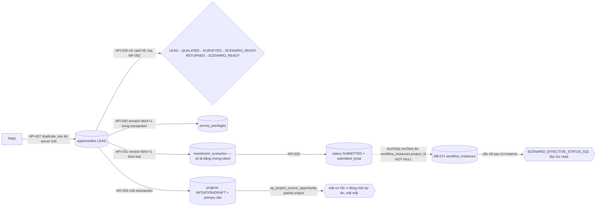

# ExecPlan — Opportunity pipeline US-025 (API-026…API-033, DB-014…DB-016)

> **Status:** Completed (API-026…API-033, đủ 8 operation); AC-121 Pass, AC-118/119/120 Partial, AC-117 Not covered
> **Owner:** Codex / Engineering
> **Created:** 2026-07-26
> **Updated:** 2026-07-26
> **Approval:** Product Owner trao toàn quyền quyết định và yêu cầu hoàn thành các yêu cầu trong story ngày 2026-07-26

## 1. Mục tiêu và kết quả người dùng

PMO quản trị pipeline cơ hội tiền-dự-án: tạo lead có kiểm soát trùng do **server** tính (API-027), đọc và lọc pipeline theo stage/khách hàng (API-026), mở chi tiết kèm khảo sát và kịch bản đầu tư (API-028), lái stage dọc các cạnh hợp lệ của WF-002 dưới optimistic concurrency (API-029), thêm revision khảo sát site (API-030) và version kịch bản đầu tư theo loại (API-031), nộp kịch bản để quyết định (API-032), và chuyển cơ hội đã được duyệt thành dự án thật (API-033).

Kết quả quan sát được quan trọng nhất: **hệ thống không tự bịa ra một con số tài chính nào, và không giả vờ rằng có một engine phê duyệt.** Server **không tính** NPV/IRR/capex/sản lượng — `DB-016` lưu nguyên bằng chứng client cung cấp kèm `formula_version`, vì chưa công thức nào được phê duyệt và AGENTS §3 cấm biến một giả định thành yêu cầu. Và `API-032` **không** khởi tạo workflow instance: `workflow_instances.project_id` là NOT NULL với FK vào `projects`, còn opportunity có trước project, nên engine `DB-071` **về cấu trúc** không chứa nổi một target tiền-dự-án. Nộp duyệt vì thế được ghi trên chính aggregate kèm cặp SoD, và hệ quả trung thực là **stage `APPROVED` không tới được qua API trong V1**.

Convert là chỗ duy nhất pipeline chạm vào dữ liệu thật, và nó idempotent ở **tầng cơ sở dữ liệu**: `projects.source_opportunity_id` với partial unique index khiến "một cơ hội trở thành hai dự án" là bất khả thi kể cả khi hai request chạy song song.

## 2. Nguồn và requirement IDs

- Business: `BR-002…BR-008` (theo trace `US-025` trong `docs/12`)
- Functional: `FR-001` (API-026…029), `FR-002` (API-030), `FR-004` (API-031), `FR-008` (API-032), `FR-009` (API-033) theo `x-related-requirements`; phạm vi story là `FR-001…FR-009`
- Use case/story/workflow: `UC-025`, `US-025`, `WF-002`
- Acceptance: `AC-121` đóng; `AC-118`, `AC-119`, `AC-120` một phần; `AC-117` out
- Tests: `TEST-121`; `TEST-118…TEST-120` một phần; `TEST-117` out
- API: `API-026…API-033` (8 operation, không thiếu và không dư)
- Data: `DB-014` Opportunity, `DB-015` SurveyPackage, `DB-016` InvestmentScenario; **sửa đổi có ghi nhận với `DB-010` Project** (`source_opportunity_id`) và **mở rộng từ vựng `DB-071`** (`ck_workflow_instance_object_type` nhận `InvestmentScenario`); `DB-011` Site, `DB-002` Company, `DB-005` UserAccount tham chiếu; `DB-098` audit, `DB-102` outbox, `DB-104` command receipt dùng lại
- Security: `SEC-107`, `SEC-108`, `SEC-109`, `SEC-111`, `SEC-118`, `SEC-120`

## 3. Hiện trạng repository trước khi bắt đầu

- `API-026…033` chỉ có contract thiết kế; không controller nào. Marker implemented ở đầu wave là 96/164.
- Không bảng nào của `DB-014…016` tồn tại. `projects` không có cột `source_opportunity_id`.
- `workflow_instances` (slice US-015) có `project_id uuid NOT NULL` với `fk_workflow_instance_project (tenant_id, project_id) → projects (tenant_id, id)`, và `WorkflowTarget.projectId` trong `workflow.service.ts` là `string` không nullable. `ck_workflow_instance_object_type` chưa có `InvestmentScenario`.
- `ProjectManagementService.createProject` (API-018) tồn tại nhưng `ProjectManagementModule` **không export gì**, và bản thân method mở `CommandReceiptService` transaction riêng của nó.
- Không operation nào trong catalog phê duyệt/từ chối một kịch bản đầu tư, và không operation nào import hóa đơn điện hay load profile — đây là ranh giới cứng của slice.
- Chuỗi migration của wave đã dùng tới `1783749000000` (policy 10) khi slice này bắt đầu; hai timestamp `1783750000000`/`1783751000000` để trống cho các slice song song.

## 4. Phạm vi

### In scope

- Tám operation trong module Nest `opportunity`: `GET /v1/opportunities`; `POST /v1/opportunities`; `GET /v1/opportunities/:opportunityId`; `PATCH /v1/opportunities/:opportunityId`; `POST /v1/opportunities/:opportunityId/survey-packages`; `POST /v1/opportunities/:opportunityId/investment-scenarios`; `POST /v1/investment-scenarios/:scenarioId:submit`; `POST /v1/opportunities/:opportunityId:convert`.
- Migration `1783752000000-CreateOpportunity.ts`: 3 bảng, partial unique `uq_opportunity_duplicate_key`, hai trigger bất biến, **ALTER `projects`** (`source_opportunity_id` + FK composite + `uq_project_source_opportunity`) và **ALTER `workflow_instances`** (mở rộng `ck_workflow_instance_object_type`).
- Migration `1783753000000-GrantOpportunityPermissions.ts` (`policyVersion = 12`, state-table `role_grant_reconcile_1783753000000`, 7 permission code).
- Domain thuần có unit test: `stage-transitions.ts` (máy trạng thái WF-002 mà PATCH được phép lái), `duplicate-key.ts` (danh tính trùng do server tính), `scenario-projection.ts` (projection trạng thái lúc đọc), `cursor.ts`.
- Enum `WorkflowObjectType.INVESTMENT_SCENARIO = 'InvestmentScenario'` trong `workflow.enums.ts`.

### Out of scope

- **Phê duyệt/từ chối kịch bản đầu tư.** Không operation nào trong catalog; và engine `DB-071` chưa chứa được target tiền-dự-án (§7a). Hệ quả: stage `APPROVED`/`RETURNED`/`REJECTED` không tới được qua API trong V1.
- **Nới `workflow_instances.project_id` thành nullable.** Đó là thay đổi ngữ nghĩa của `DB-071`, nằm ngoài phạm vi slice này và cần quyết định của Workflow Owner. Slice chỉ mở **từ vựng** object type, không đụng cấu trúc.
- **Import/OCR hóa đơn điện và load profile (`AC-117`).** Không operation, không bảng, không pipeline OCR. Không bịa dữ liệu thiếu.
- **Mọi phép tính tài chính/sản lượng phía server.** Không công thức nào được phê duyệt; xem quyết định (d).
- **Mô phỏng BESS trong pipeline (`AC-119` phần simulate).** `API-075` (slice engineering) là advisory và chạy trên envelope đã release của một plant có thật — không phải một kịch bản tiền-dự-án.
- **UI Vue.** Không route/view web nào trong slice này.

## 5. Assumption, TBD và Open Question

| Loại | Nội dung | Owner cần xác nhận | Điều kiện đóng | Tác động nếu chưa đóng |
|---|---|---|---|---|
| Open Question | Engine `DB-071` không chứa được target tiền-dự-án (`project_id` NOT NULL + `WorkflowTarget.projectId` non-nullable) | Workflow Owner / Product Owner | Nới `project_id` thành nullable **hoặc** cấp operation phê duyệt riêng cho scenario | `API-032` không tạo instance; stage `APPROVED` không tới được qua API; `AC-120`/`AC-121` chỉ đóng được phần trình bày, không có gate quyết định |
| Open Question | Không công thức tài chính/sản lượng nào được phê duyệt (NPV/IRR/payback/PR/degradation/losses) | Finance / Engineering / Product Owner | Chốt catalog công thức có version và điều kiện áp dụng | Server không tính gì; `formula_version` là chuỗi client khai, hệ thống chỉ giữ nguyên bằng chứng — an toàn nhưng chưa kiểm chứng được |
| Assumption | Danh tính trùng V1 là `sha256(lower(customerCompanyId) + '\|' + normalize(locationText))`, normalize = `lower(trim())` gộp khoảng trắng trong; NULL khi thiếu một trong hai phần | Product / BA | Chốt quy tắc trùng chính thức (thêm công suất? bán kính địa lý?) | Trùng theo cặp khách hàng + địa điểm; hai cơ hội cùng khách khác cách viết địa chỉ vẫn bị bắt, nhưng trùng theo tọa độ/công suất thì không |
| Assumption | Reach của opportunity **hẹp hơn mọi module khác**: chỉ assignment scope `TENANT` mới với tới; project/portfolio/package scope không cấp gì | Security / Product | Xác nhận policy ABAC cho bản ghi tiền-dự-án | Không có project để so khớp; nếu policy thật rộng hơn thì phải nới có chủ đích, không âm thầm |
| TBD | `AC-117` cần chuẩn hóa kỳ/tariff period/unit/timezone và kiểm gap/outlier cho hóa đơn–load profile | Product / Data Owner | Cấp `API-*`/`DB-*` cho hồ sơ phụ tải | Không có đầu vào đo được cho kịch bản; mọi số vẫn là bằng chứng client khai |
| Open Question (doc-correction) | Lệch FR ở tầng operation: OpenAPI gán `API-031 → FR-004` (PRD `FR-004` là "bức xạ/PVSyst/dự báo sản lượng", `FR-005`/`FR-006`/`FR-007` mới là sizing Solar/BESS/mô hình tài chính) và `API-032 → FR-008` | BA / API Owner | Entry đính chính `docs/03` hoặc `docs/08` | Cùng họ lệch đã ghi ở slice contract-cost. Slice trace theo hợp đồng OpenAPI hiện hành và không tự sửa tài liệu ngoài quyền sở hữu |
| Open Question | Không có đường đọc riêng cho survey package/scenario ngoài embed của `API-028`; không có xóa/hủy cơ hội | Product / API Owner | Cấp operation đọc/hủy mới nếu cần | UI chỉ dựng được từ hai đường đọc; so sánh kịch bản của `AC-121` phải đi qua `API-028` |

## 6. Thiết kế

**Điểm dừng trung thực của `API-032`.** Engine phê duyệt là `DB-069…072`; `workflow_instances.project_id` là NOT NULL và FK-bound tới `projects`, còn `WorkflowTarget.projectId` là `string` không nullable. Một kịch bản đầu tư thuộc về một cơ hội **chưa có dự án**, nên không giá trị nào hợp lệ cho cột đó. Slice **không** nới cột (đó là ngữ nghĩa của `DB-071`, xem §4) và **không** bịa một project giả để lấp chỗ. `API-032` vì thế ghi nộp duyệt trên chính aggregate: `status → SUBMITTED` cùng cặp SoD `submitted_by`/`submitted_at`, `workflow_instance_id` để NULL, và opportunity chuyển sang `SUBMITTED`. Hai thứ đã đặt sẵn cho ngày engine chứa được target tiền-dự-án: từ vựng `WorkflowObjectType.INVESTMENT_SCENARIO` + CHECK đã mở rộng, và projection đọc `SCENARIO_EFFECTIVE_STATUS_SQL` — khi có instance thì trạng thái instance **là** trạng thái kịch bản, không lưu trùng ở hai nơi.

**Convert.** `API-033` tạo dự án **qua đúng các invariant insert của project-master (`API-018`)**: master ref kiểm trong tenant, dự án sinh ra `INITIATION`/`DRAFT` với một primary site bắt buộc, cùng trim/default, cùng sự kiện `PROJECT_CREATED` cho audit/outbox. Lý do không gọi lại `ProjectManagementService.createProject` được ghi thẳng trong service: module của nó không export gì, và method mở `CommandReceipt` transaction riêng — lồng vào sẽ tiêu thụ receipt idempotency thứ hai và cắt convert thành hai transaction, đánh mất tính nguyên tử giữa insert dự án và lật cờ cơ hội.

Idempotency của convert neo ở **tầng DB**: lock hàng cơ hội serialize các request đua nhau, gọi lại trả về đúng dự án cũ (`alreadyConverted: true` — ngữ nghĩa 200-equivalent trong phong bì 201), và `uq_project_source_opportunity` `(tenant_id, source_opportunity_id) WHERE source_opportunity_id IS NOT NULL` là chốt chặn cấu trúc nếu có gì đi vòng qua lock.

**Tenancy và reach.** Mọi FK composite mang `tenant_id`. Opportunity là bản ghi **tiền-dự-án tenant-level**, nên reach hẹp hơn mọi module khác có chủ ý: chỉ assignment scope `TENANT` giữ quyền mới với tới; project/portfolio/package scope không cấp gì vì không có dự án để so khớp. Ngoài tầm với trả **404 (hoặc trang rỗng cho danh sách)**, không bao giờ 403 — 403 chỉ dành cho người thiếu hẳn permission code.

**Số không bao giờ chạm JS number.** Công suất, capex, NPV, IRR đi qua service dưới dạng chuỗi vào Postgres `numeric(19,4)` (tỷ lệ là `numeric(9,6)`). Server không cộng, không quy đổi, không suy diễn một chỉ tiêu nào.

**Bất biến bằng trigger.** `trg_survey_package_history` (khảo sát APPROVED đóng băng), `trg_investment_scenario_history` (kịch bản APPROVED đóng băng, tính toàn vẹn của cặp nộp duyệt là cấu trúc chứ không phải quy ước).

## 7. Quyết định thiết kế đã chốt

| Quyết định | Lý do |
|---|---|
| (a) **`API-032` không khởi tạo workflow instance**; nộp duyệt ghi trên aggregate kèm cặp SoD, `workflow_instance_id` để NULL | `workflow_instances.project_id` NOT NULL + `WorkflowTarget.projectId` non-nullable ⇒ engine về cấu trúc không chứa được target tiền-dự-án. Bịa một project giả để lấp cột sẽ tạo dữ liệu rác; nới cột là thay đổi ngữ nghĩa `DB-071` ngoài phạm vi slice. **Hệ quả có ghi nhận: stage `APPROVED` không tới được qua API trong V1** |
| (b) Mở rộng `ck_workflow_instance_object_type` nhận `InvestmentScenario` **ngay bây giờ**, dù chưa instance nào tồn tại | Từ vựng là thứ rẻ để chuẩn bị và đắt để retrofit; mở rộng CHECK không cấp thêm khả năng nào cho ai vì không đường nào tạo instance như vậy. `down()` thu lại chính xác |
| (c) `API-033` **sao lại** invariant insert của project-master thay vì lồng `ProjectManagementService.createProject` | Module đó không export gì, và method mở `CommandReceipt` transaction riêng — lồng vào sẽ tiêu thụ receipt thứ hai và mất tính nguyên tử của convert. Sao lại có chi phí trùng lặp, nhưng nó giữ được đúng một transaction cho một quyết định nghiệp vụ |
| (d) **Server không tính chỉ tiêu tài chính/sản lượng nào**; `DB-016` lưu nguyên `inputSnapshot`/`outputSnapshot` client khai kèm `formula_version` | Chưa công thức nào được phê duyệt. Tính bằng một công thức chưa duyệt rồi trình bày như kết quả hệ thống là bịa dữ liệu (AGENTS §3). Lưu bằng chứng chưa kiểm chứng là an toàn; cưỡng chế một công thức sai thì không |
| (e) Kiểm trùng do **server** tính bằng `duplicate_key` + partial unique index, không phải cảnh báo phía client | Client-side check là gợi ý, không phải kiểm soát. Partial unique biến va chạm thành 409 `DUPLICATE_OPPORTUNITY` zero-write kể cả khi hai request chạy song song |
| (f) `PATCH` (`API-029`) chỉ lái được **cạnh kề tiến tới** của WF-002 + cạnh làm lại `RETURNED → SCENARIO_READY`; `SUBMITTED` thuộc API-032, `CONVERTED` thuộc API-033, `APPROVED/RETURNED/REJECTED` thuộc quyết định phê duyệt | Nếu PATCH lái được mọi stage thì máy trạng thái chỉ là trang trí. Máy trạng thái nằm trong `stage-transitions.ts` dưới dạng dữ liệu nên unit-test được |
| (g) `API-031` chỉ nhận kịch bản mới ở stage `SURVEYED`/`SCENARIO_READY`/`RETURNED` | Thêm bằng chứng dưới một quyết định đang treo (`SUBMITTED`) hoặc đã đóng (`APPROVED`/`REJECTED`/`CONVERTED`) sẽ âm thầm kéo lùi pipeline |
| (h) `opportunities.site_id` **không có FK** | `sites` (`DB-011`) là project-scoped và chưa có dự án nào trước khi convert. Một FK không thể trỏ vào bảng mà bản ghi cha còn chưa tồn tại; cột giữ nguyên như tham chiếu mềm có ghi nhận |
| (i) Convert chấp nhận **hai đường**: stage `APPROVED`, hoặc tồn tại một kịch bản `APPROVED` dưới projection đọc | Vì (a) làm stage `APPROVED` không tới được qua API, đường thứ hai giữ cho `API-033` kiểm chứng được ngay khi engine bắt đầu chứa được scenario — và test dựng trạng thái quyết định ngoài bề mặt API để chứng minh cả hai nhánh |

## 8. Milestone

### M1 — Schema, hai ALTER và migration

- [x] `1783752000000`: `opportunities`/`survey_packages`/`investment_scenarios` theo thứ tự phụ thuộc; `uq_opportunity_duplicate_key` partial unique; index pipeline/customer; hai trigger bất biến.
- [x] ALTER `projects`: `source_opportunity_id uuid`, `fk_project_source_opportunity (tenant_id, source_opportunity_id)`, `uq_project_source_opportunity` partial unique. ALTER `workflow_instances`: `ck_workflow_instance_object_type` mở rộng đúng một giá trị.
- [x] Ba file entity (`opportunity.entity.ts`, `survey-package.entity.ts`, `investment-scenario.entity.ts`) + `opportunity.enums.ts` khớp một-một với DDL.
- [x] `1783753000000`: 7 permission code, policy 12. PMO sở hữu pipeline đầu-cuối; PROJECT_MANAGER đóng góp khảo sát/kịch bản và đọc pipeline nhưng **không** tạo/lái stage/convert; EXECUTIVE read-only. PACKAGE_OWNER/PROJECT_CONTROLS/TENANT_ADMIN **không nhận gì** — deny-by-default theo `docs/09`. **Không cấp code approve nào** "để dùng sau".

**Exit criteria:** up/down/up sạch, kể cả hai ALTER; CHECK object type quay về đúng tập cũ khi `down()`; tham chiếu xuyên tenant bất khả thi ở DDL.

### M2 — Service, controller và domain thuần

- [x] `opportunity.service.ts` 8 operation trên `CommandReceiptService`/`OutboxService`/`PermissionService`; `API-032` không đụng engine và có comment nêu rõ đường không đi; `API-033` một transaction + `alreadyConverted`.
- [x] Domain thuần có unit test: `stage-transitions` (6), `duplicate-key` (6), `cursor` (3); `scenario-projection` là SQL dùng chung cho `API-028` và điều kiện convert.
- [x] Keyset pagination so sánh theo hàng với giá trị đã lưu của hàng biên (không dùng cursor ISO đã bị cắt cụt xuống millisecond).

**Exit criteria:** mọi nhánh 4xx ghi zero hàng; ngoài tầm với là 404/trang rỗng; convert gọi lại trả đúng dự án cũ và không bao giờ sinh dự án thứ hai.

### M3 — Bằng chứng

- [x] `opportunity.integration-spec.ts` 10 test HTTP; `opportunity-migration.integration-spec.ts` 7 test ràng buộc DB.

**Exit criteria:** mỗi điểm dừng có chủ ý ở §7 có ít nhất một test nói rõ nó là điểm dừng, không phải lỗi.

## 9. Phạm vi acceptance

Một AC đóng trọn, ba Partial, một Not covered. Mọi giới hạn đều quy về hai chỗ: chưa có công thức được phê duyệt, và engine chưa chứa được target tiền-dự-án.

| AC | Trạng thái | Bằng chứng và giới hạn |
|---|---|---|
| `AC-117` | **Not covered** | Không operation nào trong catalog 164 import hóa đơn điện hay load profile; không bảng nào cho hồ sơ phụ tải; không OCR. Chuẩn hóa kỳ/tariff period/unit/timezone và kiểm gap/outlier vì thế chưa có nơi để chạy. Điểm dừng có chủ ý — bịa dữ liệu thiếu bị AGENTS §3 cấm tuyệt đối. |
| `AC-118` | **Partial** | Kịch bản Solar có version theo `(opportunity, scenarioType)`, đầu vào (diện tích, bức xạ, công suất, losses, degradation) lưu nguyên trong `inputSnapshot` với `numeric(19,4)`/`numeric(9,6)`, và kịch bản `APPROVED` bị trigger đóng băng. **Hệ thống không tính sản lượng/self-consumption/export**: các số đó là `outputSnapshot` do client cung cấp kèm `formula_version`, vì chưa công thức nào được phê duyệt. Curtailment/assumption ghi được nhưng không được kiểm chứng. |
| `AC-119` | **Partial** | Kịch bản BESS lưu kW/kWh/SOC/efficiency/reserve/limit/use case theo cùng cơ chế version và bất biến. **Không mô phỏng peak shaving/load shifting/backup trong pipeline**, và **không kiểm tra "cấm sạc–xả đồng thời"** ở đây: `API-075` (slice engineering) là advisory, stateless và chạy trên operating envelope đã release của một plant có thật — không phải một kịch bản tiền-dự-án. |
| `AC-120` | **Partial** | CAPEX/OPEX/tariff/tax/discount/financing lưu được kèm `currency` và `formula_version`, giữ nguyên bằng chứng, không bao giờ cộng chéo currency. **Hệ thống không tính revenue/saving/cash flow/NPV/IRR/payback/sensitivity** — cả bốn chỉ tiêu là số client khai. "Công thức, unit, currency, tỷ giá và policy version truy được" chỉ đóng được phần *ghi lại*: không catalog công thức nào tồn tại để truy vết tới. |
| `AC-121` | **Pass** | `API-028` trình bày kỹ thuật–tài chính–rủi ro của mọi kịch bản trên cùng một basis bằng **một** SQL join: mỗi hàng mang `scenarioType` + `version` + `formulaVersion` + `currency` riêng, và trạng thái là `SCENARIO_EFFECTIVE_STATUS_SQL` — trạng thái instance (khi có) thay cho trạng thái lưu, đồng thời `storedStatus` vẫn hiện bên cạnh nên hai nguồn không bao giờ bị lẫn. Tách measured/derived/assumed được giữ bằng cấu trúc `inputSnapshot`/`outputSnapshot` + `formulaVersion`; "so sánh tráo version" bất khả thi vì version là khóa unique theo loại và nội dung `APPROVED` bị trigger đóng băng. |

## 10. Kiểm thử

| Loại | Command | IDs | Kết quả |
|---|---|---|---|
| Lint | `npm run lint` | NFR-024 | Pass, 0 warning |
| Type-check | `npm run typecheck` | NFR-024 | Pass trên api/web/worker |
| Unit | `npm run test:unit` | NFR-024 | API 250 Pass / 36 suite (opportunity góp 15: stage-transitions 6, duplicate-key 6, cursor 3); Web 178; Worker 74 |
| Integration (cổng do lead chạy) | `npm run test:integration` | TEST-118…121 một phần | API **278/278 trên 28 suite** — opportunity góp **17**: HTTP 10 + migration 7; Worker 11/11 |
| Contract | `npm run openapi:lint` | NFR-024 | Pass với **138/164** marker implemented |
| Build | `npm run build` | NFR-024 | Pass |

Điểm phủ đáng giá nhất của slice:

- **Điểm dừng của `API-032` được test khẳng định là điểm dừng:** test `API-032: submits on the aggregate (SoD fields), no engine instance` kiểm rằng nộp duyệt ghi cặp SoD trên aggregate và **không** hàng `workflow_instances` nào được tạo — nếu ai đó về sau lặng lẽ đấu engine vào, test này đổ.
- **Convert idempotent ở tầng DB:** test convert đúng một cơ hội `APPROVED`, gọi lại trả nguyên dự án cũ, và khẳng định **chỉ tồn tại đúng một dự án**; test migration riêng chứng minh `uq_project_source_opportunity` chặn hàng thứ hai bằng SQL tay.
- **Hai đường convert:** một test đi qua stage `APPROVED`, một test đi qua projection kịch bản `APPROVED` — vì (a) làm đường thứ nhất không tới được qua API.
- **Từ vựng CHECK:** test khẳng định `ck_workflow_instance_object_type` mở rộng đúng `InvestmentScenario` **và không gì khác**, rồi thu lại đúng khi `down()`.
- **Reach tiền-dự-án:** test giữ **403 cho thiếu quyền** và **404/trang rỗng cho ngoài tầm với** — hai lỗi khác nhau không bị trộn thành một.
- **Bất biến:** khảo sát và kịch bản `APPROVED` bị SQL tay UPDATE đều bị trigger từ chối; revision khảo sát unique theo cơ hội.
- **Tiền là chuỗi:** test khẳng định giá trị `numeric` đi ra dưới dạng text đúng như đã ghi, không qua float.
- **Idempotency trio:** replay cùng key phát lại nguyên trạng; cùng key khác nội dung 409; thiếu key 400 — tất cả zero-write.

Chưa chạy trong slice này: E2E Playwright (không có UI opportunity); deploy EC2 test ghi nhận theo release kế tiếp.

## 11. Migration, rollout và rollback

- `1783752000000-CreateOpportunity.ts`: 3 bảng + 2 trigger + ALTER `projects` + ALTER `workflow_instances`. `down()` khôi phục `ck_workflow_instance_object_type` về tập cũ, drop `uq_project_source_opportunity`, drop FK và cột `source_opportunity_id`, rồi drop 3 bảng theo thứ tự ngược. Up/down/up có test, bao gồm round-trip của cả hai ALTER.
- `1783753000000-GrantOpportunityPermissions.ts`: state-table `role_grant_reconcile_1783753000000`; `down()` chỉ lấy lại đúng 7 code nó thêm (`opportunity.read/create/update/convert`, `survey.create`, `scenario.create`, `scenario.submit`). `policy_version = 12` — mốc cao nhất của chuỗi wave; mọi ghi dùng `GREATEST` nên kết quả là cực đại của chuỗi bất kể thứ tự merge với các slice song song (9/10/11).
- Assertion role exact-match trong `risk-change-migration.integration-spec.ts` mở rộng thêm `opportunity.read` cho `EXECUTIVE`; `TENANT_ADMIN` **không** nhận gì từ slice này và assertion khẳng định điều đó.
- **Rủi ro rollback:** nếu đã có dự án được convert, `down()` sẽ drop `source_opportunity_id` và mất liên kết nguồn (bản thân dự án vẫn còn). Thứ tự an toàn là forward-fix trên môi trường có dữ liệu. Trước slice này không có cơ hội nào trong hệ thống nên rollback ngay sau triển khai không mất dữ liệu nghiệp vụ.
- Không backfill: `projects.source_opportunity_id` sinh ra NULL cho mọi dự án hiện hữu, đúng ngữ nghĩa "dự án này không đến từ một cơ hội".

## 12. Rủi ro

| Rủi ro | Xác suất/tác động | Tín hiệu | Giảm thiểu | Owner |
|---|---|---|---|---|
| "8/8 operation" bị hiểu là US-025 xong | Cao / Cao | Backlog/changelog ghi Done | `AC-117` Not covered và `AC-118/119/120` Partial ghi ở mọi artefact; §9 nêu rõ server không tính gì | BA/PO |
| Số client khai bị đọc như kết quả hệ thống tính | Cao / Cao | Report/dashboard trình bày NPV/IRR không kèm nguồn | `formula_version` bắt buộc trên mọi kịch bản; `outputSnapshot` tách khỏi `inputSnapshot`; quyết định (d) ghi ở §7 và trong comment service | Finance/Product |
| Điểm dừng `API-032` bị "sửa" bằng cách bịa `project_id` giả | Trung bình / Rất cao | Xuất hiện instance có `project_id` trỏ tới dự án placeholder | Test khẳng định không instance nào được tạo; comment service nêu rõ; nới cột là quyết định của Workflow Owner ở §5 | Workflow Owner |
| Quy tắc trùng (Assumption) bị coi là đã duyệt | Trung bình / Trung bình | Nghiệp vụ dựa vào nó để chặn trùng thật | Assumption ghi ở §5 và trong comment `duplicate-key.ts`; đổi quy tắc cần migration tính lại `duplicate_key` | Product/BA |
| Reach hẹp (chỉ TENANT scope) bị coi là lỗi phân quyền | Trung bình / Thấp | Người dùng project-scope báo "không thấy gì" | Assumption ghi ở §5 và comment service; 403 và 404 được tách rõ nên chẩn đoán được | Security |
| Convert chạy song song sinh hai dự án | Đã loại bỏ | — | Lock hàng cơ hội + `uq_project_source_opportunity` partial unique; test migration chứng minh bằng SQL tay | — |

## 13. Kết quả và bàn giao

- Outcome: đủ 8 operation `API-026…033` chạy end-to-end với 10 test HTTP + 7 test ràng buộc DB; 3 bảng `DB-014…016` materialize; `DB-010` nhận một sửa đổi có ghi nhận biến convert thành idempotent ở tầng DB; `DB-071` nhận từ vựng `InvestmentScenario`; 1 AC Pass, 3 Partial, 1 Not covered.
- **Bàn giao xuyên domain:** `opportunities (tenant_id, id)` và `projects.source_opportunity_id` cho phép mọi báo cáo về sau truy ngược một dự án về cơ hội sinh ra nó; `WorkflowObjectType.INVESTMENT_SCENARIO` + CHECK đã mở rộng là chỗ chờ sẵn cho ngày engine chứa được target tiền-dự-án — khi đó chỉ cần đăng ký resolver, không cần migration.
- File tạo: `apps/api/src/modules/opportunity/**` (controller/service/module/dto + domain `cursor`/`duplicate-key`/`scenario-projection`/`stage-transitions`), `opportunity.entity.ts`, `survey-package.entity.ts`, `investment-scenario.entity.ts`, `opportunity.enums.ts`, migration `1783752000000`/`1783753000000`, `opportunity.integration-spec.ts`, `opportunity-migration.integration-spec.ts`, 3 unit spec opportunity.
- File sửa: `app.module.ts`, `data-source.ts`, `entities/index.ts`, `workflow.enums.ts` (thêm `INVESTMENT_SCENARIO`), `project-master.seed.ts` (permission catalog), `risk-change-migration.integration-spec.ts`, `docs/openapi/openapi.yaml` (marker), `docs/12`, `docs/15`, `docs/CHANGELOG.md`, ExecPlan này.
- Còn lại: toàn bộ Out of scope §4 và mọi mục §5 — engine chứa target tiền-dự-án, catalog công thức tài chính, hồ sơ phụ tải cho `AC-117`, quy tắc trùng chính thức, đính chính FR ở tầng operation, các đường đọc còn thiếu. Mỗi mục có owner.
- Deploy EC2 test và bằng chứng CI/CD ghi nhận theo release kế tiếp.
