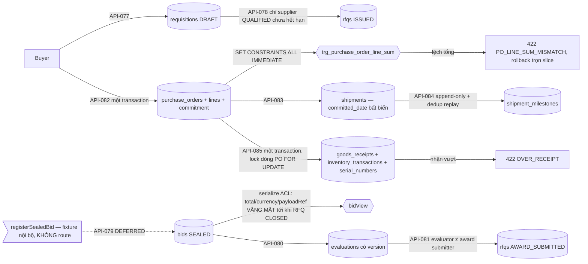

# ExecPlan — Procurement & Logistics (nửa procurement của US-008)

> **Status:** Completed (API-076…078, API-080…085); **API-079 DEFERRED**; AC-033/034/035 Partial, AC-036/037 Not covered
> **Owner:** Codex / Engineering
> **Created:** 2026-07-26
> **Updated:** 2026-07-26
> **Approval:** Product Owner trao toàn quyền quyết định và yêu cầu hoàn thành các yêu cầu trong story ngày 2026-07-26

## 1. Mục tiêu và kết quả người dùng

Buyer đọc danh mục nhà cung cấp đã thẩm định theo tenant (API-076), lập requisition gắn gói thầu/WBS/cost code của dự án (API-077), phát hành RFQ chỉ tới nhà cung cấp còn hiệu lực (API-078), ghi đánh giá kỹ thuật/thương mại có version (API-080) và nộp quyết định trao thầu dưới ràng buộc SoD (API-081). Từ đó phát hành purchase order kèm dòng và commitment trong đúng một transaction (API-082), lập shipment (API-083), nối dòng milestone vận chuyển (API-084) và nhận hàng tại site kèm ledger tồn kho + serial (API-085).

Kết quả quan sát được quan trọng nhất: **một PO lệch tổng dòng, một lần nhận vượt số lượng đặt, hay một bid bị đọc trước khi RFQ đóng là bất khả thi — không phải vì service kiểm, mà vì cơ sở dữ liệu và tầng serialize không cho phép.** Tổng dòng PO được canh bằng constraint trigger `DEFERRABLE` bị buộc chạy ngay trong transaction; nhận vượt bị từ chối sau khi khóa dòng PO `FOR UPDATE`; bid niêm phong không có khóa `total`/`currency`/`payloadRef` trong response — các khóa **vắng mặt**, không phải null. Tiền và số lượng không bao giờ chạm JS number: `numeric(19,4)` đi qua service dưới dạng chuỗi, mọi phép cộng và so sánh chạy trong Postgres `numeric`.

Slice này cũng đóng mối nối mà Contract & Cost đã **cố ý hoãn**: `commitments.purchase_order_id` nay tồn tại với FK thật và `ck_commitment_source_type` mở rộng thêm `PURCHASE_ORDER`.

## 2. Nguồn và requirement IDs

- Business: `BR-015`, `BR-016`, `BR-017` (theo trace `US-008` trong `docs/12`)
- Functional: `FR-061…FR-071` theo `x-related-requirements` của từng operation (`FR-068` không có operation nào phục vụ — đối chiếu BOM–requisition–PO–hàng nhận, xem §5)
- Use case/story/workflow: `UC-008`, `US-008` (nửa procurement), `WF-010…WF-013`
- Acceptance: `AC-033`, `AC-034`, `AC-035` một phần; `AC-036`, `AC-037` out
- Tests: `TEST-033…TEST-035` một phần; `TEST-036`, `TEST-037` out
- API: `API-076`, `API-077`, `API-078`, `API-080`, `API-081`, `API-082`, `API-083`, `API-084`, `API-085` — **9 operation**; **`API-079` DEFERRED**
- Data: `DB-044` SupplierProfile, `DB-045` Requisition, `DB-046` RFQ, `DB-047` Bid, `DB-048` Evaluation, `DB-049` PurchaseOrder, `DB-050` PurchaseOrderLine, `DB-051` Shipment, `DB-052` GoodsReceipt, `DB-053` InventoryTransaction, `DB-054` SerialNumber (11 bảng) + bảng con `shipment_milestones` **không cấp ID mới**; sửa đổi `DB-036` Commitment; `DB-035` tham chiếu; `DB-098` audit, `DB-102` outbox, `DB-104` command receipt dùng lại
- Security: `SEC-107`, `SEC-108`, `SEC-111`, `SEC-114`, `SEC-118`, `SEC-125`, `SEC-130`

## 3. Hiện trạng repository trước khi bắt đầu

- `API-076…085` chỉ có contract thiết kế trong `docs/openapi/openapi.yaml`; không controller nào. Marker implemented ở đầu wave là 96/164.
- Không bảng nào của `DB-044…054` tồn tại. Chuỗi migration kết thúc ở `1783745000000` với `policy_version = 8`.
- `commitments` (slice contract-cost) có `ck_commitment_source_type CHECK (source_type IN ('CONTRACT','CONTRACT_APPENDIX'))` và `ck_commitment_contract_presence`; cột `purchase_order_id` **cố ý vắng** (quyết định (h) của ExecPlan `2026-07-26-contract-cost-us006-us007.md`), chờ Procurement materialize `DB-049`.
- Slice engineering đã cấp `uq_sites_tenant_project_id` và `uq_wbs_nodes_tenant_project_id` `(tenant_id, project_id, id)`; không có hai constraint đó thì FK "pin site/WBS vào đúng dự án" của requisition và goods receipt không tạo được.
- `PermissionService.accessScopeSets`, `CommandReceiptService`, `OutboxService` và `canonicalHash` có sẵn.
- Không operation nào trong catalog tạo supplier profile, duyệt requisition, hay đóng RFQ bằng lệnh riêng — đây là ranh giới cứng của slice.
- Không có principal nhà cung cấp bên ngoài trong mô hình identity: `user_accounts` là người dùng nội bộ theo tenant, không có kiểu principal `Supplier`.

## 4. Phạm vi

### In scope

- Chín operation trong module Nest `procurement-logistics`: `GET /v1/suppliers`; `POST /v1/projects/:projectId/requisitions`; `POST /v1/requisitions/:requisitionId/rfqs`; `POST /v1/bids/:bidId/evaluations`; `POST /v1/rfqs/:rfqId:submit-award`; `POST /v1/projects/:projectId/purchase-orders`; `POST /v1/purchase-orders/:purchaseOrderId/shipments`; `POST /v1/shipments/:shipmentId/milestones`; `POST /v1/purchase-orders/:purchaseOrderId/goods-receipts`.
- Migration `1783748000000-CreateProcurementLogistics.ts`: 12 bảng (11 mang DB ID + `shipment_milestones`), tám họ trigger bất biến, hai constraint trigger tổng dòng PO, và **ALTER `commitments`** (thêm `purchase_order_id` + FK composite, mở rộng `ck_commitment_source_type`, viết lại `ck_commitment_contract_presence` thành cặp nguồn ↔ id).
- Migration `1783749000000-GrantProcurementPermissions.ts` (`policyVersion = 10`, state-table `role_grant_reconcile_1783749000000`, 9 permission code).
- Domain thuần có unit test: `serial-number.ts` (chuẩn hóa serial), `milestone-policy.ts` (thứ tự milestone + suy diễn trạng thái shipment), `cursor.ts`.
- Seed: bộ supplier demo QUALIFIED (company + legal entity + profile) idempotent theo natural key.

### Out of scope

- **`API-079` nộp bid của nhà cung cấp — DEFERRED có chủ ý.** Operation cần một principal nhà cung cấp bên ngoài; mô hình identity chưa có kiểu principal đó và `docs/09` chưa phê duyệt auth profile cho bên ngoài. **Không stub, không route.** Bid chỉ sinh ra qua `registerSealedBid` — đường fixture nội bộ của service, không gắn route, không có mô hình quyền riêng — để API-080/081 vẫn kiểm chứng được.
- **Tạo/thẩm định supplier profile qua API.** Không operation nào trong catalog ghi `DB-044`; bootstrap bằng seed (quyết định d).
- **Duyệt requisition, đóng RFQ, phê duyệt PO như một bước riêng.** Không operation nào tồn tại; requisition sinh ra DRAFT, RFQ và PO sinh thẳng ISSUED.
- **Cảnh báo giao trễ (`AC-036`).** Allowlist `ck_notification_source_type` của `DB-105` không có nguồn procurement nào; slice cross-cutting cùng wave chỉ mở thêm đúng `WorkflowInstance`. Không thêm nguồn sự kiện mới ở đây.
- **Portal nhà cung cấp (`AC-037`).** Cùng lý do identity với API-079.
- **Đối chiếu BOM ↔ PO ↔ hàng nhận (`FR-068`).** Không operation nào phục vụ; `snapshot_hash` của BOM RELEASED (slice engineering) là dữ liệu chờ sẵn, không phải tính năng đã chạy.
- **UI Vue.** Không route/view web nào trong slice này.

## 5. Assumption, TBD và Open Question

| Loại | Nội dung | Owner cần xác nhận | Điều kiện đóng | Tác động nếu chưa đóng |
|---|---|---|---|---|
| Open Question | Mô hình principal nhà cung cấp bên ngoài (identity, auth profile, ACL portal) | Product Owner / Security | Phê duyệt auth profile bên ngoài + cấp scope cho `bid.submit` | `API-079` DEFERRED; `AC-037` và phần "clarification/addendum cho mọi bidder" của `AC-033` không đóng được; bid chỉ dựng được bằng fixture nội bộ |
| Assumption | Unique serial theo `(tenant_id, equipment_model_id, normalized_serial)` với `normalized_serial = upper(btrim(serial_no))` | Data Owner / Product | Chốt phạm vi unique trong dictionary `DB-054` | Dictionary `DB-054` ghi "UQ policy TBD"; slice chọn phạm vi hẹp nhất còn có nghĩa và canh bằng `ck_serial_number_normalized` để API và schema không thể bất đồng về "cùng một serial" |
| Assumption | Supplier demo trong seed là dữ liệu demo, không phải nhà cung cấp thật; create-if-missing theo natural key `code = 'DEMO_SUPPLIER'` | Product / Data | Khi có operation tạo/thẩm định supplier, seed demo thu hẹp | API-076/078 không có dữ liệu nếu không seed; môi trường demo phụ thuộc seed |
| TBD | Chính sách cảnh báo giao trễ (`AC-036`): ngưỡng, người nhận, quan hệ với đường găng | Product / Notification Owner | Mở allowlist `DB-105` cho nguồn Shipment/PurchaseOrder kèm quy tắc due/priority | Trễ chỉ nhìn thấy khi đọc trạng thái shipment; không có thông báo chủ động |
| Open Question | `FR-068` (đối chiếu BOM–requisition–PO–hàng nhận) không có operation nào trong catalog 164 | Product Owner | Cấp `API-*` mới có trace | Dữ liệu đủ để đối chiếu (`bom_lines`, `purchase_order_lines`, `goods_receipts`) nhưng không đường đọc nào ghép chúng lại |
| Open Question (doc-correction) | Lệch FR ở tầng operation giữa `docs/03` và `docs/08`: OpenAPI gán `API-076 → FR-061` (PRD `FR-061` là "danh mục vật tư/yêu cầu mua", `FR-064` mới là "phê duyệt nhà cung cấp"); `API-077 → FR-062` (PRD `FR-062` là RFQ); `API-080 → FR-065`; `API-082 → FR-067`; `API-083 → FR-069` | BA / API Owner | Entry đính chính `docs/03` hoặc `docs/08` | Cùng họ lệch đã ghi ở slice contract-cost. Slice này trace theo hợp đồng OpenAPI hiện hành và **không** tự sửa tài liệu ngoài quyền sở hữu |
| Open Question | Không có đường đọc riêng cho requisition/RFQ/bid/PO/shipment/goods receipt (chỉ `API-076` là GET) | Product / API Owner | Cấp operation đọc mới nếu cần | Không dựng được register UI; tracker của `AC-035` chỉ tồn tại dưới dạng dữ liệu, không có bề mặt đọc |

## 6. Thiết kế

**Tenancy và scope.** Mọi khóa ngoại là composite mang `tenant_id`, nên tham chiếu xuyên tenant bất khả thi ở DDL. Requisition/RFQ/PO là project-level: principal chỉ giữ package không với tới, và ngoài scope trả **404 chứ không 403**, đúng tiền lệ risk-change/document-control/contract-cost/engineering. Ngoại lệ duy nhất có chủ ý là `API-085`: goods receipt còn nhận principal scope-package khi package đó nằm trong dự án của PO — đúng `x-data-scope` của operation, vì PACKAGE_OWNER là vai giữ `goodsReceipt.create`. Route đối tượng (requisition/bid/RFQ/PO/shipment) chỉ được guard pre-filter ở mức quyền; ABAC thật giải trong service từ chính hàng sở hữu bản ghi.

**Bid niêm phong là ACL ở tầng serialize, không phải cột ẩn.** `bidView(row, rfqStatus)` chỉ ghép `total`/`currency`/`payloadRef` vào object khi RFQ đã đạt trạng thái cho phép; trước đó ba khóa **vắng mặt hoàn toàn** khỏi JSON — không phải null, nên không consumer nào suy ra được rằng có giá trị tồn tại. `API-080` từ chối luôn việc đánh giá khi RFQ chưa CLOSED (422 `BID_ACCESS_DENIED`): không ai đánh giá một bid còn niêm phong.

**Tổng dòng PO là bất biến của cơ sở dữ liệu.** `enforce_purchase_order_line_sum` chạy dưới hai constraint trigger `DEFERRABLE INITIALLY DEFERRED` — `trg_purchase_order_line_sum` trên `purchase_order_lines` và `trg_purchase_order_sum_mirror` trên `purchase_orders` (để sửa `total` cũng không âm thầm phá breakdown). Service ép chúng chạy ngay bằng `SET CONSTRAINTS ALL IMMEDIATE` nên lỗi hiện thành 422 `PO_LINE_SUM_MISMATCH` có tên, và PO + lines + commitment rollback cùng nhau thay vì nổ vô danh lúc COMMIT.

**Nhận hàng.** `API-085` khóa dòng PO `FOR UPDATE` rồi để Postgres cộng `numeric`: đã-nhận + đang-nhận > đã-đặt thì cả lệnh bị từ chối (422 `OVER_RECEIPT`). Điều kiện khác `GOOD` đưa receipt sang QUARANTINED và sinh thêm dòng ledger `QUARANTINE_IN`. Serial trùng là 409 `SERIAL_CONFLICT` trên `uq_serial_number_scope`.

**Bất biến bằng trigger.** `trg_supplier_profile_history` (profile hết hạn chứ không bị xóa), `trg_rfq_history` (cột thương mại của RFQ đã ISSUED đóng băng, chỉ đi tới theo chuỗi trạng thái), `trg_evaluation_history` (đóng băng khi award đã nộp), `trg_purchase_order_history` + `trg_purchase_order_line_history` (PO ISSUED và dòng của nó đóng băng), `trg_shipment_committed_date` (`committed_date` bất biến trong khi ETD/ETA vẫn sửa được — cam kết là cam kết, dự báo là dự báo), `trg_shipment_milestone_history` (append-only), `trg_goods_receipt_history` (đóng băng sau khi chấp nhận), `trg_inventory_transaction_history` (ledger append-only).

## 7. Quyết định thiết kế đã chốt

| Quyết định | Lý do |
|---|---|
| (a) **`API-079` DEFERRED, không stub.** Bid chỉ tạo được qua `registerSealedBid` — internal, không route, không mô hình quyền | Nộp bid cần principal nhà cung cấp bên ngoài; mô hình identity chưa có. Một endpoint "tạm" nhận bid dưới danh tính nội bộ sẽ là một biện pháp kiểm soát giả, và AGENTS §3 cấm biến giả định thành yêu cầu |
| (b) `shipment_milestones` là **bảng con nội bộ của aggregate `DB-051`**, không cấp DB ID mới | Dictionary mô tả milestone như thuộc tính của Shipment; cấp ID mới cho một bảng con sẽ tạo định nghĩa chuẩn thứ hai (AGENTS §4). Bảng vẫn có đủ constraint riêng, chỉ không có ID độc lập |
| (c) Unique serial theo `(tenant, equipment_model, normalized_serial)` là **Assumption có ghi nhận** | `DB-054` ghi "UQ policy TBD". Chọn phạm vi hẹp nhất còn có nghĩa nghiệp vụ (một model không thể có hai serial giống nhau trong một tenant) và ghi lại thay vì im lặng chọn |
| (d) Supplier demo seed như master data | Catalog không có operation tạo supplier, còn `API-076` chỉ đọc. Không seed thì `API-076/078` là dead code — đúng tiền lệ cost code của contract-cost và equipment model của engineering |
| (e) ALTER `commitments` nằm trong migration procurement, không phải một migration riêng | Cột chỉ có nghĩa khi `purchase_orders` tồn tại; FK thật vào bảng vừa tạo, không có cột mồ côi. `ck_commitment_contract_presence` được viết lại thành cặp hai chiều (`CONTRACT*` ↔ `contract_id`, `PURCHASE_ORDER` ↔ `purchase_order_id`) nên một commitment không thể mang sai loại id |
| (f) RFQ giữ tập nhà cung cấp được mời dưới dạng **jsonb đã validate**, không có bảng invitation | Không có DB ID nào được cấp cho bảng invitation trong dictionary; không bịa ID mới |
| (g) Điều kiện "supplier đủ điều kiện" của `API-078` do Postgres quyết định so với `CURRENT_DATE`, không so trong JS | Cùng một đồng hồ với constraint; không có khả năng lệch múi giờ giữa tầng app và tầng dữ liệu |
| (h) Trạng thái shipment được **suy diễn** từ dòng milestone và chỉ tiến, không lùi; milestone lệch thứ tự bị từ chối 422 `MILESTONE_OUT_OF_ORDER` thay vì tự sắp lại | Sắp lại im lặng sẽ che mất một báo cáo sai của hãng vận chuyển. `EXCEPTION` không xếp hạng nên hãng có thể báo bất cứ lúc nào |
| (i) `award.submit` cấm người đã đánh giá bất kỳ bid nào của RFQ đó (422 `AWARD_SOD_CONFLICT`) | Phát biểu SoD gần nhất khả thi khi catalog không có bước "phê duyệt award" tách biệt; `ck_purchase_order_sod` ở tầng hàng cũng cấm approver = creator của PO |

## 8. Milestone

### M1 — Schema, ALTER commitments và migration

- [x] `1783748000000`: 12 bảng theo thứ tự phụ thuộc (`supplier_profiles` → `requisitions` → `rfqs` → `bids` → ALTER `fk_rfq_awarded_bid` → `evaluations` → `purchase_orders`/`purchase_order_lines` → `shipments`/`shipment_milestones` → `goods_receipts`/`inventory_transactions`/`serial_numbers`), partial unique `uq_purchase_order_open_revision`, `uq_goods_receipt_site_number`, `uq_inventory_transaction_source`, `uq_shipment_milestone_replay`, `uq_serial_number_scope`, tám họ trigger bất biến + hai constraint trigger tổng dòng.
- [x] ALTER `commitments`: `purchase_order_id` + `fk_commitment_purchase_order`, `ck_commitment_source_type` thêm `PURCHASE_ORDER`, `ck_commitment_contract_presence` thành cặp hai chiều; `down()` khôi phục nguyên trạng CHECK cũ.
- [x] Bốn file entity (`procurement.entity.ts`, `purchase-order.entity.ts`, `logistics.entity.ts`, `procurement-logistics.enums.ts`) khớp một-một với DDL.
- [x] `1783749000000`: 9 permission code (`supplier.read`, `requisition.create`, `rfq.issue`, `bid.evaluate`, `award.submit`, `purchaseOrder.issue`, `shipment.create`, `shipment.updateMilestone`, `goodsReceipt.create`), policy 10. **Không cấp `bid.submit`** — không cấp quyền "để dùng sau".

**Exit criteria:** tham chiếu xuyên tenant bất khả thi ở DDL; up/down/up sạch, kể cả phần ALTER `commitments`; commitment vẫn hợp lệ với cả ba loại nguồn.

### M2 — Service, controller và domain thuần

- [x] `procurement-logistics.service.ts` 9 operation trên `CommandReceiptService`/`OutboxService`/`PermissionService`; `registerSealedBid` là đường fixture nội bộ có comment nêu rõ lý do DEFERRED.
- [x] `bidView` che thương mại ở tầng serialize; `API-080` từ chối đánh giá khi RFQ chưa CLOSED.
- [x] `API-082` một transaction PO + lines + commitment với `SET CONSTRAINTS ALL IMMEDIATE`; `API-085` một transaction receipt + ledger + serial với lock `FOR UPDATE`.
- [x] Domain thuần có unit test: `serial-number` (3), `milestone-policy` (7), `po-line-sum` (3), `cursor` (2).

**Exit criteria:** mọi nhánh 4xx ghi zero hàng; ngoài scope là 404; breakdown sai tổng và nhận vượt đều là 422 có tên và rollback trọn lệnh.

### M3 — Seed và bằng chứng

- [x] Seed phase-1 thêm supplier demo (company `DEMO_SUPPLIER` + legal entity + profile QUALIFIED theo category) idempotent theo natural key.
- [x] `procurement-logistics.integration-spec.ts` 13 test HTTP; `procurement-logistics-migration.integration-spec.ts` 13 test ràng buộc DB.

**Exit criteria:** `API-076` trả dữ liệu trên môi trường demo; mọi bất biến §6 có ít nhất một test chứng minh bằng SQL tay.

## 9. Phạm vi acceptance

Không AC nào đóng trọn — 3 Partial, 2 Not covered. Cả hai điểm Not covered đều nằm đúng chỗ nền tảng chưa có thứ chúng cần (identity bên ngoài, allowlist notification), không phải chỗ bị bỏ sót.

| AC | Trạng thái | Bằng chứng và giới hạn |
|---|---|---|
| `AC-033` | **Partial** | RFQ chỉ mời nhà cung cấp `QUALIFIED` với `valid_to` không quá hạn — quyết định bởi Postgres so với `CURRENT_DATE`, 422 `SUPPLIER_INELIGIBLE` zero-write; số RFQ duy nhất theo `(tenant, project, number, revision)`. Tiền đề "BOM/requisition đã duyệt" có nửa engineering (BOM RELEASED + `snapshot_hash`) nhưng **không đường nào đối chiếu RFQ với revision/specification** (`FR-068` không có operation). "Clarification/addendum cho mọi bidder" **vắng** — không operation, và không có principal nhà cung cấp để gửi tới. |
| `AC-034` | **Partial** | Đánh giá tách `TECHNICAL`/`COMMERCIAL` theo `uq_evaluation_bid_type_version_evaluator`; normalization thương mại lệch tổng niêm phong — so bằng Postgres `numeric`, không bao giờ trong JS — bắt buộc lý do override (422 `EVALUATION_OVERRIDE_REASON_REQUIRED`) và mọi hàng đánh giá bị `trg_evaluation_history` đóng băng khi award đã nộp. **TCO/normalized currency chỉ là số client khai kèm `currency`; không có quy tắc quy đổi nào được phê duyệt** (cùng `NFR-013` TBD với contract-cost), nên "basis" chưa chứng minh được. |
| `AC-035` | **Partial** | Tracker có mặt dưới dạng dữ liệu: `committed_date` bất biến bằng trigger trong khi ETD/ETA vẫn sửa được (plan ≠ forecast, ở tầng schema); dòng milestone append-only có dedup replay; serial ghi tại thời điểm nhận; hàng lỗi/thừa xử lý qua điều kiện receipt + `QUARANTINE_IN`. **Không đường đọc tracker nào tồn tại** (chỉ `API-076` là GET), và **bộ chứng từ CO/CQ/packing/BL/customs/warranty không có bảng nào** — `FR-069` không có operation ghi chúng. |
| `AC-036` | **Not covered** | Cảnh báo giao trễ cần một nguồn notification mới. `ck_notification_source_type` của `DB-105` là allowlist đóng và slice cross-cutting cùng wave chỉ mở thêm đúng `WorkflowInstance`/`APPROVAL_ESCALATED`. Thêm nguồn procurement mà chưa có quy tắc ngưỡng/người nhận/quan hệ đường găng sẽ là bịa chính sách — TBD có owner ở §5. |
| `AC-037` | **Not covered** | Portal nhà cung cấp cần một principal bên ngoài mà mô hình identity chưa có. Đây cũng chính là lý do `API-079` DEFERRED. Không có ACL portal nào được dựng "để dùng sau". |

## 10. Kiểm thử

| Loại | Command | IDs | Kết quả |
|---|---|---|---|
| Lint | `npm run lint` | NFR-024 | Pass, 0 warning |
| Type-check | `npm run typecheck` | NFR-024 | Pass trên api/web/worker |
| Unit | `npm run test:unit` | NFR-024 | API 250 Pass / 36 suite (procurement góp 15: serial-number 3, milestone-policy 7, po-line-sum 3, cursor 2); Web 178; Worker 74 |
| Integration (cổng do lead chạy) | `npm run test:integration` | TEST-033…035 một phần | API **278/278 trên 28 suite** — procurement góp **26**: HTTP 13 + migration 13; Worker 11/11 |
| Contract | `npm run openapi:lint` | NFR-024 | Pass với **138/164** marker implemented |
| Build | `npm run build` | NFR-024 | Pass |

Điểm phủ đáng giá nhất của slice:

- **Niêm phong bid:** test khẳng định response không có khóa `total`/`currency`/`payloadRef` trước khi RFQ CLOSED, và `API-080` từ chối đánh giá trong giai đoạn đó.
- **Tổng dòng PO:** test migration `INSERT` bằng SQL tay một breakdown lệch và khẳng định database từ chối **tại COMMIT** — không chỉ service kiểm.
- **Nhận vượt:** test HTTP nhận đủ rồi nhận thêm, khẳng định 422 `OVER_RECEIPT` và **zero hàng** trong `goods_receipts`/`inventory_transactions`/`serial_numbers`.
- **Cặp nguồn commitment:** test khẳng định `PURCHASE_ORDER` bắt buộc mang `purchase_order_id` còn `CONTRACT*` thì không — cả hai chiều.
- **`committed_date`:** test UPDATE tay bị từ chối trong khi UPDATE ETD/ETA thành công.
- **Milestone:** test append-only, dedup replay, và một `MANUAL` cùng thời điểm là sự kiện khác biệt.
- **Serial:** test khẳng định phạm vi unique đúng là `(tenant, equipment_model, normalized_serial)`.
- **Isolation:** request xuyên tenant và principal package-only trả **404**, không bao giờ 403; `403` chỉ khi thiếu quyền thật.
- **Idempotency:** replay cùng key phát lại nguyên trạng; cùng key khác nội dung là 409; thiếu `Idempotency-Key` và cursor hỏng đều zero-write.

Chưa chạy trong slice này: E2E Playwright (không có UI procurement); deploy EC2 test ghi nhận theo release kế tiếp.

## 11. Migration, rollout và rollback

- `1783748000000-CreateProcurementLogistics.ts`: 12 bảng + trigger + hai constraint trigger + ALTER `commitments`. `down()` gỡ theo thứ tự phụ thuộc ngược, khôi phục `ck_commitment_source_type`/`ck_commitment_contract_presence` về đúng dạng contract-cost và drop `purchase_order_id`, rồi gỡ `fk_rfq_awarded_bid` trước khi drop bảng. Up/down/up có test.
- `1783749000000-GrantProcurementPermissions.ts`: state-table `role_grant_reconcile_1783749000000` nên `down()` chỉ lấy lại đúng 9 code nó thêm; `policy_version` lên 10. PMO/PROJECT_MANAGER có đủ thẩm quyền procurement; PROJECT_CONTROLS ghi requisition/đánh giá/logistics nhưng **không** phát hành RFQ/PO và **không** nộp award; PACKAGE_OWNER chỉ `goodsReceipt.create`; EXECUTIVE/TENANT_ADMIN chỉ `supplier.read` (catalog master tenant-level, khác dữ liệu tài chính vẫn bị từ chối với TENANT_ADMIN theo `docs/09`).
- Assertion role exact-match trong `risk-change-migration.integration-spec.ts` mở rộng thêm `supplier.read` cho `EXECUTIVE`/`TENANT_ADMIN`, theo chỉ dẫn trong comment của chính test đó.
- **Rủi ro rollback duy nhất đáng kể:** nếu đã có commitment nguồn `PURCHASE_ORDER`, `down()` sẽ vi phạm `ck_commitment_source_type` cũ. Thứ tự rollback bắt buộc là xóa các commitment nguồn PO trước, hoặc forward-fix. Trước slice này không có PO nào trong hệ thống nên rollback ngay sau khi triển khai không mất dữ liệu nghiệp vụ.
- Không backfill: không có dữ liệu procurement nào tồn tại trước slice.

## 12. Rủi ro

| Rủi ro | Xác suất/tác động | Tín hiệu | Giảm thiểu | Owner |
|---|---|---|---|---|
| `registerSealedBid` bị đấu vào một route "tạm" | Thấp / Cao | Xuất hiện `@Post` trỏ tới nó | Comment nêu rõ DEFERRED trong cả controller lẫn service; không có permission code `bid.submit` được cấp; `swagger.unit-spec.ts` đối chiếu marker với controller thật | API Owner |
| "9/10 operation" bị hiểu là US-008 xong | Trung bình / Cao | Backlog/changelog ghi Done | AC-033/034/035 ghi Partial và AC-036/037 Not covered ở mọi artefact; API-079 DEFERRED có lý do identity | BA/PO |
| Supplier demo seed bị coi là nhà cung cấp thật | Trung bình / Trung bình | Xuất hiện trong RFQ thật | Natural key `DEMO_SUPPLIER`, tên "Demo…", Assumption ghi ở §5 với điều kiện thu hẹp | Data Owner |
| Rollback migration khi đã có commitment nguồn PO | Thấp / Cao | `down()` lỗi CHECK | Thứ tự rollback ghi ở §11; ưu tiên forward-fix trên môi trường có dữ liệu | DevOps |
| Tổng dòng PO chỉ được coi là kiểm ở service | Đã loại bỏ | — | Constraint trigger deferred kiểm tại COMMIT kể cả khi ai đó INSERT bằng SQL tay; service chỉ làm lỗi hiện sớm và có tên | — |
| Phạm vi unique serial (Assumption) bị coi là quyết định đã duyệt | Trung bình / Trung bình | Dictionary vẫn ghi TBD | Assumption ghi ở §5 và trong comment `serial-number.ts`; đổi phạm vi cần migration có chủ đích | Data Owner |

## 13. Kết quả và bàn giao

- Outcome: 9 operation `API-076…078/080…085` chạy end-to-end với 13 test HTTP + 13 test ràng buộc DB; 11 bảng `DB-044…054` + bảng con `shipment_milestones` materialize với bất biến ở tầng DDL; mối nối `commitments.purchase_order_id` mà contract-cost hoãn nay đã đóng; 0 AC đóng trọn, 3 Partial, 2 Not covered.
- **Bàn giao xuyên domain:** `purchase_orders (tenant_id, id)` và `(tenant_id, project_id, id)`, `purchase_order_lines (tenant_id, purchase_order_id, id)`, `serial_numbers` và `inventory_transactions` nay tồn tại — chuỗi thanh toán (`payments` → PO), commissioning và O&M có đích FK thật; `equipment.serial_number_id` của slice engineering (cố ý không FK vì bảng serial chưa có) có thể siết lại khi Product Owner quyết định.
- File tạo: `apps/api/src/modules/procurement-logistics/**` (controller/service/module/dto + domain `cursor`/`milestone-policy`/`serial-number`), `procurement.entity.ts`, `purchase-order.entity.ts`, `logistics.entity.ts`, `procurement-logistics.enums.ts`, migration `1783748000000`/`1783749000000`, `procurement-logistics.integration-spec.ts`, `procurement-logistics-migration.integration-spec.ts`, 4 unit spec procurement.
- File sửa: `app.module.ts`, `data-source.ts`, `entities/index.ts`, `project-master.seed.ts` (supplier demo), `risk-change-migration.integration-spec.ts` (exact-match grant), `docs/openapi/openapi.yaml` (marker), `docs/12`, `docs/15`, `docs/CHANGELOG.md`, ExecPlan này.
- Còn lại: toàn bộ Out of scope §4 và mọi mục §5 — `API-079` + principal nhà cung cấp, operation tạo/thẩm định supplier, `FR-068` đối chiếu, allowlist notification cho `AC-036`, phạm vi unique serial, các đường đọc còn thiếu, và đính chính FR ở tầng operation. Mỗi mục có owner.
- Deploy EC2 test và bằng chứng CI/CD ghi nhận theo release kế tiếp.
