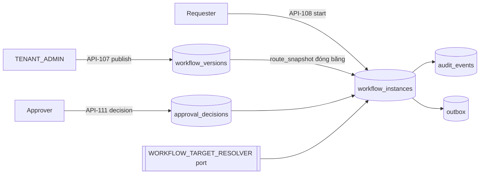

# ExecPlan — Approval workflow engine US-015

> **Status:** Completed (engine); AC-072 deferred
> **Owner:** Codex / Engineering
> **Created:** 2026-07-26
> **Updated:** 2026-07-26
> **Approval:** Product Owner trao toàn quyền quyết định và yêu cầu hoàn thành các yêu cầu trong story ngày 2026-07-26

## 1. Mục tiêu và kết quả người dùng

Process owner cấu hình một quy trình phê duyệt, publish nó dưới maker-checker, và từ đó mọi Change Request đi qua đúng tuyến đã publish. Người phê duyệt mở `/approvals`, thấy đúng việc trong phạm vi mình, ghi Approve/Return/Reject kèm lý do bắt buộc, và lịch sử quyết định không bao giờ bị sửa.

## 2. Nguồn và requirement IDs

- Business: `BR-008`, `BR-011`, `BR-015`, `BR-026`, `BR-034`
- Functional: `FR-138…FR-141`
- Use case/story: `UC-015`, `US-015`
- Acceptance: `AC-068…AC-071` in scope; `AC-072` out
- Tests: `TEST-068…TEST-071`
- API: `API-106…API-112`; `API-113` deferred
- Data: `DB-069…DB-072`, `DB-098`
- Security: `SEC-106…SEC-110`, `SEC-118`; `SEC-102` không khả thi trong base auth profile

## 3. Hiện trạng repository trước khi bắt đầu

- `API-106…112` chỉ có contract thiết kế, dùng `GenericCommand` và `Envelope`, bốn lệnh khai báo `202`.
- Không có bảng nào của `DB-069…072`; `grep -rni delegation apps/api/src` không có kết quả.
- Phê duyệt duy nhất đang chạy là logic hard-code của Change Request (`API-154…156`) trong US-004.
- `PermissionService.accessScopeSets` vừa được thêm trong slice US-022 và là thứ slice này cần cho hai list xuyên project.
- `project-master.seed.ts` ghi `policyVersion: 3` trong khi migration `1783737000000` đặt 4 — một defect sẽ hạ cấp role mỗi lần seed chạy.

## 4. Phạm vi

### In scope

- Bảy operation `API-106…112` với schema cụ thể.
- Bốn bảng `DB-069…072`, hai migration có `down()` đối xứng.
- Validator routing rules thuần, đóng băng route khi start, ledger quyết định append-only.
- Vue `/approvals` gated theo permission.

### Out of scope

- `API-113` escalate, scheduler SLA, `AC-072`.
- `CONDITIONAL_APPROVE` (từ vựng có sẵn, service từ chối).
- Delegation `AC-085…087` — thuộc US-018.
- Nối engine vào `API-154…156`; WF-021 closure vẫn do domain sở hữu.
- MFA/step-up `SEC-102`.

## 5. Assumption, TBD và Open Question

| Loại | Nội dung | Owner | Điều kiện đóng | Tác động nếu chưa đóng |
|---|---|---|---|---|
| Assumption | DB-069 cần `object_type`; dictionary chỉ liệt kê code/name/owner/status | Data Owner | Review artefact | Không có thì FR-139 routing xác định bất khả thi |
| Assumption | DB-071 cần `project_id`/`package_id` | Data Owner | Review artefact | Không có thì ABAC package phải lọc sau phân trang, làm trang trả thiếu hàng |
| Assumption | DB-072 cần `attempt_no` | Data Owner | Review artefact | Không có thì RETURN → nộp lại bị chặn bởi unique actor/step |
| Open Question | Quy tắc calendar/timezone/pause cho SLA | Process Owner | Trước AC-072 | `sla_due_at` giữ NULL; escalation chưa tồn tại |
| Open Question | Danh sách control không thể miễn trừ | PO/Security/HSE | Trước khi bật CONDITIONAL_APPROVE | Service trả `CONDITIONAL_APPROVE_NOT_ENABLED` |
| Open Question | MFA/step-up cho quyết định phê duyệt | Security | Trước production | Không có traffic phê duyệt production cho tới khi có OIDC/MFA |

## 6. Thiết kế

Engine ghi nhận ai quyết định gì; aggregate đích vẫn tự sở hữu transition cuối, version check và SoD của nó. Không có đường ghi nào từ engine vào Change Request.

## 7. Quyết định thiết kế đã chốt

| Quyết định | Lý do |
|---|---|
| Lệnh commit đồng bộ, trả 200/201 | Trả 202 cho một ghi đã commit là hợp đồng sai; sửa spec thay vì sửa hành vi |
| `expectedVersion` trong body, không dùng `If-Match` | Đồng bộ toàn bộ slice hiện hữu; không có đường `If-Match` nào được implement |
| Ngoài scope trả 404 | Không cho phép dò sự tồn tại của instance ẩn |
| Predicate scope nằm trong SQL | Lọc sau phân trang sẽ trả trang thiếu hàng trong khi vẫn còn hàng hợp lệ |
| Maker-checker ở cả service và CHECK constraint | Không code path tương lai nào bypass được BR-034 |
| Ledger append-only bằng trigger | Convention không đủ; lịch sử phê duyệt phải không sửa được kể cả bằng SQL tay |
| `actor_id` tách `effective_actor_id` ngay từ đầu | US-018 delegation sẽ không cần migration |

## 8. Milestone

### M1 — Schema và engine

- [x] Bốn entity, migration `1783738000000` với partial unique index và hai trigger.
- [x] Validator routing rules thuần (13 unit test).
- [x] Service bảy operation, controller, DTO, port resolver, module wiring.
- [x] Migration grant `1783739000000` (policy 5) và sửa defect `rolePolicyVersion` trong seed.

**Exit criteria:** không actor nào đọc/quyết định được instance ngoài scope; ledger không sửa được; hai instance sống trên cùng object là bất khả thi.

### M2 — Contract và UI

- [x] OpenAPI 0.9.3: schema cụ thể, 404, `x-error-codes`, status code đúng, 60 marker implemented.
- [x] Vue `/approvals`: danh sách, chi tiết, lịch sử quyết định, form quyết định có lý do bắt buộc.

**Exit criteria:** spec khớp implementation; UI ẩn form với actor không có `approval.decide`.

## 9. Kiểm thử

| Loại | Command | IDs | Kết quả |
|---|---|---|---|
| Lint | `npm run lint` | NFR-024 | Pass |
| Type-check | `npm run typecheck` | NFR-024 | Pass |
| Unit | `npm run test:unit` | TEST-068 | API 69 + Web 92 + Worker 61 = 222 |
| Integration | `npm run test:integration` | TEST-068…071 | API 93 + Worker 11 = 104 |
| OpenAPI | `npm run openapi:lint` | NFR-024 | Valid; 164 ID / 60 implemented |

Denial twin có mặt cho từng nhánh nhạy scope: package-scoped actor nhận 404, tenant khác nhận 404, requester nhận `SOD_CONFLICT`, actor thiếu grant nhận `PERMISSION_DENIED`, và mỗi 4xx đều assert không có hàng nào được ghi.

## 10. Migration, rollout, rollback

- `1783738000000` tạo schema; `down()` gỡ trigger, function rồi bảng theo thứ tự phụ thuộc ngược.
- `1783739000000` chỉ cấp permission và ghi lại đúng phần nó thêm.
- Không backfill; engine chưa nối vào domain nào nên rollback không mất dữ liệu nghiệp vụ.

## 11. Rủi ro

| Rủi ro | Tác động | Giảm thiểu |
|---|---|---|
| Engine bị hiểu nhầm là đã thay thế phê duyệt US-004 | Trung bình | Ghi rõ trong backlog/changelog; không đụng `API-154…156` |
| AC-072 bị coi là đã xong vì cột SLA đã tồn tại | Trung bình | Cột luôn NULL; AC-072/TEST-072 ghi Not covered ở backlog và traceability |
| Grant migration sau làm vỡ assertion policy version | Thấp | Hai spec chuyển sang ngưỡng tối thiểu |

## 12. Kết quả và bàn giao

- Outcome: engine chạy end-to-end với 18 integration test HTTP và 9 test ràng buộc DB.
- Còn lại: AC-072 SLA/escalation, CONDITIONAL_APPROVE, delegation US-018, MFA production gate, và việc nối engine vào Change Request (cần quyết định migration policy cho instance đang chạy).
