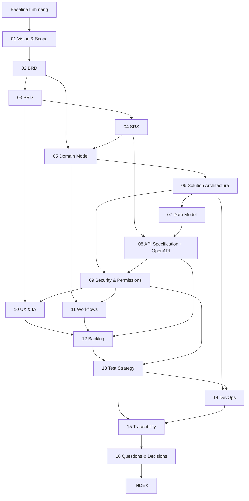

# Kế hoạch xây dựng bộ tài liệu phát triển phần mềm

> **Purpose:** Quy định artefact, nguồn, dependency, thứ tự, tiêu chí hoàn thành và nguồn sự thật cho toàn bộ bộ tài liệu Solar & BESS PM Web.  
> **Scope:** Tài liệu 01–16, INDEX và OpenAPI; không gồm production code.  
> **Source:** `../AGENTS.md`, `../.agent/PLANS.md`, `./Đề xuất tính năng nền tảng Solar và BESS.md`, `./CHANGELOG.md`.  
> **Version:** 0.1  
> **Status:** Draft  
> **Owner:** Product Management / Business Analysis (`TBD` người được chỉ định)  
> **Updated:** 2026-07-11  
> **Approval:** `TBD` Product Owner

## 1. Mục tiêu

Biến baseline tính năng đã phê duyệt thành bộ tài liệu nhất quán, truy vết được và đủ để review trước thiết kế chi tiết/lập trình. Kế hoạch này không thay đổi phạm vi baseline; nó quy định mỗi loại thông tin được định nghĩa ở đâu, tài liệu nào phụ thuộc tài liệu nào và bằng chứng nào chứng minh hoàn thành.

## 2. Nguyên tắc thực hiện

1. Tạo đúng thứ tự 01→16; `INDEX.md` tạo cuối.
2. Sau mỗi tài liệu, kiểm tra ngược với tất cả tài liệu trước đó.
3. Dependency ngược do thứ tự bắt buộc được xử lý bằng forward reference `TBD`, sau đó backfill trong reconciliation pass.
4. Một mã có đúng một định nghĩa chuẩn; tài liệu khác chỉ tham chiếu.
5. Source Feature ID không được đổi. Formal ID dùng hệ `BR/FR/NFR/UC/US/AC/WF/DB/API/SEC/TEST/ADR`.
6. Formal `SEC-*` bắt đầu từ `SEC-101` vì baseline đã dùng `SEC-001…008` làm Source Feature ID.
7. Mỗi tài liệu là Draft v0.1 cho đến khi owner/reviewer phê duyệt.
8. Mọi số liệu/ngưỡng/vendor chưa có nguồn dùng `TBD`, `Assumption` hoặc `Open Question`.
9. PM Web, O&M monitoring và OT là ba boundary riêng; PM Web không điều khiển BESS/OT.
10. Không tạo production code trong chương trình tài liệu này.

## 3. Danh sách artefact, mục tiêu và dữ liệu đầu vào

| Thứ tự | Artefact | Mục tiêu | Dữ liệu đầu vào chính | Phụ thuộc bắt buộc | Người review chính |
|---:|---|---|---|---|---|
| 01 | `01-product-vision-and-scope.md` | Khóa vision, problem, audience, value, in/out scope, boundary và success metrics | Baseline A/F/G/I | Baseline, plan 00 | Product Owner, Ban Giám đốc, PMO |
| 02 | `02-BRD.md` | Định nghĩa business context, BR, rule, process, stakeholder, KPI, risk | 01, baseline B–D/H | 01 | PO, process owners, Legal/Finance/HSE/O&M |
| 03 | `03-PRD.md` | Định nghĩa product modules, FR/NFR/UC, persona/journey, release và analytics | 01, 02, baseline C/E/F/G | 01–02 | PO, UX, PM, Engineering, QA |
| 04 | `04-SRS.md` | Chuyển FR/NFR thành behavior có thể triển khai/test | 03, baseline state/rule/examples | 01–03 | Engineering, QA, Security |
| 05 | `05-domain-model.md` | Định nghĩa bounded context, aggregate, invariant, event, command/query | 02–04, baseline domain appendix | 02–04 | Domain SMEs, Architecture |
| 06 | `06-solution-architecture.md` | Mô tả context/container/component/deployment, data flow, ADR/trade-off | 03–05, baseline C.9/C.12 | 03–05 | Architecture, IT/OT, Security |
| 07 | `07-data-model.md` | Định nghĩa DB entities, ERD, dictionary, key/constraint/index/retention | 04–06, baseline domain appendix | 04–06 | Data/Backend/Security/SMEs |
| 08a | `08-api-specification.md` | Định nghĩa API convention, API IDs, module endpoints, permission/examples | 04–07 | 04–07 | Backend, Integration, Security, QA |
| 08b | `openapi/openapi.yaml` | Hợp đồng OpenAPI 3.1 machine-readable cho API đã đủ rõ | 08a, 07 | 08a | Backend, QA, Integration |
| 09 | `09-security-and-permissions.md` | Định nghĩa SEC, threat model, IAM, permission/SoD/privacy/OT | 03–08, baseline C.4/C.12 | 03–08 | Security, Legal, Internal Control, OT |
| 10 | `10-ux-information-architecture.md` | Định nghĩa sitemap, screen/flow/state/responsive/accessibility | 01–04, 09, baseline wireframes | 03–04, 09 | UX, PO, role representatives |
| 11 | `11-workflows-and-state-machines.md` | Định nghĩa WF, actor/trigger/state/transition/exception bằng Mermaid | 02–05, 09, baseline D | 02–05, 09 | Process owners, Engineering, QA |
| 12 | `12-product-backlog.md` | Tạo Epic→Capability→Feature→US→AC→Task và release | 02–11, baseline E/F/G | 02–11 | PO, Delivery, Engineering, QA |
| 13 | `13-test-strategy.md` | Định nghĩa TEST, level/environment/data/entry/exit/automation | 03–12 | 03–12 | QA, Security, Engineering, SMEs |
| 14 | `14-devops-and-deployment.md` | Định nghĩa environment/CI-CD/scan/deploy/rollback/observability/DR | 06–09, 13 | 06–09, 13 | Platform/SRE/Security/QA |
| 15 | `15-traceability-matrix.md` | Registry đầu-cuối và phát hiện gap/mâu thuẫn | 01–14, OpenAPI | 01–14 | PO, BA, QA, Architecture |
| 16 | `16-open-questions-and-decisions.md` | Hợp nhất assumptions/questions/decisions/risks/dependencies/data needed | 01–15 | 01–15 | PO và toàn bộ decision owners |
| 17 | `INDEX.md` | Mục lục, status/version/dependency/reviewer/read order | 00–16, OpenAPI, changelog | Tất cả | Toàn bộ người đọc |

## 4. Quan hệ phụ thuộc



### Dependency ngược cần reconciliation

- SRS tạo trước Data/API/Security/Workflow nên chỉ mô tả behavior và forward-reference dải ID; sau tài liệu 11 phải cập nhật link/mapping.
- Domain Model tạo trước Data Model nên không định nghĩa `DB-*`; Data Model là owner của DB IDs.
- API Spec tạo trước Security nên permission/security references được backfill sau tài liệu 09.
- Open Questions xuất hiện từ đầu nhưng tài liệu 16 là registry cuối; mỗi tài liệu vẫn giữ bản trích liên quan.

## 5. Thứ tự tạo và cổng kiểm tra

| Gate | Tài liệu | Tiêu chí qua gate |
|---|---|---|
| G0 | 00 | Artefact/dependency/SSoT/ID/DoD/PO questions đầy đủ |
| G1 | 01–02 | Scope và BR bao phủ mọi domain nguồn; không lẫn thiết kế kỹ thuật vào BRD |
| G2 | 03–04 | Mỗi FR/NFR tham chiếu BR; SRS có behavior/validation/error, không copy PRD |
| G3 | 05–08 | Context/invariant/architecture/DB/API nhất quán; OpenAPI 3.1; no OT command |
| G4 | 09–12 | SEC/permission, UX, WF, US/AC và MVP truy vết được |
| G5 | 13–14 | TEST coverage và delivery/operation gates tương ứng rủi ro |
| G6 | 15–16/INDEX | Gap được liệt kê; link/ID/count/status/read order hợp lệ |

## 6. Tiêu chí hoàn thành chung cho mỗi tài liệu

- Có metadata: Purpose, Scope, Source, Version, Status, Owner, Updated, Approval.
- Có mục Assumptions, Open Questions và Changelog; nếu không có ghi `Không có`.
- Dùng thuật ngữ từ baseline/glossary; không tạo định nghĩa cạnh tranh.
- Mã do tài liệu sở hữu là duy nhất, đúng format/range và có owner/verification.
- Requirement quan trọng có chủ sở hữu, priority/phase và tiêu chí kiểm chứng.
- Link nội bộ là relative path và tồn tại hoặc ghi forward reference rõ.
- Mermaid/table/code fence cân bằng và đọc được bằng Markdown.
- Không chứa dữ liệu/tech/legal claim bị bịa; unknown được gắn nhãn.
- Đã kiểm tra với mọi tài liệu upstream và ghi changelog nội bộ.

## 7. Mẫu metadata và changelog tài liệu

```markdown
# <Tên tài liệu>

> **Purpose:** <Mô tả mục đích cụ thể của artefact>  
> **Scope:** <Mô tả in-scope/out-of-scope cụ thể>  
> **Source:** Baseline `docs/Đề xuất tính năng nền tảng Solar và BESS.md` và các tài liệu upstream được liệt kê cụ thể trong từng artefact.  
> **Version:** 0.1  
> **Status:** Draft  
> **Owner:** <Role hoặc TBD>  
> **Updated:** 2026-07-11  
> **Approval:** TBD

## Assumptions
TBD — liệt kê từng Assumption, owner xác nhận và tác động nếu sai.

## Open Questions
TBD — liệt kê từng Open Question, owner và điều kiện đóng.

## Changelog

| Version | Date | Change | Author/Owner |
|---|---|---|---|
| 0.1 | 2026-07-11 | Initial draft | Codex / Owner TBD |
```

## 8. Quy tắc nguồn sự thật

| Loại thông tin | Nguồn sự thật | Không được định nghĩa lại tại |
|---|---|---|
| Phạm vi/Source Feature | Baseline | Mọi tài liệu dẫn xuất |
| Vision/in-out scope/success | 01 | BRD/PRD chỉ tham chiếu |
| BR/business rule/process/KPI | 02 | PRD/SRS không tạo BR mới |
| FR/NFR/UC/release | 03 | SRS chỉ đặc tả behavior |
| System behavior/validation/error | 04 | API/test tham chiếu |
| Domain terms/invariants/context | 05 | Data/API không đổi nghĩa |
| Architecture/deployment/ADR | 06 | DevOps không tạo kiến trúc cạnh tranh |
| DB entity/schema/rule | 07 | Domain/API chỉ tham chiếu |
| API semantics/ID | 08a | OpenAPI hiện thực machine contract |
| API wire contract | OpenAPI | Không mô tả endpoint khác trong tài liệu khác |
| Security/permission/SEC | 09 | API/UX/backlog chỉ tham chiếu |
| Screen/navigation/UI state | 10 | PRD/backlog không tạo màn hình mới |
| Workflow/state/WF | 11 | SRS/backlog tham chiếu |
| US/AC/release backlog | 12 | Test tham chiếu |
| TEST/quality strategy | 13 | Traceability tham chiếu |
| Environment/delivery/operations | 14 | Architecture chỉ nêu constraint |
| Cross-ID status/gap | 15 | INDEX không thay registry |
| Assumption/question/decision/risk | 16 | Tài liệu khác giữ trích liên quan |
| Change history repository | CHANGELOG | Không sửa lịch sử ở file khác |

## 9. Ma trận mã và trách nhiệm

| Mã | Owner document | Quy tắc |
|---|---|---|
| BR | 02 | `BR-001…040`, một-một với `REQ-01…40`; có goal, owner, KPI/verification và Source IDs |
| FR/NFR/UC | 03 | `FR-001…198`, `NFR-001…024`, `UC-001…037`; mỗi definition tham chiếu BR |
| ADR | 06 | `ADR-001…010` ánh xạ `ARC-001…010`; status Proposed/Accepted/Superseded |
| DB | 07 | `DB-001…098`; mỗi entity có PK/FK/tenant/retention/classification |
| API | 08 | `API-001…136`; mỗi operation có auth/scope/input/output/error/idempotency và x-api-id |
| SEC | 09 | `SEC-101…132`; Source `SEC-001…008` không tái định nghĩa |
| WF | 11 | `WF-001…025`; Source wireframe `WF-01…14` không phải workflow ID |
| US/AC | 12 | `US-001…037`, `AC-001…173`; Source US-E chỉ là mapping; AC Given/When/Then |
| TEST | 13 | `TEST-001…229`; mỗi TEST tham chiếu requirement/AC và level/environment |

## 10. Assumptions

| Nhãn | Assumption | Owner xác nhận | Ảnh hưởng |
|---|---|---|---|
| Assumption | Baseline v1.0 là scope được phê duyệt và bất biến trong chương trình này | Product Owner | Nếu sai phải mở change request |
| Assumption | MVP lấy baseline Must, ưu tiên PM; O&M telemetry triển khai sau | Product Owner/PMO | Ảnh hưởng release/backlog |
| Assumption | Tài liệu được viết tiếng Việt, giữ thuật ngữ kỹ thuật tiếng Anh khi cần | Product Owner | Ảnh hưởng glossary/localization |
| Assumption | Cloud-first multi-tenant là hướng kiến trúc; dedicated/on-prem là tùy chọn cần ADR | Architecture/IT | Ảnh hưởng deployment/NFR |
| Assumption | Không có source code/toolchain tại thời điểm lập kế hoạch | Engineering | DevOps command để TBD |

## 11. Open Questions và thông tin Product Owner cần xác nhận

| Nhãn | Câu hỏi/thông tin cần xác nhận | Owner | Tài liệu bị ảnh hưởng | Mức chặn |
|---|---|---|---|---|
| Open Question | Xác nhận baseline v1.0 và danh sách Must chính thức của MVP | Product Owner | 01/03/12/15 | Chặn phê duyệt, không chặn Draft |
| Open Question | Tenant là tập đoàn, khách hàng hay deployment; hierarchy pháp nhân chuẩn? | PO/Legal/IT | 02/05/07/09 | Cao |
| Open Question | Cloud region/data residency/dedicated/on-prem bắt buộc? | PO/Legal/IT Security | 06/09/14 | Cao |
| Open Question | Ngưỡng phê duyệt, SoD, SLA và escalation theo pháp nhân? | Finance/Legal/Process Owners | 02/09/11/12 | Cao |
| Open Question | RPO/RTO, availability, performance và retention có cam kết? | IT/Business Owners | 03/04/06/09/14 | Cao |
| Open Question | ERP/accounting/HR/IdP/e-sign/DMS/BI/logistics/bank vendor nào? | System Owners | 06/08/09/14 | Trung bình |
| Open Question | OT topology/protocol/tag/sample/historian/API của từng site? | OT/Solar/BESS Engineering | 05/06/07/08/13 | Cao cho R4 |
| Open Question | Browser/device/offline/location/camera/signature requirement? | PO/Site/HSE | 03/04/10/13 | Trung bình |
| Open Question | Team composition/velocity và story point calibration? | Delivery Lead | 12/14 | Thấp cho Draft |
| Open Question | Pháp luật/tiêu chuẩn nào được viện dẫn trong từng contract/design basis? | Legal/Engineering | 02/04/06/09/11/13 | Cao theo dự án |

## 12. Dữ liệu cần các nhóm chuyên môn cung cấp

| Nhóm | Dữ liệu cần | Mục đích |
|---|---|---|
| Product Owner/PMO | MVP, personas ưu tiên, KPI baseline, release constraint | Scope/PRD/backlog |
| Solar/BESS Engineering | Equipment hierarchy, test template, point list, operating envelope | Domain/data/workflow/test |
| Legal | Contract types, obligation/permit matrix, signature/retention/applicability | BRD/security/workflow |
| Finance | CBS/cost code, VAT/FX/payment/approval policy, ERP mapping | BRD/data/API/backlog |
| Procurement/Logistics | Vendor/item/PO/shipment state, Incoterms, interfaces | Domain/workflow/API |
| QA/QC | ITP, inspection, NCR/punch severity/state/hold point | Workflow/data/test |
| HSE | PTW/incident/stop-work/CAPA and BESS fire safety gates | Security/workflow/test |
| O&M/OT | Asset/tag/alarm/WO/SLA, protocols, network, retention | Architecture/data/API/test |

## 13. Kiểm tra cuối chương trình

- File existence: 00–16, INDEX, OpenAPI.
- Relative links/anchors tồn tại.
- ID definition duy nhất, đúng owner/range; không trùng với Source ID.
- 216 Source Feature IDs được ánh xạ hoặc deferred có lý do.
- BR không có FR, FR không có US/UC, US không có AC, requirement không có TEST được liệt kê là gap.
- API có requirement, DB entity được sử dụng hoặc ghi conceptual-only.
- Thuật ngữ/domain/state không mâu thuẫn.
- OpenAPI 3.1 có API IDs, security/tenant/error conventions; không OT write operation.
- Baseline hash không đổi và repository không có production code.

## 14. Changelog

| Version | Date | Change | Author/Owner |
|---|---|---|---|
| 0.1 | 2026-07-11 | Initial documentation program plan | Codex / Product Owner TBD |
