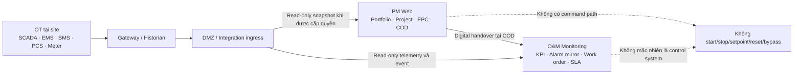

# Tầm nhìn sản phẩm và phạm vi nền tảng Solar & BESS

> **Purpose:** Khóa tầm nhìn, vấn đề, đối tượng sử dụng, giá trị, ranh giới và phạm vi sản phẩm làm nguồn sự thật cho BRD, PRD và các tài liệu downstream.  
> **Scope:** Toàn bộ vòng đời sản phẩm Solar & BESS từ cơ hội đến O&M; phân biệt phạm vi sản phẩm dài hạn với phạm vi MVP. Tài liệu này không định nghĩa `BR-*`, `FR-*`, API, schema hoặc lựa chọn công nghệ.  
> **Source:** [AGENTS.md](../AGENTS.md), [Kế hoạch tài liệu](./00-documentation-plan.md), [Baseline đề xuất tính năng](./Đề%20xuất%20tính%20năng%20nền%20tảng%20Solar%20và%20BESS.md).  
> **Version:** 0.1  
> **Status:** Draft  
> **Owner:** Product Management / Product Owner (`TBD` người được chỉ định)  
> **Updated:** 2026-07-11  
> **Approval:** `TBD` — Product Owner; review đề xuất bởi Ban Giám đốc và PMO  

## 1. Mục đích và cách sử dụng

Tài liệu này trả lời năm câu hỏi cấp sản phẩm:

1. Nền tảng giải quyết vấn đề gì cho doanh nghiệp Solar & BESS?
2. Ai là người dùng và quyết định nào họ cần đưa ra?
3. Giá trị khác biệt nào phải được bảo toàn khi đặc tả chi tiết?
4. Đâu là ranh giới giữa Web quản lý dự án, hệ thống giám sát O&M và hệ thống OT?
5. Năng lực nào thuộc phạm vi dài hạn, MVP hoặc ngoài phạm vi?

Đây là nguồn sự thật cho vision, in-scope, out-of-scope và success metrics. BRD và PRD phải tham chiếu tài liệu này, không định nghĩa một tầm nhìn hoặc ranh giới sản phẩm cạnh tranh. Source Feature ID trong baseline được giữ nguyên để truy vết; formal requirement ID sẽ do các tài liệu downstream sở hữu.

## 2. Tuyên bố tầm nhìn

Xây dựng một nền tảng quản lý dự án chuyên ngành Solar & BESS, giúp doanh nghiệp điều hành nhiều portfolio, pháp nhân, dự án và nhà thầu trên một nguồn dữ liệu có kiểm soát; liên kết tiến độ, tài liệu, hợp đồng, chi phí, mua sắm, thi công, chất lượng, an toàn, commissioning và COD; đồng thời bàn giao tài sản cùng hồ sơ số sang O&M mà không tạo đường điều khiển từ Web quản lý dự án vào hệ thống OT.

Nền tảng hướng tới điều hành theo ngoại lệ: người có trách nhiệm phải nhanh chóng biết việc nào cần xử lý, ai đang giữ việc, hạn nào có nguy cơ bị bỏ lỡ, bằng chứng nào còn thiếu và tác động có thể xảy ra đối với COD, chi phí, chất lượng hoặc an toàn.

### 2.1. Tuyên bố định vị

Đối với doanh nghiệp phát triển, đầu tư, EPC và vận hành tài sản Solar/BESS đang phải ghép nối Excel, email, nhóm chat và nhiều kho tài liệu, sản phẩm cung cấp một không gian quản trị xuyên vòng đời, có revision, workflow, phân quyền theo dữ liệu và truy vết đến bằng chứng. Khác với công cụ task/Gantt tổng quát, sản phẩm giữ được các quan hệ chuyên ngành từ giả định đầu tư, thiết kế và BOM tới PO, serial, nghiệm thu, commissioning, COD, warranty và O&M.

## 3. Vấn đề cần giải quyết

### 3.1. Phân mảnh dữ liệu và trách nhiệm

- Dự án được quản lý bằng nhiều file, email, chat và thư mục riêng của từng phòng ban.
- Không có một nguồn thống nhất để xác định trạng thái hiện hành, owner, deadline, revision và bằng chứng.
- Quyết định và cam kết trong cuộc họp/email khó truy ngược tới task, issue, hợp đồng hoặc thay đổi liên quan.
- Báo cáo tuần/tháng phụ thuộc tổng hợp thủ công, dễ sai data date, currency, baseline hoặc phạm vi quyền.

### 3.2. Thiếu liên kết đầu-cuối trong EPC

- Tiến độ, thiết kế, BOM, mua sắm, giao hàng, thi công và nghiệm thu thường được theo dõi ở các register tách biệt.
- Thiết bị giao chậm, revision thiết kế hoặc NCR có thể ảnh hưởng đường găng nhưng không được cảnh báo sớm.
- Thay đổi thiết kế/phạm vi không luôn được lượng hóa đồng thời về schedule, cost, procurement, quality, HSE, contract và COD.
- COD dễ bị hiểu như một milestone phần trăm thay vì một gate có điều kiện và bằng chứng.

### 3.3. Rủi ro tài chính, hợp đồng và kiểm soát nội bộ

- Hợp đồng, phụ lục, nghĩa vụ, bảo lãnh, permit và notice deadline có thể nằm trong tài liệu nhưng chưa trở thành action có owner.
- Budget, commitment, payment và forecast bị tách khỏi contract, cost code và pháp nhân.
- Giao dịch đa tiền tệ có nguy cơ bị cộng hoặc quy đổi không nhất quán.
- Quy trình thủ công khó chứng minh maker-checker, Segregation of Duties, delegation, thẩm quyền ký và lịch sử phê duyệt.

### 3.4. Bàn giao không liên tục từ dự án sang O&M

- Asset, serial, As-built, manual, warranty, spare, test result và tài khoản giám sát có thể không được bàn giao theo một package kiểm soát.
- Defect, punch, warranty claim và nghĩa vụ sau COD dễ mất owner khi chuyển nhóm.
- Telemetry, alarm và KPI vận hành chưa liên kết ngược với design basis, supplier, test hoặc lịch sử bảo trì.

### 3.5. Rủi ro nhầm lẫn giữa quản trị và điều khiển

- Người đọc dashboard có thể hiểu nhầm rằng Web quản lý dự án là hệ thống SCADA/EMS/BMS hoặc có quyền điều khiển BESS.
- Tích hợp không được phân vùng có thể tạo đường truy cập ngược từ IT/cloud vào OT.
- AI hoặc automation có thể bị sử dụng vượt vai trò hỗ trợ nếu không có capability boundary và human review.

## 4. Mục tiêu sản phẩm

| Mục tiêu | Kết quả mong muốn | Source Feature chính |
|---|---|---|
| Một nguồn dữ liệu có kiểm soát | Mỗi đối tượng có ID, owner, trạng thái, revision, history, liên kết và data scope rõ | Source: `PFM-*`, `PRJ-*`, `DOC-*`, `IAM-*` |
| Điều hành theo ngoại lệ | PM và lãnh đạo thấy blocker, người chịu trách nhiệm và quyết định cần đưa ra thay vì tổng hợp thủ công | Source: `PFM-002…PFM-004`, `RSK-*`, `COM-007` |
| Truy vết xuyên vòng đời | Truy từ cơ hội/hợp đồng đến design, BOM, PO, serial, inspection, test, COD và O&M | Source: `OPP-*`, `ENG-*`, `PRC-*`, `LOG-*`, `COM-*`, `OMM-*` |
| Kiểm soát doanh nghiệp | Quyền theo tenant/pháp nhân/dự án/package; SoD, delegation, immutable audit và status lock | Source: `IAM-*`, `WFL-*`, `DOC-009…DOC-010`, `SEC-001…SEC-008` |
| Kiểm soát tài chính–hợp đồng | Budget, commitment, payment, nghĩa vụ và cashflow cùng dùng pháp nhân, contract và currency có thẩm quyền | Source: `CTR-*`, `CST-*` |
| Thực thi hiện trường có bằng chứng | Nhật ký, ảnh, checklist, PTW, inspection, NCR và punch được ghi theo WBS/zone/asset, kể cả khi kết nối gián đoạn | Source: `PRJ-008`, `CON-*`, `HSE-*`, `QAC-*` |
| COD và bàn giao số | Gate COD có evidence; asset, dossier, warranty, training và open item chuyển sang O&M có biên bản | Source: `COM-001…COM-009` |
| Visibility vận hành an toàn | O&M nhận KPI/alarm/work order từ dữ liệu read-only mà không biến PM Web thành hệ điều khiển | Source: `OMM-*`, `SOL-004…SOL-005`, `BES-005…BES-008`, `INT-010…INT-014` |

## 5. Người dùng mục tiêu

### 5.1. Người dùng ra quyết định và quản trị

| Nhóm | Quyết định/nhu cầu chính | Phạm vi nhìn dự kiến |
|---|---|---|
| Ban Giám đốc/Hội đồng đầu tư | Ưu tiên vốn, can thiệp dự án, chấp nhận rủi ro, đầu tư và COD | Portfolio và drill-down ngoại lệ theo pháp nhân được giao |
| PMO/Project Manager/Project Controls | Bảo vệ scope, schedule, cost, quality, safety và COD; giao action và escalation | Toàn dự án trong data scope, vẫn chịu SoD và field restriction |
| Finance/Kế toán/Treasury | Budget, commitment, payment, VAT/khấu trừ, FX, cashflow và đối soát | Pháp nhân, project, contract và cost code được giao |
| Legal/Contract Manager | Hợp đồng, phụ lục, nghĩa vụ, permit, bảo lãnh, notice và claim | Legal entity/project/contract; trường privileged theo need-to-know |
| Chủ đầu tư/Khách hàng/Nhà đầu tư/Nhà tài trợ | Tiến độ, COD, performance, nghĩa vụ và báo cáo được chia sẻ | Chỉ project/site/contract/report được cấp |

### 5.2. Người dùng thực thi EPC

| Nhóm | Công việc chính | Giao diện/năng lực trọng tâm |
|---|---|---|
| Engineering/Design Manager | Survey, deliverable, calculation, BOM, RFI/TQ, interface, revision và IFC/As-built | Design register, DMS, workflow và change impact |
| Procurement/Supply Chain/Logistics | RFQ, evaluation, vendor, PO, FAT, shipment, delivery và serial | Procurement tracker, expediting và exception |
| Site/Construction/QS | Look-ahead, resource, quantity, nhật ký, vật tư, ảnh và xác nhận hoàn thành | Construction dashboard và PWA |
| QA/QC | ITP, inspection, hold/witness, NCR, punch và dossier | Quality dashboard, mobile checklist và evidence |
| HSE | PTW, toolbox, inspection, incident, near-miss, CAPA và stop-work | HSE dashboard, PWA và call/escalation path |
| Commissioning | Systemization, prerequisite, test, defect/retest và COD package | Commissioning/COD readiness dashboard |

### 5.3. Người dùng vận hành và bên ngoài

| Nhóm | Công việc chính | Giới hạn bắt buộc |
|---|---|---|
| O&M/Asset Manager/Technician | KPI, alarm triage, WO, maintenance, warranty, SLA và monthly report | Telemetry read-only trên nền tảng; thao tác OT chỉ trong hệ vận hành được phê duyệt |
| Nhà thầu phụ | Task, submittal, RFI, inspection và punch thuộc package | Không xem package khác hoặc register toàn dự án |
| Nhà cung cấp/OEM | RFQ, PO, submittal, FAT, shipment và warranty case của mình | Không xem bid đối thủ, budget hoặc evaluation nội bộ |
| Tenant/Security/Integration Admin | Identity, policy, connector, audit và vận hành dịch vụ | Không mặc nhiên xem nội dung kinh doanh; quyền đặc quyền phải được review |
| Auditor/Internal Control | Kiểm tra quyền, decision, giao dịch, export và audit | Read-only theo mandate; export nhạy cảm được kiểm soát |

## 6. Giá trị cốt lõi

1. **Một nguồn dữ liệu có kiểm soát:** giảm tranh cãi “bản nào đúng” bằng ID, revision, trạng thái và lịch sử.
2. **Điều hành theo ngoại lệ:** tập trung vào blocker, owner, deadline và tác động thay vì chỉ hiển thị KPI tổng hợp.
3. **Truy vết từ quyết định đến tác động:** change, document, BOM, PO, cost, claim, test và COD condition được liên kết hai chiều.
4. **Nghiệp vụ Solar & BESS chuyên biệt:** nhận biết cấu trúc thiết bị, performance baseline, commissioning và safety evidence theo công nghệ.
5. **Kiểm soát tài chính–hợp đồng:** pháp nhân, signer snapshot, contract, payment, payer/payee, currency và approval dùng cùng mô hình trách nhiệm.
6. **Field-first:** PWA giảm nhập lại và giữ bằng chứng tại WBS/zone/asset với offline queue có kiểm soát.
7. **Bàn giao số sang O&M:** asset, serial, dossier, warranty, spare, training và open item không bị đứt gãy tại COD.
8. **Giải thích được:** Health Score, cảnh báo và AI phải chỉ ra nguồn, data date, confidence và nguyên nhân.
9. **An toàn theo thiết kế:** visibility không đồng nghĩa quyền điều khiển; PM Web không có capability điều khiển OT/BESS.

## 7. Phạm vi vòng đời sản phẩm

| Giai đoạn | Kết quả cần đạt | Năng lực trong phạm vi | Gate/điểm bàn giao | Source Feature |
|---|---|---|---|---|
| 1. Cơ hội và tiền khả thi | Phương án có cơ sở kỹ thuật, tài chính, giả định và rủi ro | Lead/site, survey, load/bill, Solar/BESS scenario, business case, investment gate | Go/No-Go/Hold/Conditional Go | Source: `OPP-*`, `SOL-*`, `BES-*` |
| 2. Hợp đồng và pháp lý | Hợp đồng có hiệu lực; obligation, permit và điều kiện tiên quyết có owner | Contract register, party/signer snapshot, appendix, guarantee, permit, payment condition | Contract Effective/NTP | Source: `CTR-*`, `WFL-*` |
| 3. Thiết kế kỹ thuật | Deliverable/BOM/interface được review, approved và phát hành đúng revision | Design basis, MDR, review/comment, RFI/TQ, BOM, change, IFC/As-built | Design Freeze/IFC | Source: `ENG-*`, `DOC-*`, `SOL-*`, `BES-*` |
| 4. Mua sắm và logistics | Đúng thiết bị được mua, kiểm tra và giao theo need-by | PR/RFQ/evaluation/vendor/PO/FAT, shipment, receipt, serial và exception | Material Available/Released | Source: `PRC-*`, `LOG-*` |
| 5. Thi công | Công việc hoàn thành có bằng chứng, đúng chất lượng và an toàn | WBS/look-ahead, quantity, daily log, resource, material, PTW, QA/QC, HSE | Mechanical Completion | Source: `PRJ-*`, `CON-*`, `QAC-*`, `HSE-*` |
| 6. Commissioning và COD | Test đạt; blocker/gate COD được đóng hoặc waiver hợp lệ; package bàn giao được ký | System/subsystem, test pack, defect/retest, readiness, COD certificate, handover | COD/Handover Accepted | Source: `COM-*`, `QAC-*`, `DOC-*`, `CTR-*` |
| 7. O&M | Hiệu suất, alarm, work order, SLA, warranty và billing được quản lý sau COD | KPI Solar/BESS, alarm, WO, preventive plan, spare/warranty, report | Theo kỳ vận hành/hết bảo hành | Source: `OMM-*`, `SOL-*`, `BES-*` |

COD không tự động xóa trách nhiệm dự án. Defect, punch, waiver, warranty claim và nghĩa vụ còn mở phải tiếp tục có owner và xuất hiện ở miền phù hợp cho đến khi đóng.

## 8. In scope

### 8.1. Phạm vi sản phẩm dài hạn

- Portfolio/project master cho nhiều tenant, pháp nhân, khách hàng, site, package, nhà thầu và vendor.
- Opportunity, survey và pre-feasibility Solar/BESS có version, assumption và investment gate.
- WBS, schedule, milestone, baseline, task, look-ahead, dependency, meeting/action và decision log.
- DMS có mã tài liệu, metadata, version/revision, workflow, transmittal, search/OCR, preview, compare, watermark, ký và retention/legal hold.
- Contract, appendix, obligation, guarantee, permit, payment condition, variation và claim.
- Budget, commitment, invoice/payment, EAC/ETC, cashflow và multi-currency có FX snapshot.
- Procurement, vendor, requisition, RFQ, evaluation, PO, FAT, logistics, receipt, serial và warranty seed.
- Construction, PWA/offline draft, nhật ký, quantity, resource, material, ảnh và completion evidence.
- QA/QC, ITP, inspection, NCR, punch, HSE, PTW, incident, CAPA và stop-work.
- Commissioning systemization, procedure, test, defect/retest, COD readiness, certificate và digital handover.
- O&M monitoring, alarm, work order, maintenance, SLA, warranty, KPI, billing/reconciliation và report theo phase sau MVP.
- Workflow cấu hình, notification, reporting, IAM, RBAC+ABAC, SoD, delegation, audit và external workspace.
- Connector với hệ văn phòng, DMS, ERP/kế toán, HR, e-sign, design/schedule, BI, logistics và telemetry theo SoR rõ ràng.
- AI hỗ trợ phân loại/trích xuất/tóm tắt/dự báo sau khi có quyền, dữ liệu, evaluation và human-in-the-loop.

### 8.2. Phạm vi MVP ưu tiên Project Manager

MVP phải tạo được một luồng điều hành hằng ngày đầu-cuối, không chỉ cung cấp màn hình hoặc register rời rạc:

- Tenant/IAM, project/portfolio master và stakeholder scope.
- PM Command Center, Health Score có nguồn/confidence và drill-down.
- WBS–milestone–task–baseline, risk–issue–change.
- DMS–revision–transmittal và controlled search/download.
- Contract–appendix–obligation–permit và cost–commitment–payment.
- Procurement tracker, delivery exception và liên kết need-by/schedule.
- Field log/PWA, QA/QC, NCR/punch và HSE core.
- Commissioning/COD readiness và handover evidence.
- Tám workflow phê duyệt mẫu, notification, report, audit, backup và security gate.

`Open Question`: Danh sách Source Feature chi tiết được coi là Must còn có mâu thuẫn giữa catalog và ma trận MVP; Product Owner phải chốt tại PRD/backlog trước approval.

## 9. Out of scope

### 9.1. Ngoài phạm vi sản phẩm hiện tại

- Trực tiếp điều khiển PCS, BMS, EMS, SCADA, inverter, protection, meter, PLC hoặc thiết bị hiện trường từ PM Web.
- Nút/API/automation/AI để start/stop, charge/discharge, đổi setpoint/SOC limit/protection setting, reset/suppress alarm hoặc bypass interlock.
- Thay thế logic bảo vệ, interlock, E-Stop, fire safety, điều độ hoặc real-time control tại OT.
- Coi AI là approver, signatory, payer, người đóng NCR/incident/stop-work hoặc người xác nhận COD.
- Tự động quét email, ổ đĩa hoặc kho tài liệu ngoài phạm vi connector đã được bật và phê duyệt.
- Xóa file nguồn bên ngoài khi người dùng chỉ xóa reference/catalog trên web.
- Cung cấp tư vấn pháp lý, xác nhận tuân thủ hoặc tự suy diễn tiêu chuẩn áp dụng cho từng dự án.
- Hard-code biểu giá, thuế, retention, SLA hoặc ngưỡng kỹ thuật như một quy định áp dụng cho mọi tenant/dự án.

### 9.2. Không phải điều kiện phát hành MVP

- Full O&M live telemetry, tag-level monitoring và time-series analytics.
- Optimizer charge/discharge và các mô hình dự báo COD/cost/anomaly nâng cao.
- Bank payment initiation; MVP chỉ quản lý approval/đối soát theo phạm vi được phê duyệt.
- On-premise deployment; nếu phát sinh phải có deployment profile và quyết định kiến trúc riêng.
- Native mobile app riêng khi PWA đáp ứng được camera, QR, offline và policy thiết bị.
- Thay thế PVSyst, AutoCAD/CDE, Primavera P6/MS Project, ERP, phần mềm kế toán, e-sign provider hoặc SCADA/EMS/BMS; nền tảng tích hợp và quản trị quan hệ dữ liệu với các hệ này.

## 10. Ranh giới PM Web, O&M và OT

### 10.1. Định nghĩa miền

| Miền | Trách nhiệm | Dữ liệu/hành động đặc trưng | Không được suy diễn |
|---|---|---|---|
| Web quản lý dự án | Quản lý scope, schedule, tài liệu, hợp đồng, cost, procurement, construction, QA/QC, HSE, commissioning, COD, workflow và báo cáo | Record giao dịch/quản trị, approval, evidence, forecast, action và audit | Không phải historian hoặc hệ điều khiển |
| Hệ thống giám sát O&M | Giám sát KPI, telemetry, alarm mirror, WO, maintenance, SLA, warranty và report vận hành | Read model, alarm/event, asset history và work management | Acknowledge trên web không mặc nhiên clear/suppress alarm ở nguồn |
| Hệ thống OT | Vận hành/điều khiển thiết bị và bảo vệ an toàn tại site | SCADA, EMS, BMS, PCS, inverter, protection, meter, PLC/gateway và field device | Không nhận command từ PM Web trong baseline |

### 10.2. Sơ đồ ranh giới và luồng dữ liệu

**Mục đích:** thể hiện visibility một chiều từ OT và điểm bàn giao giữa PM và O&M.  
**Phạm vi:** ranh giới logic; topology vật lý/protocol là `TBD` tại kiến trúc.  
**Source:** `OMM-*`, `INT-010…INT-014`, `ARC-007`, `SEC-007`; formal `BR/FR/NFR/SEC/ADR` sẽ được ánh xạ ở tài liệu downstream.

### 10.3. Nguyên tắc bất biến tại ranh giới

1. Luồng baseline là `OT → gateway/historian → DMZ/integration → O&M/PM Web`.
2. Dashboard phải hiển thị source time, receive time, quality và staleness; mất dữ liệu không đồng nghĩa công suất bằng 0 hoặc trạng thái an toàn.
3. Work order có thể tạo switching request/permit; Authorized Operator thực hiện thao tác thật trong OT theo quy trình riêng và trả lại evidence/status.
4. PM Web, chatbot, service account và connector không có credential hoặc route điều khiển.
5. Bất kỳ ngoại lệ write/control nào đều là thay đổi phạm vi riêng và phải đáp ứng toàn bộ cổng phê duyệt trong `AGENTS.md`; ngoại lệ đó không tồn tại trong phạm vi tài liệu này.

## 11. Nguyên tắc sản phẩm

1. **Một lần nhập, nhiều lần dùng:** master data và metadata được tái sử dụng giữa module.
2. **Owner và deadline:** mọi record cần xử lý phải có trách nhiệm và thời hạn rõ khi nghiệp vụ yêu cầu.
3. **Workflow theo rủi ro/thẩm quyền:** route dựa trên loại, giá trị, pháp nhân, dự án, package, phòng ban, risk và SoD.
4. **Không sửa lịch sử:** thay đổi tạo revision, transaction hoặc transition mới.
5. **Deny-by-default:** data scope và lệnh cấm được kiểm tra tại backend, không chỉ ẩn nút UI.
6. **Cấu hình có version:** taxonomy, status, workflow, threshold, formula, report và integration mapping có effective date/audit.
7. **Field-first nhưng an toàn:** offline chỉ lưu dữ liệu tối thiểu được phép; conflict không ghi đè im lặng.
8. **Giải thích được:** KPI/Health/AI có nguồn, data date, rule/model version và uncertainty.
9. **Một định nghĩa cho mỗi khái niệm:** tài liệu downstream tham chiếu nguồn sự thật, không tạo định nghĩa cạnh tranh.
10. **Security và safety là gate:** không trì hoãn tenant isolation, audit hoặc OT boundary vì một module được xếp Future.

## 12. Ràng buộc

### 12.1. Governance và tài liệu

- Baseline không được sửa, đổi tên hoặc ghi đè khi chưa có change approval.
- Production code bị chặn cho đến khi hoàn thành và kiểm tra các artefact quy định trong `AGENTS.md`.
- Formal IDs được cấp tại tài liệu sở hữu; tài liệu này chỉ tham chiếu Source Feature ID.
- Mọi thay đổi phạm vi phải có changelog và impact tới requirement, data, API, test, roadmap.

### 12.2. Tổ chức và dữ liệu

- Phải hỗ trợ nhiều tenant, company/legal entity, portfolio, project, package và external party.
- Mọi record, file, event, export và audit phải có scope phù hợp; cross-tenant bị cấm mặc định.
- Signer dùng ID ổn định và snapshot pháp lý; không chỉ lưu tên hiển thị.
- Payment bắt buộc liên kết contract; tiền không dùng floating-point và không cộng trực tiếp khác currency.
- Data classification, retention, legal hold và System of Record cần được chốt theo loại dữ liệu.

### 12.3. Pháp lý, tiêu chuẩn và an toàn

- Nguồn pháp lý/kỹ thuật trong baseline là điểm khởi đầu, không thay tư vấn pháp lý hoặc xác nhận applicability theo dự án.
- Luật, tiêu chuẩn, biểu giá, permit, contract và OEM requirement phải có version/effective date và owner.
- BESS fire safety, E-Stop, protection, energization và commissioning critical test không được bypass bằng workflow chung hoặc AI.

### 12.4. Kỹ thuật và triển khai

- Hướng kiến trúc hiện tại là cloud-first multi-tenant; vendor, cloud region, data residency và deployment tier còn `TBD`.
- PWA là client field ưu tiên; native/on-prem chỉ được xem xét bằng quyết định riêng khi có bằng chứng nhu cầu.
- Time-series tách khỏi transactional workload; raw/high-frequency data có thể giữ tại edge/historian.
- API của PM Web không được mô tả operation điều khiển OT.

## 13. Phạm vi phát hành và ưu tiên

| Mức | Ý nghĩa trong tài liệu này | Ví dụ năng lực |
|---|---|---|
| Must/MVP | Cần để PM vận hành đầu-cuối hoặc để bảo đảm security, safety, integrity | Project/Command Center, schedule, DMS, contract/cost, procurement, field/QA/HSE, COD, workflow/IAM/audit |
| Should/Post-MVP gần | Giá trị cao nhưng có thể dùng quy trình tích hợp/thủ công có kiểm soát trong giai đoạn đầu | Pre-feasibility cơ bản, engineering/BOM sâu, serial/warranty đầy đủ, connector khách hàng |
| Could/Pilot | Chỉ mở khi có data/evaluation/human review; không chặn go-live | Năm AI ưu tiên, OCR/diff/tagging |
| Future | Phụ thuộc hạ tầng site, lịch sử dữ liệu, OT review hoặc control tài chính riêng | Full O&M telemetry, prediction/optimizer, bank initiation |

Các nhãn trên mô tả ý định phát hành từ baseline. Phạm vi chính thức theo từng Source Feature phải được Product Owner xác nhận trong PRD/backlog; không tự suy diễn toàn bộ một dải mã là Must khi catalog và ma trận MVP khác nhau.

## 14. Chỉ số thành công có thể đo

Các mục tiêu dưới đây được baseline gọi là KPI đề xuất. Cho đến khi Product Owner và owner dữ liệu xác nhận, tất cả mang trạng thái `Assumption`, không phải commitment.

### 14.1. Outcome sau triển khai

| Chỉ số đề xuất | Target từ baseline | Cách đo dự kiến | Trạng thái/owner xác nhận |
|---|---:|---|---|
| Giảm thời gian tổng hợp báo cáo tuần/tháng | ≥ 50% sau 6 tháng | So sánh baseline time study với usage/report job log | `Assumption` — PO/PMO |
| Task/approval có owner và deadline | ≥ 90% | Tỷ lệ record áp dụng có owner + due date hợp lệ | `Assumption` — PMO/Process Owners |
| Giảm action quá hạn | ≥ 20% | So sánh aging/overdue rate trước và sau, cùng population | `Assumption` — PMO |
| Deliverable chính có revision/status/transmittal | 100% | DMS completeness theo danh mục deliverable được phê duyệt | `Assumption` — Document Control |
| Cảnh báo đường găng/COD sớm | ≥ 14 ngày khi dữ liệu đầy đủ | Khoảng cách event alert đến milestone/COD impact thực tế | `Assumption` — PMO/Commissioning |
| Commitment/payment liên kết contract và cost code | 100% | Referential/data-quality check trên giao dịch áp dụng | `Assumption` — Finance |
| NCR/incident/critical punch có action, owner và audit | 100% | Completeness và closure evidence theo severity | `Assumption` — QA/QC/HSE |
| PM/site lead hoạt động hằng tuần | ≥ 80% trên dự án đang triển khai | Weekly active assigned users; loại tài khoản nghỉ/không thuộc dự án | `Assumption` — PO/Change Manager |

### 14.2. MVP readiness đề xuất

| Cổng đo | Bằng chứng | Trạng thái |
|---|---|---|
| PM tìm được việc cần xử lý, owner, impact và evidence trong khoảng 30 giây | Usability test có kịch bản và timing | `Assumption` — cần PO/UX xác nhận ngưỡng |
| Pilot đại diện Solar và BESS/Hybrid hoàn thành chu kỳ tuần | UAT/operational pilot report | `Assumption` — baseline đề xuất 3 dự án; danh sách project `TBD` |
| Tám workflow chạy normal/return/reject/delegate/escalate | Workflow test và immutable audit | Bắt buộc về phạm vi; sample/policy cụ thể `TBD` |
| Không lộ cross-tenant/project/package | Automated negative security tests | Cổng bắt buộc, không được waiver |
| PM không tự duyệt khoản do mình đề xuất khi policy cấm | UI/API/workflow negative tests | Cổng bắt buộc |
| Approved/signed document không sửa được và restore nhất quán | DMS/API test + restore evidence | Cổng bắt buộc |
| Payment không thiếu contract/currency | Data constraint và integration test | Cổng bắt buộc |
| Không tồn tại PM Web OT control operation | UI/API/schema/network review và negative test | Cổng safety bắt buộc, không được waiver |

### 14.3. Nguyên tắc đo lường

- Mỗi metric cần định nghĩa population, numerator, denominator, time window, timezone, data source, freshness và owner trước khi publish.
- Dashboard live và report snapshot phải dùng cùng semantic definition/version; khác biệt data date hoặc FX phải được hiển thị.
- Dữ liệu stale, estimated, manually adjusted hoặc thiếu scope phải có nhãn; không trình bày như số liệu hoàn chỉnh.
- KPI không được tạo động cơ che giấu issue, dùng `N/A` để nâng điểm hoặc sửa actual lịch sử.
- Health Score weight, band và hard-cap từ baseline chỉ trở thành policy sau khi Product Owner/PMO cùng các process owner xác nhận.

## 15. Source Feature mapping cấp phạm vi

| Capability | Source Feature ID | Release intent từ baseline |
|---|---|---|
| Opportunity/pre-feasibility | `OPP-001…OPP-009` | Should; phần sâu sau MVP |
| Portfolio/PM Command Center/reporting | `PFM-001…PFM-006` | Must core |
| Project/schedule/task/field collaboration | `PRJ-001…PRJ-010` | Must core + một số Should |
| DMS | `DOC-001…DOC-010` | Must core; OCR/compare depth cần reconciliation |
| Contract/legal | `CTR-001…CTR-009` | Must core + một số Should |
| Engineering/Solar/BESS design | `ENG-001…ENG-008`, `SOL-001…SOL-003`, `BES-001…BES-005` | Must/Should theo safety và phase |
| Cost/payment | `CST-001…CST-008` | Must |
| Procurement/logistics | `PRC-001…PRC-008`, `LOG-001…LOG-006` | Must tracker; depth theo phase |
| Construction/QA/HSE | `CON-001…CON-010`, `QAC-001…QAC-007`, `HSE-001…HSE-006` | Must core/safety |
| Risk/issue/change/claim | `RSK-001…RSK-008` | Must core + early warning depth |
| Commissioning/COD | `COM-001…COM-009` | Must trước COD release |
| O&M/Solar/BESS performance | `OMM-001…OMM-010`, `SOL-004…SOL-005`, `BES-006…BES-008` | Post-MVP/Future theo telemetry |
| Workflow/IAM | `WFL-001…WFL-008`, `IAM-001…IAM-010` | Must/security |
| Integration | `INT-001…INT-022` | Theo phase và connector approval |
| AI | `AIX-001…AIX-021` | Governance trước pilot; predictive/optimizer Future |
| Architecture/security source capability | `ARC-001…ARC-010`, `SEC-001…SEC-008` | Nền tảng bắt buộc theo capability được bật |

Lưu ý: `SEC-001…SEC-008` trong bảng trên là Source Feature ID của baseline. Theo [kế hoạch tài liệu](./00-documentation-plan.md), formal Security Requirement sẽ bắt đầu từ `SEC-101` để không tạo định nghĩa trùng.

## 16. Phụ thuộc và điều kiện sẵn sàng downstream

### 16.1. Đầu vào cần cho BRD

- Xác nhận stakeholder, process owner và as-is process thực tế.
- Chốt business goal/KPI owner và baseline đo.
- Chốt phạm vi tổ chức: tenant, company, legal entity, project và package.
- Xác nhận các business rule/authority chưa được baseline định lượng.

### 16.2. Đầu vào cần cho PRD/SRS

- Danh sách Must chính thức theo Source Feature và chiều sâu MVP.
- Role × module × action × data scope và SoD matrix.
- State/status taxonomy, workflow template, SLA và escalation.
- NFR đo được: availability, performance, RPO/RTO, retention, volume và browser/device support.
- System of Record và data owner cho từng integration object/field.

### 16.3. Cổng trước production code

Vision/scope này không đủ để cho phép viết production code. Cổng tài liệu trong `AGENTS.md` vẫn yêu cầu BRD, PRD, SRS, kiến trúc/ADR, data model, OpenAPI 3.1, backlog MVP, test strategy và traceability được hoàn thành, kiểm tra và phê duyệt.

## 17. Assumptions

| ID nội bộ tài liệu | Assumption | Căn cứ/lý do | Owner xác nhận | Điều kiện chuyển thành quyết định/yêu cầu |
|---|---|---|---|---|
| A-01 | Baseline v1.0 là phạm vi nghiệp vụ được phê duyệt cho chương trình tài liệu, dù metadata baseline vẫn ghi “đề xuất” | `AGENTS.md` quy định baseline là scope approved | Product Owner | Ghi approver, ngày, phương thức và version trong decision registry |
| A-02 | Thị trường đầu là Việt Nam; tiếng Việt là ngôn ngữ chính, tiếng Anh là ngôn ngữ thứ hai | Baseline phần mở đầu | Product Owner/Legal | Xác nhận locale, translation owner và thị trường release |
| A-03 | Quy mô tham chiếu khoảng 500 dự án hoạt động/tenant; telemetry tách khỏi transactional workload | Baseline giả định và architecture capability | Product Owner/Architecture | Capacity model, concurrency, data volume và load test plan được ký |
| A-04 | VND là reporting/default currency ban đầu và USD được hỗ trợ | Baseline giả định | Finance/Product Owner | Finance xác nhận currency policy, FX source và precision |
| A-05 | Cloud-first multi-tenant là hướng kiến trúc; dedicated deployment là option, on-prem ngoài MVP | Baseline architecture | Architecture/IT/Legal | ADR xác nhận cloud, region, residency và deployment tier |
| A-06 | MVP ưu tiên Project Manager; full O&M telemetry và AI nâng cao không chặn go-live | Baseline F/G | Product Owner/PMO/O&M | PRD và backlog release được phê duyệt |
| A-07 | PWA là client field ưu tiên; native app chỉ khi PWA không đạt requirement đã đo | Baseline architecture | Product Owner/Site/IT | Device/browser/offline test chứng minh nhu cầu |
| A-08 | KPI target trong mục 14 chỉ là mục tiêu đề xuất, chưa phải commitment | Baseline dùng từ “đề xuất” | Product Owner và metric owners | KPI definition, baseline, target/date và owner được phê duyệt |
| A-09 | Nguồn pháp lý/kỹ thuật trong baseline cần kiểm tra applicability theo từng dự án | Baseline phụ lục 6 | Legal/Engineering | Compliance register có edition/effective date/project mapping |

## 18. Open Questions

| ID nội bộ tài liệu | Open Question | Người/nhóm cần trả lời | Tác động nếu chưa trả lời | Mức chặn |
|---|---|---|---|---|
| OQ-01 | Ai đã/phải phê duyệt baseline v1.0, ngày và phương thức phê duyệt là gì? | Product Owner | Không hoàn tất metadata/phê duyệt vision và traceability baseline | Chặn approval, không chặn Draft |
| OQ-02 | Dải Source Feature nào và chiều sâu nào là Must chính thức khi catalog và F.2 khác nhau? | Product Owner/PMO | Không thể khóa MVP/backlog/release | Cao |
| OQ-03 | Tenant đại diện tập đoàn, khách hàng hay deployment; quan hệ Company–Legal Entity–Project chuẩn là gì? | Product Owner/Legal/IT | Ảnh hưởng scope, permission, data model và integration | Cao |
| OQ-04 | As-is process, process owner và RACI đã được xác nhận cho từng domain chưa? | PMO và functional heads | BRD có nguy cơ mô tả target mà không phản ánh pain point/quy trình thực | Cao |
| OQ-05 | Approval threshold, quorum, SoD, delegation, SLA và escalation theo từng pháp nhân là gì? | Finance/Legal/Internal Control/Process Owners | Workflow không thể cấu hình hoặc kiểm thử decision-complete | Cao |
| OQ-06 | KPI/Health Score target, weight, band, hard-cap và data-quality threshold nào được phê duyệt? | Product Owner/PMO/QA/HSE/Finance | Dashboard và success measurement chưa có policy có thẩm quyền | Cao |
| OQ-07 | Cloud region, data residency, dedicated/on-prem requirement và customer tier là gì? | IT/Architecture/Legal/Security | Ảnh hưởng kiến trúc, chi phí, NFR và hợp đồng | Cao |
| OQ-08 | Availability, RPO/RTO, retention, performance, concurrency, file và telemetry volume cam kết là gì? | Business Owners/IT/SRE | Chưa thể định nghĩa NFR, capacity và test strategy | Cao |
| OQ-09 | Browser/device, offline duration/cache, GPS/camera/signature và MDM policy là gì? | Product Owner/Site/HSE/IT | Ảnh hưởng UX/PWA/security/test | Trung bình |
| OQ-10 | ERP, accounting, HRIS, IdP, e-sign, DMS/CDE, schedule, BI và logistics system cụ thể nào được tích hợp? | System Owners/Enterprise Architecture | Không thể chốt SoR, connector contract, API và rollout | Trung bình theo phase |
| OQ-11 | OT topology, historian, protocol, tag allowlist, sampling, quality code và site readiness là gì? | OT Security/Solar/BESS/O&M Engineering | Chặn O&M telemetry phase; không chặn PM MVP | Cao cho O&M |
| OQ-12 | Luật, tiêu chuẩn, permit, EVN/NSMO, contract và OEM requirement nào thực sự áp dụng cho từng loại dự án? | Legal/Engineering/HSE | Không thể coi baseline nguồn là compliance requirement cuối | Cao theo dự án |
| OQ-13 | Ba dự án pilot, champion, dữ liệu migration và UAT approver là ai? | Product Owner/PMO | Không thể thực hiện acceptance/rollout MVP | Cao trước pilot |
| OQ-14 | Nhóm test Must nào tuyệt đối không được waiver ngoài tenant isolation và OT no-control đã xác định? | Product Owner/QA/Security/HSE | Exit criteria có thể cho phép waiver không an toàn | Cao |
| OQ-15 | AI vendor/model, corpus được phép, evaluation threshold và dữ liệu có được dùng cải thiện model hay không? | AI Governance/Data Owner/Legal/Security | Chặn AI pilot, không chặn workflow core | Cao cho AI |

## 19. Changelog

| Version | Date | Change | Author/Owner |
|---|---|---|---|
| 0.1 | 2026-07-11 | Tạo bản Draft tầm nhìn, phạm vi, boundary, success metrics, assumptions và open questions từ baseline; không thay đổi phạm vi nghiệp vụ gốc | Codex / Product Owner `TBD` |
