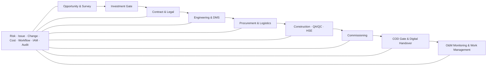

# Business Requirements Document — Nền tảng quản lý dự án Solar & BESS

> **Purpose:** Định nghĩa bối cảnh, mục tiêu, stakeholder, phạm vi tổ chức, quy trình nghiệp vụ và đúng 40 Business Requirement làm nguồn sự thật cho PRD, SRS, domain model, backlog và traceability.  
> **Scope:** Toàn bộ vòng đời cơ hội, EPC, commissioning/COD và O&M monitoring của Solar/BESS; không định nghĩa Functional Requirement, Non-functional Requirement, Use Case, API, database entity hoặc workflow ID.  
> **Source:** [AGENTS.md](../AGENTS.md), [Kế hoạch tài liệu](./00-documentation-plan.md), [Tầm nhìn và phạm vi](./01-product-vision-and-scope.md), [Baseline đề xuất tính năng](./Đề%20xuất%20tính%20năng%20nền%20tảng%20Solar%20và%20BESS.md).  
> **Version:** 0.1  
> **Status:** Draft  
> **Owner:** Product Owner / Business Analysis (`TBD` cá nhân được chỉ định)  
> **Updated:** 2026-07-11  
> **Approval:** `TBD` — Product Owner; cần review bởi PMO và các Process Owner  

## 1. Mục đích và quy tắc tài liệu

BRD chuyển 40 nhóm yêu cầu nguồn `REQ-01…REQ-40` trong baseline thành đúng 40 Business Requirement `BR-001…BR-040` theo quan hệ một-một. Mỗi BR mô tả outcome nghiệp vụ và điều kiện kiểm chứng, không quyết định giao diện, endpoint, schema hoặc công nghệ triển khai.

Quy tắc sử dụng:

1. Mỗi `BR-*` có đúng một định nghĩa chuẩn trong tài liệu này.
2. Source Feature ID như `PFM-001` hoặc `COM-007` được giữ nguyên với nhãn `Source`; chúng không phải formal requirement ID.
3. PRD phải ánh xạ mọi `FR-*`, `NFR-*` và `UC-*` về ít nhất một BR tại đây.
4. Giá trị chưa được business owner xác nhận mang nhãn `TBD`, `Assumption` hoặc `Open Question`.
5. Mọi thay đổi outcome hoặc phạm vi BR phải qua change control và cập nhật [CHANGELOG](./CHANGELOG.md).
6. Tài liệu này giữ nguyên ranh giới: PM Web không trực tiếp điều khiển BESS hoặc OT.

## 2. Bối cảnh doanh nghiệp

Doanh nghiệp Solar & BESS có thể đồng thời là đơn vị phát triển dự án, chủ đầu tư, EPC, nhà cung cấp/cho thuê thiết bị, ESCO/PPA và O&M. Một chương trình có thể trải qua nhiều pháp nhân, khách hàng, site, package, nhà thầu, vendor, loại hợp đồng và nguồn vốn. Dữ liệu cần được duy trì từ cơ hội đến sau COD mà không đánh mất nguồn, revision, owner, deadline hoặc thẩm quyền.

Hiện trạng được baseline mô tả là phân mảnh giữa Excel, email, nhóm chat và thư mục dùng chung. Hệ quả là khó trả lời kịp thời: dự án chậm ở đâu; ai đang giữ blocker; thiết bị nào ảnh hưởng đường găng; EAC có vượt BAC; obligation/permit nào sắp hạn; hồ sơ/test nào còn thiếu cho COD; rủi ro nào cần cấp quản lý quyết định.

### 2.1. Mô hình kinh doanh cần hỗ trợ

- Phát triển và phê duyệt cơ hội đầu tư Solar, BESS hoặc hybrid.
- EPC và quản lý nhiều package/nhà thầu/vendor.
- PPA, ESCO, thuê thiết bị và các cấu trúc hợp đồng được baseline nêu.
- Chủ đầu tư/asset owner quản lý vốn, COD, performance và nghĩa vụ.
- O&M theo asset/site, warranty, SLA và báo cáo khách hàng/nhà đầu tư.

`Open Question`: Danh sách mô hình kinh doanh áp dụng ở release đầu, pháp nhân thực tế và rule kế toán/hợp đồng của từng mô hình chưa được Product Owner/Legal/Finance xác nhận.

## 3. Mục tiêu kinh doanh

| Mục tiêu | Outcome kỳ vọng | Bằng chứng/KPI đề xuất | Trạng thái |
|---|---|---|---|
| Một nguồn sự thật | Dữ liệu project, document, contract, cost, procurement và COD có ID, owner, status, revision và audit | Tỷ lệ record trọng yếu đầy đủ; số lỗi reconciliation | Target `TBD` theo domain |
| Giảm tổng hợp thủ công | PM và chức năng tạo report từ cùng nguồn/snapshot | Baseline đề xuất giảm ≥50% thời gian sau 6 tháng | `Assumption` — PO/PMO xác nhận |
| Tăng trách nhiệm | Action/approval có owner và deadline, overdue được escalation | Baseline đề xuất ≥90% record áp dụng; giảm overdue ≥20% | `Assumption` |
| Bảo vệ COD | Blocker schedule/procurement/permit/quality/HSE/test được nhận biết sớm | Baseline đề xuất cảnh báo ≥14 ngày khi dữ liệu đủ | `Assumption` |
| Kiểm soát tài chính | Commitment/payment trace được tới contract và cost code, currency không bị trộn | Baseline đề xuất 100% giao dịch áp dụng | `Assumption`; rule Finance `TBD` |
| Kiểm soát hồ sơ | Deliverable chính có revision/status/transmittal và bản current-for-use | Baseline đề xuất 100% | `Assumption`; population `TBD` |
| An toàn và chất lượng | Critical NCR/punch/incident có owner, action, evidence và independent closure | Baseline đề xuất 100% | Cổng bắt buộc; taxonomy `TBD` |
| Chấp nhận người dùng | PM/site lead sử dụng trong chu kỳ tuần thực | Baseline đề xuất ≥80% weekly active | `Assumption` |

## 4. Stakeholder và trách nhiệm

### 4.1. Danh sách stakeholder

| Nhóm | Lợi ích/trách nhiệm | Dữ liệu/quyết định chính |
|---|---|---|
| Product Owner/Ban Giám đốc | Phê duyệt scope, outcome, ưu tiên và investment/COD authority | Vision, MVP, business KPI, exception lớn |
| PMO/Project Manager | Điều hành schedule, cost, action, risk và COD | Project master, baseline, Command Center, status report |
| Engineering/Solar/BESS | Chịu trách nhiệm design basis, deliverable, BOM, interface và test criteria | Survey, drawing, calculation, equipment hierarchy |
| Procurement/Logistics | Sourcing, vendor, PO, FAT, shipment, receipt và recovery | Commercial/technical evaluation, ETA, serial |
| Finance/Accounting/Treasury | Budget, commitment, payment, tax, FX, cashflow và posting | Cost ledger, approval, reconciliation |
| Legal/Contract | Contract, appendix, obligation, permit, authority, claim | Signed snapshot, notice, guarantee, legal hold |
| Construction/Site/QS | Workfront, look-ahead, quantity, resource và nhật ký | Daily evidence, progress, instruction |
| QA/QC | ITP, inspection, NCR, punch, dossier | Acceptance, hold/release, closure evidence |
| HSE | PTW, incident, stop-work, CAPA và emergency governance | Safety gate, restricted incident data |
| Commissioning | Systemization, procedure, test, defect/retest và COD readiness | Test evidence, completion package |
| O&M/Asset Management | Asset, KPI, alarm, WO, warranty, SLA và reliability | Handover, telemetry read-only, maintenance history |
| IT/Security/OT | Identity, tenant isolation, connector, audit, service và OT boundary | Policy, access, SoR, network/data flow |
| Chủ đầu tư/Khách hàng/Nhà tài trợ | Review/approve/receive theo hợp đồng và phạm vi chia sẻ | Milestone, evidence, report, COD |
| Nhà thầu/Vendor/OEM | Thực hiện package, submittal, delivery, corrective action và warranty | Chỉ dữ liệu thuộc package/order/case của mình |

### 4.2. RACI cấp domain

Ma trận dưới đây là `Assumption` để lập Draft; Process Owner phải xác nhận trước khi BRD được Approved.

| Domain | Accountable đề xuất | Responsible chính | Consulted | Informed |
|---|---|---|---|---|
| Portfolio/project | PMO/Product Owner | PM/Project Controls | Finance, Legal, functional leads | Ban Giám đốc, project team |
| Opportunity/investment | Investment Committee/BD Head | BD, Engineering, Finance | Legal, HSE, PMO | Sponsor |
| Contract/legal | Legal/Contract Head | Contract Manager | PM, Finance, Procurement | Sponsor, affected owners |
| Engineering | Engineering Manager | Discipline/Solar/BESS engineers | QA/QC, HSE, Procurement, O&M | PM/Site |
| Procurement/logistics | Procurement Head | Buyer/Expeditor/Logistics | Engineering, Finance, QA/QC | PM/Site |
| Cost/payment | CFO/Finance authority | Cost Controller/AP/Treasury | PM, Contract, QS/QA | Sponsor/payee theo quyền |
| Construction | Project/Site Director | Site team/contractor | Planner, QA/QC, HSE | PM/owner |
| QA/QC | QA/QC Manager | Inspectors/contractor action owner | Engineering, Client | PM/Commissioning |
| HSE | HSE Manager | Site HSE/supervisors/action owners | Legal, Engineering, Client | PM/leadership theo severity |
| Commissioning/COD | Commissioning Manager/COD Committee | Commissioning, functional reviewers | Legal, Finance, HSE, O&M | Sponsor/client |
| O&M | Asset/O&M Manager | Dispatcher/technician/reliability | HSE, Engineering, OEM, customer | Asset owner |
| IAM/integration | Security/Data Owner | IT/Integration administrators | Legal, process owner, OT Security | Auditor |

## 5. Quy trình hiện tại — As-is

`Assumption`: Baseline cung cấp pain point tổng quát, chưa có bằng chứng phỏng vấn hoặc process walkthrough cho từng pháp nhân. Phần này không được dùng như quy trình đã xác nhận; cần workshop với process owner.

| Miền | As-is giả định từ baseline | Pain point/hậu quả | Cần xác minh |
|---|---|---|---|
| Portfolio/project | Mỗi PM/chức năng duy trì bảng riêng và tổng hợp theo kỳ | Data date khác nhau, không rõ owner/blocker, báo cáo chậm | Tool/file hiện dùng, cadence, source chính |
| Opportunity/survey | Lead, bill/load, survey và scenario nằm ở nhiều file | Trùng lead, thiếu provenance, assumption bị coi như measured data | Quy trình gate và data owner hiện tại |
| Contract/legal | Contract/PDF, appendix, obligation và permit được theo dõi tách | Bỏ lỡ deadline/guarantee/notice; không rõ bản hiệu lực | Contract register và approval authority hiện tại |
| Design/DMS | File/revision/comment trao đổi qua email/folder | Dùng superseded revision, comment closure khó chứng minh | CDE/DMS hiện có và document code |
| Procurement/logistics | PR/RFQ/evaluation/PO/ETA ở nhiều register | Không liên kết need-by/critical path; thiếu recovery owner | ERP/procurement tool và vendor portal hiện tại |
| Construction/QA/HSE | Nhật ký/checklist/ảnh trên giấy/chat/file | Nhập lại, evidence rời, hold/stop-work khó phản ánh schedule | Site connectivity, forms và authority |
| Cost/payment | Budget, contract, invoice và bank/accounting tách | Orphan payment, sai lũy kế/currency, SoD khó kiểm toán | CBS, ERP/accounting và maker-checker hiện tại |
| Commissioning/COD | Test pack và COD checklist theo file/package | Không rõ gate, version, failed/retest và handover completeness | COD authority, checklist và dossier hiện tại |
| O&M | Telemetry/OEM portal, alarm, WO và report tách | Asset lineage đứt; stale data bị hiểu sai; warranty evidence thiếu | CMMS/historian/OEM system hiện tại |

## 6. Quy trình mục tiêu — To-be

### 6.1. Dòng giá trị đầu-cuối

**Mục đích:** thể hiện outcome và handoff nghiệp vụ; không phải workflow implementation.  
**Source:** `REQ-01…REQ-40`; formal workflow ID được định nghĩa sau tại tài liệu workflow.

### 6.2. Kết quả mục tiêu theo quy trình

1. **Cơ hội:** lead → khảo sát/dữ liệu → scenario → business case → investment decision → project handover.
2. **Hợp đồng:** draft/review/sign/effective → obligation/permit/guarantee → amendment/claim → close-out.
3. **Thiết kế:** basis → internal check → transmittal/review/comment → approved/IFC → controlled change → As-built.
4. **Mua sắm:** need/BOM → PR/RFQ → technical/commercial evaluation → approval/PO → FAT/shipment/receipt.
5. **Thi công:** workfront/look-ahead → PTW → execute/report → inspection → NCR/punch/rework → acceptance.
6. **Commissioning/COD:** systemization → readiness → procedure/test → failed/retest → COD evidence/gate/sign → handover.
7. **O&M:** alarm/request/plan → triage/WO → PTW/execute/test → return-to-service → warranty/reliability/report.
8. **Governance xuyên suốt:** owner/deadline, permission/SoD, workflow, notification, immutable audit, change impact và traceability.

## 7. Phạm vi tổ chức, pháp nhân và dự án

| Cấp scope | Mục đích nghiệp vụ | Quy tắc baseline | Chưa xác định |
|---|---|---|---|
| Tenant | Biên dữ liệu/cấu hình cao nhất | Cross-tenant bị cấm mặc định | Tenant là tập đoàn, khách hàng hay deployment (`Open Question`) |
| Company | Tổ chức nội bộ/đối tác/vendor/customer | Company role lấy từ catalog | Quan hệ chính xác với Legal Entity (`Open Question`) |
| Legal Entity | Chủ thể pháp lý, contract party, payer/payee/signatory authority | ID ổn định; snapshot khi ký | Hierarchy, mã và ownership thực tế `TBD` |
| Portfolio | Nhóm dự án để điều hành/đầu tư | Tổng hợp chỉ từ scope được xem | Taxonomy/owner `TBD` |
| Project/Site | Đơn vị quản lý lifecycle và location/timezone | Project có owner, phase, data scope | Project code uniqueness và multi-site rule `TBD` |
| Package/Workfront | Phạm vi giao nhà thầu/vendor và thực thi site | Partner không thấy package khác | Package hierarchy/RACI `TBD` |
| Department/Role | Phân công và routing workflow | RBAC kết hợp ABAC/SoD | Role catalog/authority matrix `TBD` |

## 8. Danh mục Business Requirement

### 8.1. Portfolio, cơ hội, Solar/BESS tiền khả thi

### BR-001 — Quản trị portfolio và nhiều tổ chức trên một nguồn dữ liệu

| Thuộc tính | Nội dung |
|---|---|
| Business outcome | Lãnh đạo và PMO điều hành nhiều dự án, khách hàng, nhà máy, nhà thầu và pháp nhân mà không lộ dữ liệu ngoài scope. |
| Mô tả/vấn đề | Dữ liệu phân tán làm tổng hợp portfolio không nhất quán và khó xác định trách nhiệm pháp nhân/project/package. Doanh nghiệp cần project/portfolio master và data scope có thẩm quyền. |
| Owner | PMO / Data Governance (`TBD` cá nhân) |
| Stakeholder | Ban Giám đốc, PM, Finance, Legal, Tenant/Security Admin, customer/contractor theo scope |
| Source | `REQ-01`; Source: `PFM-001…PFM-002`, `PRJ-001`, `IAM-001…IAM-010`, `ARC-002` |
| Business rules/constraints | Mỗi record có tenant scope; legal entity/project/package dùng ID ổn định; deny-by-default; aggregate/export/search không được làm lộ scope khác. Quan hệ Company–Legal Entity còn `Open Question`. |
| Verification/KPI | 100% project pilot có owner, legal-entity relationship và data scope; zero unauthorized cross-tenant/project/package access trong test. Population/target adoption: `TBD`. |
| Domain/boundary | Dùng chung; PM + O&M; không cấp quyền OT. |
| Priority/release | `Assumption`: Must, Giai đoạn 1. |
| Dependencies | Governance tenant/legal entity; `BR-033`, `BR-040`; master data owner và migration reconciliation. |

### BR-002 — Quản lý pipeline cơ hội có owner và hành động tiếp theo

| Thuộc tính | Nội dung |
|---|---|
| Business outcome | BD/PMO theo dõi lead từ ghi nhận đến quyết định mà không mất lịch sử hoặc tạo cơ hội trùng. |
| Mô tả/vấn đề | Lead, khách hàng, nhà máy và địa điểm ở nhiều danh sách làm trùng cơ hội, không rõ stage/owner/next action. |
| Owner | Business Development Head (`TBD`) |
| Stakeholder | BD, PMO, Engineering, Finance, Legal, Investment Committee |
| Source | `REQ-02`; Source: `OPP-001`, `PRJ-006` |
| Business rules/constraints | Opportunity có ID, owner, stage, next action và customer/site relationship; duplicate được phát hiện/merge có audit, không xóa lịch sử. |
| Verification/KPI | 100% opportunity active có owner/stage/next action; duplicate rate và lead aging target `TBD`. |
| Domain/boundary | Opportunity; Dùng chung; PM. |
| Priority/release | `Assumption`: Should, Giai đoạn 1; không chặn PM MVP cho dự án đã ký. |
| Dependencies | `BR-001`, stakeholder/company master, investment process `BR-008`. |

### BR-003 — Chuẩn hóa khảo sát site và điểm đấu nối

| Thuộc tính | Nội dung |
|---|---|
| Business outcome | Engineering nhận bộ dữ liệu khảo sát có nguồn, checklist và constraint để lập phương án/design basis đáng tin cậy. |
| Mô tả/vấn đề | Ảnh, tọa độ, mái/đất, kết cấu, SLD hiện trạng, trạm/meter và điểm đấu nối không đồng nhất làm assumption bị coi như số đo. |
| Owner | Engineering/Survey Manager (`TBD`) |
| Stakeholder | BD, Survey, Solar/BESS Engineering, HSE, customer/site owner, Document Control |
| Source | `REQ-03`; Source: `OPP-002`, `ENG-001`, `DOC-001…DOC-003` |
| Business rules/constraints | Mỗi dữ liệu ghi nguồn, thời điểm, đơn vị, quality và measured/assumed status; thiếu dữ liệu phải nêu assumption; quyền khảo sát/consent phải hợp lệ. |
| Verification/KPI | Survey checklist completeness và số constraint không owner; target `TBD` theo project type. |
| Domain/boundary | Opportunity/Engineering; Dùng chung, có trường Solar; PM. |
| Priority/release | `Assumption`: Should, Giai đoạn 1. |
| Dependencies | `BR-002`, `BR-035`, site/document taxonomy, survey template `TBD`. |

### BR-004 — Quản lý hóa đơn điện và hồ sơ phụ tải có chất lượng dữ liệu

| Thuộc tính | Nội dung |
|---|---|
| Business outcome | Energy Analyst sử dụng load/bill đã xác minh để sizing và tính hiệu quả đầu tư mà không nhập trùng hoặc bịa khoảng thiếu. |
| Mô tả/vấn đề | Hóa đơn và interval load theo giờ/ngày/tháng/TOU thường nhập tay, thiếu kỳ, sai unit hoặc thiếu provenance. |
| Owner | Energy Analysis / Customer Data Owner (`TBD`) |
| Stakeholder | BD, Finance, Solar/BESS Engineering, customer, AI/Data Governance |
| Source | `REQ-04`; Source: `OPP-003`, `AIX-003`, `INT-015` |
| Business rules/constraints | Giữ source/hash/meter/kỳ/unit/timezone/completeness; OCR chỉ tạo draft có confidence; duplicate không double count; chỉ verified data dùng cho proposal final trừ assumption được ghi rõ. |
| Verification/KPI | Reconciliation subtotal/tax/total; duplicate count; field accuracy/completeness target `TBD`. |
| Domain/boundary | Opportunity/Energy data; Dùng chung; PM. |
| Priority/release | `Assumption`: Should; OCR là pilot, không chặn core. |
| Dependencies | `BR-003`, `BR-006`, `BR-007`, source/tariff owner và data consent. |

### BR-005 — Quản lý phương án yield và sizing Solar có version

| Thuộc tính | Nội dung |
|---|---|
| Business outcome | Hội đồng đầu tư so sánh công suất/yield Solar trên cùng basis và truy được PVSyst, loss và assumption. |
| Mô tả/vấn đề | Scenario công suất, bức xạ, loss, self-consumption và export ở nhiều file/version làm so sánh sai basis. |
| Owner | Solar Engineering Lead (`TBD`) |
| Stakeholder | Investment, BD, Finance, customer, O&M/Performance |
| Source | `REQ-05`; Source: `OPP-004…OPP-005`, `SOL-003`, `INT-016` |
| Business rules/constraints | Scenario, PVSyst result và assumption có version/hash; measured/derived/assumed tách biệt; baseline approved không bị ghi đè; không thay thế PVSyst/design verification. |
| Verification/KPI | Mỗi option có capacity, yield/loss, source/version và approval status; sai khác scenario không có basis = 0; performance target `TBD`. |
| Domain/boundary | Solar Opportunity/Engineering; PM, bàn giao baseline sang O&M. |
| Priority/release | `Assumption`: Should; Giai đoạn 1–4 theo chiều sâu. |
| Dependencies | `BR-003`, `BR-004`, `BR-007`, `BR-013`, PVSyst/input quality. |

### BR-006 — Quản lý sizing BESS theo use case và constraint

| Thuộc tính | Nội dung |
|---|---|
| Business outcome | Investment/Engineering so sánh option MW/MWh đáp ứng peak shaving, load shifting, self-consumption hoặc backup trong operating envelope. |
| Mô tả/vấn đề | Chọn BESS theo công suất/dung lượng đơn giản có thể bỏ qua SOC, DoD, C-rate, efficiency, reserve, degradation và giới hạn đấu nối. |
| Owner | BESS Engineering Lead (`TBD`) |
| Stakeholder | Energy Analyst, Investment, Finance, O&M, HSE, OEM/customer |
| Source | `REQ-06`; Source: `OPP-006`, `BES-002` |
| Business rules/constraints | Không simultaneous charge/discharge; không vượt power/energy/SOC/DoD/C-rate/reserve/warranty; infeasible interval phải được nêu; recommendation không tạo command tới EMS/PCS/BMS. |
| Verification/KPI | Mỗi option có binding constraints, unmet target và calculation provenance; sizing acceptance threshold `TBD`. |
| Domain/boundary | BESS Opportunity/Engineering; PM; không điều khiển OT. |
| Priority/release | `Assumption`: Should trong pre-feasibility; optimizer Future. |
| Dependencies | `BR-004`, `BR-007`, `BR-014`, load/tariff/warranty data. |

### BR-007 — So sánh business case CAPEX/OPEX và hiệu quả đầu tư

| Thuộc tính | Nội dung |
|---|---|
| Business outcome | Finance/Investment tái tính và so sánh cashflow, saving/revenue, IRR, NPV và payback theo scenario có version. |
| Mô tả/vấn đề | Financial model rời rạc làm lẫn scenario, currency, tariff, tax, degradation hoặc discount assumption. |
| Owner | Investment Finance / Finance Controller (`TBD`) |
| Stakeholder | Investment Committee, BD, Solar/BESS Engineering, Legal, PMO |
| Source | `REQ-07`; Source: `OPP-007`, `CST-001…CST-002` |
| Business rules/constraints | CAPEX/OPEX, currency, FX, tariff, tax, discount và cashflow convention có source/version; không cộng khác currency; IRR không xác định phải được giải thích; scenario approved bị khóa. |
| Verification/KPI | Cashflow tái tạo được từ input; NPV/IRR/payback qua calculation examples; hurdle/target cụ thể `TBD` bởi Investment Committee. |
| Domain/boundary | Investment/Cost; Dùng chung; PM. |
| Priority/release | `Assumption`: Should, Giai đoạn 1; optimizer tài chính sâu sau core. |
| Dependencies | `BR-004…BR-006`, `BR-009`, `BR-040`, Finance rule/tariff/FX owner. |

### BR-008 — Kiểm soát phiên bản proposal và investment gate

| Thuộc tính | Nội dung |
|---|---|
| Business outcome | Investment Committee ra quyết định Go/No-Go/Hold/Conditional trên đúng revision và giữ đầy đủ điều kiện/biên bản. |
| Mô tả/vấn đề | Proposal kỹ thuật/thương mại và comment ở nhiều bản làm quyết định không rõ basis hoặc bị sửa sau duyệt. |
| Owner | Investment Committee Secretary / BD Head (`TBD`) |
| Stakeholder | Sponsor, BD, Engineering, Finance, Legal, HSE, PMO |
| Source | `REQ-08`; Source: `OPP-008…OPP-009`, `WFL-001…WFL-008` |
| Business rules/constraints | Revision trình duyệt bị khóa; quorum/authority/SoD phải hợp lệ; conditional decision có owner/deadline/evidence; thay đổi trọng yếu tạo revision/case mới. |
| Verification/KPI | 100% investment decision trace tới revision, approver, condition và audit; SLA/quorum threshold `TBD`. |
| Domain/boundary | Opportunity/Approval; Dùng chung; PM. |
| Priority/release | `Assumption`: Should, Giai đoạn 1. |
| Dependencies | `BR-002…BR-007`, `BR-034`, authority matrix. |

### 8.2. Hợp đồng, pháp lý và văn bản

### BR-009 — Quản lý hợp đồng và chuỗi phụ lục theo dự án

| Thuộc tính | Nội dung |
|---|---|
| Business outcome | Legal/PM/Finance biết hợp đồng nào có hiệu lực, điều khoản hiện hành và chuỗi phụ lục/thương thảo liên quan. |
| Mô tả/vấn đề | Hợp đồng EPC/lease/PPA/ESCO/subcontract/purchase và appendix bị chôn trong folder/payment làm mất lịch sử sửa đổi và basis giao dịch. |
| Owner | Legal / Contract Management (`TBD`) |
| Stakeholder | PM, Finance, Procurement, O&M, signatories, counterparties theo quyền |
| Source | `REQ-09`; Source: `CTR-001…CTR-003`, `DOC-002…DOC-005` |
| Business rules/constraints | Contract là module riêng; số hợp đồng duy nhất trong project; một root contract có nhiều appendix; appendix chưa effective không đổi consolidated terms; signed artifact bất biến. |
| Verification/KPI | 100% contract pilot có root/appendix tree, party/signer snapshot, effective status và document revision; duplicate number = 0. |
| Domain/boundary | Contract/DMS; Dùng chung; PM + O&M. |
| Priority/release | `Assumption`: Must, Giai đoạn 1. |
| Dependencies | `BR-001`, `BR-011`, `BR-035`, legal entity/authority master. |

### BR-010 — Quản lý nghĩa vụ, bảo lãnh, điều kiện tiên quyết và permit

| Thuộc tính | Nội dung |
|---|---|
| Business outcome | Mỗi obligation/guarantee/permit có owner, hạn, evidence và consequence để không bỏ lỡ quyền hoặc COD/payment condition. |
| Mô tả/vấn đề | Điều khoản và giấy phép nằm trong PDF/register riêng nên expiry, notice và condition prerequisite không được theo dõi nhất quán. |
| Owner | Contract/Legal Manager (`TBD`) |
| Stakeholder | PM, Finance, Engineering, HSE, Commissioning, O&M, authority/client theo quyền |
| Source | `REQ-10`; Source: `CTR-004…CTR-006` |
| Business rules/constraints | Fulfilled cần evidence/reviewer; expiry/overdue không tự đóng; critical permit có thể chặn work/COD; waiver chỉ theo authority và không áp dụng cho safety/statutory item bị cấm. Applicability pháp lý phải được Legal xác nhận. |
| Verification/KPI | 100% critical item có owner/due/evidence; critical overdue và missing owner target = 0; danh mục critical/notice SLA `TBD`. |
| Domain/boundary | Contract/Legal/HSE; Dùng chung và BESS; PM, một số obligation tiếp tục O&M. |
| Priority/release | `Assumption`: Must+Should, Giai đoạn 1; chi tiết ưu tiên cần PO reconciliation. |
| Dependencies | `BR-009`, `BR-026`, `BR-034`, compliance/contract matrix. |

### BR-011 — Bảo toàn pháp nhân, người ký và lịch sử phê duyệt văn bản

| Thuộc tính | Nội dung |
|---|---|
| Business outcome | Doanh nghiệp chứng minh được pháp nhân, đại diện, thẩm quyền, revision và quyết định tại thời điểm văn bản được ký/phát hành. |
| Mô tả/vấn đề | Nếu chỉ lưu tên hiển thị hoặc sửa master ngược vào hồ sơ cũ, bằng chứng pháp lý và trách nhiệm phê duyệt bị mất. |
| Owner | Legal / Records Governance (`TBD`) |
| Stakeholder | Contract, Document Control, Finance, authorized signatories, Auditor, Security |
| Source | `REQ-11`; Source: `CTR-002…CTR-003`, `DOC-003`, `WFL-001`, Source `SEC-003` |
| Business rules/constraints | Legal entity/person/signer có ID ổn định; văn bản ký lưu snapshot tên, địa chỉ, mã số thuế, chức danh, authority và artifact hash; master đổi không sửa snapshot; approval/audit bất biến. |
| Verification/KPI | 100% signed/issued artifact có signer/legal-entity snapshot và immutable revision/approval trail; target lỗi validation = 0. |
| Domain/boundary | Legal/DMS/Workflow; Dùng chung; PM, tiếp tục truy cập ở O&M theo retention. |
| Priority/release | `Assumption`: Must, Giai đoạn 1. |
| Dependencies | `BR-001`, `BR-009`, `BR-033…BR-035`, signature/authority policy. |

### 8.3. Thiết kế và danh mục thiết bị Solar/BESS

### BR-012 — Quản lý deliverable thiết kế, BOM, review, revision và RFI/TQ

| Thuộc tính | Nội dung |
|---|---|
| Business outcome | Engineering, Site và Procurement sử dụng đúng deliverable/revision/BOM đã kiểm tra, mọi comment và RFI/TQ có deadline/authority. |
| Mô tả/vấn đề | Survey, drawing, layout, SLD, structural/electrical/earthing/lightning/SCADA/EMS/fire, calculation và BOM ở nhiều kênh làm thi công/mua hàng nhầm bản. |
| Owner | Engineering Manager / Design Manager (`TBD`) |
| Stakeholder | Discipline/Solar/BESS Engineering, Document Control, Procurement, Site, QA/QC, HSE, Commissioning, owner/consultant |
| Source | `REQ-12`; Source: `ENG-001…ENG-008`, `DOC-002…DOC-008` |
| Business rules/constraints | Deliverable có code/discipline/revision/purpose; internal checker độc lập khi policy yêu cầu; Approved/IFC/As-built bị khóa; change tạo revision; Procurement không sửa BOM/design; RFI/TQ chỉ người có authority trả lời. |
| Verification/KPI | MDR completeness; critical comment/RFI overdue; số lần dùng superseded revision phải bằng 0; SLA/discipline template `TBD`. |
| Domain/boundary | Engineering/DMS; Dùng chung/Solar/BESS; PM. |
| Priority/release | `Assumption`: Must+Should, Giai đoạn 1–2; chiều sâu BOM/compare cần PO chốt. |
| Dependencies | `BR-003`, `BR-035`, `BR-034`, `BR-022`; document/status taxonomy. |

### BR-013 — Truy vết danh mục thiết bị Solar

| Thuộc tính | Nội dung |
|---|---|
| Business outcome | Model, quantity, serial, chứng chỉ, vị trí lắp, test và warranty của thiết bị Solar được truy từ design/BOM đến O&M. |
| Mô tả/vấn đề | Module, inverter, mounting, tủ DC/AC, transformer, RMU, cable, meter và BOS có thể sai khác giữa design, PO, receipt và installation. |
| Owner | Solar Engineering / Asset Data Owner (`TBD`) |
| Stakeholder | Procurement, Logistics, QA/QC, Commissioning, O&M, vendor/OEM |
| Source | `REQ-13`; Source: `SOL-001…SOL-002`, `PRC-001`, `QAC-005` |
| Business rules/constraints | Equipment hierarchy/model/spec theo approved design; substitution cần approval; serial/receipt/installation giữ lineage; quarantine item không được dùng; exact serial uniqueness policy `TBD`. |
| Verification/KPI | Trace coverage từ approved BOM → PO/receipt → installation/test/asset; target baseline đề xuất 100% critical equipment, population `TBD`. |
| Domain/boundary | Solar Engineering/Procurement/Asset; PM + O&M. |
| Priority/release | `Assumption`: Should, Giai đoạn 2; handover critical trước COD. |
| Dependencies | `BR-012`, `BR-015…BR-017`, `BR-021`, `BR-024`, `BR-026`. |

### BR-014 — Quản lý cấu trúc, auxiliary, safety và point list BESS

| Thuộc tính | Nội dung |
|---|---|
| Business outcome | BESS có cấu trúc thiết bị, operating envelope, fire/auxiliary design và telemetry point list được kiểm soát xuyên thiết kế–commissioning–O&M. |
| Mô tả/vấn đề | Container/rack/module/cell, PCS/BMS/EMS, transformer/RMU, HVAC, PCCC/gas, CCTV/access, earthing và E-Stop có dependency an toàn nhưng dễ bị tách theo vendor. |
| Owner | BESS Engineering Lead (`TBD`) |
| Stakeholder | HSE/Fire, OT/SCADA, Security, Procurement, Commissioning, O&M, OEM, authority/client |
| Source | `REQ-14`; Source: `BES-001…BES-005` |
| Business rules/constraints | Parent-child/model/serial/effective configuration rõ; operating envelope có version; fire/E-Stop/cause-effect cần independent review; point list read-only có unit/frequency/quality; không tạo control path. |
| Verification/KPI | Hierarchy/interface completeness, safety design approval và canonical tag mapping coverage; target `TBD` theo project/OEM/authority. |
| Domain/boundary | BESS Engineering/OT data boundary; PM + O&M; OT read-only. |
| Priority/release | `Assumption`: Must+Should Giai đoạn 2–4; safety evidence Must khi capability áp dụng. |
| Dependencies | `BR-003`, `BR-012`, `BR-020`, `BR-025`, `BR-028`, `BR-040`. |

### 8.4. Mua sắm và logistics

### BR-015 — Kiểm soát sourcing từ nhu cầu đến PO/hợp đồng mua

| Thuộc tính | Nội dung |
|---|---|
| Business outcome | Mỗi nhu cầu mua được truy từ BOM/WBS/budget qua RFQ, đánh giá, vendor approval và PO/contract có thẩm quyền. |
| Mô tả/vấn đề | Item, quotation, TBE/CBE, vendor, purchase approval và payment schedule tách rời làm award sai basis, vượt budget hoặc vi phạm SoD. |
| Owner | Procurement Head (`TBD`) |
| Stakeholder | Requester, Engineering, Finance, Legal, PM, QA/QC, HSE, vendor |
| Source | `REQ-15`; Source: `PRC-001…PRC-005`, `CTR-007`, `WFL-002…WFL-005` |
| Business rules/constraints | PR liên kết approved BOM/WBS/cost code/need-by; bidder nhận cùng revision; technical/commercial evaluation tách khi policy yêu cầu; creator không tự duyệt; PO amendment tạo revision; commitment chỉ khi effective. |
| Verification/KPI | 100% award trace PR→RFQ→evaluation→approval→PO và budget/authority; cycle-time/vendor-count threshold `TBD`. |
| Domain/boundary | Procurement/Contract/Cost; Dùng chung; PM. |
| Priority/release | `Assumption`: Must, Giai đoạn 2. |
| Dependencies | `BR-009`, `BR-012`, `BR-018`, `BR-033…BR-034`, vendor/item master. |

### BR-016 — Theo dõi sản xuất, FAT và bộ chứng từ logistics

| Thuộc tính | Nội dung |
|---|---|
| Business outcome | Procurement/QA/Logistics biết tình trạng sản xuất/FAT và mức đầy đủ của CO/CQ, packing list, invoice, B/L/customs trước khi release/giao. |
| Mô tả/vấn đề | Milestone vendor và chứng từ shipment phân tán làm payment/release không có evidence hoặc hàng đến thiếu hồ sơ. |
| Owner | Procurement Expediting / Logistics Lead (`TBD`) |
| Stakeholder | Vendor, Engineering, QA/QC, Finance, Site, PM |
| Source | `REQ-16`; Source: `PRC-006`, `LOG-001` |
| Business rules/constraints | Milestone/FAT có planned/forecast/actual và evidence; failed FAT tạo hold/NCR; payment eligibility cần evidence approved; document revision/status được kiểm soát. |
| Verification/KPI | FAT release traceability và shipment dossier completeness; missing critical document target = 0 trước release; template `TBD`. |
| Domain/boundary | Procurement/Logistics/QA; Dùng chung/Solar/BESS; PM. |
| Priority/release | `Assumption`: Should, Giai đoạn 2; trong F.2 một phần logistics được xếp Must nên cần PO chốt chiều sâu. |
| Dependencies | `BR-015`, `BR-021`, `BR-035`, vendor/FAT/Incoterm requirements. |

### BR-017 — Quản lý vận chuyển, giao nhận, serial, warranty và rủi ro chậm

| Thuộc tính | Nội dung |
|---|---|
| Business outcome | PM biết ETA so với need-by, thiết bị nào ảnh hưởng milestone, tình trạng receipt/shortage/damage và lineage serial/warranty. |
| Mô tả/vấn đề | Tracking, delivery exception và replacement không liên kết schedule/BOM làm phát hiện chậm muộn và mất dữ liệu asset seed. |
| Owner | Logistics / Procurement Manager (`TBD`) |
| Stakeholder | PM/Planner, Site/Store, QA/QC, Engineering, Finance, O&M, carrier/vendor |
| Source | `REQ-17`; Source: `LOG-002…LOG-006`, `PRC-007…PRC-008`, `INT-021` |
| Business rules/constraints | ETA là forecast, không ghi đè committed date; exception có owner/recovery; receipt ghi quantity/condition/serial; substitution cần Engineering approval; supplier chỉ thấy shipment của mình. |
| Verification/KPI | Critical on-time-to-need, ETA variance, exception aging và trace coverage; target `TBD`; mọi critical delay phải có recovery owner. |
| Domain/boundary | Logistics/Procurement/Asset seed; Dùng chung; PM + O&M handover. |
| Priority/release | `Assumption`: Must+Should, Giai đoạn 2; phạm vi Must cụ thể cần reconciliation. |
| Dependencies | `BR-013…BR-016`, `BR-018`, `BR-031`, carrier/warehouse master. |

### 8.5. Kế hoạch, hiện trường và HSE

### BR-018 — Quản lý WBS, baseline, look-ahead và khối lượng

| Thuộc tính | Nội dung |
|---|---|
| Business outcome | PM/Planner đo được variance, critical path, forecast và tiến độ có bằng chứng thay vì phần trăm chủ quan. |
| Mô tả/vấn đề | WBS/Gantt/baseline và kế hoạch ngày–tuần/look-ahead tách khỏi quantity, procurement và evidence làm dự báo COD không tin cậy. |
| Owner | Project Controls / Planning Manager (`TBD`) |
| Stakeholder | PM, workstream leads, Site/QS, Procurement, Cost, Commissioning, contractors |
| Source | `REQ-18`; Source: `PRJ-002…PRJ-003`, `CON-002…CON-003`, `INT-018` |
| Business rules/constraints | Baseline bất biến; rebaseline cần approval; dependency không cycle; actual/progress có evidence và không ghi đè; import có preview/rollback; schedule master phải được chỉ định. |
| Verification/KPI | Milestone variance, SPI/PPC/forecast accuracy, missing owner/evidence và negative float; target `TBD`. |
| Domain/boundary | Project/Construction; Dùng chung; PM. |
| Priority/release | `Assumption`: Must, Giai đoạn 1–2. |
| Dependencies | `BR-001`, `BR-015…BR-017`, `BR-032`, calendar/WBS/weight policy. |

### BR-019 — Ghi nhận nhật ký, nguồn lực, vật tư và bằng chứng hiện trường

| Thuộc tính | Nội dung |
|---|---|
| Business outcome | Site team ghi công việc, quantity, manpower, equipment, material và ảnh đúng WBS/zone/time, kể cả khi mạng gián đoạn. |
| Mô tả/vấn đề | Giấy/chat/file làm nhập lại, mất provenance và khó chứng minh khối lượng hoặc sự kiện delay/claim. |
| Owner | Site/Construction Manager (`TBD`) |
| Stakeholder | PM, Planner/QS, contractor, Store, QA/QC, HSE, Document Control, owner/consultant |
| Source | `REQ-19`; Source: `CON-001…CON-006`, `CON-009…CON-010`, `PRJ-008`, `INT-009` |
| Business rules/constraints | Record gắn project/package/WBS/zone/time/owner; ảnh gốc và metadata được giữ theo policy; offline là draft/queue, sync kiểm quyền/duplicate/conflict; signed log sửa bằng correction revision; GPS chỉ theo policy/consent. |
| Verification/KPI | Daily-log completeness/on-time, sync failure/conflict, evidence coverage và quantity reconciliation; target `TBD`. |
| Domain/boundary | Construction/PWA/DMS; Dùng chung; PM. |
| Priority/release | `Assumption`: Must, Giai đoạn 2. |
| Dependencies | `BR-018`, `BR-021`, `BR-033`, device/offline/signature policy. |

### BR-020 — Kiểm soát PTW, HSE inspection, toolbox và incident

| Thuộc tính | Nội dung |
|---|---|
| Business outcome | Không công việc nào tiếp tục khi permit/critical control không hợp lệ; incident/near-miss được ứng cứu, điều tra và đóng bằng evidence độc lập. |
| Mô tả/vấn đề | PTW, competency, toolbox, finding, incident và CAPA tách rời làm stop-work hoặc action quá hạn không phản ánh vào kế hoạch/điều hành. |
| Owner | HSE Manager (`TBD`) |
| Stakeholder | Site/contractor, PM, Engineering/BESS, Legal, owner/client, Corporate HSE |
| Source | `REQ-20`; Source: `CON-007`, `HSE-001…HSE-006` |
| Business rules/constraints | Requester không tự cấp permit; permit có validity/area/work/isolation; mọi người được report/stop-work; chỉ designated authority lift; critical control không được conditional bypass; PII/health data need-to-know; emergency response không chờ nhập liệu. |
| Verification/KPI | 100% applicable work có valid PTW; critical incident/CAPA có owner/evidence; active stop-work được phản ánh health/gate; severity/SLA `TBD`. |
| Domain/boundary | HSE/Construction; Dùng chung/BESS; PM + O&M; OT thao tác chỉ bởi Authorized Operator. |
| Priority/release | `Assumption`: Must/Safety, Giai đoạn 2. |
| Dependencies | `BR-018…BR-019`, `BR-025…BR-026`, `BR-033…BR-034`, HSE authority/emergency matrix. |

### 8.6. QA/QC, thay đổi, commissioning và COD

### BR-021 — Kiểm soát ITP, inspection, NCR và punch

| Thuộc tính | Nội dung |
|---|---|
| Business outcome | Công việc/vật tư chỉ được nghiệm thu, chuyển bước hoặc bàn giao khi hold/witness, acceptance và corrective action có evidence hợp lệ. |
| Mô tả/vấn đề | Checklist, inspection, NCR và punch ở các register khác nhau có thể làm bỏ qua hold point, đóng lỗi bởi chính contractor hoặc dùng vật tư quarantine. |
| Owner | QA/QC Manager (`TBD`) |
| Stakeholder | Contractor/Site, Engineering, Client/Consultant, Procurement, HSE, Commissioning, PM |
| Source | `REQ-21`; Source: `QAC-001…QAC-007` |
| Business rules/constraints | ITP có hold/witness/review point; failed result giữ lịch sử; NCR disposition use-as-is cần authority; contractor chỉ resolve, QA/Commissioning verify/close; Punch A/critical NCR chặn gate theo rule; reopen không xóa closure trước. |
| Verification/KPI | Hold-point bypass = 0; open critical aging/repeat finding/first-pass yield và dossier completeness; threshold `TBD`. |
| Domain/boundary | QA/QC; Dùng chung/Solar/BESS; PM + O&M đối với defect mở. |
| Priority/release | `Assumption`: Must, Giai đoạn 2–3. |
| Dependencies | `BR-012…BR-020`, `BR-023…BR-026`, approved ITP/severity/authority matrix. |

### BR-022 — Quản lý RFI, site instruction, variation và claim có thời hạn

| Thuộc tính | Nội dung |
|---|---|
| Business outcome | Mọi instruction/change/claim được ghi đúng thời điểm, thẩm quyền và tác động schedule–cost–contract trước khi cập nhật baseline hoặc cam kết. |
| Mô tả/vấn đề | Trao đổi tại site/email có thể bị hiểu là chỉ thị ràng buộc, làm mất notice deadline hoặc phát sinh ngoài approval. |
| Owner | Contract/Change Manager (`TBD`) |
| Stakeholder | PM, Site, Engineering, Planner, Cost, Legal, Procurement, owner/contractor |
| Source | `REQ-22`; Source: `ENG-005…ENG-006`, `CON-008`, `RSK-004…RSK-008` |
| Business rules/constraints | Event/notice giữ timestamp và clause; chỉ người delegated authority phát instruction ràng buộc; impact phải xét scope/schedule/cost/quality/HSE/procurement/warranty; baseline chỉ đổi sau effective approval; legal privilege theo classification. |
| Verification/KPI | Notice đúng hạn, change cycle time, unapproved exposure và traceability đến baseline/amendment; target/notice period lấy contract, không hard-code. |
| Domain/boundary | Engineering/Construction/Change/Contract; Dùng chung; PM. |
| Priority/release | `Assumption`: Must, Giai đoạn 1–2. |
| Dependencies | `BR-009…BR-012`, `BR-015`, `BR-018`, `BR-034`; contract notice/authority matrix. |

### BR-023 — Quản lý pre-commissioning, commissioning và test package

| Thuộc tính | Nội dung |
|---|---|
| Business outcome | Chỉ system/subsystem đủ prerequisite mới được test/energize và mọi pass/fail/retest có evidence, witness và acceptance basis. |
| Mô tả/vấn đề | Test procedure, calibration, punch/NCR, raw result và acceptance report tách rời làm readiness hoặc kết quả khó chứng minh. |
| Owner | Commissioning Manager (`TBD`) |
| Stakeholder | Engineering, QA/QC, HSE, contractor/vendor, Client/Owner, O&M, Document Control |
| Source | `REQ-23`; Source: `COM-001…COM-003`, `COM-006`, `QAC-006` |
| Business rules/constraints | System boundary/tag rõ; procedure/acceptance/abort criteria được duyệt; instrument calibration hợp lệ; raw result bất biến; Failed không sửa thành Passed, retest là run mới; energization chỉ bởi authorized OT operator. |
| Verification/KPI | Test prerequisite/evidence completeness, pass/fail/retest trace và package readiness; target `TBD`; failed critical test luôn visible/blocking. |
| Domain/boundary | Commissioning/QA; Dùng chung/Solar/BESS; PM + O&M handover; OT read-only trên PM Web. |
| Priority/release | `Assumption`: Must, Giai đoạn 3. |
| Dependencies | `BR-012…BR-014`, `BR-020…BR-021`, `BR-025…BR-026`; systemization/test authority. |

### BR-024 — Quản lý test và performance acceptance Solar

| Thuộc tính | Nội dung |
|---|---|
| Business outcome | Solar test từ insulation/relay/transformer/inverter/SCADA đến yield/performance được đánh giá theo method, data window và guarantee đã duyệt. |
| Mô tả/vấn đề | Kết quả Solar có thể sai nếu dùng baseline, meteo, exclusion, normalization hoặc meter window khác nhau. |
| Owner | Solar Commissioning / Performance Engineer (`TBD`) |
| Stakeholder | Solar Engineering, QA/QC, Owner/Independent Engineer, O&M, vendor |
| Source | `REQ-24`; Source: `COM-003`, `COM-005`, `SOL-003…SOL-004` |
| Business rules/constraints | Method/data window/baseline/exclusion duyệt trước; raw data và adjustment khóa sau phát hành; quality/gap được nêu; result so guarantee đúng revision; web không đổi inverter/SCADA setting. |
| Verification/KPI | 100% applicable test trace tới approved procedure/baseline/raw data/result; acceptance value `TBD` theo contract/design basis. |
| Domain/boundary | Solar Commissioning/Performance; PM + O&M; telemetry read-only. |
| Priority/release | `Assumption`: Must cho commissioning Giai đoạn 3; operational trend Giai đoạn 4. |
| Dependencies | `BR-005`, `BR-013`, `BR-023`, `BR-026…BR-027`, contract guarantee. |

### BR-025 — Quản lý test an toàn, chức năng và hiệu suất BESS

| Thuộc tính | Nội dung |
|---|---|
| Business outcome | BESS chỉ được đưa vào vận hành/COD khi PCS/BMS/EMS, fire/E-Stop, capacity, charge-discharge, SOC/SOH và RTE đạt acceptance có kiểm soát. |
| Mô tả/vấn đề | Test BESS liên quan nhiều subsystem/vendor và thao tác nguy hiểm; thiếu prerequisite/witness/raw evidence có thể gây rủi ro an toàn hoặc tranh chấp guarantee. |
| Owner | BESS Commissioning Manager (`TBD`) |
| Stakeholder | BESS/OT Engineering, HSE/Fire, QA/QC, OEM, Owner/Independent Engineer, O&M |
| Source | `REQ-25`; Source: `COM-003…COM-006`, `BES-003…BES-006` |
| Business rules/constraints | Fire/E-Stop/protection test critical cần witness; abort/safe-state và operating envelope bắt buộc; raw input/output/SOC/ambient/auxiliary boundary rõ; failed critical test chặn COD/hard-cap; PM Web không phát command. |
| Verification/KPI | Critical safety test pass và evidence completeness phải 100%; capacity/RTE/guarantee threshold `TBD` theo contract/OEM; failed→retest trace = 100%. |
| Domain/boundary | BESS Commissioning/Safety; PM + O&M; thao tác thuộc OT. |
| Priority/release | `Assumption`: Must/Safety, Giai đoạn 3–4. |
| Dependencies | `BR-014`, `BR-020…BR-023`, `BR-026`, fire/grid/OEM authority. |

### BR-026 — Quản lý COD gate và bàn giao số sang O&M

| Thuộc tính | Nội dung |
|---|---|
| Business outcome | COD chỉ được ký khi mandatory condition có evidence/approval hoặc waiver hợp lệ, và asset/document/account được O&M tiếp nhận có biên bản. |
| Mô tả/vấn đề | COD bị xem như % hoàn thành có thể che permit hết hạn, failed test, Punch A, thiếu As-built/manual/warranty/training hoặc account handover. |
| Owner | COD Committee / Project Manager (`TBD`) |
| Stakeholder | Commissioning, Engineering, QA/QC, HSE, Legal, Finance, O&M, Client/Owner, authorized signatories |
| Source | `REQ-26`; Source: `COM-007…COM-009`, `DOC-008…DOC-010` |
| Business rules/constraints | Mỗi gate có source/mandatory/waivable/owner/due/evidence/reviewer; safety/statutory/failed critical test không waiver; signed COD package bất biến; open non-blocking item giữ owner/deadline; secret transfer qua kênh riêng. |
| Verification/KPI | 100% mandatory gate accepted; zero unsigned/expired/superseded evidence; digital handover receipt và open-item trace = 100%. Waiver taxonomy/authority `TBD`. |
| Domain/boundary | COD/Handover; Dùng chung/Solar/BESS; PM → O&M. |
| Priority/release | `Assumption`: Must, Giai đoạn 3. |
| Dependencies | `BR-009…BR-011`, `BR-021`, `BR-023…BR-025`, `BR-034…BR-035`. |

### 8.7. O&M Solar/BESS

### BR-027 — Giám sát KPI vận hành Solar có provenance

| Thuộc tính | Nội dung |
|---|---|
| Business outcome | O&M/customer đánh giá power, yield, PR, availability, self-consumption, avoided import và saving theo cùng formula/baseline có nguồn. |
| Mô tả/vấn đề | OEM portal, meter, weather và tariff có timezone/unit/quality khác nhau làm KPI không đối soát hoặc dữ liệu stale vẫn hiển thị tốt. |
| Owner | Solar O&M / Performance Manager (`TBD`) |
| Stakeholder | Asset Owner, Customer, Finance, Solar Engineering, Data/Integration Owner |
| Source | `REQ-27`; Source: `OMM-001…OMM-002`, `SOL-004…SOL-005`, `INT-010`, `INT-013…INT-015` |
| Business rules/constraints | Formula/baseline/exclusion/version rõ; timestamp/unit/quality/completeness bắt buộc; missing không mặc định zero; tariff do Finance xác nhận; dashboard read-only, không điều khiển SCADA/inverter. |
| Verification/KPI | Data completeness/freshness, baseline variance và monthly reconciliation; PR/availability/saving target `TBD` theo contract. |
| Domain/boundary | Solar O&M monitoring; O&M; OT one-way input. |
| Priority/release | `Assumption`: Should, Giai đoạn 4; ngoài PM MVP. |
| Dependencies | `BR-005`, `BR-013`, `BR-024`, `BR-026`, `BR-037`, `BR-040`. |

### BR-028 — Giám sát BESS KPI, degradation và operating history

| Thuộc tính | Nội dung |
|---|---|
| Business outcome | Asset Manager theo dõi charge/discharge, SOC, SOH, RTE, peak, cycle, DoD, temperature, imbalance và degradation để quản lý warranty/risk. |
| Mô tả/vấn đề | Raw BMS/EMS data lớn và chất lượng biến đổi; không có lineage làm trend/alert bị diễn giải sai hoặc tạo khuyến nghị vượt warranty. |
| Owner | BESS O&M / Asset Manager (`TBD`) |
| Stakeholder | OT Security/Operator, Reliability, OEM, HSE, Investor/Customer theo quyền |
| Source | `REQ-28`; Source: `OMM-003`, `OMM-008`, `BES-006…BES-008`, `INT-011…INT-012` |
| Business rules/constraints | Mỗi point có source/time/unit/quality; raw/aggregate retention theo policy; stale = Unknown, không Safe; measured/estimated SOH phân biệt; recommendation không gửi setpoint; safety rule tại OT luôn thắng analytics. |
| Verification/KPI | Telemetry completeness/latency, warranty-band variance, event-window coverage và unauthorized write = 0; threshold `TBD`. |
| Domain/boundary | BESS O&M monitoring; O&M; OT read-only. |
| Priority/release | `Assumption`: Should/Future, Giai đoạn 4–5. |
| Dependencies | `BR-014`, `BR-025…BR-026`, `BR-029`, `BR-037`, `BR-040`; tag/retention/OEM agreement. |

### BR-029 — Quản lý alarm, work order, maintenance, spare, warranty và SLA

| Thuộc tính | Nội dung |
|---|---|
| Business outcome | Alarm/yêu cầu/maintenance plan được chuyển thành WO có priority, SLA, PTW, part, verification và asset history đến khi đóng. |
| Mô tả/vấn đề | Alarm, service request, WO, warranty và spare ở hệ thống tách làm trùng sự cố, bỏ SLA hoặc đóng khi chưa return-to-service. |
| Owner | O&M Manager / Dispatcher (`TBD`) |
| Stakeholder | Operator, Technician, HSE, Warehouse/Procurement, OEM/vendor, Customer, Asset Manager |
| Source | `REQ-29`; Source: `OMM-004…OMM-007` |
| Business rules/constraints | Alarm event và WO tách; acknowledge không close; dedup giữ event nguồn; technician complete, verifier close; critical work cần PTW/isolation; SLA clock/pause/exclusion theo contract; control thực hiện trong OT. |
| Verification/KPI | MTTA/MTTR, SLA response/restore, preventive compliance, repeat failure và warranty aging; targets `TBD` theo contract/site. |
| Domain/boundary | O&M Work Management; Dùng chung/Solar/BESS; O&M; switching/control ngoài PM/O&M web. |
| Priority/release | `Assumption`: Should, Giai đoạn 4. |
| Dependencies | `BR-020`, `BR-026…BR-028`, `BR-033…BR-034`, asset/SLA/spare master. |

### BR-030 — Quản lý billing vận hành, đối soát meter và report bên ngoài

| Thuộc tính | Nội dung |
|---|---|
| Business outcome | Finance/Asset Manager lập billing basis và report khách hàng/nhà đầu tư từ meter period, tariff, availability và contract có version, đối soát được. |
| Mô tả/vấn đề | Revenue/lease invoice, meter reading, tariff và performance report tách làm sai kỳ, bản chốt, adjustment hoặc data cut-off. |
| Owner | Asset Finance / O&M Reporting (`TBD`) |
| Stakeholder | Accounting, Contract, O&M, Customer/Investor, Meter/Data Owner, Auditor |
| Source | `REQ-30`; Source: `OMM-009…OMM-010`, `INT-014`, `INT-019` |
| Business rules/constraints | Meter/MDMS là SoR raw/chốt theo xác nhận; VEE/version/CT-PT/timezone truy được; tariff/contract/effective date rõ; report phát hành là snapshot; adjustment tạo record mới; không tự post/payment. |
| Verification/KPI | Meter/billing reconciliation difference, exception aging và on-time approved report; tolerance/target `TBD` bởi Finance/Contract. |
| Domain/boundary | O&M Billing/Reporting; Dùng chung/Solar/BESS; O&M. |
| Priority/release | `Assumption`: Should, Giai đoạn 4. |
| Dependencies | `BR-009…BR-011`, `BR-027…BR-029`, `BR-036…BR-037`; tariff/meter/accounting policy. |

### 8.8. Năng lực dùng chung, quản trị, tích hợp và kiến trúc

### BR-031 — Cung cấp bộ module dùng chung tối thiểu xuyên vòng đời

| Thuộc tính | Nội dung |
|---|---|
| Business outcome | Mỗi dự án có bộ năng lực quản trị tối thiểu thống nhất thay vì các register không liên kết của từng phòng ban. |
| Mô tả/vấn đề | Triển khai module rời hoặc màn hình rỗng không tạo luồng đầu-cuối, owner, approval, evidence và report dùng chung. |
| Owner | Product Owner / PMO (`TBD`) |
| Stakeholder | Tất cả process owners, project team, O&M, IT/Security, external parties theo scope |
| Source | `REQ-31`; Source catalogs: `PFM`, `PRJ`, `DOC`, `CTR`, `CST`, `PRC`, `CON`, `QAC`, `HSE`, `RSK`, `WFL`, `IAM` |
| Business rules/constraints | Module phải có business outcome, actor, input/output, owner, status, permission, audit, notification/report và traceability; không đưa feature vào release chỉ để đủ tên module; cùng khái niệm dùng một nguồn sự thật. |
| Verification/KPI | Mỗi module trong scope release hoàn thành ít nhất một luồng đầu-cuối và có owner/acceptance evidence; completeness target = 100% với scope đã duyệt. |
| Domain/boundary | Dùng chung; PM + O&M theo module; OT tách biệt. |
| Priority/release | `Assumption`: Must theo F.2, Giai đoạn 1–3; danh sách feature/depth cụ thể đang `Open Question`. |
| Dependencies | `BR-001`, toàn bộ BR domain liên quan, `BR-033…BR-040`; Product Owner chốt MVP. |

### BR-032 — Điều hành dự án bằng PM Command Center và Health Score

| Thuộc tính | Nội dung |
|---|---|
| Business outcome | PM xác định nhanh việc cần xử lý, người đang giữ blocker, tác động và evidence từ một trang có thể drill-down. |
| Mô tả/vấn đề | Báo cáo tổng hợp tĩnh làm chỉ số tốt che stop-work, permit hết hạn, failed test hoặc thiếu dữ liệu; PM mất thời gian ghép nguồn. |
| Owner | PMO / Project Controls (`TBD`) |
| Stakeholder | PM, Ban Giám đốc, Schedule, Cost, Procurement, Legal, QA/QC, HSE, Commissioning |
| Source | `REQ-32`; Source: `PFM-003…PFM-004` |
| Business rules/constraints | Tám dimension Schedule/Cost/Quality/Safety/Procurement/Documentation/Contract/Commissioning; N/A chỉ có reason/authority; missing required data giảm confidence; hard-cap giữ critical event visible; không sửa điểm tay; mọi chỉ báo có source/data date/rule version. |
| Verification/KPI | Usability test baseline đề xuất ≤30 giây để tìm top action/owner/impact/evidence; score tái tạo được từ snapshot; target/weight/band/hard-cap là `Assumption` chờ PO/PMO xác nhận. |
| Domain/boundary | Portfolio/Project Controls; Dùng chung; PM. |
| Priority/release | `Assumption`: Must, Giai đoạn 1. |
| Dependencies | `BR-018`, `BR-021…BR-026`, `BR-031`, `BR-033`, `BR-036`; semantic KPI/data freshness. |

### BR-033 — Kiểm soát quyền đa tenant, đa pháp nhân và xung đột lợi ích

| Thuộc tính | Nội dung |
|---|---|
| Business outcome | Mỗi người chỉ xem/thao tác đúng tenant, company, legal entity, project, package, department, document/status và quan hệ được giao; giao dịch xung đột bị chặn. |
| Mô tả/vấn đề | Role đơn thuần không đủ cho nhiều pháp nhân/đối tác; sai scope có thể lộ contract, bid, cost, PII hoặc cho PM/requester tự duyệt. |
| Owner | Security/IAM Owner + Data Owners (`TBD`) |
| Stakeholder | Internal Control, Legal, Finance, PMO, process owners, partner admins, Auditor |
| Source | `REQ-33`; Source: `IAM-001…IAM-010`, Source `SEC-004` |
| Business rules/constraints | Deny-by-default; thứ tự `explicit deny/SoD → legal hold/status lock → data scope → role permission → owner/external share`; view không suy ra download/share/sign; delegation có expiry/không chain/không vượt quyền; user/admin không tự cấp privileged role. |
| Verification/KPI | Zero unauthorized cross-tenant/legal-entity/project/package access; 100% privileged/partner assignment có owner/scope/expiry/review; SoD negative scenarios pass. |
| Domain/boundary | IAM/Governance; Dùng chung; PM + O&M; OT credential không cấp cho PM Web. |
| Priority/release | `Assumption`: Must/Security, Giai đoạn 1. |
| Dependencies | `BR-001`, `BR-011`, `BR-034…BR-040`; organization/role/SoD/authority matrix. |

### BR-034 — Tự động hóa workflow phê duyệt có version và audit

| Thuộc tính | Nội dung |
|---|---|
| Business outcome | Tám quy trình bắt buộc và các approval khác chạy nhất quán theo loại, giá trị, project, department, legal entity, risk và thẩm quyền. |
| Mô tả/vấn đề | Email/manual approval khó chứng minh route, quorum, return/reject/condition, delegation, SLA và SoD; thay policy có thể làm đổi case đang chạy. |
| Owner | Process Governance / Process Owners (`TBD`) |
| Stakeholder | Tất cả requester/reviewer/approver, Internal Control, Security, Auditor |
| Source | `REQ-34`; Source: `WFL-001…WFL-008`, Source `SEC-003` |
| Business rules/constraints | Definition/version được publish có maker-checker; instance snapshot version; sequential/parallel/quorum/fallback deterministic; Return khác Reject; Conditional có owner/due/evidence và không bypass safety/statutory gate; escalation không tự approve; decision bất biến. |
| Verification/KPI | Tám mẫu thiết kế/vendor/purchase/payment/design change/variation/acceptance/COD chạy normal, return, reject, delegate và escalation; configuration error/SoD block được audit. SLA cụ thể `TBD`. |
| Domain/boundary | Workflow/Audit; Dùng chung; PM + O&M. |
| Priority/release | `Assumption`: Must, Giai đoạn 1–3. |
| Dependencies | `BR-008…BR-011`, `BR-015`, `BR-020…BR-026`, `BR-033`; authority/calendar/escalation matrix. |

### BR-035 — Quản lý vòng đời tài liệu doanh nghiệp

| Thuộc tính | Nội dung |
|---|---|
| Business outcome | Người dùng tìm, review, phát hành và sử dụng đúng document revision; chia sẻ/ký/retention có kiểm soát và liên kết tới đối tượng nghiệp vụ. |
| Mô tả/vấn đề | Folder/file naming không đủ để xác định bản hiện hành, quyền download, transmittal/response hoặc legal hold; OCR/AI có thể gán sai nếu tự động publish. |
| Owner | Document Control / Information Governance (`TBD`) |
| Stakeholder | Engineering, Legal, PM, QA/QC, HSE, Procurement, Commissioning, O&M, external recipients |
| Source | `REQ-35`; Source: `DOC-001…DOC-010`, `AIX-001…AIX-002`, `INT-009` |
| Business rules/constraints | Document ID logic tách file/revision; code unique theo rule; working version khác issued revision; approved/IFC/signed immutable; transmittal snapshot; search ACL trước title/snippet/facet; external share scoped/expiry; OCR/AI chỉ đề xuất; legal hold thắng delete. |
| Verification/KPI | Superseded use = 0; duplicate code/revision bị chặn; 100% issued document có transmittal/audit; search/download/external-share negative tests pass. |
| Domain/boundary | DMS; Dùng chung; PM + O&M. |
| Priority/release | `Assumption`: Must core + pilot, Giai đoạn 1–3; `DOC-007/008` priority conflict cần PO chốt. |
| Dependencies | `BR-011…BR-012`, `BR-019`, `BR-026`, `BR-033…BR-034`, retention/classification/e-sign policy. |

### BR-036 — Cung cấp dashboard theo vai trò và báo cáo snapshot có kiểm soát

| Thuộc tính | Nội dung |
|---|---|
| Business outcome | Mỗi vai trò sử dụng KPI/report phù hợp quyết định, cùng semantic definition và data scope; bản phát hành không đổi khi nguồn backfill. |
| Mô tả/vấn đề | Báo cáo thủ công hoặc dashboard dùng công thức/filter/data date khác nhau làm lãnh đạo và chức năng không thống nhất số liệu. |
| Owner | PMO / Reporting Governance (`TBD`) |
| Stakeholder | Executives, PM, Engineering, Procurement, Finance, Legal, HSE, QA/QC, Site, O&M, customer/investor |
| Source | `REQ-36`; Source: `PFM-002…PFM-006`, `QAC-007`, `HSE-006`, `OMM-010`, `INT-019` |
| Business rules/constraints | KPI có definition/unit/timezone/data date/source/freshness/numerator/denominator; filter áp permission; report phát hành là immutable snapshot; export giữ currency/unit/classification; recipient mất quyền bị loại khỏi scheduled distribution. |
| Verification/KPI | Baseline yêu cầu 12 nhóm dashboard và 19 báo cáo; 100% KPI publish có semantic owner/version và drill-down; on-time/usage targets `TBD`. |
| Domain/boundary | Reporting/Analytics; Dùng chung/Solar/BESS; PM + O&M. |
| Priority/release | `Assumption`: Must core + Should depth, Giai đoạn 1–4. |
| Dependencies | `BR-001…BR-035`, `BR-037`, semantic model/data-quality/approval owner. |

### BR-037 — Tích hợp hệ thống theo System of Record và đối soát

| Thuộc tính | Nội dung |
|---|---|
| Business outcome | Dữ liệu trao đổi với Microsoft/Google/email/DMS/ERP/accounting/HR/e-sign/OT/engineering/schedule/BI/Zalo/SMS/logistics/bank không tạo duplicate, mất chủ quyền hoặc xung đột âm thầm. |
| Mô tả/vấn đề | Connector hai chiều không có SoR/field owner, idempotency hoặc reconciliation có thể ghi đè contract/payment, tạo bản ghi trùng và mở quyền rộng. |
| Owner | Enterprise Integration Owner / Data Governance (`TBD`) |
| Stakeholder | System Owners, Security, Finance, HR, Document Control, PMO, O&M, OT Security, vendors |
| Source | `REQ-37`; Source: `INT-001…INT-022`, `ARC-006`, Source `SEC-001…SEC-007` |
| Business rules/constraints | Mỗi object/field có SoR/direction/frequency/owner; canonical ID nội bộ; event có tenant/external ID/version/checksum/idempotency; retry/DLQ/replay audit; conflict vào reconciliation; secret vault; source permission không mở rộng ở đích; OT một chiều vào. |
| Verification/KPI | Contract test, duplicate business write = 0, reconciliation totals/gaps, sync success/lag và unauthorized scope = 0; SLA từng connector `TBD`. |
| Domain/boundary | Integration; Dùng chung/Solar/BESS; PM + O&M; OT read-only; bank outbound ngoài MVP. |
| Priority/release | `Assumption`: Should/Future, Giai đoạn 1–5 theo connector. |
| Dependencies | `BR-001`, `BR-033`, `BR-035…BR-036`, `BR-040`; vendor/API/sandbox/SoR approval. |

### BR-038 — Quản trị và triển khai AI hỗ trợ có kiểm soát

| Thuộc tính | Nội dung |
|---|---|
| Business outcome | AI giảm thao tác phân loại, trích xuất, tóm tắt và phát hiện ngoại lệ mà không thay thế người có thẩm quyền hoặc làm lộ dữ liệu. |
| Mô tả/vấn đề | AI có thể hallucinate, bỏ sót nghĩa vụ, gán sai metadata, rò cross-tenant hoặc vượt capability nếu thiếu nguồn/confidence/HITL. |
| Owner | AI Product/Governance Owner (`TBD`) |
| Stakeholder | Data Owners, Legal, Security, Document Control, Contract, PM, Engineering, HSE, O&M |
| Source | `REQ-38`; Source: `AIX-001…AIX-021` |
| Business rules/constraints | Authorize trước retrieval; citation/confidence/model/prompt/policy version; human accept/edit/reject; output chỉ tạo draft; unauthorized retrieval phải bằng 0; AI không approve/sign/pay/COD/lift stop-work/close NCR/incident/control BESS; kill switch theo tenant/project/use case. |
| Verification/KPI | 21 use case có value/input/difficulty/risk/priority; mỗi pilot có dataset/evaluation/baseline/acceptance/kill switch; threshold quality `TBD`; unauthorized retrieval = 0. |
| Domain/boundary | AI cross-domain; Dùng chung/Solar/BESS; PM + O&M; không OT control. |
| Priority/release | `Assumption`: Governance Must trước AI; use case pilot/Future, Giai đoạn 5; AI không chặn MVP. |
| Dependencies | `BR-033`, `BR-035…BR-037`, `BR-040`; approved model/vendor/corpus/DPIA/evaluation. |

### BR-039 — Cung cấp trải nghiệm doanh nghiệp đa vai trò và responsive

| Thuộc tính | Nội dung |
|---|---|
| Business outcome | Người dùng tìm và hoàn thành tác vụ theo đúng context tenant/pháp nhân/project/package trên desktop, tablet và PWA mà không bị che khuất trạng thái/quyền. |
| Mô tả/vấn đề | Giao diện nhiều module dễ tạo thao tác thừa, context mơ hồ, bảng khó dùng, bulk action nguy hiểm và mobile không phù hợp hiện trường. |
| Owner | Product Design / Product Owner (`TBD`) |
| Stakeholder | Tất cả personas, Site, Accessibility/Security, external users |
| Source | `REQ-39`; Source: `PFM-002…PFM-006`, `PRJ-002…PRJ-004`, `PRJ-008`, `ARC-003`, `ARC-010`; source wireframes `WF-01…WF-14` |
| Business rules/constraints | Context tenant/entity/project/package/timezone luôn rõ; permission re-check backend; nhiều view dùng cùng data; bulk preview và không bulk approve/sign/close safety item; color kèm label/icon; Việt/Anh; responsive/offline conflict; source wireframe `WF-01…14` không phải formal workflow ID. |
| Verification/KPI | Đủ 14 source wireframe/state; accessibility target từ baseline WCAG 2.1 AA là `Assumption`; usability/task-time, browser/device và offline targets `TBD`. |
| Domain/boundary | UX cross-domain; Dùng chung; PM + O&M; BESS dashboard gắn banner read-only. |
| Priority/release | `Assumption`: Must+Should, Giai đoạn 1–4. |
| Dependencies | `BR-031…BR-038`, role/permission, device/browser/localization policy. |

### BR-040 — Bảo đảm nền tảng đa tenant an toàn, phục hồi được và không điều khiển OT

| Thuộc tính | Nội dung |
|---|---|
| Business outcome | Nền tảng vận hành ổn định, mở rộng, quan sát, backup/restore được và duy trì phân tách IT/OT cho mọi capability được bật. |
| Mô tả/vấn đề | Kiến trúc không có isolation, immutable audit, DR evidence, capacity và OT boundary có thể gây lộ dữ liệu, mất hồ sơ hoặc tạo đường điều khiển nguy hiểm. |
| Owner | Platform/Architecture + Security/OT Security (`TBD`) |
| Stakeholder | Product Owner, IT/SRE, Security, Legal, Data/Integration, PMO, O&M, Auditor |
| Source | `REQ-40`; Source: `ARC-001…ARC-010`, Source `SEC-001…SEC-008`, `IAM-001…IAM-010`, `INT-010…INT-014` |
| Business rules/constraints | Cloud-first/multi-tenant là `Assumption`; tenant context mọi request/event; encryption/secret/audit/backup; transaction và time-series tách; restore phải chứng minh; API/AI/web không có OT write route; OT → gateway/DMZ → cloud one-way. Technology/vendor/region không được tự chọn trong BRD. |
| Verification/KPI | Cross-tenant/no-write tests = 100% pass; restore/DR/pentest evidence bắt buộc. Baseline đề xuất API p95 ≤2s, search ≤3s, dashboard ≤5s và tier RPO/RTO nhưng tất cả cần xác nhận thành formal NFR. |
| Domain/boundary | Platform/Security/IT-OT; Dùng chung/Solar/BESS; PM + O&M + OT boundary. |
| Priority/release | `Assumption`: Must nền tảng từ Giai đoạn 1; telemetry controls áp dụng Giai đoạn 4 trước kết nối site. |
| Dependencies | Tất cả BR; architecture/security decisions, data residency, capacity, RPO/RTO, OT risk assessment. |

## 9. Business rules và invariant xuyên domain

1. Baseline là phạm vi nguồn; thay đổi outcome BR phải được Product Owner phê duyệt và ghi changelog.
2. Mỗi object nghiệp vụ có ID ổn định; code hiển thị không được dùng thay identity nội bộ.
3. Mỗi action/risk/issue/obligation/NCR/punch/approval/COD condition có owner và due date khi loại record yêu cầu.
4. Baseline, issued revision, signed artifact, approval decision, payment, test result và audit event không bị ghi đè/xóa vật lý.
5. Contract là module riêng; root contract có nhiều appendix; contract number duy nhất trong project.
6. Company role lấy từ catalog; signer/legal entity dùng stable ID và snapshot tại thời điểm ký.
7. Payment là record độc lập có `contractId`, payer/payee và currency; tiền không dùng floating-point hoặc cộng chéo currency.
8. SoD/explicit deny, legal hold/status lock và data scope luôn thắng role/ownership/share.
9. Delegation có scope, start/end, reason, không chain và không vượt quyền/hạn mức gốc.
10. Contractor/vendor/customer chỉ thấy project/package/order/case được cấp; aggregate/search/export không lộ phần còn lại.
11. Import/sync tài liệu chỉ chạy khi được bật rõ; xóa reference không xóa source file mặc định.
12. Baseline/approved/issued result thay đổi bằng revision/transaction/transition mới có audit.
13. Failed test không đổi trực tiếp thành Passed; retest là run mới. Contractor không tự Close NCR/punch của mình.
14. COD mandatory gate cần evidence/approval; waiver không được hợp thức hóa safety/statutory/failed critical condition.
15. Rule, threshold, tariff, tax, retention, formula, workflow và template có version/effective date/source; không hard-code như luật chung.
16. AI là advisory, chỉ tạo draft sau human review và không có autonomous authority.
17. PM Web không có command path tới SCADA/EMS/BMS/PCS/inverter/protection/meter/PLC.

## 10. Rủi ro nghiệp vụ và biện pháp cấp BRD

| Source risk | Rủi ro | Tác động | Biện pháp/owner đề xuất |
|---|---|---|---|
| `R-01`, `R-18` | Scope phình và hai squad thiếu SME | MVP chậm, module nửa vời | Product Council quản lý MoSCoW; PO/Program Director sở hữu |
| `R-02` | Chưa thống nhất status/authority/template | Workflow tùy biến vô hạn | Process Owner ký taxonomy/RACI trước automation |
| `R-03` | Người dùng tiếp tục Excel/email | Dữ liệu stale, dashboard mất tin cậy | Champion, pilot, adoption KPI và transition có hạn |
| `R-04`, `R-05` | Migration/master/SoR sai | Contract/cost/schedule không đối soát | Data profiling, ownership, rehearsal, quarantine/reconciliation |
| `R-06`, `R-07` | Lộ scope hoặc self-approval | Vi phạm bảo mật/kiểm soát | Deny-by-default, SoD hard rule, access review, negative test |
| `R-08`, `R-09` | Connector/schema/ERP reconciliation lỗi | Duplicate/orphan posting và số liệu lệch | Versioned contract, idempotency, staging, daily reconciliation |
| `R-10`, `R-12` | Kết nối OT/Internet không an toàn hoặc gián đoạn | Rủi ro safety, stale telemetry | Gateway/DMZ/read-only, edge buffer, OT review/runbook |
| `R-11` | Lưu BMS raw quá mức | Chi phí/hiệu năng vượt kiểm soát | Tag tier, edge raw, event window, retention/quota |
| `R-13`, `R-14` | Credential theft/ransomware/restore thất bại | Lộ hoặc mất dữ liệu/dịch vụ | MFA, least privilege, immutable backup và restore drill |
| `R-15` | Luật/standard/tariff thay đổi | Rule sai hoặc non-compliance | Compliance register và effective-date rule; Legal owner |
| `R-16`, `R-17` | AI hallucination/rò dữ liệu/vendor lock-in | Quyết định sai và khó chuyển đổi | Citation/HITL/evaluation/kill switch; canonical model/export |
| `R-19` | Offline conflict/duplicate | Mất nhật ký/ảnh/checklist | Client ID/idempotency, encrypted queue, conflict UI/audit |
| `R-20` | Health Score bị gaming/stale | Lãnh đạo ưu tiên sai | Confidence/freshness/hard-cap/drill-down và KPI owner |

## 11. Dependencies

### 11.1. Nội bộ chương trình

- Product Owner xác nhận scope/MVP và approval metadata.
- Process Owner xác nhận As-is, To-be, RACI, state, authority, SLA và business rule.
- Legal/Finance xác nhận legal entity, contract/payment/tax/FX/retention và compliance applicability.
- Engineering/QA/HSE/Commissioning/O&M xác nhận equipment hierarchy, acceptance, criticality, gate và data owner.
- PRD/SRS/domain/architecture/data/API/security/workflow/backlog/test phải truy vết tới 40 BR này.

### 11.2. Bên ngoài

- Customer/site access, bill/load/survey data và consent.
- ERP/accounting/HR/IdP/e-sign/DMS/CDE/schedule/BI/carrier/OEM API và sandbox.
- OT topology, historian, gateway, tag registry, network/DMZ, certificate và site readiness.
- Contract, permit, authority, EVN/NSMO, OEM và tiêu chuẩn áp dụng cho từng project.

## 12. Assumptions

| Assumption | Owner xác nhận | Điều kiện xác nhận/tác động |
|---|---|---|
| Baseline v1.0 là scope approved dù metadata ghi “đề xuất”. | Product Owner | Xác nhận approver/date/method; nếu sai phải mở scope change. |
| As-is ở mục 5 phản ánh xu hướng chung, chưa phải process đã validate. | PMO/Process Owners | Workshop và evidence walkthrough; không dùng để đánh giá compliance trước xác nhận. |
| Việt Nam là thị trường đầu; Việt ngữ chính, Anh ngữ thứ hai. | Product Owner/Legal | Chốt locale/translation owner/release market. |
| VND là currency mặc định và USD được hỗ trợ. | Finance | Chốt reporting currency, FX source/date/precision. |
| MVP ưu tiên PM; full telemetry/AI nâng cao không chặn go-live. | Product Owner/PMO/O&M | Chốt Source Feature depth trong PRD/backlog. |
| Cloud-first multi-tenant/PWA là hướng, không phải vendor/architecture decision đã Accepted. | Architecture/IT/Legal | ADR và NFR xác nhận region/residency/deployment/device. |
| KPI/Health/roadmap/resource và numeric target trong baseline là proposed target. | Product Owner và metric owners | Chỉ thành requirement sau khi định nghĩa population/source/baseline/target. |
| Two-squad roadmap và pilot ba dự án là planning assumption. | Delivery/Product Owner | Xác nhận capacity, dự án, data/champion/UAT owner. |

## 13. Open Questions và mâu thuẫn cần quyết định

| Open Question/mâu thuẫn | Owner cần trả lời | Tác động |
|---|---|---|
| Baseline được ai phê duyệt, khi nào và bằng phương thức nào? | Product Owner | Chặn approval BRD/traceability baseline. |
| Catalog C và F.2 khác priority: `DOC-007/008`, `CTR-004/009`, `PRC-006/008`, `LOG-001/002`, `RSK-008`, `CON-005` là Should trong catalog nhưng nằm trong dải Must của F.2. Phạm vi chính thức là gì? | Product Owner/PMO | Chặn khóa MVP/backlog/estimate. |
| F.2 mapping meeting/contact/correspondence dùng `PRJ-005…006`, `DOC-009` nhưng bỏ `PRJ-007`; PWA advanced dùng `LOG-005` dù đây là late-delivery alert. Mapping nào đúng? | Product Owner/BA | Ảnh hưởng traceability và release scope. |
| Bảy lifecycle stage ánh xạ thế nào với phase enum gồm `OPPORTUNITY`, `DEVELOPMENT`, `CONTRACTING`…? | PMO/Product Owner | Chặn stage-gate/state model/report. |
| `R1…R5` và `GĐ1…GĐ5` có phải mapping một-một không? | Product Owner/Delivery | Ảnh hưởng roadmap/release mapping. |
| Company khác Legal Entity thế nào; tenant đại diện tập đoàn, khách hàng hay deployment? | Legal/IT/Product Owner | Chặn domain/data/permission/unique constraint. |
| Project code unique trong tenant hay scope khác; project có nhiều site theo rule nào? | PMO/Data Governance | Chặn master/data model/migration. |
| Approval threshold, quorum, working calendar, SLA, authority và SoD theo pháp nhân? | Finance/Legal/Internal Control | Chặn workflow decision-complete. |
| Waiver nào được phép; nhóm safety/security/statutory/COD/test nào tuyệt đối không waiver? UAT ≥95% Must pass có được áp cho các gate này không? | Product Owner/QA/Security/HSE/Legal | Chặn exit criteria và safety governance. |
| `CALC-01` gọi 90% là confidence nhưng không cung cấp completeness; có phải coverage thay vì confidence? | PMO/Data Governance | Ảnh hưởng Health Score semantics/test. |
| Health weight/band/hard-cap và KPI target có được phê duyệt hay chỉ là baseline cấu hình? | Product Owner/PMO/process owners | Chặn metric policy/acceptance. |
| Tax, VAT, retention, FX, tariff, guarantee, notice và payment rule thực tế? | Finance/Legal | Chặn cost/contract/payment process. |
| Luật/standard/permit nào áp dụng theo project/design basis/contract? | Legal/Engineering/HSE | Chặn compliance requirement và test criteria. |
| RPO/RTO/availability/performance/retention/volume/browser/device/offline commitment? | Business Owners/IT/SRE | Chặn formal NFR/architecture/test. |
| System vendor, SoR field owner và sandbox cho 22 connector? | Enterprise Architecture/System Owners | Chặn API/integration design. |
| OT topology, protocol, tag, sampling, quality, retention và security level target từng site? | OT Security/O&M Engineering | Chặn Giai đoạn 4, không chặn PM core. |
| AI model/vendor/corpus/evaluation/DPIA/data-use policy? | AI Governance/Legal/Security | Chặn AI pilot. |

## 14. Changelog

| Version | Date | Change | Author/Owner |
|---|---|---|---|
| 0.1 | 2026-07-11 | Tạo Draft BRD với `BR-001…BR-040` ánh xạ một-một `REQ-01…REQ-40`; bổ sung context, stakeholder/RACI, As-is/To-be, rules, risks, dependencies, assumptions và open questions; không thay đổi baseline | Codex / Product Owner `TBD` |
