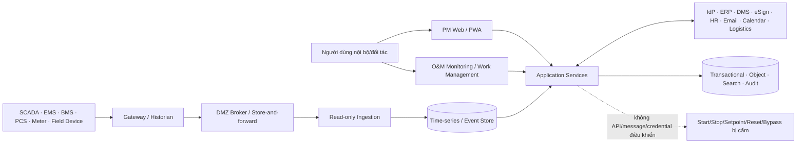
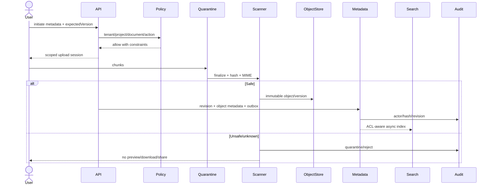

# Software Requirements Specification — Nền tảng Solar & BESS

> **Purpose:** Chuyển 198 FR và 24 NFR trong PRD thành hành vi hệ thống có thể thiết kế, triển khai và kiểm thử, bao gồm validation, state, error, concurrency, idempotency, file, job, audit, integration và acceptance condition.
> **Scope:** PM Web, O&M monitoring và các luồng dữ liệu/tích hợp read-only được phê duyệt; không định nghĩa schema vật lý, endpoint, SEC/WF/TEST ID hoặc công nghệ vendor; tuyệt đối không tạo đường điều khiển OT/BESS.
> **Source:** [AGENTS.md](../AGENTS.md), [Kế hoạch tài liệu](./00-documentation-plan.md), [Vision & Scope](./01-product-vision-and-scope.md), [BRD](./02-BRD.md), [PRD](./03-PRD.md), [Baseline](./Đề%20xuất%20tính%20năng%20nền%20tảng%20Solar%20và%20BESS.md).
> **Version:** 0.2
> **Status:** Draft toàn platform; US-004 behavior profile Approved/Build-ready cho EC2 test
> **Owner:** Solution Analysis / Engineering (cá nhân: TBD)
> **Updated:** 2026-07-12
> **Approval:** US-004 EC2 test profile — Product Owner delegated 2026-07-12; toàn platform/production TBD — Product Owner, Architecture, Security, QA và các Process Owner

## 1. Mục đích, phạm vi và nguồn sự thật

PRD là nơi duy nhất định nghĩa FR/NFR/UC. SRS không đổi ý nghĩa hoặc priority; tài liệu này quy định cách hệ thống phản ứng khi nhận input hợp lệ/không hợp lệ, khi có cạnh tranh, retry, lỗi phụ thuộc và khi trạng thái bị khóa. Các forward reference tới Data Model, API, Security, Workflow, Backlog và Test phải được backfill ở reconciliation pass.

## 2. System context và ranh giới

- **PM Web:** system of engagement/record cho project governance, không là hệ điều khiển.
- **O&M monitoring:** read model, alarm triage và work management; local acknowledge không clear alarm nguồn.
- **OT:** system of record cho raw telemetry/control state; tự vận hành an toàn khi cloud/Internet lỗi.
- **External systems:** mỗi connector phải khai báo SoR, direction, field ownership, reconciliation và owner.

## 3. Actors và trust level

| Actor class | Hành vi hệ thống cho phép | Boundary bắt buộc |
|---|---|---|
| Executive/PMO/PM/functional owner | Query, command và approval trong data scope | SoD/status lock vẫn áp cho PM/admin |
| EPC/site/QA/HSE/commissioning | Cập nhật record/evidence theo project/package/site | Safety/hold-point authority không được bypass |
| Finance/Legal/Contract/Procurement | Giao dịch nhạy cảm, approval, export theo authority | LegalEntity, value limit, conflict of interest |
| Client/contractor/supplier/OEM | Portal/share/API được cấp rõ | Không thấy bidder khác, budget nội bộ hoặc record ngoài package |
| O&M/technician | AlarmCase/Incident/WO/KPI theo asset/site | Không command OT; critical WO cần PTW/isolation |
| Tenant/IAM/Integration/SRE admin | Cấu hình kỹ thuật theo privileged workflow | Không mặc nhiên đọc nội dung business; time-bound/audit |
| Machine identity | Connector/job/gateway trong tenant/system scope | Credential riêng, rotation, least privilege, idempotency |
| AI service | Authorized retrieval và proposal | Không direct mutation/approval/sign/payment/safety closure/control |

## 4. Hợp đồng xử lý chung

### 4.1 Request/command envelope

Mọi command/API/job phải mang hoặc resolve được: tenantId; actor và effectiveActor; data-scope context; correlationId; requestId; idempotencyKey cho operation có retry; expectedVersion/If-Match cho aggregate mutable; locale/timezone; client/source timestamp khi liên quan; purpose/reason cho action nhạy cảm. Thiếu hoặc mâu thuẫn context phải deny trước khi đọc payload business.

### 4.2 Thứ tự kiểm tra

1. Xác thực identity/service credential và session/MFA/step-up.
2. Resolve tenant; chặn identifier hoặc mapping xuyên tenant.
3. Explicit deny và SoD/conflict of interest.
4. Legal hold, immutable state, signed/issued/status lock và safety gate.
5. ABAC theo legal entity/project/site/package/department/object/field/relationship/effective time.
6. RBAC action permission.
7. Owner/external share nếu policy cho phép.
8. Schema/type/unit/currency/time/file validation.
9. Domain invariant, reference, state transition và expected version.
10. Commit domain mutation + audit/outbox trong transaction; side effect bất đồng bộ sau commit.

### 4.3 Validation levels

| Level | Ví dụ | Kết quả |
|---|---|---|
| Envelope/schema | thiếu field, type, enum, format, quá limit | 400 VALIDATION_ERROR với field issues; zero mutation |
| Identity/policy | chưa xác thực, MFA thiếu, ngoài scope | 401/403; không tiết lộ record tồn tại |
| Reference/tenant | FK logic không tồn tại hoặc khác tenant/project | 404/409 theo leakage policy; audit denial |
| State/invariant | transition sai, record locked, safety prerequisite fail | 409 DOMAIN_STATE_CONFLICT/422 BUSINESS_RULE_FAILED |
| Concurrency | expectedVersion cũ | 409 VERSION_CONFLICT kèm current version/refetch hint |
| Idempotency | cùng key + cùng request; cùng key + payload khác | replay response cũ; hoặc 409 IDEMPOTENCY_KEY_REUSED |
| Dependency | ERP/DMS/eSign/scan/queue không sẵn sàng | 202 queued nếu an toàn; 424/503 nếu không; không giả success |

### 4.4 Transaction, concurrency và idempotency

- Transaction boundary là một aggregate/context; không distributed transaction xuyên module.
- Business mutation, audit reference và outbox event phải commit hoặc rollback cùng nhau.
- Read-modify-write dùng optimistic version; pessimistic/serialized path chỉ khi có bằng chứng và ADR.
- Idempotency record scope gồm tenant + actor/client + operation + key + request hash + expiry policy.
- Callback/webhook/worker dùng external event ID/checkpoint; duplicate trả success-compatible nhưng không lặp side effect.
- Retry có exponential/backoff policy TBD, max attempt, DLQ, replay authorization và reconciliation.
- Immutable record sửa bằng revision/correction/adjustment/retest mới, không UPDATE lịch sử.

### 4.5 Error contract

| Code family | HTTP/processing state | Nội dung an toàn |
|---|---|---|
| AUTHENTICATION_REQUIRED / MFA_REQUIRED | 401 | correlationId; không lộ policy nội bộ |
| POLICY_DENIED / TENANT_SCOPE_MISMATCH | 403 hoặc 404 theo anti-enumeration | reason class, không lộ object ngoài scope |
| VALIDATION_ERROR | 400/422 | field, rule code, localized message, rejected value redacted |
| VERSION_CONFLICT / STATE_CONFLICT | 409 | expected/current version hoặc current state nếu user được xem |
| IDEMPOTENCY_KEY_REUSED | 409 | key scope và original request reference |
| FILE_QUARANTINED / MALWARE_DETECTED | 422/423 | scan state; không cho download/preview |
| DEPENDENCY_UNAVAILABLE | 424/503 | retryable, retryAfter, dependency class, correlation |
| RATE_LIMITED | 429 | limit scope, reset/retryAfter; không gây partial mutation |
| INTERNAL_ERROR | 500 | opaque errorId/correlation; detail chỉ trong protected logs |
| JOB_PARTIAL / RECONCILIATION_REQUIRED | async terminal state | counts, safe item-level issue file và owner |

## 5. Functional system specification theo behavior profile

Các profile sau quy định hành vi thực thi cho mọi FR thuộc dải; mục 12 liệt kê đủ 198 FR và profile tương ứng.

### 5.1 OPP — Opportunity & Investment (FR-001…FR-009)

- **Persistence/ownership logic:** Opportunity, SurveyPackage, EnergyProfile và scenario/decision snapshot.
- **Command/query behavior:** Tách dữ liệu measured, derived và assumed; mọi calculation run giữ input, formula/config version, unit, currency và output snapshot.
- **Validation:** customer/site/owner bắt buộc; chống trùng opportunity; survey có provenance; interval, tariff và technical constraint không được suy đoán.
- **State/immutability:** Lead → Qualified → Surveyed → Screened → Submitted → Approved/Rejected → Converted; approved scenario bất biến.
- **Async/integration:** OCR, simulation và report chạy job có idempotency/progress; conversion sang Project dùng command có correlation, không copy ngầm.
- **Error codes chính:** OPP_VALIDATION, DATA_QUALITY_INSUFFICIENT, SCENARIO_INFEASIBLE, VERSION_CONFLICT.
- **Acceptance condition cấp profile:** cùng input/version cho cùng kết quả trong tolerance đã duyệt; thiếu dữ liệu hiển thị Assumption/TBD và không tạo decision giả.

### 5.2 PFM — Portfolio & Command Center (FR-010…FR-015)

- **Persistence/ownership logic:** Portfolio, project read model, HealthSnapshot, action/escalation projection.
- **Command/query behavior:** Đọc snapshot nhất quán theo as-of và data scope; Health Score tính từng trụ cột, loại N/A, tái phân bổ trọng số và áp hard-cap trước khi tổng hợp.
- **Validation:** mỗi widget cùng tenant/filter/data-date; record nguồn có freshness/completeness; currency/unit không bị trộn.
- **State/immutability:** Health snapshot Draft/Computed/Published/Stale; action Open/InProgress/Blocked/Done/Cancelled.
- **Async/integration:** refresh/read-model và export chạy nền; drill-down luôn truy về source record.
- **Error codes chính:** SNAPSHOT_STALE, SOURCE_INCOMPLETE, POLICY_DENIED, REPORT_JOB_FAILED.
- **Acceptance condition cấp profile:** điểm, màu, confidence và hard-cap tái tính được; N/A không bị coi zero; user chỉ thấy project được phép.

### 5.3 PRJ — Project Controls (FR-016…FR-025)

- **Persistence/ownership logic:** Project, Site, Package, WBSNode, Activity, Dependency, Baseline, ProgressUpdate và RACI.
- **Command/query behavior:** Mọi mutation dùng project/package scope và expected version; baseline publish là snapshot atomic; actual/progress append/correction, không ghi đè lịch sử.
- **Validation:** project code/scope; owner/RACI; dependency không cycle; calendar/date/quantity hợp lệ; rebaseline có reason/authority.
- **State/immutability:** Project phase tách record status; Activity Draft/Ready/InProgress/Blocked/Complete/Cancelled; Baseline Draft/Submitted/Approved/Superseded.
- **Async/integration:** schedule import/reconciliation và forecast calculation chạy job idempotent.
- **Error codes chính:** DEPENDENCY_CYCLE, BASELINE_LOCKED, INVALID_PHASE, VERSION_CONFLICT, EXTERNAL_MASTER_CONFLICT.
- **Acceptance condition cấp profile:** baseline cũ bất biến, critical dependency và forecast truy vết; concurrent update không mất dữ liệu.

### 5.4 DOC — Document Control (FR-026…FR-035)

- **Persistence/ownership logic:** Document, DocumentRevision, ReviewCycle/Comment, Transmittal, SignatureEnvelope và object metadata.
- **Command/query behavior:** File vào quarantine, chunk finalize, hash và malware scan trước commit; metadata/revision transaction liên kết đúng immutable object; current-for-use là projection.
- **Validation:** document/revision/transmittal code unique theo scope; MIME/size/hash/scan; reviewer/approver/recipient và classification policy.
- **State/immutability:** Revision Draft → InReview → Approved → Issued/Signed → Superseded/Archived; Quarantined/Rejected là nhánh riêng.
- **Async/integration:** scan, OCR, preview, indexing, e-sign callback và transmittal delivery có retry/idempotency.
- **Error codes chính:** FILE_QUARANTINED, HASH_MISMATCH, REVISION_LOCKED, CODE_CONFLICT, SIGNATURE_INVALID.
- **Acceptance condition cấp profile:** unsafe file không preview/search/download; issued/signed không ghi đè; transmittal giữ đúng revision/hash/recipient snapshot.

### 5.5 CTR — Contract & Legal (FR-036…FR-044)

- **Persistence/ownership logic:** Contract, ContractParty snapshot, Appendix, Obligation, Guarantee, Permit và negotiation evidence.
- **Command/query behavior:** Contract dùng stable LegalEntity/Person IDs nhưng ký xong giữ legal/authority snapshot; appendix là record riêng bắt buộc parent contract; consolidated terms là read model theo effective date.
- **Validation:** contract number unique trong Project; party role/signer authority/effective date/value/currency/clause/evidence.
- **State/immutability:** Contract Draft → Review → Approved → Signed → Effective → Suspended/Expired/Closed; Obligation Open/Due/Overdue/Fulfilled/Waived/Cancelled.
- **Async/integration:** deadline/expiry reminders và consolidated view refresh qua event.
- **Error codes chính:** CONTRACT_NUMBER_CONFLICT, SIGNER_UNAUTHORIZED, LEGAL_HOLD, OBLIGATION_EVIDENCE_REQUIRED.
- **Acceptance condition cấp profile:** master data thay đổi không sửa signed snapshot; fulfillment/waiver có authority và evidence; legal hold thắng delete.

### 5.6 ENG — Engineering & Equipment Catalog (FR-045…FR-052)

- **Persistence/ownership logic:** DesignBasis, deliverable/interface register, EquipmentModel, BOM/BOMLine và technical deviation.
- **Command/query behavior:** Design/BOM revision được version hóa; released snapshot cấp demand cho Procurement qua event; substitution không sửa BOM nguồn.
- **Validation:** discipline/revision/interface; rating/unit; model/manufacturer; BOM quantity; approved design reference; substitution equivalence/authority.
- **State/immutability:** Draft → Review → Approved/Released → Superseded; Deviation Proposed → Assessed → Approved/Rejected.
- **Async/integration:** rule/checklist, comparison và downstream demand projection.
- **Error codes chính:** DESIGN_REVISION_LOCKED, INTERFACE_UNRESOLVED, SUBSTITUTION_UNAPPROVED, SPEC_CONFLICT.
- **Acceptance condition cấp profile:** procurement dùng đúng released revision; replacement/substitution giữ lineage và engineering decision.

### 5.7 CST — Cost, Budget & Payment (FR-053…FR-060)

- **Persistence/ownership logic:** CostCode, BudgetVersion, Commitment, Invoice, Payment, PaymentComponent và FXSnapshot.
- **Command/query behavior:** Money dùng fixed decimal + currency; conversion chỉ tạo reporting value qua dated FX snapshot; Payment là aggregate riêng có contractId, payer và payee LegalEntity bắt buộc.
- **Validation:** budget/commitment availability; contract/status; payer khác payee; component VAT/retention/recovery; currency/rounding; SoD và approval limit.
- **State/immutability:** Budget Draft/Submitted/Approved/Superseded; Payment Draft/Submitted/Approved/Rejected/Sent/Paid/Reconciled/Cancelled.
- **Async/integration:** ERP posting/paid reconciliation và cashflow/report job idempotent.
- **Error codes chính:** CONTRACT_REQUIRED, CURRENCY_MISMATCH, BUDGET_EXCEEDED, SOD_CONFLICT, PAYMENT_LOCKED.
- **Acceptance condition cấp profile:** không cộng trực tiếp khác currency; paid/reconciled không sửa; adjustment là transaction mới; payer → payee hiển thị đúng.

### 5.8 PRC — Procurement & Supplier (FR-061…FR-068)

- **Persistence/ownership logic:** SupplierProfile, Requisition, RFQ, Bid, Evaluation, Award và PurchaseOrder/Line.
- **Command/query behavior:** Bid payload được cô lập theo bidder; technical/commercial evaluation tách theo policy; award/PO chỉ phát hành sau workflow decision và budget/design checks.
- **Validation:** supplier qualification/expiry; requisition source; bidder scope; due date; line quantity/price/currency; SoD; PO number/revision.
- **State/immutability:** Requisition Draft/Submitted/Approved; RFQ Draft/Issued/Closed; Bid Draft/Submitted/Sealed/Open; PO Draft/Approved/Issued/Amended/Closed/Cancelled.
- **Async/integration:** invitation, deadline, comparison, ERP sync và acknowledgment.
- **Error codes chính:** SUPPLIER_INELIGIBLE, BID_ACCESS_DENIED, AWARD_SOD_CONFLICT, PO_REVISION_CONFLICT.
- **Acceptance condition cấp profile:** bidder không thấy đối thủ/nội bộ; PO amendment tạo revision; demand/award/commitment trace end-to-end.

### 5.9 LOG — Logistics & Inventory (FR-069…FR-074)

- **Persistence/ownership logic:** Shipment, milestone, GoodsReceipt, receipt exception, InventoryTransaction và SerialNumber.
- **Command/query behavior:** Committed date, forecast ETA và actual tách biệt; partial receipt tạo line/lot; stock ledger append-only; serial capture giữ source receipt/model.
- **Validation:** PO/line/quantity; tracking/milestone order; site/location; condition; serial format/uniqueness policy; quarantine.
- **State/immutability:** Shipment Planned/Booked/InTransit/Customs/Delivered/Exception/Closed; Receipt Draft/Inspected/Accepted/Quarantined/Rejected.
- **Async/integration:** carrier ingestion, ETA alert, reconciliation và warranty/equipment seed.
- **Error codes chính:** OVER_RECEIPT, SERIAL_CONFLICT, MATERIAL_QUARANTINED, CARRIER_MAPPING_ERROR.
- **Acceptance condition cấp profile:** ETA không ghi đè committed date; thiếu/hỏng/trùng serial tạo exception; quarantined item không được issue.

### 5.10 CON — Construction & Field (FR-075…FR-084)

- **Persistence/ownership logic:** Workfront, DailyLog, QuantityProgress, SiteInstruction, field evidence và offline sync envelope.
- **Command/query behavior:** Offline chỉ tạo draft/queue mã hóa có client ID/idempotency; server kiểm quyền/state/version lại khi sync; signed log sửa bằng correction revision.
- **Validation:** workfront readiness, IFC revision, PTW/material/hold point; date/shift/zone; quantity basis/unit; evidence hash/location policy.
- **State/immutability:** Workfront Planned/Ready/Released/InProgress/Suspended/Complete; DailyLog Draft/Submitted/Signed/Corrected.
- **Async/integration:** upload scan, sync/retry/conflict, progress aggregation và overdue action.
- **Error codes chính:** WORKFRONT_NOT_READY, OFFLINE_TOKEN_REVOKED, SYNC_CONFLICT, QUANTITY_EXCEEDS_BASIS.
- **Acceptance condition cấp profile:** reconnect không tạo trùng; conflict hiển thị người dùng; không ký/approve offline; evidence/source time giữ nguyên.

### 5.11 HSE — HSE (FR-085…FR-090)

- **Persistence/ownership logic:** PermitToWork, HSEInspection, HSEIncident, StopWork event và CAPA.
- **Command/query behavior:** Emergency report/stop-work không chờ workflow; chỉ designated authority cấp PTW/lift stop-work; restricted personal data tách field-level scope.
- **Validation:** hazard/JSA/isolation/competency/validity; issuer independence; incident severity/time/site; CAPA owner/evidence/effectiveness.
- **State/immutability:** PTW Draft/Requested/Issued/Active/Suspended/Expired/Closed; Incident Reported/Triaged/Investigating/CAPA/Verified/Closed.
- **Async/integration:** expiry/escalation, mandatory notification và Health hard-cap event.
- **Error codes chính:** SAFETY_PRECONDITION_FAILED, PERMIT_EXPIRED, LIFT_AUTHORITY_REQUIRED, RESTRICTED_DATA.
- **Acceptance condition cấp profile:** stop-work lập tức chặn workfront; không conditional bypass; critical closure có independent verification.

### 5.12 QAC — Quality Assurance & Control (FR-091…FR-097)

- **Persistence/ownership logic:** ITP, Inspection, result/measurement, NCR, disposition/CAPA và Punch.
- **Command/query behavior:** Inspection result append-only; reinspection/retest là record mới; NCR closure cần verifier khác contractor theo policy; hold point là blocking gate.
- **Validation:** ITP/current revision; prerequisite/witness/calibration; acceptance limits/unit; disposition authority; punch category/evidence.
- **State/immutability:** Inspection Requested/Ready/InProgress/Accepted/Rejected/Cancelled; NCR Open/Investigating/Disposition/Rectification/ReadyForVerification/Closed/Reopened.
- **Async/integration:** reminder, aging, gate projection và certificate/report.
- **Error codes chính:** HOLD_POINT_BLOCKED, RESULT_IMMUTABLE, NCR_CLOSE_SOD, ACCEPTANCE_CRITERIA_MISSING.
- **Acceptance condition cấp profile:** failed không đổi trực tiếp pass; use-as-is có authority; punch/NCR ảnh hưởng COD đúng category.

### 5.13 RSK — Risk, Issue, Change & Claim (FR-098…FR-105)

- **Persistence/ownership logic:** Risk, Issue và ChangeRequest là aggregate riêng, project-scoped và optional package-scoped; RiskIssueAction là child entity có đúng một parent. Claim/Variation giữ aggregate riêng nhưng physical `DB-068` chờ Contract/Legal slice. DB-098 giữ audit timeline; audit không thay domain event.
- **Command/query behavior:** Risk và Issue dùng DTO/state riêng; Risk Occurred phải atomically tạo/link Issue. Change tạo từ Risk/Issue phải copy source/evidence snapshot, không auto-approve. Impact chốt scope/schedule/cost/quality/HSE/contract, source baseline và SHA-256; Project Controls chỉ đọc approved Change qua public application port trong rebaseline transaction và cung cấp reverse baseline query.
- **Validation:** Risk cause-event-impact, probability/impact integer 1…5, owner/due; Issue actual impact/root cause/severity/owner/target; action owner/due/evidence; Change six impact dimensions, schedule impact, source current baseline, numeric(19,4)+currency và authority. Package actor chỉ exact package; project-level/null và approval cần full-project scope.
- **Scoring V1:** cost/schedule/HSE impact đều 1…5; server tính `impactRating = max(costImpact, scheduleImpact, hseImpact)` và `exposure = probability × impactRating`; client không ghi derived score. LOW 1…7, MEDIUM 8…14, HIGH 15…19, CRITICAL 20…25; score/band/version được snapshot. Threshold/scan interval/version là env range-validated và không sửa lịch sử khi config đổi.
- **State/immutability:** Risk `IDENTIFIED→ASSESSED→TREATING→MONITORING→CLOSURE_PENDING→CLOSED`, active→`OCCURRED`; Issue `REPORTED→TRIAGED→IN_PROGRESS→RESOLVED→CLOSURE_PENDING→CLOSED`, explicit reopen; Change `DRAFT→ASSESSED→SUBMITTED→APPROVED|RETURNED|REJECTED`, `RETURNED→ASSESSED`, downstream explicit `IMPLEMENTED→CLOSED`. Approved impact/decision/hash và baseline snapshot bất biến.
- **Closure/SoD:** Mọi closure cần evidence, không còn action mở/chưa verify và approver khác creator/owner/requester; HIGH/CRITICAL cần elevated permission. Change requester/submitter không tự approve; delegation/multiple roles không bypass actor.
- **Async/integration:** committed audit/outbox, reminder/escalation/DB-105 dedup notification và Command Center summary. External early-warning adapters FR-105 chờ source delivery/obligation/NCR/punch; không có luồng OT command.
- **Error codes chính:** RISK_NOT_FOUND, ISSUE_NOT_FOUND, ACTION_NOT_FOUND, CHANGE_REQUEST_NOT_FOUND, INVALID_STATE_TRANSITION, IMPACT_INCOMPLETE, CLOSE_EVIDENCE_REQUIRED, CLOSE_APPROVAL_SOD, CHANGE_APPROVAL_SOD, CHANGE_APPROVAL_REQUIRED, BASELINE_MISMATCH, SCHEDULE_IMPACT_NOT_APPROVED, VERSION_CONFLICT, CLAIM_NOTICE_AT_RISK.
- **Acceptance condition cấp profile:** risk đã xảy ra không bị đóng âm thầm; register không trộn; history/action/alert đúng scope; approved decision và before/after baseline truy hai chiều. AC-014…017 không đồng nghĩa FR-103/Claim hoặc mọi adapter FR-105 đã Complete.

### 5.14 COM — Commissioning & COD (FR-106…FR-114)

- **Persistence/ownership logic:** CommissioningSystem, TestPack, TestRun, Defect link, CODGate, CODPackage và Handover receipt.
- **Command/query behavior:** Test run giữ procedure/instrument/criterion/witness/raw evidence snapshot; fail/abort không sửa; retest dùng previousRunId; readiness tính từ gate evidence tại as-of.
- **Validation:** system boundary/prerequisite/safe state/calibration; result criteria; gate mandatory/waivable/expiry; signer/recipient authority.
- **State/immutability:** System NotReady/ReadyForTest/Testing/Passed/Failed; TestRun Planned/Running/Passed/Failed/Aborted; COD Draft/Ready/Submitted/Signed/HandedOver.
- **Async/integration:** readiness recalculation, evidence expiry, report/package generation và O&M seed.
- **Error codes chính:** TEST_PREREQUISITE_FAILED, TEST_RESULT_LOCKED, COD_GATE_BLOCKED, HANDOVER_REJECTED.
- **Acceptance condition cấp profile:** failed test chỉ qua retest; mandatory non-waivable gate chặn COD; signed package/handover receipt bất biến.

### 5.15 OMM — O&M Monitoring & Work Management (FR-115…FR-124)

- **Persistence/ownership logic:** AlarmCase, ServiceIncident, WorkOrder, MaintenancePlan, WarrantyClaim và performance read models.
- **Command/query behavior:** OT AlarmEvent chỉ là immutable input; local acknowledge/triage không clear/reset/suppress nguồn; WO command tách khỏi Activity và control system.
- **Validation:** asset/handover/status; alarm source/quality; priority/SLA; technician/competency; PTW/isolation; return-to-service verifier.
- **State/immutability:** AlarmCase Open/Acknowledged/Investigating/Linked/Closed; WO Draft/Approved/Scheduled/Dispatched/InProgress/Complete/Verified/Closed/Cancelled.
- **Async/integration:** correlation, maintenance generation, SLA clock, dispatch notification và warranty follow-up.
- **Error codes chính:** OT_DATA_STALE, WORK_ORDER_SAFETY_BLOCK, CLOSE_AUTHORITY_REQUIRED, CMMS_RECONCILIATION.
- **Acceptance condition cấp profile:** technician Complete nhưng verifier Close; OT stale không safe; không operation tạo BESS/OT command.

### 5.16 SOL — Solar-specific (FR-125…FR-129)

- **Persistence/ownership logic:** SolarPlant configuration, equipment hierarchy, design/performance baseline và KPI snapshot.
- **Command/query behavior:** Hierarchy và capacity/version liên kết model/serial/design/test/meter; performance formula giữ data window, irradiance/weather/curtailment/availability provenance.
- **Validation:** DC/AC capacity, string/inverter topology, unit/timezone, meter/tag quality, baseline/version và exclusion rule.
- **State/immutability:** Configuration Draft/Released/Superseded; KPI Calculated/Reviewed/Approved/Stale.
- **Async/integration:** time-series aggregation và performance report.
- **Error codes chính:** SOLAR_CONFIG_INVALID, KPI_DATA_INCOMPLETE, BASELINE_VERSION_MISMATCH.
- **Acceptance condition cấp profile:** PR/yield/loss tái tính được; missing/stale không coi zero; drill-down tới asset/tag/source.

### 5.17 BES — BESS-specific (FR-130…FR-137)

- **Persistence/ownership logic:** BESSPlant hierarchy/configuration, operating envelope snapshot, test/performance/degradation result.
- **Command/query behavior:** Mô hình container/rack/module/cell selected nodes, PCS/BMS/EMS/HVAC/fire system và serial/firmware lineage; mọi dispatch/peak-shaving chỉ là simulation/advisory.
- **Validation:** MW/MWh, SOC min/max, power/ramp/efficiency/cycle/temperature constraints, hierarchy consistency, safety dossier và tag quality.
- **State/immutability:** Configuration Draft/Released/Superseded; Assessment Draft/Reviewed/Approved/Stale.
- **Async/integration:** capacity/RTE/SoH/degradation calculation và anomaly read model.
- **Error codes chính:** BESS_CONSTRAINT_INFEASIBLE, SAFETY_EVIDENCE_MISSING, TELEMETRY_STALE, CONTROL_OPERATION_PROHIBITED.
- **Acceptance condition cấp profile:** simulation không vượt constraints; không lưu control credential và không phát start/stop/setpoint/reset/bypass.

### 5.18 WFL — Workflow & Notification (FR-138…FR-145)

- **Persistence/ownership logic:** WorkflowDefinition/Version, WorkflowInstance, Step/Decision và delivery projection.
- **Command/query behavior:** Instance snapshot đúng published version; route resolution áp authority/SoD/delegation/quorum; domain aggregate tự kiểm invariant trước final transition.
- **Validation:** object type/state, requester, approver data scope, effective period/value limit, quorum, condition và SLA.
- **State/immutability:** Draft → Submitted → InReview → Returned/Rejected/ConditionallyApproved/Approved/Cancelled; ConfigurationError/Expired là nhánh.
- **Async/integration:** reminder/escalation/notification; escalation không auto-approve.
- **Error codes chính:** WORKFLOW_CONFIGURATION_ERROR, APPROVER_NOT_FOUND, SOD_CONFLICT, DECISION_ALREADY_RECORDED.
- **Acceptance condition cấp profile:** decision append-only ghi actor/effective actor/reason/version; definition mới không đổi running instance.

### 5.19 IAM — Identity, Tenant & Authorization (FR-146…FR-155)

- **Persistence/ownership logic:** Tenant, identity mapping, role/policy assignment, delegation và access/audit projection.
- **Command/query behavior:** Mọi entry point resolve tenant + subject; policy order explicit deny/SoD → hold/lock → scope → role → owner/share; field/file/search/job cùng evaluator.
- **Validation:** issuer/subject/session/MFA; role/scope/effective time; delegation không chain/vượt quyền; privileged access/time limit.
- **State/immutability:** User Invited/Active/Suspended/Disabled; Assignment Proposed/Active/Expired/Revoked; Delegation Draft/Active/Expired/Revoked.
- **Async/integration:** IdP/HR sync, expiry/review/revocation propagation.
- **Error codes chính:** AUTHENTICATION_REQUIRED, MFA_REQUIRED, POLICY_DENIED, TENANT_SCOPE_MISMATCH, DELEGATION_INVALID.
- **Acceptance condition cấp profile:** cross-tenant identifier luôn deny; PM không tự duyệt; admin không mặc nhiên đọc business data; audit ghi policy outcome.

### 5.20 INT — Integration & Read-only OT Ingress (FR-156…FR-177)

- **Persistence/ownership logic:** ConnectorDefinition, ExternalMapping, SyncRun/checkpoint, ReconciliationCase, TagRegistry và derived delivery state.
- **Command/query behavior:** Mỗi connector khai báo SoR, direction, field owner, schedule/event, idempotency key, retry/DLQ/reconciliation; OT flow chỉ outbound gateway/DMZ → cloud.
- **Validation:** tenant/system/object mapping, schema/version, credential, checksum, source timestamp/unit/quality/sequence; allowlist tag/certificate.
- **State/immutability:** Connector Disabled/Enabled/Degraded/Paused; Sync Queued/Running/Succeeded/Partial/Failed/Reconciled.
- **Async/integration:** toàn bộ sync/webhook/telemetry ingestion qua durable worker; callback/replay idempotent.
- **Error codes chính:** MAPPING_MISSING, SCHEMA_DRIFT, REPLAY_DETECTED, RECONCILIATION_REQUIRED, OT_COMMAND_PROHIBITED.
- **Acceptance condition cấp profile:** partial sync không last-write-wins; gap/duplicate/out-of-order được flag; không reverse route/API/message/credential OT.

### 5.21 AIX — Governed AI Assistance (FR-178…FR-198)

- **Persistence/ownership logic:** AIUseCase/Policy, AIRun/Proposal, citation/confidence, ReviewDecision và audit metadata; không sở hữu domain record.
- **Command/query behavior:** Policy authorize user/corpus/use case; sanitize/retrieve scoped data; model gateway tạo proposal; human accept/edit/reject; chỉ tạo domain Draft qua command hợp lệ.
- **Validation:** tenant/data access, consent/classification, allowed model/prompt version, citation coverage, confidence/quality threshold và kill switch.
- **State/immutability:** Requested/Running/Proposed/NeedsReview/Accepted/Edited/Rejected/Failed/Revoked.
- **Async/integration:** OCR/inference/evaluation chạy job; model timeout/retry không duplicate domain draft.
- **Error codes chính:** AI_USE_CASE_DISABLED, CORPUS_ACCESS_DENIED, CITATION_INSUFFICIENT, CONFIDENCE_LOW, UNSAFE_ACTION_BLOCKED.
- **Acceptance condition cấp profile:** AI không approve/sign/pay/close safety item/control BESS; original/output/correction/reviewer/model version audit đầy đủ.

## 6. File handling và DMS pipeline

- Multipart/chunk retry không tạo revision thứ hai; finalize dùng idempotency key và expected upload session state.
- File bytes không đi qua transactional DB; metadata giữ object locator, content hash, size, MIME, scan engine/version/result, uploader và timestamps.
- Preview/OCR/index chỉ đọc object Safe; signed/issued artifact xác minh hash trước phát hành.
- Replace không tồn tại cho issued/signed revision; tạo revision mới và liên kết Superseded.
- Virus scan timeout giữ Quarantined/ManualReview, không “fail open”.
- File limits, allowed types, quarantine retention, OCR language và scan SLA là TBD — DMS/Security owner.

## 7. Audit, notification và background jobs

### 7.1 Audit

Critical command ghi actor/effective actor, tenant/data scope, action, object/version/state, request/correlation/idempotency, decision/reason, result, before/after hash/reference và source IP/device khi policy cho phép. Audit store append-only/tamper-evident; domain record không được dùng để sửa audit.

### 7.2 Notification

Notification được tạo từ committed event; recipient được resolve tại send và re-check khi mở deep link. Mark-read/ack không đổi source object. Template có version/locale/channel/classification; email/Zalo/SMS không chứa secret hoặc nội dung nhạy cảm ngoài policy. Delivery retry/DLQ độc lập với domain transaction.

### 7.3 Job model

Job có tenantId, type, input snapshot/hash, requestedBy, data scope snapshot, idempotency key, priority, status, progress, checkpoint, attempt, correlation và output reference/expiry. Trước mỗi access/output/download phải kiểm quyền hiện hành; revocation có thể Cancel/Redact kết quả theo policy. Các trạng thái: Queued → Running → Succeeded/Partial/Failed/Cancelled/Expired; retry không trở về Queued nếu đã có side effect chưa reconcile.

## 8. Search, dashboard, reporting và export

- Search index là derived state có tenant/ACL tokens, source version và indexedAt; permission evaluator vẫn re-check record/file trước open/download.
- Query hỗ trợ pagination ổn định, sort có tie-breaker, filter allowlist, maximum page/complexity TBD và opaque cursor.
- Dashboard widget dùng cùng filter/as-of/currency; snapshot hiển thị freshness/completeness/formula/version.
- Health Score: Schedule 20%, Cost 15%, Quality 10%, Safety 15%, Procurement 10%, Documentation 10%, Contract 10%, Commissioning 10%; N/A được tái phân bổ; confidence tách khỏi score; hard-cap áp trước màu xanh ≥85, vàng 70–84, đỏ <70. Các threshold là baseline proposal chờ PO.
- Export lớn chạy async; output là snapshot immutable, watermark/expiry/audit, grouped by currency hoặc reporting currency + FX snapshot; permission được re-check tại download.
- Bulk action cần preview, per-record result, idempotency và audit; không bulk approve/sign/pay/close safety item/clear OT alarm.

## 9. Integration behavior

Mỗi connector phải có contract registry: system, owner, SoR, object/field ownership, direction, trigger/frequency, schema/version, identity, idempotency, retry/DLQ, reconciliation, data classification, retention và kill switch. Không last-write-wins khi hai nguồn cùng field; mismatch tạo ReconciliationCase.

| Nhóm | Direction mặc định | System behavior |
|---|---|---|
| ERP/accounting | Hai chiều theo field contract | Platform gửi approved request; ERP trả posting/paid; correlation/idempotency bắt buộc |
| DMS/e-sign/calendar | Hai chiều có kiểm soát | Hash/version/callback verification; không overwrite issued/signed |
| HR/IdP | Chủ yếu inbound | Identity/employment không tự cấp business role; deprovision thu hồi session/access |
| Invoice/logistics | Inbound + exception | Raw payload/reference giữ provenance; mapping/reconciliation |
| Zalo/SMS/email | Outbound | Chỉ notification; inbound không tự đổi domain state |
| OT telemetry/alarm | Chỉ OT → gateway/DMZ → cloud | Allowlist, mTLS/certificate, source/receive time, unit/quality/sequence; không reverse channel |

## 10. Security behavior ở cấp SRS

Chi tiết SEC và permission matrix thuộc tài liệu 09. SRS bắt buộc:

- tenant isolation ở API, DB reference, object key, search, cache, event, job, log, audit và backup manifest;
- RBAC + ABAC + SoD + legal hold/status lock theo thứ tự mục 4.2;
- MFA/step-up cho privileged, approval/sign/export/payment/admin tùy policy;
- secret không nằm trong source/config/log/domain DB; rotation/revocation/audit;
- encryption in transit/at rest, key boundary/ownership TBD;
- field-level restriction cho HSE PII, legal privilege, bid, payroll/payment/bank và security data;
- external share có expiry/revoke/watermark/download rule;
- PM/O&M không có API/message/credential/routes để điều khiển OT/BESS;
- AI retrieval dùng cùng policy và chỉ trả proposal.

## 11. NFR quality scenarios

| NFR | Environment/precondition | Stimulus | Required response | Measure/failure threshold |
|---|---|---|---|---|
| [NFR-001](./03-PRD.md#nfr-001) | Tenant có dữ liệu đại diện và workload 500 project active | Tăng đồng thời query/command/job/export qua nhiều tenant | Scale/bound tài nguyên theo tenant; mọi result/job/cache/search key giữ tenant scope | Hoàn tất workload với zero cross-tenant result; concurrent user/record/telemetry profile TBD |
| [NFR-002](./03-PRD.md#nfr-002) | API tương tác ở tải chuẩn | Gọi operation mix PM Web | Trả response hoặc lỗi chuẩn; việc nặng chuyển job | Server-side p95 ≤ 2 s; benchmark boundary/concurrency TBD |
| [NFR-003](./03-PRD.md#nfr-003) | Search index đã build với ACL | Chạy query/filter/snippet mix | Trả chỉ document/record được phép và freshness metadata | p95 ≤ 3 s; corpus/OCR/index lag TBD; zero ACL leak |
| [NFR-004](./03-PRD.md#nfr-004) | Portfolio/project snapshot đã sẵn sàng | Mở Command Center với widget/filter | Dùng cùng as-of/filter, hiển thị freshness/confidence và drill-down | p95 ≤ 5 s; widget/portfolio/cache profile TBD |
| [NFR-005](./03-PRD.md#nfr-005) | Export vượt ngưỡng tương tác | Submit hoặc submit trùng | Tạo một job idempotent, progress/cancel/failure, file expiry và notification | Interactive pool không suy giảm quá target TBD; không duplicate output/side effect |
| [NFR-006](./03-PRD.md#nfr-006) | Service tier đang vận hành | Synthetic request và outage/maintenance | Tính SLI theo policy, dùng error budget và communication path | SLO %, window và tier TBD trước production |
| [NFR-007](./03-PRD.md#nfr-007) | Business transaction commit hoặc worker lỗi giữa chừng | DB/event/queue/consumer failure và replay | Outbox giữ event; retry/DLQ/replay quan sát được; consumer idempotent | Zero lost committed event và zero duplicate side effect |
| [NFR-008](./03-PRD.md#nfr-008) | Resource nằm trong backup inventory | Job backup thành công hoặc thất bại | Mã hóa, version/immutable copy, owner/latest-success và alert | 100% inventory covered; cadence/retention/region/account TBD |
| [NFR-009](./03-PRD.md#nfr-009) | Recovery point được chọn | Restore DB/object/config/audit/derived index | Khôi phục theo dependency; checksum, ACL, referential/business reconciliation | RPO/RTO TBD; không duplicate approval/payment/event |
| [NFR-010](./03-PRD.md#nfr-010) | Primary environment/site không dùng được | Kích hoạt DR rồi failback | Theo runbook/communication; giữ tenant boundary và recovery manifest | DR cadence baseline hằng năm; target region/RPO/RTO/failback TBD |
| [NFR-011](./03-PRD.md#nfr-011) | Record đến hạn retention hoặc có legal hold | Purge/hold/release được yêu cầu | Policy version/effective date quyết định; hold chặn delete/purge; audit đầy đủ | 100% record class có policy hoặc TBD; period do Legal xác nhận |
| [NFR-012](./03-PRD.md#nfr-012) | Hai actor/job cập nhật cùng aggregate | Concurrent command, retry hoặc partial failure | Expected version phát hiện conflict; transaction atomic rollback; idempotency replay response | Không silent overwrite/partial payment/decision/issuance |
| [NFR-013](./03-PRD.md#nfr-013) | Tính VAT/retention/FX/tổng nhiều currency | Nhập, tính, export, round-trip | Dùng decimal/currency/rounding rule và dated FX snapshot; group currency | Tái tính đúng examples; precision/rounding per currency TBD |
| [NFR-014](./03-PRD.md#nfr-014) | User/site/source ở timezone khác hoặc event đến muộn | Nhập/query/export/integration | Giữ instant, site/user timezone, source/receive/process time | Boundary/DST/out-of-order round-trip không đổi nghĩa; storage format TBD |
| [NFR-015](./03-PRD.md#nfr-015) | User đổi Việt/Anh và locale/unit | Mở screen/report hoặc nhập dữ liệu | Resource translation/fallback; format hiển thị không đổi canonical value | Critical journey bilingual; glossary/completeness TBD |
| [NFR-016](./03-PRD.md#nfr-016) | Người dùng keyboard/screen reader/low vision | Thực hiện critical journey và gặp lỗi | Focus/name/role/state/error rõ; không truyền nghĩa chỉ bằng màu | Automated + manual checks; conformance level TBD |
| [NFR-017](./03-PRD.md#nfr-017) | Approved desktop/tablet/mobile viewport/browser | Resize/rotate/thực hiện field flow | Không mất action/draft/evidence; layout và input phù hợp | Approved matrix pass; version/OS/device TBD |
| [NFR-018](./03-PRD.md#nfr-018) | PWA mất mạng hoặc thiết bị bị revoke | Tạo draft/ảnh, reconnect, duplicate/conflict | Encrypted allowed cache; idempotent queue; conflict UI; revoke áp khi kết nối | Không offline approve/sign/pay; duration/storage/class TBD |
| [NFR-019](./03-PRD.md#nfr-019) | Upload sạch, nhiễm, timeout, partial hoặc duplicate | Finalize file | Hash + quarantine + scan; chỉ Safe mới commit/release/index/download | Unsafe/unknown không thoát quarantine; type/size/SLA/retention TBD |
| [NFR-020](./03-PRD.md#nfr-020) | Cùng identity/context qua UI/API/search/export/job | Query hoặc quyền thay đổi | Dùng cùng policy/data scope và re-check tại download/job execution | Zero tenant/legal/project/package/document leak; propagation SLA TBD |
| [NFR-021](./03-PRD.md#nfr-021) | Request/job/connector/telemetry đi qua nhiều component | Lỗi, latency hoặc support investigation | Structured log/metric/trace/correlation; redaction; alert owner/runbook | Trace end-to-end; coverage/SLO/threshold TBD |
| [NFR-022](./03-PRD.md#nfr-022) | Critical action hoặc audit pipeline bị can thiệp | Ghi, đọc, export hoặc verify audit | Append-only/tamper evidence, actor/effective actor/object/time/result/correlation | 100% critical-action catalog; gap/tamper phát hiện; retention TBD |
| [NFR-023](./03-PRD.md#nfr-023) | Thay module/schema/config/contract | Build, deploy, migrate, rollback | Versioned interface/event; không private-table access; compatible migration/rollback | Architecture/static/migration checks pass; toolchain TBD |
| [NFR-024](./03-PRD.md#nfr-024) | Connector/telemetry/API đổi schema hoặc data lỗi | Sync/retry/reconcile/ingest | OpenAPI 3.1; SoR/direction/idempotency; unit/time/source/quality; gap/duplicate detection | 100% enabled connector/tag có contract/policy; no OT write |

## 12. Exhaustive FR realization ledger

Bảng này không định nghĩa lại FR. Mỗi hàng chỉ định behavior profile thực thi, failure semantics và acceptance condition hệ thống; DB/API/SEC/WF/TEST IDs sẽ được backfill từ tài liệu owner.

| FR | Source | Behavior profile | System realization | Acceptance condition / forward refs |
|---|---|---|---|---|
| [FR-001](./03-PRD.md#fr-001) | OPP-001 | [OPP](#srs-opp) | Thực hiện “Hồ sơ lead, khách hàng, nhà máy và địa điểm; tránh mất lịch sử trao đổi và trùng cơ hội” trong transaction/read model của Opportunity & Investment; áp envelope, policy, validation/state và audit/outbox của profile. | Given context, quyền, input và expected version hợp lệ, when operation được gọi, then postcondition cụ thể của FR-001 và profile được commit/return đúng một lần; invalid scope/state/version/dependency trả error chuẩn và zero unauthorized/partial side effect. DB/API/SEC/WF/TEST: TBD forward reference. |
| [FR-002](./03-PRD.md#fr-002) | OPP-002 | [OPP](#srs-opp) | Thực hiện “Khảo sát hiện trạng và điểm đấu nối có checklist; chuẩn hóa dữ liệu mái, đất, trạm điện” trong transaction/read model của Opportunity & Investment; áp envelope, policy, validation/state và audit/outbox của profile. | Given context, quyền, input và expected version hợp lệ, when operation được gọi, then postcondition cụ thể của FR-002 và profile được commit/return đúng một lần; invalid scope/state/version/dependency trả error chuẩn và zero unauthorized/partial side effect. DB/API/SEC/WF/TEST: TBD forward reference. |
| [FR-003](./03-PRD.md#fr-003) | OPP-003 | [OPP](#srs-opp) | Thực hiện “Hồ sơ tiêu thụ điện và hóa đơn; loại bỏ nhập tay phân tán” trong transaction/read model của Opportunity & Investment; áp envelope, policy, validation/state và audit/outbox của profile. | Given context, quyền, input và expected version hợp lệ, when operation được gọi, then postcondition cụ thể của FR-003 và profile được commit/return đúng một lần; invalid scope/state/version/dependency trả error chuẩn và zero unauthorized/partial side effect. DB/API/SEC/WF/TEST: TBD forward reference. |
| [FR-004](./03-PRD.md#fr-004) | OPP-004 | [OPP](#srs-opp) | Thực hiện “Quản lý bức xạ, PVSyst và dự báo sản lượng có phiên bản” trong transaction/read model của Opportunity & Investment; áp envelope, policy, validation/state và audit/outbox của profile. | Given context, quyền, input và expected version hợp lệ, when operation được gọi, then postcondition cụ thể của FR-004 và profile được commit/return đúng một lần; invalid scope/state/version/dependency trả error chuẩn và zero unauthorized/partial side effect. DB/API/SEC/WF/TEST: TBD forward reference. |
| [FR-005](./03-PRD.md#fr-005) | OPP-005 | [OPP](#srs-opp) | Thực hiện “Sizing và so sánh phương án Solar; chứng minh công suất đề xuất phù hợp tải/mặt bằng” trong transaction/read model của Opportunity & Investment; áp envelope, policy, validation/state và audit/outbox của profile. | Given context, quyền, input và expected version hợp lệ, when operation được gọi, then postcondition cụ thể của FR-005 và profile được commit/return đúng một lần; invalid scope/state/version/dependency trả error chuẩn và zero unauthorized/partial side effect. DB/API/SEC/WF/TEST: TBD forward reference. |
| [FR-006](./03-PRD.md#fr-006) | OPP-006 | [OPP](#srs-opp) | Thực hiện “Sizing BESS theo peak shaving, load shifting, self-consumption và backup” trong transaction/read model của Opportunity & Investment; áp envelope, policy, validation/state và audit/outbox của profile. | Given context, quyền, input và expected version hợp lệ, when operation được gọi, then postcondition cụ thể của FR-006 và profile được commit/return đúng một lần; invalid scope/state/version/dependency trả error chuẩn và zero unauthorized/partial side effect. DB/API/SEC/WF/TEST: TBD forward reference. |
| [FR-007](./03-PRD.md#fr-007) | OPP-007 | [OPP](#srs-opp) | Thực hiện “Mô hình tài chính nhiều phương án; tránh so sánh CAPEX/OPEX/doanh thu bằng file khác phiên bản” trong transaction/read model của Opportunity & Investment; áp envelope, policy, validation/state và audit/outbox của profile. | Given context, quyền, input và expected version hợp lệ, when operation được gọi, then postcondition cụ thể của FR-007 và profile được commit/return đúng một lần; invalid scope/state/version/dependency trả error chuẩn và zero unauthorized/partial side effect. DB/API/SEC/WF/TEST: TBD forward reference. |
| [FR-008](./03-PRD.md#fr-008) | OPP-008 | [OPP](#srs-opp) | Thực hiện “Phiên bản đề xuất kỹ thuật/thương mại và so sánh option” trong transaction/read model của Opportunity & Investment; áp envelope, policy, validation/state và audit/outbox của profile. | Given context, quyền, input và expected version hợp lệ, when operation được gọi, then postcondition cụ thể của FR-008 và profile được commit/return đúng một lần; invalid scope/state/version/dependency trả error chuẩn và zero unauthorized/partial side effect. DB/API/SEC/WF/TEST: TBD forward reference. |
| [FR-009](./03-PRD.md#fr-009) | OPP-009 | [OPP](#srs-opp) | Thực hiện “Gate phê duyệt cơ hội/đầu tư có điều kiện; tránh chuyển EPC khi thiếu giả định trọng yếu” trong transaction/read model của Opportunity & Investment; áp envelope, policy, validation/state và audit/outbox của profile. | Given context, quyền, input và expected version hợp lệ, when operation được gọi, then postcondition cụ thể của FR-009 và profile được commit/return đúng một lần; invalid scope/state/version/dependency trả error chuẩn và zero unauthorized/partial side effect. DB/API/SEC/WF/TEST: TBD forward reference. |
| [FR-010](./03-PRD.md#fr-010) | PFM-001 | [PFM](#srs-pfm) | Thực hiện “Project/portfolio master theo khách hàng, nhà máy, pháp nhân, model đầu tư, công nghệ và phase” trong transaction/read model của Portfolio & Command Center; áp envelope, policy, validation/state và audit/outbox của profile. | Given context, quyền, input và expected version hợp lệ, when operation được gọi, then postcondition cụ thể của FR-010 và profile được commit/return đúng một lần; invalid scope/state/version/dependency trả error chuẩn và zero unauthorized/partial side effect. DB/API/SEC/WF/TEST: TBD forward reference. |
| [FR-011](./03-PRD.md#fr-011) | PFM-002 | [PFM](#srs-pfm) | Thực hiện “Executive Portfolio Dashboard ưu tiên COD, vốn, cashflow và risk” trong transaction/read model của Portfolio & Command Center; áp envelope, policy, validation/state và audit/outbox của profile. | Given context, quyền, input và expected version hợp lệ, when operation được gọi, then postcondition cụ thể của FR-011 và profile được commit/return đúng một lần; invalid scope/state/version/dependency trả error chuẩn và zero unauthorized/partial side effect. DB/API/SEC/WF/TEST: TBD forward reference. |
| [FR-012](./03-PRD.md#fr-012) | PFM-003 | [PFM](#srs-pfm) | Thực hiện “PM Command Center một trang cho việc phải xử lý hôm nay” trong transaction/read model của Portfolio & Command Center; áp envelope, policy, validation/state và audit/outbox của profile. | Given context, quyền, input và expected version hợp lệ, when operation được gọi, then postcondition cụ thể của FR-012 và profile được commit/return đúng một lần; invalid scope/state/version/dependency trả error chuẩn và zero unauthorized/partial side effect. DB/API/SEC/WF/TEST: TBD forward reference. |
| [FR-013](./03-PRD.md#fr-013) | PFM-004 | [PFM](#srs-pfm) | Thực hiện “Project Health Score có công thức, confidence và hard-cap giải thích được” trong transaction/read model của Portfolio & Command Center; áp envelope, policy, validation/state và audit/outbox của profile. | Given context, quyền, input và expected version hợp lệ, when operation được gọi, then postcondition cụ thể của FR-013 và profile được commit/return đúng một lần; invalid scope/state/version/dependency trả error chuẩn và zero unauthorized/partial side effect. DB/API/SEC/WF/TEST: TBD forward reference. |
| [FR-014](./03-PRD.md#fr-014) | PFM-005 | [PFM](#srs-pfm) | Thực hiện “Report Center với template, lịch phát hành, Excel/PDF và snapshot” trong transaction/read model của Portfolio & Command Center; áp envelope, policy, validation/state và audit/outbox của profile. | Given context, quyền, input và expected version hợp lệ, when operation được gọi, then postcondition cụ thể của FR-014 và profile được commit/return đúng một lần; invalid scope/state/version/dependency trả error chuẩn và zero unauthorized/partial side effect. DB/API/SEC/WF/TEST: TBD forward reference. |
| [FR-015](./03-PRD.md#fr-015) | PFM-006 | [PFM](#srs-pfm) | Thực hiện “Notification Center: inbox, digest, subscription, acknowledge và escalation” trong transaction/read model của Portfolio & Command Center; áp envelope, policy, validation/state và audit/outbox của profile. | Given context, quyền, input và expected version hợp lệ, when operation được gọi, then postcondition cụ thể của FR-015 và profile được commit/return đúng một lần; invalid scope/state/version/dependency trả error chuẩn và zero unauthorized/partial side effect. DB/API/SEC/WF/TEST: TBD forward reference. |
| [FR-016](./03-PRD.md#fr-016) | PRJ-001 | [PRJ](#srs-prj) | Thực hiện “Project charter, phạm vi, stage/gate và owner; tạo “xương sống” thống nhất từ NTP đến COD” trong transaction/read model của Project Controls; áp envelope, policy, validation/state và audit/outbox của profile. | Given context, quyền, input và expected version hợp lệ, when operation được gọi, then postcondition cụ thể của FR-016 và profile được commit/return đúng một lần; invalid scope/state/version/dependency trả error chuẩn và zero unauthorized/partial side effect. DB/API/SEC/WF/TEST: TBD forward reference. |
| [FR-017](./03-PRD.md#fr-017) | PRJ-002 | [PRJ](#srs-prj) | Thực hiện “WBS, milestone, dependency, Gantt và baseline; thay thế lịch rời rạc” trong transaction/read model của Project Controls; áp envelope, policy, validation/state và audit/outbox của profile. | Given context, quyền, input và expected version hợp lệ, when operation được gọi, then postcondition cụ thể của FR-017 và profile được commit/return đúng một lần; invalid scope/state/version/dependency trả error chuẩn và zero unauthorized/partial side effect. DB/API/SEC/WF/TEST: TBD forward reference. |
| [FR-018](./03-PRD.md#fr-018) | PRJ-003 | [PRJ](#srs-prj) | Thực hiện “Task, kế hoạch ngày/tuần/look-ahead và phần trăm hoàn thành” trong transaction/read model của Project Controls; áp envelope, policy, validation/state và audit/outbox của profile. | Given context, quyền, input và expected version hợp lệ, when operation được gọi, then postcondition cụ thể của FR-018 và profile được commit/return đúng một lần; invalid scope/state/version/dependency trả error chuẩn và zero unauthorized/partial side effect. DB/API/SEC/WF/TEST: TBD forward reference. |
| [FR-019](./03-PRD.md#fr-019) | PRJ-004 | [PRJ](#srs-prj) | Thực hiện “Project Overview, dependency và decision log; tránh quyết định trong email không truy vết” trong transaction/read model của Project Controls; áp envelope, policy, validation/state và audit/outbox của profile. | Given context, quyền, input và expected version hợp lệ, when operation được gọi, then postcondition cụ thể của FR-019 và profile được commit/return đúng một lần; invalid scope/state/version/dependency trả error chuẩn và zero unauthorized/partial side effect. DB/API/SEC/WF/TEST: TBD forward reference. |
| [FR-020](./03-PRD.md#fr-020) | PRJ-005 | [PRJ](#srs-prj) | Thực hiện “Meeting, biên bản, quyết định và action item liên kết task/issue” trong transaction/read model của Project Controls; áp envelope, policy, validation/state và audit/outbox của profile. | Given context, quyền, input và expected version hợp lệ, when operation được gọi, then postcondition cụ thể của FR-020 và profile được commit/return đúng một lần; invalid scope/state/version/dependency trả error chuẩn và zero unauthorized/partial side effect. DB/API/SEC/WF/TEST: TBD forward reference. |
| [FR-021](./03-PRD.md#fr-021) | PRJ-006 | [PRJ](#srs-prj) | Thực hiện “Contact, stakeholder, company role và RACI theo dự án/gói thầu” trong transaction/read model của Project Controls; áp envelope, policy, validation/state và audit/outbox của profile. | Given context, quyền, input và expected version hợp lệ, when operation được gọi, then postcondition cụ thể của FR-021 và profile được commit/return đúng một lần; invalid scope/state/version/dependency trả error chuẩn và zero unauthorized/partial side effect. DB/API/SEC/WF/TEST: TBD forward reference. |
| [FR-022](./03-PRD.md#fr-022) | PRJ-007 | [PRJ](#srs-prj) | Thực hiện “Correspondence register cho thư chính thức, site memo và phản hồi” trong transaction/read model của Project Controls; áp envelope, policy, validation/state và audit/outbox của profile. | Given context, quyền, input và expected version hợp lệ, when operation được gọi, then postcondition cụ thể của FR-022 và profile được commit/return đúng một lần; invalid scope/state/version/dependency trả error chuẩn và zero unauthorized/partial side effect. DB/API/SEC/WF/TEST: TBD forward reference. |
| [FR-023](./03-PRD.md#fr-023) | PRJ-008 | [PRJ](#srs-prj) | Thực hiện “PWA hiện trường với offline queue, camera, QR và chống ghi trùng” trong transaction/read model của Project Controls; áp envelope, policy, validation/state và audit/outbox của profile. | Given context, quyền, input và expected version hợp lệ, when operation được gọi, then postcondition cụ thể của FR-023 và profile được commit/return đúng một lần; invalid scope/state/version/dependency trả error chuẩn và zero unauthorized/partial side effect. DB/API/SEC/WF/TEST: TBD forward reference. |
| [FR-024](./03-PRD.md#fr-024) | PRJ-009 | [PRJ](#srs-prj) | Thực hiện “Tìm kiếm toàn hệ thống, bộ lọc nâng cao, saved view và deep-link” trong transaction/read model của Project Controls; áp envelope, policy, validation/state và audit/outbox của profile. | Given context, quyền, input và expected version hợp lệ, when operation được gọi, then postcondition cụ thể của FR-024 và profile được commit/return đúng một lần; invalid scope/state/version/dependency trả error chuẩn và zero unauthorized/partial side effect. DB/API/SEC/WF/TEST: TBD forward reference. |
| [FR-025](./03-PRD.md#fr-025) | PRJ-010 | [PRJ](#srs-prj) | Thực hiện “Template dự án và thao tác bulk có preview/validation” trong transaction/read model của Project Controls; áp envelope, policy, validation/state và audit/outbox của profile. | Given context, quyền, input và expected version hợp lệ, when operation được gọi, then postcondition cụ thể của FR-025 và profile được commit/return đúng một lần; invalid scope/state/version/dependency trả error chuẩn và zero unauthorized/partial side effect. DB/API/SEC/WF/TEST: TBD forward reference. |
| [FR-098](./03-PRD.md#fr-098) | RSK-001 | [RSK](#srs-rsk) | Thực hiện “Risk register với cause–event–impact, xác suất, tác động và owner” trong transaction/read model của Risk, Issue, Change & Claim; áp envelope, policy, validation/state và audit/outbox của profile. | Given context, quyền, input và expected version hợp lệ, when operation được gọi, then postcondition cụ thể của FR-098 và profile được commit/return đúng một lần; invalid scope/state/version/dependency trả error chuẩn và zero unauthorized/partial side effect. DB/API/SEC/WF/TEST: TBD forward reference. |
| [FR-099](./03-PRD.md#fr-099) | RSK-002 | [RSK](#srs-rsk) | Thực hiện “Response plan, trigger, contingency và residual risk” trong transaction/read model của Risk, Issue, Change & Claim; áp envelope, policy, validation/state và audit/outbox của profile. | Given context, quyền, input và expected version hợp lệ, when operation được gọi, then postcondition cụ thể của FR-099 và profile được commit/return đúng một lần; invalid scope/state/version/dependency trả error chuẩn và zero unauthorized/partial side effect. DB/API/SEC/WF/TEST: TBD forward reference. |
| [FR-100](./03-PRD.md#fr-100) | RSK-003 | [RSK](#srs-rsk) | Thực hiện “Issue register cho sự kiện đã xảy ra, root cause, decision và escalation” trong transaction/read model của Risk, Issue, Change & Claim; áp envelope, policy, validation/state và audit/outbox của profile. | Given context, quyền, input và expected version hợp lệ, when operation được gọi, then postcondition cụ thể của FR-100 và profile được commit/return đúng một lần; invalid scope/state/version/dependency trả error chuẩn và zero unauthorized/partial side effect. DB/API/SEC/WF/TEST: TBD forward reference. |
| [FR-101](./03-PRD.md#fr-101) | RSK-004 | [RSK](#srs-rsk) | Thực hiện “Change request và đánh giá ảnh hưởng scope–schedule–cost–quality–HSE–contract” trong transaction/read model của Risk, Issue, Change & Claim; áp envelope, policy, validation/state và audit/outbox của profile. | Given context, quyền, input và expected version hợp lệ, when operation được gọi, then postcondition cụ thể của FR-101 và profile được commit/return đúng một lần; invalid scope/state/version/dependency trả error chuẩn và zero unauthorized/partial side effect. DB/API/SEC/WF/TEST: TBD forward reference. |
| [FR-102](./03-PRD.md#fr-102) | RSK-005 | [RSK](#srs-rsk) | Thực hiện “Variation Order và baseline update sau phê duyệt” trong transaction/read model của Risk, Issue, Change & Claim; áp envelope, policy, validation/state và audit/outbox của profile. | Given context, quyền, input và expected version hợp lệ, when operation được gọi, then postcondition cụ thể của FR-102 và profile được commit/return đúng một lần; invalid scope/state/version/dependency trả error chuẩn và zero unauthorized/partial side effect. DB/API/SEC/WF/TEST: TBD forward reference. |
| [FR-103](./03-PRD.md#fr-103) | RSK-006 | [RSK](#srs-rsk) | Thực hiện “Claim/notice deadline, quantum, evidence và negotiation status” trong transaction/read model của Risk, Issue, Change & Claim; áp envelope, policy, validation/state và audit/outbox của profile. | Given context, quyền, input và expected version hợp lệ, when operation được gọi, then postcondition cụ thể của FR-103 và profile được commit/return đúng một lần; invalid scope/state/version/dependency trả error chuẩn và zero unauthorized/partial side effect. DB/API/SEC/WF/TEST: TBD forward reference. |
| [FR-104](./03-PRD.md#fr-104) | RSK-007 | [RSK](#srs-rsk) | Thực hiện “Dashboard risk–issue–change–claim và liên kết COD/Health Score” trong transaction/read model của Risk, Issue, Change & Claim; áp envelope, policy, validation/state và audit/outbox của profile. | Given context, quyền, input và expected version hợp lệ, when operation được gọi, then postcondition cụ thể của FR-104 và profile được commit/return đúng một lần; invalid scope/state/version/dependency trả error chuẩn và zero unauthorized/partial side effect. DB/API/SEC/WF/TEST: TBD forward reference. |
| [FR-105](./03-PRD.md#fr-105) | RSK-008 | [RSK](#srs-rsk) | Thực hiện “Dependency và early-warning rule từ milestone, delivery, obligation, NCR/punch” trong transaction/read model của Risk, Issue, Change & Claim; áp envelope, policy, validation/state và audit/outbox của profile. | Given context, quyền, input và expected version hợp lệ, when operation được gọi, then postcondition cụ thể của FR-105 và profile được commit/return đúng một lần; invalid scope/state/version/dependency trả error chuẩn và zero unauthorized/partial side effect. DB/API/SEC/WF/TEST: TBD forward reference. |
| [FR-026](./03-PRD.md#fr-026) | DOC-001 | [DOC](#srs-doc) | Thực hiện “Template thư mục dự án Solar/BESS chuẩn và có version” trong transaction/read model của Document Control; áp envelope, policy, validation/state và audit/outbox của profile. | Given context, quyền, input và expected version hợp lệ, when operation được gọi, then postcondition cụ thể của FR-026 và profile được commit/return đúng một lần; invalid scope/state/version/dependency trả error chuẩn và zero unauthorized/partial side effect. DB/API/SEC/WF/TEST: TBD forward reference. |
| [FR-027](./03-PRD.md#fr-027) | DOC-002 | [DOC](#srs-doc) | Thực hiện “Mã tài liệu và metadata bắt buộc theo project/discipline/type/sequence” trong transaction/read model của Document Control; áp envelope, policy, validation/state và audit/outbox của profile. | Given context, quyền, input và expected version hợp lệ, when operation được gọi, then postcondition cụ thể của FR-027 và profile được commit/return đúng một lần; invalid scope/state/version/dependency trả error chuẩn và zero unauthorized/partial side effect. DB/API/SEC/WF/TEST: TBD forward reference. |
| [FR-028](./03-PRD.md#fr-028) | DOC-003 | [DOC](#srs-doc) | Thực hiện “File, version làm việc và revision phát hành tách biệt” trong transaction/read model của Document Control; áp envelope, policy, validation/state và audit/outbox của profile. | Given context, quyền, input và expected version hợp lệ, when operation được gọi, then postcondition cụ thể của FR-028 và profile được commit/return đúng một lần; invalid scope/state/version/dependency trả error chuẩn và zero unauthorized/partial side effect. DB/API/SEC/WF/TEST: TBD forward reference. |
| [FR-029](./03-PRD.md#fr-029) | DOC-004 | [DOC](#srs-doc) | Thực hiện “Submit–review–comment–revise–approve và status control” trong transaction/read model của Document Control; áp envelope, policy, validation/state và audit/outbox của profile. | Given context, quyền, input và expected version hợp lệ, when operation được gọi, then postcondition cụ thể của FR-029 và profile được commit/return đúng một lần; invalid scope/state/version/dependency trả error chuẩn và zero unauthorized/partial side effect. DB/API/SEC/WF/TEST: TBD forward reference. |
| [FR-030](./03-PRD.md#fr-030) | DOC-005 | [DOC](#srs-doc) | Thực hiện “Transmittal phát hành/nhận hồ sơ và theo dõi phản hồi” trong transaction/read model của Document Control; áp envelope, policy, validation/state và audit/outbox của profile. | Given context, quyền, input và expected version hợp lệ, when operation được gọi, then postcondition cụ thể của FR-030 và profile được commit/return đúng một lần; invalid scope/state/version/dependency trả error chuẩn và zero unauthorized/partial side effect. DB/API/SEC/WF/TEST: TBD forward reference. |
| [FR-031](./03-PRD.md#fr-031) | DOC-006 | [DOC](#srs-doc) | Thực hiện “Liên kết tài liệu với task, milestone, contract, equipment, vendor, RFI, inspection và test” trong transaction/read model của Document Control; áp envelope, policy, validation/state và audit/outbox của profile. | Given context, quyền, input và expected version hợp lệ, when operation được gọi, then postcondition cụ thể của FR-031 và profile được commit/return đúng một lần; invalid scope/state/version/dependency trả error chuẩn và zero unauthorized/partial side effect. DB/API/SEC/WF/TEST: TBD forward reference. |
| [FR-032](./03-PRD.md#fr-032) | DOC-007 | [DOC](#srs-doc) | Thực hiện “Full-text search, OCR và preview PDF/Word/Excel/hình ảnh” trong transaction/read model của Document Control; áp envelope, policy, validation/state và audit/outbox của profile. | Given context, quyền, input và expected version hợp lệ, when operation được gọi, then postcondition cụ thể của FR-032 và profile được commit/return đúng một lần; invalid scope/state/version/dependency trả error chuẩn và zero unauthorized/partial side effect. DB/API/SEC/WF/TEST: TBD forward reference. |
| [FR-033](./03-PRD.md#fr-033) | DOC-008 | [DOC](#srs-doc) | Thực hiện “So sánh revision: metadata, text và overlay bản vẽ” trong transaction/read model của Document Control; áp envelope, policy, validation/state và audit/outbox của profile. | Given context, quyền, input và expected version hợp lệ, when operation được gọi, then postcondition cụ thể của FR-033 và profile được commit/return đúng một lần; invalid scope/state/version/dependency trả error chuẩn và zero unauthorized/partial side effect. DB/API/SEC/WF/TEST: TBD forward reference. |
| [FR-034](./03-PRD.md#fr-034) | DOC-009 | [DOC](#srs-doc) | Thực hiện “Khóa sau duyệt, watermark, download policy và chữ ký điện tử” trong transaction/read model của Document Control; áp envelope, policy, validation/state và audit/outbox của profile. | Given context, quyền, input và expected version hợp lệ, when operation được gọi, then postcondition cụ thể của FR-034 và profile được commit/return đúng một lần; invalid scope/state/version/dependency trả error chuẩn và zero unauthorized/partial side effect. DB/API/SEC/WF/TEST: TBD forward reference. |
| [FR-035](./03-PRD.md#fr-035) | DOC-010 | [DOC](#srs-doc) | Thực hiện “Retention/legal hold và nhập/sync ngoài hệ thống có chủ đích” trong transaction/read model của Document Control; áp envelope, policy, validation/state và audit/outbox của profile. | Given context, quyền, input và expected version hợp lệ, when operation được gọi, then postcondition cụ thể của FR-035 và profile được commit/return đúng một lần; invalid scope/state/version/dependency trả error chuẩn và zero unauthorized/partial side effect. DB/API/SEC/WF/TEST: TBD forward reference. |
| [FR-036](./03-PRD.md#fr-036) | CTR-001 | [CTR](#srs-ctr) | Thực hiện “Sổ đăng ký hợp đồng theo loại EPC, thuê thiết bị, PPA/ESCO, thầu phụ và mua thiết bị” trong transaction/read model của Contract & Legal; áp envelope, policy, validation/state và audit/outbox của profile. | Given context, quyền, input và expected version hợp lệ, when operation được gọi, then postcondition cụ thể của FR-036 và profile được commit/return đúng một lần; invalid scope/state/version/dependency trả error chuẩn và zero unauthorized/partial side effect. DB/API/SEC/WF/TEST: TBD forward reference. |
| [FR-037](./03-PRD.md#fr-037) | CTR-002 | [CTR](#srs-ctr) | Thực hiện “Quản lý nhiều pháp nhân, bên hợp đồng, đại diện và snapshot người ký” trong transaction/read model của Contract & Legal; áp envelope, policy, validation/state và audit/outbox của profile. | Given context, quyền, input và expected version hợp lệ, when operation được gọi, then postcondition cụ thể của FR-037 và profile được commit/return đúng một lần; invalid scope/state/version/dependency trả error chuẩn và zero unauthorized/partial side effect. DB/API/SEC/WF/TEST: TBD forward reference. |
| [FR-038](./03-PRD.md#fr-038) | CTR-003 | [CTR](#srs-ctr) | Thực hiện “Hợp đồng gốc, biên bản thương thảo và nhiều phụ lục; tránh mất chuỗi sửa đổi” trong transaction/read model của Contract & Legal; áp envelope, policy, validation/state và audit/outbox của profile. | Given context, quyền, input và expected version hợp lệ, when operation được gọi, then postcondition cụ thể của FR-038 và profile được commit/return đúng một lần; invalid scope/state/version/dependency trả error chuẩn và zero unauthorized/partial side effect. DB/API/SEC/WF/TEST: TBD forward reference. |
| [FR-039](./03-PRD.md#fr-039) | CTR-004 | [CTR](#srs-ctr) | Thực hiện “Theo dõi bảo lãnh thực hiện, thanh toán và tạm ứng” trong transaction/read model của Contract & Legal; áp envelope, policy, validation/state và audit/outbox của profile. | Given context, quyền, input và expected version hợp lệ, when operation được gọi, then postcondition cụ thể của FR-039 và profile được commit/return đúng một lần; invalid scope/state/version/dependency trả error chuẩn và zero unauthorized/partial side effect. DB/API/SEC/WF/TEST: TBD forward reference. |
| [FR-040](./03-PRD.md#fr-040) | CTR-005 | [CTR](#srs-ctr) | Thực hiện “Nghĩa vụ, điều kiện tiên quyết và deadline có owner; tránh điều khoản “nằm trong PDF”” trong transaction/read model của Contract & Legal; áp envelope, policy, validation/state và audit/outbox của profile. | Given context, quyền, input và expected version hợp lệ, when operation được gọi, then postcondition cụ thể của FR-040 và profile được commit/return đúng một lần; invalid scope/state/version/dependency trả error chuẩn và zero unauthorized/partial side effect. DB/API/SEC/WF/TEST: TBD forward reference. |
| [FR-041](./03-PRD.md#fr-041) | CTR-006 | [CTR](#srs-ctr) | Thực hiện “Giấy phép/thủ tục điện lực, xây dựng, PCCC, môi trường và đấu nối” trong transaction/read model của Contract & Legal; áp envelope, policy, validation/state và audit/outbox của profile. | Given context, quyền, input và expected version hợp lệ, when operation được gọi, then postcondition cụ thể của FR-041 và profile được commit/return đúng một lần; invalid scope/state/version/dependency trả error chuẩn và zero unauthorized/partial side effect. DB/API/SEC/WF/TEST: TBD forward reference. |
| [FR-042](./03-PRD.md#fr-042) | CTR-007 | [CTR](#srs-ctr) | Thực hiện “Mốc thanh toán và điều kiện xuất hóa đơn theo hợp đồng” trong transaction/read model của Contract & Legal; áp envelope, policy, validation/state và audit/outbox của profile. | Given context, quyền, input và expected version hợp lệ, when operation được gọi, then postcondition cụ thể của FR-042 và profile được commit/return đúng một lần; invalid scope/state/version/dependency trả error chuẩn và zero unauthorized/partial side effect. DB/API/SEC/WF/TEST: TBD forward reference. |
| [FR-043](./03-PRD.md#fr-043) | CTR-008 | [CTR](#srs-ctr) | Thực hiện “Liên kết hợp đồng–payment và hiển thị dòng tiền payer → payee” trong transaction/read model của Contract & Legal; áp envelope, policy, validation/state và audit/outbox của profile. | Given context, quyền, input và expected version hợp lệ, when operation được gọi, then postcondition cụ thể của FR-043 và profile được commit/return đúng một lần; invalid scope/state/version/dependency trả error chuẩn và zero unauthorized/partial side effect. DB/API/SEC/WF/TEST: TBD forward reference. |
| [FR-044](./03-PRD.md#fr-044) | CTR-009 | [CTR](#srs-ctr) | Thực hiện “Báo cáo hiệu lực, nghĩa vụ, bảo lãnh, thay đổi và claim” trong transaction/read model của Contract & Legal; áp envelope, policy, validation/state và audit/outbox của profile. | Given context, quyền, input và expected version hợp lệ, when operation được gọi, then postcondition cụ thể của FR-044 và profile được commit/return đúng một lần; invalid scope/state/version/dependency trả error chuẩn và zero unauthorized/partial side effect. DB/API/SEC/WF/TEST: TBD forward reference. |
| [FR-045](./03-PRD.md#fr-045) | ENG-001 | [ENG](#srs-eng) | Thực hiện “Design basis và survey register; khóa giả định đầu vào đã duyệt” trong transaction/read model của Engineering & Equipment Catalog; áp envelope, policy, validation/state và audit/outbox của profile. | Given context, quyền, input và expected version hợp lệ, when operation được gọi, then postcondition cụ thể của FR-045 và profile được commit/return đúng một lần; invalid scope/state/version/dependency trả error chuẩn và zero unauthorized/partial side effect. DB/API/SEC/WF/TEST: TBD forward reference. |
| [FR-046](./03-PRD.md#fr-046) | ENG-002 | [ENG](#srs-eng) | Thực hiện “Design deliverable register theo discipline: layout, SLD, kết cấu, điện, tiếp địa, chống sét, SCADA/EMS/communication” trong transaction/read model của Engineering & Equipment Catalog; áp envelope, policy, validation/state và audit/outbox của profile. | Given context, quyền, input và expected version hợp lệ, when operation được gọi, then postcondition cụ thể của FR-046 và profile được commit/return đúng một lần; invalid scope/state/version/dependency trả error chuẩn và zero unauthorized/partial side effect. DB/API/SEC/WF/TEST: TBD forward reference. |
| [FR-047](./03-PRD.md#fr-047) | ENG-003 | [ENG](#srs-eng) | Thực hiện “Chu trình submit–review–comment–revise–approve có comment sheet” trong transaction/read model của Engineering & Equipment Catalog; áp envelope, policy, validation/state và audit/outbox của profile. | Given context, quyền, input và expected version hợp lệ, when operation được gọi, then postcondition cụ thể của FR-047 và profile được commit/return đúng một lần; invalid scope/state/version/dependency trả error chuẩn và zero unauthorized/partial side effect. DB/API/SEC/WF/TEST: TBD forward reference. |
| [FR-048](./03-PRD.md#fr-048) | ENG-004 | [ENG](#srs-eng) | Thực hiện “Calculation sheet, BOM và model/hãng thiết bị liên kết thiết kế” trong transaction/read model của Engineering & Equipment Catalog; áp envelope, policy, validation/state và audit/outbox của profile. | Given context, quyền, input và expected version hợp lệ, when operation được gọi, then postcondition cụ thể của FR-048 và profile được commit/return đúng một lần; invalid scope/state/version/dependency trả error chuẩn và zero unauthorized/partial side effect. DB/API/SEC/WF/TEST: TBD forward reference. |
| [FR-049](./03-PRD.md#fr-049) | ENG-005 | [ENG](#srs-eng) | Thực hiện “RFI và Technical Query có response deadline và ảnh hưởng” trong transaction/read model của Engineering & Equipment Catalog; áp envelope, policy, validation/state và audit/outbox của profile. | Given context, quyền, input và expected version hợp lệ, when operation được gọi, then postcondition cụ thể của FR-049 và profile được commit/return đúng một lần; invalid scope/state/version/dependency trả error chuẩn và zero unauthorized/partial side effect. DB/API/SEC/WF/TEST: TBD forward reference. |
| [FR-050](./03-PRD.md#fr-050) | ENG-006 | [ENG](#srs-eng) | Thực hiện “Design change với impact schedule–cost–BOM–PO–commissioning trước phê duyệt” trong transaction/read model của Engineering & Equipment Catalog; áp envelope, policy, validation/state và audit/outbox của profile. | Given context, quyền, input và expected version hợp lệ, when operation được gọi, then postcondition cụ thể của FR-050 và profile được commit/return đúng một lần; invalid scope/state/version/dependency trả error chuẩn và zero unauthorized/partial side effect. DB/API/SEC/WF/TEST: TBD forward reference. |
| [FR-051](./03-PRD.md#fr-051) | ENG-007 | [ENG](#srs-eng) | Thực hiện “So sánh revision và trạng thái IFC/Approved/As-built; ngăn thi công nhầm bản” trong transaction/read model của Engineering & Equipment Catalog; áp envelope, policy, validation/state và audit/outbox của profile. | Given context, quyền, input và expected version hợp lệ, when operation được gọi, then postcondition cụ thể của FR-051 và profile được commit/return đúng một lần; invalid scope/state/version/dependency trả error chuẩn và zero unauthorized/partial side effect. DB/API/SEC/WF/TEST: TBD forward reference. |
| [FR-052](./03-PRD.md#fr-052) | ENG-008 | [ENG](#srs-eng) | Thực hiện “Interface register giữa Solar, BESS, trạm, SCADA, PCCC và nhà cung cấp” trong transaction/read model của Engineering & Equipment Catalog; áp envelope, policy, validation/state và audit/outbox của profile. | Given context, quyền, input và expected version hợp lệ, when operation được gọi, then postcondition cụ thể của FR-052 và profile được commit/return đúng một lần; invalid scope/state/version/dependency trả error chuẩn và zero unauthorized/partial side effect. DB/API/SEC/WF/TEST: TBD forward reference. |
| [FR-053](./03-PRD.md#fr-053) | CST-001 | [CST](#srs-cst) | Thực hiện “Ngân sách baseline/BAC theo WBS, cost code, pháp nhân, CAPEX/OPEX và currency” trong transaction/read model của Cost, Budget & Payment; áp envelope, policy, validation/state và audit/outbox của profile. | Given context, quyền, input và expected version hợp lệ, when operation được gọi, then postcondition cụ thể của FR-053 và profile được commit/return đúng một lần; invalid scope/state/version/dependency trả error chuẩn và zero unauthorized/partial side effect. DB/API/SEC/WF/TEST: TBD forward reference. |
| [FR-054](./03-PRD.md#fr-054) | CST-002 | [CST](#srs-cst) | Thực hiện “Commitment, actual, accrual, forecast và EAC; nhìn vượt ngân sách trước khi thanh toán” trong transaction/read model của Cost, Budget & Payment; áp envelope, policy, validation/state và audit/outbox của profile. | Given context, quyền, input và expected version hợp lệ, when operation được gọi, then postcondition cụ thể của FR-054 và profile được commit/return đúng một lần; invalid scope/state/version/dependency trả error chuẩn và zero unauthorized/partial side effect. DB/API/SEC/WF/TEST: TBD forward reference. |
| [FR-055](./03-PRD.md#fr-055) | CST-003 | [CST](#srs-cst) | Thực hiện “Payment độc lập bắt buộc contractId, đợt thanh toán và chứng từ điều kiện” trong transaction/read model của Cost, Budget & Payment; áp envelope, policy, validation/state và audit/outbox của profile. | Given context, quyền, input và expected version hợp lệ, when operation được gọi, then postcondition cụ thể của FR-055 và profile được commit/return đúng một lần; invalid scope/state/version/dependency trả error chuẩn và zero unauthorized/partial side effect. DB/API/SEC/WF/TEST: TBD forward reference. |
| [FR-056](./03-PRD.md#fr-056) | CST-004 | [CST](#srs-cst) | Thực hiện “Hóa đơn, VAT, retention, withholding và đối chiếu payment” trong transaction/read model của Cost, Budget & Payment; áp envelope, policy, validation/state và audit/outbox của profile. | Given context, quyền, input và expected version hợp lệ, when operation được gọi, then postcondition cụ thể của FR-056 và profile được commit/return đúng một lần; invalid scope/state/version/dependency trả error chuẩn và zero unauthorized/partial side effect. DB/API/SEC/WF/TEST: TBD forward reference. |
| [FR-057](./03-PRD.md#fr-057) | CST-005 | [CST](#srs-cst) | Thực hiện “Multi-currency và snapshot tỷ giá; tránh cộng trực tiếp VND/USD” trong transaction/read model của Cost, Budget & Payment; áp envelope, policy, validation/state và audit/outbox của profile. | Given context, quyền, input và expected version hợp lệ, when operation được gọi, then postcondition cụ thể của FR-057 và profile được commit/return đúng một lần; invalid scope/state/version/dependency trả error chuẩn và zero unauthorized/partial side effect. DB/API/SEC/WF/TEST: TBD forward reference. |
| [FR-058](./03-PRD.md#fr-058) | CST-006 | [CST](#srs-cst) | Thực hiện “Cashflow plan/actual theo payer → payee, pháp nhân và kỳ” trong transaction/read model của Cost, Budget & Payment; áp envelope, policy, validation/state và audit/outbox của profile. | Given context, quyền, input và expected version hợp lệ, when operation được gọi, then postcondition cụ thể của FR-058 và profile được commit/return đúng một lần; invalid scope/state/version/dependency trả error chuẩn và zero unauthorized/partial side effect. DB/API/SEC/WF/TEST: TBD forward reference. |
| [FR-059](./03-PRD.md#fr-059) | CST-007 | [CST](#srs-cst) | Thực hiện “Approval chi phí theo giá trị và kiểm soát xung đột” trong transaction/read model của Cost, Budget & Payment; áp envelope, policy, validation/state và audit/outbox của profile. | Given context, quyền, input và expected version hợp lệ, when operation được gọi, then postcondition cụ thể của FR-059 và profile được commit/return đúng một lần; invalid scope/state/version/dependency trả error chuẩn và zero unauthorized/partial side effect. DB/API/SEC/WF/TEST: TBD forward reference. |
| [FR-060](./03-PRD.md#fr-060) | CST-008 | [CST](#srs-cst) | Thực hiện “Dashboard/báo cáo ngân sách, commitment, payment, EAC, CAPEX/OPEX và cashflow” trong transaction/read model của Cost, Budget & Payment; áp envelope, policy, validation/state và audit/outbox của profile. | Given context, quyền, input và expected version hợp lệ, when operation được gọi, then postcondition cụ thể của FR-060 và profile được commit/return đúng một lần; invalid scope/state/version/dependency trả error chuẩn và zero unauthorized/partial side effect. DB/API/SEC/WF/TEST: TBD forward reference. |
| [FR-061](./03-PRD.md#fr-061) | PRC-001 | [PRC](#srs-prc) | Thực hiện “Danh mục vật tư/thiết bị và yêu cầu mua liên kết BOM/WBS” trong transaction/read model của Procurement & Supplier; áp envelope, policy, validation/state và audit/outbox của profile. | Given context, quyền, input và expected version hợp lệ, when operation được gọi, then postcondition cụ thể của FR-061 và profile được commit/return đúng một lần; invalid scope/state/version/dependency trả error chuẩn và zero unauthorized/partial side effect. DB/API/SEC/WF/TEST: TBD forward reference. |
| [FR-062](./03-PRD.md#fr-062) | PRC-002 | [PRC](#srs-prc) | Thực hiện “RFQ và quản lý clarifications/báo giá trên cùng phiên bản” trong transaction/read model của Procurement & Supplier; áp envelope, policy, validation/state và audit/outbox của profile. | Given context, quyền, input và expected version hợp lệ, when operation được gọi, then postcondition cụ thể của FR-062 và profile được commit/return đúng một lần; invalid scope/state/version/dependency trả error chuẩn và zero unauthorized/partial side effect. DB/API/SEC/WF/TEST: TBD forward reference. |
| [FR-063](./03-PRD.md#fr-063) | PRC-003 | [PRC](#srs-prc) | Thực hiện “Đánh giá kỹ thuật và thương mại tách biệt” trong transaction/read model của Procurement & Supplier; áp envelope, policy, validation/state và audit/outbox của profile. | Given context, quyền, input và expected version hợp lệ, when operation được gọi, then postcondition cụ thể của FR-063 và profile được commit/return đúng một lần; invalid scope/state/version/dependency trả error chuẩn và zero unauthorized/partial side effect. DB/API/SEC/WF/TEST: TBD forward reference. |
| [FR-064](./03-PRD.md#fr-064) | PRC-004 | [PRC](#srs-prc) | Thực hiện “Phê duyệt nhà cung cấp và due diligence” trong transaction/read model của Procurement & Supplier; áp envelope, policy, validation/state và audit/outbox của profile. | Given context, quyền, input và expected version hợp lệ, when operation được gọi, then postcondition cụ thể của FR-064 và profile được commit/return đúng một lần; invalid scope/state/version/dependency trả error chuẩn và zero unauthorized/partial side effect. DB/API/SEC/WF/TEST: TBD forward reference. |
| [FR-065](./03-PRD.md#fr-065) | PRC-005 | [PRC](#srs-prc) | Thực hiện “PO/hợp đồng mua bán, revision và approval theo giá trị” trong transaction/read model của Procurement & Supplier; áp envelope, policy, validation/state và audit/outbox của profile. | Given context, quyền, input và expected version hợp lệ, when operation được gọi, then postcondition cụ thể của FR-065 và profile được commit/return đúng một lần; invalid scope/state/version/dependency trả error chuẩn và zero unauthorized/partial side effect. DB/API/SEC/WF/TEST: TBD forward reference. |
| [FR-066](./03-PRD.md#fr-066) | PRC-006 | [PRC](#srs-prc) | Thực hiện “Expediting sản xuất, mốc thanh toán và FAT” trong transaction/read model của Procurement & Supplier; áp envelope, policy, validation/state và audit/outbox của profile. | Given context, quyền, input và expected version hợp lệ, when operation được gọi, then postcondition cụ thể của FR-066 và profile được commit/return đúng một lần; invalid scope/state/version/dependency trả error chuẩn và zero unauthorized/partial side effect. DB/API/SEC/WF/TEST: TBD forward reference. |
| [FR-067](./03-PRD.md#fr-067) | PRC-007 | [PRC](#srs-prc) | Thực hiện “Procurement tracker và cảnh báo thiết bị giao chậm ảnh hưởng đường găng” trong transaction/read model của Procurement & Supplier; áp envelope, policy, validation/state và audit/outbox của profile. | Given context, quyền, input và expected version hợp lệ, when operation được gọi, then postcondition cụ thể của FR-067 và profile được commit/return đúng một lần; invalid scope/state/version/dependency trả error chuẩn và zero unauthorized/partial side effect. DB/API/SEC/WF/TEST: TBD forward reference. |
| [FR-068](./03-PRD.md#fr-068) | PRC-008 | [PRC](#srs-prc) | Thực hiện “Đối chiếu BOM–requisition–PO–hàng nhận để phát hiện thiếu/thừa/sai model” trong transaction/read model của Procurement & Supplier; áp envelope, policy, validation/state và audit/outbox của profile. | Given context, quyền, input và expected version hợp lệ, when operation được gọi, then postcondition cụ thể của FR-068 và profile được commit/return đúng một lần; invalid scope/state/version/dependency trả error chuẩn và zero unauthorized/partial side effect. DB/API/SEC/WF/TEST: TBD forward reference. |
| [FR-069](./03-PRD.md#fr-069) | LOG-001 | [LOG](#srs-log) | Thực hiện “Bộ chứng từ CO/CQ, packing list, invoice, Bill of Lading và tờ khai hải quan” trong transaction/read model của Logistics & Inventory; áp envelope, policy, validation/state và audit/outbox của profile. | Given context, quyền, input và expected version hợp lệ, when operation được gọi, then postcondition cụ thể của FR-069 và profile được commit/return đúng một lần; invalid scope/state/version/dependency trả error chuẩn và zero unauthorized/partial side effect. DB/API/SEC/WF/TEST: TBD forward reference. |
| [FR-070](./03-PRD.md#fr-070) | LOG-002 | [LOG](#srs-log) | Thực hiện “Theo dõi shipment, mã vận đơn, carrier, ETD/ETA và milestone” trong transaction/read model của Logistics & Inventory; áp envelope, policy, validation/state và audit/outbox của profile. | Given context, quyền, input và expected version hợp lệ, when operation được gọi, then postcondition cụ thể của FR-070 và profile được commit/return đúng một lần; invalid scope/state/version/dependency trả error chuẩn và zero unauthorized/partial side effect. DB/API/SEC/WF/TEST: TBD forward reference. |
| [FR-071](./03-PRD.md#fr-071) | LOG-003 | [LOG](#srs-log) | Thực hiện “Giao hàng công trường và xử lý hàng thiếu/lỗi/thay thế” trong transaction/read model của Logistics & Inventory; áp envelope, policy, validation/state và audit/outbox của profile. | Given context, quyền, input và expected version hợp lệ, when operation được gọi, then postcondition cụ thể của FR-071 và profile được commit/return đúng một lần; invalid scope/state/version/dependency trả error chuẩn và zero unauthorized/partial side effect. DB/API/SEC/WF/TEST: TBD forward reference. |
| [FR-072](./03-PRD.md#fr-072) | LOG-004 | [LOG](#srs-log) | Thực hiện “Serial number, asset tag và warranty seed từ lúc nhận hàng” trong transaction/read model của Logistics & Inventory; áp envelope, policy, validation/state và audit/outbox của profile. | Given context, quyền, input và expected version hợp lệ, when operation được gọi, then postcondition cụ thể của FR-072 và profile được commit/return đúng một lần; invalid scope/state/version/dependency trả error chuẩn và zero unauthorized/partial side effect. DB/API/SEC/WF/TEST: TBD forward reference. |
| [FR-073](./03-PRD.md#fr-073) | LOG-005 | [LOG](#srs-log) | Thực hiện “Cảnh báo ETA/thiếu chứng từ/hàng thay thế ảnh hưởng thi công và COD” trong transaction/read model của Logistics & Inventory; áp envelope, policy, validation/state và audit/outbox của profile. | Given context, quyền, input và expected version hợp lệ, when operation được gọi, then postcondition cụ thể của FR-073 và profile được commit/return đúng một lần; invalid scope/state/version/dependency trả error chuẩn và zero unauthorized/partial side effect. DB/API/SEC/WF/TEST: TBD forward reference. |
| [FR-074](./03-PRD.md#fr-074) | LOG-006 | [LOG](#srs-log) | Thực hiện “Theo dõi vật tư tại kho/công trường theo location và reservation” trong transaction/read model của Logistics & Inventory; áp envelope, policy, validation/state và audit/outbox của profile. | Given context, quyền, input và expected version hợp lệ, when operation được gọi, then postcondition cụ thể của FR-074 và profile được commit/return đúng một lần; invalid scope/state/version/dependency trả error chuẩn và zero unauthorized/partial side effect. DB/API/SEC/WF/TEST: TBD forward reference. |
| [FR-075](./03-PRD.md#fr-075) | CON-001 | [CON](#srs-con) | Thực hiện “Mobilization, khu vực thi công và resource plan” trong transaction/read model của Construction & Field; áp envelope, policy, validation/state và audit/outbox của profile. | Given context, quyền, input và expected version hợp lệ, when operation được gọi, then postcondition cụ thể của FR-075 và profile được commit/return đúng một lần; invalid scope/state/version/dependency trả error chuẩn và zero unauthorized/partial side effect. DB/API/SEC/WF/TEST: TBD forward reference. |
| [FR-076](./03-PRD.md#fr-076) | CON-002 | [CON](#srs-con) | Thực hiện “Daily/weekly/look-ahead plan có constraint và cam kết” trong transaction/read model của Construction & Field; áp envelope, policy, validation/state và audit/outbox của profile. | Given context, quyền, input và expected version hợp lệ, when operation được gọi, then postcondition cụ thể của FR-076 và profile được commit/return đúng một lần; invalid scope/state/version/dependency trả error chuẩn và zero unauthorized/partial side effect. DB/API/SEC/WF/TEST: TBD forward reference. |
| [FR-077](./03-PRD.md#fr-077) | CON-003 | [CON](#srs-con) | Thực hiện “Theo dõi khối lượng và percent complete có quy tắc đo” trong transaction/read model của Construction & Field; áp envelope, policy, validation/state và audit/outbox của profile. | Given context, quyền, input và expected version hợp lệ, when operation được gọi, then postcondition cụ thể của FR-077 và profile được commit/return đúng một lần; invalid scope/state/version/dependency trả error chuẩn và zero unauthorized/partial side effect. DB/API/SEC/WF/TEST: TBD forward reference. |
| [FR-078](./03-PRD.md#fr-078) | CON-004 | [CON](#srs-con) | Thực hiện “Nhật ký và báo cáo ngày/tuần/tháng; giữ bằng chứng thời tiết, công việc và trở ngại” trong transaction/read model của Construction & Field; áp envelope, policy, validation/state và audit/outbox của profile. | Given context, quyền, input và expected version hợp lệ, when operation được gọi, then postcondition cụ thể của FR-078 và profile được commit/return đúng một lần; invalid scope/state/version/dependency trả error chuẩn và zero unauthorized/partial side effect. DB/API/SEC/WF/TEST: TBD forward reference. |
| [FR-079](./03-PRD.md#fr-079) | CON-005 | [CON](#srs-con) | Thực hiện “Quản lý nhân lực và máy móc theo nhà thầu/khu vực/ca” trong transaction/read model của Construction & Field; áp envelope, policy, validation/state và audit/outbox của profile. | Given context, quyền, input và expected version hợp lệ, when operation được gọi, then postcondition cụ thể của FR-079 và profile được commit/return đúng một lần; invalid scope/state/version/dependency trả error chuẩn và zero unauthorized/partial side effect. DB/API/SEC/WF/TEST: TBD forward reference. |
| [FR-080](./03-PRD.md#fr-080) | CON-006 | [CON](#srs-con) | Thực hiện “Vật tư công trường, cấp phát và điều kiện bảo quản” trong transaction/read model của Construction & Field; áp envelope, policy, validation/state và audit/outbox của profile. | Given context, quyền, input và expected version hợp lệ, when operation được gọi, then postcondition cụ thể của FR-080 và profile được commit/return đúng một lần; invalid scope/state/version/dependency trả error chuẩn và zero unauthorized/partial side effect. DB/API/SEC/WF/TEST: TBD forward reference. |
| [FR-081](./03-PRD.md#fr-081) | CON-007 | [CON](#srs-con) | Thực hiện “Permit to Work theo khu vực/công việc/thời gian và hazard control” trong transaction/read model của Construction & Field; áp envelope, policy, validation/state và audit/outbox của profile. | Given context, quyền, input và expected version hợp lệ, when operation được gọi, then postcondition cụ thể của FR-081 và profile được commit/return đúng một lần; invalid scope/state/version/dependency trả error chuẩn và zero unauthorized/partial side effect. DB/API/SEC/WF/TEST: TBD forward reference. |
| [FR-082](./03-PRD.md#fr-082) | CON-008 | [CON](#srs-con) | Thực hiện “Site instruction, RFI, variation và claim notice có mốc thời gian hợp đồng” trong transaction/read model của Construction & Field; áp envelope, policy, validation/state và audit/outbox của profile. | Given context, quyền, input và expected version hợp lệ, when operation được gọi, then postcondition cụ thể của FR-082 và profile được commit/return đúng một lần; invalid scope/state/version/dependency trả error chuẩn và zero unauthorized/partial side effect. DB/API/SEC/WF/TEST: TBD forward reference. |
| [FR-083](./03-PRD.md#fr-083) | CON-009 | [CON](#srs-con) | Thực hiện “Ảnh hiện trường gắn zone, hạng mục, ngày, task và GPS tùy policy” trong transaction/read model của Construction & Field; áp envelope, policy, validation/state và audit/outbox của profile. | Given context, quyền, input và expected version hợp lệ, when operation được gọi, then postcondition cụ thể của FR-083 và profile được commit/return đúng một lần; invalid scope/state/version/dependency trả error chuẩn và zero unauthorized/partial side effect. DB/API/SEC/WF/TEST: TBD forward reference. |
| [FR-084](./03-PRD.md#fr-084) | CON-010 | [CON](#srs-con) | Thực hiện “Xác nhận hoàn thành trên mobile/tablet và ký xác nhận điện tử” trong transaction/read model của Construction & Field; áp envelope, policy, validation/state và audit/outbox của profile. | Given context, quyền, input và expected version hợp lệ, when operation được gọi, then postcondition cụ thể của FR-084 và profile được commit/return đúng một lần; invalid scope/state/version/dependency trả error chuẩn và zero unauthorized/partial side effect. DB/API/SEC/WF/TEST: TBD forward reference. |
| [FR-085](./03-PRD.md#fr-085) | HSE-001 | [HSE](#srs-hse) | Thực hiện “HSE plan, inspection và compliance calendar” trong transaction/read model của HSE; áp envelope, policy, validation/state và audit/outbox của profile. | Given context, quyền, input và expected version hợp lệ, when operation được gọi, then postcondition cụ thể của FR-085 và profile được commit/return đúng một lần; invalid scope/state/version/dependency trả error chuẩn và zero unauthorized/partial side effect. DB/API/SEC/WF/TEST: TBD forward reference. |
| [FR-086](./03-PRD.md#fr-086) | HSE-002 | [HSE](#srs-hse) | Thực hiện “Toolbox meeting và competency attendance” trong transaction/read model của HSE; áp envelope, policy, validation/state và audit/outbox của profile. | Given context, quyền, input và expected version hợp lệ, when operation được gọi, then postcondition cụ thể của FR-086 và profile được commit/return đúng một lần; invalid scope/state/version/dependency trả error chuẩn và zero unauthorized/partial side effect. DB/API/SEC/WF/TEST: TBD forward reference. |
| [FR-087](./03-PRD.md#fr-087) | HSE-003 | [HSE](#srs-hse) | Thực hiện “Incident và near-miss report với phân loại mức độ” trong transaction/read model của HSE; áp envelope, policy, validation/state và audit/outbox của profile. | Given context, quyền, input và expected version hợp lệ, when operation được gọi, then postcondition cụ thể của FR-087 và profile được commit/return đúng một lần; invalid scope/state/version/dependency trả error chuẩn và zero unauthorized/partial side effect. DB/API/SEC/WF/TEST: TBD forward reference. |
| [FR-088](./03-PRD.md#fr-088) | HSE-004 | [HSE](#srs-hse) | Thực hiện “Điều tra nguyên nhân và corrective/preventive action” trong transaction/read model của HSE; áp envelope, policy, validation/state và audit/outbox của profile. | Given context, quyền, input và expected version hợp lệ, when operation được gọi, then postcondition cụ thể của FR-088 và profile được commit/return đúng một lần; invalid scope/state/version/dependency trả error chuẩn và zero unauthorized/partial side effect. DB/API/SEC/WF/TEST: TBD forward reference. |
| [FR-089](./03-PRD.md#fr-089) | HSE-005 | [HSE](#srs-hse) | Thực hiện “Stop-work, isolation và escalation an toàn” trong transaction/read model của HSE; áp envelope, policy, validation/state và audit/outbox của profile. | Given context, quyền, input và expected version hợp lệ, when operation được gọi, then postcondition cụ thể của FR-089 và profile được commit/return đúng một lần; invalid scope/state/version/dependency trả error chuẩn và zero unauthorized/partial side effect. DB/API/SEC/WF/TEST: TBD forward reference. |
| [FR-090](./03-PRD.md#fr-090) | HSE-006 | [HSE](#srs-hse) | Thực hiện “Dashboard/báo cáo leading và lagging indicators” trong transaction/read model của HSE; áp envelope, policy, validation/state và audit/outbox của profile. | Given context, quyền, input và expected version hợp lệ, when operation được gọi, then postcondition cụ thể của FR-090 và profile được commit/return đúng một lần; invalid scope/state/version/dependency trả error chuẩn và zero unauthorized/partial side effect. DB/API/SEC/WF/TEST: TBD forward reference. |
| [FR-091](./03-PRD.md#fr-091) | QAC-001 | [QAC](#srs-qac) | Thực hiện “Inspection and Test Plan với hold/witness/review point” trong transaction/read model của Quality Assurance & Control; áp envelope, policy, validation/state và audit/outbox của profile. | Given context, quyền, input và expected version hợp lệ, when operation được gọi, then postcondition cụ thể của FR-091 và profile được commit/return đúng một lần; invalid scope/state/version/dependency trả error chuẩn và zero unauthorized/partial side effect. DB/API/SEC/WF/TEST: TBD forward reference. |
| [FR-092](./03-PRD.md#fr-092) | QAC-002 | [QAC](#srs-qac) | Thực hiện “Inspection/checklist nghiệm thu gắn WBS, asset, drawing và ITP” trong transaction/read model của Quality Assurance & Control; áp envelope, policy, validation/state và audit/outbox của profile. | Given context, quyền, input và expected version hợp lệ, when operation được gọi, then postcondition cụ thể của FR-092 và profile được commit/return đúng một lần; invalid scope/state/version/dependency trả error chuẩn và zero unauthorized/partial side effect. DB/API/SEC/WF/TEST: TBD forward reference. |
| [FR-093](./03-PRD.md#fr-093) | QAC-003 | [QAC](#srs-qac) | Thực hiện “NCR từ phát hiện đến root cause, disposition và verification” trong transaction/read model của Quality Assurance & Control; áp envelope, policy, validation/state và audit/outbox của profile. | Given context, quyền, input và expected version hợp lệ, when operation được gọi, then postcondition cụ thể của FR-093 và profile được commit/return đúng một lần; invalid scope/state/version/dependency trả error chuẩn và zero unauthorized/partial side effect. DB/API/SEC/WF/TEST: TBD forward reference. |
| [FR-094](./03-PRD.md#fr-094) | QAC-004 | [QAC](#srs-qac) | Thực hiện “Punch list theo system/area/category với criticality và due date” trong transaction/read model của Quality Assurance & Control; áp envelope, policy, validation/state và audit/outbox của profile. | Given context, quyền, input và expected version hợp lệ, when operation được gọi, then postcondition cụ thể của FR-094 và profile được commit/return đúng một lần; invalid scope/state/version/dependency trả error chuẩn và zero unauthorized/partial side effect. DB/API/SEC/WF/TEST: TBD forward reference. |
| [FR-095](./03-PRD.md#fr-095) | QAC-005 | [QAC](#srs-qac) | Thực hiện “Material/equipment inspection và traceability serial–certificate–installation” trong transaction/read model của Quality Assurance & Control; áp envelope, policy, validation/state và audit/outbox của profile. | Given context, quyền, input và expected version hợp lệ, when operation được gọi, then postcondition cụ thể của FR-095 và profile được commit/return đúng một lần; invalid scope/state/version/dependency trả error chuẩn và zero unauthorized/partial side effect. DB/API/SEC/WF/TEST: TBD forward reference. |
| [FR-096](./03-PRD.md#fr-096) | QAC-006 | [QAC](#srs-qac) | Thực hiện “Hồ sơ nghiệm thu và dossier completeness” trong transaction/read model của Quality Assurance & Control; áp envelope, policy, validation/state và audit/outbox của profile. | Given context, quyền, input và expected version hợp lệ, when operation được gọi, then postcondition cụ thể của FR-096 và profile được commit/return đúng một lần; invalid scope/state/version/dependency trả error chuẩn và zero unauthorized/partial side effect. DB/API/SEC/WF/TEST: TBD forward reference. |
| [FR-097](./03-PRD.md#fr-097) | QAC-007 | [QAC](#srs-qac) | Thực hiện “Dashboard NCR/punch/inspection và trend nguyên nhân” trong transaction/read model của Quality Assurance & Control; áp envelope, policy, validation/state và audit/outbox của profile. | Given context, quyền, input và expected version hợp lệ, when operation được gọi, then postcondition cụ thể của FR-097 và profile được commit/return đúng một lần; invalid scope/state/version/dependency trả error chuẩn và zero unauthorized/partial side effect. DB/API/SEC/WF/TEST: TBD forward reference. |
| [FR-106](./03-PRD.md#fr-106) | COM-001 | [COM](#srs-com) | Thực hiện “Systemization và commissioning plan theo system/subsystem/tag” trong transaction/read model của Commissioning & COD; áp envelope, policy, validation/state và audit/outbox của profile. | Given context, quyền, input và expected version hợp lệ, when operation được gọi, then postcondition cụ thể của FR-106 và profile được commit/return đúng một lần; invalid scope/state/version/dependency trả error chuẩn và zero unauthorized/partial side effect. DB/API/SEC/WF/TEST: TBD forward reference. |
| [FR-107](./03-PRD.md#fr-107) | COM-002 | [COM](#srs-com) | Thực hiện “Pre-commissioning checklist và mechanical completion” trong transaction/read model của Commissioning & COD; áp envelope, policy, validation/state và audit/outbox của profile. | Given context, quyền, input và expected version hợp lệ, when operation được gọi, then postcondition cụ thể của FR-107 và profile được commit/return đúng một lần; invalid scope/state/version/dependency trả error chuẩn và zero unauthorized/partial side effect. DB/API/SEC/WF/TEST: TBD forward reference. |
| [FR-108](./03-PRD.md#fr-108) | COM-003 | [COM](#srs-com) | Thực hiện “Test điện: insulation resistance, relay protection, transformer, inverter và PCS” trong transaction/read model của Commissioning & COD; áp envelope, policy, validation/state và audit/outbox của profile. | Given context, quyền, input và expected version hợp lệ, when operation được gọi, then postcondition cụ thể của FR-108 và profile được commit/return đúng một lần; invalid scope/state/version/dependency trả error chuẩn và zero unauthorized/partial side effect. DB/API/SEC/WF/TEST: TBD forward reference. |
| [FR-109](./03-PRD.md#fr-109) | COM-004 | [COM](#srs-com) | Thực hiện “Test điều khiển/an toàn: BMS, EMS, SCADA, fire alarm/suppression, gas, E-Stop và cause-and-effect” trong transaction/read model của Commissioning & COD; áp envelope, policy, validation/state và audit/outbox của profile. | Given context, quyền, input và expected version hợp lệ, when operation được gọi, then postcondition cụ thể của FR-109 và profile được commit/return đúng một lần; invalid scope/state/version/dependency trả error chuẩn và zero unauthorized/partial side effect. DB/API/SEC/WF/TEST: TBD forward reference. |
| [FR-110](./03-PRD.md#fr-110) | COM-005 | [COM](#srs-com) | Thực hiện “Capacity/performance test: Solar yield/PR; BESS charge-discharge, SOC/SOH và round-trip efficiency” trong transaction/read model của Commissioning & COD; áp envelope, policy, validation/state và audit/outbox của profile. | Given context, quyền, input và expected version hợp lệ, when operation được gọi, then postcondition cụ thể của FR-110 và profile được commit/return đúng một lần; invalid scope/state/version/dependency trả error chuẩn và zero unauthorized/partial side effect. DB/API/SEC/WF/TEST: TBD forward reference. |
| [FR-111](./03-PRD.md#fr-111) | COM-006 | [COM](#srs-com) | Thực hiện “Test report, defect và retest có traceability” trong transaction/read model của Commissioning & COD; áp envelope, policy, validation/state và audit/outbox của profile. | Given context, quyền, input và expected version hợp lệ, when operation được gọi, then postcondition cụ thể của FR-111 và profile được commit/return đúng một lần; invalid scope/state/version/dependency trả error chuẩn và zero unauthorized/partial side effect. DB/API/SEC/WF/TEST: TBD forward reference. |
| [FR-112](./03-PRD.md#fr-112) | COM-007 | [COM](#srs-com) | Thực hiện “Ma trận COD readiness: pháp lý, hợp đồng, kỹ thuật, chất lượng, an toàn, tài liệu và thương mại” trong transaction/read model của Commissioning & COD; áp envelope, policy, validation/state và audit/outbox của profile. | Given context, quyền, input và expected version hợp lệ, when operation được gọi, then postcondition cụ thể của FR-112 và profile được commit/return đúng một lần; invalid scope/state/version/dependency trả error chuẩn và zero unauthorized/partial side effect. DB/API/SEC/WF/TEST: TBD forward reference. |
| [FR-113](./03-PRD.md#fr-113) | COM-008 | [COM](#srs-com) | Thực hiện “Workflow phê duyệt COD và biên bản COD” trong transaction/read model của Commissioning & COD; áp envelope, policy, validation/state và audit/outbox của profile. | Given context, quyền, input và expected version hợp lệ, when operation được gọi, then postcondition cụ thể của FR-113 và profile được commit/return đúng một lần; invalid scope/state/version/dependency trả error chuẩn và zero unauthorized/partial side effect. DB/API/SEC/WF/TEST: TBD forward reference. |
| [FR-114](./03-PRD.md#fr-114) | COM-009 | [COM](#srs-com) | Thực hiện “Bàn giao asset, As-built, O&M manual, warranty, spare và tài khoản giám sát” trong transaction/read model của Commissioning & COD; áp envelope, policy, validation/state và audit/outbox của profile. | Given context, quyền, input và expected version hợp lệ, when operation được gọi, then postcondition cụ thể của FR-114 và profile được commit/return đúng một lần; invalid scope/state/version/dependency trả error chuẩn và zero unauthorized/partial side effect. DB/API/SEC/WF/TEST: TBD forward reference. |
| [FR-115](./03-PRD.md#fr-115) | OMM-001 | [OMM](#srs-omm) | Thực hiện “Dashboard công suất tức thời và trạng thái fleet/site đọc từ telemetry” trong transaction/read model của O&M Monitoring & Work Management; áp envelope, policy, validation/state và audit/outbox của profile. | Given context, quyền, input và expected version hợp lệ, when operation được gọi, then postcondition cụ thể của FR-115 và profile được commit/return đúng một lần; invalid scope/state/version/dependency trả error chuẩn và zero unauthorized/partial side effect. DB/API/SEC/WF/TEST: TBD forward reference. |
| [FR-116](./03-PRD.md#fr-116) | OMM-002 | [OMM](#srs-omm) | Thực hiện “KPI Solar: sản lượng, PR, availability, self-consumption, EVN avoided energy và savings” trong transaction/read model của O&M Monitoring & Work Management; áp envelope, policy, validation/state và audit/outbox của profile. | Given context, quyền, input và expected version hợp lệ, when operation được gọi, then postcondition cụ thể của FR-116 và profile được commit/return đúng một lần; invalid scope/state/version/dependency trả error chuẩn và zero unauthorized/partial side effect. DB/API/SEC/WF/TEST: TBD forward reference. |
| [FR-117](./03-PRD.md#fr-117) | OMM-003 | [OMM](#srs-omm) | Thực hiện “KPI BESS: charge/discharge energy, SOC, SOH, RTE, availability, peak cut và cycle” trong transaction/read model của O&M Monitoring & Work Management; áp envelope, policy, validation/state và audit/outbox của profile. | Given context, quyền, input và expected version hợp lệ, when operation được gọi, then postcondition cụ thể của FR-117 và profile được commit/return đúng một lần; invalid scope/state/version/dependency trả error chuẩn và zero unauthorized/partial side effect. DB/API/SEC/WF/TEST: TBD forward reference. |
| [FR-118](./03-PRD.md#fr-118) | OMM-004 | [OMM](#srs-omm) | Thực hiện “Alarm và sự cố với deduplication, severity, acknowledgement và event timeline” trong transaction/read model của O&M Monitoring & Work Management; áp envelope, policy, validation/state và audit/outbox của profile. | Given context, quyền, input và expected version hợp lệ, when operation được gọi, then postcondition cụ thể của FR-118 và profile được commit/return đúng một lần; invalid scope/state/version/dependency trả error chuẩn và zero unauthorized/partial side effect. DB/API/SEC/WF/TEST: TBD forward reference. |
| [FR-119](./03-PRD.md#fr-119) | OMM-005 | [OMM](#srs-omm) | Thực hiện “Work order từ alarm/inspection/yêu cầu khách hàng” trong transaction/read model của O&M Monitoring & Work Management; áp envelope, policy, validation/state và audit/outbox của profile. | Given context, quyền, input và expected version hợp lệ, when operation được gọi, then postcondition cụ thể của FR-119 và profile được commit/return đúng một lần; invalid scope/state/version/dependency trả error chuẩn và zero unauthorized/partial side effect. DB/API/SEC/WF/TEST: TBD forward reference. |
| [FR-120](./03-PRD.md#fr-120) | OMM-006 | [OMM](#srs-omm) | Thực hiện “Bảo trì định kỳ và đột xuất theo thời gian/cycle/condition” trong transaction/read model của O&M Monitoring & Work Management; áp envelope, policy, validation/state và audit/outbox của profile. | Given context, quyền, input và expected version hợp lệ, when operation được gọi, then postcondition cụ thể của FR-120 và profile được commit/return đúng một lần; invalid scope/state/version/dependency trả error chuẩn và zero unauthorized/partial side effect. DB/API/SEC/WF/TEST: TBD forward reference. |
| [FR-121](./03-PRD.md#fr-121) | OMM-007 | [OMM](#srs-omm) | Thực hiện “Phụ tùng, bảo hành và SLA phản hồi/xử lý” trong transaction/read model của O&M Monitoring & Work Management; áp envelope, policy, validation/state và audit/outbox của profile. | Given context, quyền, input và expected version hợp lệ, when operation được gọi, then postcondition cụ thể của FR-121 và profile được commit/return đúng một lần; invalid scope/state/version/dependency trả error chuẩn và zero unauthorized/partial side effect. DB/API/SEC/WF/TEST: TBD forward reference. |
| [FR-122](./03-PRD.md#fr-122) | OMM-008 | [OMM](#srs-omm) | Thực hiện “BESS degradation, cycle count, DoD, nhiệt độ cell, cell imbalance và lịch charge-discharge” trong transaction/read model của O&M Monitoring & Work Management; áp envelope, policy, validation/state và audit/outbox của profile. | Given context, quyền, input và expected version hợp lệ, when operation được gọi, then postcondition cụ thể của FR-122 và profile được commit/return đúng một lần; invalid scope/state/version/dependency trả error chuẩn và zero unauthorized/partial side effect. DB/API/SEC/WF/TEST: TBD forward reference. |
| [FR-123](./03-PRD.md#fr-123) | OMM-009 | [OMM](#srs-omm) | Thực hiện “Doanh thu/phí thuê, hóa đơn định kỳ và đối soát công tơ” trong transaction/read model của O&M Monitoring & Work Management; áp envelope, policy, validation/state và audit/outbox của profile. | Given context, quyền, input và expected version hợp lệ, when operation được gọi, then postcondition cụ thể của FR-123 và profile được commit/return đúng một lần; invalid scope/state/version/dependency trả error chuẩn và zero unauthorized/partial side effect. DB/API/SEC/WF/TEST: TBD forward reference. |
| [FR-124](./03-PRD.md#fr-124) | OMM-010 | [OMM](#srs-omm) | Thực hiện “Báo cáo tháng cho khách hàng/nhà đầu tư” trong transaction/read model của O&M Monitoring & Work Management; áp envelope, policy, validation/state và audit/outbox của profile. | Given context, quyền, input và expected version hợp lệ, when operation được gọi, then postcondition cụ thể của FR-124 và profile được commit/return đúng một lần; invalid scope/state/version/dependency trả error chuẩn và zero unauthorized/partial side effect. DB/API/SEC/WF/TEST: TBD forward reference. |
| [FR-125](./03-PRD.md#fr-125) | SOL-001 | [SOL](#srs-sol) | Thực hiện “Cấu trúc thiết bị Solar: module, inverter, mounting, DC/AC cabinet, transformer, RMU/MV switchgear, cable, meter, SCADA, cleaning, lightning/earthing” trong transaction/read model của Solar-specific; áp envelope, policy, validation/state và audit/outbox của profile. | Given context, quyền, input và expected version hợp lệ, when operation được gọi, then postcondition cụ thể của FR-125 và profile được commit/return đúng một lần; invalid scope/state/version/dependency trả error chuẩn và zero unauthorized/partial side effect. DB/API/SEC/WF/TEST: TBD forward reference. |
| [FR-126](./03-PRD.md#fr-126) | SOL-002 | [SOL](#srs-sol) | Thực hiện “Kiểm tra thiết kế DC/AC ratio, string, cable, voltage drop, protection, roof/land constraint” trong transaction/read model của Solar-specific; áp envelope, policy, validation/state và audit/outbox của profile. | Given context, quyền, input và expected version hợp lệ, when operation được gọi, then postcondition cụ thể của FR-126 và profile được commit/return đúng một lần; invalid scope/state/version/dependency trả error chuẩn và zero unauthorized/partial side effect. DB/API/SEC/WF/TEST: TBD forward reference. |
| [FR-127](./03-PRD.md#fr-127) | SOL-003 | [SOL](#srs-sol) | Thực hiện “Baseline PVSyst/sản lượng, self-consumption và Performance Ratio làm chuẩn nghiệm thu/O&M” trong transaction/read model của Solar-specific; áp envelope, policy, validation/state và audit/outbox của profile. | Given context, quyền, input và expected version hợp lệ, when operation được gọi, then postcondition cụ thể của FR-127 và profile được commit/return đúng một lần; invalid scope/state/version/dependency trả error chuẩn và zero unauthorized/partial side effect. DB/API/SEC/WF/TEST: TBD forward reference. |
| [FR-128](./03-PRD.md#fr-128) | SOL-004 | [SOL](#srs-sol) | Thực hiện “Kiểm tra hiệu suất/sản lượng Solar sau COD theo baseline PVSyst” trong transaction/read model của Solar-specific; áp envelope, policy, validation/state và audit/outbox của profile. | Given context, quyền, input và expected version hợp lệ, when operation được gọi, then postcondition cụ thể của FR-128 và profile được commit/return đúng một lần; invalid scope/state/version/dependency trả error chuẩn và zero unauthorized/partial side effect. DB/API/SEC/WF/TEST: TBD forward reference. |
| [FR-129](./03-PRD.md#fr-129) | SOL-005 | [SOL](#srs-sol) | Thực hiện “Theo dõi inverter/string/module/BOS và lịch vệ sinh tấm pin” trong transaction/read model của Solar-specific; áp envelope, policy, validation/state và audit/outbox của profile. | Given context, quyền, input và expected version hợp lệ, when operation được gọi, then postcondition cụ thể của FR-129 và profile được commit/return đúng một lần; invalid scope/state/version/dependency trả error chuẩn và zero unauthorized/partial side effect. DB/API/SEC/WF/TEST: TBD forward reference. |
| [FR-130](./03-PRD.md#fr-130) | BES-001 | [BES](#srs-bes) | Thực hiện “Cấu trúc BESS: container, rack, module, BMS, PCS, transformer, RMU/MV feeder, EMS/SCADA” trong transaction/read model của BESS-specific; áp envelope, policy, validation/state và audit/outbox của profile. | Given context, quyền, input và expected version hợp lệ, when operation được gọi, then postcondition cụ thể của FR-130 và profile được commit/return đúng một lần; invalid scope/state/version/dependency trả error chuẩn và zero unauthorized/partial side effect. DB/API/SEC/WF/TEST: TBD forward reference. |
| [FR-131](./03-PRD.md#fr-131) | BES-002 | [BES](#srs-bes) | Thực hiện “Design constraint MW/MWh, SOC window, DoD, C-rate, efficiency, cycle/degradation và use case” trong transaction/read model của BESS-specific; áp envelope, policy, validation/state và audit/outbox của profile. | Given context, quyền, input và expected version hợp lệ, when operation được gọi, then postcondition cụ thể của FR-131 và profile được commit/return đúng một lần; invalid scope/state/version/dependency trả error chuẩn và zero unauthorized/partial side effect. DB/API/SEC/WF/TEST: TBD forward reference. |
| [FR-132](./03-PRD.md#fr-132) | BES-003 | [BES](#srs-bes) | Thực hiện “Thiết kế PCCC: detection, gas detection, suppression, zoning, ventilation và emergency response” trong transaction/read model của BESS-specific; áp envelope, policy, validation/state và audit/outbox của profile. | Given context, quyền, input và expected version hợp lệ, when operation được gọi, then postcondition cụ thể của FR-132 và profile được commit/return đúng một lần; invalid scope/state/version/dependency trả error chuẩn và zero unauthorized/partial side effect. DB/API/SEC/WF/TEST: TBD forward reference. |
| [FR-133](./03-PRD.md#fr-133) | BES-004 | [BES](#srs-bes) | Thực hiện “Thiết kế auxiliary/HVAC/CCTV/access control/earthing/aux power/E-Stop” trong transaction/read model của BESS-specific; áp envelope, policy, validation/state và audit/outbox của profile. | Given context, quyền, input và expected version hợp lệ, when operation được gọi, then postcondition cụ thể của FR-133 và profile được commit/return đúng một lần; invalid scope/state/version/dependency trả error chuẩn và zero unauthorized/partial side effect. DB/API/SEC/WF/TEST: TBD forward reference. |
| [FR-134](./03-PRD.md#fr-134) | BES-005 | [BES](#srs-bes) | Thực hiện “Point list SOC, SOH, temperature, cell voltage, alarm và data-quality mapping” trong transaction/read model của BESS-specific; áp envelope, policy, validation/state và audit/outbox của profile. | Given context, quyền, input và expected version hợp lệ, when operation được gọi, then postcondition cụ thể của FR-134 và profile được commit/return đúng một lần; invalid scope/state/version/dependency trả error chuẩn và zero unauthorized/partial side effect. DB/API/SEC/WF/TEST: TBD forward reference. |
| [FR-135](./03-PRD.md#fr-135) | BES-006 | [BES](#srs-bes) | Thực hiện “Test định kỳ capacity/RTE/SOC/SOH và so với warranty” trong transaction/read model của BESS-specific; áp envelope, policy, validation/state và audit/outbox của profile. | Given context, quyền, input và expected version hợp lệ, when operation được gọi, then postcondition cụ thể của FR-135 và profile được commit/return đúng một lần; invalid scope/state/version/dependency trả error chuẩn và zero unauthorized/partial side effect. DB/API/SEC/WF/TEST: TBD forward reference. |
| [FR-136](./03-PRD.md#fr-136) | BES-007 | [BES](#srs-bes) | Thực hiện “Chẩn đoán anomaly nhiệt độ/cell voltage/SOC/SOH/alarm có bằng chứng” trong transaction/read model của BESS-specific; áp envelope, policy, validation/state và audit/outbox của profile. | Given context, quyền, input và expected version hợp lệ, when operation được gọi, then postcondition cụ thể của FR-136 và profile được commit/return đúng một lần; invalid scope/state/version/dependency trả error chuẩn và zero unauthorized/partial side effect. DB/API/SEC/WF/TEST: TBD forward reference. |
| [FR-137](./03-PRD.md#fr-137) | BES-008 | [BES](#srs-bes) | Thực hiện “Khuyến nghị lịch sạc-xả theo giá điện và constraint, tách biệt khỏi điều khiển” trong transaction/read model của BESS-specific; áp envelope, policy, validation/state và audit/outbox của profile. | Given context, quyền, input và expected version hợp lệ, when operation được gọi, then postcondition cụ thể của FR-137 và profile được commit/return đúng một lần; invalid scope/state/version/dependency trả error chuẩn và zero unauthorized/partial side effect. DB/API/SEC/WF/TEST: TBD forward reference. |
| [FR-138](./03-PRD.md#fr-138) | WFL-001 | [WFL](#srs-wfl) | Thực hiện “Trình thiết kế workflow tuần tự/song song và quorum” trong transaction/read model của Workflow & Notification; áp envelope, policy, validation/state và audit/outbox của profile. | Given context, quyền, input và expected version hợp lệ, when operation được gọi, then postcondition cụ thể của FR-138 và profile được commit/return đúng một lần; invalid scope/state/version/dependency trả error chuẩn và zero unauthorized/partial side effect. DB/API/SEC/WF/TEST: TBD forward reference. |
| [FR-139](./03-PRD.md#fr-139) | WFL-002 | [WFL](#srs-wfl) | Thực hiện “Rule routing theo giá trị, loại tài liệu, dự án, phòng ban, pháp nhân và rủi ro” trong transaction/read model của Workflow & Notification; áp envelope, policy, validation/state và audit/outbox của profile. | Given context, quyền, input và expected version hợp lệ, when operation được gọi, then postcondition cụ thể của FR-139 và profile được commit/return đúng một lần; invalid scope/state/version/dependency trả error chuẩn và zero unauthorized/partial side effect. DB/API/SEC/WF/TEST: TBD forward reference. |
| [FR-140](./03-PRD.md#fr-140) | WFL-003 | [WFL](#srs-wfl) | Thực hiện “Return for revision, reject và conditional approval” trong transaction/read model của Workflow & Notification; áp envelope, policy, validation/state và audit/outbox của profile. | Given context, quyền, input và expected version hợp lệ, when operation được gọi, then postcondition cụ thể của FR-140 và profile được commit/return đúng một lần; invalid scope/state/version/dependency trả error chuẩn và zero unauthorized/partial side effect. DB/API/SEC/WF/TEST: TBD forward reference. |
| [FR-141](./03-PRD.md#fr-141) | WFL-004 | [WFL](#srs-wfl) | Thực hiện “Ủy quyền phê duyệt có thời hạn và không mở rộng quyền gốc” trong transaction/read model của Workflow & Notification; áp envelope, policy, validation/state và audit/outbox của profile. | Given context, quyền, input và expected version hợp lệ, when operation được gọi, then postcondition cụ thể của FR-141 và profile được commit/return đúng một lần; invalid scope/state/version/dependency trả error chuẩn và zero unauthorized/partial side effect. DB/API/SEC/WF/TEST: TBD forward reference. |
| [FR-142](./03-PRD.md#fr-142) | WFL-005 | [WFL](#srs-wfl) | Thực hiện “Reminder và escalation khi quá hạn theo SLA/lịch làm việc” trong transaction/read model của Workflow & Notification; áp envelope, policy, validation/state và audit/outbox của profile. | Given context, quyền, input và expected version hợp lệ, when operation được gọi, then postcondition cụ thể của FR-142 và profile được commit/return đúng một lần; invalid scope/state/version/dependency trả error chuẩn và zero unauthorized/partial side effect. DB/API/SEC/WF/TEST: TBD forward reference. |
| [FR-143](./03-PRD.md#fr-143) | WFL-006 | [WFL](#srs-wfl) | Thực hiện “Audit trail đầy đủ cho request, route, decision, comment và signature” trong transaction/read model của Workflow & Notification; áp envelope, policy, validation/state và audit/outbox của profile. | Given context, quyền, input và expected version hợp lệ, when operation được gọi, then postcondition cụ thể của FR-143 và profile được commit/return đúng một lần; invalid scope/state/version/dependency trả error chuẩn và zero unauthorized/partial side effect. DB/API/SEC/WF/TEST: TBD forward reference. |
| [FR-144](./03-PRD.md#fr-144) | WFL-007 | [WFL](#srs-wfl) | Thực hiện “Thư viện template cho tám quy trình phê duyệt bắt buộc” trong transaction/read model của Workflow & Notification; áp envelope, policy, validation/state và audit/outbox của profile. | Given context, quyền, input và expected version hợp lệ, when operation được gọi, then postcondition cụ thể của FR-144 và profile được commit/return đúng một lần; invalid scope/state/version/dependency trả error chuẩn và zero unauthorized/partial side effect. DB/API/SEC/WF/TEST: TBD forward reference. |
| [FR-145](./03-PRD.md#fr-145) | WFL-008 | [WFL](#srs-wfl) | Thực hiện “Chữ ký điện tử/số, kiểm tra thẩm quyền và khóa artifact sau ký” trong transaction/read model của Workflow & Notification; áp envelope, policy, validation/state và audit/outbox của profile. | Given context, quyền, input và expected version hợp lệ, when operation được gọi, then postcondition cụ thể của FR-145 và profile được commit/return đúng một lần; invalid scope/state/version/dependency trả error chuẩn và zero unauthorized/partial side effect. DB/API/SEC/WF/TEST: TBD forward reference. |
| [FR-146](./03-PRD.md#fr-146) | IAM-001 | [IAM](#srs-iam) | Thực hiện “Tenant, công ty, pháp nhân, phòng ban và membership” trong transaction/read model của Identity, Tenant & Authorization; áp envelope, policy, validation/state và audit/outbox của profile. | Given context, quyền, input và expected version hợp lệ, when operation được gọi, then postcondition cụ thể của FR-146 và profile được commit/return đúng một lần; invalid scope/state/version/dependency trả error chuẩn và zero unauthorized/partial side effect. DB/API/SEC/WF/TEST: TBD forward reference. |
| [FR-147](./03-PRD.md#fr-147) | IAM-002 | [IAM](#srs-iam) | Thực hiện “Identity lifecycle, SSO và MFA” trong transaction/read model của Identity, Tenant & Authorization; áp envelope, policy, validation/state và audit/outbox của profile. | Given context, quyền, input và expected version hợp lệ, when operation được gọi, then postcondition cụ thể của FR-147 và profile được commit/return đúng một lần; invalid scope/state/version/dependency trả error chuẩn và zero unauthorized/partial side effect. DB/API/SEC/WF/TEST: TBD forward reference. |
| [FR-148](./03-PRD.md#fr-148) | IAM-003 | [IAM](#srs-iam) | Thực hiện “RBAC xác định hành động cơ sở theo vai trò” trong transaction/read model của Identity, Tenant & Authorization; áp envelope, policy, validation/state và audit/outbox của profile. | Given context, quyền, input và expected version hợp lệ, when operation được gọi, then postcondition cụ thể của FR-148 và profile được commit/return đúng một lần; invalid scope/state/version/dependency trả error chuẩn và zero unauthorized/partial side effect. DB/API/SEC/WF/TEST: TBD forward reference. |
| [FR-149](./03-PRD.md#fr-149) | IAM-004 | [IAM](#srs-iam) | Thực hiện “ABAC giới hạn theo công ty, pháp nhân, dự án, gói thầu, phòng ban và quan hệ” trong transaction/read model của Identity, Tenant & Authorization; áp envelope, policy, validation/state và audit/outbox của profile. | Given context, quyền, input và expected version hợp lệ, when operation được gọi, then postcondition cụ thể của FR-149 và profile được commit/return đúng một lần; invalid scope/state/version/dependency trả error chuẩn và zero unauthorized/partial side effect. DB/API/SEC/WF/TEST: TBD forward reference. |
| [FR-150](./03-PRD.md#fr-150) | IAM-005 | [IAM](#srs-iam) | Thực hiện “Quyền tài liệu theo loại/trạng thái: xem, tạo, sửa, xóa, download, approve, sign, external share” trong transaction/read model của Identity, Tenant & Authorization; áp envelope, policy, validation/state và audit/outbox của profile. | Given context, quyền, input và expected version hợp lệ, when operation được gọi, then postcondition cụ thể của FR-150 và profile được commit/return đúng một lần; invalid scope/state/version/dependency trả error chuẩn và zero unauthorized/partial side effect. DB/API/SEC/WF/TEST: TBD forward reference. |
| [FR-151](./03-PRD.md#fr-151) | IAM-006 | [IAM](#srs-iam) | Thực hiện “Workspace bên ngoài cho owner, subcontractor và supplier” trong transaction/read model của Identity, Tenant & Authorization; áp envelope, policy, validation/state và audit/outbox của profile. | Given context, quyền, input và expected version hợp lệ, when operation được gọi, then postcondition cụ thể của FR-151 và profile được commit/return đúng một lần; invalid scope/state/version/dependency trả error chuẩn và zero unauthorized/partial side effect. DB/API/SEC/WF/TEST: TBD forward reference. |
| [FR-152](./03-PRD.md#fr-152) | IAM-007 | [IAM](#srs-iam) | Thực hiện “Segregation of Duties và kiểm tra xung đột trước phê duyệt” trong transaction/read model của Identity, Tenant & Authorization; áp envelope, policy, validation/state và audit/outbox của profile. | Given context, quyền, input và expected version hợp lệ, when operation được gọi, then postcondition cụ thể của FR-152 và profile được commit/return đúng một lần; invalid scope/state/version/dependency trả error chuẩn và zero unauthorized/partial side effect. DB/API/SEC/WF/TEST: TBD forward reference. |
| [FR-153](./03-PRD.md#fr-153) | IAM-008 | [IAM](#srs-iam) | Thực hiện “Delegation quyền thao tác và access review định kỳ” trong transaction/read model của Identity, Tenant & Authorization; áp envelope, policy, validation/state và audit/outbox của profile. | Given context, quyền, input và expected version hợp lệ, when operation được gọi, then postcondition cụ thể của FR-153 và profile được commit/return đúng một lần; invalid scope/state/version/dependency trả error chuẩn và zero unauthorized/partial side effect. DB/API/SEC/WF/TEST: TBD forward reference. |
| [FR-154](./03-PRD.md#fr-154) | IAM-009 | [IAM](#srs-iam) | Thực hiện “Audit log bất biến cho login, view/download/share, CRUD, approval, export và policy change” trong transaction/read model của Identity, Tenant & Authorization; áp envelope, policy, validation/state và audit/outbox của profile. | Given context, quyền, input và expected version hợp lệ, when operation được gọi, then postcondition cụ thể của FR-154 và profile được commit/return đúng một lần; invalid scope/state/version/dependency trả error chuẩn và zero unauthorized/partial side effect. DB/API/SEC/WF/TEST: TBD forward reference. |
| [FR-155](./03-PRD.md#fr-155) | IAM-010 | [IAM](#srs-iam) | Thực hiện “Data classification, legal hold và privileged-action monitoring” trong transaction/read model của Identity, Tenant & Authorization; áp envelope, policy, validation/state và audit/outbox của profile. | Given context, quyền, input và expected version hợp lệ, when operation được gọi, then postcondition cụ thể của FR-155 và profile được commit/return đúng một lần; invalid scope/state/version/dependency trả error chuẩn và zero unauthorized/partial side effect. DB/API/SEC/WF/TEST: TBD forward reference. |
| [FR-156](./03-PRD.md#fr-156) | INT-001 | [INT](#srs-int) | Thực hiện “Tích hợp Microsoft 365 (Entra ID, Outlook, Teams, Calendar)” trong transaction/read model của Integration & Read-only OT Ingress; áp envelope, policy, validation/state và audit/outbox của profile. | Given context, quyền, input và expected version hợp lệ, when operation được gọi, then postcondition cụ thể của FR-156 và profile được commit/return đúng một lần; invalid scope/state/version/dependency trả error chuẩn và zero unauthorized/partial side effect. DB/API/SEC/WF/TEST: TBD forward reference. |
| [FR-157](./03-PRD.md#fr-157) | INT-002 | [INT](#srs-int) | Thực hiện “Tích hợp Google Workspace (Cloud Identity, Gmail, Calendar)” trong transaction/read model của Integration & Read-only OT Ingress; áp envelope, policy, validation/state và audit/outbox của profile. | Given context, quyền, input và expected version hợp lệ, when operation được gọi, then postcondition cụ thể của FR-157 và profile được commit/return đúng một lần; invalid scope/state/version/dependency trả error chuẩn và zero unauthorized/partial side effect. DB/API/SEC/WF/TEST: TBD forward reference. |
| [FR-158](./03-PRD.md#fr-158) | INT-003 | [INT](#srs-int) | Thực hiện “Tích hợp Email chuẩn (Microsoft/Google/IMAP/SMTP/API)” trong transaction/read model của Integration & Read-only OT Ingress; áp envelope, policy, validation/state và audit/outbox của profile. | Given context, quyền, input và expected version hợp lệ, when operation được gọi, then postcondition cụ thể của FR-158 và profile được commit/return đúng một lần; invalid scope/state/version/dependency trả error chuẩn và zero unauthorized/partial side effect. DB/API/SEC/WF/TEST: TBD forward reference. |
| [FR-159](./03-PRD.md#fr-159) | INT-004 | [INT](#srs-int) | Thực hiện “Tích hợp Google Drive” trong transaction/read model của Integration & Read-only OT Ingress; áp envelope, policy, validation/state và audit/outbox của profile. | Given context, quyền, input và expected version hợp lệ, when operation được gọi, then postcondition cụ thể của FR-159 và profile được commit/return đúng một lần; invalid scope/state/version/dependency trả error chuẩn và zero unauthorized/partial side effect. DB/API/SEC/WF/TEST: TBD forward reference. |
| [FR-160](./03-PRD.md#fr-160) | INT-005 | [INT](#srs-int) | Thực hiện “Tích hợp OneDrive/SharePoint” trong transaction/read model của Integration & Read-only OT Ingress; áp envelope, policy, validation/state và audit/outbox của profile. | Given context, quyền, input và expected version hợp lệ, when operation được gọi, then postcondition cụ thể của FR-160 và profile được commit/return đúng một lần; invalid scope/state/version/dependency trả error chuẩn và zero unauthorized/partial side effect. DB/API/SEC/WF/TEST: TBD forward reference. |
| [FR-161](./03-PRD.md#fr-161) | INT-006 | [INT](#srs-int) | Thực hiện “Tích hợp ERP” trong transaction/read model của Integration & Read-only OT Ingress; áp envelope, policy, validation/state và audit/outbox của profile. | Given context, quyền, input và expected version hợp lệ, when operation được gọi, then postcondition cụ thể của FR-161 và profile được commit/return đúng một lần; invalid scope/state/version/dependency trả error chuẩn và zero unauthorized/partial side effect. DB/API/SEC/WF/TEST: TBD forward reference. |
| [FR-162](./03-PRD.md#fr-162) | INT-007 | [INT](#srs-int) | Thực hiện “Tích hợp Phần mềm kế toán” trong transaction/read model của Integration & Read-only OT Ingress; áp envelope, policy, validation/state và audit/outbox của profile. | Given context, quyền, input và expected version hợp lệ, when operation được gọi, then postcondition cụ thể của FR-162 và profile được commit/return đúng một lần; invalid scope/state/version/dependency trả error chuẩn và zero unauthorized/partial side effect. DB/API/SEC/WF/TEST: TBD forward reference. |
| [FR-163](./03-PRD.md#fr-163) | INT-008 | [INT](#srs-int) | Thực hiện “Tích hợp HR/HRIS” trong transaction/read model của Integration & Read-only OT Ingress; áp envelope, policy, validation/state và audit/outbox của profile. | Given context, quyền, input và expected version hợp lệ, when operation được gọi, then postcondition cụ thể của FR-163 và profile được commit/return đúng một lần; invalid scope/state/version/dependency trả error chuẩn và zero unauthorized/partial side effect. DB/API/SEC/WF/TEST: TBD forward reference. |
| [FR-164](./03-PRD.md#fr-164) | INT-009 | [INT](#srs-int) | Thực hiện “Tích hợp Chữ ký số/dịch vụ tin cậy” trong transaction/read model của Integration & Read-only OT Ingress; áp envelope, policy, validation/state và audit/outbox của profile. | Given context, quyền, input và expected version hợp lệ, when operation được gọi, then postcondition cụ thể của FR-164 và profile được commit/return đúng một lần; invalid scope/state/version/dependency trả error chuẩn và zero unauthorized/partial side effect. DB/API/SEC/WF/TEST: TBD forward reference. |
| [FR-165](./03-PRD.md#fr-165) | INT-010 | [INT](#srs-int) | Thực hiện “Tích hợp SCADA” trong transaction/read model của Integration & Read-only OT Ingress; áp envelope, policy, validation/state và audit/outbox của profile. | Given context, quyền, input và expected version hợp lệ, when operation được gọi, then postcondition cụ thể của FR-165 và profile được commit/return đúng một lần; invalid scope/state/version/dependency trả error chuẩn và zero unauthorized/partial side effect. DB/API/SEC/WF/TEST: TBD forward reference. |
| [FR-166](./03-PRD.md#fr-166) | INT-011 | [INT](#srs-int) | Thực hiện “Tích hợp EMS” trong transaction/read model của Integration & Read-only OT Ingress; áp envelope, policy, validation/state và audit/outbox của profile. | Given context, quyền, input và expected version hợp lệ, when operation được gọi, then postcondition cụ thể của FR-166 và profile được commit/return đúng một lần; invalid scope/state/version/dependency trả error chuẩn và zero unauthorized/partial side effect. DB/API/SEC/WF/TEST: TBD forward reference. |
| [FR-167](./03-PRD.md#fr-167) | INT-012 | [INT](#srs-int) | Thực hiện “Tích hợp BMS” trong transaction/read model của Integration & Read-only OT Ingress; áp envelope, policy, validation/state và audit/outbox của profile. | Given context, quyền, input và expected version hợp lệ, when operation được gọi, then postcondition cụ thể của FR-167 và profile được commit/return đúng một lần; invalid scope/state/version/dependency trả error chuẩn và zero unauthorized/partial side effect. DB/API/SEC/WF/TEST: TBD forward reference. |
| [FR-168](./03-PRD.md#fr-168) | INT-013 | [INT](#srs-int) | Thực hiện “Tích hợp Nền tảng giám sát inverter” trong transaction/read model của Integration & Read-only OT Ingress; áp envelope, policy, validation/state và audit/outbox của profile. | Given context, quyền, input và expected version hợp lệ, when operation được gọi, then postcondition cụ thể của FR-168 và profile được commit/return đúng một lần; invalid scope/state/version/dependency trả error chuẩn và zero unauthorized/partial side effect. DB/API/SEC/WF/TEST: TBD forward reference. |
| [FR-169](./03-PRD.md#fr-169) | INT-014 | [INT](#srs-int) | Thực hiện “Tích hợp Smart meter/MDMS” trong transaction/read model của Integration & Read-only OT Ingress; áp envelope, policy, validation/state và audit/outbox của profile. | Given context, quyền, input và expected version hợp lệ, when operation được gọi, then postcondition cụ thể của FR-169 và profile được commit/return đúng một lần; invalid scope/state/version/dependency trả error chuẩn và zero unauthorized/partial side effect. DB/API/SEC/WF/TEST: TBD forward reference. |
| [FR-170](./03-PRD.md#fr-170) | INT-015 | [INT](#srs-int) | Thực hiện “Tích hợp EVN/API hoặc dữ liệu hóa đơn điện” trong transaction/read model của Integration & Read-only OT Ingress; áp envelope, policy, validation/state và audit/outbox của profile. | Given context, quyền, input và expected version hợp lệ, when operation được gọi, then postcondition cụ thể của FR-170 và profile được commit/return đúng một lần; invalid scope/state/version/dependency trả error chuẩn và zero unauthorized/partial side effect. DB/API/SEC/WF/TEST: TBD forward reference. |
| [FR-171](./03-PRD.md#fr-171) | INT-016 | [INT](#srs-int) | Thực hiện “Tích hợp PVSyst” trong transaction/read model của Integration & Read-only OT Ingress; áp envelope, policy, validation/state và audit/outbox của profile. | Given context, quyền, input và expected version hợp lệ, when operation được gọi, then postcondition cụ thể của FR-171 và profile được commit/return đúng một lần; invalid scope/state/version/dependency trả error chuẩn và zero unauthorized/partial side effect. DB/API/SEC/WF/TEST: TBD forward reference. |
| [FR-172](./03-PRD.md#fr-172) | INT-017 | [INT](#srs-int) | Thực hiện “Tích hợp AutoCAD/CDE thiết kế” trong transaction/read model của Integration & Read-only OT Ingress; áp envelope, policy, validation/state và audit/outbox của profile. | Given context, quyền, input và expected version hợp lệ, when operation được gọi, then postcondition cụ thể của FR-172 và profile được commit/return đúng một lần; invalid scope/state/version/dependency trả error chuẩn và zero unauthorized/partial side effect. DB/API/SEC/WF/TEST: TBD forward reference. |
| [FR-173](./03-PRD.md#fr-173) | INT-018 | [INT](#srs-int) | Thực hiện “Tích hợp Primavera P6/Microsoft Project” trong transaction/read model của Integration & Read-only OT Ingress; áp envelope, policy, validation/state và audit/outbox của profile. | Given context, quyền, input và expected version hợp lệ, when operation được gọi, then postcondition cụ thể của FR-173 và profile được commit/return đúng một lần; invalid scope/state/version/dependency trả error chuẩn và zero unauthorized/partial side effect. DB/API/SEC/WF/TEST: TBD forward reference. |
| [FR-174](./03-PRD.md#fr-174) | INT-019 | [INT](#srs-int) | Thực hiện “Tích hợp Power BI” trong transaction/read model của Integration & Read-only OT Ingress; áp envelope, policy, validation/state và audit/outbox của profile. | Given context, quyền, input và expected version hợp lệ, when operation được gọi, then postcondition cụ thể của FR-174 và profile được commit/return đúng một lần; invalid scope/state/version/dependency trả error chuẩn và zero unauthorized/partial side effect. DB/API/SEC/WF/TEST: TBD forward reference. |
| [FR-175](./03-PRD.md#fr-175) | INT-020 | [INT](#srs-int) | Thực hiện “Tích hợp Zalo OA/SMS” trong transaction/read model của Integration & Read-only OT Ingress; áp envelope, policy, validation/state và audit/outbox của profile. | Given context, quyền, input và expected version hợp lệ, when operation được gọi, then postcondition cụ thể của FR-175 và profile được commit/return đúng một lần; invalid scope/state/version/dependency trả error chuẩn và zero unauthorized/partial side effect. DB/API/SEC/WF/TEST: TBD forward reference. |
| [FR-176](./03-PRD.md#fr-176) | INT-021 | [INT](#srs-int) | Thực hiện “Tích hợp Hệ thống vận chuyển/carrier” trong transaction/read model của Integration & Read-only OT Ingress; áp envelope, policy, validation/state và audit/outbox của profile. | Given context, quyền, input và expected version hợp lệ, when operation được gọi, then postcondition cụ thể của FR-176 và profile được commit/return đúng một lần; invalid scope/state/version/dependency trả error chuẩn và zero unauthorized/partial side effect. DB/API/SEC/WF/TEST: TBD forward reference. |
| [FR-177](./03-PRD.md#fr-177) | INT-022 | [INT](#srs-int) | Thực hiện “Tích hợp API ngân hàng (nếu pháp lý và kiểm soát cho phép)” trong transaction/read model của Integration & Read-only OT Ingress; áp envelope, policy, validation/state và audit/outbox của profile. | Given context, quyền, input và expected version hợp lệ, when operation được gọi, then postcondition cụ thể của FR-177 và profile được commit/return đúng một lần; invalid scope/state/version/dependency trả error chuẩn và zero unauthorized/partial side effect. DB/API/SEC/WF/TEST: TBD forward reference. |
| [FR-178](./03-PRD.md#fr-178) | AIX-001 | [AIX](#srs-aix) | Thực hiện “AI: Phân loại tài liệu” trong transaction/read model của Governed AI Assistance; áp envelope, policy, validation/state và audit/outbox của profile. | Given context, quyền, input và expected version hợp lệ, when operation được gọi, then postcondition cụ thể của FR-178 và profile được commit/return đúng một lần; invalid scope/state/version/dependency trả error chuẩn và zero unauthorized/partial side effect. DB/API/SEC/WF/TEST: TBD forward reference. |
| [FR-179](./03-PRD.md#fr-179) | AIX-002 | [AIX](#srs-aix) | Thực hiện “AI: Đề xuất tên và mã tài liệu” trong transaction/read model của Governed AI Assistance; áp envelope, policy, validation/state và audit/outbox của profile. | Given context, quyền, input và expected version hợp lệ, when operation được gọi, then postcondition cụ thể của FR-179 và profile được commit/return đúng một lần; invalid scope/state/version/dependency trả error chuẩn và zero unauthorized/partial side effect. DB/API/SEC/WF/TEST: TBD forward reference. |
| [FR-180](./03-PRD.md#fr-180) | AIX-003 | [AIX](#srs-aix) | Thực hiện “AI: OCR hóa đơn điện” trong transaction/read model của Governed AI Assistance; áp envelope, policy, validation/state và audit/outbox của profile. | Given context, quyền, input và expected version hợp lệ, when operation được gọi, then postcondition cụ thể của FR-180 và profile được commit/return đúng một lần; invalid scope/state/version/dependency trả error chuẩn và zero unauthorized/partial side effect. DB/API/SEC/WF/TEST: TBD forward reference. |
| [FR-181](./03-PRD.md#fr-181) | AIX-004 | [AIX](#srs-aix) | Thực hiện “AI: Trích xuất dữ liệu hợp đồng” trong transaction/read model của Governed AI Assistance; áp envelope, policy, validation/state và audit/outbox của profile. | Given context, quyền, input và expected version hợp lệ, when operation được gọi, then postcondition cụ thể của FR-181 và profile được commit/return đúng một lần; invalid scope/state/version/dependency trả error chuẩn và zero unauthorized/partial side effect. DB/API/SEC/WF/TEST: TBD forward reference. |
| [FR-182](./03-PRD.md#fr-182) | AIX-005 | [AIX](#srs-aix) | Thực hiện “AI: Nhận diện nghĩa vụ, thời hạn, điều kiện thanh toán” trong transaction/read model của Governed AI Assistance; áp envelope, policy, validation/state và audit/outbox của profile. | Given context, quyền, input và expected version hợp lệ, when operation được gọi, then postcondition cụ thể của FR-182 và profile được commit/return đúng một lần; invalid scope/state/version/dependency trả error chuẩn và zero unauthorized/partial side effect. DB/API/SEC/WF/TEST: TBD forward reference. |
| [FR-183](./03-PRD.md#fr-183) | AIX-006 | [AIX](#srs-aix) | Thực hiện “AI: Biên bản họp và action item” trong transaction/read model của Governed AI Assistance; áp envelope, policy, validation/state và audit/outbox của profile. | Given context, quyền, input và expected version hợp lệ, when operation được gọi, then postcondition cụ thể của FR-183 và profile được commit/return đúng một lần; invalid scope/state/version/dependency trả error chuẩn và zero unauthorized/partial side effect. DB/API/SEC/WF/TEST: TBD forward reference. |
| [FR-184](./03-PRD.md#fr-184) | AIX-007 | [AIX](#srs-aix) | Thực hiện “AI: Tóm tắt email và văn bản” trong transaction/read model của Governed AI Assistance; áp envelope, policy, validation/state và audit/outbox của profile. | Given context, quyền, input và expected version hợp lệ, when operation được gọi, then postcondition cụ thể của FR-184 và profile được commit/return đúng một lần; invalid scope/state/version/dependency trả error chuẩn và zero unauthorized/partial side effect. DB/API/SEC/WF/TEST: TBD forward reference. |
| [FR-185](./03-PRD.md#fr-185) | AIX-008 | [AIX](#srs-aix) | Thực hiện “AI: Phát hiện công việc có nguy cơ trễ” trong transaction/read model của Governed AI Assistance; áp envelope, policy, validation/state và audit/outbox của profile. | Given context, quyền, input và expected version hợp lệ, when operation được gọi, then postcondition cụ thể của FR-185 và profile được commit/return đúng một lần; invalid scope/state/version/dependency trả error chuẩn và zero unauthorized/partial side effect. DB/API/SEC/WF/TEST: TBD forward reference. |
| [FR-186](./03-PRD.md#fr-186) | AIX-009 | [AIX](#srs-aix) | Thực hiện “AI: Dự báo ngày COD” trong transaction/read model của Governed AI Assistance; áp envelope, policy, validation/state và audit/outbox của profile. | Given context, quyền, input và expected version hợp lệ, when operation được gọi, then postcondition cụ thể của FR-186 và profile được commit/return đúng một lần; invalid scope/state/version/dependency trả error chuẩn và zero unauthorized/partial side effect. DB/API/SEC/WF/TEST: TBD forward reference. |
| [FR-187](./03-PRD.md#fr-187) | AIX-010 | [AIX](#srs-aix) | Thực hiện “AI: Dự báo vượt ngân sách” trong transaction/read model của Governed AI Assistance; áp envelope, policy, validation/state và audit/outbox của profile. | Given context, quyền, input và expected version hợp lệ, when operation được gọi, then postcondition cụ thể của FR-187 và profile được commit/return đúng một lần; invalid scope/state/version/dependency trả error chuẩn và zero unauthorized/partial side effect. DB/API/SEC/WF/TEST: TBD forward reference. |
| [FR-188](./03-PRD.md#fr-188) | AIX-011 | [AIX](#srs-aix) | Thực hiện “AI: Đối chiếu BOM–PO–hàng nhận” trong transaction/read model của Governed AI Assistance; áp envelope, policy, validation/state và audit/outbox của profile. | Given context, quyền, input và expected version hợp lệ, when operation được gọi, then postcondition cụ thể của FR-188 và profile được commit/return đúng một lần; invalid scope/state/version/dependency trả error chuẩn và zero unauthorized/partial side effect. DB/API/SEC/WF/TEST: TBD forward reference. |
| [FR-189](./03-PRD.md#fr-189) | AIX-012 | [AIX](#srs-aix) | Thực hiện “AI: Kiểm tra thiếu hồ sơ/COD readiness” trong transaction/read model của Governed AI Assistance; áp envelope, policy, validation/state và audit/outbox của profile. | Given context, quyền, input và expected version hợp lệ, when operation được gọi, then postcondition cụ thể của FR-189 và profile được commit/return đúng một lần; invalid scope/state/version/dependency trả error chuẩn và zero unauthorized/partial side effect. DB/API/SEC/WF/TEST: TBD forward reference. |
| [FR-190](./03-PRD.md#fr-190) | AIX-013 | [AIX](#srs-aix) | Thực hiện “AI: So sánh revision bản vẽ” trong transaction/read model của Governed AI Assistance; áp envelope, policy, validation/state và audit/outbox của profile. | Given context, quyền, input và expected version hợp lệ, when operation được gọi, then postcondition cụ thể của FR-190 và profile được commit/return đúng một lần; invalid scope/state/version/dependency trả error chuẩn và zero unauthorized/partial side effect. DB/API/SEC/WF/TEST: TBD forward reference. |
| [FR-191](./03-PRD.md#fr-191) | AIX-014 | [AIX](#srs-aix) | Thực hiện “AI: Phân tích ảnh công trường” trong transaction/read model của Governed AI Assistance; áp envelope, policy, validation/state và audit/outbox của profile. | Given context, quyền, input và expected version hợp lệ, when operation được gọi, then postcondition cụ thể của FR-191 và profile được commit/return đúng một lần; invalid scope/state/version/dependency trả error chuẩn và zero unauthorized/partial side effect. DB/API/SEC/WF/TEST: TBD forward reference. |
| [FR-192](./03-PRD.md#fr-192) | AIX-015 | [AIX](#srs-aix) | Thực hiện “AI: Nhận diện PPE/rủi ro HSE từ ảnh” trong transaction/read model của Governed AI Assistance; áp envelope, policy, validation/state và audit/outbox của profile. | Given context, quyền, input và expected version hợp lệ, when operation được gọi, then postcondition cụ thể của FR-192 và profile được commit/return đúng một lần; invalid scope/state/version/dependency trả error chuẩn và zero unauthorized/partial side effect. DB/API/SEC/WF/TEST: TBD forward reference. |
| [FR-193](./03-PRD.md#fr-193) | AIX-016 | [AIX](#srs-aix) | Thực hiện “AI: Phân tích và phân nhóm alarm BESS” trong transaction/read model của Governed AI Assistance; áp envelope, policy, validation/state và audit/outbox của profile. | Given context, quyền, input và expected version hợp lệ, when operation được gọi, then postcondition cụ thể của FR-193 và profile được commit/return đúng một lần; invalid scope/state/version/dependency trả error chuẩn và zero unauthorized/partial side effect. DB/API/SEC/WF/TEST: TBD forward reference. |
| [FR-194](./03-PRD.md#fr-194) | AIX-017 | [AIX](#srs-aix) | Thực hiện “AI: Phát hiện bất thường SOC/SOH/nhiệt độ/cell voltage” trong transaction/read model của Governed AI Assistance; áp envelope, policy, validation/state và audit/outbox của profile. | Given context, quyền, input và expected version hợp lệ, when operation được gọi, then postcondition cụ thể của FR-194 và profile được commit/return đúng một lần; invalid scope/state/version/dependency trả error chuẩn và zero unauthorized/partial side effect. DB/API/SEC/WF/TEST: TBD forward reference. |
| [FR-195](./03-PRD.md#fr-195) | AIX-018 | [AIX](#srs-aix) | Thực hiện “AI: Đề xuất lịch sạc/xả BESS” trong transaction/read model của Governed AI Assistance; áp envelope, policy, validation/state và audit/outbox của profile. | Given context, quyền, input và expected version hợp lệ, when operation được gọi, then postcondition cụ thể của FR-195 và profile được commit/return đúng một lần; invalid scope/state/version/dependency trả error chuẩn và zero unauthorized/partial side effect. DB/API/SEC/WF/TEST: TBD forward reference. |
| [FR-196](./03-PRD.md#fr-196) | AIX-019 | [AIX](#srs-aix) | Thực hiện “AI: Đề xuất tối ưu giá điện” trong transaction/read model của Governed AI Assistance; áp envelope, policy, validation/state và audit/outbox của profile. | Given context, quyền, input và expected version hợp lệ, when operation được gọi, then postcondition cụ thể của FR-196 và profile được commit/return đúng một lần; invalid scope/state/version/dependency trả error chuẩn và zero unauthorized/partial side effect. DB/API/SEC/WF/TEST: TBD forward reference. |
| [FR-197](./03-PRD.md#fr-197) | AIX-020 | [AIX](#srs-aix) | Thực hiện “AI: Trợ lý AI cho PM” trong transaction/read model của Governed AI Assistance; áp envelope, policy, validation/state và audit/outbox của profile. | Given context, quyền, input và expected version hợp lệ, when operation được gọi, then postcondition cụ thể của FR-197 và profile được commit/return đúng một lần; invalid scope/state/version/dependency trả error chuẩn và zero unauthorized/partial side effect. DB/API/SEC/WF/TEST: TBD forward reference. |
| [FR-198](./03-PRD.md#fr-198) | AIX-021 | [AIX](#srs-aix) | Thực hiện “AI: Chat với dữ liệu dự án theo quyền” trong transaction/read model của Governed AI Assistance; áp envelope, policy, validation/state và audit/outbox của profile. | Given context, quyền, input và expected version hợp lệ, when operation được gọi, then postcondition cụ thể của FR-198 và profile được commit/return đúng một lần; invalid scope/state/version/dependency trả error chuẩn và zero unauthorized/partial side effect. DB/API/SEC/WF/TEST: TBD forward reference. |

## 13. Acceptance condition xuyên hệ thống

Một FR chỉ được xem là implementable khi:

1. input/output, actor, precondition và postcondition truy tới PRD/UC;
2. state transition và immutable/correction path xác định;
3. policy/data scope/SoD và negative path xác định;
4. transaction/concurrency/idempotency/error behavior xác định;
5. audit/event/notification/job/search/report applicability xác định;
6. DB/API/SEC/WF/AC/TEST mapping đã được tài liệu owner cấp hoặc ghi TBD có owner;
7. test chứng minh no cross-tenant leak, no silent overwrite, no duplicate side effect và no OT/BESS command;
8. threshold chưa được phê duyệt vẫn là TBD, không giả định pass.

## 14. Data retention, backup và recovery behavior

- Retention policy có record class, jurisdiction/contract basis, effective date, hold override, owner và disposition method; period hiện TBD.
- Backup inventory bao gồm transactional store, object/version manifest, workflow/config, audit và mapping cần rebuild; search/cache là derived.
- Restore order và recovery manifest phải giữ DB-object-hash-ACL-event correlation; reconcile trước mở write traffic.
- Baseline đề xuất RPO/RTO theo tier chỉ là Assumption cho đến khi NFR owner ký; không ghi “đạt” nếu chưa có timed restore/DR evidence.
- OT/site control tiếp tục độc lập; cloud recovery không được phát replay/control message về OT.

## 15. Localization, accessibility và client behavior

- Canonical data không đổi theo locale; Vietnamese mặc định, English thứ hai; unit/currency/timezone hiển thị rõ.
- Validation/error có code ổn định và localized message; log/audit giữ code/canonical value.
- Critical journey dùng keyboard, visible focus, accessible name/role/state, error summary và không chỉ dùng màu.
- Responsive behavior không ẩn action/evidence; mobile/PWA offline chỉ draft/checklist/ảnh được policy cho phép.
- Browser/device/version, accessibility conformance level, offline duration/storage và sync conflict UX là TBD — Product/UX/Security.

## 16. Dependencies

- 05 Domain Model xác nhận aggregate, invariant, event và transaction ownership.
- 06 Architecture xác nhận component/deployment/data flow và ADR.
- 07 Data Model cấp DB IDs, constraints, retention/classification.
- 08 API/OpenAPI cấp operation, schema/error/idempotency.
- 09 Security cấp SEC IDs và Role × Module × Action × Scope.
- 10 UX cấp screen/state/interaction.
- 11 Workflow cấp WF/state/authority/escalation.
- 12 Backlog cấp US/AC.
- 13 Test Strategy cấp TEST và test data/environment.
- External system/OT discovery và owner sign-off còn TBD.

## 17. Assumptions

| Assumption | Owner | Tác động |
|---|---|---|
| SRS Draft v0.1 dùng PRD 198 FR/24 NFR/37 UC làm nguồn chuẩn | Product Owner | PRD đổi phải impact analysis |
| Logical modular backend; physical topology/technology do ADR quyết định | Architecture | Component/deployment có thể đổi, behavior không đổi |
| Stable opaque ID, optimistic version và transactional outbox là logical contract | Architecture/Data | Physical implementation TBD |
| About 500 active project/tenant và performance targets PRD là benchmark proposal | PO/Architecture/QA | Capacity/test profile chưa khóa |
| Multi-tenant/cloud-first và dedicated profile theo policy | PO/Security/Commercial | Isolation/deployment cost |
| OT telemetry one-way read-only và OT tự vận hành độc lập | OT Owner/Security | Không control feature trong scope |
| All AI output is advisory draft with citation/confidence/human review | AI Governance | AI use case có thể deferred |
| Exact SLA, retention, RPO/RTO, browser/device/offline và integration limits là TBD | Respective owners | Production readiness chưa đạt |

## 18. Open Questions

| Open Question | Owner | Chặn |
|---|---|---|
| Aggregate/state catalog cuối và cross-context event schema? | Domain/Architecture | Data/API/workflow |
| Tenant/Company/LegalEntity hierarchy và uniqueness scope? | PO/Legal/Data | Validation/constraints |
| Exact approval threshold/quorum/delegation/SLA/non-waivable control? | Process Owners | Workflow/security/test |
| Which schedule/DMS/ERP/CMMS fields are externally mastered? | System/Data Owners | Conflict/reconciliation |
| File type/size/OCR/scan/indexing limits và SLA? | DMS/Security | File/API/performance |
| Workload/concurrency/dataset/telemetry benchmark? | PO/Architecture/QA/OT | NFR test |
| Availability/RPO/RTO/retention/legal hold periods? | Business/SRE/Legal | Production gate |
| Browser/device/accessibility/offline policy? | Product/UX/Site/Security | Client acceptance |
| OT topology/protocol/tag/quality/one-way enforcement từng site? | OT Owner | Future integration |
| AI provider/hosting/corpus/quality/retention/kill-switch policy? | AI Governance/Legal/Security | AI pilot |

## 19. Changelog

| Version | Date | Author | Change | Scope impact |
|---|---|---|---|---|
| 0.1 | 2026-07-11 | Codex | Tạo SRS behavior cho 198 FR, 24 quality scenarios và cross-cutting system contracts | Không thay PRD/baseline; downstream IDs giữ forward-reference TBD |
| 0.2 | 2026-07-12 | Codex | Cụ thể hóa RSK behavior US-004: aggregate/state/scoring/package/SoD/action/change/rebaseline/dependency | Approved/Build-ready EC2 test; Claim/FR-105 adapters và production authority vẫn pending |
