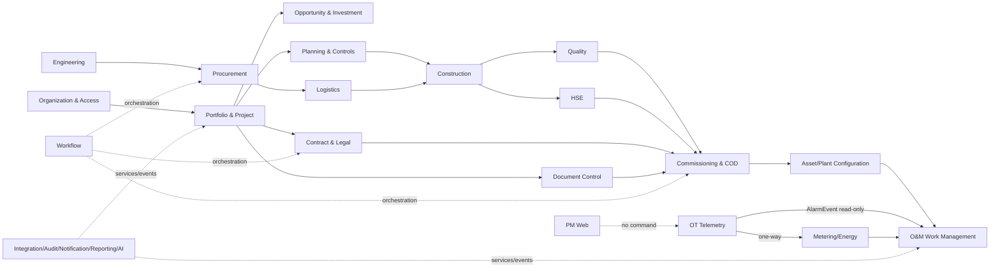
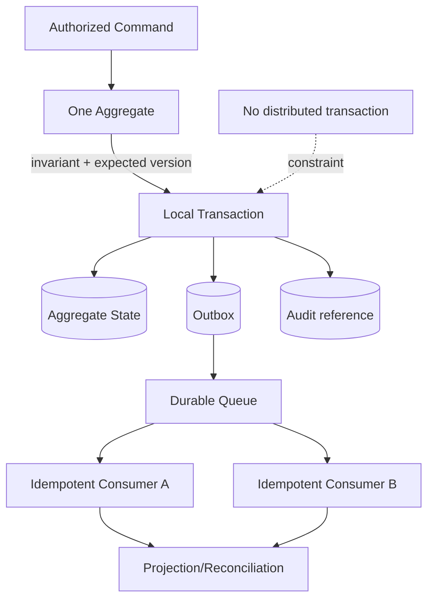
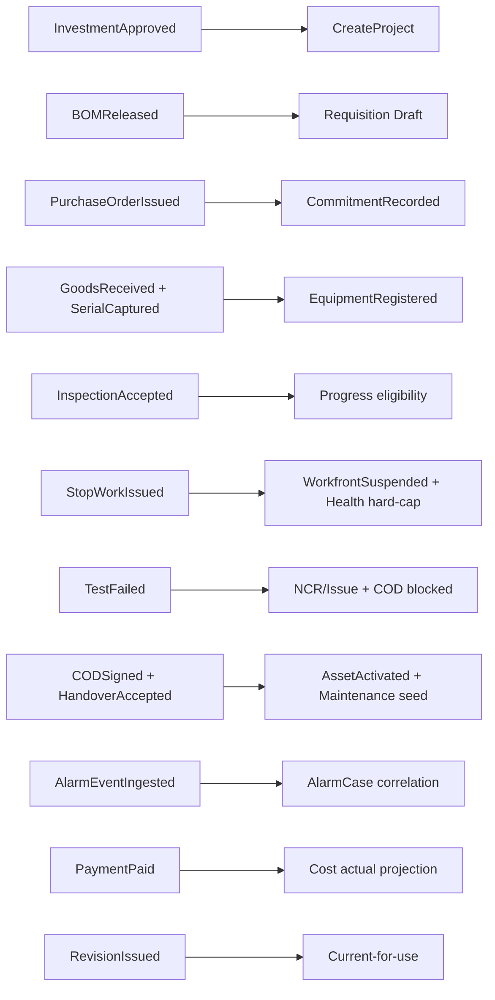
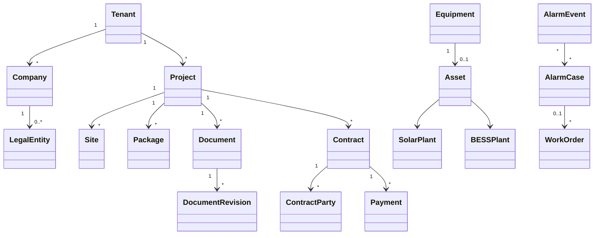

# Domain Model — Nền tảng Solar & BESS

> **Purpose:** Xác lập ubiquitous language, bounded context, aggregate, entity, value object, domain service, command, query, event, invariant và transaction boundary cho toàn bộ vòng đời Solar & BESS.
> **Scope:** Mô hình miền logic của PM Web, O&M monitoring và read-only OT integration; kèm implementation profile đã phê duyệt cho Identity & Access và US-004 Risk/Issue/Change EC2 test.
> **Source:** [AGENTS.md](../AGENTS.md), [Vision & Scope](./01-product-vision-and-scope.md), [BRD](./02-BRD.md), [PRD](./03-PRD.md), [SRS](./04-SRS.md), [Baseline](./Đề%20xuất%20tính%20năng%20nền%20tảng%20Solar%20và%20BESS.md).
> **Version:** 0.6
> **Status:** Draft toàn platform; US-004 domain module/aggregates/public port Implemented local; acceptance Partial và EC2 deployment Pending
> **Owner:** Domain Architecture / Business Analysis (cá nhân: TBD)
> **Updated:** 2026-07-18
> **Approval:** US-004 local implementation profile — Product Owner delegated 2026-07-12; full acceptance/deployment và toàn platform/production TBD/Pending — Product Owner, Domain Owners, Architecture và Data Owner

## 1. Nguyên tắc

- Mỗi khái niệm có một owner context; context khác dùng stable reference, API hoặc event, không truy private storage.
- Aggregate bảo vệ invariant và là transaction boundary; không tạo aggregate khổng lồ theo toàn Project.
- Cross-context consistency dùng transactional outbox + idempotent consumer; không distributed transaction.
- Entity có stable identity; value object mang unit/currency/timezone/effective version khi cần.
- Domain event là sự kiện đã commit; audit event không thay domain event.
- DB ID là TBD và chỉ [07-data-model.md](./07-data-model.md) cấp.
- PM Web, O&M và OT là ba boundary; OT chỉ phát dữ liệu ra, không nhận command từ web.

## 2. Ubiquitous language

| Thuật ngữ | Định nghĩa chuẩn | Không đồng nhất với |
|---|---|---|
| Tenant | Biên cô lập dữ liệu, policy, config/key và vận hành logic | Company, LegalEntity hoặc deployment khi chưa xác nhận |
| Company | Hồ sơ tổ chức/tập đoàn/thương hiệu/đối tác | Chủ thể ký hợp đồng mặc nhiên |
| LegalEntity | Chủ thể pháp lý có registration/tax identity và signing authority | Tên hiển thị Company |
| Person | Con người giữ lịch sử | UserAccount đăng nhập |
| UserAccount | Identity/account có thể revoke | Person; revoke không xóa actor history |
| ContractParty | Party tham chiếu LegalEntity và giữ legal snapshot tại ký | LegalEntity master mutable |
| EquipmentModel | Mẫu/spec kỹ thuật | Equipment instance |
| Equipment | Thiết bị planned/physical xuyên procurement–installation | Asset vận hành hoặc ERP financial asset |
| Asset | Vai trò vận hành của Equipment sau handover/COD | Equipment trước COD |
| AlarmEvent | Event OT bất biến | AlarmCase O&M |
| AlarmCase | Case triage/correlation local | Clear/reset/suppress nguồn OT |
| HSEIncident | Safety event, near miss, injury, stop-work và CAPA | ServiceIncident vận hành |
| ServiceIncident | Outage/service interruption, downtime và SLA | HSE classification |
| Activity | Công việc kế hoạch | WorkOrder bảo trì |
| Document | Định danh logic | DocumentRevision/file artifact |
| Risk | Sự kiện chưa xảy ra | Issue đã xảy ra |
| Issue | Sự kiện/vấn đề đã xảy ra có actual impact và root cause | Risk chưa xảy ra hoặc Change đề xuất |
| ChangeRequest | Đề nghị thay đổi có impact/baseline/source snapshot và quyết định riêng | Risk/Issue hoặc baseline tự động được phê duyệt |
| ResidualRiskAssessment | Bốn input residual hiện hành do aggregate Risk `DB-065` sở hữu; Action chỉ đề xuất assessment kèm `residualRiskVersion` được chụp khi lập proposal | Derived score do client ghi hoặc residual proposal trên Action là SoR |
| RiskIssueAction | Hành động xử lý Risk/Issue; DONE là completion, VERIFIED/CANCELLED là terminal control | Aggregate residual authority hoặc notification |
| RiskIssueClosureCycle | Một lần request + tối đa một decision closure của đúng một Risk/Issue; sequence hoàn tất là evidence history bất biến | Scalar closure hiện tại trên Risk/Issue hoặc DB-098 audit timeline |
| Payment | Giao dịch độc lập có contractId, payer và payee | PaymentSchedule hoặc Invoice |
| COD | Gate, decision, evidence và effective date | Project phase hoặc nút bấm |

Assumption: Company có 0..n LegalEntity; mỗi LegalEntity thuộc đúng một Company trong tenant. ContractParty giữ snapshot pháp lý tại ký. Acknowledge AlarmCase không clear nguồn. HSEIncident và ServiceIncident có thể link nhưng đóng độc lập; HSE luôn sở hữu safety classification.

## 3. Context map

Không mũi tên nào cho phép context truy trực tiếp bảng riêng của context khác.

## 4. Bounded-context catalog

Mỗi hàng là hợp đồng miền đủ để Data/API/Workflow chi tiết hóa. Trường DB ID hiện là TBD, không phải mã bị bỏ sót.

| Context / trace | Aggregate roots; entities; value objects | Services; commands; events; queries | Invariants; transaction boundary; SoR |
|---|---|---|---|
| Organization & Access — BR-001, BR-011, BR-033, BR-040; FR-037, FR-146…155 | Roots: Tenant, Company, LegalEntity, UserAccount, RoleAssignment, Delegation. Entities: Person, Department, Membership, RepresentativeAppointment. VO: DataScope, EffectivePeriod, RegistrationIdentity, AuthoritySnapshot. | Services: AccessPolicyEvaluator, SoDChecker, AuthorityResolver. Commands: RegisterCompany, RegisterLegalEntity, AssignRole, RevokeRole, CreateDelegation. Events: LegalEntityRegistered, RoleAssigned, AccessRevoked, DelegationExpired. Queries: OrganizationTree, EffectiveAccess, AuthorizedSignatories. | Tenant isolation; stable IDs; delegation không vượt quyền/không chain; deactivation không xóa actor. Một master/assignment/delegation mỗi transaction. SoR: IdP/HRIS cho identity/employment; platform cho role/scope; Legal/Admin cho legal identity. |
| Portfolio & Project — BR-001, BR-031, BR-032; FR-010…025 | Roots: Portfolio, Project, Site, Package, ProjectPartyAssignment. Entities: RACI, StageGateRecord. VO: ProjectCode, Capacity, ProjectType, SiteTimezone, PartyRole. | Services: ProjectCodeAllocator, StageGateEvaluator. Commands: CreateProject, DefineSite, DefinePackage, AssignProjectParty, ApproveGate. Events: ProjectCreated, SiteRegistered, PackageCreated, ProjectPhaseChanged. Queries: PortfolioOverview, ProjectOverview, PartyAndRACIView. | Site/Package không xuyên Project; phase tách record status; owner bắt buộc; code scope TBD. Một aggregate mỗi transaction. SoR: platform PM. |
| Opportunity & Investment — BR-002…008; FR-001…009 | Roots: Opportunity, SurveyPackage, EnergyProfile, TechnicalScenario, FinancialScenario, InvestmentDecision. Entities: SurveyItem, LoadSeriesRef, TariffRef. VO: DataQuality, Assumption, LoadInterval, TechnicalConstraint, Money, FormulaVersion. | Services: SolarSizing, BESSSizing, InvestmentCalculator, ScenarioComparator. Commands: RegisterOpportunity, VerifySurvey, CreateScenario, SubmitDecision, ConvertOpportunity. Events: OpportunityQualified, SurveyVerified, ScenarioReleased, InvestmentApproved, OpportunityHandedOver. | Measured/derived/assumed tách; approved scenario bất biến; không bịa interval; simulation tuân constraints. Scenario snapshot atomic; Project conversion qua event. SoR: platform approved scenario/decision, raw source giữ provenance. |
| Planning & Project Controls — BR-018, BR-032; FR-016…021, FR-076…077, FR-173 | Roots: ProjectSchedule, Activity, Baseline, ProgressUpdate. Entities: WBSNode, Milestone-as-Activity, Dependency, Constraint. VO: Duration, CalendarRef, ProgressMeasure, Quantity, DataDate. | Services: CriticalPathEvaluator, DependencyValidator, ProgressCalculator. Commands: DefineWBS, CreateActivity, LinkDependency, SubmitBaseline, RecordProgress, Rebaseline. Events: BaselineApproved, ProgressRecorded, ActivityBlocked, ForecastChanged. Queries: Schedule, LookAhead, Variance. | Không cycle; baseline immutable; actual không ghi đè; rebaseline version. Activity/Progress độc lập; baseline publish atomic. SoR: platform hoặc P6/MS Project per Project. |
| Document Control — BR-003, BR-009, BR-011, BR-012, BR-019, BR-026, BR-035; FR-026…035 | Roots: Document, DocumentRevision, ReviewCycle, Transmittal, SignatureEnvelope. Entities: Comment, Disposition, TransmittalItem/Recipient. VO: DocumentCode, RevisionCode, PurposeOfIssue, FileHash, Classification. | Services: DocumentCodeAllocator, CurrentForUseResolver, RevisionComparison. Commands: CreateDocument, UploadRevision, SubmitReview, ApproveRevision, IssueTransmittal, StartSignature. Events: RevisionApproved/Issued/Superseded, TransmittalIssued, ArtifactSigned. | Code/revision unique; unsafe không release; issued/signed không overwrite; legal hold thắng delete. Các aggregate riêng, projection qua event. SoR: platform DMS hoặc configured CDE/DMS. |
| Contract & Legal — BR-009…011, BR-022, BR-026, BR-030; FR-036…044 | Roots: Contract, ContractAppendix, Obligation, Guarantee, Permit. Entities: ContractParty, NegotiationMinute, PaymentSchedule. VO: ContractNumber, ClauseRef, LegalPartySnapshot, EffectivePeriod, Money. | Services: ConsolidatedTermsResolver, ObligationDueCalculator, SignerAuthorityChecker. Commands: CreateContract, AddParty, MakeAppendixEffective, FulfillObligation. Events: ContractEffective, AppendixEffective, ObligationDue/Fulfilled, PermitExpired. | Contract no unique trong Project; Appendix có parent; signed snapshot immutable; Fulfilled cần evidence/reviewer. Contract/Appendix riêng, consolidated projection. SoR: platform structured; DMS/e-sign artifact. |
| Cost & Payment — BR-007, BR-015, BR-030, BR-033; FR-053…060 | Roots: Budget, Commitment, Invoice, Payment. Entities: BudgetVersion, CostCodeAssignment, PaymentComponent. VO: Money, Currency, FXSnapshot, TaxRuleRef, RetentionRuleRef. | Services: PaymentCalculator, CurrencyConversion, BudgetAvailability. Commands: BaselineBudget, RecordCommitment, SubmitInvoice/Payment, MarkPaid, Reconcile. Events: BudgetBaselined, CommitmentRecorded, PaymentApproved/Paid/Reconciled. | Payment.contractId; payer/payee LegalEntity; fixed decimal; no cross-currency sum; paid sửa bằng adjustment. Payment/components atomic, ERP outcome event. SoR: platform request/forecast; ERP/bank paid. |
| Engineering & Equipment Catalog — BR-003, BR-005, BR-006, BR-012…014; FR-045…052, FR-125…137 | Roots: DesignBasis, BillOfMaterials, EquipmentModel, InterfaceRegister. Entities: BOMLine, InterfacePoint, TechnicalDeviation. VO: EquipmentSpecification, TechnicalRating, OperatingEnvelope, DesignRevisionRef. | Services: SubstitutionCompliance, InterfaceCompleteness. Commands: ReleaseDesign/BOM, ApproveModel, ProposeSubstitution, ResolveInterface. Events: BOMReleased, EquipmentModelApproved, SubstitutionApproved, InterfaceResolved. | Approved design/BOM immutable; Procurement không sửa design; substitution cần Engineering. Aggregate riêng; demand projection event. SoR: platform structured engineering; DMS artifact. |
| Procurement & Supplier — BR-015…017; FR-061…068 | Roots: SupplierQualification, Requisition, RFQ, Bid, Evaluation, PurchaseOrder. Entities: RFQLine, BidLine, EvaluationScore, POLine. VO: SupplierRef, Incoterm, NeedByDate, CommercialBasis. | Services: VendorEligibility, BidNormalization, AwardPolicy. Commands: QualifySupplier, SubmitRequisition, IssueRFQ, SubmitBid, ApproveAward, IssuePO. Events: SupplierApproved, RFQIssued, AwardApproved, POIssued. | Bid confidentiality; technical/commercial split; creator không tự duyệt; PO amendment revision. Mỗi aggregate riêng. SoR: platform request; official PO owner ERP/platform TBD. |
| Logistics & Inventory — BR-016, BR-017; FR-069…074 | Roots: Shipment, GoodsReceipt, InventoryLocation, DeliveryException. Entities: ShipmentMilestone, ReceiptLine, StockLedgerEntry, Reservation. VO: TrackingNumber, ETA, SerialNumberValue, StorageCondition. | Services: ReceiptReconciliation, SerialUniqueness. Commands: BookShipment, UpdateETA, ReceiveGoods, CaptureSerial, Quarantine/Release. Events: ETAChanged, GoodsReceived, SerialCaptured, ReceiptExceptionRaised. | ETA không overwrite committed date; partial lot; quarantine không issue; duplicate serial exception; stock append-only. Aggregate riêng; Equipment seed idempotent. SoR: carrier event, platform exception. |
| Construction & Field — BR-018…020; FR-075…084 | Roots: Workfront, DailyLog, QuantityProgress, SiteInstruction. Entities: Crew/EquipmentUsage, MaterialIssue, PhotoEvidence. VO: Zone, Shift, WeatherObservation, EvidenceRef, ClientTimestamp. | Services: ProgressCertification, OfflineConflictResolver. Commands: ReleaseWorkfront, RecordDailyLog, SubmitQuantity, CertifyProgress, SuspendWorkfront. Events: WorkfrontReleased, DailyLogSigned, QuantityCertified, WorkfrontSuspended. | PTW/IFC/material/hold gates; signed log correction; offline không silent overwrite/sign. One aggregate transaction; sync idempotent. SoR: platform PWA. |
| Quality — BR-021, BR-023…026; FR-091…097 | Roots: ITP, Inspection, NCR, Punch. Entities: HoldPoint, ChecklistResult, NCRDisposition, CorrectiveAction. VO: AcceptanceCriterionRef, Measurement, Severity, EvidenceRef. | Services: InspectionEligibility, NCRClosure. Commands: PublishITP, RequestInspection, RecordResult, Raise/VerifyNCR, ClosePunch. Events: InspectionAccepted/Rejected, NCRRaised/Closed, PunchClosed. | Hold point không bypass; failed immutable; contractor không tự Close; use-as-is authority. Aggregates riêng, gate projection event. SoR: platform QA/QC. |
| HSE — BR-020, BR-025, BR-026; FR-081, FR-085…090 | Roots: PermitToWork, HSEIncident, StopWorkOrder, CAPA. Entities: ToolboxSession, HSEInspection, Investigation, Action. VO: Hazard, IsolationRef, Severity, RestrictedPersonRef. | Services: PermitEligibility, StopWorkAuthority, IncidentClassification. Commands: Issue/SuspendPermit, ReportIncident, Issue/LiftStopWork, VerifyCAPA. Events: PermitIssued/Suspended, HSEIncidentReported, StopWorkIssued/Lifted. | Emergency report không chờ workflow; designated authority lift; no safety bypass; need-to-know. Aggregates riêng; stop-work event cập nhật Construction/Health. SoR: platform HSE. |
| Risk, Issue, Change & Claim — BR-022, BR-031, BR-032; FR-098…105 | Roots: Risk, Issue, ChangeRequest, Claim. Entities: RiskIssueAction, RiskIssueClosureCycle, ImpactAssessment, NoticeRecord. VO: Probability1To5, Impact1To5, ExposureBand/ScoringVersion, ResidualRiskAssessment/ResidualRiskVersion, ClosureSequence, PackageScope, BaselineRef, ImpactSnapshotHash, ClauseRef. | Services: RiskScoring, ClosurePolicy, ResidualProposalPromotion, ChangeImpact, ApprovedChangeReader, ClaimEntitlement. Commands: Register/Assess/Treat/ReassessResidual/RequestCloseRisk, Materialize/Resolve/Reopen/RequestCloseIssue, Add/Update/Complete/Verify/CancelAction, Create/Submit/DecideChange. Events: RiskOccurred/ResidualReassessed, ActionOverdue/Verified, ClosureCycleRequested/Decided, IssueResolved/Reopened, ChangeApproved. Queries: scoped registers, full-filter version-grouped heatmap, detail with cursor-paginated authorized closure cycles, summary/history, eligible approved changes/reverse baselines. | Risk khác Issue; tenant/project/package scope; exact one action parent; DB-065 Risk là residual SoR, Action chỉ proposal kèm `residualRiskVersion`; API-149 branches không trộn payload và terminal SoD đọc pre-command facts; terminal VERIFIED/CANCELLED bất biến. DB-113 là append-only closure history, Risk/Issue scalar chỉ latest projection; approved Change/source baseline/hash/changeReason trước rebaseline và bất biến. Claim/Legal là separate dependency. SoR: PM/change; Legal entitlement. |
| Workflow & Approval — BR-008, BR-011, BR-015, BR-026, BR-034; FR-138…145 | Roots: WorkflowDefinition, WorkflowInstance. Entities: WorkflowVersion, Step, ApprovalDecision, Condition. VO: RoutingRule, Quorum, SLA, DelegationSnapshot. | Services: RoutingEngine, QuorumEvaluator, SoDResolver. Commands: PublishWorkflow, Start, Approve, Reject, Return, ConditionalApprove, Escalate. Events: ApprovalRequested/Returned/Rejected/Granted/Escalated. | Running instance giữ version; decision immutable; escalation không auto-approve; config error không fallback requester. Workflow transaction riêng; domain revalidates. |
| Commissioning & COD — BR-023…026; FR-106…114 | Roots: CommissioningSystem, TestPack, TestRun, Defect, CODGate, CODPackage, Handover. Entities: Subsystem, Prerequisite, Measurement, Witness, HandoverItem. VO: AcceptanceCriterionRef, CalibrationRef, TestBoundary, SafeState. | Services: ReadinessEvaluator, TestResultEvaluator, CODEligibility. Commands: DefineSystem, ApproveTestPack, Start/RecordTest, CreateRetest, Evaluate/SignCOD, AcceptHandover. Events: TestPassed/Failed/Aborted, CODSigned, HandoverAccepted. | Failed không đổi Passed; retest previousRun; mandatory gate evidence; signed package immutable. Run/Gate/Package/Handover riêng. SoR: platform; DMS evidence; OT raw log. |
| Asset Registry & Plant Configuration — BR-013, BR-014, BR-017, BR-026…029; FR-072, FR-114, FR-125…137 | Roots: Equipment, Asset, SolarPlant, BESSPlant. Entities: Solar module/string/inverter/BOS; BESS container/rack/module/cell selected, PCS/BMS/EMS/HVAC/fire. VO: SerialNumber, AssetTag, Rating, WarrantyPeriod, FirmwareVersion, OperatingEnvelope. | Services: SerialUniqueness, ReplacementLineage, PlantConfigurationValidator. Commands: Register/Install/ReplaceEquipment, ActivateAsset, ReleasePlantConfig. Events: EquipmentRegistered/Installed/Replaced, AssetActivated. | Replacement lineage; Asset active sau handover; effective config; no control credential. Aggregates riêng, activation event. SoR: operational registry; ERP financial mapping. |
| O&M Work Management — BR-027…030; FR-115…124 | Roots: AlarmCase, ServiceIncident, WorkOrder, MaintenancePlan, WarrantyClaim. Entities: WorkLog, SpareReservation, SLAClock, ReturnToServiceRecord. VO: Priority, SLAWindow, Downtime, AssetRef, AlarmEventRef. | Services: AlarmCorrelation, WorkDispatch, SLAClock, ReliabilityAnalysis. Commands: Open/AckCase, DeclareIncident, DispatchWO, CompleteWork, VerifyReturnToService. Events: AlarmCaseOpened, WO Dispatched/Closed, ReturnToServiceAccepted. | Ack không clear OT; technician Complete, verifier Close; critical WO PTW/isolation. Aggregates riêng, correlation eventual. SoR: platform/approved CMMS; raw event OT. |
| OT Telemetry — BR-027, BR-028, BR-037, BR-040; FR-134, FR-165…170 | Roots: TagRegistry, SiteGatewayRegistration metadata only. Stream entities: TelemetrySample, AlarmEvent. VO: TagPath, Unit, QualityFlag, SourceTimestamp, ReceiveTimestamp. | Services: UnitNormalizer, GapDuplicateDetector, AlarmEventMapper. Commands limited to RegisterGateway, PublishTagMapping, IngestTelemetry/Event. Events: TelemetryIngested, GapDetected, AlarmEventIngested. | Append-only; source/receive time; stale not safe/zero; one-way; no command endpoint. Stream checkpoint idempotent. SoR: OT raw; cloud analytics copy. |
| Metering & Energy Performance — BR-004…007, BR-024, BR-027, BR-028, BR-030; FR-003, FR-116…117, FR-123…124, FR-169…170 | Roots: Meter, MeterPeriod, VEERevision, EnergyBaseline, PerformanceAssessment. Entities: MeterConfiguration, IntervalReading, KPIResult. VO: CTPTRatio, EnergyQuantity, TariffRef, DataWindow, Completeness. | Services: VEEValidation, SolarPerformance, BESSRTE, BillingReconciliation. Commands: RegisterMeter, ImportReading, ClosePeriod, ApproveBaseline, AssessPerformance. Events: MeterPeriodClosed, ReadingEstimated, PerformanceAssessed. | Closed revision immutable; estimated khác measured; unit/timezone/formula/version trace; no hard-coded tariff. Snapshot transaction tách time-series. SoR: certified meter/MDMS raw; platform KPI. |
| Supporting Contexts — BR-033, BR-034, BR-036…040; FR-143, FR-154, FR-156…198 | Roots: ConnectorDefinition/SyncRun/ReconciliationCase, AuditEvent, NotificationDelivery, ReportSnapshot, AIProposal/ReviewResult. Entities: ExternalMapping, DeliveryAttempt, Citation, ModelRun metadata. VO: CorrelationId, IdempotencyKey, Checkpoint, DataAsOf, Confidence. | Services: IntegrationACL, AuditVerifier, NotificationRouter, ReportRenderer, AIGovernanceGateway. Commands: RunSync, Reconcile, Deliver, GenerateReport, Request/ReviewAI. Events: SyncCompleted, ReconciliationRequired, AuditGapDetected, ReportGenerated, AIProposalReviewed. | External ID không internal ID; replay idempotent; audit append-only; notification/report không source state; AI only draft. Context riêng, không sửa private tables. |

### 4.1 Implementation profile — Identity & Access base/auth MVP

Domain Model trong tài liệu vẫn là nguồn chuẩn cho aggregate/invariant toàn platform. Implementation base/auth của `FR-147`, `DB-001`, `DB-005`, `DB-099`, `DB-100` dùng convention modular NestJS đơn giản theo quyết định trực tiếp của owner; source folder không bắt buộc phản chiếu các tactical layer của mô hình khái niệm.

| Thành phần | Trách nhiệm | Quy tắc |
|---|---|---|
| `src/database` | TypeORM entity, migration, DataSource và seed dùng chung | `synchronize=false`; schema chỉ đổi qua migration review được |
| `src/modules/identity-access` | Controller, `AuthService`, guard, DTO, token/password/rate-limit focused service | Dùng `TypeOrmModule.forFeature` và TypeORM `Repository<Entity>`/`EntityManager` trực tiếp; không tạo custom repository abstraction khi chưa có nhu cầu |
| `src/modules/cipher` | AES-256-GCM cho encrypted environment credential | Không dùng cho password người dùng; fail-closed khi envelope/tag/key sai |
| `src/config` | Typed/range-validated runtime config | Credential phải là `enc:v1`; rate/JWT/Argon2/cookie lấy từ env |

`AuthService` vẫn bảo vệ rotation/revoke/replay bằng transaction và pessimistic row lock; session/user/audit commit cùng transaction. Password được Argon2id hash một chiều với salt trước khi lưu `DB-099`; JWT/DB credential là runtime secret nên mới dùng reversible authenticated encryption trong `.env`.

### 4.2 Implementation profile — US-004 Risk, Issue và Change

`src/modules/risk-change` sở hữu controller/service/domain policy và mọi query/mutation DB-065/066/067/112. TypeORM entities/migration vẫn tập trung ở `src/database`; centralized file location không cho module khác quyền truy repository riêng của Risk/Change.

| Contract | Quy tắc |
|---|---|
| Aggregate | Risk, Issue, ChangeRequest tách transaction/state; RiskIssueAction có đúng một root, mutation ghi root audit/outbox |
| Scope | Mọi row có tenant/project và optional package; package actor chỉ exact package; project-level/null/approval cần full-project scope |
| Scoring/money | Pure scoring 1…5 + versioned band; tiền là numeric(19,4)/decimal string/currency, không floating-point |
| Residual SoR | DB-065 Risk là authority; Action chỉ giữ proposal bốn input + `residualRiskVersion` được chụp lúc lập proposal. DONE không đổi Risk. Independent VERIFY atomically so version rồi promote proposal, recompute/tăng Risk version/audit/outbox; conflict zero write. Direct API-144 reassessment cần full-project actor, reason/evidence/expected Risk version; package actor bị deny |
| API-149 Action union | Routine branch sửa editable field/status OPEN/IN_PROGRESS/BLOCKED; COMPLETE ghi DONE/evidence và optional stored residual proposal; VERIFY/CANCEL terminal chỉ nhận expectedVersion/status/evidence và cancel reason khi applicable, không owner/title/due/residual. VERIFY chỉ promote proposal đã lưu. Mixed payload invalid; SoD so actor với pre-command owner/completedBy |
| Action/closure | OPEN/IN_PROGRESS/BLOCKED/DONE đều chặn closure; chỉ VERIFIED hoặc authorized CANCELLED thỏa gate. VERIFIED/CANCELLED ghi actor/time/evidence, CANCELLED thêm reason; cả hai terminal bất biến. Risk chỉ request close từ MONITORING và RETURN/REJECT về MONITORING; Issue chỉ từ RESOLVED và RETURN/REJECT về RESOLVED. Mỗi request insert DB-113 sequence; decision fill một lần; completed cycle immutable; reopen/re-close append cycle, scalar parent chỉ latest projection và DB-098 không thay evidence history |
| Identity picker | API-008 cần `user.read`, intersect active assignment + project/exact-package/capability và chỉ trả `id/displayName`; owner assignment không cấp access |
| Query projection | API-143 RiskSummary gồm scoringVersion. API-157 aggregate toàn bộ authorized Risk filter, không reuse cursor page; mỗi scoringVersion/thresholdVersion group trả đúng 25 inherent + 25 residual cells và residualMissingCount. API-160/161 page DB-113 theo opaque cursor + stable sequenceNo/id, mặc định 50/tối đa 100; `nextCursor=null` chứng minh đã đọc hết authorized history |
| History/async | DB-098 audit timeline và DB-102 domain event commit cùng business state; DB-103/105 xử lý notification idempotent. DB-105 mapping: ScheduleActivity→OVERDUE/NEAR_CRITICAL, Risk→RISK_REVIEW_DUE, Issue→ISSUE_TARGET_DUE, RiskIssueAction→ACTION_OVERDUE, ChangeRequest→CHANGE_DECISION_PENDING. Priority server-derived: schedule HIGH/NORMAL theo alert; Risk HIGH khi effective HIGH|CRITICAL; Issue HIGH khi severity HIGH|CRITICAL; Action HIGH; Change NORMAL. dueAt/dataDate/thresholdVersion non-null derive từ finish/dataDate/threshold, reviewDate/targetDate/dueDate + Site business date, hoặc submittedAt business date theo Data v1.1. Source scope/activity invariant và rollback giữ schedule rows |
| Cross-context port | RiskChangeModule export `APPROVED_CHANGE_READER`; ProjectControls inject token/type, truyền EntityManager và không import ChangeRequestEntity/repository |
| Approved result | Port chỉ trả immutable changeReason, approvedAt/by, decisionVersion, sourceBaselineId, scheduleImpactSummary và impactSnapshotHash; denial phân biệt not-approved/baseline-mismatch/schedule-impact; API-036 REBASELINE chỉ cho full-project actor |
| Reverse trace | Project Controls sở hữu API-159 baseline query; RiskChange không đọc private ScheduleBaseline repository |

Claim/Variation vẫn thuộc cùng bounded context logic nhưng physical DB/API chờ Contract & Legal aggregate/authority; AC-014…017 không được dùng để tuyên bố `FR-103` Complete.

## 5. Aggregate, transaction và consistency

- Workflow approval phát event; domain kiểm invariant/version lại trước final transition.
- Read model eventual-consistent hiển thị as-of/freshness; signed/financial/safety decision đọc source aggregate khi cần.
- Unique invariant xuyên aggregate dùng registry/reservation hoặc detect-and-reconcile.
- Callback/event dùng tenant + source system/event ID + checksum/checkpoint.
- Correction/reversal/adjustment/retest/revision là record mới.

## 6. Event flow xuyên vòng đời

| Event | Producer → consumer | Invariant |
|---|---|---|
| InvestmentApproved | Opportunity → Project request | Giữ scenario/decision ref, không copy âm thầm |
| BOMReleased | Engineering → Procurement | Một demand per BOM version/line |
| PurchaseOrderIssued | Procurement → Cost | Idempotent source PO/version |
| GoodsReceived/SerialCaptured | Logistics → Asset Registry | Receipt/serial exception trace |
| InspectionAccepted | Quality → Planning/Cost | Không tự approve payment |
| StopWorkIssued | HSE → Construction/Health | Không bypass safety |
| TestFailed | Commissioning → NCR/Issue/COD | Failed run immutable |
| CODSigned/HandoverAccepted | Commissioning → Asset/O&M | Manifest và receipt bắt buộc |
| AlarmEventIngested | OT → O&M | Ack không clear OT |
| PaymentPaid | ERP/Cost → actual projection | Không sửa request history |
| RevisionIssued | Document → current-for-use | Exact hash/revision |

## 7. System of Record và anti-corruption

| Dữ liệu | SoR | Rule |
|---|---|---|
| Authentication | IdP | issuer+subject; email không stable ID |
| Employment | HRIS | Không tự cấp app role |
| App role/data scope | Platform IAM | External admin không ghi thẳng policy |
| Company/LegalEntity | Platform legal/admin master | External ID mapping; signed snapshot |
| Project/site/package | Platform PM | Import version/reconciliation |
| Schedule | Platform hoặc configured P6/MS Project | Field ownership; no last-write-wins |
| Document artifact | Platform DMS hoặc configured CDE | Hash/revision/ACL/malware gate |
| Contract/obligation | Platform | Signed artifact reference |
| Budget/request/forecast | Platform | ERP posting/paid outcome |
| Supplier qualification | Procurement | ERP vendor code mapping |
| Shipment | Carrier + platform exception | Raw event/provenance |
| QA/HSE | Platform | External evidence immutable ref |
| Risk residual hiện hành | Risk aggregate `DB-065` | Action residual là proposal có `residualRiskVersion` được chụp lúc lập proposal; chỉ atomic VERIFY hoặc direct full-project authoritative reassessment mới cập nhật Risk |
| Notification projection | Supporting context `DB-105 notifications` | Derived từ committed source event; validate source scope; schedule/non-schedule discriminator bất biến và rollback giữ schedule rows |
| Closure evidence history | `DB-113 RiskIssueClosureCycle` | Request/decision/evidence sequence hoàn tất bất biến; parent scalar là latest projection, DB-098 chỉ audit timeline |
| Operational Asset | Asset Registry | ERP financial asset mapping |
| Raw telemetry/alarm | OT/historian/OEM | One-way ingestion |
| Meter closed reading | Certified meter/MDMS | Platform baseline/KPI |
| AlarmCase/WO | Platform hoặc approved CMMS | Owner TBD per configuration |
| Audit | Append-only Audit context | Domain không sửa audit |

## 8. PM → O&M handover

Handover chỉ hoàn tất khi CODPackage signed, manifest/version accepted, asset/equipment/serial/configuration/warranty/document/baseline/open-item mapping đủ và recipient ghi receipt. AssetActivated, MaintenancePlan initialization và billing setup chạy qua event, không cùng transaction COD. Open punch/waiver giữ category, effective period, owner và evidence.

## 9. IT/OT và AI invariants

- OT → gateway/historian → DMZ/broker → cloud; không reverse command channel.
- Không command StartBESS, StopBESS, SetSetpoint, ResetAlarm, BypassProtection hoặc ClearSourceAlarm.
- Telemetry/AlarmEvent giữ source/receive timestamp, unit, quality, sequence/raw ref; missing/stale không safe/zero.
- AI chỉ sở hữu proposal/review metadata; không sở hữu Contract, Payment, Document, COD, WO hoặc Asset state.
- AI output có citation, confidence, model/prompt version, reviewer correction/audit; không approve/sign/pay/close safety/control.

## 10. Tenant, event và audit envelope

Mọi reference/event/job/query có tenantId; scope project/site/package/legalEntity kiểm ở producer và consumer. Dedicated deployment không thay authorization. Domain event gồm eventId/type/version, tenantId, aggregate type/id/version, occurredAt, actor/effectiveActor, correlation/causation và payload classification. Cache/search/report chứa tenant + source/policy version. Unknown event version vào DLQ/reconciliation.

## 11. Conceptual model

Cardinality và physical FK cuối thuộc Data Model; SolarPlant/BESSPlant có thể tham chiếu root Asset thay vì inheritance vật lý.

## 12. Assumptions

| Assumption | Owner | Tác động |
|---|---|---|
| Company 0..n LegalEntity; một LegalEntity thuộc một Company/tenant | Product/Legal/Data | Organization ERD/migration |
| Person tách UserAccount; actor history giữ sau revoke | IAM/Legal/Audit | Identity/audit |
| Equipment thành Asset sau accepted handover | Engineering/Asset/O&M | COD lifecycle |
| AlarmEvent thuộc OT; AlarmCase local O&M | OT/O&M/Security | Ack/integration |
| ServiceIncident/HSEIncident đóng độc lập nhưng link | HSE/O&M | Cross-case workflow |
| Activity và WorkOrder là hai aggregate | PM/O&M | Schedule/maintenance |
| SoR có thể cấu hình theo project/system contract | PO/System Owners | Mapping/reconciliation |
| Cross-context dùng outbox/idempotent consumer | Architecture | Logical implementation |
| DB ID chỉ cấp ở tài liệu 07 | Data Owner | Không chặn conceptual model |

## 13. Open Questions

| Open Question | Owner | Tác động |
|---|---|---|
| Company–LegalEntity cardinality/migration cuối? | Legal/Product/Data | IAM/contract/payment |
| Tenant là customer/group/deployment? | Product/Commercial/Security | Isolation/unique/config |
| Project code unique scope nào; Project nhiều Site/COD per Site? | PMO/Commissioning | Constraint/gate |
| Serial uniqueness theo manufacturer hay manufacturer+model? | Engineering/Asset | Registry/import |
| Schedule master per project? | PMO/Integration | Activity ownership |
| DMS/CDE SoR theo folder/document type? | Document Control/IT | Revision/ACL |
| ERP hay platform sở hữu official PO? | Procurement/Finance/IT | PO/commitment |
| External CMMS có phải SoR AlarmCase/WO? | O&M/IT | Context ownership |
| BESS hierarchy tới cell hay selected nodes? | BESS/OT/Data | Volume/security |
| Alarm acknowledge local-only hay sync source? Đề xuất local-only | OT/O&M | Connector/UX |
| Meter VEE/period close/tariff owner? | Energy/Finance/Legal | Billing/KPI |
| Conditional COD/waiver/non-waivable taxonomy? | Commissioning/Legal/HSE | Gate/workflow |
| Exact aggregate split sau DB/API review? | Architecture/Data | Không được phá invariant |

## 14. Changelog

| Version | Date | Author | Change | Scope impact |
|---|---|---|---|---|
| 0.1 | 2026-07-11 | Codex | Tạo Domain Model với 21 context profiles, context/event map và invariants | Không thay baseline; physical DB/API giữ TBD |
| 0.2 | 2026-07-11 | Codex | Ghi tactical DDD implementation profile cho Identity & Access base/auth | Không thay phạm vi nghiệp vụ hoặc model toàn platform |
| 0.3 | 2026-07-11 | Codex | Supersede tactical-folder profile bằng Nest module + centralized database convention do owner chốt | Không thay domain model hoặc phạm vi nghiệp vụ |
| 0.4 | 2026-07-12 | Codex | Cụ thể hóa US-004 aggregate/action/scoring/scope/SoD và public ApprovedChangeReader/reverse trace boundary | Build-ready EC2 test; Claim/production policy chưa Implemented |
| 0.5 | 2026-07-18 | Codex | Chốt DB-065 residual SoR, API-149 four-command union, DB-113 append-only closure history, DB-105 typed date/version derivation, full-filter version-grouped API-157 heatmap và immutable changeReason port | Không đổi baseline scope; US-004 domain build-ready, implementation/runtime evidence vẫn pending |
| 0.6 | 2026-07-18 | Codex | Ghi local materialization của Risk/Issue/Action/Change aggregates, closure-cycle SoR, Notification projection và ApprovedChangeReader boundary | Không đổi domain contract; TEST-014…017 Partial, DB-068/FR-103 và production authority vẫn dependency |
