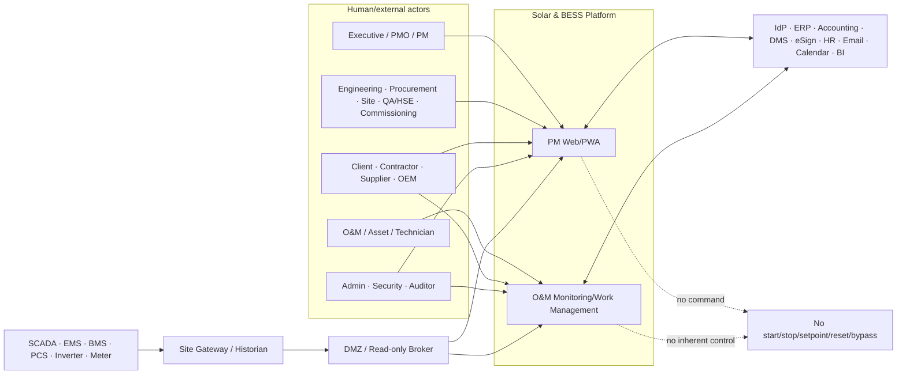
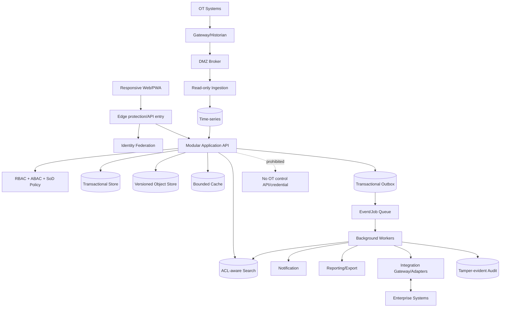
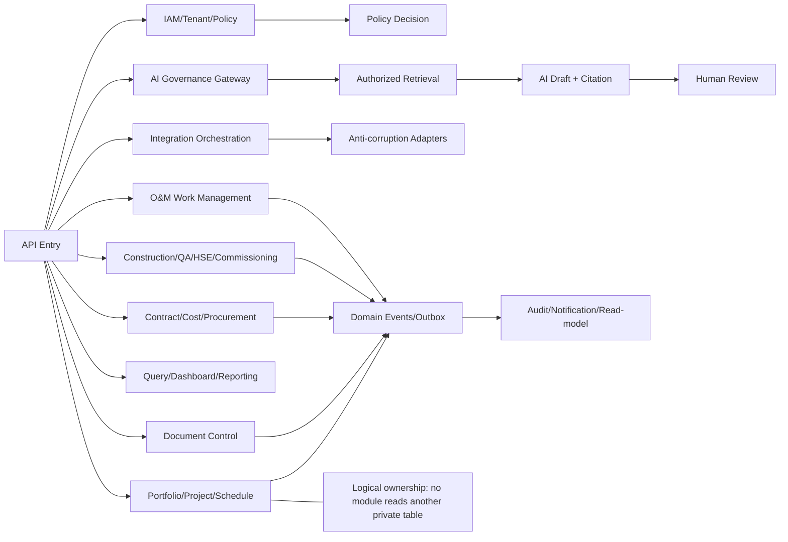
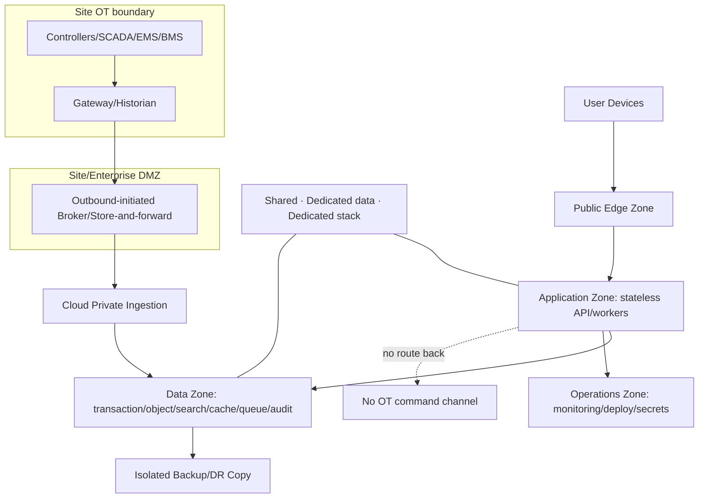
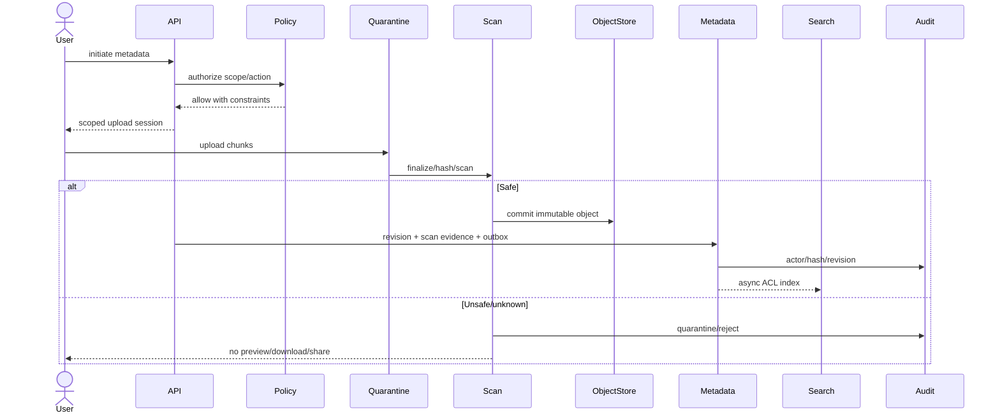
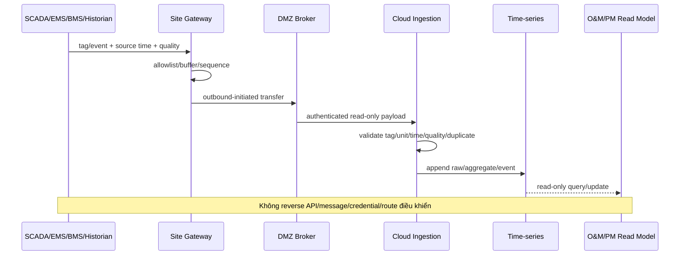
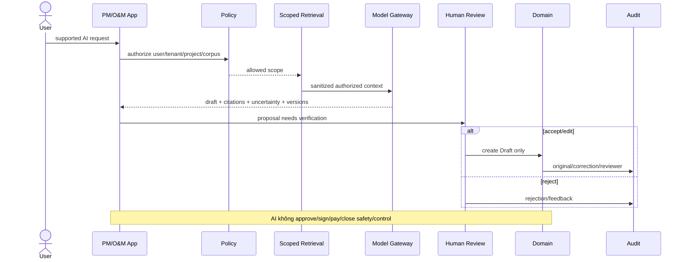

# Solution Architecture — Nền tảng Solar & BESS

> **Purpose:** Mô tả kiến trúc logic, deployment, data flow, multi-tenant, integration, IT/OT separation, resilience và các Architecture Decision Record cho yêu cầu trong SRS/Domain Model.
> **Scope:** Kiến trúc vendor-neutral cho PM Web, O&M monitoring và read-only OT ingestion; kèm implementation profile NestJS/TypeORM/PostgreSQL cho base/auth, US-001, operational foundation và US-004 Risk/Issue/Change trên EC2 test.
> **Source:** [AGENTS.md](../AGENTS.md), [PRD](./03-PRD.md), [SRS](./04-SRS.md), [Domain Model](./05-domain-model.md), [Baseline](./Đề%20xuất%20tính%20năng%20nền%20tảng%20Solar%20và%20BESS.md).
> **Version:** 0.7
> **Status:** Draft toàn platform; base/auth và US-001 Implemented; operational foundation/core US-003 deployed; US-004 architecture Approved/Build-ready cho EC2 test
> **Owner:** Solution Architecture (cá nhân: TBD)
> **Updated:** 2026-07-12
> **Approval:** Product Owner delegated approval cho EC2 test profile ngày 2026-07-11; production vẫn Proposed và chờ Architecture/Security/Data/SRE

## 1. Architecture principles và constraints

- Cloud-first, multi-tenant, modular boundaries theo Domain Model; dedicated profile tùy policy.
- Relational transaction cho master/workflow/finance; object storage cho file; search/cache/read model là derived; time-series tách OLTP.
- Mọi business mutation atomic với outbox/audit reference; side effect idempotent/reconciled.
- Deny-by-default RBAC+ABAC+SoD; tenant scope end-to-end.
- OT ingress một chiều; PM/O&M không chứa control API, route, message, credential hoặc UI command.
- AI qua governed gateway, authorized retrieval và human review; chỉ domain Draft.
- Stack repository tuân theo `tech-stack.md`. EC2 test profile chốt NestJS/TypeORM/PostgreSQL 17, Redis/BullMQ và worker riêng; production topology/HA/region/capacity/exit strategy vẫn TBD cho tới khi có benchmark, security, cost và owner.

## 2. System context



## 3. Container architecture



### 3.1 Container responsibilities

| Container/store | Responsibility | Not responsible for |
|---|---|---|
| Web/PWA | Navigation, local draft/offline queue, accessible/responsive UI | Domain authority, secret, OT control |
| API/Application | Authorization, validation, aggregate command/query, outbox | Direct cross-module private-table access |
| Policy | Central evaluation of RBAC/ABAC/SoD/status/hold | Business state transition |
| Transactional store | Master, workflow, finance, metadata, version/audit refs | File bytes/raw high-rate telemetry |
| Object store | Immutable file/version/quarantine/backup object | Document status/ACL source |
| Search | ACL-aware derived full-text/index | SoR or final authorization |
| Queue/workers | Job, event, connector, notification, report | Silent retry without DLQ/reconciliation |
| Time-series | Selected tag/event/aggregate windows | OT control or OLTP |
| Audit | Append-only/tamper-evident action evidence | Domain state owner |

### 3.2 EC2 test runtime contract — Approved

`ADR-001`, `ADR-002`, `ADR-004` và `ADR-006` được chấp nhận cho **EC2 test profile** theo quyền quyết định Product Owner đã ủy quyền; chúng vẫn Proposed cho production. Runtime contract dự kiến triển khai theo ExecPlan [`2026-07-11-operational-foundation.md`](../.agent/execplans/2026-07-11-operational-foundation.md):

| Runtime | Dependency bắt buộc | Liveness | Readiness / failure behavior | Status 2026-07-11 |
|---|---|---|---|---|
| API | Validated config, PostgreSQL, Redis | Process/event loop hoạt động | Chỉ ready khi migration current và PostgreSQL/Redis reachable; login rate limit fail closed, không fallback memory | PostgreSQL Implemented; Redis contract Approved/Planned |
| Worker | Validated config, PostgreSQL, Redis/BullMQ | Worker process hoạt động | Chỉ ready khi DB/Redis reachable và consumer registry nạp được; shutdown ngừng nhận job rồi drain/requeue trong timeout | Approved/Planned |
| PostgreSQL 17 | Persistent volume/runtime secret | `pg_isready` | Source of truth cho business, audit, `DB-102…104`; migration hoàn tất trước API/worker | Implemented, schema hardening Planned |
| Redis/BullMQ | Bounded memory/persistence policy cho test | Redis ping | Queue/rate-limit dependency; unavailable làm API/worker not-ready thay vì bypass control | Approved/Planned |
| Web | API ready | Nginx HTTP | Không chứa domain authority; API vẫn re-authorize mọi request | Implemented |

CI commands tồn tại và chạy thủ công; hosted CI, registry, SBOM/signing và IaC giữ trạng thái **Planned**, không được suy diễn là Implemented.

## 4. Component architecture



Frontend module boundaries mirror navigation/domain but do not duplicate authorization. Backend boundary contracts are versioned commands/queries/events. Reporting/query modules consume projections and stable APIs, never become master.

### 4.1 Frontend

Responsive Web/PWA owns presentation, navigation, form state, permitted offline drafts/checklists/photos, accessibility/localization and API orchestration. It never owns authorization truth, business invariant, secret, signed/paid/test state or OT credential. Client cache is tenant/policy/version scoped; logout, tenant switch and revoke clear hoặc invalidate it.

Base/auth implementation profile dùng Vue 3, Vite, Vue Router, Pinia và Element Plus theo `tech-stack.md`:

```text
apps/web/src/
├── app/                 # bootstrap và app-level plugins
├── api/                 # HTTP client, typed errors, feature API modules
├── components/
│   ├── common/          # component tái sử dụng toàn app
│   └── auth/            # component thuộc auth experience
├── constants/           # stable route/config constants
├── layouts/             # page shells, header và content slots
├── router/              # routes, guards, route meta
├── stores/              # Pinia client/session state; không gọi fetch trực tiếp
├── styles/              # tokens, base và view/layout styles
├── types/               # API/domain view types
└── views/               # route-level orchestration, lazy-loaded
```

Dependency rule: view gọi store/component/layout; store gọi typed API module; API module gọi HTTP client và không import store/view. Shared component không import store/view. Refresh token chỉ ở HttpOnly cookie; access token chỉ ở Pinia memory. Element Plus chỉ register component đang dùng để giữ tree-shaking; feature view được lazy-load theo route.

### 4.2 Backend

The backend is logically modular by bounded context. Entry layer resolves identity/tenant/correlation/idempotency; policy evaluates RBAC/ABAC/SoD; application services orchestrate one aggregate transaction; domain modules protect invariants; infrastructure adapters implement persistence, object/search/queue/notification/report/integration. A module cannot query another module's private tables. EC2 test dùng NestJS modular API + worker process riêng theo `tech-stack.md`; production service split/HA vẫn Proposed. ADR-001 favors modular-first until evidence justifies extraction.

Base/auth implementation hiện thực hóa `ADR-001` như một modular monolith, không thay quyết định vendor-neutral của toàn platform:

```text
apps/api/src/
├── config/                    # typed encrypted environment config
├── database/
│   ├── entities/              # toàn bộ TypeORM entities
│   ├── migrations/            # TypeORM migrations
│   ├── seeds/                 # explicit bootstrap/seed commands
│   ├── data-source.ts
│   └── database.module.ts
├── common/middleware/         # HTTP cross-cutting dùng chung
└── modules/
    ├── cipher/                # AES-256-GCM env cipher + CLI
    ├── health/
    └── identity-access/       # controller/service/guard/DTO/helpers
```

Feature module dùng convention NestJS và có thể chứa controller/service/transform/processor theo nhu cầu thực tế. Database artifacts luôn tập trung trong `src/database`; module đăng ký entity qua `TypeOrmModule.forFeature` và dùng repository chuẩn của TypeORM. Không tạo layer/folder hoặc custom repository abstraction chỉ để mô phỏng kiến trúc. Boundary nghiệp vụ vẫn được bảo vệ bởi module ownership, tenant-scoped query, transaction và test.

Backend test tree nằm ngoài production source và phản chiếu module/config concern: `test/unit/{architecture,config,modules}`, `test/integration/modules`, `test/setup`, `test/config`. Unit và integration có Jest config/testMatch/setup riêng; không đặt test production behavior lẫn trong `src` hoặc để mọi file ở root `test`.

US-004 thêm `modules/risk-change` nhưng không tạo microservice hoặc custom repository layer. Module sở hữu DB-065/066/067/112 qua TypeORM registration và export duy nhất application port `APPROVED_CHANGE_READER`. Project Controls gọi port với `EntityManager` đang chạy DB-104 transaction; nó không import `ChangeRequestEntity`, không query private Risk/Change table. Chiều ngược lại, baseline history do Project Controls cung cấp qua API-159; Risk/Change không query private schedule table.

Business mutation vẫn theo `state + DB-098 audit + DB-102 outbox` atomic. Worker dùng DB-103 và generalized DB-105 để project overdue action với current tenant/project/package recipient; projection có thể rebuild và không thay source state. Không container/route/event nào nối PM Web tới OT command.

## 5. Deployment architecture và network zones



Network policy, certificates, identity, firewall, protocol allowlist, monitoring and site ownership are TBD per site. Thiết kế tham chiếu phân vùng IEC 62443 và bảo mật giao thức điện lực IEC 62351; applicability phải do OT Security/Engineer xác nhận, không tuyên bố compliance từ sơ đồ.

## 6. Data flows

### 6.1 Safe upload



### 6.2 Transactional outbox

```mermaid
sequenceDiagram
 actor Client
 participant API
 participant Domain
 participant DB
 participant Receipt as DB-104 CommandReceipt
 participant Outbox as DB-102 Outbox
 participant Publisher
 participant Consumer as Worker + DB-103 ledger
 participant DLQ
 Client->>API: command + version + Idempotency-Key
 API->>Domain: authorize/validate
 API->>Receipt: claim tenant/actor/operation/key + request hash
 Domain->>DB: business mutation + DB-098 audit
 Domain->>Outbox: event in the same DB transaction
 API->>Receipt: committed response reference
 DB-->>API: commit
 API-->>Client: result + correlation
 Publisher->>Outbox: unpublished event
 Publisher->>Consumer: BullMQ jobId=eventId; at-least-once
 alt success/duplicate
  Consumer->>Consumer: unique tenant+consumer+event claim
  Consumer-->>Publisher: exactly-once side effect, idempotent ack
 else retry exhausted
  Publisher->>DLQ: payload/ref + audit
 end
```

EC2 test invariants:

- Business row, `DB-098` audit, `DB-102` outbox và completed `DB-104` receipt commit hoặc rollback cùng nhau.
- Cùng idempotency key + cùng request hash replay kết quả đã commit; khác hash trả `409 IDEMPOTENCY_CONFLICT`; command đang xử lý trả `409 COMMAND_IN_PROGRESS`.
- Publisher dùng bounded batch/lease hoặc `FOR UPDATE SKIP LOCKED`; crash không được đánh dấu published trước khi BullMQ nhận job.
- BullMQ delivery là at-least-once. `DB-103` unique `(tenantId, consumerName, eventId)` bảo đảm duplicate delivery không lặp side effect; terminal failure vào DLQ và giữ correlation để replay/reconcile.
- `TEST-180` là failure-injection evidence chuẩn; chưa chạy thì profile chỉ là Approved/Planned, không phải Implemented.

### 6.3 OT ingestion



### 6.4 Governed AI



## 7. Multi-tenant deployment profiles

| Profile | Runtime | Data/storage/key | Benefit | Cost/risk | Selection |
|---|---|---|---|---|---|
| Shared | Shared | Shared physical, logical isolation | Cost/operations/upgrade efficiency | Isolation/blast-radius implementation critical | Baseline Proposed; security/legal approval |
| Dedicated data | Shared app | Dedicated DB/schema/object/key | Stronger data/key isolation | Provision/migration/ops complexity | Residency/contract/risk tier TBD |
| Dedicated stack | Dedicated app/workers | Dedicated data/key/network | Isolation/release window | High cost, drift/support | Approved customer/risk case |
| On-prem/future | Customer/hybrid | Customer-managed | Special constraints | Patch/cert/monitor/DR/upgrade ownership | Outside MVP; separate ADR/change |

Dedicated deployment vẫn cần tenant-scope và authorization; không phải security bypass.

## 8. Storage, consistency và lifecycle

| Data class | Logical store | Consistency | Backup/retention |
|---|---|---|---|
| Master/workflow/finance | Relational transaction | Strong per aggregate; optimistic version | PITR/encrypted backup; targets TBD |
| File/revision | Versioned object + relational metadata | Hash-linked; release after Safe scan | Version/immutability/legal hold |
| Search/cache | Derived index/bounded cache | Eventual; source version/freshness | Rebuild with ACL; no SoR |
| Domain event/job | PostgreSQL `DB-102/103` + Redis/BullMQ trong EC2 test | At-least-once; idempotent consumer | Test retention/config approved; production HA/retention/replay TBD |
| Command idempotency | PostgreSQL `DB-104` | Tenant/actor/operation scoped request hash + stable replay | EC2 test 24h configurable; production retention TBD |
| Raw/selected telemetry | Edge/historian + time-series | Append/checkpoint; source/receive time | Tiered retention TBD |
| Audit | Append-only/tamper-evident sink | Ordered/correlated per source where feasible | Isolated immutable retention TBD |
| Report/export | Immutable snapshot/object | Data-as-of/source/formula | Expiry/watermark/audit |

## 9. Integration architecture

Integration Gateway chứa anti-corruption adapters, mapping registry, credential reference, schema/version, checkpoint, retry/DLQ và reconciliation. Mỗi connector contract xác định SoR/direction/field owner/frequency/idempotency/security/classification/kill switch.

| Integration | Direction proposal | Notes |
|---|---|---|
| ERP/accounting | Two-way per field contract | Approved request outbound; posting/paid inbound |
| DMS/e-sign/calendar | Controlled two-way | Hash/version/callback/idempotency |
| HR/IdP | Mainly inbound | Identity does not auto-grant business role |
| Invoice/logistics | Mainly inbound | Raw reference + mapping/reconciliation |
| Email/Zalo/SMS | Mainly outbound | Notification only, no domain state by reply |
| Telemetry/OT | One-way inbound | Gateway/DMZ/read-only; no control |

## 10. Security and trust boundaries

- Identity federation, MFA/step-up, service principals and privileged workflow; exact IdP/protocol TBD.
- Policy applies RBAC+ABAC+SoD/status/legal hold and field/file/search/job/export scope.
- Tenant scope in API, DB reference, object locator, search document, cache key, event, job, log/audit and backup manifest.
- Secrets in managed secret facility/reference, never domain DB/log/source; key ownership/rotation/recovery TBD.
- File quarantine/scan/hash; external share expiry/revoke/watermark.
- IT/OT zone separation; outbound initiated; no control credential or reverse route.
- AI gateway performs policy retrieval, redaction, citation/confidence, audit and kill switch.

## 11. Availability, backup và DR

Các target dưới đây là Assumption từ baseline/PRD cho đến khi owner ký NFR:

| Tier | Component | Baseline proposal | Logical design | Required evidence |
|---|---|---|---|---|
| 1 | IAM/project/workflow/contract/cost | RPO ≤15m; RTO ≤4h | Transaction log/PITR, isolated copy | Restore + referential/permission/business validation |
| 2 | DMS/signed/issued | RPO ≤1h; RTO ≤8h | Object version/replication, manifest/checksum | Exact revision/hash/ACL restore |
| 3 | Search/cache/derived report | RPO ≤24h; RTO ≤12h | Rebuild from SoR | Rebuild proves no ACL leak |
| 4 | Cloud time-series | RPO ≤5m connected; dashboard RTO ≤8h | Edge buffer/partition backup | Gap/duplicate/out-of-order validation |

Restore không tạo duplicate approval/payment/workflow/integration replay. OT tự vận hành khi cloud/Internet lỗi. Backup encryption, immutability, account/role separation và key recovery phải được Security chấp thuận. Cadence drill baseline là proposal.

## 12. Observability và operating model

- Structured log, metric, trace, correlation across request/job/connector/telemetry; no secret/PII/contract body by default.
- SLI: availability, latency, error, saturation, queue lag, job age, connector reconcile backlog, indexing lag, ingestion gap, backup latest-success.
- Alert có severity, owner, runbook, escalation và post-incident action; threshold TBD.
- Tenant-aware diagnostics không cho support role xem business payload mặc định.
- SLO/error budget/service ownership/on-call/support hours và telemetry retention TBD.

## 13. Technology option trade-offs

| Capability | Option A | Option B | Proposed direction | Still TBD |
|---|---|---|---|---|
| Application topology | Modular deployable | Distributed services | Modular-first, extract by evidence | Language/runtime/hosting |
| Transaction store | Relational | Document/polyglot | Relational for workflow/finance/master | Engine/HA |
| File | DB blob | Versioned object + metadata | Object + relational metadata | Provider/immutability |
| Search | DB search | Separate ACL-aware index | Derived index | Engine/consistency SLA |
| Async | Sync/DB polling | Outbox + durable queue | Outbox + queue | Broker/runtime/retention |
| Time-series | Central raw-all | Edge-first tiered | Edge/historian + selected cloud | Engine/tag volume |
| Cache | None/local | Distributed bounded | Only measured paths | Product/TTL/invalidation |
| Identity | Local credentials | Federated enterprise | Federation + service principals | IdP/protocol |
| Reporting | Transaction query | Read model/semantic | Async snapshot/read model | Tool/format/refresh |
| Observability | Local logs | Central log/metric/trace | Central correlation/SLO | Platform/provider |
| AI | Direct model calls | Governed gateway | Policy/citation/kill switch gateway | Vendor/hosting/data use |

Không chọn vendor chỉ vì phổ biến; selection cần constraints, benchmark, security/legal, TCO, skills, portability và exit strategy.

## 14. Architecture Decision Records

`ADR-001`, `ADR-002`, `ADR-004` và `ADR-006` được **Accepted for EC2 test profile** theo Product Owner delegated approval ngày 2026-07-11; mọi ADR vẫn **Proposed for production** và cần owner/evidence production tương ứng. Các ADR khác tiếp tục Proposed ở mọi profile.

<a id="adr-001"></a>
### ADR-001 — Cloud-first và cấu trúc backend module hóa

- **Status/Date/Owner:** Accepted for EC2 test profile; Proposed for production; 2026-07-11; Product Owner delegated / Architecture Owner production TBD.
- **Source/trace:** ARC-001; liên quan BR-031, BR-040 và FR/NFR tương ứng; DB/API/SEC/TEST forward reference TBD.
- **Context:** Cần quyết định boundary cho cloud-first và cấu trúc backend module hóa mà không khóa vendor khi dữ liệu chưa đủ.
- **Decision:** Một deployable modular backend ban đầu; boundary theo bounded context và event contract; chỉ tách service khi có bằng chứng scale, release isolation, failure isolation hoặc team ownership.
- **Options considered:** Modular monolith; microservices từ đầu; hybrid/service extraction.
- **Consequences/risks:** Giảm distributed complexity ban đầu; đòi hỏi kiểm tra dependency/private-storage; extraction có migration/event compatibility. Identity & Access base/auth là reference implementation, không phải approval cho các module còn lại.
- **Verification/revisit:** Architecture dependency test hiện khóa domain/application khỏi framework và infrastructure import; load/failure evidence và ownership map toàn platform vẫn TBD. Revisit khi một module cần scale/release/SLO độc lập.

<a id="adr-002"></a>
### ADR-002 — Multi-tenant isolation và deployment profiles

- **Status/Date/Owner:** Accepted for EC2 test profile; Proposed for production; 2026-07-11; Product Owner delegated / Architecture Owner production TBD.
- **Source/trace:** ARC-002; liên quan BR-031, BR-040 và FR/NFR tương ứng; DB/API/SEC/TEST forward reference TBD.
- **Context:** Cần quyết định boundary cho multi-tenant isolation và deployment profiles mà không khóa vendor khi dữ liệu chưa đủ.
- **Decision:** Shared application là baseline; hỗ trợ dedicated data/key hoặc dedicated stack theo policy/tier; mọi profile vẫn tenant-scope request, DB, object, search, cache, event, job, audit và backup.
- **Options considered:** Shared app/shared platform; shared app/dedicated data; dedicated stack; on-prem future.
- **Consequences/risks:** Hiệu quả chi phí nhưng isolation implementation là critical; dedicated tăng chi phí/provision/migration/drift.
- **Verification/revisit:** Prove cross-tenant negative tests và restore/isolation; criteria chuyển tier là TBD.

<a id="adr-003"></a>
### ADR-003 — Responsive Web/PWA và offline field

- **Status/Date/Owner:** Proposed; 2026-07-11; Architecture Owner TBD.
- **Source/trace:** ARC-003; liên quan BR-031, BR-040 và FR/NFR tương ứng; DB/API/SEC/TEST forward reference TBD.
- **Context:** Cần quyết định boundary cho responsive web/pwa và offline field mà không khóa vendor khi dữ liệu chưa đủ.
- **Decision:** PWA-first; offline chỉ app shell, draft, checklist và ảnh được policy cho phép; queue mã hóa, idempotent sync, conflict UI, remote revoke.
- **Options considered:** Responsive web only; PWA; native/hybrid wrapper.
- **Consequences/risks:** Một codebase và field continuity; browser storage/device risk, sync conflict và support matrix.
- **Verification/revisit:** Prove offline/reconnect/duplicate/conflict/revoke/lost-device; revisit khi capability native bắt buộc.

<a id="adr-004"></a>
### ADR-004 — Transactional data platform

- **Status/Date/Owner:** Accepted for EC2 test profile; Proposed for production; 2026-07-11; Product Owner delegated / Architecture Owner production TBD.
- **Source/trace:** ARC-004; liên quan BR-031, BR-040 và FR/NFR tương ứng; DB/API/SEC/TEST forward reference TBD.
- **Context:** Cần quyết định boundary cho transactional data platform mà không khóa vendor khi dữ liệu chưa đủ.
- **Decision:** Relational transactional store cho master, workflow và finance; exact decimal, stable IDs, optimistic version, PITR. EC2 test dùng PostgreSQL 17 và composite tenant FK; production engine/HA topology vẫn Proposed.
- **Options considered:** Relational; document database; polyglot transactional.
- **Consequences/risks:** Referential/transaction integrity phù hợp finance/workflow; schema migration và scaling cần kỷ luật.
- **Verification/revisit:** Prove transaction/concurrency/migration/restore; engine/HA topology chờ benchmark.

<a id="adr-005"></a>
### ADR-005 — DMS, object storage và search

- **Status/Date/Owner:** Proposed; 2026-07-11; Architecture Owner TBD.
- **Source/trace:** ARC-005; liên quan BR-031, BR-040 và FR/NFR tương ứng; DB/API/SEC/TEST forward reference TBD.
- **Context:** Cần quyết định boundary cho dms, object storage và search mà không khóa vendor khi dữ liệu chưa đủ.
- **Decision:** File versioned ở object storage; metadata/ACL ở relational store; search là derived ACL-aware index; quarantine/scan/hash trước release.
- **Options considered:** DB blob; object+metadata; external DMS-only.
- **Consequences/risks:** Scale/immutability tốt; phải giữ DB-object-index consistency và ACL rebuild.
- **Verification/revisit:** Prove infected/timeout/hash/restore/reindex/permission-change; provider TBD.

<a id="adr-006"></a>
### ADR-006 — Event, background job và connector

- **Status/Date/Owner:** Accepted for EC2 test profile; Proposed for production; 2026-07-11; Product Owner delegated / Architecture Owner production TBD.
- **Source/trace:** ARC-006; liên quan BR-031, BR-040 và FR/NFR tương ứng; DB/API/SEC/TEST forward reference TBD.
- **Context:** Cần quyết định boundary cho event, background job và connector mà không khóa vendor khi dữ liệu chưa đủ.
- **Decision:** Transactional outbox + durable queue; at-least-once delivery, idempotent consumers, DLQ/replay/reconciliation; không mặc định event sourcing. EC2 test dùng PostgreSQL `DB-102…104`, Redis/BullMQ và worker process riêng; production broker/HA/retention vẫn Proposed.
- **Options considered:** Synchronous only; DB polling; outbox+queue; full event sourcing.
- **Consequences/risks:** Không mất committed event và tách side effect; vận hành queue/DLQ/schema evolution phức tạp.
- **Verification/revisit:** `TEST-180` phải chứng minh zero lost committed event/duplicate side effect; `TEST-202…208` chứng minh tenant constraints. Chưa có execution evidence thì profile là Approved/Planned, không phải Implemented.

<a id="adr-007"></a>
### ADR-007 — Time-series và OT ingress

- **Status/Date/Owner:** Proposed; 2026-07-11; Architecture Owner TBD.
- **Source/trace:** ARC-007; liên quan BR-031, BR-040 và FR/NFR tương ứng; DB/API/SEC/TEST forward reference TBD.
- **Context:** Cần quyết định boundary cho time-series và ot ingress mà không khóa vendor khi dữ liệu chưa đủ.
- **Decision:** Edge gateway/historian → DMZ broker → read-only ingestion → tiered time-series; tag registry/unit/timezone/quality; không reverse control route.
- **Options considered:** Direct cloud polling; raw-all centralized; edge-first tiered ingress.
- **Consequences/risks:** OT autonomy/buffering và data quality; gateway/site operations, mapping và volume sizing phức tạp.
- **Verification/revisit:** Prove one-way network/design, cert/replay/gap/out-of-order; tag volume/retention TBD.

<a id="adr-008"></a>
### ADR-008 — Scalability và performance architecture

- **Status/Date/Owner:** Proposed; 2026-07-11; Architecture Owner TBD.
- **Source/trace:** ARC-008; liên quan BR-031, BR-040 và FR/NFR tương ứng; DB/API/SEC/TEST forward reference TBD.
- **Context:** Cần quyết định boundary cho scalability và performance architecture mà không khóa vendor khi dữ liệu chưa đủ.
- **Decision:** Stateless APIs, horizontal scale, tenant/time partitioning, bounded cache, CDN static và async report/export; targets theo NFR.
- **Options considered:** Vertical scale; horizontal stateless; premature service split.
- **Consequences/risks:** Scale/failure isolation có lộ trình; cache invalidation/tenant fairness cần đo.
- **Verification/revisit:** Prove NFR-001…005 workload; no scale claim khi profile còn TBD.

<a id="adr-009"></a>
### ADR-009 — Observability và SRE

- **Status/Date/Owner:** Proposed; 2026-07-11; Architecture Owner TBD.
- **Source/trace:** ARC-009; liên quan BR-031, BR-040 và FR/NFR tương ứng; DB/API/SEC/TEST forward reference TBD.
- **Context:** Cần quyết định boundary cho observability và sre mà không khóa vendor khi dữ liệu chưa đủ.
- **Decision:** Structured logs, metrics, traces, correlation, synthetic checks, SLO/error budget, alert owner/runbook; redaction secret/PII.
- **Options considered:** Local logs only; centralized telemetry managed/self-operated.
- **Consequences/risks:** Support cross-job/connector; telemetry cost/retention/privacy cần governance.
- **Verification/revisit:** Prove end-to-end trace, redaction, alert/runbook và incident drill; platform TBD.

<a id="adr-010"></a>
### ADR-010 — Versioned configuration, reporting và localization

- **Status/Date/Owner:** Proposed; 2026-07-11; Architecture Owner TBD.
- **Source/trace:** ARC-010; liên quan BR-031, BR-040 và FR/NFR tương ứng; DB/API/SEC/TEST forward reference TBD.
- **Context:** Cần quyết định boundary cho versioned configuration, reporting và localization mà không khóa vendor khi dữ liệu chưa đủ.
- **Decision:** Feature flag, workflow/rule/report template/config có version/effective date/audit theo tenant; Việt/Anh, site timezone, original/reporting currency.
- **Options considered:** Hard-coded rules; database configuration; external rule/config service.
- **Consequences/risks:** Tránh hard-code policy/tariff; config complexity và invalid version risk.
- **Verification/revisit:** Prove publish/rollback/effective-date/config-error and bilingual/time/currency round-trip.

## 15. Risks

| Risk | Signal | Mitigation/owner |
|---|---|---|
| Cross-tenant leakage | IDOR/search/export/cache mismatch | Central policy + negative matrix — Security |
| Modular monolith erosion | Private-table import/cyclic dependency | Architecture tests/ownership — Architecture |
| DB-object-index inconsistency | Missing hash/revision/ACL | Manifest/outbox/reconcile — DMS/Data |
| Queue duplicate/loss | DLQ growth/side-effect duplicate | Outbox/idempotency/checkpoint — Platform |
| OT reverse path | Route/credential/write operation appears | Network/API/schema deny and audit — OT Security |
| Telemetry volume/quality | Lag/gap/stale/unknown tag | Edge tiering/allowlist/data-quality — OT/Data |
| DR claim without evidence | Restore not timed/reconciled | Scheduled drills and owner sign-off — SRE |
| AI leakage/unsafe action | Missing citation/policy/kill switch | Governed gateway/human review — AI Governance |
| Premature vendor lock-in | Decision lacks benchmark/exit | ADR options/TCO/portability — Architecture/Finance |

## 16. Assumptions

| Assumption | Owner | Impact |
|---|---|---|
| Logical modular backend is viable for initial delivery | Architecture/Engineering | ADR-001 |
| PostgreSQL 17 + Redis/BullMQ + worker/outbox là implementation profile được phê duyệt riêng cho EC2 test | Product Owner delegated 2026-07-11 | ADR-001/002/004/006; không suy rộng production |
| Shared multi-tenant baseline with optional dedicated profiles | PO/Security/Commercial | ADR-002 |
| PWA basic offline is required for field | Product/Site/Security | ADR-003 |
| Relational/object/search/queue/time-series logical split | Architecture/Data | ADR-004…007 |
| Around 500 active projects/tenant; other workload TBD | PO/Architecture/QA | ADR-008 |
| Availability/RPO/RTO table is proposal only | Business/SRE | DR commitment |
| OT one-way/read-only and autonomous | OT Owner/Security | ADR-007 |
| AI advisory draft only | AI Governance | AI deployment |

## 17. Open Questions

| Open Question | Owner | Blocks |
|---|---|---|
| Exact workload, SLO, RPO/RTO/retention targets? | PO/SRE/QA/Legal | Scale/DR |
| Tenant definition and dedicated criteria? | PO/Commercial/Security | Deployment |
| Cloud region/residency/on-prem requirement? | Legal/IT/Security | Deployment/DR |
| **Closed for EC2 test:** runtime/application stack theo `tech-stack.md`; PostgreSQL 17 + Redis/BullMQ + worker/outbox. Production HA/managed profile/team TCO vẫn Open | Product Owner delegated / Architecture/Engineering | Production technology acceptance |
| IdP/federation/MFA policy? | IAM/Security | Entry/IAM |
| File type/size/volume/OCR/scan SLA? | DMS/Security | Storage/capacity |
| Connector/vendor/sandbox/field SoR? | System Owners | Integration |
| OT topology/protocol/historian/gateway/tag allowlist? | OT Owner | OT design |
| Tag count/frequency/quality/retention? | O&M/Data | Time-series |
| AI provider/hosting/corpus/retention/training policy? | AI Governance/Legal | AI gateway |
| Audit immutability/retention/SIEM owner? | Security/Legal/Audit | Operations |
| Team capability/cost ceiling/operational owner? | Engineering/Finance/Ops | Vendor decisions |

## 18. Changelog

| Version | Date | Author | Change | Scope impact |
|---|---|---|---|---|
| 0.1 | 2026-07-11 | Codex | Tạo kiến trúc context/container/component/deployment, data flows và ADR-001…ADR-010 | Không chọn vendor; không thay phạm vi/no-OT-command |
| 0.2 | 2026-07-11 | Codex | Ghi modular DDD reference structure và dependency rule của base/auth | Stack chỉ được duyệt cho auth EC2 test profile |
| 0.3 | 2026-07-11 | Codex | Supersede source-tree DDD profile bằng centralized database + simple Nest modules | Theo quyết định owner; không đổi API/schema/OT boundary |
| 0.4 | 2026-07-11 | Codex | Ghi frontend app/api/components/layouts/router/store/types/styles convention | Không đổi UI behavior/API/business scope |
| 0.5 | 2026-07-11 | Codex | Ghi Project Management Nest module, centralized TypeORM entities/migration, permission guard và Vue Project views/API | US-001 Implemented; không mở microservice/OT path |
| 0.6 | 2026-07-11 | Codex | Chấp nhận EC2 test operational profile PostgreSQL/Redis/BullMQ/outbox/worker, command idempotency, runtime contract và tenant hardening | Product Owner delegated approval chỉ cho test; production/CI/HA vẫn Proposed; không đổi phạm vi nghiệp vụ hoặc OT boundary |
| 0.7 | 2026-07-12 | Codex | Chốt US-004 modular boundary, public ApprovedChangeReader, Project Controls-owned reverse trace và shared audit/outbox/notification flow | Build-ready EC2 test; không mở microservice, private-table coupling, Claim hoặc OT command |
