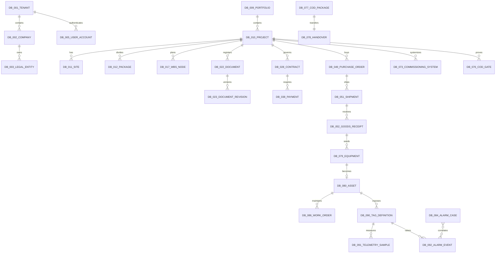
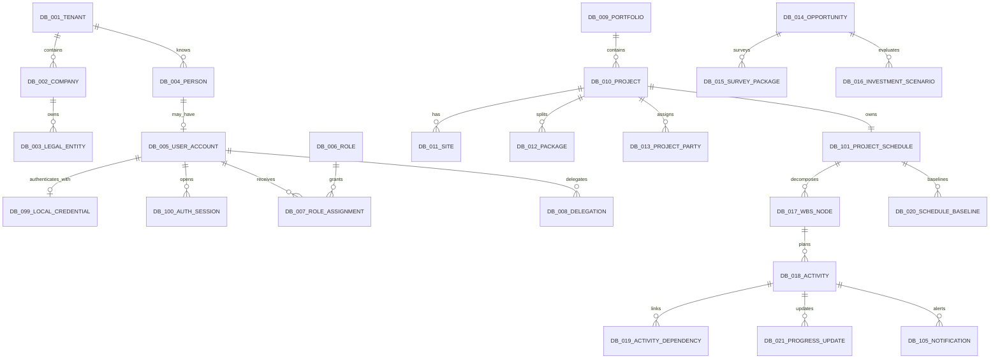
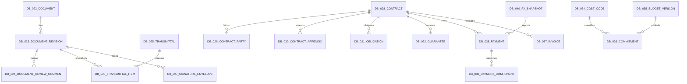
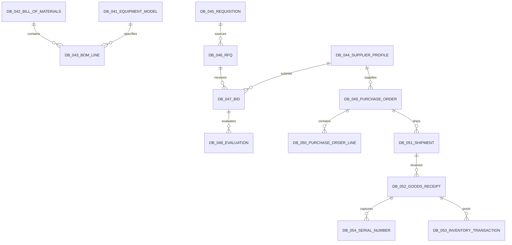
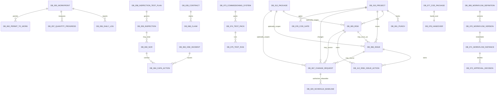
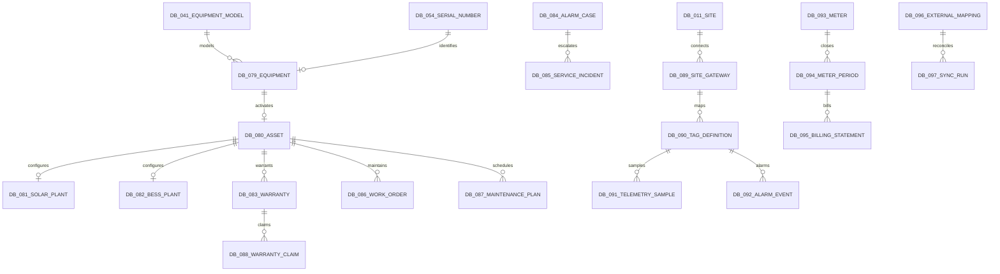
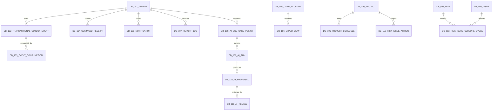

# Data Model — Nền tảng Solar & BESS

> **Purpose:** Định nghĩa mô hình dữ liệu logic, ERD, 113 entity/store ID, khóa, constraint, index, tenant isolation, lifecycle, classification và retention cho PM Web, O&M, operational foundation và read-only telemetry.
> **Scope:** Logical/implementation-ready data contract; PostgreSQL operational stores được chấp nhận cho EC2 test. US-003 materializes DB-012/017…021/101 và schedule subset của DB-105; US-004 materializes DB-065…067/112/113 và generalizes DB-105 locally; DB-068 Claim/Variation giữ dependency Contract/Legal. Production DDL/partition/HA vẫn qua ADR/benchmark.
> **Source:** [AGENTS.md](../AGENTS.md), [SRS](./04-SRS.md), [Domain Model](./05-domain-model.md), [Architecture](./06-solution-architecture.md), [PRD](./03-PRD.md).
> **Version:** 1.2
> **Status:** Draft toàn platform; US-001/US-003 core deployed; US-004 DB-065…067/112/113/generalized DB-105 và forward reconcile 1783735000000/6000000 Implemented/tested local; actual EC2 deployment Pending; DB-068 Reserved
> **Owner:** Data Architecture / Domain Owners (cá nhân: TBD)
> **Updated:** 2026-07-18
> **Approval:** Product Owner delegated approval cho US-003 EC2 test và US-004 local data implementation/pre-push gate; acceptance branch gaps và EC2 deployment Pending, production vẫn Proposed

## 1. Quy ước dữ liệu chung

- Logical id là opaque stable 128-bit/UUID-like; physical type TBD. Không dùng email, tên, contract number, serial hoặc external ID làm PK.
- Mọi entity trừ DB-001 Tenant có tenantId NOT NULL. Mỗi table tenant-scoped cung cấp candidate key `UNIQUE (tenantId, id)`; FK vật lý dùng cặp `(tenantId, referencedId) → (tenantId, id)`, không chỉ FK theo `id`. Cấm liên kết xuyên tenant.
- Entity project-scoped có projectId; khi áp dụng thêm legalEntityId, siteId, packageId và ownerId.
- Entity mutable có createdAt, createdBy, updatedAt, updatedBy, versionNo; optimistic concurrency dùng versionNo.
- Cột Context trong dictionary là data/domain owner. Business record có ownerId/assignee/party theo từng aggregate; record ownership không thay authorization hoặc System of Record.
- Ký hiệu FK có dấu `?` là optional về mặt logic; PK, tenantId và FK không có `?` là NOT NULL. Nullability của các business field theo từng state và mọi database default còn `TBD` cho Domain/Data Owner; không tự đặt default cho status, currency, amount, legal party, safety result hoặc evidence.
- createdAt/createdBy được cấp khi tạo; updatedAt/updatedBy/versionNo chỉ đổi qua command hợp lệ. Initial status phải do domain command đặt rõ, không dựa vào default ẩn.
- Timestamp lưu instant chuẩn; presentation/chốt kỳ dùng site/user timezone. Telemetry tách sourceTimestamp, receiveTimestamp và quality.
- Money = amount Decimal(19,4) + ISO-4217 currency. FX rate = Decimal(28,12), effective date/source/snapshot. Không dùng float.
- Quantity dùng decimal + unit; precision per domain TBD.
- File bytes ở object storage; DB giữ object key, hash, size, MIME, scan/security metadata.
- Search/cache/dashboard/Health projection thuần derived không trở thành SoR. Notification/saved view/report job và AI execution state có DB ID reserved vì chúng cần lifecycle/audit riêng; trạng thái Reserved không đồng nghĩa table đã triển khai.
- Soft delete chỉ cho mutable reference/master khi policy cho phép; immutable/legal/financial/test/audit/time-series dùng state, correction hoặc retention purge có kiểm soát.
- Legal hold thắng soft delete/purge. Retention period từng class là TBD — Legal/Data Governance.

## 2. Storage profile

| Profile | DB IDs | Consistency/partition | Notes |
|---|---|---|---|
| Transactional relational | DB-001…090, DB-093…097, DB-099…113 | Aggregate transaction; tenant/project indexes; PITR | DB-101…105 và DB-112/113 materialized local; DB-106…111 Reserved; EC2 rollout của US-004 Pending |
| Object metadata | DB-023, DB-027 và evidence/document refs | Hash/version linked | Bytes outside DB; Safe scan gate |
| Time-series/event | DB-091, DB-092 | Tenant/tag/time partition; append/checkpoint | Không physical FK cross-store |
| Append-only audit | DB-098 | Tenant/time/object/actor indexes; tamper evidence | Immutable |
| Operational event/idempotency | DB-102…104 | Same-transaction outbox; unique consumer/command keys | PostgreSQL EC2 test profile; production topology Proposed |
| Derived search/cache/health | Không cấp DB ID | Rebuild from SoR | ACL/source version required |

## 3. ERD overview

## 4. ERD chi tiết

### 4.1 Organization, project, opportunity và planning

### 4.2 DMS, contract và cost

### 4.3 Engineering, procurement và logistics

### 4.4 Field, quality, HSE, risk và commissioning

### 4.5 Asset, O&M, telemetry, metering và integration

### 4.6 Operational foundation và reserved stores

`DB-102…104` thuộc operational foundation đã materialize. `DB-101` và schedule-alert DB-105 có từ US-003; US-004 đã materialize DB-065/066/067/112/113, generalize physical `schedule_notifications` thành `notifications` và bảo toàn schedule rows qua migrations `1783731000000…1783734000000`. Drift audit mở và handoff hoàn tất `1783735000000` để reconcile live-schema constraints/functions cùng `1783736000000` để nâng existing seed role grants/policy v3. Focused RiskChange migration 7/7 và exact isolated-port full integration API 49 + Worker 11 Pass; local migration inventory/pre-push gate Complete. EC2 apply/rollout vẫn Pending. `DB-106…111` tiếp tục Reserved; `DB-068` là dependency Contract/Legal, không thuộc migration US-004.

## 5. Data dictionary

Các cột lifecycle/classification dùng ký hiệu: Mutable/Versioned/Immutable/Append-only; Internal/Confidential/Restricted/OT; retention TBD nếu chưa có policy. Index được nêu là logical index candidate, phải benchmark trước physical implementation.

| ID / Entity | Context | PK/FK và tenant scope | Core fields | Unique/index/data rule | Lifecycle/classification/retention | Trace |
|---|---|---|---|---|---|---|
|  **DB-001 — Tenant** | Organization & Access | id PK | code; name; status; locale; timezone; reportingCurrency | UQ code; IDX status | Mutable; Internal; no soft delete while data exists; retention TBD | BR-001/033/040; FR-146…155 |
|  **DB-002 — Company** | Organization & Access | id PK; tenantId FK; parentCompanyId FK? | code; name; organizationType; status | UQ tenant+code; IDX tenant+parent/status | Mutable; Confidential; soft delete policy; retention TBD | BR-001/011/033; FR-037/146…155 |
|  **DB-003 — LegalEntity** | Organization & Access | id PK; tenantId; companyId FK | legalName; country; registrationNo; taxId; status | UQ tenant+country+registrationNo; IDX company/taxId | Mutable master; Confidential; signed snapshots retained elsewhere | BR-009…011/033; FR-036…044/146…155 |
|  **DB-004 — Person** | Organization & Access | id PK; tenantId | legalName; contact; classification | IDX tenant+normalizedName; contact lookup protected | Mutable; Restricted PII; deactivate not delete; retention TBD | BR-011/033; FR-146…155 |
|  **DB-005 — UserAccount** | Organization & Access | id PK; tenantId; personId FK? | issuer; externalSubject; displayName; email; status; lastLoginAt | UQ tenant+issuer+externalSubject; IDX status/email; API-008 only projects `id`/`displayName` after active DB-006/007 project/exact-package/capability filtering | Mutable; Confidential; disable preserves history | BR-033/040; FR-099/100/146…155; API-008 |
|  **DB-006 — Role** | Organization & Access | id PK; tenantId | code; name; permissionPolicyVersion; status | UQ tenant+code; IDX status | Versioned config; Confidential; no hard delete when referenced | BR-033/034; FR-138…155 |
|  **DB-007 — RoleAssignment** | Organization & Access | id PK; tenantId; userId FK; roleId FK | scopeType; scopeId; effectiveFrom; effectiveTo; status | IDX tenant+user+status/effective; UQ active assignment tuple | Versioned/audited; Confidential; revoke not delete | BR-033; FR-146…155 |
|  **DB-008 — Delegation** | Organization & Access | id PK; tenantId; delegatorId FK; delegateId FK | scope; effectiveFrom/To; valueLimit; reason; status | IDX tenant+delegate+effective/status; no chain invariant | Versioned/audited; Confidential; expire/revoke | BR-033/034; FR-141/146…153 |
|  **DB-009 — Portfolio** | Portfolio & Project | id PK; tenantId | code; name; ownerId; status | UQ tenant+code; IDX owner/status | Mutable; Internal; soft delete if empty | BR-001/032; FR-010…015 |
|  **DB-010 — Project** | Portfolio & Project | id PK; tenantId; portfolioId FK; ownerLegalEntityId FK; customerCompanyId FK; projectManagerId FK? | code; name; type; phase; recordStatus; contractModel; currency; plannedCOD; forecastCOD; versionNo | UQ tenant+code; IDX tenant+portfolio/phase/status/owner/customer/PM/COD | Mutable/versioned; Confidential; archive/close only, never hard delete | BR-001/031/032; FR-010…025 |
|  **DB-011 — Site** | Portfolio & Project | id PK; tenantId; projectId FK | code; name; location; timezone; gridConnectionRef | UQ tenant+project+code; IDX project/location | Mutable; Confidential; archive | BR-001/031; FR-010…025 |
|  **DB-012 — Package** | Portfolio & Project | id PK; tenantId+projectId composite FK; parentPackageId composite FK?; contractorCompanyId composite FK? | code; name; packageType; status; versionNo; idempotencyKey; actor/timestamps | UQ tenant+project+code; UQ tenant+id; IDX tenant+project+parent/status; parent same tenant/project | Mutable/versioned; Confidential; ACTIVE/INACTIVE/ARCHIVED; archive not hard delete | BR-001/018/031/032; FR-010…025; US-003; API-023/024; TEST-010/193 |
|  **DB-013 — ProjectParty** | Portfolio & Project | id PK; tenantId; projectId FK; companyId FK; legalEntityId FK? | roleCode; RACI; packageScope; effectiveFrom/To | IDX project+role/effective; UQ active party role scope | Versioned; Confidential; end-date not delete | BR-001/033; FR-010…025/146…155 |
|  **DB-014 — Opportunity** | Opportunity & Investment | id PK; tenantId; customerCompanyId FK; siteId FK? | code; stage; ownerId; nextAction; status; duplicateKey | UQ tenant+code; IDX customer/site/stage/owner | Mutable/versioned; Confidential; archive | BR-002; FR-001 |
|  **DB-015 — SurveyPackage** | Opportunity & Investment | id PK; tenantId; opportunityId FK; siteId FK | revision; status; dataQuality; measuredAt; documentRefs | UQ opportunity+revision; IDX status/dataQuality | Versioned; Confidential; approved immutable | BR-003; FR-002/003 |
|  **DB-016 — InvestmentScenario** | Opportunity & Investment | id PK; tenantId; opportunityId FK | scenarioType; version; inputSnapshot; outputSnapshot; currency; status; formulaVersion | UQ opportunity+scenarioType+version; IDX status | Versioned; Confidential; approved immutable | BR-004…008; FR-003…009 |
|  **DB-017 — WBSNode** | Planning & Controls | id PK; tenantId+projectId+scheduleId composite FKs; packageId/parentWbsId/ownerId composite FKs? | code; name; description; weight numeric(7,4); sortOrder; status; versionNo; actor/timestamps | UQ tenant+project+code; IDX tenant+schedule+parent/package/owner/status; parent/package same scope | Mutable/versioned; Internal; archive not hard delete | BR-018/032; FR-016…021; US-003; TEST-010/193 |
|  **DB-018 — Activity** | Planning & Controls | id PK; tenantId+projectId+scheduleId+wbsId composite FKs; packageId?; ownerId | code; name; activityType; weight numeric(7,4); planned/forecast dates; duration/remaining workdays; current actual projection; percentComplete; status; versionNo | UQ tenant+project+code; IDX tenant+project+status/dates/WBS/package/owner; actual projection only via DB-021 | Mutable/versioned projection; DRAFT/READY/IN_PROGRESS/BLOCKED/COMPLETE/CANCELLED; history retained in DB-021 | BR-018/032; FR-016…021; US-003; TEST-010…013/185/193 |
|  **DB-019 — ActivityDependency** | Planning & Controls | id PK; tenantId+projectId+scheduleId composite FKs; predecessorId/successorId composite FKs | dependencyType FS/SS/FF/SF; lagWorkDays; actor/timestamps | UQ tenant+predecessor+successor+type; IDX tenant+schedule+successor; no self/cross-schedule link; DAG cycle validation | Mutable relationship; unlink audited; no hidden cascade delete | BR-018/032; FR-017/018; US-003; TEST-010/185 |
|  **DB-020 — ScheduleBaseline** | Planning & Controls | id PK; tenantId+projectId+scheduleId composite FKs; approvedChangeRequestId? planned composite FK `(tenantId, projectId, approvedChangeRequestId)` → DB-067; replacesBaselineId? | baselineNumber; baselineType INITIAL/REBASELINE; status; dataDate; snapshot jsonb; snapshotHash; reason; impactSummary; created/submitted/approved actor+time; versionNo | UQ tenant+project+baselineNumber; partial UQ one current APPROVED/project; REBASELINE requires APPROVED change cùng tenant/project; hash canonical snapshot | Draft/Submitted/Returned/Rejected versioned; Approved/Superseded snapshot immutable; Confidential; DB-067 FK chưa materialize trước US-004 | BR-018/022/032; FR-018/020/101/102; US-003/004; API-036/140/159; TEST-011/012/016/195 |
|  **DB-021 — ProgressUpdate** | Planning & Controls | id PK; tenantId+projectId+activityId composite FKs; correctionOfId composite FK? | dataDate; percentComplete numeric(5,2); remainingDurationWorkDays; quantity numeric(19,4)?; unit?; actualStart/Finish?; evidenceRefs jsonb; note; reason; sourceKey; recordedBy/At | UQ tenant+sourceKey; IDX tenant+activity+dataDate/recordedAt; correction target same activity/project | Append-only/correction; no UPDATE/DELETE history; retention project lifecycle | BR-018/032; FR-019/021; US-003; API-037/141; TEST-011/185/195 |
|  **DB-022 — Document** | Document Control | id PK; tenantId; projectId FK | documentCode; title; discipline; type; classification; ownerId | UQ tenant+project+documentCode; IDX project+type/discipline | Mutable register; Confidential; legal hold aware | BR-035; FR-026…035 |
|  **DB-023 — DocumentRevision** | Document Control | id PK; tenantId; documentId FK | revisionCode; workingVersion; status; purpose; objectKey; hash; size; MIME; scanStatus; lockState | UQ document+revisionCode+workingVersion; IDX status/hash | Versioned; issued/signed immutable; retention/legal hold | BR-035; FR-026…035 |
|  **DB-024 — DocumentReviewComment** | Document Control | id PK; tenantId; revisionId FK | cycleNo; authorId; location; severity; disposition; status | IDX revision+cycle/status/author | Append-only history/correction; Confidential | BR-012/035; FR-028/030 |
|  **DB-025 — Transmittal** | Document Control | id PK; tenantId; projectId FK | number; senderPartyId; recipientSnapshot; purpose; dueDate; status | UQ project+number; IDX recipient/status/dueDate | Versioned; issued immutable snapshot | BR-035; FR-031/032 |
|  **DB-026 — TransmittalItem** | Document Control | id PK; tenantId; transmittalId FK; revisionId FK | actionCode; responseCode; responseDue; responseStatus | UQ transmittal+revision; IDX revision/responseStatus | Issued snapshot; response history retained | BR-035; FR-031/032 |
|  **DB-027 — SignatureEnvelope** | Document Control | id PK; tenantId; revisionId FK | provider; externalId; signerSnapshot; artifactHash; status; completedAt | UQ tenant+provider+externalId; IDX revision/status | Versioned; completed immutable; Restricted | BR-011/035; FR-034/145/164 |
|  **DB-028 — Contract** | Contract & Legal | id PK; tenantId; projectId FK | contractNo; type; status; effectiveFrom/To; value; currency; rootDocumentRef | UQ tenant+project+contractNo; IDX status/effectiveTo | Versioned; signed/effective protected; legal hold | BR-009…011; FR-036…044 |
|  **DB-029 — ContractParty** | Contract & Legal | id PK; tenantId; contractId FK; legalEntityId FK | partyRole; legalNameSnapshot; tax/address/representative/authority snapshot | UQ contract+partyRole+legalEntity; IDX legalEntity | Snapshot immutable at signing; Restricted/Confidential | BR-009/011; FR-036/037 |
|  **DB-030 — ContractAppendix** | Contract & Legal | id PK; tenantId; contractId FK | appendixNo; type; effectiveDate; valueImpact; currency; documentRef; status | UQ contract+appendixNo; IDX effectiveDate/status | Versioned; effective immutable; legal hold | BR-009…011; FR-038 |
|  **DB-031 — Obligation** | Contract & Legal | id PK; tenantId; contractId FK; appendixId FK? | clauseRef; obligorId; beneficiaryId; trigger; dueDate; status; evidenceRef | IDX contract+status/dueDate/obligor | Mutable state; fulfillment decision immutable/audited | BR-010/022/026; FR-039/040 |
|  **DB-032 — Guarantee** | Contract & Legal | id PK; tenantId; contractId FK | guaranteeType; issuer; beneficiary; amount; currency; validFrom/To; status | IDX contract+validTo/status | Versioned; Confidential; expiry history | BR-010; FR-041 |
|  **DB-033 — Permit** | Contract & Legal | id PK; tenantId; projectId FK; contractId FK? | permitType; authority; validFrom/To; status; documentRef; criticality | IDX project+validTo/status/criticality | Versioned; Confidential; expired retained | BR-010/026; FR-042 |
|  **DB-034 — CostCode** | Cost & Payment | id PK; tenantId; parentCostCodeId FK? | code; name; capexOpexClass; status; effectiveFrom/To | UQ tenant+code; IDX parent/class/status | Versioned config; Internal; no reuse policy TBD | BR-007/015; FR-053…060 |
|  **DB-035 — BudgetVersion** | Cost & Payment | id PK; tenantId; projectId FK | version; currency; total; status; approvedAt; approvedBy; snapshotHash | UQ project+version; one approved baseline; IDX status | Versioned; approved immutable; Confidential | BR-007/015; FR-053/054 |
|  **DB-036 — Commitment** | Cost & Payment | id PK; tenantId; projectId FK; contractId FK?; purchaseOrderId FK?; costCodeId FK | amount; currency; status; sourceType; sourceId; sourceVersion | UQ tenant+sourceType+sourceId+sourceVersion; IDX project/costCode/status | Versioned; Confidential; reversal not overwrite | BR-015; FR-054/055 |
|  **DB-037 — Invoice** | Cost & Payment | id PK; tenantId; contractId FK; supplierLegalEntityId FK | invoiceNo; invoiceDate; gross; VAT; net; currency; status | UQ tenant+contract+supplier+invoiceNo; IDX date/status | Versioned; Confidential; correction document | BR-015/030; FR-056/060 |
|  **DB-038 — Payment** | Cost & Payment | id PK; tenantId; contractId FK required; payerLegalEntityId FK; payeeLegalEntityId FK; fxSnapshotId FK? | requestedAmount; approvedAmount; paidAmount; currency; status; paidAt; bankReference | IDX contract/status/date/payer/payee; UQ external posting ref | Versioned; Paid/Reconciled immutable; Restricted; no soft delete | BR-015/030/033; FR-056…060 |
|  **DB-039 — PaymentComponent** | Cost & Payment | id PK; tenantId; paymentId FK | componentType; basis; rate; amount; currency; ruleVersion | UQ payment+componentType+sequence; IDX payment | Immutable with paid payment; Confidential | BR-015/030; FR-057/058 |
|  **DB-040 — FXSnapshot** | Cost & Payment | id PK; tenantId | baseCurrency; quoteCurrency; rate; rateDate; source; capturedAt | UQ tenant+source+rateDate+pair; IDX pair/date | Immutable; Internal/Confidential; retention with transaction | BR-007/030; FR-059/060 |
|  **DB-041 — EquipmentModel** | Engineering | id PK; tenantId; manufacturerCompanyId FK? | equipmentClass; manufacturer; model; ratings; specVersion; status | UQ tenant+manufacturer+model+specVersion; IDX class/status | Versioned; Internal; supersede not overwrite | BR-012…014; FR-045…052 |
|  **DB-042 — BillOfMaterials** | Engineering | id PK; tenantId; projectId FK; designRevisionId FK | version; status; releasedAt; releasedBy; snapshotHash | UQ project+version; IDX status | Versioned; released immutable | BR-012/015; FR-046/047 |
|  **DB-043 — BOMLine** | Engineering | id PK; tenantId; billOfMaterialsId FK; equipmentModelId FK? | lineNo; itemCode; description; quantity; unit; substitutionStatus | UQ BOM+lineNo; IDX model/itemCode | Versioned with BOM; Internal | BR-012…015; FR-046…052 |
|  **DB-044 — SupplierProfile** | Procurement | id PK; tenantId; companyId FK; legalEntityId FK | category; qualificationStatus; validTo; riskRating; status | UQ tenant+company+category; IDX qualification/validTo | Versioned; Confidential; expire not delete | BR-015; FR-061 |
|  **DB-045 — Requisition** | Procurement | id PK; tenantId; projectId FK; packageId FK; wbsId FK?; costCodeId FK | number; needByDate; status; requesterId; sourceBOMRef | UQ project+number; IDX status/needBy/requester | Versioned; approved protected | BR-015; FR-062 |
|  **DB-046 — RFQ** | Procurement | id PK; tenantId; requisitionId FK; packageId FK | number; revision; dueDate; status; issuedAt | UQ projectScope+number+revision; IDX status/dueDate | Versioned; issued immutable revision | BR-015; FR-063 |
|  **DB-047 — Bid** | Procurement | id PK; tenantId; rfqId FK; supplierProfileId FK | revision; currency; total; submittedAt; sealedStatus; payloadRef | UQ RFQ+supplier+revision; IDX sealedStatus/submittedAt | Versioned; Restricted bid; no soft delete | BR-015/033; FR-064 |
|  **DB-048 — Evaluation** | Procurement | id PK; tenantId; bidId FK | evaluationType; evaluatorId; score; result; version; decisionRef | UQ bid+type+version+evaluator; IDX result | Versioned; Restricted; decision immutable | BR-015/033; FR-065/066 |
|  **DB-049 — PurchaseOrder** | Procurement | id PK; tenantId; projectId FK; supplierProfileId FK; contractId FK? | poNo; revision; value; currency; status; requiredDate | UQ project+poNo+revision; IDX status/requiredDate/supplier | Versioned; issued protected; amendment new revision | BR-015…017; FR-067/068 |
|  **DB-050 — PurchaseOrderLine** | Procurement | id PK; tenantId; purchaseOrderId FK; requisitionId FK?; bomLineId FK? | lineNo; modelOrItem; quantity; unit; unitPrice; currency | UQ PO+lineNo; IDX BOM/requisition/model | Versioned with PO; Confidential | BR-015…017; FR-067/068 |
|  **DB-051 — Shipment** | Logistics | id PK; tenantId; purchaseOrderId FK; supplierProfileId FK | tracking; route; committedDate; ETD; ETA; actualDate; status | IDX PO/status/ETA/tracking; UQ carrier+tracking TBD | Mutable/versioned; Confidential; milestones retained | BR-016/017; FR-069/070 |
|  **DB-052 — GoodsReceipt** | Logistics | id PK; tenantId; shipmentId FK?; purchaseOrderId FK; siteId FK | receiptNo; receiptDate; quantity; condition; status; evidenceRef | UQ project/site+receiptNo; IDX PO/status/date | Append/correction; Confidential; no delete after acceptance | BR-017; FR-071/072 |
|  **DB-053 — InventoryTransaction** | Logistics | id PK; tenantId; siteId FK; equipmentId FK?; equipmentModelId FK? | transactionType; location; quantity; unit; occurredAt; sourceRef | UQ source transaction key; IDX site/location/item/time | Append-only; Internal; retention project/asset lifecycle | BR-017; FR-073/074 |
|  **DB-054 — SerialNumber** | Logistics/Asset | id PK; tenantId; equipmentModelId FK; goodsReceiptId FK | manufacturer; serialValue; assetTag; status; replacedById | UQ policy TBD; IDX normalized serial/model/status | Versioned lineage; Confidential; no reuse | BR-013/017; FR-072/074 |
|  **DB-055 — Workfront** | Construction | id PK; tenantId; projectId FK; siteId FK; packageId FK; wbsId FK | zone; readinessStatus; status; releasedAt; suspendedReason | IDX project/site/status/WBS; UQ logical workfront code TBD | Mutable/versioned; Internal; archive | BR-018…020; FR-075/078/081 |
|  **DB-056 — DailyLog** | Construction | id PK; tenantId; projectId FK; siteId FK; contractorCompanyId FK | logDate; shift; weather; narrative; signerSnapshot; revision; status | UQ site+contractor+date+shift+revision; IDX date/status | Versioned; signed immutable; Confidential | BR-019; FR-079/080 |
|  **DB-057 — QuantityProgress** | Construction | id PK; tenantId; activityId FK?; wbsId FK; workfrontId FK | quantity; unit; dataDate; evidenceRef; certificationStatus; correctionOfId | IDX WBS/workfront/date/status; idempotency source key | Append/correction; Confidential | BR-018/019; FR-076/077/080 |
|  **DB-058 — InspectionTestPlan** | Quality | id PK; tenantId; projectId FK; packageId FK | version; status; acceptanceRefs; documentRevisionRef | UQ package+version; IDX status | Versioned; approved immutable | BR-021; FR-091 |
|  **DB-059 — Inspection** | Quality | id PK; tenantId; inspectionTestPlanId FK; workfrontId FK?; equipmentId FK? | requestAt; status; result; measurements; witnessSnapshot; evidenceRefs | IDX ITP/status/date/equipment; UQ source request key | Versioned; original result immutable | BR-021/023…026; FR-092/093 |
|  **DB-060 — NCR** | Quality | id PK; tenantId; inspectionId FK?; equipmentId FK?; workfrontId FK? | severity; finding; disposition; status; verifierId; evidenceRefs | IDX project/severity/status/owner/dueDate | Versioned; history immutable; Confidential | BR-021/023…026; FR-094/095 |
|  **DB-061 — Punch** | Quality | id PK; tenantId; projectId FK; commissioningSystemId FK?; assetId FK? | category; description; ownerId; dueDate; status; evidenceRefs | IDX project/category/status/dueDate | Versioned; close/reopen history | BR-021/026; FR-096/097 |
|  **DB-062 — PermitToWork** | HSE | id PK; tenantId; siteId FK; workfrontId FK | permitType; validFrom/To; isolationRef; issuerId; status | IDX site/status/validTo/workfront | Versioned; issued/expired retained; Restricted | BR-020/025; FR-081/085/086 |
|  **DB-063 — HSEIncident** | HSE | id PK; tenantId; siteId FK; projectId FK | incidentType; actualSeverity; potentialSeverity; occurredAt; restrictedFacts; status | IDX project/site/severity/status/time; field-level ACL | Versioned; initial report immutable; Restricted PII | BR-020/025/026; FR-087…090 |
|  **DB-064 — CAPAAction** | HSE/Quality | id PK; tenantId; hseIncidentId FK?; ncrId FK? | actionType; ownerId; dueDate; evidenceRef; effectivenessStatus | IDX owner/status/dueDate/source | Versioned; verification decision immutable | BR-020/021; FR-089/090/095 |
|  **DB-065 — Risk** | Risk/Change | id PK; tenantId+projectId composite FK; packageId? composite FK to DB-012 cùng project; ownerId/closureRequesterId/closureDecidedBy composite FKs to DB-005 | code; category; cause; event; impact; probability + cost/schedule/HSE impact ratings integer 1…5; derived impactRating/inherentExposure/Level; scoringVersion/thresholdVersion; responseStrategy; responsePlan; trigger; contingencyPlan; residual inputs/derived values; reviewDate; evidenceRefs; status; occurredIssueId?; latest closure-cycle projection fields; versionNo; actor/timestamps | UQ tenant+project+code; UQ tenant+project+id; IDX tenant+project+package/status/owner/residualExposure/reviewDate; server computes exposure; latest closure scalars mirror newest DB-113 cycle and are not history SoR; OCCURRED requires linked same-scope DB-066 | Implemented local qua `1783731000000`; active/latest projection versioned; every completed closure cycle retained in DB-113; CLOSED/OCCURRED facts protected; focused migration evidence Pass, acceptance Partial; Confidential; retention project lifecycle/legal hold | BR-022/031/032; FR-098/099/104; US-004; AC-014/015/017; TEST-014/015/017 |
|  **DB-066 — Issue** | Risk/Change | id PK; tenantId+projectId composite FK; packageId? composite FK to DB-012; sourceRiskId? composite FK to DB-065 cùng project/package scope; ownerId/resolvedBy/closureRequesterId/closureDecidedBy composite FKs to DB-005 | code; title; description; severity LOW/MEDIUM/HIGH/CRITICAL; occurredAt; actualImpact; rootCause; decisionSummary?; ownerId; targetDate; evidenceRefs; sourceRiskId?; status; resolution facts; latest closure-cycle projection fields; versionNo; actor/timestamps | UQ tenant+project+code; UQ tenant+project+id; IDX tenant+project+package/status/severity/owner/targetDate; source Risk same scope; RESOLVED needs summary/evidence; latest closure scalars mirror newest DB-113 cycle and are not history SoR | Implemented local qua `1783731000000`; mutable/versioned đến closure; every completed closure cycle retained in DB-113; reopen does not overwrite old cycle; focused migration evidence Pass, acceptance Partial; Confidential | BR-022/031/032; FR-100/104; US-004; AC-014/015/017; TEST-014/015/017 |
|  **DB-067 — ChangeRequest** | Risk/Change | id PK; tenantId+projectId composite FK; packageId? composite FK to DB-012; sourceRiskId?/sourceIssueId? same-scope composite FK; sourceBaselineId? composite FK to DB-020; ownerId/requesterId/submitterId/decidedBy/approvedBy composite FKs to DB-005 | code; title; sourceType MANUAL/RISK/ISSUE; source refs; sourceEvidenceSnapshot; sourceBaselineId?; reason; options; recommendation?; partial impact draft scope/schedule/cost/quality/HSE/contract; impactSnapshot/hash; approvalSnapshot/hash; decisionVersion; scheduleImpactApproved; status; submitted/decision/approval actors/times/comment; versionNo; actor/timestamps | UQ tenant+project+code; UQ tenant+project+id; IDX tenant+project+package/status/requester/submittedAt; sourceType/ref XOR; source-derived Change kế thừa packageId; amount numeric(19,4)/currency pair; DRAFT/ASSESSED cho partial impact, sáu chiều complete trước SUBMITTED; sourceBaselineId bắt buộc trước SUBMITTED khi current schedule dimension yêu cầu rebaseline; requester/submitter ≠ decision actor; `scheduleImpactApproved` server derives true only when APPROVE snapshot has `schedule.requiresRebaseline=true` | Implemented local qua `1783732000000`; Draft/Assessed/Returned versioned; submitted decision append-audited; approved source/reason/impact/decision/approval snapshots and hashes immutable, no hard delete; positive REBASELINE integration implemented; acceptance Partial; Confidential | BR-018/022/031/032; FR-101/102/104; US-003/004; AC-012/016; TEST-012/016 |
|  **DB-068 — Claim (Dependency/Reserved)** | Contract & Legal / Risk/Change | logical id PK; tenantId; projectId/contractId required; changeRequestId? same-scope refs khi materialize | clauseRef; eventDate; noticeDeadline; quantum numeric(19,4); currency; evidenceRefs; negotiationStatus; privilegeClass; decision snapshot | Contract/legal authority, notice/quantum/currency/privilege constraints còn phụ thuộc DB-028…033 và US-006; không có table/migration/API trong US-004 | Reserved dependency; Restricted/legal privilege; event/notice timestamp và issued decision phải bất biến khi triển khai; không được hiển thị như completed | BR-022/031/032; FR-103/104/105; US-004/006; TEST-014…017 dependency only |
|  **DB-069 — WorkflowDefinition** | Workflow | id PK; tenantId | code; name; processOwnerId; status | UQ tenant+code; IDX status/owner | Mutable; versioned through child; Internal | BR-034; FR-138…145 |
|  **DB-070 — WorkflowVersion** | Workflow | id PK; tenantId; workflowDefinitionId FK | version; routingRules; effectiveFrom/To; publishedAt; hash | UQ definition+version; IDX effective/status | Published immutable; Confidential config | BR-034; FR-138/139 |
|  **DB-071 — WorkflowInstance** | Workflow | id PK; tenantId; workflowVersionId FK | objectType; objectId; state; requesterId; submittedAt; snapshotHash | IDX tenant+object/state/requester/SLA; UQ active object workflow policy | Versioned state; decision history retained | BR-034; FR-139…145 |
|  **DB-072 — ApprovalDecision** | Workflow | id PK; tenantId; workflowInstanceId FK | step; actorId; effectiveActorId; decision; comment; decidedAt; artifactHash | UQ instance+step+actor+decision sequence; IDX actor/time | Append-only/immutable; Confidential | BR-011/033/034; FR-140…145 |
|  **DB-073 — CommissioningSystem** | Commissioning | id PK; tenantId; projectId FK; parentSystemId FK? | code; boundary; systemType; status | UQ project+code; IDX parent/status | Mutable/versioned; approved boundary protected | BR-023…026; FR-106/107 |
|  **DB-074 — TestPack** | Commissioning | id PK; tenantId; commissioningSystemId FK | code; procedureRevisionId; prerequisitesSnapshot; status | UQ system+code+procedureRevision; IDX status | Versioned; approved pack immutable | BR-023/024; FR-107/108 |
|  **DB-075 — TestRun** | Commissioning | id PK; tenantId; testPackId FK; previousRunId FK? | runNo; result; rawDataRef; instrumentSnapshot; witnessSnapshot; startedAt; endedAt | UQ testPack+runNo; IDX result/date/previousRun | Immutable result; retest new record; Confidential | BR-023/024; FR-108…111 |
|  **DB-076 — CODGate** | Commissioning | id PK; tenantId; projectId FK | category; mandatoryFlag; waivableFlag; ownerId; dueDate; status; evidenceRef; evidenceExpiry | IDX project/category/status/dueDate; UQ gate definition instance | Versioned; acceptance/waiver decision immutable | BR-023…026; FR-109…113 |
|  **DB-077 — CODPackage** | Commissioning | id PK; tenantId; projectId FK | version; readinessSnapshot; status; signedArtifactRef; effectiveAt | UQ project+version; IDX status/effectiveAt | Versioned; signed immutable; legal hold | BR-026; FR-112/113 |
|  **DB-078 — Handover** | Commissioning | id PK; tenantId; codPackageId FK | fromPartyId; toPartyId; itemManifest; acceptedAt; acceptedBy; openItems | UQ COD package+recipient/version; IDX acceptedAt | Accepted immutable; Confidential | BR-026; FR-114 |
|  **DB-079 — Equipment** | Asset | id PK; tenantId; projectId FK; equipmentModelId FK; serialNumberId FK?; parentEquipmentId FK? | equipmentType; siteId; systemId; lifecycleStatus; installedAt; replacedById | IDX project/site/model/serial/status; UQ serial link policy | Versioned lineage; Confidential; no delete after receipt | BR-013/014/017/026; FR-072/114/125…137 |
|  **DB-080 — Asset** | Asset | id PK; tenantId; equipmentId FK; siteId FK | assetCode; activationDate; operationalStatus; dossierRef; externalFinancialAssetRef | UQ tenant+assetCode; UQ equipment active asset; IDX site/status | Versioned; archive; Confidential | BR-026…029; FR-114…137 |
|  **DB-081 — SolarPlant** | Asset/Solar | id PK; tenantId; projectId FK; siteId FK; rootAssetId FK | dcCapacity; acCapacity; configurationVersion; baselineRef; status | UQ site+configurationVersion; IDX status | Versioned; released config immutable | BR-024/027; FR-125…129 |
|  **DB-082 — BESSPlant** | Asset/BESS | id PK; tenantId; projectId FK; siteId FK; rootAssetId FK | powerMW; energyMWh; hierarchyVersion; operatingEnvelope; pointListVersion; status | UQ site+hierarchyVersion; IDX status; no credential field | Versioned; released config immutable; Restricted OT metadata | BR-024/028/040; FR-130…137 |
|  **DB-083 — Warranty** | Asset | id PK; tenantId; equipmentId FK?; assetId FK?; contractId FK | startDate; endDate; termsRef; providerPartyId; status; coverageSnapshot | IDX asset/equipment/endDate/status | Versioned; terms snapshot retained | BR-017/026/029; FR-073/122 |
|  **DB-084 — AlarmCase** | O&M | id PK; tenantId; siteId FK; assetId FK? | severity; state; ownerId; firstSeen; lastSeen; sourceEventRefs; acknowledgmentAt | IDX site/asset/state/severity/lastSeen | Versioned local case; Confidential; no OT mutation | BR-028/029; FR-118/119 |
|  **DB-085 — ServiceIncident** | O&M | id PK; tenantId; siteId FK; assetId FK?; alarmCaseId FK? | severity; downtimeStart/End; SLA timestamps; status; hseIncidentRef | IDX site/status/severity/SLA | Versioned; close evidence; Confidential | BR-028/029; FR-119/120 |
|  **DB-086 — WorkOrder** | O&M | id PK; tenantId; assetId FK; serviceIncidentId FK? | workType; priority; assigneeId; scheduledAt; status; permitToWorkId; returnToServiceRef | IDX asset/status/priority/assignee/date | Versioned; Complete/Close separation; Confidential | BR-029; FR-120/121 |
|  **DB-087 — MaintenancePlan** | O&M | id PK; tenantId; assetId FK | triggerType; interval; cycle; taskTemplate; effectiveVersion; status | UQ asset+plan type+version; IDX nextDue/status | Versioned; published immutable version | BR-029; FR-121 |
|  **DB-088 — WarrantyClaim** | O&M | id PK; tenantId; warrantyId FK; assetId FK; workOrderId FK? | failureDescription; evidenceRefs; submittedAt; status; resolution | IDX warranty/status/submittedAt | Versioned; Confidential; resolution retained | BR-029; FR-122 |
|  **DB-089 — SiteGateway** | OT Telemetry | id PK; tenantId; siteId FK | gatewayCode; certificateRef; status; lastSeen; firmwareVersion | UQ tenant+site+gatewayCode; IDX status/lastSeen | Versioned config; Restricted; certificate secret external | BR-037/040; FR-165/166 |
|  **DB-090 — TagDefinition** | OT Telemetry | id PK; tenantId; siteGatewayId FK; assetId FK? | canonicalTag; sourceTag; unit; expectedFrequency; qualityPolicy; version; status | UQ gateway+sourceTag+version; IDX asset/canonicalTag/status | Versioned config; Restricted OT metadata | BR-027/028/037; FR-134/165…170 |
|  **DB-091 — TelemetrySample** | OT Time-series | logical PK tenantId+tagId+sourceTimestamp+sequence; tagId logical FK | typedValue; unit; quality; receiveTimestamp; rawRef | Partition tenant/tag/time; IDX tag+time/quality; dedup key | Append-only; OT classification; tiered retention TBD | BR-027/028/040; FR-116/117/134/165…170 |
|  **DB-092 — AlarmEvent** | OT Event Store | id PK; tenantId; gatewayId/tagId/assetId logical refs | externalEventId; state; severity; sourceTimestamp; receiveTimestamp; quality; rawRef | UQ tenant+gateway+externalEventId; IDX asset/time/state | Append-only/immutable; Restricted OT; retention TBD | BR-028/040; FR-118/165…170 |
|  **DB-093 — Meter** | Metering | id PK; tenantId; siteId FK; assetId FK? | meterCode; serial; meterType; ctRatio; ptRatio; timezone; status | UQ tenant+meterCode; IDX site/status/serial | Versioned; Confidential; calibration/history | BR-004/024/030; FR-003/123/169 |
|  **DB-094 — MeterPeriod** | Metering | id PK; tenantId; meterId FK | periodStart; periodEnd; revisionNo; importEnergy; exportEnergy; demand; quality; veeStatus; closedAt | UQ meter+periodStart+periodEnd+revisionNo; IDX closedAt/status | Versioned; closed revision immutable | BR-004…007/030; FR-003/116/117/123/124 |
|  **DB-095 — BillingStatement** | Metering/Billing | id PK; tenantId; contractId FK; siteId FK; meterPeriodId FK | period; tariffVersionRef; amount; currency; adjustments; status; reportRef | UQ contract+site+period+revision; IDX status/period | Versioned; approved immutable; Confidential | BR-030; FR-123/124 |
|  **DB-096 — ExternalMapping** | Integration | id PK; tenantId | systemCode; objectType; internalId; externalId; sourceVersion; checksum; status | UQ tenant+system+objectType+externalId; IDX internalId/status | Versioned; Confidential; no ID substitution | BR-037; FR-156…177 |
|  **DB-097 — SyncRun** | Integration | id PK; tenantId; connectorRef | direction; startedAt; endedAt; counts; status; checkpoint; reconciliationSummary; correlationId | IDX tenant+connector+status/time; UQ idempotency run key | Append/versioned attempts; Confidential; retention TBD | BR-037/040; FR-156…177 |
|  **DB-098 — AuditEvent** | Audit Store | id PK; tenantId | actorId; effectiveActorId; action; objectType; objectId; beforeHash; afterHash; occurredAt; correlationId; result | Partition tenant/time; IDX object/time/actor/action/correlation | Append-only/tamper-evident; Restricted; immutable retention TBD | BR-011/033…040; FR-143/154; NFR-022 |
|  **DB-099 — LocalCredential** | Organization & Access | id PK; tenantId; userAccountId FK | passwordHash; algorithm; credentialVersion; changedAt | UQ tenant+userAccountId; passwordHash never returned/logged | Mutable security credential; Restricted; revoke/delete only with account lifecycle audit | BR-033/040; FR-147; SEC-101/117/118 |
|  **DB-100 — AuthenticationSession** | Organization & Access | id PK; tenantId; userAccountId FK | familyId; refreshJtiHash; expiresAt; revokedAt; revokeReason; lastUsedAt; createdIpHash; userAgent | UQ refreshJtiHash; IDX tenant+user+family/expiry/revokedAt; rotation revokes predecessor | Versioned security session; Restricted; retention 30 days after expiry for test profile | BR-033/040; FR-147/154; SEC-103/117/118 |
|  **DB-101 — ProjectSchedule** | Planning & Controls | id PK; tenantId+projectId composite FK | timezone IANA; calendarCode; workingWeek jsonb; calendarExceptions jsonb; dataDate; status DRAFT/VALIDATED/SUBMITTED/APPROVED/RETURNED/REJECTED; versionNo; actor/timestamps | UQ tenant+project (một schedule/project); IDX tenant+project+status/dataDate; JSONB chỉ calendar config versioned | Implemented EC2 test; mutable/versioned aggregate, no hard delete after baseline | BR-018/032; FR-016…021; US-003; API-034…037/140/141; TEST-010…013 |
|  **DB-102 — TransactionalOutboxEvent** | Platform Events | id PK; tenantId; aggregateId logical ref | aggregateType; aggregateVersion; eventType; schemaVersion; payload; occurredAt; availableAt; publishedAt; attemptCount; status; correlationId | UQ tenant+id; UQ tenant+aggregateType+aggregateId+aggregateVersion+eventType; IDX tenant+status+availableAt | Append-only event intent; payload classification inherits source; EC2 test Approved/Planned; retention configurable/TBD production | BR-031/034/037/040; NFR-007/021/024; ADR-006; TEST-180 |
|  **DB-103 — EventConsumption** | Platform Events | id PK; tenantId; eventId composite FK to DB-102 | consumerName; handlerVersion; status; leaseUntil; attemptCount; lastErrorHash; processedAt; correlationId | UQ tenant+consumerName+eventId; IDX tenant+consumer+status/lease; duplicate cannot create second side effect | Append/versioned attempt ledger; Confidential; EC2 test Approved/Planned; retention aligned outbox/TBD production | BR-031/034/037/040; NFR-007/021/024; ADR-006; TEST-180 |
|  **DB-104 — CommandReceipt** | Platform Commands | id PK; tenantId; actorId logical ref | actorType; operation; idempotencyKey; requestHash; state; responseStatus; responseRef; correlationId; expiresAt | UQ tenant+actorType+actorId+operation+idempotencyKey; IDX tenant+expiresAt/state; same key/different hash is conflict | Versioned security/command record; Confidential; EC2 test retention 24h configurable, production TBD | BR-031/033/040; NFR-007/012; SEC-105/111/122; TEST-180/202/208 |
|  **DB-105 — Notification** | Notification | id PK; tenantId+recipientUserId composite FK; tenantId+projectId composite FK; packageId? same-project FK; activityId? same-project FK | sourceType `ScheduleActivity|Risk|Issue|RiskIssueAction|ChangeRequest`; sourceId; alertType; priority; objectLink; reason; dueAt; dataDate; thresholdVersion; dedupKey; status; readAt; createdAt | UQ tenant+dedupKey; IDX inbox tenant+recipient+status+dueAt, source tenant+project+package+sourceType+sourceId, schedule activity partial index. `ScheduleActivity` bắt activityId=sourceId; source khác bắt activityId NULL; trigger kiểm source tồn tại và tenant/project/package khớp | Physical `notifications` sau expand migration; schedule rows hiện hữu được giữ nguyên khi rename từ `schedule_notifications`; Risk/Issue/Action/Change projection rebuildable; notification không cấp access và recipient/source scope được recheck khi query/delivery; full channel lifecycle remains US-022 | BR-022/032/034/038; FR-020/025/099/100/104/142…145/175/177; US-003/004/022; TEST-013/015/103…107 |
|  **DB-106 — SavedView (Reserved)** | Reporting | id PK; tenantId; ownerUserId composite FK | name; targetType; filterSnapshot; columnSnapshot; sortSnapshot; shareScope; versionNo | UQ tenant+owner+target+name; IDX tenant+owner/target | Reserved cho US-023; Confidential; chưa có table/migration | BR-001/032/036/038; FR-171…177; US-023; TEST-108…112 |
|  **DB-107 — ReportJob (Reserved)** | Reporting | id PK; tenantId; requestedBy composite FK | reportType; filterSnapshot; dataAsOf; status; outputObjectRef; expiresAt; correlationId | UQ tenant+id; IDX tenant+requester+status/createdAt; idempotency via DB-104 | Reserved cho US-023; output snapshot immutable khi complete; chưa có table/migration | BR-001/032/036/038; FR-130…137/171…177; US-023; TEST-108…112/178 |
|  **DB-108 — AIUseCasePolicy (Reserved)** | AI Governance | id PK; tenantId | useCaseCode; modelPolicyRef; corpusScope; capabilityDeny; confidenceRule; effectiveFrom/To; status; version | UQ tenant+useCaseCode+version; IDX tenant+status/effective | Reserved cho US-031; versioned policy; Restricted; chưa có table/migration | BR-039/040; FR-178…198; NFR-017; US-031; TEST-145…149 |
|  **DB-109 — AIRun (Reserved)** | AI Governance | id PK; tenantId; policyId composite FK | requestedBy; projectId; inputHash; sourceRefs; model/prompt/policyVersion; startedAt; completedAt; status; correlationId | UQ tenant+id; IDX tenant+project+status/time; source refs must be authorized | Reserved cho US-031…037; append/versioned; Restricted; retention TBD AI Governance | BR-039/040; FR-178…198; NFR-017; TEST-145…173 |
|  **DB-110 — AIProposal (Reserved)** | AI Governance | id PK; tenantId; aiRunId composite FK | outputRef; citations; confidence; uncertainty; capability; proposedObjectType; status | IDX tenant+run+status; proposal never becomes approved business state directly | Reserved cho US-031…037; immutable original proposal; Restricted; retention TBD | BR-039/040; FR-178…198; NFR-017; TEST-145…173 |
|  **DB-111 — AIReview (Reserved)** | AI Governance | id PK; tenantId; aiProposalId composite FK; reviewerId composite FK | decision; correctionRef; reason; reviewedAt; resultingDraftRef | UQ tenant+proposal+review sequence; IDX tenant+reviewer/time; only confirmed review may create domain draft | Reserved cho US-031…037; append-only human decision; Restricted; retention TBD | BR-039/040; FR-178…198; NFR-017; TEST-145…173 |
|  **DB-112 — RiskIssueAction** | Risk/Change | id PK; tenantId+projectId composite FK; packageId? composite FK to DB-012; riskId?/issueId? same-scope composite FKs; ownerId/completedBy/verifiedBy/cancelledBy composite FKs to DB-005 | code; actionType RESPONSE/CONTINGENCY/CORRECTIVE/DECISION; title; description?; ownerId; dueDate; status OPEN/IN_PROGRESS/BLOCKED/DONE/VERIFIED/CANCELLED; statusReason?; evidenceRefs; residualProbability?/residualCostImpactRating?/residualScheduleImpactRating?/residualHseImpactRating?; residualRiskVersion?; residualRationale?; completedAt/by; verifiedAt/by; cancelledAt/by; versionNo; actor/timestamps | UQ tenant+project+code; exactly one parent; packageId kế thừa parent; IDX tenant+project+package+owner+status+dueDate and parent+status; complete four-input residual chỉ là proposal cho Risk và snapshot parent version; DONE không đổi Risk; VERIFIED full-project/independent atomically version-check/copy/recompute DB-065; CANCELLED cần reason/evidence/independent authority; chỉ VERIFIED/authorized CANCELLED không block closure | Implemented local qua `1783731000000` và additive `1783734000000`; mutable trước terminal; VERIFIED/CANCELLED và completion/verification/cancellation facts immutable, no generic PATCH/correction path V1; focused migration/HTTP evidence Pass, TEST-015/017 Partial; Confidential; no hard delete after history/outbox reference | BR-022/031/032; FR-099/100/104; US-004; AC-015/017; TEST-015/017 |
|  **DB-113 — RiskIssueClosureCycle** | Risk/Change | id PK; tenantId+projectId composite FK; packageId? same-project FK; riskId?/issueId? same-scope composite FK; requestedBy/decidedBy composite FKs to DB-005 | sequenceNo; requestReason; requestEvidenceRefs; requestedBy/At; decision? APPROVE/RETURN/REJECT; decisionComment?; decisionEvidenceRefs; decidedBy/At; resultingStatus?; createdAt | Exactly one parent; UQ tenant+parent+sequence; partial UQ one undecided cycle/parent; package inherited; request inserts new cycle, decision only fills one undecided cycle once; actor SoD uses cycle requester and parent pre-state; IDX parent+sequence/time | Implemented local qua `1783731000000`; completed cycle immutable/no UPDATE/DELETE; new reopen/re-close appends next sequence; Risk/Issue latest scalar fields are rebuildable projection only; post-fix focused HTTP 6/6 cover Risk reopen→second closure cycle và immutable sequence `[2,1]`, nhưng Issue/RETURN/REJECT/cursor/ACL matrix của TEST-017 vẫn Partial; Confidential/legal-hold aware | BR-022/031/032; FR-098…100/104; US-004; AC-017; API-144/147/154/155/160/161; TEST-017 |

## 6. Quy tắc khóa, index và tenant isolation

- PK: id stable; time-series DB-091 có composite logical key tenantId, tagId, sourceTimestamp, sequence.
- Mỗi table tenant-scoped có `UNIQUE (tenant_id, id)` để làm candidate key; FK trong cùng PostgreSQL store bắt buộc là composite `(tenant_id, referenced_id) REFERENCES parent(tenant_id, id)`. FK chỉ theo `id` không đạt operational foundation. Cross-store dùng logical ID + reconciliation, không physical FK.
- Migration hardening theo expand/validate/contract: thêm candidate unique; thêm composite FK `NOT VALID` khi PostgreSQL hỗ trợ; query orphan/cross-tenant; `VALIDATE CONSTRAINT`; sau compatibility window mới bỏ FK cũ. Không tự sửa tenant của dữ liệu mismatch.
- Mọi unique business key phải prefix tenantId và thêm projectId/legalEntityId khi catalog ghi.
- Index tối thiểu: tenant + status/owner/dueDate; tenant + project + updatedAt; foreign keys; external mapping; document code/revision; contract/project/no; PO/project/no; audit object/time/actor; telemetry tag/time.
- Search index chứa sourceVersion, classification và ACL tokens; open/download re-authorize.
- Cache key chứa tenant, data scope/policy version, locale và query version khi áp dụng.
- Soft-deleted master không được tái dùng business key nếu legal/audit policy cấm; rule TBD per entity.

### 6.1 Outbox, consumer và command idempotency

- `DB-102` được insert trong đúng TypeORM/PostgreSQL transaction với business mutation và `DB-098`; event chỉ publish sau commit.
- Publisher claim bounded batch bằng lease/row lock; không set `publishedAt` trước khi BullMQ accept job. BullMQ `jobId = DB-102.id`.
- `DB-103` unique tenant+consumer+event. Side effect và transition `PROCESSED` phải cùng transaction khi cùng store; duplicate `PROCESSED` được ack không chạy lại.
- `DB-104` scope tenant+actor+operation+key. Same request hash replay stable result; different hash trả conflict; in-flight command không chạy song song.
- Redis/BullMQ là transport/rate-limit state, không phải business SoR. PostgreSQL `DB-102…104` giữ recovery/reconciliation truth cho EC2 test.

### 6.2 US-003 calendar, weight, CPM và immutable history

- DB-101 dùng một calendar day-level/project: IANA timezone, working week và exception date explicit; không tự thêm ngày nghỉ quốc gia. Business dates là PostgreSQL `date`, audit/event time là UTC `timestamptz`.
- TASK lưu planned start + duration workdays; server tính canonical finish. MILESTONE duration 0 và start = finish. Lag là integer workday, `abs(lag) <= SCHEDULE_MAX_ABS_LAG_DAYS`.
- Draft chỉ yêu cầu tổng child weight không vượt 100. Validate/Submit yêu cầu root WBS = 100, mỗi sibling WBS group = 100 và activities mỗi leaf WBS = 100; weight `numeric(7,4)`, `0 < weight <= 100`.
- Dependency hỗ trợ FS/SS/FF/SF, cấm self/cross-schedule link và cycle. CPM V1 tính derived early/late/float; critical khi float <= 0, near-critical theo versioned env. Derived CPM không là SoR.
- DB-020 approved snapshot/hash bất biến; baseline mới atomically supersede baseline cũ. REBASELINE bắt buộc approved DB-067 cùng tenant/project; API-038/DB-067 là dependency, không phải direct schedule implementation.
- DB-021 append-only. Actual finish yêu cầu actual start, progress 100 và evidence; correction tạo record mới cùng activity/project với reason, không update/delete history. Correction giữ `dataDate` của target; fact bị correction được supersede trong derived projection. Current projection chọn effective leaf theo `dataDate`, rồi `recordedAt`, rồi UUID; correction ghi muộn cho ngày cũ không rollback ngày báo cáo mới. Nullable actual date được gửi explicit khi correction cần mở lại completion.
- `SPI_WEIGHTED_LINEAR_V1 = weightedActual / weightedPlanned`; denominator 0 trả N/A. Calculation/alert output ghi dataDate, calculatedAt, formulaVersion và thresholdVersion.

### 6.2.1 DB-105 physical generalization contract

- Expand migration đổi tên physical table `schedule_notifications` thành `notifications` in-place để giữ toàn bộ ID, unread/read state và dedup key schedule hiện hữu; entity chung đổi thành `NotificationEntity`. `project_id` giữ NOT NULL, thêm `package_id uuid NULL`, đổi `activity_id` thành NULLABLE; existing `ScheduleActivity` rows backfill `package_id` bằng canonical `schedule_activities.package_id` trước khi validate source trigger.
- `source_type` allowlist là `ScheduleActivity`, `Risk`, `Issue`, `RiskIssueAction`, `ChangeRequest`. Check/validation trigger bắt `ScheduleActivity` có `activity_id = source_id` và source khác có `activity_id IS NULL`; trigger resolve đúng source table và từ chối tenant/project/package mismatch. `package_id` của source package-scoped được copy, project-level giữ NULL.
- V1 `alert_type` allowlist/mapping: `ScheduleActivity → OVERDUE|NEAR_CRITICAL`; `Risk → RISK_REVIEW_DUE`; `Issue → ISSUE_TARGET_DUE`; `RiskIssueAction → ACTION_OVERDUE`; `ChangeRequest → CHANGE_DECISION_PENDING`. Check constraint từ chối mọi source/alert combination khác. `priority` chỉ `NORMAL|HIGH`, server snapshot từ committed source tại projection time: Schedule `OVERDUE→HIGH`, `NEAR_CRITICAL→NORMAL`; Risk `HIGH` khi effective level (residual nếu đủ, nếu không inherent) là `HIGH|CRITICAL`, còn lại `NORMAL`; Issue `HIGH` khi severity `HIGH|CRITICAL`, còn lại `NORMAL`; Action overdue luôn `HIGH`; Change pending luôn `NORMAL` vì V1 không bịa SLA/urgency. Browser/event payload không được chọn priority; projector bỏ qua giá trị truyền vào và test policy trước insert.
- `due_at`, `data_date`, `threshold_version` giữ NOT NULL. Schedule dùng activity canonical finish, schedule dataDate và schedule threshold version. Risk/Issue/Action lần lượt dùng reviewDate/targetDate/dueDate, business date theo primary Site timezone và Risk/Change threshold version. Change pending dùng business date của `submittedAt` cho cả dueAt/dataDate (event queue, không bịa SLA); policy/version dùng Risk/Change threshold version. Timestamp audit vẫn UTC.
- Composite FK giữ recipient/project; package/activity FK cùng tenant/project. Polymorphic source dùng trigger scope-validation vì một `source_id` không thể có FK tới nhiều table. Index bắt buộc: inbox `(tenant_id, recipient_user_id, status, due_at)`, source `(tenant_id, project_id, package_id, source_type, source_id)`, partial schedule activity `(tenant_id, project_id, activity_id, data_date) WHERE source_type='ScheduleActivity'` và UQ `(tenant_id, dedup_key)`.
- Project Controls/worker schedule luôn filter `source_type='ScheduleActivity'`; Risk/Change worker không được ghi `activity_id`. Read/dashboard re-authorize current recipient và source scope nên projection cũ không tạo quyền truy cập.
- `down` chỉ hợp lệ trên disposable/zero-dependent profile: xóa riêng projection non-schedule có thể rebuild, xác nhận mọi row còn lại là `ScheduleActivity` với alert `OVERDUE|NEAR_CRITICAL`, đổi table về `schedule_notifications`, khôi phục old alert/source/activity checks, `activity_id NOT NULL`/schedule index và giữ nguyên schedule rows. Nếu phát hiện non-rebuildable row hoặc schedule row sai invariant thì fail, không tự sửa/drop history.

### 6.3 US-004 Risk/Issue/Change direct contract và Claim dependency

- Direct aggregate là `DB-065 Risk`, `DB-066 Issue`, `DB-067 ChangeRequest`; child/control facts là `DB-112 RiskIssueAction` và `DB-113 RiskIssueClosureCycle`. `DB-068 Claim/Variation` phụ thuộc physical Contract/Legal aggregate của US-006; US-004 không tạo table, route hoặc trạng thái giả cho Claim.
- Risk dùng thang integer 1…5; server tính `impactRating = max(costImpactRating, scheduleImpactRating, hseImpactRating)`, `inherentExposure = probability × impactRating`; residual lặp đúng bốn input và tính max/exposure tương tự. `DB-065` là residual SoR: API-144 chỉ full-project actor ghi reassessment trực tiếp với expected Risk version/reason/evidence; DB-112 chỉ giữ proposal + `residualRiskVersion`, DONE không đổi score, VERIFIED atomically version-check rồi copy/recompute/version/audit/outbox DB-065; conflict không ghi Action/Risk/audit/outbox. EC2 V1 phân loại LOW 1…7, MEDIUM 8…14, HIGH 15…19, CRITICAL 20…25; scoring/threshold version ghi trên row/audit.
- Risk states: `IDENTIFIED → ASSESSED → TREATING → MONITORING → CLOSURE_PENDING → CLOSED`; active state có thể sang `OCCURRED` chỉ khi cùng transaction tạo/link Issue cùng tenant/project/package scope. Chỉ MONITORING được request closure; RETURN/REJECT luôn quay về MONITORING nên không dùng DB-098 làm operational state source. Không đóng Risk bằng comment hoặc khi còn DB-112 ngoài terminal `VERIFIED`/authorized `CANCELLED`.
- Issue states: `REPORTED → TRIAGED → IN_PROGRESS → RESOLVED → CLOSURE_PENDING → CLOSED`; closure APPROVE ghi decision facts và đóng atomically, RETURN/REJECT luôn quay về `RESOLVED`; closure chỉ được approve khi mọi Action gắn parent đã terminal hợp lệ. Mỗi request tạo DB-113 sequence mới, decision chỉ hoàn tất row đó một lần; explicit reopen bắt evidence và re-close append cycle mới, không overwrite cycle/closure cũ. Risk dùng cùng cycle rule.
- Closure decision actor phải khác creator, current owner và closure requester; Change decision actor phải khác requester/submitter. Constraint identity được re-check trong transaction kể cả khi actor có nhiều role hoặc delegation; quyền `closeCritical` dùng effective Risk band (residual nếu complete, otherwise inherent) hoặc Issue severity, không phải cột tự cấp quyền.
- Change states: `DRAFT → ASSESSED → SUBMITTED → APPROVED|RETURNED|REJECTED`; `RETURNED → ASSESSED`; downstream explicit command mới cho `APPROVED → IMPLEMENTED → CLOSED`. APPROVED không tự sửa schedule, budget, contract hoặc source Risk/Issue.
- `packageId` nullable phân biệt project-level (`NULL`) với package-scoped record. Source-derived Issue/Change và DB-112 phải kế thừa đúng package scope của parent; không được đổi scope khi link. Package-only principal chỉ query/create/update record có `packageId` đúng assignment hiệu lực, không thấy project-level/null hoặc package khác; full-project principal vẫn bị tenant/project/field policy và SoD chi phối.
- Read model tách safe summary khỏi detail: API-143/146/151 trả row summary; API-160/161 trả Risk/Issue detail cùng DB-113 page bằng opaque cursor, stable `sequence_no/id`, limit 50 mặc định/100 tối đa; API-162 trả Change detail; API-163/164 trả Action list/detail. Mọi detail/action lookup re-check tenant/project/exact-package và field ACL; API-008 chỉ resolve active assignee trong project/package/capability scope, không làm owner FK trở thành authorization grant.
- `evidenceRefs`, `sourceEvidenceSnapshot`, `impactSnapshot` và `approvalSnapshot` chỉ chứa versioned opaque object references/hash/provenance; không chứa file bytes, credential, raw privileged Claim content hoặc thay thế ACL của Document service. Core searchable/sortable business fields giữ relational.
- Create/update/decision dùng `DB-104`; business mutation, immutable `DB-098 AuditEvent` và `DB-102` outbox commit trong một PostgreSQL transaction. Same idempotency key/different request hash conflict; expected version mismatch không tạo partial row/audit/outbox.
- Public application contract `APPROVED_CHANGE_READER.resolveForRebaseline(manager, { tenantId, projectId, changeRequestId, currentBaselineId })` resolve trong transaction caller và không cho Project Controls import entity/repository Risk/Change. Success trả immutable `changeReason`, approvedAt/by, decisionVersion, sourceBaselineId, scheduleImpactSummary và impactSnapshotHash từ approval snapshot; Project Controls dùng `changeReason`/`scheduleImpactSummary` làm DB-020 provenance thay vì client free-text. Stable denial là `NOT_FOUND_OR_SCOPE_MISMATCH`, `NOT_APPROVED`, `BASELINE_MISMATCH` hoặc `SCHEDULE_IMPACT_NOT_APPROVED`; mọi denial tạo zero baseline side effect.
- Migration expand-first: tạo candidate keys/DB-065…067/112/113, kiểm orphan/cross-scope, thêm composite FK DB-020 → DB-067 rồi validate, sau đó generalize DB-105 theo mục 6.2.1; không tự sửa scope. Trigger bảo vệ approved Change/baseline, terminal DB-112 và completed DB-113 cycle khỏi UPDATE/DELETE. Down chỉ dùng disposable/zero-dependent database; khi đã có approval/rebaseline phải disable route/worker và forward-fix, không drop source/audit.

## 7. Versioning, immutable và legal snapshot

Bất biến sau transition: ScheduleBaseline approved; ChangeRequest approved impact/decision/approval snapshot/hash; Risk/Issue closure decision và evidence; DocumentRevision issued/signed; completed SignatureEnvelope; ContractParty signed snapshot; effective Appendix; approved BudgetVersion; paid/reconciled Payment/components/FX; signed DailyLog; original Inspection result; NCR history; ApprovalDecision; TestRun; signed CODPackage; accepted Handover; closed MeterPeriod revision; approved BillingStatement; AuditEvent. Legal hold chặn purge. Master Company/LegalEntity/Person thay đổi không sửa snapshot cũ.

## 8. Dữ liệu tài chính và ví dụ kiểm chứng

### 8.1 Payment/VAT/retention minh họa

Assumption minh họa, không phải quy tắc thuế: base 1.000.000.000 VND; VAT 10% trên base = 100.000.000; retention 5% trên base = 50.000.000; net requested = 1.050.000.000 VND nếu formula version định nghĩa base + VAT − retention. DB-039 lưu từng component, basis, rate, amount, currency và ruleVersion; DB-038 không chỉ lưu một net không tái tính được.

### 8.2 Multi-currency

Transaction 100.000 USD giữ nguyên amount/currency. Với DB-040 snapshot 25.000 VND/USD ngày X, reporting value là 2.500.000.000 VND. Báo cáo không cộng 100.000 USD với 2.500.000.000 VND; phải group currency hoặc công bố reporting currency, rate, source và date.

### 8.3 CAPEX/OPEX và đầu tư

DB-034 giữ classification CAPEX/OPEX có effective rule; Budget/Commitment/Payment reference cost code. InvestmentScenario giữ input/output/formula/version cho NPV/IRR, không materialize một IRR thiếu cashflow/timing/currency. Precision, day-count, tax/tariff assumptions là TBD Finance/PO.

## 9. Telemetry và BESS constraints

- DB-091/092 tách transactional store; raw high-frequency ưu tiên edge/historian, cloud selected tags/aggregate/event windows.
- Sample giữ typed value, unit, source/receive time, quality và sequence; stale/missing không zero/safe.
- BESS assessment giữ operatingEnvelope version: power, energy, SOC min/max, ramp, efficiency, temperature/cycle constraints. Dispatch simulation output không tạo command table hoặc setpoint.
- Cloud hierarchy tới cell hay selected nodes là Open Question; không tạo DB entity cho mỗi vendor-specific layer trước data-volume/site decision.
- AlarmEvent immutable; AlarmCase local reference source events. Acknowledge không sửa AlarmEvent.

## 10. Record ownership, classification và retention

Record owner khác data owner: owner xử lý nghiệp vụ; data owner phê duyệt schema/quality/retention. HSE personal facts, legal privilege, bids, payment/bank, security secret metadata là Restricted. Contract/document/financial records tối thiểu Confidential. Telemetry classification theo site/contract TBD. Retention catalog phải có record class, basis, effective date, period, legal hold, purge method và approver trước production.

## 11. Assumptions

| Assumption | Owner | Impact |
|---|---|---|
| Stable opaque IDs và tenant-scoped references | Architecture/Data | Physical key/type |
| Company–LegalEntity relation: Company 0..n Legal Entity; Legal Entity thuộc đúng một Company | Confirmed by Product Owner 2026-07-11 | DB-002/003 migration |
| Project code unique trong tenant; contract/serial uniqueness còn TBD | Project scope confirmed by Product Owner 2026-07-11 | DB-010 constraint; later constraints remain open |
| Relational/object/search/time-series logical split | Architecture | Physical engines |
| PostgreSQL 17 là physical store cho DB-001…090/093…113 trong EC2 test; DB-101…105, DB-065…067/112/113 và forward reconciliation 1783735000000/6000000 đã materialize/test local theo slice | Product Owner delegated 2026-07-11/12/18 | Không suy rộng pre-push Pass thành EC2 deploy evidence hoặc production HA/partition/SoR |
| Risk score 1…5, HIGH từ 15 và CRITICAL từ 20 cho EC2 V1; threshold được validate/versioned | Product Owner delegated 2026-07-12 | Có thể đổi policy additive nhưng không rewrite score/history |
| Risk/Issue/Change có packageId nullable; source/action kế thừa package scope | Product Owner delegated 2026-07-12 | Cho phép package ABAC không làm lộ project-level/null record |
| Decimal(19,4), FX Decimal(28,12) là proposed precision | Finance/Architecture | Schema/calculation |
| Soft delete chỉ cho mutable master theo policy | Legal/Data | Purge/reuse |
| Retention/classification periods chưa được cung cấp | Legal/Security | Production gate |
| OT raw remains system of record | OT Owner | DB-091/092 role |

## 12. Open Questions

| Open Question | Owner | Blocks |
|---|---|---|
| **Closed for US-001:** Tenant là customer/group boundary; Company 0..n Legal Entity; Legal Entity thuộc một Company | Product Owner 2026-07-11 | Implement DB-001…003 |
| **Partially closed:** Project code unique tenant; contract no và serial scope vẫn Open | Product Owner; Legal/Engineering | DB-010 unblocked; later unique/index pending |
| Exact non-financial decimal precision/unit catalog? | Engineering/Data | Column types |
| **Closed for US-003 EC2 test / Open for external integration:** PM platform là schedule SoR trong test; production field ownership/P6/MSP contract chưa có | Product Owner delegated / System Owners | US-003 nội bộ unblocked; external sync vẫn blocked |
| **Closed for ID ownership:** DB-101 ProjectSchedule và DB-102…105 operational/schedule stores Implemented EC2 test; DB-106…111 Reserved | Product Owner delegated 2026-07-11 | Không ID ambiguity; không đồng nghĩa full story/production pass |
| **Closed for US-004 local implementation/pre-push / deployment Pending:** DB-065/066/067/112/113 fields, state, composite scope, score, closure cycles, immutable approval snapshot và live-schema/policy-v3 migrations 1783735000000/6000000 đã materialize/test local | Product Owner delegated 2026-07-12/18 | Pre-push gate unblocked; không claim EC2 deploy hoặc TEST-014…017 full Pass |
| Production Change/closure authority matrix, quorum và financial thresholds? | Process Owner/Legal/Finance/Security | Production approval policy; EC2 fixed policy only |
| Claim/Variation physical aggregate, contract authority, notice/privilege fields và rollout order với US-006? | Product Owner/Legal/Contract | DB-068/FR-103 implementation; không chặn direct AC-014…017 |
| ContractParty snapshot fields by contract type? | Legal | Legal integrity |
| Payment component/tax/rounding by legal entity/country? | Finance/Legal | Calculation |
| BESS hierarchy depth/cloud retention/tag volume? | BESS/OT/Data | Storage/partition |
| Meter VEE and period-close authority? | Energy/Finance | DB-094/095 |
| Retention/legal hold/classification per entity? | Legal/Security/Data | Production |
| **Closed for EC2 test / Open for production:** PostgreSQL 17 + Redis/BullMQ operational profile; production partition/HA/encryption topology | Product Owner delegated / Architecture/SRE/Security | Production DDL/deployment |

## 13. Changelog

| Version | Date | Author | Change | Scope impact |
|---|---|---|---|---|
| 0.1 | 2026-07-11 | Codex | Tạo ERD, logical storage và khung data dictionary DB-001…DB-098 | Không tạo DDL/migration; unknowns giữ TBD |
| 0.2 | 2026-07-11 | Codex | Bổ sung DB-099 LocalCredential và DB-100 AuthenticationSession cho base auth MVP | Local auth chỉ cho base/test profile; SSO/MFA vẫn trong roadmap |
| 0.3 | 2026-07-11 | Codex | Chốt DB-002/003/010/011 cardinality, Project fields/unique/lifecycle cho US-001 | US-001 data slice Approved; contract/serial policies chưa đổi |
| 0.4 | 2026-07-11 | Codex | Ghi TypeORM entities, Project Master migration/rollback và idempotent seed đã kiểm chứng | US-001 data slice Implemented; các DB khác vẫn Draft |
| 0.5 | 2026-07-11 | Codex | Cấp DB-101…111; chốt DB-102…104 và composite tenant FK cho EC2 operational foundation; reserve schedule/notification/report/AI stores | Product Owner delegated approval chỉ cho test; chưa tạo migration/table hoặc thay OpenAPI/domain schedule |
| 0.6 | 2026-07-11 | Codex | Concretize DB-012/017…021/101 và schedule-alert subset DB-105 cho US-003; chốt calendar/weight/CPM/baseline/progress invariants | US-003 Approved/Build-ready, not Implemented; DB-102…104 và DB-067 vẫn dependency; không test-pass claim |
| 0.7 | 2026-07-12 | Codex | Ghi DB-012/017…021/101…105 materialized và correction projection deterministic | Core Implemented/deployed EC2 test; production/positive rebaseline vẫn theo gate |
| 0.8 | 2026-07-12 | Codex | Concretize DB-065/066/067, cấp DB-112, chốt package scope, state/score/action/closure, immutable Change approval và public rebaseline reader; phân loại DB-068 là dependency | US-004 data contract Approved/Build-ready; chưa có migration/runtime/test Pass; không claim FR-103 hoàn thành |
| 0.9 | 2026-07-18 | Codex | Đồng bộ final US-004 schema: Risk multi-dimension/residual/version facts, Issue resolution/closure facts, Action completion/verification/cancellation, partial Change draft + immutable snapshot/hash và scoped API-008/160…164 read models | Không đổi baseline scope; migration/runtime evidence vẫn pending, DB-068 tiếp tục Reserved |
| 1.0 | 2026-07-18 | Codex | Chốt physical DB-105 generalization, DB-065 residual SoR/versioned Action proposal, terminal verification/cancellation facts và deterministic closure/reopen state | Không đổi requirement; loại bỏ ambiguity trước migration M1/M3 |
| 1.1 | 2026-07-18 | Codex | Cấp DB-113 append-only closure cycle để reopen/re-close không overwrite request/decision/evidence cũ; closure scalars chỉ là latest projection | Không đổi closure requirement; làm retention/history contract khả thi |
| 1.2 | 2026-07-18 | Codex | Ghi local materialization DB-065…067/112/113, generalized DB-105 và completed forward reconcile/policy migrations 1783734000000…6000000 | Không đổi scope; migration 7/7 + exact-port integration 60 Pass, actual EC2 deployment Pending |
