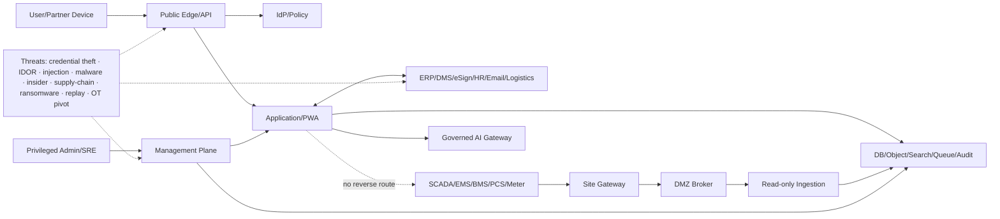
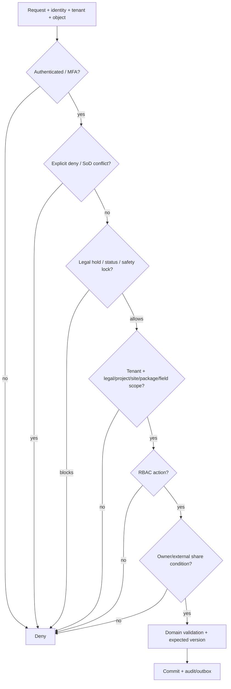

# Security and Permissions — Nền tảng Solar & BESS

> **Purpose:** Định nghĩa threat model, authentication, authorization, tenant/data isolation, SoD, cryptography, file/API/integration/OT security, privacy, incident response và permission matrix bằng đúng SEC-101…SEC-132.
> **Scope:** PM Web, PWA, O&M monitoring, integrations, AI và read-only OT ingress; không thiết kế hoặc cho phép điều khiển BESS/OT.
> **Source:** [SRS](./04-SRS.md), [Architecture](./06-solution-architecture.md), [Data Model](./07-data-model.md), [API Specification](./08-api-specification.md), [OpenAPI](./openapi/openapi.yaml), baseline Source Feature IDs SEC-001…SEC-008.
> **Version:** 1.0
> **Status:** Draft toàn platform; US-001/core US-003 controls Implemented; US-004 permission/SoD guards và policy-v3 migration Implemented/tested local; TEST-014…017 security acceptance Partial và EC2 deployment Pending
> **Owner:** Product Security / IAM / OT Security (cá nhân: TBD)
> **Updated:** 2026-07-18
> **Approval:** Product Owner delegated approval cho US-003 và US-004 local implementation/pre-push gate; full security acceptance và EC2 deployment chưa được phê duyệt như Pass

## 1. Security objectives và non-negotiable invariants

- Deny-by-default and least privilege; authorization server-side at every UI/API/search/export/job/object/event entry.
- Zero cross-tenant/legal entity/project/package/document/field leakage.
- PM cannot approve its own proposed cost/payment/award/change; Risk/Issue creator, owner hoặc closure requester không được tự quyết định closure; delegation does not erase SoD.
- Issued/signed/paid/test/audit/safety records cannot be overwritten.
- Unsafe/unknown files never preview/index/download/share.
- PM/O&M has no API, route, message, credential or AI action to start/stop/setpoint/reset/bypass/clear source alarm.
- AI is advisory and human-reviewed; cannot approve/sign/pay/close safety/control.
- Security targets/evidence not supplied remain TBD; no claim of compliance from design alone.

## 2. Threat model

### 2.1 Assets, threats and controls

| Asset/flow | Principal threats | Primary controls |
|---|---|---|
| Tenant/project/contract/payment | IDOR, broken authorization, insider, mass export | SEC-105…114, SEC-118/119 |
| Identity/session/privileged access | phishing, token theft/replay, privilege escalation | SEC-101…104, SEC-117 |
| Document/file/signature | malware, object bypass, hash/callback tamper, external leak | SEC-112/113, SEC-120/121/126 |
| API/browser/PWA | injection, XSS/CSRF/CORS, abuse, offline loss | SEC-122…124 |
| Connector/webhook | credential theft, replay, schema/SoR corruption, SSRF/egress | SEC-117, SEC-125/126 |
| OT gateway/telemetry | IT→OT pivot, spoof/replay, stale/quality misuse, hidden control path | SEC-127/128 |
| Backup/audit/operations | ransomware, backup deletion/key loss, log tamper, delayed response | SEC-116/118/129/131 |
| AI/corpus | data leakage, prompt injection, hallucination, unsafe action | SEC-107/114/118/130 plus AI policy |
| Software supply chain | vulnerable dependency, unsigned build, secret leak | SEC-117/124/132 |

Threat model must be updated when a trust boundary, connector, external portal, deployment profile, AI provider or OT topology changes.

## 3. Authorization decision order

Policy returns allow/deny plus constraints/redaction, not just boolean. Denial responses avoid object enumeration. Search/cache/export/job/download re-evaluate current policy.

## 4. Security requirements

Each requirement is canonical here. Source SEC-001…008 denotes baseline Source Feature ID, not formal requirement.

### SEC-101 — Federated identity và stable subject

- **Source:** IAM-001, IAM-002; Source SEC-004.
- **Trace:** BR-033, BR-040; FR-146.
- **Control requirement:** SSO/federation map issuer+subject sang UserAccount; không dùng email/display name làm identity; disabled subject bị deny.
- **Enforcement:** Identity gateway + tenant mapping; account link/unlink privileged và audited.
- **Verification evidence:** Positive/negative issuer, subject collision, disabled/deprovision và account-link tests. TEST mapping: TBD forward reference to [13-test-strategy.md](./13-test-strategy.md).
- **Owner/status:** Security control owner TBD; Draft; exceptions require expiry, compensating control, approver and audit.

### SEC-102 — MFA và step-up authentication

- **Source:** IAM-003; Source SEC-004.
- **Trace:** BR-033, BR-040; FR-147.
- **Control requirement:** MFA theo tenant/risk; step-up cho privileged admin, approval/sign/payment/export và safety authority theo policy.
- **Enforcement:** IdP claim/acr-age check trước action; no client-side trust.
- **Verification evidence:** Missing/expired MFA, replay, downgraded factor và recovery flow tests. TEST mapping: TBD forward reference to [13-test-strategy.md](./13-test-strategy.md).
- **Owner/status:** Security control owner TBD; Draft; exceptions require expiry, compensating control, approver and audit.

### SEC-103 — Session và token lifecycle

- **Source:** IAM-004; Source SEC-004.
- **Trace:** BR-033, BR-040; FR-146…149.
- **Control requirement:** Session bounded idle/absolute lifetime; revoke/logout/deprovision; token audience/issuer/nonce/time validated.
- **Enforcement:** Gateway/session service; refresh rotation; secure cookie/token storage per client.
- **Verification evidence:** Stolen/replayed/expired/revoked token, concurrent session và clock-skew tests. TEST mapping: TBD forward reference to [13-test-strategy.md](./13-test-strategy.md).
- **Owner/status:** Security control owner TBD; Draft; exceptions require expiry, compensating control, approver and audit.

#### Auth profile được phê duyệt cho base/test MVP

- Local identity dùng `tenantCode + normalized email + password`; lỗi tenant/account/password trả cùng một thông báo và không tiết lộ account existence.
- Password hash bằng Argon2id có salt; không mã hóa giải ngược, không có password mặc định trong source, image, log hoặc audit. Bootstrap password/email phải là encrypted environment envelope và chỉ được giải mã trong process chạy command có chủ đích.
- Access/refresh JWT secret và DB credentials trong `.env` base/test dùng AES-256-GCM envelope `enc:v1`; loader từ chối plaintext/sai key/sai tag. `CIPHER_KEY` là bootstrap root-of-trust và phải chuyển khỏi `.env` sang managed secret trước production.
- Access JWT có lifetime cấu hình qua env (base/test 15 phút) và gửi qua `Authorization: Bearer`; refresh JWT có lifetime tuyệt đối cấu hình qua env (base/test 7 ngày), lưu trong cookie `HttpOnly`, `SameSite=Lax`, path `/v1/auth`, bật `Secure` khi có HTTPS.
- Refresh token có `jti` và family; mỗi lần refresh rotate token, thu hồi session trước và replay token cũ làm thu hồi family. Logout idempotent, thu hồi session hiện tại và xóa cookie.
- Login rate limit lấy max-attempt/window từ env có range validation (base/test 5 lần/60 giây) theo cặp IP hash + normalized identity; không hard-lock account trong base để tránh denial-of-service. In-memory limiter chỉ áp dụng một API replica; Redis distributed limiter là TBD khi scale-out.
- Profile này được Product Owner phê duyệt ngày 2026-07-11 cho EC2 test. OIDC SSO/MFA/step-up vẫn bắt buộc phải thiết kế và phê duyệt trước production thật hoặc privileged workflow.

### SEC-104 — Privileged access và break-glass

- **Source:** IAM-005; Source SEC-004, SEC-008.
- **Trace:** BR-033, BR-040; FR-148, FR-154.
- **Control requirement:** Admin privilege least-privilege, just-in-time/time-bound, approved and reviewed; break-glass has reason, alert, immutable audit and post-review.
- **Enforcement:** Separate admin roles/accounts; no default business-data read.
- **Verification evidence:** Privilege escalation, expiry, emergency use, review and admin data-access negative tests. TEST mapping: TBD forward reference to [13-test-strategy.md](./13-test-strategy.md).
- **Owner/status:** Security control owner TBD; Draft; exceptions require expiry, compensating control, approver and audit.

### SEC-105 — Tenant isolation end-to-end

- **Source:** Source SEC-004.
- **Trace:** BR-001, BR-022, BR-033, BR-040; FR-098…105; NFR-001, NFR-020.
- **Control requirement:** tenantId enforced in API, FK/logical ref, object, search, cache, event, job, audit and backup manifest; dedicated profile does not replace auth.
- **Enforcement:** Server-resolved tenant; deny mismatch/unknown; tenant-scoped keys/partitions/policies.
- **Verification evidence:** Cross-tenant IDOR, list/search/export/job/cache/object/restore negative matrix: zero leakage. TEST mapping: TBD forward reference to [13-test-strategy.md](./13-test-strategy.md).
- **Owner/status:** Security control owner TBD; Draft; exceptions require expiry, compensating control, approver and audit.

### SEC-106 — RBAC action permission

- **Source:** IAM-006; Source SEC-004.
- **Trace:** BR-022, BR-033; FR-098…105/147…149.
- **Control requirement:** Role grants base action only; deny-by-default; roles versioned/effective; admin and business roles separated.
- **Enforcement:** Central policy decision and enforcement at every entry/worker.
- **Verification evidence:** Role allow/deny, stale assignment, module/action and privilege-review tests. TEST mapping: TBD forward reference to [13-test-strategy.md](./13-test-strategy.md).
- **Owner/status:** Security control owner TBD; Draft; exceptions require expiry, compensating control, approver and audit.

### SEC-107 — ABAC và data scope

- **Source:** IAM-007; Source SEC-004.
- **Trace:** BR-001, BR-022, BR-033; FR-098…105/147…153.
- **Control requirement:** Scope by company, LegalEntity, portfolio, project, site, package, department, document type/classification/status, field, relationship and effective time. Risk/Issue/Change project-level (`packageId = NULL`) không được suy ra từ package assignment; source-derived Issue/Change/Action không được rộng hơn package scope của source.
- **Enforcement:** Policy input normalized; row/field/file/search/export/job same evaluator.
- **Verification evidence:** Cross-company/legal/project/package/record/field and permission-propagation tests. TEST mapping: TBD forward reference to [13-test-strategy.md](./13-test-strategy.md).
- **Owner/status:** Security control owner TBD; Draft; exceptions require expiry, compensating control, approver and audit.

### SEC-108 — Segregation of duties và conflict of interest

- **Source:** IAM-008; Source SEC-004.
- **Trace:** BR-015, BR-022, BR-033, BR-034; FR-098…105/139…153.
- **Control requirement:** Requester/creator/owner/beneficiary/effective actor/company relationship evaluated; PM cannot approve own proposal. Change requester/submitter cannot decide that Change; Risk/Issue creator, current owner hoặc closure requester cannot decide closure; conflict routes independent approver and multiple roles/delegation cannot collapse actor identity.
- **Enforcement:** SoD check before submit/decision and domain final command; no delegation bypass.
- **Verification evidence:** Self-approval, delegated self-approval, related-company, quorum and no-independent-approver tests. TEST mapping: TBD forward reference to [13-test-strategy.md](./13-test-strategy.md).
- **Owner/status:** Security control owner TBD; Draft; exceptions require expiry, compensating control, approver and audit.

### SEC-109 — Legal hold, status lock và immutable action

- **Source:** IAM-009; Source SEC-003, SEC-004.
- **Trace:** BR-011, BR-022, BR-035; FR-029/036…044/098…105.
- **Control requirement:** legal hold/status/issued/signed/paid/test-result/safety lock overrides role/owner; correction creates new record. Approved Change source/impact/decision/approval snapshot/hash, Risk/Issue closure decision/evidence và baseline provenance không được sửa/xóa tại chỗ.
- **Enforcement:** Domain invariant and policy; explicit unlock authority/workflow where allowed.
- **Verification evidence:** Edit/delete/download/purge attempts across locked states; correction/revision evidence tests. TEST mapping: TBD forward reference to [13-test-strategy.md](./13-test-strategy.md).
- **Owner/status:** Security control owner TBD; Draft; exceptions require expiry, compensating control, approver and audit.

### SEC-110 — Delegation bounded theo thời gian/phạm vi

- **Source:** IAM-010; Source SEC-004.
- **Trace:** BR-033, BR-034; FR-141, FR-150.
- **Control requirement:** Delegation cannot exceed original permission/value/data scope, cannot chain; records delegator and effective actor; expires/revokes automatically.
- **Enforcement:** Policy resolves original+delegated intersection and SoD.
- **Verification evidence:** Over-scope, chain, overlap, expiry/revoke, original-right loss and audit tests. TEST mapping: TBD forward reference to [13-test-strategy.md](./13-test-strategy.md).
- **Owner/status:** Security control owner TBD; Draft; exceptions require expiry, compensating control, approver and audit.

### SEC-111 — Project, site và package authorization

- **Source:** Source SEC-004.
- **Trace:** BR-001, BR-022, BR-031, BR-033; FR-010…025/098…105.
- **Control requirement:** Every project-scoped object inherits/declares project and optional site/package scope; reference cannot cross project. Risk/Issue/Change/Action package scope phải giống source/parent; package principal không thấy/tạo/sửa project-level/null hoặc package khác.
- **Enforcement:** Server validation on create/link/query/event/worker.
- **Verification evidence:** Cross-project package/WBS/site/object link and bulk-action tests. TEST mapping: TBD forward reference to [13-test-strategy.md](./13-test-strategy.md).
- **Owner/status:** Security control owner TBD; Draft; exceptions require expiry, compensating control, approver and audit.

### SEC-112 — Document, revision và folder authorization

- **Source:** Source SEC-002, SEC-004.
- **Trace:** BR-035, BR-040; FR-026…035.
- **Control requirement:** ACL/classification/status applies to metadata, object, preview, OCR, search snippet, transmittal, download and signature; issued/signed lock.
- **Enforcement:** DMS metadata policy + object short-lived access; re-authorize at open/download.
- **Verification evidence:** Search-to-object, expired token, ACL change, issued/signed and folder inheritance tests. TEST mapping: TBD forward reference to [13-test-strategy.md](./13-test-strategy.md).
- **Owner/status:** Security control owner TBD; Draft; exceptions require expiry, compensating control, approver and audit.

### SEC-113 — External sharing và portal isolation

- **Source:** Source SEC-004.
- **Trace:** BR-035, BR-040; FR-033.
- **Control requirement:** Share is explicit recipient/purpose/expiry/download/watermark scope; revocable; no tenant discovery or link forwarding access.
- **Enforcement:** Opaque token bound to recipient/session where policy; download re-check; audit.
- **Verification evidence:** Expired/revoked/forwarded link, recipient mismatch, brute force, watermark/export tests. TEST mapping: TBD forward reference to [13-test-strategy.md](./13-test-strategy.md).
- **Owner/status:** Security control owner TBD; Draft; exceptions require expiry, compensating control, approver and audit.

### SEC-114 — Field-level restricted data

- **Source:** Source SEC-004.
- **Trace:** BR-011, BR-015, BR-022, BR-033; FR-036…060/087/098…105.
- **Control requirement:** HSE personal facts, legal privilege, Claim/negotiation/quantum, bid, bank/payment, security config and sensitive telemetry fields require need-to-know and masking/export control. DB-068 dependency không được làm lộ placeholder count/value cho principal chỉ có Risk/Issue quyền.
- **Enforcement:** Field policy at query/serialization/search/report/log; encryption/tokenization where approved.
- **Verification evidence:** Role-by-field, filter/sort inference, export, log redaction and support-access tests. TEST mapping: TBD forward reference to [13-test-strategy.md](./13-test-strategy.md).
- **Owner/status:** Security control owner TBD; Draft; exceptions require expiry, compensating control, approver and audit.

### SEC-115 — Encryption in transit

- **Source:** Source SEC-001.
- **Trace:** BR-037, BR-040; NFR-024.
- **Control requirement:** Approved TLS for user/API/service; mTLS for gateway/sensitive connector where required; insecure downgrade/cipher prohibited.
- **Enforcement:** Edge/service mesh/gateway configuration; certificate validation/rotation.
- **Verification evidence:** TLS configuration scan, expiry/revoke, hostname/chain, downgrade and internal-hop evidence. TEST mapping: TBD forward reference to [13-test-strategy.md](./13-test-strategy.md).
- **Owner/status:** Security control owner TBD; Draft; exceptions require expiry, compensating control, approver and audit.

### SEC-116 — Encryption at rest và key management

- **Source:** Source SEC-001.
- **Trace:** BR-040; NFR-008…011.
- **Control requirement:** DB/object/backup/audit/time-series encrypted; keys separated by environment/tenant tier; rotation/revoke/recovery and access audit.
- **Enforcement:** Managed KMS/HSM-class facility TBD; envelope/key policy; no key in data store.
- **Verification evidence:** Config evidence, key access/rotation/revoke/recovery/restore tests. TEST mapping: TBD forward reference to [13-test-strategy.md](./13-test-strategy.md).
- **Owner/status:** Security control owner TBD; Draft; exceptions require expiry, compensating control, approver and audit.

### SEC-117 — Secret management và service identities

- **Source:** Source SEC-001, SEC-005.
- **Trace:** BR-037, BR-040; FR-156…170.
- **Control requirement:** Secrets never in source, image, config file, domain DB, URL or log; each service/connector has least-privilege identity and rotation.
- **Enforcement:** Secret manager/reference injection; short-lived credentials where possible.
- **Verification evidence:** Repository/image/log scan, rotation, revoked secret, wrong audience and lateral-movement tests. TEST mapping: TBD forward reference to [13-test-strategy.md](./13-test-strategy.md).
- **Owner/status:** Security control owner TBD; Draft; exceptions require expiry, compensating control, approver and audit.

### SEC-118 — Immutable audit và security monitoring

- **Source:** Source SEC-003.
- **Trace:** BR-011, BR-022, BR-033…040; FR-098…105/143/154; NFR-022.
- **Control requirement:** Critical action/denial/admin/share/export/payment/sign/safety and Risk/Issue/Change create/update/submit/decision/closure/rebaseline records actor/effective actor, object/version, result, IP/device, correlation; tamper-evident and alert on gap.
- **Enforcement:** Append-only isolated sink; SIEM forwarding; restricted read/export.
- **Verification evidence:** Critical-event completeness, tamper/gap/pipeline failure, clock/correlation and auditor-scope tests. TEST mapping: TBD forward reference to [13-test-strategy.md](./13-test-strategy.md).
- **Owner/status:** Security control owner TBD; Draft; exceptions require expiry, compensating control, approver and audit.

### SEC-119 — DLP, download và export control

- **Source:** Source SEC-004.
- **Trace:** BR-035, BR-036, BR-040; FR-171…177.
- **Control requirement:** Classification-aware export/download; watermark, expiry, approval/step-up and current-permission check; bulk extract bounded/audited.
- **Enforcement:** Report/object delivery gateway + DLP policy; no sensitive payload in notification.
- **Verification evidence:** Large export, permission revoked before download, mixed classification, exfiltration pattern tests. TEST mapping: TBD forward reference to [13-test-strategy.md](./13-test-strategy.md).
- **Owner/status:** Security control owner TBD; Draft; exceptions require expiry, compensating control, approver and audit.

### SEC-120 — Secure file/object lifecycle

- **Source:** Source SEC-002.
- **Trace:** BR-035, BR-040; FR-027, FR-033.
- **Control requirement:** Upload to quarantine; scoped chunk/session; content hash/MIME/size; immutable version; object locator not predictable/public.
- **Enforcement:** Quarantine bucket/zone, short-lived access, Safe status gate, object versioning.
- **Verification evidence:** Partial/duplicate/chunk tamper/hash mismatch/direct-object access/restore tests. TEST mapping: TBD forward reference to [13-test-strategy.md](./13-test-strategy.md).
- **Owner/status:** Security control owner TBD; Draft; exceptions require expiry, compensating control, approver and audit.

### SEC-121 — Malware và active-content gate

- **Source:** Source SEC-002.
- **Trace:** BR-035, BR-040; NFR-019.
- **Control requirement:** Clean/infected/unknown/timeout statuses; fail closed; preview/OCR/index/download/share only Safe; active content sanitized/blocked per policy.
- **Enforcement:** Scanner pipeline/version/signature; quarantine/manual review; alert.
- **Verification evidence:** Known malware, archive bomb, polyglot, macro, timeout, encrypted archive and false-positive workflow tests. TEST mapping: TBD forward reference to [13-test-strategy.md](./13-test-strategy.md).
- **Owner/status:** Security control owner TBD; Draft; exceptions require expiry, compensating control, approver and audit.

### SEC-122 — API security, validation và abuse control

- **Source:** Source SEC-002.
- **Trace:** BR-039, BR-040; NFR-002, NFR-024.
- **Control requirement:** Schema/type/size/allowlist validation; rate/complexity limit; anti-injection/SSRF/mass assignment; safe errors; opaque IDs and anti-enumeration.
- **Enforcement:** API gateway + application validation; server-side authorization; egress allowlist.
- **Verification evidence:** OWASP API authorization/auth/resource/flow, injection, fuzz, rate, error leakage and IDOR tests. TEST mapping: TBD forward reference to [13-test-strategy.md](./13-test-strategy.md).
- **Owner/status:** Security control owner TBD; Draft; exceptions require expiry, compensating control, approver and audit.

### SEC-123 — Browser, PWA và offline security

- **Source:** Source SEC-002, SEC-005.
- **Trace:** BR-019, BR-039, BR-040; NFR-017, NFR-018.
- **Control requirement:** CSRF/CORS/CSP/cookie/token rules; XSS protection; encrypted bounded offline cache/queue; remote revoke; no offline approve/sign/pay.
- **Enforcement:** Web headers, origin allowlist, secure storage policy, idempotent sync/conflict UI.
- **Verification evidence:** XSS/CSRF/CORS, lost device, cache extraction, revoke/reconnect, duplicate/conflict tests. TEST mapping: TBD forward reference to [13-test-strategy.md](./13-test-strategy.md).
- **Owner/status:** Security control owner TBD; Draft; exceptions require expiry, compensating control, approver and audit.

### SEC-124 — Secure SDLC và vulnerability governance

- **Source:** Source SEC-005.
- **Trace:** BR-040; NFR-023.
- **Control requirement:** Threat modeling, review, SAST/DAST/SCA, SBOM, signed/provenance build, dependency/container/IaC scan, patch SLA and environment separation.
- **Enforcement:** CI/CD gates defined in DevOps; exceptions time-bound/approved.
- **Verification evidence:** Pipeline evidence; no critical/high beyond approved SLA; provenance/rollback/branch protection review. TEST mapping: TBD forward reference to [13-test-strategy.md](./13-test-strategy.md).
- **Owner/status:** Security control owner TBD; Draft; exceptions require expiry, compensating control, approver and audit.

### SEC-125 — Connector và integration security

- **Source:** Source SEC-001, SEC-002, SEC-004.
- **Trace:** BR-037, BR-040; FR-156…177.
- **Control requirement:** Per connector identity/scope, SoR/direction/schema, egress allowlist, idempotency/replay, retry/DLQ/reconciliation, kill switch and payload classification.
- **Enforcement:** Integration gateway/anti-corruption adapter; credential isolation; raw payload protected.
- **Verification evidence:** Wrong tenant/system mapping, schema drift, replay, partial batch, privilege, egress and reconciliation tests. TEST mapping: TBD forward reference to [13-test-strategy.md](./13-test-strategy.md).
- **Owner/status:** Security control owner TBD; Draft; exceptions require expiry, compensating control, approver and audit.

### SEC-126 — Webhook và callback authenticity

- **Source:** Source SEC-001, SEC-002.
- **Trace:** BR-035, BR-037; API-126.
- **Control requirement:** Signed timestamp/event/body, replay window, key version/rotation; callbacks idempotent; signer/provider/object/hash verified.
- **Enforcement:** Signature verifier before domain processing; nonce/event registry; provider allowlist.
- **Verification evidence:** Forged/expired/replayed/duplicate callback, key rotation, body tamper and provider outage tests. TEST mapping: TBD forward reference to [13-test-strategy.md](./13-test-strategy.md).
- **Owner/status:** Security control owner TBD; Draft; exceptions require expiry, compensating control, approver and audit.

### SEC-127 — IT/OT zone và gateway separation

- **Source:** Source SEC-007.
- **Trace:** BR-037, BR-040; FR-165…170.
- **Control requirement:** Zone/conduit based on risk assessment; site gateway/historian in OT boundary, DMZ broker, outbound-initiated mTLS, allowlist ports/tags; no Internet route to controller.
- **Enforcement:** Firewall/network/certificate/config review; separate identities/monitoring; site evidence.
- **Verification evidence:** Network data-flow/rule review, route scan, certificate/replay, blocked reverse connection tests. TEST mapping: TBD forward reference to [13-test-strategy.md](./13-test-strategy.md).
- **Owner/status:** Security control owner TBD; Draft; exceptions require expiry, compensating control, approver and audit.

### SEC-128 — OT data access và no-control invariant

- **Source:** Source SEC-007.
- **Trace:** BR-027, BR-028, BR-040; FR-118, FR-125…137, FR-165…170.
- **Control requirement:** PM/O&M can read authorized telemetry/AlarmEvent and acknowledge local case only; no start/stop/setpoint/reset/bypass/clear-source-alarm/API/message/credential.
- **Enforcement:** API/schema/UI/AI/connector deny; read-only service identity; source/quality/time retained.
- **Verification evidence:** OpenAPI/path/schema/code/config/network search and attempted control negative tests; zero command path. TEST mapping: TBD forward reference to [13-test-strategy.md](./13-test-strategy.md).
- **Owner/status:** Security control owner TBD; Draft; exceptions require expiry, compensating control, approver and audit.

### SEC-129 — Backup, restore và DR security

- **Source:** Source SEC-006.
- **Trace:** BR-040; NFR-008…010.
- **Control requirement:** Encrypted immutable/cross-account or isolated backup; role/account separation; key recovery; manifest/ACL/hash; restore/DR authorized and audited.
- **Enforcement:** Backup vault/policy and recovery environment; break-glass; malware/ransomware consideration.
- **Verification evidence:** Backup inventory, failed-job alert, unauthorized delete, key loss, timed restore/DR and ACL leakage tests. TEST mapping: TBD forward reference to [13-test-strategy.md](./13-test-strategy.md).
- **Owner/status:** Security control owner TBD; Draft; exceptions require expiry, compensating control, approver and audit.

### SEC-130 — Privacy, classification, retention và legal hold

- **Source:** Source SEC-004.
- **Trace:** BR-011, BR-035, BR-040; NFR-011.
- **Control requirement:** Purpose minimization, classification, consent/legal basis as applicable, subject/request workflow, retention/effective policy, legal hold and secure disposal.
- **Enforcement:** Data catalog/policy engine; field masking; audit; jurisdiction/project review.
- **Verification evidence:** Collection minimization, access/delete correction exceptions, hold/purge, residency and DPIA evidence. TEST mapping: TBD forward reference to [13-test-strategy.md](./13-test-strategy.md).
- **Owner/status:** Security control owner TBD; Draft; exceptions require expiry, compensating control, approver and audit.

### SEC-131 — Security incident response và business continuity

- **Source:** Source SEC-008.
- **Trace:** BR-040; NFR-006, NFR-010, NFR-021.
- **Control requirement:** Classification/on-call/playbooks for leakage, ransomware, identity, connector, OT telemetry and AI; communication, forensic preservation, containment/recovery/postmortem.
- **Enforcement:** SOC/SRE/business/Legal/OT RACI; kill switches; immutable evidence.
- **Verification evidence:** Tabletop cadence baseline 6 months and annual exercise are proposals; measure MTTA/MTTR and close actions. TEST mapping: TBD forward reference to [13-test-strategy.md](./13-test-strategy.md).
- **Owner/status:** Security control owner TBD; Draft; exceptions require expiry, compensating control, approver and audit.

### SEC-132 — Security verification và release gate

- **Source:** Source SEC-002, SEC-005, SEC-007, SEC-008.
- **Trace:** BR-040; all SEC/NFR.
- **Control requirement:** Threat model reviewed; security/permission/tenant/file/API/backup/OT tests mapped; pentest and vulnerability exceptions approved; non-waivable controls block release.
- **Enforcement:** Security sign-off with evidence links; no self-attestation from config only.
- **Verification evidence:** Release gate: zero tenant leak/control path; no critical/high beyond policy; restore and incident evidence; TEST IDs forward. TEST mapping: TBD forward reference to [13-test-strategy.md](./13-test-strategy.md).
- **Owner/status:** Security control owner TBD; Draft; exceptions require expiry, compensating control, approver and audit.

## 5. Role × Module × Action × Data Scope

Role names are personas, not permission bundles. Effective access is intersection of role, attributes, SoD/status/hold and assignment scope.

US-001 triển khai catalog mã ổn định, có thể mở rộng: `PMO` có `portfolio/project/site/projectParty` create/read/update/archive trong scope được gán; `PROJECT_MANAGER` có project/site/projectParty read/update trong project được gán; `EXECUTIVE` có portfolio/project read trong scope được gán; `TENANT_ADMIN` có organization/role-assignment administration nhưng không mặc nhiên có project read. Bootstrap test user được gán đồng thời `PMO` và `TENANT_ADMIN`. Mọi action không có grant hiệu lực bị từ chối.

US-003 bổ sung scope `PACKAGE` vào DB-007 và permission primitives: `package.read/create`, `schedule.read/manage/import`, `baseline.submit/approve`, `progress.record/correct`. `PROJECT_CONTROLS` được manage/import/submit trong project/package được gán; `PACKAGE_OWNER` chỉ đọc schedule và record progress cho package/activity được giao; `PROJECT_MANAGER`/`PMO` có thể approve theo assignment nhưng creator/submitter không được approve chính baseline của mình. Delegation hoặc nhiều role không bypass SoD. Project `ARCHIVED|CLOSED|CANCELLED` chặn schedule mutation. Permission guard chỉ là coarse gate; service phải re-check tenant/project/package/owner/state/version/SoD trong transaction.

### 5.1 US-004 Risk/Issue/Change permission contract cho EC2 V1

Permission primitives là `riskChange.read`, `riskChange.create`, `riskChange.manage`, `riskChange.submit`, `riskChange.approve`, `riskChange.requestClosure`, `riskChange.close` và `riskChange.closeCritical`. Tên role chỉ cấp primitive; mọi command/query vẫn áp `SEC-105…111/114/118` trong transaction.

| Primitive | Full-project assignment | Package-only assignment | Guard bổ sung |
|---|---|---|---|
| `riskChange.read` | Đọc record project-level và mọi package trong project theo field ACL | Chỉ record có `packageId` đúng assignment hiệu lực | `packageId = NULL`, package khác và known UUID ngoài scope trả generic denial/empty page, không lộ count/title |
| `riskChange.create` | Tạo project-level hoặc chọn package trong project | Chỉ tạo record với chính package được gán | Server resolve scope; không nhận tenant/project/package cross-reference từ client như authority |
| `riskChange.manage` | Cập nhật Risk/Issue/Action/Change editable trong project; direct `API-144` authoritative residual reassessment khi có full-project assignment | Chỉ record cùng package; Action và source-derived Issue/Change phải kế thừa package; không được authoritative residual reassessment | Không đổi package để nâng scope; không sửa approved/closed immutable fields. API-144 bắt reason/evidence/expected Risk version. API-149 routine/complete/verify/cancel là union đóng: VERIFY/CANCEL chỉ expectedVersion/status/evidence, CANCEL thêm reason; cấm owner/title/due/residual và mixed payload. Terminal actor độc lập với pre-command owner/completedBy, VERIFY chỉ dùng stored proposal; VERIFIED/CANCELLED bất biến |
| `riskChange.submit` | Submit Change sau complete impact và expected version | Denied | Package draft phải được full-project actor review/submit; project-level/null luôn đòi full-project assignment |
| `riskChange.approve` | APPROVE/RETURN/REJECT Change trong project | Denied | Decision actor khác requester/submitter; delegation/multiple roles không bypass; impact/approval snapshot/hash khóa sau APPROVE |
| `riskChange.requestClosure` | Request Risk/Issue closure trong project | Chỉ record cùng package | Evidence bắt buộc; requester identity được lưu, không tự đóng |
| `riskChange.close` | Approve/return/reject closure khi independent | Denied | Actor khác creator, current owner và closure requester; mọi action bắt buộc phải `VERIFIED` hoặc authorized `CANCELLED`, trạng thái khác chặn closure |
| `riskChange.closeCritical` | Quyền bổ sung bắt buộc khi Risk HIGH/CRITICAL hoặc Issue CRITICAL | Denied | Không thay `riskChange.close`, evidence/action/SoD/state checks |

`PROJECT_MANAGER`/`PMO` có full-project assignment mới có thể nhận submit/approve/close primitives theo fixed EC2 role policy; `PROJECT_CONTROLS`/`PACKAGE_OWNER` với package-only assignment chỉ có create/read/manage/requestClosure trong package được gán. Để phục vụ assignee picker, fixed roles `PMO`, `PROJECT_MANAGER`, `PROJECT_CONTROLS`, `PACKAGE_OWNER` được cấp primitive `user.read` tối thiểu và vẫn bị intersect bởi project/exact-package/capability; grant này không mở tenant directory hay user detail. `EXECUTIVE` chỉ có `riskChange.read`, không nhận `user.read` vì read-only screen không có picker; `TENANT_ADMIN` không mặc nhiên có business permission hoặc `user.read`. Production authority matrix, quorum, financial threshold và step-up vẫn là TBD, không được suy từ fixed EC2 grants.

`API-008` yêu cầu `user.read` và chỉ trả safe projection `{id, displayName}` của active assignee sau khi giao hiệu lực DB-006/007 được giao cắt với `projectId`, optional exact `packageId` và `requiredPermission`; nó không phải directory tenant-wide, không trả email/role/scope và không cấp quyền cho user được chọn. Test denial bắt buộc gồm thiếu `user.read`, tenant/project/package khác, inactive assignment và capability mismatch mà không lộ count/identity. API-143/146/151 chỉ trả safe summary; API-160/161/162 và API-163/164 re-authorize từng Risk/Issue/Change/Action detail theo tenant/project/exact-package và field ACL. Known UUID ngoài scope dùng cùng generic denial, không lộ title/count/evidence/hash.

Residual hiện hành thuộc `DB-065` Risk. Residual payload trên Action là proposal kèm `residualRiskVersion`, tức phiên bản Risk được chụp khi lập proposal; DONE không được sửa Risk/read model. Independent full-project VERIFY phải so version proposal với Risk hiện hành trong cùng transaction trước khi copy bốn input, recompute/tăng Risk version và ghi audit/outbox; mismatch trả conflict với zero business/audit/outbox write. `API-144` là đường authoritative riêng, bắt full-project assignment, reason, evidence và expected Risk version; package-only actor bị deny ngay cả khi sở hữu Action/Risk.

API-149 phải chọn đúng một command branch. Routine update không được giả terminal; COMPLETE (`DONE`) mới được lưu completion evidence và optional residual proposal. VERIFY/CANCEL không được đồng thời đổi owner/title/due hoặc gửi residual payload, nên SoD luôn so actor/effective actor với owner/completedBy của row pre-command. VERIFY chỉ promote proposal đã commit từ trước; request trộn branch hoặc cố “đổi owner rồi verify” trả validation denial với zero Action/Risk/audit/outbox write.

Rebaseline chỉ gọi public application port `APPROVED_CHANGE_READER.resolveForRebaseline` trong transaction Project Controls với `tenantId`, `projectId`, `changeRequestId`, `currentBaselineId`; Project Controls không import Risk/Change entity/repository. `API-036` mode REBASELINE là full-project-only; package assignment không bao giờ đủ. Client REBASELINE chỉ gửi approvedChangeRequestId/dataDate/expectedScheduleVersion, không được gửi reason/impact free-text. Port chỉ trả immutable changeReason, approvedAt/by, decisionVersion, sourceBaselineId, scheduleImpactSummary và impactSnapshotHash khi đúng scope/state/baseline và server-derived `scheduleImpactApproved`; reason/impact của DB-020 lấy từ port. Còn lại dùng `NOT_FOUND_OR_SCOPE_MISMATCH`, `NOT_APPROVED`, `BASELINE_MISMATCH` hoặc `SCHEDULE_IMPACT_NOT_APPROVED`, audit denial vào `DB-098` và tạo zero baseline side effect. Client full-project lấy lịch sử/current baseline qua `API-159` thuộc Project Controls với `schedule.read`; package-only actor bị deny vì DB-020 là project-level và không có package ownership để lọc an toàn. RiskChange không mở private baseline repository/query để né authorization boundary.

Projector `DB-105 notifications` chỉ nhận committed source thuộc `ScheduleActivity|Risk|Issue|RiskIssueAction|ChangeRequest`, validate tenant/project/nullable exact-package của source trước insert và resolve recipient theo quyền hiện hành. Schedule source bắt `activityId=sourceId`; non-schedule bắt `activityId=NULL`; schedule query luôn lọc `sourceType=ScheduleActivity`. Migration/down bảo toàn schedule row; chỉ derived non-schedule row có thể rebuild mới được xóa. Notification/owner assignment không bao giờ là access grant; deep-link vẫn re-authorize source.

DB-105 chỉ chấp nhận mapping `ScheduleActivity→OVERDUE|NEAR_CRITICAL`, `Risk→RISK_REVIEW_DUE`, `Issue→ISSUE_TARGET_DUE`, `RiskIssueAction→ACTION_OVERDUE`, `ChangeRequest→CHANGE_DECISION_PENDING`; browser/event không được chọn mapping, priority hoặc giả ngày/version. Priority được derive từ committed source: Schedule OVERDUE HIGH/NEAR_CRITICAL NORMAL; Risk HIGH khi effective band HIGH|CRITICAL, còn lại NORMAL; Issue HIGH khi severity HIGH|CRITICAL, còn lại NORMAL; Action overdue HIGH; Change pending NORMAL. `dueAt/dataDate/thresholdVersion` bắt buộc non-null và server derive: schedule từ canonical finish/schedule dataDate/schedule threshold; Risk/Issue/Action từ reviewDate/targetDate/dueDate, primary-Site business date và Risk/Change threshold; Change pending dùng business date của submittedAt cho cả dueAt/dataDate cùng Risk/Change threshold. Sai mapping/source/scope/priority/date/version bị reject trước insert.

`DB-113 RiskIssueClosureCycle` là closure evidence-history SoR: request insert sequence mới, decision chỉ complete undecided cycle một lần, completed cycle không update/delete. Risk/Issue scalar closure chỉ là latest projection; reopen/re-close append cycle mới. API-160/161 re-authorize parent/exact-package và evidence field ACL trên từng opaque-cursor page, stable `sequenceNo/id`, limit mặc định 50/tối đa 100; `nextCursor` không được mã hóa count/identity ẩn và client theo đến null để lấy hết authorized cycles. DB-098 không được dùng thay DB-113 hoặc để reconstruct evidence đã bị che. API-157 heatmap query trực tiếp toàn bộ authorized Risk filter, không aggregate page/cursor API-143; mỗi scoringVersion/thresholdVersion group trả 25 inherent + 25 residual cells và residual-missing count. RiskSummary phải mang scoringVersion; aggregate/count không được suy hoặc để suy hidden rows.

| Role/persona | Module | Allowed action examples | Explicitly denied/high-risk | Data scope |
|---|---|---|---|---|
| Executive/Steering | Portfolio/Reports | Read aggregate, drill-down, approve within authority | Raw restricted fields, admin, OT control | Assigned portfolio/legal entities/projects |
| PMO | Portfolio/Project/Workflow/Risk | Manage portfolio standards; read/manage/submit Risk/Issue/Change; decide only with explicit independent primitive | Self-approve own Change/closure; unrestricted tenant admin | Assigned portfolio/full projects; field ACL/SoD |
| Project Manager | Project/Risk/Contract/Cost | Manage project/Risk/Issue/action; submit Change; request closure | Approve own/submitted Change; close item mình tạo/sở hữu/yêu cầu đóng; edit locked record; OT control | Assigned full project/sites/packages subject to field ACL |
| Risk/Issue Owner | Risk/Issue/Action | Update assigned item/action/evidence/actual impact; đề xuất residual trên Action; request closure đúng source state | Decide own closure; authoritative residual khi chỉ có package scope; submit/approve Change unless separately full-project authorized | Exact assigned project/package record and current ownership; assignment không tự cấp read |
| Change/Closure Approver | Risk/Change | APPROVE/RETURN/REJECT Change/closure; verify/cancel Action khi có manage authority; critical close only with `closeCritical` | Creator/owner/requester/submitter self-decision; Action owner/completer tự verify/cancel; missing evidence/reason hoặc unsatisfied action; package-only decision | Full-project assignment + explicit primitive + effective authority |
| PROJECT_CONTROLS | Schedule/Progress/Report/Risk | Package read/create; schedule read/manage/import; baseline submit; progress record/correct; Risk/Issue/Action manage by exact scope | Approve own/submitted baseline/Change; close own item; overwrite history; package-to-project scope elevation | Assigned project/package/WBS/activity; Risk/Change follows exact assignment kind |
| PACKAGE_OWNER | Schedule/Progress/Risk | Read schedule; record progress; create/read/manage Risk/Issue/Action and request closure for assigned package | Project-level/null or other package record; Action verify/cancel; Change submit/approve; closure decision; dependency/calendar/baseline change | Assigned package/activity and effective company/owner relation |
| Document Controller | DMS/Transmittal | Code/revision/review/issue/share within workflow | Override malware/hold; view restricted docs without ACL | Assigned project/folder/document class |
| Legal/Contract Manager | Contract/Obligation/Claim | Draft/review/submit, privileged fields, obligation evidence | Sign beyond authority; payment approval by default | Assigned legal entity/project/contract and privilege |
| Authorized Signer | Contract/Document/COD | Sign exact approved artifact after step-up | Change artifact/party snapshot; delegate beyond authority | Exact envelope/artifact/value/effective authority |
| Finance/Cost Controller | Budget/Payment/Report | Budget/commitment/invoice/payment review and reconcile | Self-approve own request; cross-entity bank fields | Assigned legal entity/project/cost code/contract |
| Procurement | Supplier/RFQ/PO | Requisition/RFQ/evaluation/award/PO submit | View competitor bid outside evaluation; self-approve award | Project/package/category/evaluation team |
| Supplier/OEM | Portal/RFQ/Shipment/Warranty | Submit own bid/submittal/milestone/claim | Competitor bids, budget, internal evaluation | Own company + invited RFQ/PO/assets/cases |
| Engineering | Design/BOM/Solar/BESS | Release design via approval, assess substitution, read KPI | Procurement overwrite design; OT control | Discipline/project/package/assets |
| Site Manager/Contractor | Field/PWA | Daily log, quantity, workfront evidence | Sign/approve beyond role; cross-contractor records | Site/package/workfront/company |
| QA/QC | ITP/Inspection/NCR/Punch | Witness/result/disposition/verification per role | Contractor closes own NCR; bypass hold point | Project/package/system/equipment |
| HSE | PTW/Incident/Stop-work | Issue/suspend PTW, classify incident, stop/lift by authority | Conditional safety bypass; unnecessary PII access | Site/project plus need-to-know fields |
| Commissioning | Test/COD | Test pack/run/result/readiness/COD submit | Change failed to passed; waive non-waivable gate | Project/system/test/gate |
| Client/Witness | Review/Inspection/COD | Comment/witness/accept shared item | Internal budget/bids/restricted HSE/legal | Explicit share/project/package/item |
| O&M Dispatcher | AlarmCase/Incident/WO | Triage, local ack, dispatch/verify | Clear source alarm; change OT setpoint | Assigned site/assets/cases |
| Technician | WO/PWA/Asset | Work log/evidence/Complete | Self-Close critical WO; access unrelated telemetry | Assigned WO/site/asset and validity |
| Tenant Admin | Tenant config/user mapping | Approved tenant configuration and assignment requests | Default read business content; bypass SoD | Tenant admin objects only |
| Security/IAM Admin | Identity/Policy/Audit | Manage policy/role, investigate security event | Business approval; unrestricted content without mandate | Tenant/security scope, JIT privileged |
| Integration Service | Connector | Read/write exact contract fields; checkpoint/reconcile | Any object/field not in connector contract; OT command | Tenant/system/object/field allowlist |
| OT Gateway | Telemetry ingress | Send allowlisted tag/alarm payload | Read business API; receive commands | One tenant/site/gateway/tag allowlist |
| Auditor | Audit/Reports | Read evidence/export per mandate | Mutate domain/policy/audit | Mandate/time/object scope |
| AI Service | AI Gateway | Retrieve authorized corpus, generate proposal | Direct domain mutation/approval/sign/payment/control | User intersection + enabled use case/corpus |

US-003 core controls đã materialize và có unit/static evidence: service re-check tenant/project/package/owner, self-approval denial, immutable approved DB-020, append-only DB-021 và authorized export audit. PostgreSQL known-ID isolation, permission revoke trước notification drill-down và same-scope DB-067 positive rebaseline đã có exact isolated-port integration evidence; full story E2E/security matrix vẫn Partial nên không suy diễn thành full security acceptance.

US-004 controls trong mục 5.1 đã được materialize local: role/permission seeds và assignment-scoped `/me.scopes[].permissions`; API-008 chỉ trả `id/displayName` cho active assignee có capability/effective full-project hoặc exact-package scope; service re-check tenant/project/package/known ID; Change/closure/Action terminal SoD; authoritative residual version; DB trigger bảo vệ terminal/approved/cycle facts; worker re-check recipient và dedup projection. V1 `effectiveActor` vẫn là authenticated `userId`; production delegation/quorum không được suy ra. Forward migration `1783736000000` nâng existing seed role grants/policy v3 đã handoff và Pass trong migration 7/7 cùng exact-port full integration.

Focused evidence đã có cho package/tenant isolation, API-008 scope, mixed/no-op command, self-decision, stale residual zero-write, immutable first closure cycle, Risk CLOSED→MONITORING reopen có missing-evidence zero-write, second closure cycle với immutable sequence `[2,1]`, approved Change, full-project positive REBASELINE và DB-105 invalid mapping/revoked recipient. Backend focused HTTP suite 6/6 đã Pass post-fix cho closure branches vừa thay đổi. Các nhánh generic known-ID toàn API-160…164, API-149 ROUTINE/CANCEL matrix, package authoritative-residual denial, Issue closure/RETURN/REJECT/cursor masking, API-157 >page/filter matrix và Change RETURN/REJECT/race/cross-project vẫn Partial. Vì vậy không được đọc trạng thái local implementation như `TEST-014…017` security Pass; DB-068 Claim/Variation và legal privilege workflow vẫn là dependency Contract/Legal.

## 6. Document, file and external-share permission

Document access is evaluated separately for metadata, content, preview, OCR text, comment, review, issue, signature, share and download. ACL inheritance cannot widen child classification. External share stores recipient snapshot, purpose, expiry, watermark/download policy and revoke status. Search snippet is content access. Legal hold/status lock can allow read but deny mutation/purge.

## 7. SCADA/EMS/BMS access matrix

| Principal | Read selected telemetry/events | Configure cloud tag mapping | Local AlarmCase ack | OT command/control |
|---|---:|---:|---:|---:|
| PM/Executive | Allowed only derived/authorized | No | No or read-only | Never |
| O&M Dispatcher | Authorized site/assets | No | Yes, local only | Never |
| O&M Engineer | Authorized detail/quality | Request/change via governed config | Local case action | Never from platform |
| OT Data/Integration Admin | Ingestion health/raw refs per mandate | Yes with review | No by default | Never |
| Site Gateway service | Push allowlisted data | Reads its published config only | No | Receives no web command |
| AI Service | Only approved corpus/aggregates | No | No | Never |
| Security/Auditor | Evidence/metadata per mandate | Review only | No | Never |

Any future control capability is out of scope and requires approved safety case, independent architecture/security/authorization, physical fail-safe and change control; this document does not pre-authorize it.

## 8. OWASP-oriented control coverage

| Risk class | Controls |
|---|---|
| Broken access/IDOR | SEC-105…114, server-side policy, opaque IDs, negative matrix |
| Authentication/session failure | SEC-101…104 |
| Injection/XSS/SSRF | SEC-122/123, schema/encoding/CSP/egress allowlist |
| Cryptographic failure | SEC-115…117 |
| Misconfiguration | SEC-104/115/122/124/132, config scan and environment separation |
| Vulnerable components/supply chain | SEC-124/132, SBOM/provenance/patch gate |
| Logging/monitoring failure | SEC-118/131 |
| File/upload risk | SEC-120/121 |
| API consumption/connector trust | SEC-125/126 |
| Privacy/data leakage | SEC-114/119/130 |
| OT pivot/unsafe control | SEC-127/128 |

Exact OWASP ASVS/API Security verification level is TBD and must be chosen before production pentest.

## 9. Incident response

Incidents are classified by confidentiality, integrity, availability, tenant scope, financial/safety/OT impact. Playbooks cover credential compromise, cross-tenant leak, malicious file/ransomware, audit gap, connector corruption, OT telemetry spoof/gap, backup failure and AI data leak. RACI includes Security/SOC, SRE, Product, Legal/Privacy, Business Owner and OT Owner. Containment may revoke sessions/keys, disable connector/share/AI use case, isolate tenant/profile and preserve evidence; it never sends OT control.

## 10. Backup, privacy and data lifecycle security

Backup copy uses separate identity/account/role and keys; deletion/restore requires privileged workflow and audit. Restore validates tenant/ACL/hash and does not create duplicate payment/approval. Privacy requires minimization and purpose; retention/legal hold policy has effective date/owner. Legal applicability, data residency and subject-right workflows are TBD for Legal/Privacy; no fabricated statutory period.

## 11. Security test and release evidence

Required evidence: policy unit tests; role/scope matrix; cross-tenant/project/package/field tests; session/MFA/SoD/delegation; API fuzz/rate/IDOR; file/malware; SAST/DAST/SCA/SBOM/container/IaC; connector/webhook replay; audit tamper/gap; backup restore/DR; OT network/data-flow and no-control search; incident tabletop/pentest. Formal TEST IDs are owned by Test Strategy. Non-waivable proposed controls: tenant isolation, SoD for financial/award, malware fail-closed, signed/paid/test immutability, stop-work/hold gates and no-OT-command; PO/Security/HSE must confirm.

## 12. Assumptions

| Assumption | Owner | Impact |
|---|---|---|
| Enterprise federation supports stable subject/MFA claims | IAM/Security | SEC-101…103 |
| Shared multi-tenant is baseline; dedicated profiles optional | PO/Security | SEC-105/116 |
| Policy engine can apply row/field/object/job constraints | Architecture | SEC-106…114 |
| Managed key/secret/audit facilities available | Architecture/SRE | SEC-115…118 |
| OT ingress is outbound/read-only and site gateway supports identity | OT Owner | SEC-127/128 |
| Retention/residency/legal basis periods are not yet supplied | Legal/Privacy | SEC-130 |
| Security testing toolchain/pentest provider and SLA TBD | Security/DevOps | SEC-124/132 |
| Baseline exercise cadences are proposals, not commitments | Security/SRE/BCM | SEC-129/131 |
| US-004 EC2 V1 dùng fixed permission primitives và independent actor SoD; production authority/quorum/threshold không suy ra từ profile này | Product Owner delegated / Security | Cho phép build/test slice nhưng không phải production approval acceptance |
| Risk/Issue/Change project-level và package-scoped record dùng `packageId` nullable; package assignment không bao gồm record null | Product Owner delegated / Security | Ngăn package-to-project privilege elevation |

## 13. Open Questions

| Open Question | Owner | Blocks |
|---|---|---|
| IdP/protocol/token claims/MFA/step-up specifics cho production? Base/test local JWT profile đã được phê duyệt riêng. | IAM/Security | SSO/production auth; không chặn base MVP |
| Tenant boundary đã đóng cho US-001 là customer/group isolation boundary; dedicated data/key tier vẫn Open | PO/Legal/Security | Production isolation tier |
| **Closed for US-003:** PROJECT_CONTROLS/PACKAGE_OWNER actions, PACKAGE scope and baseline self/delegated SoD; other module approval limits/conflicts remain Open | Product Owner delegated / Process Owners/Internal Control | US-003 unblocked; later modules only |
| **Closed for US-004 local implementation/pre-push / acceptance Partial:** tám `riskChange.*` primitives, scoped `user.read`, exact package visibility, independent Change/closure/Action terminal decision, `closeCritical` gate và policy-v3 role reconciliation | Product Owner delegated / Security | Local gate complete; remaining negative matrix và EC2 deployment Pending |
| Production Risk/Change authority, quorum, financial thresholds, step-up và conflict relationships? | Process Owner/Legal/Finance/Security | Production approval; không chặn EC2 fixed-policy test |
| Claim/Variation privilege/party/package policy sau khi DB-068 và Contract/Legal materialize? | Legal/Contract/Security | FR-103/DB-068; không chặn direct AC-014…017 |
| Field classification/masking/export per domain? | Legal/Data Owners | ABAC/DLP |
| Key hierarchy/HSM/KMS, rotation/recovery and residency? | Security/Architecture | Cryptography |
| File limits/scanner/SLA/manual review/active-content policy? | DMS/Security | File security |
| Connector/webhook providers, signing and egress endpoints? | Integration/Security | External integration |
| OT topology/protocol/firewall/gateway/cert/tag allowlist per site? | OT Security | OT release |
| Backup/DR topology/RPO/RTO/immutability and exercise cadence? | SRE/BCM/Security | Production gate |
| Privacy law applicability, data subject workflow and retention periods? | Legal/Privacy | Production/compliance |
| Vulnerability severity SLA, pentest cadence and exception authority? | Security/Engineering | Release gate |
| Which controls are formally non-waivable? | PO/Security/HSE/Legal | Governance |

## 14. Changelog

| Version | Date | Author | Change | Scope impact |
|---|---|---|---|---|
| 0.1 | 2026-07-11 | Codex | Tạo threat model, permission matrix và SEC-101…SEC-132 | Không thay scope; no-OT-command và unknown policy giữ rõ |
| 0.2 | 2026-07-11 | Codex | Ghi Argon2 password hashing, AES-GCM encrypted env và configurable rate/JWT profile | Base/test only; KMS/key rotation/distributed limiter vẫn TBD |
| 0.3 | 2026-07-11 | Codex | Duyệt initial extensible role catalog và tenant boundary cho US-001 | Không duyệt ngầm approval/financial/SoD policy module sau |
| 0.4 | 2026-07-11 | Codex | Ghi PostgreSQL-backed effective assignment, deny-by-default guard, denial audit và cross-tenant evidence | US-001 Implemented; policy module sau vẫn Open |
| 0.5 | 2026-07-11 | Codex | Chốt PACKAGE scope, PROJECT_CONTROLS/PACKAGE_OWNER permissions, baseline SoD và immutable progress/baseline guards cho US-003 | Approved/Build-ready, not Implemented; TEST-010…013/security evidence chưa chạy |
| 0.6 | 2026-07-12 | Codex | Ghi PACKAGE ABAC, owner rule, independent baseline SoD, service-level denial audit và immutable guards đã materialize | Core Implemented/deployed; full integration/security pack chưa claim Pass |
| 0.7 | 2026-07-12 | Codex | Đồng bộ trạng thái evidence sau API-142 authorized CSV/audit và quality gate M3 | Core controls materialized; PostgreSQL/E2E/rebaseline security evidence vẫn pending |
| 0.8 | 2026-07-12 | Codex | Chốt US-004 permission primitives, nullable package scope, Change/closure SoD, verified-action/closeCritical gates và public approved-change reader boundary | Approved/Build-ready contract; chưa permission seed/runtime/security test Pass; DB-068 giữ dependency |
| 0.9 | 2026-07-18 | Codex | Đồng bộ final US-004 authorization: closed API-149 union/pre-state SoD, DB-113 immutable cycle ACL, DB-105 server-derived mapping/date/version, full-filter isolated API-157 heatmap, safe API-008 và immutable rebaseline | Không đổi baseline scope; permission seed/runtime/security evidence vẫn pending |
| 1.0 | 2026-07-18 | Codex | Ghi local permission seeds/scoped identity, API/service/DB/worker guards và completed policy-v3 forward migration 1783736000000 | Không đổi security scope; pre-push gate Pass, TEST-014…017 matrix Partial, deployment/production authority Pending |
