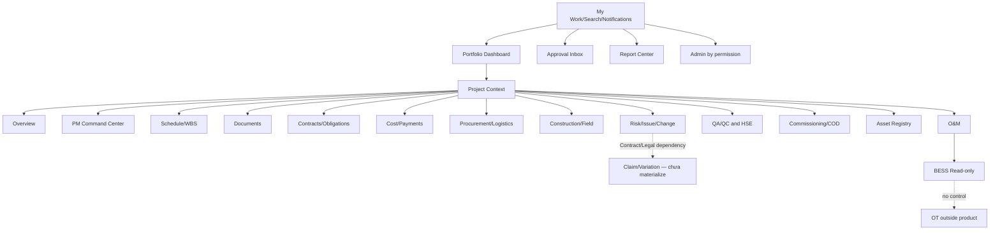
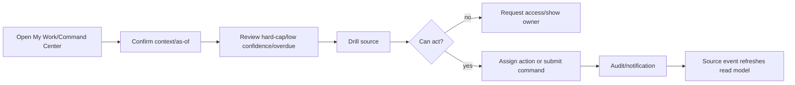
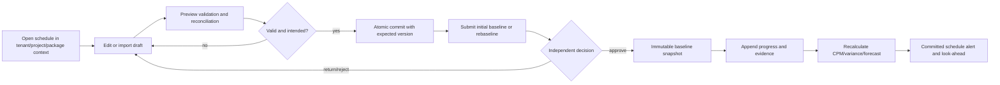
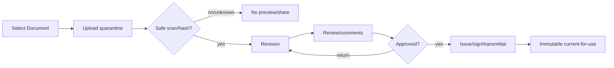
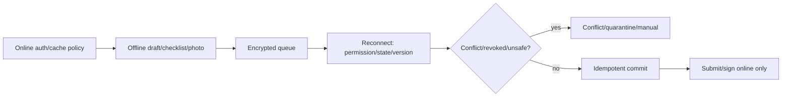
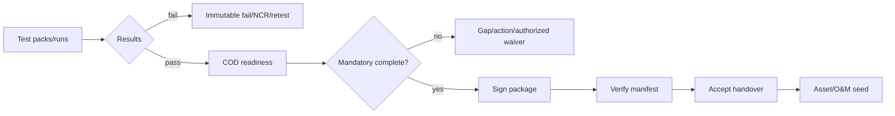
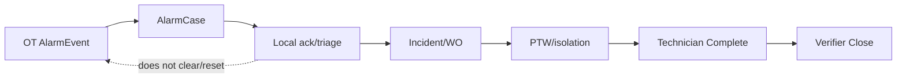
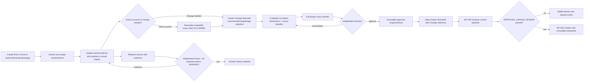

# UX Information Architecture — Nền tảng Solar & BESS

> **Purpose:** Định nghĩa sitemap, navigation, screen inventory, user flows, textual wireframes, responsive/accessibility/UI states và design-system requirements.
> **Scope:** PM Web/PWA, O&M monitoring và read-only BESS/OT views; không tạo control UI cho BESS.
> **Source:** [Vision & Scope](./01-product-vision-and-scope.md), [PRD](./03-PRD.md), [SRS](./04-SRS.md), [Security](./09-security-and-permissions.md), baseline Source Wireframes WF-01…WF-14.
> **Version:** 0.4
> **Status:** Draft toàn platform; core Project Schedule UX Implemented/deployed; US-004 Risk/Issue/Change UX Approved/Build-ready, chưa Implemented; accessibility/E2E acceptance pending
> **Owner:** Product Design / UX Research (cá nhân: TBD)
> **Updated:** 2026-07-12
> **Approval:** Project Schedule implementation và US-004 EC2 UX contract theo delegated Product Owner authority; US-004 implementation/formal UX/accessibility acceptance vẫn pending

## 1. UX principles

- Start from exception/action with owner/due; drill to evidence/source.
- Always show tenant/project/site/package, data-as-of/freshness, unit/currency/timezone and permission state.
- Score/color includes label, cause, confidence and source.
- Same concept/state across screens; Project phase differs record status.
- Progressive disclosure preserves expert tables/filters/export.
- Mobile/PWA prioritizes capture/checklist/queue; high-risk decisions retain evidence.
- Denial does not reveal record existence/value.
- O&M/BESS read-only is persistent and has no control affordance.

## 2. Sitemap

## 3. Navigation and context

Global tenant switch is permission-aware, confirms unsaved work and clears tenant cache. Project switch preserves module only when allowed. Breadcrumb is Portfolio → Project → Site/Package → Object. Search/recent items re-check access. Admin is visually separated with privileged-context expiry. O&M is separated from PM; BESS always displays READ-ONLY.

## 4. Screen inventory

| Screen | Source | Audience | Trace |
|---|---|---|---|
| [App shell và My Work](#screen-1) | Bổ sung | All users | BR-033/034/039; FR-138…155/175 |
| [Portfolio Dashboard](#screen-2) | WF-01 Source Wireframe | Executive/PMO | BR-001/032/036; FR-010…015 |
| [Project Overview](#screen-3) | WF-02 Source Wireframe | Project team/client share | BR-001/031; FR-011…025 |
| [PM Command Center](#screen-4) | WF-03 Source Wireframe | PM/PMO | BR-032/036; FR-012…015/019…025 |
| [Project Schedule](#screen-5) | WF-04 Source Wireframe | PM/Project Controls | BR-018/032; FR-016…021 |
| [Document Register](#screen-6) | WF-05 Source Wireframe | Project/Document Control | BR-035; FR-026…035 |
| [Contract Register](#screen-7) | Bổ sung | Contract/Legal/PM/Finance | BR-009…011/022; FR-036…044 |
| [Procurement Tracker](#screen-8) | WF-06 Source Wireframe | Procurement/PM/Engineering/Supplier | BR-015…017; FR-061…074 |
| [Cost Dashboard](#screen-9) | WF-07 Source Wireframe | Executive/PM/Finance | BR-007/015/030; FR-053…060 |
| [Construction Dashboard](#screen-10) | WF-08 Source Wireframe | Site/PM/Contractor/QA/HSE | BR-018…020; FR-075…090 |
| [Risk Register](#screen-11) | WF-09 Source Wireframe | PM/Risk Owner/Package team | BR-022/032; FR-098/099/104; US-004 |
| [Issue Register](#screen-12) | WF-10 Source Wireframe | Project/Package team | BR-022/032; FR-100/104; US-004 |
| [Commissioning Dashboard](#screen-13) | WF-11 Source Wireframe | Commissioning/Engineering/QA/OEM | BR-023…025; FR-106…111 |
| [COD Readiness](#screen-14) | WF-12 Source Wireframe | PM/Commissioning/Legal/O&M recipient | BR-023…026; FR-109…114 |
| [O&M Dashboard](#screen-15) | WF-13 Source Wireframe | O&M/Asset owner | BR-027…030; FR-115…124 |
| [BESS Monitoring Dashboard](#screen-16) | WF-14 Source Wireframe | BESS/O&M/Engineer | BR-024/028/040; FR-130…137/165…170 |
| [Approval Inbox](#screen-17) | Bổ sung | Requester/Approver/Process Owner | BR-034; FR-138…145 |
| [Report Center](#screen-18) | Bổ sung | Authorized users | BR-036; FR-171…177 |
| [Change Control](#screen-19) | Bổ sung từ RSK-004/005 | Requester/PM/Reviewers/Independent Approver | BR-018/022/031/032; FR-101/102/104; US-003/004 |

## 5. Textual wireframes

### 5.1 App shell và My Work

- **Source/audience:** Bổ sung; All users.
- **Layout/content:** Tenant/project switch, navigation by role, global search, tasks, notifications, delegated-context banner.
- **Primary actions:** Open/filter task; acknowledge notification; switch context with unsaved-work confirmation.
- **Integrity/permission/exception:** No hidden-data leakage; context switch clears cache; admin has privileged banner.
- **Responsive:** Desktop preserves dense tables/multi-pane; tablet collapses panes; mobile shows priority list and primary safe action. PWA offline only where explicitly allowed.
- **Trace:** BR-033/034/039; FR-138…155/175.

### 5.2 Portfolio Dashboard

- **Source/audience:** WF-01 Source Wireframe; Executive/PMO.
- **Layout/content:** Legal entity/portfolio/project/as-of filters; Health/COD/cash/risk cards; heat map/list; exceptions/trend/freshness.
- **Primary actions:** Drill project, save view, export snapshot, assign action.
- **Integrity/permission/exception:** Same filter/as-of; N/A/confidence visible; currency grouped; unauthorized count hidden.
- **Responsive:** Desktop preserves dense tables/multi-pane; tablet collapses panes; mobile shows priority list and primary safe action. PWA offline only where explicitly allowed.
- **Trace:** BR-001/032/036; FR-010…015.

### 5.3 Project Overview

- **Source/audience:** WF-02 Source Wireframe; Project team/client share.
- **Layout/content:** Identity/phase/COD, RACI, milestones, Health and module summaries with owner actions.
- **Primary actions:** Open module, edit permitted master, view lineage.
- **Integrity/permission/exception:** Phase vs status separate; stale banner; restricted module does not leak value.
- **Responsive:** Desktop preserves dense tables/multi-pane; tablet collapses panes; mobile shows priority list and primary safe action. PWA offline only where explicitly allowed.
- **Trace:** BR-001/031; FR-011…025.

### 5.4 PM Command Center

- **Source/audience:** WF-03 Source Wireframe; PM/PMO.
- **Layout/content:** Health score/confidence/eight pillars/hard-cap; milestone, EAC, delivery, NCR/HSE, docs, obligations, tests and priority actions. Risk/Change lane hiển thị top inherent/residual exposure, critical Issue aging, overdue Action và Change decision queue theo current authorized scope.
- **Primary actions:** Drill source với stable tab/filter/deep-link, assign owner/due, explain score, snapshot/export; alert acknowledgement không tự đóng source item hoặc tự ra quyết định.
- **Integrity/permission/exception:** Hard-cap not dismissible; missing differs N/A; no manual override without approved process.
- **Responsive:** Desktop preserves dense tables/multi-pane; tablet collapses panes; mobile shows priority list and primary safe action. PWA offline only where explicitly allowed.
- **Trace:** BR-032/036; FR-012…015/019…025.

### 5.5 Project Schedule

- **Source/audience:** WF-04 Source Wireframe; PM/Project Controls.
- **Route/context:** `/projects/:projectId/schedule`; tenant, project, package, schedule timezone, data date, baseline number và freshness luôn hiển thị.
- **Layout/content:** Toolbar filter và command ở trên; cây WBS + bảng activity ở trái; ECharts Gantt-lite ở phải; đường ghost của baseline, forecast/current, critical/near-critical, milestone, constraint và look-ahead dùng nhãn/icon/pattern ngoài màu. Detail drawer chứa dependency, owner, package, weight, progress history, evidence và audit.
- **Toolbar:** chọn data date/baseline/package; bật critical/near-critical/look-ahead; import/validate; `Preview` rồi `Commit draft`; submit initial baseline/rebaseline; export CSV look-ahead trong scope được phép.
- **Primary actions:** Project Controls tạo/sửa WBS, activity, dependency và calendar; Package Owner cập nhật tiến độ task trong package được gán; PM/Baseline Approver ra quyết định độc lập qua Approval Inbox. Correction tạo progress row mới, không sửa lịch sử.
- **Integrity/permission/exception:** PREVIEW không ghi DB/audit/outbox; COMMIT hiển thị rõ upsert/archive/unlink trước khi xác nhận. UI chặn self/cross-schedule dependency hiển nhiên nhưng server là authority cho cycle, working-day, weight, expected version, scope và SoD. Baseline đã duyệt bất biến; rebaseline yêu cầu approved change reference.
- **States:** loading skeleton, first-use empty, validation issue list có row/field/code, permission denied không rò dữ liệu, version conflict có refresh/copy, stale/partial, ConfigurationError, import quá giới hạn và notification delivery pending/failed.
- **Responsive:** Desktop hỗ trợ full editing và Gantt; tablet ưu tiên review/detail; mobile chỉ progress/evidence và look-ahead, không sửa dependency/calendar hoặc quyết định baseline. Không cho offline approve/rebaseline.
- **Trace:** BR-018/032; FR-016…021; UC-003; US-003; WF-003; AC-010…013; API-023/024/034…037/140…142; DB-012/017…021/101/105; SEC-105…111/118/119.

### 5.6 Document Register

- **Source/audience:** WF-05 Source Wireframe; Project/Document Control.
- **Layout/content:** Searchable code/title/type/discipline/revision/status/owner/due; preview, timeline, review, transmittal/share/signature/quarantine.
- **Primary actions:** Create/upload/review/comment/approve/issue/transmit/share/sign per permission.
- **Integrity/permission/exception:** Unsafe has no preview/download; signed/issued locked; ACL applies snippet.
- **Responsive:** Desktop preserves dense tables/multi-pane; tablet collapses panes; mobile shows priority list and primary safe action. PWA offline only where explicitly allowed.
- **Trace:** BR-035; FR-026…035.

### 5.7 Contract Register

- **Source/audience:** Bổ sung; Contract/Legal/PM/Finance.
- **Layout/content:** Contract no/type/parties/value/currency/status/dates; appendix chain, terms, obligation/permit/guarantee, legal snapshot.
- **Primary actions:** Create party snapshot, submit, appendix, fulfill obligation, payment lineage.
- **Integrity/permission/exception:** Signed fields lock; privilege masking; no cross-currency total; signer authority visible.
- **Responsive:** Desktop preserves dense tables/multi-pane; tablet collapses panes; mobile shows priority list and primary safe action. PWA offline only where explicitly allowed.
- **Trace:** BR-009…011/022; FR-036…044.

### 5.8 Procurement Tracker

- **Source/audience:** WF-06 Source Wireframe; Procurement/PM/Engineering/Supplier.
- **Layout/content:** Demand→requisition→RFQ→bid/evaluation→award→PO→FAT→shipment→receipt; need-by/ETA/exceptions.
- **Primary actions:** Submit stage, evaluate, issue PO, update shipment, receive/serial.
- **Integrity/permission/exception:** Bid confidentiality/SoD/substitution; ETA distinct committed; receipt exceptions.
- **Responsive:** Desktop preserves dense tables/multi-pane; tablet collapses panes; mobile shows priority list and primary safe action. PWA offline only where explicitly allowed.
- **Trace:** BR-015…017; FR-061…074.

### 5.9 Cost Dashboard

- **Source/audience:** WF-07 Source Wireframe; Executive/PM/Finance.
- **Layout/content:** Currency grouping; BAC/budget/commitment/actual/forecast/EAC; cashflow, cost tree, payments, component/FX detail.
- **Primary actions:** Budget/commitment/payment request, calculation review, export.
- **Integrity/permission/exception:** Fixed decimal; requester no self-approval; paid locked; bank fields masked.
- **Responsive:** Desktop preserves dense tables/multi-pane; tablet collapses panes; mobile shows priority list and primary safe action. PWA offline only where explicitly allowed.
- **Trace:** BR-007/015/030; FR-053…060.

### 5.10 Construction Dashboard

- **Source/audience:** WF-08 Source Wireframe; Site/PM/Contractor/QA/HSE.
- **Layout/content:** Workfront readiness/look-ahead, daily log, resources/material, quantity, photo, PTW/inspection/NCR/HSE, offline queue.
- **Primary actions:** Offline draft/evidence, submit log/progress, release/suspend by authority.
- **Integrity/permission/exception:** No offline approve/sign; conflicts; unsafe workfront blocked; signed correction.
- **Responsive:** Desktop preserves dense tables/multi-pane; tablet collapses panes; mobile shows priority list and primary safe action. PWA offline only where explicitly allowed.
- **Trace:** BR-018…020; FR-075…090.

### 5.11 Risk Register

- **Source/audience:** WF-09 Source Wireframe; PM/Risk Owner.
- **Route/context:** `/projects/:projectId/risk-change?tab=risks`; tenant/project/package selector, scoring/threshold version, as-of và current permission state luôn hiển thị. Package-only actor chỉ thấy package được gán; project-level/null và package khác không hiện count/title/filter option.
- **Layout/content:** Accessible 5×5 heat map có text/table alternative; toggle inherent/residual; register theo code/category/status/owner/review date; detail drawer cho cause–event–impact, probability/impact 1…5, cost/schedule/HSE rating, response strategy/plan, trigger, contingency, DB-112 action/evidence/history và linked Issue/Change.
- **Primary actions:** Create, assess, assign/treat, update residual, create/verify action, mark Occurred bằng cách create/link Issue cùng scope, request closure và tạo Change draft. APPROVE closure là action độc lập chỉ hiện với `riskChange.close`; HIGH/CRITICAL cần thêm `riskChange.closeCritical`.
- **Integrity/permission/exception:** Score = probability × impact và luôn kèm label/version; color không là tín hiệu duy nhất. Occurred không đồng nghĩa Closed. Closure form bắt evidence và liệt kê action chưa VERIFIED; creator/current owner/requester không thấy enabled decision control. Approved closure, history và evidence không sửa tại chỗ.
- **States:** IDENTIFIED/ASSESSED/TREATING/MONITORING/CLOSURE_PENDING/CLOSED/OCCURRED; loading/empty/filtered empty/denied/version conflict/stale notification rõ theo mục 8. DB-068 Claim tab/count không được dựng giả.
- **Responsive:** Desktop full register/heatmap/edit/decision; tablet review/detail/action; mobile read và update own action/evidence/request closure, không closure decision/Change approval. Không offline approve/close.
- **Trace:** BR-022/031/032; FR-098/099/104; UC-004; US-004; WF-021; AC-014/015/017; DB-065/098/105/112; SEC-105…111/114/118.

### 5.12 Issue Register

- **Source/audience:** WF-10 Source Wireframe; Project team.
- **Route/context:** `/projects/:projectId/risk-change?tab=issues`; giữ tenant/project/package scope như Risk tab và deep-link bằng stable issue ID/filter.
- **Layout/content:** KPI severity/aging/overdue; table/Kanban có actual impact, root cause, owner, target, status; drawer có DB-112 action, decision/evidence/history, optional source Risk và linked Change. Không hiển thị probability/inherent fields của Risk trong Issue form.
- **Primary actions:** Report, triage, assign, update/resolve, create/verify action, request closure, explicit reopen với evidence và tạo Change draft. Khi tạo từ occurred Risk, source/evidence/package link được snapshot nhưng hai register vẫn tách.
- **Integrity/permission/exception:** Create yêu cầu actual impact/root cause; source Risk phải cùng tenant/project/package. Closure chỉ quyết định độc lập sau evidence và action bắt buộc VERIFIED; Issue CRITICAL cần `riskChange.closeCritical`. Reopen giữ closure history; legal Claim fields/count masked/absent vì DB-068 là dependency.
- **States:** REPORTED/TRIAGED/IN_PROGRESS/RESOLVED/CLOSURE_PENDING/VERIFIED/CLOSED/REOPENED; return closure về RESOLVED; REOPENED chuyển IN_PROGRESS bằng explicit action.
- **Responsive:** Desktop full register/edit/decision; tablet review/detail/action; mobile read/update own action/evidence/request closure, không closure decision/Change approval. Không offline approve/close.
- **Trace:** BR-022/031/032; FR-100/104; UC-004; US-004; WF-021; AC-014/015/017; DB-066/098/105/112; SEC-105…111/114/118.

### 5.13 Commissioning Dashboard

- **Source/audience:** WF-11 Source Wireframe; Commissioning/Engineering/QA/OEM.
- **Layout/content:** System tree/readiness, test pack/prerequisites, runs pass/fail/abort/retest, defect/NCR/punch, instrument/witness/evidence.
- **Primary actions:** Create/approve pack, start/complete run, retest, defect.
- **Integrity/permission/exception:** Prerequisite/safe-state/calibration gate; failed immutable.
- **Responsive:** Desktop preserves dense tables/multi-pane; tablet collapses panes; mobile shows priority list and primary safe action. PWA offline only where explicitly allowed.
- **Trace:** BR-023…025; FR-106…111.

### 5.14 COD Readiness

- **Source/audience:** WF-12 Source Wireframe; PM/Commissioning/Legal/O&M recipient.
- **Layout/content:** Readiness/confidence, mandatory/waivable gates, missing/stale evidence, punch/NCR/test/permit/obligation/doc, package/signature/handover.
- **Primary actions:** Drill/assign, authorized waiver, submit/sign, accept/reject handover.
- **Integrity/permission/exception:** Non-waivable/fail/expired blocks; signed snapshot; rejection creates open items.
- **Responsive:** Desktop preserves dense tables/multi-pane; tablet collapses panes; mobile shows priority list and primary safe action. PWA offline only where explicitly allowed.
- **Trace:** BR-023…026; FR-109…114.

### 5.15 O&M Dashboard

- **Source/audience:** WF-13 Source Wireframe; O&M/Asset owner.
- **Layout/content:** Availability/yield/RTE/SoH/energy, freshness, AlarmCase/Incident/WO/SLA/warranty, maintenance and provenance.
- **Primary actions:** Local ack, create/dispatch WO, complete/verify/close, warranty.
- **Integrity/permission/exception:** Ack not clear OT; stale not safe; technician not self-close critical WO.
- **Responsive:** Desktop preserves dense tables/multi-pane; tablet collapses panes; mobile shows priority list and primary safe action. PWA offline only where explicitly allowed.
- **Trace:** BR-027…030; FR-115…124.

### 5.16 BESS Monitoring Dashboard

- **Source/audience:** WF-14 Source Wireframe; BESS/O&M/Engineer.
- **Layout/content:** READ-ONLY hierarchy and MW/MWh/SOC/SoH/RTE/temperature/alarms, envelope/version, quality/time, degradation/cycle, test/WO links.
- **Primary actions:** Filter/drill/evidence; open local case/WO; link simulation.
- **Integrity/permission/exception:** No start/stop/setpoint/reset/bypass/clear-source; stale SOC not safe.
- **Responsive:** Desktop preserves dense tables/multi-pane; tablet collapses panes; mobile shows priority list and primary safe action. PWA offline only where explicitly allowed.
- **Trace:** BR-024/028/040; FR-130…137/165…170.

### 5.17 Approval Inbox

- **Source/audience:** Bổ sung; Requester/Approver/Process Owner.
- **Layout/content:** Own/delegated tasks, object/value/entity/project/due/SLA, SoD banner, artifact diff, history/evidence.
- **Primary actions:** Approve/reject/return/conditional after step-up; clarify/escalate.
- **Integrity/permission/exception:** No approver/config error explicit; actor banner; immutable decision; no auto-approval.
- **Responsive:** Desktop preserves dense tables/multi-pane; tablet collapses panes; mobile shows priority list and primary safe action. PWA offline only where explicitly allowed.
- **Trace:** BR-034; FR-138…145.

### 5.18 Report Center

- **Source/audience:** Bổ sung; Authorized users.
- **Layout/content:** Saved views/templates, filters/as-of/currency, jobs/progress, snapshot metadata, schedule/expiry/watermark.
- **Primary actions:** Run/cancel, save view, download after re-check, schedule.
- **Integrity/permission/exception:** Async large; permission-change blocks; mixed currency warning; partial state.
- **Responsive:** Desktop preserves dense tables/multi-pane; tablet collapses panes; mobile shows priority list and primary safe action. PWA offline only where explicitly allowed.
- **Trace:** BR-036; FR-171…177.

### 5.19 Change Control

- **Source/audience:** Bổ sung từ RSK-004/005; Requester, PM, Engineering, Cost, Legal/Contract, QA/HSE, independent Change Approver.
- **Route/context:** `/projects/:projectId/risk-change?tab=changes`; tenant/project/package, source/current baseline, source Risk/Issue và permission/SoD banner luôn hiển thị. Baseline picker/history đọc qua `API-159` của Project Controls; UI không gọi private RiskChange repository/query.
- **Layout/content:** Register code/status/source/package/requester/submitted date; impact panel bắt đủ scope, schedule, cost `numeric(19,4)` + currency, quality, HSE, contract; source/evidence snapshot, options/recommendation, source-baseline/current-baseline comparison, schedule-impact summary, decision history/hash và two-way Risk/Issue link.
- **Primary actions:** Create manual hoặc “Tạo change request” từ Risk/Issue; assess; submit; independent APPROVE/RETURN/REJECT; sau APPROVE mở Project Schedule rebaseline với immutable change reference. Package-only actor có thể tạo/manage package draft nhưng không submit/approve; project-level/null Change và mọi decision cần full-project assignment.
- **Integrity/permission/exception:** Create-from-source kế thừa tenant/project/package và copy opaque evidence refs, không tự approve/close source. Submit bị chặn khi thiếu bất kỳ impact dimension/source baseline áp dụng; decision actor khác requester/submitter. Approved impact/approval snapshot/hash bất biến. Rebaseline hiển thị `NOT_FOUND_OR_SCOPE_MISMATCH`, `NOT_APPROVED`, `BASELINE_MISMATCH` hoặc `SCHEDULE_IMPACT_NOT_APPROVED` mà không rò record, và không tạo baseline một phần.
- **States:** DRAFT → ASSESSED → SUBMITTED → APPROVED/RETURNED/REJECTED; RETURNED → ASSESSED. IMPLEMENTED/CLOSED chỉ qua downstream command rõ ràng, không tự đổi khi approve/rebaseline. Loading/empty/denied/version conflict/SoD/configuration error giữ form không nhạy cảm.
- **Responsive:** Desktop/tablet support assess/review/diff; mobile read-only decision queue/detail và draft evidence update theo quyền, không submit/approve/rebaseline. Không offline decision.
- **Dependency boundary:** Claim/Variation/notice/quantum/negotiation (`DB-068`, FR-103) chưa materialize; IA chỉ có dependency label/link tới future Contract/Legal slice, không tab giả hoặc KPI zero giả.
- **Trace:** BR-018/022/031/032; FR-101/102/104; UC-003/004; US-003/004; WF-003/015; AC-012/016; API-038/143…157/159; DB-020/067/098; SEC-105…111/114/118/119.

## 6. Core user flows

### 6.1 PM daily control

### 6.2 Project schedule delivery

PREVIEW không ghi dữ liệu; COMMIT, submit, decision và progress là các command riêng có audit/correlation. Luồng rebaseline chỉ đi tới decision khi có approved `DB-067`; alert chỉ được giao sau committed event qua dependency `DB-102…104` và schedule projection `DB-105`.

### 6.3 Document upload/review/issue

### 6.4 Field PWA offline

### 6.5 Commissioning to O&M

### 6.6 Alarm to work order

### 6.7 Risk → Issue/Action → Change → rebaseline

Committed action due/threshold events mới tạo alert; Dashboard/Notification deep-link giữ `tab`, source ID và filter nhưng server re-check current tenant/project/package permission. Mark-read/acknowledge không sửa Risk/Issue/Action/Change. Package-only actor dừng ở package create/manage/request-closure; submit/decision/rebaseline và project-level/null record cần full-project assignment.

## 7. Health Score UX

Show score, color, confidence/completeness, as-of and eight contributions. N/A has reason/reweighted denominator; missing is not N/A. Hard-cap banner names condition/source/time/owner and cannot be dismissed from snapshot. Baseline green ≥85, yellow 70–84, red <70 includes text/icon; final formula/threshold remains TBD PO.

## 8. Common UI states

| State | Required behavior |
|---|---|
| Loading | Stable skeleton; no fake zero/empty |
| First-use empty | Purpose, precondition and permitted create action |
| Filtered empty | Active filters/clear action; not “no tenant data” |
| Stale/partial | Source/as-of/completeness/last success/owner |
| Retryable error | Safe message, correlation, retry; preserve draft |
| Validation | Inline + summary/focus; stable code |
| Version conflict | Current vs attempted if authorized; refresh/merge/copy |
| Permission denied | No sensitive title/value/count; request-access if configured |
| SoD/authority denied | Nêu actor không được quyết định, không gợi ý danh tính/record ngoài scope; giữ form read-only và correlation |
| Dependency blocked | Nêu stable reason như baseline mismatch/unapproved schedule impact; không tạo optimistic success hoặc partial baseline |
| Quarantined file | State/reason class; no preview/download/share |
| Offline | Persistent mode/queue/last sync; disable online authority |
| Partial job | Counts + safe issue file; not ambiguous Completed |
| Archived | Tombstone/history/lineage per policy |
| Read-only OT | Prominent label, stale/quality; no control affordance |

## 9. Responsive behavior

| Class | Navigation | Presentation | Actions |
|---|---|---|---|
| Desktop | Persistent rail/context | Multi-pane, grid, Gantt, topology | Full safe toolbar/bulk |
| Tablet | Collapsible rail | Two-pane or grid/card | Sticky primary, review/evidence |
| Mobile | Compact top/bottom | Priority cards/list/detail | Capture/queue/safe action |
| Offline PWA | Cached allowed navigation | Draft/checklist/thumbnail queue | No approve/sign/pay/issue/COD/control |

Exact viewport/browser/device matrix is TBD.

## 10. Accessibility

Keyboard order, skip links, focus restoration and visible focus; accessible names/roles/states; table headers/captions; chart text/table alternatives; color plus icon/text; error summary links fields; live regions for jobs; dense grids keep screen-reader row context; Vietnamese/English glossary. Approved standard/level is TBD; critical flows require automated and manual keyboard/screen-reader/zoom review.

## 11. Design system requirements

Tokens cover color/status/safety, typography, spacing, motion, breakpoints, z-index and density. Components include shell/context switch/breadcrumb/search/grid/filter/status/metric/chart alternative/timeline/evidence-file/diff/approval/audit/form/error/drawer/modal/toast/banner/offline queue/permission state. Each component documents states, keyboard/accessibility API, localization, responsive behavior, classification and analytics. Workflow/state names come from document 11.

## 12. Analytics and privacy

Collect screen/action/job outcome, filter use, task lead time, validation/conflict/offline sync and adoption with pseudonymous tenant/project context. Never capture document/contract/payment/HSE/telemetry content in analytics. Audit is separate. Provider/consent/retention TBD.

## 13. Assumptions

| Assumption | Owner | Impact |
|---|---|---|
| All 14 baseline wireframes remain required; five supporting screens added, gồm Change Control direct slice | Product Owner delegated | Prototype/implementation scope; Claim dependency không tính là screen materialized |
| Role-adaptive shell/project context | Product/UX | Navigation |
| PM-first MVP; O&M/BESS later but guardrails now | Product Owner | Release |
| Offline limited to allowed drafts/checklists/photos | Site/Security | PWA |
| Dense expert tables remain alongside cards | Functional Owners | Design system |
| Vietnamese default, English second | Product/Localization | Copy/layout |
| Health formula/threshold proposal pending | PMO/PO | Command Center |
| No BESS/OT control UI | OT/Security | Non-negotiable |
| US-004 EC2 V1 dùng score 1…5, HIGH từ 15, CRITICAL từ 20 và luôn hiện threshold version | Product Owner delegated | Heatmap/closure labels; policy đổi không rewrite history |
| US-004 mobile cho phép read/action/evidence/request closure nhưng không Change/closure decision hoặc rebaseline | Product Owner delegated | Responsive/action visibility |

## 14. Open Questions

| Open Question | Owner | Blocks |
|---|---|---|
| Final persona research/top daily tasks? | Product/UX | IA priority |
| Browser/device/viewport/offline/camera policy? | Product/Site/IT/Security | PWA |
| Accessibility standard/level? | Product/Legal/UX | DoD |
| Many-tenant/project switch behavior? | PMO/UX | Shell/search |
| Health hard-cap/freshness/confidence final? | PMO/PO | Command Center |
| **Closed for US-004:** không Change/closure approval hoặc rebaseline trên mobile; high-risk mobile approval của module khác vẫn Open | Product Owner delegated / Process Owners/Security | US-004 unblocked; module khác pending |
| DMS preview/comment annotation requirements? | Document Control | DMS UX |
| Contract privilege/bilingual legal view? | Legal | Contract UX |
| Gantt/map/topology browser/device and measured volume constraints beyond the approved ECharts Gantt-lite V1? | Architecture/UX | Performance/UAT |
| External portal auth/branding? | Product/Commercial/Security | Partner UX |
| CMMS SoR/alarm workflow? | O&M/IT | O&M UX |
| Analytics provider/consent/retention? | Legal/Product | Instrumentation |
| Production Risk/Change authority/quorum/financial threshold and step-up presentation? | Process Owner/Legal/Finance/Security/UX | Production decision UX; không chặn EC2 fixed profile |
| Claim/Variation Contract/Legal navigation, privilege masking và KPI sau DB-068 materialize? | Legal/Contract/UX | FR-103 future slice; không chặn direct AC-014…017 |

## 15. Changelog

| Version | Date | Author | Change | Scope impact |
|---|---|---|---|---|
| 0.2 | 2026-07-11 | Codex | Cụ thể hóa screen/flow Project Schedule cho US-003: preview/commit, baseline decision, progress history, Gantt-lite và mobile boundary | Approved/Build-ready; chưa Implemented, không mở rộng OT |
| 0.3 | 2026-07-12 | Codex | Ghi Schedule route/view, scoped actions, preserved mutation form, baseline SoD metadata và API-141 correction picker đã deploy | Core Implemented; Dashboard/export/full accessibility E2E còn pending; không mở rộng OT |
| 0.1 | 2026-07-11 | Codex | Tạo IA và 18 textual wireframes including WF-01…WF-14 | Adds Contract/Inbox/Report/App shell; no OT control |
| 0.4 | 2026-07-12 | Codex | Cụ thể hóa Risk/Issue/Change route, package visibility, action/closure/SoD, alerts/Command Center, approved-change rebaseline flow và screen 19; giữ Claim dependency explicit | US-004 UX Approved/Build-ready; chưa implementation/accessibility/E2E Pass; không tạo Claim/OT control UI |
