# Workflows and State Machines — Nền tảng Solar & BESS

> **Purpose:** Định nghĩa 26 workflow/state machine chuẩn cho vòng đời Solar & BESS, gồm actor, trigger, precondition, state, transition, validation, approval, escalation, notification, audit và exception.
> **Scope:** Business workflow của PM Web/O&M và read-only alarm handling; không có workflow điều khiển OT/BESS.
> **Source:** [BRD](./02-BRD.md), [PRD](./03-PRD.md), [SRS](./04-SRS.md), [Domain Model](./05-domain-model.md), [Security](./09-security-and-permissions.md), baseline section D và WFL-001…WFL-008.
> **Version:** 0.9
> **Status:** Draft toàn platform; WF-001 subset/WF-003 core deployed; WF-015/WF-021 và positive REBASELINE Implemented local; formal TEST-014…017 workflow acceptance và EC2 deployment Pending
> **Owner:** Process Owners / Business Analysis (cá nhân: TBD)
> **Updated:** 2026-07-18
> **Approval:** Product Owner delegated approval cho US-004 local workflow implementation; full acceptance/deployment Pending và production authority/quorum vẫn TBD Process Owners/Internal Control/QA-HSE/Legal/Finance

## 1. Workflow conventions

- Formal workflow IDs are WF-001…WF-026. Baseline WF-01…WF-14 are Source Wireframes, not these workflow IDs.
- Definition/version is immutable after publish; running instance keeps its version.
- Decision is append-only with actor, effective actor, reason, time, step, quorum, artifact hash and correlation.
- Explicit deny/SoD → legal hold/status/safety lock → data scope → role → delegation/owner.
- Escalation/reminder never auto-approves, signs, pays, waives, closes safety or controls OT.
- ConfigurationError is a visible blocking state; never routes back to requester as implicit approver.
- Domain aggregate rechecks invariant/expected version after approval before final transition.
- Correction/revision/retest/adjustment creates new record.

## 2. Standard decision states

| Decision | Meaning | Domain effect |
|---|---|---|
| Approve | Criteria and authority satisfied | Domain may transition after revalidation |
| Reject | Terminal for submitted version | New version/request if retried |
| Return | Request changes without approval | Back to editable state |
| Conditional approve | Conditions explicit, owner/due/evidence | Does not bypass non-waivable/safety gate |
| Cancel | Authorized withdrawal before terminal effect | History retained |
| Escalate | Reassign/notify per rule | Never auto-approve |
| ConfigurationError | No valid route/approver/policy | Block and alert process owner/admin |

## 3. Workflow catalog

| Workflow | Trace | Core actors | Approval template |
|---|---|---|---|
| [WF-001 — Project lifecycle](#wf-001) | BR-001/031/032; FR-010…025; UC-001/002 | PMO, PM, Stage Gate Authority | Conditional/domain |
| [WF-002 — Opportunity and investment approval](#wf-002) | BR-002…008; FR-001…009; UC-025 | BD, Solar/BESS Engineer, Finance, Investment Committee | Required/configurable |
| [WF-003 — Schedule baseline and rebaseline](#wf-003) | BR-018/032; FR-016…021; UC-003 | Project Controls, PM, Package Owners, Baseline Approver | Required/configurable |
| [WF-004 — Document review](#wf-004) | BR-012/035; FR-026…030; UC-005 | Author, Document Controller, Reviewer, Approver | Required/configurable |
| [WF-005 — Drawing revision and current-for-use](#wf-005) | BR-012/035; FR-027…030; UC-005 | Engineering Author, Checker, Approver, Document Controller, Site | Conditional/domain |
| [WF-006 — Transmittal and response](#wf-006) | BR-035; FR-031/032; UC-005 | Document Controller, Sender, Recipient, Reviewer | Conditional/domain |
| [WF-007 — External share and e-signature](#wf-007) | BR-011/035/040; FR-033/034/145/164; UC-019 | Document Controller, Security/Legal, Signer, External Recipient | Required/configurable |
| [WF-008 — Contract approval and signing](#wf-008) | BR-009…011; FR-036/037; UC-006 | Contract Manager, Legal, Finance, PM, Authorized Signers | Required/configurable |
| [WF-009 — Appendix, obligation, guarantee and permit](#wf-009) | BR-009/010/022/026; FR-038…044; UC-006 | Contract Manager, Legal, Obligor, Verifier, PM | Conditional/domain |
| [WF-010 — Procurement requisition approval](#wf-010) | BR-015; FR-061/062; UC-008 | Requester, Engineering, Cost, Procurement, Approver | Required/configurable |
| [WF-011 — RFQ, bid evaluation and award](#wf-011) | BR-015; FR-063…066; UC-008 | Procurement, Suppliers, Technical/Commercial Evaluators, Award Authority | Required/configurable |
| [WF-012 — Purchase order approval and issue](#wf-012) | BR-015…017; FR-067/068; UC-008 | Procurement, Cost, Legal, Approver, Supplier | Required/configurable |
| [WF-013 — Delivery, receipt and exception](#wf-013) | BR-016/017; FR-069…074; UC-008 | Supplier/Carrier, Logistics, Warehouse/Site, QA, Procurement | Conditional/domain |
| [WF-014 — Payment approval, posting and reconciliation](#wf-014) | BR-015/030/033; FR-053…060; UC-007 | Requester, PM/Contract, Cost, Finance Approver, Treasury, ERP | Required/configurable |
| [WF-015 — Design change and substitution](#wf-015) | **Direct:** BR-012/014/022/031; FR-048…052/101/102; UC-004/026/027. **Dependency:** FR-103/DB-068 Contract/Legal | Requester, Engineering, PM, Cost, Contract, QA/HSE, independent Change Approver/Board | Required/configurable |
| [WF-016 — RFI response](#wf-016) | BR-012/018/022/035; FR-028/049/100; UC-004/005 | Site/Contractor Requester, Document Controller, Engineering, Client/Designer | Conditional/domain |
| [WF-017 — NCR disposition and closure](#wf-017) | BR-021/023…026; FR-094/095; UC-010 | QA/QC, Contractor, Engineering, Client/Verifier | Conditional/domain |
| [WF-018 — Punch item closure](#wf-018) | BR-021/026; FR-096/097; UC-010/013 | Commissioning/QA, Contractor, Owner, Verifier | Conditional/domain |
| [WF-019 — PTW, stop-work and safe return](#wf-019) | BR-020/025/026; FR-081/085/086/088; UC-011 | Requester/Supervisor, HSE, Permit Issuer, Workers, Lift Authority | Conditional/domain |
| [WF-020 — HSE incident investigation and CAPA](#wf-020) | BR-020/025/026; FR-087/089/090; UC-011 | Reporter, HSE, Incident Commander, Investigator, CAPA Owner, Verifier | Conditional/domain |
| [WF-021 — Risk and issue lifecycle](#wf-021) | BR-022/031/032; FR-098…100/104; UC-004; US-004 | Reporter, Risk/Issue Owner, PM, independent Closure Approver/Steering | Conditional/domain |
| [WF-022 — Commissioning test and retest](#wf-022) | BR-023…025; FR-106…111; UC-012 | Commissioning, Engineering, QA, OEM, Witness | Required/configurable |
| [WF-023 — COD readiness, signing and handover](#wf-023) | BR-023…026; FR-109…114; UC-013 | PM, Commissioning, Legal, Document Control, Client, O&M Recipient | Required/configurable |
| [WF-024 — O&M work order](#wf-024) | BR-029; FR-120/121; UC-014 | Dispatcher, Technician, Supervisor/Verifier, HSE, Spare/Warranty | Conditional/domain |
| [WF-025 — Alarm handling](#wf-025) | BR-028/029/040; FR-118/119/165…170; UC-014/029 | OT Gateway, Correlation Service, O&M Dispatcher, Engineer | Conditional/domain |

## 4. Workflow definitions

### WF-001 — Project lifecycle

- **Trace:** BR-001/031/032; FR-010…025; UC-001/002.
- **Actors:** PMO, PM, Stage Gate Authority.
- **Trigger:** Approved opportunity or authorized project creation.
- **Preconditions:** Tenant/legal entity/owner and project code policy available.
- **States/transitions:** Phase `INITIATION → PLANNING → EXECUTION → COMMISSIONING → COD → HANDOVER → O_AND_M`. Record status là trục riêng `DRAFT|ACTIVE|ON_HOLD|CLOSED|CANCELLED|ARCHIVED`; tạo mới ở `INITIATION/DRAFT`, activate không tự đổi phase, archive/close không hard delete.
- **Validation:** Gate evidence, phase authority, baseline/readiness, no open non-waivable blocker.
- **Approval/authority:** Stage gate authority; phase transition may require quorum.
- **Escalation:** Overdue gate/action escalates but never auto-approves.
- **Notification:** Project team/PMO/next-phase owner.
- **Audit events:** ProjectCreated, GateSubmitted/Decided, PhaseChanged with actor/version/evidence.
- **Exceptions:** Missing authority/config → ConfigurationError; stop-work holds execution; cancelled preserves history.
- **State machine:**

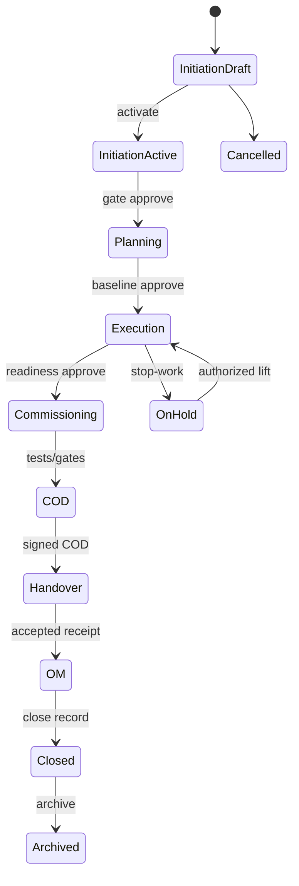
```mermaid
stateDiagram-v2
 [*] --> InitiationDraft
 InitiationDraft --> InitiationActive: activate
 InitiationActive --> Planning: gate approve
 Planning --> Execution: baseline approve
 Execution --> Commissioning: readiness approve
 Commissioning --> COD: tests/gates
 COD --> Handover: signed COD
 Handover --> OM: accepted receipt
 OM --> Closed: close record
 Execution --> OnHold: stop-work
 OnHold --> Execution: authorized lift
 InitiationDraft --> Cancelled
 Closed --> Archived: archive
```

### WF-002 — Opportunity and investment approval

- **Trace:** BR-002…008; FR-001…009; UC-025.
- **Actors:** BD, Solar/BESS Engineer, Finance, Investment Committee.
- **Trigger:** Opportunity reaches qualification/investment gate.
- **Preconditions:** Survey/data-quality, scenario input/output/version and conflict declaration.
- **States/transitions:** Lead → Qualified → Surveyed → ScenarioReady → Submitted → Approved/Rejected/Returned → Converted.
- **Validation:** Measured/assumed separation, formula/version, technical constraints, money/FX, SoD.
- **Approval/authority:** Investment Committee/value authority; proposer cannot self-approve.
- **Escalation:** Reminder/escalation only; expiry/data-stale returns for refresh.
- **Notification:** BD/engineer/finance/committee/PMO.
- **Audit events:** ScenarioSubmitted, DecisionRecorded, OpportunityConverted.
- **Exceptions:** Insufficient data/infeasible scenario; approval expiry; duplicate conversion idempotent.
- **State machine:**

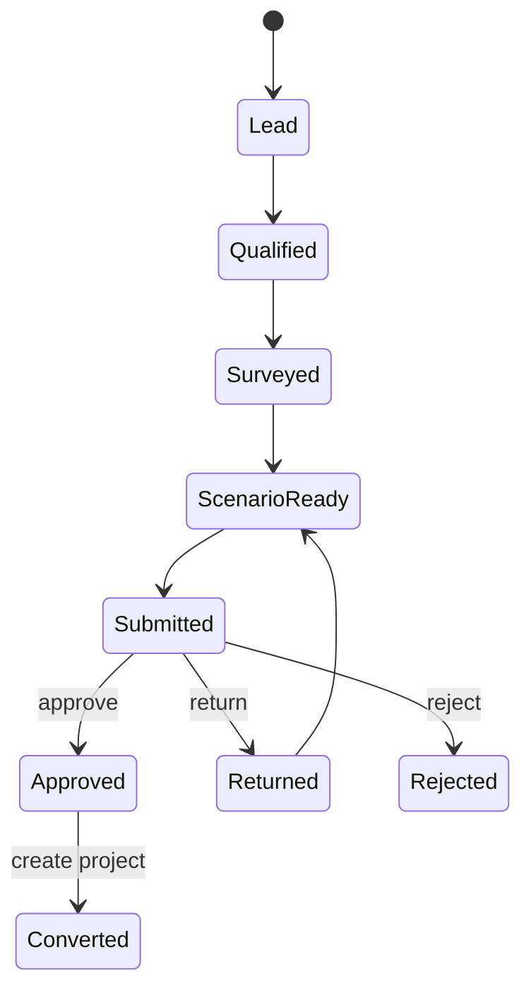
```mermaid
stateDiagram-v2
 [*] --> Lead
 Lead --> Qualified
 Qualified --> Surveyed
 Surveyed --> ScenarioReady
 ScenarioReady --> Submitted
 Submitted --> Approved: approve
 Submitted --> Returned: return
 Submitted --> Rejected: reject
 Returned --> ScenarioReady
 Approved --> Converted: create project
```

### WF-003 — Schedule baseline and rebaseline

- **Trace:** BR-018/022/032; FR-016…021/101/102; UC-003; US-003/004; AC-010…013/016; API-034…037/140…142/159; DB-017…021/067/098/101…105; SEC-105…111/118/119; TEST-010…013/016.
- **Actors/scope:** `PROJECT_CONTROLS` quản lý schedule trong project; `PACKAGE_OWNER` chỉ cập nhật activity thuộc package được gán; `PROJECT_MANAGER`/`PMO`/Baseline Approver quyết định theo tenant/project. Mọi command re-check tenant, project, package, expected version và delegation.
- **Trigger:** `INITIAL` khi schedule hợp lệ cần baseline đầu; `REBASELINE` khi một thay đổi đã được phê duyệt ảnh hưởng milestone kiểm soát/COD.
- **Preconditions:** Một calendar ngày làm việc/IANA timezone cho schedule; data date; WBS/activity/dependency hợp lệ; không self/cross-schedule/cycle; tổng weight ở các cấp bắt buộc bằng 100; milestone duration 0; task duration dương; forecast/CPM tính được. `REBASELINE` bắt buộc tham chiếu approved `DB-067` cùng tenant/project, có `sourceBaselineId` khớp current baseline và approved schedule impact rõ; client lấy current/history baseline qua Project Controls `API-159`.
- **Draft application:** API-035 `PREVIEW` chỉ validate/reconcile, không ghi DB/audit/outbox; `COMMIT` nhận danh sách upsert/archive/unlink rõ ràng và ghi atomically với expected version. Import vượt giới hạn hoặc có lỗi không được ghi một phần.
- **States/transitions:** Draft → Validated → Submitted → Approved/Rejected/Returned; Returned → Draft; một baseline Approved chỉ thành Superseded khi baseline version mới được phê duyệt. Rejected và Superseded là terminal cho version đó.
- **Decision/authority:** API-140 nhận `APPROVE`, `RETURN` hoặc `REJECT` cùng comment bắt buộc. Creator hoặc submitter không được tự approve; delegation không bỏ qua SoD. API-036 `INITIAL` nhận reason/impactSummary; `REBASELINE` là full-project-only, chỉ nhận approvedChangeRequestId/dataDate/expectedScheduleVersion và cấm client reason/impact free-text. Trước REBASELINE, Project Controls gọi public `APPROVED_CHANGE_READER.resolveForRebaseline(manager, { tenantId, projectId, changeRequestId, currentBaselineId })` trong transaction, không import RiskChange entity/repository. Port trả immutable changeReason, approvedAt/by, decisionVersion, sourceBaselineId, scheduleImpactSummary và impactSnapshotHash hoặc stable denial `NOT_FOUND_OR_SCOPE_MISMATCH`, `NOT_APPROVED`, `BASELINE_MISMATCH`, `SCHEDULE_IMPACT_NOT_APPROVED`; DB-020 reason/impact lấy từ port, denial tạo zero baseline side effect và được audit `DB-098`.
- **Baseline invariant:** Approval tạo snapshot bất biến và SHA-256; không sửa/xóa baseline. Progress/correction là append-only `DB-021`; actual finish cần actual start, 100% progress và evidence. Recalculate forecast/variance không ghi đè baseline.
- **Escalation:** Overdue review/reminder đến PMO/process owner; không auto-approve, auto-publish hoặc tự đổi source state.
- **Notification:** Chỉ domain event đã commit mới đi qua `DB-102` Outbox → `DB-103` ConsumerCheckpoint/`DB-104` CommandReceipt để tạo row trong generalized `DB-105 notifications`. Schedule projector ghi `sourceType=ScheduleActivity`, `activityId=sourceId`, validate project/package/activity scope; mọi schedule query lọc đúng sourceType. Delivery failure retry/DLQ nhưng không rollback quyết định đã commit; migration/down phải giữ schedule rows.
- **Audit events:** ScheduleDraftCommitted, BaselineValidated, BaselineSubmitted, BaselineApproved/Returned/Rejected/Superseded, ProgressRecorded/Corrected, ScheduleAlertProjected; actor/effective actor, scope, version, reason, snapshot hash và correlation được lưu theo chính sách.
- **Exceptions:** `VALIDATION_FAILED`, `DEPENDENCY_CYCLE`, `WEIGHT_TOTAL_INVALID`, `IMPORT_LIMIT_EXCEEDED`, `VERSION_CONFLICT`, `SCOPE_DENIED`, `SOD_VIOLATION`, `CHANGE_APPROVAL_REQUIRED`, `CONFIGURATION_ERROR`; actual/baseline history không bị sửa chữa tại chỗ.
- **State machine:**

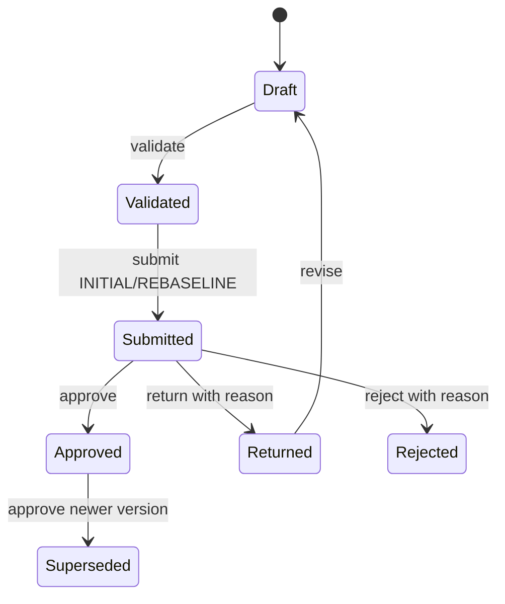
```mermaid
stateDiagram-v2
 [*] --> Draft
 Draft --> Validated: validate
 Validated --> Submitted: submit INITIAL/REBASELINE
 Submitted --> Approved: approve
 Submitted --> Returned: return with reason
 Submitted --> Rejected: reject with reason
 Returned --> Draft: revise
 Approved --> Superseded: approve newer version
```

### WF-004 — Document review

- **Trace:** BR-012/035; FR-026…030; UC-005.
- **Actors:** Author, Document Controller, Reviewer, Approver.
- **Trigger:** Safe revision submitted for review.
- **Preconditions:** File Safe/hash, coding/revision, reviewers, purpose and due date.
- **States/transitions:** Draft → InReview → Returned/Rejected/Approved → Issued; comments Open → Responded → Closed.
- **Validation:** ACL, current revision, mandatory comments, quorum/discipline and expected version.
- **Approval/authority:** Reviewer/approver matrix; author cannot self-approve where SoD.
- **Escalation:** Review SLA reminders/escalation, no auto approval.
- **Notification:** Author/reviewers/Document Controller.
- **Audit events:** ReviewStarted, CommentAdded/Disposed, RevisionApproved/Issued.
- **Exceptions:** Malware/quarantine; reviewer unavailable; conflicting comment; legal hold/status lock.
- **State machine:**

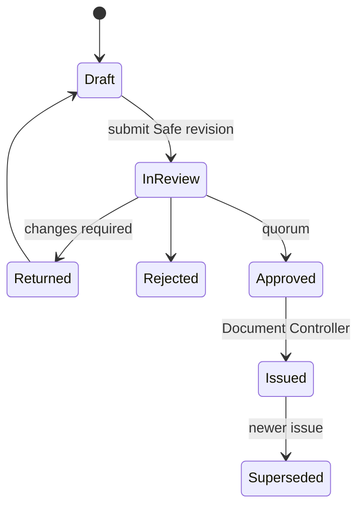
```mermaid
stateDiagram-v2
 [*] --> Draft
 Draft --> InReview: submit Safe revision
 InReview --> Returned: changes required
 InReview --> Rejected
 InReview --> Approved: quorum
 Returned --> Draft
 Approved --> Issued: Document Controller
 Issued --> Superseded: newer issue
```

### WF-005 — Drawing revision and current-for-use

- **Trace:** BR-012/035; FR-027…030; UC-005.
- **Actors:** Engineering Author, Checker, Approver, Document Controller, Site.
- **Trigger:** Design change creates new drawing revision.
- **Preconditions:** Parent revision/current-for-use, change reference, interface/BOM impact identified.
- **States/transitions:** Working → Checked → Approved → IssuedForUse → Superseded/Withdrawn.
- **Validation:** Revision sequence, change authority, linked RFI/design change, obsolete copy control.
- **Approval/authority:** Engineering checker/approver and issue authority.
- **Escalation:** Overdue drawing affects workfront/readiness; notify PM/site.
- **Notification:** Engineering/site/procurement/QA.
- **Audit events:** RevisionCreated/Issued/Superseded, CurrentForUseChanged.
- **Exceptions:** Site using obsolete revision creates alert/hold; issued revision immutable.
- **State machine:**

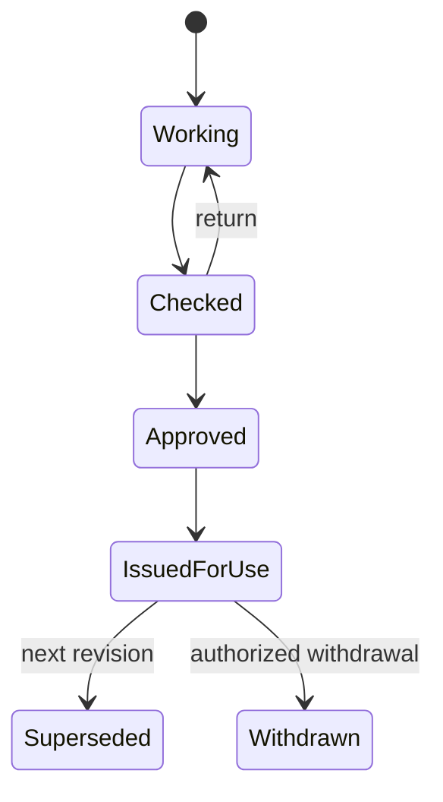
```mermaid
stateDiagram-v2
 [*] --> Working
 Working --> Checked
 Checked --> Approved
 Approved --> IssuedForUse
 IssuedForUse --> Superseded: next revision
 IssuedForUse --> Withdrawn: authorized withdrawal
 Checked --> Working: return
```

### WF-006 — Transmittal and response

- **Trace:** BR-035; FR-031/032; UC-005.
- **Actors:** Document Controller, Sender, Recipient, Reviewer.
- **Trigger:** Approved/issued revisions need formal transmission.
- **Preconditions:** Recipient/purpose/action/due and exact revision/hash snapshot.
- **States/transitions:** Draft → Issued → Delivered → Acknowledged → Responded → Closed; Failed/Expired.
- **Validation:** Recipient scope, safe artifact, no duplicate number, response code/evidence.
- **Approval/authority:** Issue authority; response acceptance authority if needed.
- **Escalation:** Delivery/reply SLA reminders; failure to Document Controller.
- **Notification:** Sender/recipients/object owners.
- **Audit events:** TransmittalIssued/Delivered/Acknowledged/Responded/Closed.
- **Exceptions:** Delivery failure retry; recipient loses access; partial response; no silent item replacement.
- **State machine:**

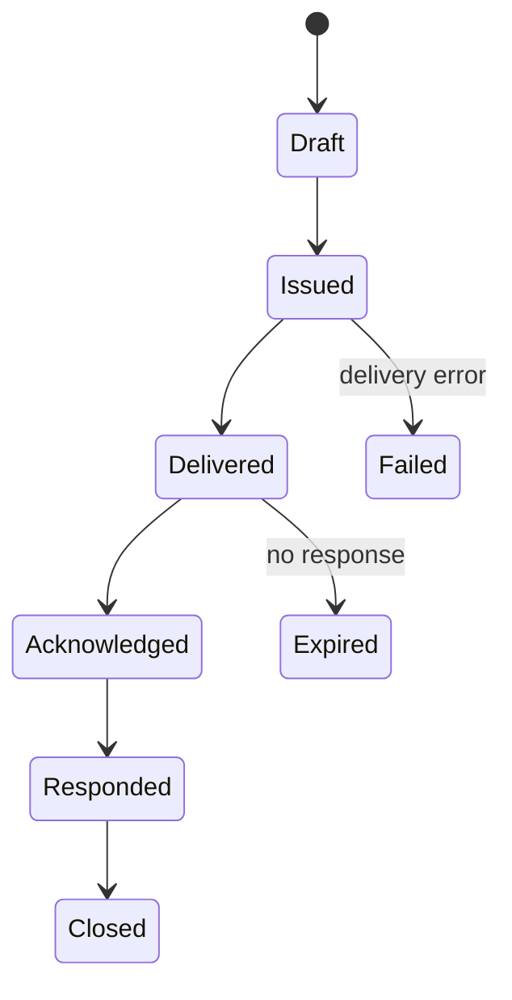
```mermaid
stateDiagram-v2
 [*] --> Draft
 Draft --> Issued
 Issued --> Delivered
 Delivered --> Acknowledged
 Acknowledged --> Responded
 Responded --> Closed
 Issued --> Failed: delivery error
 Delivered --> Expired: no response
```

### WF-007 — External share and e-signature

- **Trace:** BR-011/035/040; FR-033/034/145/164; UC-019.
- **Actors:** Document Controller, Security/Legal, Signer, External Recipient.
- **Trigger:** Artifact approved for share/sign.
- **Preconditions:** Safe exact hash, classification, recipient, purpose, expiry, signer authority and step-up.
- **States/transitions:** Requested → Approved → Active/Sent → Viewed/Signed → Completed/Revoked/Expired/Failed.
- **Validation:** DLP/share policy, identity, signature callback/hash, legal hold.
- **Approval/authority:** High classification/share/sign workflow per policy.
- **Escalation:** Expiry/signature reminders; suspicious access alert.
- **Notification:** Owner, recipient/signer, Security/Legal.
- **Audit events:** ShareCreated/Revoked, EnvelopeSent, SignerVerified, ArtifactSigned.
- **Exceptions:** Forwarded/expired link deny; forged/replay callback; hash mismatch quarantine.
- **State machine:**

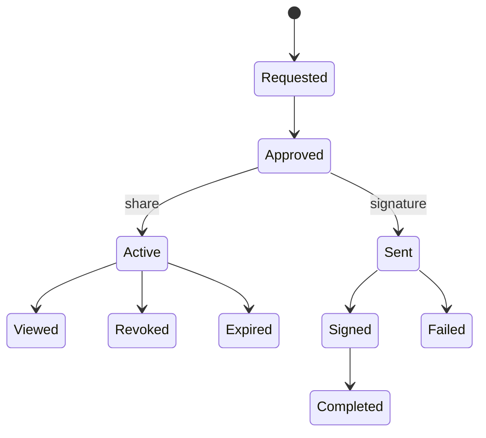
```mermaid
stateDiagram-v2
 [*] --> Requested
 Requested --> Approved
 Approved --> Active: share
 Approved --> Sent: signature
 Active --> Viewed
 Sent --> Signed
 Signed --> Completed
 Active --> Revoked
 Active --> Expired
 Sent --> Failed
```

### WF-008 — Contract approval and signing

- **Trace:** BR-009…011; FR-036/037; UC-006.
- **Actors:** Contract Manager, Legal, Finance, PM, Authorized Signers.
- **Trigger:** Contract draft complete.
- **Preconditions:** Project/number unique, parties/legal snapshots, value/currency, terms, documents, signer authority and SoD.
- **States/transitions:** Draft → LegalReview → CommercialReview → Submitted → Approved → Signing → Effective; Returned/Rejected/Expired.
- **Validation:** Party IDs/snapshots, clause/obligation, authority/value, document hash, conflict.
- **Approval/authority:** Parallel/sequential Legal/Finance/management/signers by type/value.
- **Escalation:** Deadline escalation; no fallback approver/auto-sign.
- **Notification:** Parties/reviewers/PM/Finance/Legal.
- **Audit events:** ContractSubmitted/Approved, SignatureStarted/Completed, ContractEffective.
- **Exceptions:** Signer authority expires; party changes require new snapshot/version; callback/hash fail.
- **State machine:**

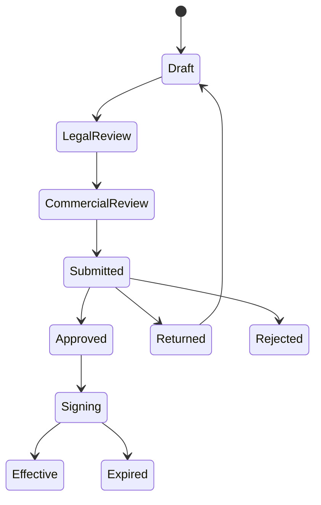
```mermaid
stateDiagram-v2
 [*] --> Draft
 Draft --> LegalReview
 LegalReview --> CommercialReview
 CommercialReview --> Submitted
 Submitted --> Approved
 Submitted --> Returned
 Submitted --> Rejected
 Returned --> Draft
 Approved --> Signing
 Signing --> Effective
 Signing --> Expired
```

### WF-009 — Appendix, obligation, guarantee and permit

- **Trace:** BR-009/010/022/026; FR-038…044; UC-006.
- **Actors:** Contract Manager, Legal, Obligor, Verifier, PM.
- **Trigger:** Appendix/change or obligation event arises.
- **Preconditions:** Parent contract effective; clause/trigger/due/evidence/authority; appendix impact.
- **States/transitions:** Draft/NotTriggered → Triggered/Open → Due/Overdue → SubmittedEvidence → Verified/Fulfilled/Waived/Cancelled; appendix approval branch.
- **Validation:** Effective dates, consolidated terms, guarantee/permit validity, waiver authority.
- **Approval/authority:** Appendix/waiver/fulfillment authority; verifier independence.
- **Escalation:** Pre-due/overdue/expiry escalation to owner/PM/Legal.
- **Notification:** Obligor/beneficiary/verifier/PM.
- **Audit events:** AppendixEffective, ObligationTriggered/Due/Fulfilled/Waived, PermitExpired.
- **Exceptions:** Conflicting appendix; evidence stale; expired guarantee/permit blocks COD hard-cap.
- **State machine:**

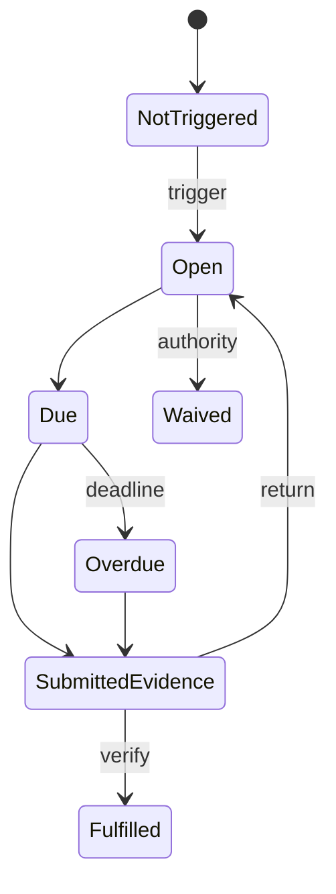
```mermaid
stateDiagram-v2
 [*] --> NotTriggered
 NotTriggered --> Open: trigger
 Open --> Due
 Due --> Overdue: deadline
 Due --> SubmittedEvidence
 Overdue --> SubmittedEvidence
 SubmittedEvidence --> Fulfilled: verify
 SubmittedEvidence --> Open: return
 Open --> Waived: authority
```

### WF-010 — Procurement requisition approval

- **Trace:** BR-015; FR-061/062; UC-008.
- **Actors:** Requester, Engineering, Cost, Procurement, Approver.
- **Trigger:** Approved demand/BOM or authorized need.
- **Preconditions:** Project/package/WBS/cost code, need-by, quantity/unit, budget/design refs, supplier category.
- **States/transitions:** Draft → TechnicalCheck → CostCheck → Submitted → Approved/Returned/Rejected → Sourcing.
- **Validation:** Eligibility, duplicate demand, budget/authority, SoD.
- **Approval/authority:** Technical + Cost + value authority by policy.
- **Escalation:** Need-by/critical-path and SLA escalation.
- **Notification:** Requester/Engineering/Cost/Procurement.
- **Audit events:** RequisitionSubmitted/Approved/Returned.
- **Exceptions:** Missing/obsolete BOM, budget insufficient, requester approver conflict.
- **State machine:**

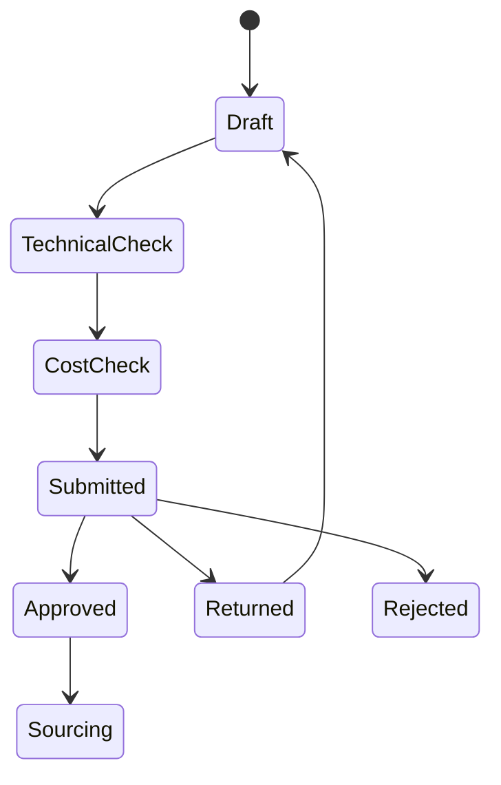
```mermaid
stateDiagram-v2
 [*] --> Draft
 Draft --> TechnicalCheck
 TechnicalCheck --> CostCheck
 CostCheck --> Submitted
 Submitted --> Approved
 Submitted --> Returned
 Submitted --> Rejected
 Returned --> Draft
 Approved --> Sourcing
```

### WF-011 — RFQ, bid evaluation and award

- **Trace:** BR-015; FR-063…066; UC-008.
- **Actors:** Procurement, Suppliers, Technical/Commercial Evaluators, Award Authority.
- **Trigger:** Approved requisition enters sourcing.
- **Preconditions:** Same RFQ revision for bidders; qualification; bid window; evaluation criteria/team; conflict declarations.
- **States/transitions:** RFQDraft → Issued → BidOpen → Closed → TechnicalEvaluation → CommercialEvaluation → AwardSubmitted → AwardApproved/Rejected.
- **Validation:** Bid confidentiality/seal, deadline, evaluator scope, normalized currency, SoD.
- **Approval/authority:** Technical/commercial separation and award authority/quorum.
- **Escalation:** Bid/deadline/award SLA; no auto-open/award.
- **Notification:** Invited suppliers and internal evaluation/authority groups with separate views.
- **Audit events:** RFQIssued, BidSubmitted/Opened, EvaluationRecorded, AwardApproved.
- **Exceptions:** Late/withdrawn bid, evaluator conflict, insufficient competition policy TBD, clarification version.
- **State machine:**

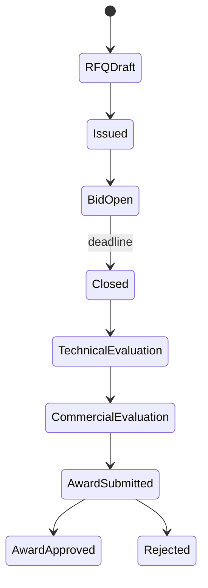
```mermaid
stateDiagram-v2
 [*] --> RFQDraft
 RFQDraft --> Issued
 Issued --> BidOpen
 BidOpen --> Closed: deadline
 Closed --> TechnicalEvaluation
 TechnicalEvaluation --> CommercialEvaluation
 CommercialEvaluation --> AwardSubmitted
 AwardSubmitted --> AwardApproved
 AwardSubmitted --> Rejected
```

### WF-012 — Purchase order approval and issue

- **Trace:** BR-015…017; FR-067/068; UC-008.
- **Actors:** Procurement, Cost, Legal, Approver, Supplier.
- **Trigger:** Approved award or direct-award authority.
- **Preconditions:** Supplier/legal entity, lines, price/currency, terms, required date, budget/commitment, SoD.
- **States/transitions:** Draft → Review → Submitted → Approved → Issued → Acknowledged; Returned/Rejected/Amended/Closed.
- **Validation:** Award/contract/budget, line/source, authority, revision and supplier eligibility.
- **Approval/authority:** Value/legal/entity approval; creator cannot self-approve.
- **Escalation:** Supplier acknowledgment and required-date escalation.
- **Notification:** Procurement/Finance/Legal/Supplier/PM.
- **Audit events:** POApproved/Issued/Acknowledged/Amended.
- **Exceptions:** ERP posting failure creates reconciliation; amendment new revision; no overwrite issued PO.
- **State machine:**

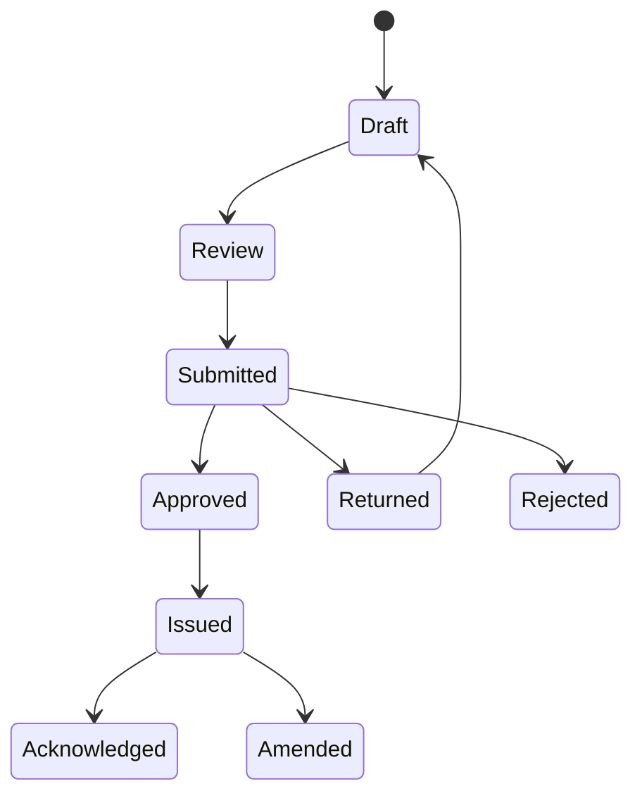
```mermaid
stateDiagram-v2
 [*] --> Draft
 Draft --> Review
 Review --> Submitted
 Submitted --> Approved
 Submitted --> Returned
 Submitted --> Rejected
 Returned --> Draft
 Approved --> Issued
 Issued --> Acknowledged
 Issued --> Amended
```

### WF-013 — Delivery, receipt and exception

- **Trace:** BR-016/017; FR-069…074; UC-008.
- **Actors:** Supplier/Carrier, Logistics, Warehouse/Site, QA, Procurement.
- **Trigger:** Issued PO/shipment.
- **Preconditions:** PO lines, committed date, route/tracking, site/storage, inspection, quantity and serial rules.
- **States/transitions:** Planned → Booked → InTransit → Customs → Delivered → Receiving → Accepted/Partial/Quarantined/Rejected → Closed.
- **Validation:** ETA vs committed, partial quantity, damage, quarantine, serial uniqueness, evidence.
- **Approval/authority:** Receipt acceptance/release authority; quarantine release by QA.
- **Escalation:** Critical ETA/exception escalation to PM/procurement/site.
- **Notification:** Supplier/carrier/logistics/site/QA.
- **Audit events:** ShipmentMilestone, GoodsReceived, ExceptionRaised, SerialCaptured, MaterialReleased.
- **Exceptions:** Carrier duplicate/out-of-order; over-receipt; missing/damaged; serial conflict.
- **State machine:**

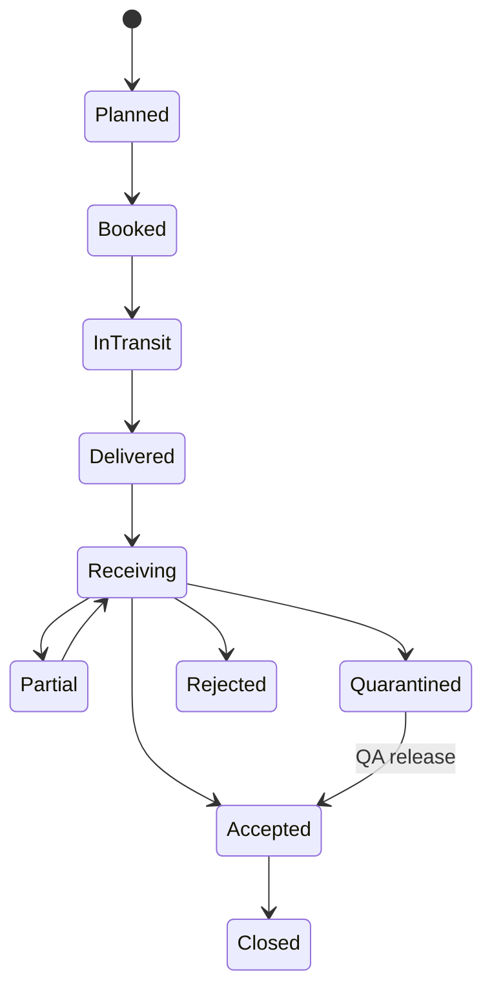
```mermaid
stateDiagram-v2
 [*] --> Planned
 Planned --> Booked
 Booked --> InTransit
 InTransit --> Delivered
 Delivered --> Receiving
 Receiving --> Accepted
 Receiving --> Partial
 Receiving --> Quarantined
 Receiving --> Rejected
 Partial --> Receiving
 Quarantined --> Accepted: QA release
 Accepted --> Closed
```

### WF-014 — Payment approval, posting and reconciliation

- **Trace:** BR-015/030/033; FR-053…060; UC-007.
- **Actors:** Requester, PM/Contract, Cost, Finance Approver, Treasury, ERP.
- **Trigger:** Invoice/milestone/payment schedule event.
- **Preconditions:** contractId, payer/payee LegalEntity, invoice/evidence, components, currency/FX, budget, authority and SoD.
- **States/transitions:** Draft → Validated → Submitted → ContractCheck → CostCheck → FinanceApproval → Approved → ERPPosted → Paid → Reconciled; Returned/Rejected/Cancelled.
- **Validation:** Exact decimal, VAT/retention rule version, no cross-currency sum, duplicate, payee, self-approval.
- **Approval/authority:** Sequential/parallel approvals by value/legal entity; Treasury separation.
- **Escalation:** Due/cash/approval/ERP reconciliation escalation.
- **Notification:** Requester/PM/Cost/Finance/Treasury.
- **Audit events:** PaymentSubmitted/Approved/Posted/Paid/Reconciled.
- **Exceptions:** Budget fail, duplicate invoice, ERP timeout/retry, bank mismatch; Paid corrected by adjustment.
- **State machine:**

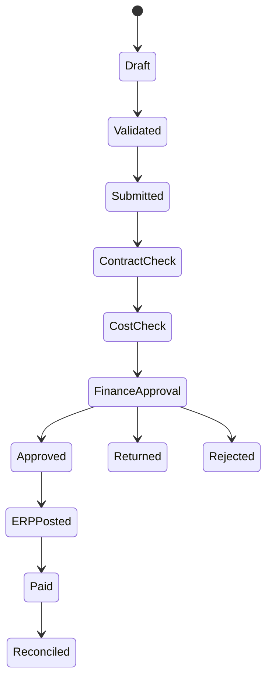
```mermaid
stateDiagram-v2
 [*] --> Draft
 Draft --> Validated
 Validated --> Submitted
 Submitted --> ContractCheck
 ContractCheck --> CostCheck
 CostCheck --> FinanceApproval
 FinanceApproval --> Approved
 FinanceApproval --> Returned
 FinanceApproval --> Rejected
 Approved --> ERPPosted
 ERPPosted --> Paid
 Paid --> Reconciled
```

### WF-015 — Design change and substitution

- **Trace/direct:** BR-012/014/018/022/031/032; FR-048…052/101/102/104; UC-003/004/026/027; US-004; AC-012/016; API-150…153/156/159/162; DB-020/067/098; SEC-105…111/114/118/119; TEST-012/016.
- **Dependency boundary:** FR-103 và DB-068 Claim/Variation/notice/quantum/negotiation phụ thuộc Contract/Legal US-006. WF-015 V1 không tạo Claim record, không phát VO/amendment và không trình bày Claim như đã materialize; approved Change chỉ tạo provenance cho downstream workflow hợp lệ.
- **Actors/scope:** Requester, Engineering, PM, Cost, Contract, QA/HSE và independent Change Approver/Board. `packageId` nullable: package-only actor chỉ create/read/manage draft cùng package; project-level/null, submit, decision và rebaseline cần full-project assignment.
- **Trigger:** Risk/Issue cần thay đổi scope/time/cost/design hoặc RFI/site/vendor/design condition đề xuất change. Create-from-source copy link/evidence reference/package scope atomically nhưng không đóng source hoặc tự approve.
- **Preconditions:** Create chỉ bắt code/title/reason/owner/source; DRAFT/ASSESSED cho phép options/recommendation và sáu impact dimension scope–schedule–cost–quality–HSE–contract được bổ sung từng phần. Trước SUBMITTED phải có recommendation và đủ sáu dimension; sourceBaselineId chỉ bắt khi `schedule.requiresRebaseline = true`. Source evidence, affected design/BOM/interface phải authorized. Money là decimal string lưu `numeric(19,4)` với ISO currency; không dùng floating point.
- **States/transitions:** DB-067 `DRAFT → ASSESSED → SUBMITTED → APPROVED|RETURNED|REJECTED`; `RETURNED → ASSESSED`. Downstream explicit command mới cho `APPROVED → IMPLEMENTED → CLOSED`; approval/rebaseline không tự chuyển Implemented/Closed.
- **Validation:** SourceType/ref XOR và same tenant/project/package; expected version; conditional source baseline; complete submit snapshot; evidence references authorized; status/hash; no direct edit of issued design/BOM/baseline. `scheduleImpactApproved` không nhận từ client mà server derive lúc APPROVE đúng khi frozen `schedule.requiresRebaseline = true`.
- **Approval/authority:** `riskChange.submit` và `riskChange.approve` cần full-project assignment. Mọi APPROVE/RETURN/REJECT bắt comment; decision actor khác requester/submitter, kể cả multiple role/delegation; production quorum/value/step-up còn TBD. SUBMIT khóa canonical impact snapshot/hash; APPROVE khóa source/impact/decision/approval snapshot/hash, ghi decisionVersion/approvedAt/by và derived scheduleImpactApproved.
- **Downstream/rebaseline:** Approved Change không tự update design, contract, budget hoặc schedule. WF-003 gọi `APPROVED_CHANGE_READER` trong same transaction; source baseline mismatch, unapproved/missing schedule impact hoặc scope mismatch bị deny trước bất kỳ DB-020 write nào. UI đọc baseline history/current qua Project Controls API-159.
- **Escalation:** Critical path/safety/decision deadline escalates to process owner; không auto-approve/implement/rebaseline. Emergency safety action có thể stop-work theo WF-019 nhưng không phê duyệt commercial/design change.
- **Notification:** Chỉ committed event gửi affected Engineering/Procurement/Site/QA-HSE/Contract/requester/approver đúng current scope; mark-read không đổi Change state. Permission revoke trước projection/delivery loại recipient.
- **Audit events:** ChangeCreated/Assessed/Submitted/Returned/Rejected/Approved/Implemented/Closed, ChangeScopeDenied và RebaselineChangeResolved/Denied vào immutable DB-098 với actor/effective actor, scope, version, reason, snapshot hashes và correlation.
- **Exceptions:** `IMPACT_INCOMPLETE`, `VERSION_CONFLICT`, `PROJECT_SCOPE_DENIED`, `CHANGE_APPROVAL_SOD`, `NOT_FOUND_OR_SCOPE_MISMATCH`, `NOT_APPROVED`, `BASELINE_MISMATCH`, `SCHEDULE_IMPACT_NOT_APPROVED`, `CONFIGURATION_ERROR`; mọi lỗi tạo zero unauthorized/partial side effect.
- **State machine:**

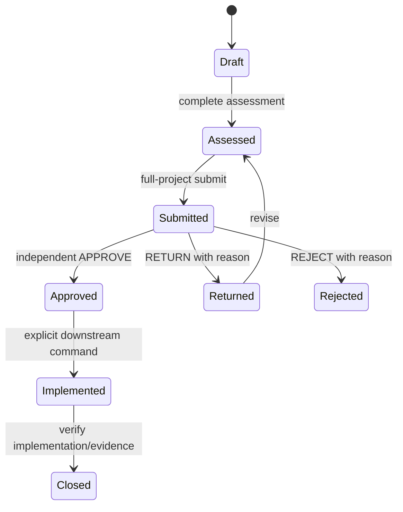
```mermaid
stateDiagram-v2
 [*] --> Draft
 Draft --> Assessed: complete assessment
 Assessed --> Submitted: full-project submit
 Submitted --> Approved: independent APPROVE
 Submitted --> Returned: RETURN with reason
 Submitted --> Rejected: REJECT with reason
 Returned --> Assessed: revise
 Approved --> Implemented: explicit downstream command
 Implemented --> Closed: verify implementation/evidence
```

### WF-016 — RFI response

- **Trace:** BR-012/018/022/035; FR-028/049/100; UC-004/005.
- **Actors:** Site/Contractor Requester, Document Controller, Engineering, Client/Designer.
- **Trigger:** Technical ambiguity or missing information.
- **Preconditions:** Project/package/location, question, current revision, required-by, attachments and responsibility.
- **States/transitions:** Draft → Issued → Assigned → UnderReview → Responded → Accepted/ClarificationRequired → Closed/Superseded.
- **Validation:** No duplicate/obsolete drawing, recipient authority, response impact classification.
- **Approval/authority:** Response approval per discipline/client; change requires WF-015.
- **Escalation:** Required-by escalation; critical RFI marks activity blocked.
- **Notification:** Requester/assignee/PM/Document Control.
- **Audit events:** RFIIssued/Assigned/Responded/Closed, ChangeRequired.
- **Exceptions:** Response changes scope/design cannot be applied as informal RFI; model as Document type + Workflow, no new DB entity.
- **State machine:**

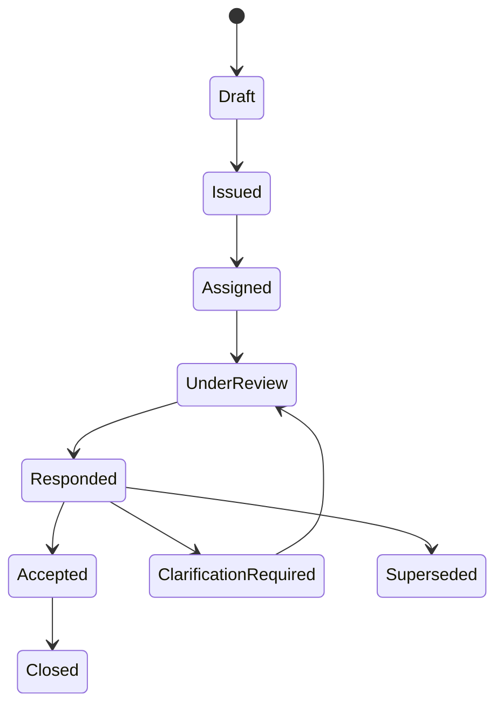
```mermaid
stateDiagram-v2
 [*] --> Draft
 Draft --> Issued
 Issued --> Assigned
 Assigned --> UnderReview
 UnderReview --> Responded
 Responded --> Accepted
 Responded --> ClarificationRequired
 ClarificationRequired --> UnderReview
 Accepted --> Closed
 Responded --> Superseded
```

### WF-017 — NCR disposition and closure

- **Trace:** BR-021/023…026; FR-094/095; UC-010.
- **Actors:** QA/QC, Contractor, Engineering, Client/Verifier.
- **Trigger:** Inspection/finding nonconformance.
- **Preconditions:** Finding/evidence/severity/object/current spec, containment, owner/due.
- **States/transitions:** Open → Contained → RootCause → DispositionProposed → DispositionApproved → Rectification → ReadyForVerification → Closed/Reopened.
- **Validation:** Disposition authority; use-as-is Engineering/client; repair/rework evidence; verifier independence.
- **Approval/authority:** QA/Engineering/client by disposition/severity; contractor cannot self-close.
- **Escalation:** Aging/COD gate escalation; safety issue also HSE.
- **Notification:** Contractor/QA/Engineering/PM/Commissioning.
- **Audit events:** NCRRaised, DispositionApproved, ReadyForVerification, Closed/Reopened.
- **Exceptions:** Rejected disposition; failed verification; linked stop-work; history immutable.
- **State machine:**

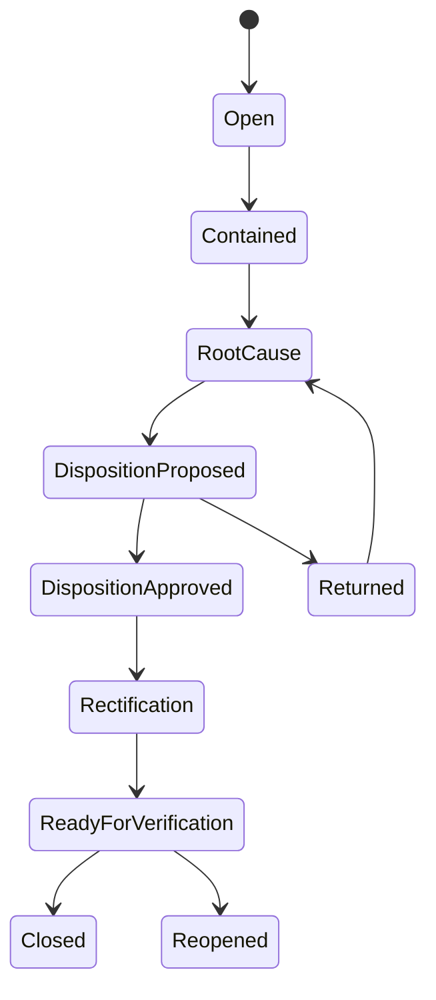
```mermaid
stateDiagram-v2
 [*] --> Open
 Open --> Contained
 Contained --> RootCause
 RootCause --> DispositionProposed
 DispositionProposed --> DispositionApproved
 DispositionProposed --> Returned
 Returned --> RootCause
 DispositionApproved --> Rectification
 Rectification --> ReadyForVerification
 ReadyForVerification --> Closed
 ReadyForVerification --> Reopened
```

### WF-018 — Punch item closure

- **Trace:** BR-021/026; FR-096/097; UC-010/013.
- **Actors:** Commissioning/QA, Contractor, Owner, Verifier.
- **Trigger:** Walkdown/test creates punch.
- **Preconditions:** Category, system/asset/location, evidence, owner/due, COD impact.
- **States/transitions:** Open → Assigned → InProgress → ReadyForVerification → Closed/Reopened/Waived.
- **Validation:** Category A/blocking rule; completion evidence; waiver authority/effective date.
- **Approval/authority:** Verifier independent; waiver by COD authority if allowed.
- **Escalation:** Aging/COD escalation; no auto close.
- **Notification:** Owner/contractor/QA/commissioning/PM.
- **Audit events:** PunchRaised/ReadyForVerification/Closed/Reopened/Waived.
- **Exceptions:** Wrong category/duplicate; failed verification; non-waivable cannot waive.
- **State machine:**

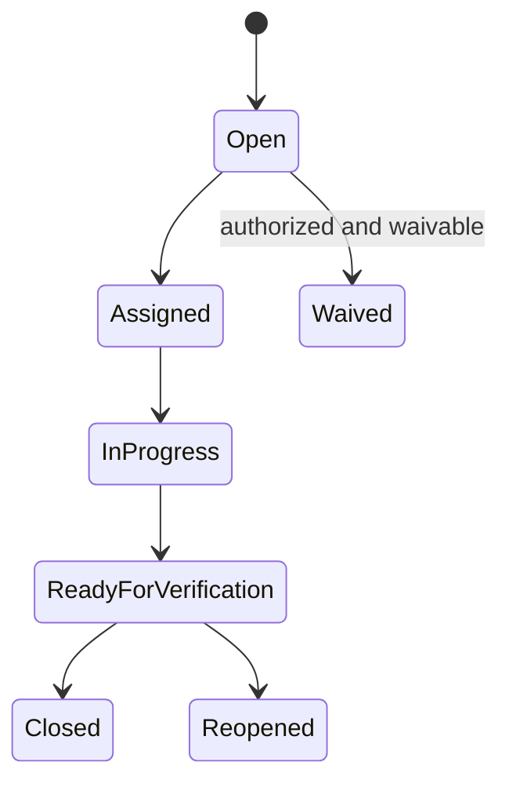
```mermaid
stateDiagram-v2
 [*] --> Open
 Open --> Assigned
 Assigned --> InProgress
 InProgress --> ReadyForVerification
 ReadyForVerification --> Closed
 ReadyForVerification --> Reopened
 Open --> Waived: authorized and waivable
```

### WF-019 — PTW, stop-work and safe return

- **Trace:** BR-020/025/026; FR-081/085/086/088; UC-011.
- **Actors:** Requester/Supervisor, HSE, Permit Issuer, Workers, Lift Authority.
- **Trigger:** Workfront needs permit or unsafe condition observed.
- **Preconditions:** JSA/hazard/isolation/competency/workfront/validity; issuer independence.
- **States/transitions:** PTWDraft → Requested → Verified → Issued → Active → Suspended/Expired → Closed; StopWorkIssued → ConditionsVerified → Lifted.
- **Validation:** No missing isolation/competency; expiry; designated issue/lift authority; no conditional bypass.
- **Approval/authority:** Permit issuer/lift authority distinct as policy.
- **Escalation:** Expiry/stop-work critical notifications; Health hard-cap.
- **Notification:** Crew/site/PM/HSE/QA as applicable.
- **Audit events:** PermitIssued/Suspended/Expired, StopWorkIssued/Lifted.
- **Exceptions:** Emergency stop immediately; cloud failure does not override site safety; workfront remains suspended until lift.
- **State machine:**

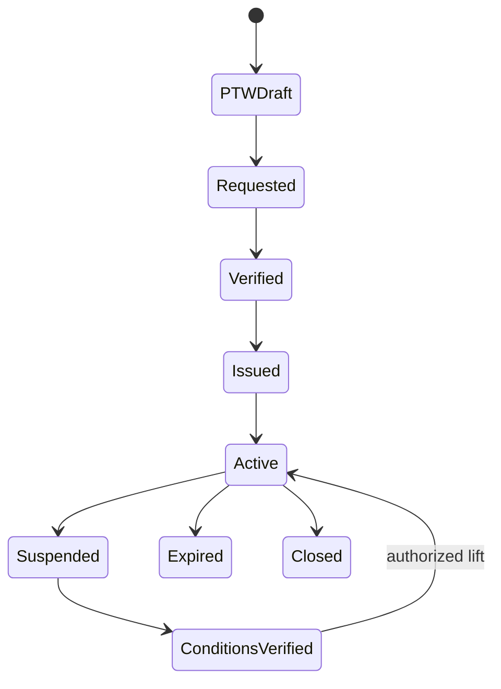
```mermaid
stateDiagram-v2
 [*] --> PTWDraft
 PTWDraft --> Requested
 Requested --> Verified
 Verified --> Issued
 Issued --> Active
 Active --> Suspended
 Active --> Expired
 Active --> Closed
 Suspended --> ConditionsVerified
 ConditionsVerified --> Active: authorized lift
```

### WF-020 — HSE incident investigation and CAPA

- **Trace:** BR-020/025/026; FR-087/089/090; UC-011.
- **Actors:** Reporter, HSE, Incident Commander, Investigator, CAPA Owner, Verifier.
- **Trigger:** Incident/near miss reported, emergency path always available.
- **Preconditions:** Site/time/severity/immediate action/restricted facts; no approval delay.
- **States/transitions:** Reported → Triaged → Contained → Investigating → CAPADefined → Implementing → EffectivenessReview → Closed/Reopened.
- **Validation:** Severity/classification, evidence preservation, restricted access, independent effectiveness review.
- **Approval/authority:** Closure/critical classification authority; no approval to report.
- **Escalation:** Immediate critical communication; action/SLA escalation.
- **Notification:** HSE/management/Legal/affected owners need-to-know.
- **Audit events:** IncidentReported/Classified, CAPADefined/Verified, IncidentClosed.
- **Exceptions:** Injury/privacy/legal escalation; parallel ServiceIncident remains separate; stop-work linked.
- **State machine:**

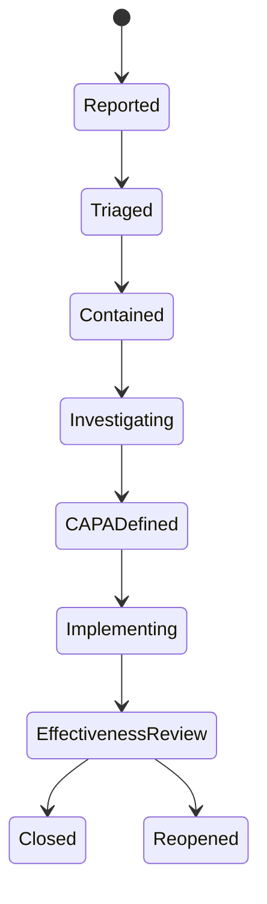
```mermaid
stateDiagram-v2
 [*] --> Reported
 Reported --> Triaged
 Triaged --> Contained
 Contained --> Investigating
 Investigating --> CAPADefined
 CAPADefined --> Implementing
 Implementing --> EffectivenessReview
 EffectivenessReview --> Closed
 EffectivenessReview --> Reopened
```

### WF-021 — Risk and issue lifecycle

- **Trace/direct:** BR-022/031/032; FR-098…100/104; UC-004; US-004; AC-014/015/017; API-008/038/143…149/154/155/157/158/160/161/163/164; DB-005…007/065/066/098/105/112/113; SEC-105…111/114/118; TEST-014/015/017.
- **Actors/scope:** Reporter, Risk/Issue Owner, PM và independent Closure Approver/Steering. `packageId = NULL` là project-level; package-only actor có create/read/manage/requestClosure đúng package, không thấy project-level/null hoặc package khác. Owner assignment không tự cấp read/close ngoài current policy.
- **Trigger:** Chọn Risk khi uncertain event chưa xảy ra; chọn Issue khi event/fact đã xảy ra. Form/command/aggregate riêng, không dùng nullable field set để trộn hai register.
- **Preconditions:** Risk cần category, cause–event–impact, probability + cost/schedule/HSE rating 1…5, owner và reviewDate; responseStrategy/plan/trigger/contingency là facts riêng. Risk register/heatmap query trả inherent và nullable residual probability/impact/exposure/level, filter thời hạn dùng `reviewBefore`. Issue cần title/description/occurredAt/severity/actual impact/root cause/owner/target date; RESOLVED bắt resolution summary/evidence. Link/evidence/action phải cùng tenant/project/package scope và authorized; assignee API-008 cần `user.read`, chỉ trả `{id, displayName}` của active user theo exact scope/capability; owner assignment không cấp access.
- **Scoring/action:** server tính score/version như Data V1. `DB-065` Risk là residual SoR; Action residual là proposal + `residualRiskVersion`. API-149 là one-of: routine sửa editable fields/status OPEN|IN_PROGRESS|BLOCKED; COMPLETE gửi DONE/evidence và optional proposal; VERIFY chỉ gửi expectedVersion/VERIFIED/evidence và promote proposal đã lưu; CANCEL chỉ expectedVersion/CANCELLED/evidence/reason, không promote. Terminal branch cấm owner/title/due/residual và mọi mixed payload; SoD so actor/effective actor với pre-command owner/completedBy. VERIFY atomically so stored version với current Risk rồi copy/recompute/version/audit/outbox; conflict zero write. VERIFIED/CANCELLED ghi respective actor/time, terminal immutable; only these satisfy closure. Direct API-144 remains full-project authoritative reassessment with reason/evidence/expected Risk version.
- **Risk transitions:** `IDENTIFIED → ASSESSED → TREATING → MONITORING → CLOSURE_PENDING → CLOSED`. Chỉ MONITORING được request closure; request insert DB-113 next sequence, decision fill undecided cycle một lần và update latest scalar projection atomically; RETURN/REJECT về MONITORING. Active Risk có thể sang OCCURRED chỉ khi atomically link Issue same scope.
- **Issue transitions:** `REPORTED → TRIAGED → IN_PROGRESS → RESOLVED → CLOSURE_PENDING → CLOSED`; chỉ RESOLVED được request closure; request/decision dùng DB-113 như Risk, RETURN/REJECT về RESOLVED. Explicit reopen bắt evidence; re-close append sequence mới, completed cycle cũ không update/delete và scalar parent không là history SoR.
- **Closure/authority:** `riskChange.requestClosure` bắt reason/evidence và insert một DB-113 cycle có sequence/request actor/time. `riskChange.close` chỉ fill cycle chưa quyết định một lần, cho full-project independent actor khác creator, current owner và cycle requester; mọi Action phải VERIFIED hoặc authorized CANCELLED. Decision/comment/evidence/actor/time/resultingStatus hoàn tất cycle bất biến; Risk/Issue scalar chỉ mirror latest cycle. API-160/161 page authorized cycles bằng opaque cursor + stable `sequenceNo/id`, limit 50 mặc định/100 tối đa và theo `nextCursor` đến null; DB-098 ghi audit nhưng không thay DB-113 evidence history. Risk HIGH/CRITICAL hoặc Issue CRITICAL cần thêm closeCritical.
- **Change link:** “Tạo change request” tạo DB-067 DRAFT với source/two-way link, package và opaque evidence snapshot; không tự approve Change, không close Risk/Issue. WF-015 quản lý impact/decision sau đó; DB-068 Claim/Variation không materialize trong WF-021.
- **Escalation:** Threshold, review date, target date và Action overdue gửi PM/Steering/current owner; reminder/escalation không accept risk, verify action, close item hoặc approve Change.
- **Notification:** Committed projection mapping đóng: Risk→RISK_REVIEW_DUE, Issue→ISSUE_TARGET_DUE, RiskIssueAction→ACTION_OVERDUE, ChangeRequest→CHANGE_DECISION_PENDING; source/alert khác bị reject. Priority derive deterministic: Risk effective HIGH|CRITICAL→HIGH, còn lại NORMAL; Issue severity HIGH|CRITICAL→HIGH, còn lại NORMAL; Action overdue→HIGH; Change pending→NORMAL. dueAt lấy reviewDate/targetDate/dueDate; dataDate là business date primary Site; Change pending dùng business date submittedAt cho cả dueAt/dataDate; thresholdVersion là Risk/Change policy version, tất cả non-null. Non-schedule activityId NULL; projector validate scope/current recipient, dedup và rollback rule như Data v1.1.
- **Audit events:** Risk/Issue/Action events cùng ClosureCycleRequested/Decided được ghi DB-098 với cycle ID/sequence và evidence hash; DB-113 vẫn là closure evidence-history SoR. API-157 query toàn authorized Risk filter, không page API-143, nhóm scoringVersion/thresholdVersion với 25 inherent + 25 residual cells và residualMissingCount; RiskSummary gồm scoringVersion.
- **Exceptions:** `RISK_NOT_FOUND`, `ISSUE_NOT_FOUND`, `ACTION_NOT_FOUND`, `INVALID_STATE_TRANSITION`, `CLOSE_EVIDENCE_REQUIRED`, `CLOSE_APPROVAL_SOD`, `PROJECT_SCOPE_DENIED`, `VERSION_CONFLICT`; stable scope denial không xác nhận known ID tồn tại và tạo zero partial side effect.
- **State machine:**

```mermaid
stateDiagram-v2
 state Risk {
  [*] --> Identified
  Identified --> Assessed
  Assessed --> Treating
  Treating --> Monitoring
  Monitoring --> ClosurePending: insert DB-113 next sequence
  ClosurePending --> Monitoring: fill RETURN or REJECT once
  ClosurePending --> Closed: fill APPROVE once + satisfied actions
  Identified --> Occurred: atomically link Issue
  Assessed --> Occurred
  Treating --> Occurred
  Monitoring --> Occurred
 }
 state Issue {
  [*] --> Reported
  Reported --> Triaged
  Triaged --> InProgress
  InProgress --> Resolved
  Resolved --> ClosurePending: insert DB-113 next sequence
  ClosurePending --> Resolved: fill RETURN or REJECT once
  ClosurePending --> Closed: fill APPROVE once + satisfied actions
  Closed --> Reopened: required evidence; retain closure facts
  Reopened --> InProgress
 }
```

### WF-022 — Commissioning test and retest

- **Trace:** BR-023…025; FR-106…111; UC-012.
- **Actors:** Commissioning, Engineering, QA, OEM, Witness.
- **Trigger:** System/test pack ready.
- **Preconditions:** Boundary, procedure revision, prerequisite, safe state, instrument calibration, witness and criteria.
- **States/transitions:** System NotReady → ReadyForTest; Test Planned → Running → Passed/Failed/Aborted; failed/aborted → Defect/NCR → RetestPlanned.
- **Validation:** Prerequisite, authority, measurement/unit, raw evidence; result immutable.
- **Approval/authority:** Readiness/test authorization and witness per pack.
- **Escalation:** Blocked/failed/retest overdue escalation.
- **Notification:** Commissioning/QA/Engineering/OEM/PM.
- **Audit events:** SystemReady, TestStarted/Passed/Failed/Aborted, RetestCreated.
- **Exceptions:** Loss of data → Aborted/Incomplete; never edit Failed to Passed; emergency safe-state outside web control.
- **State machine:**

```mermaid
stateDiagram-v2
 [*] --> NotReady
 NotReady --> ReadyForTest
 ReadyForTest --> Planned
 Planned --> Running
 Running --> Passed
 Running --> Failed
 Running --> Aborted
 Failed --> Defect
 Aborted --> Defect
 Defect --> RetestPlanned
 RetestPlanned --> Running
```

### WF-023 — COD readiness, signing and handover

- **Trace:** BR-023…026; FR-109…114; UC-013.
- **Actors:** PM, Commissioning, Legal, Document Control, Client, O&M Recipient.
- **Trigger:** Commissioning reaches COD evaluation.
- **Preconditions:** Gate catalog/version, mandatory/waivable, evidence/expiry, punch/NCR/test/permit/obligation, signer authority and manifest.
- **States/transitions:** Collecting → Evaluated → Blocked/Ready → Submitted → Approved → Signing → CODSigned → HandoverPending → Accepted/Rejected.
- **Validation:** Non-waivable/fail/stale blocks; waiver authority/expiry; exact snapshot/hash; recipient receipt.
- **Approval/authority:** COD authority/signers/recipient; SoD and step-up.
- **Escalation:** Gap/evidence expiry/handover response escalation; never auto sign/accept.
- **Notification:** All gate owners/signers/O&M/PM.
- **Audit events:** GateEvaluated/Waived, CODSubmitted/Signed, HandoverAccepted/Rejected.
- **Exceptions:** Rejected handover creates open items; signature hash fail; signed package immutable.
- **State machine:**

```mermaid
stateDiagram-v2
 [*] --> Collecting
 Collecting --> Evaluated
 Evaluated --> Blocked: missing/fail
 Evaluated --> Ready
 Blocked --> Collecting
 Ready --> Submitted
 Submitted --> Approved
 Approved --> Signing
 Signing --> CODSigned
 CODSigned --> HandoverPending
 HandoverPending --> Accepted
 HandoverPending --> Rejected
```

### WF-024 — O&M work order

- **Trace:** BR-029; FR-120/121; UC-014.
- **Actors:** Dispatcher, Technician, Supervisor/Verifier, HSE, Spare/Warranty.
- **Trigger:** AlarmCase/incident/maintenance/manual request.
- **Preconditions:** Asset active, priority/SLA, competence, parts, PTW/isolation and assignment.
- **States/transitions:** Draft → Approved → Scheduled → Dispatched → InProgress → OnHold → Complete → Verified → Closed/Reopened/Cancelled.
- **Validation:** Safety/permit, status/version, evidence, return-to-service; technician cannot self-close critical.
- **Approval/authority:** Approval/verification per priority/type; warranty/parts as needed.
- **Escalation:** SLA/hold/parts escalation; no auto close.
- **Notification:** Dispatcher/technician/supervisor/asset owner.
- **Audit events:** WOApproved/Dispatched/Started/Completed/Verified/Closed.
- **Exceptions:** No access/parts; unsafe condition stops; offline Complete queues but Close revalidates online.
- **State machine:**

```mermaid
stateDiagram-v2
 [*] --> Draft
 Draft --> Approved
 Approved --> Scheduled
 Scheduled --> Dispatched
 Dispatched --> InProgress
 InProgress --> OnHold
 OnHold --> InProgress
 InProgress --> Complete
 Complete --> Verified
 Verified --> Closed
 Verified --> Reopened
 Draft --> Cancelled
```

### WF-025 — Alarm handling

- **Trace:** BR-028/029/040; FR-118/119/165…170; UC-014/029.
- **Actors:** OT Gateway, Correlation Service, O&M Dispatcher, Engineer.
- **Trigger:** Read-only AlarmEvent ingested.
- **Preconditions:** Allowlisted source/event ID, time/quality/severity/asset mapping; authorized local case action.
- **States/transitions:** AlarmEvent immutable → AlarmCase Open → Acknowledged → Investigating → LinkedIncident/WO → Resolved → Closed/Reopened.
- **Validation:** Duplicate/correlation, stale/quality, local ack only, no clear/reset/suppress source.
- **Approval/authority:** No approval to ingest; case close verification for critical; no OT command authority exists.
- **Escalation:** Critical/unacknowledged/SLA escalation; source state is informational.
- **Notification:** O&M/asset owner/engineer; security on spoof/gap.
- **Audit events:** AlarmEventIngested, AlarmCaseOpened/Acknowledged/Linked/Closed.
- **Exceptions:** Unknown/replay/stale event flagged; source clear does not auto-close local case; local ack does not clear source.
- **State machine:**

```mermaid
stateDiagram-v2
 [*] --> EventIngested
 EventIngested --> OpenCase
 OpenCase --> Acknowledged: local only
 Acknowledged --> Investigating
 Investigating --> LinkedWork
 LinkedWork --> Resolved
 Resolved --> Closed
 Closed --> Reopened: new evidence
 Acknowledged -. no clear/reset .-> EventIngested
```

## 5. Eight mandatory approval template families

Minimum configurable templates before MVP release:

1. Investment/opportunity gate — WF-002.
2. Schedule baseline/rebaseline — WF-003.
3. Document review/issue — WF-004/WF-005.
4. Contract/appendix/signature — WF-007…WF-009.
5. Procurement requisition/award/PO — WF-010…WF-012.
6. Payment — WF-014.
7. Design/change/substitution — WF-015.
8. Commissioning/COD/handover — WF-023/WF-024.

Each template proves sequential/parallel, condition by value/type/project/department, quorum, return/reject/conditional, delegation, reminder, escalation, ConfigurationError, versioning and audit. Safety/SoD/non-waivable constraints cannot be configured away.

## 6. Notification and SLA rules

Notification derives from committed workflow/domain event. Quiet hours apply except approved critical safety/security events. SLA clock defines timezone/calendar/pause conditions; all are TBD per process. Mark-read does not complete task. Delivery failure retries/DLQ and alerts owner; source workflow continues according to explicit rule, not silent success.

Riêng WF-003 dùng timezone/calendar của `DB-101` cho business date và look-ahead; audit timestamps vẫn UTC. Near-critical threshold và default look-ahead là cấu hình được validate khi khởi động. Schedule alert chỉ materialize từ committed event; PREVIEW tuyệt đối không gửi notification.

Physical `DB-105 notifications` dùng mapping `ScheduleActivity→OVERDUE|NEAR_CRITICAL`, `Risk→RISK_REVIEW_DUE`, `Issue→ISSUE_TARGET_DUE`, `RiskIssueAction→ACTION_OVERDUE`, `ChangeRequest→CHANGE_DECISION_PENDING`. Priority snapshot: schedule OVERDUE HIGH/NEAR_CRITICAL NORMAL; Risk effective HIGH|CRITICAL HIGH; Issue severity HIGH|CRITICAL HIGH; Action HIGH; Change NORMAL; Risk/Issue còn lại NORMAL. dueAt/dataDate/thresholdVersion non-null: schedule dùng canonical finish/schedule dataDate/schedule threshold; Risk/Issue/Action dùng reviewDate/targetDate/dueDate, primary-Site business date và Risk/Change threshold; Change dùng submittedAt business date cho cả due/data và Risk/Change threshold. Schedule activityId=sourceId; non-schedule activityId=NULL; scope/filter/migration/down giữ Data v1.1 invariant.

WF-015/WF-021 dùng project/package context và business due/review date; Risk score threshold HIGH/CRITICAL cùng thresholdVersion phải được validate khi khởi động. API-157 aggregates full authorized Risk filter independent of API-143 pagination and returns complete version groups; notification/summary only materialize from committed events. Dedup/recipient re-authorization apply; acknowledge không verify Action, close item hoặc decide Change.

## 7. Cross-workflow links

- WF-016 RFI that changes scope/design starts WF-015, never applies response as approved design.
- WF-017 NCR and WF-018 punch update WF-022 commissioning and WF-023 COD gate projections.
- WF-019 stop-work suspends WF-001 execution/workfront and hard-caps Health.
- WF-021 Risk Occurred atomically creates/links Issue cùng tenant/project/package; source/evidence history không bị thay thế.
- WF-021 tạo Change DRAFT qua WF-015 với two-way link. APPROVED DB-067 chỉ cho phép downstream workflow đánh giá lại: WF-003 rebaseline gọi `APPROVED_CHANGE_READER`, còn contract/cost/design cần command/workflow riêng; không auto-update source state.
- FR-103/DB-068 Claim/Variation là dependency Contract/Legal; WF-015/WF-021 không tạo Claim placeholder, deadline hay privileged projection trước khi dependency materialize.
- WF-022 failed test creates WF-017 NCR or links the Issue branch in WF-021, then creates a new retest; it never edits the failed result.
- WF-023 HandoverAccepted creates Asset/O&M seed via event.
- WF-025 AlarmCase can create/link a Work Order governed by WF-024; local acknowledge never clears or resets the OT source alarm.

### WF-026 — Local JWT authentication session

- **Purpose/trace:** Base/test authentication profile cho `BR-033`, `BR-040`, `FR-147`, `UC-020`, `US-020`, `SEC-101`, `SEC-103`, `API-137…139`, `DB-099…100`.
- **Boundary:** PM Web identity only; không liên quan O&M telemetry hoặc OT.
- **Trigger:** Người dùng gửi login, client refresh access token hoặc người dùng logout.
- **Validation:** Tenant code, normalized email, account/tenant status, Argon2id password; JWT issuer/audience/type/time/jti; session chưa expire/revoke và token hash khớp.
- **Audit:** Login success/failure, refresh, replay/revoke và logout ghi tenant/user khi biết, correlation, result/reason đã redact; tuyệt đối không ghi password/JWT/hash.

```mermaid
stateDiagram-v2
 [*] --> Anonymous
 Anonymous --> Active: valid tenant/email/password
 Anonymous --> Anonymous: invalid/rate-limited (generic error)
 Active --> Rotated: valid refresh JWT
 Rotated --> Active: issue new access + refresh JWT
 Active --> Revoked: logout/deprovision/replay
 Rotated --> Revoked: predecessor replay
 Active --> Expired: absolute expiry
 Rotated --> Expired: absolute expiry
 Revoked --> [*]
 Expired --> [*]
```

- **Exception:** Refresh replay thu hồi token family; database failure không cấp token; logout không tiết lộ session có tồn tại hay không.
- **Approval/status:** Approved riêng cho base/test MVP ngày 2026-07-11 bởi Product Owner; SSO/MFA là milestone sau.

## 8. Assumptions

| Assumption | Owner | Impact |
|---|---|---|
| Workflow engine supports version/quorum/condition/delegation/SLA | Architecture | Implementation |
| Approval routes/limits/SLA not yet supplied | Process Owners | Config/UAT |
| Twelve approval template families can share engine primitives | Product/Process Owners | MVP configuration |
| RFI uses Document type + Workflow, no new DB entity | Engineering/Document Control | Data/API |
| Risk and Issue share one formal WF with distinct state branches | PMO/Risk Owner | Test cases |
| US-004 EC2 V1 score dùng 1…5, HIGH từ 15 và CRITICAL từ 20; threshold lấy env/versioned | Product Owner delegated | WF-021 deterministic; production policy review còn mở |
| Risk/Issue/Change dùng packageId nullable; source/action kế thừa scope và package-only actor không thấy project-level/null | Product Owner delegated | WF-015/021 authorization branch |
| EC2 V1 closure luôn cần independent decision/evidence; Change approval và closure decision cần full-project assignment | Product Owner delegated | Chặt hơn minimum AC-017; production authority/quorum vẫn TBD |
| Stop-work/emergency report does not wait for approval | HSE | Safety |
| Alarm acknowledge is local; no OT clear/reset | OT/O&M | Integration |
| Non-waivable gate/control list pending confirmation | PO/Security/HSE | Release gate |
| WF-003 V1 dùng một day-level calendar cho mỗi schedule/project, không tự nạp ngày nghỉ quốc gia | Product Owner delegated / Project Controls | US-003 implementation |

WF-015/WF-021 runtime commands, state guards, independent Change/closure/Action-terminal SoD, append-only closure cycles, notification projection and ApprovedChangeReader-backed WF-003 REBASELINE are implemented locally. Post-fix focused HTTP suite 6/6 covers Risk missing-evidence reopen denial, CLOSED→MONITORING reopen, request/approve closure lần hai và immutable cycle sequence `[2,1]`; it does not yet cover every RETURN/REJECT, Issue closure, Action CANCEL, cursor/masking, race/cross-project or one same-journey Change→REBASELINE branch. Workflow acceptance therefore remains Partial rather than Pass.

## 9. Open Questions

| Open Question | Owner | Blocks |
|---|---|---|
| Exact approver roles, value limits, quorum and order per legal entity/project? | Process Owners | Workflow config |
| Calendar/timezone/SLA/pause/escalation rules cho workflow ngoài WF-003? | PMO/HR/Process Owners | Notifications ngoài US-003 |
| Conditional approval allowed for which records/conditions? | Legal/QA/HSE/Finance | State rules |
| Formal non-waivable controls/gates? | PO/Security/HSE | Release |
| Client/witness/signature acceptance authority? | Legal/Commissioning | Document/COD |
| RFI numbering/ownership/response classification? | Engineering/Document Control | WF-016 |
| Direct award/competition exception rule? | Procurement/Legal | WF-011 |
| Payment tax/retention/rounding/ERP posting ownership? | Finance | WF-014 |
| **Closed for EC2 V1 / Open for production:** score 1…5, HIGH 15, CRITICAL 20; Issue severity LOW/MEDIUM/HIGH/CRITICAL | Product Owner delegated / PMO | WF-021 EC2 unblocked; production policy review |
| Production Change/closure approver roles, quorum, financial thresholds, step-up và conflict relationships? | Process Owner/Legal/Finance/Security | WF-015/021 production config; không chặn fixed EC2 profile |
| Claim/Variation workflow order, contract authority, privilege và notice deadline sau DB-068/US-006 materialize? | Product Owner/Legal/Contract | FR-103 dependency; không chặn direct AC-014…017 |
| CMMS ownership and WO close verification? | O&M/IT | WF-024 |
| Alarm correlation/close/source-state synchronization? | O&M/OT | WF-025 |
| Workflow migration when definition changes? | Architecture/Process Owner | Operations |

## 10. Changelog

| Version | Date | Author | Change | Scope impact |
|---|---|---|---|---|
| 0.1 | 2026-07-11 | Codex | Tạo WF-001…WF-025 và Mermaid state machines | Không mở OT control; approval configuration giữ TBD |
| 0.2 | 2026-07-11 | Codex | Bổ sung WF-026 cho local JWT authentication session | Auth slice approved cho EC2 test; SSO/MFA deferred |
| 0.3 | 2026-07-11 | Codex | Chốt phase và record-status tách biệt, archive-only cho WF-001 | US-001 lifecycle Approved; gate authority module sau vẫn TBD |
| 0.4 | 2026-07-11 | Codex | Ghi create Draft, activate, optimistic update và archive-only flow đã triển khai/test | Stage-gate authority beyond US-001 vẫn TBD |
| 0.5 | 2026-07-11 | Codex | Khóa WF-003 initial/rebaseline, preview/commit, snapshot bất biến, SoD, dependency change approval và committed notification | Approved/Build-ready; chưa Implemented và không ghi nhận test Pass |
| 0.6 | 2026-07-12 | Codex | Đồng bộ WF-003 core implementation, API-141 history và API-142 audited look-ahead export | Core Implemented EC2 test; positive rebaseline/full runtime Pass vẫn pending |
| 0.7 | 2026-07-12 | Codex | Concretize WF-015/WF-021, package scope, score/action/closure/SoD, Change approval snapshot, notification và guarded rebaseline qua API-159/APPROVED_CHANGE_READER; giữ DB-068 dependency | US-004 workflow Approved/Build-ready; chưa implementation/integration/E2E Pass; không claim Claim/Variation hoàn thành |
| 0.8 | 2026-07-18 | Codex | Đồng bộ final US-004 workflow: API-149 closed command union/pre-state SoD, DB-113 immutable closure cycles, typed/non-null DB-105 mapping và full-filter grouped API-157 heatmap | Không đổi baseline scope; workflow build-ready, implementation/integration/E2E evidence vẫn pending |
| 0.9 | 2026-07-18 | Codex | Ghi WF-015/WF-021 và positive WF-003 REBASELINE local implementation cùng focused state/SoD evidence | Không đổi workflow scope; remaining TEST-014…017 branches và EC2 deployment Pending |
