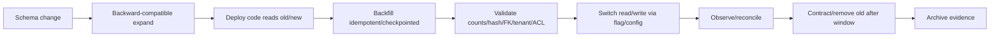

# DevOps and Deployment — Nền tảng Solar & BESS

> **Purpose:** Định nghĩa environment, source/build governance, CI/CD gates, artifact/migration/deployment/rollback, feature flags, secrets/IaC, observability, backup/DR và release checklist.
> **Scope:** Operating model toàn platform; implementation profile cho base/auth, US-001, operational foundation/core US-003, US-004 local implementation và self-hosted CI/CD EC2 test. Production thật, registry và IaC vẫn Proposed/ngoài approval hiện tại.
> **Source:** [SRS](./04-SRS.md), [Architecture](./06-solution-architecture.md), [Security](./09-security-and-permissions.md), [Test Strategy](./13-test-strategy.md), [Operational Foundation ExecPlan](../.agent/execplans/2026-07-11-operational-foundation.md), [US-004 ExecPlan](../.agent/execplans/2026-07-12-risk-issue-change-us004.md), ADR-001…ADR-010, NFR-006…010/021/023 và SEC-115…132.
> **Version:** 1.0
> **Status:** Draft toàn platform; self-hosted pipeline/historical first run, US-004 isolated CI-like pre-push gate và Swagger local production-image/Nginx smoke Implemented/Pass; current Swagger commit CI/CD release Pending; production Proposed
> **Owner:** Platform Engineering / SRE / Release Management (cá nhân: TBD)
> **Updated:** 2026-07-18
> **Approval:** Operational foundation/core US-003 EC2 test và US-004 local implementation Approved — Product Owner delegated; US-004 current deployment và production TBD/Pending — Architecture, Engineering, SRE, Security, QA và Data Owner

## 1. Delivery principles

- Build once, promote immutable signed artifact; no rebuild per environment.
- Environment config, secret and tenant deployment profile are externalized/versioned/audited.
- Every change is traceable requirement → review → commit/build → tests/scans → artifact/SBOM/provenance → deployment → evidence.
- Protected main, short-lived branches and small changes are proposed; exact branching model requires team confirmation.
- Production change uses approval appropriate to risk, separation of duties and maintenance/communication plan.
- Database/object/index/event/config migrations are first-class, backward-compatible and rehearsed.
- Rollback is tested; where data migration cannot roll back, use forward-fix/compatibility and explicit recovery.
- OT remains autonomous. Deployment cannot create reverse OT route or control credential.
- Base/auth slice có npm workspaces, Docker Compose và command kiểm chứng thực tế; không suy rộng kết quả này thành approval cho toàn platform.
- PostgreSQL 17 + Redis + BullMQ + process/container worker riêng đã materialize cho EC2 test. Mỗi feature release, gồm US-004, vẫn chỉ được ghi deployed sau khi migration/test/health/public-smoke evidence riêng của release hoàn tất; topology production chưa được chấp nhận.

## 2. Environment strategy

| Environment | Purpose | Data | External integration | Access/change |
|---|---|---|---|---|
| Local | Developer feedback/unit/component | Generated fixtures only | Fakes/emulators | Individual developer; no shared secret |
| Development | Team integration/preview | Synthetic tenant/project | Stubs or approved dev endpoints | Team; automated ephemeral where possible |
| Test/QA | Regression/API/UI/permission | Versioned multi-tenant synthetic | Connector simulators/sandbox | QA/Engineering; controlled reset |
| EC2 operational test | Failure injection cho DB/outbox/Redis/BullMQ/worker, migration và runtime smoke | Synthetic/resettable tenant data; không có dữ liệu cần giữ | Không có external/OT control integration | Product Owner delegated; reset/seed được phép |
| Integration | Provider contract/reconciliation | Synthetic/masked approved | ERP/DMS/e-sign/IdP/OT lab sandboxes | Integration owner and Security |
| Performance | Repeatable load/capacity | Generated representative volume | Simulated dependencies unless contract needed | Performance QA/SRE |
| Staging/UAT | Production-like release candidate/UAT | Synthetic or approved masked | Approved sandboxes | Restricted; production-like policy |
| Production | Live tenant workloads | Live classified data | Production contracts | Least privilege/JIT; change approval |
| DR/Recovery | Restore/failover/failback exercise | Isolated backup copy | Controlled dependencies | SRE/Security/Business owner |
| OT lab | Gateway/tag/alarm/no-control validation | Simulated telemetry/events | No production controller route | OT Owner/Security |

Environment separation covers accounts/subscriptions/projects, network, identity, keys/secrets, data, queues, buckets, search, audit and backups. Shared resource exceptions are TBD and require risk approval.

## 3. Branching and source governance

Proposed model: protected main/trunk; short-lived feature/fix branches; pull request required; no direct production branch mutation. Release tags point to immutable commit/artifact. Hotfix follows same review/tests with expedited authority; retrospective follows.

| Control | Requirement |
|---|---|
| Branch protection | Required review, status checks, signed/provenance policy TBD, no force push |
| Review | Domain + security/data/architecture owners when impacted; self-merge policy TBD |
| Commit/PR | Requirement IDs, scope, migration/config/flag/rollback/test impact |
| Generated artifacts | OpenAPI/client/migration outputs reproducible; do not edit generated code silently |
| Secret | Pre-commit/CI scan; secret removal includes rotate/revoke, not only delete text |
| Dependency | Lock/resolution file, SBOM, license/security review |
| Release tag | Annotated/signed mechanism TBD; references artifact digest and changelog |

GitHub Actions self-hosted workflow, deploy script, runner registration và historical first execution `29178873783` đã materialize/Pass cho EC2 test. Branch protection còn **Pending**; US-004 chưa có current workflow/deploy run evidence nên vẫn **Pending deployment**. Registry/signing/provenance và production CI/CD vẫn **Proposed**, không được suy rộng từ EC2 test.

## 4. CI pipeline

Sơ đồ dưới là target pipeline. Subset install/lint/type/unit/integration/OpenAPI/build và automated Docker Compose deployment đã được triển khai cho self-hosted EC2 test; SBOM/signing/provenance, scan đầy đủ và production promotion vẫn **Planned/Proposed**.

```mermaid
flowchart LR
 A[PR/Commit] --> B[Metadata/format/docs/link/ID checks]
 B --> C[Build/compile]
 C --> D[Lint + type-check]
 D --> E[Unit/property/component]
 E --> F[API/contract/integration]
 F --> G[UI/E2E/accessibility]
 G --> H[Permission/tenant/security]
 H --> I[SAST/SCA/secret/license/SBOM]
 I --> J[Container/IaC/config scan]
 J --> K[Package immutable artifact]
 K --> L[Sign/provenance/attestation]
 L --> M[Deploy non-prod]
 M --> N[Smoke/regression/performance as risk]
 N --> O[Release approval]
```

### 4.1 Required commands

| Gate | Command | Current result |
|---|---|---|
| Install | `npm ci` | Pass 2026-07-11; lockfile reproducible |
| Format/lint | `npm run lint` | Pass, zero warning |
| Type-check/compile | `npm run typecheck`; `npm run build` | Type-check API/Web/Worker Pass; build API/Web/Worker Pass, Web 1,697 modules |
| Unit/property | `npm run test:unit` | Swagger pre-commit: API 15 suites/55, Web 20 files/55, Worker 12 suites/61 = 171 Pass; prior US-004 focused closure exact-payload 4/4 |
| Integration/API | `npm run test:integration` | Swagger pre-commit exact isolated ports: API 8 suites/50 + Worker 3 suites/11 = 61 Pass; Identity/Swagger suite 9/9 gồm UI/assets/YAML |
| UI/E2E/accessibility | `npm run test:e2e` | 3/3 pass: auth 2 + Project Master create/activate/Site/party/archive 1 |
| Security scans | TBD SAST/SCA/secret/DAST/container/IaC | Not run |
| Dependency audit | `npm audit --omit=dev`; `npm audit` | 0 vulnerability reported |
| OpenAPI validation | `npm run openapi:lint` | Valid OpenAPI 3.1, zero reported problem |
| Migration dry run | `npm run migration:show`; `npm run migration:revert`; `npm run migration:run`; `npm run migration:show` | TypeORM CLI show/up/down/up pass trên PostgreSQL test |
| Artifact build/deploy | `sudo docker compose build/up` với timeout/poll | `postgres`/`api` healthy; `web` running; public health/database OK và HTTP 200; signing/SBOM TBD |
| Operational foundation | Sau implementation: lint/type/unit/integration/build, PostgreSQL+Redis disposable, worker failure injection và Compose smoke | Approved/Planned; chưa chạy `TEST-180`, `TEST-200`, `TEST-202…208`, `TEST-231` cho foundation mới |
| Core Project Controls deploy 2026-07-12 | Workspace build; migration/seed; `docker compose up -d --wait`; public root/login/health | PostgreSQL/Redis/API/worker/web healthy; HTTP 200 tại `54.255.223.131`; current isolated integration Pass, full US-003 story E2E vẫn Pending |
| US-004 pre-push close-out 2026-07-18 | lint/type/unit/integration/OpenAPI/build; migrations; isolated CI-like stack | Post-fix lint/type/unit 168/build Pass; exact-port full integration 60 Pass trước final branch hardening; backend HTTP 6/6 và Web focused 4/4/full 55 post-fix Pass; RiskChange migration 7/7; OpenAPI Pass; isolated stack 15433/16380 Pass. Actual GitHub Actions rerun/deploy/EC2/public/full E2E Pending |
| Swagger publication pre-push 2026-07-18 | lint/type/unit/integration/OpenAPI/build; production images; Nginx/public smoke | Root lint/type/build/OpenAPI Pass; unit 171; isolated full integration 61; UI/CSS/init JS/YAML HTTP 200 with CSP/no-store; commit CI/CD run Pending |

When code begins, PR cannot merge until lint, type-check, unit and required integration gates run and results are reported. A skipped gate needs reason, owner, expiry and risk decision.

### 4.2 Self-hosted EC2 test pipeline

- `.github/workflows/main-cicd.yml` chỉ nhận push `main` hoặc manual dispatch, chạy trên label dedicated `solar-bess-deploy`; không chạy pull request/fork code có Docker/deploy privilege.
- Job `CI` dùng lockfile, disposable PostgreSQL/Redis và chạy đủ command mục 4.1. Job `Deploy EC2 test` phụ thuộc CI thành công.
- `docker-compose.test.yml` parameterizes host ports. Main CI reserves isolated PostgreSQL/Redis host ports `15433/16380`, injects matching integration environment and passes `TEST_*` through privilege boundary via `sudo -n env ...`, avoiding collision with local `5433/6380` on the same self-hosted runner. Exact CI-like preflight after forward migrations Pass; actual GitHub Actions push/deploy remains Pending.
- `scripts/deploy-ec2.sh` đọc env/secret ngoài Git, khóa deploy đồng thời, giữ Compose project hiện hữu `solar_bess_web`, tag image bằng commit SHA, chờ health và smoke `/web-health` + `/health`.
- Trước rollout, image đang chạy được tag làm recovery point. Failure tự khôi phục application image; database migration không tự down và bắt buộc backward-compatible/forward-fix.
- Runner `solar-bess-ec2-test` v2.335.1 chạy systemd dưới `ec2-user`; first run `29178873783` có CI/CD Succeeded. Preflight, branch protection và recovery theo [runbook self-hosted CI/CD](./17-self-hosted-cicd-runbook.md).

### 4.3 Swagger/OpenAPI publication profile

- `SWAGGER_ENABLED` mặc định fail-closed `false` khi API chạy độc lập; Compose EC2 test truyền `true` nếu env không override. Production phải quyết định explicit và cần HTTPS cùng network/reverse-proxy access policy trước khi expose.
- API image chứa canonical `docs/openapi/openapi.yaml`; startup fail nếu file thiếu, YAML lỗi hoặc không phải OpenAPI 3.1.x có `info.title` và `paths`.
- Nginx same-origin proxy `/api/docs` tới API. Human UI ở `/api/docs/`; machine-readable contract ở `/api/docs/openapi.yaml`. CSP giữ script/connect self-only, frame deny và response no-store.
- Deploy smoke dùng bounded curl retry cho cả UI title lẫn `openapi: 3.1.0`; khi flag tắt thì bỏ qua đúng hai check này. Failure khi flag bật kích hoạt application-image rollback hiện có.
- Đây là publication của contract Draft 164 operation; 33 implemented markers mới là implementation claim. Không được diễn giải việc route Swagger healthy thành toàn bộ operation đã triển khai hoặc `TEST-014…017` Pass.

## 5. Quality and security gates

| Stage | Mandatory evidence | Blocking condition |
|---|---|---|
| PR | Review, lint/type/unit, requirement/test trace | Failed required check; secret; unauthorized scope change |
| Main build | Reproducible build, SBOM/provenance, scans | Critical/high per policy; unsigned/untraceable artifact |
| Test deploy | Migration/config/flag plan, smoke | Incompatible migration or missing rollback |
| Release candidate | Regression, permission/tenant, file, workflow, recovery/security as risk | Sev1/2; non-waivable fail |
| Production approval | UAT/sign-offs, change/communication/runbook/backup/recovery point | Unknown artifact/config; no owner/rollback; OT control path |
| Post deploy | Health/SLI/audit/business smoke and reconciliation | Safety/security/data integrity failure triggers rollback/containment |

Exact severity SLA, coverage threshold and approvers are TBD.

## 6. Artifact, container and supply chain

- Artifact identifies source commit, build ID/time, dependencies, compiler/runtime, OpenAPI/schema/config compatibility and digest.
- Generate SBOM and provenance/attestation; signing/verification mechanism TBD.
- Container, if selected, uses minimal supported base, non-root, read-only filesystem where possible, pinned digest, no embedded secret, health/readiness and resource bounds.
- Dependency/container/IaC scan results are stored with artifact; exceptions have CVE/risk/owner/expiry/compensating control.
- Registry promotion uses digest, not mutable tag.
- Third-party actions/plugins/images are pinned/reviewed; egress and credential scope limited.

## 7. Configuration and feature flags

Configuration item has tenant/environment scope, schema/version, effective date, owner, approval, audit and rollback. Workflow/rule/report/tariff/security policy is not hard-coded. Secrets are references, never config value.

Feature flags:

- default safe/off; owner, purpose, audience/tenant, created/expiry and cleanup date;
- cannot disable tenant isolation, SoD, malware fail-closed, immutable state, safety gate, audit or no-OT-command;
- evaluated server-side for authorization-sensitive behavior;
- deployment and business activation are separate;
- kill switch for connector/AI/report delivery; kill switch does not create unsafe state;
- stale flags removed through planned change.

## 8. Infrastructure as Code

All cloud/network/identity/data/observability/backup resources are declared/reviewed/versioned through IaC if platform supports. State/backend, module/provider versions, drift detection, policy-as-code and break-glass are TBD. Production console/manual change is prohibited except approved incident; reconcile to code and audit afterward.

IaC plans are environment/tenant-profile scoped and scanned for public exposure, encryption, logging, backup, least privilege, cross-environment reference and reverse OT route. Destructive plans require explicit human review and backup/recovery evidence.

## 9. Database and data migration

### 9.1 TypeORM migration workflow của base/auth MVP

Migration là source-controlled class tại `apps/api/src/database/migrations`; entity ở `apps/api/src/database/entities`; DataSource ở `apps/api/src/database/data-source.ts`. Entity metadata không được dùng `synchronize` để thay schema.

| Mục đích | Command từ repository root |
|---|---|
| Xem migration đã/chưa áp dụng | `npm run migration:show` |
| Apply toàn bộ pending migration | `npm run migration:run` |
| Revert migration gần nhất | `npm run migration:revert` |
| Generate diff từ entity metadata | `npm run migration:generate -- src/database/migrations/<MigrationName>` |
| Tạo migration rỗng để viết có kiểm soát | `npm run migration:create -- src/database/migrations/<MigrationName>` |
| Bootstrap user test sau migration | `npm run db:bootstrap` |

`migration:generate/create` chạy trong workspace API nên path là tương đối từ `apps/api`. Mỗi migration phải được review câu SQL, bổ sung `down`, chạy up/down/up trên DB test và có validation tenant/FK/unique/security trước khi deploy. Container API build TypeScript trước và dùng `migration:run:prod` với compiled DataSource; migration phải hoàn tất thành công trước khi process HTTP khởi động.

### 9.2 Encrypted environment workflow của base/auth test profile

- `CIPHER_KEY` là bootstrap root key, canonical base64 của đúng 32 random bytes; đây là ngoại lệ không thể tự mã hóa. Trước production phải inject từ AWS Secrets Manager/KMS thay vì lưu cùng ciphertext.
- DB URL/user/password, JWT access/refresh secret và bootstrap login credential bắt buộc dùng AES-256-GCM envelope `enc:v1:<iv>:<tag>:<ciphertext>`.
- `npm run env:encrypt` tạo key nếu thiếu và migrate plaintext credential hiện hữu mà không log giá trị.
- `npm run cipher:encrypt` nhận plaintext qua hidden TTY/stdin và chỉ xuất envelope.
- `npm run secrets:materialize` giải mã PostgreSQL user/password thành `/tmp/solar-bess-secrets` với directory mode `0700`, file mode `0600`; Compose mount bằng `POSTGRES_*_FILE`.
- Trình tự test deploy: `npm run secrets:materialize` rồi `docker compose up -d --build --wait`.
- API nhận ciphertext + `CIPHER_KEY`, tự giải mã trong process và fail trước HTTP startup nếu plaintext, version, key hoặc authentication tag sai.
- Password người dùng không đi qua cipher: seed/bootstrap tạo Argon2id salted hash; login dùng `argon2.verify`; raw password và hash không được log.

### 9.3 Operational foundation EC2 test profile

Profile này được Product Owner delegated approval ngày 2026-07-11 và được phép triển khai trên EC2 test; production vẫn Proposed.

| Thành phần/ID | EC2 test contract | Trạng thái |
|---|---|---|
| PostgreSQL 17 | SoR cho business state, `DB-098` audit, `DB-102…104`; business + audit + outbox commit cùng transaction | Approved/Planned |
| `DB-102 — TransactionalOutboxEvent` | Publisher claim bằng lease/`SKIP LOCKED`; BullMQ `jobId = eventId`; chỉ đánh dấu published sau enqueue thành công | Approved/Planned |
| `DB-103 — EventConsumption` | Unique tenant + consumer + event; duplicate delivery ack nhưng không chạy side effect lần hai; retry/DLQ giữ correlation | Approved/Planned |
| `DB-104 — CommandReceipt` | Scope tenant + actor/service principal + operation + key; request hash khác trả `409`; replay cùng hash trả stable result; EC2 retention 24 giờ | Approved/Planned |
| Redis + BullMQ | Redis-backed login quota dùng key HMAC/TTL và fail closed; queue có bounded concurrency, backoff, DLQ/replay | Approved/Planned |
| Worker | Process/container riêng, dùng chung code/config contract; readiness cần PostgreSQL + Redis + consumer registration; graceful drain khi shutdown | Approved/Planned |
| Tenant FK | Candidate key `(tenant_id, id)` và FK `(tenant_id, referenced_id)`; validate orphan/cross-tenant trước khi enable | Approved/Planned |
| `DB-101`, `DB-105…111` | Chỉ reserve: DB-101 ProjectSchedule; DB-105 Notification; DB-106 SavedView; DB-107 ReportJob; DB-108 AIUseCasePolicy; DB-109 AIRun; DB-110 AIProposal; DB-111 AIReview. Không tạo table/job trong foundation | Documented/Not implemented |

Runtime health contract:

- API liveness chỉ phản ánh process/event loop; readiness yêu cầu config hợp lệ, migration current, PostgreSQL và Redis bắt buộc sẵn sàng.
- Worker liveness phản ánh process; readiness yêu cầu PostgreSQL, Redis, publisher/consumer registration. Shutdown ngừng nhận job mới, drain trong timeout và requeue an toàn.
- PostgreSQL/Redis phải healthy trước worker; worker và API ready trước web/public smoke. Không publish PostgreSQL/Redis/worker health port ra Internet.
- Redis credential/URL là credential đã mã hóa theo cipher contract; runtime secret file không được log. Production KMS/Secrets Manager, Redis HA/persistence/eviction và queue retention vẫn TBD.

Migration/rollback contract:

- Migration chỉ expand: thêm candidate key/composite FK và `DB-102…104`; không sửa migration đã phát hành và không triển khai `DB-101/105…111`.
- Chạy orphan/cross-tenant probe trước `VALIDATE CONSTRAINT`; có mismatch thì dừng, không tự sửa tenant. Bắt buộc `up → down → up` và `TEST-202…208`.
- Failure injection theo `TEST-180` phải chứng minh zero lost committed event và zero duplicate side effect. `TEST-200/231` chứng minh Redis rate limit/session failure không tạo bypass.
- Nếu đã có committed outbox/receipt/consumption data, rollback ưu tiên stop publisher/worker + rollback compatible image hoặc forward-fix; không drop dữ liệu làm mất replay evidence.

- Migration has ID/version, owner, preconditions, expected duration/locks, tenant/profile scope, backup/recovery point, forward/rollback plan and validation queries.
- Financial/signed/audit/test/legal snapshot transformations retain original/evidence; no destructive rewrite.
- Large backfill is resumable, throttled, idempotent and monitored; tenant fairness considered.
- Search/cache/read model rebuild re-applies ACL and source version.
- Event schema supports old/new consumers during compatibility window; replay/DLQ plan.
- Time-series/tag migration preserves source timestamp/unit/quality and never creates control message.
- Data migration tool/engine/zero-downtime method is TBD after ADR-004/007.

### 9.4 US-004 migration/rollout profile

- Local migration chain includes `1783731000000-CreateRiskIssueControl`, `1783732000000-CreateChangeControl`, `1783733000000-GeneralizeNotifications`, `1783734000000-AddActionResidualRationale`, `1783735000000` live-schema constraint/function reconciliation and `1783736000000` existing seed role-grant/policy-v3 upgrade. Data handoff is complete; focused RiskChange migration 7/7 and exact-port full integration 60/60 Pass.
- Migration inventory/pre-push rehearsal is Complete. Actual EC2 migration application and post-deploy verification remain part of the Pending deployment evidence; committed source/provenance still forbids automatic destructive down.
- Required order: disposable migration up/down/up and full integration → CI-like isolated-port preflight → materialize secrets → migrate EC2 PostgreSQL → idempotent seed/role reconciliation → API/worker/web rollout → authenticated tenant/package/Change→REBASELINE smoke → public `/web-health` and `/health` → record release/SHA/container health.
- Application rollback order is web → worker → API. Database migrations are not automatically reverted after committed Risk/Issue/Change/baseline provenance exists; containment disables routes/worker and uses compatible image/forward-fix unless preflight proves zero source rows and safe `down`.

## 10. Deployment and rollout

Proposed strategies vary by risk:

| Strategy | Suitable | Pros | Risks/controls |
|---|---|---|---|
| Rolling | Stateless compatible app | Efficient | Mixed version compatibility required |
| Blue/green | High-risk app/config | Fast switch/rollback | Double capacity; DB migration still shared |
| Canary | Observable tenant/user slice | Detect early | Tenant fairness/data isolation/metrics |
| Tenant allowlist | New workflow/AI/integration | Controlled business activation | Config drift; explicit owner/expiry |
| Dedicated stack wave | Dedicated customers | Isolation/window | Version drift/support complexity |

Deployment sequence toàn platform: verify artifact/config/secret/schema compatibility; ensure recovery point; expand migration; deploy workers/API/UI in compatible order; smoke/tenant/permission/no-control; enable flags by cohort; monitor SLI/business/audit/reconciliation; complete or rollback.

Riêng EC2 operational foundation: PostgreSQL migration → Redis healthy → worker ready → API ready → web giữ nguyên → public smoke/failure regression. Chỉ chuyển trạng thái Planned sang Implemented khi exact migration, test và runtime evidence được ghi trong Test Strategy/ExecPlan.

## 11. Rollback and containment

Rollback decision considers application, schema/data, config, event, integration, object/index and client cache. Never roll DB destructively to older schema if new data exists without approved method.

Triggers include tenant leak, incorrect money/signature/test/COD, unsafe file release, lost/duplicate committed event, audit gap, Sev1/2, material SLO breach or any OT control path. Immediate containment may disable flag/connector/AI/share, revoke key/session, stop rollout or isolate tenant/profile. It does not send OT commands.

Rollback record includes trigger/time/decision maker/artifact/config/schema versions, affected tenant/data, reconciliation, communication and follow-up.

## 12. Secrets and privileged operations

- Managed secret/key facility; workload/service identity preferred; no shared human/service credential.
- Rotation/revoke/expiry/owner and access audit; bootstrap/key recovery tested.
- CI receives minimum short-lived environment scope; fork/untrusted PR cannot access protected secret.
- Production access is JIT/time-bound/step-up/approved and session audited.
- Break-glass has monitored account/path, reason and post-review.
- Database/object/backup/audit keys/roles separated as required; exact hierarchy TBD.

## 13. Observability, logging and alerting

| Signal | Dimensions | Alert/runbook |
|---|---|---|
| API latency/error/saturation | service/operation/API ID/tenant-safe tier | SLO burn/error owner |
| Queue/job | type/age/lag/attempt/DLQ | Stuck/retry storm/replay |
| Connector | system/direction/checkpoint/count/reconcile | Schema/mapping/auth/backlog |
| Search/index | lag/source version/ACL rebuild | Stale or permission risk |
| File | quarantine/scan latency/result/failure | Malware/timeout/unsafe attempt |
| Workflow | configuration error/SLA/decision failure | Process owner |
| Data | tenant/FK/duplicate/quality/gap | Data owner/reconciliation |
| OT ingestion | site/gateway/tag quality/gap/replay/lag | OT/Data owner; no control action |
| Backup/DR | inventory/latest success/restore time | SRE/Security/Business |
| Security | authz denial/anomaly/privilege/audit gap | Security incident playbook |

Logs use structured fields and correlation but redact secret/token/raw sensitive body/PII. Tenant support diagnostics obey scope. Retention/cost/provider/thresholds TBD.

## 14. Backup, recovery and DR

| Tier | Baseline proposal | Automation/evidence |
|---|---|---|
| Transactional critical | RPO ≤15m, RTO ≤4h | PITR/log; isolated encrypted copies; timed business/ACL validation |
| Document/signed object | RPO ≤1h, RTO ≤8h | Version/replication; manifest/hash/revision/ACL |
| Derived search/cache/report | RPO ≤24h, RTO ≤12h | Rebuild from SoR and permission tests |
| Cloud time-series | RPO ≤5m when connected, dashboard RTO ≤8h | Edge store-forward, partition restore, gap/duplicate test |

These are assumptions, not commitments. Final target, cadence, region/account, retention and exercise owner are TBD. Restore drill validates no duplicate payment/approval/event and OT continues independently.

## 15. Release checklist

### Before release

- Approved scope/trace/changelog and owner; no unrecorded scope change.
- Artifact digest/signature/SBOM/provenance; required scans/tests passed.
- Config/flag/secret/migration/backup/rollback/runbook reviewed.
- UAT/QA/Security/Data/SRE/Process sign-offs according to risk.
- No Sev1/2 or non-waivable failure; exception register current.
- Tenant/permission/file/financial/workflow/audit/no-OT-control evidence.
- Capacity/SLO/RPO/RTO targets either approved/evidenced or explicit production blocker.
- Communication/support/on-call/maintenance and status page plan.

### During release

- Change record and war room/owner; deploy by approved cohort.
- Migration/reconciliation progress; SLI/business/security/audit monitoring.
- Stop conditions and rollback authority active.

### After release

- Smoke by representative roles/tenants; payment/document/workflow/file/OT read checks.
- Confirm audit/event/notification/index/connector/reconciliation.
- Observe agreed window; close change or rollback.
- Record outcome, incidents, metrics, follow-up owner/due; remove temporary access/flags.

## 16. Disaster and incident coordination

Security incident response owns containment/evidence; SRE owns service recovery; Business Owner validates domain correctness; Legal/Privacy manages notification obligations; OT Owner handles site/OT independently. Ransomware/leak/connector/telemetry/backup/AI playbooks and communication tree are TBD. Cloud recovery never changes OT control state.

## 17. Assumptions

| Assumption | Owner | Impact |
|---|---|---|
| Protected main + short-lived branch model fits team | Engineering/Delivery | Branching |
| Build once/promote immutable artifact | Platform/Security | Pipeline |
| Docker Compose là profile được phê duyệt cho base/test; IaC/production platform còn TBD | Architecture | Production commands |
| Logical environments above will exist | Product/IT/Finance | Cost/schedule |
| Backward-compatible expand/migrate/contract is feasible | Data/Engineering | Deployment |
| Baseline RPO/RTO are proposals | Business/SRE | DR gate |
| Base/auth test deployment dùng dữ liệu synthetic và HTTP tạm thời | Engineering/Security | Không đủ điều kiện production thật |
| EC2 operational foundation có thể reset/seed synthetic DB; Redis/queue không chứa dữ liệu production | Product Owner/Platform | Cho phép migration/failure rehearsal, không suy rộng retention/HA |
| OT lab has no production control route | OT/Security | Integration test |

## 18. Open Questions

| Open Question | Owner | Blocks |
|---|---|---|
| Repository host, branch policy, review count and signing? | Engineering/Security | Source governance |
| Frontend/backend/runtime/package manager đã chốt trong `tech-stack.md`; CI hosted và version-upgrade policy? | Architecture/Engineering | CI production |
| CI/CD/IaC/registry/deployment platform? | Platform/Architecture | Pipeline |
| Environment/accounts/regions/residency/dedicated profiles? | IT/Legal/Security | Topology |
| Coverage/scan/severity/patch thresholds? | QA/Security | Gates |
| Database migration/backup tools and availability? | Data/SRE | Release |
| Rollout strategy and tenant cohort policy? | Product/SRE | Production |
| SLO/RPO/RTO/retention/capacity targets? | PO/SRE/Legal | Readiness |
| On-call/support/change approval/RACI? | Operations/Product | Operations |
| OT lab/gateway/certificate/network validation? | OT Owner | OT release |
| Cost ceiling/team skills/managed vs self-hosted choices? | Finance/Engineering | Technology |
| Disaster/incident exercise cadence and notification policy? | Security/BCM/Legal | Compliance |
| Production Redis HA/persistence/eviction, BullMQ retention/concurrency/capacity và worker scaling? | SRE/Architecture/Security | Production acceptance; không chặn EC2 test |
| Current US-004 GitHub self-hosted run/deploy and branch protection? Registry, SBOM/signing/provenance and IaC production rollout? | Platform/Security | Historical runner/first run and current isolated CI-like preflight Pass; actual US-004 GitHub Actions/EC2 deploy/public smoke and branch protection Pending; production supply chain Planned |

## 19. Changelog

| Version | Date | Author | Change | Scope impact |
|---|---|---|---|---|
| 0.1 | 2026-07-11 | Codex | Tạo DevOps/deployment operating model and release gates | No code/pipeline created; commands and tools remain TBD |
| 0.2 | 2026-07-11 | Codex | Ghi profile npm/Docker Compose/PostgreSQL, command và kết quả base/auth EC2 test | Auth slice implemented; production/CI/IaC vẫn chưa duyệt |
| 0.3 | 2026-07-11 | Codex | Chuẩn hóa TypeORM CLI workflow và DDD base/auth validation evidence | Không đổi schema/API/phạm vi nghiệp vụ |
| 0.4 | 2026-07-11 | Codex | Chuyển migration/entity về src/database và thêm encrypted-env/runtime secret workflow | Không đổi schema/API; production key management vẫn TBD |
| 0.5 | 2026-07-11 | Codex | Ghi US-001 migration rollback, no-cache image verification, E2E fixture cleanup và EC2 public rollout | Test deployment Implemented; HTTPS/CI/IaC/SBOM production vẫn TBD |
| 0.6 | 2026-07-11 | Codex | Chốt operational foundation PostgreSQL/Redis/BullMQ/worker, DB-102…104, composite tenant FK và runtime rollout cho EC2 test | Approved/Planned; DB-101/105…111 chỉ reserve; production/hosted CI vẫn Proposed/Planned |
| 0.7 | 2026-07-12 | Codex | Ghi Redis/worker/outbox + core US-003 Compose deployment, health/public smoke và Nest 11 literal-colon route fix | EC2 test Implemented/deployed; production/hosted CI/HTTPS vẫn Proposed |
| 0.8 | 2026-07-12 | Codex | Thêm main self-hosted CI/CD, SHA image, serialized rollout, health/smoke/rollback và runner runbook | Repository implementation cho EC2 test; runner registration/first GitHub run Pending; production vẫn Proposed |
| 0.9 | 2026-07-18 | Codex | Ghi US-004 completed local gate/migration/rollout boundary; parameterize ports, isolate CI PostgreSQL/Redis 15433/16380 và preserve `TEST_*` qua `sudo -n env` | Không đổi deployment scope; pre-push gate Pass, actual GitHub Actions/EC2 deploy/public smoke/full E2E Pending, production Proposed |
| 1.0 | 2026-07-18 | Codex | Thêm canonical Swagger/OpenAPI runtime publication, env gate, Nginx proxy, image asset và deploy smoke | Không đổi business/API operation scope; local TEST-197 Pass, commit deploy/public smoke Pending tại thời điểm ghi |
