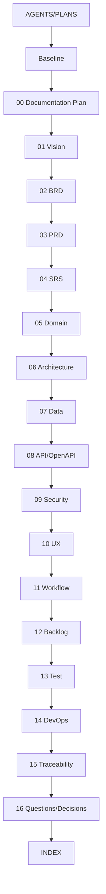

# Documentation Index — Solar & BESS Project Management Platform

> **Purpose:** Mục lục, thứ tự đọc, dependency, trạng thái, phiên bản và reviewer của toàn bộ bộ tài liệu phát triển phần mềm.
> **Scope:** Governance, baseline, docs/00…16, OpenAPI và changelog; gồm base/auth, US-001, operational foundation/core US-003 đã deploy EC2 test và US-004 Approved/Build-ready; full story validation còn tiếp tục.
> **Source:** [AGENTS.md](../AGENTS.md), [Documentation Plan](./00-documentation-plan.md), [Program ExecPlan](../.agent/execplans/2026-07-11-platform-delivery-program.md), [Operational ExecPlan](../.agent/execplans/2026-07-11-operational-foundation.md), [US-003 ExecPlan](../.agent/execplans/2026-07-11-project-controls-us003.md), [US-004 ExecPlan](../.agent/execplans/2026-07-12-risk-issue-change-us004.md).
> **Version:** 1.1
> **Status:** Draft
> **Owner:** Product Operations / Documentation Owner (cá nhân: TBD)
> **Updated:** 2026-07-12
> **Approval:** Operational foundation EC2 test và US-003/US-004 contract Approved — Product Owner delegated 2026-07-11/12; toàn platform/production vẫn TBD theo artefact owner

## 1. Status legend

| Status | Meaning |
|---|---|
| Source baseline | Immutable input; approval interpretation still Open Question |
| Draft | Complete draft structure/content, not owner-approved |
| Proposed | Architecture decision requiring evidence/owner acceptance |
| Living | Updated whenever scope/decision/release changes |
| Machine-readable Draft | Structurally generated contract; domain/tool validation/approval pending |

## 2. Recommended reading order

| Order | Document | Purpose | Status | Version/date | Depends on | Reviewers |
|---:|---|---|---|---|---|---|
| 0 | [AGENTS.md](../AGENTS.md) | Repository development/document governance | Active governance | 2026-07-11 | User instruction | All contributors |
| 1 | [Baseline feature proposal](./Đề%20xuất%20tính%20năng%20nền%20tảng%20Solar%20và%20BESS.md) | Immutable original business/product input | Source baseline | 1.0 / 2026-07-11 | Prototype/business research | PO, PMO, all domain owners |
| 2 | [00 — Documentation Plan](./00-documentation-plan.md) | Artefact plan, dependency, SSoT and DoD | Draft | 0.1 / 2026-07-11 | AGENTS/baseline | PO, BA, Architecture, QA |
| 3 | [01 — Product Vision and Scope](./01-product-vision-and-scope.md) | Vision, users, value, scope, PM/O&M/OT boundary | Draft | 0.1 / 2026-07-11 | 00/baseline | PO, PMO, Commercial, OT |
| 4 | [02 — BRD](./02-BRD.md) | Business context, stakeholders, rules, 40 BR | Draft | 0.1 / 2026-07-11 | 01/baseline | PO, process owners |
| 5 | [03 — PRD](./03-PRD.md) | 198 FR, 24 NFR, 37 UC, release and analytics | Draft | 0.1 / 2026-07-11 | 01/02 | Product, UX, Architecture, QA |
| 6 | [04 — SRS](./04-SRS.md) | Implementable behavior, validation/state/error/NFR scenarios | Draft; US-004 behavior Approved/Build-ready | 0.2 / 2026-07-12 | 03 | Architecture, Engineering, QA |
| 7 | [05 — Domain Model](./05-domain-model.md) | Bounded contexts, aggregates, invariants/events/SoR | Draft; auth Implemented; US-004 contract Approved/Build-ready | 0.4 / 2026-07-12 | 02–04 | Domain/Architecture/Data owners |
| 8 | [06 — Solution Architecture](./06-solution-architecture.md) | Context/container/component/deployment, flows and 10 ADR | Draft; operational/core US-003 deployed; US-004 boundary Approved | 0.7 / 2026-07-12 | 04/05 | Architecture Board, SRE, Security, OT |
| 9 | [07 — Data Model](./07-data-model.md) | ERD/data dictionary DB-001…112 | Draft; DB-101…105 Implemented; DB-112 US-004 Approved/Build-ready | 0.8 / 2026-07-12 | 04–06 | Data, Domain, Security, Finance |
| 10 | [08 — API Specification](./08-api-specification.md) | API conventions and 159-operation catalog | Draft; core US-003 implemented; API-038/143…159 US-004 planned | 0.8 / 2026-07-12 | 04–07 | API/Domain/Security/Integration/QA |
| 11 | [OpenAPI 3.1](./openapi/openapi.yaml) | Machine-readable API contract with 159 x-api-id | Machine-readable Draft; concrete US-004 contracts planned | 0.7.0 / 2026-07-12 | 08 | API tooling/QA/consumers |
| 12 | [09 — Security and Permissions](./09-security-and-permissions.md) | Threat model, 32 SEC and permission matrix | Draft; core US-003 implemented; US-004 policy Approved/Build-ready | 0.8 / 2026-07-12 | 04/06–08 | Security, Legal, IAM, OT |
| 13 | [10 — UX Information Architecture](./10-ux-information-architecture.md) | Sitemap/wireframes, flows/states/responsive/a11y | Draft; Schedule implemented; US-004 UX Approved/Build-ready | 0.4 / 2026-07-12 | 03/04/09 | UX, Product, functional users |
| 14 | [11 — Workflows and State Machines](./11-workflows-and-state-machines.md) | 26 formal workflows/Mermaid and approval rules | Draft; WF-003 core Implemented; WF-015/021 US-004 Approved | 0.7 / 2026-07-12 | 02–05/09 | Process owners, Internal Control |
| 15 | [12 — Product Backlog](./12-product-backlog.md) | 37 US, 177 AC, DoR/DoD and phase split | Draft; US-003 core In Progress; US-004 Approved/Build-ready | 0.7 / 2026-07-12 | 02–11 | PO, Delivery, Engineering, QA |
| 16 | [13 — Test Strategy](./13-test-strategy.md) | Test levels and 233 TEST scenarios | Draft; core US-003 partial evidence; US-004 verification Approved/Planned | 1.3 / 2026-07-12 | 04/08–12 | QA, Security, SRE, OT, business |
| 17 | [14 — DevOps and Deployment](./14-devops-and-deployment.md) | Environments, CI/CD, rollout/recovery/release | Draft; base/US-001/operational/core US-003 deployed EC2 test | 0.7 / 2026-07-12 | 06/09/13 | Platform, SRE, Security, QA |
| 18 | [15 — Traceability Matrix](./15-traceability-matrix.md) | End-to-end chain, gap and contradiction audit | Draft; core US-003 implemented; US-004 exact trace Approved | 0.9 / 2026-07-12 | 01–14 | PO, BA, QA, Architecture |
| 19 | [16 — Open Questions and Decisions](./16-open-questions-and-decisions.md) | Consolidated assumptions/questions/decisions/risks/data needs | Draft/Living; US-004 decisions/dependencies explicit | 0.6 / 2026-07-12 | 00–15 | All decision owners |
| 20 | [CHANGELOG](./CHANGELOG.md) | Repository documentation and scope history | Living | 2026-07-11 | Every change | PO, Documentation Owner |

## 3. Dependency graph

The sequence reflects creation/read order, not a one-way design rule. Downstream findings require reconciliation back to canonical owner and changelog.

## 4. Role-specific paths

| Reader | Minimum path |
|---|---|
| Product Owner/Steering | 01 → 02 → 03 → 12 → 15 → 16 |
| PMO/Project Manager | 01 → 02 → 03 → 10 → 11 → 12 |
| Domain/Business Owner | 02 → 03 → 05 → 11 → 12 → 13 → 16 |
| UX/Product Design | 01 → 03 → 09 → 10 → 11 → 12 |
| Architecture/Engineering | 03 → 04 → 05 → 06 → 07 → 08/OpenAPI → 09 → 14 |
| Data/Integration | 05 → 06 → 07 → 08 → 09 → 13 → 16 |
| Security/IAM/OT Security | 01 boundary → 04 → 06 → 08/OpenAPI → 09 → 13 → 14 |
| QA/UAT | 02 → 03 → 04 → 09 → 11 → 12 → 13 → 15 |
| Solar/BESS Engineering | 02/03 specialist sections → 05 → 07 → 10/11 → 13 → 16 |
| Legal/Finance/Procurement/HSE/O&M | 02/03 domain → 05 → 07/09 → 10/11 → 12/13 → 16 |
| SRE/Operations | 04 NFR → 06 → 09 → 13 → 14 → 16 |

## 5. Artefact ownership

Canonical owner rules are defined in [00-documentation-plan.md](./00-documentation-plan.md#8-quy-tắc-nguồn-sự-thật). In summary: Vision owns scope; BRD owns BR/rules; PRD owns FR/NFR/UC; SRS owns behavior; Domain owns invariants; Architecture owns ADR/topology; Data owns DB; API/OpenAPI owns operations; Security owns SEC; Workflow owns WF; Backlog owns US/AC; Test owns TEST; Trace owns coverage; 16 owns consolidated unresolved decisions; CHANGELOG owns history.

## 6. Current readiness snapshot

| Dimension | Current state |
|---|---|
| Required files | 19/19 required artefacts created; repository audit passed |
| Requirement catalogs | Exact planned counts created |
| Baseline preservation | SHA-256 unchanged: 51DBAD85FFC548AB9D95743551DE6BE745EA2723B3F237054B9C793B3A8CF55C |
| Relative links/anchors | 0 broken relative file links and 0 broken anchors in final audit |
| OpenAPI | 3.1.0, target 159 unique x-api-id/operationId including API-143…159; Redocly validation required at US-004 M0 exit |
| Business/technical approval | Base/auth, US-001, operational foundation và core US-003 đã triển khai EC2 test; US-004 Approved/Build-ready; full story/production/các domain khác vẫn theo gate từng slice |
| Technology/vendor decisions | ADR-001/002/004/006 Accepted cho EC2 test profile, vẫn Proposed production; ADR còn lại Proposed |
| Production code/toolchain | Base/auth + US-001 + operational foundation + core US-003 Implemented cho EC2 test; US-004 chưa implementation tại M0; production profile chưa được chấp thuận |
| Build/lint/type/test execution | Ngày 2026-07-12: workspace build pass; API unit 47/47; Web unit 32/32; Worker unit 21/21; API/Web/Worker lint/type và OpenAPI pass; prior worker integration 4/4/Project Master 9/9. Final US-003 PostgreSQL integration/Playwright rerun pending. |
| Build-ready | US-004 canonical contract sẵn sàng sau OpenAPI/link/trace M0 validation; positive rebaseline thuộc US-004 M2; toàn platform/production: Not yet |

## 7. Assumptions

| Assumption | Owner | Impact |
|---|---|---|
| All listed artefacts remain in docs and relative links stable | Documentation Owner | Navigation |
| Draft v0.1 date is 2026-07-11 | Product Owner | Versioning |
| Baseline remains immutable source | Product Owner | Trace |
| INDEX is updated whenever file/status/version changes | Documentation Owner | Discoverability |
| Approval workflow will move status from Draft | Product Owner | Readiness |

## 8. Open Questions

| Open Question | Owner | Impact |
|---|---|---|
| Who is named owner/reviewer/approver for each artefact? | Product Owner | Approval |
| Which artefacts require formal signature versus review record? | Governance/Legal | Status |
| Where will documentation/backlog/ADR be operationally published? | Delivery/IT | Workflow |
| What versioning/release cadence applies after v0.1? | Product/Architecture | Change control |
| Should generated OpenAPI/client docs have a separate publication pipeline? | API/DevOps | Distribution |
| When are Open Questions/ADRs sufficiently closed to allow production code? | PO/Architecture/Security/QA | Build gate |

## 9. Changelog

| Version | Date | Author | Change | Scope impact |
|---|---|---|---|---|
| 0.1 | 2026-07-11 | Codex | Create full documentation index/read order/dependency/reviewer map | No business scope change |
| 0.2 | 2026-07-11 | Codex | Ghi nhận DDD/TypeORM CLI implementation profile cho base/auth | Không thay đổi phạm vi nghiệp vụ |
| 0.3 | 2026-07-11 | Codex | Ghi Nest/database/encrypted-env profile và validation status chính xác | Không thay đổi phạm vi nghiệp vụ |
| 0.4 | 2026-07-11 | Codex | Ghi frontend scalable structure và local validation/bundle evidence | Không thay đổi phạm vi nghiệp vụ |
| 0.5 | 2026-07-11 | Codex | Ghi approval/decision-complete state cho US-001 Project Master | Cho phép production implementation riêng US-001 |
| 0.6 | 2026-07-11 | Codex | Ghi US-001 implementation/test/public deployment hoàn tất | Không thay trạng thái story còn lại |
| 0.7 | 2026-07-11 | Codex | Đồng bộ operational foundation, DB-101…111 ownership và dependency-ordered delivery program | EC2 test Approved/Planned; production và reserved slice không bị đánh dấu Implemented |
| 0.8 | 2026-07-12 | Codex | Đồng bộ US-003 canonical gate, API-140/OpenAPI 140 operations và bằng chứng operational verification đang có | US-003 Approved/Build-ready; chưa tuyên bố Implemented/Pass |
| 0.9 | 2026-07-12 | Codex | Ghi core US-003/operational deployment, API-141 và exact validation evidence | Core Implemented/deployed EC2 test; không claim full US-003 Pass |
| 1.0 | 2026-07-12 | Codex | Đồng bộ API-142, Dashboard alert lane, exact unit counts và trạng thái M3 local/deploy | Không đổi phạm vi; latest M3 image và full runtime evidence vẫn pending |
| 1.1 | 2026-07-12 | Codex | Đồng bộ US-004 SRS/domain/architecture/data/API/security/UX/workflow/backlog/test/trace/decision và 159 API/112 DB IDs | Build-ready EC2 test; không claim US-004/Claim implementation hoặc test Pass |
