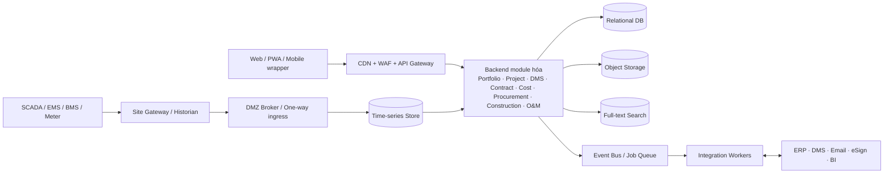
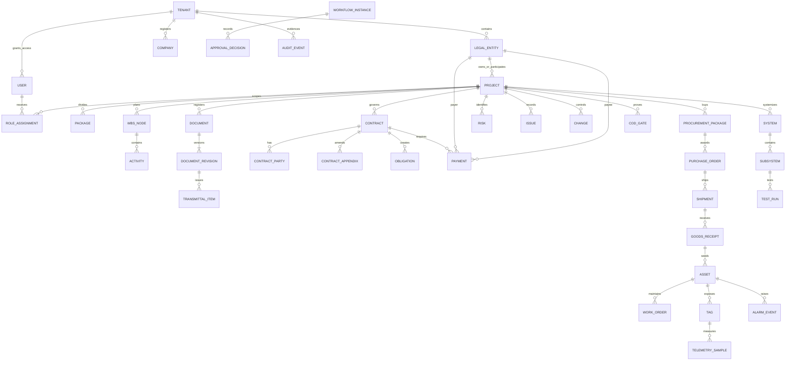

# Đề xuất tính năng nền tảng quản lý dự án Solar & BESS

> **Trạng thái:** Bản đề xuất sản phẩm nền tảng  
> **Phiên bản:** 1.0  
> **Ngày cập nhật:** 11/07/2026  
> **Ngôn ngữ:** Tiếng Việt; tiếng Anh là ngôn ngữ thứ hai của sản phẩm  
> **Thị trường mặc định:** Việt Nam  
> **Đối tượng đọc:** Ban Giám đốc, Product Manager, Project Manager, Engineering, Procurement, Finance, Legal, Construction, QA/QC, HSE, Commissioning, O&M, IT/OT, đối tác triển khai  
> **Mục đích sử dụng:** Đầu vào chung cho BRD, PRD, kiến trúc giải pháp, backlog, prototype và kế hoạch triển khai

## Quy ước tài liệu

### Cách đọc phạm vi

| Nhãn | Ý nghĩa |
|---|---|
| **Dùng chung** | Áp dụng cho cả dự án Solar, BESS và dự án hybrid Solar + BESS. |
| **Solar** | Nghiệp vụ hoặc dữ liệu chuyên biệt cho điện mặt trời áp mái/mặt đất. |
| **BESS** | Nghiệp vụ hoặc dữ liệu chuyên biệt cho hệ thống lưu trữ năng lượng. |
| **PM** | Quản lý vòng đời dự án: phạm vi, tiến độ, chi phí, hợp đồng, tài liệu, mua sắm, thi công, chất lượng, an toàn, nghiệm thu và COD. |
| **O&M** | Giám sát vận hành và bảo trì sau bàn giao: telemetry, alarm, hiệu suất, work order, SLA, bảo hành và doanh thu vận hành. |
| **PM + O&M** | Dữ liệu được bàn giao qua ranh giới COD và tiếp tục được sử dụng ở cả hai miền. |

### Mã tính năng

- Mã có cấu trúc **NHÓM-NNN**, ổn định xuyên suốt BRD, PRD, backlog và kiểm thử.
- Các nhóm chính: OPP–Cơ hội; PFM–Portfolio/điều hành; PRJ–Dự án/công việc; DOC–Tài liệu; CTR–Hợp đồng/pháp lý; ENG–Thiết kế; CST–Chi phí; PRC–Mua sắm; LOG–Logistics; CON–Thi công; HSE–An toàn; QAC–Chất lượng; RSK–Rủi ro/vấn đề/thay đổi; COM–Commissioning/COD; OMM–Vận hành/bảo trì; SOL–Solar; BES–BESS; WFL–Workflow; IAM–Định danh/quyền/audit; INT–Tích hợp; AIX–AI.
- Một dòng trong danh mục có thể chứa các thao tác con gắn kết chặt chẽ, nhưng phải có một chủ sở hữu nghiệp vụ, một đầu ra kiểm chứng được và một mã duy nhất.

### Ưu tiên và roadmap

| Ký hiệu | Diễn giải |
|---|---|
| **Must** | Bắt buộc để MVP dùng được hằng ngày hoặc để đáp ứng an toàn, bảo mật, toàn vẹn dữ liệu. |
| **Should** | Giá trị cao, triển khai ngay sau nền tảng nếu không chặn MVP. |
| **Could** | Hữu ích nhưng có thể dùng quy trình thủ công/tích hợp ngoài trong ngắn hạn. |
| **Future** | Phụ thuộc dữ liệu vận hành, mô hình AI, tích hợp sâu hoặc độ trưởng thành quy trình. |
| **R1** | Nền tảng quản lý dự án. |
| **R2** | Mua sắm, chi phí và thi công. |
| **R3** | Commissioning và COD. |
| **R4** | O&M và dữ liệu thiết bị. |
| **R5** | AI và tối ưu vận hành. |

### Giả định dùng trong Phần A–C

1. Nền tảng phục vụ tối đa khoảng 500 dự án hoạt động trên mỗi tenant; dữ liệu time-series được tách khỏi tải giao dịch PM.
2. VND là tiền tệ mặc định và USD được hỗ trợ. Mọi phép cộng tiền chỉ thực hiện trong cùng currency hoặc sau khi quy đổi bằng tỷ giá có ngày hiệu lực và snapshot.
3. Mỗi pháp nhân, đại diện và người ký có ID ổn định; hồ sơ đã ký lưu snapshot tên, chức danh, ủy quyền và thông tin pháp lý tại thời điểm ký.
4. Hợp đồng là module độc lập. Một hợp đồng có nhiều phụ lục; số hợp đồng là duy nhất trong một dự án; vai trò công ty lấy từ danh mục chuẩn.
5. Payment là bản ghi độc lập và bắt buộc có contractId. Payer xác định payee; sơ đồ dòng tiền luôn thể hiện chiều payer → payee.
6. Nhập hoặc đồng bộ tài liệu ngoài hệ thống chỉ chạy khi người dùng/quản trị viên bật rõ ràng; hệ thống không tự quét thư mục.
7. Web quản lý dự án chỉ đọc dữ liệu OT. Không có API hoặc nút thao tác trực tiếp lên PCS, BMS, EMS hay E-Stop.

## Mục lục

- [Phần A — Tóm tắt sản phẩm](#phần-a--tóm-tắt-sản-phẩm)
- [Phần B — Danh sách module](#phần-b--danh-sách-module)
- [Phần C — Danh sách tính năng chi tiết](#phần-c--danh-sách-tính-năng-chi-tiết)
  - [C.1 Danh mục tính năng theo vòng đời](#c1-danh-mục-tính-năng-theo-vòng-đời)
  - [C.2 Năng lực dùng chung](#c2-năng-lực-dùng-chung)
  - [C.3 PM Command Center và Project Health Score](#c3-pm-command-center-và-project-health-score)
  - [C.4 Quyền hạn và kiểm soát xung đột lợi ích](#c4-quyền-hạn-và-kiểm-soát-xung-đột-lợi-ích)
  - [C.5 Workflow phê duyệt](#c5-workflow-phê-duyệt)
  - [C.6 Document Management System](#c6-document-management-system)
  - [C.7 Dashboard và báo cáo](#c7-dashboard-và-báo-cáo)
  - [C.8 Ma trận bao phủ yêu cầu](#c8-ma-trận-bao-phủ-yêu-cầu-và-điểm-nối-tài-liệu)
  - [C.9 Tích hợp hệ thống](#c9-tích-hợp-hệ-thống-và-quản-trị-đồng-bộ-dữ-liệu)
  - [C.10 Tính năng AI](#c10-tính-năng-ai-có-kiểm-soát)
  - [C.11 UX/UI và wireframe](#c11-uxui-và-wireframe-bằng-chữ)
  - [C.12 Kiến trúc và bảo mật](#c12-kiến-trúc-dữ-liệu-time-series-bảo-mật-và-liên-tục-dịch-vụ)
- [Phần D — Quy trình nghiệp vụ](#phần-d--quy-trình-nghiệp-vụ)
- [Phần E — User stories](#phần-e--user-stories)
- [Phần F — MVP](#phần-f--mvp)
- [Phần G — Roadmap triển khai](#phần-g--roadmap-triển-khai)
- [Phần H — Rủi ro triển khai](#phần-h--rủi-ro-triển-khai)
- [Phần I — Đề xuất ưu tiên cuối cùng](#phần-i--đề-xuất-ưu-tiên-cuối-cùng)
- [Phụ lục 1 — Thuật ngữ](#phụ-lục-1--thuật-ngữ)
- [Phụ lục 2 — Mô hình dữ liệu khái niệm](#phụ-lục-2--mô-hình-dữ-liệu-khái-niệm)
- [Phụ lục 3 — Chuẩn trạng thái](#phụ-lục-3--chuẩn-trạng-thái-và-chuyển-trạng-thái)
- [Phụ lục 4 — Ma trận truy vết](#phụ-lục-4--ma-trận-truy-vết-yêu-cầu-nguồn)
- [Phụ lục 5 — Ví dụ kiểm chứng](#phụ-lục-5--ví-dụ-kiểm-chứng-công-thức-và-ràng-buộc)
- [Phụ lục 6 — Nguồn pháp lý và kỹ thuật](#phụ-lục-6--baseline-nguồn-pháp-lý-và-kỹ-thuật)

---

# Phần A — Tóm tắt sản phẩm

## A.1 Vấn đề cần giải quyết

Doanh nghiệp Solar & BESS thường quản lý một dự án qua nhiều file Excel, email, nhóm chat và thư mục dùng chung. Mỗi phòng ban có một danh sách riêng nên không có một nguồn dữ liệu thống nhất để trả lời các câu hỏi quan trọng: dự án đang chậm ở đâu, ai chịu trách nhiệm, thiết bị nào ảnh hưởng đường găng, cam kết chi phí đã vượt ngân sách chưa, nghĩa vụ nào sắp quá hạn, hồ sơ nào còn thiếu để đạt COD và rủi ro nào cần Ban Giám đốc quyết định.

Sự phân mảnh đặc biệt nghiêm trọng khi một doanh nghiệp đồng thời đóng nhiều vai trò — phát triển dự án, chủ đầu tư, EPC, cho thuê thiết bị, ESCO/PPA và O&M — trên nhiều pháp nhân, nhà máy, nhà thầu và nhà cung cấp. Nếu dữ liệu hợp đồng, tiến độ, thanh toán, tài liệu và nghiệm thu không liên kết, dự báo COD và dòng tiền thiếu tin cậy, trách nhiệm giữa các bên không rõ, còn lịch sử phê duyệt khó kiểm toán.

Nền tảng cần giải quyết bốn lớp vấn đề:

1. **Điều hành:** tạo một nguồn sự thật cho portfolio và từng dự án; ưu tiên ngoại lệ thay vì yêu cầu PM tổng hợp báo cáo thủ công.
2. **Thực thi EPC:** chuẩn hóa workflow từ cơ hội, hợp đồng, thiết kế, mua sắm, thi công đến commissioning/COD.
3. **Kiểm soát doanh nghiệp:** bảo đảm phân quyền theo dữ liệu, tách nhiệm vụ, audit, quản lý phiên bản và truy vết quyết định.
4. **Liên tục sau COD:** bàn giao tài sản, cấu trúc thiết bị, hồ sơ, bảo hành và baseline sang O&M mà không biến hệ thống PM thành một nền tảng điều khiển OT.

## A.2 Đối tượng sử dụng

| Nhóm người dùng | Nhu cầu chính | Chế độ nhìn mặc định |
|---|---|---|
| Ban Giám đốc/Hội đồng đầu tư | Sức khỏe portfolio, vốn, dòng tiền, COD forecast, rủi ro cần quyết định | Tổng hợp nhiều dự án, drill-down theo ngoại lệ |
| Project Manager/Project Controls | Đường găng, action hôm nay, approval, chi phí, rủi ro, COD readiness | PM Command Center của dự án |
| Kỹ sư thiết kế/Design Manager | Deliverable, revision, comment, RFI/TQ, BOM, IFC/As-built | Design register theo discipline |
| Mua hàng/Supply Chain | RFQ, đánh giá, PO, FAT, giao hàng và đường găng vật tư | Procurement tracker |
| Tài chính/Kế toán | Ngân sách, commitment, payment, VAT, dòng tiền, đối soát | Cost dashboard theo currency/pháp nhân |
| Pháp chế/Contract Manager | Hợp đồng, phụ lục, bảo lãnh, nghĩa vụ, điều kiện tiên quyết, claim | Contract obligation dashboard |
| Construction/Site Manager | Kế hoạch ngắn hạn, khối lượng, nhân lực, vật tư, nhật ký, ảnh | Construction dashboard/PWA |
| HSE | PTW, inspection, toolbox, incident, near miss và corrective action | HSE dashboard |
| QA/QC | ITP, inspection, NCR, punch và hồ sơ nghiệm thu | Quality dashboard |
| Commissioning Manager | System/subsystem, test pack, defect, COD condition và handover | Commissioning/COD readiness |
| O&M | Alarm, work order, PM plan, KPI thiết bị, SLA, bảo hành | O&M dashboard |
| Chủ đầu tư/Khách hàng/Nhà tài trợ | Tiến độ, nghiệm thu, sản lượng, nghĩa vụ và báo cáo được chia sẻ | Portal giới hạn theo dự án/hợp đồng |
| Nhà thầu phụ/Nhà cung cấp | Gói thầu, submittal, PO, giao hàng, RFI, nghiệm thu thuộc phạm vi | Workspace giới hạn theo package |
| Quản trị tenant/IT/OT | Người dùng, policy, tích hợp, audit, sức khỏe hệ thống | Administration/Security console |

## A.3 Giá trị cốt lõi

- **Một nguồn dữ liệu có kiểm soát:** mỗi đối tượng có ID, trạng thái, chủ sở hữu, lịch sử, liên kết và quyền truy cập rõ ràng.
- **Điều hành theo ngoại lệ:** PM Command Center và Project Health Score ưu tiên việc phải xử lý hôm nay, không thay thế phán đoán chuyên môn bằng một con số “đen hộp”.
- **Truy vết từ quyết định đến tác động:** thay đổi thiết kế liên kết revision, BOM, PO, tiến độ, chi phí, claim và điều kiện COD.
- **EPC chuyên ngành:** danh mục và test pack nhận biết cấu trúc Solar/BESS, không chỉ là công cụ task/document chung.
- **Kiểm soát tài chính–hợp đồng:** commitment, payment, phụ lục, nghĩa vụ, bảo lãnh và cashflow dùng cùng mô hình pháp nhân/payer/payee.
- **Field-first:** PWA hỗ trợ nhật ký, ảnh, checklist, NCR, punch và xác nhận tại hiện trường với hàng đợi offline.
- **Bàn giao số sang O&M:** asset, serial, warranty, hồ sơ, baseline và tài khoản giám sát được chuyển giao có biên bản.

## A.4 Phạm vi sản phẩm và bảy giai đoạn vòng đời

| Giai đoạn | Kết quả kinh doanh cần tạo ra | Gate kết thúc điển hình | Miền |
|---|---|---|---|
| 1. Phát triển cơ hội và tiền khả thi | Phương án Solar/BESS có cơ sở kỹ thuật, tài chính và rủi ro | Investment/Go-No-Go approved | PM |
| 2. Hợp đồng và pháp lý | Hợp đồng có hiệu lực, nghĩa vụ/điều kiện tiên quyết/giấy phép có chủ sở hữu | Notice to Proceed/Contract Effective | PM |
| 3. Thiết kế kỹ thuật | Bộ hồ sơ được duyệt/IFC, BOM và interface được kiểm soát | Design Freeze/IFC released | PM |
| 4. Mua sắm và logistics | Nhà cung cấp/PO được duyệt, thiết bị đạt FAT và đến công trường đúng yêu cầu | Materials Available/Released for Installation | PM |
| 5. Thi công | Khối lượng hoàn thành an toàn, đúng chất lượng và có hồ sơ | Mechanical Completion | PM |
| 6. Kiểm tra, nghiệm thu và COD | Test đạt, punch/điều kiện COD được đóng, tài sản và hồ sơ được bàn giao | COD/Handover accepted | PM + O&M |
| 7. Vận hành và bảo trì | Hệ thống đạt availability/performance/SLA, sự cố được xử lý và doanh thu được đối soát | Theo kỳ vận hành/hết bảo hành | O&M |

### Ranh giới PM và O&M

- PM quản lý kế hoạch, trách nhiệm, hồ sơ, tài chính, chất lượng và bằng chứng nghiệm thu; O&M quản lý dữ liệu vận hành, alarm, work order, bảo trì, hiệu suất và SLA.
- COD không tự động xóa trách nhiệm dự án. Các defect, punch, warranty claim và nghĩa vụ còn mở tiếp tục hiển thị ở cả hai miền cho đến khi đóng.
- Dữ liệu thiết bị từ SCADA/EMS/BMS chỉ đi theo chiều đọc vào lớp tích hợp/time-series. Người dùng PM không thể gửi setpoint, lịch sạc-xả hoặc lệnh đóng cắt.
- Đề xuất tối ưu của hệ thống/AI chỉ là khuyến nghị; mọi thao tác vận hành thực tế diễn ra trong hệ thống EMS/SCADA được phê duyệt riêng.

## A.5 Nguyên tắc sản phẩm

1. **Một lần nhập, nhiều lần dùng:** dữ liệu master và metadata được tái sử dụng giữa module, không sao chép bảng tính.
2. **Owner và deadline bắt buộc:** mọi task, issue, risk, obligation, NCR, punch, approval và COD condition phải có người chịu trách nhiệm và ngày mục tiêu.
3. **Workflow theo rủi ro:** ngưỡng tiền, loại tài liệu, dự án, phòng ban và xung đột lợi ích quyết định đường phê duyệt.
4. **Không sửa lịch sử:** bản phát hành, bản đã ký và audit event là bất biến; chỉnh sửa tạo revision hoặc transaction mới.
5. **Security by design:** deny và SoD được áp dụng trước quyền vai trò; bên ngoài chỉ thấy phạm vi được chia sẻ.
6. **Mobile theo tác vụ:** màn hình hiện trường chỉ hỏi thông tin cần thiết, cho phép ảnh/QR/chữ ký và đồng bộ lại có kiểm soát.
7. **Cấu hình thay vì hard-code:** taxonomy, workflow, ngưỡng, biểu giá và template được version hóa theo tenant/dự án.
8. **Giải thích được:** Health Score, cảnh báo và AI phải chỉ ra dữ liệu nguồn, độ mới, confidence và nguyên nhân.

## A.6 Chỉ số thành công cấp sản phẩm

| Mục tiêu | KPI đề xuất sau 6 tháng sử dụng | Nguồn đo |
|---|---|---|
| Giảm báo cáo thủ công | Giảm ít nhất 50% thời gian tổng hợp báo cáo tuần/tháng | Usage log và khảo sát PM |
| Tăng độ đúng hạn | Ít nhất 90% task/approval có owner và deadline; giảm 20% action quá hạn | Task/workflow events |
| Kiểm soát hồ sơ | 100% deliverable chính có revision/status/transmittal; không dùng file “không rõ bản cuối” cho thi công | Document register |
| Dự báo sớm COD | Cảnh báo đường găng/điều kiện COD trước ít nhất 14 ngày đối với sự kiện có dữ liệu đầy đủ | Schedule/COD log |
| Kiểm soát chi phí | 100% commitment/payment liên kết hợp đồng và cost code; EAC cập nhật theo kỳ | Cost/contract records |
| Chất lượng/an toàn | 100% NCR, incident và critical punch có corrective action/owner/audit | QAC/HSE events |
| Chấp nhận người dùng | Ít nhất 80% PM/site lead hoạt động hằng tuần trên dự án đang triển khai | Product analytics |

---

# Phần B — Danh sách module

> Các module UI có thể dùng chung một dịch vụ nền để tránh chia nhỏ kiến trúc. Cột “Ưu tiên” phản ánh năng lực cốt lõi của module, không có nghĩa toàn bộ tính năng trong module đều vào MVP.

| STT | Module (mã) | Mục tiêu | Người sử dụng chính | Tính năng chính | Phạm vi | Miền | Ưu tiên |
|---:|---|---|---|---|---|---|---|
| 1 | Dashboard điều hành (PFM) | Nhìn sức khỏe portfolio và ngoại lệ cần quyết định | Ban Giám đốc, PMO | KPI, Health Score, COD/cashflow forecast, top risk, drill-down | Dùng chung | PM + O&M | Must |
| 2 | Portfolio Management (PFM) | Quản lý nhiều dự án, khách hàng, nhà máy và pháp nhân trên một nguồn dữ liệu | Ban Giám đốc, PMO, Finance | Project master, phân nhóm, benchmark, capacity pipeline, quyền theo tenant | Dùng chung | PM | Must |
| 3 | Opportunity & Pre-feasibility (OPP) | Chuyển cơ hội thành phương án đầu tư có thể phê duyệt | BD, Engineering, Finance, Investment Committee | Lead/site, khảo sát, hóa đơn/load, sizing, scenario, IRR/NPV, proposal gate | Dùng chung/Solar/BESS | PM | Should |
| 4 | Project Management (PRJ) | Kiểm soát scope, gate, milestone, baseline và trách nhiệm | PM, PMO, tất cả workstream | Project plan, WBS, milestone, dependency, baseline, decision log | Dùng chung | PM | Must |
| 5 | Task Management (PRJ) | Biến cam kết thành công việc có owner/deadline/trạng thái | Tất cả người dùng nội bộ, đối tác giới hạn | List, board, calendar, Gantt, recurring task, bulk update, saved view | Dùng chung | PM + O&M | Must |
| 6 | Document Management (DOC) | Kiểm soát hồ sơ và “bản đúng để sử dụng” | Tất cả vai trò theo quyền | Folder template, metadata, revision, transmittal, OCR/search, compare, e-sign | Dùng chung | PM + O&M | Must |
| 7 | Contract & Legal Management (CTR) | Kiểm soát hợp đồng, phụ lục, pháp nhân, nghĩa vụ và giấy phép | Legal, PM, Finance, lãnh đạo | Contract register, guarantee, obligation, condition precedent, permit, claim link | Dùng chung | PM + O&M | Must |
| 8 | Engineering Management (ENG) | Kiểm soát deliverable thiết kế và interface kỹ thuật | Design Manager, kỹ sư, PM, QA/QC | Survey, design register, discipline, comment, RFI/TQ, BOM, IFC/As-built | Dùng chung | PM | Should |
| 9 | Solar Engineering (SOL) | Chuẩn hóa cấu trúc và chỉ tiêu kỹ thuật Solar | Solar engineer, commissioning, O&M | Module/inverter/BOS, yield, PR, self-consumption, test/performance | Solar | PM + O&M | Should |
| 10 | BESS Engineering (BES) | Chuẩn hóa cấu trúc, an toàn và chỉ tiêu kỹ thuật BESS | BESS engineer, HSE, commissioning, O&M | Container/rack/module, BMS/PCS/EMS, HVAC/PCCC, SOC/SOH, RTE | BESS | PM + O&M | Should |
| 11 | Cost Management (CST) | Kiểm soát ngân sách, cam kết, thanh toán, EAC và dòng tiền | PM, Project Controls, Finance | BAC, cost code, commitment, invoice/payment, VAT, forecast, multi-currency | Dùng chung | PM + O&M | Must |
| 12 | Procurement Management (PRC) | Theo dõi từ nhu cầu đến PO/FAT và tình trạng giao hàng | Procurement, Engineering, Finance, PM | Material master, RFQ, bid evaluation, vendor approval, PO, FAT, expediting | Dùng chung | PM | Must |
| 13 | Logistics Management (LOG) | Quản lý bộ chứng từ và hành trình hàng đến công trường | Logistics, Procurement, Site, Finance | CO/CQ, packing list, invoice, B/L, customs, ETA, delivery exception, serial | Dùng chung | PM | Should |
| 14 | Construction Management (CON) | Điều hành kế hoạch ngắn hạn, nguồn lực, khối lượng và hiện trường | Site Manager, PM, nhà thầu phụ | Look-ahead, nhật ký, báo cáo, nhân lực, máy móc, vật tư, ảnh, xác nhận mobile | Dùng chung | PM | Must |
| 15 | Quality Management (QAC) | Đảm bảo công việc/vật tư có bằng chứng kiểm tra và điểm hold/witness | QA/QC, Engineering, Site, chủ đầu tư | ITP, checklist, inspection, NCR, punch, dossier, traceability | Dùng chung | PM + O&M | Must |
| 16 | HSE Management (HSE) | Ngăn ngừa và xử lý rủi ro an toàn tại công trường/hệ thống | HSE, Site, PM, nhà thầu | PTW, inspection, toolbox, incident, near miss, corrective action, stop-work | Dùng chung/BESS | PM + O&M | Must |
| 17 | Risk Management (RSK) | Chủ động đánh giá xác suất–tác động và biện pháp ứng phó | PM, lãnh đạo, workstream lead | Risk register, heatmap, response, trigger, residual risk | Dùng chung | PM + O&M | Must |
| 18 | Issue Management (RSK) | Theo dõi vấn đề thực tế đến khi đóng và ghi nhận quyết định | PM, tất cả workstream | Issue log, root cause, action, escalation, decision | Dùng chung | PM + O&M | Must |
| 19 | Change/Claim Management (RSK) | Đánh giá đầy đủ tác động trước khi thay đổi phạm vi/giá/tiến độ | PM, Engineering, Cost, Legal, approver | Change request, impact, VO, claim, approval, baseline update | Dùng chung | PM | Must |
| 20 | Commissioning & COD (COM) | Chứng minh hệ thống đạt yêu cầu và đủ điều kiện bàn giao | Commissioning, QA/QC, PM, owner, O&M | Systemization, test pack, defect, performance test, COD matrix, handover | Dùng chung/Solar/BESS | PM + O&M | Must |
| 21 | O&M Management (OMM) | Quản lý hiệu suất, sự cố, bảo trì, SLA, bảo hành và doanh thu | O&M, Asset Manager, khách hàng | KPI, alarm, work order, preventive plan, spare, warranty, monthly report | Dùng chung/Solar/BESS | O&M | Should |
| 22 | Approval Workflow (WFL) | Tự động hóa phê duyệt có điều kiện và kiểm toán đầy đủ | Tất cả module, approver, admin | Tuần tự/song song, rule, delegation, reminder, escalation, conditional approval | Dùng chung | PM + O&M | Must |
| 23 | Meeting & Action Management (PRJ) | Biến cuộc họp thành quyết định và action được theo dõi | PM, workstream, đối tác | Agenda, minutes, attendee, decision, action, due date, approval | Dùng chung | PM + O&M | Should |
| 24 | Contact & Stakeholder Management (PRJ) | Quản lý tổ chức, đầu mối, RACI và thông tin liên hệ theo dự án | PM, Legal, Procurement, Admin | Company/contact, role catalog, project/package relationship, RACI | Dùng chung | PM + O&M | Must |
| 25 | Notification Center (PFM) | Tập trung cảnh báo có ưu tiên, tránh phụ thuộc email/chat | Tất cả người dùng | Inbox, subscription, digest, escalation, read/acknowledge, deep-link | Dùng chung | PM + O&M | Must |
| 26 | Report Center (PFM) | Chuẩn hóa báo cáo, lịch gửi và snapshot đã phát hành | Lãnh đạo, PM, chức năng, khách hàng | Template, filter, schedule, Excel/PDF, distribution, archive | Dùng chung | PM + O&M | Must |
| 27 | User, Permission & Audit (IAM) | Bảo vệ dữ liệu theo tổ chức/dự án và chứng minh ai đã làm gì | Tenant admin, Security, Auditor | SSO/MFA, RBAC/ABAC, SoD, delegation, audit, access review | Dùng chung | PM + O&M | Must |
| 28 | Mobile Web/PWA (PRJ) | Ghi nhận hiện trường nhanh khi kết nối không ổn định | Site, HSE, QA/QC, commissioning, O&M | Offline queue, camera, QR, geotag, e-sign acknowledgement, sync conflict | Dùng chung | PM + O&M | Must |
| 29 | Integration Platform (INT) | Đồng bộ dữ liệu với hệ sinh thái văn phòng, ERP và OT theo hợp đồng dữ liệu | IT, Integration Admin, Data Owner | API, connector, event, mapping, idempotency, retry, reconciliation | Dùng chung | PM + O&M | Should |
| 30 | AI Copilot & Intelligence (AIX) | Giảm thao tác đọc/đối chiếu và phát hiện sớm ngoại lệ có bằng chứng | PM và từng chức năng theo quyền | OCR/extraction, classification, summarization, prediction, anomaly, secure chat | Dùng chung/Solar/BESS | PM + O&M | Should |

---

# Phần C — Danh sách tính năng chi tiết

## C.1 Danh mục tính năng theo vòng đời

> Cột “Quyền” nêu hành động/quy tắc đặc thù; mọi tính năng vẫn chịu RBAC, ABAC, SoD và audit tại C.4. “MVP” trong cột roadmap nghĩa năng lực lõi nằm trong R1–R3; pre-feasibility đầy đủ và telemetry không chặn phát hành MVP đầu tiên.

### C.1.1 Giai đoạn 1 — Phát triển cơ hội và tiền khả thi

| Mã | Module | Tên tính năng và vấn đề giải quyết | Người dùng | Dữ liệu đầu vào | Kết quả đầu ra | Quyền | Phạm vi | Miền | MoSCoW | Roadmap |
|---|---|---|---|---|---|---|---|---|---|---|
| OPP-001 | Opportunity | Hồ sơ lead, khách hàng, nhà máy và địa điểm; tránh mất lịch sử trao đổi và trùng cơ hội | BD, PMO | Khách hàng, nhà máy, vị trí, pháp nhân, nguồn lead, nhu cầu | Opportunity pipeline, owner, stage, next action | BD tạo/sửa; lãnh đạo xem tất cả; khách hàng chỉ xem bản chia sẻ | Dùng chung | PM | Should | R1 |
| OPP-002 | Opportunity | Khảo sát hiện trạng và điểm đấu nối có checklist; chuẩn hóa dữ liệu mái, đất, trạm điện | Survey, Engineering | Hình ảnh, tọa độ, kích thước, tải mái/đất, SLD hiện hữu, transformer/RMU/meter | Survey pack, constraint log, điểm đấu nối đề xuất | Survey ghi; kỹ sư kiểm tra; Design Manager duyệt | Dùng chung | PM | Should | R1 |
| OPP-003 | Opportunity | Hồ sơ tiêu thụ điện và hóa đơn; loại bỏ nhập tay phân tán | BD, Energy Analyst, Finance | Hóa đơn, biểu giá, công tơ, load 15/30/60 phút, kỳ giờ cao/bình/thấp | Load profile giờ/ngày/tháng, baseline mua điện, data-quality report | Analyst nhập/xác nhận; Finance phê duyệt baseline giá | Dùng chung | PM | Should | R1 |
| OPP-004 | Opportunity | Quản lý bức xạ, PVSyst và dự báo sản lượng có phiên bản | Solar Engineer | Meteo, shading, PVSyst file/result, loss assumptions | Yield scenario, P50/P90 nếu có, nguồn/phiên bản giả định | Kỹ sư tạo; reviewer xác nhận; approver phát hành | Solar | PM | Should | R1 |
| OPP-005 | Opportunity | Sizing và so sánh phương án Solar; chứng minh công suất đề xuất phù hợp tải/mặt bằng | Solar Engineer, Investment | Diện tích, load, giới hạn đấu nối, DC/AC ratio, thiết bị, yield | Các option kWp/MWp, self-consumption, export, CAPEX sơ bộ | Kỹ sư tính; Hội đồng đầu tư duyệt option | Solar | PM | Should | R1 |
| OPP-006 | Opportunity | Sizing BESS theo peak shaving, load shifting, self-consumption và backup | BESS Engineer, Energy Analyst | Load, tariff, outage, peak limit, SOC window, DoD, efficiency, degradation | Option MW/MWh, dispatch mô phỏng, peak cut, backup hours, cycle estimate | Kỹ sư tạo; reviewer xác nhận constraint an toàn | BESS | PM | Should | R1 |
| OPP-007 | Opportunity | Mô hình tài chính nhiều phương án; tránh so sánh CAPEX/OPEX/doanh thu bằng file khác phiên bản | Finance, Investment, BD | CAPEX, OPEX, tariff, sản lượng, degradation, lease/PPA, tax, discount rate | Cashflow, IRR, NPV, payback, sensitivity và bảng giả định | Finance quản lý model; approver khóa phiên bản | Dùng chung | PM | Should | R1 |
| OPP-008 | Opportunity | Phiên bản đề xuất kỹ thuật/thương mại và so sánh option | BD, Engineering, Legal | Scenario, scope, exclusions, pricing, terms, tài liệu mẫu | Proposal revision, comparison, approval status, bản phát hành | Người lập/reviewer/approver tách biệt; bản phát hành bị khóa | Dùng chung | PM | Should | R1 |
| OPP-009 | Opportunity | Gate phê duyệt cơ hội/đầu tư có điều kiện; tránh chuyển EPC khi thiếu giả định trọng yếu | Sponsor, Investment Committee, PMO | Business case, risk, technical option, legal/commercial conditions | Go/No-Go/Hold/Conditional Go, decision log, action tiên quyết | Hội đồng theo ngưỡng giá trị; người đề xuất không tự duyệt | Dùng chung | PM | Should | R1 |

### C.1.2 Giai đoạn 2 — Hợp đồng và pháp lý

| Mã | Module | Tên tính năng và vấn đề giải quyết | Người dùng | Dữ liệu đầu vào | Kết quả đầu ra | Quyền | Phạm vi | Miền | MoSCoW | Roadmap |
|---|---|---|---|---|---|---|---|---|---|---|
| CTR-001 | Contract | Sổ đăng ký hợp đồng theo loại EPC, thuê thiết bị, PPA/ESCO, thầu phụ và mua thiết bị | Legal, PM, Finance | Loại, số, dự án, gói thầu, giá trị, currency, ngày, trạng thái | Contract register, timeline, dashboard hiệu lực | Legal tạo; PM quản lý dự án; Finance chỉ sửa trường tài chính được giao | Dùng chung | PM + O&M | Must | R1 |
| CTR-002 | Contract | Quản lý nhiều pháp nhân, bên hợp đồng, đại diện và snapshot người ký | Legal, Admin | Legal entity ID, mã số thuế, địa chỉ, representative, power of attorney | Party/role graph và snapshot pháp lý tại thời điểm ký | Admin quản lý master; Legal xác nhận; bản ký không sửa ngược | Dùng chung | PM + O&M | Must | R1 |
| CTR-003 | Contract | Hợp đồng gốc, biên bản thương thảo và nhiều phụ lục; tránh mất chuỗi sửa đổi | Legal, PM | Root contract, appendix, amendment terms, minutes, effective date | Cây hợp đồng–phụ lục, consolidated terms, revision/history | Số hợp đồng duy nhất trong dự án; chỉ Legal phát hành | Dùng chung | PM + O&M | Must | R1 |
| CTR-004 | Contract | Theo dõi bảo lãnh thực hiện, thanh toán và tạm ứng | Legal, Finance, PM | Loại bảo lãnh, ngân hàng, giá trị, ngày hiệu lực/hết hạn, bản scan | Guarantee register, cảnh báo gia hạn/giải tỏa, exposure | Finance/Legal đồng kiểm tra; giải tỏa cần approval | Dùng chung | PM | Should | R1 |
| CTR-005 | Contract | Nghĩa vụ, điều kiện tiên quyết và deadline có owner; tránh điều khoản “nằm trong PDF” | Legal, PM, các phòng ban | Clause, obligation, responsible party, evidence, due date, dependency | Obligation calendar, overdue alert, completion evidence | Legal xác nhận điều khoản; owner cập nhật bằng chứng; approver đóng | Dùng chung | PM + O&M | Must | R1 |
| CTR-006 | Contract | Giấy phép/thủ tục điện lực, xây dựng, PCCC, môi trường và đấu nối | Legal, Engineering, HSE, PM | Cơ quan, loại hồ sơ, submission, expiry, dependency, document link | Permit matrix, trạng thái, ngày hết hạn, COD blocker | Owner cập nhật; Legal/PM xác nhận; hồ sơ hết hạn bị cảnh báo critical | Dùng chung/BESS | PM | Must | R1 |
| CTR-007 | Contract | Mốc thanh toán và điều kiện xuất hóa đơn theo hợp đồng | Finance, Legal, PM | Payment stage, tỷ lệ/số tiền, VAT, retention, prerequisite, due date | Lịch thanh toán, hồ sơ cần nộp, forecast cashflow | Finance tạo payment; Legal xác nhận điều kiện; approver theo SoD | Dùng chung | PM + O&M | Must | R1 |
| CTR-008 | Contract | Liên kết hợp đồng–payment và hiển thị dòng tiền payer → payee | Finance, PM, lãnh đạo | contractId, payer legalEntityId, payee legalEntityId, payment records | Cashflow graph, filter theo payer/payee, contract balance | Payment bắt buộc contractId; payer/payee không suy diễn từ nhãn Bên A/B | Dùng chung | PM + O&M | Must | R1 |
| CTR-009 | Contract | Báo cáo hiệu lực, nghĩa vụ, bảo lãnh, thay đổi và claim | Legal, PM, lãnh đạo | Contract/obligation/guarantee/change data | Contract dashboard, obligation report, expiry digest | Theo project/legal entity/package; dữ liệu nhạy cảm hạn chế download | Dùng chung | PM + O&M | Should | R1 |

### C.1.3 Giai đoạn 3 — Thiết kế kỹ thuật

| Mã | Module | Tên tính năng và vấn đề giải quyết | Người dùng | Dữ liệu đầu vào | Kết quả đầu ra | Quyền | Phạm vi | Miền | MoSCoW | Roadmap |
|---|---|---|---|---|---|---|---|---|---|---|
| ENG-001 | Engineering | Design basis và survey register; khóa giả định đầu vào đã duyệt | Design Manager, Survey, PM | Survey pack, codes/standards, utility requirements, client criteria | Design basis revision, assumption/constraint register | Kỹ sư lập; discipline lead kiểm tra; Design Manager duyệt | Dùng chung | PM | Should | R1 |
| ENG-002 | Engineering | Design deliverable register theo discipline: layout, SLD, kết cấu, điện, tiếp địa, chống sét, SCADA/EMS/communication | Design Manager, kỹ sư | Deliverable code, discipline, planned dates, reviewer/approver | MDR, deliverable schedule, status IFC/Approved/As-built | Discipline tạo; reviewer comment; approver phát hành | Dùng chung | PM | Must | R1 |
| ENG-003 | Engineering | Chu trình submit–review–comment–revise–approve có comment sheet | Engineering, Owner, QA/QC | Document revision, reviewer list, comment, response, due date | Review cycle, comment closure, approved/returned revision | Không sửa bản đang review; approver không đồng thời là người lập khi policy yêu cầu | Dùng chung | PM | Must | R1 |
| ENG-004 | Engineering | Calculation sheet, BOM và model/hãng thiết bị liên kết thiết kế | Engineering, Procurement, Cost | Calculation, design quantity, equipment model, approved vendor | Baseline BOM, design quantity, technical data sheet, change impact | Engineering sở hữu BOM; Procurement dùng bản phát hành, không sửa thiết kế | Dùng chung | PM | Should | R1 |
| ENG-005 | Engineering | RFI và Technical Query có response deadline và ảnh hưởng | Site, Engineering, Vendor, Owner | Câu hỏi, drawing/location, requested-by date, priority | Clarification, decision, linked change/task/document | Bên hỏi tạo trong package; người có thẩm quyền trả lời; PM escalation | Dùng chung | PM | Must | R1 |
| ENG-006 | Engineering | Design change với impact schedule–cost–BOM–PO–commissioning trước phê duyệt | Engineering, PM, Cost, Procurement | Change reason, redline, affected items, estimate, schedule impact | Change package, approval, revision/BOM/baseline update | Không phát hành IFC mới trước approval trừ emergency path có audit | Dùng chung | PM | Must | R1 |
| ENG-007 | Engineering | So sánh revision và trạng thái IFC/Approved/As-built; ngăn thi công nhầm bản | Engineering, Site, QA/QC | Hai revision, metadata, markup | Diff/overlay, superseded warning, current-for-use badge | Người xem theo tài liệu; chỉ Document Controller đổi trạng thái phát hành | Dùng chung | PM | Must | R1 |
| ENG-008 | Engineering | Interface register giữa Solar, BESS, trạm, SCADA, PCCC và nhà cung cấp | Design Manager, vendors, commissioning | Interface point, owner đôi bên, input/output, due date, evidence | Interface matrix, unresolved interface alert, test linkage | Mỗi bên sửa phần được giao; Design Manager đóng interface | Dùng chung/Solar/BESS | PM | Should | R2 |
| SOL-001 | Solar Engineering | Cấu trúc thiết bị Solar: module, inverter, mounting, DC/AC cabinet, transformer, RMU/MV switchgear, cable, meter, SCADA, cleaning, lightning/earthing | Solar Engineer, Procurement, O&M | Model, rating, quantity, string/layout, datasheet | Equipment hierarchy, technical compliance, asset handover seed | Engineering quản lý spec; Procurement bổ sung vendor/serial | Solar | PM + O&M | Should | R2 |
| SOL-002 | Solar Engineering | Kiểm tra thiết kế DC/AC ratio, string, cable, voltage drop, protection, roof/land constraint | Solar Engineer, reviewer | Layout, module/inverter data, ambient, cable route, code criteria | Calculation result, exception list, design approval evidence | Kỹ sư chạy; checker độc lập xác nhận | Solar | PM | Should | R2 |
| SOL-003 | Solar Engineering | Baseline PVSyst/sản lượng, self-consumption và Performance Ratio làm chuẩn nghiệm thu/O&M | Solar Engineer, Energy Analyst | PVSyst, meteo, load, losses, curtailment assumptions | Monthly yield baseline, PR target, guarantee values | Bản baseline cần approval và bị version-lock | Solar | PM + O&M | Should | R2 |
| BES-001 | BESS Engineering | Cấu trúc BESS: container, rack, module, BMS, PCS, transformer, RMU/MV feeder, EMS/SCADA | BESS Engineer, Procurement, O&M | Architecture, ratings, vendor models, communication map | Equipment hierarchy, interface/data-point list, handover seed | Engineering quản lý spec; vendor cập nhật hồ sơ package | BESS | PM + O&M | Should | R2 |
| BES-002 | BESS Engineering | Design constraint MW/MWh, SOC window, DoD, C-rate, efficiency, cycle/degradation và use case | BESS Engineer, Investment, O&M | Load/use case, warranty curves, ambient, grid limits | Design operating envelope và guaranteed performance baseline | Thay đổi envelope cần Engineering/O&M/Legal review | BESS | PM + O&M | Should | R2 |
| BES-003 | BESS Engineering | Thiết kế PCCC: detection, gas detection, suppression, zoning, ventilation và emergency response | BESS Engineer, HSE, Fire Consultant | Hazard analysis, vendor design, code/authority criteria | Fire design pack, cause-and-effect, approval/permit evidence | HSE/Fire reviewer bắt buộc; chỉ bản approved dùng thi công | BESS | PM | Must | R2 |
| BES-004 | BESS Engineering | Thiết kế auxiliary/HVAC/CCTV/access control/earthing/aux power/E-Stop | BESS Engineer, Security, HSE | Load list, environmental limit, layout, interface | Auxiliary design, single-line/control logic, test requirement | Discipline review; E-Stop/cause-effect cần independent approval | BESS | PM | Should | R2 |
| BES-005 | BESS Engineering | Point list SOC, SOH, temperature, cell voltage, alarm và data-quality mapping | BESS/SCADA Engineer, IT/OT, O&M | Vendor point list, protocol, unit, frequency, alarm class | Canonical tag mapping, acceptance checklist, data lineage | OT cung cấp read-only; mapping được version hóa | BESS | PM + O&M | Should | R3 |

### C.1.4 Giai đoạn 4 — Mua sắm và logistics

| Mã | Module | Tên tính năng và vấn đề giải quyết | Người dùng | Dữ liệu đầu vào | Kết quả đầu ra | Quyền | Phạm vi | Miền | MoSCoW | Roadmap |
|---|---|---|---|---|---|---|---|---|---|---|
| PRC-001 | Procurement | Danh mục vật tư/thiết bị và yêu cầu mua liên kết BOM/WBS | Engineering, Procurement, Site | Item code, spec, quantity, need-by, BOM/WBS, approved equal | Purchase requisition, procurement package, demand baseline | Engineering xác nhận spec; PM duyệt nhu cầu; Procurement phát hành RFQ | Dùng chung | PM | Must | R2 |
| PRC-002 | Procurement | RFQ và quản lý clarifications/báo giá trên cùng phiên bản | Procurement, Vendor, Engineering | Vendor list, RFQ pack, due date, quote, deviation | Bid receipt log, clarification log, compliance matrix | Vendor chỉ thấy RFQ của mình; bid kín đến thời điểm mở nếu cấu hình | Dùng chung | PM | Must | R2 |
| PRC-003 | Procurement | Đánh giá kỹ thuật và thương mại tách biệt | Engineering, Procurement, Finance | Quote, deviation, TBE/CBE criteria, landed cost, lead time | TBE, CBE, normalized comparison, recommendation | Engineering chấm kỹ thuật; Procurement/Finance chấm thương mại; SoD audit | Dùng chung | PM | Must | R2 |
| PRC-004 | Procurement | Phê duyệt nhà cung cấp và due diligence | Procurement, QA/QC, Legal, Finance | Hồ sơ pháp lý, năng lực, reference, quality/HSE/financial assessment | Approved vendor list có expiry, condition và risk rating | Approver độc lập người đề cử; vendor không tự sửa kết quả | Dùng chung | PM | Must | R2 |
| PRC-005 | Procurement | PO/hợp đồng mua bán, revision và approval theo giá trị | Procurement, Legal, Finance, PM | Recommendation, scope, price, Incoterm, milestone, contract terms | Approved PO/purchase contract, commitment và delivery schedule | Threshold approval; người tạo không tự duyệt; amendment tạo revision | Dùng chung | PM | Must | R2 |
| PRC-006 | Procurement | Expediting sản xuất, mốc thanh toán và FAT | Procurement, QA/QC, Engineering, Vendor | Manufacturing plan, hold point, FAT procedure/result, payment milestone | Progress, FAT release/NCR, payment eligibility, revised ETA | Vendor cập nhật; inspector xác nhận; payment cần evidence approved | Dùng chung/Solar/BESS | PM | Should | R2 |
| PRC-007 | Procurement | Procurement tracker và cảnh báo thiết bị giao chậm ảnh hưởng đường găng | Procurement, PM, Scheduler | Need-by, promised/forecast date, schedule link, logistics ETA | Status heatmap, delay days, critical-path alert, recovery action | PM xem toàn dự án; vendor chỉ package; override cần lý do/audit | Dùng chung | PM | Must | R2 |
| PRC-008 | Procurement | Đối chiếu BOM–requisition–PO–hàng nhận để phát hiện thiếu/thừa/sai model | Engineering, Procurement, Site, Finance | Baseline BOM, PO lines, GRN, serial, substitution | Variance report, exception workflow, quantity/price reconciliation | Substitution cần Engineering approval; receipt do Site xác nhận | Dùng chung/Solar/BESS | PM | Should | R2 |
| LOG-001 | Logistics | Bộ chứng từ CO/CQ, packing list, invoice, Bill of Lading và tờ khai hải quan | Logistics, Procurement, Finance | Shipment, document type/revision, customs data | Shipment dossier completeness, missing-document alert | Logistics tải lên; Finance/QA xác nhận tài liệu thuộc quyền | Dùng chung | PM | Should | R2 |
| LOG-002 | Logistics | Theo dõi shipment, mã vận đơn, carrier, ETD/ETA và milestone | Logistics, Vendor, PM | Booking, tracking number, route, milestone event | Timeline, current location/status, revised ETA | Vendor/carrier cập nhật qua portal/API; Logistics xác nhận exception | Dùng chung | PM | Should | R2 |
| LOG-003 | Logistics | Giao hàng công trường và xử lý hàng thiếu/lỗi/thay thế | Site, QA/QC, Logistics, Vendor | Delivery note, quantity, condition, photo, serial | GRN, shortage/damage report, replacement action | Site ghi nhận; QA xác nhận lỗi; vendor chỉ xử lý package | Dùng chung | PM | Must | R2 |
| LOG-004 | Logistics | Serial number, asset tag và warranty seed từ lúc nhận hàng | Site, QA/QC, O&M | PO line, manufacturer serial, model, manufacture/warranty date | Asset record, QR label, warranty start rule, traceability | Site scan; QA xác nhận; O&M nhận khi handover | Dùng chung/Solar/BESS | PM + O&M | Should | R2 |
| LOG-005 | Logistics | Cảnh báo ETA/thiếu chứng từ/hàng thay thế ảnh hưởng thi công và COD | Logistics, PM, Procurement | Forecast ETA, need-by, critical activity, open exception | Alert severity, impacted milestone, mitigation owner | Hệ thống tạo; PM acknowledge/escalate; không cho vendor đóng alert nội bộ | Dùng chung | PM | Must | R2 |
| LOG-006 | Logistics | Theo dõi vật tư tại kho/công trường theo location và reservation | Site Storekeeper, Construction, Procurement | Receipt, issue, return, transfer, storage condition | Stock ledger, reserved/available quantity, shortage forecast | Kho ghi transaction; Site Manager phê duyệt điều chỉnh tồn | Dùng chung | PM | Should | R2 |

### C.1.5 Giai đoạn 5 — Thi công

| Mã | Module | Tên tính năng và vấn đề giải quyết | Người dùng | Dữ liệu đầu vào | Kết quả đầu ra | Quyền | Phạm vi | Miền | MoSCoW | Roadmap |
|---|---|---|---|---|---|---|---|---|---|---|
| PRJ-001 | Project | Project charter, phạm vi, stage/gate và owner; tạo “xương sống” thống nhất từ NTP đến COD | PM, Sponsor, PMO | Contract scope, mục tiêu, organization, dates, gate criteria | Project master, charter, phase/gate status, RACI seed | PM quản lý; Sponsor duyệt gate; tenant admin không tự sửa dữ liệu dự án | Dùng chung | PM | Must | R1 |
| PRJ-002 | Project | WBS, milestone, dependency, Gantt và baseline; thay thế lịch rời rạc | PM, Scheduler, workstream lead | Scope/WBS, activity, duration, predecessor, resource, calendar | Baseline/current schedule, critical path, milestone variance, SPI | Scheduler cập nhật; PM phê duyệt baseline; rebaseline cần workflow | Dùng chung | PM | Must | R1 |
| PRJ-003 | Project | Task, kế hoạch ngày/tuần/look-ahead và phần trăm hoàn thành | Site, PM, các workstream | Task, owner, planned date, quantity, constraint, evidence | Board/list/calendar, daily/weekly plan, overdue/blocked action | Owner cập nhật; lead xác nhận progress; PM bulk assign trong dự án | Dùng chung | PM | Must | R1 |
| PRJ-004 | Project | Project Overview, dependency và decision log; tránh quyết định trong email không truy vết | PM, lãnh đạo, workstream | Milestone, KPI, dependency, decision request/evidence | Tổng quan dự án, dependency map, quyết định có người/ngày/lý do | PM tạo; approver ghi quyết định; bản quyết định không bị xóa vật lý | Dùng chung | PM | Must | R1 |
| PRJ-005 | Project | Meeting, biên bản, quyết định và action item liên kết task/issue | PM, các bên họp | Agenda, attendee, note, recording/transcript nếu cho phép | Minutes revision, decision, action owner/deadline, distribution | Organizer lập; chair duyệt; bên ngoài chỉ thấy minutes được phát hành | Dùng chung | PM + O&M | Should | R1 |
| PRJ-006 | Project | Contact, stakeholder, company role và RACI theo dự án/gói thầu | PM, Legal, Procurement, Admin | Company/contact, department, project role, package, availability | Stakeholder directory, RACI, notification routing | Vai trò công ty chọn từ catalog; không nhập tự do khi catalog đã có | Dùng chung | PM + O&M | Must | R1 |
| PRJ-007 | Project | Correspondence register cho thư chính thức, site memo và phản hồi | PM, Document Controller, Legal | Sender/recipient, subject, reference, due date, document | Correspondence log, response SLA, linked obligation/issue | Document Controller phát hành; người nhận phản hồi trong scope | Dùng chung | PM | Should | R1 |
| PRJ-008 | Project | PWA hiện trường với offline queue, camera, QR và chống ghi trùng | Site, HSE, QA/QC, commissioning | Form/cache được cấp quyền, ảnh, QR, geotag, client timestamp | Draft offline, sync receipt, conflict record, audit | Chỉ cache dữ liệu tối thiểu; revoke xóa cache lần kết nối sau; xung đột không ghi đè im lặng | Dùng chung | PM + O&M | Must | R2 |
| CON-001 | Construction | Mobilization, khu vực thi công và resource plan | Site Manager, PM, nhà thầu | Site zone, workfront, contractor, manpower/equipment plan | Mobilization checklist, zone readiness, resource demand | Nhà thầu cập nhật package; Site Manager duyệt workfront | Dùng chung | PM | Must | R2 |
| CON-002 | Construction | Daily/weekly/look-ahead plan có constraint và cam kết | Site, Scheduler, subcontractor | WBS activity, planned quantity, crew, material, permit, predecessor | 2–6 week look-ahead, weekly commitment, constraint log | Nhà thầu đề xuất; Site Manager chốt; Scheduler đồng bộ tiến độ | Dùng chung | PM | Must | R2 |
| CON-003 | Construction | Theo dõi khối lượng và percent complete có quy tắc đo | Site, QS, PM, Finance | BOQ, installed quantity, measurement sheet, photo/inspection | Earned quantity, progress %, payment/forecast evidence | Nhà thầu khai; QS/QA xác nhận; PM duyệt kỳ báo cáo | Dùng chung | PM | Must | R2 |
| CON-004 | Construction | Nhật ký và báo cáo ngày/tuần/tháng; giữ bằng chứng thời tiết, công việc và trở ngại | Site, PM, contractor | Weather, activity, labor, equipment, delivery, event, photo | Daily log, weekly/monthly report, delay/event evidence | Site lập; Site Manager ký xác nhận; sửa sau ký tạo amendment | Dùng chung | PM | Must | R2 |
| CON-005 | Construction | Quản lý nhân lực và máy móc theo nhà thầu/khu vực/ca | Site, HSE, contractor | Person/skill, induction, machine/certification, check-in, shift | Headcount, utilization, competency/certificate expiry | Nhà thầu chỉ nhân sự mình; HSE khóa người/thiết bị không đủ điều kiện | Dùng chung | PM | Should | R2 |
| CON-006 | Construction | Vật tư công trường, cấp phát và điều kiện bảo quản | Storekeeper, Site, QA/QC | Stock, storage location, reservation, issue/return, inspection status | Site inventory, material availability, traceability đến hạng mục | Chỉ vật tư QA-released được cấp cho thi công; điều chỉnh cần phê duyệt | Dùng chung/Solar/BESS | PM | Must | R2 |
| CON-007 | Construction | Permit to Work theo khu vực/công việc/thời gian và hazard control | HSE, Site, contractor | Work method, hazard/JSA, isolation, competent person, validity | PTW issued/suspended/closed, field verification | Người yêu cầu không tự cấp permit; HSE/Site có quyền suspend/stop-work | Dùng chung/BESS | PM + O&M | Must | R2 |
| CON-008 | Construction | Site instruction, RFI, variation và claim notice có mốc thời gian hợp đồng | Site, PM, Legal, Cost | Event, instruction, affected scope, notice deadline, evidence | Instruction log, potential variation/claim, response/escalation | Chỉ người có delegated authority phát hành instruction ràng buộc | Dùng chung | PM | Must | R2 |
| CON-009 | Construction | Ảnh hiện trường gắn zone, hạng mục, ngày, task và GPS tùy policy | Site, QA/QC, HSE, PM | Ảnh/video, metadata, caption, entity links | Photo register, before/after evidence, report attachment | Theo project/package; ảnh nhạy cảm có hạn chế download/share | Dùng chung | PM | Must | R2 |
| CON-010 | Construction | Xác nhận hoàn thành trên mobile/tablet và ký xác nhận điện tử | Site, contractor, owner/consultant | Checklist, quantity, evidence, signer/authority | Signed completion record, timestamp, certificate trail | Chữ ký chỉ hợp lệ khi signer có authority; offline chỉ lưu draft chưa ký | Dùng chung | PM | Must | R2 |
| HSE-001 | HSE | HSE plan, inspection và compliance calendar | HSE, Site, contractor | Plan, checklist, regulation/project rule, inspection schedule | Inspection findings, compliance score, corrective actions | HSE lập/duyệt; contractor phản hồi phần được giao | Dùng chung/BESS | PM + O&M | Must | R2 |
| HSE-002 | HSE | Toolbox meeting và competency attendance | HSE, supervisor, worker | Topic, hazard, attendee, language, acknowledgement | Toolbox record, attendance gap, evidence | Supervisor ghi; HSE audit; worker chỉ xác nhận bản thân | Dùng chung | PM + O&M | Must | R2 |
| HSE-003 | HSE | Incident và near-miss report với phân loại mức độ | HSE, mọi người dùng hiện trường | Event, time/location, people, photo, immediate action | Incident record, notification, investigation trigger | Ai cũng được report; chỉ HSE phân loại/đóng; dữ liệu cá nhân hạn chế | Dùng chung/BESS | PM + O&M | Must | R2 |
| HSE-004 | HSE | Điều tra nguyên nhân và corrective/preventive action | HSE, PM, contractor | Incident/finding, root cause, action, owner, due date | CAPA, effectiveness review, lessons learned | Investigator và approver tách biệt với owner action khi severity cao | Dùng chung | PM + O&M | Must | R2 |
| HSE-005 | HSE | Stop-work, isolation và escalation an toàn | HSE, Site, authorized persons | Unsafe condition, area/system, authority, evidence | Stop-work state, affected tasks, release approval | Quyền stop-work rộng; chỉ designated authority release; hard-cap Health Score | Dùng chung/BESS | PM + O&M | Must | R2 |
| HSE-006 | HSE | Dashboard/báo cáo leading và lagging indicators | HSE, PM, lãnh đạo | Inspection, PTW, toolbox, incident, CAPA hours | TRIR/LTI nếu áp dụng, overdue action, trend, heatmap | Lãnh đạo xem tổng hợp; PII ẩn theo quyền | Dùng chung | PM + O&M | Must | R2 |
| QAC-001 | Quality | Inspection and Test Plan với hold/witness/review point | QA/QC, Engineering, contractor, owner | Scope, method, acceptance criteria, party/point, record template | Approved ITP, inspection schedule, witness notice | QA/QC lập; owner/consultant duyệt; không bỏ qua hold point | Dùng chung/Solar/BESS | PM | Must | R2 |
| QAC-002 | Quality | Inspection/checklist nghiệm thu gắn WBS, asset, drawing và ITP | QA/QC, Site, contractor | Work item, approved drawing, checklist, measurement, evidence | Inspection result, accepted/rejected, signed record | Contractor request; QA/owner inspect; signer theo authority | Dùng chung | PM | Must | R2 |
| QAC-003 | Quality | NCR từ phát hiện đến root cause, disposition và verification | QA/QC, contractor, Engineering | Nonconformity, severity, affected asset/work, evidence | NCR, repair/rework/use-as-is decision, closure evidence | Use-as-is cần Engineering/owner approval; contractor không tự đóng | Dùng chung/Solar/BESS | PM + O&M | Must | R2 |
| QAC-004 | Quality | Punch list theo system/area/category với criticality và due date | QA/QC, Commissioning, contractor | Punch, category A/B/C, location/asset, owner, evidence | Open/closed punch, retest link, COD blocking status | Category/closure do authorized QA/Commissioning xác nhận | Dùng chung/Solar/BESS | PM + O&M | Must | R2 |
| QAC-005 | Quality | Material/equipment inspection và traceability serial–certificate–installation | QA/QC, Procurement, Site | PO, CO/CQ, serial, FAT/receipt inspection, installation record | Traceability chain, quarantine/release status | Chỉ QA release vật tư; Site không dùng item quarantine | Dùng chung/Solar/BESS | PM | Must | R2 |
| QAC-006 | Quality | Hồ sơ nghiệm thu và dossier completeness | QA/QC, Document Controller, PM | ITP records, checklists, test report, drawing, signature | Acceptance dossier, completeness %, missing list | Document Controller lập; QA xác nhận; owner phê duyệt | Dùng chung | PM | Must | R2 |
| QAC-007 | Quality | Dashboard NCR/punch/inspection và trend nguyên nhân | QA/QC, PM, lãnh đạo | Inspection/NCR/punch/CAPA data | Aging, recurrence, open severity, first-pass yield | Theo project/package; vendor chỉ dữ liệu của mình | Dùng chung | PM + O&M | Must | R2 |

### C.1.6 Giai đoạn 6 — Kiểm tra, nghiệm thu và COD

| Mã | Module | Tên tính năng và vấn đề giải quyết | Người dùng | Dữ liệu đầu vào | Kết quả đầu ra | Quyền | Phạm vi | Miền | MoSCoW | Roadmap |
|---|---|---|---|---|---|---|---|---|---|---|
| COM-001 | Commissioning | Systemization và commissioning plan theo system/subsystem/tag | Commissioning, Engineering, QA/QC, O&M | Asset hierarchy, boundaries, dependency, test pack, responsible party | System/subsystem register, sequence, readiness plan | Commissioning Manager quản lý boundary; thay đổi cần review liên ngành | Dùng chung/Solar/BESS | PM + O&M | Must | R3 |
| COM-002 | Commissioning | Pre-commissioning checklist và mechanical completion | Commissioning, QA/QC, contractor | Installation/inspection records, cleaning, torque, continuity, punch | MC certificate, pre-commissioning release, open punch | Contractor đề nghị; QA/Commissioning xác nhận; Category A chặn release | Dùng chung/Solar/BESS | PM | Must | R3 |
| COM-003 | Commissioning | Test điện: insulation resistance, relay protection, transformer, inverter và PCS | Commissioning, Electrical Engineer, owner | Approved procedure, instrument/calibration, setting, measurement | Test report, pass/fail, defect/retest, signed evidence | Người test đủ competency; witness/approver theo ITP | Dùng chung/Solar/BESS | PM | Must | R3 |
| COM-004 | Commissioning | Test điều khiển/an toàn: BMS, EMS, SCADA, fire alarm/suppression, gas, E-Stop và cause-and-effect | Commissioning, BESS/SCADA Engineer, HSE, Fire authority | Point list, cause-effect, procedure, simulated condition | Functional test, alarm/interlock evidence, defect/retest | Test an toàn cần witness bắt buộc; failed critical test hard-cap Health Score | BESS | PM + O&M | Must | R3 |
| COM-005 | Commissioning | Capacity/performance test: Solar yield/PR; BESS charge-discharge, SOC/SOH và round-trip efficiency | Commissioning, Performance Engineer, owner | Meter data, meteo/load, test window, guarantee/baseline, exclusions | Normalized result, guarantee comparison, pass/fail, exception | Method/data window duyệt trước; raw data/adjustment bị khóa sau phát hành | Solar/BESS | PM + O&M | Must | R3 |
| COM-006 | Commissioning | Test report, defect và retest có traceability | Commissioning, QA/QC, contractor/vendor | Test execution, observation, failure, corrective action | Signed test report, defect log, retest chain | Không sửa kết quả cũ; retest là lần chạy mới; approver độc lập | Dùng chung/Solar/BESS | PM + O&M | Must | R3 |
| COM-007 | Commissioning | Ma trận COD readiness: pháp lý, hợp đồng, kỹ thuật, chất lượng, an toàn, tài liệu và thương mại | PM, Commissioning, Legal, Finance, owner | Gate criteria, evidence, owner, due date, waiver/condition | Readiness %, blocker list, forecast COD, evidence pack | Owner cập nhật; function lead xác nhận; PM không tự waive điều kiện ngoài thẩm quyền | Dùng chung/Solar/BESS | PM | Must | R3 |
| COM-008 | Commissioning | Workflow phê duyệt COD và biên bản COD | Sponsor/Owner, PM, Commissioning, Legal, Finance | COD matrix, signed tests, acceptance, outstanding conditions | Approved/rejected/conditional COD, certificate, effective timestamp | Chỉ authorized signatory ký; điều kiện chưa đóng ghi rõ owner/date | Dùng chung/Solar/BESS | PM + O&M | Must | R3 |
| COM-009 | Commissioning | Bàn giao asset, As-built, O&M manual, warranty, spare và tài khoản giám sát | PM, Document Controller, O&M, owner | Asset/serial, dossier, credential transfer record, training, spare | Digital handover package, acceptance, open-item transition | Mật khẩu không lưu trong biên bản rõ; transfer qua secret channel; O&M accept | Dùng chung/Solar/BESS | PM + O&M | Must | R3 |

### C.1.7 Giai đoạn 7 — Vận hành và bảo trì

| Mã | Module | Tên tính năng và vấn đề giải quyết | Người dùng | Dữ liệu đầu vào | Kết quả đầu ra | Quyền | Phạm vi | Miền | MoSCoW | Roadmap |
|---|---|---|---|---|---|---|---|---|---|---|
| OMM-001 | O&M | Dashboard công suất tức thời và trạng thái fleet/site đọc từ telemetry | O&M, Asset Manager, khách hàng | Meter/inverter/SCADA/EMS/BMS tags, data quality, timestamp | Power/energy/status tiles, last-seen, stale-data badge | Read-only; khách hàng chỉ site của mình; không có control command | Dùng chung/Solar/BESS | O&M | Should | R4 |
| OMM-002 | O&M | KPI Solar: sản lượng, PR, availability, self-consumption, EVN avoided energy và savings | O&M, khách hàng, investor | AC/DC energy, irradiance, temperature, load/import/export, tariff | Daily/monthly KPI, baseline variance, savings report | Formula/baseline version hóa; Finance xác nhận tariff | Solar | O&M | Should | R4 |
| OMM-003 | O&M | KPI BESS: charge/discharge energy, SOC, SOH, RTE, availability, peak cut và cycle | O&M, Asset Manager, investor | PCS/BMS/meter tags, schedule, baseline, warranty envelope | KPI/trend, peak shaving result, operating-envelope exception | Read-only; không phát lệnh; dữ liệu cell giới hạn người có nhiệm vụ | BESS | O&M | Should | R4 |
| OMM-004 | O&M | Alarm và sự cố với deduplication, severity, acknowledgement và event timeline | O&M, vendor support, customer | Alarm/event stream, equipment, state, timestamp | Incident candidate, priority, notification, correlated timeline | Ack không phải close; vendor chỉ alarm thiết bị được giao | Dùng chung/Solar/BESS | O&M | Should | R4 |
| OMM-005 | O&M | Work order từ alarm/inspection/yêu cầu khách hàng | Planner, Technician, vendor | Fault/request, asset, priority, skill, spare, SLA | Assigned WO, job steps, field evidence, downtime/cost | Planner dispatch; technician update; verifier đóng; critical isolation theo PTW | Dùng chung/Solar/BESS | O&M | Should | R4 |
| OMM-006 | O&M | Bảo trì định kỳ và đột xuất theo thời gian/cycle/condition | O&M Planner, Technician | Maintenance plan, meter/cycle, OEM task, condition trigger | Calendar, due/overdue PM, generated WO, compliance | Planner quản lý plan; OEM content version hóa; skip cần approval | Dùng chung/Solar/BESS | O&M | Should | R4 |
| OMM-007 | O&M | Phụ tùng, bảo hành và SLA phản hồi/xử lý | O&M, Warehouse, Procurement, vendor | Spare stock, warranty terms, case, response/restore target | Reservation, warranty claim, SLA clock, breach alert | Vendor chỉ case của mình; warranty approval theo contract authority | Dùng chung/Solar/BESS | O&M | Should | R4 |
| OMM-008 | O&M | BESS degradation, cycle count, DoD, nhiệt độ cell, cell imbalance và lịch charge-discharge | BESS O&M, Asset Manager, OEM | Cell/rack tags, cycle definition, warranty curve, event history | Degradation trend, imbalance/hot-cell alert, warranty evidence | Quyền hạn chế; dữ liệu gốc immutable; không tự đổi setpoint | BESS | O&M | Should | R4 |
| OMM-009 | O&M | Doanh thu/phí thuê, hóa đơn định kỳ và đối soát công tơ | Finance, Asset Manager, customer | PPA/lease terms, meter reading, tariff, availability, adjustment | Billing statement, invoice basis, reconciliation exception | Finance lập; người khác phê duyệt; customer xem/đối soát site mình | Dùng chung/Solar/BESS | O&M | Should | R4 |
| OMM-010 | O&M | Báo cáo tháng cho khách hàng/nhà đầu tư | O&M, Asset Manager, customer, investor | KPI, downtime, WO, SLA, warranty, billing, commentary | Approved monthly report PDF/Excel, distribution/archive | O&M lập; Asset Manager duyệt; từng recipient theo scope | Dùng chung/Solar/BESS | O&M | Should | R4 |
| SOL-004 | Solar | Kiểm tra hiệu suất/sản lượng Solar sau COD theo baseline PVSyst | Solar O&M, Performance Engineer | Meteo, measured energy, curtailment/outage, baseline | Expected vs actual, loss waterfall, underperformance case | Analyst tính; approver khóa báo cáo kỳ | Solar | O&M | Should | R4 |
| SOL-005 | Solar | Theo dõi inverter/string/module/BOS và lịch vệ sinh tấm pin | Solar O&M, Technician | Alarm, string current, soiling, inspection, cleaning event | Fault localization, cleaning plan, recovered yield estimate | Technician cập nhật; planner duyệt kế hoạch | Solar | O&M | Could | R4 |
| BES-006 | BESS | Test định kỳ capacity/RTE/SOC/SOH và so với warranty | BESS O&M, OEM, Asset Manager | Approved test plan, meter/BMS data, ambient, warranty curve | Test report, warranty variance, corrective action | OEM cung cấp; Asset Manager/independent engineer xác nhận | BESS | O&M | Should | R4 |
| BES-007 | BESS | Chẩn đoán anomaly nhiệt độ/cell voltage/SOC/SOH/alarm có bằng chứng | BESS O&M, OEM | Time-series, event, topology, maintenance history | Ranked anomaly, affected hierarchy, evidence window | Chỉ khuyến nghị điều tra; không phát lệnh; access theo asset | BESS | O&M | Future | R5 |
| BES-008 | BESS | Khuyến nghị lịch sạc-xả theo giá điện và constraint, tách biệt khỏi điều khiển | Asset Optimizer, O&M, Energy Trader | Tariff/forecast, load/PV, SOC, DoD, C-rate, warranty, reserve | Advisory schedule, value estimate, constraint explanation | Human review; export sang EMS qua quy trình riêng nếu tương lai phê duyệt | BESS | O&M | Future | R5 |

## C.2 Năng lực dùng chung

### C.2.1 Portfolio, điều hành, cộng tác và trải nghiệm người dùng

| Mã | Module | Tên tính năng và vấn đề giải quyết | Người dùng | Dữ liệu đầu vào | Kết quả đầu ra | Quyền | Phạm vi | Miền | MoSCoW | Roadmap |
|---|---|---|---|---|---|---|---|---|---|---|
| PFM-001 | Portfolio | Project/portfolio master theo khách hàng, nhà máy, pháp nhân, model đầu tư, công nghệ và phase | PMO, Admin, lãnh đạo | Project code, site, capacity, customer, entity, EPC/PPA/ESCO/lease model | Danh mục dự án duy nhất, hierarchy/filter, capacity pipeline | Admin tạo master; PMO activate/archive; người dùng chỉ thấy scope được cấp | Dùng chung | PM + O&M | Must | R1 |
| PFM-002 | Portfolio | Executive Portfolio Dashboard ưu tiên COD, vốn, cashflow và risk | Ban Giám đốc, PMO, Finance | Dữ liệu dự án đã chuẩn hóa, health, forecast, risk | KPI/heatmap/trend, top exception, drill-down đến nguồn | Chỉ tổng hợp từ dự án được xem; field nhạy cảm theo legal entity | Dùng chung | PM + O&M | Must | R1 |
| PFM-003 | Portfolio | PM Command Center một trang cho việc phải xử lý hôm nay | PM, Deputy PM, PMO | Schedule, approval, documents, procurement, cost, risk, NCR/punch, COD | Action queue, health, top blocker, owner, deep-link | PM quản lý dự án nhưng approval chịu SoD; widget lọc theo scope | Dùng chung | PM | Must | R1 |
| PFM-004 | Portfolio | Project Health Score có công thức, confidence và hard-cap giải thích được | PM, lãnh đạo, Auditor | 8 dimension score, weight, data completeness, critical events | Raw/final score, màu, confidence, reason list, history | Policy admin version hóa trọng số; người dùng không sửa điểm tay | Dùng chung | PM | Must | R1 |
| PFM-005 | Portfolio | Report Center với template, lịch phát hành, Excel/PDF và snapshot | PMO, chức năng, customer/investor | Report template, scope/filter, period, recipient, approval | Draft/approved report, distribution log, immutable snapshot | Người lập/duyệt tách theo policy; recipient chỉ nhận scope được phép | Dùng chung | PM + O&M | Must | R1 |
| PFM-006 | Portfolio | Notification Center: inbox, digest, subscription, acknowledge và escalation | Tất cả người dùng | Event, severity, owner, deadline, preference/channel | In-app alert, email/SMS/Zalo tùy policy, delivery/ack log | Không cho mute cảnh báo critical bắt buộc; dữ liệu thông báo theo scope | Dùng chung | PM + O&M | Must | R1 |
| PRJ-009 | Project | Tìm kiếm toàn hệ thống, bộ lọc nâng cao, saved view và deep-link | Tất cả người dùng | Search text, metadata, module, project, status, date, owner | Kết quả theo quyền, saved view cá nhân/nhóm, URL chia sẻ nội bộ | Search áp permission trước khi trả kết quả/snippet | Dùng chung | PM + O&M | Must | R1 |
| PRJ-010 | Project | Template dự án và thao tác bulk có preview/validation | PMO, PM, admin chức năng | Project type, WBS/folder/workflow/report templates, selected rows | Project setup chuẩn, bulk assignment/status update, error report | Template publish cần admin; bulk action không vượt quyền từng bản ghi | Dùng chung | PM + O&M | Should | R1 |

### C.2.2 Document Management

| Mã | Module | Tên tính năng và vấn đề giải quyết | Người dùng | Dữ liệu đầu vào | Kết quả đầu ra | Quyền | Phạm vi | Miền | MoSCoW | Roadmap |
|---|---|---|---|---|---|---|---|---|---|---|
| DOC-001 | Document | Template thư mục dự án Solar/BESS chuẩn và có version | Document Controller, PMO | Project type, folder taxonomy, retention/access defaults | Cây thư mục dự án được khởi tạo, template version | PMO publish; Project Admin chỉ bật/tắt nhánh được cho phép | Dùng chung | PM + O&M | Must | R1 |
| DOC-002 | Document | Mã tài liệu và metadata bắt buộc theo project/discipline/type/sequence | Document Controller, Engineering | Project, originator, discipline, type, sequence, title, language | Document code duy nhất, metadata quality status | Document Controller cấp/đổi code; duplicate bị chặn | Dùng chung | PM + O&M | Must | R1 |
| DOC-003 | Document | File, version làm việc và revision phát hành tách biệt | Tất cả người lập tài liệu | File, version comment, revision, change note | Version history, revision chain, current/superseded state | Người lập sửa draft; không ghi đè revision đã phát hành | Dùng chung | PM + O&M | Must | R1 |
| DOC-004 | Document | Submit–review–comment–revise–approve và status control | Engineering, Legal, QA/QC, approver | Revision, workflow, comments, due date | Review package, comment resolution, approved/returned status | Quyền theo loại/trạng thái; approver khác người lập khi policy yêu cầu | Dùng chung | PM + O&M | Must | R1 |
| DOC-005 | Document | Transmittal phát hành/nhận hồ sơ và theo dõi phản hồi | Document Controller, đối tác | Recipient, purpose/status code, document revision list, due date | Transmittal number, receipt, response tracking, overdue alert | Chỉ Document Controller phát hành chính thức; recipient portal theo package | Dùng chung | PM + O&M | Must | R1 |
| DOC-006 | Document | Liên kết tài liệu với task, milestone, contract, equipment, vendor, RFI, inspection và test | Tất cả chức năng | Document ID/revision và entity ID | Relationship graph, context panel, impact/search trace | Người dùng cần quyền cả hai đối tượng để tạo link; không lộ metadata bị cấm | Dùng chung | PM + O&M | Must | R1 |
| DOC-007 | Document | Full-text search, OCR và preview PDF/Word/Excel/hình ảnh | Tất cả người dùng | File, OCR language, indexing metadata | Searchable text, page preview, OCR confidence | Search/preview/download là quyền riêng; OCR không làm thay đổi bản gốc | Dùng chung | PM + O&M | Should | R1 |
| DOC-008 | Document | So sánh revision: metadata, text và overlay bản vẽ | Engineering, Legal, Document Controller | Revision A/B, page/layer alignment | Change summary, visual diff, reviewer annotation | Chỉ người được xem cả hai revision; kết quả diff lưu audit | Dùng chung | PM | Should | R2 |
| DOC-009 | Document | Khóa sau duyệt, watermark, download policy và chữ ký điện tử | Legal, Document Controller, approver | Approved revision, classification, recipient, signature authority | Locked/signed artifact, watermark, download/signature audit | Không xóa khóa qua UI; download/share/sign là quyền độc lập | Dùng chung | PM + O&M | Must | R1 |
| DOC-010 | Document | Retention/legal hold và nhập/sync ngoài hệ thống có chủ đích | Legal, Records Admin, IT | Retention class, hold, connector/folder selection, owner consent | Retention schedule, hold state, sync manifest/error log | Legal hold chặn delete; không tự quét; admin phải cấu hình và owner kích hoạt | Dùng chung | PM + O&M | Must | R1 |

### C.2.3 Chi phí, thanh toán và dòng tiền

| Mã | Module | Tên tính năng và vấn đề giải quyết | Người dùng | Dữ liệu đầu vào | Kết quả đầu ra | Quyền | Phạm vi | Miền | MoSCoW | Roadmap |
|---|---|---|---|---|---|---|---|---|---|---|
| CST-001 | Cost | Ngân sách baseline/BAC theo WBS, cost code, pháp nhân, CAPEX/OPEX và currency | Finance, Cost Controller, PM | Approved estimate, WBS, cost category, entity, currency | Time-phased budget, BAC version, contingency | Cost Controller lập; Sponsor/Finance duyệt; baseline bị khóa | Dùng chung | PM + O&M | Must | R1 |
| CST-002 | Cost | Commitment, actual, accrual, forecast và EAC; nhìn vượt ngân sách trước khi thanh toán | Cost Controller, PM, Finance | PO/contract, invoice/payment, accrual, ETC, schedule progress | Committed/paid/accrued/ETC/EAC, variance at completion | Nguồn contract/PO không sửa ở Cost; forecast override cần reason/audit | Dùng chung | PM + O&M | Must | R2 |
| CST-003 | Cost | Payment độc lập bắt buộc contractId, đợt thanh toán và chứng từ điều kiện | Finance, PM, approver | Contract/payment stage, amount, currency, payer/payee, evidence, bank ref | Payment request/status/transaction, remaining amount, contract ledger | Người đề nghị không tự duyệt; Finance post; không payment “không hợp đồng” | Dùng chung | PM + O&M | Must | R1 |
| CST-004 | Cost | Hóa đơn, VAT, retention, withholding và đối chiếu payment | AP/AR, Finance, Legal | Invoice lines, tax rate, retention/withholding rule, contract, receipt | Gross/net/tax/retained amount, exception, payable date | Công thức theo rule version; adjustment cần credit/debit note, không sửa lịch sử | Dùng chung | PM + O&M | Must | R2 |
| CST-005 | Cost | Multi-currency và snapshot tỷ giá; tránh cộng trực tiếp VND/USD | Finance, PM, lãnh đạo | Transaction currency/amount, rate source/date, reporting currency | Native ledger, converted reporting view, FX variance | Finance quản lý rate; báo cáo luôn nêu currency/rate date | Dùng chung | PM + O&M | Must | R1 |
| CST-006 | Cost | Cashflow plan/actual theo payer → payee, pháp nhân và kỳ | Finance, PM, Treasury | Contract milestones, invoices, payments, forecast dates | Inflow/outflow curve, funding gap, overdue receivable/payable | Theo legal entity; dữ liệu bank hạn chế; direction lấy từ payer/payee | Dùng chung | PM + O&M | Must | R2 |
| CST-007 | Cost | Approval chi phí theo giá trị và kiểm soát xung đột | PM, Finance, Sponsor | Requester, amount, category, budget availability, conflict attributes | Approved/rejected/conditional transaction và audit | PM không tự duyệt chi phí mình đề xuất; approver theo threshold/SoD | Dùng chung | PM + O&M | Must | R1 |
| CST-008 | Cost | Dashboard/báo cáo ngân sách, commitment, payment, EAC, CAPEX/OPEX và cashflow | PM, Finance, lãnh đạo | Cost ledger, contract, schedule, forecast | Cost report, forecast variance, drill-through transaction | Tổng hợp theo scope; export tài chính cần download permission | Dùng chung | PM + O&M | Must | R2 |

**Ví dụ kiểm tra VAT/payment và multi-currency:** Hóa đơn giá trị trước thuế 1.000.000.000 VND, VAT 10%, retention 5% tính trên giá trước thuế cho kết quả VAT 100.000.000 VND, giữ lại 50.000.000 VND, số đề nghị thanh toán 1.050.000.000 VND nếu không có khoản khấu trừ khác. Một payment 10.000 USD không được cộng trực tiếp vào ledger VND; nếu snapshot tỷ giá được duyệt là 25.500 VND/USD thì reporting amount là 255.000.000 VND, đồng thời hệ thống vẫn giữ nguyên 10.000 USD và rate/date nguồn.

### C.2.4 Rủi ro, vấn đề, thay đổi và claim

| Mã | Module | Tên tính năng và vấn đề giải quyết | Người dùng | Dữ liệu đầu vào | Kết quả đầu ra | Quyền | Phạm vi | Miền | MoSCoW | Roadmap |
|---|---|---|---|---|---|---|---|---|---|---|
| RSK-001 | Risk | Risk register với cause–event–impact, xác suất, tác động và owner | PM, risk owner, lãnh đạo | Category, cause/event/impact, probability, cost/schedule/HSE impact | Inherent score, heatmap, priority, risk owner | Mọi lead đề xuất; PM/risk manager chuẩn hóa; owner cập nhật | Dùng chung | PM + O&M | Must | R1 |
| RSK-002 | Risk | Response plan, trigger, contingency và residual risk | Risk owner, PM, Finance | Avoid/mitigate/transfer/accept action, trigger, budget, due date | Response actions, residual score, contingency usage | Accept high risk cần đúng authority; action owner không tự đóng nếu cần verify | Dùng chung | PM + O&M | Must | R1 |
| RSK-003 | Risk | Issue register cho sự kiện đã xảy ra, root cause, decision và escalation | PM, workstream lead | Issue, severity, impact, owner, target, linked risk | Aging, action/decision log, resolved/closed evidence | PM phân loại; owner resolve; verifier đóng | Dùng chung | PM + O&M | Must | R1 |
| RSK-004 | Change | Change request và đánh giá ảnh hưởng scope–schedule–cost–quality–HSE–contract | Requester, PM, Engineering, Cost, Legal | Baseline reference, reason, options, quantified impact | Impact assessment, recommendation, approval package | Requester không tự duyệt; reviewer liên ngành bắt buộc theo impact | Dùng chung | PM | Must | R1 |
| RSK-005 | Change | Variation Order và baseline update sau phê duyệt | PM, Legal, Cost, Scheduler | Approved change, contract clause, value, time extension | VO/amendment, revised budget/schedule/scope, traceability | Chỉ authorized signatory commit; baseline chỉ đổi sau effective approval | Dùng chung | PM | Must | R2 |
| RSK-006 | Claim | Claim/notice deadline, quantum, evidence và negotiation status | Legal, PM, Cost, Site | Event notice, clause, contemporary record, cost/time analysis | Notice, claim dossier, response, settlement/decision | Legal phát hành claim; package access; legal privilege classification | Dùng chung | PM | Must | R2 |
| RSK-007 | Risk | Dashboard risk–issue–change–claim và liên kết COD/Health Score | PM, lãnh đạo | Register/action/impact data | Top exposure, aging, trend, COD impact, decision queue | Theo project/legal entity; claimant-sensitive fields hạn chế | Dùng chung | PM + O&M | Must | R1 |
| RSK-008 | Risk | Dependency và early-warning rule từ milestone, delivery, obligation, NCR/punch | PM, Scheduler, module owner | Entity links, threshold, due dates, criticality | Predicted impact chain, alert, recommended escalation | Rule admin cấu hình; owner acknowledge; cảnh báo không tự đóng dữ liệu gốc | Dùng chung | PM | Should | R2 |

### C.2.5 Workflow phê duyệt

| Mã | Module | Tên tính năng và vấn đề giải quyết | Người dùng | Dữ liệu đầu vào | Kết quả đầu ra | Quyền | Phạm vi | Miền | MoSCoW | Roadmap |
|---|---|---|---|---|---|---|---|---|---|---|
| WFL-001 | Workflow | Trình thiết kế workflow tuần tự/song song và quorum | Process Owner, Admin | Step, role/user group, order, quorum, SLA | Versioned workflow definition, validation result | Chỉ Process Admin publish; draft không tác động case đang chạy | Dùng chung | PM + O&M | Must | R1 |
| WFL-002 | Workflow | Rule routing theo giá trị, loại tài liệu, dự án, phòng ban, pháp nhân và rủi ro | Process Owner, Finance, Legal | Attribute/threshold/expression, fallback | Deterministic route, matched-rule explanation | Rule change cần approval; không cho requester chọn đường thấp hơn | Dùng chung | PM + O&M | Must | R1 |
| WFL-003 | Workflow | Return for revision, reject và conditional approval | Requester, reviewer, approver | Decision, reason, required condition, due date | Revision cycle/rejected/conditionally approved state | Lý do bắt buộc; điều kiện có owner/evidence; reject không xóa hồ sơ | Dùng chung | PM + O&M | Must | R1 |
| WFL-004 | Workflow | Ủy quyền phê duyệt có thời hạn và không mở rộng quyền gốc | Approver, manager, Security Admin | Delegator/delegate, scope, start/end, reason | Active delegation, routed task, delegation audit | Delegate phải có quyền nền tương đương; không tự ủy quyền tiếp | Dùng chung | PM + O&M | Must | R1 |
| WFL-005 | Workflow | Reminder và escalation khi quá hạn theo SLA/lịch làm việc | Approver, Process Owner | Due date, calendar, reminder/escalation ladder | Notification, reassignment/escalation, overdue metric | Escalation không tự “approve”; critical path không được mute | Dùng chung | PM + O&M | Must | R1 |
| WFL-006 | Workflow | Audit trail đầy đủ cho request, route, decision, comment và signature | Auditor, Legal, Security | Actor, effective identity/delegation, timestamp, before/after, evidence | Immutable workflow timeline/export | Chỉ Auditor xem toàn tenant; không sửa/xóa event | Dùng chung | PM + O&M | Must | R1 |
| WFL-007 | Workflow | Thư viện template cho tám quy trình phê duyệt bắt buộc | Process Owner, PMO | Design/vendor/purchase/payment/design change/variation/acceptance/COD template | Reusable, versioned workflow templates | Tenant template publish bởi Process Owner; project override trong giới hạn | Dùng chung | PM | Must | R1 |
| WFL-008 | Workflow | Chữ ký điện tử/số, kiểm tra thẩm quyền và khóa artifact sau ký | Legal, authorized signatory | Approved artifact hash, signer, certificate/provider, authority | Signed artifact, validation evidence, lock/status transition | Sign là quyền riêng; không dùng delegation nếu policy chữ ký cấm | Dùng chung | PM + O&M | Must | R1 |

### C.2.6 Định danh, phân quyền và audit

| Mã | Module | Tên tính năng và vấn đề giải quyết | Người dùng | Dữ liệu đầu vào | Kết quả đầu ra | Quyền | Phạm vi | Miền | MoSCoW | Roadmap |
|---|---|---|---|---|---|---|---|---|---|---|
| IAM-001 | IAM | Tenant, công ty, pháp nhân, phòng ban và membership | Tenant Admin, HR/Admin, Security | Organization hierarchy, legal entity, employment/partner relation | Stable IDs, membership effective dates, org scope | Tenant Admin quản trị trong tenant; cross-tenant bị cấm mặc định | Dùng chung | PM + O&M | Must | R1 |
| IAM-002 | IAM | Identity lifecycle, SSO và MFA | Security Admin, IT | Identity provider, email/domain, MFA policy, joiner/mover/leaver event | Authenticated identity, session, deprovisioning record | SSO/MFA bắt buộc theo risk; account shared bị cấm | Dùng chung | PM + O&M | Must | R1 |
| IAM-003 | IAM | RBAC xác định hành động cơ sở theo vai trò | Security Admin, Process Owner | Role, action, module, environment | Role permission set, policy version | Least privilege; role publish cần review; không tự cấp quyền | Dùng chung | PM + O&M | Must | R1 |
| IAM-004 | IAM | ABAC giới hạn theo công ty, pháp nhân, dự án, gói thầu, phòng ban và quan hệ | Security Admin, Data Owner | Subject/resource/context attributes | Record/field/action decision có reason code | Deny mặc định khi thiếu attribute bắt buộc | Dùng chung | PM + O&M | Must | R1 |
| IAM-005 | IAM | Quyền tài liệu theo loại/trạng thái: xem, tạo, sửa, xóa, download, approve, sign, external share | Document Controller, Security | Classification, type, status, role, project/package | Fine-grained decision, masked/disabled actions | Download/share/sign không suy ra từ quyền xem; bản approved không sửa | Dùng chung | PM + O&M | Must | R1 |
| IAM-006 | IAM | Workspace bên ngoài cho owner, subcontractor và supplier | Partner Admin, PM, Procurement | Partner company, project/package/order, expiration | Scoped portal access, sponsor, access expiry | Owner chỉ dự án mình; subcontractor chỉ package; supplier chỉ hồ sơ mua hàng liên quan | Dùng chung | PM + O&M | Must | R1 |
| IAM-007 | IAM | Segregation of Duties và kiểm tra xung đột trước phê duyệt | Security, Finance, Legal, approver | Requester/creator/beneficiary/vendor relationship, role conflict rules | Block/challenge, alternate approver, conflict audit | Explicit deny/SoD thắng role allow; emergency override có dual approval | Dùng chung | PM + O&M | Must | R1 |
| IAM-008 | IAM | Delegation quyền thao tác và access review định kỳ | Manager, Security, Data Owner | Scope, effective period, reason, reviewer | Delegated access, certification/revocation, orphan access report | Không vượt quyền gốc; hết hạn tự thu hồi; privileged access review thường xuyên | Dùng chung | PM + O&M | Must | R1 |
| IAM-009 | IAM | Audit log bất biến cho login, view/download/share, CRUD, approval, export và policy change | Auditor, Security, Legal | Actor, tenant, resource, action, timestamp, IP/device, before/after | Search/export audit trail, anomaly/retention status | Không cho ứng dụng sửa; quyền xem audit tách biệt quản trị dữ liệu | Dùng chung | PM + O&M | Must | R1 |
| IAM-010 | IAM | Data classification, legal hold và privileged-action monitoring | Security, Legal, Data Owner | Classification, retention, hold, privileged event rule | Policy enforcement, high-risk alert, evidence package | Legal hold/status lock ưu tiên trước quyền sửa/xóa | Dùng chung | PM + O&M | Must | R1 |

## C.3 PM Command Center và Project Health Score

### C.3.1 Mục tiêu và bố cục PM Command Center

PM Command Center không phải một trang báo cáo tĩnh. Đây là “hàng đợi quyết định” hợp nhất PFM-003, cho phép PM trả lời trong vài phút: dự án có khỏe không, điều gì đang đe dọa COD/chi phí/an toàn, ai đang giữ bóng và hành động tiếp theo là gì.

**Bộ lọc cố định:** dự án; phase; data date; legal entity; package; discipline; contractor; severity. Mỗi widget hiển thị lần cập nhật cuối, nguồn và số bản ghi bị loại do thiếu quyền/dữ liệu.

**Wireframe bằng chữ:**

1. **Header:** breadcrumb Portfolio → Project; tên/mã dự án; phase; PM; planned/forecast COD; data-date; nút tạo nhanh và phát hành status report.
2. **Dải sức khỏe:** Final Health Score, raw score, confidence và tám dimension; click dimension mở công thức, bản ghi gây giảm điểm và lịch sử.
3. **Dải mốc:** baseline vs actual/forecast, critical path, milestone trễ, float và xu hướng COD.
4. **Cột “Cần tôi xử lý”:** approval chờ PM, quyết định quá hạn, task hôm nay, delegated item và thông báo critical chưa acknowledge.
5. **Cột “Có thể ảnh hưởng COD”:** thiết bị giao trễ, permit/obligation thiếu, hồ sơ chờ phản hồi, failed test, Category A punch.
6. **Cột “Kiểm soát”:** commitment/paid/EAC/BAC, risk/issue, NCR/punch, HSE stop-work/incident, change/claim.
7. **Action drawer:** mỗi thẻ mở owner, due date, history, evidence, related entities và các hành động người dùng thật sự có quyền; không mở form chung chung.

### C.3.2 Nội dung bắt buộc trên một trang

| Nhóm | Nội dung | Hành động trực tiếp | Nguồn |
|---|---|---|---|
| Tiến độ | Tổng % có trọng số, milestone planned/actual/forecast, SPI, critical path | Mở activity; giao action; yêu cầu recovery plan | PRJ-002/003 |
| Việc trễ/hôm nay | Task quá hạn, blocked, due today, không có owner | Assign/reassign, cập nhật constraint, escalate | PRJ-003 |
| Phê duyệt | Request chờ, gần/quá SLA, delegation | Review, approve/reject/return nếu không vi phạm SoD | WFL-001..006 |
| Hồ sơ | Submittal chờ phản hồi, revision quá hạn, transmittal chưa receipt | Mở review, nhắc/escalate, xem revision | DOC-003..005 |
| Mua sắm/logistics | PO/FAT/ETA, thiết bị trễ và milestone bị ảnh hưởng | Mở tracker, giao mitigation, xem route/chứng từ | PRC-007, LOG-005 |
| Chi phí | BAC, commitment, paid, EAC, VAC, forecast cashflow, overrun | Drill-down cost code/contract/payment; tạo forecast note | CST-001..008 |
| Rủi ro/vấn đề | Top exposure, issue aging, decision cần lãnh đạo, change/claim | Giao response, escalate, mở impact assessment | RSK-001..008 |
| Chất lượng/an toàn | Open NCR, critical punch, stop-work, incident và CAPA quá hạn | Mở bằng chứng, assign, escalate; không cho PM tự “đóng hộ” | QAC-003/004, HSE-003..005 |
| COD | Điều kiện thiếu, failed test, dossier/handover chưa đủ | Mở readiness matrix, giao owner, yêu cầu waiver workflow | COM-006..009 |
| Trách nhiệm | Owner, accountable approver, số ngày đang giữ, last action | Deep-link record; nhắc hoặc escalation | Mọi module |

**Quy tắc hiển thị:** màu không là tín hiệu duy nhất; mọi trạng thái có nhãn/icon. Một bản ghi chỉ xuất hiện một lần trong “Cần xử lý”, nhưng có thể đóng góp cho nhiều dimension của Health Score. Hành động bulk không cho phép approval/sign/close NCR/close incident.

### C.3.3 Công thức Project Health Score

Trọng số mặc định:

| Dimension | Trọng số | Feature nguồn chính |
|---|---:|---|
| Schedule | 20% | PRJ-002, PRJ-003 |
| Cost | 15% | CST-001, CST-002 |
| Quality | 10% | QAC-002..007 |
| Safety | 15% | HSE-001..006 |
| Procurement | 10% | PRC-006..008, LOG-005 |
| Documentation | 10% | DOC-003..006 |
| Contract | 10% | CTR-004..007 |
| Commissioning | 10% | COM-001..008 |

Với tập dimension áp dụng A, điểm thô:

**Raw Score = Σ(weight d × score d) / Σ(weight d), với d thuộc A.**

- Chỉ đánh dấu N/A khi dimension thật sự chưa áp dụng theo phase/template đã duyệt. Nếu đáng lẽ phải có dữ liệu nhưng bị thiếu, dimension không được đặt N/A để nâng điểm; hệ thống gán band thấp theo rule “required data missing” và giảm confidence.
- Trọng số của N/A tự phân bổ tương đối cho các dimension còn lại vì mẫu số chỉ gồm trọng số áp dụng.
- Mỗi dimension lấy **band thấp nhất** trong các chỉ báo critical của dimension, sau đó có thể cộng/trừ tối đa 5 điểm bằng rule phụ đã version hóa. Cách này ngăn chỉ số tốt che khuất một blocker nghiêm trọng.

### C.3.4 Bảng điểm mặc định

| Dimension | 100 | 85 | 70 | 50 | 25 |
|---|---|---|---|---|---|
| Schedule | SPI ≥ 0,98 và COD không trễ | SPI 0,95–0,979 hoặc COD trễ 1–7 ngày | SPI 0,90–0,949 hoặc trễ 8–14 ngày | SPI 0,80–0,899 hoặc trễ 15–30 ngày | SPI < 0,80, trễ >30 ngày hoặc baseline/forecast bắt buộc bị thiếu |
| Cost | CPI ≥ 0,98 và EAC ≤ BAC | CPI 0,95–0,979 hoặc overrun >0–3% | CPI 0,90–0,949 hoặc overrun >3–7% | CPI 0,80–0,899 hoặc overrun >7–15% | CPI <0,80, overrun >15% hoặc BAC/EAC bắt buộc bị thiếu |
| Quality | Không open major NCR/critical punch; inspection đúng hạn ≥95% | 1 major NCR ≤7 ngày hoặc đúng hạn 90–94% | Major NCR 8–14 ngày hoặc đúng hạn 80–89% | Major NCR 15–30 ngày, tái diễn hoặc critical punch gần gate | Major NCR >30 ngày, dùng vật tư quarantine hoặc critical defect không kiểm soát |
| Safety | Không incident/stop-work; critical action đúng hạn | Chỉ minor finding/near miss, action trong hạn | Major HSE action quá hạn ≤7 ngày hoặc repeat finding | Recordable incident/open high finding hoặc action quá hạn 8–14 ngày | Fatality/life-threatening event, active stop-work hoặc critical action quá hạn >14 ngày |
| Procurement | Mọi critical item forecast không trễ | Critical item trễ 1–3 ngày, recovery đủ | Trễ 4–7 ngày hoặc FAT/PO condition chưa đóng | Trễ 8–14 ngày hoặc chưa có recovery đáng tin | Trễ >14 ngày, missing critical item hoặc ảnh hưởng COD >30 ngày |
| Documentation | Submittal đúng hạn ≥95%; không critical overdue | 90–94% hoặc critical response trễ ≤3 ngày | 80–89% hoặc trễ 4–7 ngày | 70–79% hoặc trễ 8–14 ngày | <70%, critical doc trễ >14 ngày hoặc thi công dùng superseded revision |
| Contract | Không obligation/guarantee/permit critical quá hạn | Một obligation critical sắp hạn ≤14 ngày có action | Critical overdue ≤7 ngày hoặc guarantee sắp hết hạn chưa gia hạn | Critical overdue 8–14 ngày hoặc notice deadline rủi ro | Critical overdue >14 ngày, permit trọng yếu hết hiệu lực hoặc bỏ lỡ notice deadline |
| Commissioning | 100% test đến hạn pass; không COD blocker | Pass ≥95%; minor punch có kế hoạch | Pass 90–94% hoặc open blocker chưa quá hạn | Pass 80–89% hoặc failed test đang điều tra | Pass <80%, failed critical safety/performance test hoặc COD condition không có owner |

Các ngưỡng là baseline cấu hình, không phải quy định pháp lý. Tenant có thể version hóa theo loại dự án nhưng không được thay đổi hồi tố điểm lịch sử.

### C.3.5 Hard-cap và màu

Final Score bằng điểm nhỏ hơn giữa Raw Score và mọi hard-cap đang hoạt động:

| Sự kiện | Hard-cap Final Score | Điều kiện gỡ cap |
|---|---:|---|
| Active stop-work hoặc sự kiện an toàn đe dọa tính mạng chưa kiểm soát | 39 | Authorized HSE release, corrective control và evidence approved |
| Failed critical fire/E-Stop/protection/commissioning test | 49 | Retest pass và test report approved |
| Permit/giấy phép trọng yếu hết hiệu lực trong khi công việc liên quan tiếp tục | 49 | Permit hợp lệ được xác minh hoặc công việc bị dừng đúng quy trình |
| Forecast COD chậm hơn baseline trên 30 ngày | 59 | Rebaseline được phê duyệt hoặc forecast phục hồi còn ≤30 ngày |

- **Xanh:** Final Score ≥85.
- **Vàng:** 70–84.
- **Đỏ:** <70.
- UI luôn hiển thị đồng thời raw score, final score, hard-cap reason và thời gian bắt đầu cap để tránh hiểu sai.

### C.3.6 Confidence, độ mới và ví dụ tính

Mỗi dimension có completeness từ 0–100%, đo tỷ lệ trường bắt buộc có nguồn hợp lệ và còn trong freshness SLA. Confidence chung:

**Confidence = Σ(weight d × completeness d) / Σ(weight d), với d thuộc A.**

- Cao: ≥90%; trung bình: 70–89%; thấp: <70%.
- Score có confidence thấp không được trình bày như kết luận chắc chắn; Command Center hiển thị “Thiếu dữ liệu” và owner khắc phục.
- Dữ liệu quá freshness SLA vẫn giữ giá trị lịch sử nhưng bị đánh dấu stale và giảm completeness.

**Ví dụ:** dự án trước commissioning có các điểm Schedule 60, Cost 90, Quality 80, Safety 100, Procurement 70, Documentation 75, Contract 85; Commissioning là N/A. Raw Score = (60×20% + 90×15% + 80×10% + 100×15% + 70×10% + 75×10% + 85×10%) / 90% = **79,4**, màu vàng. Nếu completeness tương ứng là 100%, 100%, 90%, 100%, 90%, 80%, 90% thì confidence = 85% / 90% = **94,4%**, mức cao. Nếu đồng thời active stop-work thì Final Score bị cap ở **39**, màu đỏ, dù Raw Score vẫn là 79,4.

### C.3.7 Quản trị công thức

- Policy Health Score có version, ngày hiệu lực, loại dự án áp dụng, người soạn và approver.
- Mỗi lần tính lưu input snapshot, rule version, raw/final score, caps và reason codes để tái hiện.
- Không có chức năng sửa điểm bằng tay. Trường hợp ngoại lệ phải sửa dữ liệu nguồn hoặc ghi waiver có workflow; waiver không được xóa sự kiện gốc và không gỡ hard-cap nếu điều kiện thực chưa được xử lý.
- PM có quyền xem/drill-down nhưng không thay đổi trọng số hoặc status nguồn ngoài quyền nghiệp vụ.

## C.4 Quyền hạn và kiểm soát xung đột lợi ích

### C.4.1 Mô hình quyết định quyền

IAM-003 cung cấp quyền hành động cơ sở theo vai trò; IAM-004 áp phạm vi dữ liệu theo thuộc tính. Mỗi request được đánh giá theo thứ tự cố định:

1. **Explicit deny và Segregation of Duties:** nếu có conflict bị cấm, từ chối ngay hoặc chuyển alternate approver.
2. **Legal hold và status lock:** bản đã ký/approved/superseded hoặc record đang hold không được sửa/xóa dù vai trò có quyền.
3. **Data scope:** subject phải thuộc tenant và có quan hệ hợp lệ với company, legal entity, project, package, department hoặc record.
4. **Role permission:** vai trò phải cho phép đúng hành động trên module/loại đối tượng.
5. **Owner/external share:** ownership hoặc share grant chỉ có hiệu lực trong giới hạn bốn lớp trên và không tự cấp approve/sign/delete.

Kết quả policy trả về Allow/Deny, reason code, policy version và các field/action bị mask. UI ẩn hoặc disable hành động để dễ dùng, nhưng API vẫn bắt buộc kiểm tra lại.

### C.4.2 Thuộc tính ABAC tối thiểu

| Nhóm | Thuộc tính chính | Ví dụ sử dụng |
|---|---|---|
| Subject | tenantId, companyId, legalEntityIds, departmentId, roleIds, projectIds, packageIds, employment/partner type, clearance, delegation | Nhà cung cấp chỉ vào package/PO của công ty mình |
| Resource | tenantId, legalEntityId, projectId, packageId, ownerDepartment, ownerId, counterpartyId, type, classification, status, currency/value band | Ẩn hợp đồng/giá trị ngoài pháp nhân được cấp |
| Action | view, create, edit, delete, download, approve, sign, shareExternal, export, admin | Có view nhưng không mặc nhiên có download |
| Context | current time, network/device trust, MFA level, purpose, workflow step, delegation effective period | Sign cần MFA mạnh và signer đúng authority |
| Relationship | requester=creator, approver=beneficiary, company=vendor, user=record owner, party to contract, project sponsor | Chặn PM tự duyệt chi phí do mình đề xuất |

### C.4.3 Ma trận hành động theo loại người dùng

Ký hiệu: **C** có theo scope; **G** có giới hạn/điều kiện; **–** không có mặc định. Quyền thực tế luôn phụ thuộc loại/trạng thái bản ghi và policy dự án.

| Vai trò | Xem | Tạo | Sửa | Xóa | Download | Approve | Sign | Share ngoài | Phạm vi mặc định |
|---|:---:|:---:|:---:|:---:|:---:|:---:|:---:|:---:|---|
| Ban Giám đốc/Sponsor | C | G | G | – | G | C | G | G | Portfolio/legal entity được giao; approval theo authority |
| PM | C | C | C | G | C | G | G | G | Toàn dự án, trừ field bảo mật và hành động SoD |
| Kỹ thuật/Design Manager | C | C | C | G | C | C | G | G | Deliverable/discipline/project được giao |
| Procurement | C | C | C | G | C | G | – | G | Requisition/RFQ/vendor/PO theo project/legal entity |
| Finance | C | C | C | G | G | C | G | G | Cost/payment/entity; bank/PII theo need-to-know |
| Legal/Contract Manager | C | C | C | G | C | C | G | C | Contract/legal/claim theo entity/project |
| Site/Construction | C | C | C | G | C | G | G | G | WBS/zone/package được giao |
| QA/QC | C | C | C | G | C | C | G | G | Inspection/NCR/punch/material theo project/package |
| HSE | C | C | C | G | C | C | G | G | PTW/incident/action; PII bị hạn chế |
| Commissioning/O&M | C | C | C | G | C | C | G | G | System/asset/site được giao; telemetry read-only |
| Chủ đầu tư/Khách hàng | C | G | G | – | G | G | G | – | Chỉ dự án/hồ sơ được cấp; không thấy dữ liệu nhà thầu không liên quan |
| Nhà thầu phụ | C | C | C | G | G | G | G | – | Chỉ package/workfront của mình |
| Nhà cung cấp | C | C | C | G | G | G | G | – | Chỉ RFQ/PO/submittal/shipment/warranty của mình |
| Auditor | C | – | – | – | G | – | – | – | Read-only theo mandate; audit export được kiểm soát |
| Tenant/Security Admin | G | G | G | G | – | – | – | – | Quản lý cấu hình/quyền; không mặc nhiên xem nội dung kinh doanh |

**Quy tắc xóa:** delete là soft-delete đối với draft chưa phát hành và phải có audit. Contract, payment, approval, audit event, signed artifact, test result, transmittal và các bản ghi đã phát hành không bị xóa vật lý qua UI; dùng cancel/void/supersede với lý do.

### C.4.4 Quyền tài liệu theo trạng thái

| Trạng thái | Người lập | Reviewer | Approver | Người xem nội bộ | Bên ngoài |
|---|---|---|---|---|---|
| Draft | Tạo/sửa/submit; có thể xóa soft nếu chưa chia sẻ | Chưa sửa nội dung | Không approve | Chỉ nhóm soạn thảo nếu được cấp | Không thấy |
| In Review | Chỉ phản hồi comment/tạo revision sau return | Comment/return/recommend | Approve/reject/conditional theo workflow | Xem nếu project policy cho phép | Chỉ reviewer được mời |
| Approved/For Construction | Không sửa; tạo revision kế tiếp | Xem | Không sửa quyết định; có thể revoke qua workflow đặc biệt | Xem/download theo classification | Chỉ qua transmittal/share grant |
| Signed/Issued | Bất biến; mọi thay đổi là amendment/revision | Xem | Validate signature | Xem/download theo quyền | Chỉ recipient của bản phát hành |
| Superseded/Archived | Không dùng cho công việc mới | Xem lịch sử | – | Watermark “Superseded” | Không chia sẻ mới nếu policy cấm |
| Legal Hold | Không sửa/xóa bất kể trạng thái | Xem theo mandate | – | Theo Legal policy | Thu hồi share nếu được yêu cầu |

### C.4.5 SoD và xung đột lợi ích

| Tình huống | Kiểm tra bắt buộc | Kết quả |
|---|---|---|
| PM tạo đề nghị chi phí/payment rồi là approver hiện tại | requesterId/creatorId trùng approverId hoặc PM là beneficiary | Block; route tới Finance/Sponsor theo threshold |
| Procurement đề cử nhà cung cấp có quan hệ lợi ích khai báo | user/vendor relationship hoặc conflict declaration | Block/challenge; alternate evaluator và disclosure audit |
| Người lập thiết kế đồng thời là approver cuối | authorId trùng finalApproverId khi policy yêu cầu independent check | Không cho approve; yêu cầu checker/approver độc lập |
| Contractor tự đóng NCR/punch của mình | responsibleCompany trùng closing actor company | Chỉ cho “Resolved”; QA/QC/Commissioning phải verify và Close |
| Finance tạo và post cùng payment | makerId trùng poster/approverId | Maker-checker block; emergency path cần dual approval |
| Tenant Admin tự cấp privileged role | requester trùng affected user | Yêu cầu Security/Data Owner thứ hai phê duyệt |
| Người ủy quyền ký thay khi policy/certificate không cho phép | delegation không bao gồm sign hoặc signer authority không hợp lệ | Từ chối sign dù delegation chung còn hiệu lực |

### C.4.6 Bên ngoài, chia sẻ và ủy quyền

- **Chủ đầu tư/khách hàng:** project relationship là điều kiện bắt buộc; không thể tìm kiếm hoặc suy ra tên dự án khác trong tenant.
- **Nhà thầu phụ:** access grant phải có packageId, sponsor nội bộ, ngày hết hạn và danh sách module/loại tài liệu; không xem package khác dù cùng dự án.
- **Nhà cung cấp:** chỉ thấy RFQ, PO, submittal, FAT, shipment, delivery exception và warranty case có counterpartyId của mình.
- **External share:** link có recipient, expiry, watermark, download flag, MFA/OTP tùy classification; revoke có hiệu lực ngay; không cho forward thành share grant mới.
- **Ủy quyền:** có start/end, reason, scope, delegate đủ quyền nền; không chain delegation; action audit ghi cả effective actor và delegator.
- **Access review:** privileged role theo tháng/quý; partner access theo project/package milestone và tự hết hạn khi contract/package kết thúc.

### C.4.7 Tình huống kiểm thử quyền bắt buộc

1. Chủ đầu tư A đăng nhập chỉ tìm thấy dự án A; API trả 404/deny đối với ID dự án B và search không lộ snippet.
2. Nhà thầu phụ chỉ xem task, drawing, RFI, inspection và punch của package được giao; không export toàn bộ project register.
3. Nhà cung cấp chỉ thấy RFQ/PO/shipment của chính mình; bid đối thủ và cost baseline bị ẩn.
4. PM tạo payment request: nút approve bị disable, API từ chối và WFL route alternate approver.
5. Approver được ủy quyền hết hạn lúc 17:00: request sau 17:00 bị từ chối; request trước đó vẫn có audit effective identity.
6. Tài liệu Signed bị khóa; editor dù có quyền edit nhận status-lock deny, chỉ được tạo revision/amendment mới.
7. External share bị revoke: link cũ hết hiệu lực ngay; download trước revoke vẫn còn audit.

## C.5 Workflow phê duyệt

### C.5.1 Mô hình thực thi

Một approval case giữ snapshot của workflow version tại thời điểm submit; việc publish workflow mới không đổi tuyến của case đang chạy. Các trạng thái chuẩn:

**Draft → Submitted → In Review → Approved / Conditionally Approved / Returned / Rejected / Cancelled / Expired.**

- **Sequential:** bước sau chỉ mở khi bước trước đạt điều kiện.
- **Parallel:** tất cả nhánh mở cùng lúc; rule quorum xác định cần all, n-of-m hoặc một role bắt buộc cộng quorum.
- **Conditional:** engine chọn route theo amount/currency quy đổi, document type, project risk, legal entity, department, package và conflict.
- **Returned:** quay về người lập với reason/comment bắt buộc; submit lại tạo review cycle mới nhưng giữ lịch sử.
- **Rejected:** kết thúc case hiện tại; muốn đề nghị lại phải tạo revision/case mới và tham chiếu case bị từ chối.
- **Conditionally Approved:** condition có owner, deadline, evidence và verifier; không chuyển trạng thái downstream bị cấm cho đến khi điều kiện đủ.
- **Delegated:** route chỉ dùng delegation đang hiệu lực và trong scope; audit ghi delegator/delegate.
- **Overdue:** nhắc trước hạn, nhắc khi đến hạn và escalation theo ladder; không tự phê duyệt.

Mọi decision ghi actor thực, effective actor, role, delegation, timestamp, comment, IP/device risk, artifact hash và policy/rule version.

### C.5.2 Tám workflow bắt buộc

Các SLA dưới đây là mặc định ngày làm việc và được cấu hình theo tenant/dự án.

| Workflow | Người khởi tạo và đầu vào | Tuyến review/phê duyệt | Điều kiện/rẽ nhánh quan trọng | Kết quả và SLA mặc định | Feature liên quan |
|---|---|---|---|---|---|
| Phê duyệt thiết kế | Kỹ sư submit revision, calculation, checklist và comment closure | Discipline Checker → Design Manager; QA/QC và HSE/PCCC chạy song song khi áp dụng → Owner/Consultant → Document Controller phát hành | BESS fire/E-Stop bắt buộc HSE/Fire reviewer; comment critical chưa closed thì không approve; trả lại tạo revision mới | Approved/IFC/Approved with comments; reviewer 3 ngày, approver 2 ngày; quá hạn escalate Design Manager/PM | ENG-002/003, BES-003/004, DOC-004 |
| Phê duyệt nhà cung cấp | Procurement đề cử vendor và due-diligence pack | Technical, QA/QC, HSE, Finance, Legal đánh giá song song → Procurement Head → Authority | HSE/Finance/Legal branch theo category/risk; conflict declaration; conditional approval có expiry/action | Approved Vendor List/Rejected/Conditional; 5 ngày review, 2 ngày authority | PRC-004, IAM-007 |
| Phê duyệt mua hàng | Requester tạo PR từ BOM/need-by và budget | Line Manager → Engineering technical check → Cost Controller budget → Procurement → Finance/Legal theo rule → Delegated Authority | Amount quy đổi quyết định cấp; non-budget item route Sponsor; single-source cần justification; creator không tự duyệt | Approved PR/PO authority hoặc Returned/Rejected; 2 ngày/bước, escalation PM/Director | PRC-001/005, CST-001/007 |
| Phê duyệt thanh toán | Finance/AP hoặc PM tạo request có contractId, milestone và chứng từ | Contract Owner xác nhận milestone → QS/QA xác nhận khối lượng → Cost Controller → Finance/Tax → Authority/Treasury | SoD maker-checker; amount threshold; missing acceptance/invoice/guarantee bị return; conditional chỉ cho non-critical hồ sơ có deadline | Approved for payment/Posted/Rejected; kiểm tra 2 ngày, authority 2 ngày; audit bank reference | CTR-007/008, CST-003/004/007 |
| Phê duyệt thay đổi thiết kế | Engineering/Site tạo change với redline và lý do | Design review → song song Schedule, Cost, Procurement, QA/HSE, Legal/Contract → Change Control Board → Sponsor/Owner theo impact | Không phát IFC mới trước approval; safety emergency có temporary instruction, expiry và retrospective review; ảnh hưởng warranty cần OEM | Approved change + revision/BOM/baseline action hoặc Rejected; impact review 5 ngày | ENG-006, RSK-004/005 |
| Phê duyệt phát sinh/VO/claim | Site/PM tạo event/notice, evidence, clause, time/cost impact | Site/Engineering verify → Cost/Schedule quantify song song → Legal entitlement → PM → Authority/Counterparty signatory | Notice deadline tạo alert; claim privilege; amount/time extension chọn authority; không coi site instruction là VO nếu signer thiếu thẩm quyền | Notice/VO/claim dossier/settlement; notice theo contract, internal review 5 ngày | CON-008, RSK-005/006 |
| Phê duyệt nghiệm thu | Contractor tạo inspection/acceptance request với ITP và dossier | Site/QA kiểm tra → Consultant/Owner witness/approve → QS/Finance xác nhận eligibility nếu liên quan | Hold point chưa release, NCR/punch critical hoặc dùng superseded drawing thì block; “accepted with minor punch” phải có owner/date | Signed acceptance record và payment evidence; inspection theo notice 1–3 ngày | QAC-001/002/006, CON-010 |
| Phê duyệt COD | Commissioning Manager submit readiness matrix/test pack/handover | Engineering, QA/QC, HSE, Legal, Finance, O&M xác nhận song song → PM → Sponsor/Owner authorized signatories | Failed critical test/permit expired/Category A punch block; conditional COD chỉ khi authority cho phép và condition có owner/date/security | COD certificate/conditional/rejected, effective timestamp, open-condition register; branch 3 ngày, final 2 ngày | COM-007/008/009 |

### C.5.3 Rule routing và ngưỡng giá trị

- Amount được đánh giá bằng currency giao dịch và reporting currency tại snapshot tỷ giá của request; policy ghi rõ currency nào quyết định threshold.
- Khi nhiều rule cùng khớp, engine chọn đường có mức kiểm soát cao hơn và hiển thị rule đã match; không “first match” mơ hồ.
- Khi không tìm thấy approver, case chuyển **Configuration Error**, báo Process Owner và PM; không tự rơi về người khởi tạo.
- Khi approver vắng mặt mà không có delegation hợp lệ, reminder/escalation chuyển cấp quản lý theo policy nhưng không bỏ bước bắt buộc.
- Thay đổi amount, contract, vendor, artifact hash hoặc nội dung trọng yếu sau submit làm vô hiệu decision liên quan và yêu cầu resubmit; thay đổi comment/metadata không trọng yếu giữ case theo policy.

### C.5.4 SLA, thông báo và audit

| Thời điểm | Hành vi mặc định |
|---|---|
| Khi submit | Validate trường/chứng từ/quyền/SoD; tạo case; gửi người bước đầu; ghi snapshot |
| Trước hạn 1 ngày | In-app/email reminder cho approver và delegate |
| Đến hạn | Đánh dấu due today; đưa vào PM Command Center |
| Quá hạn 1 ngày | Nhắc approver, copy line manager/process owner |
| Quá hạn 3 ngày hoặc critical path | Escalate cấp authority kế tiếp; giữ nguyên yêu cầu approval |
| Return/Reject/Conditional | Thông báo requester/owner với reason, condition, deadline và deep-link |
| Hoàn tất | Khóa artifact nếu policy yêu cầu; phát event downstream; lưu approval certificate/timeline |

Process Owner theo dõi cycle time, return rate, bottleneck, approval sau delegation, SoD block và configuration error. Báo cáo không dùng “thời gian người dùng mở trang” làm bằng chứng quyết định; chỉ decision event đã ký/audit mới có giá trị.

## C.6 Document Management System

### C.6.1 Cấu trúc thư mục chuẩn

DOC-001 khởi tạo cây logic dưới đây. Đây là **virtual folder/taxonomy**, không phải đường dẫn vật lý cố định; một tài liệu có một hồ sơ gốc và có thể xuất hiện ở nhiều saved view nhờ entity link, không tạo file trùng.

1. **01 Commercial** — proposal, feasibility, tariff/business case, negotiation.
2. **02 Contract** — root contract, appendix, guarantee, claim/VO.
3. **03 Legal** — permit, authority correspondence, corporate/legal records.
4. **04 Survey** — site/roof/land/grid/topography/geotechnical/electrical survey.
5. **05 Design** — design basis, layout, SLD, civil/structural/electrical, SCADA/EMS, calculation, BOM.
6. **06 Procurement** — PR, RFQ, bid evaluation, vendor approval, PO, FAT.
7. **07 Logistics** — CO/CQ, packing list, invoice, B/L, customs, delivery.
8. **08 Construction** — method statement, work plan, daily report, site instruction, RFI.
9. **09 QA-QC** — ITP, checklist, inspection, NCR, punch, acceptance dossier.
10. **10 HSE** — plan, PTW, toolbox, inspection, incident/near miss, CAPA.
11. **11 Commissioning** — systemization, procedure, test report, defect/retest, COD.
12. **12 As-built** — approved As-built drawing/model and final calculation.
13. **13 O&M** — manual, warranty, maintenance plan, operational report.
14. **14 Finance** — budget, invoice, payment evidence, cashflow report.
15. **15 Correspondence** — incoming/outgoing letter, transmittal and official notice.
16. **16 Meeting Minutes** — agenda, minutes, decisions and action register snapshot.
17. **17 Photos** — survey/construction/inspection/commissioning/O&M photo views.

Mỗi project template có version. Khi template thay đổi, dự án đang chạy không bị di chuyển tài liệu tự động; Document Controller xem preview/mapping và phê duyệt migration taxonomy.

### C.6.2 Mã tài liệu, tên file và metadata

**Document ID ổn định:** ProjectCode-Originator-Discipline-DocType-Sequence.  
**Tên file phát hành:** DocumentID-Revision-ShortTitle.ext.  
Ví dụ: SB01-EPC-EL-SLD-0012-R03-MV-single-line.pdf.

Revision, status và title là metadata có thẩm quyền; filename hỗ trợ con người nhưng không được dùng làm khóa liên kết.

| Nhóm metadata | Trường bắt buộc/điều kiện |
|---|---|
| Định danh | documentId, projectId, document code, title, language, originator |
| Phân loại | folder/category, discipline, document type, classification, package |
| Phiên bản | working version, revision, revision date, change description, supersedes |
| Trạng thái | Draft/In Review/Approved/IFC/As-built/Superseded/Archived; purpose of issue riêng |
| Vai trò | preparedBy, checkedBy, approvedBy; organization và authority snapshot khi phát hành |
| Thời gian | created/modified, issue date, response due, expiry/review date |
| Phát hành | transmittalId, sender/recipient, purpose/status code, receipt/response |
| Liên kết | task, milestone, contract, obligation, equipment/asset, vendor, PO, RFI/TQ, ITP/NCR/punch/test |
| Kiểm soát | checksum, file size/type, malware scan, OCR/index status, retention, legal hold, signature validation |

### C.6.3 Version, revision và trạng thái

- **Working version** (v1, v2...) là lần lưu trong Draft, có thể được gộp trước khi submit.
- **Revision** (R00, R01... hoặc taxonomy dự án) là bản được submit/phát hành chính thức; không ghi đè.
- **Status** thể hiện được phép sử dụng: Draft, In Review, Approved, IFC, As-built, Superseded, Archived.
- **Purpose of issue** tách khỏi status, ví dụ For Review, For Approval, For Construction, For Information, As-built. Không dùng một trường để trộn hai khái niệm.
- Phát hành revision mới tự đánh dấu revision trước là Superseded cho mục đích tương ứng; link cũ vẫn mở được bản lịch sử kèm watermark cảnh báo.
- Bản Approved/IFC/Signed bị khóa. Mọi sửa đổi tạo revision mới, không thay file phía sau cùng document revision.

### C.6.4 Transmittal và review

1. Document Controller chọn đúng revision, recipient và purpose; hệ thống validate code/status/quyền.
2. Transmittal có số duy nhất, cover sheet, danh sách revision, due date và checksum.
3. Recipient xác nhận receipt; comment gắn page/markup/comment code và deadline.
4. Người lập trả lời từng comment: Accepted/Partially Accepted/Not Accepted kèm lý do và revision xử lý.
5. Reviewer đóng comment; workflow quyết định Approved/Approved with comments/Returned/Rejected.
6. Hệ thống phát hành status, khóa revision và thông báo entity liên quan; overdue response vào Command Center.

Email chỉ là kênh thông báo/ingest được kiểm soát; trạng thái có thẩm quyền nằm trong DMS, không dựa vào “email cuối cùng”.

### C.6.5 Search, OCR, preview và compare

- Full-text index hỗ trợ tiếng Việt/Anh, metadata, OCR confidence và tìm trong nội dung; permission filtering xảy ra trước khi trả title, snippet, thumbnail và facet count.
- OCR không thay đổi file gốc; text OCR có provenance theo page và được reprocess khi model/language thay đổi.
- Preview PDF/Office/image là bản rendition có watermark và quyền riêng; quyền View không mặc nhiên cấp Download.
- Compare revision hỗ trợ metadata/text diff và overlay PDF/drawing; AutoCAD/native model có thể dùng viewer/connector chuyên dụng ở giai đoạn sau.
- Kết quả tìm kiếm hiển thị document code, revision, status, project, discipline, owner và current-for-use badge; superseded file luôn có cảnh báo.

### C.6.6 Khóa, watermark, chữ ký, retention và nguồn ngoài

- Watermark có classification, project, recipient/user, timestamp và status; rendition không thay file gốc.
- Chữ ký điện tử/số ký trên hash của artifact đã duyệt; lưu certificate chain, provider response, validation time và signer authority.
- Legal hold chặn delete/purge và có ưu tiên cao hơn quyền owner/admin. Retention job ghi manifest và approval trước purge.
- Connector/import ngoài hệ thống mặc định **tắt**. Người dùng/admin phải chọn rõ nguồn, phạm vi, mode và lịch; không tự động quét thư mục.
- Với mode “reference/link”, xóa mục trên web chỉ xóa liên kết/danh mục sau audit, **không xóa file gốc tại nguồn**. Remote delete là capability riêng, mặc định cấm và chỉ bật bằng policy/approval rõ ràng.
- Đồng bộ phát hiện rename/move/delete/conflict bằng source ID/checksum; không coi tên file là định danh.

### C.6.7 Kiểm thử DMS tối thiểu

1. Upload hai file cùng document code/revision: hệ thống chặn duplicate hoặc yêu cầu version mới, không âm thầm ghi đè.
2. Bản IFC bị thay bằng file khác: API từ chối; người dùng phải tạo revision tiếp theo.
3. Người có View nhưng không Download: xem rendition được, API tải file gốc bị deny và có audit.
4. Search của nhà thầu không trả title/snippet/facet của package khác.
5. Transmittal phát hành revision R02; khi R03 được phát hành, link R02 hiển thị Superseded nhưng audit/receipt vẫn nguyên.
6. OCR sai: người dùng có thể sửa extracted text/index annotation mà không thay checksum file gốc.
7. Legal hold đang active: soft delete, bulk delete và retention purge đều bị chặn.
8. Xóa reference từ nguồn local/Drive/SharePoint: catalog web cập nhật theo policy nhưng không xóa file nguồn mặc định.

## C.7 Dashboard và báo cáo

### C.7.1 Nguyên tắc chung

- Dashboard trả lời một nhóm quyết định cụ thể, không sao chép cùng bộ KPI cho mọi vai trò.
- Mọi KPI có định nghĩa, unit, time zone/data date, nguồn, freshness, numerator/denominator và link drill-through.
- Bộ lọc theo tenant/legal entity/project/package/site/period/currency được áp permission; tổng số và facet không làm lộ dữ liệu ngoài scope.
- Màu luôn đi cùng label/icon/threshold; stale/estimated/manual data phải được đánh dấu.
- Saved view cá nhân/nhóm, bảng–kanban–lịch–Gantt, export Excel/PDF và scheduled delivery dùng cùng filter definition.
- Report được phát hành là snapshot bất biến có version, approver và distribution log; dashboard live có thể thay đổi theo dữ liệu mới.

### C.7.2 Dashboard theo vai trò

| Dashboard | Quyết định chính | Widget/KPI bắt buộc | Drill-down/hành động | Feature nguồn |
|---|---|---|---|---|
| Ban Giám đốc | Dự án nào cần vốn/quyết định/can thiệp | Portfolio Health, planned/forecast COD, CAPEX/EAC, cashflow, MW/MWh pipeline, top risk, HSE critical, claim exposure | Project exception, approve theo authority, yêu cầu recovery | PFM-002/004, CST-008, RSK-007 |
| Project Manager | Hôm nay phải xử lý gì để bảo vệ COD/chi phí/an toàn | PM Command Center đầy đủ tại C.3 | Assign/escalate, review approval, deep-link nguồn | PFM-003 |
| Kỹ thuật | Deliverable/interface nào đang chậm hoặc chưa đủ để thi công | MDR planned/actual, review aging, comment closure, IFC readiness, RFI/TQ, design change, BOM release | Review/comment, issue revision, mở impact | ENG-002..008, DOC-003..008 |
| Mua hàng | Package/item nào chưa được award/FAT/giao đúng need-by | PR/RFQ/TBE/CBE/PO funnel, vendor approval, manufacturing/FAT, ETA, late critical item | Expedite, compare bid, assign mitigation | PRC-001..008, LOG-002/005 |
| Tài chính | Vốn và thanh toán có đúng ngân sách/hợp đồng/kỳ không | BAC/commitment/actual/EAC/VAC, AP/AR aging, cashflow, VAT/retention, FX, payment approvals | Cost code/contract/payment drill-down, forecast update | CST-001..008, CTR-007/008 |
| Pháp chế | Nghĩa vụ, bảo lãnh, giấy phép, notice/claim nào có nguy cơ | Contract status/value, obligation/CP aging, guarantee/permit expiry, amendment, claim deadline | Open clause/evidence, assign/escalate, issue notice | CTR-001..009, RSK-006 |
| HSE | Hoạt động/người/zone nào có rủi ro hoặc action quá hạn | PTW active, inspection findings, toolbox coverage, incident/near miss, stop-work, CAPA aging | Suspend/release theo authority, assign CAPA, investigation | HSE-001..006, CON-007 |
| QA/QC | Điểm hold, NCR, punch nào chặn công việc/COD | Inspection plan/pass rate, hold/witness, NCR severity/aging, punch category, recurrence, dossier completeness | Inspect, verify/close, open evidence/retest | QAC-001..007 |
| Thi công | Kế hoạch tuần có đủ vật tư/nhân lực/permit và đạt khối lượng không | Look-ahead, commitment reliability, installed quantity, crew/equipment, material shortage, workfront/PTW, daily log | Replan, assign constraint, record progress/photo | CON-001..010, PRJ-003 |
| O&M | Site/asset nào giảm hiệu suất hoặc vi phạm SLA | Fleet status, power/energy, availability, alarm, downtime, WO/SLA, preventive maintenance, warranty | Triage alarm, dispatch WO, view asset/warranty | OMM-001..010 |
| Khách hàng | Hệ thống của mình hoạt động và tiết kiệm thế nào | Project/COD status nếu còn triển khai; Solar/BESS energy, availability, savings, open service case, invoice | Xem report/receipt, tạo service request, đối soát | OMM-001..003/009/010 |
| Nhà đầu tư/Tài trợ vốn | Tài sản có đạt kế hoạch kỹ thuật/tài chính và covenant không | COD, CAPEX/cashflow, availability/PR/RTE, revenue, major risk/claim, covenant proxy | Portfolio/site/report drill-down trong scope | PFM-002, CST-008, OMM-002/003/009 |

### C.7.3 Báo cáo tiêu chuẩn

| Báo cáo | Nội dung và phép kiểm soát | Chủ sở hữu | Chu kỳ mặc định | Feature nguồn |
|---|---|---|---|---|
| Báo cáo tiến độ | Baseline/current/forecast, critical path, milestone variance, SPI, recovery action | PM/Scheduler | Tuần/tháng | PRJ-002/003 |
| Báo cáo chi phí | BAC, commitment, actual/accrual, ETC/EAC/VAC theo WBS/cost code/currency | Cost Controller | Tháng | CST-001/002/005/008 |
| Báo cáo dòng tiền | Inflow/outflow plan/actual/forecast theo payer/payee, entity và currency | Finance/Treasury | Tuần/tháng | CST-006, CTR-008 |
| Báo cáo mua sắm | PR–RFQ–evaluation–award–PO–FAT–delivery funnel và forecast | Procurement | Tuần | PRC-001..007 |
| Báo cáo thiết bị giao chậm | Critical item, need-by/ETA, delay, impacted milestone, recovery owner | Procurement/Logistics | Tuần/ngày khi critical | PRC-007, LOG-005 |
| Báo cáo rủi ro | Inherent/residual exposure, top risk, trigger, response và overdue action | PM/Risk Manager | Tuần/tháng | RSK-001/002/007 |
| Báo cáo NCR | Severity/aging, disposition, repeat cause, affected asset/package, closure evidence | QA/QC | Tuần/tháng | QAC-003/007 |
| Báo cáo HSE | Man-hours, PTW/inspection/toolbox, incident/near miss, stop-work, CAPA | HSE | Ngày/tuần/tháng | HSE-001..006 |
| Báo cáo nhân lực | Headcount theo contractor/skill/zone/shift, induction và competency expiry | Site/HSE | Ngày/tuần | CON-005 |
| Báo cáo vật tư | Receipt/stock/reservation/issue, shortage, quarantine và traceability | Store/QA/QC | Tuần | LOG-006, CON-006, QAC-005 |
| Báo cáo commissioning | System readiness, test due/pass/fail, defect/retest và witness | Commissioning Manager | Ngày/tuần | COM-001..006 |
| Báo cáo COD readiness | Criteria đủ/thiếu, blocker, owner/due date, forecast COD và waiver/condition | PM/Commissioning | Tuần/ngày gần COD | COM-007/008 |
| Báo cáo sản lượng Solar | Measured/expected energy, PR, availability, losses/curtailment và baseline variance | Solar O&M | Ngày/tháng | OMM-002, SOL-003/004 |
| Báo cáo vận hành BESS | Charge/discharge, SOC/SOH, RTE, availability, alarm, downtime và cycle | BESS O&M | Ngày/tháng | OMM-003/004/008 |
| Báo cáo tiết kiệm điện | Baseline EVN import, actual import, Solar/BESS contribution, tariff version và savings | Energy/Finance | Tháng | OPP-003, OMM-002/003 |
| Báo cáo peak shaving | Baseline/actual peak, kW cut, demand charge avoided, dispatch constraint và exception | BESS O&M/Energy | Tháng | OPP-006, OMM-003 |
| Báo cáo hiệu suất và degradation | Solar PR/yield loss; BESS SOH/capacity/RTE/cycle/cell trend; warranty comparison | Performance/Asset Manager | Tháng/quý | SOL-004, BES-006/007, OMM-008 |
| Báo cáo nghĩa vụ hợp đồng | Obligation/CP/guarantee/permit, due/overdue, owner, evidence, notice deadline | Legal/Contract Manager | Tuần/tháng | CTR-004..006/009 |
| Báo cáo bảo hành | Asset/serial, warranty start/end, claim, response, replacement và exposure | O&M/Procurement | Tháng | LOG-004, OMM-007 |

### C.7.4 Kiểm soát Report Center

1. **Template:** định nghĩa section, KPI, filter, formula version, ngôn ngữ, branding và người duyệt.
2. **Data cut-off:** report ghi data-date và danh sách nguồn stale/estimated; refresh sau cut-off tạo revision mới.
3. **Draft:** người lập thêm commentary nhưng không sửa trực tiếp số liệu nguồn; manual adjustment phải có reason, author và evidence.
4. **Approval:** report khách hàng/nhà đầu tư/tài chính/HSE critical đi qua WFL; approver xem diff so với kỳ trước.
5. **Publication:** sinh PDF/Excel, checksum, version và snapshot; distribution theo recipient scope.
6. **Export:** Excel giữ unit/currency/time zone và data dictionary; PDF có watermark/classification.
7. **Lịch gửi:** email/portal notification là kênh phân phối; nếu recipient mất quyền trước giờ gửi, job loại recipient và báo owner.
8. **Audit:** ghi ai chạy, filter nào, bao nhiêu bản ghi, ai duyệt/tải/nhận; không lưu bản report không kiểm soát vào thư mục ngoài nếu connector chưa bật.

### C.7.5 Kiểm thử dashboard/báo cáo

- Cùng một KPI trên Executive Dashboard và Cost Report phải dùng cùng semantic definition/version; chênh lệch do data-date/currency được hiển thị rõ.
- PM không có quyền một legal entity thì tổng portfolio, drill-down, export và scheduled report đều loại dữ liệu entity đó.
- Khi telemetry stale, O&M Dashboard không giữ màu xanh như dữ liệu hiện thời; hiển thị last-seen và data-quality alert.
- Report phát hành kỳ trước không thay đổi khi nguồn được backfill; chạy lại tạo revision với reason.
- Export Excel số tiền không trộn currency trong một total; subtotal theo currency và reporting total ghi tỷ giá snapshot.
- Báo cáo COD không tính “đã đủ” nếu evidence chưa approved hoặc critical test bị failed.

## C.8 Ma trận bao phủ yêu cầu và điểm nối tài liệu

### C.8.1 Truy vết yêu cầu nguồn đến feature

| Nhóm yêu cầu | Feature bao phủ chính | Bằng chứng đầu ra có thể nghiệm thu | Phạm vi/miền |
|---|---|---|---|
| Nhiều dự án/khách hàng/nhà máy/pháp nhân | PFM-001/002, IAM-001/004 | Portfolio filter/drill-down đúng scope; legal entity stable ID | Dùng chung, PM + O&M |
| Khách hàng tiềm năng, nhà máy, khảo sát, điểm đấu nối | OPP-001/002 | Opportunity pipeline, survey pack, constraint/connection register | Dùng chung, PM |
| Hóa đơn/load profile/giờ cao-bình-thấp | OPP-003 | Load profile giờ/ngày/tháng và baseline có data-quality | Dùng chung, PM |
| PVSyst/sản lượng và công suất Solar | OPP-004/005, SOL-002/003 | Versioned yield/sizing options và approved baseline | Solar, PM |
| Sizing/use case BESS | OPP-006, BES-002 | MW/MWh options, peak/load shift/backup result và constraint | BESS, PM |
| CAPEX/OPEX/doanh thu/IRR/NPV/payback | OPP-007 | Scenario comparison và approved financial model snapshot | Dùng chung, PM |
| Proposal version và investment approval | OPP-008/009, WFL-001..006 | Revision, Go/No-Go/Hold decision và audit | Dùng chung, PM |
| Các loại hợp đồng, phụ lục, thương thảo | CTR-001/003 | Contract tree/register, consolidated term/history | Dùng chung, PM + O&M |
| Pháp nhân/đại diện/người ký | CTR-002, IAM-001 | Stable ID và legal snapshot tại thời điểm ký | Dùng chung, PM + O&M |
| Bảo lãnh, nghĩa vụ, điều kiện tiên quyết, permit | CTR-004..006 | Expiry/obligation/COD blocker register có owner/evidence | Dùng chung/BESS, PM |
| Lịch thanh toán và dòng tiền hợp đồng | CTR-007/008, CST-003/006 | Payment gắn contractId; payer → payee; cashflow | Dùng chung, PM + O&M |
| Khảo sát/design/layout/SLD/civil/electrical/earthing/lightning/SCADA | ENG-001/002/004 | MDR, calculation/BOM và bản phát hành đúng trạng thái | Dùng chung, PM |
| Review/revision/IFC/As-built/RFI/TQ | ENG-003/005/007, DOC-003..005/008 | Comment closure, current-for-use, RFI response, revision diff | Dùng chung, PM |
| Thiết bị và thiết kế chuyên biệt Solar | SOL-001..003 | Equipment hierarchy, design checks, yield/PR baseline | Solar, PM + O&M |
| Thiết bị, PCCC, auxiliary và point list BESS | BES-001..005 | Hierarchy, fire/aux design, canonical telemetry mapping | BESS, PM + O&M |
| Danh mục/RFQ/bid/vendor/PO/FAT | PRC-001..006 | Trace từ BOM đến approved PO/FAT release | Dùng chung/Solar/BESS, PM |
| CO/CQ/packing/invoice/B-L/customs/tracking | LOG-001/002 | Shipment dossier và milestone timeline | Dùng chung, PM |
| Delivery exception/serial/warranty/late risk | LOG-003..005, PRC-007/008 | GRN/exception/asset seed và critical-path alert | Dùng chung/Solar/BESS, PM + O&M |
| WBS/Gantt/baseline/task/day-week-look-ahead | PRJ-002/003, CON-002 | Current/baseline schedule, daily/weekly plan và variance | Dùng chung, PM |
| Khối lượng/nhật ký/báo cáo/nhân lực/máy móc/vật tư | CON-003..006 | Verified progress, logs, resource/material ledger | Dùng chung, PM |
| PTW/HSE/toolbox/incident/near miss | CON-007, HSE-001..006 | Permit/audit, incident/CAPA và dashboard | Dùng chung/BESS, PM + O&M |
| QA/QC/ITP/checklist/NCR/punch | QAC-001..007 | Signed inspection, NCR/punch chain, dossier completeness | Dùng chung/Solar/BESS, PM + O&M |
| RFI/site instruction/variation/claim | ENG-005, CON-008, RSK-004..006 | Notice/impact/approval/baseline traceability | Dùng chung, PM |
| Ảnh/mobile/xác nhận/chữ ký | CON-009/010, PRJ-008, WFL-008 | Geo/entity-linked evidence, offline sync, valid signer audit | Dùng chung, PM |
| Pre-commissioning và test thiết bị | COM-001..006 | System/test pack, pass/fail, defect/retest, signed report | Dùng chung/Solar/BESS, PM + O&M |
| COD condition/biên bản/handover | COM-007..009 | Readiness matrix, COD certificate, digital handover package | Dùng chung/Solar/BESS, PM + O&M |
| Dashboard Solar/BESS/KPI/alarm | OMM-001..004, SOL-004, BES-006/007 | Read-only KPI/anomaly/alarm có freshness và nguồn | Solar/BESS, O&M |
| Work order/bảo trì/spare/warranty/SLA | OMM-005..007 | WO lifecycle, maintenance compliance, warranty/SLA clock | Dùng chung/Solar/BESS, O&M |
| Degradation/cycle/DoD/cell/charge history | OMM-008, BES-006/007 | Trend, warranty comparison, evidence window | BESS, O&M |
| Doanh thu/phí thuê/hóa đơn/đối soát/report tháng | OMM-009/010 | Billing/reconciliation và approved monthly report | Dùng chung/Solar/BESS, O&M |
| Dashboard điều hành/Portfolio/PM Command Center | PFM-001..004 | Role dashboard, action queue, health score/drill-down | Dùng chung, PM + O&M |
| Project/task/meeting/contact/notification/report | PRJ-001..010, PFM-005/006 | Owner/deadline/action, minutes/RACI, inbox/report snapshot | Dùng chung, PM + O&M |
| Document register/folder/revision/transmittal/OCR/sign | DOC-001..010 | DMS controlled document lifecycle và security tests | Dùng chung, PM + O&M |
| Cost/commitment/payment/EAC/multi-currency | CST-001..008 | BAC–commitment–paid–EAC ledger và controlled report | Dùng chung, PM + O&M |
| Risk/issue/change/claim | RSK-001..008 | Registers, impact, approval và early-warning linkage | Dùng chung, PM + O&M |
| 8 approval workflows và flexible routing | WFL-001..008 | Versioned routes, decisions, SLA/escalation và audit | Dùng chung, PM + O&M |
| Quyền company/entity/project/package/department/document/status | IAM-001..010 | Policy decision tests, SoD/delegation/audit/access review | Dùng chung, PM + O&M |

### C.8.2 Quy tắc liên tục từ prototype hiện hữu

Các quy tắc sau là bất biến nghiệp vụ khi nâng từ prototype lên mô hình doanh nghiệp:

1. Contract Management là module riêng; không chôn hợp đồng trong Payment hoặc Cashflow.
2. Một hợp đồng gốc có thể có nhiều appendix; contract number duy nhất trong phạm vi dự án.
3. Company role lấy từ catalog được quản trị, không nhập tự do khi catalog đã tồn tại.
4. Payment là transaction độc lập nhưng contractId bắt buộc; không tạo payment “mồ côi”.
5. Payer quyết định payee theo dữ liệu giao dịch, không suy diễn từ Bên A/Bên B; filter và sơ đồ dòng tiền dùng chiều payer → payee.
6. Tiền không cộng chéo currency; báo cáo quy đổi luôn lưu rate/date snapshot.
7. Import/sync tài liệu không tự chạy; xóa reference trên web không xóa file nguồn mặc định.

### C.8.3 Điểm nối với các phần chuyên sâu khác của tài liệu tổng

- **INT:** module và interface tích hợp sẽ bổ sung catalog connector, system of record, chiều sync, frequency, idempotency, retry và reconciliation; không tái sử dụng các ID đã khai báo ở đây.
- **AIX:** catalog AI sẽ đánh giá value, input, difficulty, risk, priority, MVP; mọi output phải có confidence, citation/provenance, human review, permission và audit.
- **UX/UI:** các feature PFM/PRJ/DOC/PRC/CST/CON/RSK/COM/OMM/BES là nguồn cho 14 wireframe; wireframe không tạo trạng thái hoặc quyền mới ngoài catalog.
- **Kiến trúc/bảo mật:** IAM/DOC/OMM/BES cung cấp yêu cầu chức năng đầu vào; phần kỹ thuật xác định multi-tenant isolation, storage/search/time-series, backup/DR, monitoring và OT read-only.
- **Phần D–I:** workflow dùng chính ID trong C để viết quy trình, user story, MVP, roadmap, risk và Top 10; không tạo alias ID mới.

### C.8.4 Tiêu chí “decision complete” cho mỗi feature khi vào PRD/backlog

Mỗi feature chỉ sẵn sàng triển khai khi có: owner nghiệp vụ; actor/scope; input/output schema; state machine; permission/SoD; notification/SLA; audit events; report/export behavior; error/exception cases; acceptance criteria; telemetry/data-quality rule nếu có; migration/compatibility note; và mapping tới một feature ID duy nhất trong tài liệu này.

## C.9. Tích hợp hệ thống và quản trị đồng bộ dữ liệu

### C.9.1. Nguyên tắc tích hợp

1. Mỗi connector phải có **System of Record (SoR)** ở cấp đối tượng hoặc trường dữ liệu; không sử dụng cơ chế “bản ghi cập nhật sau cùng luôn thắng” cho hợp đồng, phê duyệt, thanh toán hoặc dữ liệu đo đếm.
2. Mọi bản ghi tích hợp có `tenantId`, `externalSystem`, `externalId`, `sourceVersion`, `lastSyncedAt`, checksum và trạng thái đối soát. Khóa idempotency ngăn tạo trùng khi nguồn gửi lại sự kiện.
3. Hệ thống dùng mô hình dữ liệu chuẩn nội bộ (canonical model). Connector chỉ chịu trách nhiệm ánh xạ, xác thực, gửi/nhận, retry và đối soát; không nhúng logic nghiệp vụ riêng của nhà cung cấp vào lõi sản phẩm.
4. Đồng bộ hai chiều phải khai báo rõ quyền sở hữu từng trường. Khi có xung đột, hệ thống giữ cả hai phiên bản, khóa trường nhạy cảm và đưa vào hàng chờ xử lý; không âm thầm ghi đè.
5. Retry theo exponential backoff, có dead-letter queue, dashboard lỗi, cảnh báo theo SLA và thao tác replay có audit. Một lần replay vẫn phải idempotent.
6. Tài liệu ngoài hệ thống chỉ được nhập hoặc đồng bộ khi quản trị viên/người dùng bật rõ nguồn và thư mục; nền tảng không tự quét ổ đĩa, email hoặc kho tài liệu.
7. Tất cả connector dùng OAuth 2.0/OIDC, service account hoặc mTLS phù hợp; secret lưu trong secret vault, xoay vòng, giới hạn scope và không ghi vào log.
8. Dữ liệu OT chỉ đi **một chiều vào** qua gateway/DMZ. Nền tảng quản lý dự án không cung cấp lệnh điều khiển PCS/BMS/EMS, kể cả qua chức năng AI hoặc API tích hợp.

**Quy ước chiều đồng bộ**

- `Vào`: hệ thống ngoài → nền tảng.
- `Ra`: nền tảng → hệ thống ngoài.
- `Hai chiều có chủ quyền trường`: hai bên trao đổi nhưng SoR của từng trường được cấu hình trước.
- Trạng thái gửi/nhận hoặc delivery receipt không làm thay đổi SoR của nội dung nghiệp vụ.

### C.9.2. Ma trận connector, chiều dữ liệu và System of Record

| Mã | Hệ thống tích hợp | Dữ liệu trao đổi | Chiều và nhịp đồng bộ | System of Record | Kiểm soát bắt buộc | Roadmap |
|---|---|---|---|---|---|---|
| `INT-001` | Microsoft 365 (Entra ID, Outlook, Teams, Calendar) | Người dùng/nhóm, lịch họp, sự kiện milestone, liên kết email/Teams, tệp đính kèm được chọn | Hai chiều theo webhook; đối soát đêm | Entra ID là SoR danh tính doanh nghiệp; nền tảng là SoR task/milestone; lịch sở hữu từng event theo nơi tạo | Consent theo tenant, mapping user ổn định, không tự đọc toàn bộ mailbox, thu hồi token khi offboard | GĐ1 |
| `INT-002` | Google Workspace (Cloud Identity, Gmail, Calendar) | Người dùng/nhóm, lịch, email được người dùng gắn vào dự án, tệp đính kèm được chọn | Hai chiều theo webhook; đối soát đêm | Cloud Identity là SoR danh tính khi được chọn; nền tảng là SoR task/milestone | Domain-wide delegation chỉ khi được phê duyệt; scope tối thiểu; journal consent | GĐ1–2 |
| `INT-003` | Email chuẩn (Microsoft/Google/IMAP/SMTP/API) | Email gửi/nhận, thread, tệp đính kèm, mã dự án/tài liệu, delivery status | Vào theo rule hoặc địa chỉ dự án; ra theo sự kiện/nhắc việc | Mail server là SoR thư gốc; nền tảng là SoR liên kết nghiệp vụ và action item | Allowlist mailbox, chống malware/phishing, loại trùng theo Message-ID, retention theo chính sách | GĐ1 |
| `INT-004` | Google Drive | Tệp, metadata, phiên bản, quyền chia sẻ đối với thư mục đã kết nối | Hai chiều theo event; scan đối soát theo lịch chỉ trong phạm vi được chọn | Theo thư mục: Drive hoặc DMS nền tảng được chỉ định làm SoR trước khi bật | Không tự quét; conflict queue; checksum; giữ external link và revision; chặn public link trái chính sách | GĐ1–2 |
| `INT-005` | OneDrive/SharePoint | Tệp, metadata, version, site/library, quyền truy cập | Hai chiều theo Microsoft Graph; đối soát theo lịch | Theo library/folder được cấu hình | Sensitivity label, DLP, checksum, mapping permission không được mở rộng quyền nguồn | GĐ1–2 |
| `INT-006` | ERP | Pháp nhân, vendor, mã chi phí, budget, PO, commitment, asset, payment status | Hai chiều có chủ quyền trường; near-real-time cho trạng thái, batch cho master | ERP là SoR sổ cái, vendor/account code và posting; nền tảng là SoR yêu cầu/luồng phê duyệt dự án | Mapping mã, kỳ kế toán khóa, idempotency, tổng kiểm soát debit/credit, reconciliation hằng ngày | GĐ2 |
| `INT-007` | Phần mềm kế toán | Hóa đơn, VAT, đề nghị thanh toán đã duyệt, chứng từ, số phiếu, ngày hạch toán, trạng thái chi | Ra đề nghị đã duyệt; vào số chứng từ/trạng thái; batch hoặc webhook | Kế toán là SoR hạch toán và đã chi; nền tảng là SoR hồ sơ đề nghị/phê duyệt | Không tạo bút toán trực tiếp nếu chưa qua staging; đối soát currency/VAT/contractId; khóa kỳ | GĐ2 |
| `INT-008` | HR/HRIS | Nhân sự, phòng ban, chức danh, quản lý trực tiếp, trạng thái làm việc, chứng chỉ | Một chiều vào hằng ngày và event offboarding | HRIS là SoR hồ sơ nhân sự; IAM là SoR quyền ứng dụng | Tự khóa tài khoản khi nghỉ việc; không nhập dữ liệu lương không cần thiết; kiểm tra chứng chỉ hết hạn | GĐ1–2 |
| `INT-009` | Chữ ký số/dịch vụ tin cậy | Gói ký, người ký, thứ tự ký, chứng thư, timestamp, tài liệu đã ký, trạng thái/từ chối | Ra yêu cầu ký; vào trạng thái và bản ký; webhook | Nhà cung cấp là SoR giao dịch ký; DMS giữ bản hoàn tất bất biến và bằng chứng | Xác minh hash, chứng thư, timestamp, danh tính và thẩm quyền; không thay file sau ký; audit đầy đủ | GĐ1–3 |
| `INT-010` | SCADA | Công suất, năng lượng, trạng thái thiết bị, alarm và quality flag | Một chiều vào qua DMZ/broker; 1–60 giây tùy tag; store-and-forward | SCADA/historian hiện trường là SoR raw tag; time-series platform là bản sao phân tích | Read-only, allowlist tag, mTLS, không route ngược, đồng bộ thời gian, gắn quality code | GĐ4 |
| `INT-011` | EMS | Setpoint thực tế, chế độ vận hành, lịch dispatch đã thực thi, SOC mục tiêu, alarm | Một chiều vào; 1–15 giây cho vận hành, 1–15 phút cho tổng hợp | EMS là SoR vận hành/dispatch thực tế | Nền tảng chỉ đọc; đề xuất AI không tự ghi setpoint; DMZ và broker tách biệt | GĐ4–5 |
| `INT-012` | BMS | SOC, SOH, cell/module voltage, nhiệt độ, current, cycle, alarm, contactor state | Một chiều vào; 1–10 giây cho alarm/KPI nhanh, raw tốc độ cao lưu tại edge khi cần | BMS/historian là SoR tín hiệu pin | Không truy vấn trực tiếp BMS từ Internet; allowlist; quality flag; giới hạn tần suất; đồng hồ chuẩn | GĐ4 |
| `INT-013` | Nền tảng giám sát inverter | Công suất DC/AC, yield, alarm, trạng thái inverter/string | Một chiều vào qua API; 1–5 phút, alarm theo webhook nếu có | Nền tảng OEM là SoR raw; kho time-series là SoR báo cáo hợp nhất | Rate limit, chuẩn hóa timezone/đơn vị, phát hiện mất dữ liệu và duplicate | GĐ4 |
| `INT-014` | Smart meter/MDMS | Import/export energy, demand, power quality, interval data, meter event | Một chiều vào; chu kỳ 15/30 phút và event | Công tơ/MDMS đã kiểm định là SoR đo đếm; bản chốt kỳ được bất biến | VEE (validation, estimation, editing), hệ số CT/PT, timezone, version bản chốt và truy vết ước tính | GĐ4 |
| `INT-015` | EVN/API hoặc dữ liệu hóa đơn điện | Hóa đơn, biểu giá, chỉ số, kỳ, công suất cực đại, file PDF/ảnh | Một chiều vào qua API/file do người dùng cung cấp; theo kỳ | Nguồn EVN/hóa đơn được xác minh là SoR; dữ liệu OCR là bản nháp | Version hóa biểu giá/quy tắc; OCR confidence; người dùng xác nhận trước tính toán | GĐ1–4 |
| `INT-016` | PVSyst | Project/variant, loss diagram, hourly yield, PR giả định, file report | Một chiều vào theo file/API nếu có; theo revision phương án | PVSyst là SoR kết quả mô phỏng; nền tảng là SoR version đề xuất đã duyệt | Hash file, unit mapping, scenario/version, không ghi đè phương án đã phê duyệt | GĐ4 |
| `INT-017` | AutoCAD/CDE thiết kế | Metadata bản vẽ, mã, revision, PDF/DWG phát hành, comment/RFI link | Vào khi publish; phản hồi trạng thái/comment có thể ra | CDE/DMS được chỉ định là SoR file; nền tảng là SoR workflow dự án | Plugin ký số, mapping document code, virus scan, không preview DWG bằng dịch vụ không được phép | GĐ2–3 |
| `INT-018` | Primavera P6/Microsoft Project | WBS, activity, calendar, dependency, baseline, actual, resource summary | Hai chiều có chủ quyền trường; import theo phiên bản/on-demand | Một lịch được chọn làm schedule master; hệ thống còn lại chỉ nhận bản publish | Baseline immutable, mapping activity ID, phát hiện vòng dependency, conflict preview trước commit | GĐ1–2 |
| `INT-019` | Power BI | Dataset portfolio, tiến độ, cost, procurement, quality, HSE, O&M aggregate | Một chiều ra qua semantic model/API; refresh theo SLA | Nền tảng là SoR nghiệp vụ; Power BI là lớp phân tích | Row-level security theo tenant/project, dữ liệu ẩn danh khi cần, certified dataset, lineage | GĐ1–4 |
| `INT-020` | Zalo OA/SMS | Nhắc việc, escalation, cảnh báo khẩn, OTP khi được phép; delivery receipt | Ra theo rule; receipt vào | Nền tảng là SoR notification; nhà mạng/OA là SoR delivery | Opt-in, template được duyệt, quiet hours, không gửi nội dung nhạy cảm, rate limit và cost cap | GĐ1–2 |
| `INT-021` | Hệ thống vận chuyển/carrier | Booking, container, vận đơn, ETA, milestone cảng/hải quan, POD | Một chiều vào qua webhook/API; 15–60 phút | Carrier/forwarder là SoR sự kiện vận chuyển; procurement là SoR need-by date | Chuẩn hóa timezone/location, confidence ETA, cảnh báo stale feed, đối soát B/L/container | GĐ2 |
| `INT-022` | API ngân hàng (nếu pháp lý và kiểm soát cho phép) | Số dư/biến động, trạng thái giao dịch, bank reference; payment batch tùy chọn ở giai đoạn sau | Vào đối soát; chỉ ra lệnh thanh toán khi có phê duyệt riêng ngoài MVP | Ngân hàng là SoR đã giao dịch; kế toán là SoR hạch toán | mTLS/HSM, maker–checker, hạn mức, beneficiary whitelist, ký giao dịch, không cho PM/AI tự chi tiền | GĐ2/Future |

### C.9.3. Hợp đồng kỹ thuật chung cho connector

- **Envelope sự kiện:** `eventId`, `tenantId`, `source`, `objectType`, `externalId`, `occurredAt`, `sourceVersion`, `schemaVersion`, `payloadHash`, `correlationId`.
- **Trạng thái đồng bộ:** `QUEUED → PROCESSING → SUCCEEDED`; nhánh lỗi `RETRYING → DEAD_LETTER`; xung đột `RECONCILIATION_REQUIRED`; hủy logic `SUPERSEDED`.
- **SLA mặc định:** dữ liệu nghiệp vụ webhook ≤ 5 phút; batch master ≤ 24 giờ; alarm OT quan trọng từ gateway đến nền tảng ≤ 30 giây khi đường truyền sẵn sàng. SLA cụ thể phải đo p95 và không được đánh đồng với thời gian phản ứng vận hành.
- **Đối soát:** tổng số bản ghi, tổng tiền theo currency, checksum tài liệu, khoảng trống time-series và danh sách bản ghi mồ côi. Báo cáo đối soát phải lưu bằng chứng và người xử lý.
- **Quyền dữ liệu:** connector chạy bằng service principal riêng từng tenant; kết quả nhập vẫn đi qua ABAC theo pháp nhân/dự án/gói thầu. Quyền nguồn không bao giờ được ánh xạ thành quyền rộng hơn ở đích.
- **Chuyển đổi nhà cung cấp:** adapter versioned, export được mapping và checkpoint; không dùng ID của nhà cung cấp làm khóa nghiệp vụ nội bộ.

## C.10. Tính năng AI có kiểm soát

### C.10.1. Nguyên tắc AI

AI là lớp hỗ trợ quyết định, không phải chủ thể phê duyệt. Mọi kết quả AI phải có nguồn, confidence, phiên bản mô hình/prompt, thời điểm tạo, người xác nhận và lịch sử chỉnh sửa. AI không được tự phê duyệt, ký, tạo lệnh thanh toán, đóng NCR/HSE incident, thay đổi baseline hoặc phát lệnh điều khiển Solar/BESS.

Quy trình chuẩn: **kiểm tra quyền → lấy dữ liệu đúng phạm vi → tạo kết quả có dẫn nguồn → người dùng xem/sửa/chấp nhận → ghi audit → đo chất lượng**. Với chat/RAG, bộ lọc ABAC được áp dụng trước truy xuất; không được lấy dữ liệu rồi mới che ở giao diện.

### C.10.2. Ma trận giá trị, dữ liệu, độ khó, rủi ro và ưu tiên AI

| Mã | Tính năng AI | Giá trị mang lại | Dữ liệu đầu vào | Độ khó | Rủi ro chính và kiểm soát | Ưu tiên | MVP? |
|---|---|---|---|---|---|---|---|
| `AIX-001` | Phân loại tài liệu | Giảm thời gian đăng ký hồ sơ, đưa đúng thư mục/workflow | File, OCR text, metadata, taxonomy tài liệu, ví dụ đã gán nhãn | Trung bình | Gán sai làm lộ/đi sai luồng; chỉ đề xuất, confidence thấp đưa vào inbox kiểm tra | P1 | Có, pilot không chặn go-live |
| `AIX-002` | Đề xuất tên và mã tài liệu | Chuẩn hóa document register, giảm trùng mã | Quy tắc mã hóa, dự án, discipline, loại, originator, sequence, revision | Trung bình | Trùng mã hoặc sai revision; server cấp sequence và kiểm tra uniqueness, người dùng xác nhận | P1 | Có, pilot không chặn go-live |
| `AIX-003` | OCR hóa đơn điện | Rút ngắn nhập liệu tiền khả thi/đối soát và giảm lỗi gõ | PDF/ảnh, mẫu hóa đơn, kỳ, meter, biểu giá versioned | Trung bình | Sai dấu thập phân/kỳ/đơn vị; confidence theo trường, đối chiếu tổng tiền, bắt buộc xác nhận | P1 | Có, pilot không chặn go-live |
| `AIX-004` | Trích xuất dữ liệu hợp đồng | Tạo nhanh contract register từ hợp đồng/phụ lục | PDF/DOCX, OCR, loại hợp đồng, schema giá trị/thời hạn/các bên | Trung bình–Cao | Sai pháp nhân/giá trị; dẫn trang/đoạn, không ghi chính thức trước review pháp chế | P2 | Should sau MVP core |
| `AIX-005` | Nhận diện nghĩa vụ, thời hạn, điều kiện thanh toán | Cảnh báo sớm nghĩa vụ và cash-flow trigger | Hợp đồng/phụ lục, clause, milestone, payment schedule, bảo lãnh | Cao | Bỏ sót/diễn giải pháp lý sai; citation bắt buộc, dual review với khoản trọng yếu | P1 | Có, pilot không chặn go-live |
| `AIX-006` | Biên bản họp và action item | Chuyển cuộc họp thành trách nhiệm/deadline có thể theo dõi | Transcript/audio được đồng ý, agenda, attendee, project context | Trung bình | Nhận sai người/cam kết; hiển thị draft, người chủ trì duyệt trước phát hành | P1 | Có, pilot không chặn go-live |
| `AIX-007` | Tóm tắt email và văn bản | Giảm thời gian đọc, làm rõ quyết định/vấn đề mở | Email/thread, văn bản, attachment, context liên quan | Trung bình | Mất ngoại lệ hoặc ngữ cảnh; nguồn bấm mở được, cảnh báo khi thread chưa đủ | P2 | Should |
| `AIX-008` | Phát hiện công việc có nguy cơ trễ | PM xử lý trước khi quá hạn | Baseline, actual, dependency, resource, lịch sử cập nhật, procurement | Cao | Thiên lệch từ dữ liệu kém; giải thích driver, không tự đổi lịch, theo dõi precision/recall | P2 | Không; GĐ5 |
| `AIX-009` | Dự báo ngày COD | Cung cấp forecast có dải tin cậy và nguyên nhân | Critical path, permit, procurement ETA, commissioning/punch, lịch sử dự án | Cao | “Độ chính xác giả”; hiển thị P50/P80, confidence, giả định và back-test | P2 | Không; GĐ5 |
| `AIX-010` | Dự báo vượt ngân sách | Cảnh báo EAC/BAC theo gói thầu | Budget, commitment, actual, change/claim, tiến độ, FX snapshot | Cao | Nhầm currency/thiếu commitment; dự báo riêng từng currency, giải thích biến số, Finance review | P2 | Không; GĐ5 |
| `AIX-011` | Đối chiếu BOM–PO–hàng nhận | Phát hiện thiếu/thừa/sai model trước lắp đặt | BOM revision, PO line, GRN, serial, packing list, ảnh/scan | Trung bình–Cao | Mapping vật tư sai; master alias do kỹ thuật duyệt, tolerance và exception queue | P2 | Should GĐ2–3 |
| `AIX-012` | Kiểm tra thiếu hồ sơ/COD readiness | Tự động chỉ ra deliverable/approval/test còn thiếu | Deliverable matrix, DMS status, contract obligation, checklist COD, test result | Trung bình | False complete nguy hiểm; rule deterministic làm nền, AI chỉ map/giải thích, không tự đánh dấu đạt | P1 | Có, pilot không chặn go-live |
| `AIX-013` | So sánh revision bản vẽ | Giúp reviewer tập trung vào vùng thay đổi và ảnh hưởng | Hai revision PDF/DWG export, layer/text, comment trước | Cao | Bỏ sót thay đổi hình học; overlay trực quan, đánh dấu “hỗ trợ review”, kỹ sư vẫn phê duyệt | P2 | Không; GĐ3–5 |
| `AIX-014` | Phân tích ảnh công trường | Ước lượng hiện trạng, phân loại ảnh và bằng chứng tiến độ | Ảnh có thời gian/vị trí/khu vực/WBS, plan, ảnh mẫu | Cao | Ảnh cũ/góc khuất; kiểm tra metadata, chống duplicate, không tự chốt % hoàn thành | P3 | Không; GĐ5 |
| `AIX-015` | Nhận diện PPE/rủi ro HSE từ ảnh | Tăng khả năng phát hiện sớm hành vi không an toàn | Ảnh/video được phép, PPE policy, zone/risk taxonomy | Cao | False negative, quyền riêng tư, giám sát lao động; DPIA, biển báo/consent, HSE xác minh, không dùng kỷ luật tự động | P3 | Không; GĐ5 |
| `AIX-016` | Phân tích và phân nhóm alarm BESS | Giảm alarm flood, gợi ý runbook và mức ưu tiên | Alarm/event, topology, OEM manual, maintenance history | Cao | Gộp nhầm alarm an toàn; không suppress alarm safety, dẫn manual, operator xác nhận | P2 | Không; GĐ5 |
| `AIX-017` | Phát hiện bất thường SOC/SOH/nhiệt độ/cell voltage | Phát hiện suy giảm, mất cân bằng hoặc thermal risk sớm | Time-series BMS, quality flag, operating mode, ambient, maintenance | Rất cao | Drift/sensor lỗi/false negative; rule an toàn độc lập, edge alarm ưu tiên, model monitoring | P2 | Không; GĐ5 |
| `AIX-018` | Đề xuất lịch sạc/xả BESS | Tăng giá trị peak shaving/load shifting trong giới hạn thiết bị | Load/price forecast, SOC/SOH, warranty, power/energy limit, reserve, outage plan | Rất cao | Vi phạm warranty/an toàn/điều độ; constraint cứng, mô phỏng sandbox, operator/EMS phê duyệt ngoài nền tảng | P3 | Không; Future |
| `AIX-019` | Đề xuất tối ưu giá điện | So sánh kịch bản tiết kiệm/doanh thu minh bạch | Biểu giá versioned, demand/load, contract/PPA, dispatch history, forecast | Cao | Quy tắc giá thay đổi; version/effective date, sensitivity, không tuyên bố lợi ích bảo đảm | P3 | Không; GĐ5 |
| `AIX-020` | Trợ lý AI cho PM | Tóm tắt “hôm nay cần làm gì”, soạn báo cáo và truy vấn chéo | Dữ liệu dự án đã được cấp quyền, feature store, nguồn tài liệu | Cao | Hallucination/overreach; tool allowlist chỉ đọc mặc định, citation, confirmation trước mọi ghi dữ liệu | P2 | Không; GĐ5 |
| `AIX-021` | Chat với dữ liệu dự án theo quyền | Tìm câu trả lời nhanh xuyên DMS, schedule, cost, contract | Search index/RAG, ACL, metadata, structured data, audit context | Cao | Rò rỉ cross-tenant/prompt injection; pre-filter ACL, content sanitization, red-team, deny-by-default | P2 | Không; GĐ5 |

### C.10.3. Cổng chất lượng và vận hành AI

- **Bộ dữ liệu đánh giá:** tách theo loại dự án, pháp nhân, nhà cung cấp, ngôn ngữ và chất lượng scan; dữ liệu test không được lẫn vào huấn luyện/few-shot.
- **Chỉ tiêu:** extraction đo precision/recall/F1 theo trường; OCR đo character/field accuracy; dự báo đo MAE và calibration; RAG đo groundedness, citation correctness và unauthorized retrieval rate.
- **Ngưỡng go-live:** unauthorized retrieval = 0 trong bộ kiểm thử quyền; trường tiền/ngày/pháp nhân trọng yếu phải có confidence và human confirmation; mọi kết quả không có nguồn bị coi là draft không hợp lệ.
- **Quan sát:** log model/version/prompt/template, latency, token/cost, acceptance/edit/reject rate và drift. Không lưu prompt chứa bí mật vào telemetry dùng chung.
- **Phản hồi:** người dùng có `Chấp nhận`, `Sửa`, `Từ chối`, `Báo lỗi`; phản hồi chỉ được dùng cải thiện mô hình theo chính sách dữ liệu và phê duyệt của tenant.
- **Kill switch:** quản trị viên có thể tắt theo tenant, dự án hoặc loại dữ liệu mà không làm gián đoạn workflow nghiệp vụ cốt lõi.

## C.11. UX/UI và wireframe bằng chữ

### C.11.1. Nguyên tắc trải nghiệm

1. **Một ngữ cảnh rõ ràng:** thanh đầu trang luôn hiển thị tenant, pháp nhân, dự án, gói thầu và múi giờ đang chọn. Người dùng không được thao tác khi chưa biết dữ liệu thuộc phạm vi nào.
2. **Đi từ ngoại lệ đến hành động:** dashboard ưu tiên việc trễ, blocker, khoản vượt ngưỡng và người chịu trách nhiệm; số liệu “đẹp” không che khuất việc cần xử lý.
3. **Ít thao tác, tiết lộ dần:** form chỉ hiển thị trường bắt buộc theo trạng thái; thông tin chuyên sâu nằm trong nhóm mở rộng. Tạo nhanh tại chỗ nhưng phê duyệt/ký luôn có màn hình xác nhận.
4. **Nhiều cách nhìn, một nguồn dữ liệu:** cùng tập dữ liệu có Table, Kanban, Calendar, Gantt hoặc Map; saved view lưu bộ lọc, cột, sắp xếp và phạm vi chia sẻ.
5. **Bảng dùng được ở quy mô lớn:** sticky header, column pinning, resize, virtual scrolling, filter nâng cao, bulk update có preview/undo và export bất đồng bộ ra Excel/PDF.
6. **Nhất quán trạng thái:** xanh lá = đạt/đóng, xanh dương = đang xử lý, vàng = cần chú ý, đỏ = quá hạn/nghiêm trọng, xám = nháp/không áp dụng. Không chỉ dùng màu; luôn có chữ và biểu tượng.
7. **Trách nhiệm hiển thị tại chỗ:** mọi card/bản ghi quan trọng hiển thị owner, deadline, trạng thái, lần cập nhật cuối và nguồn dữ liệu.
8. **Tìm kiếm toàn hệ thống:** tìm theo mã/tên/nội dung OCR/serial/hợp đồng; kết quả bị lọc quyền trước khi hiển thị, có facet theo dự án, loại và trạng thái.
9. **Responsive theo công việc:** desktop tối ưu phân tích; tablet tối ưu nghiệm thu/field review; mobile/PWA tối ưu “việc hôm nay”, chụp ảnh, checklist, xác nhận và offline queue.
10. **Truy cập và ngôn ngữ:** tiếng Việt mặc định, tiếng Anh thứ hai; định dạng ngày/số/tiền tệ theo locale; hỗ trợ bàn phím, focus rõ, nhãn screen reader và tương phản tối thiểu WCAG 2.1 AA.
11. **Dark mode có kiểm soát:** dùng cho phòng điều hành; biểu đồ, heatmap và màu cảnh báo vẫn đạt tương phản. PDF/export dùng theme sáng chuẩn.
12. **An toàn thao tác:** autosave draft; cảnh báo unsaved change; xóa mềm/restore theo quyền; bulk action, ký, phê duyệt, phát hành hoặc đồng bộ tài chính phải hiển thị phạm vi ảnh hưởng.

### C.11.2. Khung điều hướng chung

- **Thanh trên:** logo/tenant → bộ chọn pháp nhân/dự án → tìm kiếm toàn cục → nút tạo nhanh → notification → trợ giúp → hồ sơ người dùng.
- **Thanh trái:** Portfolio, Dự án, Task, Tài liệu, Hợp đồng, Chi phí, Mua sắm, Thi công, QA/QC, HSE, Rủi ro/Vấn đề/Thay đổi, Commissioning/COD, O&M, Báo cáo, Quản trị.
- **Ranh giới chức năng:** nhóm `Quản lý dự án` dùng dữ liệu kế hoạch, hồ sơ, trách nhiệm và phê duyệt; nhóm `Giám sát vận hành` dùng telemetry, alarm, KPI và work order. Điều hướng và quyền tách riêng, không biến dashboard PM thành màn hình điều khiển thiết bị.
- **Thanh ngữ cảnh:** breadcrumb, trạng thái, owner, revision/baseline, lần đồng bộ cuối, quality flag và các hành động đúng quyền.

### C.11.3. Mười bốn wireframe bắt buộc

#### WF-01 — Portfolio Dashboard (`PFM-002`, Dùng chung, Ban Giám đốc/PMO)

- **Đầu trang:** bộ lọc pháp nhân, vùng, loại `Rooftop/Ground-mounted/BESS/Hybrid`, mô hình đầu tư, phase, PM, khách hàng và kỳ báo cáo; nút lưu view.
- **Dải KPI:** số dự án, MWp/MW/MWh, tổng CAPEX theo từng currency, forecast COD, số dự án đỏ/vàng/xanh, exposure rủi ro và cash need 90 ngày. Không cộng các currency trực tiếp; người dùng chọn reporting currency và ngày tỷ giá.
- **Vùng chính trái:** biểu đồ bong bóng/ma trận `Health Score × CAPEX` và bản đồ dự án. Click một dự án lọc toàn trang.
- **Vùng chính phải:** Top COD risk, thiết bị giao trễ, khoản dự kiến vượt ngân sách, nghĩa vụ sắp đến hạn và sự cố HSE nghiêm trọng.
- **Cuối trang:** bảng portfolio có phase, PM, baseline/forecast COD, SPI, EAC/BAC, open NCR/punch, health/confidence và last update; drill-down sang Project Overview.
- **Mobile:** chỉ giữ KPI, danh sách ngoại lệ và tìm dự án; phân tích portfolio đầy đủ yêu cầu tablet/desktop.

#### WF-02 — Project Overview (`PRJ-004`, Dùng chung, nhóm dự án)

- **Header dự án:** tên/mã, pháp nhân, khách hàng, mô hình hợp đồng, công suất Solar/BESS, phase, PM, baseline/forecast COD, Health Score và confidence.
- **Cột trái:** timeline bảy giai đoạn với gate, milestone kế hoạch/thực tế và blocker; tab `Tổng quan`, `Tổ chức`, `Phạm vi`, `Tài sản`, `Liên kết`.
- **Vùng giữa:** KPI tiến độ–chi phí–chất lượng–an toàn, ảnh mới nhất, 5 risk/issue/change lớn nhất và milestone 30/60/90 ngày.
- **Cột phải:** việc của tôi, phê duyệt chờ, tài liệu mới, stakeholder và activity feed có audit.
- **Hành động:** tạo task/RFI/risk/meeting/transmittal theo ngữ cảnh; quyền ABAC quyết định nút nào xuất hiện.

#### WF-03 — PM Command Center (`PFM-003`, Dùng chung, Project Manager)

- **Hàng 1:** Health Score tổng và tám thành phần; mỗi điểm mở được số liệu, ngưỡng, nguồn và thời điểm tính. Hard-cap hiển thị banner đỏ cùng nguyên nhân.
- **Hàng 2:** tiến độ tổng, milestone plan/actual/forecast, SPI, EAC/BAC, commitment, paid, COD readiness và số critical blockers.
- **Lane “Hôm nay”:** overdue task, approval, hồ sơ chờ phản hồi, RFI/TQ quá SLA, thiết bị trễ, NCR/punch, permit/guarantee sắp hết hạn. Mỗi card có owner, deadline, mức ảnh hưởng và nút hành động.
- **Lane “Dự báo”:** critical path 30 ngày, procurement look-ahead, cash need, risk exposure và điều kiện COD còn thiếu.
- **Bảng “Ai đang giữ bóng”:** vấn đề → người chịu trách nhiệm → bên chờ → tuổi việc → cam kết xử lý → escalation.
- **Tương tác:** lọc theo gói thầu/discipline/contract; pin ngoại lệ; tạo daily brief; không cho PM duyệt khoản do chính mình đề xuất.

#### WF-04 — Project Schedule (`PRJ-002…PRJ-003`, Dùng chung, PM/Planner)

- **Toolbar:** chọn baseline/current/forecast, ngày dữ liệu, zoom, critical path, look-ahead, import/export P6/MS Project và kiểm tra chất lượng lịch.
- **Split view:** trái là cây WBS có owner, duration, % complete, actual/remaining; phải là Gantt với dependency, milestone, baseline ghost bar và progress line.
- **Panel dưới:** constraint, calendar, predecessor/successor, procurement/document linkage, evidence cập nhật và lịch sử thay đổi.
- **Cảnh báo:** logic hở, dependency vòng, milestone không có predecessor, float âm, cập nhật không có evidence, actual date mâu thuẫn.
- **Mobile:** danh sách look-ahead và cập nhật %/actual kèm ảnh; chỉnh logic/baseline chỉ trên desktop và theo quyền.

#### WF-05 — Document Register (`DOC-001…DOC-010`, Dùng chung, toàn dự án)

- **Trái:** cây thư mục chuẩn và saved collection; số badge cho hồ sơ chờ review/quá hạn.
- **Giữa:** register với mã, tên, discipline, revision, status, originator, checker, approver, ngày phát hành/hết hạn, transmittal, liên kết task/contract/equipment và quyền download.
- **Phải:** preview PDF/Office/image; tab metadata, revision, comment, workflow, transmittal, link và audit. Người dùng so sánh revision dạng overlay/side-by-side.
- **Drop zone:** upload nhiều tệp, virus scan, checksum, OCR, AI đề xuất loại/mã; collision được đưa vào exception, không tự ghi đè.
- **Trạng thái khóa:** Approved/Issued/Signed hiển thị ổ khóa, hash và chữ ký; tạo revision mới thay vì sửa file đã khóa.

#### WF-06 — Procurement Tracker (`PRC-001…PRC-008`, Dùng chung, Procurement/PM)

- **Header:** bộ lọc gói thầu, package, vendor, equipment class, required-on-site, buyer, risk và currency.
- **Dải funnel:** requisition → RFQ → technical evaluation → commercial evaluation → approval → PO/contract → manufacturing → FAT → shipment → delivered/accepted.
- **Bảng expediting:** item/package, BOM need, vendor, PO, committed date, current ETA, variance, payment/FAT/document dependency, owner và recovery plan.
- **Pane chi tiết:** quotation comparison, technical deviation, approval trail, production milestone, CO/CQ/packing list/B/L/customs, serial/warranty và claim thiếu/lỗi.
- **Cảnh báo:** ETA vượt need-by date tự liên kết activity bị ảnh hưởng; chỉ PM/planner được xác nhận tác động schedule.

#### WF-07 — Cost Dashboard (`CST-001…CST-008`, Dùng chung, PM/Finance/Ban Giám đốc)

- **Bộ chọn:** pháp nhân, dự án, WBS/CBS, contract/package, cost type CAPEX/OPEX, kỳ, currency gốc/reporting currency và FX date.
- **KPI:** Budget/BAC, approved change, revised budget, commitment, actual paid, accrual, EAC, ETC, variance và contingency drawdown.
- **Biểu đồ:** waterfall từ BAC đến EAC; S-curve planned/committed/paid; cash-flow 13 tuần; variance theo package/vendor.
- **Bảng:** cost code → budget → commitment → invoice/payment → forecast; click mở chứng từ, hợp đồng và approval.
- **Kiểm soát:** tiền là decimal cố định; tổng theo currency riêng. Quy đổi chỉ là reporting view kèm exchange-rate snapshot, không làm thay đổi bản ghi gốc.

#### WF-08 — Construction Dashboard (`CON-001…CON-010`, Dùng chung, Site/PM)

- **Đầu trang:** ngày/ca, khu vực, workfront, contractor, discipline, weather và trạng thái permit-to-work.
- **KPI:** planned vs actual quantity, manpower/equipment, workfront ready/not-ready, productivity, open inspection/NCR/HSE và look-ahead constraints.
- **Vùng trái:** sơ đồ site/zone hoặc layout; màu theo trạng thái thi công. Click zone lọc task, ảnh, vật tư và checklist.
- **Vùng giữa:** daily/weekly plan, site diary, delivery/stock và bằng chứng ảnh theo WBS/time/location.
- **Vùng phải:** permit, toolbox, inspection request, site instruction, issue và action cần xác nhận.
- **Offline:** mobile lưu draft checklist/ảnh/chữ ký cục bộ đã mã hóa; khi sync hiển thị conflict để người dùng xử lý.

#### WF-09 — Risk Register (`RSK-001…RSK-002`, Dùng chung, Risk owner/PM)

- **Đầu trang:** heatmap xác suất × tác động; toggle inherent/residual; filter category, package, owner, trigger, status.
- **Bảng:** risk statement theo cấu trúc cause–event–impact, probability, schedule/cost/HSE impact, exposure, response, action, contingency, trigger, owner, review date.
- **Pane chi tiết:** liên kết WBS/contract/vendor/COD condition, lịch sử đánh giá, bằng chứng và escalation.
- **Quy tắc:** risk quá ngưỡng phải có response owner và due date; đóng risk cần lý do/evidence, reopen giữ lịch sử.

#### WF-10 — Issue Register (`RSK-003`, Dùng chung, toàn dự án)

- **Dải KPI:** issue theo severity, quá SLA, blocker critical path, aging, issue chờ bên ngoài và issue tái mở.
- **Bảng/Kanban:** New → Triage → Assigned → In progress → Pending external → Resolved → Closed; mỗi card có owner, impact, target resolution, root cause và linked risk/change/NCR/RFI.
- **Panel “Ai đang giữ bóng”:** responsible party, last response, next commitment và escalation level.
- **Ngoại lệ:** không đóng khi action con còn mở; PM có thể chấp nhận residual impact nhưng phải ghi quyết định và thẩm quyền.

#### WF-11 — Commissioning Dashboard (`COM-001…COM-007`, Dùng chung/Solar/BESS, Commissioning team)

- **Trái:** cây system → subsystem → equipment/tag; badge `Not ready/Ready for test/In test/Passed/Failed`.
- **Giữa:** test pack, prerequisite, method statement, instrument calibration, witness/hold point, kết quả và evidence; progress theo weighted test, không chỉ số lượng.
- **Phải:** failed test, retest, open punch/NCR, vendor attendance, outage window và test 7/14 ngày tới.
- **Chế độ Solar:** inverter/transformer/relay/SCADA/yield/performance test. **Chế độ BESS:** PCS/BMS/EMS/fire/E-Stop/capacity/charge-discharge/RTE/SOC-SOH.
- **Kiểm soát:** kết quả failed không thể sửa thành passed; phải tạo retest liên kết. Chữ ký witness theo role và snapshot pháp nhân.

#### WF-12 — COD Readiness (`COM-007…COM-009`, Dùng chung, PM/Commissioning/Pháp chế)

- **Gauge đầu trang:** readiness tổng, nhưng luôn kèm số blocker bắt buộc; 99% vẫn không đạt nếu một gate bắt buộc chưa hoàn tất.
- **Ma trận gate:** Contract/Legal, Grid/Permit, Construction, QA/QC, HSE, Commissioning, As-built, Training/Handover, Commercial/Metering. Mỗi dòng có tiêu chí, mandatory, owner, due, status, evidence, approver.
- **Cột phải:** critical blockers, điều kiện phụ thuộc, ngày sớm nhất có thể đạt và phê duyệt còn thiếu.
- **Nút “Đề nghị COD”:** chỉ mở khi tất cả gate bắt buộc `Accepted` hoặc có waiver hợp lệ đúng thẩm quyền; tạo package bất biến, workflow và audit.
- **AI:** chỉ gợi ý hồ sơ thiếu/mapping; rule deterministic và người phê duyệt quyết định readiness.

#### WF-13 — O&M Dashboard (`OMM-001…OMM-010`, Giám sát vận hành, O&M/khách hàng)

- **Header:** site/asset, khoảng thời gian, timezone, last telemetry, data completeness và chế độ `Live/Reporting period`.
- **KPI Solar:** instantaneous power, daily/monthly yield, PR, availability, self-consumption, EVN import reduction và saving. **KPI BESS:** charge/discharge energy, SOC/SOH, availability, RTE, peak reduction, cycle/DOD và degradation.
- **Vùng chính:** power/energy trend, expected vs actual, alarm timeline, downtime loss và work order backlog/SLA.
- **Pane tài sản:** health, warranty, preventive plan, spare part và lịch sử intervention.
- **Quyền khách hàng:** chỉ xem site/contract của mình và báo cáo được phát hành; không thấy dữ liệu nội bộ, cost hoặc alarm nhạy cảm ngoài phạm vi.

#### WF-14 — BESS Monitoring Dashboard (`BES-005…BES-008`, Giám sát vận hành, BESS operator/O&M)

- **Banner cố định:** `READ-ONLY — Không điều khiển PCS/BMS/EMS từ màn hình này`; hiển thị source, latency, quality và lần nhận cuối.
- **Sơ đồ năng lượng:** Grid/Solar/Load/PCS/Battery với chiều công suất thực tế; không có nút Start/Stop/Setpoint.
- **KPI:** power, SOC, SOH, available energy/power, charge/discharge today, RTE rolling, cycle, DOD, HVAC/fire system state.
- **Biểu đồ:** SOC/power/temperature/voltage theo thời gian; heatmap cell/module; min–max spread; event/alarm correlation và dispatch thực tế từ EMS.
- **Alarm panel:** severity, first/last seen, acknowledged at source, runbook, linked work order; nền tảng không suppress alarm an toàn tại BMS/EMS.
- **Drill-down:** container → rack → module → cell chỉ với người có quyền và khi nguồn cung cấp; raw high-frequency ưu tiên edge/historian, cloud hiển thị aggregate và event window.

## C.12. Kiến trúc, dữ liệu time-series, bảo mật và liên tục dịch vụ

### C.12.1. Kiến trúc tham chiếu



Luồng OT trong sơ đồ là một chiều vào. Mọi logic bảo vệ, interlock, E-Stop, alarm an toàn và điều khiển thời gian thực vẫn thuộc thiết bị/PLC/BMS/PCS/EMS được thiết kế và thẩm định riêng.

**Lựa chọn triển khai:** mặc định là SaaS cloud multi-tenant để cập nhật bảo mật, scale và vận hành nhất quán. Khách hàng có yêu cầu cô lập cao có thể chọn dedicated VPC/database/storage/key hoặc dedicated cloud deployment. On-premise không thuộc baseline MVP; chỉ thực hiện như một deployment profile riêng sau khi chốt trách nhiệm hạ tầng, patch, certificate, backup/DR, monitoring, capacity và đường nâng cấp. PWA là client mobile mặc định; native wrapper/app chỉ bổ sung khi camera/QR/push/offline hoặc device policy chứng minh PWA không đáp ứng, và không được tạo một backend/logic nghiệp vụ khác.

### C.12.2. Danh mục năng lực kiến trúc

| Mã | Năng lực | Thiết kế quyết định | Tiêu chí nghiệm thu chính |
|---|---|---|---|
| `ARC-001` | Cloud-first, backend module hóa | Bắt đầu bằng modular monolith có ranh giới domain và event contract rõ; tách service khi có nhu cầu scale/đội ngũ độc lập, tránh microservice sớm | Module không truy cập bảng riêng của module khác ngoài interface; migration/version có rollback |
| `ARC-002` | Multi-tenant và dedicated deployment | Shared application với tenant isolation mặc định; tùy chọn database/storage/key riêng hoặc dedicated deployment cho khách hàng yêu cầu | Test cross-tenant tự động ở API/search/export/job; tenant context bắt buộc trên mọi request/event |
| `ARC-003` | Web responsive/PWA và offline field | Web app desktop/tablet/mobile; PWA cache app shell, draft, checklist/ảnh queue; không cache tài liệu nhạy cảm ngoài policy | Offline queue mã hóa, sync idempotent, hiển thị conflict, remote revoke; Lighthouse/performance budget được kiểm tra |
| `ARC-004` | Kho dữ liệu giao dịch | RDBMS cho master/workflow/financial metadata; decimal cố định cho tiền; object ID ổn định; optimistic locking | ACID cho phê duyệt/payment; không dùng floating point cho tiền; backup PITR; query có tenant index |
| `ARC-005` | DMS, object storage và search | Object storage versioned cho file; metadata/RBAC trong RDBMS; OCR/full-text index tách; multipart upload và content hash | File đã duyệt/ký immutable; virus scan trước release; search không rò ACL; restore được revision cụ thể |
| `ARC-006` | Event bus, job và connector | Outbox pattern cho event nghiệp vụ; queue cho OCR/export/sync; dead-letter/replay có audit | Không mất event khi transaction commit; replay idempotent; lag/error/SLA quan sát được |
| `ARC-007` | Nền tảng time-series | Gateway/historian tại site → broker → ingestion → hot/warm/cold tier; tag registry, unit/timezone/quality flag chuẩn | Phát hiện gap/duplicate/out-of-order; query aggregate không trộn tag khác đơn vị; edge store-and-forward |
| `ARC-008` | Khả năng mở rộng và hiệu năng | Stateless API scale ngang, cache read, partitioning theo tenant/time, async report/export; CDN cho static | Với benchmark 500 dự án hoạt động/tenant: API tương tác p95 ≤ 2 giây, search p95 ≤ 3 giây, dashboard p95 ≤ 5 giây; export lớn chạy nền |
| `ARC-009` | Observability/SRE | Central log, metric, trace, correlation ID; synthetic check; SLO/error budget; dashboard connector/telemetry gap | Alert có runbook/owner; không log token/secret/nội dung nhạy cảm; truy từ UI request đến job/connector được |
| `ARC-010` | Cấu hình, báo cáo và quốc tế hóa | Feature flag, workflow/rule/report template versioned theo tenant; locale Việt/Anh, timezone site, currency gốc/reporting | Thay rule không cần sửa code; rule có effective date/audit; số/ngày/đơn vị nhất quán trong UI và export |

### C.12.3. Bảo mật và kiểm soát OT

| Mã | Kiểm soát | Yêu cầu thực hiện | Bằng chứng nghiệm thu |
|---|---|---|---|
| `SEC-001` | Mã hóa và quản lý khóa | TLS 1.2+ khi truyền; mã hóa DB/object/backup; KMS/HSM, key rotation; key riêng tùy tier; secret vault | Kết quả scan cấu hình, chứng cứ rotate/revoke, không có secret trong repo/log |
| `SEC-002` | Bảo mật ứng dụng/API | WAF, API gateway, schema validation, rate limit, CSRF/CORS đúng ngữ cảnh, chống injection/XSS/SSRF, malware scan file | SAST/DAST/SCA, pentest trước production và định kỳ; tiêu chí OWASP ASVS phù hợp |
| `SEC-003` | Audit bất biến và SIEM | Ghi actor/delegation, hành động, object, before/after, thời gian, IP/device, correlation; append-only/tamper-evident; forward sự kiện bảo mật | Truy vết được phê duyệt/ký/download/share/export/admin; alert khi log pipeline gián đoạn |
| `SEC-004` | Bảo vệ dữ liệu và tenant isolation | RBAC + ABAC + SoD của `IAM-001…IAM-010`; data classification, DLP, watermark, external-share expiry, legal hold, data-subject workflow | Test deny trước allow, cross-tenant/cross-project negative test, access review định kỳ, DPIA cho use case cần thiết |
| `SEC-005` | Secure SDLC và quản trị lỗ hổng | Threat modeling, code review, signed build/SBOM, dependency/container scan, patch SLA, environment separation, least privilege CI/CD | Không còn critical/high vượt SLA khi release; provenance artifact; break-glass được audit |
| `SEC-006` | Backup và Disaster Recovery | PITR DB, object version/replication, backup cấu hình/search/index mapping, bản sao cross-account/region, restore test | RPO/RTO theo tier đạt qua diễn tập; backup mã hóa/immutable; báo cáo restore quý và DR năm |
| `SEC-007` | Phân tách IT/OT và read-only | Zone/conduit theo risk assessment, site gateway trong OT, DMZ broker, outbound-initiated/mTLS, allowlist tag/port, không route Internet vào controller | Network/data-flow review, firewall rule evidence, test không có endpoint write/setpoint/start-stop từ web/API/AI |
| `SEC-008` | Ứng cứu và liên tục kinh doanh | Incident classification, on-call, playbook rò dữ liệu/ransomware/connector/telemetry, communication tree, forensic retention và postmortem | Tabletop 6 tháng, security exercise hằng năm, MTTA/MTTR đo được, action sau diễn tập có owner/due date |

`IAM-001…IAM-010` cung cấp quản lý người dùng, SSO/MFA, vai trò, data scope, SoD, ủy quyền và access review. Thứ tự quyết định quyền là: **explicit deny/SoD → legal hold/status lock → data scope → role permission → owner/external share**. Ủy quyền có thời hạn, ghi rõ người ủy quyền/người nhận và không thể mở rộng quyền gốc.

### C.12.4. Dữ liệu time-series Solar/BESS

| Nhóm dữ liệu | Tần suất ingest khuyến nghị | Hot | Warm | Cold/Archive | Ghi chú |
|---|---:|---:|---:|---:|---|
| Alarm/safety event và state change | Event ngay khi phát sinh; mục tiêu end-to-end ≤ 30 giây | 12 tháng | 5 năm | Theo vòng đời tài sản/hợp đồng | Không thay thế alarm tại chỗ; giữ acknowledge/source timestamp |
| Plant/inverter/PCS power, SOC, trạng thái chính | 1–10 giây nếu nguồn cho phép | 90 ngày | Aggregate 1 phút trong 24 tháng | Aggregate 15 phút/daily theo vòng đời tài sản | Raw tốc độ cao có thể ở historian; quality flag bắt buộc |
| BMS rack/module/cell | 1–10 giây cho selected tags; raw nhanh theo OEM tại edge | Event window và tag quan trọng 30–90 ngày | Aggregate 1–5 phút trong 24 tháng | Aggregate và exception theo policy | Lưu event window trước/sau alarm; không đẩy mọi cell raw nếu không có giá trị nghiệp vụ |
| Smart meter/revenue meter | 15/30 phút và chốt kỳ | 24 tháng | 5 năm | Theo nghĩa vụ đo đếm/hợp đồng | Version hóa VEE, CT/PT, meter replacement và bản chốt |
| Weather/irradiance/environment | 1 phút | 12 tháng | 5 năm | Aggregate theo vòng đời tài sản | Chuẩn hóa đơn vị, sensor calibration và data completeness |

Chính sách retention là cấu hình versioned theo tenant, hợp đồng, pháp luật và chi phí. Legal hold luôn thắng lệnh xóa. Downsampling không được làm mất raw event liên quan sự cố, claim, warranty hoặc test performance.

### C.12.5. Cảnh báo real-time

- Pipeline: ingest → kiểm tra quality/staleness → rule/anomaly → deduplicate/correlate → route theo severity/site/ca trực → acknowledge/escalate → tạo work order/incident nếu rule yêu cầu.
- Severity `Critical` không áp dụng quiet hours; `Warning/Info` có thể digest. Alarm safety không được AI tự suppress.
- Mỗi cảnh báo hiển thị event time, receive time, source, quality, rule version, asset, current state, runbook, owner và SLA.
- Mất dữ liệu là một trạng thái riêng, không được diễn giải thành công suất bằng 0 hoặc “hệ thống bình thường”.
- Kênh gồm in-app, email, push, Zalo/SMS theo opt-in. Delivery receipt chỉ chứng minh gửi/nhận kỹ thuật, không thay thế acknowledge nghiệp vụ.

### C.12.6. Backup, RPO/RTO và phục hồi

| Tier | Thành phần | RPO mục tiêu | RTO mục tiêu | Cơ chế |
|---|---|---:|---:|---|
| 1 | IAM, project, workflow, contract, cost/payment metadata | ≤ 15 phút | ≤ 4 giờ | Multi-AZ, transaction log/PITR 35 ngày, backup ngày, bản sao cross-account/region |
| 2 | DMS và tài liệu phát hành/ký | ≤ 1 giờ | ≤ 8 giờ | Object versioning, replication, immutable backup, manifest checksum |
| 3 | Search index, cache, derived report | ≤ 24 giờ | ≤ 12 giờ | Tái tạo từ SoR; backup cấu hình/index mapping |
| 4 | Time-series cloud | ≤ 5 phút khi kết nối; edge store-and-forward khi mất mạng | ≤ 8 giờ cho dashboard cloud | Replication/partition backup; historian/edge giữ dữ liệu chờ; OT vẫn vận hành độc lập |

- Restore test thực hiện hằng quý với mẫu DB + tài liệu + quyền; diễn tập DR end-to-end ít nhất hằng năm và sau thay đổi kiến trúc lớn.
- Bằng chứng phải gồm thời điểm cutover, dữ liệu mất thực tế, checksum, thời gian phục hồi, lỗi quyền và hành động khắc phục.
- Không tuyên bố đạt RPO/RTO chỉ dựa trên việc “backup thành công”; phải chứng minh bằng restore và business validation.

# Phần D — Quy trình nghiệp vụ

> **Mục đích của phần này:** đặc tả các luồng nghiệp vụ đủ chi tiết để chuyển thành workflow, trạng thái, quyền, thông báo và tiêu chí kiểm thử. Mã trong ngoặc là **họ tính năng** và được truy vết trực tiếp tới danh mục tính năng ở Phần C.

## D.1. Quy ước workflow dùng chung (`WFL-*`, `IAM-*`, `DOC-*`)

### D.1.1. Trạng thái và nguyên tắc xử lý

- Chuỗi trạng thái chuẩn là `Nháp → Đã gửi → Đang thẩm tra → Chờ phê duyệt → Phê duyệt có điều kiện / Đã phê duyệt / Trả lại / Từ chối → Đã phát hành → Đóng`. Tùy đối tượng, có thể bổ sung `Tạm dừng`, `Hủy`, `Hết hiệu lực` và `Bị thay thế`.
- `Trả lại` cho phép sửa đúng revision hiện tại rồi gửi lại; `Từ chối` kết thúc vòng phê duyệt và muốn tiếp tục phải tạo yêu cầu/revision mới. Mọi quyết định phải có người thực hiện, thời điểm, ý kiến và bằng chứng.
- `Phê duyệt có điều kiện` phải nêu điều kiện, người chịu trách nhiệm và hạn hoàn thành. Trạng thái này **không** cho phép phát hành IFC, thi công, đóng điện, COD hoặc thanh toán nếu điều kiện liên quan đến an toàn, pháp lý, chất lượng hay điều kiện tiên quyết bắt buộc.
- Workflow hỗ trợ nối tiếp, song song, ngưỡng giá trị, loại hồ sơ, dự án, phòng ban và pháp nhân. Bước song song chỉ hoàn tất khi đạt quy tắc đã cấu hình: tất cả cùng duyệt, đủ tỷ lệ hoặc có đúng người phê duyệt bắt buộc.
- Quyền được đánh giá theo thứ tự: `explicit deny/SoD → legal hold hoặc khóa trạng thái → phạm vi dữ liệu ABAC → quyền vai trò RBAC → quan hệ sở hữu/chia sẻ ngoài`. Không quyền nào ở phía sau được vượt qua một lệnh cấm ở phía trước.
- Hệ thống khóa nội dung và tạo hash của bản được duyệt; thay đổi sau đó phải tạo revision mới. Chữ ký, dấu thời gian, snapshot người ký/pháp nhân và toàn bộ audit trail không được sửa hoặc xóa bởi người dùng nghiệp vụ.
- Quá hạn tạo nhắc việc theo SLA; tiếp tục quá hạn sẽ escalation tới cấp quản lý được cấu hình. Ủy quyền phải có thời hạn, lý do, phạm vi và không được mở rộng quyền gốc hoặc vô hiệu hóa SoD.
- Mọi thông báo trong các bảng dưới đây được gửi vào Notification Center; email, ứng dụng di động, Zalo hoặc SMS chỉ dùng theo cấu hình và mức độ khẩn cấp.

### D.1.2. Điểm kiểm soát bắt buộc

| Điểm kiểm soát | Quy tắc hệ thống |
|---|---|
| Tính đầy đủ | Không cho gửi nếu thiếu trường, tài liệu hoặc checklist bắt buộc theo loại yêu cầu. |
| Tính hợp lệ | Kiểm tra định dạng, revision, trạng thái nguồn, hiệu lực giấy phép, ngày và đơn vị tiền tệ. |
| Thẩm quyền | Người duyệt phải đang hoạt động, đúng pháp nhân/dự án/gói thầu, có hạn mức và không xung đột lợi ích. |
| Phân tách nhiệm vụ | Người đề xuất không tự duyệt yêu cầu của mình; người xác nhận khối lượng không đồng thời là người duyệt thanh toán cuối khi chính sách yêu cầu tách biệt. |
| Tính nhất quán | Liên kết đối tượng nguồn bắt buộc: thanh toán–hợp đồng, PO–PR, thay đổi–baseline/design revision, nghiệm thu–ITP/checklist, COD–điều kiện COD. |
| Audit | Ghi trạng thái trước/sau, người thực hiện, thời điểm, IP/thiết bị nếu được phép, lý do, tệp đính kèm và quyết định của từng nhánh. |

## D.2. Phát triển cơ hội và phê duyệt đầu tư đầu-cuối (`OPP-*`, `SOL-*`, `BES-*`, `WFL-*`)

**Mục tiêu:** biến một lead thành quyết định `Đầu tư / Không đầu tư / Chờ bổ sung` và, nếu được duyệt, bàn giao bộ dữ liệu có kiểm soát để khởi tạo dự án. Các phương án Solar, BESS hoặc hybrid được lưu thành các version độc lập để so sánh.

| Bước | Người thực hiện | Dữ liệu đầu vào | Hành động | Người phê duyệt/thẩm tra | Điều kiện chuyển trạng thái | Kết quả đầu ra | Thông báo và cảnh báo |
|---|---|---|---|---|---|---|---|
| 1. Ghi nhận và sàng lọc lead | Business Development (BD) | Khách hàng, pháp nhân, địa điểm, mô hình EPC/PPA/ESCO/thuê, nhu cầu dự kiến, nguồn lead | Tạo cơ hội, kiểm tra trùng khách hàng/địa điểm, phân công owner và xác định NDA | Trưởng BD thẩm tra | Có owner; khách hàng và địa điểm định danh được; không phải bản ghi trùng chưa xử lý | Cơ hội `Đang sàng lọc`, mã cơ hội duy nhất | Báo owner; cảnh báo trùng, thiếu NDA hoặc lead quá SLA chưa liên hệ |
| 2. Xác nhận quyền khảo sát và dữ liệu | BD, Pháp chế, Khách hàng | NDA, giấy giới thiệu, phạm vi khảo sát, đầu mối dữ liệu, quyền truy cập nhà máy | Ghi nhận consent/phạm vi sử dụng dữ liệu, lập danh sách dữ liệu cần thu thập và lịch khảo sát | Pháp chế xác nhận điều kiện dữ liệu; khách hàng xác nhận lịch | NDA/điều kiện bảo mật hợp lệ; lịch và phạm vi khảo sát được xác nhận | Data request list và survey plan `Đã xác nhận` | Nhắc tài liệu còn thiếu; cảnh báo dữ liệu cá nhân/bí mật kinh doanh chưa có căn cứ xử lý |
| 3. Khảo sát và chuẩn hóa dữ liệu | Kỹ sư khảo sát, Kỹ sư điện, HSE | Mái/đất, kết cấu, trạm, điểm đấu nối, ảnh, tọa độ, SLD hiện trạng, hóa đơn và phụ tải | Thu thập bằng web/PWA; ghi nguồn, kỳ dữ liệu, đơn vị đo; kiểm tra chất lượng và đồng bộ offline | Lead Engineer kiểm tra; HSE duyệt kế hoạch khảo sát nếu vào khu vực nguy hiểm | Checklist khảo sát đạt; dữ liệu thiếu được đánh dấu giả định, không được ngầm coi là số đo | Survey report và bộ dữ liệu `Đã kiểm tra` | Cảnh báo file lỗi, kỳ hóa đơn thiếu, time-series có khoảng trống, tải cực đại bất thường hoặc khảo sát quá hạn |
| 4. Lập phương án kỹ thuật | Kỹ sư Solar/BESS | Dữ liệu khảo sát, phụ tải, bức xạ/PVSyst, ràng buộc đấu nối, diện tích, yêu cầu backup | Tạo các scenario; tính công suất Solar, kWp/kWh BESS, peak shaving, load shifting, self-consumption, backup và ràng buộc vận hành | Engineering Manager thẩm tra | Input có version; giả định và giới hạn công nghệ hiển thị rõ; không vượt ràng buộc đấu nối/an toàn | Các phương án kỹ thuật versioned và bảng so sánh | Cảnh báo giả định hết hạn, profile tải không đủ độ phân giải, SOC/DoD/power limit vi phạm hoặc model thiết bị chưa được duyệt |
| 5. Lập phương án tài chính–thương mại | Investment Analyst, Tài chính, BD | CAPEX, OPEX, biểu giá versioned, tỷ giá, thuế, sản lượng, suy giảm, phí vốn, mô hình hợp đồng | Tính dòng tiền, tiết kiệm/doanh thu, IRR, NPV, payback và sensitivity; không cộng trực tiếp các đồng tiền khác nhau | Finance Controller thẩm tra; Pháp chế rà soát mô hình hợp đồng | Công thức cân đối; tỷ giá có nguồn/ngày; CAPEX/OPEX và giả định có chủ sở hữu; sensitivity tối thiểu theo sản lượng, CAPEX và giá điện | Business case có version, confidence và khoảng nhạy cảm | Cảnh báo biểu giá/quy định cũ, tỷ giá thiếu, IRR dưới hurdle rate, payback vượt giới hạn hoặc giả định không có nguồn |
| 6. Lập đề xuất và thẩm tra liên phòng ban | BD/Proposal Manager | Phương án kỹ thuật, business case, rủi ro, pháp lý, tiến độ sơ bộ và draft commercial offer | Chọn phương án khuyến nghị; phát hành bản đề xuất nội bộ; thu comment song song từ Kỹ thuật, Tài chính, Pháp chế, HSE và Mua hàng | Các trưởng bộ phận thẩm tra theo ma trận | Mọi comment bắt buộc đã đóng hoặc được chấp thuận có điều kiện với owner/deadline | Đề xuất `Sẵn sàng trình duyệt`, risk register ban đầu | Nhắc comment quá hạn; escalation khi thiếu ý kiến bắt buộc hoặc có rủi ro đỏ chưa có biện pháp |
| 7. Phê duyệt cơ hội đầu tư | Investment Committee/Ban Giám đốc theo hạn mức | Bản đề xuất khóa revision, business case, sensitivity, rủi ro, ý kiến thẩm tra | Duyệt nối tiếp/song song; quyết định `Đầu tư`, `Chờ bổ sung` hoặc `Không đầu tư`; ghi điều kiện phê duyệt | Chủ tịch/Thư ký hội đồng xác nhận biên bản; pháp chế kiểm tra thẩm quyền | Đủ quorum và đúng hạn mức; không người duyệt nào có xung đột chưa xử lý; revision trình duyệt không thay đổi | Quyết định đầu tư có chữ ký/audit hoặc lý do từ chối | Báo toàn bộ owner; cảnh báo điều kiện phê duyệt chưa giao người/hạn; escalation quyết định quá SLA |
| 8. Bàn giao sang dự án | BD, PMO, Project Manager | Quyết định đầu tư, assumptions register, dữ liệu khảo sát, proposal, risk register, nghĩa vụ thương mại | Tạo project master; sao chép có kiểm soát milestone, ngân sách sơ bộ, tài liệu, rủi ro và stakeholder; tổ chức handover | PMO kiểm tra; PM chấp nhận bàn giao | Có project owner, pháp nhân, mã dự án, baseline mục tiêu và danh sách open items; không mất liên kết nguồn | Dự án `Khởi tạo`, biên bản bàn giao và traceability từ cơ hội | Báo PM và team; cảnh báo điều kiện đầu tư/open item gần hạn; khóa cơ hội khỏi sửa, chỉ cho tạo revision/đính chính |

**Nhánh ngoại lệ:** nếu dữ liệu tiêu thụ chưa đủ, cơ hội chuyển `Chờ dữ liệu`, không được trình như business case có độ tin cậy cao. Nếu điều kiện mái/kết cấu, đấu nối hoặc PCCC làm phương án không khả thi, hệ thống lưu lý do `No-go` và bằng chứng, không xóa lịch sử. Nếu khách hàng yêu cầu thay đổi sau phê duyệt, tạo version mới và đánh giá lại tác động thay vì sửa quyết định cũ.

## D.3. Phê duyệt thiết kế (`ENG-*`, `DOC-*`, `WFL-*`) — workflow phê duyệt bắt buộc 1/8

| Bước | Người thực hiện | Dữ liệu đầu vào | Hành động | Người phê duyệt/thẩm tra | Điều kiện chuyển trạng thái | Kết quả đầu ra | Thông báo và cảnh báo |
|---|---|---|---|---|---|---|---|
| 1. Lập deliverable | Designer/nhà thầu thiết kế | Design basis, khảo sát, yêu cầu hợp đồng, code/standard version, interface register | Tạo bản vẽ/calculation/BOM; gán mã, discipline, revision, purpose of issue và liên kết WBS/equipment | Design Lead kiểm tra nội bộ | Đủ template, checker độc lập, calculation và interface bắt buộc | Deliverable `Nháp nội bộ` | Cảnh báo dùng input superseded, sai mã hoặc thiếu checker |
| 2. Kiểm tra nội bộ | Checker độc lập | Deliverable và checklist discipline | Kiểm tra kỹ thuật, constructability, an toàn, BOM và giao diện Solar/BESS/đấu nối | Design Lead xác nhận kết quả kiểm tra | Tất cả lỗi nghiêm trọng đã sửa; checker không phải chính designer theo SoD | Deliverable `Sẵn sàng submit` và check sheet | Báo designer các comment; escalation comment nội bộ quá hạn |
| 3. Submit chính thức | Document Controller | Bản kiểm tra, transmittal, danh sách người review và SLA | Khóa revision, phát hành transmittal, phân phối đúng phạm vi | Engineering Manager xác nhận phát hành | Revision duy nhất; reviewer có quyền và purpose of issue phù hợp | Deliverable `Đã submit/Đang review` | Báo reviewer; cảnh báo người nhận ngoài phạm vi hoặc tệp thiếu watermark |
| 4. Review song song | Chủ đầu tư, PM, QA/QC, HSE, bộ môn liên quan | Revision khóa, checklist và reference | Ghi comment được phân loại `Critical/Major/Minor/Information`, tránh comment trùng, liên kết vị trí tài liệu | Lead reviewer điều phối | Mỗi nhánh bắt buộc đã phản hồi; comment có owner và disposition | Consolidated comment register | Nhắc trước hạn; escalation critical comment hoặc review quá SLA |
| 5. Sửa đổi và phản hồi | Designer, Checker | Comment register | Chấp nhận/từ chối comment có lý do; cập nhật tài liệu và tạo revision mới; lập response sheet | Design Lead kiểm tra; lead reviewer xác nhận disposition | Critical/Major comment được đóng; thay đổi có trace tới comment; không ghi đè revision cũ | Revision mới `Đã phản hồi` | Báo reviewer; cảnh báo comment bị từ chối thiếu căn cứ hoặc thay đổi ngoài phạm vi |
| 6. Phê duyệt | Người phê duyệt thiết kế theo discipline/pháp nhân | Revision cuối, response sheet, bằng chứng thẩm tra | Quyết định `Approve`, `Approve with comments`, `Revise and resubmit`, `Reject` | Engineering Authority/Chủ đầu tư theo RACI | Đúng thẩm quyền; mọi điều kiện an toàn/pháp lý đã đóng; chữ ký hợp lệ | Trạng thái `Approved`, `IFC` hoặc `Trả lại` | Báo PM, thi công, mua hàng; cảnh báo phê duyệt có điều kiện gần hạn |
| 7. Phát hành IFC/As-built | Document Controller | Bản đã duyệt và chữ ký | Đóng dấu, watermark, phát hành danh sách phân phối; thu hồi/đánh dấu superseded bản cũ | Engineering Manager cho phép phát hành | Hash/chữ ký khớp; purpose of issue hợp lệ; không còn hold | IFC/As-built chính thức, audit và transmittal | Push thông báo bản mới; cảnh báo người đang dùng/tải bản superseded |

## D.4. Phê duyệt nhà cung cấp (`PRC-*`, `ENG-*`, `HSE-*`, `WFL-*`) — workflow phê duyệt bắt buộc 2/8

| Bước | Người thực hiện | Dữ liệu đầu vào | Hành động | Người phê duyệt/thẩm tra | Điều kiện chuyển trạng thái | Kết quả đầu ra | Thông báo và cảnh báo |
|---|---|---|---|---|---|---|---|
| 1. Đề nghị đánh giá | Procurement Engineer | Nhu cầu mua, category, approved makes, giá trị dự kiến, dự án/gói thầu | Tạo vendor assessment; kiểm tra vendor trùng, related party và blacklist | Procurement Manager thẩm tra phạm vi | Có business need; vendor được định danh pháp lý; khai báo xung đột lợi ích | Hồ sơ đánh giá `Nháp` | Cảnh báo vendor trùng, blacklist, sanctions hoặc hồ sơ pháp lý hết hạn |
| 2. Thu hồ sơ năng lực | Nhà cung cấp qua portal; Mua hàng | Đăng ký kinh doanh, tài chính, tham chiếu, chứng chỉ, QA/HSE, năng lực sản xuất và bảo hành | Nộp bộ hồ sơ có thời hạn; xác nhận consent và phạm vi chia sẻ | Vendor Administrator kiểm tra tính đầy đủ | Đủ tài liệu bắt buộc theo category và giá trị; tệp quét virus | Hồ sơ `Đủ điều kiện chấm` | Nhắc vendor hồ sơ thiếu/hết hạn; chặn truy cập ngoài procurement package liên quan |
| 3. Đánh giá kỹ thuật | Engineering/QA-QC | Datasheet, deviation list, chứng chỉ, kinh nghiệm, sample/FAT plan | Chấm tiêu chí kỹ thuật và deviation; ghi bằng chứng, không xem điểm thương mại khi quy trình yêu cầu blind evaluation | Technical Evaluation Committee | Đạt tiêu chí loại trừ; deviation Critical đã giải quyết | Technical score và kết luận Pass/Fail | Báo Mua hàng; cảnh báo điểm bị sửa không có lý do hoặc evaluator xung đột |
| 4. Đánh giá thương mại–tài chính | Mua hàng, Tài chính, Pháp chế | Báo giá, Incoterms, payment terms, bảo lãnh, thuế, tỷ giá, compliance | Chuẩn hóa total cost of ownership, điều khoản và rủi ro; kiểm tra vendor bank account | Procurement Manager/Finance Controller | Cùng basis so sánh; tỷ giá snapshot; bank account được xác minh độc lập | Commercial score và risk note | Cảnh báo báo giá hết hiệu lực, giá bất thường, điều khoản thanh toán/rủi ro cao |
| 5. Đánh giá HSE/ESG và due diligence | HSE, Pháp chế/Compliance | Hồ sơ sự cố, chính sách HSE, beneficial owner, tranh chấp và compliance declaration | Chấm điều kiện HSE/compliance; đặt corrective action khi cho phép | HSE Manager và Compliance Officer | Không có finding loại trừ; corrective action có owner/deadline | Kết quả Qualified/Conditional/Disqualified | Cảnh báo finding nghiêm trọng; escalation dấu hiệu gian lận hoặc related party chưa khai báo |
| 6. Tổng hợp và đề xuất | Procurement Committee Secretary | Điểm kỹ thuật, thương mại, HSE/compliance, reference check | Tổng hợp weighted score; giải thích mọi override; đề xuất vendor/category/project scope và thời hạn hiệu lực | Procurement Committee | Đủ quorum; evaluator ký xác nhận; không tự duyệt nếu là người đề xuất/vendor owner | Recommendation khóa revision | Báo người duyệt; cảnh báo override không có lý do hoặc hồ sơ quá tuổi |
| 7. Phê duyệt và đưa vào danh sách | Người có thẩm quyền theo category/giá trị | Recommendation và bộ bằng chứng | Approve/Conditional/Reject; đặt phạm vi, hạn mức và expiry; ký quyết định | CPO/Ban Giám đốc theo hạn mức | Đúng hạn mức; điều kiện bắt buộc được ghi; vendor chưa bị hold | Approved Vendor List có hiệu lực hoặc lý do từ chối | Báo vendor và bên mua theo mẫu được duyệt; nhắc tái đánh giá/hồ sơ sắp hết hạn |

## D.5. Phê duyệt mua hàng (`PRC-*`, `CST-*`, `CTR-*`, `WFL-*`) — workflow phê duyệt bắt buộc 3/8

| Bước | Người thực hiện | Dữ liệu đầu vào | Hành động | Người phê duyệt/thẩm tra | Điều kiện chuyển trạng thái | Kết quả đầu ra | Thông báo và cảnh báo |
|---|---|---|---|---|---|---|---|
| 1. Tạo yêu cầu mua (PR) | Requester/Package Engineer | BOM/BOQ đã duyệt, WBS, need-by date, specification, quantity, cost code | Tạo PR, liên kết design revision và ngân sách; nêu single-source nếu có | Package Manager kiểm tra nhu cầu | Design/BOM không superseded; số lượng hợp lệ; có cost code và người nhận hàng | PR `Nháp/Đã gửi` | Cảnh báo yêu cầu trùng, lead time không đủ hoặc specification thiếu |
| 2. Kiểm tra ngân sách và kế hoạch | Cost Controller, Planner | PR, budget baseline, commitment hiện tại, procurement schedule | Kiểm tra available budget, cash-flow, need-by date và ảnh hưởng đường găng | PM thẩm tra ưu tiên | Ngân sách đủ hoặc có change request đã duyệt; lịch mua phù hợp baseline | PR `Đã kiểm soát` kèm budget reservation | Cảnh báo vượt budget, giao hàng sau required-on-site hoặc dùng contingency không đúng quyền |
| 3. Sourcing/RFQ | Procurement Engineer | PR đã kiểm soát, approved vendor list, RFQ package | Mời thầu đúng số lượng tối thiểu; quản lý clarification, deadline và sealed quotation | Procurement Manager giám sát | Vendor đúng phạm vi/hiệu lực; mọi bidder nhận cùng revision | RFQ và bid register | Nhắc bidder; cảnh báo mời vendor related party hoặc thay đổi scope không phát hành addendum |
| 4. Đánh giá và đề nghị trao thầu | Hội đồng kỹ thuật–thương mại | Bids, technical evaluation, normalized commercial comparison, TCO, delivery plan | Chấm độc lập; làm rõ; lập bid tab và recommendation; bảo lưu audit của mọi override | Engineering Manager và Finance Controller thẩm tra | Technical Pass; so sánh cùng basis/currency; deviation và total landed cost rõ | Recommendation `Chờ duyệt` | Cảnh báo báo giá hết hiệu lực, chênh lệch bất thường, split PO né hạn mức hoặc conflict of interest |
| 5. Phê duyệt mua hàng | Approver theo ma trận giá trị/pháp nhân | Recommendation, budget impact, contract terms, risk | Duyệt nối tiếp theo ngưỡng: PM/Functional Head/Finance/Legal/Ban Giám đốc; cho phép approve/return/reject/conditional | Workflow engine kiểm tra thẩm quyền và SoD | Đủ tất cả bước; người đề xuất không tự duyệt; điều kiện tiên quyết đã đáp ứng | Award decision/PR `Đã phê duyệt` | Nhắc và escalation theo SLA; báo requester/procurement; cảnh báo ủy quyền hết hạn hoặc approver vượt limit |
| 6. Phát hành PO/hợp đồng | Buyer, Pháp chế | Award decision, negotiated terms, vendor master/bank data, tax | Tạo PO/hợp đồng có version; lấy chữ ký; gắn milestone giao hàng, FAT, bảo lãnh và lịch thanh toán | Authorized Signatory ký; Legal xác nhận mẫu/điều khoản | Vendor/bank verified; số hợp đồng duy nhất trong dự án; chữ ký đúng pháp nhân | PO/hợp đồng `Có hiệu lực`, commitment được ghi nhận | Báo vendor và stakeholder; cảnh báo bảo lãnh/insurance chưa nhận hoặc điều kiện hiệu lực chưa đủ |
| 7. Theo dõi thực hiện | Expeditor/Logistics/Package Engineer | PO, manufacturing schedule, FAT, packing, shipping và delivery data | Cập nhật tiến độ, serial, chứng từ, ETA và actual receipt; liên kết NCR/shortage/replacement | PM/Procurement Manager review ngoại lệ | Milestone có bằng chứng; thay đổi PO phải theo change workflow | Procurement tracker và forecast giao hàng | Cảnh báo nguy cơ chậm đường găng, hàng thiếu/lỗi, warranty thiếu hoặc chứng từ CO/CQ/BL quá hạn |

## D.6. Phê duyệt thanh toán (`CST-*`, `CTR-*`, `PRC-*`, `WFL-*`) — workflow phê duyệt bắt buộc 4/8

> **Quy tắc dữ liệu:** Payment là bản ghi độc lập và bắt buộc có `contractId`. Giá trị lưu bằng decimal cố định theo currency; tỷ giá dùng snapshot có nguồn/ngày. Không cộng trực tiếp VND, USD hoặc các đồng tiền khác. `payer` xác định `payee`; sơ đồ dòng tiền luôn thể hiện chiều `payer → payee`.

| Bước | Người thực hiện | Dữ liệu đầu vào | Hành động | Người phê duyệt/thẩm tra | Điều kiện chuyển trạng thái | Kết quả đầu ra | Thông báo và cảnh báo |
|---|---|---|---|---|---|---|---|
| 1. Lập hồ sơ đề nghị | Nhà cung cấp/nhà thầu hoặc Contract Administrator | Contract ID, milestone, invoice, nghiệm thu/GRN, bảo lãnh, VAT, retention, bank account | Tạo payment application; chọn payer/payee; khai gross, VAT, khấu trừ, retention, advance recovery và currency | Contract Administrator kiểm tra hình thức | Contract có hiệu lực; milestone đến hạn; invoice không trùng; bank account thuộc payee được xác minh | Payment application `Đã gửi` | Báo Contract/Cost Controller; cảnh báo invoice trùng, hợp đồng hết hiệu lực, bảo lãnh hết hạn hoặc thiếu chứng từ |
| 2. Xác nhận khối lượng/nghiệm thu | Site Engineer, QA/QC, Package Manager | BOQ, actual quantity, acceptance record, NCR/punch, delivery receipt | Xác nhận eligible quantity/value; loại phần chưa nghiệm thu hoặc đang NCR hold | PM/Engineering Manager thẩm tra theo RACI | Chỉ khối lượng đạt chất lượng; người xác nhận có phạm vi gói thầu; bằng chứng hợp lệ | Certified quantity/value | Báo nhà thầu phần bị loại; cảnh báo nghiệm thu không khớp revision hoặc punch/NCR chặn thanh toán |
| 3. Kiểm tra hợp đồng và số học | Contract Administrator, Cost Controller | Payment terms, amendment, prior payments, advance/retention, tax và tỷ giá | Đối chiếu cap, lũy kế, remaining value; tính `Net = Gross + VAT − Withholding − Retention − Advance recovery ± Adjustments` | Finance Controller thẩm tra | Lũy kế không vượt contract/amendment; công thức cân; tỷ giá snapshot đúng policy | Payment certificate draft và cost forecast cập nhật | Cảnh báo vượt hợp đồng/ngân sách, sai VAT, vượt milestone hoặc multi-currency không quy đổi đúng |
| 4. Kiểm soát tài chính–pháp lý | Kế toán, Thuế, Pháp chế khi cần | Invoice điện tử, bank account, compliance/hold, bảo lãnh, tax docs | Xác thực hóa đơn, mã số thuế, tài khoản, sanctions/legal hold và điều kiện thanh toán | Chief Accountant/Legal approver | Không legal hold; invoice hợp lệ; thay đổi bank account được callback xác minh bởi người độc lập | Hồ sơ `Đủ điều kiện duyệt` | Cảnh báo thay đổi tài khoản, hóa đơn rủi ro, beneficiary sai hoặc chứng từ sắp hết hiệu lực |
| 5. Phê duyệt thanh toán | Approver theo ngưỡng và pháp nhân | Payment certificate, budget/cash impact, evidence và exception | Duyệt nối tiếp hoặc song song; PM không tự duyệt khoản do chính mình đề xuất/chứng nhận nếu ma trận SoD cấm | PM/Finance Director/Authorized Signatory theo hạn mức | Đủ hạn mức, SoD và cash plan; mọi exception có waiver hợp lệ | Payment `Đã phê duyệt` hoặc returned/rejected | Nhắc/escalation; báo requester/payee theo quyền; cảnh báo tự duyệt, split payment né hạn mức hoặc approver delegated sai phạm vi |
| 6. Thực hiện chi | Treasury/Kế toán thanh toán | Payment đã duyệt, due date, verified bank details, bank instruction | Lập lệnh ngân hàng/API; áp dụng maker-checker; ghi bank reference | Treasury approver độc lập | Chữ ký/lệnh đúng pháp nhân; maker khác checker; giá trị/currency khớp bản duyệt | Payment `Đã gửi ngân hàng/Đã thanh toán` | Báo kế toán và contract owner; cảnh báo ngân hàng từ chối, duplicate instruction hoặc sai beneficiary |
| 7. Đối soát và đóng | Kế toán, Cost Controller | Bank statement/API status, accounting entry, withholding certificate | Đối soát paid amount/date/fee/FX; hạch toán; cập nhật committed/actual/forecast; xử lý chênh lệch | Finance Controller xác nhận đóng | Bank status thành công; chênh lệch được giải thích; chứng từ lưu đủ | Payment `Đã đối soát`, audit và cash-flow thực tế | Báo payee/PM; cảnh báo chưa đối soát, trả lại tiền, phí/FX chênh hoặc quá hạn thanh toán |

**Ví dụ kiểm tra số học:** Hợp đồng VND, khối lượng đủ điều kiện 1.000.000.000; VAT 10% = 100.000.000; retention 5% trên gross = 50.000.000; thu hồi tạm ứng 100.000.000. Net payable = `1.000.000.000 + 100.000.000 − 50.000.000 − 100.000.000 = 950.000.000 VND`. Nếu invoice bằng USD nhưng sổ ngân sách là VND, hệ thống giữ nguyên số USD, lưu tỷ giá snapshot riêng và chỉ hiển thị VND quy đổi; không thay thế số tiền giao dịch gốc.

## D.7. Phê duyệt thay đổi thiết kế (`ENG-*`, `RSK-*`, `CST-*`, `PRJ-*`, `WFL-*`) — workflow phê duyệt bắt buộc 5/8

| Bước | Người thực hiện | Dữ liệu đầu vào | Hành động | Người phê duyệt/thẩm tra | Điều kiện chuyển trạng thái | Kết quả đầu ra | Thông báo và cảnh báo |
|---|---|---|---|---|---|---|---|
| 1. Khởi tạo Design Change Request (DCR) | Designer, Site, Vendor, PM hoặc Chủ đầu tư | Revision hiện hành, RFI/TQ/site condition, nguyên nhân, ảnh/bằng chứng | Tạo DCR, phân loại safety/regulatory/client/optimization/error; liên kết affected documents/equipment/WBS | Design Change Coordinator kiểm tra | Có nguồn thay đổi, affected baseline và owner; không sửa trực tiếp IFC | DCR `Đang sàng lọc` | Báo Engineering/PM; cảnh báo thay đổi ảnh hưởng tài liệu đã ký/thiết bị đã đặt |
| 2. Sàng lọc khẩn cấp và an toàn | Engineering Authority, HSE | DCR và hazard/interface data | Xác định có cần stop-work, cô lập, temporary instruction hoặc MOC nâng cao | HSE Manager/Engineering Manager | Rủi ro khẩn cấp được kiểm soát trước khi đánh giá tiếp | DCR `Tạm giữ an toàn` hoặc `Đủ điều kiện đánh giá` | Gửi cảnh báo khẩn tới site; escalation nếu stop-work chưa xác nhận |
| 3. Phân tích tác động liên phòng ban | Kỹ thuật, Planner, Cost, Procurement, Contract, HSE/QA | DCR, baseline schedule/cost, PO, permits, calculations | Phân tích scope, cost, schedule/COD, procurement, warranty, permit, safety và as-built; lập option | PM điều phối; từng trưởng bộ phận xác nhận phần mình | Mọi impact bắt buộc có giá trị hoặc ghi `N/A` có lý do; giả định hiển thị rõ | Impact assessment và phương án khuyến nghị | Nhắc reviewer; cảnh báo chưa lượng hóa ảnh hưởng COD/chi phí hoặc vi phạm warranty/code |
| 4. Xác định quyền quyết định | PM/Change Controller | Impact, nguồn thay đổi, ngưỡng giá trị và contractual entitlement | Phân loại minor/major/emergency; xác định approver và có cần variation/claim | Contract Manager và Cost Controller thẩm tra | Workflow đúng ngưỡng/pháp nhân; related claim được liên kết | DCR `Chờ phê duyệt` | Báo approver; cảnh báo chia nhỏ thay đổi hoặc sai nguồn ngân sách |
| 5. Phê duyệt thay đổi | Approver/Change Control Board | DCR khóa revision, impact và recommendation | Approve/Conditional/Return/Reject; phê duyệt đồng thời scope, ngân sách, thời gian và điều kiện | Sponsor/Client/Engineering Authority theo ma trận | Đủ chữ ký; safety/regulatory condition không được deferred; SoD hợp lệ | Quyết định thay đổi và approved impact | Báo mọi owner; cảnh báo condition gần hạn hoặc quyết định quá SLA |
| 6. Phát hành revision và cập nhật baseline | Designer, Document Controller, Planner, Cost Controller | DCR đã duyệt | Tạo revision thiết kế/BOM, transmittal; cập nhật change log, forecast và baseline theo quyền | Engineering Manager kiểm tra; PM phê chuẩn rebaseline nếu cần | Không ghi đè lịch sử; mọi affected object được cập nhật hoặc có open action | IFC revision mới, baseline/forecast và traceability | Báo Site/Procurement/Vendor; cảnh báo còn bản superseded tại điểm thi công |
| 7. Triển khai và xác minh | Site Manager, QA/QC, HSE | Approved revision, method statement, ITP, material | Thực hiện thay đổi; inspection/test; cập nhật redline/as-built | QA/QC và Engineering xác nhận | Inspection đạt; material đúng; temporary measure đã gỡ | DCR `Đã triển khai` và bằng chứng | Cảnh báo deviation, failed test hoặc triển khai trước phê duyệt |
| 8. Đóng thay đổi | Change Controller/PM | Bằng chứng triển khai, actual cost/time, claim/PO status | So sánh impact duyệt với thực tế; đóng action và lessons learned | PM/Change Control Board theo ngưỡng | Không còn action bắt buộc; actual được phản ánh trong forecast/as-built | DCR `Đã đóng`, báo cáo variance | Báo stakeholder; cảnh báo actual vượt approved impact hoặc claim chưa xử lý |

## D.8. Phê duyệt phát sinh/variation/claim (`RSK-*`, `CTR-*`, `CST-*`, `WFL-*`) — workflow phê duyệt bắt buộc 6/8

| Bước | Người thực hiện | Dữ liệu đầu vào | Hành động | Người phê duyệt/thẩm tra | Điều kiện chuyển trạng thái | Kết quả đầu ra | Thông báo và cảnh báo |
|---|---|---|---|---|---|---|---|
| 1. Ghi nhận sự kiện | Site/Contract Engineer, nhà thầu hoặc PM | Site instruction, DCR, delay event, drawing, nhật ký, ảnh và correspondence | Tạo event ngay khi phát sinh; đóng dấu thời gian; liên kết contract clause/WBS/responsible party | Contract Manager sàng lọc | Có ngày nhận biết, nguồn và bằng chứng tối thiểu | Event `Đã ghi nhận` | Cảnh báo notice period bắt đầu; báo contract owner |
| 2. Phát hành notice bảo lưu quyền | Contract Administrator | Event, điều khoản notice, người nhận hợp đồng | Soạn/phát hành notice qua kênh chính thức; lưu bằng chứng delivery | Authorized Contract Representative ký | Gửi đúng người, mẫu và thời hạn; revision khóa | Notice `Đã phát hành` | Cảnh báo trước hạn 7/3/1 ngày; escalation nếu chưa ký/gửi |
| 3. Lập hồ sơ entitlement và quantum | Claim Owner, Planner, Quantity Surveyor, Cost Controller | Hợp đồng, baseline, critical path, quantities, cost records, mitigation | Phân tích quyền, nguyên nhân–hậu quả, EOT, direct/indirect cost; tách assumption | Contract Manager, Planning Manager, Finance Controller thẩm tra | Số liệu trace được; không double count; currency/tax/rate basis rõ | Draft claim/variation proposal | Cảnh báo thiếu contemporaneous record, logic delay sai hoặc giá trị vượt evidence |
| 4. Thẩm tra kỹ thuật–pháp lý | Engineering, Legal, QA/HSE khi liên quan | Hồ sơ claim, instruction/change và bằng chứng | Xác nhận scope thực tế, trách nhiệm, compliance và defense/counterclaim | Legal Counsel/Engineering Manager | Mọi finding trọng yếu có disposition; privilege được bảo vệ theo quyền | Review memorandum và recommended position | Cảnh báo tranh chấp, fraud indicator hoặc tài liệu đặc quyền bị chia sẻ sai |
| 5. Phê duyệt chiến lược/giá trị | PM, Sponsor/Claims Committee | Recommendation, range, probability, schedule/cost exposure | Duyệt submission/negotiation/settlement; đặt mandate và floor/ceiling | Ban Giám đốc/Authorized Signatory theo ngưỡng | Người duyệt đúng pháp nhân/hạn mức; SoD; reserve đã ghi nhận | Claim position `Đã phê duyệt` | Báo negotiation team; cảnh báo vượt mandate hoặc settlement có xung đột |
| 6. Gửi và thương lượng | Authorized Contract Representative | Claim khóa revision và mandate | Phát hành, quản lý response, meeting, offer/counteroffer và deadline; mọi trao đổi lưu correspondence | Claims Committee duyệt nhượng bộ vượt mandate | Kênh hợp đồng hợp lệ; không sửa hồ sơ đã phát hành | Submission và negotiation log | Nhắc response/limitation deadline; escalation deadlock hoặc imminent time bar |
| 7. Phê duyệt kết quả | Authorized Signatories hai bên | Draft VO/amendment/settlement, agreed value/time, tax và release terms | Kiểm tra và ký; snapshot pháp nhân/người ký; tạo amendment liên kết hợp đồng gốc | Legal và Finance xác nhận; người ký theo thẩm quyền | Văn bản khớp mandate; số hợp đồng/phụ lục duy nhất; điều khoản release rõ | Variation/amendment `Có hiệu lực` hoặc claim `Bị từ chối/Tranh chấp` | Báo PM/Cost/Planner; cảnh báo điều kiện hiệu lực/bảo lãnh chưa đủ |
| 8. Cập nhật và đóng | Change Controller, Cost Controller, Planner | Văn bản có hiệu lực, actual/forecast | Cập nhật contract value, budget/commitment, baseline/forecast và risk; đóng hoặc chuyển dispute | PM xác nhận | Mọi hệ thống đích đối soát; không còn action bắt buộc | Claim `Đã đóng` và audit đầu-cuối | Báo stakeholder; cảnh báo lệch giữa amendment, ngân sách và tiến độ |

## D.9. Phê duyệt nghiệm thu (`QAC-*`, `CON-*`, `CST-*`, `WFL-*`) — workflow phê duyệt bắt buộc 7/8

| Bước | Người thực hiện | Dữ liệu đầu vào | Hành động | Người phê duyệt/thẩm tra | Điều kiện chuyển trạng thái | Kết quả đầu ra | Thông báo và cảnh báo |
|---|---|---|---|---|---|---|---|
| 1. Đề nghị kiểm tra/nghiệm thu | Nhà thầu/Site Engineer | IFC revision, ITP, method statement, checklist, area/system, quantity và ảnh | Tạo inspection request (IR); chọn hold/witness point; đề nghị thời gian | QA/QC Engineer kiểm tra hồ sơ | Công việc hoàn thành tự kiểm; IFC/material approval hợp lệ; notice time đạt | IR `Đã gửi` | Báo các bên witness; cảnh báo revision cũ, checklist thiếu hoặc lịch trùng |
| 2. Kiểm tra hồ sơ trước nghiệm thu | QA/QC, Document Controller | IR, certificates, calibration, material receipt, prior NCR | Kiểm tra traceability vật tư/serial, thiết bị đo và NCR hold | QA/QC Lead | Không có NCR chặn; certificate/calibration còn hiệu lực | IR `Sẵn sàng kiểm tra` hoặc `Trả lại` | Báo contractor phần thiếu; cảnh báo hold point bị bỏ qua |
| 3. Kiểm tra hiện trường | QA/QC, Chủ đầu tư/TVGS, Site Engineer, HSE nếu cần | Checklist và work package | Kiểm tra/đo/test; ghi actual, ảnh, vị trí, người tham dự và deviation trên mobile/tablet | Client/Consultant witness theo ITP | Kết quả đủ bằng chứng; chữ ký đúng người; offline record đồng bộ không xung đột | Inspection record và provisional result | Cảnh báo failed criteria, mất kết nối chưa sync hoặc người ký ngoài phạm vi |
| 4. Xử lý điểm không phù hợp | Nhà thầu, QA/QC | Failed item, punch/NCR và root cause khi cần | Sửa, rework hoặc đề nghị concession; tạo NCR nếu vượt ngưỡng | Engineering/QA/QC/Client theo severity | Corrective action hoàn tất; concession được người có thẩm quyền duyệt | Reinspection request hoặc approved concession | Nhắc corrective action; escalation NCR/punch quá hạn hoặc ảnh hưởng commissioning |
| 5. Tái kiểm tra | QA/QC và witness party | Corrective evidence và checklist failed items | Kiểm tra lại đúng tiêu chí; không tự động pass toàn bộ checklist | QA/QC Lead/Client | Tất cả hold point và critical item Pass | IR `Đạt` hoặc tiếp tục `Không đạt` | Báo result; cảnh báo tái lỗi nhiều lần hoặc systemic issue |
| 6. Phê duyệt biên bản | Authorized representatives | Inspection record, checklist, test report, quantity và punch minor | Ký biên bản; ghi reservation và deadline nếu chấp nhận minor punch | Chủ đầu tư/TVGS và Nhà thầu theo RACI | Người ký hợp lệ; không có critical punch/NCR mở; hash tài liệu khớp | Biên bản nghiệm thu `Đã ký` và accepted quantity | Báo PM/Cost/Commissioning; cảnh báo reservation gần hạn |
| 7. Cập nhật downstream và đóng | QA/QC Admin, Cost/Planning | Biên bản đã ký | Cập nhật progress/earned quantity, payment eligibility, dossier index và readiness | QA/QC Manager xác nhận | Không duplicate quantity; link tới WBS/payment/turnover package đầy đủ | IR `Đã đóng`, progress và payment basis | Cảnh báo lệch khối lượng hoặc hồ sơ nghiệm thu chưa vào turnover dossier |

## D.10. Phát hành và phản hồi Document Transmittal (`DOC-*`, `ENG-*`, `WFL-*`)

| Bước | Người thực hiện | Dữ liệu đầu vào | Hành động | Người phê duyệt/thẩm tra | Điều kiện chuyển trạng thái | Kết quả đầu ra | Thông báo và cảnh báo |
|---|---|---|---|---|---|---|---|
| 1. Chuẩn bị gói phát hành | Originator/Document Controller | Tài liệu, revision, purpose of issue, distribution matrix, due date phản hồi | Chọn đúng bản tài liệu; tạo transmittal; khai từng recipient là action hoặc information | Discipline Lead kiểm tra nội dung | Mỗi tài liệu có mã/revision/status; không dùng bản superseded; purpose thống nhất | Transmittal `Nháp` | Cảnh báo tệp trùng/sai revision, thiếu người nhận bắt buộc hoặc gửi ra ngoài chưa được phép |
| 2. Kiểm tra quyền và bảo mật | Document Controller, Information Owner | Phân loại bảo mật, watermark, download policy, external share expiry | Áp quyền theo công ty/dự án/gói/tài liệu/trạng thái; cấu hình preview/download và thời hạn link | Information Owner/PM duyệt chia sẻ ngoài | Recipient được định danh/MFA theo policy; không legal hold; data classification cho phép | Distribution package `Đủ điều kiện phát hành` | Cảnh báo domain ngoài allowlist, quyền tải xuống quá rộng hoặc link không có expiry |
| 3. Phê duyệt phát hành | Authorized Issuer | Transmittal, tài liệu khóa và distribution list | Xác nhận mục đích, người nhận, SLA; ký số nếu cần | Engineering/Project/Contract Manager theo loại hồ sơ | Hash tài liệu khớp; approver đúng loại tài liệu/pháp nhân | Transmittal `Đã phê duyệt` | Nhắc approver; escalation nếu gần mốc contractual submission |
| 4. Phát hành và xác nhận giao nhận | Document Controller/hệ thống | Gói đã duyệt | Đánh số transmittal bất biến; gửi portal/email connector; lưu delivery status | Không áp dụng; hệ thống xác nhận kỹ thuật | Mỗi người nhận có delivery/failed status; tài liệu phát hành không sửa được | Transmittal `Đã phát hành`, delivery receipt | Báo người nhận; cảnh báo bounce, link lỗi, người nhận chưa xác nhận hoặc transmission quá SLA |
| 5. Review và phản hồi | Recipient/Reviewer | Tài liệu phát hành và response code | Acknowledge; review; trả comment/status theo mã quy ước trong SLA | Lead Reviewer hợp nhất khi review song song | Response gắn đúng document/revision; người phản hồi có quyền | Response register và trạng thái từng tài liệu | Nhắc 7/3/1 ngày; escalation overdue; cảnh báo comment trên revision cũ |
| 6. Xử lý response | Originator, Document Controller | Consolidated comments, response code | Phản hồi comment; tạo revision mới nếu phải sửa; liên kết transmittal đi/đến | Discipline Lead kiểm tra; approver cũ hoặc mới theo mức thay đổi | Comment disposition đầy đủ; revision trace liên tục | Response sheet và revision kế tiếp hoặc tài liệu `Accepted` | Báo reviewer; cảnh báo closed comment bị mở lại, scope change hoặc response thiếu bằng chứng |
| 7. Đóng và lưu hồ sơ | Document Controller | Receipt, response, final disposition | Đóng transmittal khi không còn action; index full-text/OCR; giữ retention và audit | Document Control Manager kiểm tra ngoại lệ | Tất cả action có trạng thái cuối hoặc waiver hợp lệ | Transmittal `Đã đóng`, hồ sơ tìm kiếm được | Báo owner; cảnh báo retention/legal hold hoặc action quá hạn ngăn đóng |

## D.11. NCR và corrective action (`QAC-*`, `CON-*`, `ENG-*`, `WFL-*`)

| Bước | Người thực hiện | Dữ liệu đầu vào | Hành động | Người phê duyệt/thẩm tra | Điều kiện chuyển trạng thái | Kết quả đầu ra | Thông báo và cảnh báo |
|---|---|---|---|---|---|---|---|
| 1. Phát hiện và containment | Bất kỳ người hiện trường; QA/QC sở hữu hồ sơ | Inspection/test, ảnh, serial, location, specification/IFC | Ghi NCR; phân loại severity; khoanh vùng, dán hold và ngăn dùng/che khuất nếu cần | QA/QC Lead xác nhận severity | Bằng chứng có thời gian/vị trí; affected quantity xác định; containment thực hiện | NCR `Mở/Đã containment`, material/work hold | Cảnh báo ngay QA/QC, Site, PM; critical NCR gửi Engineering/HSE/Client; escalation nếu chưa containment |
| 2. Đánh giá tác động | QA/QC, Engineering, Planner, Cost/Contract | NCR, affected item, interface, schedule và contract | Xác định ảnh hưởng an toàn, chức năng, warranty, tiến độ, chi phí và công việc liên quan | Engineering Authority thẩm tra kỹ thuật | Severity và phạm vi ảnh hưởng được xác nhận; không bỏ sót item cùng batch/serial | Impact assessment và disposition route | Cảnh báo ảnh hưởng đường găng, commissioning/COD hoặc lỗi lặp hệ thống |
| 3. Root cause và đề xuất disposition | Nhà thầu/vendor, QA/QC | NCR và dữ liệu sản xuất/thi công | Phân tích root cause; đề xuất rework/repair/replace/use-as-is; lập corrective/preventive action | QA/QC và Engineering; Client duyệt concession/use-as-is | Root cause tương xứng severity; use-as-is có tính toán và thẩm quyền | RCA/CAPA `Chờ duyệt` | Nhắc owner; cảnh báo RCA chung chung, action không có deadline hoặc concession ảnh hưởng code/warranty |
| 4. Phê duyệt disposition | Engineering/QA-QC/Client theo RACI | RCA/CAPA, method statement, risk và cost/schedule impact | Approve/Return/Reject; nếu thay đổi scope/design thì kích hoạt DCR/claim | Authorized Technical Approver | Không phê duyệt có điều kiện cho rủi ro an toàn chưa kiểm soát; tài liệu liên quan hợp lệ | Disposition `Đã phê duyệt` | Báo Site/vendor; escalation approver quá hạn hoặc stop-work kéo dài |
| 5. Thực hiện corrective action | Responsible Contractor/Vendor | Disposition, method, materials và permit | Rework/repair/replace; ghi nhân lực, vật tư, ảnh before/after và serial | Site/QA-QC giám sát | Thực hiện đúng method/revision; permit/HSE hợp lệ | Corrective evidence, NCR `Chờ xác minh` | Cảnh báo sai vật tư, work outside approved method hoặc action quá hạn |
| 6. Tái kiểm tra và đóng | QA/QC, Engineering/Client theo ITP | Corrective evidence, re-test/checklist | Reinspect/retest; xác minh preventive action; đóng hold | QA/QC Manager/Client ký theo severity | Kết quả Pass; mọi affected quantity xử lý; linked punch/claim/update hoàn tất | NCR `Đã đóng`, release note và lessons learned | Báo Planner/Cost/Commissioning; cảnh báo tái phát, failed retest hoặc đóng khi còn hold |

## D.12. Sự cố, near-miss và stop-work HSE (`HSE-*`, `CON-*`, `WFL-*`)

| Bước | Người thực hiện | Dữ liệu đầu vào | Hành động | Người phê duyệt/thẩm tra | Điều kiện chuyển trạng thái | Kết quả đầu ra | Thông báo và cảnh báo |
|---|---|---|---|---|---|---|---|
| 1. Báo sự kiện và ứng cứu | Người phát hiện/Site Supervisor | Loại sự kiện, vị trí, người liên quan, ảnh nếu an toàn; kênh khẩn cấp | Kích hoạt ứng cứu, sơ cứu/cô lập, stop-work khi cần; ghi báo cáo tối thiểu trên PWA | HSE Supervisor xác nhận cấp độ | An toàn con người ưu tiên; dữ liệu không làm chậm ứng cứu; sự kiện có mã/thời gian | Incident/Near-miss `Đã báo`, lệnh stop-work nếu có | Push/SMS/call tree theo severity; báo PM/HSE/Chủ đầu tư; escalation nếu chưa acknowledge |
| 2. Bảo vệ hiện trường và báo cáo cơ quan/bên liên quan | HSE Manager, Site Manager, Pháp chế | Incident facts, emergency response, legal/contractual matrix | Bảo tồn bằng chứng, kiểm soát truy cập; thực hiện báo cáo bắt buộc đúng thời hạn | Authorized Representative/Legal kiểm tra thông điệp | Nghĩa vụ thông báo được xác định; dữ liệu nhạy cảm giới hạn theo need-to-know | Initial report và notification log | Đồng hồ đếm hạn; cảnh báo bỏ sót cơ quan/bảo hiểm/khách hàng hoặc chia sẻ dữ liệu cá nhân sai quyền |
| 3. Phân loại và lập đội điều tra | HSE Manager | Initial report, severity matrix | Phân loại actual/potential severity; chọn lead độc lập và thành viên kỹ thuật | Project Director/Corporate HSE theo severity | Investigator không xung đột; phạm vi và thời hạn rõ | Investigation charter | Báo thành viên; escalation sự cố nghiêm trọng hoặc có dấu hiệu phải giữ legal privilege |
| 4. Điều tra nguyên nhân | Investigation Team | Phỏng vấn, PTW/JSA, training, telemetry read-only, ảnh, thiết bị, nhật ký | Lập timeline; phân tích immediate/root/system causes; bảo vệ bản gốc | HSE/Engineering/Legal review | Bằng chứng đủ; giả định phân biệt với fact; không sửa log nguồn | Investigation report draft | Cảnh báo bằng chứng thiếu/thay đổi, witness chưa phỏng vấn hoặc sự kiện tương tự tái diễn |
| 5. Phê duyệt CAPA và điều kiện mở lại | HSE, Engineering, Site, Management | Root cause, risk reassessment, corrective/preventive actions | Đặt owner/deadline/evidence; xác định điều kiện lift stop-work | Project Director và HSE Manager; Client khi hợp đồng yêu cầu | Critical control được khôi phục; training/permit/method/review hoàn tất; không tự duyệt bởi đội gây sự cố | CAPA `Đã phê duyệt`, restart authorization hoặc tiếp tục hold | Báo site; cảnh báo action quá hạn; stop-work hiển thị hard-cap Project Health Score |
| 6. Thực hiện, xác minh hiệu lực và đóng | Action owners; HSE độc lập xác minh | CAPA và evidence | Hoàn thành action; kiểm tra hiệu lực sau thời gian định trước; cập nhật lesson/training | Corporate/Project HSE theo severity | Mọi action bắt buộc effective; report ngoài hệ thống đã hoàn tất | Incident `Đã đóng`, lessons learned và trend data | Báo toàn tổ chức theo quyền; cảnh báo action ineffective hoặc closure quá SLA |

## D.13. Pre-commissioning và commissioning (`COM-*`, `QAC-*`, `ENG-*`, `HSE-*`)

| Bước | Người thực hiện | Dữ liệu đầu vào | Hành động | Người phê duyệt/thẩm tra | Điều kiện chuyển trạng thái | Kết quả đầu ra | Thông báo và cảnh báo |
|---|---|---|---|---|---|---|---|
| 1. Lập system/subsystem và turnover package | Commissioning Manager, QA/QC | WBS/tag/serial, approved design, ITP, construction completion, vendor manuals | Phân rã system/subsystem; lập test matrix và dossier index; xác định boundary/interface | Engineering và QA/QC review | Asset/tag duy nhất; boundary rõ; test requirement trace tới hợp đồng/code/vendor | Commissioning plan và package `Nháp` | Cảnh báo thiếu tag/serial, drawing/as-built, calibration hoặc vendor attendance |
| 2. Mechanical completion/readiness review | Construction, QA/QC, HSE, Commissioning | Signed inspection, NCR/punch, permit/energization plan, redline | Walkdown; phân loại punch A/B/C; xác nhận điều kiện điện, PCCC, interlock, access và emergency response | Commissioning Manager/HSE/Client theo RACI | Không punch A; NCR critical đóng; permit/LOTO và emergency plan duyệt | Mechanical Completion Certificate hoặc package `Không sẵn sàng` | Báo team; cảnh báo punch/NCR/permit chặn mốc hoặc chứng chỉ hết hạn |
| 3. Phê duyệt test procedure | Commissioning Engineer/Vendor | Procedure, acceptance limits, instrument/calibration, risk assessment, OEM requirement | Trình procedure và test schedule; quy định abort criteria, data capture và rollback/safe state | Engineering Authority, HSE và Client witness | Acceptance limit định lượng; thiết bị đo hợp lệ; thao tác nguy hiểm có control | Procedure `Đã phê duyệt` | Nhắc witness; cảnh báo procedure revision cũ hoặc thiếu abort criterion |
| 4. Pre-commissioning | Commissioning Team | Approved procedure và ready package | Thực hiện IR, continuity, relay/transformer/inverter/PCS/BMS/EMS/SCADA, fire alarm/suppression/E-Stop checks theo phạm vi | QA/QC/Client witness | Mọi test prerequisite Pass; dữ liệu raw không chỉnh sửa; failed item tạo issue/NCR | Pre-commissioning records và readiness status | Cảnh báo failed test, bypass/interlock active hoặc bất thường an toàn; stop test khi vượt abort limit |
| 5. Energization/commissioning authorization | Commissioning Manager | Pre-commissioning pass, switching program, permit, grid/customer clearance | Trình quyết định energize/start test; xác nhận communication tree và quyền điều khiển tại hệ OT | Authorized Electrical Person/Client/Grid party/HSE | Đủ clearance; chỉ người vận hành được ủy quyền thao tác OT; web PM chỉ hiển thị read-only | Energization permit và time window | Gửi cảnh báo điều phối; escalation nếu clearance thay đổi; tuyệt đối không phát lệnh từ web PM |
| 6. Functional/performance test | Commissioning Team, OEM, Operator | Permit, procedure, live data read-only mirror | Thực hiện functional, performance, capacity, charge-discharge, RTE, SOC/SOH, Solar yield/PR và alarm/interlock tests | Client/Independent Engineer witness theo hợp đồng | Không vượt operating envelope; raw data đầy đủ; test đạt acceptance criteria | Signed test report hoặc failed-test record | Real-time safety alert từ OT theo kênh vận hành; web gửi cảnh báo quản trị, không điều khiển |
| 7. Xử lý failed test và retest | Engineering, Vendor, Commissioning | Failed record, raw data, logs và RCA | Cô lập an toàn; tạo NCR/issue; sửa theo approved method; lập retest | Engineering/HSE/Client tùy severity | Root cause và sửa chữa duyệt; prerequisite kiểm lại | Retest result, issue/NCR đóng hoặc package giữ `Failed` | Báo COD owner; cảnh báo failed critical test tạo hard-cap Health Score |
| 8. Hoàn tất package và bàn giao COD readiness | Commissioning/Document Control/O&M | Passed tests, punch status, as-built, manuals, training, account handover | Khóa dossier, index evidence; ký system completion; chuyển open punch được phép sang owner | Commissioning Manager, Client và O&M Manager | Tất cả test bắt buộc Pass; chỉ punch không chặn có waiver/owner/deadline | Commissioning package `Hoàn tất`, readiness evidence | Báo COD Committee; cảnh báo tài liệu/training/account còn thiếu |

## D.14. Phê duyệt COD (`COM-*`, `CTR-*`, `DOC-*`, `WFL-*`) — workflow phê duyệt bắt buộc 8/8

| Bước | Người thực hiện | Dữ liệu đầu vào | Hành động | Người phê duyệt/thẩm tra | Điều kiện chuyển trạng thái | Kết quả đầu ra | Thông báo và cảnh báo |
|---|---|---|---|---|---|---|---|
| 1. Thiết lập COD checklist | PM/Contract Manager/Commissioning Manager | Hợp đồng, giấy phép, grid/PCCC, test matrix, handover list, milestone | Tạo điều kiện COD; gán `Bắt buộc/Cho phép waiver/Thông tin`, owner, bằng chứng và deadline | COD Committee Secretary kiểm tra | Mỗi điều kiện trace tới điều khoản/tiêu chuẩn; không có điều kiện mơ hồ | COD readiness baseline | Báo owner; cảnh báo điều kiện chưa có owner/evidence hoặc gần hạn |
| 2. Thu thập và tự xác nhận bằng chứng | Owner từng điều kiện | Permit/certificate, signed test, acceptance, punch/NCR, as-built, training, warranty | Nộp evidence; khai trạng thái/ghi chú; hệ thống kiểm version, hiệu lực và chữ ký | Functional reviewer theo loại bằng chứng | Tệp đúng revision; ngày hiệu lực bao phủ COD; người ký đúng thẩm quyền | Điều kiện `Đã nộp/Đang thẩm tra` | Nhắc owner; cảnh báo giấy phép hết hạn, tài liệu superseded hoặc chữ ký không hợp lệ |
| 3. Thẩm tra readiness liên phòng ban | Engineering, QA/QC, HSE, Legal, Finance, O&M, Client | Toàn bộ checklist và evidence | Review song song; ghi pass/fail/conditional; tạo gap/action và ảnh hưởng COD forecast | Functional Heads ký xác nhận | Mọi nhánh bắt buộc hoàn tất; gap critical không được waiver | Readiness report, gap list và COD forecast | PM Command Center cảnh báo gap, overdue và dự báo chậm; escalation critical item |
| 4. Đề nghị waiver cho điều kiện được phép | PM/Condition Owner | Gap không critical, risk, temporary control, deadline và contractual basis | Tạo waiver riêng; chỉ rõ ai chịu rủi ro và kế hoạch đóng sau COD | Legal/HSE/Engineering/Client theo loại | Condition được cấu hình `Cho phép waiver`; không liên quan safety, statutory permit hoặc failed critical test | Waiver `Đã duyệt` hoặc `Từ chối` | Báo COD Committee; cảnh báo waiver sắp hết hạn hoặc bị lạm dụng lặp lại |
| 5. Gate review trước COD | COD Committee | Readiness report khóa thời điểm, waivers, open punch, commercial condition | Họp go/no-go; xác nhận scope, ngày/giờ, effective time và open obligations | Chair và quorum theo governance | 100% điều kiện bắt buộc Pass; waiver hợp lệ; không stop-work; failed critical test đã đóng | Recommendation `Go/No-go/Chờ bổ sung` và minutes | Báo stakeholder; hard-cap Health Score nếu No-go, chậm forecast >30 ngày hoặc permit critical hết hiệu lực |
| 6. Phê duyệt và ký biên bản COD | Authorized Signatories của các pháp nhân | Go recommendation, COD certificate, meter/asset/account handover snapshot | Ký điện tử/số; lưu snapshot pháp nhân, đại diện, thời điểm hiệu lực và hash | Legal/Document Control xác minh chữ ký | Người ký đúng thẩm quyền; nội dung khớp revision được duyệt; timestamp hợp lệ | COD Certificate `Đã ký`, ngày COD chính thức | Báo Ban Giám đốc, PM, Finance, O&M, khách hàng/nhà tài trợ theo quyền |
| 7. Chuyển giao sang O&M và tài chính | PM, Asset/O&M Manager, Finance/Contract | COD, asset register, warranty, spares, SLA, monitoring accounts, recurring billing | Chuyển owner; kích hoạt warranty/SLA, O&M plan, revenue/lease/PPA billing và obligations sau COD | O&M Manager và Finance Controller chấp nhận | Asset/serial đầy đủ; quyền tài khoản giám sát đã bàn giao an toàn; billing basis rõ | Dự án `Đã COD/Đang vận hành`, O&M baseline | Cảnh báo missing asset/account/manual, warranty chưa kích hoạt hoặc billing setup thiếu |
| 8. Theo dõi nghĩa vụ sau COD | Contract/O&M/PMO | Waiver, punch minor, final dossier, performance guarantee và retention | Theo dõi đến đóng; cập nhật final completion/acceptance; không xóa open item khi COD | Contract Manager/Client xác nhận từng nghĩa vụ | Evidence cuối được duyệt; không còn overdue critical obligation | COD close-out report và handover hoàn tất | Nhắc/escalation; cảnh báo waiver/punch/bảo lãnh/retention gần hạn |

## D.15. O&M work order và SLA (`OMM-*`, `HSE-*`, `QAC-*`, `INT-*`)

| Bước | Người thực hiện | Dữ liệu đầu vào | Hành động | Người phê duyệt/thẩm tra | Điều kiện chuyển trạng thái | Kết quả đầu ra | Thông báo và cảnh báo |
|---|---|---|---|---|---|---|---|
| 1. Phát sinh yêu cầu | Operator, Customer, Planner hoặc integration read-only | Alarm/sự cố, inspection, preventive schedule, warranty/SLA, asset/tag | Tạo service request; chống trùng alarm; phân loại planned/corrective/emergency và severity | O&M Dispatcher xác nhận | Asset/tag và site hợp lệ; alarm từ OT chỉ là dữ liệu vào, không tự phát lệnh điều khiển | Service request `Mới` | Báo trực ca; cảnh báo P1 theo call tree; ghi thời điểm bắt đầu SLA |
| 2. Triage và tạo work order | Dispatcher/O&M Engineer | Request, lịch sử asset, SOC/SOH/temperature read-only, manual, spares | Chẩn đoán ban đầu; xác định skill, spare, warranty và remote/on-site; tạo WO | O&M Manager duyệt P1/chi phí ngoài kế hoạch | Severity/SLA đúng; warranty owner xác định; không giao người thiếu chứng chỉ | WO `Đã phân công` và response target | Báo technician/customer; escalation nếu chưa acknowledge/response đúng SLA |
| 3. Lập kế hoạch an toàn | Technician/Site Supervisor/HSE | WO, JSA, LOTO, PTW, switching request, OEM procedure | Lập method, isolation và permit; đặt operating boundary; xin quyền truy cập OT tại chỗ nếu cần | Authorized Operator/HSE/Site Owner | PTW/JSA hợp lệ; isolation xác nhận; chỉ hệ vận hành an toàn được thao tác PCS/BMS/EMS | WO `Sẵn sàng thực hiện` | Cảnh báo permit hết hạn, thiếu LOTO/chứng chỉ hoặc yêu cầu điều khiển từ web PM bị chặn |
| 4. Thực hiện công việc | Technician/OEM | Approved WO, permit, spares/tools và checklist | Check-in; thực hiện; ghi readings, parts, labor, ảnh before/after; giữ safe state | Site Supervisor/Operator giám sát | Làm trong phạm vi/permit; deviation phải dừng và xin duyệt | Work log, consumption và WO `Đang thực hiện` | Cập nhật customer theo SLA; cảnh báo vượt time/temperature/safety limit hoặc spare thiếu |
| 5. Test và khôi phục | Technician, Operator, QA/QC khi cần | Completed task, test procedure, alarm status | Functional test; xác nhận interlock/alarm; thu hồi tool/LOTO theo procedure; bàn giao vận hành | Authorized Operator chấp nhận return-to-service | Test Pass; permit closure; không bypass/temporary connection chưa phê duyệt | Return-to-service record hoặc WO `Chờ xử lý tiếp` | Báo dispatcher/customer; P1 tiếp tục escalation nếu test Fail |
| 6. Xử lý bảo hành/ngoại lệ | Warranty Engineer/Vendor | Failure evidence, serial, warranty terms, RCA, parts | Tạo warranty claim/RMA hoặc change request; quản lý replacement serial và logistics | O&M/Contract Manager phê duyệt theo giá trị | Warranty còn hiệu lực hoặc exception được duyệt; chain of custody rõ | Claim/RMA hoặc supplemental WO | Cảnh báo warranty sắp hết, vendor chậm SLA hoặc lỗi lặp cùng model/batch |
| 7. Xác nhận hoàn thành và đóng | Requester/Customer, O&M Supervisor | Work log, test, parts/labor, downtime, cause/remedy | Xác nhận service restored; mã hóa cause/action; ghi customer sign-off và follow-up | O&M Supervisor; Customer khi SLA yêu cầu | Evidence đủ; meter downtime và SLA timestamps hợp lệ; follow-up có owner | WO `Đã đóng`, MTTA/MTTR/SLA và asset history | Báo customer/Finance; cảnh báo đóng không có sign-off hoặc SLA breach chưa giải trình |
| 8. Phân tích độ tin cậy | Reliability Engineer/O&M Manager | WO history, alarm trend, failure mode, cost, degradation/cycle data | Phân tích repeat failure, availability, warranty và preventive interval; đề xuất CAPA/plan update | Asset Manager phê duyệt thay đổi chiến lược | Dữ liệu đủ độ tin cậy; recommendation có bằng chứng và không vượt operating limit | Reliability action, maintenance plan revision và báo cáo tháng | Cảnh báo systemic failure, degradation vượt guarantee hoặc availability dưới SLA |

### D.15.1. Ranh giới an toàn OT trong mọi workflow

- Nền tảng quản lý dự án/O&M chỉ nhận dữ liệu qua luồng `OT → gateway/DMZ → broker/API → cloud`. Trạng thái alarm/telemetry trên web là read-only và phải hiển thị timestamp, source, quality flag và độ trễ.
- Không workflow, chatbot, automation hay nút trên web PM được phát lệnh start/stop, charge/discharge, đổi setpoint, bypass interlock hoặc reset alarm tới PCS/BMS/EMS/SCADA.
- Nếu WO cần thao tác vận hành, hệ thống chỉ tạo **switching request/permit**. Thao tác thực tế xảy ra trong hệ OT bởi người vận hành được ủy quyền, theo maker-checker/LOTO; web chỉ nhận lại bằng chứng/trạng thái.
- AI chỉ được đề xuất, không tự phê duyệt, ký, thanh toán, lift stop-work, đóng NCR/incident hoặc điều khiển BESS.

# Phần E — User stories

## E.1. Quy ước user story và Definition of Done

- Mỗi story dùng mẫu “**As a [vai trò], I want [nhu cầu], so that [giá trị].**” và liên kết tới một hoặc nhiều họ tính năng trong Phần C.
- `Must/MVP` là phạm vi phát hành đầu; `Must/Safety-Security` là yêu cầu bắt buộc dù triển khai ở giai đoạn nào; `Should/Differentiator` tạo khác biệt ngành Solar & BESS; `Future` không chặn MVP.
- Ngoài acceptance criteria riêng, mọi story phải đáp ứng: kiểm tra quyền ở backend; audit create/update/delete/approve/export/share; lịch sử và version khi đối tượng có kiểm soát; notification phù hợp; giao diện Việt/Anh; export chỉ chứa dữ liệu người dùng được xem; lỗi không làm mất dữ liệu đã lưu.
- Với thao tác offline, bản ghi phải có client timestamp, server receipt timestamp và trạng thái sync. Xung đột không được silently overwrite; người có quyền phải chọn bản hoặc merge.
- “Xóa” nghiệp vụ mặc định là soft-delete/void theo quyền và retention. Hồ sơ đã ký, đã phát hành, đang legal hold hoặc có giao dịch phụ thuộc không được xóa; chỉ được hủy/đính chính bằng đối tượng mới có audit.

## E.2. Nền tảng portfolio, dự án và điều hành PM

### US-E01 — Quản lý portfolio và project master (`PFM-*`, `PRJ-*`) — Must/MVP, Dùng chung, Quản lý dự án

**User story:** “As a PMO hoặc Ban Giám đốc, I want quản lý danh mục nhiều dự án, khách hàng, nhà máy và pháp nhân trên một cấu trúc chuẩn, so that tôi có một nguồn dữ liệu thống nhất để điều hành và phân quyền.”

**Acceptance criteria**

| # | Given | When | Then |
|---|---|---|---|
| 1 | Người dùng có quyền tạo dự án trong tenant/pháp nhân | Nhập mã dự án, tên, loại Solar/BESS/Hybrid, khách hàng, site, mô hình hợp đồng, PM, ngày mục tiêu và currency | Hệ thống tạo ID bất biến, kiểm mã duy nhất, ghi audit và đưa dự án vào đúng portfolio |
| 2 | Một dự án có nhiều pháp nhân và đối tác | Người dùng gán vai trò từ danh mục như chủ đầu tư, EPC, vendor, lender | Mỗi quan hệ có hiệu lực từ–đến, scope và contact; không dùng chuỗi tự do thay thế định danh pháp nhân |
| 3 | Người dùng xem portfolio | Áp bộ lọc tenant/pháp nhân/PM/khách hàng/công nghệ/trạng thái/health | Chỉ dự án trong data scope được trả về; tổng hợp và export dùng cùng bộ lọc/quyền |
| 4 | Dự án có giao dịch hoặc hồ sơ đã ký | Người dùng yêu cầu xóa | Hệ thống từ chối xóa, cho phép đóng/lưu trữ theo quyền và ghi lý do |

**Luồng bình thường:** PMO tạo project master từ cơ hội đã duyệt, gán team và chuẩn dự án, PM chấp nhận bàn giao rồi cấu hình baseline.  
**Ngoại lệ:** mã trùng, thiếu pháp nhân chịu trách nhiệm hoặc PM ngoài data scope làm yêu cầu bị trả về; merge bản ghi trùng cần quyền data steward.  
**Quyền:** PMO tạo/sửa; PM quản lý dự án được giao; Ban Giám đốc xem theo portfolio; chủ đầu tư chỉ xem dự án của mình; không bên ngoài nào xem dự án khác dù biết URL/ID.

### US-E02 — PM Command Center và Project Health Score (`PFM-*`, `PRJ-*`, `RSK-*`, `COM-*`) — Must/MVP + Differentiator, Dùng chung, Quản lý dự án

**User story:** “As a Project Manager, I want nhìn trong một trang toàn bộ sức khỏe dự án và các việc cần xử lý hôm nay, so that tôi ưu tiên đúng vấn đề có thể ảnh hưởng tiến độ, chi phí, chất lượng, an toàn hoặc COD.”

**Acceptance criteria**

| # | Given | When | Then |
|---|---|---|---|
| 1 | Dự án có dữ liệu schedule, cost, quality, safety, procurement, document, contract và commissioning | PM mở Command Center | Hệ thống hiển thị milestone plan/actual/forecast, overdue tasks/approvals/documents, late equipment, committed/paid/EAC, top risks/issues, open NCR/punch, COD gaps, owner và due date |
| 2 | Có chỉ số áp dụng và chỉ số `N/A` | Hệ thống tính Health Score | Hệ thống dùng trọng số 20/15/10/15/10/10/10/10%, tái phân bổ phần `N/A`, hiển thị từng điểm thành phần, dữ liệu nguồn, timestamp và confidence |
| 3 | Tổng điểm được tính | Điểm ≥85, 70–84 hoặc <70 | Màu lần lượt xanh, vàng, đỏ; màu không phải tín hiệu duy nhất mà luôn có nhãn/icon để bảo đảm accessibility |
| 4 | Có stop-work, COD forecast chậm >30 ngày, giấy phép critical hết hiệu lực hoặc failed critical commissioning test | Score engine chạy | Áp hard-cap đã cấu hình, nêu rõ trigger; không cho dữ liệu tích cực khác che lấp tình trạng critical |
| 5 | PM click một chỉ báo | Drill down | Danh sách nguồn dùng cùng snapshot/filter mở ra; PM truy được người chịu trách nhiệm và hành động đề xuất, không phải số tổng hợp “hộp đen” |

**Luồng bình thường:** hệ thống tính hàng ngày và theo event, PM lọc “Hôm nay/7 ngày tới”, giao hoặc nhắc action ngay tại nguồn.  
**Ngoại lệ:** dữ liệu thiếu làm confidence giảm, không tự coi là điểm tốt; source sync lỗi hiển thị stale badge; PM được ghi chú/acknowledge nhưng không tự sửa điểm.  
**Quyền:** PM xem toàn dự án; lãnh đạo xem portfolio; functional lead drill-down đúng module; bên ngoài chỉ thấy widget được chia sẻ. Công thức/threshold chỉ Product Admin có quyền version hóa, mọi thay đổi có hiệu lực từ ngày xác định và audit.

### US-E03 — WBS, milestone, task và baseline (`PRJ-*`) — Must/MVP, Dùng chung, Quản lý dự án

**User story:** “As a Project Planner, I want lập WBS, logic tiến độ, baseline và forecast, so that PM đo được sai lệch và dự báo ngày hoàn thành/COD thay vì chỉ báo cáo phần trăm chủ quan.”

**Acceptance criteria**

| # | Given | When | Then |
|---|---|---|---|
| 1 | Dự án đã khởi tạo | Planner tạo/import WBS, task, milestone, calendar, dependency, owner và weight | Hệ thống kiểm cycle, ngày không hợp lệ, tổng weight theo rule và lưu draft schedule |
| 2 | Baseline đã được phê duyệt | Planner cập nhật actual start/finish, remaining duration và progress evidence | Hệ thống giữ nguyên baseline, tính variance và forecast; không ghi đè lịch sử |
| 3 | Thay đổi ảnh hưởng milestone kiểm soát/COD | Người dùng xin rebaseline | Workflow yêu cầu reason, impact, change approval và approver đúng thẩm quyền trước khi tạo baseline version mới |
| 4 | Task quá hạn hoặc float dưới ngưỡng | Schedule engine chạy | Owner/PM nhận cảnh báo; task xuất hiện trong Command Center và báo cáo look-ahead |

**Luồng bình thường:** Planner tạo schedule, PM duyệt baseline, các owner cập nhật tiến độ kèm bằng chứng, hệ thống tính variance/critical path và phát báo cáo.  
**Ngoại lệ:** actual finish không thể xóa sau khi dùng cho nghiệm thu nếu không có correction workflow; import lỗi được preview và rollback toàn lô.  
**Quyền:** Planner tạo/sửa schedule; owner cập nhật task được giao; PM phê duyệt baseline; contractor chỉ cập nhật work package của họ; viewer không sửa hoặc export ngoài phạm vi.

### US-E04 — Risk, issue và change control (`RSK-*`, `PRJ-*`, `CST-*`) — Must/MVP, Dùng chung, Quản lý dự án

**User story:** “As a Project Manager, I want quản lý riêng risk, issue và change nhưng liên kết chúng, so that đội dự án xử lý đúng bản chất và lượng hóa ảnh hưởng trước khi ra quyết định.”

**Acceptance criteria**

| # | Given | When | Then |
|---|---|---|---|
| 1 | Người dùng ghi nhận sự kiện chưa xảy ra hoặc đã xảy ra | Chọn loại Risk hoặc Issue | Hệ thống yêu cầu probability/impact cho Risk, actual impact/root cause cho Issue và không trộn hai register |
| 2 | Risk/Issue có response/action | Owner cập nhật status, due date, residual rating và evidence | Hệ thống giữ history, cảnh báo overdue và cập nhật top risks/issues tại Command Center |
| 3 | Issue/risk tạo thay đổi scope/cost/time/design | PM chọn “Tạo change request” | Hệ thống sao chép liên kết/bằng chứng, không tự phê duyệt thay đổi và duy trì traceability hai chiều |
| 4 | Người dùng muốn đóng item | Gửi closure | Approver xác nhận response/evidence; risk đỏ hoặc issue critical không thể đóng chỉ bằng comment |

**Luồng bình thường:** team ghi nhận, PM phân tích/assign, owner thực hiện response, risk owner đánh giá residual và PM/committee đóng.  
**Ngoại lệ:** confidential legal/commercial risk bị giới hạn nhóm; duplicate được link/merge nhưng không mất audit; overdue critical tự escalation.  
**Quyền:** mọi thành viên được đề xuất theo phạm vi; PM/risk manager chỉnh taxonomy và owner; only approver đóng high/critical; bên ngoài chỉ xem item được chia sẻ rõ ràng.

## E.3. Tài liệu, hợp đồng, chi phí và mua sắm

### US-E05 — Document register, revision và transmittal (`DOC-*`) — Must/MVP, Dùng chung, Quản lý dự án

**User story:** “As a Document Controller, I want quản lý mã, revision, trạng thái, transmittal và liên kết của tài liệu, so that mọi bên dùng đúng bản và có bằng chứng phát hành/phản hồi.”

**Acceptance criteria**

| # | Given | When | Then |
|---|---|---|---|
| 1 | Người dùng upload tài liệu | Chọn loại, discipline, project, originator và purpose | Hệ thống sinh/kiểm mã theo quy tắc, quét file, trích metadata/OCR khi bật và tạo revision đầu |
| 2 | Tài liệu đã Approved/Issued | Người có quyền cần sửa | Hệ thống bắt tạo revision mới; bản cũ khóa, mang watermark `Superseded` khi xem/tải sau khi bị thay thế |
| 3 | Document Controller phát hành transmittal | Chọn recipient/action/due date | Hệ thống snapshot đúng revision, áp quyền tải/preview/watermark, lưu delivery receipt và theo dõi response SLA |
| 4 | Người dùng tìm kiếm | Nhập từ khóa và bộ lọc | Full-text/OCR chỉ trả kết quả mà người dùng có quyền với cả tài liệu và revision; snippet không làm lộ nội dung bị cấm |
| 5 | Tài liệu liên kết task/milestone/contract/equipment/vendor | Mở một đối tượng nguồn | Người dùng thấy đúng liên kết và revision hiện hành nhưng lịch sử vẫn truy được theo quyền |

**Luồng bình thường:** upload → kiểm tra mã/metadata → review/approve → phát hành transmittal → nhận response → revise/close.  
**Ngoại lệ:** virus, file hỏng, mã trùng hoặc revision nhảy sai bị quarantine/return; OCR failure không chặn lưu nhưng gắn trạng thái; legal hold chặn xóa.  
**Quyền:** Document Controller quản lý register/phát hành; originator sửa draft; approver duyệt; recipient bên ngoài chỉ thấy gói được chia sẻ; download/sign/share là các quyền riêng, không suy ra từ quyền view.

### US-E06 — Hợp đồng, phụ lục, nghĩa vụ và bảo lãnh (`CTR-*`, `DOC-*`) — Must/MVP + Differentiator, Dùng chung, Quản lý dự án

**User story:** “As a Contract Manager, I want theo dõi hợp đồng, nhiều phụ lục, nghĩa vụ, điều kiện tiên quyết và bảo lãnh theo pháp nhân, so that dự án không bỏ lỡ quyền, thời hạn hoặc điều kiện thanh toán/COD.”

**Acceptance criteria**

| # | Given | When | Then |
|---|---|---|---|
| 1 | Người dùng tạo hợp đồng | Chọn dự án, số hợp đồng, loại, các bên, payer, currency, value, ngày và người ký | Hệ thống kiểm số hợp đồng duy nhất trong dự án; dùng ID pháp nhân ổn định và lưu snapshot pháp lý/người ký tại thời điểm ký |
| 2 | Hợp đồng có nhiều phụ lục | Tạo amendment/addendum | Mỗi phụ lục liên kết hợp đồng gốc, có số/revision/effective date riêng; giá trị hiện hành được tính từ chuỗi văn bản có hiệu lực |
| 3 | Contract Manager ghi nghĩa vụ/CP/bảo lãnh | Gán owner, beneficiary, due/expiry, evidence và consequence | Hệ thống cảnh báo theo mốc, hiển thị overdue/at-risk tại dashboard và không tự đóng khi chỉ upload tệp chưa duyệt |
| 4 | Văn bản đã ký | Người dùng thay thông tin parties/value/date | Hệ thống từ chối sửa tại chỗ; yêu cầu amendment/correction có approval và audit |
| 5 | Đến thời điểm payment/COD | Hệ thống đánh giá điều kiện | Condition bắt buộc chưa đạt tạo hold có giải thích; waiver chỉ theo workflow và không dùng cho điều kiện an toàn/pháp lý bị cấm |

**Luồng bình thường:** tạo draft → review/legal approval → ký → theo dõi nghĩa vụ/bảo lãnh → amendment khi thay đổi → close-out.  
**Ngoại lệ:** phụ lục chưa effective không làm đổi contract value; pháp nhân đổi tên không làm thay snapshot văn bản cũ; nghĩa vụ tranh chấp giữ trạng thái riêng và legal access.  
**Quyền:** Contract/Legal tạo và sửa draft; signatory ký; PM xem và quản lý action nhưng không thay văn bản ký; vendor/client chỉ xem hợp đồng hoặc nghĩa vụ mình là bên liên quan.

### US-E07 — Ngân sách, commitment, payment và multi-currency (`CST-*`, `CTR-*`) — Must/MVP, Dùng chung, Quản lý dự án

**User story:** “As a Cost Controller, I want theo dõi budget, commitment, actual, payment và estimate-at-completion theo cost code/currency, so that PM biết sớm vượt ngân sách và Finance thanh toán đúng hợp đồng.”

**Acceptance criteria**

| # | Given | When | Then |
|---|---|---|---|
| 1 | Baseline ngân sách được duyệt | PO/contract/payment/change phát sinh | Hệ thống cập nhật budget/commitment/actual/forecast theo event, chống ghi nhận trùng và giữ drill-down tới chứng từ |
| 2 | Payment được tạo | Người dùng gửi duyệt | `contractId`, payer, payee, currency, gross, VAT, deductions, net, milestone và evidence là bắt buộc; hệ thống kiểm lũy kế không vượt văn bản có hiệu lực |
| 3 | Có giao dịch USD và báo cáo VND | Cost Controller chọn kỳ/tỷ giá policy | Hệ thống giữ số gốc theo currency, lưu exchange-rate snapshot và hiển thị quy đổi; không cộng trực tiếp số tiền khác currency |
| 4 | PM là requester/chứng nhận khoản chi | Workflow tìm approver | PM bị loại khỏi bước phê duyệt bị SoD cấm; hệ thống chọn approver hợp lệ tiếp theo hoặc báo thiếu cấu hình |
| 5 | Forecast EAC vượt budget/contingency threshold | Cost engine tính | Cảnh báo xuất hiện tại Command Center và yêu cầu change/management action, không tự tăng budget |

**Luồng bình thường:** lập baseline → reserve budget khi PR → commitment khi PO/hợp đồng effective → chứng nhận/payment → đối soát bank/accounting → cập nhật EAC.  
**Ngoại lệ:** invoice trùng, bank detail mới, VAT sai, FX thiếu, legal hold hoặc contract cap exceeded chặn gửi/chi; adjustment phải là bút toán riêng, không sửa giao dịch đã đối soát.  
**Quyền:** Cost Controller quản lý forecast; Finance kiểm/chi; PM đề xuất/chứng nhận theo RACI; approver theo hạn mức; vendor chỉ thấy payment của mình; dữ liệu lương/nhạy cảm có field-level restriction.

### US-E08 — Procurement và logistics tracker (`PRC-*`, `LOG-*`, `ENG-*`) — Must/MVP, Dùng chung với trường riêng Solar/BESS, Quản lý dự án

**User story:** “As a Procurement Manager, I want theo dõi từ PR/RFQ/đánh giá/PO đến sản xuất, FAT, vận chuyển và giao nhận, so that tôi cảnh báo sớm thiết bị giao chậm ảnh hưởng đường găng.”

**Acceptance criteria**

| # | Given | When | Then |
|---|---|---|---|
| 1 | BOM/requisition đã duyệt | Buyer tạo sourcing event | RFQ dùng đúng revision/specification, chỉ mời vendor đủ phạm vi/hiệu lực và lưu clarification/addendum cho mọi bidder |
| 2 | Có nhiều báo giá | Hội đồng đánh giá | Technical và commercial score tách theo rule, normalized currency/TCO có basis; override bắt buộc lý do/audit |
| 3 | PO effective | Expeditor cập nhật manufacture/FAT/shipping/ETA/site receipt | Tracker hiển thị plan/forecast/actual, serial, CO/CQ/packing/invoice/BL/customs/warranty và thiếu/lỗi/thay thế |
| 4 | Forecast delivery vượt required-on-site hoặc ảnh hưởng critical task | Schedule/procurement engine chạy | PM, buyer và owner nhận cảnh báo mức độ/impact; Command Center hiển thị thiết bị và hành động giảm thiểu |
| 5 | Supplier đăng nhập portal | Mở package | Chỉ RFQ/PO/submittal/delivery của supplier đó được trả về; không thấy bid của đối thủ, ngân sách nội bộ hoặc package khác |

**Luồng bình thường:** PR → RFQ → technical/commercial evaluation → vendor/purchase approval → PO → expediting/FAT → logistics → receipt/inspection/warranty.  
**Ngoại lệ:** partial delivery tạo line/lot riêng; serial trùng, shortage/damage hoặc failed FAT tạo hold/NCR; thay đổi ETA không được sửa baseline cam kết mà lưu forecast/history.  
**Quyền:** Buyer quản lý sourcing; kỹ thuật chỉ chấm kỹ thuật; Finance xem thương mại theo RACI; vendor scope theo package; award/PO theo hạn mức và SoD.

## E.4. Thi công, hiện trường, chất lượng, HSE và COD

### US-E09 — Nhật ký hiện trường và xác nhận khối lượng trên PWA (`CON-*`, `PRJ-*`) — Must/MVP, Dùng chung, Quản lý dự án

**User story:** “As a Site Engineer, I want ghi nhật ký, khối lượng, nhân lực, máy móc, vật tư và ảnh theo công việc/khu vực ngay tại hiện trường, so that báo cáo tiến độ có bằng chứng và không phải nhập lại từ giấy/Excel.”

**Acceptance criteria**

| # | Given | When | Then |
|---|---|---|---|
| 1 | Người dùng đã tải trước work package được phép | Mất mạng và tạo nhật ký/ảnh/checklist | PWA lưu mã hóa cục bộ, hiển thị trạng thái `Chưa đồng bộ` và tự đưa vào offline queue, không tuyên bố đã gửi server |
| 2 | Kết nối trở lại | Người dùng sync | Server kiểm quyền hiện tại, duplicate và conflict; bản ghi nhận server timestamp, nguồn thiết bị và kết quả sync |
| 3 | Site Engineer khai khối lượng | Chọn WBS/area/date/unit và đính kèm evidence | Hệ thống kiểm đơn vị, giới hạn BOQ/remaining quantity và gửi xác nhận thay vì tự cộng vào earned progress |
| 4 | Người dùng chụp/upload ảnh | Gắn project/area/WBS/date/category | Hệ thống giữ file gốc, metadata được phép, thumbnail và audit; vị trí GPS chỉ thu khi có policy/consent |
| 5 | Supervisor ký nhật ký ngày | Ngày đã chốt | Bản ghi khóa; sửa sau đó tạo correction revision có lý do và phê duyệt |

**Luồng bình thường:** tải work package → nhập nhật ký/ảnh/khối lượng → sync → supervisor kiểm và ký → planner/QA/Cost dùng dữ liệu đã xác nhận.  
**Ngoại lệ:** xung đột offline, ảnh quá lớn, quyền bị thu hồi hoặc WBS đã đóng được đưa vào hàng lỗi để xử lý, không silently discard; timestamp thiết bị lệch được giữ nhưng gắn cờ.  
**Quyền:** Site Engineer tạo trong area/package được giao; Supervisor duyệt; subcontractor chỉ thấy gói mình; PM xem toàn dự án; HSE/QA truy cập record liên quan nhưng không sửa nhật ký đã ký.

### US-E10 — ITP, inspection, NCR và punch list (`QAC-*`, `CON-*`) — Must/MVP + Safety, Dùng chung, Quản lý dự án

**User story:** “As a QA/QC Manager, I want quản lý ITP, hold/witness point, inspection, NCR và punch list theo hệ thống/thiết bị, so that công việc không đạt không bị che khuất hoặc chuyển sang commissioning/COD.”

**Acceptance criteria**

| # | Given | When | Then |
|---|---|---|---|
| 1 | ITP/checklist được phê duyệt | Nhà thầu gửi IR | Hệ thống kiểm notice time, IFC/material/calibration và open hold; thiếu điều kiện thì trả lại có lý do |
| 2 | Inspection không đạt | QA/QC ghi failed item | Theo severity, hệ thống tạo punch hoặc NCR, hold affected scope và liên kết ảnh/serial/location/specification |
| 3 | Nhà thầu hoàn tất corrective action | Gửi reinspection | Hệ thống giữ lần kiểm cũ, yêu cầu evidence và approver độc lập; chỉ failed item được tái kiểm nhưng kết quả tổng thể tính đúng |
| 4 | NCR critical hoặc Punch A đang mở | Người dùng yêu cầu nghiệm thu/commissioning/COD | Gate bị chặn với danh sách item và owner; waiver chỉ nếu rule cho phép và không vi phạm safety/statutory requirement |
| 5 | Người dùng đóng NCR | Evidence Pass và CAPA được xác minh | Hệ thống release hold, cập nhật trend/repeat finding và ghi chữ ký/audit |

**Luồng bình thường:** phê duyệt ITP → IR → inspection → pass hoặc NCR/punch → corrective action → reinspection → close/turnover.  
**Ngoại lệ:** hold point bị bỏ qua tạo critical exception; concession/use-as-is cần Engineering/Client; lỗi lặp kích hoạt systemic CAPA.  
**Quyền:** Contractor tạo IR/action; QA/QC quyết định result; Engineering duyệt technical disposition; Client witness/approve theo ITP; người làm rework không tự xác minh đóng NCR nếu SoD yêu cầu độc lập.

### US-E11 — Permit to Work, inspection và incident HSE (`HSE-*`, `CON-*`) — Must/MVP + Safety, Dùng chung với kiểm soát đặc thù BESS, Quản lý dự án

**User story:** “As a HSE Manager, I want kiểm soát PTW/JSA, inspection, toolbox, incident, near-miss và stop-work, so that không công việc nào tiếp tục khi critical control chưa bảo đảm.”

**Acceptance criteria**

| # | Given | When | Then |
|---|---|---|---|
| 1 | Công việc cần permit | Supervisor gửi PTW với JSA, people, equipment, isolation, area và time window | Hệ thống kiểm competency, permit conflict, prerequisite và approver; permit có QR/ID và thời hạn |
| 2 | Permit đã phát hành | Hết thời hạn, điều kiện đổi hoặc emergency xảy ra | Permit tự chuyển `Hết hiệu lực/Tạm dừng`, cảnh báo site; phải revalidate/reissue trước khi làm tiếp |
| 3 | Người dùng báo incident/near-miss | Chọn severity/potential severity | Hệ thống ưu tiên hướng dẫn gọi khẩn cấp, sau đó ghi timestamp/location/evidence và kích hoạt call tree/escalation |
| 4 | Stop-work đang hoạt động | Bất kỳ workflow yêu cầu lift/restart | Chỉ HSE Manager cùng authority bắt buộc có thể duyệt sau khi CAPA/critical control được xác minh; PM không tự lift |
| 5 | HSE dashboard được mở | Người dùng xem trend | Hiển thị man-hours, inspection/finding, incident/near-miss, overdue CAPA và leading/lagging indicators theo data scope |

**Luồng bình thường:** plan/JSA → PTW approval → toolbox/check-in → execute/inspect → close permit; hoặc report event → containment → investigate → CAPA → verify/close.  
**Ngoại lệ:** emergency có thể stop-work ngay không cần approval; report ẩn danh được bảo vệ; dữ liệu sức khỏe/cá nhân giới hạn; offline report P1 phải hiển thị yêu cầu gọi khẩn cấp thay vì chờ sync.  
**Quyền:** mọi người có quyền báo nguy/stop-work; HSE quản lý điều tra; Site/Authorized Operator phát hành permit theo loại; chỉ nhóm need-to-know xem dữ liệu cá nhân; lãnh đạo xem bản tổng hợp.

### US-E12 — Commissioning package và test có kiểm soát (`COM-*`, `QAC-*`, `ENG-*`) — Must/MVP + Differentiator, Solar/BESS, Quản lý dự án

**User story:** “As a Commissioning Manager, I want quản lý system/subsystem, prerequisite, test procedure, kết quả và turnover dossier, so that chỉ hệ thống đủ điều kiện mới được energize, test và trình COD.”

**Acceptance criteria**

| # | Given | When | Then |
|---|---|---|---|
| 1 | System/subsystem đã định danh | Lập commissioning package | Mọi test trace tới tag/serial, approved revision, acceptance criteria, witness và contractual requirement |
| 2 | Có Punch A, critical NCR, permit/fire/grid clearance thiếu | Người dùng yêu cầu ready/energize | Hệ thống chặn gate và liệt kê evidence thiếu; không cho override bằng comment chung |
| 3 | Test được thực hiện | Team nhập/import raw result | Hệ thống giữ raw data bất biến, instrument/calibration, thời gian, người chứng kiến; result tính theo acceptance criteria version được duyệt |
| 4 | Test Fail | Người dùng kết thúc test | Package giữ `Failed`, tạo issue/NCR và hard-cap Health Score; retest chỉ sau approved corrective action |
| 5 | BESS test cần thao tác PCS/BMS/EMS | Người dùng mở web PM | Web chỉ hiển thị request/status/read-only data; không có endpoint/nút điều khiển; thao tác xảy ra trong OT bởi Authorized Operator |

**Luồng bình thường:** define package → readiness review → approve procedure → pre-commissioning → energization permit → functional/performance test → dossier/turnover.  
**Ngoại lệ:** test aborted lưu kết quả `Aborted`, lý do và safe state, không coi Pass/Fail; quality flag telemetry xấu làm kết quả `Inconclusive`; retest là run mới.  
**Quyền:** Commissioning lập/chạy workflow; Engineering/HSE/Client approve/witness; Authorized Operator duy nhất thao tác OT; Document Control khóa dossier; viewer không sửa raw result.

### US-E13 — COD readiness và bàn giao O&M (`COM-*`, `CTR-*`, `DOC-*`, `OMM-*`) — Must/MVP + Differentiator, Solar/BESS, Quản lý dự án

**User story:** “As a Project Manager, I want một checklist COD có bằng chứng, owner và gate liên phòng ban, so that quyết định COD minh bạch và hồ sơ/tài sản được bàn giao đầy đủ sang O&M.”

**Acceptance criteria**

| # | Given | When | Then |
|---|---|---|---|
| 1 | Hợp đồng/quy định xác định điều kiện COD | PM thiết lập checklist | Mỗi điều kiện có nguồn, loại bắt buộc/waivable/info, reviewer, evidence, due date và consequence |
| 2 | Owner nộp evidence | Functional reviewer thẩm tra | Trạng thái Pass/Fail/Conditional lưu người, thời gian, comment và revision; file hết hạn/superseded không được Pass |
| 3 | Critical condition thiếu, stop-work, permit critical hết hạn hoặc failed critical test | COD Committee review | Recommendation bắt buộc `No-go/Chờ bổ sung`; không được waiver |
| 4 | 100% điều kiện bắt buộc Pass và waiver hợp lệ | Signatories ký COD | Hệ thống khóa certificate, lưu snapshot pháp nhân/người ký/effective time và chuyển project state `Đã COD` |
| 5 | COD hoàn tất | O&M/Finance nhận bàn giao | Asset/serial, warranty, spare, SLA, manual/as-built, training, monitoring account và billing basis được chuyển với acceptance record |

**Luồng bình thường:** baseline checklist → collect/review evidence → gap closure → gate review → sign COD → activate O&M/billing → close post-COD obligations.  
**Ngoại lệ:** conditional COD chỉ theo hợp đồng và không hợp thức hóa thiếu safety/statutory item; open punch minor giữ owner/deadline; revoked signature làm certificate invalid và kích hoạt legal workflow.  
**Quyền:** condition owner upload; functional lead review; committee recommend; authorized legal representatives sign; O&M/Finance accept scope mình; khách hàng/nhà tài trợ xem certificate/evidence theo agreement.

### US-E14 — O&M work order, warranty và SLA (`OMM-*`, `HSE-*`) — Should/Differentiator, Dùng chung với dữ liệu Solar/BESS, Giám sát vận hành

**User story:** “As an O&M Dispatcher, I want biến alarm/yêu cầu/bảo trì định kỳ thành work order có SLA, an toàn, vật tư và lịch sử tài sản, so that sự cố được xử lý đúng ưu tiên và đo được hiệu quả dịch vụ.”

**Acceptance criteria**

| # | Given | When | Then |
|---|---|---|---|
| 1 | Alarm read-only, yêu cầu khách hàng hoặc PM plan phát sinh | Dispatcher triage | Hệ thống chống trùng, gán asset/severity/SLA/warranty và tạo WO với response/resolution target |
| 2 | WO cần vào khu vực/thiết bị nguy hiểm | Technician chuẩn bị làm | PTW/JSA/LOTO/competency là prerequisite; thiếu điều kiện thì không chuyển `Đang thực hiện` |
| 3 | Technician hoàn thành | Gửi work log, parts, readings, ảnh, test và downtime | Authorized Operator xác nhận return-to-service, requester/customer sign-off theo SLA trước closure |
| 4 | Resolution/response quá SLA | Đồng hồ SLA chạy | Escalation theo severity, breach reason bắt buộc và báo cáo customer/investor theo quyền |
| 5 | Lỗi lặp/degradation vượt ngưỡng | Reliability engine phân tích | Tạo recommendation/CAPA/warranty claim; không tự thay setpoint hoặc lịch charge-discharge |

**Luồng bình thường:** request/alarm → triage → assign → permit → execute → test/return → customer confirmation → close/reliability review.  
**Ngoại lệ:** P1 call tree không phụ thuộc email; failed test giữ WO mở; spare thiếu hoặc warranty dispute tạo linked action; duplicate alarms gom nhóm nhưng giữ mọi event nguồn.  
**Quyền:** Dispatcher phân công; Technician cập nhật WO được giao; Authorized Operator điều khiển OT và return-to-service; Customer chỉ xem/confirm WO site mình; vendor chỉ xem warranty case được giao.

## E.5. Workflow, phân quyền, bảo mật, audit và báo cáo

### US-E15 — Workflow phê duyệt cấu hình linh hoạt (`WFL-*`) — Must/MVP, Dùng chung, Quản lý dự án

**User story:** “As a Process Administrator, I want cấu hình workflow theo loại hồ sơ, dự án, phòng ban, pháp nhân và ngưỡng giá trị, so that quy trình được chuẩn hóa nhưng vẫn phù hợp thẩm quyền từng doanh nghiệp.”

**Acceptance criteria**

| # | Given | When | Then |
|---|---|---|---|
| 1 | Admin tạo workflow version | Chọn trigger, điều kiện, bước nối tiếp/song song, SLA, escalation và outcome | Hệ thống validate không có dead-end/cycle, có fallback approver và mô phỏng đường duyệt bằng dữ liệu mẫu trước publish |
| 2 | Một yêu cầu được gửi | Rule engine đánh giá loại/giá trị/currency/pháp nhân/dự án/phòng ban | Instance snapshot đúng workflow version và approver tại thời điểm gửi; thay template sau đó không đổi instance đang chạy trừ migration được duyệt |
| 3 | Reviewer chọn Return/Reject/Conditional Approve | Nhập quyết định | Comment bắt buộc; Return về đúng bước có thể sửa, Reject kết thúc instance, Conditional tạo action/owner/deadline và gate phù hợp |
| 4 | Bước song song có nhiều reviewer | Một reviewer phản hồi | Hệ thống áp đúng rule `all/quorum/mandatory role`, không đóng bước sớm và lưu từng quyết định riêng |
| 5 | SLA quá hạn | Scheduler chạy | Nhắc và escalation theo lịch; escalation không tự biến thành approval và không đổi nội dung hồ sơ |

**Luồng bình thường:** draft template → validate/simulate → approve/publish version → trigger instance → review/return/re-submit/approve → issue/close.  
**Ngoại lệ:** không tìm thấy approver chuyển `Configuration Error`, báo process owner, không tự chọn PM; approver bị khóa tài khoản sẽ dùng delegation/fallback hợp lệ; condition an toàn không được bypass.  
**Quyền:** Process Admin cấu hình nhưng không tự publish nếu policy maker-checker; Business Owner duyệt version; participant chỉ hành động ở bước được giao; auditor đọc mọi version/instance nhưng không sửa.

### US-E16 — RBAC kết hợp ABAC và tenant isolation (`IAM-*`) — Must/MVP + Security, Dùng chung

**User story:** “As a Security Administrator, I want quyền hành động theo vai trò và phạm vi dữ liệu theo thuộc tính, so that mỗi người chỉ truy cập đúng công ty, pháp nhân, dự án, gói thầu, phòng ban, loại và trạng thái hồ sơ được giao.”

**Acceptance criteria**

| # | Given | When | Then |
|---|---|---|---|
| 1 | User có role `Client Viewer` gắn khách hàng A | Mở danh sách hoặc truy cập trực tiếp URL/API của dự án | Chỉ dự án thuộc khách hàng A trong scope được trả; dự án khác trả kết quả không tiết lộ tồn tại theo security policy và ghi denied audit |
| 2 | Subcontractor được gán package P1 | Tìm kiếm, xem dashboard, task, document hoặc export | Chỉ dữ liệu P1 được thấy; aggregate không suy ra dữ liệu package khác; không sửa record ngoài assignment |
| 3 | Supplier V1 có portal access | Truy cập procurement | Chỉ RFQ/clarification/submittal/PO/delivery/payment được chia sẻ với V1; không thấy bid đối thủ, budget hoặc evaluation nội bộ |
| 4 | PM có role quản lý dự án | Thao tác module trong dự án | Có quyền nghiệp vụ rộng theo policy nhưng vẫn chịu document state lock, legal hold, field restriction và SoD; không có quyền tenant/security admin mặc định |
| 5 | User tenant A đoán ID tenant B | Gọi UI/API/search/export/file URL | Backend từ chối ở mọi tầng, object storage dùng scoped access ngắn hạn; sự kiện được alert như cross-tenant attempt |
| 6 | Quyền được đánh giá | Có cả allow và deny/hold | Thứ tự bắt buộc là `explicit deny/SoD → legal hold/status lock → data scope → role permission → owner/external share` |

**Luồng bình thường:** provision identity → gán role + data scope có thời hạn → access policy evaluation ở backend → periodic review/certification → revoke.  
**Ngoại lệ:** user có nhiều role lấy hợp quyền cho phép nhưng explicit deny thắng; thay project/company làm access token/permission cache phải refresh; orphan scope không cấp quyền.  
**Quyền:** Security Admin quản lý role/policy; Data Owner duyệt scope; Project Admin chỉ gán role cho dự án trong quyền và không cấp role cao hơn mình; auditor xem lịch sử cấp/thu hồi.

### US-E17 — Phân tách nhiệm vụ và xung đột lợi ích (`IAM-*`, `WFL-*`, `CST-*`, `PRC-*`) — Must/MVP + Security, Dùng chung

**User story:** “As an Internal Controller, I want hệ thống chặn tự đề xuất–tự duyệt và các tổ hợp quyền xung đột, so that giao dịch mua sắm/thanh toán/phê duyệt có kiểm soát thực chất.”

**Acceptance criteria**

| # | Given | When | Then |
|---|---|---|---|
| 1 | PM tạo hoặc chứng nhận khoản chi | Workflow xác định bước duyệt | PM đó không được chọn làm approver tại bước SoD cấm dù có role/limit; hệ thống route tới người hợp lệ |
| 2 | Buyer tạo PR/RFQ/award recommendation | Cùng user cố duyệt award/PO cuối | Hệ thống chặn, nêu conflict rule và ghi denied audit |
| 3 | Treasury maker lập lệnh ngân hàng | Cùng user cố checker/release | Hệ thống chặn tuyệt đối; delegation không làm người đó trở thành checker của lệnh mình tạo |
| 4 | Admin gán hai role xung đột | Gửi yêu cầu quyền | Hệ thống chặn hoặc yêu cầu exception workflow có thời hạn, compensating control, owner và audit theo policy |
| 5 | Requester chia nhỏ giao dịch để dưới hạn mức | Hệ thống phát hiện nhiều yêu cầu liên quan theo vendor/contract/time/scope | Gắn cờ potential split, giữ quy trình và yêu cầu controller review; không tự kết luận gian lận |

**Luồng bình thường:** định nghĩa conflict matrix → kiểm khi cấp quyền và khi thực hiện giao dịch → route approver độc lập → chứng nhận quyền định kỳ.  
**Ngoại lệ:** tình huống khẩn cấp cần break-glass phải có reason, thời hạn rất ngắn, dual authorization nếu khả thi và post-review; không áp dụng để tự ký/tự thanh toán.  
**Quyền:** Internal Control sở hữu rule; Security Admin triển khai; Business Owner duyệt exception; auditor độc lập xem toàn bộ violation/waiver.

### US-E18 — Ủy quyền phê duyệt có kiểm soát (`WFL-*`, `IAM-*`) — Must/MVP + Security, Dùng chung

**User story:** “As an Approver, I want ủy quyền trong thời gian vắng mặt với phạm vi rõ, so that công việc không tắc nhưng quyền và trách nhiệm vẫn được kiểm soát.”

**Acceptance criteria**

| # | Given | When | Then |
|---|---|---|---|
| 1 | Approver tạo delegation | Chọn delegate, thời gian, module/project/legal entity/value limit và lý do | Hệ thống kiểm delegate có quyền nền tương thích, không vượt quyền/hạn mức của delegator và không tạo SoD conflict |
| 2 | Delegation đến thời điểm hiệu lực | Workflow route task | Task ghi rõ “acting on behalf of”, lưu cả delegator/delegate và dùng hạn mức nhỏ hơn giữa hai bên |
| 3 | Hết hạn hoặc bị thu hồi | Delegate cố duyệt | Hệ thống từ chối ngay cả với task đã mở; task route lại/fallback và ghi audit |
| 4 | Delegator là requester của giao dịch | Delegate cố duyệt thay | SoD xét cả quan hệ ủy quyền và chặn nếu delegation có thể giúp tự duyệt gián tiếp |

**Luồng bình thường:** yêu cầu delegation → manager/security approval khi policy cần → activate → task routed → expiry/revoke → review.  
**Ngoại lệ:** overlapping delegation dùng precedence rõ; chain delegation bị cấm mặc định; tài khoản delegate bị disable làm delegation vô hiệu.  
**Quyền:** người dùng chỉ ủy quyền quyền của mình; line manager/security duyệt loại nhạy cảm; admin không tạo delegation bí mật thay người dùng nếu không có break-glass audit.

### US-E19 — Chia sẻ ngoài, khóa trạng thái và chữ ký điện tử (`DOC-*`, `IAM-*`, `WFL-*`) — Must/MVP + Security, Dùng chung

**User story:** “As an Information Owner, I want chia sẻ tài liệu ngoài hệ thống có thời hạn và khóa bản đã phê duyệt/ký, so that cộng tác được nhưng không làm mất kiểm soát thông tin hoặc bằng chứng.”

**Acceptance criteria**

| # | Given | When | Then |
|---|---|---|---|
| 1 | Tài liệu được phép chia sẻ ngoài | Owner nhập recipient, purpose, expiry, view/download và watermark | Hệ thống yêu cầu approval theo classification, xác minh recipient/MFA theo policy và phát link scoped có thời hạn |
| 2 | Recipient mở link | Token hợp lệ | Chỉ đúng document/revision được preview/download theo policy; không duyệt thư mục hoặc đoán ID khác |
| 3 | Link hết hạn/bị thu hồi hoặc recipient bị remove | Recipient mở lại | Truy cập bị chặn tức thời và audit; file đã tải trước đó được quản lý bằng watermark/policy chứ không tuyên bố thu hồi vật lý |
| 4 | Tài liệu đã approved/signed/issued | Bất kỳ user nghiệp vụ yêu cầu sửa/xóa | Backend chặn; thay đổi phải tạo revision/correction/amendment; hash, signature và timestamp giữ nguyên |
| 5 | Ký điện tử hoàn tất | Hệ thống nhận callback | Xác minh signer, certificate/status/timestamp, snapshot pháp nhân/người ký và chống callback trùng trước khi chuyển trạng thái |

**Luồng bình thường:** classify → request share/sign → approve → recipient authenticate/sign/view → expire/revoke/archive.  
**Ngoại lệ:** domain ngoài allowlist, malware, certificate invalid/revoked, signer khác expected hoặc callback replay bị chặn; legal hold ưu tiên hơn delete/retention.  
**Quyền:** Owner đề nghị; Security/Legal/PM duyệt theo classification; external recipient chỉ quyền cụ thể; Document Controller phát hành; user có `view` không mặc nhiên có `download/share/sign`.

### US-E20 — SSO, MFA, session và tài khoản đặc quyền (`IAM-*`) — Must/MVP + Security, Dùng chung

**User story:** “As a Security Administrator, I want SSO/MFA và quản lý vòng đời tài khoản/session, so that danh tính được xác thực mạnh và quyền được thu hồi kịp thời.”

**Acceptance criteria**

| # | Given | When | Then |
|---|---|---|---|
| 1 | Tenant cấu hình SSO | User đăng nhập | Hệ thống xác minh issuer/audience/signature, map identity ổn định và không tự cấp role từ claim chưa được allowlist |
| 2 | User đặc quyền hoặc external user | Đăng nhập/thao tác nhạy cảm | MFA/step-up authentication bắt buộc theo policy; thất bại không làm lộ account existence |
| 3 | HR/IdP báo user nghỉ việc hoặc Security revoke | Sự kiện được nhận | Session/token bị thu hồi trong SLA, delegation/task được route lại và ownership review được tạo |
| 4 | Nhiều lần đăng nhập thất bại/rủi ro | Risk engine đánh giá | Rate limit/challenge/lock theo policy, gửi security alert; không khóa hàng loạt vì một IP dùng chung mà không có kiểm soát chống DoS |
| 5 | Service account/API key được tạo | Integration gọi API | Dùng least privilege, secret rotation/expiry, IP/audience scope và audit; không dùng tài khoản người thật chia sẻ |

**Luồng bình thường:** provision từ IdP → identity match → MFA/SSO → role/scope assignment → access review → disable/revoke.  
**Ngoại lệ:** IdP outage dùng break-glass account giới hạn, MFA và alert; mất MFA theo recovery có identity proof; dormant account tự disable theo policy.  
**Quyền:** Security Admin cấu hình identity; Helpdesk chỉ recovery theo runbook; tenant admin không xem secret; privileged action yêu cầu step-up và enhanced audit.

### US-E21 — Audit log bất biến và truy vết quyết định (`IAM-*`, `WFL-*`, `DOC-*`) — Must/MVP + Security, Dùng chung

**User story:** “As an Auditor, I want truy được ai đã xem, tạo, sửa, xóa, tải, chia sẻ, duyệt và ký dữ liệu nào, so that doanh nghiệp chứng minh trách nhiệm và điều tra sự cố.”

**Acceptance criteria**

| # | Given | When | Then |
|---|---|---|---|
| 1 | Một hành động nghiệp vụ/permission/admin diễn ra | Giao dịch thành công hoặc bị từ chối quan trọng | Audit ghi actor/effective actor, tenant, object, action, before/after phù hợp, timestamp, result, reason, correlation ID và nguồn |
| 2 | Dữ liệu nhạy cảm/secret/password xuất hiện | Audit được ghi/hiển thị | Giá trị bí mật được mask/redact; audit vẫn đủ để truy vết mà không trở thành nguồn rò rỉ |
| 3 | Người dùng/admin cố sửa hoặc xóa audit | Gửi request | Hệ thống từ chối; retention/legal hold chỉ theo policy được phê duyệt và có meta-audit |
| 4 | Auditor xuất evidence | Chọn phạm vi/thời gian | Export có chữ ký/hash hoặc cơ chế kiểm toàn vẹn, data scope, watermark và audit cho chính hành động export |
| 5 | Sự kiện high-risk xảy ra | Rule phát hiện cross-tenant attempt, permission escalation hoặc mass download | Security alert được tạo với correlation; không tự suy diễn kết luận khi chưa điều tra |

**Luồng bình thường:** capture event → integrity protection → indexed search → review/export → retention/archive.  
**Ngoại lệ:** audit sink tạm lỗi đưa event vào durable queue và cảnh báo; hành động nhạy cảm có thể fail-closed theo policy; clock skew được phát hiện.  
**Quyền:** Auditor/Security xem theo nhiệm vụ; application admin không sửa; business user chỉ xem history của đối tượng nếu được phép; export nhạy cảm cần approval.

### US-E22 — Notification, nhắc việc và escalation (`WFL-*`, `PRJ-*`) — Must/MVP, Dùng chung

**User story:** “As a Project Member, I want nhận thông báo đúng việc, đúng mức khẩn và có thể theo dõi đã xử lý, so that deadline không bị bỏ lỡ nhưng người dùng không bị ngập thông báo.”

**Acceptance criteria**

| # | Given | When | Then |
|---|---|---|---|
| 1 | Event được cấu hình xảy ra | Notification service xử lý | Tạo notification có object link, reason, priority, owner, due date và channel theo preference/policy; không chứa dữ liệu vượt quyền trong subject/body |
| 2 | Task sắp/quá hạn | Scheduler chạy | Nhắc theo lịch, sau đó escalation tới cấp cấu hình; mỗi mức chỉ gửi một lần theo dedup key trừ khi trạng thái đổi |
| 3 | Recipient mất quyền sau khi nhận | Click link | Backend re-check quyền và từ chối nếu không còn scope; notification không phải access grant |
| 4 | P1 safety/security event | Event phát sinh | Dùng call tree/push/SMS theo policy, yêu cầu acknowledgement và escalation liên tục; preference cá nhân không tắt kênh bắt buộc |
| 5 | User mark read/snooze/digest | Thao tác | Chỉ presentation state thay đổi; không đóng task/approval/incident nguồn |

**Luồng bình thường:** event → rule/dedup → dispatch → delivery/acknowledge → escalation/close khi source resolved.  
**Ngoại lệ:** connector email/Zalo/SMS lỗi retry có backoff và dead-letter alert; invalid recipient route tới owner; notification storm được rate-limit nhưng P1 không bị bỏ.  
**Quyền:** Admin cấu hình template/kênh bắt buộc; user chọn preference trong giới hạn; manager xem SLA/escalation, không đọc nội dung ngoài data scope.

### US-E23 — Report Center, saved view và export (`PFM-*`, `PRJ-*`, `CST-*`, `DOC-*`) — Must/MVP, Dùng chung

**User story:** “As a Project Manager or Executive, I want báo cáo chuẩn, bộ lọc lưu và export Excel/PDF nhất quán, so that tôi chia sẻ quyết định dựa trên cùng một snapshot dữ liệu.”

**Acceptance criteria**

| # | Given | When | Then |
|---|---|---|---|
| 1 | User mở report tiến độ/chi phí/mua sắm/risk/NCR/HSE/commissioning/COD/contract | Chọn project, period, baseline và currency | Hệ thống hiển thị định nghĩa KPI, as-of timestamp, filter và drill-down; số tổng hợp cân với dữ liệu nguồn |
| 2 | User lưu view | Chọn filter/column/sort/share scope | Saved view thuộc cá nhân hoặc được chia sẻ theo quyền; không thể làm tăng quyền người nhận |
| 3 | User export Excel/PDF | Gửi yêu cầu | Export chạy server-side với cùng filter/data scope, có timestamp/watermark/owner; file lớn xử lý async và link hết hạn |
| 4 | Dữ liệu nhiều currency | Report cần tổng hợp | Hiển thị riêng từng currency hoặc quy đổi bằng policy/snapshot được nêu; không cộng trực tiếp giá trị không đồng nhất |
| 5 | Source data thay đổi sau export | Người dùng mở file cũ | File vẫn là snapshot có as-of; hệ thống không ngầm cập nhật và cho phép tái tạo theo version/filter nếu retention còn |

**Luồng bình thường:** chọn report/view → filter/drill-down → save/schedule → export/share theo quyền.  
**Ngoại lệ:** query quá lớn được async/paginate; stale integration được gắn cảnh báo; export có PII/financial sensitive cần field masking/approval.  
**Quyền:** module owner xem report tương ứng; PM tổng hợp dự án; Executive portfolio; client/investor report riêng; export/schedule/share là quyền độc lập và audit.

### US-E24 — Backup, khôi phục và vận hành an toàn dịch vụ (`IAM-*`, `INT-*`) — Must/Security, Dùng chung

**User story:** “As a Platform Owner, I want backup, disaster recovery, monitoring và kiểm thử khôi phục theo RPO/RTO được phê duyệt, so that mất hạ tầng không làm mất hồ sơ dự án hoặc phá tính toàn vẹn audit.”

**Acceptance criteria**

| # | Given | When | Then |
|---|---|---|---|
| 1 | Dữ liệu database, object và audit được tạo | Backup policy chạy | Bản sao mã hóa, tách quyền/miền lỗi, có retention và kiểm tra completeness; secret/key quản lý riêng |
| 2 | Restore test định kỳ | Operator khôi phục môi trường cô lập | Hệ thống chứng minh đạt RPO/RTO, kiểm referential integrity giữa metadata/file/audit và lưu biên bản test |
| 3 | Region/service failure | DR được kích hoạt | Runbook maker-checker, status communication và failover không tạo split-brain/duplicate workflow/payment |
| 4 | Monitoring phát hiện lỗi/latency/queue backlog | Alert engine chạy | On-call nhận alert có severity/runbook; SLO và post-incident action được theo dõi |

**Luồng bình thường:** backup → verify → immutable/off-site retention → restore drill → close findings.  
**Ngoại lệ:** backup fail hoặc restore mismatch tạo P1/P2 theo policy và không bị đánh dấu thành công; DR không cho phép bỏ qua audit/security controls.  
**Quyền:** Platform/SRE vận hành; Security quản lý key policy; auditor xem evidence; business admin không truy cập raw backup.

## E.6. Khác biệt ngành Solar, BESS, tích hợp và dữ liệu vận hành

### US-E25 — Tiền khả thi và so sánh phương án Solar/BESS (`OPP-*`, `SOL-*`, `BES-*`, `CST-*`) — Should/Differentiator, Solar/BESS, Quản lý dự án

**User story:** “As an Investment Analyst, I want so sánh nhiều phương án Solar, BESS và hybrid trên cùng bộ phụ tải/giả định, so that hội đồng đầu tư chọn cấu hình có giá trị và rủi ro phù hợp thay vì chỉ chọn công suất lớn nhất.”

**Acceptance criteria**

| # | Given | When | Then |
|---|---|---|---|
| 1 | Có hóa đơn và load profile giờ/ngày/tháng | Analyst import/OCR | Hệ thống chuẩn hóa kỳ, tariff period, unit/timezone, kiểm gap/outlier và lưu source/confidence; không bịa dữ liệu thiếu |
| 2 | Engineer tạo scenario Solar | Nhập diện tích, bức xạ/PVSyst, công suất, losses và degradation | Hệ thống tính sản lượng/self-consumption/export theo version và nêu curtailment/assumption |
| 3 | Engineer tạo scenario BESS | Nhập kW, kWh, SOC min/max, efficiency, reserve, charge/discharge limit và use case | Hệ thống mô phỏng peak shaving/load shifting/backup, cấm simultaneous charge-discharge và gắn cờ interval không khả thi |
| 4 | Analyst nhập CAPEX/OPEX/tariff/tax/discount/financing | Chạy business case | Hệ thống tính revenue/saving, cash flow, NPV, IRR, payback và sensitivity; công thức, unit, currency, tỷ giá và policy version truy được |
| 5 | Hội đồng mở comparison | Chọn các scenario | Hệ thống trình bày kỹ thuật–tài chính–rủi ro trên cùng basis, tách measured/derived/assumed data và không so sánh tráo version |

**Luồng bình thường:** yêu cầu dữ liệu → khảo sát/load clean-up → scenario engineering → business case → review → versioned investment approval → handover project.  
**Ngoại lệ:** dữ liệu thiếu làm giảm confidence và hiển thị range; IRR không xác định khi dòng tiền không đổi dấu phải trả `Không xác định`, không lỗi/giá trị giả; tariff hết hiệu lực chặn phát hành proposal nếu policy yêu cầu.  
**Quyền:** Customer Data Steward quản lý dữ liệu phụ tải; Engineer sửa technical assumption; Finance sửa economic assumption; Investment Committee phê duyệt revision khóa; khách hàng chỉ xem proposal được phát hành.

### US-E26 — Solar engineering, asset và performance traceability (`SOL-*`, `ENG-*`, `COM-*`, `OMM-*`) — Should/Differentiator, Solar

**User story:** “As a Solar Engineer, I want trace từ module/inverter/transformer/meter và thiết kế đến serial, test, warranty và KPI vận hành, so that sai khác thiết kế–mua hàng–lắp đặt–hiệu suất được phát hiện sớm.”

**Acceptance criteria**

| # | Given | When | Then |
|---|---|---|---|
| 1 | Approved BOM/design có model và quantity | PO/receipt/installation được ghi | Hệ thống đối chiếu model/quantity/serial/area; deviation tạo hold/change/NCR thay vì tự chấp nhận |
| 2 | Asset được bàn giao | O&M mở asset | Thấy approved datasheet, warranty, FAT/SAT/test, as-built, WO và replacement history đúng revision |
| 3 | Dữ liệu irradiance, energy và availability read-only được đồng bộ | KPI được tính | PR/yield/availability/self-consumption có formula/version, quality flag và khoảng thời gian; interval thiếu không mặc định là zero |
| 4 | KPI thấp hơn guarantee/threshold | Rule chạy | Tạo alert/issue hoặc recommendation có evidence; không tự thay inverter/SCADA setpoint |

**Luồng bình thường:** design/BOM → procurement/serial → install/inspect → commission → asset handover → KPI/WO/warranty.  
**Ngoại lệ:** thay serial/model cần approved substitution và giữ lineage; meter reset/gap được đánh dấu; timezone/DST policy nhất quán dù thị trường đầu là Việt Nam.  
**Quyền:** Engineering duyệt model/substitution; Logistics/QA ghi serial/receipt; O&M xem/cập nhật asset; customer thấy KPI/asset theo hợp đồng, không thấy cost nội bộ.

### US-E27 — BESS asset hierarchy, safety và degradation (`BES-*`, `COM-*`, `OMM-*`) — Should/Differentiator + Safety, BESS

**User story:** “As a BESS Asset Manager, I want quản lý hierarchy container–rack–module–cell cùng PCS/BMS/EMS/HVAC/fire system và lịch sử SOC/SOH/cycle/temperature/alarm, so that tôi đánh giá được an toàn, hiệu suất và suy giảm theo đúng cấu hình thực tế.”

**Acceptance criteria**

| # | Given | When | Then |
|---|---|---|---|
| 1 | Asset BESS được tạo/import | Gán container/rack/module/cell, BMS/PCS/EMS, HVAC, fire detection/suppression, gas, CCTV/access/E-Stop | Hệ thống kiểm parent-child, serial duy nhất, model/firmware và effective date; replacement giữ lineage cũ–mới |
| 2 | Telemetry read-only được nhận | Lưu SOC/SOH/temperature/cell voltage/cycle/DoD/charge-discharge/alarm | Mỗi điểm có source/time/quality/unit; time-series tách khỏi transactional DB và retention/downsampling theo policy |
| 3 | Temperature/cell imbalance/alarm vượt rule | Detection chạy | Gửi cảnh báo vận hành tới đúng call tree và tạo incident/WO theo policy; web PM không reset alarm hoặc gửi control command |
| 4 | Capacity/RTE test được thực hiện | Kết quả được duyệt | Hệ thống lưu boundary, initial/final SOC, energy in/out, auxiliary load, ambient condition và formula version để so với guarantee |
| 5 | Degradation/cycle trend vượt guarantee band | Asset review chạy | Tạo evidence package/warranty recommendation, phân biệt measured/estimated SOH và không tự kết luận lỗi cell nếu quality thấp |

**Luồng bình thường:** asset hierarchy → FAT/SAT/commissioning → turnover → telemetry read-only → KPI/anomaly → WO/warranty/reliability.  
**Ngoại lệ:** mất telemetry hiển thị `Unknown/Stale`, không coi thiết bị an toàn; sensor outlier giữ raw + quality flag; replacement module không nối sai history.  
**Quyền:** BESS Engineer quản lý cấu hình draft; O&M/Asset Manager duyệt hierarchy; operator OT điều khiển; PM/customer/investor chỉ read-only theo aggregation và data agreement.

### US-E28 — Connector có System of Record và đối soát (`INT-*`) — Should/Differentiator, Dùng chung

**User story:** “As an Integration Owner, I want mỗi connector có System of Record, chiều đồng bộ, mapping, idempotency, retry và reconciliation rõ, so that tích hợp không tạo bản ghi trùng hoặc xung đột trách nhiệm dữ liệu.”

**Acceptance criteria**

| # | Given | When | Then |
|---|---|---|---|
| 1 | Admin cấu hình connector ERP/DMS/HR/SCADA/email/logistics | Chọn object và direction | Hệ thống bắt buộc khai SoR, inbound/outbound/bidirectional, frequency, mapping/version, conflict policy, owner và data classification |
| 2 | Cùng event được gửi lặp | Consumer xử lý | Idempotency key khiến kết quả nghiệp vụ chỉ ghi một lần; mọi attempt vẫn có integration log/correlation ID |
| 3 | API tạm lỗi/rate limit | Connector chạy | Retry exponential backoff, circuit breaker và dead-letter; không retry vô hạn giao dịch không idempotent |
| 4 | Hai chiều có conflict | Reconciliation chạy | Áp policy theo field/SoR hoặc đưa exception cho data steward; không last-write-wins im lặng |
| 5 | User xem trạng thái sync | Mở integration monitor | Hiển thị last success, lag, count, error và reconciliation gap nhưng mask secret/PII |

**Luồng bình thường:** define contract/SoR → authenticate → sync → validate/idempotent upsert → acknowledge → reconcile/monitor.  
**Ngoại lệ:** schema drift quarantine payload và alert; bad record không chặn cả batch nếu policy cho phép; mass delete từ source cần safeguard/approval.  
**Quyền:** Integration Admin cấu hình credential/mapping theo maker-checker; Data Owner duyệt object/field; operator xem log đã mask; business user không thấy secret/raw payload ngoài quyền.

**Mặc định chiều đồng bộ:** ERP/kế toán, DMS, chữ ký số và lịch có thể hai chiều theo object; HR, hóa đơn, logistics và telemetry chủ yếu một chiều vào; Zalo/SMS chủ yếu một chiều ra. “Có thể” không phải mặc định triển khai: từng connector phải được phê duyệt riêng.

### US-E29 — Kết nối OT read-only và phân tách IT/OT (`INT-*`, `BES-*`, `SOL-*`) — Must/Safety-Security + Differentiator, Solar/BESS

**User story:** “As an OT Security Owner, I want dữ liệu SCADA/EMS/BMS/inverter/meter chỉ đi ra qua gateway/DMZ tới nền tảng quản lý, so that người dùng có visibility mà không tạo đường điều khiển ngược vào thiết bị.”

**Acceptance criteria**

| # | Given | When | Then |
|---|---|---|---|
| 1 | Kiến trúc tích hợp OT được triển khai | Data flow review | Chỉ luồng `OT → gateway/DMZ → broker/API → cloud` cho telemetry/event; firewall/network zone không mở route điều khiển từ web/cloud vào PCS/BMS/EMS |
| 2 | Developer/user/AI gọi API control từ nền tảng PM | Request được gửi | Không tồn tại public control API; request bị từ chối/alert; UI không có start/stop/setpoint/reset/bypass action |
| 3 | WO cần switching/control | PM/technician tạo yêu cầu | Hệ thống chỉ sinh switching request/permit; Authorized Operator thực hiện trong OT bằng quy trình an toàn và gửi lại evidence/status |
| 4 | Telemetry đến trễ/mất/chất lượng xấu | Dashboard/KPI hiển thị | Hiển thị timestamp/source/quality/staleness; không dùng dữ liệu stale để tuyên bố trạng thái safe/available |
| 5 | Security event/config change OT được mirror | Nền tảng nhận | Ghi read-only alert/audit và route tới OT SOC/owner; không tự quarantine/disable thiết bị từ cloud |

**Luồng bình thường:** sensor/controller → OT historian/gateway → DMZ broker → authenticated ingestion → time-series/read model → dashboard/alert.  
**Ngoại lệ:** mất kết nối giữ last value có nhãn stale, không nội suy cho alarm safety; compromised gateway cô lập theo runbook OT; fallback vận hành tại chỗ độc lập với cloud.  
**Quyền:** OT Security/Authorized Operator quản lý hệ điều khiển; Integration service chỉ ingest; PM/O&M/customer xem read-only đúng scope; AI không có credential/route điều khiển.

### US-E30 — Truy vết xuyên vòng đời từ cơ hội đến O&M (`OPP-*`, `PRJ-*`, `DOC-*`, `CTR-*`, `PRC-*`, `COM-*`, `OMM-*`) — Should/Differentiator, Solar/BESS

**User story:** “As a Project or Asset Manager, I want truy từ giả định đầu tư và yêu cầu hợp đồng tới thiết kế, PO/serial, nghiệm thu, test, COD và work order, so that quyết định và sự cố không bị cô lập trong từng module.”

**Acceptance criteria**

| # | Given | When | Then |
|---|---|---|---|
| 1 | Project được tạo từ opportunity đã duyệt | PM mở source lineage | Hệ thống hiển thị proposal/business-case/survey version đã bàn giao và mọi assumption còn mở |
| 2 | Requirement/design item có BOM/PO/asset/test | Người dùng mở trace view | Quan hệ hai chiều hiển thị đúng revision/effective dates; người dùng drill down chỉ trong quyền |
| 3 | Design change/substitution xảy ra | Workflow hoàn tất | Trace cập nhật revision/model/serial mới nhưng giữ đường dẫn lịch sử và impact tới cost/schedule/warranty/test |
| 4 | O&M failure xảy ra | Reliability Engineer mở asset | Thấy design basis, supplier/PO, FAT/SAT, commissioning, warranty, prior NCR/change/WO liên quan |

**Luồng bình thường:** capture stable IDs/relationships ở từng gate → validate link → expose trace graph/read model → audit navigation/export.  
**Ngoại lệ:** orphan object được báo data-quality issue; merge ID tạo redirect/lineage; user không có quyền thấy node nhạy cảm chỉ nhận nhãn `Restricted`, không lộ metadata.  
**Quyền:** mỗi module owner tạo link trong phạm vi; Data Steward merge/correct; mọi người chỉ thấy node/edge được ABAC cho phép; auditor xem lineage theo mandate.

## E.7. AI có quản trị và năm use case ưu tiên đầu

### US-E31 — Nền tảng AI có nguồn, confidence và human-in-the-loop (`AIX-*`, `IAM-*`) — Must/Safety-Security trước mọi AI, Dùng chung

**User story:** “As an AI Governance Owner, I want mọi output AI có nguồn, confidence, model/prompt version, quyền truy cập và bước xác nhận của con người, so that AI hỗ trợ quyết định mà không trở thành người phê duyệt hoặc làm lộ dữ liệu.”

**Acceptance criteria**

| # | Given | When | Then |
|---|---|---|---|
| 1 | User gửi yêu cầu AI trên project | Retrieval chạy | Chỉ dữ liệu user có quyền tại thời điểm query được dùng; citation không lộ title/snippet của tài liệu bị cấm |
| 2 | AI trả kết quả | UI hiển thị | Có source/citation, confidence hoặc uncertainty phù hợp, timestamp, model/prompt/policy version và nhãn `Đề xuất — cần xác minh` |
| 3 | User accept/edit/reject | Lưu vào nghiệp vụ | Lưu output gốc, quyết định, bản sửa, người/time và audit; chỉ bản người dùng xác nhận mới tạo draft object, không tự publish |
| 4 | AI đề nghị approve/sign/pay/control/close safety item | Hành động được gọi | Hệ thống chặn theo capability policy; AI không tự phê duyệt, ký, thanh toán, COD, lift stop-work, đóng NCR/incident hoặc điều khiển BESS |
| 5 | Dữ liệu/prompt chứa instruction độc hại | Guardrail đánh giá | Tài liệu được coi là dữ liệu, không phải lệnh; output/tool access bị giới hạn, sự kiện high-risk được log/alert |

**Luồng bình thường:** authorize → retrieve scoped sources → generate → cite/confidence → human review → save draft/feedback → monitor quality.  
**Ngoại lệ:** không có nguồn đủ tin cậy trả `Không đủ dữ liệu`; model/service lỗi không chặn workflow thủ công; sensitive project bị opt-out theo tenant/project policy.  
**Quyền:** AI Governance cấu hình use case/model/policy; Data Owner cho phép corpus; user chỉ dùng AI trong quyền gốc; security/auditor xem log phù hợp nhưng prompt nhạy cảm có retention/redaction.

### US-E32 — AI phân loại, đặt tên và mã tài liệu (`AIX-*`, `DOC-*`) — Should/AI ưu tiên 1, Dùng chung

**User story:** “As a Document Controller, I want AI đề xuất loại, metadata, tên và mã tài liệu từ nội dung, so that thời gian đăng ký giảm nhưng quy tắc mã hóa vẫn do con người kiểm soát.”

**Acceptance criteria**

| # | Given | When | Then |
|---|---|---|---|
| 1 | Tệp đã quét an toàn và OCR/parse được | AI phân tích | Trả đề xuất type/discipline/project/vendor/title/date và code component kèm source/confidence từng trường |
| 2 | Confidence dưới ngưỡng hoặc nhiều project phù hợp | UI hiển thị | Bắt buộc người dùng chọn/xác minh, không tự đăng ký hoặc đoán project |
| 3 | Controller chấp nhận | Gửi tạo draft | Rule engine chính thống sinh/kiểm mã duy nhất; AI không trực tiếp cấp mã cuối hoặc revision |
| 4 | Controller sửa/từ chối | Feedback lưu | Bản gốc và correction được audit để đo precision/recall; không tự train trên dữ liệu tenant khác nếu chưa có thỏa thuận |

**Luồng bình thường:** upload → OCR → AI extract/classify → preview → controller confirm → deterministic code validation → register draft.  
**Ngoại lệ:** file scan kém, password-protected hoặc đa tài liệu trả trạng thái cần xử lý; nội dung trong file không được phép điều khiển agent.  
**Quyền:** uploader xem draft mình; Document Controller xác nhận; AI service dùng service scope tối thiểu; tài liệu restricted không gửi tới model không được phê duyệt.

### US-E33 — AI trích xuất nghĩa vụ hợp đồng (`AIX-*`, `CTR-*`) — Should/AI ưu tiên 2, Dùng chung

**User story:** “As a Contract Manager, I want AI đề xuất nghĩa vụ, thời hạn, điều kiện thanh toán, bảo lãnh và notice từ hợp đồng/phụ lục, so that tôi lập obligation register nhanh mà vẫn kiểm tra được từng điều khoản.”

**Acceptance criteria**

| # | Given | When | Then |
|---|---|---|---|
| 1 | Hợp đồng/revision được user có quyền chọn | AI extract | Mỗi đề xuất có clause/page citation, obligor/beneficiary, trigger/due rule, amount/currency khi có và confidence |
| 2 | Nghĩa vụ phụ thuộc sự kiện như COD/notice | AI không xác định được ngày tuyệt đối | Lưu formula/trigger dạng draft và yêu cầu Contract Manager xác nhận, không bịa due date |
| 3 | Phụ lục sửa điều khoản gốc | AI compare | Đề xuất supersede/modify relation có citation cả hai văn bản; không xóa obligation cũ trước human approval |
| 4 | Contract Manager accept | Lưu | Tạo obligation draft; workflow review/approve chính thống quyết định hiệu lực và notification |

**Luồng bình thường:** select signed document → extract/cite → legal review → accept/edit → approve obligation register → monitor.  
**Ngoại lệ:** OCR/translation mơ hồ hoặc điều khoản xung đột được gắn `Needs Legal Review`; privileged document giữ access; AI không đưa ra kết luận pháp lý cuối.  
**Quyền:** Contract/Legal dùng và duyệt; PM chỉ thấy nghĩa vụ được cấp quyền; vendor/client chỉ thấy nghĩa vụ của họ; AI không truy hợp đồng ngoài scope.

### US-E34 — AI/OCR hóa đơn điện và dữ liệu phụ tải (`AIX-*`, `OPP-*`, `CST-*`) — Should/AI ưu tiên 3, Solar/BESS

**User story:** “As an Energy Analyst, I want OCR hóa đơn điện thành dữ liệu kỳ, biểu giá, kWh, demand và tiền điện có kiểm tra số học, so that phân tích Solar/BESS nhanh nhưng không dùng số đọc sai.”

**Acceptance criteria**

| # | Given | When | Then |
|---|---|---|---|
| 1 | User tải hóa đơn được phép xử lý | OCR/extraction chạy | Trả customer/meter, billing period, TOU kWh, peak demand, tariff, VAT, total, unit/currency và bounding source/confidence |
| 2 | Các thành phần có thể cộng kiểm tra | Validation chạy | So sánh subtotal/tax/total và kỳ liền kề; chênh lệch vượt tolerance gắn cờ, không tự sửa |
| 3 | Hóa đơn trùng meter/kỳ/hash | User import | Hệ thống cảnh báo duplicate và yêu cầu replace/version/link, không double count |
| 4 | Analyst xác nhận | Lưu dataset | Dữ liệu chuyển `Verified`, ghi người/time/source; chỉ verified data dùng cho proposal final trừ khi có explicit assumption |

**Luồng bình thường:** upload → OCR/extract → arithmetic/duplicate check → side-by-side review → verify → load profile/business case.  
**Ngoại lệ:** ảnh mờ, nhiều meter/currency hoặc template lạ yêu cầu nhập tay; PII được mask theo quyền; tariff name không tự map nếu thiếu chắc chắn.  
**Quyền:** Customer-authorized analyst xử lý; Finance/Investment xem theo project; external AI provider chỉ theo data-processing policy; raw bill download tách quyền.

### US-E35 — AI tạo biên bản họp và action item (`AIX-*`, `PRJ-*`, `DOC-*`) — Should/AI ưu tiên 4, Dùng chung

**User story:** “As a Meeting Owner, I want AI tạo draft biên bản, quyết định và action từ transcript/notes, so that trách nhiệm và deadline được ghi nhanh mà không gán sai cam kết cho người tham dự.”

**Acceptance criteria**

| # | Given | When | Then |
|---|---|---|---|
| 1 | Người tham dự đã được thông báo/consent theo policy | AI xử lý transcript/notes | Tạo draft agenda, summary, decision, action/owner/due và citation timestamp/source |
| 2 | Owner hoặc due date không được nói rõ | AI đề xuất | Đánh dấu `Chưa xác nhận`, không tự giao task hoặc gửi notification cho người đoán |
| 3 | Meeting Owner review/edit | Phát hành minutes | Chỉ nội dung được xác nhận tạo task/decision log; minutes có revision/approval/distribution theo DMS |
| 4 | Nội dung restricted xuất hiện | Chia sẻ minutes | Quyền/classification được re-check; bản tóm tắt không được làm lộ nội dung bị cấm |

**Luồng bình thường:** consent/record → transcribe → draft/cite → owner review → participant confirmation khi cần → issue minutes → create actions.  
**Ngoại lệ:** speaker không xác định, đa ngôn ngữ kém hoặc transcript thiếu được gắn uncertainty; objection được lưu và revision, không sửa biên bản đã phát hành.  
**Quyền:** Meeting Owner khởi tạo/duyệt; attendee xem theo invite; external attendee chỉ bản phát hành; AI không tự gửi/assign trước xác nhận.

### US-E36 — AI kiểm tra thiếu hồ sơ và COD readiness (`AIX-*`, `DOC-*`, `COM-*`) — Should/AI ưu tiên 5, Solar/BESS

**User story:** “As a COD Coordinator, I want AI đối chiếu checklist với document register/test package để gợi ý hồ sơ thiếu, sai revision hoặc sắp hết hạn, so that đội dự án đóng gap sớm trước gate COD.”

**Acceptance criteria**

| # | Given | When | Then |
|---|---|---|---|
| 1 | COD checklist và evidence register tồn tại | AI/rule checker chạy | Trả danh sách missing/expired/superseded/possible match, citation/link, confidence và rule source |
| 2 | AI tìm thấy tài liệu tên tương tự | Đề xuất mapping | Không tự đánh Pass; condition owner/reviewer phải xác nhận đúng loại/revision/signature/effective date |
| 3 | Rule xác định critical condition fail | Command Center cập nhật | Dùng deterministic gate làm nguồn chính; AI giải thích/gợi ý action nhưng không override hoặc ký COD |
| 4 | Reviewer xác nhận false positive/negative | Feedback lưu | Kết quả điều chỉnh cho lần chạy/quality metrics nhưng không sửa source document/checklist ngoài workflow |

**Luồng bình thường:** index scoped evidence → deterministic checks + AI matching → coordinator triage → owner bổ sung → functional reviewer Pass → rerun.  
**Ngoại lệ:** OCR thấp, link restricted hoặc document classification không chắc được gắn `Manual review`; hệ thống không coi “không tìm thấy” là bằng chứng tuyệt đối không tồn tại.  
**Quyền:** Coordinator chạy; reviewer quyết định; AI chỉ truy evidence trong project/scope; client/lender thấy kết quả đã phát hành theo agreement.

### US-E37 — AI dự báo dự án, bất thường BESS và tối ưu vận hành (`AIX-*`, `PRJ-*`, `BES-*`) — Future, Solar/BESS

**User story:** “As a PM hoặc BESS Operator, I want AI dự báo trễ COD/vượt ngân sách, phát hiện bất thường và đề xuất lịch sạc–xả, so that tôi có thêm tín hiệu ra quyết định nhưng vẫn giữ vận hành trong hệ thống kiểm soát an toàn.”

**Acceptance criteria**

| # | Given | When | Then |
|---|---|---|---|
| 1 | Dữ liệu lịch sử đủ chất lượng | Model dự báo | Hiển thị prediction interval, driver, training/as-of window, confidence và performance theo segment; không chỉ một ngày/số tuyệt đối |
| 2 | Dữ liệu drift/stale/ngoài phạm vi model | Inference chạy | Gắn low-confidence/out-of-distribution hoặc từ chối dự báo; monitoring tạo model review |
| 3 | AI đề xuất BESS dispatch | UI hiển thị | Lịch đề xuất thỏa kW/kWh, SOC min/max, reserve, efficiency, cycle/DoD, tariff và safety constraint; interval infeasible phải nêu rõ |
| 4 | Operator chấp nhận đề xuất | Muốn áp dụng | Nền tảng PM chỉ xuất recommendation được duyệt/biên bản; **không** gửi setpoint/lệnh tới EMS/PCS/BMS; quy trình OT riêng chịu trách nhiệm thực thi |

**Luồng bình thường:** data quality gate → train/validate → shadow mode → human evaluation → recommendation → decision log → periodic monitoring.  
**Ngoại lệ:** không đủ dữ liệu tiếp tục phương pháp thủ công/rule-based; model bias/leakage hoặc performance giảm sẽ disable; safety constraint luôn thắng economic objective.  
**Quyền:** Model Owner triển khai; PM/Operator xem theo scope; Authorized Operator quyết định trong OT; AI service không có control credential.

## E.8. Bộ ví dụ nghiệm thu tính toán và kiểm soát

| Mã test | Given | When | Then/kết quả mong đợi |
|---|---|---|---|
| CALC-01 Health Score và `N/A` | Schedule 60, Cost 80, Quality 90, Safety 100, Procurement 70, Documentation 80, Contract 90; Commissioning `N/A` | Áp trọng số 20/15/10/15/10/10/10/10 | Tử số = 7.200 điểm-trọng-số; tổng trọng số áp dụng = 90; Score = `7.200/90 = 80`, màu vàng; confidence theo độ đầy đủ trọng số là 90%. Nếu có stop-work, hard-cap công bố phải được áp và giải thích dù score thô là 80. |
| CALC-02 Payment/VAT | Gross 1.000.000.000 VND; VAT 10%; retention 5% gross; thu hồi tạm ứng 100.000.000 VND | Tính net | VAT = 100.000.000; retention = 50.000.000; net = `1.000.000.000 + 100.000.000 − 50.000.000 − 100.000.000 = 950.000.000 VND`; không làm tròn sai đơn vị. |
| CALC-03 Multi-currency | PO 100.000 USD; báo cáo theo VND; tỷ giá snapshot 25.500 VND/USD ngày T | Tổng hợp | Giữ amount gốc 100.000 USD; converted amount 2.550.000.000 VND gắn source/ngày tỷ giá; thay tỷ giá kỳ sau không sửa snapshot giao dịch cũ; không cộng `100.000 + 2.550.000.000`. |
| CALC-04 CAPEX/OPEX và NPV/IRR | CAPEX tại t0 = -10 tỷ VND; net benefit sau OPEX = +2 tỷ/năm cuối mỗi năm trong 6 năm; discount rate 10%; không terminal value | Tính business case | Undiscounted payback = 5 năm; NPV xấp xỉ `-10 + 2 × [1-(1,10)^-6]/0,10 = -1,289 tỷ VND`; IRR xấp xỉ 5,47%. Input/cash-flow/convention phải export được. |
| CALC-05 IRR không xác định | Tất cả dòng tiền đều dương hoặc đều âm | Tính IRR | Trả `Không xác định do dòng tiền không đổi dấu`, không trả 0%, NaN không giải thích hoặc chọn một nghiệm giả. |
| CALC-06 Peak shaving bị giới hạn công suất | Load = 1,0 MW trong 1 giờ; target grid = 0,7 MW; BESS max discharge = 0,25 MW; năng lượng khả dụng đủ | Tối ưu peak shaving | Yêu cầu giảm 0,30 MW nhưng chỉ cấp 0,25 MW; grid residual = 0,75 MW; scenario `Không đạt target do power limit`, không vi phạm giới hạn để tạo kết quả đẹp. |
| CALC-07 BESS bị giới hạn SOC/năng lượng | BESS 1 MWh; SOC đầu 50%; SOC min 20%; max discharge 0,5 MW; discharge efficiency 90%; interval 1 giờ | Yêu cầu discharge 0,5 MW trong 1 giờ | Năng lượng DC khả dụng trước hiệu suất là 0,30 MWh; energy deliverable phải theo convention hiệu suất đã công bố và nhỏ hơn yêu cầu 0,50 MWh; lịch phải cắt giảm, giữ SOC ≥20% và nêu constraint binding. |
| CALC-08 Không sạc và xả đồng thời | Cùng interval có đề xuất charge >0 và discharge >0 | Validate dispatch | Reject hoặc normalize theo rule được công bố; không chấp nhận cả hai để hưởng chênh lệch biểu giá giả. |
| IAM-01 Chủ đầu tư | User thuộc Chủ đầu tư A và chỉ được gán project A1 | Truy cập project B1 bằng URL/API/search/export | Bị từ chối ở backend; không có metadata/snippet/aggregate rò rỉ; denied audit được ghi. |
| IAM-02 Nhà thầu phụ | Subcontractor có package P1 | Mở WBS/document/photo của P2 | Bị từ chối; aggregate dự án không làm lộ khối lượng/giá P2. |
| IAM-03 Nhà cung cấp | Supplier V1 tham gia RFQ R1 | Mở bid của V2, internal evaluation hoặc RFQ R2 | Bị từ chối; V1 chỉ xem package/submittal/PO/delivery/payment được chia sẻ với mình. |
| IAM-04 PM tự phê duyệt | PM tạo/chứng nhận payment X nhưng có role approver đủ hạn mức | Workflow tới bước duyệt X | PM bị loại theo SoD; task route approver độc lập; direct API approve cũng bị chặn/audit. |
| IAM-05 Ủy quyền | Approver A ủy quyền B đến ngày T, hạn mức 1 tỷ; A là requester khoản X hoặc X = 1,2 tỷ | B duyệt sau T/duyệt X | Bị chặn vì hết hạn, SoD gián tiếp hoặc vượt hạn mức; không fallback thành approval ngầm. |
| DOC-01 Tài liệu ký/chia sẻ ngoài | Revision R1 đã ký; external link hết hạn | User sửa R1 hoặc recipient mở link | Sửa bị chặn và yêu cầu R2/correction; link bị từ chối; hash/signature/audit R1 vẫn nguyên. |
| OT-01 Read-only | User hoặc AI có session hợp lệ trên web PM | Gửi request start/stop, setpoint, charge/discharge, reset alarm hoặc bypass | Không có capability/API route hợp lệ; request bị deny/alert. Chỉ switching request/permit có thể được tạo để Authorized Operator xử lý trong OT. |

## E.9. Ma trận bao phủ epic bắt buộc của Phần E

| Nhóm epic | User story bao phủ | Mức |
|---|---|---|
| Portfolio/project master, PM Command Center, Health Score | US-E01, US-E02 | Must/MVP |
| WBS–milestone–task–baseline; risk–issue–change | US-E03, US-E04 | Must/MVP |
| DMS–revision–transmittal–search–signature | US-E05, US-E19 | Must/MVP + Security |
| Contract–obligation–amendment–legal snapshot | US-E06 | Must/MVP + Differentiator |
| Budget–commitment–payment–forecast–multi-currency | US-E07 | Must/MVP |
| Procurement–vendor–PO–logistics | US-E08 | Must/MVP |
| Field PWA–daily log–progress evidence | US-E09 | Must/MVP |
| ITP–inspection–NCR–punch; HSE–PTW–incident | US-E10, US-E11 | Must/MVP + Safety |
| Commissioning–test–COD readiness–handover | US-E12, US-E13 | Must/MVP + Differentiator |
| O&M work order–warranty–SLA | US-E14 | Should/Differentiator |
| Workflow–notification–reporting | US-E15, US-E22, US-E23 | Must/MVP |
| RBAC–ABAC–SoD–delegation–external share | US-E16 đến US-E19 | Must/MVP + Security |
| Authentication–audit–backup/DR | US-E20, US-E21, US-E24 | Must/Security |
| Solar/BESS feasibility và traceability chuyên ngành | US-E25 đến US-E27, US-E30 | Should/Differentiator |
| Integration SoR và OT read-only | US-E28, US-E29 | Should + Must/Safety-Security |
| AI governance và năm use case ưu tiên | US-E31 đến US-E36 | Governance bắt buộc; use case Should |
| AI dự báo/tối ưu nâng cao | US-E37 | Future |

# Phần F — MVP

## F.1. Mục tiêu và nguyên tắc cắt phạm vi

MVP phải giúp Project Manager điều hành công việc hằng ngày trên một nguồn dữ liệu có trách nhiệm, deadline, bằng chứng và phê duyệt; không cố biến bản đầu thành phần mềm thiết kế, ERP, SCADA hay hệ thống điều khiển BESS. Một tính năng chỉ vào MVP khi hoàn thành được luồng nghiệp vụ đầu-cuối, có quyền, audit, thông báo và báo cáo tối thiểu; không đưa “màn hình rỗng” vào chỉ để đủ tên module.

**North-star của MVP:** PM mở PM Command Center và trong không quá 30 giây xác định được (1) việc phải xử lý hôm nay, (2) ai đang giữ từng blocker, (3) ảnh hưởng tới COD/cost/quality/safety, và (4) bằng chứng/trạng thái phê duyệt liên quan.

## F.2. Ma trận MoSCoW

### Must have — bắt buộc để phát hành MVP

| Năng lực | Mã liên quan | Giá trị đủ dùng trong MVP | Ranh giới/tiêu chí hoàn tất |
|---|---|---|---|
| Tenant, pháp nhân, công ty, người dùng và phạm vi dữ liệu | `IAM-001…IAM-010`, `PFM-001` | Quản lý nhiều pháp nhân/dự án/đối tác mà không lộ dữ liệu chéo | SSO/MFA, RBAC+ABAC, SoD, delegation có hạn, access review và negative test cross-tenant |
| Portfolio và project master | `PFM-001…PFM-003`, `PRJ-001` | Một danh mục chuẩn cho mã dự án, khách hàng, công suất, mô hình hợp đồng, phase, PM và COD | Import mẫu có validation/deduplicate; mỗi dự án có owner, timezone, currency và lifecycle |
| PM Command Center và Project Health | `PFM-003…PFM-004` | Một trang ngoại lệ, hôm nay, milestone, cost, risk, hồ sơ, procurement và COD blocker | Drill-down tới bản ghi nguồn; score có confidence/last calculated; hard-cap giải thích được |
| WBS, milestone, task, dependency và baseline | `PRJ-002…PRJ-003` | Lập/cập nhật lịch, look-ahead và nhận diện việc trễ | Baseline khóa; actual có evidence; dependency/critical path; lịch sử và notification |
| DMS, revision và transmittal | `DOC-001…DOC-010` | Document register, mã/revision/status, review, phát hành, full-text search và liên kết nghiệp vụ | File approved/signed bất biến; checksum, virus scan, OCR/search ACL, download control và audit |
| Hợp đồng, phụ lục, nghĩa vụ và bảo lãnh | `CTR-001…CTR-009` | Theo dõi hợp đồng riêng, nhiều phụ lục, các bên, giá trị, điều kiện và deadline | Số hợp đồng duy nhất trong dự án; snapshot pháp lý; alert nghĩa vụ/bảo lãnh/permit |
| Budget, commitment, payment và forecast | `CST-001…CST-008` | PM/Finance biết ngân sách, đã cam kết, đã thanh toán, EAC/ETC và variance | Payment là bản ghi độc lập có `contractId`; decimal/currency/FX snapshot; SoD phê duyệt |
| Procurement tracker và expediting | `PRC-001…PRC-008`, `LOG-001…LOG-003` | Theo dõi requisition/RFQ/evaluation/approval/PO/ETA/delivery và tác động tiến độ | Need-by date liên kết WBS; owner/recovery plan cho item trễ; bằng chứng FAT/logistics |
| Risk, issue và change register | `RSK-001…RSK-008` | Một nơi theo dõi exposure, blocker, quyết định, action và thay đổi baseline/cost | Owner/due/escalation; liên kết contract/WBS; đóng/reopen có audit; change đi workflow |
| Nhật ký, kế hoạch hiện trường và bằng chứng ảnh | `CON-001…CON-006` | Site team ghi daily plan/report, manpower, quantity, ảnh theo zone/WBS trên PWA | Offline draft/queue, geotime metadata, sync conflict, xác nhận người có quyền |
| QA/QC, NCR và punch list | `QAC-001…QAC-007` | Inspection/checklist/ITP, NCR, corrective action và punch tới khi đóng | Hold/witness point; evidence; failed/closed immutable; reopen giữ lịch sử |
| HSE tối thiểu | `HSE-001…HSE-006` | Permit, inspection, toolbox, incident và near-miss có escalation | Sự cố nghiêm trọng hard-cap Health; không đóng thiếu investigation/action/evidence |
| Commissioning và COD readiness tối thiểu | `COM-001…COM-009` | Test pack/checklist/result, punch trước COD và ma trận điều kiện COD | Failed tạo retest; mandatory gate có evidence/approval; package COD bất biến |
| Workflow phê duyệt linh hoạt | `WFL-001…WFL-008` | Sequential/parallel/value/type/project/department, return/reject/conditional/delegation/escalation | Đủ tám workflow mẫu; version rule; SoD; audit actor/time/decision/comment |
| Notification, audit và report core | `PFM-005…PFM-006`, `SEC-003`, `INT-003`, `INT-020` | Inbox, reminder, escalation, báo cáo tiến độ/cost/risk/procurement/COD | Quiet hours trừ critical; delivery log; export theo quyền; audit không thể sửa |
| Web responsive/PWA cơ bản và nền tảng an toàn | `ARC-001…ARC-010`, `SEC-001…SEC-008` | Làm việc desktop/tablet/mobile, chụp ảnh/checklist offline, vận hành ổn định | NFR, backup/restore, monitoring, pentest, tenant-isolation test và DR evidence đạt |

### Should have — ưu tiên ngay sau luồng lõi hoặc đưa vào MVP nếu còn năng lực

| Năng lực | Mã liên quan | Lý do chưa là điều kiện go-live |
|---|---|---|
| Opportunity register và khảo sát/pre-feasibility cơ bản | `OPP-001…OPP-004` | Có giá trị đầu nguồn nhưng không chặn PM quản lý dự án đã ký; chưa bao gồm optimizer tài chính/kỹ thuật đầy đủ |
| Quản lý thiết kế, BOM, RFI/TQ sâu | `ENG-001…ENG-008` | DMS/workflow MVP đã xử lý hồ sơ; model/BOM/deviation sâu triển khai theo template kỹ thuật chuẩn |
| Logistics, serial và warranty đầy đủ | `LOG-001…LOG-006` | MVP theo dõi ETA/delivery; serial/claim/warranty nâng cao cần master thiết bị sạch |
| Meeting/contact/correspondence nâng cao | `PRJ-005…PRJ-006`, `DOC-009` | Có thể dùng task/DMS/email core trước; bổ sung agenda/minutes/action và stakeholder portal sau |
| Tích hợp Microsoft/Google, e-sign, schedule, ERP/kế toán | `INT-001…INT-009`, `INT-018` | Phụ thuộc sandbox, chủ quyền dữ liệu và quy trình của khách hàng; triển khai connector theo tenant |
| Dashboard chuyên phòng ban và semantic model BI | `PFM-004…PFM-006`, `INT-019` | Báo cáo core đủ go-live; dashboard chuyên sâu cần dữ liệu ổn định và owner KPI |
| PWA offline nâng cao, bulk/scan/serial | `ARC-003`, `LOG-005` | Bản core hỗ trợ draft/checklist/ảnh; workflow offline phức tạp cần pilot công trường |

### Could have — pilot có kiểm soát, không cam kết trong baseline MVP

| Năng lực | Mã liên quan | Điều kiện đưa vào |
|---|---|---|
| AI phân loại và đặt mã tài liệu | `AIX-001`, `AIX-002` | Taxonomy ổn định, bộ dữ liệu đánh giá đạt ngưỡng, người dùng xác nhận |
| OCR hóa đơn điện | `AIX-003`, `INT-015` | Có mẫu hóa đơn đại diện và kiểm soát tổng tiền/kỳ/đơn vị |
| AI nghĩa vụ hợp đồng | `AIX-004`, `AIX-005` | Legal review, citation theo clause/page và không tự ghi register |
| AI biên bản họp | `AIX-006` | Có consent ghi âm/transcript, người chủ trì duyệt trước phát hành |
| AI kiểm tra thiếu hồ sơ/COD | `AIX-012` | Deliverable/gate matrix deterministic đã vận hành; AI chỉ gợi ý |
| Revision overlay/AI diff, photo tagging, BI mở rộng | `AIX-013`, `AIX-014`, `INT-019` | Dữ liệu/version đúng chuẩn và pilot chứng minh tiết kiệm thời gian |

### Future phase — ngoài MVP

| Năng lực | Mã liên quan | Lý do trì hoãn |
|---|---|---|
| Tiền khả thi tối ưu Solar/BESS, nhiều kịch bản IRR/NPV/dispatch | `OPP-005…OPP-009`, `SOL-001…SOL-004`, `BES-001…BES-004` | Cần biểu giá/quy tắc versioned, dữ liệu tải và engine tính toán được kiểm chứng |
| O&M đầy đủ và live telemetry | `OMM-001…OMM-010`, `SOL-005`, `BES-005…BES-008`, `INT-010…INT-017` | Cần hạ tầng site, tag registry, historian, SLA và đánh giá rủi ro OT |
| AI dự báo trễ/COD/cost, ảnh/HSE, alarm/anomaly | `AIX-008…AIX-017` | Cần dữ liệu lịch sử đủ dài, ground truth và model governance |
| AI tối ưu sạc-xả/giá điện, PM Copilot và project chat | `AIX-018…AIX-021` | Rủi ro vận hành/quyền cao; chỉ triển khai sau sandbox, red-team và human-in-the-loop |
| API ngân hàng phát lệnh thanh toán | `INT-022` | MVP chỉ đối soát trạng thái; payment initiation cần maker–checker, HSM và phê duyệt pháp lý riêng |

Mọi kiểm soát an toàn/bảo mật liên quan một chức năng Future vẫn là **Must** tại thời điểm chức năng đó được bật. Việc đưa telemetry/AI ra sau không cho phép thiết kế tạm bỏ tenant isolation, audit hoặc ranh giới OT.

## F.3. Tiêu chí chấp nhận MVP tổng thể

1. Ba dự án pilot đại diện ít nhất hai mô hình (Solar và BESS/Hybrid) hoàn thành một chu kỳ tuần thực tế trên hệ thống; PM xác nhận Command Center thay thế được bảng theo dõi hành động hằng ngày.
2. Tám workflow mẫu (thiết kế, nhà cung cấp, mua hàng, thanh toán, thay đổi thiết kế, phát sinh, nghiệm thu, COD) chạy qua normal/return/reject/delegate/escalate và để lại audit đầy đủ.
3. 100% action critical có owner, deadline, trạng thái và liên kết bằng chứng; không có bản ghi payment thiếu `contractId` hoặc bản ghi tiền thiếu currency.
4. Không có lỗi cross-tenant/cross-project trong test quyền; PM không tự duyệt khoản do mình đề xuất; quyền nhà thầu/vendor/chủ đầu tư đúng data scope.
5. Tài liệu approved/signed không sửa được; revision/transmittal/search/download/export tuân quyền; restore được file và metadata nhất quán.
6. Backup restore, DR tabletop, pentest, vulnerability gate, observability và incident runbook đạt tiêu chí `SEC-001…SEC-008`.
7. UAT không còn lỗi Severity 1/2; ≥ 95% test Must pass, phần còn lại có waiver được Product Owner và chủ quy trình ký.

# Phần G — Roadmap triển khai

## G.1. Giả định nguồn lực và nhịp phát hành

- Hai squad ổn định, mỗi squad gồm Product Owner/BA dùng chung, 1 Tech Lead, 3–4 Engineer, QA và thiết kế UX dùng chung; có chuyên gia EPC/Solar/BESS/Finance/Legal/HSE theo lịch refinement/UAT.
- Phát hành nội bộ mỗi 2 tuần; release pilot theo cổng chất lượng, không theo ngày cố định. Discovery của giai đoạn sau có thể chạy song song 2–4 tuần, nhưng không phát triển tích hợp khi chưa chốt SoR và data owner.
- Ước tính dưới đây là thời gian lịch với hai squad, không gồm thời gian khách hàng chờ hợp đồng API, phê duyệt an ninh OT hoặc mua thiết bị gateway. Tổng chương trình khoảng **52–62 tuần** nếu overlap có kiểm soát; đi tuần tự hoàn toàn khoảng 60–74 tuần.

## G.2. Năm giai đoạn

| Giai đoạn | Thời lượng tham khảo | Squad A | Squad B | Phụ thuộc đầu vào | Exit criteria |
|---|---:|---|---|---|---|
| **1. Nền tảng quản lý dự án** | 14–16 tuần | Tenant/IAM, audit, workflow, notification, nền tảng dữ liệu/API/backup | Portfolio/project, Command Center, schedule/task, DMS, risk/issue, PWA core | Product taxonomy, role/data-scope matrix, status model, document code, 3 dự án pilot và dữ liệu mẫu | Tenant-isolation/SoD/security test đạt; PM chạy weekly cycle; DMS/workflow/Command Center UAT; restore và observability chứng minh được |
| **2. Mua sắm, chi phí và thi công** | 12–14 tuần | Contract/cost/payment, ERP/accounting/e-sign/email connectors | Procurement/logistics, construction, QA/QC, HSE và offline field | Cost code/CBS, contract/payment policy, vendor/item master, 8 workflow, ERP sandbox và site pilot | Budget→commitment→payment đối soát; RFQ→PO→delivery truy vết; daily report/inspection/NCR/HSE chạy mobile; báo cáo PM/Finance đạt |
| **3. Commissioning và COD** | 8–10 tuần | Test pack engine, e-sign/evidence, immutable COD package | System/subsystem, Solar/BESS test templates, punch và COD readiness | Approved ITP/checklist, equipment/tag hierarchy, witness/authority matrix, COD gate được Legal/Engineering chốt | Một dự án pilot đi từ ready-for-test đến COD package; failed/retest/punch và waiver đúng quyền; 100% mandatory gate có evidence |
| **4. O&M và tích hợp dữ liệu thiết bị** | 14–18 tuần | Gateway/broker/time-series, tag registry, data quality, alerting, OT security | O&M asset/work order/SLA/warranty, Solar/BESS dashboard, meter/billing/customer report | OT risk assessment, network/DMZ, OEM API, historian, meter mapping, runbook, retention và data owner | 30 ngày pilot ổn định; completeness/latency đạt SLA; không có đường write OT; alert→work order truy vết; monthly report đối soát meter |
| **5. AI và tối ưu vận hành** | 12–16 tuần | AI platform/RAG/evaluation/guardrail, document/contract/OCR use case | Forecast/anomaly/optimizer sandbox, PM assistant và UX feedback | Dữ liệu đủ chất lượng, ground truth, AI policy/DPIA, model vendor review, red-team và baseline KPI | Top 5 AI đạt ngưỡng đánh giá/acceptance; unauthorized retrieval = 0 trong test; optimizer chỉ sandbox/read-only; kill switch và model monitoring hoạt động |

## G.3. Phụ thuộc và thứ tự khóa quyết định

1. **Governance trước automation:** role/data scope, status, mã tài liệu, approval authority, cost code và COD gate phải được chủ quy trình ký trước cấu hình workflow/AI.
2. **Master data trước tích hợp:** legal entity, project, vendor, item/equipment, WBS/CBS, contract và tag registry phải có owner, uniqueness và mapping ID.
3. **Transactional trước analytics:** dashboard chỉ ra mắt khi metric có định nghĩa, nguồn, refresh SLA và drill-down; AI chỉ dùng khi dữ liệu nguồn đủ quyền và chất lượng.
4. **IT/OT review trước telemetry:** không kết nối site nếu chưa có architecture/data-flow, firewall rule, certificate, store-and-forward, monitoring và rollback được phê duyệt.
5. **Rule trước AI:** COD/document completeness, payment validation và safety threshold dùng rule deterministic làm chuẩn; AI chỉ hỗ trợ mapping, dự báo và giải thích.

## G.4. Chiến lược rollout

- **Wave 0 — nội bộ:** dữ liệu giả lập, threat model, workflow dry-run, migration rehearsal.
- **Wave 1 — pilot:** 3 dự án, champion từng phòng ban, parallel run có thời hạn với file cũ; ghi adoption, time-to-action và lỗi dữ liệu.
- **Wave 2 — theo pháp nhân:** chỉ mở khi access review, mapping tài chính và owner support sẵn sàng; không big-bang toàn công ty.
- **Wave 3 — partner portal/O&M:** nhà thầu/vendor/khách hàng theo package/site; telemetry từng site sau OT readiness review.
- **Rollback:** feature flag theo tenant/module, export dữ liệu, connector checkpoint và runbook quay về quy trình thủ công có kiểm soát; không rollback bằng cách xóa audit hoặc hồ sơ đã ký.

# Phần H — Rủi ro triển khai

Thang đánh giá: xác suất `T/C/TB = Thấp/Cao/Trung bình`; tác động `1–5`, trong đó 5 có thể gây mất an toàn, vi phạm pháp lý, lộ dữ liệu nghiêm trọng hoặc thất bại chương trình.

| ID | Nhóm | Rủi ro và hậu quả | Xác suất / Tác động | Tín hiệu cảnh báo sớm | Giảm thiểu và phương án ứng phó | Chủ sở hữu |
|---|---|---|---|---|---|---|
| `R-01` | Nghiệp vụ/phạm vi | Đưa toàn bộ lifecycle vào bản đầu làm chậm go-live, module nào cũng nửa vời | Cao / 4 | Backlog Must tăng >10% mỗi sprint; nhiều màn hình không có luồng đầu-cuối | Product council quản lý MoSCoW; change budget; đo North-star MVP; tách pilot/Future | Product Director |
| `R-02` | Quy trình | Các phòng ban chưa thống nhất status, authority hoặc biểu mẫu nên workflow bị tùy biến vô hạn | Cao / 5 | Một thuật ngữ có nhiều định nghĩa; UAT tranh luận policy thay vì lỗi | Process owner ký status/authority/template; design decision log; cấu hình versioned; không code ngoại lệ cá nhân | COO/PMO |
| `R-03` | Chấp nhận người dùng | Người dùng tiếp tục Excel/email, dữ liệu hệ thống stale và dashboard mất niềm tin | Cao / 4 | Active user/weekly update thấp; cập nhật dồn cuối kỳ; nhiều file shadow | Champion, đào tạo theo vai trò, import/export chuyển tiếp có hạn, mobile quick update, KPI adoption theo team | Change Manager |
| `R-04` | Dữ liệu | Dữ liệu migration trùng/sai/mất owner làm sai contract, cost, schedule | Cao / 5 | Tỷ lệ reject/import cao, ID trùng, tổng tiền không khớp | Data profiling, owner/sign-off, rehearsal, reconciliation totals, quarantine, rollback migration | Data Lead + Finance |
| `R-05` | Dữ liệu chủ | Không rõ hệ thống nào là SoR dẫn đến ghi đè/xung đột | TB / 4 | Cùng trường đổi qua lại; ticket “số nào đúng”; reconciliation backlog tăng | Field-level SoR matrix, canonical ID, conflict queue, stewardship SLA | Enterprise Architect |
| `R-06` | Bảo mật | Cấu hình ABAC sai làm lộ dự án/hợp đồng giữa tenant/đối tác | TB / 5 | Quyền ngoại lệ tăng, public link, negative test fail | Deny-by-default, policy-as-code, automated cross-tenant test, quarterly access review, revoke/incident playbook | CISO/IAM Owner |
| `R-07` | Kiểm soát nội bộ | PM/người đề xuất tự duyệt hoặc lợi dụng delegation để vượt SoD | TB / 5 | Nhiều self-approval, delegation dài/không owner, break-glass tăng | SoD hard rule, delegation không vượt quyền/expiry, maker–checker, audit/exception report | CFO/Internal Control |
| `R-08` | Tích hợp | API vendor đổi/rate-limit/outage làm gián đoạn sync | Cao / 3 | Retry/429 tăng, schema drift, webhook gap | Adapter version, contract test, queue/store-and-forward, vendor SLA, fallback file import có kiểm soát | Integration Lead |
| `R-09` | Tài chính | ERP/accounting không đối soát với commitment/payment nền tảng | TB / 5 | Tổng theo contract/currency lệch, orphan posting, kỳ khóa bị cập nhật | Staging, idempotency, daily reconciliation, contractId/currency bắt buộc, Finance exception queue | CFO/ERP Owner |
| `R-10` | OT/an toàn | Kết nối cloud tạo đường truy cập ngược hoặc tải quá mức lên SCADA/BMS | TB / 5 | Firewall exception mở rộng, direct polling controller, latency OT bất thường | IEC 62443 risk assessment, gateway/DMZ, outbound mTLS, tag allowlist, read-only, independent penetration/architecture review | OT Security Lead |
| `R-11` | Time-series | Lưu raw BMS quá chi tiết làm chi phí/hiệu năng mất kiểm soát | Cao / 4 | Ingest/storage tăng ngoài dự báo, query chậm, tag không owner | Tag tier, edge raw, event window, downsampling/retention, quota/cost dashboard | Platform/O&M Data Lead |
| `R-12` | Kết nối hiện trường | Mất Internet gây gap telemetry hoặc mất draft field | Cao / 3 | Stale feed, offline queue lâu, duplicate sau reconnect | Edge buffer, PWA queue idempotent, quality/staleness state, conflict UI, link dự phòng theo site criticality | Site IT Lead |
| `R-13` | An ninh mạng | Ransomware/credential theft làm gián đoạn hoặc lộ hợp đồng/tài liệu | TB / 5 | Login bất thường, mass download/delete, endpoint alert | MFA/SSO, least privilege, WAF/EDR/SIEM, immutable backup, DLP/rate limit, IR drill | CISO |
| `R-14` | DR | Backup tồn tại nhưng không phục hồi được dữ liệu/quyền nhất quán | TB / 5 | Restore chưa từng test, checksum lỗi, RTO diễn tập vượt ngưỡng | Restore quý, DR năm, manifest/checksum, business validation, action owner/due | SRE/BCM Owner |
| `R-15` | Pháp lý/tuân thủ | Luật, biểu giá, đo đếm, PCCC hoặc yêu cầu lưu trữ thay đổi | TB / 5 | Rule hard-code, nguồn không version, audit finding | Compliance register, effective-date rule, legal review theo quý/release, cấu hình thay code | Legal/Compliance |
| `R-16` | AI | AI hallucinate, bỏ sót nghĩa vụ hoặc rò dữ liệu qua RAG/prompt injection | TB / 5 | Kết quả thiếu citation, reject tăng, unauthorized retrieval test fail | Human-in-loop, pre-filter ACL, grounded citation, evaluation/red-team, kill switch, không AI autonomous action | AI Product Owner + CISO |
| `R-17` | Nhà cung cấp | Lock-in cloud/OCR/AI/OEM làm chi phí tăng hoặc khó chuyển đổi | TB / 3 | ID vendor thành khóa nội bộ, không export được, giá tăng mạnh | Adapter/canonical model, export mở, data ownership clause, multi-provider abstraction ở điểm trọng yếu | CTO/Procurement |
| `R-18` | Nguồn lực | Hai squad thiếu SME hoặc bị kéo sang tùy biến khách hàng, roadmap trượt | Cao / 4 | Carry-over tăng, UAT chờ SME, defect domain lặp lại | Capacity guardrail, SME calendar, template-first, kiến trúc review, không nhận custom ngoài product council | Program Director |
| `R-19` | Offline/mobile | Sync conflict làm mất/nhân đôi nhật ký, ảnh hoặc checklist | TB / 4 | Duplicate, orphan attachment, timestamp/owner không rõ | Client UUID/idempotency, encrypted queue, conflict resolution, checksum, sync audit và test mất mạng | Engineering Lead |
| `R-20` | KPI/quản trị | Health Score bị “gaming” hoặc stale nhưng vẫn hiển thị xanh | TB / 4 | Confidence thấp, cập nhật sát kỳ, chênh nguồn không xử lý | Data freshness/confidence hiển thị, hard-cap, drill-down, immutable actual, KPI owner và định kỳ hiệu chỉnh | PMO/Data Governance |

# Phần I — Đề xuất ưu tiên cuối cùng

## I.1. Top 10 tính năng quan trọng nhất đối với Project Manager

| Hạng | Tính năng/mã | Vì sao ưu tiên | Chỉ số chứng minh giá trị |
|---:|---|---|---|
| 1 | PM Command Center — `PFM-003` | Gom “việc cần xử lý hôm nay”, blocker và người chịu trách nhiệm vào một trang thay vì dò nhiều file/email | Thời gian tìm top action; tuổi việc quá hạn; tỷ lệ action có owner/due |
| 2 | WBS–milestone–Gantt–baseline — `PRJ-002` | Tạo chuẩn duy nhất để đo chậm, critical path và tác động COD | Milestone forecast accuracy; số activity float âm không có recovery |
| 3 | Task/ngày–tuần–look-ahead — `PRJ-003` | Biến kế hoạch thành cam kết ngắn hạn có bằng chứng và constraint | Weekly plan complete; PPC; task blocked/quá hạn |
| 4 | Document register và revision — `DOC-002`, `DOC-003` | Ngăn dùng nhầm bản, thất lạc phản hồi và tranh chấp “bản nào có hiệu lực” | Review turnaround; số lần dùng superseded revision; critical doc overdue |
| 5 | Procurement tracker/critical delivery — `PRC-007` | Cho PM thấy thiết bị nào có thể làm trễ đường găng và recovery owner | ETA variance; critical item on-time-to-need; số delay thiếu recovery |
| 6 | Cost/EAC và cash-flow — `CST-002`, `CST-008` | Cảnh báo vượt ngân sách trước khi actual xuất hiện; nối commitment–payment–forecast | EAC forecast accuracy; VAC; payment/commitment reconciliation |
| 7 | Risk–issue–change — `RSK-001`, `RSK-003`, `RSK-004` | Phân biệt rủi ro tương lai, vấn đề hiện tại và thay đổi cần quyết định; giữ đủ impact/authority | Risk exposure; issue aging; change lead time và unapproved exposure |
| 8 | NCR, punch và HSE incident — `QAC-003`, `QAC-004`, `HSE-003` | Không để tiến độ che khuất chất lượng/an toàn và điều kiện bàn giao | Open critical aging; recurrence; corrective action overdue |
| 9 | Nghĩa vụ hợp đồng — `CTR-005` | Chuyển clause/deadline/condition thành action có owner, tránh bỏ lỡ notice/điều kiện thanh toán | Critical obligation overdue; notice on-time; evidence completeness |
| 10 | COD Readiness — `COM-007` | Chỉ ra chính xác điều kiện còn thiếu và ngày sớm nhất có thể đạt COD | Mandatory gate accepted; blocker lead time; forecast COD variance |

## I.2. Top 10 tính năng quan trọng nhất đối với Ban Giám đốc

| Hạng | Tính năng/mã | Quyết định được hỗ trợ | Chỉ số/đầu ra chính |
|---:|---|---|---|
| 1 | Executive Portfolio Dashboard — `PFM-002` | Dự án/pháp nhân nào cần can thiệp hoặc phân bổ nguồn lực | Health/capacity/CAPEX/COD theo portfolio, drill-down nguồn |
| 2 | Project Health Score — `PFM-004` | Ưu tiên điều hành dựa trên tám chiều, confidence và hard-cap | Tỷ lệ dự án đỏ/vàng/xanh; confidence; xu hướng theo kỳ |
| 3 | EAC/BAC và cash-flow forecast — `CST-002`, `CST-008` | Vốn cần 13 tuần, overrun và contingency ở đâu | EAC, VAC, cash need, exposure theo currency/pháp nhân |
| 4 | Report Center/snapshot kỳ — `PFM-005` | Dùng một bản báo cáo đã duyệt thay vì số liệu thay đổi sau cuộc họp | On-time report, snapshot/data-date, số liệu truy vết được |
| 5 | Baseline/forecast COD — `PRJ-002` | Dự án nào trễ, do đâu và recovery có đáng tin | Milestone variance, float, P50/P80 khi có dữ liệu, decision required |
| 6 | Portfolio risk/change exposure — `RSK-001…RSK-008` | Chấp nhận, giảm thiểu, chuyển giao hay cấp contingency | Exposure trước/sau kiểm soát; approved/unapproved change/claim |
| 7 | Critical procurement/logistics — `PRC-007`, `LOG-005` | Escalate vendor, đổi nguồn hay resequence | Critical ETA/need-by, delay-to-COD, recovery owner |
| 8 | Contract/permit/guarantee obligations — `CTR-004…CTR-006` | Quyết định pháp lý/tài chính trước deadline | Obligation/permit/guarantee critical overdue/expiring |
| 9 | Executive Quality & HSE — `QAC-007`, `HSE-006` | Dừng, khắc phục hoặc tăng kiểm soát ở dự án/package nào | Major NCR/incident/repeat finding/stop-work/CAPA trend |
| 10 | COD gate và phê duyệt COD — `COM-007`, `COM-008` | Có đủ bằng chứng để chấp nhận COD/conditional COD hay chưa | Blocker, waiver, signed evidence, effective COD timestamp |

## I.3. Top 10 năng lực tạo khác biệt với phần mềm quản lý dự án thông thường

| Hạng | Năng lực khác biệt/mã | Khác biệt nghiệp vụ Solar & BESS |
|---:|---|---|
| 1 | Lifecycle Solar/BESS từ cơ hội đến O&M — `OPP-001…OPP-009`, `COM-001…COM-009`, `OMM-001…OMM-010` | Không dừng ở task/Gantt; giữ dòng xuyên suốt feasibility–EPC–COD–asset operation. |
| 2 | Sizing/use-case và mô hình đầu tư Solar/BESS — `OPP-005…OPP-007`, `SOL-003`, `BES-002` | So sánh MWp/MW/MWh, self-consumption, peak shaving, backup, IRR/NPV với giả định versioned. |
| 3 | PM Command Center + Health Score có hard-cap — `PFM-003`, `PFM-004` | Schedule/cost tốt không che được stop-work, permit hết hạn hoặc failed safety test. |
| 4 | Contract–phụ lục–payment theo pháp nhân và dòng tiền — `CTR-002`, `CTR-003`, `CTR-007`, `CTR-008` | Snapshot người ký, payment bắt buộc contractId và payer → payee rõ ràng trong dự án nhiều pháp nhân. |
| 5 | Traceability BOM–PO–shipment–serial–installation–warranty — `PRC-008`, `LOG-004`, `QAC-005`, `COM-009` | Theo thiết bị từ thiết kế đến asset bàn giao, phục vụ defect/warranty/claim. |
| 6 | Commissioning chuyên sâu Solar/BESS — `COM-003…COM-006` | Có test inverter/relay/PR và PCS/BMS/EMS/fire/E-Stop/capacity/RTE, failed/retest bất biến. |
| 7 | COD readiness theo gate có bằng chứng — `COM-007…COM-009` | COD là điều kiện pháp lý–hợp đồng–kỹ thuật–QA/HSE–tài liệu, không chỉ milestone “100%”. |
| 8 | O&M KPI theo công nghệ — `OMM-002`, `OMM-003`, `OMM-008`, `SOL-004`, `BES-006` | PR/yield/self-consumption và SOC/SOH/RTE/cycle/degradation/warranty cùng lineage dữ liệu. |
| 9 | Time-series/OT read-only tích hợp với hồ sơ dự án — `ARC-007`, `SEC-007`, `INT-010…INT-014` | Telemetry/alarm liên kết asset/test/WO nhưng không mở đường điều khiển từ web PM. |
| 10 | Workflow/permission theo pháp nhân, package và SoD — `WFL-001…WFL-008`, `IAM-001…IAM-010` | Chủ đầu tư, vendor, thầu phụ và nội bộ cộng tác trên cùng nền tảng mà không vượt data scope/thẩm quyền. |

## I.4. Top 5 AI nên triển khai đầu tiên

| Hạng | AI/mã | Vì sao chọn trước | Điều kiện khởi động | Guardrail/KPI |
|---:|---|---|---|---|
| 1 | Phân loại + đặt tên/mã tài liệu — `AIX-001`, `AIX-002` | Tần suất cao, dữ liệu sẵn, rủi ro có thể kiểm soát và giảm tải Document Controller rõ rệt | Taxonomy/document code versioned, server sequence và tập nhãn chuẩn | Chỉ đề xuất; duplicate = 0; accuracy theo loại/mã; acceptance/edit rate |
| 2 | Nghĩa vụ/điều kiện hợp đồng — `AIX-004`, `AIX-005` | Trực tiếp giảm rủi ro bỏ lỡ deadline, notice và điều kiện thanh toán | Contract schema, Legal reviewer, clause/page extraction | Citation bắt buộc; dual review khoản trọng yếu; recall nghĩa vụ critical |
| 3 | OCR hóa đơn điện — `AIX-003` | Tạo dữ liệu đầu vào nhanh cho load/cost/savings, dễ đối chiếu tổng | Bộ mẫu hóa đơn, rule kỳ/đơn vị/biểu giá và người xác nhận | Confidence theo trường; tổng tiền/kỳ/meter reconciliation; field accuracy |
| 4 | Biên bản họp + action item — `AIX-006` | Chuyển trao đổi thành owner/deadline, giúp PM hằng ngày | Consent, attendee identity, agenda và mẫu minutes | Chủ trì duyệt trước phát hành; owner/deadline accuracy; time saved |
| 5 | Kiểm tra thiếu hồ sơ/COD — `AIX-012` | Giá trị cao gần COD và có thể neo vào rule/checklist deterministic | Deliverable matrix, COD gate, DMS status và evidence link | AI không tự đánh dấu đạt; false-complete = 0; recall hồ sơ thiếu; citation |

Thứ tự trên là thứ tự **pilot sau khi nền tảng dữ liệu/quyền đã sẵn sàng**, không biến AI thành điều kiện chặn MVP. Mỗi pilot phải có baseline thời gian/chất lượng, bộ đánh giá, human-in-the-loop và kill switch trước khi mở rộng tenant.

# Phụ lục 1 — Thuật ngữ

| Thuật ngữ | Định nghĩa sử dụng trong sản phẩm |
|---|---|
| ABAC | Kiểm soát truy cập theo thuộc tính như tenant, pháp nhân, dự án, gói thầu, phòng ban, loại/trạng thái hồ sơ và quan hệ sở hữu. |
| Acceptance criteria | Điều kiện kiểm chứng để một user story/tính năng được chấp nhận. |
| Actual | Giá trị/ngày/khối lượng thực tế đã xảy ra và có nguồn bằng chứng. |
| Alarm | Tín hiệu bất thường do thiết bị/hệ thống nguồn phát; acknowledge không đồng nghĩa nguyên nhân đã được xử lý. |
| As-built | Hồ sơ phản ánh cấu hình thực tế sau thi công, được kiểm tra/phê duyệt theo quy trình. |
| Availability | Tỷ lệ thời gian hệ thống/tài sản sẵn sàng theo công thức và exclusion được version hóa. |
| BAC | Budget at Completion — ngân sách baseline được duyệt cho phạm vi xác định. |
| Baseline | Bản kế hoạch/ngân sách/phạm vi đã duyệt dùng làm chuẩn so sánh; thay đổi phải qua workflow. |
| BESS | Battery Energy Storage System — hệ thống lưu trữ năng lượng bằng pin. |
| BMS | Battery Management System — quản lý/giám sát pin; là hệ thống OT, không bị điều khiển bởi web PM. |
| BOM | Bill of Materials — danh mục vật tư/thiết bị theo revision thiết kế. |
| CAPEX/OPEX | Chi phí đầu tư ban đầu/chi phí vận hành định kỳ. |
| CBS | Cost Breakdown Structure — cấu trúc phân rã chi phí liên kết WBS/contract/package. |
| COD | Commercial Operation Date — ngày/văn kiện vận hành thương mại theo điều kiện hợp đồng/pháp lý của dự án. |
| Commitment | Giá trị đã cam kết qua hợp đồng/PO đã duyệt, chưa nhất thiết đã thanh toán. |
| Commissioning | Chuỗi kiểm tra có kiểm soát để chứng minh system/subsystem hoạt động theo thiết kế/yêu cầu. |
| C-rate | Tỷ lệ công suất sạc/xả so với dung lượng danh định của pin. |
| DMS | Document Management System — quản lý metadata, revision, transmittal, quyền, tìm kiếm và audit của tài liệu. |
| DoD | Depth of Discharge — độ sâu xả pin theo định nghĩa OEM/hợp đồng. |
| EMS | Energy Management System — hệ thống quản lý/điều độ năng lượng tại site. |
| EAC/ETC | Estimate at Completion/Estimate to Complete — tổng chi phí dự kiến khi hoàn thành/phần còn lại dự kiến. |
| EPC | Engineering, Procurement and Construction — thiết kế, mua sắm và thi công. |
| ESCO/PPA | Mô hình dịch vụ năng lượng/Hợp đồng mua bán điện; điều khoản cụ thể là dữ liệu versioned theo hợp đồng. |
| FAT/SAT | Factory/Site Acceptance Test — thử nghiệm chấp nhận tại nhà máy/tại công trường. |
| GRN | Goods Receipt Note — biên bản/bản ghi nhận hàng, số lượng, tình trạng, serial và bằng chứng. |
| Health Score | Điểm sức khỏe dự án tổng hợp tám nhóm; là tín hiệu điều hành, không thay thế đánh giá chuyên môn. |
| Historian | Kho dữ liệu time-series tại site/OT, thường là SoR raw telemetry. |
| IFC | Issued for Construction — bản phát hành được phép dùng cho thi công theo quyền/trạng thái. |
| IRR/NPV | Internal Rate of Return/Net Present Value — tỷ suất hoàn vốn nội bộ/giá trị hiện tại ròng. |
| ITP | Inspection and Test Plan — kế hoạch kiểm tra/thử nghiệm gồm hold, witness và review point. |
| Legal hold | Lệnh giữ dữ liệu/tài liệu, tạm dừng xóa theo retention thông thường. |
| MDR | Master Document Register — danh mục deliverable/tài liệu chính của dự án. |
| NCR | Non-Conformance Report — hồ sơ điểm không phù hợp từ phát hiện đến disposition/action/verification. |
| O&M | Operations and Maintenance — vận hành và bảo trì sau bàn giao/COD. |
| OT/IT | Công nghệ vận hành điều khiển thiết bị/Công nghệ thông tin doanh nghiệp. Hai miền phải phân tách mạng và trách nhiệm. |
| PCS | Power Conversion System — bộ biến đổi công suất của BESS. |
| Peak shaving | Dùng nguồn/ BESS để giảm công suất cực đại của phụ tải trong giới hạn kỹ thuật/hợp đồng. |
| PPA | Power Purchase Agreement — hợp đồng mua bán điện. |
| PR | Performance Ratio của Solar hoặc Purchase Requisition tùy ngữ cảnh; UI phải viết rõ để tránh nhầm. |
| PWA | Progressive Web App — web có khả năng cài đặt/offline giới hạn và sync khi có mạng. |
| RBAC | Kiểm soát hành động cơ sở theo vai trò. |
| RFI/TQ | Request for Information/Technical Query — yêu cầu làm rõ thông tin/kỹ thuật có deadline và response authority. |
| RPO/RTO | Mức dữ liệu tối đa chấp nhận mất/Mục tiêu thời gian khôi phục sau sự cố. |
| RTE | Round-trip Efficiency — hiệu suất năng lượng chu trình sạc–xả theo boundary/công thức được duyệt. |
| SCADA | Hệ thống giám sát/thu thập dữ liệu và điều khiển tại OT; nền tảng này chỉ nhận dữ liệu đọc. |
| Self-consumption | Tỷ lệ năng lượng Solar được dùng tại chỗ theo boundary và kỳ đo xác định. |
| SLA | Cam kết mức dịch vụ, gồm đồng hồ, điều kiện pause/exclusion và mốc phản hồi/khôi phục. |
| SoC/SoH | State of Charge/State of Health — trạng thái sạc/sức khỏe pin theo thuật toán/nguồn BMS. |
| SoD | Segregation of Duties — tách nhiệm vụ xung đột như đề xuất và tự phê duyệt. |
| SoR | System of Record — hệ thống/bản ghi có thẩm quyền cho một đối tượng hoặc trường dữ liệu. |
| SPI/CPI | Schedule/Cost Performance Index — chỉ số hiệu quả tiến độ/chi phí theo công thức đã thống nhất. |
| Tenant | Không gian dữ liệu và cấu hình độc lập của một khách hàng/doanh nghiệp sử dụng nền tảng. |
| Transmittal | Phiếu phát hành/chuyển giao một tập revision tài liệu tới người nhận với mục đích và thời điểm xác định. |
| VEE | Validation, Estimation, Editing — kiểm tra, ước tính và hiệu chỉnh có truy vết cho dữ liệu đo đếm. |
| WBS | Work Breakdown Structure — cấu trúc phân rã phạm vi/công việc. |

# Phụ lục 2 — Mô hình dữ liệu khái niệm

## 2.1. Sơ đồ quan hệ cấp cao



## 2.2. Nhóm thực thể và trách nhiệm dữ liệu

| Nhóm | Thực thể chính | Quy tắc/invariant quan trọng |
|---|---|---|
| Tổ chức và quyền | Tenant, Company, LegalEntity, Person, User, Department, Role, RoleAssignment, Delegation | `LegalEntity` có ID ổn định; `CompanyRole` chọn từ catalog. User không đồng nghĩa Person/đại diện pháp lý. Data scope bắt buộc với assignment bên ngoài. |
| Portfolio/dự án | Portfolio, Project, Site, Package, ProjectParty, RACI, StageGate | Project code duy nhất trong tenant; timezone theo site; phase và status tách riêng; một dự án có nhiều pháp nhân/party. |
| Kế hoạch | WBSNode, Activity, Milestone, Baseline, ProgressUpdate, Constraint | Baseline bất biến; rebaseline tạo version; actual không bị ghi đè; dependency không được tạo vòng. |
| Tài liệu | FolderTemplate, Document, DocumentRevision, Comment, Transmittal, SignatureEnvelope | Document là định danh logic; file thuộc revision; revision approved/issued/signed bị khóa; hash và audit đi cùng file. |
| Hợp đồng/pháp lý | Contract, ContractParty, ContractAppendix, NegotiationMinute, Obligation, Guarantee, Permit | Số hợp đồng duy nhất trong dự án; phụ lục không phải hợp đồng rời; lưu snapshot tên/địa chỉ/đại diện/thẩm quyền tại thời điểm ký. |
| Chi phí/thanh toán | BudgetVersion, CostCode, Commitment, Invoice, Payment, FXSnapshot | Payment là bản ghi độc lập và `contractId` bắt buộc; payer/payee là `legalEntityId`; tiền không dùng float; không tổng trực tiếp khác currency. |
| Mua sắm/logistics | Item, EquipmentModel, BOMLine, Requisition, RFQ, Bid, Evaluation, PO, Shipment, Receipt, Serial, Warranty | BOM/PO/receipt giữ revision và mapping; substitution cần approval; serial duy nhất theo manufacturer/tenant policy. |
| Hiện trường/HSE/QA | Workfront, DailyLog, QuantityProgress, PTW, HSEIncident, Inspection, NCR, Punch | Bằng chứng gắn WBS/zone/asset; hold point không được bỏ qua; closed/reopen giữ lịch sử; stop-work chặn công việc liên quan. |
| Commissioning/COD | System, Subsystem, TestPack, TestRun, Defect, CODGate, CODPackage, Handover | Failed result không sửa thành passed; retest là run mới; mandatory gate cần evidence/approval; COD package bất biến. |
| O&M | Asset, Alarm, Incident, WorkOrder, MaintenancePlan, Spare, WarrantyClaim, MeterPeriod, BillingStatement | Alarm source và WO tách; acknowledge không close; asset kế thừa serial/dossier khi handover. |
| Telemetry | SiteGateway, TagDefinition, TelemetrySample, Aggregate, AlarmEvent, QualityFlag | Tag có unit/source/frequency/quality; sample append-only; raw/aggregate phân tầng; OT source timestamp tách receive timestamp. |
| Workflow/audit/tích hợp | WorkflowDefinition/Version/Instance, ApprovalDecision, Notification, AuditEvent, ExternalMapping, SyncRun | Instance giữ version definition; decision không sửa; external ID không làm khóa nội bộ; replay idempotent. |

## 2.3. Quy tắc định danh và snapshot

- Mọi thực thể có `id` nội bộ không đổi; mã hiển thị có thể version/đổi theo workflow nhưng lịch sử vẫn truy được.
- Bản ghi nghiệp vụ luôn có `tenantId`; thực thể dự án có thêm `projectId`, và khi áp dụng có `legalEntityId`, `packageId`.
- Hợp đồng lưu liên kết tới legal entity hiện hành **và** `ContractPartySnapshot` tại thời điểm ký: tên pháp lý, mã số thuế, địa chỉ, đại diện, chức danh, giấy ủy quyền và hash tài liệu chứng minh.
- Không sửa snapshot ký khi master thay đổi; phụ lục/renewal tạo snapshot mới theo hiệu lực của giao dịch đó.
- Xóa người dùng không xóa actor lịch sử; account được deactivated và audit vẫn trỏ tới định danh/snapshot.

## 2.4. Tiền tệ và thanh toán

```text
Money = { amount: Decimal(19,4), currency: ISO-4217 }
FXSnapshot = { baseCurrency, quoteCurrency, rate: Decimal(28,12), rateDate, source, capturedAt }
Payment = { id, contractId!, payerLegalEntityId!, payeeLegalEntityId!, amount, currency,
            paymentStageId?, invoiceId?, status, requestedBy, approvedBy?, paidAt?, bankReference? }
```

- `Payment` không được nhúng chỉ như một cột trong Contract; một hợp đồng có nhiều payment và phụ lục có thể thay payment schedule.
- Payer xác định payee theo quan hệ pháp nhân thực tế; không suy diễn từ nhãn “Bên A/Bên B”. Sơ đồ dòng tiền luôn vẽ mũi tên **payer → payee**.
- VAT, retention, advance recovery, discount và withholding là component riêng kèm rule/version; không chỉ lưu một `netAmount` không giải thích được.
- Báo cáo đa tiền tệ giữ amount/currency gốc và chỉ tạo reporting amount với `fxSnapshotId`. Mọi tổng hợp phải group theo currency hoặc nêu rõ reporting currency/rate date/source.

# Phụ lục 3 — Chuẩn trạng thái và chuyển trạng thái

## 3.1. Quy tắc chung

1. Code trạng thái viết hoa bằng tiếng Anh và ổn định cho API; nhãn tiếng Việt/Anh là bản dịch cấu hình.
2. `phase`, `workflowStatus`, `recordStatus` và `health` là các trục khác nhau; không dùng một trường status cho tất cả.
3. Mỗi transition khai báo `from`, `to`, vai trò/quyền, điều kiện, trường bắt buộc, reason/comment, side effect, notification và SLA.
4. Không cho client tự đặt status đích. Server thực hiện command/transition, kiểm tra quyền/SoD/status lock và ghi audit atomically.
5. `N/A` chỉ hợp lệ khi tiêu chí cho phép, có reason, người có thẩm quyền và thời hạn/review nếu cần; không dùng N/A để làm đẹp KPI.
6. Đóng/reject/cancel không xóa bản ghi. Reopen tạo transition mới, lưu người/lý do và không xóa bằng chứng lần đóng trước.

## 3.2. Bộ trạng thái chuẩn

| Đối tượng | Trạng thái chuẩn | Quy tắc chính |
|---|---|---|
| Project lifecycle phase | `OPPORTUNITY`, `DEVELOPMENT`, `CONTRACTING`, `ENGINEERING`, `PROCUREMENT`, `CONSTRUCTION`, `COMMISSIONING`, `COD`, `O_AND_M`, `CLOSED` | Chuyển phase theo gate; `ON_HOLD`/`CANCELLED` là record status, không phải phase mới. |
| Project record | `DRAFT`, `ACTIVE`, `ON_HOLD`, `CANCELLED`, `CLOSED` | Close cần handover/retention owner; reopen cần Sponsor/PMO. |
| Task/activity | `NOT_STARTED`, `IN_PROGRESS`, `BLOCKED`, `READY_FOR_REVIEW`, `DONE`, `CANCELLED` | `DONE` cần completion evidence nếu loại task yêu cầu; `BLOCKED` cần blocker owner/next action. |
| Document revision workflow | `WIP`, `SUBMITTED`, `UNDER_REVIEW`, `RETURNED`, `APPROVED`, `REJECTED`, `WITHDRAWN` | Approved khóa nội dung; sửa phải tạo revision. |
| Document suitability/purpose | `S0_WORK_IN_PROGRESS`, `S1_FOR_COORDINATION`, `S2_FOR_INFORMATION`, `S3_FOR_REVIEW`, `A_APPROVED`, `IFC`, `AS_BUILT`, `SUPERSEDED`, `ARCHIVED` | Suitability tách workflow; chỉ Document Controller/authority phát hành IFC/As-built. |
| Workflow instance | `DRAFT`, `SUBMITTED`, `PENDING`, `RETURNED`, `REJECTED`, `CONDITIONALLY_APPROVED`, `APPROVED`, `WITHDRAWN`, `EXPIRED`, `CANCELLED` | Conditional approval phải có condition owner/due/evidence và quy tắc hiệu lực. |
| Contract | `DRAFT`, `IN_REVIEW`, `APPROVED_FOR_SIGNATURE`, `PARTIALLY_SIGNED`, `EFFECTIVE`, `SUSPENDED`, `EXPIRED`, `TERMINATED`, `CLOSED` | Không coi Approved for signature là Effective; hiệu lực theo điều khoản/snapshot ký. |
| Obligation/permit/guarantee | `NOT_DUE`, `DUE_SOON`, `IN_PROGRESS`, `FULFILLED`, `OVERDUE`, `WAIVED`, `NOT_APPLICABLE`, `EXPIRED` | Fulfilled cần evidence/verification; waiver theo authority, không xóa nghĩa vụ gốc. |
| Procurement package | `DRAFT`, `REQUISITION_APPROVED`, `RFQ_ISSUED`, `BID_CLOSED`, `UNDER_EVALUATION`, `AWARDED`, `PO_ISSUED`, `IN_PRODUCTION`, `FAT_RELEASED`, `SHIPPED`, `DELIVERED`, `ACCEPTED`, `CLOSED`, `CANCELLED` | Không nhảy qua evaluation/approval nếu policy bắt buộc; deviation đi exception workflow. |
| Shipment | `PLANNED`, `BOOKED`, `IN_TRANSIT`, `AT_PORT`, `CUSTOMS_HOLD`, `CUSTOMS_CLEARED`, `OUT_FOR_DELIVERY`, `DELIVERED`, `RECEIPT_EXCEPTION`, `CLOSED` | ETA là trường forecast, không phải status; delivery chưa đồng nghĩa accepted. |
| Payment | `DRAFT`, `SUBMITTED`, `FINANCE_CHECK`, `PENDING_APPROVAL`, `APPROVED`, `POSTED`, `PAID`, `RECONCILED`, `RETURNED`, `REJECTED`, `CANCELLED` | Approved không đồng nghĩa Paid; Paid cần nguồn kế toán/ngân hàng; Reconciled cần matching. |
| Workfront | `NOT_READY`, `READY`, `RELEASED`, `IN_PROGRESS`, `SUSPENDED`, `COMPLETED`, `ACCEPTED` | Permit/IFC/material/hold point có thể chặn Ready/Released; stop-work chuyển Suspended. |
| Inspection | `PLANNED`, `REQUESTED`, `SCHEDULED`, `IN_PROGRESS`, `ACCEPTED`, `REJECTED`, `CANCELLED` | Hold point chỉ được release bởi người có thẩm quyền. |
| NCR | `OPEN`, `UNDER_REVIEW`, `DISPOSITION_APPROVED`, `ACTION_IN_PROGRESS`, `READY_FOR_VERIFICATION`, `CLOSED`, `REOPENED`, `VOID` | Không sửa finding/result gốc; use-as-is cần Engineering/Owner approval. |
| Punch | `OPEN`, `IN_PROGRESS`, `READY_FOR_VERIFICATION`, `CLOSED`, `REOPENED`, `WAIVED` | Category A chặn release/COD theo rule; waiver không xóa lịch sử. |
| Test run | `PLANNED`, `NOT_READY`, `READY_FOR_TEST`, `IN_PROGRESS`, `PASSED`, `FAILED`, `ABORTED`, `SUPERSEDED` | Failed không chuyển trực tiếp Passed; tạo retest mới liên kết previousRunId. |
| COD gate | `NOT_STARTED`, `IN_PROGRESS`, `READY_FOR_REVIEW`, `ACCEPTED`, `REJECTED`, `WAIVED`, `NOT_APPLICABLE`, `EXPIRED` | Mandatory gate chỉ Accepted/waiver hợp lệ mới thỏa; expired evidence làm gate không đạt. |
| Alarm mirror | `ACTIVE_UNACKNOWLEDGED`, `ACTIVE_ACKNOWLEDGED`, `CLEARED_UNACKNOWLEDGED`, `CLOSED` | Trạng thái nguồn ưu tiên; nền tảng không gửi suppress/clear về OT. |
| Work order | `NEW`, `TRIAGED`, `PLANNED`, `ASSIGNED`, `IN_PROGRESS`, `PAUSED`, `COMPLETED`, `VERIFIED`, `CLOSED`, `CANCELLED` | Technician complete, verifier close; critical job liên kết PTW/isolation. |
| Sync job | `QUEUED`, `PROCESSING`, `SUCCEEDED`, `RETRYING`, `DEAD_LETTER`, `RECONCILIATION_REQUIRED`, `SUPERSEDED` | Replay idempotent; sửa mapping tạo version và giữ payload lỗi theo retention. |

## 3.3. Màu và mức cảnh báo

| Ý nghĩa | Màu semantic | Ví dụ |
|---|---|---|
| Hoàn tất/đạt | Xanh lá | Approved, Passed, Closed, Health ≥ 85 |
| Đang xử lý/thông tin | Xanh dương | In progress, Submitted, Active |
| Cần chú ý/sắp hạn | Vàng/hổ phách | Due soon, conditional, Health 70–84 |
| Quá hạn/thất bại/nghiêm trọng | Đỏ | Overdue, Failed, Critical, Health < 70 |
| Nháp/không hoạt động/N/A | Xám | Draft, Archived, Not applicable |

Mọi badge phải kèm nhãn chữ/icon; báo cáo trắng-đen vẫn phân biệt được bằng pattern hoặc ký hiệu, không chỉ dựa vào màu.

# Phụ lục 4 — Ma trận truy vết yêu cầu nguồn

> Mỗi dòng gom một nhóm yêu cầu có cùng kết quả nghiệp vụ. Catalog tính năng là nguồn chi tiết; ma trận này chứng minh không bỏ sót yêu cầu nguồn và nối sang ưu tiên/roadmap/kiểm thử.

| ID | Nhóm yêu cầu nguồn | Tính năng/module đáp ứng | Phạm vi/miền | Ưu tiên/roadmap | Bằng chứng chấp nhận |
|---|---|---|---|---|---|
| `REQ-01` | Nhiều dự án, khách hàng, nhà máy, nhà thầu, pháp nhân | `PFM-001…PFM-002`, `PRJ-001`, `IAM-001…IAM-010`, `ARC-002` | Dùng chung/PM+O&M | Must/GĐ1 | Tenant/legal entity/project/package scope; test không lộ dữ liệu chéo |
| `REQ-02` | Lead, khách hàng, nhà máy, địa điểm và pipeline cơ hội | `OPP-001`, `PRJ-006` | Dùng chung/PM | Should/GĐ1 | Opportunity có owner/stage/next action và chống trùng |
| `REQ-03` | Khảo sát mái/đất/trạm/điểm đấu nối | `OPP-002`, `ENG-001`, `DOC-001…DOC-003` | Dùng chung/Solar/PM | Should/GĐ1 | Survey checklist, ảnh/toạ độ/constraint và design basis revision |
| `REQ-04` | Hồ sơ tải, hóa đơn, biểu đồ giờ/ngày/tháng và TOU | `OPP-003`, `AIX-003`, `INT-015` | Dùng chung/PM | Should/pilot AI | Load profile có completeness; OCR xác nhận trường/kỳ/tổng tiền |
| `REQ-05` | Bức xạ, PVSyst, yield và sizing Solar | `OPP-004…OPP-005`, `SOL-003`, `INT-016` | Solar/PM | Should/GĐ1–4 | Scenario versioned, assumption, loss/yield và option MWp |
| `REQ-06` | Sizing BESS cho peak shaving/load shifting/self-consumption/backup | `OPP-006`, `BES-002` | BESS/PM | Should/GĐ1/Future optimizer | Option MW/MWh, constraint SOC/DoD/C-rate và dispatch mô phỏng |
| `REQ-07` | CAPEX/OPEX/doanh thu/tiết kiệm/IRR/NPV/payback, so sánh phương án | `OPP-007`, `CST-001…CST-002` | Dùng chung/PM | Should/GĐ1 | Cash-flow và sensitivity tái tính được từ assumption version |
| `REQ-08` | Phiên bản đề xuất kỹ thuật/thương mại và gate phê duyệt đầu tư | `OPP-008…OPP-009`, `WFL-001…WFL-008` | Dùng chung/PM | Should/GĐ1 | Go/No-Go/Hold/Conditional và proposal phát hành bị khóa |
| `REQ-09` | EPC/lease/PPA/ESCO/subcontract/purchase contract, phụ lục, thương thảo | `CTR-001…CTR-003`, `DOC-002…DOC-005` | Dùng chung/PM+O&M | Must/GĐ1 | Contract register, root–appendix tree, số duy nhất, signed snapshot |
| `REQ-10` | Bảo lãnh, nghĩa vụ, điều kiện tiên quyết, permit điện/xây dựng/PCCC/môi trường/đấu nối | `CTR-004…CTR-006` | Dùng chung/BESS/PM | Must+Should/GĐ1 | Calendar/expiry/COD blocker, evidence và owner |
| `REQ-11` | Nhiều pháp nhân, lịch sử sửa và phê duyệt văn bản | `CTR-002…CTR-003`, `DOC-003`, `WFL-001`, `SEC-003` | Dùng chung/PM | Must/GĐ1 | Snapshot pháp nhân/người ký, revision/approval/audit bất biến |
| `REQ-12` | Survey/drawing/layout/SLD/structural/electrical/earthing/lightning/SCADA/EMS/fire, calculation/BOM, review/revision/RFI/TQ | `ENG-001…ENG-008`, `DOC-002…DOC-008` | Dùng chung/Solar/BESS/PM | Must+Should/GĐ1–2 | MDR, comment cycle, IFC/As-built, BOM và RFI/TQ SLA |
| `REQ-13` | Danh mục thiết bị Solar đầy đủ | `SOL-001…SOL-002`, `PRC-001`, `QAC-005` | Solar/PM+O&M | Should/GĐ2 | Equipment hierarchy/spec/model/serial traceability |
| `REQ-14` | Danh mục BESS, auxiliary/HVAC/PCCC/gas/CCTV/access/earthing/E-Stop/SOC-SOH-alarm | `BES-001…BES-005` | BESS/PM+O&M | Must+Should/GĐ2–4 | Hierarchy, operating envelope, fire/aux design và canonical point list |
| `REQ-15` | Item/RFQ/quotation/TBE/CBE/vendor approval/PO/purchase contract/payment schedule | `PRC-001…PRC-005`, `CTR-007`, `WFL-002…WFL-005` | Dùng chung/PM | Must/GĐ2 | PR→RFQ→evaluation→award/PO với SoD và commitment |
| `REQ-16` | Sản xuất, FAT, CO/CQ/packing list/invoice/B/L/customs | `PRC-006`, `LOG-001` | Dùng chung/Solar/BESS/PM | Should/GĐ2 | Manufacturing/FAT release và shipment dossier completeness |
| `REQ-17` | Vận chuyển, tracking, delivery, thiếu/lỗi/thay thế, serial, warranty, cảnh báo trễ | `LOG-002…LOG-006`, `PRC-007…PRC-008`, `INT-021` | Dùng chung/PM+O&M | Must+Should/GĐ2 | ETA→need-by impact, GRN exception, serial/warranty seed và recovery owner |
| `REQ-18` | WBS, Gantt, baseline, ngày/tuần/look-ahead, % và quantity | `PRJ-002…PRJ-003`, `CON-002…CON-003`, `INT-018` | Dùng chung/PM | Must/GĐ1–2 | Baseline/critical path/actual evidence/PPC/earned quantity |
| `REQ-19` | Site diary/report, manpower/machine/material/zone/photo/mobile/e-sign | `CON-001…CON-006`, `CON-009…CON-010`, `PRJ-008`, `INT-009` | Dùng chung/PM | Must/GĐ2 | Signed daily log, photo WBS/zone/time, offline sync và completion evidence |
| `REQ-20` | Permit-to-work, inspection, toolbox, incident, near miss | `CON-007`, `HSE-001…HSE-006` | Dùng chung/BESS/PM+O&M | Must/GĐ2 | PTW/stop-work, incident investigation/CAPA và executive indicators |
| `REQ-21` | ITP/checklist/inspection/NCR/punch | `QAC-001…QAC-007` | Dùng chung/Solar/BESS/PM+O&M | Must/GĐ2–3 | Hold/witness, accepted/rejected, NCR disposition và punch verification |
| `REQ-22` | RFI/site instruction/variation/claim | `ENG-005…ENG-006`, `CON-008`, `RSK-004…RSK-008` | Dùng chung/PM | Must/GĐ1–2 | Notice deadline, impact schedule/cost/contract và authority trail |
| `REQ-23` | Pre-commissioning/commissioning/test report/acceptance | `COM-001…COM-003`, `COM-006`, `QAC-006` | Dùng chung/Solar/BESS/PM | Must/GĐ3 | Systemization, prerequisite, calibrated instrument, pass/fail/retest evidence |
| `REQ-24` | Solar insulation/relay/transformer/inverter/SCADA/yield/performance | `COM-003`, `COM-005`, `SOL-003…SOL-004` | Solar/PM+O&M | Must/GĐ3–4 | Approved test window/method, normalized result, guarantee comparison |
| `REQ-25` | BESS PCS/BMS/EMS/fire/E-Stop/capacity/charge-discharge/SOC-SOH/RTE | `COM-003…COM-006`, `BES-003…BES-006` | BESS/PM+O&M | Must/GĐ3–4 | Critical safety/function/performance test và failed→retest chain |
| `REQ-26` | Punch trước COD, điều kiện/biên bản COD, As-built, asset/document/account handover | `COM-007…COM-009`, `DOC-008…DOC-010` | Dùng chung/Solar/BESS/PM+O&M | Must/GĐ3 | Mandatory gate, signed COD package và digital handover receipt |
| `REQ-27` | O&M Solar power/yield/PR/availability/self-use/EVN avoided/savings | `OMM-001…OMM-002`, `SOL-004…SOL-005`, `INT-010`, `INT-013…INT-015` | Solar/O&M | Should/GĐ4 | KPI formula/source/completeness và monthly baseline variance |
| `REQ-28` | O&M BESS charge/discharge/SOC/SOH/RTE/peak/cycle/DoD/temp/imbalance/degradation/history | `OMM-003`, `OMM-008`, `BES-006…BES-008`, `INT-011…INT-012` | BESS/O&M | Should+Future/GĐ4–5 | Trend/event window/warranty variance; read-only monitoring |
| `REQ-29` | Alarm, incident, WO, preventive/corrective, spare, warranty, SLA | `OMM-004…OMM-007` | Dùng chung/Solar/BESS/O&M | Should/GĐ4 | Alarm→incident/WO, SLA clock, parts/warranty and verification close |
| `REQ-30` | Revenue/lease billing, meter reconciliation, customer/investor report | `OMM-009…OMM-010`, `INT-014`, `INT-019` | Dùng chung/Solar/BESS/O&M | Should/GĐ4 | Versioned meter period/tariff, exception reconciliation, approved report |
| `REQ-31` | Tất cả module dùng chung tối thiểu | `PFM`, `PRJ`, `DOC`, `CTR`, `CST`, `PRC`, `CON`, `QAC`, `HSE`, `RSK`, `WFL`, `IAM` catalogs | Dùng chung/PM+O&M | Must theo F.2/GĐ1–3 | Module catalog có mục tiêu, vai trò, input/output, quyền và report |
| `REQ-32` | PM Command Center và Health Score tám nhóm | `PFM-003…PFM-004` | Dùng chung/PM | Must/GĐ1 | Một trang đủ ngoại lệ; score/weight/N/A/confidence/hard-cap drill-down |
| `REQ-33` | Quyền theo company/legal entity/project/package/department/role/doc/status/action và xung đột lợi ích | `IAM-001…IAM-010`, `SEC-004` | Dùng chung/PM+O&M | Must/GĐ1 | Ma trận quyền, deny precedence, SoD, delegation và negative tests |
| `REQ-34` | Workflow nối tiếp/song song/giá trị/loại/dự án/phòng ban/return/reject/conditional/delegate/remind/escalate/audit + 8 mẫu | `WFL-001…WFL-008`, `SEC-003` | Dùng chung/PM+O&M | Must/GĐ1–3 | Tám workflow chạy đủ normal/exception và version/audit |
| `REQ-35` | Cấu trúc thư mục và DMS: code/revision/status/transmittal/roles/dates/link/search/OCR/preview/watermark/download/history/diff/lock/e-sign | `DOC-001…DOC-010`, `AIX-001…AIX-002`, `INT-009` | Dùng chung/PM+O&M | Must+pilot/GĐ1–3 | Folder/register/revision/transmittal/search/access/signature test |
| `REQ-36` | Dashboard 12 nhóm và 19 báo cáo chuẩn | `PFM-002…PFM-006`, `QAC-007`, `HSE-006`, `OMM-010`, `INT-019` | Dùng chung/Solar/BESS/PM+O&M | Must+Should/GĐ1–4 | Dashboard role-specific; report có data-date/filter/source/approval/export scope |
| `REQ-37` | Microsoft/Google/email/DMS/ERP/accounting/HR/e-sign/OT/engineering/schedule/BI/Zalo/SMS/logistics/bank | `INT-001…INT-022`, `ARC-006`, `SEC-001…SEC-007` | Dùng chung/Solar/BESS/PM+O&M | Should/Future/GĐ1–5 | SoR/direction/idempotency/retry/reconciliation/security contract từng connector |
| `REQ-38` | 21 use case AI và đánh giá value/input/difficulty/risk/priority/MVP | `AIX-001…AIX-021` | Dùng chung/Solar/BESS/PM+O&M | Pilot/Future/GĐ5 | Matrix đầy đủ; citation/confidence/HITL/audit/ACL/evaluation/kill switch |
| `REQ-39` | UX doanh nghiệp, ít thao tác, nhiều view/filter/search/saved/export/drag/bulk/dark/responsive/bilingual + 14 wireframe | `PFM-002…PFM-006`, `PRJ-002…PRJ-004`, `PRJ-008`, `ARC-003`, `ARC-010` | Dùng chung/PM+O&M | Must+Should/GĐ1–4 | WF-01…WF-14; responsive/accessibility/offline/bulk-action safety test |
| `REQ-40` | Kiến trúc, cloud/on-prem, multi-tenant, backup/DR/audit/encryption/MFA/SSO/API/log/scale/performance/storage/time-series/real-time/OT isolation/no BESS control | `ARC-001…ARC-010`, `SEC-001…SEC-008`, `IAM-001…IAM-010`, `INT-010…INT-014` | Dùng chung/Solar/BESS/PM+O&M | Must nền tảng; OT GĐ4 | NFR/load/restore/DR/pentest/OT network & no-write endpoint evidence |

# Phụ lục 5 — Ví dụ kiểm chứng công thức và ràng buộc

Các ví dụ dưới đây là test case minh họa, không phải biểu giá/điều khoản áp dụng cho dự án thực tế. Kỳ, VAT, retention, thuế, FX và guarantee phải lấy từ rule/hợp đồng versioned.

## 5.1. Project Health Score có N/A và hard-cap

Giả sử điểm/trọng số: Schedule `80×20%`, Cost `90×15%`, Quality `85×10%`, Safety `100×15%`, Procurement `70×10%`, Documentation `N/A×10%`, Contract `95×10%`, Commissioning `60×10%`.

```text
Tổng điểm có trọng số đang áp dụng
= 80×0,20 + 90×0,15 + 85×0,10 + 100×0,15 + 70×0,10 + 95×0,10 + 60×0,10
= 75,50

Tổng trọng số áp dụng = 0,90
Raw Score = 75,50 / 0,90 = 83,89 → Vàng
Coverage theo trọng số = 90%
```

Nếu tồn tại failed critical E-Stop test với hard-cap `49`, `Final Score = min(83,89; 49) = 49 → Đỏ`. UI phải hiển thị raw `83,89`, final `49` và lý do cap; không chỉ hiển thị số 49.

## 5.2. VAT, retention và thu hồi tạm ứng

Giả sử giá trị khối lượng đủ thanh toán trước VAT `1.000.000.000 VND`, VAT `10%`, retention `5%` tính trên giá trị trước VAT và thu hồi tạm ứng kỳ này `100.000.000 VND`.

```text
VAT                 = 1.000.000.000 × 10% = 100.000.000
Gross incl. VAT     = 1.100.000.000
Retention           = 1.000.000.000 × 5%  =  50.000.000
Advance recovery    =                         100.000.000
Net payable         = 1.100.000.000 - 50.000.000 - 100.000.000
                    =   950.000.000 VND
```

Acceptance: hệ thống giữ từng component/rule; đổi rule retention “trên gross” phải tạo kết quả khác và lưu version, không âm thầm dùng cùng công thức.

## 5.3. Multi-currency và FX snapshot

PO `100.000 USD`; đã thanh toán `40.000 USD` tại tỷ giá snapshot `25.000 VND/USD`; phần còn lại `60.000 USD`; reporting date dùng `25.500 VND/USD`.

```text
Actual paid reporting      = 40.000 × 25.000 = 1.000.000.000 VND
Remaining forecast         = 60.000 × 25.500 = 1.530.000.000 VND
Total reporting view       = 2.530.000.000 VND
Original contract balance  = 60.000 USD
```

Không hợp lệ: cộng trực tiếp `1.000.000.000 VND + 60.000 USD`. Báo cáo phải chỉ ra FX source/date của cả actual và forecast.

## 5.4. CAPEX, OPEX, NPV, IRR và payback

Giả sử CAPEX năm 0 là `10 tỷ VND`; dòng tiền ròng sau OPEX là `3 tỷ VND/năm` trong 5 năm; discount rate `10%`; bỏ qua terminal value.

```text
NPV = -10 + Σ[t=1..5] 3/(1+10%)^t
    ≈ -10 + 11,3724
    ≈ 1,3724 tỷ VND

Simple payback = 10 / 3 ≈ 3,33 năm
IRR giải nghiệm 0 = -10 + Σ[t=1..5] 3/(1+IRR)^t ≈ 15,24%
```

Acceptance: thay discount rate/cash-flow assumption tạo scenario revision mới; UI không diễn giải simple payback là discounted payback.

## 5.5. Peak shaving

Load peak `1,8 MW`, mục tiêu `1,2 MW` trong 2 giờ. BESS phải xả `0,6 MW`; năng lượng AC cần `1,2 MWh`. Với hiệu suất xả `95%`, năng lượng lấy từ pin khoảng `1,2/0,95 = 1,263 MWh`.

BESS `0,8 MW / 2,0 MWh`, SOC window `20–90%` có usable energy `1,4 MWh`: đạt cả power (`0,6≤0,8`) và energy (`1,263≤1,4`) nếu SOC đầu kỳ đủ. Kết quả dự kiến giảm peak còn `1,2 MW`; hệ thống phải cảnh báo nếu forecast SOC không đủ thay vì vẫn báo đạt.

## 5.6. Ràng buộc dispatch BESS

BESS `1 MW / 2 MWh`, SOC ban đầu `60%`, SOC tối thiểu `30%`, hiệu suất xả `95%`. Năng lượng DC có thể dùng trước khi chạm reserve là `(60%-30%)×2 = 0,6 MWh`. Nếu đề xuất xả `0,8 MW` trong 2 giờ, yêu cầu DC là `0,8×2/0,95 = 1,684 MWh`, vượt giới hạn.

Thời gian xả tối đa hợp lệ ở `0,8 MW` là `0,6×0,95/0,8 = 0,7125 giờ` (~42,75 phút). Optimizer phải clip/reject đề xuất và nêu constraint; nền tảng PM không được gửi lịch này thành setpoint cho EMS.

# Phụ lục 6 — Baseline nguồn pháp lý và kỹ thuật

## 6.1. Nguyên tắc sử dụng

- Baseline được rà tại ngày **11/07/2026** để thiết kế sản phẩm; không thay thế tư vấn pháp lý, thẩm duyệt PCCC, yêu cầu EVN/NSMO, quy chuẩn địa phương, hợp đồng hoặc tiêu chuẩn OEM/dự án.
- Compliance register phải lưu: mã nguồn, tên, phiên bản, ngày ban hành/hiệu lực, trạng thái, phạm vi áp dụng, chủ sở hữu, ngày review tiếp theo, rule/template/tính năng liên quan và bằng chứng đánh giá.
- Không hard-code biểu giá, tỷ lệ điện dư, retention, thuế, SLA hoặc ngưỡng kỹ thuật thành “quy định pháp luật”. Mọi rule có version/effective date/source và không đổi hồi tố kết quả đã chốt.
- Tiêu chuẩn quốc tế chỉ thành yêu cầu ràng buộc khi luật/quy chuẩn, cơ quan có thẩm quyền, hợp đồng, design basis hoặc policy của doanh nghiệp viện dẫn. Luôn kiểm tra edition áp dụng cho từng dự án.

## 6.2. Nguồn pháp lý Việt Nam nền tảng

| Nguồn chính thức | Nội dung liên quan đến sản phẩm | Yêu cầu thiết kế cần xem xét |
|---|---|---|
| [Luật Giao dịch điện tử số 20/2023/QH15](https://vbpl.vn/boyte/Pages/vbpq-toanvan.aspx?ItemID=165913) | Giá trị thông điệp dữ liệu, bản gốc, chứng cứ, lưu trữ, chữ ký/hợp đồng điện tử | Tính toàn vẹn, khả năng truy cập, nguồn/người gửi/nhận/thời gian, hash, audit, retention và export bằng chứng |
| [Nghị định 23/2025/NĐ-CP về chữ ký điện tử và dịch vụ tin cậy](https://vanban.chinhphu.vn/?docid=212829&pageid=27160) | Chữ ký điện tử, chứng thư và dịch vụ tin cậy | Xác minh chứng thư, timestamp, danh tính/thẩm quyền; giữ signature evidence và trạng thái ký |
| [Luật Bảo vệ dữ liệu cá nhân số 91/2025/QH15](https://vanban.chinhphu.vn/?classid=1&docid=214590&pageid=27160&typegroup=) | Bảo vệ dữ liệu cá nhân, có hiệu lực từ 01/01/2026 | Data inventory/classification, purpose/minimization, access, retention/deletion/legal hold, DPIA/consent khi áp dụng, incident response |
| [Luật An ninh mạng số 116/2025/QH15](https://vbpl.vn/TW/Pages/vbpq-toanvan.aspx?ItemID=187039) | Yêu cầu an ninh mạng mới có hiệu lực từ 01/07/2026 và điều khoản chuyển tiếp | Xác định nghĩa vụ/cấp độ áp dụng với tư vấn pháp lý; logging/monitoring, incident report, security owner và kế hoạch chuyển tiếp |
| [Luật Phòng cháy, chữa cháy và cứu nạn, cứu hộ số 55/2024/QH15](https://vbpl.vn/TW/Pages/ivbpq-toanvan.aspx?ItemID=173974) | PCCC, cứu nạn và trách nhiệm đối với công trình/hệ thống | Permit/approval/evidence matrix, BESS fire design/test/inspection, emergency plan, expiry và COD blocker |
| [Quyết định 2904/QĐ-BKHCN công bố TCVN, gồm TCVN 14499:2025](https://tcvn.gov.vn/quyet-dinh-so-2904-qd-bkhcn-cong-bo-tieu-chuan-quoc-gia/25/11/2025/) | Baseline tiêu chuẩn quốc gia liên quan hệ thống lưu trữ năng lượng | Legal/Engineering phải xác nhận tên, phạm vi và edition áp dụng; liên kết design basis, ITP và commissioning evidence |
| [Luật Điện lực số 61/2024/QH15](https://vbpl.vn/botaichinh/Pages/vbpq-toanvan.aspx?ItemID=173332) | Hoạt động điện lực, đấu nối, đo đếm và trách nhiệm các bên | Permit/connection/metering register, authority, hồ sơ COD, tariff/rule effective date |
| [Văn bản hợp nhất số 38 về Thông tư 05/2025/TT-BCT và sửa đổi liên quan](https://vbpl.vn/FileData/TW/Lists/vbpq/Attachments/180479/VBHN%20so%2038_%20Hop%20nhat%20TT%2005.2025.TT-BCT%20va%20TT%2046.2025.TT-BCT.pdf) | Yêu cầu chuyên ngành điện lực/đo đếm theo nội dung văn bản hợp nhất | Version hóa rule đo đếm/đối soát và mapping tới smart meter, billing report; Legal xác nhận applicability từng dự án |

## 6.3. Tiêu chuẩn/khuôn khổ kỹ thuật tham chiếu

| Nguồn chính thức | Phạm vi tham chiếu | Ứng dụng dự kiến |
|---|---|---|
| [IEC 62443-3-2:2020](https://webstore.iec.ch/en/publication/30727) | Đánh giá rủi ro an ninh khi thiết kế hệ thống tự động hóa/điều khiển công nghiệp | Phân zone/conduit, đánh giá rủi ro IT/OT, yêu cầu gateway/DMZ và security level target |
| [IEC 62351 series](https://webstore.iec.ch/en/publication/6912) | Bảo mật dữ liệu/truyền thông trong hệ thống điện | Yêu cầu giao thức, danh tính/chứng thư, integrity/confidentiality và monitoring cho kết nối phù hợp |
| [IEC 61724-1:2021](https://webstore.iec.ch/en/publication/65561) | Theo dõi hiệu suất hệ thống PV | Tag/sensor/data-quality, tính PR/yield và phân hạng monitoring Solar |
| [IEC TS 61724-2:2025](https://webstore.iec.ch/en/publication/66710) | Phương pháp đánh giá power performance/capacity PV | Thiết kế performance test, data window, filtering và contract acceptance khi được viện dẫn |
| [IEC 62933-5-1:2024](https://webstore.iec.ch/en/publication/72239) | Xem xét an toàn cho hệ thống lưu trữ năng lượng tích hợp lưới | Hazard/risk/design/test evidence cho BESS, phối hợp với tiêu chuẩn/authority áp dụng |
| [IEC TS 62933-3-3:2022](https://webstore.iec.ch/en/publication/64911) | Lập kế hoạch/đánh giá hiệu suất EES cho ứng dụng năng lượng và backup | Sizing/use-case, operating envelope và performance assessment BESS |
| [ISO/IEC 27001:2022](https://www.iso.org/standard/27001) | Hệ thống quản lý an toàn thông tin | ISMS, quản trị rủi ro, kiểm soát bảo mật, audit/cải tiến liên tục |
| [OWASP ASVS 5.0.0](https://owasp.org/www-project-application-security-verification-standard/) | Yêu cầu kiểm chứng bảo mật ứng dụng web/API | Security acceptance, secure SDLC, SAST/DAST/pentest và release gate |

## 6.4. Cơ chế cập nhật baseline

1. Legal/Compliance review nguồn Việt Nam tối thiểu hằng quý và trước go-live module Legal/Payment/O&M; Engineering review standard edition tại design basis của từng dự án.
2. Khi nguồn thay đổi: tạo impact assessment → xác định tenant/project/rule/template/report bị ảnh hưởng → cấu hình version/effective date → UAT → phê duyệt → phát hành và thông báo.
3. Kết quả/báo cáo lịch sử giữ rule/source version cũ; không chạy lại hồi tố trừ khi có quyết định được ghi nhận.
4. Link hỏng hoặc trang nguồn không truy cập được phải tạo action tìm bản chính thức thay thế; không chuyển sang blog/tóm tắt không chính thức làm nguồn thẩm quyền.
